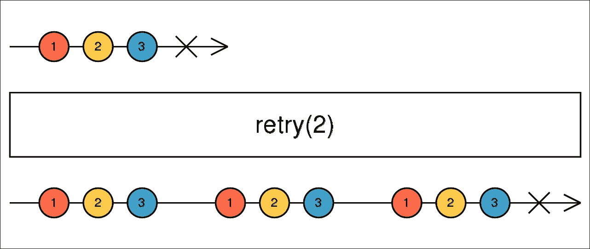
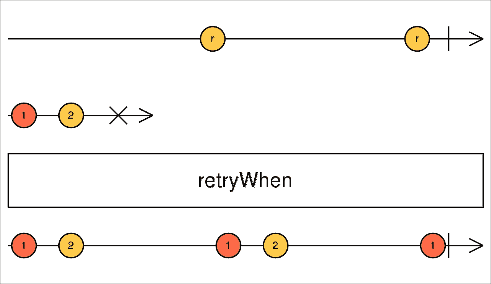
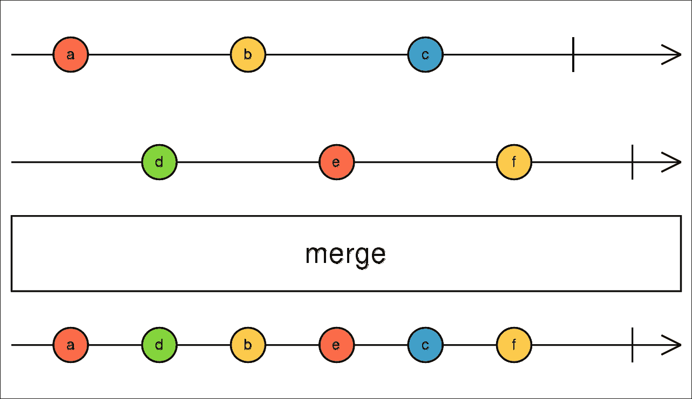
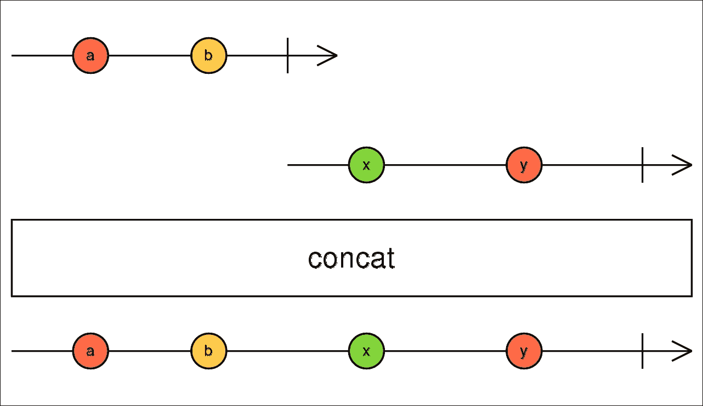
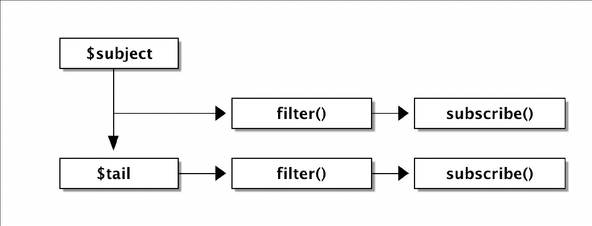
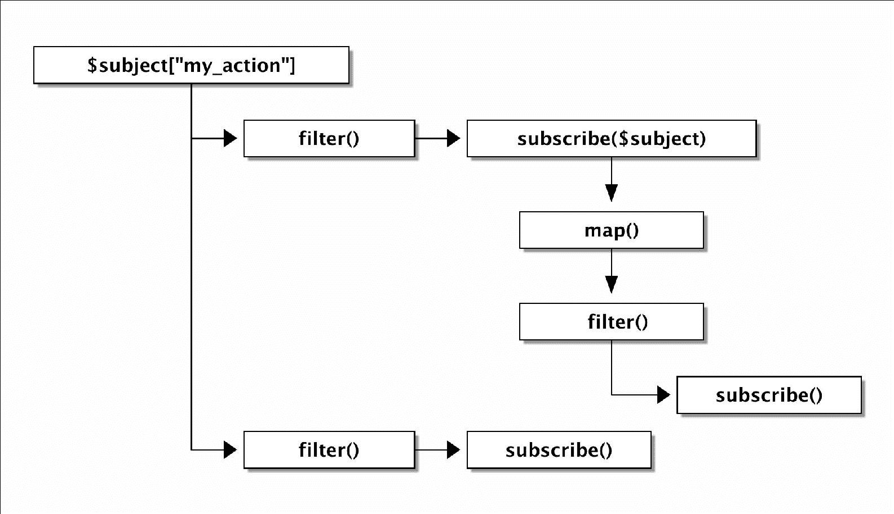

# 第四章。响应式与典型的事件驱动方法

到目前为止，我们主要关注 CLI 应用程序。在本章中，我们将把我们已经学到的知识应用到所有 Web 框架的典型组件中，并在此基础上增加一些内容。我们将使用 Symfony 的`EventDispatcher`组件，这是一个可以在任何框架中使用的独立库。

它的主要目的是在应用程序的生命周期中派发事件，并且易于扩展。最值得注意的是，它是 Symfony3 框架和 Silex 微框架的核心构建块。

在本章中，我们将做以下事情：

+   查看 RxPHP 中的错误处理，并解释`retry()`、`retryWhen()`和`catchError()`操作符。我们将看到这三个操作符如何与我们之前章节中讨论的内容相关联。

+   我们将看到如何使用`concat()`和`merge()`操作符组合两个 Observables。然后我们还将看看`concatMap()`及其与有序 HTTP 请求的非常常见的用例。

+   使用示例快速介绍`EventDispatcher`组件。

+   编写一个默认`EventDispatcher`类的替代品，称为`ReactiveEventDispatcher`，它基于默认的`EventDispatcher`，并使用 RxPHP 的响应式方法。

+   看看我们如何使用 Subjects 动态构建 Observable 链。

+   使用 Observables 而不是闭包作为事件监听器来增强我们的事件派发器实现。

+   在介绍默认`EventDispatcher`时使用的相同示例上测试我们的事件派发器实现。

在我们深入探讨`EventDispatcher`组件之前，我们也应该谈谈如何在操作符链中处理错误状态。

我们已经在第二章，*使用 RxPHP 进行响应式编程*中与`onError`处理程序一起工作过，例如。然而，我们还没有看到如何优雅地恢复错误以及这些可能带来的意外影响。

# 在操作符链中处理错误状态

如果我们回到第二章，*使用 RxPHP 进行响应式编程*和`CURLObservable`，我们知道当它无法下载任何数据时会发出`onError`。问题是，如果我们想再次尝试下载 URL 怎么办？甚至更有趣的是，每隔几秒重复失败的尝试。

使用`subscribeCallback()`方法的第二个参数仅订阅`onError`信号非常简单：

```php
(new CURLObservable('https://example.com')) 
    ->subscribeCallback(null, function($e) { ... }); 

```

显然，将另一个`CURLObservable`嵌套到`onError`处理程序中可能不是一个选择。这正是`retry()`操作符的设计目的。

## retry()操作符

当 `retry()` 操作符收到 `onError` 信号时，它会捕获它并尝试重新订阅其源 Observable。它将尝试重新订阅的次数作为参数，直到它将错误信号传递到操作符链。

让我们用 `retry()` 操作符重写前面的例子：

```php
(new CURLObservable('https://example.com')) 
    ->retry(3) 
    ->subscribe(new DebugSubject()); 

```

这尝试重新订阅 `CURLObservable` 三次，直到 `DebugSubject` 收到 `onError` 信号。默认情况下，`retry()` 操作符不接收任何参数，并无限尝试重新订阅。

好吧，在第三方网络服务上测试错误状态并不方便，因为我们无法强制它返回错误状态。因此，从现在开始，我们最好使用 `map()` 操作符来触发 `onError` 信号。

优势在于，`map()` 操作符在其 `try...catch` 块中调用其可调用包装器，因此任何抛出的异常都将转换为 `onError` 信号：

```php
// snippet from Rx\Operator\MapOperator class 
try { 
    $value = call_user_func_array($this->selector, [$nextValue]); 
} catch (\Exception $e) { 
    $observer->onError($e); 
} 

```

考虑以下代码，它本应打印从 `1` 到 `6` 的数字，但每次在数字 `3` 处都会失败：

```php
// retry_01.php 
Observable::range(1, 6) 
    ->map(function($val) { 
        if ($val == 3) { 
            throw new \Exception('error'); 
        } 
        return $val; 
    }) 
    ->retry(3) 
    ->subscribe(new DebugSubject()); 

```

现在，在查看实际输出之前，试着猜测会发生什么，并记住我们在 第三章，*使用 RxPHP 编写 Reddit 阅读器*，在名为 *操作符链的深入探讨* 和 *观察者订阅的深入探讨* 的部分中讨论的内容：

```php
$ php retry_01.php
09:18:32 [] onNext: 1 (integer)
09:18:32 [] onNext: 2 (integer)
09:18:32 [] onNext: 1 (integer)
09:18:32 [] onNext: 2 (integer)
09:18:32 [] onNext: 1 (integer)
09:18:32 [] onNext: 2 (integer)
09:18:32 [] onError (Exception): error

```

它只打印数字 `1` 和 `2` 三次，然后以 `onError` 结束。

起初可能会让人困惑的是，常识告诉我们预期这段代码会打印出数字 `1`、`2`、`4`、`5` 和 `6`。数字 `3` 抛出异常，但多亏了 `retry()` 操作符，它继续下一个值。

然而，情况并非如此，因为 `retry()` 重新订阅其源 Observable，并且发出 `onError` 信号总是会使链停止传播更多值。在 第三章，*使用 RxPHP 编写 Reddit 阅读器* 中，我们看到了订阅一个 Observable 会触发生成整个 Observable 链，这些 Observable 按照它们定义的顺序相互订阅。最后，它订阅了开始发出值的源 Observable。

我们在这里遇到了完全相同的情况。当 `map()` 操作符发出 `onError` 信号时，由于 `retry()` 操作符的存在，它会立即重新订阅，然后 `retry()` 操作符会重新订阅到 `RangeObservable` 并从开始处开始发出值。

这通过以下操作符的宝石图得到了很好的展示（注意红色和黄色的宝石）：



表示 retry() 操作符的宝石图，来自 http://reactivex.io/documentation/operators/retry.html

如果我们想要模拟一个从 1 到 6 的数字（除了数字 3）的情况，我们可以创建一个外部变量 `$count` 并递增它，而不是依赖于来自 `RangeObservable` 的值。为了停止发出值，我们可以使用 `takeWhile()`，当其可调用返回 `false` 时，它会调用 `onCompleted`：

```php
// retry_05.php 
$count = 0; 
Rx\Observable::range(1, 6) 
    ->map(function($val) use (&$count) { 
        if (++$count == 3) { 
            throw new \Exception('error'); 
        } 
        return $count; 
    }) 
    ->retry(3) 
    ->takeWhile(function($val) { 
        return $val <= 6; 
    }) 
    ->subscribe(new DebugSubject()); 

```

输出结果正如我们所预期的：

```php
$ php retry_05.php
14:18:01 [] onNext: 1 (integer)
14:18:01 [] onNext: 2 (integer)
14:18:01 [] onNext: 4 (integer)
14:18:01 [] onNext: 5 (integer)
14:18:01 [] onNext: 6 (integer)
14:18:01 [] onCompleted

```

### CURLObservable 和 retry() 操作符

我们可以创建一个更接近真实世界应用的简单测试场景。我们将使用我们的 CURLObservable 并尝试重复进行三次 HTTP 请求。我们将选择任何不存在的 URL 以确保每次都失败，以便查看在使用 `retry()` 时错误是如何通过操作符链传播的：

```php
// retry_04.php 
Rx\Observable::defer(function() { 
        echo "Observable::defer\n"; 
        return new CurlObservable('https://example.com123'); 
    }) 
    ->retry(3) 
    ->subscribe(new DebugSubject()); 

```

我们已经在 第三章 中看到了 `Observable::defer()` 静态方法，*使用 RxPHP 编写 Reddit 读者*。我们在这里使用它来显示 `retry()` 操作符会导致重新订阅到源 Observable。

此示例将以下输出打印到控制台：

```php
$ php retry_04.php 
Observable::defer()
Observable::defer()
Observable::defer()
13:14:20 [] onError (Exception): Unable to download https://ex...

```

我们可以看到错误（实际上是一个异常）在达到 `DebugSubject` 之前经过了三次迭代。

## retryWhen() 操作符

与 `retry()` 类似，还有一个名为 `retryWhen()` 的操作符，与 `retry()` 不同的是，它不会立即重新订阅。操作符 `retryWhen()` 将一个可调用参数作为参数，该参数返回另一个 Observable。然后，当发生 `onError` 信号时，使用此 Observable 来安排重新订阅。



表示 retryWhen() 操作符的宝石图，来自 http://reactivex.io/rxjs/class/es6/Observable.js~Observable.html#instance-method-retryWhen

### CURLObservable 和 retryWhen() 操作符

例如，我们可以再次考虑我们的 `CURLObservable` 并想象我们希望在延迟一秒后重复失败的请求。由于 `retryWhen()` 的功能稍微复杂一些，我们将从一个示例开始：

```php
// retry_when_01.php 
$loop = new \React\EventLoop\StreamSelectLoop(); 
$scheduler = new \Rx\Scheduler\EventLoopScheduler($loop); 

(new CURLObservable('https://example.com123')) 
    ->retryWhen(function($errObs) use ($scheduler) { 
        $notificationObs = $errObs 
            ->delay(1000, $scheduler) 
            ->map(function() { 
                echo "\$notificationObs\n"; 
                return true; 
            }); 
        return $notificationObs; 
    }) 
    ->subscribe(new DebugSubject(), $scheduler); 

$scheduler->start(); 

```

### 注意

我们需要使用事件循环来安排 `delay()` 操作符。

传递给 `retryWhen()` 的可调用参数是一个 Observable，并且必须返回一个 Observable。然后，当发生错误信号时，它作为 `onNext` 推送到 `$errObs`，这样我们就可以根据错误的类型决定我们想要做什么。根据返回的 `$notificationObs` 的发射，我们可以控制接下来会发生什么：

+   `onNext`：当 `$notificationObs` 发出 `onNext` 信号时，`retryWhen()` 操作符会重新订阅到其源 Observable。请注意，发出的值并不重要。

+   `onError`：错误会进一步传播到操作符链。

+   `onComplete`：`onComplete` 信号会进一步传播到操作符链。

前面的例子所做的事情应该是显而易见的。当 `CURLObservable` 失败（发出 `onError`）时，`retryWhen()` 操作符会等待一秒钟，多亏了 `delay()` 操作符，然后重新订阅，这将使 CURLObservable 无限期地再次尝试下载 URL。此示例的输出如下所示：

```php
$ php retry_when_01.php
onNext
onNext
onNext
...

```

由于 `retryWhen()` 操作符稍微复杂一些，我们可以查看其内部结构来理解它为什么能按这种方式工作：

+   它创建了一个 `Subject` 实例并将其引用存储在一个名为 `$errors` 的变量中。Subjects 同时作为 Observables 和观察者工作。它需要使用 Subject，因为它很重要，能够手动触发信号，如 `onNext`，而仅仅使用 Observables 是不可能的。

+   当操作符调用其可调用函数时，它会传递 `$errors->asObservable()` 并期望接收一个 Observables，该 Observables 存储在另一个变量中，称为 `$when`。`asObservable()` 方法用 `AnonymousObservable` 包装 Subject，因此隐藏了它实际上是一个 `Subject` 实例的事实。

+   然后，`CallbackObserver` 订阅了 `$when`，它稍后可以重新订阅此操作符的源 Observables。

+   这意味着我们有 Observables 链的“头部”和“尾部”分别存储在变量 `$errors` 和 `$when` 中。

+   之后，当接收到 `onError` 信号时，操作符会调用 `$errors->onNext()`，这会将值通过 Observables 的链式传递。在我们的例子中，它通过 `delay()` 操作符。

如果我们将前面的点重写为实际的、高度简化的代码，它看起来会像以下这样：

```php
$errors = new Subject(); 
$when = call_user_func($callable, $errors->asObservable()); 

$subscribe = function() use ($observable, $observer, $errors) { 
    $observable->subscribe(new CallbackObserver( 
        [$observer, 'onNext'], 
        function() use ($errors) { 
            $errors->onNext($errors); 
        }), 
        [$observer, 'onCompleted'] 
    ); 
}; 
$when->subscribe(new CallbackObserver(function() use ($subscribe){ 
    $subscribe(); 
})); 

$subscribe(); 

```

这个操作符不关心 `onNext` 或 `onComplete`，而是直接将它们传递给 `$observer`。它需要处理的唯一信号是 `onError`，该信号会调用 `$errors->onNext()`，从而触发 Observables 的链式调用，最终在 `$when->subscribe()` 可调用内部重新订阅源 Observables。

使用 `Subject` 实例来手动触发信号并同时订阅观察者的这种技术非常有用。我们将在实现事件分发器时使用它。

### CURLObservable 和受控的重试次数

当讨论 `retry()` 操作符时，我们做了一个演示，尝试下载一个 URL 三次，然后失败。重试次数被固定为 3。

我们可以使用 `retryWhen()` 操作符创建相同的示例，同时如果我们想要重试 HTTP 请求，我们可以有更多的控制。考虑以下示例，我们尝试下载一个 URL 三次，然后进一步传播错误：

```php
// retry_when_02.php 
use Rx\Observable; 
$loop = new \React\EventLoop\StreamSelectLoop(); 
$scheduler = new \Rx\Scheduler\EventLoopScheduler($loop); 

(new CURLObservable('https://example.com123')) 
    ->retryWhen(function($errObs) use ($scheduler) { 
        echo "retryWhen\n"; 
        $i = 1; 
        $notificationObs = $errObs 
            ->delay(1000, $scheduler) 
            ->map(function(Exception $val) use (&$i) { 
                echo "attempt: $i\n"; 
                if ($i == 3) { 
                    throw $val; 
                } 
                $i++; 
                return $val; 
            }); 

        return $notificationObs; 
    }) 
    ->subscribe(new DebugSubject(), $scheduler); 

$loop->run(); 

```

在这个示例中，我们尝试了三次，每次延迟一秒然后重新抛出异常，该异常被 `map()` 操作符捕获并作为 `onError` 信号传递。由于 `$notificationObs` 发送了 `onError` 信号，`retryWhen()` 操作符将此错误进一步传递，正如之前解释的那样。我们还打印了字符串 `retryWhen` 来证明即使有多次重试，可调用函数也只被调用一次。

这个示例的输出如下：

```php
$ php retry_when_02.php
retryWhen
attempt: 1
attempt: 2
attempt: 3
14:36:13 [] onError (Exception): Unable to download https://ex...

```

这个演示有趣的地方在于它根本不需要以错误结束。我们可以使用 `$notificationObs` 来发出 `onComplete` 信号。

内部可调用函数可能看起来像以下代码：

```php
// retry_when_03.php 
... 
$notificationObs = $errObs 
    ->delay(1000, $scheduler) 
    ->map(function(Exception $val) use (&$i) { 
        echo "attempt: $i\n"; 
        $i++; 
        return $val; 
    }) 
    ->take(3); 
... 

```

与前一个示例相比，我们不是重新抛出异常，而是只发出 `onComplete`：

```php
$ php retry_when_03.php 
retryWhen
attempt: 1
attempt: 2
attempt: 3
15:30:01 [] onCompleted

```

这可能在即使多次失败重试也不一定意味着错误状态的情况下很有用。

## catchError() 操作符

操作符 `catchError()` 也只处理错误信号。当它收到一个 `onError` 时，它会调用一个返回 Observable 的可调用函数，然后使用该 Observable 来继续 Observable 序列，而不是源 Observable。

考虑以下示例：

```php
use Rx\Observable; 
Observable::range(1,6) 
    ->map(function($val) { 
        if ($val == 3) { 
            throw new Exception(); 
        } 
        return $val; 
    }) 
    ->catchError(function(Exception $e, Observable $sourceOb) { 
        return Observable::just(42); 
    }) 
    ->subscribe(new DebugSubject()); 

```

在这个示例中，`onError` 信号被 `catchError()` 捕获，并且由于 `Observable::just()`，它继续以单个值结束整个 Observable 序列，然后以 `onComplete` 结束：

```php
$ php catch_01.php 
06:43:04 [] onNext: 1 (integer)
06:43:04 [] onNext: 2 (integer)
06:43:04 [] onNext: 42 (integer)
06:43:04 [] onCompleted

```

# concat() 和 merge() 操作符

使用 `retry()` 和 `retryWhen()`，我们遇到了一些接受其他 Observables 作为参数并处理它们的发射的算子。将多个 Observables 合并成一个单一的链是 RxJS 中的常见做法，这主要是由于 JavaScript 设计上的异步性质。在 RxPHP 中，我们并不经常使用它们，但快速看一下它们是值得的。

## merge() 操作符

为了将两个 Observables 合并成一个单一的 Observable，该 Observable 发射来自它们的所有值（包括 `onError` 信号），我们可以使用 `merge()` 操作符。



来自 http://reactivex.io/rxjs/class/es6/Observable.js~Observable.html#static-method-merge 的 merge() 操作符的宝石图

如我们从宝石图中可以看到，这个操作符重新发射来自源和合并的 Observables 的值。这意味着它订阅了它们两个，并且随着它们的到达而发射值。

为了更好地理解它是如何工作的，我们可以用一个简单的示例来演示，其中包含两个间隔 Observables，每个间隔以不同的延迟发射三个值：

```php
// merge_01.php 
use Rx\Observable; 
$loop = new \React\EventLoop\StreamSelectLoop(); 
$scheduler = new \Rx\Scheduler\EventLoopScheduler($loop); 

$merge = Observable::interval(100) 
    ->map(function($value) { 
        return 'M' . $value; 
    }) 
    ->take(3); 

$source = Observable::interval(300) 
    ->map(function($value) { 
        return 'S' . $value; 
    }) 
    ->take(3) 
    ->merge($merge) 
    ->subscribe(new DebugSubject(), $scheduler); 

$loop->run(); 

```

`$merge` Observable 发射其值的速度比 `$source` 快。我们还为每个值添加前缀以标记其来源，所以这个示例的输出如下：

```php
$ php merge_01.php
22:00:28 [] onNext: M0 (string)
22:00:28 [] onNext: M1 (string)
22:00:28 [] onNext: S0 (string)
22:00:28 [] onNext: M2 (string)
22:00:29 [] onNext: S1 (string)
22:00:29 [] onNext: S2 (string)
22:00:29 [] onCompleted

```

我们可以看到值被混合在一起。然而，当两个 Observables 都完成时，只有一个 `onComplete` 信号，所以整体上它表现得像一个单一的 Observable。

## concat() 操作符

与`merge()`相反，有时我们可能想要合并两个 Observable，但首先发出第一个 Observable 的所有值，当它完成时，订阅第二个 Observable 并发出其所有值。因此，也存在`concat()`操作符：



表示 concat()操作符的宝石图，来自 http://reactivex.io/rxjs/class/es6/Observable.js~Observable.html#instance-method-concat

我们可以拿与`merge()`相同的例子，只需将`merge()`操作符切换为`concat()`：

```php
// concat_01.php 
use Rx\Observable; 
$loop = new \React\EventLoop\StreamSelectLoop(); 
$scheduler = new \Rx\Scheduler\EventLoopScheduler($loop); 

$concat = Observable::interval(100) 
    ->map(function($value) { 
        return 'C' . $value; 
    }) 
    ->take(3); 

$source = Observable::interval(300) 
    ->map(function($value) { 
        return 'S' . $value; 
    }) 
    ->take(3) 
    ->concat($concat) 
    ->subscribe(new DebugSubject(), $scheduler); 

$loop->run(); 

```

由于`concat()`应该订阅源 Observable 并依次连接其他 Observable，因此我们预期首先接收到源 Observable 的所有值，当它完成时，再接收到`$concat` Observable 的所有值。

```php
$ php concat_01.php 
22:25:45 [] onNext: S0 (string)
22:25:45 [] onNext: S1 (string)
22:25:46 [] onNext: S2 (string)
22:25:46 [] onNext: C0 (string)
22:25:46 [] onNext: C1 (string)
22:25:46 [] onNext: C2 (string)
22:25:46 [] onCompleted

```

即使连接的 Observable 比源 Observable 更快地发出值，但其值仍然跟在源 Observable 的所有值之后。

## concatMap()和 flatMap()操作符

`merge()`和`concat()`操作符都有它们的`*map()`变体。特别是这些是`flatMap()`和`concatMap()`。这些操作符结合了`merge()`/`concat()`和`map()`操作符的功能。如果我们看看我们刚才做的两个例子，我们会看到我们需要事先知道内部 Observable。这意味着内部 Observable 在创建 Observable 链时被传递给`concat()`/`merge()`一次。

我们将选择两个操作符中的一个，并通过一个示例来解释其优点。

让我们假设我们想要依次进行三个 HTTP 请求。这看起来像是`concat()`操作符的理想用例。然而，每个请求都将依赖于前一个请求的结果，因此我们需要使用`concatMap()`，因为它的可调用参数是源 Observable 的当前值，并返回一个将被连接到链中的 Observable：

```php
// concat_map_01.php 
use Rx\Observable; 

function createCURLObservable($num) { 
    $url = 'http://httpbin.org/get?num=' . $num; 
    echo "$url\n"; 
    return (new CURLObservable($url)) 
        ->filter(function($response) { 
            return is_string($response); 
        }); 
} 

$source = Observable::emptyObservable() 
    ->concat(createCURLObservable(rand(1, 100))) 
    ->concatMap(function($response) { 
        $json = json_decode($response, true); 
        return createCURLObservable(2 * $json['args']['num']); 
    }) 
    ->concatMap(function($response) { 
        $json = json_decode($response, true); 
        return createCURLObservable(2 * $json['args']['num']); 
    }) 
    ->subscribe(new DebugSubject()); 

```

我们正在使用[`httpbin.org/get`](http://httpbin.org/get)网络服务，它作为测试服务器，并将我们发送的请求作为 JSON 字符串返回。

我们使用`Observable::emptyObservable()`创建一个立即完成的空 Observable，并将其与一个`concat()`和两个`concatMap()`操作符连接起来。然后，每个`concatMap()`解码前一个请求的 JSON，将其`num`参数乘以 2，并重新发送 HTTP 请求。

然后，从控制台输出中，我们可以看到请求是按顺序调用的，并且在`concat()`操作符调用中创建的随机`num`参数在每次请求中都会乘以 2：

```php
$ php concat_map_01.php
http://httpbin.org/get?num=51
http://httpbin.org/get?num=102
http://httpbin.org/get?num=204
22:54:37 [] onNext: {
 "args": {
 "num": "204"
 }, 
 "headers": {
 "Accept"... (string)
22:54:37 [] onCompleted

```

使用`flatMap()`，例子将是相同的。然而，由于 PHP 不像 JavaScript 那样是异步的，`flatMap()`操作符在这个特定用例中并不那么有用。

我们将在第六章中查看更多结合多个 Observables 的操作符，*PHP Streams API 和 Higher-Order Observables*。

# 编写响应式事件派发器

Symfony 的`EventDispatcher`组件是一个用于在对象之间交换消息的 PHP 库。它基于中介者设计模式（[`en.wikipedia.org/wiki/Mediator_pattern`](https://en.wikipedia.org/wiki/Mediator_pattern)），其实现相对简单。

一个非常常见的场景是我们有一个想要通过插件扩展的应用程序。在这种情况下，我们会创建一个`EventDispatcher`的单例实例，并让插件监听各种事件。每个事件都是一个对象，它可以持有对其他对象的引用。这正是 Symfony3 框架所广泛使用的。

## 事件派发器快速入门

如果你还没有这样做，请通过`composer`安装事件派发器组件：

```php
$ composer require symfony/event-dispatcher

```

首先，我们将查看默认实现的实际使用方法，这样我们就可以稍后将其与我们的响应式实现进行比较，并检查从开发者的角度来看，两者是否都能正常工作，尽管内部实现不同。

### 与事件监听器一起工作

在最基本的情况下，我们只想设置几个监听器并派发事件：

```php
// event_dispatcher_01.php  
use Symfony\Component\EventDispatcher\EventDispatcher; 
use Symfony\Component\EventDispatcher\Event; 

$dispatcher = new EventDispatcher(); 
$dispatcher->addListener('my_action', function() { 
    echo "Listener #1\n"; 
}); 
$dispatcher->addListener('other_action', function() { 
    echo "Other listener\n"; 
}); 
$dispatcher->addListener('my_action', function() { 
    echo "Listener #2\n"; 
}); 

$dispatcher->dispatch('my_action'); 

```

我们为两个不同的事件`my_action`和`other_action`创建了三个事件监听器。然后，通过`$dispatcher->dispatch()`，我们告诉事件派发器通知所有事件监听器，事件`my_action`已经发生。

控制台中的输出应该是明显的：

```php
$ php event_dispatcher_01.php  
Listener #1 
Listener #2 

```

`dispatch()`方法接受一个可选的第二个参数，该参数是一个`Event`类的实例，它可以包含有关事件的更多信息。如果需要，事件监听器也可以修改事件数据。此外，所有可调用对象都恰好接受一个事件对象作为参数，该参数来自对`dispatch()`方法的初始调用。由于我们没有提供任何事件对象，我们的可调用对象不需要接受任何参数。

注意，事件派发器不需要知道它支持哪些事件，因为它们是即时创建的。这也意味着你可能会意外地尝试派发一个不存在的事件：

```php
$dispatcher->dispatch('foo_my_action'); 

```

这不会引发错误，但不会派发任何事件。

`EventDispatcher`类支持两个重要的特性：

+   **优先级**：默认情况下，监听器按照它们订阅事件派发器的顺序执行。我们可以通过向`addListener()`方法提供一个带有特定监听器优先级的第三个参数来改变这种行为（默认为 0）。优先级较高的监听器会先执行。如果多个监听器具有相同的优先级，那么它们的添加顺序就很重要了。

+   **停止事件传播**：在某些场景中，能够停止将特定事件传播给后续监听器是很重要的。因此，`Event`类有一个名为`stopPropagation()`的方法。然后事件派发器负责不再传播此事件。

这两个特性可以用于以下情况：

```php
// event_dispatcher_02.php  
$dispatcher = new EventDispatcher(); 

$dispatcher->addListener('my_action', function(Event $event) { 
    echo "Listener #1\n"; 
}); 
$dispatcher->addListener('my_action', function(Event $event) { 
    echo "Listener #2\n"; 
    $event->stopPropagation(); 
}, 1); 

$dispatcher->dispatch('my_action', new Event()); 

```

第一个事件监听器应该在第二个监听器之后被调用，因为它具有更高的优先级，但它使用 `$event->stopPropagation()` 停止进一步传播此事件，所以它永远不会被调用。

控制台输出非常简短：

```php
$ php event_dispatcher_02.php
Listener #2

```

### 与事件订阅者一起工作

虽然 `addListener()` 订阅单个事件监听器，但还有一个 `addSubscriber()` 方法，它接受一个实现 `EventSubscriberInterface` 的类的实例，并一次性订阅多个事件。实际上，`addSubscriber()` 使用 `addListener()` 内部添加监听器。有时将所有监听器包装到一个类中比逐个添加它们要简单得多。

在本章的整个内容和即将到来的示例中，我们还将使用一个自定义的 `Event` 类，以便正确测试默认和我们的响应式实现是否工作相同。

首先，让我们声明我们的事件类：

```php
// MyEvent.php 
use Symfony\Component\EventDispatcher\Event; 

class MyEvent extends Event { 
  private $name; 
  private $counter = 0; 

  public function __construct($name = null, $counter = 0) { 
    $this->name = $name; 
    $this->counter = $counter; 
  } 
  public function getCounter() { 
    return $this->counter; 
  } 
  public function inc() { 
    $this->counter++; 
  } 
  public function __toString() { 
    return sprintf('%s (%d)', $this->name, $this->counter); 
  } 
} 

```

这是一个相当简单的类。我们将使用 `inc()` 方法来验证所有监听器都使用相同的 `MyEvent` 实例。我们还使用了 `__toString()` 魔法方法，这样我们就可以通过类型转换将这个类转换为字符串。

现在，为了演示目的，我们将声明一个具有三个事件监听器的 `MyEventSubscriber` 类：

```php
// MyEventSubscriber.php 
use Symfony\Component\EventDispatcher\EventDispatcher; 
use Symfony\Component\EventDispatcher\Event; 
use Symfony\Component\EventDispatcher\EventSubscriberInterface; 

class MyEventSubscriber implements EventSubscriberInterface { 
  public static function getSubscribedEvents() { 
    return [ 
      'my_action' => [ 
        ['onMyActionA'], 
        ['onMyActionAgain', 1], 
      ], 
      'other_action' => 'onOtherAction', 
    ]; 
  } 

  public function onMyActionA(MyEvent $event) { 
    $event->inc(); 
    echo sprintf('Listener [onMyAction]: %s\n', $event); 
  } 

  public function onMyActionAgain(MyEvent $event) { 
    $event->inc(); 
    echo sprintf('Listener [onMyActionAgain]: %s\n', $event); 
  } 

  public function onOtherAction(Event $event) { } 
} 

```

`EventSubscriberInterface` 接口只需要一个静态方法 `getSubscribedEvents()`，它返回一个包含事件名称及其相应可调用对象的关联数组。

这个示例类声明了两个监听器用于 `my_action` 事件（第二个监听器的优先级高于第一个）和一个监听器用于 `other_action` 事件。

订阅到这个类的方式与订阅监听器的方式相同：

```php
$dispatcher = new EventDispatcher(); 
$dispatcher->addSubscriber(new MyEventSubscriber()); 
$dispatcher->dispatch('my_action', new MyEvent('my-event')); 

```

这次，示例还打印了事件的字符串表示：

```php
$ php event_dispatcher_03.php 
Listener [onMyActionAgain]: my-event (1)
Listener [onMyAction]: my-event (2)

```

这是我们需要处理的另一件事，因为我们希望允许在事件订阅者类中定义事件观察者。

现在我们知道了默认的 `EventDispatcher` 类如何使用以及它应该满足哪些用例。我们的目标将是基于 RxPHP 和响应式编程编写我们自己的实现。

## 使用 RxPHP 编写 ReactiveEventDispatcher

事件调度器需要实现一个 `EventDispatcherInterface` 接口，该接口定义了我们之前看到的所有方法，我们还将添加一些更多。幸运的是，我们可以重用默认 `EventDispatcher` 类的大部分内容。例如，`removeListener()` 或 `removeSubscriber()` 方法将无需任何修改即可工作。

### 事件监听器作为观察者的内部表示

原始的 `EventDispatcher` 有一个非常简单的任务。在 `dispatch()` 调用中，它只是根据优先级对特定事件的监听器数组进行排序，并逐个评估它们，在一个循环中：

```php
// snippet from Symfony\Component\EventDispatcher\EventDispatcher 
foreach ($listeners as $listener) { 
    if ($event->isPropagationStopped()) { 
        break; 
    } 
    call_user_func($listener, $event, $eventName, $this); 
} 

```

在我们的例子中，我们将所有事件监听器表示为观察者。实际上，当我们添加一个新的事件监听器时，我们会将其可调用对象转换为观察者。然后，在调用 `dispatch()` 时，我们将创建一个包含所有观察者的可观察对象链，这些观察者已经订阅在特定的点上。当然，我们还需要自己处理 `isPropagationStopped()` 条件。

例如，让我们考虑事件分发器的最简单用法，如之前所示：

```php
$dispatcher->addListener('my_action', function() { 
    echo "Listener #1\n"; 
}); 
$dispatcher->addListener('my_action', function() { 
    echo "Listener #2\n"; 
}); 

```

我们必须将这些两个事件监听器转换成一个可观察对象链，同时确保在执行每个事件监听器之前，检查事件对象是否设置了停止传播标志：

```php
// reactive_dispatcher_03.php 
$subject = new Subject(); 

$tail = $subject->filter(function(Event $event) { 
    return !$event->isPropagationStopped(); 
}); 
$tail->subscribe(new CallbackObserver(function(Event $event) { 
    echo "Listener #1\n"; 
    $event->stopPropagation(); 
})); 

$tail = $tail->filter(function(Event $event) { 
    return !$event->isPropagationStopped(); 
}); 
$tail->subscribe(new CallbackObserver(function(Event $event) { 
    echo "Listener #2\n"; 
})); 

$subject->onNext(new Event()); 

```

我们在这里使用 Subject 的原因与我们在本章前面解释 `retryWhen()` 操作符时相同。不过，让我们更详细地解释这段代码：

+   `$subject` 变量持有对 "链头" 的可观察对象链的引用

+   `$tail` 变量始终持有对链中最后一个可观察对象的引用。这是我们进一步链式连接更多可观察对象的地方，也是我们附加 `filter()` 操作符以检查停止事件的地方。

+   当我们想要分发一个事件时，我们只需调用 `$subject->onNext()`。

为了更清楚地表示当前的可观察对象链，我们可以将其表示为一个树结构：



现在我们只需要将这些内容转换成一个真正的 PHP 类。

## 编写 ReactiveEventDispatcher 类

好事是，我们可以实际重用 `EventDispatcher` 中已经编写的大量逻辑，只需覆盖需要以不同方式工作的某些方法。

首先，我们将简单地写一个类占位符来看看前方等待着我们的是什么，并对每个方法进行简要说明：

```php
// ReactiveEventDispatcher.php 
class ReactiveEventDispatcher extends EventDispatcher { 
  /** 
   * @var Subject[]; 
   */ 
  private $subjects = []; 

  public function dispatch($eventName, Event $event = null) {} 

  public function addListener($eventName, $listener, $prio=0) {} 

  public function addObservable($eventName, $create, $prio=0) {} 

  public function addSubscriber($subscriber) {} 

  private function observerFromListener($listener) {} 

  private function getSubject($eventName) {} 
} 

```

只有 `EventDispatcher` 中的 `dispatch()`、`addListener()` 和 `addSubscriber()` 方法需要重写；其余的可以保持原样。我们还添加了三个额外的方法来帮助我们处理可观察对象。

让我们看看每个组件的作用：

+   `$subjects`: 一个关联数组，持有对所有可观察对象链头（它们的主题）的引用。

+   `addListener()`: 我们已经从之前的例子中知道了这个方法。然而，现在这个方法也接受观察者作为事件监听器。

+   `addObservable()`: 这是一个方法，允许我们将一个可观察对象追加到由 `getSubject()` 生成的可观察对象链的特定点上。

+   `addSubscriber()`: 这个方法使用订阅类订阅多个事件。它使用 `addObserver()` 方法。

+   `dispatch()`: 这个方法接受特定事件的 `Subject` 实例，并使用事件对象作为参数调用 `onNext()`。

+   `observerFromListener()`: 一个辅助方法，将任何监听器转换为观察者。基本上，这只是在每个可调用对象上包装一个 `CallbackObserver` 对象。

+   `getSubject()`：我们的事件调度器将使用 Subjects。这个方法内部按优先级对监听器数组进行排序，并从它们构建一个 Observables 链。它还会在`$subjects`关联数组中保留 Subjects，以便可以轻松重用，而无需在每次`dispatch()`调用时重新创建 Observable 链。

因此，我们对这个事件调度器的工作方式有了相当清晰的了解，我们可以开始实现每个方法。

## 添加事件监听器

前两个方法将是`addListener()`和`observerFromListener()`。第一个方法依赖于第二个，所以我们将同时编写这两个方法：

```php

// ReactiveEventDispatcher.php 
class ReactiveEventDispatcher extends EventDispatcher { 
  /** 
   * @param string $eventName 
   * @param callable|ObserverInterface $listener 
   * @param int $prio 
   * @throws Exception 
   */ 
  public function addListener($eventName, $listener, $prio = 0) { 
    $observer = $this->observerFromListener($listener); 
    parent::addListener($eventName, $observer, $prio); 
    unset($this->subjects[$eventName]); 
  } 

  /** 
   * @param callable|ObserverInterface $listener 
   * @return ObserverInterface 
   */ 
  private function observerFromListener($listener) { 
    if (is_callable($listener)) { 
      return new CallbackObserver($listener); 
    } elseif ($listener instanceof ObserverInterface) { 
      return $listener; 
    } else { 
      throw new \Exception(); 
    } 
  } 

  /* rest of the class */ 
} 

```

### 注意

在本章的其余示例中，我们还将包括每个方法的 doc blocks 和类型提示，以明确它接受的参数。

`observerFromListener()`方法检查`$listener`的运行时类型，并将其始终转换为观察者实例。

`addListener()`方法内部使用`observerFromListener()`，然后以观察者的形式调用其父`addListener()`，尽管它最初只接受可调用对象。父方法通过事件名称和优先级将监听器存储在一个嵌套的关联数组中。由于父代码相当通用，我们不需要对其进行任何修改，因此我们将保持原样。

注意，在我们调用父`addListener()`之后，我们将一个 Subject 从特定的`$subjects`数组中移除。这是因为我们修改了这个事件的 Observable 链，它需要从头开始创建。这发生在稍后调用`dispatch()`方法时。

## 添加 Observables

说到监听器，我们现在也可以实现`addObservable()`，这是`addListener()`的一个稍微修改过的版本。这个方法将不同于`addListener()`的使用方式，因此它值得特别注意：

```php
class ReactiveEventDispatcher extends EventDispatcher { 
  /** 
   * @param string $evtName 
   * @param callable $create 
   * @param int $prio 
   */ 
  public function addObservable($evtName, $create, $prio=0) { 
    $subject = new Subject(); 
    $create($subject->asObservable()); 
    $this->addListener($evtName, $subject, $prio); 
  } 

  /* rest of the class */ 
} 

```

我们创建了一个`Subject`实例并调用`asObservable()`，以便用户定义的可调用对象将其操作符附加到它上。然后我们使用之前解释过的`$subject`变量调用`addListener()`。这同样是我们之前用`retryWhen()`操作符描述过的相同技术。

这个方法很有趣，因为它允许我们添加一个“子链”的 Observables 作为监听器。考虑以下代码：

```php
$dispatcher->addObservable('my_action', function($observable) { 
  $observable 
    ->map(function($value) { return $value; }) 
    ->filter(function($value) { return true; }) 
    ->subscribe(new DebugSubject()); 
}); 

```

如果我们像之前那样将这段代码表示为一个树状结构，在`$dispatcher`内部，它将看起来如下（这个结构是在`getSubject()`方法中稍后生成的）：



事件“my_action”有两个事件监听器

因此，这个事件监听器在其可调用对象中附加了一系列操作符，然后订阅它。在`addObservable()`方法中，我们只传递`$subject`本身到`addListener()`，当调用`dispatch()`时，它将被附加到`filter()`操作符上。这要归功于 Subjects 同时作为观察者工作并可以订阅 Observables 的事实。

这就是编写我们自定义的 `ReactiveEventDispatcher` 的主要好处。我们使用响应式编程以非常直接的方式轻松地操作我们感兴趣的事件。如果我们使用默认的事件派发器，我们就必须在可调用的内部放置所有与监听器相关的特定条件。

## 添加事件订阅者

与原始的 `EventDispatcher` 类似，我们希望能够一次订阅多个监听器到多个事件，使用一个订阅者类。然而，我们还将支持将监听器作为可观察的添加，就像我们在 `addObservable()` 中做的那样。如果没有重载父类的 `addSubscriber()` 方法并以特殊方式处理可观察的，这是无法实现的。

基本上，我们需要调用 `addObservable()` 而不是 `addListener()` 方法：

首先，让我们定义一个接口，我们可以用它来识别一个同时定义了可观察作为监听器的事件订阅者类：

```php
// EventObservableSubscriberInterface.php 
use Symfony\Component\EventDispatcher\EventSubscriberInterface; 

interface EventObservableSubscriberInterface extends  
    EventSubscriberInterface { 
  public static function getSubscribedEventsObservables(); 
} 

```

现在，`addSubscriber()` 可以检查类是否是这个接口的实例，如果是，就将其所有监听器处理成好像它们都是可观察的：

```php
use EventObservableSubscriberInterface as RxEventSubscriber; 
class ReactiveEventDispatcher extends EventDispatcher { 
  /** 
   * @param EventSubscriberInterface $subscriber The subscriber 
   */ 
  public function addSubscriber(EventSubscriberInterface $sub) { 
    parent::addSubscriber($sub); 

    if ($sub instanceof RxEventSubscriber) { 
      $events = $sub->getSubscribedEventsObservables(); 
      foreach ($events as $evt => $params) { 
        if (is_callable($params)) { 
          $this->addObservable($evt, $params); 
        } else { 
          foreach ($params as $listener) { 
            $prio = isset($listener[1]) ? $listener[1] : 0; 
            $this->addObservable($evt, $listener[0], $prio); 
          } 
        } 
      } 
    } 
  } 

  /* rest of the class */ 
} 

```

事件监听器的数组可以定义为一个键为事件名称，值为可调用的数组。然而，我们的实现也支持使用数组值作为另一个数组，定义可调用和优先级（这就是第二个嵌套的 `foreach` 循环）。

在这个方法的开头，我们也调用了其父类，因为我们想允许默认的功能。

为了演示目的，我们将扩展我们之前定义的 `MyEventSubscriber` 类，并实现 `getSubscribedEventsObservables()` 方法，该方法将返回两个事件监听器：

```php
// MyObservableEventSubscriber.php 
use Symfony\Component\EventDispatcher\EventSubscriberInterface; 
use Rx\Observable; 
require_once __DIR__ . '/MyEventSubscriber.php'; 

class MyObservableEventSubscriber extends MyEventSubscriber  
    implements EventObservableSubscriberInterface { 

  public static function getSubscribedEventsObservables() { 
    return [ 
      'my_action' => [ 
        [ 
          function(Observable $observable) { 
            $observable->subscribe(new DebugSubject()); 
          }, 10 
        ], [ 
          function(Observable $observable) { 
            $observable 
              ->subscribe(new DebugSubject()); 
          } 
        ] 
      ], 
      'other_action' => function(Observable $observable) { 
        $observable->subscribe(new DebugSubject()); 
      } 
    ] 
  } 
} 

```

我们为两个不同的事件定义了三个事件监听器，其中第一个 `my_action` 事件的优先级为 `10`，第二个为默认的 `0`。

## 为事件创建可观察链

`getSubject()` 方法是生成可观察链的地方。这个方法仅在派发事件时被调用：

```php
class ReactiveEventDispatcher extends EventDispatcher { 
  /** 
   * @param string $eventName 
   * @return Subject 
   */ 
  private function getSubject($eventName) { 
    if (isset($this->subjects[$eventName])) { 
      return $this->subjects[$eventName]; 
    } 

    $subject = new Subject(); 
    $this->subjects[$eventName] = $subject; 
    $tail = $subject->asObservable(); 

    foreach ($this->getListeners($eventName) as $listener) { 
      $newTail = $tail->filter(function (Event $event) { 
        return !$event->isPropagationStopped(); 
      }); 
      $newTail->subscribe($listener); 
      $tail = $newTail; 
    } 
    return $subject; 
  } 

  /* rest of the class */ 
} 

```

如果这个事件的 Subject 不存在，我们创建一个新的，然后调用 `getListeners()`。这个方法定义在父类 `EventDispatcher` 中，并返回一个按顺序排列的监听器（或观察者，在我们的例子中）数组。然后我们遍历这个数组，添加一个 `filter()` 操作符，然后根据我们是否使用了 `addListener()` 或 `addObservable()` 来订阅观察者或 Subject。

### 注意

注意，操作符（如本例中的 `filter()`）总是返回一个新的可观察对象，而调用 `subscribe()` 则返回一个可丢弃的对象。

我们不需要每次调用这个方法时都创建 `$subject`，因为它在我们添加新的监听器之前不会改变，所以我们可以将其引用保存在 `$subjects` 数组中。

### 比较 filter() 和 takeWhile()

在之前的第三章*使用 RxPHP 编写 Reddit 阅读器*中，我们提到了一个可能比`filter()`更好的操作符。我们使用了`takeWhile()`，它也接受一个谓词可调用参数，并且可以在 Observable 链中停止传播值。

重要的区别是`filter()`操作符决定是否在其关联的观察者上内部调用`onNext()`。另一方面，`takeWhile()`决定是否调用`onComplete()`。调用`onComplete()`会导致调用可丢弃对象，这将取消订阅观察者，这绝对不是我们想要的。如果我们取消订阅，我们就必须在每次`dispatch()`调用时为每个事件创建 Subject。

### 注意

在第八章*RxPHP 和 PHP7 pthreads 扩展中的多播*中，我们将更详细地讨论在`Subject`上调用`onComplete`可能产生的意外后果。

## 分发事件

最后，分发事件非常简单：

```php
class ReactiveEventDispatcher extends EventDispatcher { 
  public function dispatch($eventName, Event $event = null) { 
    if (null === $event) { 
      $event = new Event(); 
    } 
    $subject = $this->getSubject($eventName); 
    $subject->onNext($event); 
    return $event; 
  } 

  /* rest of the class */ 
} 

```

在我们的反应式分发器中分发一个事件意味着获取该特定事件的 Subject 并调用其`onNext()`方法，将事件作为参数。除非调用`stopPropagation()`方法，否则事件会继续传播，因为我们会在调用每个观察者之前使用`filter()`操作符检查其状态。

我们还从方法中返回事件，以保持与默认`EventDispatcher`实现的兼容性。

就这样。我们的`ReactiveEventDispatcher`就完成了，我们可以运行几个测试场景。

## ReactiveEventDispatcher 的实际示例

我们在本章的第一部分专门解释了默认的`EventDispatcher`是如何与 Symfony 的`EventDispatcher`组件一起工作的，以及我们期望它处理的用例。

现在，我们需要确保`ReactiveEventDispatcher`也适用同样的规则。

### 与事件监听器一起工作

我们知道我们的重写`addListener()`方法现在接受可调用和观察者，因此我们可以在一个示例中测试这两种用例：

```php
// reactive_dispatcher_02.php 
$disp = new ReactiveEventDispatcher(); 
$disp->addListener(' my.action ', function(Event $event) { 
  echo "Listener #1\n"; 
}); 
$disp->addListener(' my.action ', new CallbackObserver(function($e) { 
  echo "Listener #2\n"; 
}), 1); 
$disp->dispatch(' my.action ', new Event()); 

```

此示例首先调用第二个监听器，然后调用第一个监听器，因为第二个监听器的优先级更高：

```php
$ php reactive_dispatcher_02.php
Listener #2
Listener #1

```

现在，让我们使用与前面示例中相同的`MyEventSubscriber`类来测试事件订阅者。使用方式和输出完全相同，因此我们不需要再次打印输出：

```php
// reactive_dispatcher_04.php 
$dispatcher = new ReactiveEventDispatcher(); 
$dispatcher->addSubscriber(new MyEventSubscriber()); 
$dispatcher->dispatch('my_action', new MyEvent()); 

addListener() as well.
```

一个稍微修改的例子，它分发多个事件，使用 Observables 并玩弄条件停止事件传播，可能看起来像以下这样：

```php
// reactive_dispatcher_05.php 
$dispatcher = new ReactiveEventDispatcher(); 
$dispatcher->addListener('my_action', function(MyEvent $event) { 
  echo "Listener #1\n"; 
}); 
$dispatcher->addObservable('my_action', function($observable) { 
  $observable 
    ->map(function(MyEvent $event) { 
      $event->inc(); 
      return $event; 
    }) 
    ->doOnNext(function(MyEvent $event) { 
      if ($event->getCounter() % 2 === 0) { 
        $event->stopPropagation(); 
      } 
    }) 
    ->subscribe(new DebugSubject()); 
}, 1); 

foreach (range(0, 5) as $i) { 
  $dispatcher->dispatch('my_action', new MyEvent('my-event', $i)); 
} 

```

其输出是显而易见的。当事件的`getCounter()`方法返回一个可以被 2 整除的数字时，事件会被停止，并且永远不会达到使用`addListener()`添加的第一个事件监听器：

```php
$ php reactive_dispatcher_05.php 
23:27:08 [] onNext: my-event (1) (MyEvent)
Listener #1
23:27:08 [] onNext: my-event (2) (MyEvent)
23:27:08 [] onNext: my-event (3) (MyEvent)
Listener #1
23:27:08 [] onNext: my-event (4) (MyEvent)
23:27:08 [] onNext: my-event (5) (MyEvent)
Listener #1
23:27:08 [] onNext: my-event (6) (MyEvent)

```

### 与事件订阅者一起工作

让我们也测试一下之前定义的事件订阅者`MyObservableEventSubscriber`是否按预期工作：

```php
// reactive_dispatcher_06.php 
$dispatcher = new ReactiveEventDispatcher(); 
$dispatcher->addSubscriber(new MyObservableEventSubscriber()); 
$dispatcher->dispatch('my_action', new MyEvent('my-event')); 

```

记住，我们扩展了原始的`MyEventSubscriber`并添加了两个额外的监听器，因此事件分发器首先添加从`getSubscribedEvents()`返回的监听器，然后添加从`getSubscribedEventsObservables()`返回的监听器：

```php
$ php reactive_dispatcher_06.php
11:14:01 [] onNext: my-event (0) (MyEvent)
Listener [onMyActionAgain]: my-event (1)
Listener [onMyAction]: my-event (2)
11:14:01 [] onNext: my-event (2) (MyEvent)

```

优先级最高的监听器首先被调用。在我们的例子中，是优先级为 10 的第一个 Observable 监听器，然后调用`onMyActionAgain()`，优先级为 1，然后按照添加的顺序调用剩下的两个监听器。

# 摘要

本章主要关注 RxPHP 与典型非响应式代码的实用结合，并提出了对现有基于事件解决方案的不同方法。

具体来说，我们遇到了在 Observable 链中使用`retry()`、`RetryWhen()`和`catch()`操作符进行错误处理的问题。我们将 Observables 与`concat()`、`merge()`和`concatMap()`操作符相结合。我们使用 Subjects 动态创建 Observable 链并手动发出值。我们还介绍了 Symfony 的`EventDispatcher`组件，通过一系列示例展示了默认的`EventDispatcher`类如何使用。我们扩展并部分重写了`EventDispatcher`类，创建了`ReactiveEventDispatcher`，它增加了对 Observables 的支持。最后，我们使用`ReactiveEventDispatcher`重用了`EventDispatcher`的示例，以证明我们的实现可以作为即插即用的替代品。

Symfony 的`EventDispatcher`组件为解决大型应用程序中常见的通信问题和可扩展性问题提供了一个易于实现的解决方案。我们编写了`ReactiveEventDispatcher`来添加使用观察者作为事件监听器的功能。

在下一章中，我们将学习如何编写单元测试来测试 Observables、操作符和观察者。我们还将更深入地了解调度器，并了解它们在测试 RxPHP 代码中的重要性。
