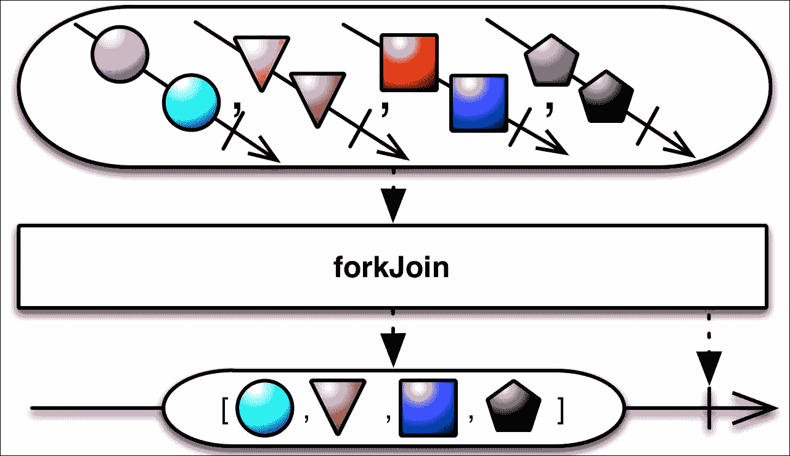

# 第五章：测试 RxPHP 代码

在本章中，我们将开始基于 RxPHP 测试代码。到目前为止，我们只是通过运行代码并观察控制台中的预期输出来进行代码测试。当然，这不是一个非常系统化的方法，因此是时候以自动化的方式开始测试我们的代码了。

更确切地说，在本章中，我们将做以下几件事：

+   介绍`doOn*()`算子

+   开始使用 PHPUnit 库进行单元测试

+   讨论一般性的异步代码测试，并尝试一些常见的陷阱

+   探索 RxPHP 附带用于测试的类，了解如何单独使用它们，以及它们如何融入整个方案中

+   为了演示目的，创建一个`SumObservable`类，该类计算通过的所有整数的总和，并使用 RxPHP 测试工具对其进行测试

+   编写一个简化的`ForkJoinObservable`类并对其进行测试

+   强调在测试 Observables 和算子时关注时间的重要性

本章将非常注重代码，尽管大多数示例都很简单，目的是从单元测试的角度来看待之前章节的内容。虽然具有使用 PHPUnit 进行单元测试的经验会有所帮助，但并非必需。

除了编写单元测试之外，使用`doOn*()`算子调试 Observable 链还有一种非常常见的方法。

# doOn*()算子

在上一章中，我们多次使用了`map()`算子，只是为了将 Observable 链内部发生的事情打印到控制台。然而，这并不方便。`map()`算子总是需要返回一个值，并将其传递到链的下一部分，并且它只能捕获`onNext`信号。

这就是为什么 RxPHP 有几个以`doOn*`为前缀的算子：

+   `doOnNext()`、`doOnError()`、`doOnCompleted()`：每个算子都接受一个参数，当它们接收到相应的信号时执行该参数指定的可调用对象

+   `doOnEach()`: 这个算子接受一个`ObserverInterface`的实例作为参数，并为每个信号执行其处理程序

因此，这些算子与`subscribeCallback()`和`subscribe()`方法非常相似。最大的优势在于`doOn*`算子内部的工作方式。它们永远不会修改通过的价值，只是执行我们的可调用对象，这对于快速调试 Observable 链或执行副作用而不创建订阅（这包括我们在第三章中讨论的与订阅 Observables 相关的一切）是非常理想的。

我们可以通过一个非常简单的例子来看出这一点：

```php
// do_01.php 
use Rx\Observable; 
use Rx\ObserverInterface; 

Observable::create(function(ObserverInterface $obs) { 
        $obs->onNext(1); 
        $obs->onNext(2); 
        $obs->onError(new \Exception("it's broken")); 
    }) 
    ->doOnError(function(\Exception $value) { 
        echo $value->getMessage() . "\n"; 
    }) 
    ->subscribeCallback(function($value) { 
        echo "$value\n"; 
    }, function() {}); 

```

我们有一个单独的订阅者来处理`onNext`和`onError`信号。注意，`onError`处理程序是空的，而`doOnError()`算子会打印异常信息。本例的控制台输出如下：

```php
$ php do_01.php 
1
2
doOnError: it's broken

```

使用剩余的`doOn*()`操作符的方式完全相同。显然，我们不会使用这些操作符来测试 RxPHP 代码，但这些通常是查看我们的 Observables 发出的内容的最简单方式。

### 注意

这些操作符在 RxPHP v2 中已被简化，并且与 RxPHP v2 中的`subscribe()`方法具有相同的签名，即只是`do()`而不是所有变体。其功能保持不变。

# 安装 PHPUnit 包

由于我们将在整本书中通过 composer 安装所有依赖项，因此我们将对 PHPUnit 做同样的事情：

```php
composer require phpunit/phpunit

```

这也在`vendor/bin/phpunit`中创建了一个符号链接，我们将使用它从控制台运行单元测试。

PHPUnit 支持多种安装方式，包括**PHAR**（**PHP 存档**）格式和通过以下方式全局安装：

```php
composer global require phpunit/phpunit

```

### 注意

如果你在安装 PHPUnit 时遇到麻烦，请前往安装说明[`phpunit.de/manual/5.6/en/installation.html`](https://phpunit.de/manual/5.6/en/installation.html)。

然而，除非你有很好的理由使用一个 PHPUnit 的全局实例，否则最好按项目安装。这样我们可以避免处理为不同 PHPUnit 版本编写的单元测试代码的问题。

# 使用 PHPUnit 编写测试的基本知识

我们不会详细介绍如何使用 PHPUnit，而是将其留给其深入的文档（[`phpunit.de/manual/5.6/en/index.html`](https://phpunit.de/manual/5.6/en/index.html)）。然而，为了本章的目的，我们应该快速查看我们将用于测试 RxPHP 代码的一些基础知识。

我们应该遵循一些基本规则：

+   所有针对单个类`MyClass`的测试都应放入一个名为`MyClassTest`的类中，该类应继承自`PHPUnit\Framework\TestCase`。

+   每个测试场景都由一个以`test`为前缀或带有`@test`注解的函数表示。这样，它就可以被 PHPUnit 自动发现。

+   每个测试函数由一个或多个使用`assert*`方法（稍后详细介绍）的断言组成。如果其中任何一个失败，整个测试场景（一个测试函数）将被标记为失败。所有断言都继承自`PHPUnit\Framework\TestCase`。

+   我们可以使用`@depends testname`注解来指定测试场景之间的依赖关系，以改变测试执行的顺序。

因此，让我们编写一个最小化的测试类来演示前面的要点。我们可以将这个测试类命名为`DemoTest`，并且它只需进行几个断言：

```php
// phpunit_01.php 
use PHPUnit\Framework\TestCase; 

class DemoTest extends TestCase { 
    public function testFirstTest() { 
        $expectedVar = 5; 
        $this->assertTrue(5 == $expectedVar); 
        $this->assertEquals(5, $expectedVar); 

        $expectedArray = [1, 2, 3]; 
        $this->assertEquals([1, 2, 3], $expectedArray); 
        $this->assertContains(2, $expectedArray); 
    } 
} 

```

我们使用了三种不同类型的断言。一般来说，所有断言都会比较一个预期的值和一个从测试函数返回的实际值。以下三个断言也是以这种方式工作的：

+   `assertTrue($condition)`: 测试的条件需要为真。

+   `assertEquals($expected, $actual)`: 检查`$expected`和`$actual`的值是否相等。这个单独的断言可以分别处理多种类型的数据，即使它们不能用`==`运算符进行比较。除了比较基本类型，如字符串、数组、布尔值和数字之外，它还可以比较`DOMDocument`实例或任何对象的属性。

+   `assertContains($needle, $haystack)`: 通常检查一个数组（haystack）是否包含一个值，但也可以检查一个字符串是否包含另一个字符串。

PHPUnit 包含数十种不同的断言方法，并且它们都遵循相同的原理。完整的列表可以在文档中找到（[`phpunit.de/manual/current/en/appendixes.assertions.html`](https://phpunit.de/manual/current/en/appendixes.assertions.html)），我们当然可以编写自己的。我们将使用非常有限的相关断言，所以这些基本的断言就足够了。

然后，我们可以从控制台使用 PHPUnit 命令行可执行文件执行类中的所有测试场景。它位于`vendor/bin`目录中，由于我们将大量使用它，我们将为项目根目录创建一个符号链接。我们还将为位于供应商目录中的`autoload.php`脚本做同样的事情：

```php
$ ln -s vendor/bin/phpunit ./phpunit
$ ln -s vendor/autoload.php ./autoload.php

```

现在，我们可以使用以下命令运行我们的测试类：

```php
$ ./phpunit --bootstrap autoload.php phpunit_01.php
PHPUnit 5.6.2 by Sebastian Bergmann and contributors.
.                                   1 / 1 (100%)
Time: 72 ms, Memory: 4.00MB
OK (1 test, 4 assertions)

```

### 注意

从命令行输出中故意删除了一些空行，以保持输出合理简短。

我们在这里使用了两个命令行参数：

+   `--bootstrap`: 由于我们期望测试与我们的项目中的各种类和函数一起工作，我们需要告诉 PHPUnit 它们的位置。此参数允许您指定自定义类加载器（基本上是一个 PHP SPL 自动加载器）。幸运的是，Composer 已经为我们做了所有这些工作，并从我们的`composer.json`文件中生成了`autoload.php`。如果我们不使用`--bootstrap`参数，PHPUnit 将抛出一个错误，因为它将无法找到`PHPUnit\Framework\TestCase`。

+   `phpunit_01.php`: 这是包含我们想要运行的测试的文件。请注意，我们也可以使用目录路径来测试该目录中的所有文件，或者只使用点（`.`），来测试当前目录中的所有文件。

### 注意

PHPUnit 允许创建一个带有其配置的自定义 XML 文件，因此我们不必每次都包含`--bootstrap`参数。为了保持简单，我们没有使用它。有关更多信息，请参阅[`phpunit.de/manual/current/en/appendixes.configuration.html`](https://phpunit.de/manual/current/en/appendixes.configuration.html)的文档。

控制台输出总结了关于已处理的测试所需了解的所有信息。我们可以看到它运行了一个测试用例，包含四个断言。只有一个点（`.`）后面跟着`1 / 1 (100%)`的行表示我们执行了一个测试用例并且它成功了。这并不非常描述性，因此我们可以使用另一个参数`--testdox`来使其更易于阅读：

```php
$ ./phpunit --testdox --bootstrap autoload.php phpunit_01.php 
PHPUnit 5.6.2 by Sebastian Bergmann and contributors.
Demo
 [x] First test

```

现在，而不是使用点（`.`），PHPUnit 将类和函数名称转换为字符串，并标记那些通过测试的。这确实更容易理解；然而，它没有在失败的测试上显示错误消息，所以我们不知道为什么它失败了。

我们将在本章中根据情况使用这两种格式。通常，当我们期望测试通过时，我们会使用第二种、更易读的格式。当我们期望测试失败时，我们会使用第一种格式来查看它在哪里失败以及为什么（如果它失败了）。

为了演示目的，我们还会添加一个失败的测试和一个依赖于第一个测试的测试：

```php
class DemoTest extends TestCase { 
    // ... 
    public function testFails() { 
        $this->assertEquals(5, 6); 
        $this->assertContains(2, [1, 3, 4]); 
    } 

    /** 
     * @depends testFails 
     */ 
    public function testDepends() { 
        $this->assertTrue(true); 
    } 
} 

```

第一个测试用例失败了，因为它断言`5 == 6`。第二个测试用例被跳过，因为它依赖的测试失败了。失败的测试被正确地标记为失败，而跳过的测试被省略：

```php
$ ./phpunit --testdox --bootstrap autoload.php phpunit_01.php 
PHPUnit 5.6.2 by Sebastian Bergmann and contributors.
Demo
 [x] First test
 [ ] Fails

```

目前我们只需要知道这些。在深入研究测试 RxPHP 代码之前，我们应该快速讨论一下一般性的异步代码测试，以及我们需要注意的一个常见陷阱。

## 测试异步代码

在测试异步代码时，我们需要注意的一个重要注意事项，由于我们使用 RxPHP 做的所有事情都是异步的，这对我们来说非常相关。让我们考虑以下即将测试的函数`asyncPowIterator()`：

```php
// phpunit_async_01.php 
use PHPUnit\Framework\TestCase; 

function asyncPowIterator($num, callable $callback) { 
    foreach (range(1, $num - 1) as $i) { // intentional 
        $callback($i, pow($i, 2)); 
    } 
} 

class AsyncDemoTest extends TestCase { 
    public function testBrokenAsync() { 
        $callback = function($i, $pow) use (&$count) { 
            $this->assertEquals(pow($i, 2), $pow); 
        }; 
    } 
} 

```

我们有一个函数`asyncPowIterator()`，它对范围 1 到 5 中的每个数字调用一个可调用函数。请注意，我们故意制造了一个错误，而不是迭代范围 1 到 5，我们只迭代 1 到 4。

为了测试这个方法是否产生正确的值，我们将断言直接放入可调用函数中。那么，让我们运行测试看看会发生什么：

```php
$ ./phpunit --testdox --bootstrap autoload.php phpunit_async_01.php 
PHPUnit 5.6.2 by Sebastian Bergmann and contributors.
AsyncDemo
 [x] Broken async

```

好吧，测试通过了，尽管我们知道有一个错误。

实际上，该函数生成了正确的结果，只是没有像我们预期的那样被调用那么多次。这意味着为了正确测试这个函数，我们还需要计算可调用函数的调用次数，并将其与预期值进行比较：

```php
class AsyncDemoTest extends TestCase { 
    public function testBrokenAsync() { 
        $count = 0; 
        $callback = function($i, $pow) use (&$count) { 
            $this->assertEquals(pow($i, 2), $pow); 
            $count++; 
        }; 
        asyncPowIterator(5, $callback); 
        $this->assertEquals(5, $count); 
    } 
} 

```

现在，每次我们通过可调用函数时，都会增加`$count`变量，如果我们再次运行测试，我们会看到它失败了，正如预期的那样：

```php
$ ./phpunit --bootstrap autoload.php phpunit_async_01.php 
PHPUnit 5.6.2 by Sebastian Bergmann and contributors.
F                                          1 / 1 (100%)
Time: 57 ms, Memory: 4.00MB
There was 1 failure:
1) AsyncDemoTest::testBrokenAsync
Failed asserting that 4 matches expected 5.
/path/Chapter 05/phpunit_async_01.php:22
FAILURES!
Tests: 1, Assertions: 5, Failures: 1.

```

现在它失败了，正如我们预期的那样，我们知道有问题。

这是一个重要的范式。在测试异步代码时，我们不仅需要测试它是否返回正确的结果；我们还需要确保它确实被调用。

我们已经了解的单元测试知识可能足以开始测试我们的 Observables 和操作符。RxPHP 附带了一些用于测试 RxPHP 代码的类，可以使我们的工作更轻松。所有这些都是在 RxPHP 内部用于测试自身的，所以花点时间学习它们，并在测试我们自己的代码时开始使用它们。

# 测试 RxPHP 代码

自从我们在 第二章，*使用 RxPHP 进行响应式编程*，其中我们介绍了调度器，我们就通过 `ImmediateScheduler` 和 `EventLoopScheduler` 使用它们。内部，`EventLoopScheduler` 扩展了另一个名为 `VirtualTimeScheduler` 的调度器，该调度器也被 `TestScheduler` 内部使用，我们将稍后用于测试。但在我们这样做之前，让我们看看 `VirtualTimeScheduler` 有什么有趣之处。

## 介绍 VirtualTimeScheduler

使用 `ImmediateScheduler`，所有内容都会立即执行。`VirtualTimeScheduler` 维护一个待执行动作的优先队列，并让我们控制它们的调用顺序。

在这个示例中，我们将创建一个 `VirtualTimeScheduler` 实例，并使用 `schedule($actionCallable, $delay)` 方法堆叠几个具有不同延迟的动作：

```php
// virtual_time_scheduler_01.php 
use Rx\Scheduler\VirtualTimeScheduler; 

$scheduler = new VirtualTimeScheduler(0, function($a, $b) { 
    return $a - $b; 
}); 

$scheduler->schedule(function() { 
    print("1\n"); 
}, 300); 
$scheduler->schedule(function() { 
    print("2\n"); 
}, 0); 
$scheduler->schedule(function() { 
    print("3\n"); 
}, 150); 
$scheduler->start(); 

```

当我们实例化 `VirtualTimeScheduler` 类时，我们还需要传递一个起始时间和一个典型的比较函数，该函数决定哪个动作首先被调用。然后，为了实际以正确的顺序执行所有动作，我们需要手动调用 `start()` 方法。

`schedule()` 方法还将其最后一个参数作为执行时的起始时间延迟。这意味着我们可以定义比它们实际执行顺序不同的动作。

这个示例将按照以下顺序打印数字：

```php
$ php virtual_time_scheduler_01.php
2
3
1

```

这实际上是当我们将它与允许延迟执行的 Observable（例如 `IntervalObservable`）一起使用时，`EventLoopScheduler` 所做的。让我们再次看看 RxPHP 1.x 中 `interval()` 操作符的非常基本的示例：

```php
$loop = new React\EventLoop\StreamSelectLoop(); 
$scheduler = new Rx\Scheduler\EventLoopScheduler($loop); 

Rx\Observable::interval(1000, $scheduler) 
    ->subscribe(...); 
$loop->run(); 

```

`EventLoopScheduler` 类基于与 `VirtualTimeScheduler` 相同的原则（它也继承自 `VirtualTimeScheduler`）。主要区别在于 `EventLoopScheduler` 使用循环在指定的间隔内反复重新调度动作调用。在这个例子中，“动作”指的是来自 `IntervalObservable` 的 `onNext()` 调用。

`schedule()` 的默认延迟为 `0`，因此我们也可以使用 `VirtualTimeScheduler` 而不是 `ImmediateScheduler`。考虑以下示例：

```php
// virtual_time_scheduler_02.php 
use Rx\Scheduler\VirtualTimeScheduler; 
use Rx\Observable; 
use Rx\Observer\CallbackObserver;  
$scheduler = new VirtualTimeScheduler(0, function($a, $b) { 
    return $a - $b; 
}); 
$observer = new CallbackObserver(function($val) { 
    print("$val\n"); 
}); 

$observable = Observable::fromArray([1,2,3,4]); 
$observable->subscribe($observer, $scheduler); 
$scheduler->start(); 

```

如预期的那样，它按照指定的顺序打印出数组中的所有项：

```php
$ php virtual_time_scheduler_02.php 
1
2
3
4

```

现在应该很明显，为什么我们总是在所有方法中检查是否传递了调度器，如果没有，我们就使用最简单的 `ImmediateScheduler`。这允许我们轻松切换到任何其他调度器，如果我们有理由这样做的话。好吧，一个很好的理由当然是单元测试。

在测试 RxPHP 代码时，`VirtualTimeScheduler` 本身并不使用，但它被另一个名为 `TestScheduler` 的调度器所包装，该调度器在底层使用其原则，并允许我们调度比仅仅动作更多的内容。由于 `TestScheduler` 在内部使用一些与测试相关的其他类，我们将首先查看它们，然后再回到 `TestScheduler`。

### 注意

正如其名所示，`VirtualTimeScheduler`不与真实时间一起工作。当我们调用`schedule()`方法时设置的延迟仅用于按正确顺序执行动作。

## HotObservable 和 ColdObservable

我们从第二章，*使用 RxPHP 进行响应式编程*中了解到热 Observables 和冷 Observables 是什么。它们有通用的变体，作为`HotObservable`和`ColdObservable`类。请注意，这些仅用于测试，而不是用于生产使用。

我们首先看看如何使用`HotObservable`，然后分别讨论这个例子中使用的每个类：

```php
// hot_observable_01.php 
use Rx\Scheduler\VirtualTimeScheduler; 
use Rx\Testing\HotObservable;  
use Rx\Testing\Recorded; 
use Rx\Notification\OnNextNotification; 

$scheduler = new VirtualTimeScheduler(0, function($a, $b) { 
    return $a - $b; 
}); 
$observable = new HotObservable($scheduler, [ 
    new Recorded(100, new OnNextNotification(3)), 
    new Recorded(150, new OnNextNotification(1)), 
    new Recorded(80, new OnNextNotification(2)), 
]); 
$observable->subscribeCallback(function($val) { 
    print("$val\n"); 
}); 
$scheduler->start(); 

```

我们使用了两个新的类，`Recorded`和`OnNextNotification`，我们之前还没有遇到过，所以让我们来谈谈它们：

+   `HotObservable`/`ColdObservable`: 这个类分别创建一个热或冷 Observables。它接受一个调度器和需要在我们提供的调度器上调度执行的动作数组作为其参数。

+   `Recorded`: 这个类表示一个用于延迟执行的单个消息（而不是我们在上一个例子中使用的可调用者）。这个类有一个非常重要的方法，`equal()`，用于比较两个实例是否具有相等的值、调用时间和消息类型。

+   `OnNextNotification`: 这个动作本身由这个类的实例表示。它只接受一个参数来表示其值，并且它的唯一目的是在调用时在观察者上调用`onNext()`。还有`OnErrorNotification`和`OnCompletedNotification`类，分别调用`onError`和`OnComplete`方法。

当我们运行这个例子时，我们得到以下结果：

```php
$ php hot_observable_01.php
2
3
1

```

`HotObservable`和`ColdObservable`之间的区别在于它们调度动作的时间。`HotObservable`类在其构造函数中立即调度所有内容，而`ColdObservable`在订阅时执行所有操作。

## MockObserver

就像当我们讨论测试异步代码并且需要能够判断可调用者是否根本未调用时，在测试 RxPHP 中的 Observables 时，我们也需要相同的功能。RxPHP 提供了一个名为`MockObserver`的类，它记录它接收到的所有消息（包括每个记录的确切时间从调度器），这样我们就可以稍后按正确的顺序将它们与预期的消息进行比较。

考虑以下代码，它打印出`MockObserver`的所有消息：

```php
// mock_observer_01.php 
use Rx\Testing\MockObserver; 
use Rx\Scheduler\VirtualTimeScheduler; 
use Rx\Testing\HotObservable; 
use Rx\Testing\Recorded; 
use Rx\Notification\OnNextNotification;  
use Rx\Notification\OnCompletedNotification; 

$scheduler = new VirtualTimeScheduler(0, function($a, $b) { 
    return $a - $b; 
}); 
$observer = new MockObserver($scheduler); 

(new HotObservable($scheduler, [ 
    new Recorded(100, new OnNextNotification(3)), 
    new Recorded(150, new OnNextNotification(1)), 
    new Recorded(80, new OnNextNotification(2)), 
    new Recorded(140, new OnCompletedNotification()), 
]))->subscribe($observer); 
$scheduler->start(); 

foreach ($observer->getMessages() as $message) { 
    printf("%s: %s\n", $message->getTime(), $message->getValue()); 
} 

```

注意我们还包括了`OnCompletedNotification`，它在最后一个值之前被调用：

```php
$ php mock_observer_01.php 
80: OnNext(2)
100: OnNext(3)
140: OnCompleted()
150: OnNext(1)

```

我们可以看到，每个消息中的值都被我们使用的通知类型所包装。此外，最后一个`onNext`调用也被记录下来，即使它是在`onComplete`之后发出的。这是`MockObserver`的正确行为，因为它的唯一目标是记录消息，而不是执行任何逻辑。

## TestScheduler

现在让我们回到之前在谈论 `VirtualTimeScheduler` 时提到的 `TestScheduler` 类。这个类继承自 `VirtualTimeScheduler`，并提供了一些与调度事件相关的方 法。

我们将再次通过一个示例来开始，看看 `TestScheduler` 为我们做了什么：

```php
$scheduler = new TestScheduler(); 
$observer = $scheduler 
    ->startWithCreate(function() use ($scheduler) { 
        return new HotObservable($scheduler, [ 
            new Recorded(200, new OnNextNotification(3)), 
            new Recorded(250, new OnNextNotification(1)), 
            new Recorded(180, new OnNextNotification(2)), 
            new Recorded(240, new OnCompletedNotification()), 
            new Recorded(1200, new OnNextNotification(4)), 
        ]); 
}); 

$expected = [ 
    new Recorded(200, new OnNextNotification(3)), 
    new Recorded(240, new OnCompletedNotification()), 
    new Recorded(250, new OnNextNotification(1)), 
]; 

$actual = $observer->getMessages(); 
printf("Count match: %d\n", count($actual) == count($expected)); 
foreach ($actual as $i => $message) { 
    printf("%s: %d\n", $message->getTime(), 
        $message->equals($expected[$i])); 
} 

```

我们创建了五条消息，我们期望只收到三条。此外，这次我们使用 `equals()` 方法在 `Recorded` 实例上比较它们，以确保我们以正确的顺序收到了正确数量的消息。

让我们运行这个示例，并检查我们是否按照 `$expected` 数组中预期的那样收到了消息，然后讨论内部发生的事情以及原因：

```php
$ php mock_observer_02.php 
Count match: 1
200: 1
240: 1
250: 1

```

那么，其他两条消息去哪里了呢？`TestScheduler` 类有两个非常重要的方法用于调度动作，我们在测试 RxPHP 代码时会使用到这些方法：

+   `startWithTiming($create, $createTime, $subscribeTime, $disposeTime)`: 这个方法调度三个动作。这些动作包括：创建源 Observable 的实例、订阅 Observable 以及最终处置从 `subscribe()` 调用返回的可处置对象。每个动作都通过其中一个参数调度到特定的时间。由于创建 Observable 实例是调度动作之一，因此需要传递一个返回 Observable 的可调用对象，而不是直接作为参数。

+   `startWithCreate($create)`: 这个方法使用默认值调用 `startWithTiming()` 方法。它等同于调用 `startWithTiming($create, 100, 200, 1000)`。唯一的参数是一个返回源 Observable 的可调用对象。

这两个方法都返回 `MockObserver` 的一个实例，它也用于订阅源 Observable，因此我们不需要自己创建它。

现在应该很明显，为什么我们实际上调度了五条消息，但只收到了三条。延迟 180 毫秒的消息在我们订阅源 Observable 之前发生，而最后一条延迟 1200 毫秒的消息在我们已经调用 `dispose()` 方法之后发生，这导致 `TestObserver` 从源 Observable 中取消订阅。

使用 `foreach` 循环比较实际和预期的消息当然是可能的，但在我们编写的每个测试中这样做都会非常繁琐。这就是为什么 RxPHP 提供了 `Rx\Functional\FunctionalTestCase` 类，我们可以用它来代替 `PHPUnit\Framework\TestCase`，并且它添加了针对 RxPHP 代码的特定断言方法，最显著的是 `assertMessages()` 方法，它比较消息数组，就像我们在本例中所做的那样。

# 测试 SumOperator

所有这些类都是 RxPHP 用于测试其自身代码的。现在我们将使用它们来测试我们自己的 Observables 和算子。

为了测试目的，我们将编写一个简单的算子，该算子计算它接收到的所有整数的总和。当 `onComplete` 到达时，它发出一个包含所有数字总和的单个 `onNext`。它还在接收到非整数值时发出 `onError`：

```php
// SumOperator.php 
class SumOperator implements OperatorInterface  { 
  private $sum = 0; 

  function __invoke($observable, $observer, $scheduler=null) { 
    $observable->subscribe(new CallbackObserver( 
      function($value) use ($observer) { 
        if (is_int($value)) { 
          $this->sum += $value; 
        } else { 
          $observer->onError(new Exception()); 
        } 
      }, 
      [$observer, 'onError'], 
      function() use ($observer) { 
        $observer->onNext($this->sum); 
        $observer->onCompleted(); 
      } 
    )); 
  } 
} 

```

这个算子非常直接，因为我们已经知道所有必要的工具来正确测试它，所以我们可以直接使用 PHPUnit 进行单元测试。

### 注意

事实上，RxPHP 已经有一个 `sum()` 算子，它内部实现为一个 `reduce()` 算子，只是添加值。

我们将使用 `Rx\Functional\FunctionalTestCase` 而不是 `PHPUnit\Framework\TestCase`，它内部创建 `TestScheduler` 并自动将其传递给新的热/冷可观察对象，所以我们根本不需要担心调度器。

RxPHP 还包含一些辅助函数来简化创建 `Recorded` 对象。我们不需要调用 `new Recorded(200, new OnNextNotification(3))`，而是可以使用在 `rxphp/test/helper-functions.php` 文件中定义的 `onNext(200, 3)` 函数。

为了使用这些函数以及 `FunctionalTestCase` 类，我们需要通过更新我们的 `composer.json` 来告诉自动加载器它们的位置：

```php
{ 
  "name": "rxphp_unittesting_demo", 
  ... 
  "require": { 
    "reactivex/rxphp": "¹.5", 
    "phpunit/phpunit": "⁵.6", 
    ... 
  }, 
  "autoload": { 
    "psr-4": { 
      "Rx": "vendor/reactivex/rxphp/test/Rx" 
    }, 
    "files": [ 
      "vendor/reactivex/rxphp/test/helper-functions.php" 
    ] 
  } 
} 

```

在更新 `composer.json` 之后，我们还需要重新生成 `autoload.php` 脚本：

```php
$ composer update

```

现在，我们可以使用 `onNext()`、`onComplete()`、`onError()` 以及 `FunctionalTestCase` 类（不要将 `helper-functions.php` 中的 `onNext()` 函数与观察者中的 `onNext()` 方法混淆；这是两件不同的事情）。多亏了所有这些，测试类将会相当短：

```php
// SumOperatorTest.php 
use Rx\Functional\FunctionalTestCase; 

class SumOperatorTest extends FunctionalTestCase { 
  public function testSumSuccess() { 
    $observer = $this->scheduler->startWithCreate(function () { 
      return $this->createHotObservable([ 
        onNext(150, 3), 
        onNext(210, 2), 
        onNext(450, 7), 
        onCompleted(460), 
        onNext(500, 4), 
      ])->lift(function() { 
        return new SumOperator(); 
      }); 
    }); 

    $this->assertMessages([ 
      onNext(460, 9), 
      onCompleted(460) 
    ], $observer->getMessages()); 
  } 
} 

```

这个测试安排了一些消息并在时间 `460` 时完成可观察对象，这导致 `SumOperator` 发出其累积的值，并在之后立即完成。

`startWithCreate()` 方法的可调用函数创建了一个 `HotObservable` 类，并使用我们广泛讨论并用于 第三章，*编写 Reddit 读者使用 RxPHP* 中提到的 `lift()` 方法，将其与我们的 `SumOperator` 连接起来。最后，我们使用 `assertMessages()` 来比较 `MockObserver` 收到的消息与预期消息，就像我们在上一个示例中所做的那样。使用 `FunctionalTestCase` 中的 `assertMessages()` 确实更加方便。

我们可以运行测试来查看它是否真的成功通过：

```php
$ ./phpunit --bootstrap ./vendor/autoload.php SumOperatorTest.php
PHPUnit 5.6.2 by Sebastian Bergmann and contributors.
.                                         1 / 1 (100%)
Time: 84 ms, Memory: 4.00MB
OK (1 test, 1 assertion)

```

注意，即使 `assertMessages()` 必须比较两个消息并确保两个数组大小相同，它也只算作一个断言。

现在让我们也测试一种情况，我们传递一个无效的值（在这种情况下是一个字符串），这会导致一个 `onError` 消息：

```php
class SumOperatorTest extends FunctionalTestCase { 
  // ... 
  public function testSumFails() { 
    $observer = $this->scheduler->startWithCreate(function () { 
      return $this->createHotObservable([ 
        onNext(150, 3), 
        onNext(250, 'abc'), 
        onNext(300, 2), 
        onCompleted(460) 
      ])->lift(function() { 
        return new SumOperator(); 
      }); 
    }); 

    $this->assertMessages([ 
      onError(250, new Exception()), 
    ], $observer->getMessages()); 
  } 
} 

```

我们期望在 `250` 时收到一个 `onError` 消息，就这些。即使还有两个更多消息被安排，它们也不会到达 `TestObservable`。

当然，这两个测试正如预期那样通过：

```php
$ ./phpunit --testdox --bootstrap autoload.php SumOperatorTest 
PHPUnit 5.6.2 by Sebastian Bergmann and contributors.
SumOperator
 [x] Sum success
 [x] Sum fails

```

# 测试 ForkJoinObservable

现在我们可以看看一个稍微复杂一点的例子。在 RxPHP 中，有一个有趣的算子叫做 `forkJoin()`。这个算子接受一个可观察对象的数组作为参数，收集每个可观察对象发出的最后一个值，当它们全部完成时，它会发出一个包含每个可观察对象最后一个值的单个数组。

当我们查看 RxJS 中`forkJoin()`操作符的以下 Marble 图时，这会更有意义：



以下是在 RxJS 中代表`forkJoin()`操作符的 Marble 图（http://reactivex.io/documentation/operators/zip.html）

我们将实现`forkJoin()`操作符的一个简化版本作为可观察者。为了使其作用更加清晰，我们将从一个示例开始：

```php
// fork_join_test_01.php 
use Rx\Observable; 

(new ForkJoinObservable([ 
    Observable::fromArray([1, 2, 3, 4]), 
    Observable::fromArray([7, 6, 5]), 
    Observable::fromArray(['a', 'b', 'c']), 
]))->subscribeCallback(function($values) { 
    print_r($values); 
}); 

```

这将打印出每个源可观察者的最后一个值：

```php
$ php fork_join_test_01.php 
Array
(
 [0] => 4
 [1] => 5
 [2] => c
)

```

我们的实现将订阅每个源可观察者，并保留每个可观察者发出的最新值。然后，当所有这些都完成时，它发出一个`onNext()`和一个`onComplete`：

```php
// ForkJoinObservable.php 
class ForkJoinObservable extends Observable { 
  private $observables; 
  private $lastValues = []; 
  private $completed = []; 

  public function __construct($observables) { 
    $this->sources = $observables; 
  } 

  public function subscribe($observer, $sched = null) { 
    $disp = new CompositeDisposable(); 

    if (null == $sched) { 
      $sched = new ImmediateScheduler(); 
    } 

    foreach ($this->observables as $i => $obs) { 
      $inDisp = $obs->subscribeCallback(function($v) use ($i) { 
          $this->lastValues[$i] = $v; 
        }, function($e) use ($observer) { 
          $observer->onError($e); 
        }, function() use ($i, $observer) { 
          $this->completed[$i] = true; 

          $completed = count($this->completed); 
          if ($completed == count($this->observables)) { 
            $observer->onNext($this->lastValues); 
            $observer->onCompleted(); 
          } 
        } 
      ); 
      $disp->add($inDisp); 
    } 
    return $disp; 
  } 
} 

```

这里只有几个嵌套的匿名函数。请注意，我们还需要将所有可处置对象存储在`CompositeDisposable`中，以便能够正确地处置它们。

测试这个类与我们之前所做的方法非常相似。请注意我们为每个消息调用使用的延迟：

```php
// ForkJoinObservableTest.php 
class ForkJoinObservableTest extends FunctionalTestCase { 

  public function testJoinObservables() { 
    $observer = $this->scheduler->startWithCreate(function () { 
      return new ForkJoinObservable([ 
        $this->createHotObservable([ 
          onNext(200, 1), 
          onNext(300, 2), 
          onNext(400, 3), 
          onCompleted(500), 
          onNext(600, 4), 
        ]), 
        $this->createHotObservable([ 
          onNext(200, 8), 
          onNext(300, 7), 
          onNext(400, 6), 
          onCompleted(800), 
        ]) 
      ]); 
    }); 

    $this->assertMessages([ 
        onNext(800, [3, 6]), 
        onCompleted(800) 
    ], $observer->getMessages()); 
  } 
} 

```

我们期望在`800`时接收到`onNext()`，因为这是第二个可观察者完成的时刻。尽管第一个可观察者在`onComplete`调用后发出了一个额外的值，但这将被忽略，因为它已经完成了。

然后，如果我们运行测试用例，它将按预期通过：

```php
$ ./phpunit --testdox --bootstrap autoload.php  
    ForkJoinObservableTest
PHPUnit 5.6.2 by Sebastian Bergmann and contributors.
ForkJoinObservable
 [x] Join observables

```

在测试 RxPHP 代码时，我们应该记住的最重要的事情是调用时间很重要。

当然，我们只是测试我们的可观察者和操作符是否产生正确的值，但这可能会遗漏一些未注意且难以发现的错误。以一个具体的例子来说，一个错误可能会使可观察者在应该完成之后仍然传递值，或者在错误上失败。

另一个我们可以测试的有趣场景是当一个可观察者永远不会完成。在这种情况下，`ForkJoinObservable`不会发出任何值，甚至不会发出`onComplete`信号：

```php
public function testJoinObservablesNeverCompletes() { 
  $observer = $this->scheduler->startWithCreate(function () { 
    return new ForkJoinObservable([ 
      $this->createHotObservable([ 
        onNext(200, 1), 
        onNext(300, 2), 
        onCompleted(500), 
      ]), 
      $this->createHotObservable([ 
        onNext(200, 8), 
        onNext(300, 7), 
      ]) 
    ]); 
  }); 

  $this->assertMessages([], $observer->getMessages()); 
} 

```

如果我们重新运行`ForkJoinObservableTest`类，我们会看到这个测试也通过了。

### 注意

`ForkJoinObservable`的真实实现是在 RxPHP 中，自 1.5 版本以来可用，并且稍微复杂一些。我们将在第十章中回到它，*使用 RxPHP 的高级操作符和技术*。在第附录中，*在 RxJS 中重用 RxPHP 技术*，我们将了解 RxPHP 2 和 RxJS 5 中实现的新测试 Rx 代码的方法，称为“Marble 测试”。

# 摘要

本章介绍了使用 PHPUnit 和 RxPHP 包提供的实用工具编写的单元测试代码。

最重要的是，我们学习了 `doOn*()` 操作符以及使用 PHPUnit 进行单元测试的基础，以及在进行异步代码单元测试时需要注意的问题。接下来，我们深入探讨了 RxPHP 提供的旨在单元测试的类，如何使用它们，以及它们解决的问题。特别是，这些是 `VirtualTimeScheduler`、`HotObservable`、`ColdObservable`、`TestScheduler` 和 `FunctionalTestCase` 类。除此之外，我们还编写了示例 `SumOperator` 和 `ForkJoinObservable` 类，以展示在正确的时间发出和接收消息的重要性。

在接下来的章节中，我们将更深入地探讨 PHP 中的事件循环，并介绍 RxPHP 中的更高阶的概念——高阶可观察者。
