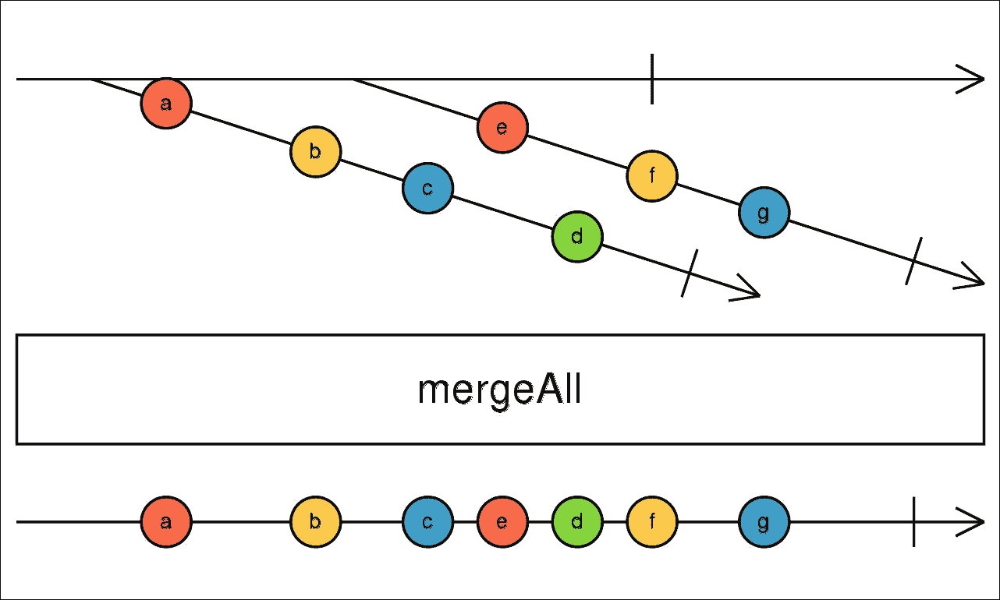
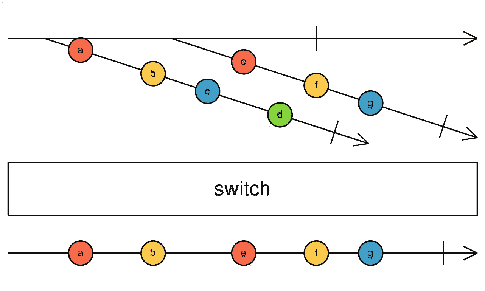
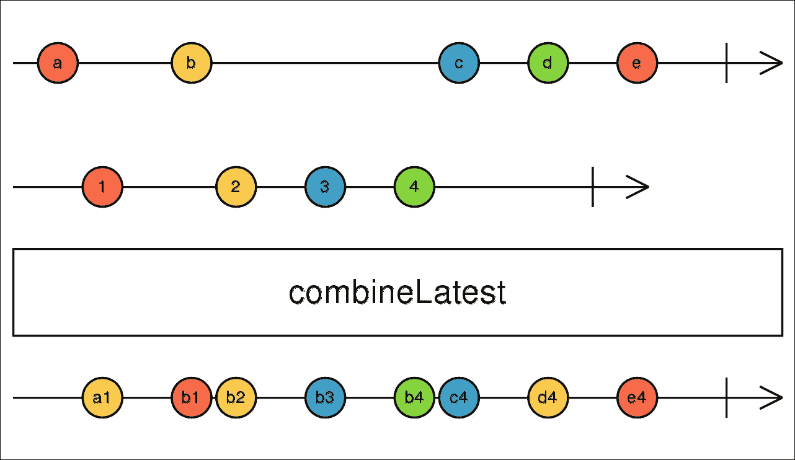

# 第六章 PHP Streams API 和更高阶 Observables

在本章中，我们将介绍许多我们为下一章所需的新特性。本章涵盖的几乎所有内容都与**PHP Streams API**、Promises 和事件循环（在我们的案例中是`reactphp/event-loop`项目）相关。这还包括一些更高级的 RxPHP 操作符，它们与所谓的更高阶 Observables 一起工作。

在本章中，我们将做以下几件事：

+   快速了解使用 PHP 中的`reactphp/promise`库来使用 Promises

+   介绍 PHP Streams API，并通过示例查看它带来的好处，无需或几乎无需额外努力

+   检查`StreamSelectLoop`类的内部结构，这次是在 PHP Streams API 的上下文中

+   查看我们在使用事件循环中的非阻塞代码时需要注意的注意事项

+   讨论更高阶 Observables

+   介绍四个新的更高级的操作符，`concatAll()`、`mergeAll()`、`combineLatest()`和`switchMap()`，它们旨在与更高阶 Observables 一起工作

本章将介绍许多我们尚未遇到的新事物。然而，所有这些在实践中都有其益处，正如我们在下一章中将要看到的，我们将编写一个在运行时产生多个子进程的应用程序。每个子进程本身就是一个自给自足的 WebSocket 服务器，我们将使用本章中获得的知识与他们通信并从他们那里收集信息。

# 在 PHP 中使用 Promises

当使用响应式扩展时，我们认为数据是连续的流，随着时间的推移发出数据。一个类似且可能更熟悉的概念是 Promises，它代表未来的单个值。

你可能已经在 jQuery 等库中遇到过 Promises，它通常用于处理 AJAX 请求的响应。PHP 中有多种实现，但原则始终相同。我们将使用一个名为`reactphp/promise`（[`github.com/reactphp/promise`](https://github.com/reactphp/promise)）的库，该库遵循 Promises/A 提案（[`wiki.commonjs.org/wiki/Promises/A`](http://wiki.commonjs.org/wiki/Promises/A)）并添加了一些额外的功能。由于我们将使用这个库为本章和下一章，我们将看看如何使用它。

使用 composer 安装`react/promise`包：

```php
$ composer require react/promiseWe

```

我们将使用两个基本类：

+   `Promise`：这个类表示一个延迟计算的结果，该结果将在未来可用。

+   `Deferred`：这个类表示一个挂起的操作。它返回一个 Promise 的单个实例，该实例将被解决或拒绝。通常，通过解决一个 Promise，我们理解操作已成功结束，而拒绝则意味着它失败了。

每个 `Promise` 都将被解决或拒绝，我们可以通过多个方法（我们也可以将它们称为操作符，因为它们具有类似的作用，如 Rx）来处理其结果。这些方法中的每一个都返回一个新的 `Promise`，因此我们可以以与在 Rx 中执行的方式非常相似的方式将它们链式调用：

+   `then()`: 此方法接受两个回调函数作为参数。第一个回调函数仅在 `Promise` 被解决时调用，而第二个回调函数仅在它被拒绝时调用。每个回调函数都可以返回一个修改后的值，该值将被传递给下一个操作符。

+   `done()`: 与 `then()` 类似，它接受两个回调函数作为参数。然而，此方法返回 `null`，因此不允许链式调用。它仅用于消费结果，并防止您进一步修改它。

+   `otherwise()`: 当 `Promise` 被拒绝或前面的 `then()` 方法抛出异常时，这是一个处理程序。

+   `always()`: 这是当 `Promise` 被解决或拒绝时调用的清理方法。

## 使用 then() 和 done() 方法

我们可以通过以下示例演示如何使用 `Promise` 和 `Deferred` 类以及 `then()` 和 `done()` 方法：

```php
// deferred_01.php 
use React\Promise\Deferred; 
$deferred = new Deferred(); 

$deferred->promise() 
    ->then(function($val) { 
        echo "Then #1: $val\n"; 
        return $val + 1; 
    }) 
    ->then(function($val) { 
        echo "Then #2: $val\n"; 
        return $val + 1; 
    }) 
    ->done(function($val) { 
        echo "Done: $val\n"; 
    }); 

$deferred->resolve(42); 

```

`promise()` 方法返回 `Promise` 类的一个实例，然后通过两个 `then()` 和一个 `done()` 调用来链式调用。我们提到，`Promise` 类代表未来的单个值。因此，多次调用 `promise()` 方法总是返回相同的 `Promise` 对象。

在第一个 `then()` 调用中，我们将打印值并返回 `$val + 1`。这个修改后的值将被传递到后续的 `then()` 调用，该调用再次更新值并将其传递给 `done()`。`done()` 方法返回 `null`，因此不能与任何更多的操作符链式调用。

输出如下：

```php
$ php deferred_01.php 
Then #1: 42
Then #2: 43
Done: 44

```

注意，负责解决或拒绝 `Promise` 类的是 `Deferred` 类的实例，因为它表示异步操作。另一方面，`Promise` 类仅表示 `Deferred` 类的结果。

## 使用 otherwise() 和 always() 方法

与使用 `then()` 和 `done()` 类似，我们将使用 `otherwise()` 处理异常，并且还会附加 `always()`，无论 `Promise` 类是被解决还是被拒绝，它都会被调用：

```php
// deferred_02.php  
$deferred = new Deferred(); 
$deferred->promise() 
    ->then(function($val) { 
        echo "Then: $val\n"; 
        throw new \Exception('This is an exception'); 
    }) 
    ->otherwise(function($reason) { 
        echo 'Error: '. $reason->getMessage() . "\n"; 
    }) 
    ->always(function() { 
        echo "Do cleanup\n"; 
    }); 

$deferred->resolve(42); 

```

现在，`then()` 的可调用部分抛出一个异常，该异常被下面的 `otherwise()` 方法捕获。即使我们在 `then()` 中抛出异常，Promise 链总是以一个 `always()` 调用结束。

如果我们运行此示例，我们将收到以下输出：

```php
$ php deferred_02.php 
Then: 42
Error: This is an exception
Do cleanup

```

`otherwise()` 方法实际上只是 `then(null, $onRejected)` 的快捷方式，因此我们可以将其写为单个调用。然而，这种表示法被分成两个单独的方法调用，这使得它更容易理解。我们还可以测试一个场景，其中我们拒绝 `Promise` 类而不是解决它：

```php
$deferred->reject(new \Exception('This is an exception'));

```

这将跳过 `then()` 调用，并仅触发 `otherwise()` 可调用部分：

```php
$ php deferred_02.php 
Error: This is an exception
Do cleanup

```

注意，在两种情况下都调用了 `always()` 方法。此外，注意 `otherwise()` 方法允许为不同的异常类创建多个处理器。如果我们没有在可调用定义中指定类类型，它将在任何异常上触发。

# PHP Streams API

如果我们想在 PHP 中使用套接字，我们提供了两组方法，从以下两个前缀之一开始：

+   `socket_*`：自 PHP 4.1 起可用的套接字通信的低级 API。在编译 PHP 时需要启用此扩展，可以使用 `--enable-sockets` 选项。您可以通过在控制台中运行 `php -i` 并在 `Configure Command` 选项下查看 `--enable-sockets` 来检查您的 PHP 是否支持此 API。

+   `stream_*`：PHP 4.3 中引入的 API，它将文件、网络和其他操作的一般化使用统一到一组函数中。在这个 API 的意义上，流是具有一些共同行为的资源对象。此扩展是 PHP 的一部分，不需要任何额外步骤即可启用。PHP 5 中添加了更多流函数，例如 `stream_socket_server()`，我们将在稍后使用它。

通常，我们总是希望使用更新的 `stream_*` API，因为它 PHP 的内置部分，并提供了更好的功能。

核心特性是它围绕使用资源构建。在 PHP 中，资源是一个特殊的变量，它持有对某些外部资源的引用（这可以是套接字连接、文件句柄等）。这些有一些限制。例如，由于显而易见的原因，它们不能被序列化，并且某些方法对特定类型的资源不适用，例如 `fseek()`。

与资源和流一起工作是一致的，因此当我们例如向文件写入数据时，我们可以使用 `stream_*` 函数而不是典型的 `fwrite()` 函数。考虑以下示例，我们将一个文件的内容复制到另一个文件，而不是使用 `fwrite()`、`file_get_content()` 和 `file_put_content()`，我们将使用 `stream_copy_to_stream()`：

```php
// streams_00.php 
$source = fopen('textfile.txt', 'r'); 
$dest = fopen('destfile.txt', 'w'); 
stream_copy_to_stream($source, $dest); 

```

`$source` 和 `$dest` 都是资源。`stream_copy_to_stream()` 函数只是将一个流的内容复制到另一个流。一个资源如何读取数据以及第二个资源如何写入数据取决于该资源的内部实现。我们也可以使用 `fseek()` 将读取光标移动到某个位置，而不是从文件开头读取数据：

```php
$source = fopen('textfile.txt', 'r'); 
fseek($source, 5); 
... 

```

现在我们已经跳过了文件的前五个字节。

有许多类型的资源。我们可以使用 `get_resource_type()` 函数查看我们支持哪些类型。

在以下示例中，我们创建了三种不同类型的资源：

```php
// streams_01.php 
$source = fopen('textfile.txt', 'r'); 
echo get_resource_type($source) . "\n"; 

$xml = xml_parser_create(); 
echo get_resource_type($xml) . "\n"; 

$curl = curl_init(); 
echo get_resource_type($curl) . "\n"; 

```

我们可以看到每种资源类型都由不同的字符串标识：

```php
$ php streams_01.php 
stream
xml
curl

```

在 第三章，《使用 RxPHP 编写 Reddit 读者》，我们通过打开到 `php://stdin` 的流并使用 `fread()` 来从控制台读取输入，通过 `IntervalObservable` 定期获取当前读取缓冲区的内容。我们还使用了 `stream_set_blocking()` 函数来使读取流非阻塞，这样如果没有任何数据可用，`fread()` 将返回一个空字符串。

使用事件循环当然是一个可行的选项，但还有一个专门为此目的创建的函数，称为 `stream_select()`。

## 使用 stream_select() 函数

而不是遍历所有流并手动检查它们是否有任何可用数据，我们可以使用 `stream_select()` 函数（[`php.net/manual/en/function.stream-select.php`](http://php.net/manual/en/function.stream-select.php)）。此函数接受流数组作为参数，并等待至少其中一个流上有活动发生。

由于使用 `fopen()` 创建的任何资源都是流，我们可以使用此函数等待用户输入，而不是使用循环：

```php
// streams_02.php 
$stdin = fopen('php://stdin', 'r'); 
stream_set_blocking($stdin, false); 

$readStreams = [$stdin]; 
$writeStreams = []; 
$exceptStreams = []; 

stream_select($readStreams, $writeStreams, $exceptStreams, 5); 
echo "stdin: " . strrev(fgets($stdin)); 

```

`stream_select()` 函数返回活动流的数量，如果超时则返回零。它总共接受五个参数，其中前四个是必需的：

+   `array &$read`：这是读取流的数组（检查流是否有可读数据）。

+   `array &$write`：这是写入流的数组。列出的流需要指示它们已准备好写入数据。

+   `array &$except`：这是具有更高优先级的流的数组。

+   `int $tv_sec`：这是等待至少一个流变为活动状态的最大秒数。

+   `int $tv_usec`（可选）：这是添加到超时秒数中的微秒数。

每个数组都是通过引用传递的，所以我们不能只留下 `[]`；我们需要将其作为变量传递（`null` 也可以接受）。最后一个整数参数 `5` 是该函数返回的超时时间，即使它没有在其任何流上捕获任何活动。

因此，在这个例子中，我们使用 `fopen()` 创建了一个资源 `$stdin`，然后等待五秒钟以获取任何用户输入（在按下 ***Enter*** 键后，数据由终端发送到缓冲区），然后使用 `fgets()` 从缓冲区获取数据并按相反顺序打印。

注意，我们无论如何都必须使 `$stdin` 流非阻塞。如果我们不这样做，`stream_select()` 将永远不会结束，无论超时与否。

## StreamSelectLoop 和 stream_select() 函数

我们在 第三章 ，*使用 RxPHP 编写 Reddit 读者* 中使用了 `StreamSelectLoop` 类，以周期性地使用 `IntervalObservable` 发射值，或者在 第二章 ，*使用 RxPHP 进行响应式编程* 中检查用户输入。让我们将我们关于 PHP 流、`stream_select()` 函数和 `StreamSelectLoop` 的知识结合起来，并更新之前的示例以使用 `StreamSelectLoop`。

`StreamSelectLoop` 类有一个 `addReadStream()` 方法，用于添加流（资源）和可调用函数，这些函数在流活跃时执行。然后它内部调用 `stream_select()` 并在一个循环中等待任何流的活动：

```php
// stdin_loop_01.php 
use React\EventLoop\StreamSelectLoop; 
$stdin = fopen('php://stdin', 'r'); 

$loop = new StreamSelectLoop(); 
$loop->addReadStream($stdin, function($stream) { 
    $str = trim(fgets($stream)); 
    echo strrev($str) . "\n"; 
}); 

$loop->run(); 

```

最后，很明显为什么事件循环类被称为 `StreamSelectLoop`，而不是 `EventLoop` 或仅仅是 `Loop`：它内部使用了 `stream_select()`。

现在我们知道了 `StreamSelectLoop` 如何与 PHP 流一起工作。然而，一个非常好的问题是，当 Observables，如 `IntervalObservable`，周期性地发射值时，它们不使用任何流是如何工作的？

## 使用 StreamSelectLoop 安排事件

除了使用 `StreamSelectLoop` 来处理流之外，我们还可以通过指定一个间隔和一个可调用函数来安排一次性或周期性事件。

考虑以下示例，它创建了两个计时器：

```php
// loop_01.php 
use React\EventLoop\StreamSelectLoop; 

$loop = new StreamSelectLoop(); 
$loop->addTimer(1.5, function() { 
    echo "timer 1\n"; 
}); 

$counter = 0; 
$loop->addPeriodicTimer(1, function () use (&$counter, $loop) { 
    printf("periodic timer %d\n", ++$counter); 
    if ($counter == 5) { 
        $loop->stop(); 
    } 
}); 
$loop->run(); 

```

周期性计时器每秒触发一次，而一次性计时器在 1500 毫秒后只触发一次。控制台输出将打印出增加的 `$counter` 变量的值：

```php
$ php loop_01.php 
periodic timer 1
timer 1
periodic timer 2
periodic timer 3
periodic timer 4
...

```

那么，当我们根本不使用流时，`StreamSelectLoop` 是如何安排事件的呢？

答案是 `stream_select()` 函数及其第四和第五个参数。即使我们不是在等待任何流活动，我们仍然可以利用 `stream_select()` 提供的超时。实际上，如果我们只使用 `usleep()` 函数来暂停脚本执行一段时间，我们也可以达到相同的结果。然而，如果我们使用了 `usleep()`，我们就无法将计时器与流结合起来。

当我们使用 `$loop->run()` 启动事件循环时，它会迭代所有时间并检查哪个计时器应该首先触发。在我们的例子中，是将在一秒后触发的周期性计时器，所以 `StreamSelectLoop` 调用 `stream_select()` 并将其第四个参数（超时）设置为 一秒。由于我们没有向循环中添加任何流，`stream_select()` 调用将始终以超时结束，这在当前情况下是故意的。

如果我们向循环中添加了一个流，该流会在计时器应该触发之前任何时候发出活动信号，那么 `stream_select()` 可能会被中断，流会在计时器之前被处理。

我们可以回到我们的示例，其中 `StreamSelectLoop` 类的工作方式如下：

+   我们安排了一个一秒的超时，即使没有流活动，`stream_select()`也会返回。

+   `StreamSelectLoop`类检查哪些定时器已到期，并调用它们的可调用函数。然后，如果定时器是周期性的，它会重新安排定时器，以便在未来再次触发。

+   这是内部循环的第一次迭代，其中`stream_select()`导致了暂停。

+   在第二次迭代中，它再次检查最近的定时器。这次是将在 500ms（已过去 1000ms）触发的单次定时器，因此`stream_select()`的超时时间将仅为 500ms。

这会一直持续到我们从其中一个可调用函数中调用`$loop->stop()`。

我们可以用周期性定时器重写这个示例，同时使用`IntervalObservable`读取任何来自`php://stdin`的输入：

```php
// loop_02.php 
use React\EventLoop\StreamSelectLoop; 
use Rx\Observable; 
use Rx\Scheduler\EventLoopScheduler; 

$loop = new StreamSelectLoop(); 
$scheduler = new EventLoopScheduler($loop); 

Observable::interval(2000, $scheduler) 
    ->subscribeCallback(function($counter) { 
        printf("periodic timer %d\n", $counter); 
    }); 

$stdin = fopen('php://stdin', 'r'); 
$loop->addReadStream($stdin, function($stream) { 
    $str = trim(fgets($stream)); 
    echo strrev($str) . "\n"; 
}); 

$loop->run(); 

```

可观察者不能直接与`StreamSelectLoop`一起工作，因此我们需要用调度器包装它。`EventLoopScheduler`类继承自我们在上一章详细解释的`VirtualTimeScheduler`类，当时我们讨论了测试及其与`TestScheduler`类的使用。`EventLoopScheduler`的原则是相同的。

`EventLoopScheduler`类在`StreamSelectLoop`实例上安排定时器，这并不禁止我们为流使用相同的循环。

### 使用 StreamSelectLoop 的最简 HTTP 服务器

使用仅`StreamSelectLoop`创建简单 HTTP 服务器的良好示例可在`react/event-loop`包的 GitHub 页面找到：

```php
// streams_03.php 
$loop = new React\EventLoop\StreamSelectLoop(); 
$server = stream_socket_server('tcp://127.0.0.1:8080'); 
stream_set_blocking($server, 0); 

$loop->addReadStream($server, function ($server) use ($loop) { 
  $c = stream_socket_accept($server); 
  $data = "HTTP/1.1 200 OK\r\nContent-Length: 3\r\n\r\nHi\n"; 

  $loop->addWriteStream($c, function($c) use (&$data, $loop) { 
    $written = fwrite($c, $data); 
    if ($written === strlen($data)) { 
      fclose($conn); 
      $loop->removeStream($c); 
    } else { 
      $data = substr($data, 0, $written); 
    } 
  }); 
}); 

$loop->addPeriodicTimer(5, function () { 
  $memory = memory_get_usage() / 1024; 
  $formatted = number_format($memory, 3).'K'; 
  echo "Current memory usage: {$formatted}\n"; 
}); 

$loop->run(); 

```

这个示例使用`stream_socket_server()`创建一个监听 TCP 套接字服务器，仅接受来自本地主机端口`8080`的连接。然后，`$server`流被添加到事件循环中，每次建立新的连接时，它都会被`stream_select()`捕获。然后，为了实际接受连接，我们需要调用`stream_socket_accept()`函数，该函数返回另一个流，代表到该客户端的流。然后，通过`addWriteStream()`我们将知道客户端何时准备好开始接收数据。

有四个重要的事情需要注意：

+   使用`stream_socket_server()`，我们可以使用多种不同的协议。最常见的是`tcp`、`udp`和`unix`。我们可以使用`stream_get_transports()`获取所有可用协议的完整列表。

+   如果我们有*N*个客户端，循环中始终有*N+1*个流。这是因为接受连接的服务器流也在事件循环内部。

+   当我们向客户端流写入数据时，我们需要意识到它可能无法一次写入整个响应，我们需要分块发送。这就是为什么我们总是检查使用`fwrite()`写入流中的字节数。

+   在我们完成向写入流写入数据后，我们使用`fclose()`关闭它，并从循环中移除，因为我们不再需要它。当接受新的客户端连接时，它将有自己的写入流。

## 关于非阻塞事件循环的说明

`StreamSelectLoop`的实现细节表明，它不能保证所有计时器都会在它们应该的时间精确触发。例如，如果我们创建了两个都需要在 500ms 后触发的计时器，那么我们可以相当准确地预测第一个可调用将在 500ms 后精确执行。然而，第二个计时器的可调用依赖于第一个可调用的执行时间。这意味着如果第一个可调用执行了 100ms；第二个可调用将在 600ms 而不是 500ms 后触发。

这的一个影响是事件循环是非阻塞的——只要我们的代码是非阻塞的。

PHP 中没有并行性，因此所有代码都是严格顺序的。如果我们编写了执行时间较长的代码或需要从本质上阻塞的代码，它将导致整个事件循环也变为阻塞。

## 使用多个 StreamSelectLoop 实例

在现实世界的 PHP 应用程序中，当我们需要使用 PHP 流、Observables、HTTP 服务器/客户端或 WebSocket 服务器/客户端（以及基本上任何异步代码）进行异步工作时，我们可能需要使用多个事件循环。这意味着应用程序的每个非阻塞部分都需要自己的事件循环。

例如，我们需要使用事件循环来使用`IntervalObservable`，但我们还需要一个事件循环来读取 PHP 流数据的 WebSocket 服务器。

考虑以下示例，其中我们模拟了类似的场景：

```php
// loop_03.php 
use React\EventLoop\StreamSelectLoop; 

$loop1 = new StreamSelectLoop(); 
$loop1->addPeriodicTimer(1, function() { 
    echo "timer 1\n"; 
}); 

$loop2 = new StreamSelectLoop(); 
$loop2->addTimer(2, function() { 
    echo "timer 2\n"; 
}); 

$loop1->run(); 
$loop2->run(); 

```

在这个例子中，第二个`$loop2`永远不会启动。PHP 解释器将只停留在第一个`$loop1`中，因为它永远不会结束，因为周期性计时器。如果我们按相反的顺序做（首先调用`$loop2`然后是`$loop1`），它实际上会工作。第二个循环将只是延迟两秒钟，因为第一个循环只运行一个动作然后结束（没有其他计时器活跃，所以它会自动结束）。

这是我们需要注意的事情。在第七章实现 Socket IPC 和 WebSocket 服务器/客户端中，我们将编写一个同时运行 WebSocket 服务器和 Unix 套接字客户端的应用程序。这意味着它们都需要能够循环读取流中的数据。好事是 WebSocket 服务器将使用来自`react/event-loop`包的相同事件循环实现。

结果是，在 PHP 中，我们只需要一个事件循环，这可能会成为某些需要与自己的事件循环实现一起工作但又不公开任何我们可以挂钩的库的问题。

然而，这并不一定适用于 RxJS，或者更普遍地说，不适用于解释器工作方式与 PHP 不同的 JavaScript 应用程序。我们将在本书的最后一章更深入地讨论使用 RxJS 和 RxPHP 时的差异。

### PHP 中的事件循环互操作性

为了解决这个问题，有人尝试标准化事件循环的实现，以遵循相同的 API。

`async-interop/event-loop` 包定义了一系列接口，事件循环需要实现这些接口才能真正互换。这意味着我们可以编写一个仅依赖于 `async-interop/event-loop` 提供的接口的库，最终用户可以决定他们想要使用哪个事件循环实现。

我们可以查看一个我们已知的 `StreamSelectLoop` 示例，并通过 `async-interop/event-loop` 提供的接口来使用它。目前，`StreamSelectLoop` 并没有原生实现这个接口，因此我们需要一个额外的包 `wyrihaximus/react-async-interop-loop`，它将 `react/event-loop` 的事件循环实现用 `async-interop/event-loop` 接口包装。

我们的 `composer.json` 文件将会非常简单，因为我们只需要一个必需的包：

```php
{ 
    "require": { 
        "wyrihaximus/react-async-interop-loop": "⁰.1.0" 
    } 
} 

```

`wyrihaximus/react-async-interop-loop` 包需要作为依赖同时包含 `async-interop/event-loop` 和 `react/event-loop`，所以我们不需要自己包含它们。

然后，我们将编写一个使用 `Loop` 互操作性接口安排两个动作的最小示例：

```php
// event_interop_01.php 
use Interop\Async\Loop; 
use WyriHaximus\React\AsyncInteropLoop\ReactDriverFactory; 

Loop::setFactory(ReactDriverFactory::createFactory()); 

Loop::delay(1000, function() { 
    echo "second\n"; 
}); 
Loop::delay(500, function() { 
    echo "first\n"; 
}); 

Loop::get()->run(); 

```

注意，我们所有的操作都是在来自 `async-interop/event-loop` 包的 `Loop` 类及其静态方法上进行的。我们已经知道我们一次只能有一个事件循环在运行。这就是为什么 `Loop` 类上的所有方法都是静态的。

`setFactory()` 方法告诉 `Loop` 类如何创建我们的事件循环实例。在我们的例子中，我们使用 `react/event-loop`，它被包裹在 `ReactDriverFactory` 中，以遵循 `async-interop` 接口。

### 事件循环和 RxPHP 的未来版本

在 RxPHP 2 中，使用事件循环（以及因此需要异步调度的所有操作符）已经显著简化，大多数时候我们甚至不需要担心自己启动事件循环。

### 注意

RxPHP 2 本来应该基于 `async-interop/event-loop` 接口。然而，该规范仍然不稳定，所以 RxPHP 团队决定回滚到 RxPHP 1 风格的事件循环。以下段落描述了在 RxPHP 的未来版本（可能是 RxPHP 3）中应该如何使用事件循环。最后，RxPHP 2 基于我们熟悉的 `reactphp` 库中的 `StreamSelectLoop` 类。

在未来，RxPHP 将会依赖于 `async-interop/event-loop` 接口。由于我们不希望自行启动循环，我们可以从 RxPHP 中自动加载一个引导脚本，在脚本执行结束时自动启动循环，使用 PHP 的 `register_shutdown_function()`。我们将再次更新我们的 `composer.json` 并添加 `autoload` 指令：

```php
"autoload": { 
    "files": ["vendor/reactivex/rxphp/src/bootstrap.php"] 
} 

```

现在我们可以编写任何异步代码：

```php
// rxphp2_01.php 
use Rx\Observable; 

Observable::interval(1000) 
    ->take(5) 
    ->flatMap(function($i) { 
        return \Rx\Observable::of($i + 1); 
    }) 
    ->subscribe(function($value) { 
        echo "$value\n"; 
    }); 

```

注意，我们既没有创建调度器，也没有启动循环。在 RxPHP 2 中，所有操作符都有默认的调度器预定义，所以我们不需要在 `subscribe()` 方法中传递它。

如果我们想采用与 RxPHP 1 相似的方法，我们可以硬编码调度器：

```php
use Rx\Scheduler; 
Observable::interval(1000, Scheduler::getAsync()) 
    ->take(5) 
    ... 

```

然而，在某些情况下，我们可能不想等到脚本末尾的 `register_shutdown_function()` 开始循环，而是想自己启动它。

让我们看看以下示例：

```php
// rxphp2_02.php 
use Rx\Observable; 

Observable::interval(1000) 
    ->take(3) 
    ->subscribe(function($value) { 
        echo "First: $value\n"; 
    }); 

Observable::interval(1000) 
    ->take(3) 
    ->subscribe(function($value) { 
        echo "Second: $value\n"; 
    }); 

```

当循环开始时，两个 Observables 都会同时开始发出值，因此输出将如下所示：

```php
$ php rxphp2_02.php
First: 0
Second: 0
First: 1
Second: 1
First: 2
Second: 2

```

在我们创建第一个 Observable 之后，我们也可以手动启动事件循环：

```php
// rxphp2_03.php 
Observable::interval(1000) 
    ->take(3) 
    ->subscribe(function($value) { 
        echo "First: $value\n"; 
    }); 

Loop::get()->run(); 

Observable::interval(1000) 
    ->take(3) 
    ->subscribe(function($value) { 
        echo "Second: $value\n"; 
    }); 

```

循环将在打印三个值后结束，然后我们继续处理第二个 Observable。脚本执行结束时，事件循环将自动再次启动。输出如下所示：

```php
$ php rxphp2_03.php
First: 0
First: 1
First: 2
Second: 0
Second: 1
Second: 2

```

### 注意

注意，在撰写本书时（2017 年 4 月），`async-interop/event-loop` 和 RxPHP 2 都处于预发布状态，它们的 API 可能会发生变化。

# 高阶 Observables

在讨论函数式编程的先决条件时，我们提到了高阶函数。这些函数返回其他函数。在 RxPHP 中，当使用 Observables 时，也应用了非常类似的概念。

高阶 Observable 是发出其他 Observables 的 Observable。为了说明高阶 Observables 与一阶 Observables 的区别，考虑以下简单示例：

```php
// higher_order_01.php 
use Rx\Observable; 
Observable::range(1, 3) 
    ->subscribe(new DebugSubject()); 

```

这个例子只是打印了三个值并按预期完成。这是我们期望任何一阶 Observables 的行为：

```php
$ php higher_order_01.php 
22:54:05 [] onNext: 1 (integer)
22:54:05 [] onNext: 2 (integer)
22:54:05 [] onNext: 3 (integer)
22:54:05 [] onCompleted

```

现在，我们可以通过添加 `map()` 操作符使这个例子更加复杂，该操作符返回另一个 Observable 而不是整数：

```php
// higher_order_02.php 
use Rx\Observable; 

Observable::range(1, 3) 
    ->map(function($value) { 
        return Observable::range(0, $value); 
    }) 
    ->subscribe(new DebugSubject()); 

```

我们使用 `range()` 为源 Observable 的每个值创建一个 Observable。在我们的例子中，到达 `DebugSubject` 实例的 Observables 应该分别发出值 `[0]`、`[0, 1]` 和 `[0,1,2]`。

控制台中的输出并不令人满意。`DebugSubject` 实例打印它接收到的，这是一个 `RangeObservable` 的实例。

这是正确的行为。我们实际上是从 `map()` 操作符返回 Observables，而 `subscribe()` 方法并不关心它传递的值：

```php
$ php higher_order_02.php 
23:29:46 [] onNext: RangeObservable (Rx\Observable\RangeObservable)
23:29:46 [] onNext: RangeObservable (Rx\Observable\RangeObservable)
23:29:46 [] onNext: RangeObservable (Rx\Observable\RangeObservable)
23:29:46 [] onCompleted

```

### 注意

每个 `onNext` 的值是 `RangeObservable` (`Rx\Observable\RangeObservable`)，因为 `DebugSubject` 接收一个对象并将其转换为字符串。然后它打印出包括其命名空间在内的类名。

那么，如果我们想扁平化内部 Observables 并重新发出它们的所有值呢？

RxPHP 包含一些操作符，旨在与高阶 Observables 一起使用。特别是最有用的操作符是 `mergeAll()`、`concatAll()` 和 `switchLatest()`。

为了这个目的，我们可以选择 `mergeAll()` 或 `concatAll()`。这两个操作符之间的区别与 `merge()` 和 `concat()` 相同。`mergeAll()` 操作符在收到内部 Observables 时立即订阅它们，并立即重新发出它们的值。另一方面，`concatAll()` 将按接收到的顺序逐个订阅内部 Observables。

## concatAll() 和 mergeAll() 操作符

在这个示例中，我们选择哪一个都无关紧要。`RangeObservable` 是一个冷 Observable，它使用 `ImmediateScheduler`，因此所有值总是按正确的顺序发出。

使用 `mergeAll()` 的实现可能如下所示：

```php
// higher_order_03.php 
Observable::range(1, 3)
    ->map(function($value) {
        return Observable::range(0, $value);
    })
    ->mergeAll()
    ->subscribe(new DebugSubject()); 

```

现在 `Observable::range(1, 3)` 发出三个 `RangeObservable` 实例。`mergeAll()` 操作符订阅了它们中的每一个，并将它们的所有值重新发出给其观察者，即一个 `DebugSubject` 实例。

从下面的宝石图中可以明显看出 `mergeAll()` 的工作原理：



表示 RxJS 中 mergeAll() 操作符的宝石图（http://reactivex.io/rxjs/class/es6/Observable.js）

表示为顶部水平线的源 Observable 并非直接发出值（线上没有圆圈）。相反，它发出其他 Observable，由对角线表示。

如果我们运行这个示例，我们会得到上面描述的值，即 `0`、`0`、`1`、`0`、`1` 和 `2`：

```php
$ php higher_order_03.php 
00:02:26 [] onNext: 0 (integer)
00:02:26 [] onNext: 0 (integer)
00:02:26 [] onNext: 1 (integer)
00:02:26 [] onNext: 0 (integer)
00:02:26 [] onNext: 1 (integer)
00:02:26 [] onNext: 2 (integer)
00:02:26 [] onCompleted

```

我们也可以测试如果我们使用异步发出值的 Observable 会发生什么。在这种情况下，我们使用 `mergeAll()` 或 `concatAll()` 很重要，所以我们将测试这两种场景。

让我们从 `mergeAll()` 和一个与上一个示例类似的例子开始。我们将使用 `IntervalObservable` 和 `take(3)` 来发出三个异步发出三个值的 Observable：

```php
// higher_order_04.php 
$loop = new StreamSelectLoop(); 
$scheduler = new EventLoopScheduler($loop); 

Observable::interval(1000, $scheduler)
    ->take(3)
    ->map(function($value) use ($scheduler) {
        return Observable::interval(600, $scheduler)
            ->take(3)
            ->map(function($counter) use ($value) {
                return sprintf('#%d: %d', $value, $counter);
            });
    })
    ->mergeAll()
    ->subscribe(new DebugSubject()); 

$loop->run(); 

```

内部 Observable 的每个值都被转换成字符串以便于识别。我们可以通过给每个值添加时间戳来描述这个示例中发生的事情：

+   `1000ms`：第一个值从外部的 `IntervalObservable` 发出，通过 `map()` 操作符转换成了另一个 `IntervalObservable`。在这个时候，`mergeAll()` 订阅了这个第一个内部 Observable。

+   `1600ms`：内部 `IntervalObservable` 发出一个初始值（整数 `0`），该值被转换为字符串并由 `DebugSubject` 实例打印。

+   `2000ms`：第二个内部 Observable 被创建。`mergeAll()` 操作符也订阅了它。现在它订阅了两个 Observable。

+   `2200ms`：第一个内部 `IntervalObservable` 发出其第二个值 `(1)`。

+   `2600ms`：第二个内部 `IntervalObservable` 发出其第一个值 `(0)`。

+   `2800ms`：第一个内部 `IntervalObservable` 发出其最后一个值 `(2)`。

+   `3000ms`：第三个内部 `IntervalObservable` 被创建。

这会一直持续到所有内部 `IntervalObservable` 通过 `take(3)` 操作符发出三个值。

我们可以看到内部 Observable 的值确实是异步发出的，如果我们想消费它们，使用 `mergeAll()` 操作符非常容易。

完整的控制台输出如下：

```php
$ php higher_order_04.php 
00:43:55 [] onNext: #0: 0 (string)
00:43:55 [] onNext: #0: 1 (string)
00:43:56 [] onNext: #1: 0 (string)
00:43:56 [] onNext: #0: 2 (string)
00:43:56 [] onNext: #1: 1 (string)
00:43:57 [] onNext: #2: 0 (string)
00:43:57 [] onNext: #1: 2 (string)
00:43:57 [] onNext: #2: 1 (string)
00:43:58 [] onNext: #2: 2 (string)
00:43:58 [] onCompleted

```

使用 `concatAll()` 的实现完全相同。唯一改变的是我们如何使用这个操作符：

```php
// higher_order_05.php 
... 
    ->map(function($value) use ($scheduler) {
       // ...
    })
    ->concatAll()
    ->subscribe(new DebugSubject()); 
... 

```

就像`concat()`运算符一样，`concatAll()`保持可观察对象的顺序，并且只有在之前的可观察对象完成之后才会订阅下一个可观察对象。控制台中的输出顺序是内部`IntervalObservables`创建的顺序：

```php
$ php higher_order_05.php 
00:55:30 [] onNext: #0: 0 (string)
00:55:30 [] onNext: #0: 1 (string)
00:55:31 [] onNext: #0: 2 (string)
00:55:32 [] onNext: #1: 0 (string)
00:55:32 [] onNext: #1: 1 (string)
00:55:33 [] onNext: #1: 2 (string)
00:55:34 [] onNext: #2: 0 (string)
00:55:34 [] onNext: #2: 1 (string)
00:55:35 [] onNext: #2: 2 (string)
00:55:35 [] onCompleted

```

高阶可观察对象的核心原理一开始并不容易理解，所以请随时自行实验。

虽然在 RxPHP 中很难看到`concat()`、`concatAll()`、`merge()`和`mergeAll()`的实际好处，但这些在 RxJS 中都非常常见。通常，当我们需要按顺序或独立运行多个 HTTP 请求时，使用这些运算符之一非常方便。更多关于这个主题的内容在最后一章中，其中展示了 RxJS 的一些有趣的用例。

## switchLatest 运算符

使用`concatAll()`或`mergeAll()`，我们知道我们将始终接收所有内部可观察对象发射的所有值。在某些用例中，我们可能只关心最新可观察对象的值，而丢弃所有其他可观察对象。这是`concatAll()`或`mergeAll()`都无法做到的，因为它们总是等待当前可观察对象完成或所有可观察对象完成。

这就是为什么有一个`switchLatest()`运算符，它始终只订阅最新的可观察对象，并自动取消订阅之前的可观察对象。

下面的弹珠图很好地解释了这一原理：



弹珠图表示 RxJS 中的 switch()运算符（http://reactivex.io/rxjs/class/es6/Observable.js）

### 注意

这个运算符在 RxJS 中简单地被称为`switch()`。还有`switchMap()`和`switchMapTo()`运算符，目前仅在 RxJS 中可用。

在这个图中，我们可以看到源可观察对象发射了两个可观察对象。第一个内部可观察对象发射了四个值，但其中只有两个（"a"和"b"）被重新发射。在第三个值发射之前，源可观察对象发射了另一个内部可观察对象，并且当前的可观察对象被取消订阅。然后它继续通过重新发射来自新内部可观察对象的值。

此外，请注意，即使源可观察对象完成，内部可观察对象也会被消费。

那么，这个运算符会如何改变`concatAll()`和`mergeAll()`示例的输出呢？请看以下内容：

```php
// higher_order_06.php 
... 
    ->map(function($value) use ($scheduler) {
        // ...
    })
    ->switchLatest()
    ->subscribe(new DebugSubject()); 
... 

```

我们可以肯定，我们不会从所有内部可观察对象中接收所有值，因为每个可观察对象都是在前一个完成之前创建的：

```php
$ php higher_order_06.php 
01:26:24 [] onNext: #0: 0 (string)
01:26:25 [] onNext: #1: 0 (string)
01:26:26 [] onNext: #2: 0 (string)
01:26:27 [] onNext: #2: 1 (string)
01:26:27 [] onNext: #2: 2 (string)
01:26:27 [] onCompleted

```

每个内部可观察对象只能发射其第一个值，然后它们被取消订阅，除了最后一个可观察对象。由于源可观察对象没有更多的发射，`switchLatest()`保持对其的订阅。

## combineLatest()运算符

`concatAll()`和`mergeAll()`都会逐个重新发射它们内部可观察对象（或可观察对象）发射的所有值。还有一个具有类似功能的运算符，称为`combineLatest()`。

与前两个不同，`combineLatest()` 函数接收一个可观察对象数组作为参数，并立即订阅它们中的所有对象。然后，`combineLatest()` 将每个可观察对象发出的最后一个值内部存储在一个缓冲区中，当所有源可观察对象都至少发出一个值时，它将整个缓冲区作为一个单独的数组发出。然后，在任意源可观察对象发出任何值时，更新后的缓冲区会再次重新发出。

这在下面的宝石图中得到了演示：



代表 RxJS 中 combineLatest() 操作符的宝石图（http://reactivex.io/rxjs/class/es6/Observable.js）

注意，当第一个可观察对象发出 **a** 时，它并没有立即重新发出。只有当第二个可观察对象发出它的第一个值后，`combineLatest()` 操作符才会重新发出这两个值。这意味着，如果我们有一个包含 *N* 个可观察对象的数组，`combineLatest()` 的观察者将始终接收到一个包含 *N* 个值的数组。

这的一个重要含义是，如果我们源数组中的某个可观察对象由于某种原因没有发出任何值，那么 `combineLatest()` 也不会发出任何值，因为它需要每个源可观察对象至少有一个值。这可以通过使用 `startWith()` 或 `startWithArray()` 操作符来避免，这些操作符在源可观察对象之前添加值发出。

考虑以下示例，我们有一个使用 `Observable::just()` 创建的只包含单个值的可观察对象。我们想使用 `combineLatest()` 操作符与一个 `IntervalObservable` 实例数组结合：

```php
// combine_latest_01.php 

use React\EventLoop\StreamSelectLoop; 
use Rx\Scheduler\EventLoopScheduler; 
use Rx\Observable; 

$loop = new StreamSelectLoop(); 
$scheduler = new EventLoopScheduler($loop); 

$source = Observable::just(42) 
  ->combineLatest([ 
    Observable::interval(175, $scheduler)->take(3), 
    Observable::interval(250, $scheduler)->take(3), 
    Observable::interval(100, $scheduler)->take(5), 
  ]) 
  ->subscribe(new DebugSubject()); 

$loop->run(); 

```

我们可以肯定输出数组将始终以整数 `42` 开始。这个数组将在源可观察对象数组发生任何变化时发出。

注意，第二个 `IntervalObservable` 在 250 毫秒后发出它的第一个值，而第三个 `IntervalObservable` 仅在 100 毫秒后发出它的第一个值。这意味着我们永远不会收到第三个 `IntervalObservable` 的第一个值。它永远不会被重新发出，因为 `combineLatest()` 需要所有可观察对象至少发出一个值，在我们的例子中，它将等待第二个 `IntervalObservable`，这是最慢的一个。

控制台输出确认了我们的预期行为：

```php
$ php combine_latest_01.php 
09:42:45 [] onNext: [42,0,0,1] (array)
09:42:46 [] onNext: [42,0,0,2] (array)
09:42:46 [] onNext: [42,1,0,2] (array)
09:42:46 [] onNext: [42,1,0,3] (array)
09:42:46 [] onNext: [42,1,1,3] (array)
09:42:46 [] onNext: [42,1,1,4] (array)
09:42:46 [] onNext: [42,2,1,4] (array)
09:42:46 [] onNext: [42,2,2,4] (array)
09:42:46 [] onCompleted

```

最后两次发出仅因为第二个 `IntervalObservable`。另外，注意，由于每个源可观察对象的每次发出都会触发 `combineLatest()` 重新发出其当前值，因此数组中始终只有一个更新的值。

如果我们想确保我们能够捕获所有可观察对象发出的所有值，我们可以使用 `startWith()` 为每个可观察对象设置默认值：

```php
... 
->combineLatest([ 
  Observable::interval(175, $scheduler)->take(3)->startWith(null), 
  Observable::interval(250, $scheduler)->take(3)->startWith(null), 
  Observable::interval(100, $scheduler)->take(5)->startWith(null), 
]) 
... 

```

现在输出将从 `null` 值开始，我们可以确信我们将接收到所有源可观察对象的所有值：

```php
$ php combine_latest_01.php 
09:53:46 [] onNext: [42,null,null,null] (array)
09:53:46 [] onNext: [42,null,null,0] (array)
09:53:46 [] onNext: [42,0,null,0] (array)
09:53:46 [] onNext: [42,0,null,1] (array)
09:53:46 [] onNext: [42,0,0,1] (array)
09:53:46 [] onNext: [42,0,0,2] (array)
... 

```

这四个操作符属于更高级的 Rx 功能类别。尽管这些操作符在 RxPHP 或 RxJS 中并不常用，但了解它们的存在是非常有用的，因为它们利用了反应式扩展的真正力量。`switchMap()` 或 `combineLatest()` 提供的内部逻辑让我们能够避免使用任何状态变量来跟踪我们需要订阅/取消订阅的位置以及需要存储的值。

在下一章中，我们将遇到在单个操作符链中使用的 `combineLatest()` 和 `switchMap()`。此外，在本书的最后一章中，当我们讨论与 RxJS 的相似之处时，我们将使用 JavaScript 中 `combineLatest()` 的一个稍微修改过的版本。`concatAll()` 和 `mergeAll()` 操作符在 RxJS 中也很有用，我们可以使用它们做一些在当前的 RxPHP 中无法做到的技巧；但更多内容将在最后一章中介绍。

# 摘要

本章涵盖了众多新主题。我们将在下一章中使用我们刚刚学到的所有知识，其中我们将使用 Unix 套接字进行进程间通信，以及 WebSocket 服务器来实现一个简单的聊天应用。最重要的是，我们将使用 `ProcessObservable` 来创建子进程，以及 PHP Streams API 来进行 Unix 套接字通信。我们还将探讨事件循环，包括在 Unix 套接字流和 WebSocket 服务器之间共享相同事件循环实例的使用场景。然后，我们将继续探讨高阶 Observables，用于从多个子进程收集状态，以及 WebSocket 服务器和客户端。PHP Streams API 和高阶 Observables 在本质上可能一开始比较难以理解，所以请随意花时间自己实验。

在下一章中，我们还将介绍 Rx 中的背压概念，这是一种常见的避免通过发出观察者能够处理更多值的策略来过载消费者的方法。
