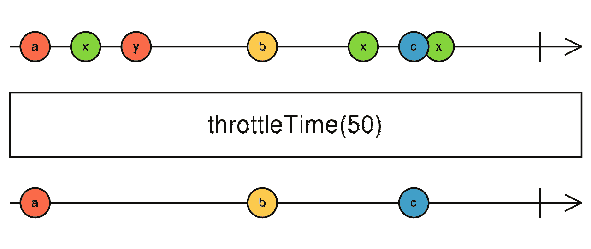
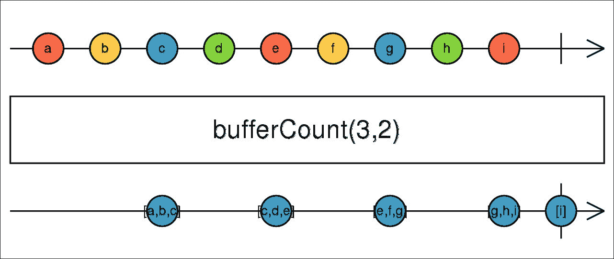
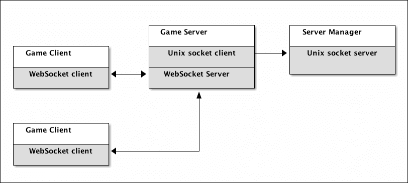

# 第七章. 实现套接字 IPC 和 WebSocket 服务器/客户端

在上一章中，我们提前看了一下本章将要构建的应用。我们已经知道我们将使用 PHP 流 API 进行进程间通信。我们还将编写 WebSocket 服务器，稍后是一个简单的 WebSocket 客户端。我们还强调了理解异步和非阻塞应用中事件循环工作的重要性，这在本章的服务器和客户端应用中都将适用。

本章也将非常注重源代码，因此我们将将其分为三个更小的部分，涵盖三个不同的应用：

+   **服务器管理应用**: 这是我们将运行以测试整个项目的应用。它将启动子进程，并通过 Unix 套接字流（用 PHP 流 API 包装）与它们通信。每个子进程代表一个单独的 WebSocket 服务器，它监听特定的端口。

+   **WebSocket 服务器应用**: 这是一个 WebSocket 服务器的单个实例，允许同时连接多个客户端，使他们能够聊天。这意味着我们必须实时将每条消息分发给所有客户端。我们还将保留一些最近的消息历史，这些历史将被填充到每个新客户端。这个应用将通过 Unix 套接字与服务器管理器通信，并提供其当前状态（当前连接的客户端数量和聊天历史中的消息数量）。

+   **WebSocket 客户端应用**: 这是我们的测试客户端，它将连接到 WebSocket 服务器并监听发送到服务器的用户输入。

在我们开始工作于服务器管理应用之前，我们应该讨论一个在 RxJS 环境中出现频率较高，但同时也与本章非常相关的概念。

# 反压在反应式扩展中

我们通常将 Observables 视为由源 Observable 在一端产生并由观察者在另一端消费的数据流。虽然这仍然是正确的，但我们不知道有 Observables 发出值如此之快，以至于消费者（观察者）无法处理它们的情况。

这可能会导致显著的内存或 CPU 使用，这是我们肯定想避免的。

虽然大多数都不在 RxPHP 中可用，但有两个操作符组适合反压，它们主要与 RxJS 相关：

+   **有损的**: 在这个组中，一些值被丢弃并且永远不会到达观察者。例如，这可能是某个时间段内鼠标位置的采样。我们通常对现在的鼠标位置感兴趣；我们不在乎过去的位置，因此这可以完全忽略。

+   **无损的**: 在这个组中，值在操作符中堆叠，并且通常以批量的形式发出。我们不想丢失任何数据，因此一个典型的无损操作符的内部实现是一个缓冲区。

正如我们所说的，背压在 RxJS 中比在 RxPHP 中更典型，但让我们看看这两种类型在 RxPHP 中的示例。

## 有损背压

在前面的章节中，我们使用了 `switchLatest()` 操作符来处理高阶 Observables。这个操作符会自动订阅源 Observable 发出的最新 Observable，并取消订阅之前的源。实际上，这是一个有损操作符，因为我们知道我们无法保证接收所有值。

实际上，我们通常处理与 RxJS 操作符 `throttleTime()` 类似的用例。这个操作符接受一个时间段作为参数，它定义了在发出一个值后，它会忽略源 Observable 的所有后续发射。

我们可以查看它的宝石图来清楚地了解它做了什么：



这个操作符已经在 RxPHP 中实现，但我们可以仅使用 `filter()` 来自己实现它，或者更好的方法是创建一个自定义操作符来了解如何内部实现这种和类似的功能。

### 使用 filter() 操作符实现 throttleTime()

我们可以使用 `IntervalObservable` 类来模拟一个热源 Observable，它定期发出值，然后我们会过滤掉所有在上一发射后不到一秒到达的值。

以下示例模拟了与 `throttleTime()` 操作符类似的功能：

```php
// filter_01.php 
$loop = new StreamSelectLoop(); 
$scheduler = new EventLoopScheduler($loop); 
$lastTimestamp = 0; 

Observable::interval(150, $scheduler) 
    ->filter(function() use (&$lastTimestamp) { 
        if ($lastTimestamp + 1 <= microtime(true)) { 
            $lastTimestamp = microtime(true); 
            return true; 
        } else { 
            return false; 
        } 
    }) 
    ->subscribe(new DebugSubject());

$loop->run(); 

```

### 注意

从现在起，在这本书中，我们不会包括我们之前使用的类的 `use` 语句，以使示例尽可能简短。

如果我们运行这个示例，我们会看到它确实做了我们需要的：

```php
$ php filter_01.php 
14:51:01 [] onNext: 0 (integer)
14:51:02 [] onNext: 7 (integer)
14:51:03 [] onNext: 14 (integer)
14:51:04 [] onNext: 21 (integer)
...

```

如我们所见，`IntervalObservable` 类会发出不断增加的计数器值，其中大部分都被忽略了。然而，这并不是一个非常系统化的方法。我们必须在变量中保留最后一个时间戳，这是我们通常想避免使用 Rx 来做的。

注意，我们的 `filter()` 的可调用函数不接受任何参数（当前值），因为这对我们来说并不重要。

因此，让我们将其重新实现为一个独立的 `ThrottleTimeOperator` 类：

```php
// ThrottleTimeOperator.php 
class ThrottleTimeOperator implements OperatorInterface { 
  private $duration; 
  private $lastTimestamp = 0; 

  public function __construct($duration) { 
    $this->duration = $duration; 
  } 

  public function __invoke($observable, $observer, $sched=null) { 
    $disposable = $observable->filter(function() use ($observer) { 
      $now = microtime(true) * 1000; 
      if ($this->lastTimestamp + $this->duration <= $now) { 
        $this->lastTimestamp = $now; 
        return true; 
      } else { 
        return false; 
      } 
    })->subscribe($observer); 

    return $disposable; 
  } 
} 

```

正如我们在前面的章节中多次看到的，在实现自定义操作符时，我们需要注意正确传播 `onNext` 信号，以及 `onError` 和 `onComplete`。我们可以通过重用现有的操作符来委派所有这些责任，这实际上是在 Rx 中实现新操作符的一种推荐方式。这意味着我们的操作符只是设置了一个 `filter()` 操作符，它会为我们处理所有事情。

使用这个操作符很简单，可以通过 `lift()` 方法：

```php
// throttle_time_01.php 
$loop = new StreamSelectLoop(); 
$scheduler = new EventLoopScheduler($loop); 
$lastTimestamp = 0; 

Observable::interval(150, $scheduler) 
    ->lift(function()  { 
        return new ThrottleTimeOperator(1000); 
    }) 
    ->subscribe(new DebugSubject()); 

$loop->run(); 

```

打印到控制台的结果与我们之前看到的代码完全相同，所以我们不需要再次列出它。

因此，这是一个有损操作符。所有没有通过 `filter()` 的谓词函数的值都将永远丢失。

在 RxJS 5 中，典型的损耗性操作符有 `audit()`、`auditTime()`、`throttle()`、`throttleTime()`、`debounce()`、`debounceTime()`、`sample()` 和 `sampleTime()`。在 RxJS 4 中，我们还有 `pause()` 操作符。

## 无损背压

无损操作符是指不丢弃任何值的操作符。值只是堆叠起来，并以批量形式发送给观察者。

在 RxPHP 中，我们可以使用 `bufferWithCount()` 操作符，它接受一个参数，即缓冲区在向观察者发射之前存储的项目数量。可选地，我们还可以指定从上一个缓冲区开始我们想要跳过的项目数量。

水晶球图很好地解释了这一点（此操作符在 RxJS 5 中作为 `bufferCount()` 提供）：



如您所见，使用 `bufferWithCount()` 操作符非常简单。我们将使用之前显示的相同示例，只是切换操作符：

```php
// buffer_with_count_01.php 
$loop = new StreamSelectLoop(); 
$scheduler = new EventLoopScheduler($loop); 
$lastTimestamp = 0; 

Observable::interval(500, $scheduler) 
    ->bufferWithCount(4) 
    ->subscribe(new DebugSubject()); 

$loop->run(); 

```

我们总是缓冲四个值，所以当源 `IntervalObservable` 类每 500 毫秒发射一个值时，观察者将每两秒接收一个值：

```php
$ php buffer_with_count_01.php 
15:24:24 [] onNext: [0,1,2,3] (array)
15:24:26 [] onNext: [4,5,6,7] (array)
15:24:28 [] onNext: [8,9,10,11] (array)
15:24:30 [] onNext: [12,13,14,15] (array)

```

RxJS 5 有五种不同的缓冲操作符变体。

无论是损耗性还是无损操作符都很有用，我们将在实现服务器管理应用程序时稍后使用 `throttleTime()` 操作符。

# 实现 ProcessObservable

本章中的应用程序将生成很多子进程，因此将此功能封装到一个自给自足的可观察对象中是有意义的。这个可观察对象将生成一个新的子进程，使用 `onNext` 发射其输出，并正确处理 `onError` 和 `onComplete` 通知：

```php
// ProcessObservable.php 
class ProcessObservable extends Observable { 
  private $cmd; 
  private $pidFile; 

  public function __construct($cmd, $pidFile = null) { 
    $this->cmd = $cmd; 
    $this->pidFile = $pidFile; 
  } 

  public function subscribe($observer, $scheduler = null) { 
    $process = new Process($this->cmd); 
    $process->start(); 

    $pid = $process->getPid(); 
    if ($this->pidFile) { 
      file_put_contents($this->pidFile, $pid); 
    } 

    $disposable = new CompositeDisposable(); 
    $autoObs = new AutoDetachObserver($observer); 
    $autoObs->setDisposable($disposable); 

    $cancelDisp = $scheduler→schedulePeriodic(function() 
          use ($autoObs, $process, $pid, &$cancelDisp) { 
      if ($process->isRunning()) { 
        $output = $process->getIncrementalOutput(); 
        if ($output) { 
          $autoObs->onNext($output); 
        } 
      } elseif ($process->getExitCode() === 0) { 
        $output = $process->getIncrementalOutput(); 
        if ($output) { 
          $autoObs->onNext($output); 
        } 
        $autoObs->onCompleted(); 
      } else { 
        $e = new Exception($process->getExitCodeText()); 
        $autoObs->onError($e); 
      } 
    }, 0, 200); 

    $disposable->add($cancelDisp); 
    $disposable->add(new CallbackDisposable( 
          function() use ($process) { 

      $process->stop(1, SIGTERM); 
      if ($this->pidFile) { 
        unlink($this->pidFile); 
      } 
    })); 

    return $disposable; 
  } 
} 

```

这个可观察对象内部使用来自 Symfony3 组件的 `Symfony\Component\Process\Process` 类，这使得处理子进程变得更容易。

它会定期检查子进程是否有任何可用的输出，并将其发射出来。当进程终止时，我们发送适当的 `onError` 或 `onComplete` 通知。如果我们需要，我们还可以可选地创建一个包含进程 PID 的文件。

注意，我们使用了 `AutoDetachObserver` 类来包装原始观察者，并将其分配给 `$disposable` 对象。现在重要的是要知道，当它收到 `onError` 或 `onComplete` 通知时，这个类会自动调用我们传递给它的可丢弃对象的 `dispose()` 方法。

我们将在第十章 使用 RxPHP 的高级操作符和技术中更详细地解释 `AutoDetachObserver` 类，*使用 RxPHP 的高级操作符和技术*。

我们可以使用一个小脚本测试这个可观察对象，模拟一个长时间运行的过程：

```php
// sleep.php 
$name = $argv[1]; 
$time = intval($argv[2]); 
$elapsed = 0; 

while ($elapsed < $time) { 
    sleep(1); 
    $elapsed++; 
    printf("$name: $elapsed\n"); 
} 

```

然后我们使用 `ProcessObservable` 来生成这个进程并重新发射所有输出：

```php
// process_observable_01.php 
$loop = new React\EventLoop\StreamSelectLoop(); 
$scheduler = new Rx\Scheduler\EventLoopScheduler($loop); 

$pid = tempnam(sys_get_temp_dir(), 'pid_proc1'); 
$obs = new ProcessObservable('php sleep.php proc1 3', $pid); 
$obs->subscribe(new DebugSubject(), $scheduler); 

$loop->run(); 

```

这将每秒打印一行，然后结束：

```php
$ php process_observable_01.php
11:59:05 [] onNext: proc1: 1
 (string)
11:59:06 [] onNext: proc1: 2
 (string)
11:59:07 [] onNext: proc1: 3
 (string)
11:59:07 [] onCompleted

```

现在，让我们从本章的主要应用程序开始。

# 服务器管理应用程序

最后，我们可以开始编写迄今为止最大的应用程序。服务器管理器将是一个 CLI 应用程序，负责启动 WebSocket 服务器，其中每个服务器本身就是一个独立的应用程序，拥有自己的客户端和聊天历史。

一个典型的用例可能是一个 Unix 服务器，它管理着多个游戏服务器的实例。每个服务器都需要隔离。如果其中任何一个崩溃，我们不希望这台机器上的所有游戏服务器也跟着崩溃。同时，我们希望能够从服务器收集一些状态信息，并使用服务器管理器实时监控它们。

我们可以用以下图表描述整个应用程序的结构以及服务器管理器所扮演的角色：



在这个图中，我们可以看到右侧的**服务器管理器**应用程序。它通过 Unix 套接字与单个**游戏服务器**实例进行通信。这个**游戏服务器**实例通过 WebSockets 连接了两个客户端。

**服务器管理器**与**游戏服务器**之间的通信是单向的；**游戏服务器**将主动将其状态发送给**服务器管理器**本身。**游戏服务器**与其所有客户端之间的通信必须是双向的。当用户发送消息时，我们需要将其重新发送给连接到同一**游戏服务器**的所有其他客户端。

我们将从创建一个基本的类存根开始，该存根通过`stdin`监听用户输入，并根据这些输入调用一些操作：

```php
// ServerManager.php 
class ServerManagerCommand extends Command { 
  private $scheduler; 
  private $loop; 
  private $unixSocketFile; 
  private $output; 
  private $commands = [ 
    'n' => 'spawnNewServer', 
    'q' => 'quit', 
  ]; 

  protected function configure() { 
    $this->setName('manager'); 
    $this->addArgument('socket_file',InputOption::VALUE_REQUIRED); 
  } 

  protected function execute($input, $output) { 
    $this->output = $output; 
    $this->unixSocketFile = $input->getArgument('socket_file'); 
    @mkdir(dirname($this->unixSocketFile), 0766, true); 

    $loop = new React\EventLoop\StreamSelectLoop(); 
    $this->loop = $loop; 
    $this->scheduler = new EventLoopScheduler($this->loop); 

    $subject = new Subject(); 
    $stdin = $subject->asObservable(); 

    $stdinRes = fopen('php://stdin', 'r'); 
    $loop->addReadStream($stdinRes, function($s) use ($subject) { 
      $str = trim(fgets($s, 1024)); 
      $subject->onNext($str); 
    }); 

    foreach ($this->commands as $pattern => $method) { 
      $stdin 
        ->filter(function($string) use ($pattern) { 
          return $pattern == $string; 
        }) 
        ->subscribeCallback(function($value) use ($method) { 
          $this->$method($value); 
        }); 
    } 

    // ... We'll continue here later 

    $this->loop->run(); 
  } 
} 

$command = new ServerManagerCommand(); 
$application = new Application(); 
$application->add($command); 
$application->setDefaultCommand($command->getName()); 
$application->run(); 

```

我们从`php://stdin`创建了一个流并将其添加到事件循环中。这正是我们在上一章讨论 PHP Streams API 时所见到的。为了使添加新命令变得容易，我们创建了一个`Subject`实例，在用户输入时调用`onNext()`。

我们不是直接订阅`Subject`实例，而是订阅其`asObservable()`方法返回的可观察对象。当然，我们也可以直接订阅`Subject`实例，因为它同时充当可观察对象和观察者。然而，如果有人可以访问`Subject`实例，那么我们无法保证不会有人错误地调用其`onNext()`或`onComplete()`，这可能会导致不可预测的行为。因此，隐藏我们内部使用`Subject`的事实，只通过`asObservable()`暴露可观察对象是一种良好的实践。

目前我们有两个命令：

+   `n`：这个命令使用`ProcessObservable`启动一个新的子进程，并将其可处置项添加到正在运行的进程列表中。我们将使用这些可处置项稍后取消订阅。每个子进程将被分配一个唯一的端口号。这个端口号将由游戏服务器用于启动 WebSocket 服务器。

+   `q`：这个命令用于退出应用程序。这意味着我们需要调用所有活动进程数组中的`dispose()`，关闭所有 Unix 套接字连接，然后停止事件循环。

现在我们将实现创建新的子进程和退出应用程序的功能。要退出应用程序，我们需要所有套接字连接的数组（`$processes`私有属性），我们还没有这些。

## 使用 ProcessObservable 创建新的子进程

创建新的子进程不需要任何特殊操作，因为我们将使用我们之前创建的`ProcessObservable`类。每个子进程都将分配一个自己的端口号，其中它将运行 WebSocket 服务器：

```php
class ServerManager extends Command { 
  /** @var DisposableInterface[] */ 
  private $processes = []; 

  // ... 

  private function spawnNewServer() { 
    $port = $this->startPort++; 
    $cmd = 'php GameServer.php game-server ' 
      . $this->unixSocketFile . ' ' . $port; 
    $cmd = escapeshellcmd($cmd); 
    $process = new ProcessObservable($cmd); 
    $this->output->writeln('Spawning process on port '.$port); 

    $this->processes[$port] = $process->subscribeCallback( 
      null, 
      function($e) use ($port) { 
        $msg = sprintf('%d: Error "%s"', $port, $e); 
        $this->output->writeln($msg); 
      }, 
      function() use ($port) { 
        $this->output->writeln(sprintf('%d: Ended', $port)); 
      }, $this->scheduler 
    ); 
  } 

  private function quit() { 
    foreach ($this->servers as $server) { 
      $server->close(); 
    } 
    foreach ($this->processes as $process) { 
      $process->dispose(); 
    } 
    $this->loop->stop(); 
  } 
} 

```

我们启动一个新的子进程，然后订阅它以读取其输出。实际上，我们并不期望收到任何输出；我们这样做只是为了以防子进程崩溃，我们想看看发生了什么。

注意，我们还通过`$this->scheduler`将单个调度器实例传递给`subscribeCallback()`。我们需要这样做，因为`ProcessObservable`会添加自己的周期性计时器来检查子进程的输出。这是我们确实需要确保只使用单个事件循环的情况之一，正如我们在上一章中讨论的那样。

所有可丢弃的对象都将存储在按端口号组织的`$processes`数组中。保持对所有可丢弃对象的引用很重要，这样我们就可以通过简单地丢弃它们（`ProcessObservable`将发送一个`SIGTERM`信号）来温和地结束所有子进程。

## 游戏服务器应用程序

我们将暂时切换到游戏服务器应用程序。我们只会制作其最基本的部分，即连接到 Unix 套接字服务器并定期从`IntervalObservable`发送值的那个部分。

我们想这样做，以便能够测试服务器管理器是否正确接收并显示了状态。这是我们使用`switchMap()`和`combineLatest()`运算符与高阶 Observables 一起工作的部分。

我们现在不会处理 WebSocket 实现 - 这将在以后进行：

```php
// GameServer.php 
class GameServer extends Command { 
  /** @var StreamObservable */ 
  private $streamObservable; 

  protected function configure() { 
    $this->setName('game-server'); 
    $this->addArgument('socket_file',InputOption::VALUE_REQUIRED); 
    $this->addArgument('port', InputOption::VALUE_REQUIRED); 
  } 

  protected function execute($input, $output) { 
    $file = $input->getArgument('socket_file'); 
    $port = $input->getArgument('port'); 

    $client = stream_socket_client("unix://".$file, $errno, $err); 
    stream_set_blocking($client, 0); 

    $loop = new React\EventLoop\StreamSelectLoop(); 
    $this->streamObservable = new StreamObservable($client,$loop); 
    $this->streamObservable->send('init', ['port' => $port]); 
    $this->streamObservable->send('status', 'ready'); 
    $scheduler = new EventLoopScheduler($loop); 

    Observable::interval(500, $scheduler) 
      ->subscribeCallback(function($counter) { 
        $this->streamObservable->send('status', $counter); 
      }); 

    $loop->run(); 
    // WebSocket server will go here... 
  } 
} 

```

使用`stream_socket_client()`函数，我们连接到 Unix 套接字服务器。

注意，在连接建立后，我们向服务器管理器发送了两条消息。第一条消息是表示子进程正在以`init`状态运行，并且它还指示了它使用的端口号（WebSocket 服务器的端口号）。第二条消息是带有字符串`ready`的`status`。这是我们将在服务器管理器中显示的内容。然后我们创建`IntervalObservable`，它通过 Unix 套接字流每 500 毫秒发送一个状态。

我们正在使用一些尚未实现的神秘`StreamObservable`类。实际上，Unix 套接字流是一个双向通道，因此用 Observable 包装其连接以方便是有意义的。当它接收到数据时，它调用`onNext()`，当我们关闭连接时，它调用`onComplete()`。

这个 Observable 也会发送数据，所以看起来`Subject`实例可能更适合这个目的。尽管它通过`send()`方法发送数据，但实际上它是通过`fwrite()`直接写入流的。Subjects 是为向观察者发送数据而设计的，这并不是我们的情况。

`StreamObservable` 类是一个相对简单的 Observable，它将其流添加到事件循环中，并发出它接收到的所有数据：

```php
//  StreamObservable.php 
class StreamObservable extends Observable { 
  protected $stream; 
  protected $subject; 
  protected $loop; 

  public function __construct($stream, LoopInterface $loop) { 
    $this->stream = $stream; 
    $this->loop = $loop; 
    $this->subject = new Subject(); 

    $this->loop->addReadStream($this->stream, function ($stream) { 
      $data = trim(fgets($stream)); 
      $this->subject->onNext($data); 
    }); 
  } 

  public function subscribe($observer, $scheduler = null) { 
    return $this->subject->subscribe($observer); 
  } 

  public function send($type, $data) { 
    $message = ['type' => $type, 'data' => $data]; 
    fwrite($this->stream, json_encode($message) . "\n"); 
  } 

  public function close() { 
    $this->loop->removeReadStream($this->stream); 
    fclose($this->stream); 
    $this->subject->onCompleted(); 
  } 
} 

```

现在应该很明显 `GameServer` 类是如何工作的。在我们实现了 WebSocket 服务器之后，我们将使用 `StreamObservable` 上的 `send()` 方法向服务器管理器报告其状态。然而，我们不会使用 `IntervalObservable` 和其递增的计数器，而是发送已连接客户端的数量和聊天历史中的消息数量。

让我们回到服务器管理器，并实现所需的 Unix 套接字服务器，以便在游戏服务器和服务器管理器之间建立连接。

# 服务器管理器和 Unix 套接字服务器

为了能够使用 `stream_socket_client()` 连接到套接字服务器，我们首先需要使用 `stream_socket_server()` 创建服务器。其原理与我们之前在解释使用 `stream_socket_server()`、`stream_socket_accept()` 和 `StreamSelectLoop` 的简单 HTTP 服务器示例时看到的是相同的：

```php
class ServerManager extends Command { 
  // ... 
  private $statusSubject; 
  private $servers = []; 

  protected function execute($input, $output) { 
    // ... 
    @unlink($this->unixSocketFile); 
    $address = "unix://" . $this->unixSocketFile; 
    $server = stream_socket_server($address, $errno, $errMsg); 
    stream_set_blocking($server, 0); 

    $this->loop->addReadStream($server, function() use ($server) { 
      $client = stream_socket_accept($server); 
      $server = new GameServerStreamEndpoint($client,$this->loop); 

      $server->onInit()->then(function($port) use ($server) { 
        $msg = sprintf('Sub-process %d initialized', $port); 
        $this->output->writeln($msg); 
        $this->addServer($port, $server); 
      }); 
    }); 

    $this->statusSubject = new Subject(); 
    // ... We'll continue here later 
  } 

  private function addServer($port, $server) { 
    $this->servers[$port] = $server; 
    $this->statusSubject->onNext(null); 
  } 
} 

```

通过 Unix 套接字接受新连接类似于 TCP 连接。在 `GameServer` 类中，我们看到了在建立连接后它总是首先发起的状态调用是 "init"，以及它的端口号，以便告诉服务器管理器哪个游戏服务器已初始化并准备好开始接收 WebSocket 客户端。我们还提到，我们需要跟踪所有活动连接，以便在我们想要退出应用程序时能够关闭它们。从每个子进程收集状态需要我们能够区分哪个套接字连接属于哪个子进程（以及我们分配给它的端口号）。

这就是为什么，当我们接受一个新的连接时，我们会用具有 `onInit()` 方法的 `GameServerStreamEndpoint` 类来包装它，该方法返回 `Promise` 类的一个实例。当新的连接发送其 `init` 状态时，这个 `Promise` 类随后会使用子进程端口号（见 `GameServer` 类）进行解析。之后，我们最终使用 `addServer()` 方法将连接添加到连接数组中（以端口号作为键）。

注意，我们保留了一个用于进程的数组（`$processes` 属性）和另一个用于包装在 `GameServerStreamEndpoint` 中的流连接的数组（`$servers` 属性）。

还要注意，在 `addServer()` 方法的末尾，我们调用 `$statusSubject->onNext(null)`。这将触发对子进程状态订阅集合的更新。我们稍后会讨论这个问题。

## 实现 `GameServerStreamEndpoint` 类

这个类将结合我们刚才创建的 `StreamObservable`、Promises、`Deferred` 类和 Observables。这样，我们可以完全隐藏其内部，其中我们解码从流中接收到的 JSON 字符串，并按类型过滤消息：

```php
// GameServerStreamEndpoint.php 
class GameServerStreamEndpoint { 
  private $stream; 
  private $initDeferred; 
  private $status; 

  public function __construct($stream, LoopInterface $loop) { 
    $this->stream = new StreamObservable($stream, $loop); 
    $this->initDeferred = new Deferred(); 

    $decodedMessage = $this->stream 
      ->lift(function() { 
        return new JSONDecodeOperator(); 
      }); 

    $unsubscribe = $decodedMessage 
      ->filter(function($message) { 
        return $message['type'] == 'init'; 
      }) 
      ->pluck('data') 
      ->subscribeCallback(function($data) use (&$unsubscribe) { 
        $this->initDeferred->resolve($data['port']); 
        $unsubscribe->dispose(); 
      }); 

    $this->status = $decodedMessage 
      ->filter(function($message) { 
        return $message['type'] == 'status'; 
      }) 
      ->pluck('data') 
      ->multicast(new ReplaySubject(1)); 
    $this->status->connect(); 
  } 

  public function getStatus() { 
    return $this->status; 
  } 

  public function onInit() { 
    return $this->initDeferred->promise(); 
  } 

  public function close() { 
    return $this->stream->close(); 
  } 
} 

```

我们订阅`StreamObservable`实例以解码任何传入的消息（`$decodedMessage`变量）。然后，通过`filter()`操作符，我们只传递特定类型的消息。

如果消息类型是`init`，我们解析`onInit()`返回的`Promise`对象。我们知道不应该有多个`init`调用，所以我们可以在之后立即取消订阅。

当我们收到`status`消息时，情况会稍微复杂一些。我们将`$decodedMessage`与`multicast()`操作符链式连接。这是一个我们尚未遇到的操作符，我们将在下一章中更详细地探讨它。目前，我们只需要知道这个操作符使用我们提供的`Subject`实例订阅其源 Observable，在这个例子中是`ReplaySubject`。然后，它返回一个`ConnectableObservable`（参见第三章，*使用 RxPHP 编写 Reddit 阅读器*）。

`multicast()`操作符的重要之处在于它为其源 Observable 创建单个订阅。我们故意使用`ReplaySubject`是因为它记得它发出的最后一个值，所以如果我们多次订阅`getStatus()`返回的 Observable，我们总是会立即接收到最新的值。

`multicast()`操作符有多种变体，每个变体都有稍微不同的目的，但更多内容将在第八章，*在 RxPHP 和 PHP7 pthreads 扩展中进行多播*中介绍。

## 显示子进程的实时状态

为了显示单个`GameServerStreamEndpoint`的状态，我们可以订阅`getStatus()`返回的 Observable，实际上它是一个`ConnectableObservable`。

然而，我们的用例并不那么简单。如果我们启动一个新的子进程并想订阅它怎么办？对于*N*个子进程，我们需要*N*个订阅。此外，我们的要求是实时监控所有状态，所以这似乎可以使用`combineLatest()`操作符与一个 Observable 数组（一个发出状态的 Observable 数组）来实现。问题是，我们不知道我们将有多少个 Observable，因为我们将通过启动新的子进程来动态添加它们。

一种可能的解决方案是使用`combineLatest()`来订阅所有当前状态 Observable，并在创建新的子进程时取消订阅并创建一个新的状态 Observable 数组供`combineLatest()`操作符使用。这当然是可行的，但有一个更好、更优雅的解决方案，即使用来自第六章，*PHP Streams API 和高级 Observable*的`switchLatest()`操作符和高阶 Observable。

我们将首先在一个单独的示例中演示这个原理，然后将其应用于 `ServerManager` 类。

### 结合 `switchLatest()` 和 `combineLatest()` 操作符

假设我们每 1000 毫秒添加一个新的服务器，但其中一个现有的服务器每 600 毫秒更新其状态。这意味着我们需要每秒从当前的服务器数组中重新创建一个新的包含 `combineLatest()` 的可观察对象。

考虑以下示例，我们使用两个 `IntervalObservables` 来模拟这种情况：

```php
// switch_latest_01.php  
$range = [1]; 
$loop = new StreamSelectLoop(); 
$scheduler = new EventLoopScheduler($loop); 

$newServerTrigger = Observable::interval(1000, $scheduler); 
$statusUpdate = Observable::interval(600, $scheduler)->publish(); 
$statusUpdate->connect(); // Make it hot Observable 

$newServerTrigger 
    ->map(function() use (&$range, $statusUpdate) { 
        $range[] = count($range) + 1; 
        $observables = array_map(function($val) { 
            return Observable::just($val); 
        }, $range); 

        return $statusUpdate 
            ->combineLatest($observables, function() { 
                $values = func_get_args(); 
                array_shift($values); 
                return $values; 
            }); 
    }) 
    ->switchLatest() 
    ->take(8) 
    ->doOnCompleted(function() use ($loop) { 
        $loop->stop(); 
    }) 
    ->subscribe(new DebugSubject()); 

$loop->run(); 

```

我们不使用服务器数组，而使用一个不断扩展的 `$range` 变量，并且不使用真实的状态，我们只是用 `Observable::just()` 包装值。

可观察对象 `$statusUpdate` 在 `$statusUpdate` 可观察对象上独立发出，这使得 `combineLatest()` 操作符有时会在没有任何变化的情况下重新发出相同的值，同时订阅到相同的可观察对象数组。

这个可观察对象链的核心部分显然是 `combineLatest()` 和 `switchLatest()`。由于 `$newServerTrigger` 代表添加一个新的服务器，我们需要为 `combineLatest()` 提供一个包含我们想要订阅的新可观察对象的数组。然后 `switchLatest()` 从 `combineLatest()` 返回的先前可观察对象取消订阅，并订阅新的一个。

你可能会想知道为什么我们使用 `func_get_args()` 和 `array_shift()` 来获取传递给可调用的值。操作符 `combineLatest()` 为每个源可观察对象传递值（*N* 个源可观察对象产生 *N* 个函数参数），但我们不知道我们将有多少个源可观察对象。这就是为什么我们将所有参数作为一个数组来获取，然后移除第一个项目。第一个项目是 `$statusUpdate` 的值，它也被 `combineLatest()` 作为源可观察对象包含，但对我们来说它没有任何作用，所以我们不会重新发出它。

### 注意

注意，`combineLatest()` 的选择器函数是可选的。如果我们不提供它，操作符将只将所有源可观察对象的所有值作为一个数组传递。

控制台中的输出将如下所示：

```php
$ php switch_latest_01.php 
12:18:32 [] onNext: [1,2] (array)
12:18:32 [] onNext: [1,2] (array)
12:18:33 [] onNext: [1,2,3] (array)
12:18:34 [] onNext: [1,2,3] (array)
12:18:34 [] onNext: [1,2,3,4] (array)
12:18:35 [] onNext: [1,2,3,4,5] (array)
12:19:25 [] onNext: [1,2,3,4,5] (array)
12:19:26 [] onNext: [1,2,3,4,5,6] (array)
22:54:16 [] onCompleted

```

以下是这个示例中事件的按时间戳顺序：

+   `1000` 毫秒：`$newServerTrigger` 可观察对象首次触发，并将第二个项目添加到 `$range` 数组中。此时 `combineLatest()` 订阅到了由 `Observable::just()` 创建的两个可观察对象。由于这两个都是冷可观察对象，`combineLatest()` 立即重新发出它们的值，因为它已经为每个可观察对象有了值。

+   `1200` 毫秒：`$statusUpdate` 可观察对象再次触发（由于 `publish()` 和 `connect()`，它是一个热可观察对象，因此即使在未订阅的情况下也会发出事件）。这使得 `combineLatest()` 再次触发。

+   `1800` 毫秒：`$statusUpdate` 可观察对象再次触发，这使得 `combineLatest()` 第三次发出。由于此刻仍然只有两个可观察对象，所以我们得到与之前相同的结果。

+   `2000` ms: `$newServerTrigger` 可观察对象触发并将在 `$range` 中添加一个新项目。现在 `combineLatest()` 操作符订阅了三个可观察对象。

这会一直进行，直到我们总共收集到八个发射（多亏了 `take(8)` 操作符）。这是一个更高阶可观察对象在实际中应用的真正实用的例子。

现在我们可以使用服务器管理应用程序重新实现它：

```php
class ServerManager extends Command { 
  // ... 
  protected function execute($input, $output) { 
    // ... 
    $this->statusSubject 
      ->map(function() { 
        $observables = array_map(function($server) { 
          /** @var GameServerStreamEndpoint $server */ 
          return $server->getStatus(); 
        }, $this->servers); 

        return Observable::just(true) 
          ->combineLatest($observables, function($array) { 
            $values = func_get_args(); 
            array_shift($values); 
            return $values; 
          }); 
      }) 
      ->switchLatest() 
      ->map(function($statuses) { 
        $updatedStatuses = []; 
        $ports = array_keys($this->servers); 
        foreach ($statuses as $index => $status) { 
          $updatedStatuses[$ports[$index]] = $status; 
        } 
        return $updatedStatuses; 
      }) 
      ->subscribeCallback(function($statuses) use ($output) { 
        $output->write(sprintf("\033\143")); // clean screen 
        foreach ($statuses as $port => $status) { 
          $str = sprintf("%d: %s", $port, $status); 
          $output->writeln($str); 
        } 
      }); 

    // ... 
  } 
} 

```

这正是相同的操作符链，只是通过为每个状态添加端口号进行了一点点增强。

当我们在 `addServer()` 方法中添加一个新的服务器时，我们触发 `$statusSubject`，它重新创建包含状态的观察对象数组。然后，当任何服务器的状态更新时，它直接触发 `combineLatest()`，因为它们唯一的订阅者是它。

现在也应该明白为什么我们在编写 `GameServerStreamEndpoint` 时使用了 `ReplaySubject`。当我们重新订阅已经存在的状态观察对象时，我们希望始终至少有一个值可用，这样 `combineLatest()` 就不必等待所有源观察对象都发射一个值。由于 `ReplaySubject`，它们已经发射了最新的值，直接在订阅时发射。

我们可以通过运行 `ServerManager.php` 脚本来测试这是如何工作的。现在，`GameServer` 实例将定期使用 `IntervalObservable` 发射值，因此我们应该已经收到了状态更新。

让我们开始启动 `ServerManager.php` 应用程序：

```php
$ php ServerManager.php manager ./var/server.sock
Listening on socket ./var/server.sock
Running ...

```

此命令将 Unix 套接字文件的路径作为参数。它自动将此文件路径传递给所有子进程，这样它们就知道它们应该尝试连接的位置。现在，我们可以按 *n* 个字符，然后按 ***Enter*** 键来生成几个子进程。每个子进程首先发送 `ready` 状态，然后开始从 `IntervalObservable` 类发射值。

输出可能看起来像以下内容：

```php
8888: 28
8889: 15
8890: 14
8891: ready

```

然后，你可以按下 ***Q*** 键，然后按 ***Enter*** 键优雅地退出应用程序。

### 注意

注意，我们使用了操作符链 `map(callback)->switchLatest()`。这种操作符的组合有一个快捷方式 `flatMapLatest(callback)`。然而，为了使我们的代码更加明确，我们通常会使用更长且更明显的变体。

最后，我们可以实现 WebSocket 服务器和客户端。

# 实现 WebSocket 服务器

为了实现 WebSocket 服务器，我们将使用一个名为 `cboden/ratchet` 的库：

```php
$ composer require cboden/ratchet

```

WebSocket 服务器由一个实现了 `MessageComponentInterface` 接口并具有四个方法 `onOpen()`、`onClose()`、`onError()` 和 `onMessage()` 的类表示。这个类在每个事件上的行为取决于开发者。通常在聊天应用程序中，我们希望将所有活跃的连接保存在客户端数组中，并通过 `onMessage()` 读取消息，然后将它们重新发送给所有客户端。

我们首先实现所需的方法，然后添加一些自定义的方法：

```php
// ChatServer.php 
use Ratchet\MessageComponentInterface; 
use Ratchet\ConnectionInterface; 

class ChatServer implements MessageComponentInterface { 
  private $connections; 
  private $history = []; 
  private $subject; 

  public function __construct() { 
    $this->subject = new Subject(); 
  } 

  public function onOpen(ConnectionInterface $conn) { 
    $this->connections[] = $conn; 
    foreach (array_slice($this->history, -5, 5) as $msg) { 
      $conn->send($msg); 
    } 
    $this->subject->onNext(null); 
  } 

  public function onMessage(ConnectionInterface $from, $msg) { 
    $this->history[] = $msg; 
    foreach ($this->connections as $conn) { 
      if ($from !== $conn) { 
        $conn->send($msg); 
      } 
    } 
    $this->subject->onNext(null); 
  } 

  public function onClose(ConnectionInterface $conn) { 
    foreach ($this->connections as $index => $client) { 
      if ($conn !== $client) { 
        unset($this->connections[$index]); 
      } 
    } 
    $this->subject->onNext(null); 
  } 

  public function onError(ConnectionInterface $conn, $e) { 
    $this->onClose($conn); 
  } 
} 

```

没有任何进一步的解释，这个代码的作用应该是显而易见的。只需注意，我们正在使用`$subject`来表示其状态已更改并需要通过 Unix 套接字发送到服务器管理器。

现在，我们可以添加更多方法。特别是，我们需要`getObservable()`，我们将订阅以接收当前状态的通知：

```php
class ChatServer implements MessageComponentInterface { 
  // ... 
  public function getObservable() { 
    return $this->subject 
      ->map(function() { 
        return sprintf('clients: %d, messages: %d', 
          $this->getClientsCount(), 
          $this->getChatHistoryCount() 
        ); 
      }); 
  } 

  private function getClientsCount() { 
    return count($this->connections); 
  } 

  private function getChatHistoryCount() { 
    return count($this->history); 
  } 
} 

```

这个类本身不足以启动 WebSocket 服务器。

WebSocket 连接首先被建立为一个正常的 HTTP 连接，然后升级为 WebSocket 连接。

在`GameServer`类中，我们订阅`getObservable()`方法返回的 Observable，以便在聊天服务器的状态更改并需要发送到服务器管理器时得到通知。聊天服务器的状态由当前客户端数量和聊天历史中的总消息数表示：

```php
class GameServer extends Command { 
  // ... 
  protected function execute($input, $output) { 
    // ... 
    $webSocketServer = new ChatServer(); 
    $socket = new Reactor($loop); 
    $socket->listen($port, '0.0.0.0'); 
    $server = new IoServer( 
      new HttpServer(new WsServer($webSocketServer)), 
      $socket, 
      $loop 
    ); 

    $webSocketServer->getObservable() 
      ->subscribeCallback(function($status) { 
        $this->streamObservable->send('status', $status); 
      }); 

    $server->run(); 
  } 
} 

```

当我们已经在`GameServer`类中时，我们可以看到如何在实践中使用背压。在有多个游戏服务器的情况下，每个服务器每秒都会多次发出值，我们可能想要使用`ThrottleTimeOperator`通过 Unix 套接字流来限制发射：

```php
Observable::interval(500, $scheduler) 
  ->lift(function() { 
    return new ThrottleTimeOperator(2000); 
  }) 
  ->subscribeCallback(function($counter) { 
    $this->streamObservable->send('status', $counter); 
  }); 

```

现在，每个`GameServer`类最多每两秒发送一次状态。在实际应用中，我们显然不会使用`IntervalObservable`，而是将发射状态留给`$webSocketServer->getObservable()`。无论如何，背压和`ThrottleTimeOperator`的使用方式保持不变。

# 实现 WebSocket 客户端

要实现 WebSocket 客户端，我们将使用另一个名为`ratchet/pawl`的 PHP 库：

```php
$ composer require ratchet/pawl 0.2.2 

```

客户端将从`php://stdin`读取输入并通过 WebSocket 发送到服务器。它还将监视任何传入的消息并将它们打印到控制台：

```php
// GameClient.php 
use function Ratchet\Client\connect; 

class GameClient extends Command { 
  protected function configure() { 
    $this->setName('chat-client'); 
    $this->addArgument('port', InputArgument::REQUIRED); 
    $this->addArgument('address', InputArgument::OPTIONAL, 
      '', '127.0.0.1'); 
  } 

  protected function execute($input, $output) { 
    $port = $input->getArgument('port'); 
    $address = $input->getArgument('address'); 

    $stdin = fopen('php://stdin', 'r'); 
    $loop = new StreamSelectLoop(); 

    connect('ws://' . $address . ':' . $port, [], [], $loop) 
      ->then(function($conn) use ($loop, $stdin, $output) { 
        $loop->addReadStream($stdin,  
          function($stream) use ($conn, $output) { 
            $str = trim(fgets($stream, 1024)); 
            $conn->send($str); 
            $output->writeln("> ${str}"); 
          }); 

          $conn->on('message', function($str) use ($conn,$output){ 
            $output->writeln("< ${str}"); 
          }); 
        }, function ($e) use ($output) { 
            $msg = "Could not connect: {$e->getMessage()}"; 
            $output->writeln($msg); 
        }); 
  } 
} 

```

WebSocket 客户端是通过`connect()`函数创建的，其中，作为一个协议，我们使用`ws`。这个方法返回一个 Promise，当连接建立时，它会被解析为 WebSocket 连接对象，否则会被拒绝。这个函数还需要一个事件循环，我们必须提供我们的单个`StreamSelectLoop`实例。同一个事件循环用于从`fopen()`流中读取。

如果我们没有直接提供事件循环，`connect()`函数会在内部创建自己的实例。这个循环会导致我们在上一章中描述的情况，从`php://stdin`流中读取的内部循环将永远不会运行。

我们还使用这个连接对象通过`on()`方法设置事件监听器，并通过`send()`方法向服务器发送数据。所有发送的消息都以前缀`>`开头，而所有接收到的消息都以前缀`<`开头。

现在，我们可以使用这个客户端来测试服务器管理器的实际使用。如果我们运行三个`GameClient`实例并发送一些示例消息，输出可能如下所示：

```php
$ php GameClient.php chat-client 8890
Hello, World!
> Hello, World!
< Test!

```

然后，实时监控状态可能看起来像这样：

```php
8888: ready
8889: clients: 1, messages: 0
8890: clients: 1, messages: 2
8891: ready

```

任何新的 WebSocket 客户端或任何新的消息都会立即更新这个概览。

# 摘要

本章内容非常注重代码，包含大量基于使用 Unix 套接字和 WebSocket 的示例。我们还利用了本章及上一章学到的很多知识，包括高阶 Observables，使用 `switchLatest()` 和 `combineLatest()`，背压以及我们可以使用的算子，使用多个流的事件循环，以及使用 `multicast()` 算子来在多个观察者之间共享单个订阅。

在下一章中，我们将探讨 Rx 中的多播，并开始使用 `pthreads` PHP 扩展来利用线程实现真正的并行性，这些线程通常很难实现。
