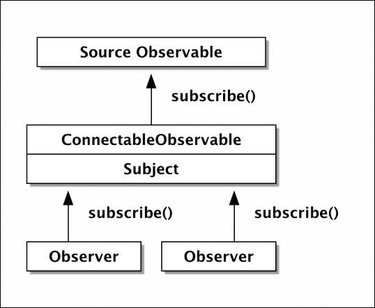
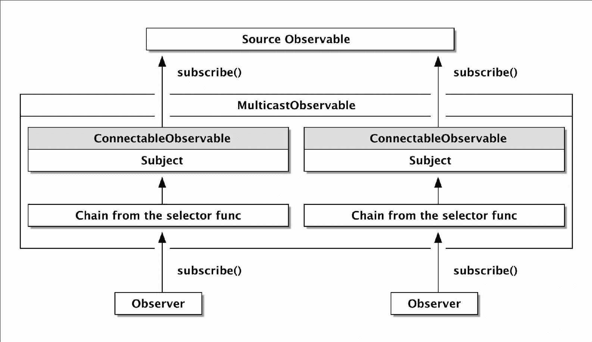

# 第八章。RxPHP 和 PHP7 pthreads 扩展中的多播

为了利用多个 CPU 和多个核心，我们一直在使用子进程。这当然是一个非常简单且安全的方法来并行运行代码。结合 Unix 套接字，我们可以轻松实现进程间通信。在前一章中，我们将所有这些与 RxPHP 结合起来，以创建完全分离且并行运行的应用程序。

在本章中，我们将探讨一个名为 `pthreads` 的非常有趣的 PHP7 扩展，它允许使用 POSIX 线程在 PHP 中实现多线程。

尤其是本章将涵盖以下主题：

+   深入了解 `Subject` 类及其变体。

+   RxPHP 及其所有衍生品中的多播操作符

+   `ConnectableObservable` 和 `MulticastObservable` 的示例

+   使用单个 Subject 实例与多个源 Observables

+   PHP 中多线程的基础

+   关于今天 `pthreads` 扩展的状态、其两个主要版本及其当前实际使用的说明

+   使用 `pthreads` 扩展编写几个多线程应用程序，以演示如何使用 `Thread`、`Worker` 和 `Poll` 类

在我们并行处理之前，我们应该看看反应式扩展的另一个特性，即多播，它涉及 `multicast()` 操作符及其衍生品。多播是围绕 Subjects 构建的，所以让我们首先更好地看看我们有哪些不同类型的 Subject 可用。

# 主题

自从 第二章，*使用 RxPHP 进行响应式编程*，我们在这本书中一直在使用 Subjects，但 `Subject` 类有多个不同的变体，用于更具体的用例，其中所有这些都与多播相关。

## BehaviorSubject

`BehaviorSubject` 类扩展了默认的 `Subject` 类，并允许我们设置一个默认值，该值在订阅时传递给其观察者。考虑以下非常简单的 `BehaviorSubject` 示例：

```php
// behaviorSubject_01.php  
use Rx\Subject\BehaviorSubject; 

$subject = new BehaviorSubject(42); 
$subject->subscribe(new DebugSubject()); 

```

当 `DebugSubject` 订阅 `BehaviorSubject` 类时，默认值 `42` 立即发出。这与使用 `startWith()` 操作符的功能类似。

输出结果只是一行：

```php
$ php behaviorSubject_01.php
15:11:54 [] onNext: 42 (integer)

```

## ReplaySubject

`ReplaySubject` 类内部包含一个数组，其中包含它接收到的最后 *N* 个值，并在订阅时自动将这些值重新发射给每个新的观察者。

在以下示例中，我们订阅了 `RangeObservable`，它立即将其所有值发射到 `ReplaySubject` 类。最后三个值始终存储在数组中，当我们稍后使用 `DebugSubject` 类订阅时，它将立即接收到这三个值：

```php
// replaySubject_01.php 
use Rx\Subject\ReplaySubject; 
$subject = new ReplaySubject(3); 

Observable::range(1, 8) 
    ->subscribe($subject); 

$subject->subscribe(new DebugSubject()); 

```

输出结果由 `ReplaySubject` 类接收的最后三个值组成：

```php
$ php replaySubject_01.php 
15:46:30 [] onNext: 6 (integer)
15:46:30 [] onNext: 7 (integer)
15:46:30 [] onNext: 8 (integer)
15:46:30 [] onCompleted

```

注意，我们还收到了 `complete` 信号，这是正确的，因为它是由 `RangeObservable` 发出的。

## AsyncSubject

RxPHP 提供的最后一个 Subject 类型称为 `AsyncSubject`，这可能会有些令人困惑。这个 Subject 唯一做的事情就是只发出它在接收到 `complete` 信号之前接收到的最后一个值。

我们将在与上一个示例类似的一个例子中演示这个 Subject。我们只需改变操作的顺序，并在订阅源 Observable 之前订阅 `DebugSubject` 类，以看到它默默地抑制了所有值，除了最后一个：

```php
// asyncSubject_01.php 
use Rx\Subject\AsyncSubject; 
$subject = new AsyncSubject(); 
$subject->subscribe(new DebugSubject()); 

Observable::range(1, 8) 
    ->subscribe($subject); 

```

输出只有源 `RangeObservable` 发出的最后一个值：

```php
$ php asyncSubject_01.php 
16:00:46 [] onNext: 8 (integer)
16:00:46 [] onCompleted

```

现在我们已经知道了一切，可以开始使用多播以及特定的 `multicast()` 操作符了。

# RxPHP 中的多播

在响应式扩展中，多播意味着通过 `Subject` 类的实例在多个观察者之间共享单个订阅。所有多播操作符在内部都基于通用的 `multicast()` 操作符，它实现了它们最常用的功能。当然，我们不仅限于只使用 `Subject` 类，我们还会使用 `ReplaySubject` 和 `BehaviorSubject`。

多播在所有 Rx 实现中都很常见，因此了解其内部工作原理通常很有用。

## `multicast()` 操作符和 ConnectableObservable

`multicast()` 操作符根据我们传递的参数返回 `ConnectableObservable` 或 `MulticastObservable`。我们首先看看它是如何与 `ConnectableObservable` 一起工作的，因为这对我们来说应该非常熟悉。

一个典型的用例可能看起来像以下示例：

```php
// multicast_01.php  
$observable = Rx\Observable::defer(function() { 
        printf("Observable::defer\n"); 
        return Observable::range(1, 3); 
    }) 
    ->multicast(new Subject()); 

$observable->subscribe(new DebugSubject('1')); 
$observable->subscribe(new DebugSubject('2')); 
$observable->connect(); 

```

我们没有实例化 `ConnectableObservable`，而是使用了 `multicast()` 操作符来帮我们完成。

在这个示例中，我们创建了一个单独的源 Observable，并订阅了两个观察者。然后，在调用 `connect()` 之后，`ConnectableObservable` 类订阅了由 `Observable::defer` 静态方法返回的 `AnonymousObservable` 实例。

如我们所见，`multicast()` 操作符返回一个 `ConnectableObservable` 的实例。这个示例的结果如下：

```php
$ php multicast_01.php 
Observable::defer
10:43:42 [1] onNext: 1 (integer)
10:43:42 [2] onNext: 1 (integer)
10:43:42 [1] onNext: 2 (integer)
10:43:42 [2] onNext: 2 (integer)
18:12:16 [1] onNext: 3 (integer)
18:12:16 [2] onNext: 3 (integer)
10:43:42 [1] onCompleted
10:43:42 [2] onCompleted

```

所有观察者都订阅了我们传递的同一个 Subject 实例。这是一个重要的含义，我们需要意识到。

在不久的将来，我们将查看这个示例的一个略微修改的版本，它将向 `multicast()` 传递不同的参数。

## MulticastObservable

另一个用于多播的 Observable 称为 `MulticastObservable`。它的用法与 `ConnectableObservable` 类似，但其内部功能非常不同。考虑以下示例：

```php
// multicastObservable_01.php 
$source = Rx\Observable::defer(function() { 
    printf("Observable::defer\n"); 
    return Observable::range(1, 3); 
}); 

$observable = new MulticastObservable($source, function() { 
    return new Subject(); 
}, function (ConnectableObservable $connectable) { 
    return $connectable->startWith('start'); 
}); 

$observable->subscribe(new DebugSubject('1')); 
$observable->subscribe(new DebugSubject('2')); 

```

当订阅`MulticastObservable`时，它会在源 Observable（正如我们在上一个示例中看到的，它返回`ConnectableObservable`）上内部调用`multicast()`操作符，并运行第一个可调用函数来创建`Subject`类的实例。这是与仅使用`multicast()`相比的第一个主要区别，在后者中，我们始终共享相同的`Subject`类实例。相比之下，`MulticastObservable`为每个订阅者创建一个新的`Subject`。

因此，在内部，我们有一个`ConnectableObservable`的实例。然后它调用第二个可调用函数，并将这个`ConnectableObservable`作为参数传递，这意味着我们可以进一步链式添加操作符，或者我们甚至可以使用一个完全不同的 Observable（只需记住这个方法必须返回一个 Observable，因为操作符将内部订阅它）。

这个可调用函数通常被称为**选择器函数**，因为它允许我们选择我们想要订阅的位置。之后，`MulticastObservable`订阅返回的 Observable，并在`ConnectableObservable`上调用`connect()`方法。

在我们的示例中，我们为每个订阅者创建一个`Subject`类的实例，然后使用`ConnectableObservable`链式添加`startWith()`，这使得它在从源发出值之前发出单个值。

输出将如下所示：

```php
$ php multicastObservable_01.php 
12:54:20 [1] onNext: start (string)
Observable::defer
12:54:20 [1] onNext: 1 (integer)
12:54:20 [1] onNext: 2 (integer)
12:54:20 [1] onNext: 3 (integer)
12:54:20 [1] onCompleted
12:54:20 [2] onNext: start (string)
Observable::defer
12:54:20 [2] onNext: 1 (integer)
12:54:20 [2] onNext: 2 (integer)
12:54:20 [2] onNext: 3 (integer)
12:54:20 [2] onCompleted

```

注意，延迟的 Observable 被调用了两次，这是正确的。每个观察者都有自己的 Subject 和`ConnectableObservable`实例。我们完全控制我们用于多播的 Subjects，而不是将其留给默认的`multicast()`行为。

问题是，我们是否使用相同的 Subject 实例，这究竟有什么关系？

### Subjects 及其内部状态

我们知道如何使用 Subjects。我们也知道`next`、`complete`和`error`信号的作用。那么，如果我们使用单个`Subject`并多次订阅冷 Observable 会发生什么？考虑以下示例：

```php
// subject_01.php 
$subject = new Subject(); 

$subject->subscribe(new DebugSubject('1')); 
$subject->onNext(1); 
$subject->onNext(2); 
$subject->onNext(3); 
$subject->onCompleted(); 

$subject->subscribe(new DebugSubject('2')); 
$subject->onNext(4); 
$subject->onCompleted(); 

```

我们将运行这个示例，并讨论`Subject`实例内部发生的事情。请注意，我们两次订阅了`Subject`，第一个观察者（由`DebugSubject`表示）接收前三个值，然后发出`complete`信号。

然而，第二个观察者会发生什么呢？

```php
$ php subject_01.php 
13:15:00 [1] onNext: 1 (integer)
13:15:00 [1] onNext: 2 (integer)
13:15:00 [1] onNext: 3 (integer)
13:15:00 [1] onCompleted
13:15:00 [2] onCompleted

```

第二个观察者只接收了`complete`信号，而没有观察者接收了值`4`。

理解当`Subject`类接收到`complete`信号（这意味着它接收到一个`complete`信号或我们手动调用`onCompleted()`方法）时内部发生的事情非常重要：

1.  `Subject`类检查它是否已经被标记为停止。如果是，则方法立即返回。如果没有停止，则它将自己标记为停止。

1.  完整的信号随后发送给所有观察者。

1.  观察者数组被清空。

所以现在应该很清楚。前三个值像往常一样发出。然后我们调用了`onComplete()`，它正好做了我们在这几点中描述的事情。此时，这个`Subject`实例没有观察者（参见步骤 4）。然后我们用另一个观察者订阅，该观察者被添加到观察者数组中。这个观察者立即收到一个`complete`信号，因为 Subject 已经停止，并且没有以错误结束。

在这一点上，调用`onNext(4)`没有任何作用，因为`Subject`实例已经停止了（参见步骤 1）。

这个原则可能在某些情况下成为问题，例如，当我们故意想要延迟使用`Observable::defer`静态方法创建可观察对象时，该方法将被多次调用。一旦它发送了`complete`信号，所有后续的值都将被`Subject`实例忽略，原因我们在前面已经解释过了。我们将在本章后面提供另一个涉及此问题的示例。

这是我们使用`multicast()`操作符和`ConnectableObservable`时需要了解的一个非常重要的原则。

这个是否适用于`MulticastObservable`取决于我们对其第一次可调用返回的内容。我们可以使用同一个`Subject`实例，或者根据我们想要达到的目的创建一个新的实例。

### 注意

如果这一切看起来很混乱，只需记住 Subjects 有一个内部状态。当它们收到`complete`或`error`通知时，它们永远不会重新发出任何值。

## multicast()操作符和 MulticastObservable

所以让我们回到`multicast()`操作符，看看`MulticastObservable`是如何与所有这些相关的。我们说过，`multicast()`返回`ConnectableObservable`或`MulticastObservable`，这取决于我们使用的参数。当我们使用`multicast()`的第二个参数时，这是正确的。

考虑以下示例，其中我们还将选择器函数传递给`multicast()`操作符：

```php
// multicast_02.php  
use Rx\Observable; 
use Rx\Subject\Subject; 

$subject = new Subject(); 
$source = Observable::range(1, 3) 
    ->multicast($subject, function($connectable) { 
        return $connectable->concat(Observable::just('start')); 
    }) 
    ->concat(Observable::just('concat')); 

$source->subscribe(new DebugSubject()); 
$source->subscribe(new DebugSubject()); 

```

如果我们使用`multicast()`的第二个参数，它会在传递给`MulticastObservable`之前将`$subject`变量包装在一个可调用函数中。实际上，`multicast()`在内部实现如下：

```php
function multicast($subject, $selector=null, $scheduler=null){ 
  return $selector ? 
    new MulticastObservable($this, function () use ($subject) { 
      return $subject; 
    }, $selector) : 
    new ConnectableObservable($this, $subject, $scheduler); 
} 

```

这始终保证了我们使用的是同一个`Subject`。唯一决定我们将收到哪个可观察对象的是我们是否使用选择器函数。前面的示例还添加了`startWith()`和`concat()`操作符，以查看这个选择器函数可以产生什么效果。

这个示例的输出受到了我们之前展示的问题的影响：

```php
$ php multicast_02.php
13:41:23 [] onNext: start (string)
13:41:23 [] onNext: 1 (integer)
13:41:23 [] onNext: 2 (integer)
13:41:23 [] onNext: 3 (integer)
13:41:23 [] onNext: concat (string)
13:41:23 [] onCompleted
13:41:23 [] onNext: start (string)
13:41:23 [] onNext: concat (string)
13:41:23 [] onCompleted

```

第二个订阅者没有收到任何值，尽管我们两次订阅了源可观察对象。

### 比较可连接可观察对象和 MulticastObservable

为了更清楚地了解这两个用例以及`ConnectableObservable`和`MulticastObservable`之间的区别，让我们看看这两个图：



表示具有两个观察者的可连接可观察对象图

在这个图中，我们有一个包含一个`Subject`的单个`ConnectableObservable`，两个观察者都订阅了同一个`Subject`。

另一方面，使用`MulticastObservable`我们将得到以下结构：



表示具有两个观察者的`MulticastObservable`的图

灰色框内的两个`ConnectableObservables`意味着我们无法控制它们（这些是由前面提到的内部`multicast()`调用自动创建的）。

从示例中我们可以看出，通过`multicast()`调用创建的`MulticastObservable`，我们无法达到图中所示的结果，因为`multicast()`总是强制我们使用单个`Subject`实例。当然，我们也可以像本章前面所看到的那样，自己创建`MulticastObservable`的实例，但还有一个操作符可以用来实现这个目的。

## `multicastWithSelector()`操作符

为了简化创建`MulticastObservable`实例的过程，我们提供了`multicastWithSelector()`操作符，它接受两个具有与直接调用`MulticastObservable`相同目的的可调用参数。

考虑以下示例：

```php
// multicastWithSelector_01.php  
$source = Observable::range(1, 3) 
    ->multicastWithSelector(function() { 
        return new Subject(); 
    }, function(ConnectableObservable $connectable) { 
        return $connectable->concat(Observable::just('concat')); 
    }); 

$source->subscribe(new DebugSubject()); 
$source->subscribe(new DebugSubject()); 

```

本例说明了我们之前看到的图。我们有两个观察者，每个观察者都有自己的`Subject`实例。我们还使用了选择器函数，在链的末尾添加了一个`concat`字符串。

输出结果很容易预测：

```php
$ php multicastWithSelector_01.php 
15:05:56 [] onNext: 1 (integer)
15:05:56 [] onNext: 2 (integer)
15:05:56 [] onNext: 3 (integer)
15:05:56 [] onNext: concat (string)
15:05:56 [] onCompleted
15:05:56 [] onNext: 1 (integer)
15:05:56 [] onNext: 2 (integer)
15:05:56 [] onNext: 3 (integer)
15:05:56 [] onNext: concat (string)
15:05:56 [] onCompleted

```

这是对 Rx 中的多播和 RxPHP 中的`multicast()`操作符的介绍。由于还有一些基于`multicast()`的其他操作符，因此在我们了解`multicast()`的内部行为后，我们将讨论它们。

## `publish*()`和`share*()`操作符组

内部存在多个使用`multicast()`操作符的其他操作符，我们可以将它们分为两个基本组：

+   `publish*()`：以“publish”开头的操作符包装`multicast()`操作符，并使用其中一个`Subject`类调用它。所有`publish*`变体都接受一个可选参数，即我们之前提到过的选择器函数。因此，所有这些都可以返回`ConnectableObservable`或`MulticastObservable`，就像`multicast()`一样。

+   `share*()`：以“share”开头的操作符在内部使用相同的`publish*`等效操作符，并将其与`refCount()`操作符链式连接。所有`share*`操作符都不允许任何选择器函数。

要理解这两组之间的区别，我们首先需要了解`refCount()`操作符是什么。

### `refCount()`操作符

我们已经了解了`ConnectableObservable`的这种非常基本的用法。让我们考虑以下示例，首先看看我们如何手动调用`connect()`方法，然后切换到`refCount()`操作符：

```php
// refCount_01.php  
$source = Observable::create(function($observer) { 
    $observer->onNext(1); 
    $observer->onNext(2); 
    $observer->onNext(3); 
}); 
$conn = new Observable\ConnectableObservable($source); 
$conn->subscribe(new DebugSubject('1')); 
$conn->subscribe(new DebugSubject('2')); 
$conn->connect(); 

```

这很简单。我们有两个订阅了 `ConnectableObservable` 的观察者，等待调用 `connect()`，它订阅了源 Observable（在这种情况下是具有自定义订阅函数的 `AnonymousObservable`）并将所有值同时发送给两个观察者。

注意，我们故意没有使用 `RangeObservable`，因为我们不想发出 `complete` 信号：

```php
$ php refCount_01.php 
17:20:41 [1] onNext: 1 (integer)
17:20:41 [2] onNext: 1 (integer)
17:20:41 [1] onNext: 2 (integer)
17:20:41 [2] onNext: 2 (integer)
17:20:41 [1] onNext: 3 (integer)
17:20:41 [2] onNext: 3 (integer)

```

这很简单，但我们不得不自己调用 `connect()`，这有时是可以接受的。然而，在其他时候，我们可以将这种逻辑留给 `refCount()` 操作符。

嗯，实际上它不是一个操作符（它没有被提升到使用 `lift()` 方法的 Observable 链）。它只是 `ConnectableObservable` 上的一个方法，返回一个 `RefCountObservable` 实例。

这个 Observable 内部订阅和取消订阅源 Observable。当第一个观察者订阅时，它也会在 `ConnectableObservable` 上调用 `connect()`。然后当另一个观察者订阅时，它什么都不做，因为我们已经订阅了。在取消订阅时，程序正好相反。如果最后一个观察者取消订阅，那么 `RefCountObservable` 也会取消 `ConnectableObservable` 的订阅。

这有一些有趣的结果。我们可以使用 `refCount()` 在至少有一个观察者时自动订阅，正如我们在这个示例中可以看到的那样：

```php
// refCount_02.php  
$source = Rx\Observable::create(function($observer) { 
    $observer->onNext(1); 
    $observer->onNext(2); 
    $observer->onNext(3); 
}); 
$conn = (new Rx\Observable\ConnectableObservable($source)) 
    ->refCount(); 

$conn->subscribe(new DebugSubject('1')); 
$conn->subscribe(new DebugSubject('2')); 

```

我们再次有两个观察者，但这次我们不是自己调用 `connect()`。相反，我们使用 `refCount()` 来为我们调用 `connect()` 方法。由于我们共享对源的相同订阅，只有第一个观察者会收到值。第二个观察者不会导致对源的另一个订阅（正如我们从前面的解释中可以看到）：

```php
$ php refCount_02.php 
17:52:05 [1] onNext: 1 (integer)
17:52:05 [1] onNext: 2 (integer)
17:52:05 [1] onNext: 3 (integer)

```

然而，如果我们收到第一个观察者的值后取消订阅（这会导致 `RefCountObservable` 内部的 `ConnectableObservable` 取消订阅）然后再次使用第二个观察者订阅，它将使源发出所有值，因为我们再次订阅了它：

```php
// refCount_03.php 
// ... 
$sub = $conn->subscribe(new DebugSubject('1')); 
$sub->dispose(); 
$conn->subscribe(new DebugSubject('2')); 

```

当我们调用 `dispose()` 时，我们使 `RefCountObservable` 取消订阅其源，因为没有更多的观察者。

这个示例打印了所有值两次：

```php
$ php refCount_03.php 
17:53:29 [1] onNext: 1 (integer)
17:53:29 [1] onNext: 2 (integer)
17:53:29 [1] onNext: 3 (integer)
17:53:29 [2] onNext: 1 (integer)
17:53:29 [2] onNext: 2 (integer)
17:53:29 [2] onNext: 3 (integer)

```

当然，我们需要确保我们不会停止 `ConnectableObservable` 内部的 `Subject`，正如我们之前讨论的那样。`ConnectableObservable` 类使用一个 `Subject` 的单例，所以如果它收到了完成信号，那么取消订阅或订阅的任何变化都不会改变这一点。

## publish() 和 share() 操作符

现在我们知道了 `multicast()` 和 `refCount()` 操作符的作用，我们最终可以理解 `publish()` 和 `share()` 的作用。

使用 `publish()` 只是一个调用带有 `Subject` 实例参数的 `multicast()` 的快捷方式。如果我们重写 `multicast()` 操作符的第一个示例，它看起来几乎一样：

```php
// publish_01.php  
use Rx\Observable; 
$observable = Observable::defer(function() { 
        printf("Observable::defer\n"); 
        return Observable::range(1, 3); 
    }) 
    ->publish(); 

$observable->subscribe(new DebugSubject('1')); 
$observable->subscribe(new DebugSubject('2')); 
$observable->connect(); 

```

这个演示的输出与 `multicast_01.php` 的输出完全相同，所以我们不需要在这里重新打印它。

`share()`操作符在内部使用`publish()->refCount()`链，因此我们不再需要调用`connect()`。然而，输出并不相同。

`RangeObservable`发送了完整的信号，这标志着`ConnectableObservable`中的内部`Subject`已停止，因此第二个观察者除了接收`Subject`类在订阅点发出的`complete`信号外，不会接收到任何东西（它不是由源 Observable 发出的）：

```php
// share_01.php  
use Rx\Observable; 
$observable = Observable::defer(function() { 
        printf("Observable::defer\n"); 
        return Observable::range(1, 3); 
    }) 
    ->share(); 

$observable->subscribe(new DebugSubject('1')); 
$observable->subscribe(new DebugSubject('2')); 

```

从输出中，我们可以看到源 Observable 实际上只创建了一次：

```php
$ php share_01.php 
Observable::defer
18:17:12 [1] onNext: 1 (integer)
18:17:12 [1] onNext: 2 (integer)
18:17:12 [1] onNext: 3 (integer)
18:17:12 [1] onCompleted
18:17:12 [2] onCompleted

```

这两个基本操作符有许多变体，但都是基于相同的原则。

## `publishValue()`和`shareValue()`操作符

这些操作符基于`BehaviorSubject`而不是仅仅基于`Subject`。原理完全相同。`publishValue()`操作符使用`BehaviorSubject`的实例调用`multicast()`。然后`shareValue()`操作符调用`publishValue()->refCount()`。

使用`BehaviorSubject`允许我们在观察者订阅时向所有观察者发出默认值。

我们可以在之前的示例上测试这个操作符：

```php
// publishValue_01.php  
$source = Observable::defer(function() { 
        printf("Observable::defer\n"); 
        return Observable::range(1, 3); 
    }) 
    ->publishValue('default'); 

$source->subscribe(new DebugSubject()); 
$source->subscribe(new DebugSubject()); 
$source->connect(); 

```

输出始终以默认字符串开始，因为它作为第一个值由`BehaviorSubject`发出：

```php
$ php publishValue_01.php 
18:47:17 [] onNext: default (string)
18:47:17 [] onNext: default (string)
Observable::defer
18:47:17 [] onNext: 1 (integer)
18:47:17 [] onNext: 1 (integer)
18:47:17 [] onNext: 2 (integer)
18:47:17 [] onNext: 2 (integer)
18:47:17 [] onNext: 3 (integer)
18:47:17 [] onNext: 3 (integer)
18:47:17 [] onCompleted
18:47:17 [] onCompleted

```

使用`shareValue()`与使用`share()`相同，因此我们不需要在这里包含它。

## `replay()`、`shareReplay()`和`publishLast()`操作符

所有这些操作符与前面的两个操作符具有完全相同的原则，只是基于`ReplaySubject`（`replay()`和`shareReplay()`）或`AsyncSubject`（`publishLast()`操作符）。

我们不需要为这些操作符提供示例，因为我们不会看到任何新的内容。

# PHP pthreads 扩展

自 2000 年以来，PHP 可以编译为**线程安全**，这允许任何进程在多个线程中运行多个 PHP 解释器的多个实例（每个 PHP 解释器一个线程）。每个 PHP 解释器都有自己的独立上下文，与其他解释器不共享任何数据（“无共享”哲学）。

这通常用于像 Apache（取决于其模块）这样的 Web 服务器。Apache 创建了多个子进程，每个子进程运行多个线程，每个线程运行多个 PHP 解释器。在线程中而不是在子进程中运行解释器有其优点和缺点。

仅创建线程比创建子进程要快得多，并且消耗的内存也少得多。

一个明显的缺点是隔离。尽管所有 PHP 解释器都在线程中独立运行，但如果其中任何一个发生，例如，"段错误"错误，那么整个进程及其所有线程将立即终止。这甚至包括没有引发任何错误且可能正在处理来自另一个客户端的 HTTP 请求的线程。

这个所谓的**服务器 API**（**SAPI**）对我们来说并不很有帮助。我们需要能够在线程中运行我们自己的代码片段（“用户空间多线程”）。PHP 扩展 pthreads 是一个面向对象的 API，它正好做到了这一点。它将我们的代码转换成一个新的 PHP 解释器，然后开始执行它。

注意，PHP 的 pthreads 基于 POSIX 线程，这意味着当我们使用 pthread 创建一个线程时，我们实际上是在创建一个真正的线程，而不是在下面进行分叉或创建子进程。

在某些语言中，例如 Python，有看起来像是在并行执行代码的线程，但实际上仍然只有一个单线程的 Python 解释器在从一个“线程”切换到另一个。所以没有真正的并行性。

然而，PHP `pthreads`有其代价，并且理解至少一点其内部发生的事情是很重要的。

## 前置条件

在这一章中，我们将使用新的`pthreads` v3，这意味着我们需要使用 PHP7+。还有一个较老的`pthreads` v2，它是为 PHP5 设计的。由于这两个版本在内部实现上有重大差异，我们将只使用新的一个。

如我们之前所说，为了使用`pthreads`扩展，PHP 必须编译时启用**线程安全**选项。这需要在编译 PHP 时启用，不能在之后启用（如果你只下载 PHP 可执行文件，请确保你下载的是正确的，通常标记为 ZTS）。

安装`pthreads`的一个通用方法是使用 PECL 工具，它应该在所有平台上都适用：

```php
$ pecl install pthreads

```

或者，如果你正在运行 OS X，你可以使用一个 homebrew 工具，它也可以为你启用 PHP 配置文件中的它：

```php
$ brew install php70-pthreads

```

### 注意

当在独立脚本中运行 PHP 代码时，才能启用当前版本的 pthreads v3。这意味着 pthreads 不能是使用例如`php-fpm`运行的任何 PHP 应用程序的一部分。换句话说，我们只能在控制台应用程序中使用 pthreads，而不能在 Web 应用程序中使用。

## PHP7 中 pthreads 的多线程简介

PHP 中 pthreads 最基础的例子可以是简单地创建多个线程并打印它们的结果。我们将使用`sleep()`函数来模拟多个长时间运行的任务。记住，在 PHP 中，`sleep()`函数始终是阻塞的（它会阻塞解释器执行一定的时间）：

```php
// threads_01.php  
class MyThread extends Thread { 
    protected $i; 
    public function __construct($i) { 
        $this->i = $i; 
    } 
    public function run() { 
        sleep(rand(1, 5)); 
        printf("%d: done\n", $this->i); 
    } 
} 

$threads = []; 
foreach (range(0, 5) as $i) { 
    $thread = new MyThread($i); 
    $thread->start(); 
    $threads[] = $thread; 
} 

foreach ($threads as $thread) { 
    $thread->join(); 
} 
echo "All done\n"; 

```

一个任务由一个扩展基本`Thread`类并实现其`run()`方法的类来表示。这个`run()`方法包含在我们调用`start()`时将在单独的线程中运行的代码。注意，我们需要实现`run()`方法，而不是`start()`方法。`start()`方法是一个用 C 编写的内部方法，它会为我们调用`run()`。

在创建并启动每个线程后，我们使用 `join()` 方法，它会阻塞当前解释器并等待特定线程完成。如果它已经完成，那么它将继续。通过遍历所有线程并调用 `join()`，我们实际上等待它们全部完成。

当我们运行这个示例时，我们会得到以下结果（由于我们使用了随机的睡眠间隔，所以你会得到不同的顺序）：

```php
$ php threads_01.php 
0: done
2: done
1: done
5: done
3: done
4: done
All done

```

在本章中，我们不会深入探讨使用 `pthreads` 扩展。截至 2017 年 4 月，主要原因有三个：

+   **关于 pthreads 的文档非常不足**：关于 pthreads 中大多数类和方法的文档包含的信息非常少。最多只有一句话，通常没有任何示例，所以大部分都要靠开发者去猜测它是什么意思。

+   **文档、示例和其他信息来源通常是过时的**：新的 pthreads v3 只能与 PHP7 一起使用。然而，官方文档[`php.net/manual/en/book.pthreads.php`](http://php.net/manual/en/book.pthreads.php)只涵盖了 `pthreads` v2。与此同时，`pthreads` 的内部结构已经改变，所以你可能会惊讶地发现一些示例根本无法工作。例如，`Mutex` 和 `Cond` 类现在根本不存在。

+   **文档不存在**：随着 pthreads v3 一起到来的新类完全没有文档。官方主页 [`github.com/krakjoe/pthreads`](https://github.com/krakjoe/pthreads) 提到了两个版本之间的差异，但没有包含任何关于如何有效使用它们的信息。例如，在 [`php.net/manual/en/book.pthreads.php`](http://php.net/manual/en/book.pthreads.php) 找到的 PHP 文档根本就没有提到 `Volatile` 类。

这一切意味着使用 pthreads 在目前来说很痛苦，获取任何相关信息都很困难。

关于在保持完全隔离的同时需要共享数据的多个 PHP 上下文也有一些注意事项。由于我们需要意识到这些问题，花些时间解释这对我们意味着什么是很值得的。

## 从/向线程获取/设置数据

在 PHP 中，所有对象默认都是通过引用传递的。考虑以下示例，我们将一个 `stdClass` 实例传递给另一个对象，并对其进行修改：

```php
// references_01.php  
$obj = new stdClass(); 
$obj->prop = 'foo'; 

$obj2 = $obj; 
printf("%d\n", $obj === $obj2); 

class TestClass { 
    public $obj; 
    public $objCopy; 

    public function copyObj() { 
        $this->objCopy = $this->obj; 
        $this->objCopy->prop2 = 'bar'; 
    } 
} 

$testObj = new TestClass(); 
$testObj->obj = $obj; 
$testObj->copyObj(); 
printf("%d\n", $obj === $testObj->objCopy); 
print_r($obj); 

```

我们创建了一个名为 `$obj` 的 `stdClass` 实例。然后我们将它重新赋值给 `$obj2`，并使用一个身份运算符（三个等号 `===`）比较这两个实例。然后我们将 `$obj` 传递给 `TestClass` 的一个实例，在那里我们做了同样的事情，并且还给它添加了一个名为 `prop2` 的属性。

这个示例的输出结果是我们可能预期的：

```php
$ php7 references_01.php 
1
1
stdClass Object (
 [prop] => foo
 [prop2] => bar
)

```

所有变量都引用同一个对象。这是我们习惯的，也是我们在 PHP 中一直使用的。

然而，这不能与`pthreads`一起工作。我们不允许在不同 PHP 上下文中共享对象（内存地址）。这些必须始终是隔离的，这是线程安全执行的基本前提。我们可以通过一个非常简单的例子来测试这一点，紧接着上一个例子：

```php
// threads_02.php  
class MyThread extends Thread { 
    public $obj; 
    public $objCopy; 

    public function run() { 
        $this->objCopy = $this->obj; 
        $this->objCopy->prop2 = 'bar'; 
        printf("%d\n", $this->obj === $this->obj); 
    } 
} 

$obj = new stdClass(); 
$obj->prop = 'foo'; 

$thread = new MyThread($obj); 
$thread->obj = $obj; 
$thread->start(); 
$thread->join(); 

printf("%d\n", $obj === $thread->objCopy); 
print_r($obj); 

```

在这个例子中，我们使用身份操作符来比较`$this->obj`与另一个应该引用相同对象的变量。

现在我们来看看运行这个例子会发生什么：

```php
$ php threads_02.php 
0
0
stdClass Object (
 [prop] => foo
)

```

所有比较都返回`false`。即使是显而易见的一个，`$this->obj === $this->obj`也返回`false`。

在`pthreads`中，它必须这样工作，因为 PHP 解释器是隔离的，因此所有来自父上下文和其他上下文的读取和写入操作都需要通过复制数据来执行。然而，有一个例外。来自`pthreads`扩展的类（包括所有其子类）不会被复制，而是被引用，我们将在后面的例子中看到。

因此，在这个例子中，我们实际上复制了对象多次。每次调用`$this->obj`都会在当前上下文中创建一个副本，以及到最后的`$thread->objCopy`语句。

这个原则的后果是我们必须手动收集线程的结果；我们不能仅仅传递一个对象给构造函数，该对象将由线程本身填充结果。

第一个例子的修改版本看起来像这样：

```php
// threads_08.php  
class MyThread extends Thread { 
    protected $i; 
    public $result; 

    public function __construct($i) { 
        $this->i = $i; 
    } 

    public function run() { 
        sleep(rand(1, 5)); 
        printf("%d: done\n", $this->i); 
        $this->result = pow($this->i, 2); 
    } 
} 

$threads = []; 
foreach (range(5, 7) as $i) { 
    $thread = new MyThread($i); 
    $thread->start(); 
    $threads[] = $thread; 
} 

foreach ($threads as $i => $thread) { 
    $thread->join(); 
    printf("%d: %d\n", $i, $thread->result); 
} 
echo "All done\n"; 

```

这基本上是之前的相同演示；我们只是将每个线程的结果存储在一个公共属性中，我们可以在调用`join()`之后读取这些结果。

这个例子的输出如下：

```php
$ php threads_08.php 
7: done
5: done
6: done
0: 25
1: 36
2: 49
All done

```

虽然创建线程很简单，但如果我们有多个线程，就很难跟踪哪些线程正在运行，哪些已经完成。在实际应用中，通常不需要创建许多线程来执行一次。创建这么多线程是不高效的，更重要的是，是不必要的。

## 使用 Thread、Worker 和 Pool 类

`Thread`类代表一个单独的解释器上下文和一个单独的任务。当我们想要多次运行相同的任务时，我们需要创建该类多个实例，然后合并所有结果（等待它们完成）。

还有`Worker`类。与`Thread`类类似，它代表一个单独的解释器上下文，但它不是执行单个工作，而是可以堆叠工作并依次执行它们。

我们可以取之前的`MyThread`类，这次我们将所有任务在一个单独的`Worker`上执行：

```php
// threads_03.php  

class MyThread extends Thread { 
    protected $i; 
    public $result; 

    public function __construct($i) { 
        $this->i = $i; 
    } 

    public function run() { 
        sleep(rand(1, 5)); 
        printf("%d: done\n", $this->i); 
        $this->result = pow($this->i, 2); 
    } 
} 

$worker = new Worker(); 
$threads = []; 
foreach (range(1, 4) as $i) { 
    $thread = new MyThread($i); 
    $worker->stack($thread); 
    $threads[] = $thread; 
} 

$worker->start(); 
echo "Starting worker\n"; 

// Add another task after the worker has started 
$thread = new MyThread(42); 
$worker->stack($thread); 
$threads[] = $thread; 
$worker->shutdown(); 

foreach ($threads as $i => $thread) { 
    printf("%d: %d\n", $i, $thread->result); 
} 
echo "All done\n"; 

```

由于我们有一个单独的解释器上下文，所有任务都将依次执行。通过调用`shutdown()`，我们让`Worker`类等待直到所有堆叠的任务完成。我们也可以在它开始执行后添加任务到工作者：

```php
$ php7 threads_03.php 
Starting worker
5: done
6: done
7: done
42: done
0: 25
1: 36
2: 49
3: 1764
All done

```

注意任务是一个接一个运行的，而不是并行运行。

我们使用了`pthreads`提供的默认`Worker`类，但也可以创建自己的类，该类从`Worker`扩展。例如，考虑以下类：

```php
class MyWorker extends Worker { 
    public function run() { 
        // ... Initialize this Worker and its context. 
    } 
} 

```

这个类就像`Thread`类一样扩展了`run()`方法。然而，`Worker`类的`run()`方法只在初始化 PHP 解释器上下文时被调用一次，并允许我们设置`Worker`类。

我们当然可以创建多个`Worker`实例并将任务堆叠在它们上面，但处理哪些工作进程可用以及哪些工作进程正忙将是繁琐的。

因此，`pthreads`有`Pool`类。它可以包含一定数量的工作进程并将任务分配给它们。我们不需要担心选择正确的工作进程，可以将一切交给`Pool`类。

现在让我们考虑以下示例，我们将使用三个`Worker`类的`Pool`来执行总共六个任务：

```php
// threads_04.php 
class MyWorker extends Worker { 
    public function run() { 
        printf("%s: starting worker\n", date('H:i:s')); 
    } 
} 
class Task extends Threaded { 
    public function run() { 
        sleep(3); 
        printf("%s: done\n", date('H:i:s')); 
    } 
} 
printf("%s: start\n", date('H:i:s')); 
$pool = new Pool(3, MyWorker::class); 

foreach (range(0, 5) as $i) { 
    $pool->submit(new Task()); 
} 

$pool->shutdown(); 
echo "All done\n"; 

```

每个`Task`实例都会进行三秒钟的休眠。由于我们使用了三个`Worker`类，我们可以同时运行三个任务，因此运行这个演示应该正好需要六秒钟。就像我们对`Worker`类所做的那样，我们调用`shutdown()`，它会等待所有任务处理完毕然后关闭所有工作进程。这就像对每个任务调用`join()`一样。

`Pool`类接受三个参数：同时运行的工作进程数量，它将实例化的`Worker`类名称（我们显然也可以使用默认的`Worker::class`），以及传递给`Worker`类构造函数的参数数组。

这个示例的输出如下：

```php
$ php threads_04.php
22:50:51: start
22:50:51: starting worker
22:50:51: starting worker
22:50:51: starting worker
22:50:54: done
22:50:54: done
22:50:54: done
22:50:57: done
22:50:57: done
22:50:57: done
All done 

```

从开发者的角度来看，主要的不同之处在于我们正在安排六个任务在三个线程上执行。在我们的第一个 pthreads 示例中，我们也执行了六个任务，但是在六个线程上。

一般的规则是使用尽可能少的线程。创建线程需要一些资源分配（主要是创建一个新的 PHP 解释器），而对于实际进行大量计算的作业，代码会达到一个点，此时创建额外的线程将不再产生任何性能上的好处。对于大多数时间都在等待的任务，如系统调用或通过 HTTP 下载数据，并行运行是非常有效的。我们可以为这些任务创建许多线程，它们将并行运行，实际上不需要任何 CPU 时间。

另一方面，如果我们有需要 CPU 时间的任务，那么在某个时候添加更多的线程将不会有任何效果，因为没有更多的 CPU/核心来运行解释器，所以它需要从一个执行上下文切换到另一个。所有线程将并行运行，但完成所有任务将需要很长时间。这是否有价值取决于我们想要实现什么，但通常使用更少的线程并分批执行任务会更好。

### 备注

对于计算密集型任务，一个良好的线程数量通常是计算为 *(CPU 数量) * (每个 CPU 的核心数)*。

因此，这就是我们可能想要使用 `Pool` 类的原因。此外，在先前的例子中我们没有看到的一个重要方面是如何从完成的任务中获取结果。

### 从线程池中检索结果

从线程中获取处理后的数据最简单的方法是保留它们的引用，然后迭代它们以获取结果。最明显的例子可能如下所示：

```php
// threads_12.php 
class MyThread extends Thread { 
    protected $i; 
    public $result; 
    public function __construct($i) { 
        $this->i = $i; 
    } 
    public function run() { 
        $this->result = pow($this->i, 2); 
    } 
} 

$pool = new Pool(3); 
$threads = []; 
foreach (range(1, 7) as $i) { 
    $thread = new MyThread($i); 
    $pool->submit($thread); 
    $threads[] = $thread; 
} 
$pool->shutdown(); 

$results = []; 
foreach ($threads as $thread) { 
    $results[] = $thread->result; 
} 
print_r($results); 

```

这非常简单，并且按预期工作。然而，它并不实用。我们使用了 `shutdown()` 方法等待所有计划中的任务完成，然后从所有线程中收集所有结果。如果我们不想等待所有线程完成，而想在他们准备好时收集结果，这会变得更加复杂。我们可能需要回到类似事件循环的东西，定期检查所有线程的结果。

当然这是可行的，但 pthreads 提供了另一种更优雅的方法来完成这个任务。

因此，`Pool` 类有一个名为 `collect()` 的方法。这个方法接受一个可调用参数，该参数在每一个线程上被调用。这个可调用参数必须决定线程是否已经完成。如果线程已经完成，我们可以在可调用内部直接获取其结果并返回 `true`，这意味着这个线程可以被处理。

不幸的是，有一个很大的但是。在当前的 pthreads v3 中，`Pool::collect()` 的行为可能已经改变。在大多数示例中，你会看到 `collect()` 方法被如下使用：

```php
// threads_10.php  
$pool = new Pool(3); 

while (@$i++ < 6) { 
    $pool->submit(new class($i) extends Thread { 
        public $id; 
        private $garbage; 

        public function __construct($id) { 
            $this->id = $id; 
        } 
        public function run() { 
            sleep(1); 
            printf("Hello World from %d\n", $this->id); 
            $this->setGarbage(); 
        } 
        public function setGarbage() { 
            $this->garbage = true; 
        } 
        public function isGarbage(): bool { 
            return $this->garbage; 
        } 
    }); 
} 
while ($pool->collect(function(Collectable $work){ 
    printf("Collecting %d\n", $work->id); 
    return $work->isGarbage(); 
})) continue; 

$pool->shutdown(); 

```

这个例子使用匿名类（PHP7 的一个特性）来扩展 `Thread` 以表示单个任务。

尽管这个例子看起来很简单，并且在许多资源（包括 pthreads 作者在 stackoverflow.com 上的答案）中被使用，但它并没有收集所有结果。我们在这里包含这个例子是为了展示它应该如何工作，并且很可能在 pthread 的更新版本中是这样工作的。

PHP7 和 pthreads v3 的输出如下（你可能以不同的顺序得到这些行）：

```php
$ php threads_10.php 
Hello World from 1
Collecting 1
Hello World from 2
Collecting 2
Hello World from 3
Collecting 3
Hello World from 4
Hello World from 5
Hello World from 6

```

如你所见，最后三个线程根本就没有被收集。

这可能不工作的几个可能原因：

+   在 pthreads 的早期版本中，我们必须扩展 `Collectable` 类而不是 `Thread` 类。`Collectable` 类原本是一个类，但现在它已经变成了一个接口。这个变化在 pthreads 的 README 页面上有记录（[`github.com/krakjoe/pthreads#php7`](https://github.com/krakjoe/pthreads#php7)）。现在，`Thread` 类自动实现了 `Collectable`。在大多数资源中，你会发现 `Collectable` 被用作一个类。

+   `Pool::collect()` 的官方文档不足。它根本未提及可调用对象需要返回 `Boolean` 以确定线程是否应该被销毁。此外，该文档是为较旧的 `pthreads` v2 而编写的，其中 `collect()` 方法据说返回空值。这并不（或可能从未是）真的，因为它总是用于 `while` 循环中（参见 [`stackoverflow.com/questions/28416842/how-does-poolcollect-works`](http://stackoverflow.com/questions/28416842/how-does-poolcollect-works) 或 [`gist.github.com/krakjoe/9384409`](https://gist.github.com/krakjoe/9384409)）。

+   `Pool::collect()` 的更改在官方的说明书中提到，网址为 [`github.com/krakjoe/pthreads#php7`](https://github.com/krakjoe/pthreads#php7) 。引言：“*将 `Pool::collect` 机制从 `Pool` 移至 `Worker`，以使 `Worker` 更健壮，`Pool` 继承更简单。*” 这意味着什么仍然是个谜。

+   在某些示例中，您会看到开发者扩展 `Pool` 类并使用 `while (count($this->work))` 循环。这可能是为了在有工作计划时循环。在 pthreads v3 中，`work` 属性不存在于 `Pool` 类中。我们之前提到的官方说明页面列出的破坏性更改已经没有这个更改的记录。

因此，我们最大的问题是缺乏任何可靠的信息。

看起来很绝望，但实际上有一种合理的方式来收集所有结果。我们将利用另一个未记录的类 `Volatile` 并将其传递给所有线程。正如我们之前在讨论解释器上下文之间共享数据时所说，所有数据都需要复制。相比之下，来自 pthreads 扩展的类（以及所有扩展它们的类）都是直接引用的，我们将利用这一点。

让我们看看使用 `Volatile` 类从线程中收集结果的这个示例：

```php
// threads_05.php 
class Task extends Thread { 
  public $result; 
  private $i; 

  public function __construct($i, Volatile $results) { 
    $this->i = $i; 
    $this->results = $results; 
  } 
  public function run() { 
    sleep(1); 
    $result = pow($this->i, 2); 
    printf("%s: done %d\n", date('H:i:s'), $result); 

    $this->results->synchronized(function($results,$result){ 
      $results[] = (array)['id' => $this->i,'result' => $result]; 
      $results->notify(); 
    }, $this->results, $result); 
  } 
} 

$pool = new Pool(2); 
$results = new Volatile(); 
foreach (range(0, 3) as $i) { 
  $pool->submit(new Task($i, $results)); 
} 

$results->synchronized(function() use ($results) { 
  while (count($results) != 4) { 
    $results->wait(); 
  } 
}); 

while ($pool->collect()) continue; 
$pool->shutdown(); 
print_r($results); 
echo "All done\n"; 

```

第一部分看起来非常熟悉。我们创建了一个扩展 `Thread` 类的类，然后创建了一个 `Pool` 实例，我们将在此实例中安排四个任务。每个任务在其构造函数中都接受相同的 `Volatile` 实例。这就是我们将为所有线程追加结果的那个对象。

使用 `Volatile` 类，我们还使用了三个仅在执行多线程代码且需要在线程之间进行某种同步时才有用的新方法：

+   `synchronized()`: 此方法在保持该对象访问锁的同时运行可调用对象。在我们的示例中，我们需要使用此方法以确保一次只有一个线程能够追加结果。请注意，pthreads 在底层使用 POSIX 线程，因此运算符 `[]` 并非原子操作。如果我们没有使用锁，那么多个线程可能会尝试修改结果数组，这会导致完全不可预测的行为。

+   `wait()`：此方法使当前解析上下文等待直到在相同对象上调用`notify()`（这是一个阻塞操作）。注意，调用`wait()`将在等待时释放访问锁，然后在通过`notify()`唤醒后会重新获取。因此，此方法需要在`synchronized()`内部调用。

+   `notify()`：在调用`wait()`方法后，此方法唤醒等待的解析上下文。

如果不当使用`wait()`和`notify()`可能会非常危险。如果包含`notify()`的线程在第一个线程到达`wait()`之前调用了此方法，那么第一个上下文将永远卡在`wait()`，因为没有其他`notify()`调用可以唤醒它。

因此我们在循环中调用`wait()`，因为我们知道只有一个线程可以获取锁，因此每个线程将依次追加到`$results`。

所有线程将共享对`Volatile`的同一引用，因为我们说过，它是一个来自 pthreads 扩展（或其扩展`Threaded`类）的类，因此它不会在读写尝试时被复制。

当我们运行这个示例时，我们会得到预期的输出：

```php
$ php threads_05.php 
17:21:42: done 0
17:21:42: done 1
17:21:43: done 9
17:21:43: done 4
Volatile Object (
 [0] => Array(
 [id] => 
 [result] => 0
 )
 [1] => Array(
 [id] => 
 [result] => 1
 )
 [2] => Array(
 [id] => 
 [result] => 9
 )
 [3] => Array(
 [id] => 
 [result] => 4
 )
)
All done

```

注意最后一件事。在追加我们的结果时，我们使用了以下行：

```php
$results[] = (array)['id' => $this->i, 'result' => $result]; 

```

我们使用类型转换`(array)`，这似乎是多余的。实际上，我们必须这样做，以防止丢失此数组的引用。当将数组设置到`Thread`类的属性时，它会被自动转换为`Volatile`对象，除非我们事先将其类型转换为数组。如果不进行类型转换，代表数组的`Volatile`对象将在上下文关闭时被回收，因此我们需要强制将其类型转换为数组以便复制。

实际上，对于`Pool`类没有正确收集结果的问题（尽管这个解决方案不如使用`synchronized()`方法优雅），还有一个解决方案。我们不是使用`collect()`方法来控制 while 循环运行多长时间，而是可以手动计算已完成的线程数量，类似于以下示例：

```php
// threads_13.php
$pool = new Pool(3);
// populate $pool with 6 tasks...
$remaining = 6;
while ($remaining !== 0) {
  $pool->collect(function(Collectable $work) use (&$remaining) {
    $done = $work->isGarbage();
    if ($done) {
      printf("Collecting %d\n", $work->id);
      $remaining--;
    }
    return $done;
  });
}

```

现在运行 while 循环直到必要的责任在我们身上，而不是在`collect()`方法（可能存在 bug）身上。

当我们使用之前显示的相同匿名类实例运行此示例时，我们会正确收集所有结果。

```php
 $ php threads_13.php 
Hello World from 1
Collecting 1
Hello World from 2
Collecting 2
Hello World from 3
Collecting 3
Hello World from 4
Hello World from 5
Hello World from 6
Collecting 6
Collecting 4
Collecting 5 

```

# RxPHP 和 pthreads

一个好问题是所有这些关于 pthreads 与 RxPHP 以及 Rx 一般的关系是什么。

在 PHP 中，我们通常不习惯于处理异步任务，如果我们这样做，实现细节通常对我们隐藏。例如，这是事件循环和 RxPHP 的情况，我们不需要关心 RxPHP 类底层的操作。

在下一章中，我们希望达到相同的状态，其中我们将拥有一个通用目的的 Observable 或一个使用 pthreads 并行运行任务的操作符。由于在 RxPHP 中处理异步代码很容易，因此 pthreads 是一个完美的候选者，它可以添加非常有趣的功能，这些功能可以轻松地在任何地方重用。

# 摘要

在本章中，我们探讨了两个较大的主题。我们将在下一章中使用这两个主题，其中我们将使用 pthreads 编写多线程应用程序，以及使用 Gearman 编写分布式应用程序。

我们在本章中讨论的两个主题是 RxPHP 中的多播及其所有相关操作符，以及使用 PHP7 的 pthreads v3 扩展来编写多线程 PHP7 应用程序。

在 Rx 中，多播非常有用，可以共享单个连接到源 Observables，而无需重新订阅。这伴随着`refCount()`操作符，以便更容易地与`ConnectableObservables`一起工作。

使用 pthreads 扩展在 PHP 中进行多线程编程是可能的。然而，这并不像看起来那么简单，存在多个注意事项，最重要的是文档不足和整体上不直观的方法。在下一章中，我们将仅使用 pthreads 的最基本功能，以避免混淆和与 pthreads 未来更新的最终不一致。下一章的目标是编写一个可扩展的代码质量工具，基于`nikic/php-parser`项目（[`github.com/nikic/PHP-Parser`](https://github.com/nikic/PHP-Parser)），这将允许使用 RxPHP 操作符链添加自定义规则。我们将基于本章所涵盖的内容来构建应用程序。
