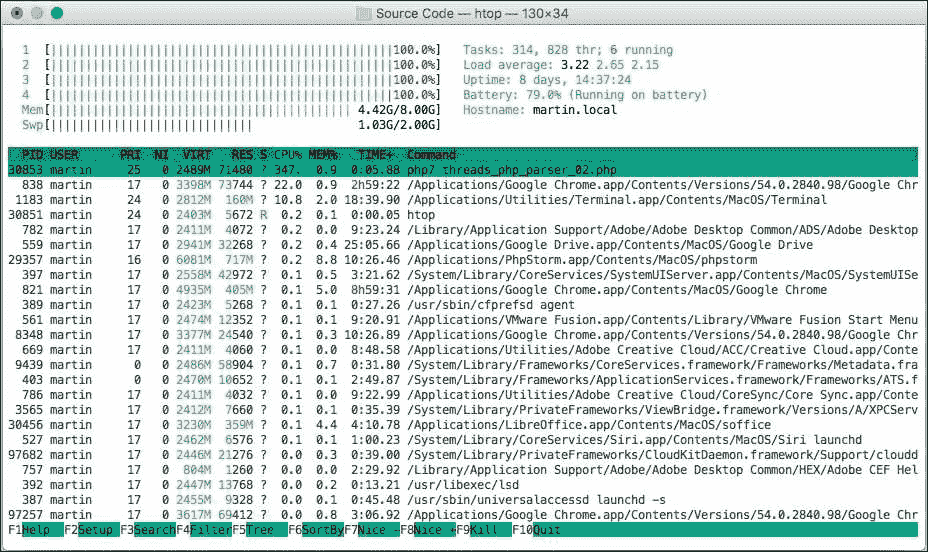
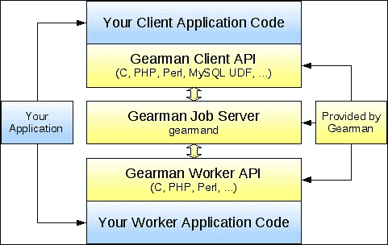

# 第九章：使用 pthreads 和 Gearman 进行多线程和分布式计算

在前一章中，我们花费了很多时间与 pthreads 一起工作。然而，我们还没有看到它们在任何实际应用中使用。这正是本章我们要做的，我们将使用 RxPHP 包装 pthreads 以隐藏其内部实现细节，并使线程池在任何 RxPHP 应用程序中易于重用。

除了 pthreads 之外，我们还将查看如何在本地或多个机器上跨多个工作进程分配工作。我们将使用 Gearman 框架及其 PHP 绑定来创建与 pthreads 相同的应用程序，只是我们不会在多个线程中运行它，而是使用多个工作进程（独立进程）。

在本章中，我们将编写一个可扩展的代码质量工具，用于测试 PHP 脚本中的各种样式检查。例如，这可以是不在条件中使用赋值，或者只是变量名遵循某些编码标准。如今，PHP 项目往往变得非常大。如果我们想在一个线程中分析每个文件，这将花费很长时间，因此我们希望在可能的情况下并行运行分析器部分。

尤其是本章将涵盖以下主题：

+   PHP 解析器库的快速介绍以及我们如何使用 RxPHP 操作符包装其解析器

+   使用我们的自定义操作符包装 pthreads `Pool` 类，该操作符将接收 `Thread` 类并在并行中自动运行它们

+   编写一个 `Thread` 类，它将在单独的线程中运行 PHP 解析器

+   介绍 Gearman 框架，并编写一个基本的 PHP 客户端和工作进程。我们还将看到如何仅使用 Gearman 的 CLI 选项来运行客户端和工作进程

+   在多个 Gearman 工作进程中分配 PHP 解析器任务

+   比较单进程多线程应用程序与分布式 Gearman 应用程序

我们将快速浏览 PHP 解析器库，因为我们的主要兴趣主要在于 pthreads 和 Gearman 框架。

然而，我们将花费一些时间编写 `PHPParserOperator` 类，它将结合我们在前几章中学到的许多东西。

# PHP 解析器库简介

PHP 解析器是一个库，它接受用 PHP 编写的源代码，通过词法分析器传递它，并创建其相应的语法树。这对于静态代码分析非常有用，我们不仅想要检查自己的代码是否存在语法错误，还想要满足某些质量标准。

在本章中，我们将编写一个应用程序，它接受一个目录，递归地迭代其所有文件和子目录，并将每个 PHP 文件通过 PHP 解析器运行。我们只检查一个特定的模式；这对于这个演示来说已经足够了。

我们希望能够找到任何我们在条件中使用赋值的语句。这可以是以下任何一种示例（这次我们还包括行号以增强清晰度）：

```php
// _test_source_code.php 
1\. <?php 
2\. $a = 5; 
3\. if ($a = 1) { 
4\.     var_dump($a); 
5\. } elseif ($b = 2) {} 
6\. while ($c = 3) {} 
7\. for (; $d = 4;) {} 

```

所有这些都是有效的 PHP 语法，但让我们假设我们想要使我们的代码易于理解。当您的应用程序没有按预期运行，并且您不知道如何找到前面的任何示例时，您可能一开始无法立即判断这是故意的还是只是遗漏了一个等号。也许您想写一个条件语句，如`if ($a == 1)`，但您忘记了一个`=`。

这可以通过静态代码分析器轻松地发现并报告。

因此，让我们首先尝试 PHP 解析器库本身，然后使用 RxPHP 操作符对其进行包装。

## 使用 PHP 解析器库

在我们开始之前，我们需要安装 PHP 解析器库。像往常一样，我们将使用`composer`来完成这项工作：

```php
$ composer require nikic/php-parser

```

最好的用例就是取我们想要分析的源代码，并用解析器处理它：

```php
// php_parser_01.php  
use PhpParser\ParserFactory; 

$syntax = ParserFactory::PREFER_PHP7; 
$parser = (new ParserFactory())->create($syntax); 

$code = file_get_contents('_test_source_code.php'); 
$stmts = $parser->parse($code); 
print_r($stmts); 

```

此脚本的输出将是一个非常长的嵌套树结构，代表我们传递给解析器的代码：

```php
$ php php_parser_01.php 
...
[2] => PhpParser\Node\Stmt\If_ Object
 (
 [cond] => PhpParser\Node\Expr\Assign Object (
 [var] => PhpParser\Node\Expr\Variable Object (
 [name] => a
 [attributes:protected] => Array (
 [startLine] => 4
 [endLine] => 4
 )
 )
 [expr] => PhpParser\Node\Scalar\LNumber Object (
 [value] => 1
 ...

```

我们可以看到`if`语句有一个名为`cond`的属性，它包含解析后的条件，这是一个`Expr\Assign`的实例。实际上，我们将要测试的所有语句都有`cond`属性，因此测试它们是否包含条件中的赋值将相对简单。唯一的例外是`for`循环，其中条件可能由逗号`,`分隔的多个表达式组成。

由于语法树是一个嵌套结构，我们需要某种方式来递归地迭代它。幸运的是，库通过`NodeTraverser`类和注册自定义访问者来支持这一点。访问者是具有多个回调的类，当树遍历器开始/结束处理整个树或进入/离开单个节点时会被调用。

我们将创建一个非常简单的节点访问者，用于检查节点类型，并最终检查`cond`属性。这是一种方法，我们可以找到条件内的所有赋值，并从源 PHP 脚本中打印出它们各自的行号。

考虑以下代码。这将是我们将要编写的自定义操作符的一部分：

```php
// php_parser_02.php  
use PhpParser\NodeTraverser; 
use PhpParser\ParserFactory; 
use PhpParser\Node; 
use PhpParser\Node\Stmt; 
use PhpParser\Node\Expr; 
use PhpParser\NodeVisitorAbstract; 

class MyNodeVisitor extends NodeVisitorAbstract { 
  public function enterNode(Node $node) { 
    if (($node instanceof Stmt\If_ || 
          $node instanceof Stmt\ElseIf_ || 
          $node instanceof Stmt\While_ 
        ) && $this->isAssign($node->cond)) { 

      echo $node->getLine() . "\n"; 
    } elseif ($node instanceof Stmt\For_) { 
      $conds = array_filter($node->cond, [$this, 'isAssign']); 
      foreach ($conds as $cond) { 
        echo $node->getLine() . "\n"; 
      } 
    } 
  } 

  private function isAssign($cond) { 
    return $cond instanceof Expr\Assign; 
  } 
} 

$syntax = ParserFactory::PREFER_PHP7; 
$parser = (new ParserFactory())->create($syntax); 
$code = file_get_contents('_test_source_code.php'); 

$traverser = new NodeTraverser(); 
$traverser->addVisitor(new MyNodeVisitor()); 
$stmts = $parser->parse($code); 
$traverser->traverse($stmts); 

```

如您所见，我们使用多个`instanceof`语句及其相应的`cond`属性来检查每个节点类型。对于`for`语句，我们需要检查`cond`语句的数组，但其余部分类似。

每当我们发现测试的样式检查时，我们只需打印行号，因此前面的示例将打印以下内容：

```php
$ php php_parser_02.php 
3
5
6
7

```

我们可以看到行号确实与之前提供的源文件匹配。这很好，但当我们想要与 RxPHP 或更有趣的是与 pthreads 一起使用时，并不太有帮助。

## 实现 PHPParserOperator

如果我们想要处理多个文件，我们只需多次运行解析器。但如果我们想要更好地控制要处理的文件，或者我们想要将预配置的解析器与我们的自定义节点访问者轻松地嵌入到任何 RxPHP 应用程序中，该怎么办呢？

例如，假设我们想以下这种方式使用 PHP 解析器库：

```php
// php_parser_observer_01.php 
Observable::fromArray(['_test_source_code.php']) 
  ->lift(function() { 
    $classes = [AssignmentInConditionNodeVisitor::class]; 
    return new PHPParserOperator($classes); 
  }) 
  ->subscribe(new DebugSubject());   

```

我们有一个典型的 RxPHP 操作符链，其中我们提升使用了`PHPParserOperator`。这个类在其构造函数中接受一个数组，该数组将作为节点访问者添加到其内部的`NodeTraverser`。

作为输入，我们使用由源可观察对象发出的原始文件名数组。观察者随后将接收到每个访问者类报告的代码风格违规的数组。

在编写操作符本身之前，我们首先应该看看如何修改前一个示例中的访问者类。由于我们希望能够添加任意数量的自定义节点访问者，它们可以检查他们想要的任何内容，我们需要能够收集它们的所有结果，并通过`PHPParserOperator`重新发出一个单一值。

### 编写 AssignmentInConditionNodeVisitor

我们可以从定义一个接口开始，所有我们的节点访问者都必须实现这个接口：

```php
// ObservableNodeVisitorInterface.php 
interface ObservableNodeVisitorInterface { 
    public function asObservable(); 
} 

```

对于节点访问者有一个要求，就是返回一个可观察对象，它将发出所有代码风格违规：

```php
// AssignmentInConditionNodeVisitor.php 
use PhpParser\NodeVisitorAbstract as Visitor; 
use PhpParser\Node; 
// We're omitting the rest of use statements ... 

class AssignmentInConditionNodeVisitor 
    extends Visitor implements ObservableNodeVisitorInterface { 
  private $subject; 
  private $prettyPrinter; 

  public function __construct() { 
    $this->subject = new Subject(); 
    $this->prettyPrinter = new PrettyPrinter\Standard(); 
  } 
  public function enterNode(Node $node) { 
    // Remains the same as above just instead of echoing the 
    // line numbers we call $this->emitNext(...) method. 
  } 
  public function afterTraverse(array $nodes) { 
    $this->subject->onCompleted(); 
  } 
  public function asObservable() { 
    return $this->subject->asObservable(); 
  } 
  private function isAssign($cond) { 
    return $cond instanceof Expr\Assign; 
  } 
  private function emitNext(Node $node, Expr\Assign $cond) { 
    $this->subject->onNext([ 
      'line' => $node->getLine(), 
      'expr' => $this->prettyPrinter->prettyPrintExpr($cond), 
    ]); 
  } 
} 

```

这个节点访问者内部使用一个`Subject`，在`emitNext()`方法中，它将每个代码风格违规作为一个单一的项目发出。这个项目本身是一个关联数组，它包含行号和导致违规的格式良好的表达式（以便用户明白为什么被报告）。`PrettyPrinter`类是 PHP 解析器库的一部分。

这个`Subject`类还需要在我们完成这个语法树时发出一个`complete`信号。这发生在`afterTraverse()`方法中。调用`complete`信号对于让其他操作符正确地使用这个`Subject`非常重要。

由于我们需要公开这个`Subject`，我们需要确保没有人可以操纵它，因此我们使用`asObservable()`操作符将其包装起来。

### 编写 PHPParserOperator

这个操作符将保留对 PHP 解析器的单一引用，我们将为每个到达这个操作符的文件调用它。这也意味着我们需要为每个文件创建一个新的`NodeTraverser`类实例，并将每个自定义节点访问者的新实例添加到其中。

从操作符的角度来看，所有节点访问者只是发出风格违规的可观察对象。操作符需要从所有这些对象中收集所有值，然后将这个集合重新发出作为一个单一的项目。

我们将把这个示例分成两个更小的部分。首先，我们将看看如何创建填充了节点访问者的`NodeTraverser`实例：

```php
// PHPParserOperator.php 
use Rx\ObservableInterface; 
use Rx\ObserverInterface; 
use Rx\SchedulerInterface; 
use Rx\Operator\OperatorInterface; 
use Rx\Observer\CallbackObserver; 
use PhpParser\NodeTraverser; 
use PhpParser\ParserFactory; 

class PHPParserOperator implements OperatorInterface { 
  private $parser; 
  private $traverserClasses; 

  public function __construct($traverserClasses = []) { 
    $syntax = ParserFactory::PREFER_PHP7; 
    $this->parser = (new ParserFactory())->create($syntax); 
    $this->traverserClasses = $traverserClasses; 
  } 

  private function createTraverser() { 
    $traverser = new NodeTraverser(); 
    $visitors = array_map(function($class) use ($traverser) { 
      /** @var ObservableNodeVisitorInterface $visitor */ 
      $visitor = new $class(); 
      $traverser->addVisitor($visitor); 

      return $visitor->asObservable() 
        ->toArray() 
        ->map(function($violations) use ($class) { 
          return [ 
            'violations' => $violations, 
            'class' => $class 
          ]; 
        }); 
      }, $this->traverserClasses); 
    return [$traverser, $visitors]; 
  } 
  // ... 
} 

```

我们在`$traverserClasses`属性中保留一个节点访问者类名的数组。当我们想要创建一个新的`NodeTraverser`时，我们使用`array_map()`函数迭代这个数组，并实例化每个类。然后我们不仅将其添加到遍历器中，我们还将其从`asObservable()`方法返回的可观察对象与`toArray()`和`map()`操作符链式连接。

`toArray()` 操作符收集源 Observable 发射的所有项目，并在源完成时将它们重新发射为一个单个数组。这就是为什么我们必须确保在 `AssignmentInConditionNodeVisitor` 类中正确调用 complete 的原因。我们还使用了 `map()` 来发射带有生成它们的类名的最终违规集合。这不是必需的，但出于实际原因，我们希望能够知道是哪个节点访问者生成了这些结果（或者说，换句话说，这个集合中有什么样式违规）。

`createTraverser()` 方法返回两个值：`NodeTraverser` 实例和从每个节点访问者返回的 Observables 数组。

`PHPParserOperator` 的其余部分是实际订阅发生的地方：

```php
class PHPParserOperator implements OperatorInterface { 
  // ... 
  public function __invoke($observable, $observer, $sched=null) { 
    $onNext = function($filepath) use ($observer) { 
      $code = @file_get_contents($filepath); 
      if (!$code) { /* ... emit error message */ } 

      list($traverser, $visitors) = $this->createTraverser(); 
      (new ForkJoinObservable($visitors)) 
        ->map(function($results) use ($filepath) { 
          // $results = all results from all node visitors. 
          $filtered = array_filter($results, function($result) { 
            return $result['violations']; 
          }); 
          return [ 
            'file' => $filepath, 
            'results' => $filtered, 
          ]; 
        }) 
        ->subscribeCallback(function($result) use ($observer) { 
          $observer->onNext($result); 
        }); 

      $stmts = $this->parser->parse($code); 
      $traverser->traverse($stmts); 
    }; 

    $callbackObserver = new CallbackObserver( 
      $onNext, 
      [$observer, 'onError'], 
      [$observer, 'onCompleted'] 
    ); 
    return $observable->subscribe($callbackObserver, $sched); 
  } 
} 

```

首先，我们使用 `CallbackObserver`，它只是传递所有的 `error` 和 `complete` 信号。有趣的事情只发生在匿名函数 `$onNext` 中：

1.  我们期望每个项目都是一个表示文件路径的字符串。我们使用 `file_get_contents()` 函数读取文件内容，以获取我们想要分析的源代码。

1.  然后，我们调用 `createTraverser()`，它返回一个新的 `NodeTraverser` 实例以及一个 Observables 数组，我们将从中获取所有样式违规。这些已经像之前看到的那样用 `toArray()` 和 `map()` 包装。

1.  我们创建一个新的 `ForkJoinObservable`，并将之前调用中的 Observables 数组传递给它。我们在 第五章 中实现了这个 Observable，*测试 RxPHP 代码*。`ForkJoinObservable` 类订阅到所有其源 Observables，并记住每个源 Observables 发射的最新值。当所有源 Observables 都完成时，它将所有值重新发射为一个单个数组。我们知道所有源都将发射一个值然后完成，这是由于 `toArray()` 操作符。

1.  我们对没有发射任何违规的节点访问者不感兴趣，所以我们从 `map()` 操作符的结果中移除它们。

1.  最后，我们只是将观察者本身订阅到这个链上。请注意，我们故意没有使用 `subscribe($observer)`，因为这会重新发射包括错误和完成信号在内的一切。我们创建的 Observable 链会在发射其单个值后立即完成，这是由于 `ForkJoinObservable`，而这正是我们不想要的。看看前一章，我们讨论了共享单个 Subject 实例及其可能产生的不预期结果。同样的原因也适用于这里。

在所有这些之后，我们只是运行 `traverse()` 方法，该方法分析源代码，并借助我们的具有 Observables 的自定义节点访问者，将发射所有将被收集到 `ForkJoinObservable` 中的违规。

这是一个相当复杂的操作符，具有复杂的行为。如果我们回到我们展示了如何使用此操作符的示例，我们可以看到所有这些逻辑实际上对我们是隐藏的。

当我们运行之前使用的原始示例时，我们会得到以下结果：

```php
$ php php_parser_observer_01.php 
Array (
 [file] => _test_source_code.php
 [results] => Array (
 [0] => Array (
 [violations] => Array (
 [0] => Array (
 [line] => 3
 [expr] => $a = 1
 )
 [1] => Array (
 [line] => 5
 [expr] => $b = 2
 )
 [2] => Array (
 [line] => 6
 [expr] => $c = 3
 )
 [3] => Array (
 [line] => 7
 [expr] => $d = 4
 )
 )
 [class] => AssignmentInConditionNodeVisitor
 )
 )
)

```

从此操作符出来的每个项目都是一系列嵌套数组。我们可以看到我们分析的文件名和结果数组，其中每个项目都是由一个节点访问者生成的。由于我们只有一个结果，这里也只有一个数组。每个结果都由节点访问者类名和违规列表标记。每个违规包含行号和发生的确切表达式。

这听起来很好，但是分析一个更大的项目，比如 Symfony3 框架，需要多长时间？目前，Symfony3（不包括第三方依赖项）有超过 3200 个文件。如果处理单个文件只需要 1 毫秒，那么分析整个项目将需要超过 3 秒（实际上，由于文件系统操作如此之多，处理将需要更长的时间）。

因此，这似乎是一个我们可以利用我们在 PHP 中使用 pthreads 的多线程编程知识的绝佳例子。

# 实现`ThreadPoolOperator`

我们将编写一个通用操作符，它从其源 Observable 接收由`Thread`类实例表示的工作。然后，它将它们提交到我们在上一章中看到的`Pool`类的内部实例。

事实上，这个使用 pthreads 的例子将完全基于我们在上一章中学到的所有内容，所以我们在这里不会回顾它们。

### 注意

这个例子在某些情况下也将使用 PHP7 语法，因为 pthreads v3 版本仅支持 PHP7。

对于这个操作符，我们内部将使用事件循环。在 RxPHP 中，这意味着我们将使用`StreamSelectLoop`类，并用`Scheduler`类包装它。让我们看看`ThreadPoolOperator`的源代码，然后讨论为什么它被这样实现：

```php
// ThreadPoolOperator.php 
class ThreadPoolOperator implements OperatorInterface { 
  private $pool; 

  public function __construct($num = 4, 
      $workerClass = Worker::class, $workerArgs = []) { 

    $this->pool = new Pool($num, $workerClass, $workerArgs); 
  } 

  public function __invoke($observable, $observer, $sched=null) { 
    $callbackObserver = new CallbackObserver(function($task) { 
        /** @var AbstractRxThread $task */ 
        $this->pool->submit($task); 
      }, 
      [$observer, 'onError'], 
      [$observer, 'onCompleted'] 
    ); 

    $dis1 = $sched->schedulePeriodic(function() use ($observer) { 
      $this->pool->collect(function($task) use ($observer) { 
        /** @var AbstractRxThread $task */ 
        if ($task->isDone()) { 
          $observer->onNext($result); 
          return true; 
        } else { 
          return false; 
        } 
      }); 
    }, 0, 10); 

    $dis2 = $observable->subscribe($callbackObserver); 
    $disposable = new BinaryDisposable($dis1, $dis2); 
    return $disposable; 
  } 
} 

```

`ThreadPoolOperator`的构造函数接受与创建的`Pool`类构造函数相同的参数。有趣的事情发生在`__invoke()`方法中。

到达此操作符的每个项目都将通过`submit()`方法发送到线程池。这意味着`ThreadPoolOperator`只能与由 pthreads 扩展中的`Thread`类（以及当然所有扩展这个类的类）表示的项目一起工作。

内部，我们使用`Scheduler`类定期调用一个可调用对象，该对象将检查线程池中已完成并准备好收集的线程。这就是我们在上一章中看到的相同的`collect()`方法。然而，在这个实现中，我们在可调用对象的每次迭代中只进行一次检查。有一个非常重要的原因我们要这样使用它。我们知道我们可以在一个循环中使用`collect()`方法，只要还有计划运行的任务。

循环通常看起来像这样：

```php
$remaining = N; 
while ($remaining !== 0) { 
    $pool->collect(function(Thread $work) use (&$remaining) { 
        $done = $work->isDone(); 
        if ($done) { 
            $remaining--; 
        } 
        return $done; 
    }); 
}  

```

当然，这是正确的。唯一的问题是这个调用是阻塞的。解释器在这个循环中卡住，不允许我们做任何事情。如果我们想使用这样的循环，同时通过`StreamSelectLoop`（见第六章，*PHP Streams API 和高级观察者*）从流中读取数据，只要这个循环在运行，我们就无法接收任何东西。如果我们只使用这个`while`循环，另一个无法工作的例子可能是`IntervalObservable`，它需要自己安排定时器。这些定时器只有在循环结束时才会被触发。

正因如此，我们定期安排一个 10 毫秒的定时器来运行`collect()`一次，然后让其他定时器或流进行处理。完成后的线程被保存在`Pool`类中，直到我们读取并重新发射它们的结果。

这种实现有一个非常重要的行为。由于它并行运行所有任务，并且完全独立于其余的 Observable 链，我们需要注意何时发送`complete`信号。

考虑以下代码：

```php
Observable::fromArray([1,2,3]) 
    ->map(function($val) { 
        return new MyThread($val); 
    }) 
    ->lift(function() { 
        return ThreadPoolOperator(...); 
    }) 
... 

```

在这个例子中，`ThreadPoolOperator`类接收三个`MyThread`实例，这些实例将被提交给`Pool`实例，但它也接收一个完成信号。这个完成信号立即传递给它的观察者，在任何一个线程完成并发射任何值之前取消订阅。

同时，`ThreadPoolOperator`不能自己决定何时发送`complete`信号。有时当线程池为空且没有任务运行时，我们可能想要发送信号。其他时候，我们可能希望根据 PHP 流活动在任何时候启动线程。

正因如此，我们不自动发送`complete`信号。

## 实现`PHPParserThread`

现在，我们可以看看实际的解析任务是如何实现的。我们已经知道它需要由从`pthreads`扩展的默认`Thread`类扩展的类来表示，我们也知道我们将使用 PHP 解析器处理文件，因此我们可以重用`PHPParserOperator`类。

在我们这样做之前，我们应该为所有的`Thread`对象定义一些共同的行为：

```php
// AbstractRxThread.php 
abstract class AbstractRxThread extends Thread { 
    private $done = false; 
    protected $result; 

    public function getResult() { 
        return $this->result; 
    } 
    public function isDone() { 
        return $this->done; 
    } 
    protected function markDone() { 
        $this->done = true; 
    } 
} 

```

我们想要使用`ThreadPoolOperator`运行的所有任务都需要扩展这个抽象类，该类定义了一些共同的方法。

注意，我们没有为`$result`属性提供一个设置方法。这是故意的，我们将在查看我们将在此应用程序中使用的`PHPParserThread`的实现时看到原因：

```php
class PHPParserThread extends AbstractRxThread { 
  private $filenames; 

  public function __construct($filename) { 
    $this->filenames =  
        (array)(is_array($filename) ? $filename : [$filename]); 
    /** @var Volatile result */ 
    $this->result = []; 
  } 

  public function run() { 
    $last = 0; 
    Observable::fromArray($this->filenames) 
      ->lift(function() { 
        $classes = ['AssignmentInConditionNodeVisitor']; 
        return new PHPParserOperator($classes); 
      }) 
      ->subscribeCallback(function ($results) use (&$last) { 
        $this->result[$last++] = (array)[ 
          'file' => $results['file'], 
          'results' => $results['results'], 
        ]; 
      }, null, function() { 
        $this->markDone(); 
      }); 
  } 
} 

```

如您所见，我们正在使用类型转换，原因与上一章中描述的完全相同。同时请注意，我们正在将输入文件包裹在一个数组中。由于我们希望使这个类可重用，我们将支持传递单个文件或文件数组。我们使用一个空数组初始化 `$result` 属性，该数组会被 pthreads 自动转换为 `Volatile` 对象（再次，有关更多信息，请参阅上一章）。因此，我们需要通过自己的 `$last` 变量跟踪已持久化的项目数量。此外，请注意，我们的结果始终将是一个数组，即使只是处理单个文件也是如此。

在这一点上，我们需要意识到为什么不能为 `$result` 使用任何设置方法。在前一章中，当我们谈到 `Volatile` 对象时，我们提到 pthreads 在将数组赋值给任何扩展 `Threaded` 类的类的属性时，会自动将数组转换为 `Volatile`。因此，我们不能使用设置器，因为我们无法通过 `(array)` 强制类型转换到数组。这种自动转换发生在赋值时，因此我们必须强制 `AbstractRxThread` 中的所有结果都是数组，或者让它自动转换，而这绝对不是我们想要的。

为了更清楚地说明这个问题，让我们考虑以下设置方法：

```php
public function setResult($result) { 
    $this->result = $result; 
} 

```

赋值发生在我们不想使用 `(array)` 类型转换强制使用数组的这个函数内部。我们可能想使用一个简单的字符串或整数，例如。

因此，这是我们将在本例中使用的 `PHPParserThread` 类。实际上还有一个问题。

使用 pthreads 创建新线程意味着我们在内部创建了一个新的 PHP 解释器上下文。这个新上下文所知道的类和函数仅限于 PHP 解释器本身内置的。这个新上下文对 `Observable` 或 `PHPParserOperator` 类一无所知。

正如我们在运行任何 PHP 应用程序时包含 `autoload.php` Composer 自动加载脚本一样，我们需要为每个新创建的线程做这件事。由于我们不希望在每次使用 `PHPParserThread` 时都这样做，我们可以使用一个自定义的工作者，它将在其 `run()` 方法中为我们完成这件事。这个 `run()` 方法在创建新的解释器上下文时被调用，并允许我们通过例如包含 `autoload.php` 脚本来初始化它。

## 实现 PHPParserWorker

为了简化，我们没有在命名空间中定义我们的类，通常只是使用 `require_once` 关键字包含它们，例如以下示例：

```php
require_once __DIR__ . '/../Chapter 02/DebugSubject.php'; 

```

因此，我们需要告诉每个工作者内部创建的自动加载器在哪里可以找到这样的类，理想情况下不依赖于 `require_once` 语句。

我们的工作者将是一个简单的类（基于官方示例，如何在 pthreads 中使用 Composer 的自动加载器，请参阅 [`github.com/krakjoe/pthreads-autoloading-composer`](https://github.com/krakjoe/pthreads-autoloading-composer)）：

```php
// PHPParserWorker.php 
class PHPParserWorker extends \Worker { 
  protected $loader; 

  public function __construct($loader) { 
    $this->loader = $loader; 
  } 

  public function run() { 
    $classLoader = require_once($this->loader); 
    $dir = __DIR__; 
    $classLoader->addClassMap([ 
      'DebugSubject' => $dir . '/../Chapter 02/DebugSubject.php', 
      'ThreadWorkerOperator' => $dir.'/ThreadWorkerOperator.php', 
      'PHPParserThread' => $dir . '/PHPParserThread.php', 
      'PHPParserWorker' => $dir . '/PHPParserWorker.php', 
      'PHPParserOperator' => $dir . '/PHPParserOperator.php', 
    ]); 
  } 

  public function start(int $options = PTHREADS_INHERIT_ALL) { 
    return parent::start(PTHREADS_INHERIT_NONE); 
  } 
} 

```

这个工作进程使用`require_once`来注册自动加载器，我们在其中添加了一些类路径。初始化的解析器上下文将由这个工作进程运行的所有`Thread`实例使用。

最后，我们可以将这些全部放入一个单独的可观察链中。

## 在多线程应用程序中运行 PHP 解析器

首先，我们将测试我们现在制作的类，处理与之前相同的样本文件，然后递归地处理来自 Symfony3 项目的目录：

```php
// threads_php_parser_01.php 
$loop = new StreamSelectLoop(); 
$scheduler = new EventLoopScheduler($loop); 

Observable::create(function(ObserverInterface $observer) { 
    $observer->onNext('_test_source_code.php'); 
  }) 
  ->map(function($filename) { 
    return new PHPParserThread($filename); 
  }) 
  ->lift(function() { 
    $args = [__DIR__ . '/../vendor/autoload.php']; 
    return new ThreadPoolOperator(2,PHPParserWorker::class,$args); 
  }) 
  ->flatMap(function($result) { 
    return Observable::fromArray((array)$result); 
  }) 
  ->take(1) 
  ->subscribeCallback(function($result) { 
    print_r($result); 
  }, null, null, $scheduler); 

$loop->run(); 

```

这个例子使用了本章中创建的所有三个用于多线程的类。让我们一步一步看看这个操作符链会发生什么：

1.  我们有一个单独的源可观察对象，它发射文件名作为其值。请注意，我们故意没有发送完整的信号。

1.  然后我们使用 map 将所有文件名转换为`PHPParserThread`类的实例。

1.  `ThreadPoolOperator`类被喂入它必须运行的任务。

1.  我们已经提到，即使我们只处理单个文件，`ThreadPoolOperator`的所有结果都作为数组返回。因此，我们使用`flatMap()`重新发射其值并展平结果。此外，我们还需要将结果从`Volatile`类型转换为数组。

1.  我们故意没有从源发送`complete`信号。然而，我们知道我们只处理了一个文件，因此我们期望只发射一个项目。所以我们可以使用`take(1)`为我们发送`complete`信号，观察者将成功取消订阅，这将停止事件循环。

我们可以运行这个示例，并看到它返回了与仅使用`PHPParserOperator`的原版完全相同的结果：

```php
$ php threads_php_parser_01.php 
Array (
 [file] => _test_source_code.php
 [results] => Array (
 [0] => Array (
 [violations] => Array (
 ...

```

### 注意

尽管本书中的大多数 CLI 应用程序都是基于 Symfony Console 组件，但这次我们甚至不需要它，因为整个应用程序可以写成一个单独的操作符链。

在这个例子中，尽管我们只想处理单个文件，但我们还是启动了两个工作进程。

问题是如果我们尝试并行处理多个文件，会有什么不同。因此，我们将创建一个包含成千上万个 PHP 文件以供测试的 Symfony3 测试项目：

```php
$ composer create-project symfony/framework-standard-edition testdir

```

以下示例将像上一个示例一样工作。然而，这次我们将创建一个递归迭代器，遍历所有子目录并发射它找到的所有 PHP 文件。我们可以将所有这些写成一个大的操作符链：

```php
// threads_php_parser_02.php 
const MAX_FILES = 500; 
Observable::create(function($observer) use ($loop) { 
    $start = microtime(true); 
    $src = __DIR__ . '/../symfony_template'; 
    $dirIter = new \RecursiveDirectoryIterator($src); 
    $iter = new \RecursiveIteratorIterator($dirIter);  

    while ($iter->valid()) { 
      /** @var SplFileInfo $file */ 
      $file = $iter->current(); 
      if ($file->getExtension() === 'php' && $file->isReadable()){ 
        $observer->onNext($file->getRealPath()); 
      } 
      $iter->next(); 
    }  

    return new CallbackDisposable(function() use ($loop, $start) { 
      echo "duration: ".round(microtime(true) - $start, 2)."s\n"; 
      $loop->stop(); 
    }); 
  }) // End of Observable::create() 
  ->bufferWithCount(20) 
  ->map(function($filenames) { 
    return new PHPParserThread($filenames); 
  }) 
  ->lift(function() { 
    $args = [__DIR__ . '/../vendor/autoload.php']; 
    return new ThreadPoolOperator(4,PHPParserWorker::class,$args); 
  }) 
  ->flatMap(function($result) { 
    return Observable::fromArray((array)$result); 
  }) 
  ->take(MAX_FILES) 
  ->filter(function($result) { 
    return count($result['results']) > 0; 
  }) 
  ->subscribeCallback(function($result) { 
    print_r($result); 
  }, null, null, $scheduler); 

```

这是我们在本书中编写的最长的操作符链。主要变化是源端发射的我们要分析的文件名。我们有两个不同的迭代器，它们都返回`SplFileInfo`对象。我们知道我们总共要测试多少个文件，因此我们可以使用`take()`操作符避免发射冗余值。

在前几章中我们讨论了背压时，提到了`bufferWithCount()`操作符，它会堆叠值然后在一个数组中重新发射它们。现在这非常有用，因为我们不希望在线程池中为每个文件创建一个任务，而是批量发射它们。

最后，我们也使用了`filter()`来忽略所有没有违规的结果。当然，我们只对至少有一个违规的文件感兴趣。

这个示例的一个重要部分是它测量了运行整个应用程序所需的时间（从初始订阅到销毁`CallbackDisposable`）。

如果我们运行这段代码，我们会看到一个类似以下的大列表：

```php
$ php threads_php_parser_02.php
...
Array (
 [file] => ...vendor/symfony/src/Symfony/Bridge/Twig/AppVariable.php
 [results] => Array (
 [0] => Array (
 [violations] => Array (
 [0] => Array (
 [line] => 101
 [expr] => $request = $this->getRequest()
 )
 )
 [class] => AssignmentInConditionNodeVisitor
 )
 )
)
...

```

报告的行包含以下代码：

```php
if ($request = $this->getRequest()) { 

```

这确实是我们想要能够报告的代码风格。

现在来谈谈一个重要的问题，运行分析器在多线程中的效果是什么？我们可以用`1`、`2`、`4`和`6`线程等设置进行几次重跑。为了得到更相关的结果，我们可以增加处理的文件数量到 1,000，并且禁用`xdebug`扩展，否则它会显著减慢执行速度。平均下来，时间如下：

```php
1 thread = 5.60s
2 threads = 3.52s
4 threads = 3.08s
6 threads = 4.80s

```

如我们所见，增加线程的数量开始变得适得其反。这些时间是在 2.5 GHz 英特尔酷睿 i5 上测量的，这是一个双核处理器，带有 SSD 硬盘。对于更多的线程，使用非 SSD 硬盘的结果可能会更好，因为每个线程将不得不花费更多的时间来加载文件内容，这会允许其他线程在此期间执行。

我们几乎达到了只运行一个线程时间的一半，这是一个现实的目标。在一个双核处理器上，以及 RxPHP 和 PHP 本身产生的开销下，这是一个预期的结果。

我们可以查看`htop`命令的输出，它显示了当前的 CPU 使用情况，以证明两个核心都被充分利用：



运行 threads_php_parser_02.php 示例时的当前 CPU 使用率

`htop`工具显示有四个核心，因为每个核心有两个硬件线程（实际上它只是一个双核处理器）。

只通过利用 pthread 在单个进程中并行运行解析器非常高效。

我们的使用案例可以概括为简单地在一个多个工作者之间分割一个工作。我们并不关心我们将使用什么协议或分布将如何发生。我们甚至不关心哪个工作者将处理特定的批次。我们只需要完成这项工作。

这是对 Gearman 的理想用例。

# Gearman 简介

Gearman 是一个在多个进程和机器之间分配工作的框架。由于其功能，它可以作为一个管理者、负载均衡器，或者在不同语言之间没有单点故障的接口。

由于本书是关于 Rx/reactive/异步编程的，我们将快速介绍 Gearman。不用说，Gearman 非常容易设置和使用。

Gearman PHP 扩展是用 C 语言编写的，因此我们需要通过 PECL 或与您的平台相关的包管理器来安装它（有关更多信息，请参阅 [`gearman.org/download/`](http://gearman.org/download/)）。

Gearman 的名字是 "Manager" 一词的字母重组，很好地概括了其用途。Gearman 本身并不执行工作。它只是从客户端接收一个任务（也简单地称为工作）并将其委托给一个可用的工人。

从以下图表中可以很容易地理解任何 Gearman 应用程序的结构：



来自官方 Gearman 文档的图表（http://gearman.org/）

每个 Gearman 应用程序都有以下三个主要组件：

+   **Gearman 工作服务器**：这通常作为一个守护进程运行，接受来自客户端的任务并将它们委托给工人。它用 C 语言编写（最初用 Perl 编写），并且本身不执行任何工作。它还能够将当前任务队列持久化到数据库中，以便在失败时恢复。

+   **客户端**：这是任何需要执行某些工作的应用程序，可以是任何语言的。这可能是一个需要发送电子邮件的 Web 应用程序或需要运行几个文件上的静态分析的 CLI 应用程序。客户端本身不执行工作。它向工作服务器发送消息，要么等待工作完成，要么等待工作服务器确认它已被添加到队列中。

+   **工人**：这是实际执行工作服务器委托的工作的部分。它也可以用任何语言编写。它包含一个它能执行的功能列表，根据这个列表，工作服务器分配它需要执行的工作。

因此，为了开始使用 Gearman，我们需要在我们的系统上安装并运行工作服务器部分；它通常被称为 **gearman** 或 **gearmand**。您可以在 [`gearman.org/download/`](http://gearman.org/download/) 找到有关如何为您的平台安装和运行 Gearman 的说明。

## 字符串长度客户端和工人

我们可以创建一个非常简单的应用程序，其中我们将有一个工人，它接受一个字符串并返回其长度。在这种情况下，客户端将仅向工作服务器发送一个字符串，请求返回长度。

我们的客户端将非常简单。它将仅请求一个工作，`strlen`，然后等待从工作服务器收到响应：

```php
// gearman_client_01.php 
$client = new GearmanClient(); 
$client->addServer('127.0.0.1'); 
$client->setTimeout(3000); 

$length = @$client->doNormal('strlen', 'Hello World!'); 
if (empty($length)) { 
    echo "timeout\n"; 
} else { 
    var_dump(intval($length)); 
} 

```

我们的客户端连接到单个工作服务器并设置三秒的超时。如果在规定时间内没有收到响应，则继续执行脚本的其他部分。我们使用单个服务器，但可以在不同的机器上运行多个工作服务器，如果其中任何一个崩溃，客户端将继续使用其他服务器。这使得系统具有容错能力。此外，请注意，我们的客户端是阻塞的。

我们正在使用`doNormal()`方法请求执行一个作业，其中我们需要指定我们想要执行的作业名称以及工作者完成它所需的所有数据。除了`doNormal()`之外，还有`doLow()`和`doHigh()`等方法，它们以不同的优先级请求作业。

通常，当我们想要运行一个作业时，我们想知道它的结果。例如，在这种情况下，我们想要等待获取字符串长度。在某些情况下，我们只想安排一个作业，但我们不关心它何时发生以及它的结果是什么。一个典型的用例是 Web 应用程序，其中用户注册，我们想要给他们发送确认电子邮件。我们不希望通过等待电子邮件发送来减慢页面加载速度。

因此，`Client`类还有一个`doBackground()`方法（及其更高和更低优先级的变体）。此方法将请求发送到作业服务器，并且只等待确认它已被接收。客户端不关心它何时执行以及结果如何。如果我们参考之前的 Web 应用程序和发送确认电子邮件的用例，现在发送电子邮件或 10 秒后发送都无关紧要。

工作者脚本将等待来自作业服务器的作业，执行它们，并返回结果：

```php
// gearman_worker_01.php 
$worker = new GearmanWorker(); 
$worker->addServer('127.0.0.1'); 
$worker->addFunction('strlen', function(GearmanJob $job) { 
    echo 'new job: ' . $job->workload() 
        . ' (' . $job->workloadSize() . ")\n"; 
    return strlen($job->workload()); 
}); 

while ($worker->work()) { } 

```

通常，工作者在循环中运行，因此也是阻塞的。我们连接到与客户端相同的作业服务器，并定义一个名为`strlen`的单个函数。这是客户端在请求作业时指定的相同名称。从可调用返回的值将自动发送回客户端。

现在，我们可以测试这个例子。在运行客户端或工作者之前，我们需要启动 Gearman 作业服务器：

```php
$ gearmand --verbose DEBUG

```

我们可以使用`verbose`选项使过程更加健谈。如果没有指定任何其他选项，作业服务器将监听端口`4730`，这个端口也被 PHP 扩展使用，因此我们不需要进行任何配置。

然后，我们将运行工作者和客户端。哪个先运行都无关紧要。我们的客户端在超时到期前等待三秒钟，因此我们可以先运行它，挂起的作业将被作业服务器排队，直到至少有一个工作者可以执行此作业。

运行客户端和工作者后的控制台输出将如下所示：

```php
$ php gearman_worker_01.php 
new job: Hello World! (12)

```

实际上，工作者是在循环中运行的，因此处理完这个作业后，它会等待另一个作业：

```php
$ php gearman_client_01.php 
int(12)

```

客户端只接收响应并结束。

有时很有用的一点是，Gearman CLI 还包含一个可以运行为客户端或工作者的`gearman`应用程序。在我们的例子中，我们根本不需要编写工作者，只需简单地运行以下命令：

```php
$ gearman -w -f strlen -- wc -c

```

这个命令创建了一个连接到其默认设置（localhost 端口`4730`）的工作者。通过`-w`，我们告诉 Gearman 我们想要启动一个工作者，通过`-f strlen`，我们定义了它处理的函数。然后，当它收到一个新作业时，它会启动一个新的子进程并运行`wc -c`，其中它将工作负载作为标准输入传递。因此，这个命令是我们 PHP 工作者的直接替代品。

当然，我们可以在同一台机器上同时运行多个工作者。每个工作者可以处理多个不同的函数。作业服务器负责决定哪个工作者将处理每个作业。

## 将 PHP 解析器作为 Gearman 工作者运行

我们已经看到了如何在多个线程中运行我们的`PHPParserOperator`。然而，我们可以通过编写一个内部运行`PHPParserOperator`的 Gearman 工作者来更容易地在多个进程中运行它，而不是在线程中。

工作者将非常简单。它只需接收它需要加载和分析的文件名，然后返回结果：

```php
// gearman_worker_02.php 

$worker = new GearmanWorker(); 
$worker->addServer('127.0.0.1'); 

$worker->addFunction('phpparser', function(GearmanJob $job) { 
    Observable::just($job->workload()) 
        ->lift(function() { 
            $classes = ['AssignmentInConditionNodeVisitor']; 
            return new PHPParserOperator($classes); 
        }) 
        ->subscribeCallback(function($results) use ($job) { 
            $job->sendComplete(json_encode($results)); 
        }); 
}); 
while ($worker->work()) { } 

```

主要的区别是我们没有在`phpparser`函数的可调用对象中使用任何返回语句。由于在 RxPHP 中一切都是异步的，我们需要使用`sendComplete(...)`方法将结果发送给客户端并标记作业已完成。

当我们运行这个工作者时，它不会向控制台打印任何输出：

```php
$ php gearman_worker_02.php

```

然后，我们可以立即测试它，而无需编写任何客户端应用程序，只需使用 CLI 命令作为客户端：

```php
$ gearman -f phpparser -s "_test_source_code.php" | json_pp
{
 "results" : [
 {
 "violations" : [
 {
 "expr" : "$a = 1",
 "line" : 3
 },
 ...
 ],
 "class" : "AssignmentInConditionNodeVisitor"
 }
 ],
 "file" : "_test_source_code.php"
}

```

我们可以看到，控制台输出与我们之前测试`PHPParserOperator`操作符时看到的是相同的。

`-f phpparser`告诉`gearman`我们想要运行哪个函数，通过`-s`我们可以跳过从标准输入读取，并直接将字符串作为工作负载传递。最后，我们使用了`json_pp`来美化输出，使其更易于阅读。

当然，我们在这个机器和同一个目录下运行这个示例，所以我们不需要担心正确的文件路径。在实际应用中，我们可能会发送文件内容。

这是对 Gearman 的相当快速的介绍。正如我们所看到的，使用 Gearman 非常简单。实际上，在 PHP 中使用 Gearman 比使用 pthreads 扩展并行运行作业要容易得多。

从我们的角度来看，了解 Gearman 应用程序通常是阻塞的这一点很重要，因此我们在第六章中提到的关于运行多个事件循环的内容，*PHP Streams API 和高级观察者*，在这里也非常相关。

如果你想了解更多关于 Gearman 的信息，请访问他们的官方文档，其中包含示例[`gearman.org/manual/`](http://gearman.org/manual/)。

## 比较 pthread 和 Gearman

使用 pthread 和 Gearman 之间的主要区别显然是我们是运行一个进程的多个线程还是仅仅运行多个进程。

pthreads 的优缺点在上一章和本章都有所涉及。完全分离的 PHP 解释器上下文使得事情稍微有些不直观（例如，使用自动加载器，并且在上下文之间再次共享数据）并且肯定需要比单线程等效方案更多的调试。然而，如果我们愿意投入必要的时间，性能优势是显著的，并且最终运行单个进程总是比管理多个进程要容易。

Gearman 的设计目的是将客户端的工作委托给工作者，并在必要时将结果发送回客户端。它不是一个通用的消息交换框架。正因为这种非常具体的关注点，使用 Gearman 非常简单。有了工作者，我们不必关心是谁、在哪里，有时甚至不必关心工作何时完成。这一切都由作业服务器来决定。

在扩展性方面，线程在这里并不是一个真正的选择。另一方面，使用 Gearman 进行扩展很简单。只需添加更多的工作者，Gearman 就会在它们之间均匀分配负载。

如果我们想要使用更灵活的框架，那么 RabbitMQ 或 ZMQ 将是不错的选择。这些框架设计得易于优化，例如通过禁用确认消息或使用发布/订阅模式，并且总体上比 Gearman 提供更多的灵活性。然而，要正确实现这些框架肯定需要更多的努力。

# 摘要

本章的目的是通过一个实际例子来展示多线程和分布式计算，这个例子还涉及到 RxPHP。

我们使用了 PHP 解析器库来对 PHP 脚本进行静态代码分析。我们用 RxPHP 操作符包装了解析器，并使用 pthreads 扩展在多个线程中并行运行，以及使用 Gearman 在多个工作者中运行。

我们也看到了如何通过使用`ThreadPoolOperator`包装来使 RxPHP 中的线程池可重用。

下一章将涵盖那些不适合之前任何一章的主题，并展示一些关于 RxPHP 的有趣和高级用法案例。
