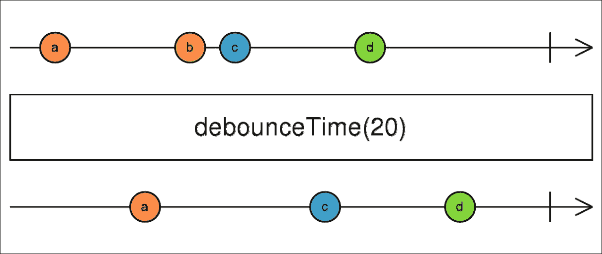
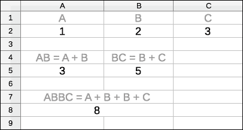
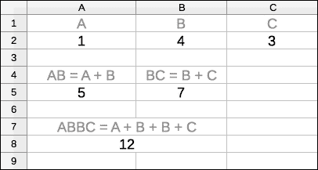

# 第十章. 在 RxPHP 中使用高级操作符和技术

这是最后一章，专门用于解释新的 RxPHP 操作符。有一些主题没有适合前几章，所以我们现在将涵盖它们。我们将多次回顾来自第八章，*RxPHP 和 PHP7 pthreads 扩展中的多播*的 Observable 多播，在实践示例中，还有四个新的操作符，`zip()`、`window()`、`materialize()`和`dematerialize()`，它们是修改 Observable 链的更高级技术。

尤其是在本章中，我们将涵盖以下主题：

+   与高阶 Observables 一起工作的`zip()`和`window()`操作符

+   `materialize()`和`dematerialize()`操作符

+   Observable 链中的错误传播以及如何正确捕获用户定义回调的异常

+   创建热/冷 Observables 的理论以及取消订阅和完成 Observables 链之间的差异

+   创建匿名操作符

+   编写一个递归的`DirectoryIteratorObservable`，它会在目录及其所有子目录中发出所有文件

+   基于多播编写`DirectoryIteratorObservable`的变体

+   基于 RxPHP 编写 FTP 客户端

+   在阻塞和同步应用程序中使用 RxPHP

在整本书中，我们已经看到了许多 RxPHP 操作符。它们都以某种方式与值一起工作。

然而，也有一些操作符在原则上与我们在第五章中看到的用于测试 RxPHP 代码的热 Observables 或冷 Observables 的操作符相似，*测试 RxPHP 代码*。

# `zip()`操作符

`zip()`操作符类似于我们在第五章中实现的`ForkJoinObservable`。主要区别在于它内部将每个源 Observables 的所有发射存储在单独的队列中，然后在所有源在特定索引处都有值时重新发射它们的值。

通过查看以下示例可以更好地理解这一点：

```php
// zip_01.php 
$obs1 = Observable::range(1, 7); 
$obs2 = Observable::fromArray(['a', 'b']); 
$obs3 = Observable::range(42, 5); 

$obs1->zip([$obs2, $obs3]) 
  ->subscribe(new DebugSubject()); 

```

我们有三个源 Observables，其中每个都发出不同数量的项目。然后`zip()`操作符只在所有源在相同索引处都有发射时发出值数组。因此我们知道`DebugSubject`将只接收两个项目，因为`$obs2` Observables 只发出两个项目。

换句话说，`zip()`操作符不能产生第三次发射，因为它没有为第二个`$obs2` Observables 提供第三个值。

此示例的输出如下：

```php
$ php zip_01.php
07:26:16 [] onNext: [1,"a",42] (array)
07:26:16 [] onNext: [2,"b",43] (array)
07:26:16 [] onCompleted

```

注意，它只包含每个源 Observables 的前两个值。

我们可以看看另一个更复杂的示例，该示例模拟了来自多个源 Observables 的异步发射：

```php
// zip_02.php 
$loop = new StreamSelectLoop(); 
$scheduler = new EventLoopScheduler($loop); 

$obs1 = Observable::interval(1000, $scheduler) 
  ->map(function($i) { return chr(65 + $i); }); 

$obs2 = Observable::interval(500, $scheduler) 
  ->map(function($i) { return $i + 42; }); 

Observable::interval(200, $scheduler) 
  ->zip([$obs1, $obs2]) 
  ->subscribe(new DebugSubject()); 

$loop->run(); 

```

由于每个源 `Observable` 以不同的间隔发射，`zip()` 操作符将不得不根据最慢的一个发射，它每 1000 毫秒发射一次。其余 `Observable` 的值随后在内部队列中堆叠。

这个例子会打印以下输出：

```php
$ php zip_02.php
08:48:47 [] onNext: [0,"A",42] (array)
08:48:48 [] onNext: [1,"B",43] (array)
08:48:49 [] onNext: [2,"C",44] (array)
08:48:50 [] onNext: [3,"D",45] (array)
...

```

注意实际上我们没有丢失任何值。所有尚未重新发射的值都被保存在 `zip()` 操作符内部。

# `window()` 操作符

`window()` 操作符属于更高级的更高阶 `Observable` 之一。我们在 第六章 中看到了 `switchLatest()` 操作符，*PHP Streams API 和更高阶 `Observable`*，并且我们知道它会自动订阅其源 `Observable` 发射的最新 `Observable`。

与之相反的是 `window()` 操作符，它接受一个所谓的“窗口边界” `Observable` 作为参数，并根据“窗口边界” `Observable` 的发射将源发射分成单独的 `Observable`。

一个例子肯定会使这一点更加明显：

```php
// window_01.php 
$source = Observable::range(1, 10)->publish(); 
$windowBoundary = $source->bufferWithCount(3); 

$source->window($windowBoundary) 
  ->doOnNext(function() { 
    echo "emitting new window Observable\n"; 
  }) 
  ->switchLatest() 
  ->subscribe(new CallbackObserver(function($value) { 
    echo "$value\n"; 
  })); 

$source->connect(); 

```

我们有一个总共发射 10 个项目的源 `Observable`。由于我们传递给 `window()` 的 `$windowBoundary` 变量中的 `Observable`，`window()` 操作符将它们分成三个项目的块。这意味着我们将总共创建四个 `Observable`，其中前三个发射三个项目（然后完成），最后一个只发射一个项目（然后它也完成）。

为了使这一点更加明显，我们添加了 `doOnNext()` 操作符，以便每次创建新的 `Observable` 时都打印一条日志。

然后使用 `switchLatest()` 操作符始终只订阅 `window()` 发射的最新 `Observable`。

因此在控制台里看起来我们是将源数据分成了三个项目的块。换句话说，我们将源数据分成了三个时间单位的窗口：

```php
$ php window_01.php
emitting new window Observable
1
2
3
emitting new window Observable
4
5
6
emitting new window Observable
7
8
9
emitting new window Observable
10

```

你可能想知道这有什么好处。`window()` 操作符可以可选地接受一个选择函数。这个函数接收当前窗口作为参数，在将其推送到观察者之前。对我们来说，这意味着我们可以在它进一步传递之前将其与更多的操作符链式连接，这可能非常有用。

想象一下我们处于这样一个情况：我们正在接收许多不同类型的消息，但我们希望保证每 100 条消息中只通过每种类型的一条消息。

我们可以通过创建一个包含 500 个项目的源 `Observable` 来模拟这种情况，其中我们只重复三种不同的字符。然后将其分成每个 100 个项目的窗口，并使用选择函数将新的窗口 `Observable` 与 `distinct()` 操作符链式连接：

```php
// window_02.php 
$chars = []; 
for ($i = 0; $i < 500; $i++) { 
  $chars[] = chr(rand(65, 67)); 
} 
echo 'Source length: ' . count($chars) . "\n"; 

$source = Observable::fromArray($chars)->publish(); 
$windowBoundary = $source->bufferWithCount(100); 

$source->window($windowBoundary, function($observable) { 
    return $observable->distinct(); 
  }) 
  ->doOnNext(function() { 
    echo "emitting new window Observable\n"; 
  }) 
  ->switchLatest() 
  ->subscribe(new CallbackObserver(function($value) { 
    echo "$value\n"; 
  })); 

$source->connect(); 

```

由 `window()` 操作符发射的每个 `Observable` 都有自己的 `distinct()` 操作符实例，因此每 100 个项目后，我们又开始重新比较不同的项目。

这个例子会打印以下输出：

```php
$ php window_02.php
Source length: 500
emitting new window Observable
A
C
B
emitting new window Observable
C
A
B
emitting new window Observable
B
C
A
emitting new window Observable
C
B
A
emitting new window Observable
B
C
A
emitting new window Observable

```

注意，字符的顺序总是会有所不同，因为源是随机生成的。

我们可以看到，尽管每个窗口包含 100 个项目，但这些项目总是通过我们在选择函数中连接到窗口可观察对象的`distinct()`运算符进行过滤。

### 注意

`window()`运算符确实属于更高级且不太常见的运算符之一。在 RxJS 5 中，甚至有更多这个运算符的变体，用于更具体的用例。

# `materialize()`和`dematerialize()`运算符

在第五章，*测试 RxPHP 代码*，当我们讨论 RxPHP 中的测试时，我们没有使用真实值，而是传递了一些特殊记录的对象，这些对象使用`OnNextNotification`（或其`error`或`complete`变体）包装了实际值。我们这样做是因为`TestScheduler`类，以及我们必须能够唯一地识别每个值，以便比较对象引用而不是它们的值。仅比较值不能保证它们是相同的，因为默认情况下，原始类型（如字符串或整数）不是通过引用传递的。

有两个运算符使用类似的原则。这些是`materialize()`和`dematerialize()`。

第一个操作符会取每个值，将其包装在一个通知对象中，并以典型的`onNext`信号重新发射。这包括`error`和`complete`信号。这些信号就像任何其他值一样被包装和重新发射，之后发送一个完整的信号。

这意味着我们可以完全忽略错误信号或像处理常规值一样处理它们。在我们更多地讨论我们可以用所有这些做什么之前，让我们考虑以下示例，我们将看到`materialize()`运算符实际上做什么：

```php
// materialize_01.php  
Observable::range(1, 3) 
    ->materialize() 
    ->subscribe(new DebugSubject()); 

```

这是一个仅发出三个值然后发送完整信号的`RangeObservable`。`materialize()`运算符将每个信号转换为对象，因此这个例子将在控制台打印以下输出：

```php
$ php materialize_01.php  
20:15:48 [] onNext: OnNext(1) (Rx\Notification\OnNextNotification) 
20:15:48 [] onNext: OnNext(2) (Rx\Notification\OnNextNotification) 
20:15:48 [] onNext: OnNext(3) (Rx\Notification\OnNextNotification) 
20:15:48 [] onNext: OnCompleted() (...\OnCompletedNotification) 
20:15:48 [] onCompleted 

```

我们可以看到`DebugSubject`总共接收了五个信号。前三个是源`RangeObservable`发出的数字。然后是源发出的完整信号，也被包装了，之后是另一个完整信号，但这次是由`materialize()`运算符本身发出的。

现在我们来看另一个例子，其中我们将发射一个错误：

```php
// materialize_02.php 
Observable::create(function(\Rx\ObserverInterface $observer) { 
        $observer->onNext(1); 
        $observer->onNext(2); 
        $observer->onError(new \Exception("It's broken")); 
        $observer->onNext(4); 
    }) 
    ->materialize() 
    ->subscribe(new DebugSubject()); 

```

这与上一个例子非常相似，但这次我们在正常发射中强制包含一个错误信号。正如我们所说，`materialize()`运算符包装错误并调用`complete`。

当我们运行这个例子时，我们会看到包装的值`4`从未到达`DebugSubject`，因为它已经因为`complete`信号而取消订阅：

```php
$ php materialize_02.php 
20:25:59 [] onNext: OnNext(1) (Rx\Notification\OnNextNotification)
20:25:59 [] onNext: OnNext(2) (Rx\Notification\OnNextNotification)
20:25:59 [] onNext: OnError(Exception) (...\OnErrorNotification)
20:25:59 [] onCompleted

```

所以，当我们实际上不能跳过`error`或`complete`信号时，所有这些到底有什么用？

虽然`materialize()`会将信号包裹在通知对象中，但还有一个完全相反的操作符叫做`dematerialize()`。当然，我们可以独立使用这两个操作符。

## 使用`dematerialize()`自定义错误冒泡

想象我们有一个需要发出多个错误的 Observable 链，但它无法决定这些错误中哪些是严重的，需要进一步传播到链的下方，哪些可以安全地忽略。在一个正常的 Observable 链中，第一个错误会导致立即取消订阅。

通过巧妙地使用通知对象和`dematerialize()`操作符，我们可以让错误在我们想要的时候出现。

在以下示例中，我们生成一系列九个数字。然后，每隔第三个数字被转换为一个错误通知。这些错误并不重要，可以安全地忽略。但是第六个数字是不同的，当它出现时，我们总是想发出一个错误信号。

考虑以下示例，它生成多个错误信号并将它们包裹在通知中：

```php
// materialize_03.php  
Observable::range(1, 9) 
  ->materialize() 
  ->map(function(Notification $notification) { 
    $val = null; 
    $notification->accept(function($next) use (&$val) { 
      $val = $next; 
    }, function() {}, function() use (&$val) { $val = -1; }); 

    if ($val % 3 == 0) { 
      $msg = "It's really broken"; 
      $e = $val==6 ? new LogicException($msg) : new Exception(); 
      return new OnErrorNotification($e); 
    } else { 
      return $notification; 
    } 
  }) 
  ->subscribe(new DebugSubject()); 

```

这个示例在开始时使用`materialize()`将所有值转换为通知。然后，在`map()`操作符内部，我们使用它们的`accept()`方法解包所有通知，将它们的值传播到适当的可调用对象（就像在 Observable 上调用`subscribe()`一样）。这样我们就可以看到它的值，并直接返回它，或者最终返回`OnErrorNotification`。

当我们运行这个示例时，我们会得到以下输出：

```php
$ php materialize_03.php 
21:05:42 [] onNext: OnNext(1) (Rx\Notification\OnNextNotification)
21:05:42 [] onNext: OnNext(2) (Rx\Notification\OnNextNotification)
21:05:42 [] onNext: OnError(Exception) (...\OnErrorNotification)
21:05:42 [] onNext: OnNext(4) (Rx\Notification\OnNextNotification)
21:05:42 [] onNext: OnNext(5) (Rx\Notification\OnNextNotification)
21:05:42 [] onNext: OnError(LogicException) 
    (...\OnErrorNotification)
21:05:42 [] onNext: OnNext(7) (Rx\Notification\OnNextNotification)
21:05:42 [] onNext: OnNext(8) (Rx\Notification\OnNextNotification)
21:05:42 [] onNext: OnError(Exception) (...\OnErrorNotification)
21:05:42 [] onNext: OnCompleted() (...\OnCompletedNotification)
21:05:42 [] onCompleted

```

这就是我们想要得到的结果。实际上，没有任何错误做了任何事情，它们都被作为正常的`onNext`信号发出。注意，我们用`LogicException`代替了数字六。现在最后一件事是过滤掉对我们来说不重要的所有错误。这意味着除了单个`LogicException`之外的所有错误。

我们将在`subscribe()`调用之前添加`filter()`和`dematerialize()`操作符。我们必须使用`dematerialize()`将通知转换为相应的信号。因此，前面的示例将看起来像以下这样：

```php
// materialize_04.php 
// the preceding chain from materialize_03.php 
->filter(function(Notification $notification) { 
  if ($notification instanceof OnErrorNotification) { 
    $e2 = new OnErrorNotification(new LogicException()); 
    return (string)$notification == (string)$e2; 
  } else { 
    return true; 
  } 
}) 
->dematerialize() 
->subscribe(new DebugSubject()) 

```

如果我们重新运行这个最终示例，我们会得到以下输出：

```php
$ php materialize_04.php 
21:09:33 [] onNext: 1 (integer)
21:09:33 [] onNext: 2 (integer)
21:09:33 [] onNext: 4 (integer)
21:09:33 [] onNext: 5 (integer)
21:09:33 [] onError (LogicException): It's really broken

```

所有其他错误都被`filter()`操作符忽略了，唯一被保留并使用`dematerialize()`解包的是`LogicException`。

这种处理错误的方法显然是一种我们通常不想做的黑客技巧，但了解即使使用 RxPHP 也可以直接做到这一点，而不需要创建自定义观察者或 Observables，这是很好的。

# RxPHP 操作符链中的错误处理

你可能想知道为什么我们不能直接从 Observable 发出多个错误，然后使用`materialize()`来包裹它们。

考虑以下使用`Observable::create`发出两个错误的示例：

```php
// materialize_05.php  
Observable::create(function($observer) { 
    $observer->onNext(1); 
    $observer->onNext(2); 
    $observer->onError(new Exception()); 
    $observer->onNext(4); 
    $observer->onError(new Exception()); 
    $observer->onNext(6); 
  }) 
  ->materialize() 
  ->subscribe(new DebugSubject()); 

```

这个例子看起来应该将所有值和错误都包裹在通知中，因为我们把`materialize()`操作符放在`Observable::create`之后。让我们看看当我们运行它时会发生什么：

```php
$ php materialize_05.php 
21:14:53 [] onNext: OnNext(1) (Rx\Notification\OnNextNotification)
21:14:53 [] onNext: OnNext(2) (Rx\Notification\OnNextNotification)
21:14:53 [] onNext: OnError(Exception) (...\OnErrorNotification)
21:14:53 [] onCompleted

```

那么为什么尽管我们使用了 `materialize()`，我们只能看到直到第一个错误为止的发射？

每次我们使用 `lift()`，实际上是在创建一个 `AnonymousObservable` 的新实例。这个 Observable 在订阅时内部创建一个 `AutoDetachObserver` 实例，然后调用其订阅可调用项。这个 `AutoDetachObserver` 类在接收到 `error` 或 `complete` 信号时会自动调用其内部的可处置对象（从而取消订阅源）。

由于几乎所有的操作符内部都使用 `lift()`，因此它们也使用 `AutoDetachObserver`。

这包括 `Observable::create()`，它只是一个创建新的 `AnonymousObservable` 的静态方法。

因此，这就是为什么 Observable 永远不能发射超过一个 `error` 或 `complete` 信号。因为 `AutoDetachObserver` 类在收到第一个信号时已经取消订阅，所以它们总是会被忽略。

## 默认错误处理器

我们知道，每个观察者都可以将错误处理器作为一个可选参数，在错误通知时被调用。尽管默认行为与我们可能预期的不同。如果我们指定了错误可调用项，我们可以按自己的意愿处理错误。

例如，考虑以下只指定错误处理器的示例：

```php
// error_01.php 
Observable::range(1, 5) 
  ->filter(function($val) { 
    if ($val === 3) { 
      throw new \Exception("It's broken"); 
    } 
  }) 
  ->subscribe(new CallbackObserver( 
    null, 
    function(\Exception $e){ 
      $msg = $e->getMessage(); 
      echo "Error: ${msg}\n"; 
    }) 
  ); 

```

当我们运行这个示例时，我们会看到处理器被正确调用：

```php
$ php error_01.php
Error: It's broken

```

现在如果我们根本不设置任何错误处理器会发生什么？我们可以在以下示例中看到这种情况：

```php
// error_02.php 
Observable::range(1, 5) 
  ->filter(function($val) { 
    if ($val === 3) { 
      throw new \Exception("It's broken"); 
    } 
  }) 
  ->subscribe(new CallbackObserver()); 

```

我们使用不带任何参数的 `CallbackObserver`，所以以下输出就是我们将会得到的：

```php
$ php error_02.php
PHP Fatal error:  Uncaught Exception: It's broken in /.../Chapter 10/error_02.php:12
Stack trace:
#0 [internal function]: {closure}(3)
#1 /.../reactivex/rxphp/lib/Rx/Operator/FilterOperator.php(40): call_user_func(Object(Closure), 3)
#2 [internal function]: Rx\Operator\FilterOperator->Rx\Operator\{closure}(3)
...

```

异常只是被重新抛出。我们没有设置任何错误可调用项，所以这可能是我们没有预料到发生的事情。了解这种行为是好的，因为它意味着如果我们不处理错误通知，它们可能会引起意外的脚本终止。

### 注意

在 RxJS 5 中，默认的错误处理是相同的；然而，有一个持续的讨论，关于 Rx 应该如何表现。很可能会在 RxJS 的未来版本中改变这种行为。

## 在操作符内部捕获异常

当在 Observable 或操作符内部调用任何用户定义的函数时，也适用类似的原则。例如，当使用 `map()` 操作符时，可调用项被封装在一个 try-catch 块中。在可调用项内部抛出的任何异常随后会被发送为错误通知。

这意味着 Observables 和操作符不应该抛出异常，除非发生某些在正常情况下不应该发生的不寻常情况。在用户定义的可调用项内部抛出异常是一个有效用例。

我们可以通过这两个示例测试它们之间的差异。首先，我们将在之前看到的示例中的选择器函数内部抛出一个异常给 `zip()` 操作符：

```php
// error_03.php 
$obs1 = Observable::range(1, 7); 
$obs2 = Observable::fromArray(['a', 'b']); 
$obs3 = Observable::range(42, 5); 

$obs1->zip([$obs2, $obs3], function($values) { 
    throw new \Exception("It's broken"); 
  }) 
  ->subscribe(new DebugSubject()); 

```

异常将被捕获并作为错误通知发送：

```php
$ php error_03.php
09:41:05 [] onError (Exception): It's broken

```

在这个示例中，我们将看到当我们尝试使用普通对象而不是源 Observable 时会发生什么：

```php
// error_04.php 
$obs1 = Observable::range(1, 7); 
$obs2 = Observable::fromArray(['a', 'b']); 
$object = new stdClass(); 

$obs1->zip([$obs2, $object]) 
    ->subscribe(new DebugSubject()); 

```

注意，在 PHP7 中这种类型的错误是可以捕获的：

```php
$ php error_04.php
PHP Fatal error:  Uncaught Error: Call to undefined method 
    stdClass::subscribe() in /.../lib/Rx/Operator/ZipOperator.php:110
...

```

异常被留下以终止脚本执行，因为这种情况不应该发生。这很可能意味着我们在代码中有一个错误，无意中想要使用`stdClass`实例而不是可观察对象。

# Observable::create()方法与 Subject 类

除了创建自定义可观察对象外，我们知道我们可以使用`Observable::create()`静态方法或`Subject`类的实例来自行发出项目，但到目前为止，我们还没有讨论过我们应该选择哪一个以及为什么。

根据经验法则，通常最好使用`Observable::create()`。虽然并不总是可能，但它有其优点。

在接下来的几个示例中，让我们假设我们想要与实现以下接口的 API 一起工作。这可以是任何 Facebook/Twitter/WebSocket 或系统 API：

```php
interface RemoteAPI { 
    public function connect($connectionDetails); 
    public function fetch($path, $callback); 
    public function close(); 
} 

```

## 热冷可观察对象和 Observable::create()

在最一般的意义上，一个可观察对象只是一个将观察者与值的生产者连接起来的函数。通过生产者，我们理解任何与 RxPHP 无关的值源。例如，这可以是任何实现我们的`RemoteAPI`接口的类。

我们将看到这与我们从第二章，*使用 RxPHP 进行响应式编程*中定义的热冷可观察对象很好地工作。冷可观察对象在订阅时创建其生产者（在我们的例子中，连接到远程 API）。这意味着在我们至少有一个观察者之前，我们不想对 API 进行任何远程调用。

因此，内部使用 RemoteAPI 接口的冷可观察对象可能看起来像以下这样：

```php
// observable_create_01.php 
class RemoteServiceAPI implements RemoteAPI { 
  ... 
} 

Observable::create(function(ObserverInterface $observer) { 
  $producer = new RemoteServiceAPI(); 
  $producer->connect('...'); 

  $producer->fetch('whatever', function($result) use ($observer){ 
    $observer->onNext($result); 
  }); 

  return new CallbackDisposable(function() use ($producer) { 
    $producer->close(); 
  }); 
}); 

```

这满足了我们对冷可观察对象的期望。生产者在我们订阅之前不存在，并且在取消订阅时也会自动关闭连接，因为我们从回调中返回了`CallbackDisposable`实例到`Observable::create()`方法。

如果我们想要使用`Observable::create()`方法创建一个热可观察对象，那么它将是相似的，但这次可观察对象既不负责创建也不负责关闭生产者：

```php
// observable_create_02.php 
$producer = new RemoteServiceAPI(); 
$producer->connect('...'); 

Observable::create(function($observer) use ($producer) { 
  $producer->fetch('whatever', function($result) use ($observer){ 
    $observer->onNext($result); 
  }); 
}); 

// somewhere later... 
$producer->close(); 

```

生产者是在热可观察对象上独立创建的，订阅/取消订阅它对生产者没有影响。

你可能想知道这一切与比较`Observable::create()`和`Subject`类有什么关系？

重点是，我们无法简单地用 Subject 来做同样的事情。当然，我们可以在这种情况下使用 Subject，但那时我们就必须自己处理所有订阅和取消订阅的逻辑（包括创建/关闭生产者）。尽管如此，在第八章，*在 RxPHP 和 PHP7 pthreads 扩展中的多播*中，我们讨论了 Subject 的内部状态，这在这里也非常相关。

作为一条经验法则，每次你使用 Subject 时，都要考虑是否可以用`Observable::create()`来实现相同的效果。

# 调用栈长度和 EventLoopScheduler

在开发 PHP 应用程序时，启用 Xdebug 扩展很有用，我们可以用它来调试我们的代码。然而，这会带来性能降低、内存使用增加以及可能嵌套函数调用数量的限制。

最后一个问题与我们特别相关。例如，在 RxPHP 中，当我们创建一个长的操作符链并使用`ImmediateScheduler`方法时。考虑以下非常长的操作符链：

```php
// stack_length_01.php 
Observable::range(1, 10) 
  ->doOnNext(function($val) { /* do whatever */ }) 
  ->startWithArray([12, 15, 17]) 
  ->skip(1) 
  ->map(function($val) { 
    return $val * 2; 
  }) 
  ->filter(function($val) { 
    return $val % 3 === 0; 
  }) 
  ->doOnNext(function($val) { /* do whatever */ }) 
  ->takeLast(3) 
  ->sum() 
  ->doOnNext(function($val) { /* do whatever */ }) 
  ->subscribe(new CallbackObserver(function() { 
    $backtrace = debug_backtrace(); 
    $len = count($backtrace); 

    foreach ($backtrace as $item) { 
      $args = count($item['args']); 
      $func = $item['function']; 
      if (isset($item['file'])) { 
        $file = substr($item['file'], 
            strrpos($item['file'], '/') + 1); 
        echo "${file}#${item['line']} ${func} ${args} arg/s\n"; 
      } else { 
        echo "${func} ${args} arg/s\n"; 
      } 
    } 
    echo "============\n"; 
    echo "Stack length: ${len}\n"; 
  })); 

```

在这个例子中，我们链式连接了九个操作符，然后在观察者中打印整个调用栈。我们知道调用栈将从订阅者的`onNext`处理程序开始，通过`onNext()`调用向上遍历到`RangeObservable`，它开始发出值。然后通过`subscribe()`调用将堆栈返回到底部。

缩短的输出如下：

```php
$ php stack_length_01.php 
{closure} 1 arg/s
CallbackObserver.php#45 call_user_func_array 2 arg/s
AbstractObserver.php#38 next 1 arg/s
AutoDetachObserver.php#53 onNext 1 arg/s
AbstractObserver.php#38 next 1 arg/s
DoOnEachOperator.php#34 onNext 1 arg/s
...
DoOnEachOperator.php#51 onCompleted 0 arg/s
Rx\Operator\{closure} 0 arg/s
CallbackObserver.php#35 call_user_func 1 arg/s
AbstractObserver.php#19 completed 0 arg/s
RangeObservable.php#59 onCompleted 0 arg/s
ImmediateScheduler.php#39 Rx\Observable\{closure} 1 arg/s
...
TakeLastOperator.php#55 subscribe 2 arg/s
Observable.php#740 __invoke 3 arg/s
AnonymousObservable.php#33 Rx\{closure} 2 arg/s
ReduceOperator.php#73 subscribe 2 arg/s
Observable.php#740 __invoke 3 arg/s
AnonymousObservable.php#33 Rx\{closure} 2 arg/s
DoOnEachOperator.php#55 subscribe 2 arg/s
Observable.php#740 __invoke 3 arg/s
AnonymousObservable.php#33 Rx\{closure} 2 arg/s
stack_length_01.php#39 subscribe 1 arg/s
============
Stack length: 103

```

我们可以看到这个调用栈包含了 103 个嵌套函数调用。这显然很难调试，因此我们可以通过使用`EventLoopScheduler`而不是`defaultImmediateScheduler`来缩短其长度。这将使得每个回调到`schedule()`方法的调用都由`EventLoopScheduler`作为一个单独的事件来运行。

我们将在`Observable::range()`调用中直接设置调度器，如下所示：

```php
// stack_length_02.php
$loop = new StreamSelectLoop();
$scheduler = new EventLoopScheduler($loop);
Observable::range(1, 10, $scheduler)
 ...
 ->subscribe(new CallbackObserver(function() {
 ...
 }));
$loop->run();

```

现在我们运行这个例子时，调用栈将只包含 65 个嵌套调用：

```php
$ php stack_length_02.php 
{closure} 1 arg/s
CallbackObserver.php#45 call_user_func_array 2 arg/s
AbstractObserver.php#38 next 1 arg/s
...
Timers.php#90 call_user_func 2 arg/s
StreamSelectLoop.php#177 tick 0 arg/s
stack_length_02.php#45 run 0 arg/s
============
Stack length: 65

```

这显然会带来一些成本，因此使用`EventLoopScheduler`类总是会比使用默认的`ImmediateScheduler`慢。此外，用`schedule()`包装的排放是从事件循环而不是从调用`schedule()`方法的地方调用的。

这可能会使调试变得更加困难，但`EventLoopScheduler`类在我们不希望阻塞执行线程，同时还想让其他代码被执行（归功于其事件循环）时特别有用。在第六章中，我们详细讨论了事件循环以及为什么不要阻塞执行线程的重要性。在这种情况下，使用`EventLoopScheduler`是一个非常不错的选择。

### 注意

使用异步调度器对 RxJS 也很有关系，因为在 JavaScript 环境中调用栈长度是有限的。

# 取消订阅与完成 Observable

我们知道，当我们有一个观察者时，当源 Observable 完成或当我们手动取消订阅时，我们将停止接收项目。然而，我们还没有讨论为什么我们可能选择其中一个而不是另一个。

基本上有两种停止接收项目的方法：

+   从源 Observable 取消订阅

+   使用完成链的操作符（如`takeUntil()`操作符）

当我们说取消订阅时，通常意味着我们不再希望接收任何项目。这显然并不意味着源可观察对象停止发送项目或发送了完整的通知。我们只是不再对来自源的项目感兴趣。

作为手动取消订阅的重要后果，完整的处理程序永远不会被调用。考虑以下示例，我们在收到几个项目后取消订阅：

```php
// unsubscribe_01.php 
$loop = new StreamSelectLoop(); 
$scheduler = new EventLoopScheduler($loop); 

$subscription = Observable::range(1, 10, $scheduler) 
  ->subscribe(new CallbackObserver( 
    function($val) use (&$subscription) { 
      echo "$val\n"; 
      if ($val === 3) { 
        $subscription->dispose(); 
      } 
    }, 
    null, // no error handler 
    function() { 
      echo "completed!\n"; 
    }) 
  ); 

$loop->run(); 

```

注意，我们必须使用 `EventLoopScheduler` 类而不是默认类，因为我们需要在循环中将观察者可调用对象作为单独的事件运行。如果我们使用 `ImmediateScheduler` 类，那么 `$subscription` 变量将始终为 null，因为所有可调用对象都会在 `subscribe()` 调用中调用。换句话说，`$subscription` 变量将不会被分配。

当我们运行这个演示时，我们可以看到它打印了前三个项目然后结束，并且没有调用完整的处理程序：

```php
$ php unsubscribe_01.php
1
2
3

```

但如果我们处于一个完整的处理程序很重要且我们总是希望在取消订阅时调用它的情境中呢？在这种情况下，我们可以使用任何发送完整通知的操作符，例如 `takeUntil()` 和 `Subject` 类的实例：

```php
// unsubscribe_02.php 
$subject = new Subject(); 

$subscription = Observable::range(1, 10) 
  ->takeUntil($subject) 
  ->subscribe(new CallbackObserver( 
    function($val) use ($subject) { 
      echo "$val\n"; 
      if ($val === 3) { 
        $subject->onNext(null); 
      } 
    }, 
    null, // no error handler 
    function() { 
      echo "completed!\n"; 
    }) 
  ); 

```

我们使用 `$subject` 变量来通知 `takeUntil()` 操作符我们想要完成，然后在传递给 `CallbackObserver` 类的可调用对象内部手动调用 `onNext()` 方法。

这样我们确保了，除了取消观察者的订阅外，我们还会调用完整的处理程序，正如我们从控制台输出中可以看到的那样：

```php
$ php unsubscribe_02.php
1
2
3
completed!

```

我们是想简单地取消订阅还是发送完整的通知，这取决于我们。使用 `Subject` 类和 `takeUntil()` 操作符的一个大优点是，我们可以通过使用单个 `onNext()` 调用来轻松完成多个链。

如果我们只想取消多个链的订阅，那么我们就必须收集并保留它们的所有可处置对象，然后手动在它们上面调用 `dispose()`。

# 匿名操作符

我们一直在大量使用 `lift()` 方法在可观察对象链中使用自定义操作符。在 RxPHP v1 中，这也是实现自定义操作符的唯一方式。该方法接受所谓的 **操作符工厂** 作为参数，这是一个返回我们想要使用的操作符实例的可调用对象。该方法在每次订阅时都会被调用，所以它总共可能只被调用一次。

当使用操作符时，我们利用了 PHP 的魔法 `__invoke()` 方法，它允许我们像使用函数一样使用任何对象。

让我们考虑一个简单的示例，它展示了 `__invoke()` 方法：

```php
// func_01.php 
class MyClass { 
    public function __invoke($a, $b) { 
        return $a * $b; 
    } 
} 
$obj = new MyClass(); 
var_dump($obj(3, 4)); 

```

我们创建了一个 `MyClass` 的实例，我们像使用常规函数一样使用 `$obj(3,4)`。如果我们运行这个示例，我们会得到正确的结果：

```php
$ php func_01.php 
int(12)

```

RxPHP 中的操作符使用相同的原理。实际上，`lift()` 方法深深嵌套在 `Observable` 类中，定义如下：

```php
public function lift(callable $operatorFactory) { 
  return new AnonymousObservable( 
      function($observer, $schedule) use ($operatorFactory) { 

    $operator = $operatorFactory(); 
    return $operator($this, $observer, $schedule); 
  }); 
} 

```

可调用`$operatorFactory`根本不需要返回一个操作符对象。它可以只返回另一个可调用，该可调用将接受三个参数并执行它想要的任何操作。这在我们需要执行一次性的操作，使其不可重用且不需要编写自定义操作符时非常有用。

例如，我们可以像在其他操作符类中一样对源 Observable 和观察者执行相同的操作：

```php
// anonymous_02.php 
Observable::range(1, 5) 
  ->map(function($val) { 
    return $val * 2; 
  }) 
  ->lift(function() { 
    return function($observable, $observer, $scheduler) { 
      $prevValue = 0; 
      $onNext = function($value) use ($observer, &$prevValue) { 
        $observer->onNext($value * $prevValue); 
        $prevValue = $value; 
      }; 
      $innerObs = new CallbackObserver( 
        $onNext, 
        [$observer, 'onError'], 
        [$observer, 'onCompleted'] 
      ); 

      return $observable->subscribe($innerObs); 
    }; 
  }) 
  ->subscribe(new DebugSubject()); 

```

注意，我们有一个在上下文中保持的`$prevValue`变量，我们可以在所有`onNext`信号的调用中使用它。

# 编写自定义的 DirectoryIteratorObservable

在上一章中，我们使用了一些`DirectoryIterators`来递归地获取目录及其所有子目录中的所有文件。在迭代文件时，我们可能不仅想要根据文件名过滤，还想要根据文件大小或访问限制过滤。理想情况下，我们可以有一个自定义的 Observable，它只检查文件名是否匹配某个模式，然后发出`SplFileInfo`对象，这样我们就可以自己实现过滤逻辑。

为了这个目的，我们将编写我们自己的`DirectoryIteratorObservable`，它执行所有这些操作，并且还有一些额外的选项。我们可以将实现拆分为两个更小的部分：

```php
// DirectoryIteratorObservable.php 
class DirectoryIteratorObservable extends Observable { 
  private $iter; 
  private $scheduler; 
  private $selector; 
  private $pattern; 

  public function __construct($dir, $pattern = null, 
      $selector = null, $recursive = true, $scheduler = null) { 

    $this->scheduler = $scheduler; 
    $this->pattern = $pattern; 
    if ($recursive) { 
      $dirIter = new RecursiveDirectoryIterator($dir); 
      $iter = new RecursiveIteratorIterator($dirIter); 
    } else { 
      $iter = new DirectoryIterator($dir); 
    } 
    $this->iter = $iter; 

    if ($selector) { 
         $this->selector = $selector; 
    } else { 
      $this->selector = function(SplFileInfo $file) { 
        return $file; 
      }; 
    } 
  } 
  // ... 
} 

```

我们仍然在内部使用`RecursiveIteratorIterator`；然而，我们完全控制它，不会让其他开发者随意操作它。例如，有人可能会使用`rewind()`或`seek()`方法，无意中移动内部指针，更不用说使用三个不同的迭代器遍历目录结构有点过于复杂，且不易重用。

正因如此，我们的 Observable 隐藏了所有这些内容，并且只有几个输入参数。我们绝对希望能够立即设置一个模式来过滤文件。有时我们可能想要递归遍历多个目录，有时则只遍历单个目录，因此我们将为此设置一个单独的参数。我们想要能够修改的最后一种行为是这个操作符将要发出什么。默认情况下，它是`SplFileInfo`对象，但如果我们设置一个自定义的选择器函数，我们可以发出，例如，仅文件名。

主要逻辑在`subscribe()`方法中，该方法围绕`Scheduler`类中的`scheduleRecursive()`方法构建：

```php
// DirectoryIteratorObservable.php 
class DirectoryIteratorObservable extends Observable { 
  // ... 
  public function subscribe($observer, $scheduler = null) { 
    if ($this->scheduler !== null) { 
      $scheduler = $this->scheduler; 
    } 
    if ($scheduler === null) { 
      $scheduler = new ImmediateScheduler(); 
    } 
    $this->iter->rewind(); 

    return $scheduler->scheduleRecursive( 
        function($reschedule) use ($observer) { 
      /** @var SplFileInfo $current */ 
      $current = $this->iter->current(); 
      $this->iter->next(); 
      if (!$this->pattern || preg_match($this->pattern,$current)){  
        try { 
          $processed = call_user_func($this->selector, $current); 
          $observer->onNext($processed); 
        } catch (\Exception $e) { 
          $observer->onError($e); 
        } 
      } 

      if ($this->iter->valid()) { 
        $reschedule(); 
      } else { 
        $observer->onCompleted(); 
      } 
    }); 
  } 
} 

```

### 注意

注意，在 RxPHP v2 中，`subscribe()`方法不接收`Scheduler`作为参数。这意味着我们将直接使用`Scheduler::getImmediate()`静态方法来直接访问`Scheduler`类。

我们正在遍历迭代器产生的所有值，直到我们到达末尾，在那里我们只发出完整的信号。注意，我们正在包装对选择器函数的调用，所以如果它抛出异常，我们将将其作为`error`信号发出。

我们可以在与上一章相同的目录结构上测试这个 Observable，就像我们之前做的那样：

```php
// directory_iterator_01.php 
$dir = __DIR__ . '/../symfony_template'; 
(new DirectoryIteratorObservable($dir, '/.+\.php$/')) 
  ->subscribeCallback(function(SplFileInfo $file) { 
    echo "$file\n"; 
  }); 

```

这将打印一个非常长的文件名列表（当 `SplFileInfo` 对象被类型转换为字符串时，它们只返回文件名）。

注意，在内部，这个可观察对象的工作方式与例如 `RangeObservable` 类似。实际上，它不保留观察者数组，而是立即向订阅了它的观察者发出所有值（我们也会使用 `rewind()` 将迭代器的内部指针移动到开始位置）。后果是显而易见的。

如果我们两次订阅这个可观察对象，它也会将整个可迭代对象循环两次。

## DirectoryIteratorSharedObservable

因此，这看起来是一个多播的良好用例。当然，我们可以在每次使用 `DirectoryIteratorObservable` 时附加 `publish()` 操作符，但这很容易出错，因为我们很容易忘记使用它。相反，我们可以创建另一个包装 `DirectoryIteratorObservable` 的可观察对象，并在每次都附加 `publish()` 操作符：

```php
// DirectoryIteratorSharedObservable.php 
class DirectoryIteratorSharedObservable extends Observable { 
    private $inner; 
    public function __construct() { 
        $args = func_get_args(); 
        // PHP7 array unpacking with "..." 
        $this->inner = (new DirectoryIteratorObservable(...$args)) 
            ->publish(); 
    } 
    public function subscribe($observer, $scheduler = null) { 
        $this->inner->subscribe($observer, $scheduler); 
    } 
    public function connect() { 
        return $this->inner->connect(); 
    } 
    public function refCount() { 
        return $this->inner->refCount(); 
    } 
} 

```

这个可观察对象只是原始 `DirectoryIteratorObservable` 的包装，它内部实例化，然后与 `publish()` 链接。我们故意使用 `publish()` 而不是 `share()`。`share()` 操作符也会附加 `refCount()` 操作符，它根据观察者的数量自动订阅/取消订阅。

这对于需要执行一些异步操作的可观察对象很有用，例如下载数据（我们的 `CURLObservable`）或并行运行代码（我们的 `ThreadPoolOperator`）。对于在订阅时立即发出所有值的可观察对象，如 `RangeObservable` 或我们新的 `DirectoryIteratorObservable`，它不会像我们预期的那样工作。所有值都会因为 `refCount()` 操作符内部对 `connect()` 方法的立即调用而发送给第一个观察者。

现在，我们可以通过订阅多个观察者并调用 `connect()` 方法来测试这个操作符：

```php
// directory_iterator_shared_01.php 
$src = new DirectoryIteratorSharedObservable('.', '/.+\.php$/'); 
$src->subscribe(new DebugSubject('1')); 
$src->subscribe(new DebugSubject('2')); 
$src->subscribe(new DebugSubject('3')); 
$src->connect(); 

```

这个演示的输出将是一个文件名列表，每个观察者将一次接收到当前目录中的一个项目：

```php
$ php7 directory_iterator_shared_01.php 
09:52:55 [1] onNext: ./materialize_01.php (SplFileInfo)
09:52:55 [2] onNext: ./materialize_01.php (SplFileInfo)
09:52:55 [3] onNext: ./materialize_01.php (SplFileInfo)
09:52:55 [1] onNext: ./materialize_02.php (SplFileInfo)
09:52:55 [2] onNext: ./materialize_02.php (SplFileInfo)
09:52:55 [3] onNext: ./materialize_02.php (SplFileInfo)
...

```

我们避免了为每个观察者重新发出相同的目录结构，并使用 `public()` 操作符从源多播项目，并手动调用 `connect()` 方法。

# 使用 RxPHP 的 FTP 客户端

对于这个例子，让我们假设我们正在运行一个 FTP 服务器，我们想在服务器上执行一些操作。PHP 内置了对 FTP 连接的支持，因此我们不需要安装任何额外的库。

我们的目标是能够在使用 RxPHP 的同时，对 FTP 连接执行一些基本操作。当与可观察对象一起工作时，我们大多数时候都是将它们用在操作符链中，但可观察对象也可以用作异步输入或输出。当从异步函数返回一个值时，我们通常会使用 Promise，但与可观察对象一起，同样的原则也适用，我们还可以从链式操作中受益。

注意，PHP 中的所有 FTP 调用都是阻塞的。一些函数有它们的非阻塞变体，例如上传或下载文件的函数，但其他函数，例如更改或列出目录的函数，总是阻塞的。因此，我们将只使用它们的阻塞变体。这样我们可以用可观察对象处理它们的正确和错误状态。这还将是一个很好的例子，我们可以在这里使用多播。

因此，这将是一个如何在同步和阻塞应用程序中使用 RxPHP 的例子。

我们将我们的第一个`FTPClient`类分成两个更小的部分，看看我们如何在这个用例中实现 RxPHP：

```php
// FTPClient.php 
class FTPClient { 
  private $conn; 
  private $cwd = '/'; 

  public function __construct($host, $username, $pass, $port=21) { 
    $this->conn = ftp_connect($host, $port); 
    if (!$this->conn) { 
      throw new \Exception('Unable to connect to ' . $host); 
    } 
    if (!ftp_login($this->conn, $username, $pass)) { 
      throw new \Exception('Unable to login'); 
    } 
  } 

  public function chdir($dir) { 
    $this->cwd = '/' . $dir; 
    if (!ftp_chdir($this->conn, $dir)) { 
      throw new \Exception('Unable to change current directory'); 
    } 
  } 

  public function listDir() { 
    return Observable::defer(function() { 
      $files = ftp_nlist($this->conn, $this->cwd); 
      return Observable::fromArray($files) 
        ->shareReplay(PHP_INT_MAX); 
    }); 
  } 

  public function close() { 
    ftp_close($this->conn); 
  } 
  // ... 
} 

```

这些是我们需要的最基本的方法。PHP 中的许多 FTP 函数只是根据它们是否成功返回 true 或 false。我们在构造函数中使用了这个方法，如果这些情况中的任何一个失败，就会抛出异常。

然后是第一个返回一个可观察对象（Observable）的方法。当我们想要获取一个目录中所有文件和目录的列表时，我们会调用`listFiles()`方法。这个方法从它接收到的文件数组中返回一个可观察对象。正如我们所说的，FTP 在 PHP 中是阻塞的，所以我们不会异步调用`ftp_nlist()`，需要等待它完成。我们返回一个可观察对象的事实意味着我们可以将这个可观察对象喂给这个`FTPClient`类中的另一个方法，该方法接受一个可观察对象作为参数。

我们故意使用`Observable::defer`来推迟实际的网络请求，直到我们订阅它。当我们开始为`FTPClient`编写测试应用程序时，我们会看到为什么这很重要。

现在，我们可以看看另外三个方法，它们将获取文件大小，从 FTP 服务器下载文件，或将文件上传到服务器：

```php
class FTPClient { 
  // ... 
  public function size(Observable $files) { 
    return Observable::create(function($obs) use ($files) { 
      $files->subscribeCallback(function($filename) use ($obs) { 
        $size = ftp_size($this->conn, $filename); 
        $obs->onNext(['filename' => $filename, 'size' => $size]); 
      }); 
    }); 
  } 

  public function upload(Observable $files, $m = FTP_ASCII) { 
    $subject = new Subject(); 
    $files->subscribeCallback(function($file) use ($subject, $m) { 
      $fp = fopen($file, 'r'); 
      $filename = basename($file); 

      if (ftp_fput($this->conn, $filename, $fp, $m)) { 
        $subject->onNext($filename); 
      } else { 
        $e = new Exception('Unable to upload ' . $filename); 
        $subject->onError($e); 
      } 
    }); 
    return $subject->asObservable(); 
  } 

  public function download(Observable $files, $dir, $m=FTP_ASCII){ 
    $subject = new Subject(); 
    $files->subscribeCallback( 
        function($file) use ($subject, $m, $dir) { 

      $dest = $dir . DIRECTORY_SEPARATOR . $filename; 
      if (ftp_get($this->conn, $dest, $filename, $mode)) { 
        $subject->onNext($filename); 
      } else { 
        $e = new Exception('Unable to download ' . $filename); 
        $subject->onError($e); 
      } 
    }); 
    return $subject->asObservable(); 
  } 
} 

```

最后两个方法在原则上非常相似。它们都接受一个可观察对象作为参数并订阅它。然后它们创建一个内部 Subject，用于发出成功的上传/下载和错误。然后，使用`asObservable()`运算符将相同的 Subject 转换为可观察对象并返回。

这种方法的有趣之处在于，我们不需要提前知道我们想要下载/上传哪些文件。换句话说，我们可以用 Subject 的实例调用这些方法，然后继续执行我们的代码。然后，在稍后的某个时候，我们可以开始向这些 Subject 中推送项目，这将导致文件被下载/上传。我们稍后会看到这一点。

我们还实现了`size()`方法，它接受一个可观察对象作为参数并订阅它。这个方法内部使用`Observable::create()`实现，原因与`listDir()`相同。我们想要延迟发出任何值，直到至少有一个订阅。

现在，我们可以在一个简单的演示应用程序中使用这个类，首先连接到 FTP 服务器，列出所有文件和目录，然后尝试将当前目录更改为列表中的最后一个：

```php
// ftp_01.php 
$ftp = new FTPClient('...', 'user', 'password'); 
echo "List content...\n"; 
$ftp->listDir() 
    ->takeLast(1) 
    ->subscribeCallback(function($dir) use ($ftp) { 
        echo "Changing directory to "$dir"...\n"; 
        $ftp->chdir($dir); 
    }); 

```

我们使用`listDir()`来获取当前目录的内容，这是此用户的根目录。然后我们只取最后一个项目并尝试进入该目录。在`listDir()`内部，我们使用了`ftp_nlist()`函数，它返回所有文件和目录，因此我们如何知道列表中的最后一个项目真的是目录而不是文件？

如果它是一个文件，那么对`chdir()`的调用将抛出异常。区分文件和目录的一个简单方法是通过检查它们的大小。目录始终具有大小`-1`，而普通文件具有始终大于或等于`0`的实际大小：

```php
// ftp_01.php 
// ... 
echo "File sizes...\n"; 
$getFileSizesSubject = new Subject(); 

$fileSizes = $ftp 
  ->size($getFileSizesSubject->asObservable()) 
  ->doOnNext(function($file) { 
    echo "Size of ".$file['filename']." is ".$file['size']."\n"; 
  }) 
  ->filter(function($file) { 
    return $file['size'] != -1; 
  }) 
  ->subscribe(new DebugSubject()); 

$ftp->listDir()->subscribe($getFileSizesSubject);  

```

这很好地展示了我们之前讨论的内容。我们有一个 Subject 对象，将其作为参数传递给`size()`方法。这个方法不会订阅它，直到它自己的链有一个观察者，这在最后一行通过`DebugSubject`实现。

我们仍然没有调用任何`ftp_size()`，因为`$getFileSizesSubject`变量中的`Subject`类还没有发射任何项目。这发生在我们调用`listDir()`时，它首先调用`ftp_nlist()`来获取所有文件和目录的列表，然后开始向`Subject`类发射项目，该类只是简单地取项目并将其重新发射给它的观察者，即`size()`方法内部的调用者。

由于`size()`方法基于`Observable::create()`和`subscribe()`方法，它在我们开始发送项目之前不会进行任何网络调用。这可能在调用它之后的任何时候发生。

这一切可能看起来有点令人困惑，但我们所做的只是将项目在几个 Observables 之间传递。

另一个明显的用例可能是只列出目录中的文件，然后下载所有这些文件。我们有两个需要文件 Observables 作为源的方法。使用`size()`，它们将检查文件大小（以查看它们是否真的是文件）和`download()`来下载它们。当然，我们不希望为每个这些方法都进行两次单独的调用，所以我们将使用只包含文件的 Observable 的输出（即`$fileSizes`变量）作为`download()`方法的源 Observable。

为了使这个例子稍微复杂一些，我们假设我们想要再次使用文件列表，例如，只打印文件名和它们的大小：

```php
// ftp_01.php 
// ... 
$fileSizes = $ftp 
  ->size($getFileSizesSubject->asObservable()) 
  ->doOnNext(function($file) { 
    echo "Size of ".$file['filename']." is ".$file['size']."\n"; 
  }) 
  ->filter(function($file) { 
    return $file['size'] != -1; 
  }) 
  ->publish(); 

$destDir = './_download'; 
@mkdir($destDir); 

echo "Downloading files ...\n"; 
$filesToDownload = $fileSizes 
  ->map(function($file) { 
    return $file['filename']; 
  }); 

$ftp->download($filesToDownload, $destDir) 
  ->subscribeCallback(function($file) use ($destDir) { 
    echo "$file downloaded"; 
    $fileDest = $destDir . DIRECTORY_SEPARATOR . $file; 
    if (file_exists($fileDest)) { 
      echo " - OK\n"; 
    } else { 
      echo " - failed\n"; 
    } 
  }); 

$fileSizes->subscribeCallback(function($file) { 
  echo $file['filename'] . ' - ' . $file['size'] . "B\n"; 
}); 

$fileSizes->connect(); 
$ftp->listDir()->subscribe($getFileSizesSubject); 
echo "Done\n"; 

```

在`$filesToDownload`变量中，我们存储了一个预定义的操作符链，它只发射来自`$fileSizes`的文件名。

如果我们运行这个演示应用程序，我们将得到以下输出（取决于我们连接到的 FTP 服务器）：

```php
$ php ftp_01.php
List content...
Changing directory to "web"...
File sizes...
Downloading files ...
Size of . is -1
Size of .. is -1
Size of app is -1
Size of blog is -1
Size of cache is -1
Size of composer.json is 522
composer.json downloaded - OK
composer.json - 522B
Size of composer.lock is 23690
composer.lock downloaded - OK
composer.lock - 23690B
Size of log is -1
Size of src is -1
Size of stats is -1
Size of vendor is -1
Size of www is -1
Done

```

我们可以看到，基于`$fileSizes`发射的这两个 Observables 正在共享相同的连接（对于每个项目，`doOnNext()`操作符只被调用一次）。

我们也可以创建只列出文件或只列出目录的方法。这可以看起来像以下这样：

```php
class FTPClient { 
  // ... 
  public function listFiles() { 
    return $this->size($this->listDir()) 
      ->filter(function($file) { 
        return $file['size'] != -1; 
      }); 
  } 

  public function listDirectories() { 
    return $this->size($this->listDir()) 
      ->filter(function($dir) { 
        return $dir['size'] == -1 
            && $dir['filename'] != '.' 
            && $dir['filename'] != '..'; 
      }) 
      ->map(function($dir) { 
        return $dir['filename']; 
      }); 
  } 
} 

```

这两者都使用了我们之前解释的延迟订阅的相同原则。

# 摘要

本章介绍了一些稍微不寻常的例子，这些例子是 RxPHP 可能实现的，但它们并不适合之前的任何章节。这些并不是我们日常使用的东西，但了解这些功能是可能的。

尤其是我们在`zip()`、`window()`、`materialize()`和`dematerialize()`操作符上进行了操作。我们看到了如何在 Observable 链中传播和处理错误，以及`AutoDetachObserver`的作用。此外，我们还比较了`Observable::create()`静态方法和`Subject`类，以及取消订阅和完成 Observable 链的情况。除此之外，我们还创建了匿名操作符，并编写了`DirectoryIteratorObservable`类，该类递归地迭代目录结构。最后，我们使用 RxPHP 创建了一个简单的 FTP 客户端，该客户端使用 Observables 进行输入和输出。

在上一章中，我们将讨论除 PHP 之外的语言中 Reactive Extension 的实现。最值得注意的是，我们将查看 RxJS——它是什么，它与 RxPHP 的关系，以及我们可能在 JavaScript 环境中遇到的不同之处。

# 章节附录。在 RxJS 中重用 RxPHP 技术

在整本书中，我们经常提到某些功能（如操作符或某些 Observables）在 RxPHP 和 RxJS 中的工作方式不同。RxJS 中的一些操作符甚至还没有在 RxPHP 中提供。还有 RxJS 的特性，由于 PHP 解释器的性质，甚至无法在 RxPHP 中实现。

尽管 Reactive Extensions 最初是为.NET 开发的 Rx.NET，但我们已经大量提到了 RxJS。

在本章中，我们将关注当前 RxPHP 和 RxJS 之间的差异。此外，RxJS 的知识在今天是很有用的，因为它的受欢迎程度仍在上升，这得益于像 Angular 2 这样的 JavaScript 框架，这些框架严重依赖于 RxJS。

本章涉及的主题将有些不寻常，因为这些将结合 PHP 和 JavaScript（特别是 ECMAScript 6 - ES6）：

+   我们将了解 RxJS 是什么，以及它在当今 JavaScript 世界中的地位。

+   我们将编写几个非常简单的 RxJS 演示，介绍 JavaScript 中的同步和异步代码。

+   我们将讨论 JavaScript 中的异步事件以及我们如何在 RxJS 中从中受益。

+   我们将了解为什么和如何在 RxJS 和 RxPHP 中高阶 Observables 表现不同。

+   我们将讨论 RxPHP 目前不可用但在 RxJS 中完全功能的操作符。

我们期望你至少了解 JavaScript 的基础知识，理想情况下还了解新的 ES6 标准（也称为 ES2015）。当然，这不是必需的，因为 RxJS 可以使用纯旧 JavaScript（确切地说，是 ES5.1），但它与 RxJS 及其开发过程非常相关。

此外，ES6 已经被 Node.js 很好地支持，所以我们没有理由不使用它。

如果你对本章中我们将使用的新的 ES6 语法感到困惑，请不要担心。如果你想了解更多关于 ES6 的信息，你可以查看它提供的功能快速总结，链接为[`github.com/lukehoban/es6features`](https://github.com/lukehoban/es6features)。

我们将使用 Node.js 运行时（[`nodejs.org`](https://nodejs.org)）运行本章中的所有示例。如果你不熟悉 Node.js，它基本上是一个使用 Chrome 的 V8 JavaScript 引擎的环境，允许我们在控制台中运行 JavaScript 代码。

# 那么，RxJS 是什么？

简单来说，RxJS 是 JavaScript 中 Reactive Extensions 的实现。

现在，准备好陷入极度困惑吧。

直到 2016 年 12 月，RxJS 有两大主要实现：

+   **RxJS 4**：这是大多数人熟悉的老版本实现。它的源代码可在[`github.com/Reactive-Extensions/RxJS`](https://github.com/Reactive-Extensions/RxJS)找到，并且是用 JavaScript（ES5）编写的。正如我们在本章开头所说，RxPHP 目前主要指的是即将过时的这个老版本的 RxJS 4。

+   **RxJS 5**：这是更新且完全重写的 RxJS，将取代旧的 RxJS 4。它的源代码可在[`github.com/ReactiveX/rxjs`](https://github.com/ReactiveX/rxjs)找到，并且完全使用 TypeScript 2.0 编写。

由于我们提到了另一种名为 TypeScript 的编程语言，我们应该快速了解一下目前实际存在的 JavaScript 版本，以及我们可以在哪里（以及是否）使用它们：

+   **ES5.1**：这是每个人都可能在某一点上遇到的老式 JavaScript。

+   **ES6**（也称为**ES2015**）：这是 JavaScript 的新标准。它与 ES5.1 向后兼容，并引入了诸如类、生成器、箭头函数以及`let`关键字来创建块作用域变量等功能。

+   **ES7**（**ES2016**）：这是 JavaScript 的更新标准，它带来了更多功能，例如`async`/`await`关键字，以避免创建回调地狱。

+   **TypeScript**：这是 ES6 规范的超集，增加了类型检查，并且在最新版本中，还包含了 ES7 的功能，如`async`/`await`关键字。

因此，TypeScript 是 RxJS 5 的首选语言，因为它与 ES6 的兼容性以及有助于在编译时预防许多错误的类型检查。

好吧，在谈论编译的时候，我们可能应该提到我们实际上可以在哪里运行这些新潮的语言：

+   ES5.1 被所有当前浏览器包括移动浏览器和 Node.js 支持。

+   ES6 已经可以在两个主要的 JavaScript 引擎中使用：Chrome 的 V8 和 SpiderMonkey（Firefox 所使用）。尽管当前与 ES6 的兼容性相当好（如我们可以在 [`kangax.github.io/compat-table/es6/`](http://kangax.github.io/compat-table/es6/) 上看到），但仍然不能仅依靠 ES6 来开发基于浏览器的应用程序。显然，我们还需要支持旧版浏览器和移动设备。因此，任何用 ES6 编写的代码都需要使用编译器（如 babel [`babeljs.io/`](https://babeljs.io/)）或 traceur [`github.com/google/traceur-compiler`](https://github.com/google/traceur-compiler)）编译成 ES5。这并不适用于 Node.js，因为在 Node.js v4 已经相当老旧的情况下，我们可以自由地使用 ES6，而且不同 Node.js 版本的渗透率并不是像我们从网络浏览器所习惯的那样成为一个问题（有一个重要的例外，即 ES6 模块导入，我们稍后会提到）。

+   ES7 带来了一些已经在 JavaScript 引擎中本地实现的特性（见 [`kangax.github.io/compat-table/es2016plus/`](http://kangax.github.io/compat-table/es2016plus/)）；然而，这仍然是未来的音乐。我们不会在本章中使用 ES7 特性，以避免将我们的代码从 ES7 编译到 ES6。

+   TypeScript 是由微软及其社区开发的一种相对较新的语言。它不会被任何 JavaScript 引擎原生支持。它使用不同的语法和新关键字，这些关键字与 ES6 或 ES7 都不兼容。这意味着 TypeScript 代码始终需要编译成 ES6，更常见的是编译成 ES5。

另一方面，值得注意的是，TypeScript 是 ES6 的超集。这意味着任何 ES5 或 ES6 代码都是有效的 TypeScript 代码，这使得重用现有的 JavaScript 变得非常容易。

这与其他可以编译成 ES5 的语言形成对比，例如由 Google 制作的 Dart。Dart 完全不兼容 JavaScript，基本上，所有代码都需要重写为 Dart。这可能是 TypeScript 今天如此受欢迎的原因之一，尽管它比 Dart 晚推出。

因此，对于本章，我们将使用 Node.js（理想情况下，v6.9+，但基本上，任何 v4+ 都应该没问题）和 ES6。

## JavaScript 模块系统

在讨论当前的 JavaScript 标准时，我们还应该提到今天用于定义 JavaScript 文件之间依赖关系的不同模块系统。

使用 JavaScript 总是令人烦恼，因为没有统一的方式来将代码分割成多个文件，按需加载，甚至打包。

现在我们有了用于 ES6 模块的漂亮的 ES6 语法，让我们考虑以下代码：

```php
import * as lib from 'lib'; 
console.log(lib.square(42)); 

```

你能告诉我们今天在什么环境中可以原生运行这段代码吗？

这是一个陷阱问题。我们无法在任何地方运行它，因为目前没有任何 JavaScript 引擎支持 ES6 模块，甚至 Node.js 也不支持。

### 注意

如果你想了解更多关于为什么将 ES6 模块实现到 Node.js 中如此复杂的原因，请阅读 Node.js 开发者之一在[`hackernoon.com/node-js-tc-39-and-modules-a1118aecf95e`](https://hackernoon.com/node-js-tc-39-and-modules-a1118aecf95e) 发表的文章。

目前 Node.js 仅支持使用`require()`函数以 CommonJS 格式（实际上，它并不完全符合 CommonJS 格式；它只是非常接近）加载模块。`require()`函数仅在 Node.js 中本地可用。如果我们想在浏览器中使用`require()`，我们需要一个 polyfill 或打包器来将多个通过`require()`调用的 JavaScript 文件合并成一个单一包。

如果我们真的想现在就使用 ES6 模块定义，这将是我们必须编译代码的另一个原因。请注意，我们实际上可以将 ES6 代码编译成另一种 ES6 代码，只是为了将 ES6 导入转换成当前的模块格式之一，如 UMD、CommonJS、AMD、SystemJS 或全局变量。

这已经被各种打包工具解决，例如 Browserify、webpack、SystemJS-Builder 或 rollup.js。然而，这又增加了一层复杂性。此外，这些工具只是将多个文件打包成一个单一包。如果我们有一个更复杂的应用程序，需要加载第三方库（这些库可以打包成任何格式，包括最基本的 Angular2 或 React 应用程序），我们还需要关注模块加载器。

模块加载器例如有 SystemJS、require.js、require1k、curl.js，以及可能还有更多。

这意味着，当我们今天开始一个 JavaScript 项目时，我们需要提前规划以下四个不同的事情：

+   我将使用哪种语言？这会影响可用的功能和必须使用的编译器

+   我将把源代码编译成哪种模块格式？

+   我将使用哪种打包工具？

+   我将如何要求我的打包项目（仅仅通过`<script>`标签包含它，或者我需要一个模块加载器）？

因此，RxJS 4 几乎避免了所有这些问题，因为它是用 ES5 编写的。唯一必要的任务是将其打包成一个可以像使用`<script>`标签一样轻松加载的单个文件。

使用 RxJS 5，事情变得更加复杂。

## RxJS 5 的部署过程

整个 RxJS 5 项目是用 TypeScript 编写的。这意味着它需要编译成 ES5，这样我们就可以在浏览器或 Node.js 中使用它。

流程如下：

+   整个源代码首先使用 TypeScript 编译器并使用 ES6 模块解析编译成 ES6。

+   然后使用 Google 开发的`closure-compiler-js`将 ES6 代码再次编译，生成 ES5 代码。

+   使用 rollup.js（在 rollup.js 之前，他们使用 Browserify）将 ES5 代码打包成一个单一的 UMD 包。

+   这个捆绑文件以及每个文件的 ES5 版本、它们的源映射和 `.d.ts` 文件（TypeScript 声明文件）随后被上传到 npm 仓库。当我们例如在 Node.js 中使用 RxJS 5 时，我们通常会只要求这个单一的 UMD 捆绑。当在浏览器中使用 RxJS 5 时，我们可以通过 `<script>` 标签包含它，多亏了 UMD 模块格式。

### 注意

**通用模块定义**（**UMD**）是一种通用的模块格式，根据加载它的环境，它可以作为 AMD、CommonJS、SystemJS 或全局模块。

如我们所见，在今天的 JavaScript 中开发应用程序可不是闹着玩的。我们将看到它也有一些好处。特别是，基于原型的继承可以简化扩展现有的 Observables，这在 PHP 等语言中是不可能的。

但在那之前，让我们看看如何在 Node.js 中使用 RxJS 5。

# Node.js 中 RxJS 5 的快速介绍

我们已经非常熟悉反应式开发，所以这些例子中的任何一个都不应该让我们感到惊讶。

我们将首先通过 `npm` 安装 RxJS 5（基本上，这是一个类似于 PHP 中的 Composer 的依赖管理工具）：

```php
$ npm install rxjs

```

如我们之前所说，我们将使用 ES6 语法，但因为我们想避免因为 ES6 导入而重新编译我们的代码。这就是为什么我们总是使用 `require()` 函数来加载依赖。这个例子应该非常简单：

```php
// rxjs_01.js 
const Rx = require('rxjs/Rx'); 

Rx.Observable.range(1, 8) 
    .filter(val => val % 2 == 0) 
    .subscribe(val => console.log('Next:', val)); 

```

我们在 Rx 常量下通过 `rxjs/Rx` 加载了 RxJS 5。Node.js 知道在哪里可以找到 `rxjs` 包（它会在 `node_modules` 目录中自动查找包）。完整的名称 `rxjs/Rx` 表示它将从 `./node_modules/rxjs/Rx.js` 加载文件。这就像是这个库的入口点。它包含了很多 `require()` 调用，然后导出我们作为开发者可以使用的所有类。所有这些类都可以通过 `Rx` 前缀访问（例如，`Rx.Subject` 或 `Rx.TestScheduler`）。

我们使用的箭头语法 `val => val % 2 == 0` 只是一个声明带有返回语句的匿名函数的快捷方式：

```php
function(val) { 
    return val % 2 == 0; 
} 

```

箭头 `=>` 也使得内部闭包从其父级中获取 `this` 上下文，但在这里我们不会大量使用它。

要运行这个演示，我们只需要 Node.js 运行时：

```php
$ node rxjs_01.js 
Next: 2
Next: 4
Next: 6
Next: 8

```

即使是这个非常原始的例子，我们也能看到它与 PHP 的不同。当使用 Composer 时，我们不需要担心依赖的来源，因为它们总是由 Composer 通常生成的 SPL 自动加载器加载。

## RxJS 中的异步调用

每次我们想在 PHP 中实现异步代码时，都必须坚持使用事件循环：特别是 `StreamSelectLoop` 和 `EventLoopScheduler`，而且别无选择。每个 `IntervalObservable` 都必须接受一个调度器作为参数（然而，在 RxPHP 2 中，这会自动为我们完成，所以我们通常不需要担心它）。

这是在 RxJS 中，并且在一般情况下，任何与 PHP 完全不同的 JavaScript 环境。

考虑以下示例：

```php
// interval_01.js 
const Rx = require('rxjs/Rx'); 
const Observable = Rx.Observable; 

Observable.interval(1000) 
    .subscribe(val => console.log('#1 Next:', val)); 
Observable.interval(60) 
    .subscribe(val => console.log('#2 Next:', val)); 

```

注意，我们没有使用任何循环和调度器。实际上，在 RxJS 5 中，操作符作为参数传递调度器并不常见。大多数操作符不需要这样做，因为它们不需要安排任何事情（例如 `map()` 或 `filter()` 操作符），通常只有需要与计时器一起工作的操作符才需要（基本上，所有包含“时间”工作的操作符）。

这也意味着我们不需要担心应用程序的不同部分使用不同的事件循环。我们已经在 第六章，*PHP Streams API 和高阶可观察对象*，以及 第七章，*实现套接字 IPC 和 WebSocket 服务器/客户端* 中讨论了这个问题，我们看到了，如果置之不理，这可能会导致死锁。

我们可以运行这个演示，并看到不断增长的计数器触发：

```php
$ node interval_01.js 
#2 Next: 0
#1 Next: 0
#2 Next: 1
#2 Next: 2
#1 Next: 1
#2 Next: 3

```

一个好问题是为什么在 JavaScript 中如此简单，而在 PHP 中却需要如此复杂？

## Node.js 和异步事件

Node.js 实际上是一个基于 libuv 库（[`docs.libuv.org/`](http://docs.libuv.org/)）的大事件循环。

让我们考虑以下示例，该示例演示了将新的回调函数添加到事件循环中：

```php
// node_01.js  
console.log('Starting application...'); 
var num = 5; 
console.log('num =', num); 

setTimeout(() => { 
    console.log('Inside setTimeout'); 
    num += 1; 
    console.log('num =', num); 
}); 

console.log('After scheduling another callback'); 
console.log('num =', num); 

```

当我们在 Node.js 中运行应用程序时，它将我们的代码作为单个回调函数开始执行。在我们的代码中某个地方，我们调用了 `setTimeout()` 函数，该函数接受另一个回调函数作为参数，该回调函数将在一段时间后执行。然而，我们没有提供任何超时参数就调用了 `setTimeout()`。

实际上这并不重要，因为 `setTimeout()` 将回调函数添加到事件循环中，在所有其他回调函数执行完毕后作为最后一个运行。使用回调函数，我们可以轻松地使 Node.js 异步运行我们的代码。在 Node.js 中，所有系统调用都是异步的，并且以回调函数作为参数，以便非阻塞。

控制台输出如下：

```php
$ node node_01.js 
Starting application...
num = 5
After scheduling another callback
num = 5
Inside setTimeout
num = 6

```

我们可以看到，在外部回调函数完成后，回调函数确实被调用了。当事件循环中没有更多的回调函数，并且没有挂起的回调函数时，Node.js 就会终止。

在 libuv 的深处，实际上有一个并行运行的线程池，它处理可以并发运行的系统调用。尽管如此，这对我们的代码没有影响，因为 Node.js 总是依次执行回调函数。这与 PHP 形成鲜明对比，在 PHP 中，这些都不存在，唯一安排异步调用的方式是使用自定义事件循环，就像我们使用 `StreamSelectLoop` 一样。

请记住，从我们的角度来看，Node.js 始终是单线程且严格顺序的。这意味着就像在 PHP 中一样，如果我们编写了阻塞的代码，它将阻塞执行线程。Node.js 永远不会并行执行回调。这当然也适用于浏览器 JavaScript 环境。

如果我们想要并行运行代码，我们可以像在第六章中那样，例如在*PHP Streams API 和高级观察者*中，生成子进程。

## 使用 debounceTime()操作符的损失性背压

我们已经从第七章中了解了背压是什么，*实现 Socket IPC 和 WebSocket 服务器/客户端*。在 RxJS 中，一个典型的用例是`debounceTime()`，它接受一个值，然后等待指定的超时时间到期后再重新发出它。这在创建自动完成功能时非常有用，我们希望当用户仍在输入字段中输入时推迟发送 AJAX 请求（正如我们在第一章中看到的，*响应式编程简介*）。

让我们看看它的油管图：



为了说明`debounceTime()`的一个实际示例，考虑以下示例：

```php
// debounce_time_01.js  
Observable.interval(100) 
    .concatMap(val => { 
        let obs = Observable.of(val); 
        return val % 5 == 0 ? obs.delay(250) : obs; 
    }) 
    .debounceTime(200) 
    .subscribe(val => console.log(val)); 

```

这是一个很好的实际示例，它使用 JavaScript 的异步回调来使用`debounceTime()`。这个示例每 100 毫秒发出一个值，每隔第五个值延迟 250 毫秒。这就是为什么大多数值都被`debounceTime()`忽略，因为这个操作符要求源至少有 200 毫秒的周期没有发出任何值。

输出如下：

```php
$ node debounce_time_01.js 
4
9
14

```

对于`debounceTime()`有一个非常实用的例子，它利用了 JavaScript 的异步回调。

在第一章中，当我们谈论响应式编程时，我们提到的一个常见的被认为是“响应式”的应用是 Excel。我们有许多带有定义它们关系的方程的单元格，任何单元格的任何变化都会传播到整个电子表格。

让我们考虑以下包含三个输入值`A`、`B`和`C`以及我们在这上面建立的以下方程的电子表格：



现在，我们如何在 RxJS 中创建类似的东西呢？我们可以将每个单元格表示为带有默认值的`BehaviorSubject`（我们需要使用 Subjects 以便以后能够更改单元格的值）。然后，每个方程（例如，`A + B`）将由`combineLatest()`持有。

前面的电子表格在 RxJS 中可能看起来像这样：

```php
// excel_01.js 
const Rx = require('rxjs/Rx'); 
const Observable = Rx.Observable; 
const BehaviorSubject = Rx.BehaviorSubject; 

let A = new BehaviorSubject(1); 
let B = new BehaviorSubject(2); 
let C = new BehaviorSubject(3); 

let AB = Observable.combineLatest(A, B, (a, b) => a + b) 
    .do(x => console.log('A + B = ' + x)); 

let BC = Observable.combineLatest(B, C, (b, c) => b + c) 
    .do(x => console.log('B + C = ' + x)); 

let ABBC = Observable.combineLatest(AB, BC, (ab, bc) => ab + bc) 
    .do(x => console.log('AB + BC = ' + x)); 

ABBC.subscribe(); 

```

我们使用 `combineLatest()` 来通知当每个方程的任何源可观察对象发生变化时。我们还有多个 `do()` 操作符来记录我们的可观察链中正在发生的事情。

当我们运行这个演示时，我们将看到以下输出：

```php
$ node excel_01.js 
A + B = 3
B + C = 5
AB + BC = 8

```

这显然是正确的。每个方程都恰好被调用了一次。

现在，让我们假设我们在默认值传播之后将 `B` 细胞的值更改为 `4`。这意味着它需要重新计算 `AB`、`BC` 和 `ABBC`。更新 `B` 细胞后的期望状态应如下截图所示：



将以下两行添加到源文件中：

```php
... 
console.log("Updating B = 4 ..."); 
B.next(4); 

```

然后，重新运行示例并注意哪些方程被评估了：

```php
$ node excel_01.js 
A + B = 3
B + C = 5
AB + BC = 8
Updating B = 4 ...
A + B = 5
AB + BC = 10
B + C = 7
AB + BC = 12

```

前三个是正确的。然后，我们将 `B` 设置为 `4`，这触发了 `A + B` 的重新计算，紧接着 `AB + BC` 等于 `10`。嗯，这是不正确的，因为我们还没有更新 `B + C`，它紧接着出现。然后，在更新 `BC` 之后，`AB + BC` 再次重新计算，并将正确的值设置为 `ABBC`。

我们可以简单地忽略它，因为最终结果是正确的。然而，如果单元格和方程的数量增加，那么每个多余的更新仍然会导致页面 DOM 的更新。结果，这可能会使页面变得卡顿，用户可能会注意到单元格闪烁。

那我们如何避免这种情况呢？

我们说过，当 `debounceTime()` 收到一个值时，它会将其存储在内部并开始一个超时。然后，它不会重新发出任何值，直到超时回调被评估，这只会重新发出 `debounceTime()` 收到的最后一个值。我们可以利用这一点，通过设置 `0` 超时，这样就不会延迟回调，但只是将其放在 Node.js 事件循环的末尾。

换句话说，当我们使用 `debounceTime(0)` 时，我们将忽略 `debounceTime()` 收到的所有值，直到回调的末尾。因此，我们可以用它来计算 `AB + BC`：

```php
let ABBC = Observable.combineLatest(AB, BC, (ab, bc) => ab + bc) 
    .debounceTime(0) 
    .do(x => console.log('AB + BC = ' + x)); 

```

现在如果我们再次运行代码，我们将看到我们想要的输出：

```php
$ node excel_01.js 
A + B = 3
B + C = 5
Updating B = 4 ...
A + B = 5
B + C = 7
AB + BC = 12

```

这绝对是一个高级用例，我们不会在日常工作中遇到，但看到我们可以利用 JavaScript 内部机制是很不错的。

注意，在 RxPHP 中不使用事件循环和自定义操作符做这件事是非常困难的，但在 JavaScript 中相对简单。

# RxJS 5 和 RxPHP 中的高阶可观察对象

在开发浏览器应用程序时，我们非常经常需要执行 AJAX 调用来异步获取数据。例如，在 Angular2 中，这非常常见，实际上，使用 Angular2 的 HTTP 服务发出的任何 AJAX 请求都会返回一个可观察对象，我们通常将 `map()` 操作符链式调用以解码 JSON，然后使用 `subscribe()` 来通知响应已准备好。

我们可以用以下代码来模拟这种情况：

```php
// http_mock_01.js 
const Rx = require('rxjs/Rx'); 
let data = '[{"name": "John"},{"name": "Bob"},{"name": "Dan"}]'; 

Rx.Observable.of(data) 
    .map(response => JSON.parse(response)) 
    .subscribe(value => console.log('Next:', value)); 

```

变量数据包含一个 JSON 序列化的对象数组，我们将其解码并传递给观察者。输出如下所示：

```php
$ node http_mock_01.js 
Next: [ { name: 'John' }, { name: 'Bob' }, { name: 'Dan' } ]

```

好吧，它确实有效，但如果我们只想接收具有以字母`B`开头的`name`属性的物体呢？目前，我们接收到的整个物体数组作为一个单独的发射。

因此，问题是我们如何解包数组并分别发射每个单独的物体？

在 RxJS 和 RxPHP 中可以以完全相同方式使用的一个选项是使用`concatMap()`（`mergeMap()`也可以）并返回一个由可迭代对象创建的新 Observables。在 RxJS 中，这可以如下所示：

```php
// http_mock_02.js 
... 
Observable.of(data) 
    .map(response => JSON.parse(response)) 
    .concatMap(array => Observable.from(array)) 
    .filter(object => object.name[0].toLowerCase() == "b") 
    .subscribe(value => console.log('Next:', value)); 

```

在 RxJS 5 中，`Observable.from()`接受任何类似数组的对象作为参数，并发出所有项。在 RxPHP 中，我们会使用`Observable::fromArray()`代替。

现在输出是一个单独的项，因为其余的项被`filter()`操作符跳过了：

```php
$ node http_mock_02.js
Next: { name: 'Bob' }

```

在 RxJS 5 中，还有另一种相当巧妙的方法可以达到相同的结果。

我们已经讨论了与高阶 Observables 一起工作的操作符，例如`mergeAll()`或`concatAll()`。它们订阅一个发出 Observables 的 Observables。由于 RxJS 5 的内部实现，我们可以使用一个小技巧，使用通常只与高阶 Observables 一起工作的操作符来处理数组。

让我们看看如何使用`concatAll()`在先前的示例中达到与`concatMap()`相同的结果：

```php
Observable.of(data) 
    .map(data => JSON.parse(data)) 
    .concatAll() 
    .filter(object => object.name[0].toLowerCase() == "b") 
    .subscribe(value => console.log('Next:', value)); 

```

因此，这显然不应该工作。`concatAll()`如何订阅一个数组？

答案在于`concatAll()`以及基本上，所有与高阶 Observables 一起工作的操作符在内部都会订阅源 Observables 发出的项。在 PHP 中，我们预计它们都必须是其他 Observables，但 RxJS 5 并非如此。

RxJS 5 中的一些操作符通过一个名为`subscribeToResult()`的函数（它在`src/util/subscribeToResult.ts`中定义）订阅内部 Observables。这个函数对不同类型的项有多个处理程序。当然，有一个处理 Observables 的处理程序，但除此之外，它还知道如何与 Promises 以及 JavaScript 数组一起工作。

当我们之前使用`concatAll()`时，`subscribeToResult()`函数只是迭代数组并重新发出所有值。请注意，它只是内部迭代数组。它没有从它创建另一个 Observables。

因此，这只是两个，但有用的，我们在从 RxPHP 切换到 RxJS 5 时可能会遇到的不同点。

# 适用于 RxJS 5 的特定操作符

正如我们所说，RxJS 5 中还有一些额外的操作符目前 RxPHP 中没有。实际上，它们相当多，但许多在原则上非常相似。我们在第七章，*实现 Socket IPC 和 WebSocket 服务器/客户端*中提到了一些，例如`audit()`或`throttle()`，包括所有使用超时或其他 Observables 创建时间窗口的变体。此外，所有从`buffer()`派生的操作符对我们来说都不那么有趣。

我们将看看这三个运算符，它们服务于一些其他有趣的目的。

## expand()运算符

`expand()`运算符有趣的地方在于它的工作是递归的。它接受一个参数，即需要返回另一个 Observable 的回调。然后，这个回调被应用于返回的 Observable 发出的所有值。只要返回的 Observables 发出值，这个过程就会继续。

考虑以下示例，我们使用`expand()`递归地将一个值乘以二，直到结果小于 32：

```php
// expand_01.js 
const Rx = require('rxjs/Rx'); 
const Observable = Rx.Observable; 

Observable.of(1) 
    .expand(val => { 
        if (val > 32) { 
            return Observable.empty(); 
        } else { 
            return Observable.of(val * 2); 
        } 
    }) 
    .subscribe(val => console.log(val)); 

```

我们通过不发出任何值并只返回`Observable.empty()`（它只发出完成信号）来停止递归。

所有递归调用产生的所有中间值都会由`expand()`重新发出，所以这个示例的输出将如下所示：

```php
$ node expand_01.js 
1
2
4
8
16
32
64

```

## finally()运算符

如其名所示，这个运算符在`error`和`complete`信号上都会执行其回调。看到`finally()`和仅订阅并使用相同的回调来处理错误和完成信号之间的区别是很重要的。

`finally()`运算符不会将冷 Observables 转换为热。所以，它更类似于`do()`运算符，而不是`subscribe()`方法：

```php
// finally_01.js 
const Rx = require('rxjs/Rx'); 
let source = Rx.Observable.create(observer => { 
        observer.next(1); 
        observer.error('error message'); 
        observer.next(3); 
        observer.complete(); 
    }); 

source 
    .finally(() => console.log('#1 Finally callback')) 
    .subscribe( 
        value => console.log('#1 Next:', value), 
        error => console.log('#1 Error:', error), 
        () => console.log('#1 Complete') 
    ); 

source 
    .onErrorResumeNext() 
    .finally(() => console.log('#2 Finally callback')) 
    .subscribe( 
        value => console.log('#2 Next:', value), 
        error => console.log('#2 Error:', error), 
        () => console.log('#2 Complete') 
    ); 

```

第一次订阅将只收到第一个值，然后是`error`信号。注意我们使用`finally()`运算符和`subscribe()`调用的顺序。运算符`finally()`先使用，所以它也先收到错误信号。

第二次订阅是类似的。此外，这个示例使用了`onErrorResumeNext()`来忽略错误信号（即使它不会收到最后一个值，因为它已经退订了）。它只会收到完成信号。再次注意`finally()`运算符的使用位置。

当我们运行这个示例时，我们会得到以下输出：

```php
$ node finally_01.js 
#1 Next: 1
#1 Error: error message
#1 Finally callback
#2 Next: 1
#2 Complete
#2 Finally callback

```

尽管两个`finally()`运算符都在`subscribe()`之前使用（这是显而易见的，因为这些都是需要在链中某处的运算符），但它们的回调是在`subscribe()`的错误或完成回调之后执行的。

这是`do()`运算符的基本区别，也是为什么在某些情况下`finally()`可能很有用的原因。

## withLatestFrom()运算符

在第七章，*实现 Socket IPC 和 WebSocket 服务器/客户端*，和第八章，*在 RxPHP 和 PHP7 pthreads 扩展中的多播*中，我们使用了`combineLatest()`运算符，并提到在 RxJS 5 中还有一个稍微修改过的变体。

`combineLatest()` 操作符接收多个源可观察对象，并在其中任何一个发出值时，作为数组发出它们的最新的值。然后，有 `withLatestFrom()` 操作符也接收多个源，但这个操作符只在它的直接前驱在链中发出值（它的源可观察对象）时发出值。

考虑以下具有多个计时器的示例：

```php
// with_latest_from_01.js  
const Rx = require('rxjs/Rx'); 
const Observable = Rx.Observable; 

let source1 = Observable.interval(150); 
let source2 = Observable.interval(250); 

Observable.interval(1000) 
    .withLatestFrom(source1, source2) 
    .subscribe(response => console.log(response)); 

```

`source1` 和 `source2` 每秒都会发出多个值。然而，`withLatestFrom()` 只在 `Observable.interval(1000)` 发出值时重新发出它们的值。

这个演示的输出如下：

```php
$ node with_latest_from_01.js  
[ 0, 5, 2 ] 
[ 1, 12, 6 ] 
[ 2, 19, 10 ] 
[ 3, 25, 14 ] 
[ 4, 31, 18 ] 
[ 5, 38, 22 ] 
[ 6, 45, 26 ] 
[ 7, 51, 30 ] 

```

这个操作符的使用案例与 `combineLatest()` 的使用案例非常相似。我们只是对重新发出的控制更好，这可能非常有用，例如，实现缓存机制，其中 1 秒的间隔可以控制我们想要刷新缓存的时间。

在谈论缓存的同时，我们将看看这本书中最后一个非常棒的示例。

## 使用 publishReplay() 和 take() 缓存 HTTP 请求

这个示例是我的最爱。我向那些想要开始使用 RxJS 的人展示这个演示，他们被复杂性压倒了，看不到实际的优势。

在前端开发中一个非常常见的用例是我们需要缓存 AJAX 调用的结果。例如，我们可能有一个我们希望每分钟最多查询一次的服务器。在一分钟内所有的后续调用都不会产生另一个 AJAX 调用，而是只接收缓存的数据。

所有这些都可以通过利用 `publishReplay()` 和 `take()` 操作符来完成：

```php
// cache_01.js 
const Rx = require('rxjs/Rx'); 
const Observable = Rx.Observable; 

var counter = 1; 
var updateTrigger = Observable.defer(() => mockDataFetch()) 
    .publishReplay(1, 1000) 
    .refCount(); 

function mockDataFetch() { 
    return Observable.of(counter++).delay(100); 
} 

function mockHttpCache() { 
    return updateTrigger.take(1); 
} 

```

我们使用 `mockDataFetch()` 函数创建模拟请求，每次调用时都会增加计数器（这是为了确保我们没有比我们认为的更多地向服务器发出调用）。然后，我们延迟这个可观察对象，以假装它需要一些时间。

每次我们想要从缓存或从新的 AJAX 请求中获取当前数据时，我们都会使用 `mockHttpCache()` 函数，该函数返回一个可观察对象。

让我们看看我们如何安排几个调用，并确保这确实像我们预期的从控制台输出中工作。之后，我们可以解释为什么它会这样工作：

```php
mockHttpCache().toPromise() 
    .then(val => console.log("Response from 0:", val)); 

setTimeout(() => mockHttpCache().toPromise() 
    .then(val => console.log("Response from 200:", val)) 
, 200); 

setTimeout(() => mockHttpCache().toPromise() 
    .then(val => console.log("Response from 1200:", val)) 
, 1200); 

setTimeout(() => mockHttpCache().toPromise() 
    .then(val => console.log("Response from 1500:", val)) 
, 1500); 

setTimeout(() => mockHttpCache().toPromise() 
    .then(val => console.log("Response from 3500:", val)) 
, 3500); 

```

我们总共发出五个请求。前两个应该收到相同的响应。接下来的两个将收到另一个响应，最后一个将收到第三个响应。为了说明目的，我们只缓存响应 1 秒。

现在，让我们看看控制台输出：

```php
$ node cache_01.js 
Response from 0: 1
Response from 200: 1
Response from 1200: 2
Response from 1500: 2
Response from 3500: 3

```

因此，它确实像我们想要的那样工作；但它是如何做到的？

`publishReplay(1, 1000)` 操作符通过 `ReplaySubject` 在 1 秒内多播响应（见第八章 Chapter 8` 时，以下情况之一会发生：

+   我们订阅了一个已经缓存了响应的 `ReplaySubject`。在这种情况下，在订阅时，它会立即调用 `next()` 并将此值发送给新的订阅者。由于存在 `take(1)` 操作符，它传递了值并完成链。然后 `ReplaySubject` 检查在传递缓存值后订阅者是否停止。多亏了 `take(1)`，它确实停止了，所以 `ReplaySubject` 不会订阅延迟的 Observable。

+   我们订阅了 `ReplaySubject`，但它没有有效的响应缓存，并且还需要订阅触发新 AJAX 请求的延迟 Observable。当请求准备好时，它被传递到链中，`take(1)` 重新发出它并完成。

因此，这是一种相当简短且巧妙的方法，可以制作出通常需要至少使用一个 `setTimeout()` 和至少两个状态变量来保持缓存响应及其创建时间的复杂功能。

# 摘要

这最后一章是专门献给 RxJS 5 的，以展示尽管大多数原则是相同的，但也有一些我们可以利用的差异。

阅读完这一章后，你应该了解 RxJS 4 和 RxJS 5 之间的差异，了解用于开发和部署 RxJS 5 的技术，了解 Node.js 如何处理异步代码，以及 RxJS 5 中已经存在但尚未在 RxPHP 中实现的操作符。

希望你能从 RxJS 和 RxPHP 中汲取精华，并自己用它来编写更快、更易读的代码。
