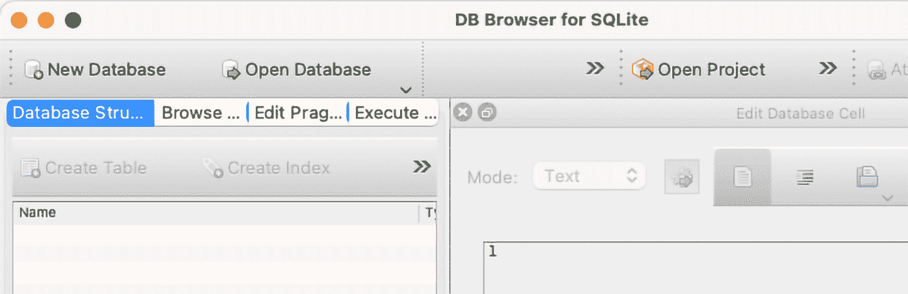
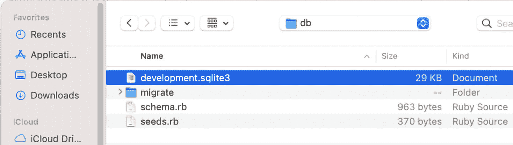
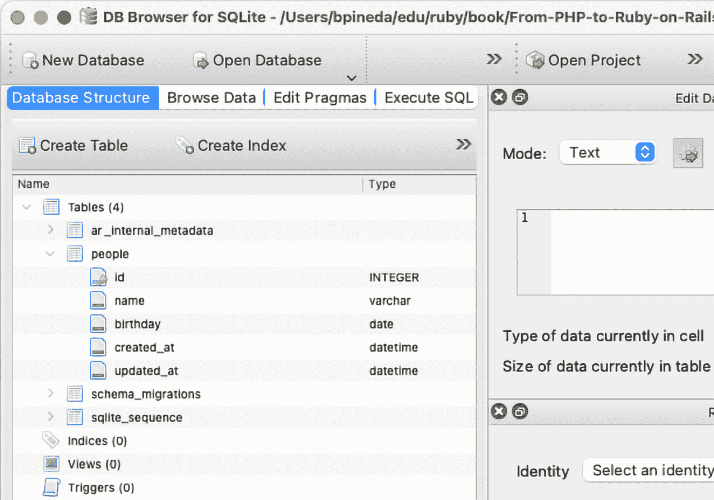
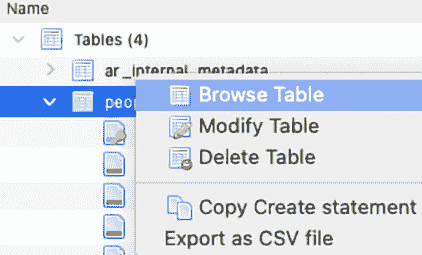
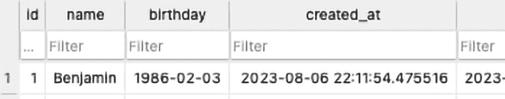
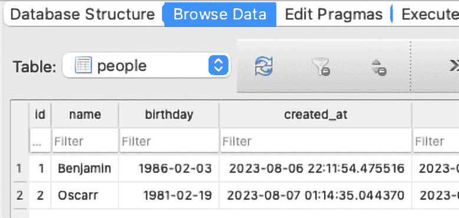
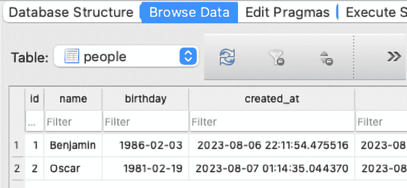
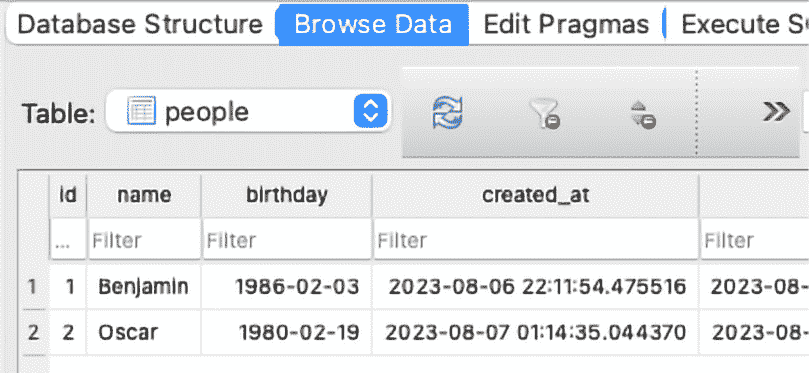
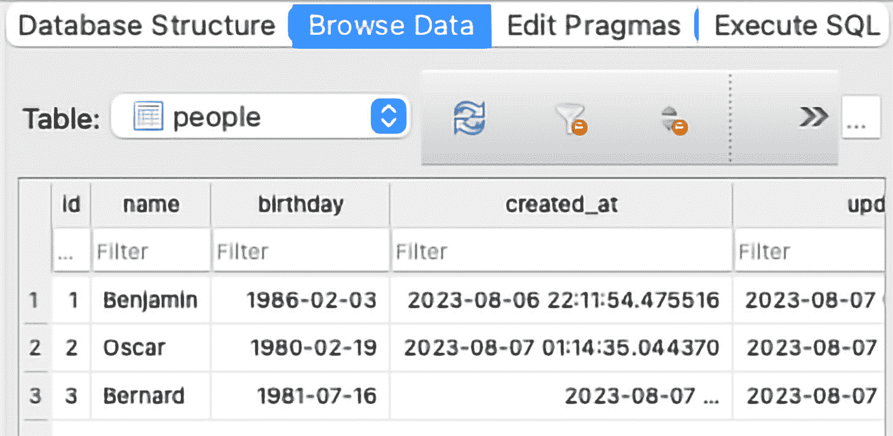
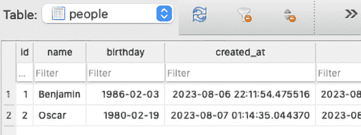

# 模型、数据库和 Active Record

在 **MVC** 应用程序设计模式中，**M** 代表 **model**，在这个上下文中，我们将使用 Ruby 的模型抽象通过另一个称为 Active Record 的设计模式连接到数据库。我们必须记住，虽然模型主要用于连接到数据库，但它们也可以用于连接到其他数据源。我们可能有一个模型连接到文件系统、Web 服务等等。模型背后的目的是组织我们的业务规则，而这个目的可能包括连接到各种数据源。

在本章中，我们将首先使用 Rails 的一些命令行生成器生成一个模型。然后，我们将使用这个模型连接到我们的数据库。最后，我们将查看 Active Record 并以非常直观的方式在我们的数据库中执行操作。

带着这个目的和 Active Record 的想法，在本章中，我们将涵盖以下主题：

+   使用 Rails 生成模型

+   连接到数据库

+   Active Record 操作

# 技术要求

要跟随本章的内容，您需要以下内容：

+   任何用于查看/编辑代码的 IDE（例如 SublimeText、Visual Studio Code、Notepad++ Vim、Emacs 等）

+   对于 macOS 用户，您还需要安装 Xcode 命令行工具

+   已安装并准备好使用的 Ruby 版本 2.6 或更高版本

+   在您的本地机器上安装 Git 客户端

本章中展示的代码可在 [`github.com/PacktPublishing/From-PHP-to-Ruby-on-Rails/`](https://github.com/PacktPublishing/From-PHP-to-Ruby-on-Rails/) 找到。

# 使用 Rails 生成模型

模型是我们可能在日常生活中找到的对象的抽象。无论是人、书还是汽车，模型都充当数据库中这些对象的表示。就像控制器一样，Rails 内置了生成器，可以帮助我们以非常简单直观的方式创建模型。但首先，让我们设置我们的环境。您可以选择从上一章结束的地方开始，或者下载本章的示例代码。如果您还没有这样做，请打开终端并输入以下 `git` 命令：

```php
git clone https://github.com/PacktPublishing/From-PHP-to-Ruby-on-Rails.git
```

如果您已经这样做，那么只需通过运行以下命令导航到您项目中的 `chapter08` 文件夹：

```php
cd From-PHP-to-Ruby-on-Rails/chapter08/rails5_models/
```

再次，让我们使用以下命令安装我们的依赖项：

```php
bundle install
```

为了确认我们的设置是否正确，让我们运行以下命令：

```php
bundle exec rails --version
```

输出应该类似于以下内容：

```php
Rails 5.1.7
```

现在我们已经准备好生成我们的模型了。我们将生成一个代表人的模型。我们将为每个人添加一个名为 `name` 的属性，另一个名为 `birthday` 的属性。要生成我们的模型，让我们在我们的 shell 中输入以下命令：

```php
bundle exec rails generate model Person name:string birthday:date
```

使用这个命令，我们告诉我们的 Rails 生成器创建一个名为`Person`的模型，它有一个名为`name`的属性，还有一个名为`birthday`的属性。`name`属性将是一个字符串，而`birthday`属性是一个日期。一旦我们按下*Enter*键，我们应该看到以下输出：

```php
bundle exec rails generate model Person name:string birthday:date
Running via Spring preloader in process 32161
      invoke  active_record
      create    db/migrate/20230727031200_create_people.rb
      create    app/models/person.rb
      invoke    test_unit
      create      test/models/person_test.rb
      create      test/fixtures/people.yml
```

如果我们仔细观察这个输出，我们应该会注意到两个重要的文件已经被创建，一个是迁移文件，另一个是模型本身。让我们首先打开我们的迁移文件，`db/migrate/20230727031200_create_people.rb`。其内容应该看起来像这样：

```php
class CreatePeople < Active Record::Migration[5.1]
  def change
    create_table :people do |t|
      t.string :name
      t.date :birthday
      t.timestamps
    end
  end
end
```

此文件包含了生成我们数据库结构的指令。如果我们仔细观察，它指出将创建一个包含`name`、`birthday`和`timestamps`列的`people`表。为什么需要这个文件？要回答这个问题，我们需要看看 Rails 迁移是什么。

## Rails migrations

在过去，跟踪一个**数据库**（**DB**）是一件麻烦事。每当你在需要数据库的其他开发者项目上工作时，总有人需要创建数据库及其表，并且通常还需要填充测试数据。如果新成员加入团队，你只需给他们一个数据库的副本，他们就可以开始工作了。但是等等——如果有人修改了数据库结构会怎样？如果我们需要一个新的字段呢？如果某个字段不再需要了呢？那么，负责这个数据库的人将不得不进行更改，然后将新的数据库副本分发给团队中的所有开发者。你可以看到，如果项目上有两个以上的开发者，这种情况可能会变得难以控制。这时，迁移就出现了来拯救我们！

迁移是一系列按顺序重建数据库结构的命令。在刚才我刚刚概述的假设例子中，迁移可以无问题地解决这个问题。最初，你会创建一个迁移来创建一个具有特定字段的表。如果表需要一个新的字段，你会创建另一个迁移来创建那个新字段。如果某个字段不再需要，你会创建一个迁移来删除那个字段。而且，你可能已经注意到了，迁移的名称有一个时间戳。这是为了按顺序运行迁移——我们首先创建表，然后添加字段，最后删除字段。如果新开发者加入团队，他们只需运行所有迁移，就可以拥有与所有人相同的数据库结构。回到当前的迁移，我们有（迁移）指令，但我们仍然需要执行这些指令来影响数据库。所以现在，让我们运行命令来执行这个迁移。在命令行中，输入以下命令：

```php
bundle exec rails db:migrate
```

这应该会输出以下内容：

```php
== 20230727031200 CreatePeople: migrating
=====================================
-- create_table(:people)
   -> 0.0002s
== 20230727031200 CreatePeople: migrated (0.0002s)
============================
```

这意味着我们的数据库结构已经创建，有一个名为`people`的表。这是 Rails 魔法的部分。我们还没有在我们的项目中配置任何数据库，但是这个命令成功执行，这意味着 Rails 已经连接到了一个数据库。背后的原因是 Rails 的开发者希望您能够直接使用一个现成的项目，为此，他们让初始项目默认连接到一个名为 SQLite 的数据库。SQLite 是一系列库，允许我们使用基于项目中的`sqlite3`文件的轻量级数据库。如果您对这个主题感兴趣，我建议您阅读 SQLite 官方页面：[`www.sqlite.org/index.html`](https://www.sqlite.org/index.html)

我们现在已经生成了模型，并准备好进入下一部分，我们将使用我们的模型和 Rails 配置来连接到数据库。

# 连接到数据库

到目前为止，我们已经创建了一个`Person`模型以及我们数据库结构所需的迁移。现在我们准备连接到我们的数据库。但是等等，我们之前已经连接到一个数据库了！正如之前所述，如果我们能够成功运行迁移，这意味着我们确实连接到了 SQLite 数据库。现在让我们看看 Rails 是如何配置来做到这一点的。让我们检查我们的 Gemfile，在这个过程中，我们会看到以下这一行：

```php
…
# Use sqlite3 as the database for Active Record
gem 'sqlite3'
…
```

前面的行安装了`sqlite3`gem，它允许 Rails 与 SQLite 数据库通信。但是等等，还有更多。如果我们打开`app/config/database.yml`文件，我们还会看到我们项目的数据库设置：

```php
…
default: &default
  adapter: sqlite3
  pool: <%= ENV.fetch("RAILS_MAX_THREADS") { 5 } %>
  timeout: 5000
development:
  <<: *default
  database: db/development.sqlite3
…
```

`default`部分定义了数据库适配器为`sqlite3`，环境设置数据库源文件位于`db/development.sqlite3`。如果我们检查这个，我们会看到文件确实存在。Rails 迁移命令是负责创建这个文件的命令。请不要打开这个文件，因为它是一个二进制文件，除非你在 IDE 上安装了读取 SQLite 文件的插件，否则你只能看到对计算机有意义而对人类无意义的数据。现在让我们使用这些新获得的信息，实际上使用 Rails 控制台来操作数据库中的数据。

## Rails 控制台

Rails 的创造者付出了巨大的努力，使 Ruby on Rails 成为与 Rails 搭配的首选框架。因此，他们受到了 Ruby 附带的一些工具的启发，特别是**交互式 Ruby**（**IRB**）控制台。Rails 附带了一个类似的控制台，但经过调整，可以加载和查询 Rails 组件。让我们用以下命令试一试：

```php
Bundle exec rails console
```

这将显示以下输出，并使我们能够与 Rails 交互：

```php
Running via Spring preloader in process 85479
Loading development environment (Rails 5.1.7)
irb(main):001:0>
```

正是这里，我们的`Person`模型派上了用场。让我们创建一个名为`single_person`的新对象，并将一些数据添加到我们的数据库中。在这个 Rails 控制台中，让我们运行以下命令：

```php
single_person = Person.new
```

这将基于我们通过`Model`文件和迁移定义的`Person`模型创建一个对象。前面的命令将输出以下内容：

```php
=> #<Person id: nil, name: nil, birthday: nil, created_at: nil, updated_at: nil>
irb(main):002:0>
```

我们可以看到，我们已经创建了一个没有 ID、没有名字和没有生日的空对象。现在让我们设置对象的名字和生日。我们将通过首先输入以下命令来完成：

```php
single_person.name = "Benjamin"
```

我们的提示将使用以下输出确认我们已经设置了名字：

```php
=> "Benjamin"
```

现在让我们使用以下命令设置生日：

```php
single_person.birthday = "1986-02-03"
```

我们正在以`year-month-day`格式设置日期。前面的命令将出生日期设置为 1986 年 2 月 3 日。就像前面的命令一样，它将通过返回我们刚刚设置的值来确认这一点：

```php
=> "1986-02-03"
```

我们可以进一步了解我们的对象，通过仅输入我们的`single_person`变量名来查看我们迄今为止设置的属性。让我们这样做：

```php
single_person
```

前面的命令将返回以下输出：

```php
=> #<Person id: nil, name: "Benjamin", birthday: "1986-02-03", created_at: nil, updated_at: nil>
```

有一个需要注意的事情是，这个信息目前仅在内存中。我们还没有将数据持久化（或写入）到数据库中。你可能会经常听到*持久化*这个词，当处理数据库时，它指的是将数据写入数据库。按照现在的状况，如果我们离开 Rails 控制台，数据将会丢失。你可能会问，我们如何持久化数据？简单：我们调用`single_person`对象的`save`方法。但在我们这样做之前，让我们确认我们的数据库中没有数据。我们将通过输入以下来自`Person`类的静态方法来完成：

```php
Person.all
```

这将输出以下内容：

```php
Person Load (0.7ms)  SELECT  "people".* FROM "people" LIMIT ?  [["LIMIT", 11]]
=> #<Active Record::Relation []>
```

此输出显示了数据库用于操作数据的**结构化查询语言**（**SQL**）命令。SQL 是一种标准语言，用于“与”数据库“交流”。许多数据库使用这种语言，因此你不需要为每个数据库学习不同的语言。如果你想了解更多关于 SQL 的信息，我建议你查看这个页面：

[`aws.amazon.com/what-is/sql/`](https://aws.amazon.com/what-is/sql/)

如果你之前没有遇到过 SQL 命令，这可能会显得有些晦涩，但请相信我，在现实中它并不那么糟糕。输出的一部分告诉我们 Rails 正在加载一个 SQL 命令，该命令是`SELECT "people".* FROM "people"`。星号（`*`）是一个过滤器，用于选择与`people`表关联的所有字段。在这种情况下，这意味着 Rails 将获取 ID、`name`、`birthday`和`timestamp`字段。命令中的`FROM`部分告诉数据库引擎从`people`表获取条目，没有任何过滤器。最后，输出的最后一行告诉我们`people`表中没有条目。正如我之前提到的，数据仍在内存中，所以现在让我们使用`save`方法将数据持久化到数据库中。让我们在 Rails 控制台中输入以下命令：

```php
single_person.save
```

这将输出一条消息，确认我们已经将数据保存到数据库中：

```php
irb(main):006:0> person.save
   (3.1ms)  begin transaction
  SQL (5.8ms)  INSERT INTO "people" ("name", "birthday", "created_at", "updated_at") VALUES (?, ?, ?, ?)  [["name", "Benjamin"], ["birthday", "1986-02-03"], ["created_at", "2023-08-06 22:11:54.475516"], ["updated_at", "2023-08-06 22:11:54.475516"]]
   (0.4ms)  commit transaction
=> true
```

现在让我们再次使用以下命令检索数据库中的所有条目：

```php
Person.all
```

这将返回以下输出：

```php
  Person Load (0.9ms)  SELECT  "people".* FROM "people" LIMIT ?  [["LIMIT", 11]]
=> #<Active Record::Relation [#<Person id: 1, name: "Benjamin", birthday: "1986-02-03", created_at: "2023-08-06 22:11:54", updated_at: "2023-08-06 22:11:54">]>
```

最后一行表明我们确实在数据库中持久化了信息。如果我们关闭 Rails 控制台并再次打开，然后获取所有记录，我们会得到刚才同样的结果。恭喜你，我们已经成功使用简单但强大的命令连接到数据库。现在是我们充分利用 Active Record 的时候了。

# Active Record 操作

Active Record 是一种设计模式，旨在简化与数据库的通信。历史上，SQL 是与大多数数据库通信的标准。然而，每个数据库都采用了自己独特的一套 SQL 命令和标准。虽然它们都非常相似，但每个都有其独特的特性，部分原因是因为并非所有数据库都有相同的功能集。一篇详细介绍 Active Record 设计模式概念的精彩文章是这篇：

[Active Record 模式概述](https://blog.savetchuk.com/overview-of-the-active-record-pattern)

以为例，PostgreSQL 提供的数据类型比 MySQL 更为复杂。另一个例子是用于网络应用的 SQLite，它非常容易设置，但在大型应用中表现不佳。在 Rails 中，SQLite 主要用于快速设置和开发。Active Record 在哪里发挥作用呢？Active Record 使用一种称为 **对象关系映射器**（**ORM**）的技术。这种技术涉及将数据库对象“映射”到编程对象。这种映射的一个例子是表中的条目变成一个对象，而每个列成为该对象的属性。我们为什么要这样做呢？简单的答案是，作为开发者，我们处理对象比处理 SQL 命令更容易。更复杂的答案是，Active Record 使用相同的语言（对象）并将这些对象转换为数据库使用的任何特定风格的 SQL。你可以在开发者几乎不费力的前提下切换数据库类型（PostgreSQL、MySQL、SQLite 等）。使用比 SQL 语法更易读的命令来执行数据库操作。学习几个直观的命令比学习 SQL 所需的整个语法要容易得多。我们已经看到了这个功能在行动中的表现，但让我们看看简单 Active Record 命令和 SQL 命令之间的区别。当仍然在 Rails 控制台中时，让我们输入以下内容：

```php
Active Record::Base.connection.execute("Select * from people")
```

这将返回数据库中的条目数组：

```php
   (4.4ms)  Select * from people
=> [{"id"=>1, "name"=>"Benjamin", "birthday"=>"1986-02-03", "created_at"=>"2023-08-06 22:11:54.475516", "updated_at"=>"2023-08-06 22:11:54.475516"}]
```

我们可以通过使用 Active Record 使用的 ORM 技术通过以下命令获得相同的结果：

```php
Person.all
```

前面的命令也返回条目数组：

```php
  Person Load (1.9ms)  SELECT  "people".* FROM "people" LIMIT ?  [["LIMIT", 11]]
=> #<Active Record::Relation [#<Person id: 1, name: "Benjamin", birthday: "1986-02-03", created_at: "2023-08-06 22:11:54", updated_at: "2023-08-06 22:11:54">]>
```

我不知道你们是否这样认为，但我觉得记住 `Person.all` 比记住 `SELECT * FROM people` 更容易。请别误会——知道 SQL 语法总是有优势的。然而，知道 SQL 语法和如何利用 Active Record 更有利。让我们看看我们可以使用 Active Record 执行的其他操作。

到目前为止，我相信安装一个客户端来可视化我们的 SQLite 数据将非常有用。有许多客户端和浏览器插件可以完成这项任务，但我推荐使用 DB Browser for SQLite。您可以在以下页面查看其页面：

[SQLite Browser](https://sqlitebrowser.org/)

这将在 Windows 和 Mac 上实现可视化数据的目标，甚至在某些 Linux 发行版上，但对于这个工具不可用的平台，您也可以依赖 Chrome 的 SQLite Manager for Google Chrome 插件：

[SQLite Manager for Google Chrome](https://chrome.google.com/webstore/detail/sqlite-manager-for-google/aejlocbcokogiclkcfddhfnpajhejmeb)

它们都以类似的方式工作，而且，我们只想将这个工具用作可视数据浏览器。

一旦我们安装了工具，让我们打开数据库文件。在这种情况下，数据库文件位于`chapter08/rails5_models/db/development.sqlite3`。在 DB Browser for SQLite 应用程序打开的情况下，让我们点击这里显示的**打开数据库**按钮：



图 8.1 – 在 SQLite Browser 中打开数据库的按钮

然后让我们导航到我们的`development.sqlite3`文件：



图 8.2 – 导航到 sqlite3 文件

一旦我们打开那个文件，我们就能查看我们迄今为止创建的表，以及 Rails 自己创建的一些其他表。



图 8.3 – 在 SQLite Browser 中打开人表

我们现在可以忽略所有其他表，只需专注于`people`表。如您所见，我们具有与创建`Person`模型实例时在`Person`对象上看到的相同的列（`id`、`name`、`birthday`、`created_at`和`updated_at`）。但除了结构之外，我们对这个表内的条目（或记录）更感兴趣。让我们右键单击`people`表，并选择以下截图所示的**浏览表**选项：



图 8.4 – 在 DB Browser for SQLite 中浏览表数据

现在我们应该能看到我们在用 Rails 控制台玩耍时添加的单个条目：



图 8.5 – 在 SQLite Browser for SQLite 上显示的人表条目

条目应包含我们输入到 Rails 控制台中的相同数据。

我们已确认初始数据设置正确，但现在是我们使用 Active Record 在数据库上创建新记录的时候了。

## 创建记录

我们之前看到，我们可以通过创建一个`Person`对象，添加属性（`name`和`birthday`），并最终保存记录来向我们的数据库添加条目。但有一个单行命令可以完成相同的事情。让我们在 Rails 控制台中尝试以下行：

```php
Person.create(name: "Oscarr", birthday: "1981-02-19")
```

应该输出以下内容：

```php
   (2.7ms)  begin transaction
  SQL (7.6ms)  INSERT INTO "people" ("name", "birthday", "created_at", "updated_at") VALUES (?, ?, ?, ?)  [["name", "Oscarr"], ["birthday", "1980-02-19"], ["created_at", "2023-08-07 01:14:35.044370"], ["updated_at", "2023-08-07 01:14:35.044370"]]
   (0.5ms)  commit transaction
=> #<Person id: 2, name: "Oscarr", birthday: "1981-02-19", created_at: "2023-08-07 01:14:35", updated_at: "2023-08-07 01:14:35">
```

`"Oscarr"`这个名字是有意为之的。正如我们所见，`create`方法生成一个 SQL 语句，在我们在其上工作的同一张表上创建记录，但具有不同的属性。我们拥有的属性越多，如果我们使用其他方法添加数据，我们就需要更多的代码行。这两种方法都是将数据插入我们数据库的有效方法。我只是想展示两种选项，这样你可以选择对你特定用例更方便的一种。现在，让我们确认这个新条目确实存在于数据库中。让我们回到 SQLite 浏览器应用程序，通过刷新按钮或按 Mac 用户的*CMD + R*或 Windows 和 Linux 用户的*Ctrl + R*来刷新视图。现在，这个新条目应该会显示在表格上：



图 8.6 – 在 SQLite 浏览器中显示的人员表上的新条目

哦，等等。我们犯了两个错误。我在添加名字`"Oscarr"`时打错了字，我本想只输入`"Oscar"`。我还犯了一个关于年份的错误，因为我本想添加`1980`而不是`1981`。这个幸运的错误带我们到了下一个操作：`SELECT`。

## 选择记录

到目前为止，我们看到了一种选择所有条目的方法：`all`方法。但 Active Record 还提供了两个其他非常有用的方法：`first`和`last`。正如其名所示，我们可以选择任何选择中的第一个记录。让我们在 Rails 控制台中输入以下命令来执行此操作：

```php
Person.all.first
```

这应该返回以下输出：

```php
  Person Load (0.9ms)  SELECT  "people".* FROM "people" ORDER BY "people"."id" ASC LIMIT ?  [["LIMIT", 1]]
=> #<Person id: 1, name: "Benjamin", birthday: "1986-02-03", created_at: "2023-08-06 22:11:54", updated_at: "2023-08-07 02:20:36">
```

正如你所见，这个命令选择了我们`people`表中的第一个条目。现在让我们在 Rails 控制台中尝试使用`last`方法，输入以下内容：

```php
Person.all.last
```

这应该输出以下内容：

```php
  Person Load (1.8ms)  SELECT  "people".* FROM "people" ORDER BY "people"."id" DESC LIMIT ?  [["LIMIT", 1]]
=> #<Person id: 2, name: "Oscarr", birthday: "1981-02-19", created_at: "2023-08-07 01:14:35", updated_at: "2023-08-07 02:24:21">
```

我们已经选择了数据库中的最后一个记录。这些方法在寻找测试数据时非常有用。现在让我们使用`where`方法通过一个确定的字段来过滤数据。让我们在 Rails 控制台中尝试以下代码：

```php
Person.where( name: "Benjamin" )
```

这将输出以下内容：

```php
  Person Load (0.9ms)  SELECT  "people".* FROM "people" WHERE "people"."name" = ? LIMIT ?  [["name", "Benjamin"], ["LIMIT", 11]]
=> #<Active Record::Relation [#<Person id: 1, name: "Benjamin", birthday: "1986-02-03", created_at: "2023-08-06 22:11:54", updated_at: "2023-08-07 02:20:36">]>
```

此代码已选择所有名为`"Benjamin"`的条目。在这种情况下，只有一个条目。然而，这里有一个需要注意的小陷阱。注意，在前一个输出中的`Relation`一词之后，有一个方括号（`[`），它最终在行尾几乎关闭（`>]>`）。这是因为当我们使用`where`方法时，它总是返回一个对象数组。这在显示视图中的网格或表格数据时很有用，但当我们想要选择单个条目时可能会很棘手。现在，让我们谈谈选择单个记录。在更新任何记录之前，我们需要选择我们要修改的记录。为此，Rails 上的 Active Record 实现提供了两个方便的方法。第一个是`find_by`。`find_by`方法需要一个参数，形式为包含我们想要过滤的属性的哈希，后跟值。在这种情况下，我们想要通过`name`属性和`Oscarr`值进行过滤。让我们通过在 Rails 控制台中输入以下内容来测试它：

```php
found_person = Person.find_by name:"Oscarr"
```

这将返回以下输出：

```php
irb(main):002:0> found_person = Person.find_by name:"Oscarr"
  Person Load (0.8ms)  SELECT  "people".* FROM "people" WHERE "people"."name" = ? LIMIT ?  [["name", "Oscarr"], ["LIMIT", 1]]
=> #<Person id: 2, name: "Oscarr", birthday: "1981-02-19", created_at: "2023-08-07 01:14:35", updated_at: "2023-08-07 01:14:35">
```

Rails 返回它通过`find_by`方法提供的标准找到的第一个条目。在这种情况下，它找到第一个名字等于`"Oscarr"`的条目。我们可以通过输入任何属性并查看其内容来确认这一点。让我们通过在 Rails 控制台中输入以下行来尝试：

```php
found_person.id
```

这将返回以下输出：

```php
2
```

我们可以用任何其他属性做同样的事情。让我们用`birthday`属性试一试。让我们在我们的 Rails 控制台中输入以下内容：

```php
found_person.birthday
```

我们应该得到以下输出：

```php
Thu, 19 Feb 1981
```

因此，正如你所看到的，`found_person`对象包含了我们正在寻找的条目。然而，这有一个前提。可能有不止一个人有相同的名字。如果我们想要选择第二个人，那么我们的代码将失败，因为`find_by`方法自动返回第一个找到的条目。为了解决这个难题，Active Record 提供了一个特殊的方法，称为`find`。此方法假设我们的表有一个唯一的`id`列，每个条目都是唯一的。所以，在我们的上一个用例中，如果有两个人有相同的名字，我们只需通过唯一的 ID 进行过滤。在这种情况下，我们只需在我们的 Rails 控制台中输入以下内容：

```php
found_person = Person.find(2)
```

这将输出与之前相同的内容：

```php
irb(main):015:0> Person.find(2)
  Person Load (4.6ms)  SELECT  "people".* FROM "people" WHERE "people"."id" = ? LIMIT ?  [["id", 2], ["LIMIT", 1]]
=> #<Person id: 2, name: "Oscarr", birthday: "1981-02-19", created_at: "2023-08-07 01:14:35", updated_at: "2023-08-07 01:14:35">
```

如果存在另一个同名条目，对我们来说无关紧要。我们的代码将选择`id`等于`2`的那个条目。既然我们已经选择了一个条目，那么让我们继续更新其内容。

## 更新记录

就像创建记录一样，我们有几种方法可以在数据库中更新记录。既然我们已经选择了名字中存在错别字的记录，让我们看看我们可以使用的第一个更新记录的选项。假设我们将以下代码输入到我们的 Rails 控制台中：

```php
found_person
```

这将输出以下记录：

```php
=> #<Person id: 2, name: "Oscarr", birthday: "1981-02-19", created_at: "2023-08-07 01:14:35", updated_at: "2023-08-07 01:14:35">
```

通过这种方式，我们可以确认这是我们想要修改的正确记录。要修改名称，我们将在 Rails 控制台中输入以下代码：

```php
found_person.name = "Oscar"
```

这将只输出我们刚刚分配给 `name` 属性的字符串：

```php
=> "Oscar"
```

但请记住我们之前所说的关于对象的话：这个更改仍然只是在内存中。我们需要持久化这个更改。我们将使用之前相同的 `save` 方法。让我们在 Rails 控制台中输入以下内容：

```php
found_person.save
```

这将输出以下内容：

```php
irb(main):019:0> found_person.save
   (0.3ms)  begin transaction
  SQL (0.4ms)  UPDATE "people" SET "name" = ?, "updated_at" = ? WHERE "people"."id" = ?  [["name", "Oscar"], ["updated_at", "2023-08-07 02:14:06.188761"], ["id", 2]]
   (0.9ms)  commit transaction
=> true
```

这将把我们的更改保存到数据库中，并返回一个 true 值。这个 true 值将在下一章中非常有用。但就现在而言，我们可以通过打开 SQLite 浏览器并刷新视图来确认这个更改。现在应该显示正确的名称：



图 8.7 – 在 SQLite 浏览器中显示的人表修改条目

这是一种修改记录的方法。然而，还有另一种方法可以使用 `update` 方法。让我们在 Rails 控制台中用以下代码尝试一下：

```php
found_person.update(birthday: "1980-02-19")
```

这将输出以下内容：

```php
   (0.4ms)  begin transaction
  SQL (0.4ms)  UPDATE "people" SET "birthday" = ?, "updated_at" = ? WHERE "people"."id" = ?  [["birthday", "1980-02-19"], ["updated_at", "2023-08-07 02:24:21.753388"], ["id", 2]]
   (0.7ms)  commit transaction
=> true
```

现在，让我们再次在 SQLite 浏览器应用中确认这个更改。让我们只是刷新视图，我们应该能看到更改显示出来：



图 8.8 – 在 SQLite 浏览器中显示的人表更新条目

因此，正如你所看到的，我们已经以两种不同的方式更新了我们的记录。再次强调，这两种方法都是有效的，你可以选择更适合你需求的方法。现在让我们看看最后一种方法（目前），即 `destroy` 方法。

## 删除记录

到目前为止，我们已经在数据库中创建了、选择了和更新了记录。接下来我们要查看的最后一种 Active Record 操作是销毁操作。你应该特别小心这个操作，因为这个操作会从你的数据库中删除数据，而无需事先进行任何确认。此外，这个操作是不可逆的——一旦执行了销毁操作，就无法撤销。所以，让我们首先在 Rails 控制台中用以下命令创建另一个条目：

```php
Person.create( name: "Bernard", birthday: "1981-07-16" )
```

这应该输出以下内容：

```php
   (0.5ms)  begin transaction
  SQL (1.0ms)  INSERT INTO "people" ("name", "birthday", "created_at", "updated_at") VALUES (?, ?, ?, ?)  [["name", "Bernard"], ["birthday", "1981-07-16"], ["created_at", "2023-08-07 02:37:29.615141"], ["updated_at", "2023-08-07 02:37:29.615141"]]
   (0.4ms)  commit transaction
=> #<Person id: 3, name: "Bernard", birthday: "1981-07-16", created_at: "2023-08-07 02:37:29", updated_at: "2023-08-07 02:37:29">
```

然后，再次在 SQLite 浏览器应用中刷新我们的视图：



图 8.9 – 在 SQLite 浏览器中显示的人表新条目

现在我们已经确认新条目存在，我们可以继续删除它。就像 `update` 方法一样，我们首先必须在数据库中选中一个条目。让我们在 Rails 控制台中输入以下内容：

```php
person_to_delete = Person.find(3)
```

这应该输出以下内容：

```php
  Person Load (0.4ms)  SELECT  "people".* FROM "people" WHERE "people"."id" = ? LIMIT ?  [["id", 3], ["LIMIT", 1]]
=> #<Person id: 3, name: "Bernard", birthday: "1981-07-16", created_at: "2023-08-07 02:39:56", updated_at: "2023-08-07 02:39:56">
```

通过这种方式，我们确认我们已经选中了正确的记录。最后，让我们在 Rails 控制台中用以下代码删除记录：

```php
person_to_delete.destroy
```

这将输出以下内容：

```php
   (0.5ms)  begin transaction
  SQL (0.5ms)  DELETE FROM "people" WHERE "people"."id" = ?  [["id", 3]]
   (0.9ms)  commit transaction
=> #<Person id: 3, name: "Bernard", birthday: "1981-07-16", created_at: "2023-08-07 02:39:56", updated_at: "2023-08-07 02:39:56">
```

如您所见，它生成了并执行了删除条目的代码。如果我们进入我们的 SQLite 浏览器应用程序并刷新视图，我们应该会看到该条目已不再存在：



图 8.10 – 如在 SQLite 浏览器中所示，已删除的人事表条目

如我们所见，该条目已被删除，并且永远消失。我无法强调这种操作在开发应用程序时有多么危险。我所能说的是，使用时要格外小心。

您可能已经注意到，所有数据库的数据操作都是通过 Rails 控制台完成的。这是因为我相信 Rails 控制台是理解和学习如何使用 Active Record 操作的最简单方式。一旦我们掌握了这些易于使用且直观的方法，那么在控制器和视图中应用这些知识将毫无困难。如果您想了解更多关于这些 Active Record 操作的信息，请查看 Active Record 基础知识页面：

[`guides.rubyonrails.org/active_record_basics.html`](https://guides.rubyonrails.org/active_record_basics.html)

# 摘要

在本章中，我们学习了模型、迁移以及 Rails 控制台作为轻松操作数据库数据的首选工具。我们还学习了 Active Record 在 Rails 中的实现是多么有用，以及我们如何可以通过非常易于使用的命令与数据库进行通信。现在，我们已经准备好通过从数据库中获取数据并在视图中显示它来将这些知识综合起来，这正是我们将在下一章中要做的。
