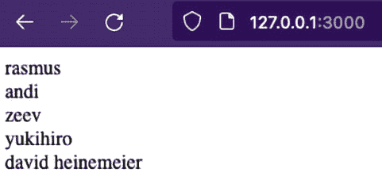
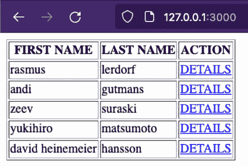
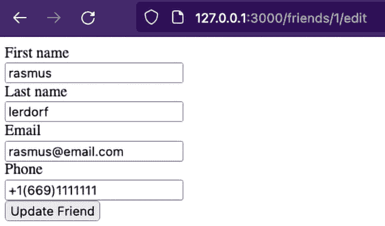
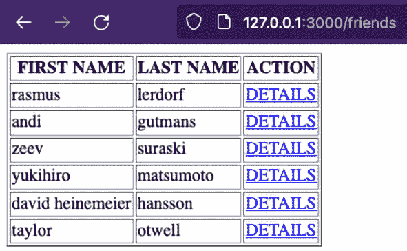
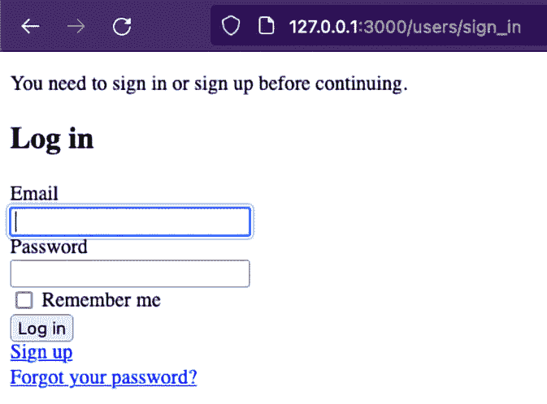
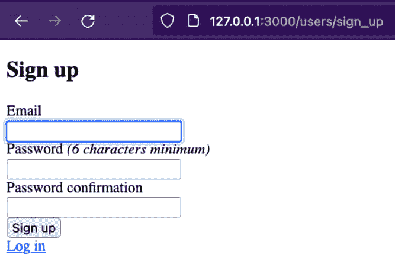
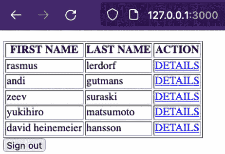

# 9

# 将一切整合在一起

到目前为止，我们已经看到了如何以某种分离的方式使用控制器、视图和模型。在上一章（*模型、数据库和 Active Record*）中，我们操作了数据库中的数据。然而，我们没有看到如何从控制器与数据库数据交互，更不用说如何将数据库数据加载到我们的视图中。在本章中，我们将看到一切是如何结合在一起的——也就是说，我们将从控制器加载一个模型并将模型数据传递给我们的视图，以便最终用户可以在浏览器上看到数据。我们还将做相反的操作，即将用户数据从视图传到我们的数据库，从视图开始到模型结束。此外，我们还将学习 Rails 方式执行这些操作，因为它们与我们用 PHP 做这些任务的方式大不相同。

考虑到模型、视图和控制器，在本章中，我们将涵盖以下主题：

+   使用生成器设置我们的初始应用程序

+   以 Rails 方式处理数据

+   不要，我再重复一遍，不要重新发明轮子

# 技术要求

为了跟随本章，我们需要以下内容：

+   任何用于查看/编辑代码的 IDE（例如，SublimeText、Visual Studio Code、Notepad++ Vim、Emacs 等）

+   对于 macOS 用户，您还需要安装 Xcode 命令行工具

+   已安装并准备好使用的 Ruby 版本 3.1.1 或更高版本

+   在您的本地机器上安装的 Git 客户端

本章中展示的代码可在 [`github.com/PacktPublishing/From-PHP-to-Ruby-on-Rails/`](https://github.com/PacktPublishing/From-PHP-to-Ruby-on-Rails/) 找到。

# 项目准备

在设置我们的应用程序之前，我们将根据操作系统进行一些额外的配置。我们将配置分为两个部分——Windows 配置和基于 Linux 的系统（包括 macOS）。

### Windows 配置

在*第七章*中，我们配置了我们的 Windows 环境使用 **rbenv** 来使用 Ruby 2.6.10。如果您还没有这样做，请回到 *在 Windows 上安装 Ruby on Rails* 部分查看，因为这是本章所必需的。对于 Rails 7（我们将在本章中安装），我们需要安装 Ruby 3.1.1 以及一些在 Windows 上不易获得的依赖项。我们将使用 Git SDK 的 bash shell（我们也在*第七章*中安装了它）来解决这个问题。所以，让我们打开一个 Windows PowerShell 并输入以下命令：

```php
C:\git-sdk-64\git-bash.exe
```

这将打开一个 Git Bash 控制台，它看起来和表现得很像 Linux shell。让我们通过输入以下命令来确认我们是否有 Ruby 可用：

```php
ruby –version
```

这应该会输出以下内容：

```php
ruby 3.1.3p185 (2022-11-24 revision 1a6b16756e) [x64-mingw32]
```

如果您不熟悉这个版本的 Ruby，那是因为它随 Git SDK 一起提供。现在，让我们使用以下命令安装 Ruby 3.1.3 的 bundler：

```php
gem install bundler
```

接下来，让我们使用以下命令更新我们的系统 bundler：

```php
gem update –system 3.3.3
```

现在，我们已经准备好设置我们的应用程序。

### 基于 Linux 的系统配置

对于 macOS 和基于 Linux 的系统（Ubuntu 和 Debian），我们将依赖 rbenv 来安装 Ruby 3.1.1。如果你还没有安装 rbenv，请参阅 *第七章* 以查看如何在 Linux 上安装 rbenv。rbenv 可用后，让我们在 shell 中使用以下命令安装另一个版本的 Ruby：

```php
rbenv install 3.1.1
```

现在 Ruby 3.1.1 已经安装，让我们使用以下命令将默认 Ruby 设置为 Ruby 3.1.1：

```php
rbenv global 3.1.1
```

让我们运行以下命令来确认是否激活了正确的 Ruby 版本：

```php
ruby --version
```

这应该会输出以下内容：

```php
ruby 3.1.1p18 (2022-02-18 revision 53f5fc4236) [x86_64-linux]
```

我们应该使用以下命令为这个版本的 Ruby 安装 bundler：

```php
gem install bundler
```

现在，我们为我们的下一个 Rails 项目做好了准备。

# 设置我们的应用程序

对于这个练习，我们将有一个假设的场景，在这个场景中，我们是托马斯·A·安德森，我们在一家受人尊敬的软件公司工作。我们将扮演一个对 Rails 知识了解有限的初级网页开发者的角色，并且我们将被分配一个简单的任务。客户要求一个简单的地址簿结构，他们可以在其中保存朋友的联系信息——姓名、姓氏、电子邮件和电话号码。所以，让我们开始工作。确保你已经安装了 Ruby 3.1.1 或更高版本，否则我们可能会遇到项目问题。我们可以下载一个我们已有的模板应用程序，或者从 GitHub 上克隆它。如果你还没有这样做，打开终端并输入以下 `git` 命令：

```php
git clone https://github.com/PacktPublishing/From-PHP-to-Ruby-on-Rails.git
```

如果你已经这样做了，只需使用以下命令导航到我们项目中的 `chapter09/rails7_original` 文件夹：

```php
cd From-PHP-to-Ruby-on-Rails/chapter09/rails7_original/
```

对于这个小型项目，客户要求我们使用 Rails 7，因为这是他们在其他项目中使用的版本。这也给了我们一个机会来实际看看 Rails 7 的运行情况。现在，让我们使用以下命令安装我们的项目依赖项：

```php
bundle install
```

为了确认我们的设置正确无误，让我们运行以下命令：

```php
bundle exec rails --version
```

输出应该类似于以下内容：

```php
Rails 7.0.6
```

这就是我们的 Rails 开发工作开始的地方。我们将使用一些 Rails 魔法来生成我们大部分的代码。让我们生成一个包含我们即将调用的所有方法的 `friends` 控制器——`index`、`new`、`edit`、`update`、`destroy` 和 `create`。让我们进入我们的 shell 并运行以下命令：

```php
bundle exec rails generate controller Friends index new edit update destroy create
```

这应该会生成以下输出：

```php
      create  app/controllers/friends_controller.rb
       route  get 'friends/index'
              get 'friends/new'
              get 'friends/edit'
              get 'friends/update'
              get 'friends/destroy'
              get 'friends/create'
      invoke  erb
      create    app/views/friends
      create    app/views/friends/index.html.erb
      create    app/views/friends/new.html.erb
      create    app/views/friends/edit.html.erb
      create    app/views/friends/update.html.erb
      create    app/views/friends/destroy.html.erb
      create    app/views/friends/create.html.erb
      …
```

来自 PHP 世界，尤其是 Laravel，你可能会觉得之前的命令有些熟悉。在 Laravel 中，你会使用以下命令生成一个等效的控制台：

```php
php artisan make:controller FriendsController --resource
```

它们都生成了类似的功能（`friends` 控制器）和最后的 `--resource` 选项生成了正确的 HTTP 动词。在 Rails 中，我们刚刚运行的 `generator` 命令将其第一个参数作为控制器名称（Friends），其余作为控制器方法。该命令也非常详细地说明了它实际上生成了什么。它不仅创建了我们的控制器，还为命令传递的每个方法创建了一个视图。我们可以通过打开 `app/views/friends/` 文件夹来查看这一点。


图 9.1 – Friends 控制器生成的视图

此外，控制器生成器修改了我们的 `routes.rb` 文件，该文件定义了控制器内所有操作的 URL。如果我们打开 `config/routes.rb`，我们会看到我们新创建的路由：

```php
Rails.application.routes.draw do
  get 'friends/index'
  get 'friends/new'
  get 'friends/edit'
  get 'friends/update'
  get 'friends/destroy'
  get 'friends/create'
  # root "articles#index"
end
```

虽然这样很好，但我们也可以用 Rails 的方式来做。让我们删除所有路由，只留下 `do` 块内的两行，所以我们的 `routes.rb` 文件现在看起来是这样的：

```php
Rails.application.routes.draw do
  resources :friends
  root "friends#index"
end
```

虽然看起来很整洁，但稍微有点晦涩，因为我们（目前）还不知道这个资源调用具体做什么。资源调用为以下操作生成 RESTful 路由 – `index`、`new`、`edit`、`create`、`update` 和 `destroy`。这仅仅意味着所有这些操作都应该使用正确的 HTTP 动词来调用 – `GET`、`POST`、`PATCH`、`PUT` 和 `DELETE`。我不想在这里给你太多信息，所以为了简化，我们只需说我们需要通过 URL 传递一些参数，还有一些其他参数需要从用户那里“隐藏”。如果你对 RESTful 及其用途感兴趣，请查看以下链接：

+   [`guides.rubyonrails.org/routing.html`](https://guides.rubyonrails.org/routing.html)

+   [`www.redhat.com/en/topics/api/what-is-a-rest-api`](https://www.redhat.com/en/topics/api/what-is-a-rest-api)

+   [`aws.amazon.com/what-is/restful-api/`](https://aws.amazon.com/what-is/restful-api/)

+   [`www.ibm.com/topics/rest-apis`](https://www.ibm.com/topics/rest-apis)

现在，下一步。让我们生成一个模型，它将在数据库中代表我们的“朋友”。我们将在 shell 上使用以下命令生成我们的模型：

```php
bundle exec rails generate model Friend first_name:string last_name:string email:string phone:string
```

这将生成以下输出：

```php
      invoke  active_record
      create    db/migrate/20230817022418_create_friends.rb
      create    app/models/friend.rb
      invoke    test_unit
      create      test/models/friend_test.rb
      create      test/fixtures/friends.yml
```

模型生成器创建了一个迁移来创建一个 `friends` 表。该表将包含 `first_name`、`last_name`、`email` 和 `phone` 字段。根据我们在上一章学到的知识，我们知道我们必须运行迁移来有效地生成我们的数据库结构。我们将在 shell 上运行以下命令来完成：

```php
bundle exec rails db:migrate
```

如果这对您来说不是新内容，那可能是因为其他 PHP 框架有类似的工具。对于 Laravel，我们会执行以下命令：

```php
php artisan migrate
```

对于 Symfony，我们会写以下命令：

```php
bin/console doctrine:migrations:migrate
```

对于 CodeIgniter，我们会写以下命令：

```php
spark migrate
```

我们可以从 PHP 框架中的这些示例中推断出，迁移工具已经在网络框架市场中存在了一段时间，并且它将保留下来。

我们设置的最后一步是之前章节中没有涉及的内容，它与 Rails 模型有关。为了帮助开发者尽快获得一个工作环境，Rails 集成了一个名为 database seeds 的工具。种子允许我们根据我们的模型结构生成测试数据。我承认我有点作弊，因为我给你提供了一个已经可以工作的种子文件。它在`db/seeds.rb`文件中。让我们看看这个文件中的一个记录：

```php
…
Friend.create(first_name: "rasmus", last_name: "lerdorf", email: "rasmus@email.com", phone: "+1(669)1111111")
…
```

这段代码相当直观。它创建了一个`Friend`条目，包含名字（`rasmus`）、姓氏（`lerdorf`）、电子邮件地址（`rasmus@email.com`）和电话号码（`+1(669)1111111`）。当然，这些都是虚假数据，但当我们开始使用数据库时，它们将对我们很有用。最后一步是运行这个种子文件并将这些记录添加到我们的数据库中。我们在 shell 上使用以下命令来完成这个操作：

```php
bundle exec rails db:seed
```

这个命令将生成种子文件中找到的五条记录。这是我们初始应用程序所需的所有设置。现在，是时候管理这些数据了。

# 处理数据

到目前为止，我们已经在数据库中手动修改了数据。通过手动，我的意思是所有操作都在 Rails 控制台中完成。然而，由于我们的项目需求是让用户处理`friends`条目，我们将通过将我们的模型与控制器和视图集成来实现这一点，以便用户可以在一个友好的界面上查看`friends`条目。我们将创建一个**CRUD**界面。是的，听起来很丑，但这正是软件工程师们想出来的缩写。它代表**创建、更新、删除**，这正是我们即将构建的——一个创建、更新和删除记录的界面。

## 设置 CRUD 界面

第一步是确认数据实际上在我们的数据库中。从我们之前的章节中，我们知道我们可以通过调用 Rails 控制台来做这件事，所以让我们通过运行以下命令来实现：

```php
bundle exec rails console
```

这应该改变我们的 shell 外观，如下所示：

```php
Loading development environment (Rails 7.0.6)
irb(main):001:0>
```

现在，让我们在这个控制台中输入以下命令：

```php
Friend.all
```

这将显示数据库中的所有朋友条目。它应该显示类似以下的内容：

```php
  Friend Load (0.4ms)  SELECT "friends".* FROM "friends"
=>
[#<Friend:0x00000001067cbe90
  id: 1,
  first_name: "rasmus",
  last_name: "lerdorf",
  email: "rasmus@email.com",
  phone: "+1(669)1111111",
  created_at: Thu, 17 Aug 2023 02:41:30.679843000 UTC +00:00,
  updated_at: Thu, 17 Aug 2023 02:41:30.679843000 UTC +00:00>,
…
 #<Friend:0x00000001068232f8
  id: 5,
  first_name: "david heinemeier",
  last_name: "hansson",
  email: "my5@email.com",
  phone: "+1(918)5555555",
  created_at: Thu, 17 Aug 2023 02:41:30.687162000 UTC +00:00,
  updated_at: Thu, 17 Aug 2023 02:41:30.687162000 UTC +00:00>]
irb(main):002:0>
```

为了简洁，内容已被截断，但你应该能看到五条记录，这些记录与种子文件上的内容相对应。这个输出确认了数据已经在数据库中。现在，让我们在 shell 上输入以下命令来退出 Rails 控制台：

```php
exit
```

现在，让我们使用以下命令启动我们的 Rails 应用程序：

```php
bundle exec rails server
```

这个命令应该输出以下内容：

```php
=> Booting Puma
=> Rails 7.0.6 application starting in development
=> Run `bin/rails server --help` for more startup options
Puma starting in single mode...
* Puma version: 5.6.6 (ruby 3.1.1-p18) ("Birdie's Version")
*  Min threads: 5
*  Max threads: 5
*  Environment: development
*          PID: 14464
* Listening on http://127.0.0.1:3000
* Listening on http://[::1]:3000
Use Ctrl-C to stop
```

最后，打开你选择的浏览器并访问`http://127.0.0.1:3000/any`。这应该会显示以下 Rails 错误页面：


图 9.2 – Rails 路由错误页面

我故意提到打开一个不存在的路由来查看这个页面。每次你打开一个在 `routes.rb` 文件上未注册的路由时，Rails 都会显示这个错误页面，它显示了我们的应用程序中定义的所有路由。正如我之前提到的，资源调用为我们生成了许多与我们的 `friends` 组件相关的路由。我们将从 `root_path` 开始。让我们在这个错误页面上找到 `root_path` 的条目。一旦我们找到条目，我们就可以看到它对应于我们应用程序的根 URL (`/`)，每次我们通过浏览器访问这个路由时，都会执行 `friends` 控制器中的 `index` 方法，如最后列所示（`friends#index`）。这个错误页面基本上是 URL 地址和它们将在控制器上执行的动作的映射。从这一页，我们了解到我们需要修改 `app/controllers/friends_controller.rb` 文件中 `friends` 控制器的 `index` 方法。我们应该在这个文件中看到以下代码：

```php
class FriendsController < ApplicationController
  def index
  end
  def new
  end
  def edit
  end
  def update
  end
  def destroy
  end
  def create
  end
end
```

注意，所有这些操作都是由控制器生成器生成的，所以我们不是从零开始。此外，这些都是我们将构建以创建我们的 CRUD 界面的所有操作。

## 列出数据

让我们专注于 `index` 方法。我们想在 `index` 方法中显示所有记录，所以现在我们将加载 `Friend` 模型并选择数据库中的所有条目。考虑到这些更改，`index` 方法现在应该看起来像这样：

```php
class FriendsController < ApplicationController
  def index
    @friends = Friend.all
  end
…
```

在我们的 `friends` 变量前添加 `@` 符号，我们将该变量设置为实例变量。Rails 的工作方式是，这个实例变量随后被传递到视图中。请注意，这不是传递数据从控制器到视图的唯一方法，但它是一种非常简单的方法。现在，让我们回到浏览器，但将 URL 更改为 `http://127.0.0.1:9000/`。我们应该看到以下屏幕：


图 9.3 – Rails 索引页面

但是等等！我们加载的数据没有显示出来。这是因为虽然我们确实有 Rails 的魔法，但我们没有 Rails 的奇迹。我们仍然需要在视图中工作。所以，让我们打开 `app/views/friends/index.html.erb` 视图，并添加我们从数据库中检索到的数据，使用 `Friend` 模型。我们的视图目前看起来像这样：

```php
<h1>Friends#index</h1>
<p>Find me in app/views/friends/index.html.erb</p>
```

让我们删除这段代码，并在 `@friends` 变量内添加一个表格和一个循环。我们的视图代码现在应该看起来像这样：

```php
<% @friends.each do |friend| %>
  <%= friend.first_name %></br>
<% end %>
```

使用这段代码，对于数据库中的每个朋友条目（`@friends.each do |friend|`），我们将每个条目重命名为`friend`。注意代码标签（`<% %>`）在代码的第一行。它们非常像我们用来在页面中嵌入 PHP 代码的 PHP 标签（`<?php ?>`），而且就像 PHP 标签一样，这些标签内的任何内容都将被处理为 Ruby 代码。由于代码只是一个循环来获取每个数据库条目，所以第一行之后的任何代码都将为数据库中的每个条目重复，直到 Ruby 循环在第三行关闭。在第二行，我们使用了一组不同的标签（`<%= %>`）。这些标签不仅将它们内部的内容作为 Ruby 代码处理，还将结果输出到浏览器。它们与 PHP 标签（`<?= ?>`）完全一样。这有点像`echo`语句，但是在浏览器上。现在，让我们刷新浏览器，应该会显示如下页面：



图 9.4 – 带有数据的 Rails 索引页面

哇！我们做到了。我们已经从数据库中加载数据到控制器，然后再到视图中。我不知道你怎么样，但第一次我看到这个的时候我真的很兴奋，不仅因为结果，还因为我理解了我是如何使用这个框架的。我希望你现在也做到了。不幸的是，这只是一个测试，以确保我们的数据被正确地加载到视图中。一个合适的网格将会有标题和更多的字段。让我们移除我们刚刚添加到视图中的代码，并添加以下代码：

```php
<table border=1>
  <tr>
      <th>FIRST NAME</th>
      <th>LAST NAME</th>
      <th>ACTION</th>
  </tr>
  <% @friends.each do |friend| %>
    <tr>
      <td><%= friend.first_name %></td>
      <td><%= friend.last_name %></td>
      <td><a href="/friends/<%= friend.id %>/edit">
        DETAILS</a></td>
    </tr>
  <% end %>
</table>
```

通过这个更改，前六行代码构建了一个表格和标题行。在第七行，我们创建了一个循环来迭代每个数据库条目。在循环内部，我们显示了名字和姓氏。最后，我们添加了一个链接到`edit`操作。这是为了处理我们的下一个视图。如果我们刷新浏览器，我们应该看到以下页面：



图 9.5 – 带有数据的 Rails 索引表

现在，让我们着手我们的 CRUD 网络界面的更新页面。

## 更新数据

要编辑一个条目，我们首先必须选择该条目。如果我们仔细看看**图 9.2**，我们可以看到`edit_friend_path`路由传递了一个参数（`:id`）。与经典 PHP 不同，我们不是通过 URL 显式传递参数。相反，我们将它们嵌入到 URL 中，这样我们的路由就会是`http://localhost:3000/friends/2/edit`而不是`http://localhost:3000/friends?id=2`。在 Rails 中，我们很少使用显式的 URL 参数（`?parameter_name=value`）。考虑到我们已经有了参数的名称，我们可以使用它来选择单个条目。让我们打开`app/controllers/friends_controller.rb`中的`friends`控制器上的编辑方法。该方法目前为空。它应该看起来像这样：

```php
class FriendsController < ApplicationController
…
  def edit
  end
…
```

现在，让我们使用我们的模型通过 ID 选择单个用户。我们的代码现在看起来像这样：

```php
class FriendsController < ApplicationController
…
  def edit
    @friend = Friend.find(params[:id])
  end
…
```

现在我们已经选择了条目，让我们看看更多 Rails 魔法的实际应用。让我们打开`app/views/friends/edit.html.erb`上的编辑视图。它应该看起来像这样：

```php
<h1>Friends#edit</h1>
<p>Find me in app/views/friends/edit.html.erb</p>
```

现在，让我们删除前面的 HTML 代码，并用以下代码替换它：

```php
<%= form_with model: @friend do |form| %>
  <%= form.label :first_name %><br>
  <%= form.text_field :first_name %><br>
  <%= form.label :last_name %><br>
  <%= form.text_field :last_name %><br>
  <%= form.label :email %><br>
  <%= form.text_field :email %><br>
  <%= form.label :phone %><br>
  <%= form.text_field :phone %><br>
  <%= form.submit %>
<% end %>
```

Rails 为我们重复执行的任务提供了一套工具。这些工具被称为*辅助函数*。辅助函数是我们可以调用来为我们生成任务的函数。有许多类型的辅助函数，但就目前而言，我们将使用表单辅助函数，这些函数帮助我们构建用于数据处理的数据表单。

如果你对这个表单辅助函数的主题感兴趣，请参考 Ruby 指南：

[`guides.rubyonrails.org/form_helpers.html`](https://guides.rubyonrails.org/form_helpers.html)

在前面的代码中，我们选择了`form_with`辅助函数来生成一个用于更新`Friend`条目的表单。然后，在表单内部，对于我们在数据库中拥有的每个字段（`first_name`、`last_name`、`email`和`phone`），我们生成了一个标签和一个字段。最后，我们添加了一个提交按钮，以便将数据发送回控制器进行处理。现在，让我们打开我们的浏览器，点击首页上的第一个`DETAILS`链接。这将带我们到`http://127.0.0.1:3000/friends/1/edit`这个 URL，并且应该显示以下页面：



图 9.6 – 带有数据的 Rails 编辑表单

哇！用很少的代码，我们已经生成了一个显示当前字段值并允许我们修改这些值的表单。然而，我们仍然缺少修改数据库中任何这些值的代码。所以，让我们回到`app/controllers/friends_controller.rb`中的控制器，但现在，我们将添加一个方法来帮助我们处理表单。

## 创建数据

我们类中的最后一个方法（`create`）在类的末尾：

```php
class FriendsController < ApplicationController
…
  def create
  end
end
```

让我们在`create`方法之后添加一个名为`friend_params`的私有方法。我们的代码应该看起来像这样：

```php
class FriendsController < ApplicationController
…
  def create
  end
  private
  def friend_params
    params.require(:friend).permit( :first_name,
      :last_name, :email, :phone )
  end
end
```

使用这个方法，当被调用时，我们让 Rails 知道通过表单发送的数据应该有一个`friend`索引，并且在这个索引中，它可能包含`first_name`字段、`last_name`字段等。用 PHP 术语来说，这将相当于在以下数组中发送数据：

```php
$_REQUEST['friend'] = array("first_name"=>"rasmus",…);
```

我对这个过程的简化可能有些过分，但本质上，这个方法需要并允许某些参数。

如果你想了解更多关于参数的信息，请查看以下页面：

+   [`apidock.com/rails/ActionController/Parameters/require`](https://apidock.com/rails/ActionController/Parameters/require)

+   [`apidock.com/rails/ActionController/Parameters/permit`](https://apidock.com/rails/ActionController/Parameters/permit)

现在，让我们实现这个`friend_params`方法。请记住，为了显示编辑表单，我们调用的方法是`edit`，但为了修改数据库中的数据，我们将调用`update`方法。目前，`update`方法是空的。让我们修改这个方法，使其现在看起来像这样：

```php
…
  def update
    @friend = Friend.find(params[:id])
    if @friend.update(friend_params)
      redirect_to friends_path
    end
  end
…
```

使用`@friend`变量，我们再次选择将要修改的记录。一旦选择了这条记录，我们就调用这个对象上的`update`方法，数据库的更新就会在这里发生。最后，我们将使用`redirect_to`辅助函数将用户发送到浏览器上的`friends`页面。这段代码非常简洁，几乎就像句子一样——*查找朋友*和*如果朋友使用朋友参数更新，则重定向到朋友路径*。这是 Ruby 最精彩的地方。我们还没有分析这段代码片段中的`friends_path`辅助函数。然而，它很简单。我们再次参考*图 9**.2*，其中我们看到一个包含所有定义的路由的表格。当我们在这个页面上找到`friends_path`辅助函数时，我们可以确定，当我们使用这个别名时，我们可以将用户发送到正确的控制器和方法（`friends#index`）。

现在，让我们继续创建一个新的`friend`条目。就像编辑页面一样，让我们首先生成新的条目页面。在`app/controllers/friends_controller.rb`文件中，让我们修改空的`new`方法。它现在应该看起来像这样：

```php
…
def new
  @friend = Friend.new
end
…
```

由于我们将使用`form_for`辅助函数，我们需要传递一个空的模型对象，以便辅助函数能够正确地生成表单。让我们打开`app/views/friends/new.html.erb`中的`new`视图，它目前看起来像这样：

```php
<h1>Friends#new</h1>
<p>Find me in app/views/friends/new.html.erb</p>
```

让我们删除前面的内容，并用以下代码替换它：

```php
<%= form_with model: @friend do |form| %>
  <%= form.label :first_name %><br>
  <%= form.text_field :first_name %><br>
  <%= form.label :last_name %><br>
  <%= form.text_field :last_name %><br>
  <%= form.label :email %><br>
  <%= form.text_field :email %><br>
  <%= form.label :phone %><br>
  <%= form.text_field :phone %><br>
  <%= form.submit %>
<% end %>
```

你可能已经注意到，这与编辑页面的视图完全相同。大多数时候，我们不应该重复相同的代码，但由于我们还在学习 Rails，我们这次可以过关。现在，让我们回到`app/controllers/friends_controller.rb`中的控制器，并修改`create`方法。它是空的，但我们应该添加一些代码，使其看起来像这样：

```php
…
def create
  if Friend.create( friend_params )
    redirect_to friends_path
  end
end
…
```

就像`update`方法一样，我们使用`friend`参数调用`create`方法来创建一个新的条目。一旦条目创建完成，我们就将用户重定向到`friends`索引页面。现在，让我们在浏览器上试一试。在浏览器中打开`http://127.0.0.1:3000/friends/new` URL，它应该显示与编辑页面相同的表单，但没有任何数据：


图 9.7 – Rails 新条目表单

让我们填写字段，如图所示：


图 9.8 – 带有数据的 Rails 新条目表单

当我们点击`friends`索引页面时，它应该显示新创建的朋友：



图 9.9 – 带有新条目的 Rails 索引页面

好的，我们几乎完成了——只需再写几行代码。剩下的唯一一个方法就是`destroy`方法，但它和其他我们已经编写的方法一样简单。

## 删除数据

让我们在`app/views/friends/edit.html.erb`的编辑视图中打开，并在文件末尾添加另一个表单。文件末尾的表单应该看起来像这样：

```php
…
<%= form_with model: @friend, method: :delete do |form| %>
  <%= form.submit "DELETE" %>
<% end %>
```

注意，不要修改文件开头在 `edit.html.erb` 视图中已经存在的任何代码。我们应该在文件的 *末尾* 添加前面的代码。这个新表单生成一个删除按钮。注意我们传递了一个额外的参数 `method:`，其值为 `:delete` 符号。这将自动使表单将数据发送到适当的 `destroy` 方法。现在，让我们在 `app/controllers/friends_controller.rb` 控制器上工作 `destroy` 方法。与其他我们迄今为止覆盖的方法一样，此方法应该是空的。让我们向其中添加以下代码：

```php
…
def destroy
  @friend = Friend.find(params[:id])
  @friend.destroy
  redirect_to friends_path
end
…
```

使用这个看起来不祥的代码，我们告诉 Rails 通过用户的 ID 选择一个用户，从数据库中删除记录，最后，将用户重定向到 `friends` 索引页面。现在，让我们在浏览器中尝试一下。让我们打开我们的浏览器并转到 `friends` 索引页面：`http://127.0.0.1:3000/friends`。点击底部的最后一个链接，它应该打开与 Taylor Otwell 对应的编辑页面：


图 9.10 – 包含最新条目的 Rails 编辑页面

注意我们现在有一个 **删除** 按钮。让我们点击它，就像我们创建这个条目一样快，我们现在已经删除了它。表格现在应该看起来像这样（没有 Taylor Otwell 记录）：


图 9.11 – 包含一个更少条目的 Rails 朋友索引页面

就这样，亲爱的读者，我们已经成功地为我们的朋友地址簿创建了 CRUD 接口。我们现在可以列出现有的朋友，创建新的，修改现有的，最后，删除我们不再需要的任何记录。为了避免我们在完成练习后对 `app/controllers/friends_controller.rb` 控制器的最终样子感到困惑，让我再次分享我们迄今为止所做的所有更改的整个文件：

```php
class FriendsController < ApplicationController
  def index
    @friends = Friend.all
  end
  def new
    @friend = Friend.new
  end
  def edit
    @friend = Friend.find(params[:id])
  end
  def update
    @friend = Friend.find(params[:id])
    if @friend.update(friend_params)
      redirect_to friends_path
    end
  end
  def destroy
    @friend = Friend.find(params[:id])
    @friend.destroy
    redirect_to friends_path
  end
  def create
    if Friend.create(friend_params)
      redirect_to friends_path
    end
  end
  private
  def friend_params
    params.require(:friend).permit( :first_name, :last_name, :email, :phone )
  end
end
```

虽然我们的应用程序现在可以处理记录，但它仍有改进的空间，例如以下内容：

+   我们可以使用导航栏或至少一个链接到“新”页面

+   我们应该重构表单视图，以便我们使用相同的表单来修改和添加记录

+   我们应该使用验证

+   如果任何操作失败，我们应该显示错误

我尝试将这些概念过度简化，以便更多地关注实用方法。然而，如果您对更详细的示例集感兴趣，Ruby on Rails 的指南始终可用：[`guides.rubyonrails.org/getting_started.html`](https://guides.rubyonrails.org/getting_started.html)。

前一网页中的示例将涵盖比本章中我们看到的内容更为详细的版本。您可以让每个人都感到自豪，并自行承担这些改进。

回到手头的任务——假设的客户接受了我们简化的 CRUD 接口版本。然而，有人提出了关于安全性的问题。他们不希望任何人都能看到他们在应用中的朋友条目。他们至少希望保护应用有一个登录页面。如果你在想我们需要编写这个认证组件，那就不要再想了，因为我们正好有这个工具。

# 不要，我重复一遍，不要重复自己

如果你以前使用过框架，你可能对**不要重复自己**（**DRY**）原则很熟悉，尽管这个原则更多地关注于编码和编码风格。如果你不熟悉，或者只是需要提醒，DRY 原则简单地说就是你不应该重复自己。

你可以在这里找到更多详细信息：

[`docs.getdbt.com/terms/dry`](https://docs.getdbt.com/terms/dry)

我们应该尽可能地尝试不重复我们的代码。以这个应用程序为例，我们在 `edit` 和 `new` 视图中重复了代码。使用 DRY 原则，我们应该重构我们的代码，使其对这两个动作使用相同的表单。同样地，而不是从头开始构建一切，你应该重用函数、工具，甚至整个库。作为开发者，我们反复做的一项任务是验证用户。如果你有一个有效的认证代码，你可能甚至是从以前的项目中复制过来的。然而，开源工具可以改进你的代码。使用开源工具处理认证的一个优点是它经过了比你自己能想象的更多场景的测试。使用开源工具的另一个原因是它可能已经准备好使用，并且很容易整合到我们的项目中。有几个用于用户认证的 gem，但到目前为止，我们将使用一个非常容易使用的 gem，称为 Devise：[`github.com/heartcombo/devise`](https://github.com/heartcombo/devise)。

Devise 是一个 gem，有趣的是，它为我们生成了一些 Rails 组件，我们可以用于我们的应用程序。Devise 将生成视图、路由和助手来帮助我们进行用户认证。所以，让我们将一个新的 gem 纳入我们的应用程序。第一步是停止 Rails 应用程序服务器。打开当前运行应用程序的 shell 并按下 *Ctrl* 键和 *C*。这应该停止 Rails 应用程序并将 shell 返回到正常状态。下一步是将 Devise gem 包含到我们的 Gemfile 中。让我们打开我们的 `./Gemfile` 文件，位于我们项目的根目录（`chapter09/rails7_original/Gemfile`），并在 Rails gem 行之后添加以下代码。现在，Gemfile 应该看起来像这样：

```php
…
gem "rails", "~> 7.0.6"
gem "devise"
…
```

现在，让我们安装我们的 gem。让我们进入我们的 shell 并运行以下命令：

```php
bundle install
```

命令应该输出与 devise gem 相关的消息：

```php
…
Using responders 3.1.0
Using importmap-rails 1.2.1
Fetching devise 4.9.2
Using rails 7.0.6
Installing devise 4.9.2
Bundle complete! 11 Gemfile dependencies, 64 gems now installed.
Use `bundle info [gemname]` to see where a bundled gem is installed.
Post-install message from devise:
…
```

我们的 gem 已经安装，但它仍然需要运行额外的任务，我们仍然需要在我们的应用程序中添加一些配置，以便我们能够使用 Devise。让我们在我们的 shell 上运行`install`命令：

```php
bundle exec rails generate devise:install
```

本安装的结果是一系列指令，我们必须在能够在我们项目中使用这个 gem 之前执行：

```php
      create  config/initializers/devise.rb
      create  config/locales/devise.en.yml
=============================================================
Depending on your application's configuration some manual setup may be required:
  1\. Ensure you have defined default url options in your environments files. Here is an example of default_url_options appropriate for a development environment in config/environments/development.rb:
       config.action_mailer.default_url_options = { host: 'localhost', port: 3000 }
     In production, :host should be set to the actual host of your application.
     * Required for all applications. *
  2\. Ensure you have defined root_url to *something* in your config/routes.rb.
     For example:
       root to: "home#index"
     * Not required for API-only Applications *
  3\. Ensure you have flash messages in app/views/layouts/application.html.erb.
     For example:
       <p class="notice"><%= notice %></p>
       <p class="alert"><%= alert %></p>
     * Not required for API-only Applications *
  4\. You can copy Devise views (for customization) to your app by
…
```

我们必须遵循这些安装后指令，以便 gem 能够正常工作。第一个任务指的是在我们的环境配置文件中添加一行配置。让我们这样做。让我们打开`config/environment/development.rb`并添加以下行到其中。我们的`config`文件现在应该看起来像这样：

```php
…
# Don't care if the mailer can't send.
  Config.action_mailer.raise_delivery_errors = false
  config.action_mailer.perform_caching = false
  config.action_mailer.default_url_options = { host: 'localhost', port: 3000 }
```

在设置`config.action_mailer.perform_caching`标志之后，我们添加了一行来设置`config.action_mailer.default_url_options`标志。在生产环境中，我们刚刚添加的配置行将启用通过电子邮件进行密码恢复。由于这在本地环境中不起作用，我们可以忽略它，但配置仍然需要设置以使 Devise 正常工作。第二个指令指的是有一个根路由。我们也可以忽略这个指令，因为我们的应用程序已经包含了一个根路由。第三个任务要求我们修改我们的应用程序布局以包含错误和消息的 HTML 占位符。所以，让我们这样做。让我们打开`app/views/layouts/application.html.erb`文件。这个文件控制着我们的应用程序的外观。任何需要在对应用程序进行一般级别的视图更改时，都应该去这个地方。让我们添加这些占位符，使我们的应用程序布局现在看起来像这样：

```php
…
<body>
  <p class="notice" ><%= notice %></p>
  <p class="alert"><%= alert %></p>
  <%= yield %>
</body>
…
```

当 Devise 发出有关登录过程的任何消息时，这些占位符将现在显示这些消息（如果有）。从安装后指令到使 devise gem 正确工作，我们现在是最后一个任务（编号 4），这个任务可以忽略，因为它指的是自定义我们的登录视图。我们几乎准备好使用 Devise 了，但如我之前提到的，这个 gem 需要一个数据库模型来保存我们的用户数据。所以，让我们在我们的 shell 上运行以下命令来做到这一点：

```php
bundle exec rails generate devise User
```

这应该输出以下内容：

```php
      invoke  active_record
      create    db/migrate/20230817200425_devise_create_users.rb
      create    app/models/user.rb
      invoke    test_unit
      create      test/models/user_test.rb
      create      test/fixtures/users.yml
      insert    app/models/user.rb
       route  devise_for :users
```

从分析这个输出中，我们可以看到已经创建了一个用户模型和一个数据库迁移。这个命令还把登录路由添加到了我们的应用程序中。记住我们在创建数据库迁移后做了什么？我们需要运行数据库迁移，以便将用户结构添加到数据库中。让我们这样做。运行以下命令：

```php
bundle exec rails db:migrate
```

这将输出对数据库所做的更改：

```php
== 20230817200425 DeviseCreateUsers: migrating ===================
-- create_table(:users)
   -> 0.0015s
-- add_index(:users, :email, {:unique=>true})
   -> 0.0004s
-- add_index(:users, :reset_password_token, {:unique=>true})
   -> 0.0003s
== 20230817200425 DeviseCreateUsers: migrated (0.0023s) ===========
```

我们的 gem 现在已准备好被我们的应用程序使用。目前，让我们限制对应用程序的所有访问，以便没有登录就无法查看控制器上的任何方法。我们的`app/controllers/friends_controller.rb`文件的开始部分现在应该看起来像这样：

```php
class FriendsController < ApplicationController
  before_action :authenticate_user!
  Def index
…
```

通过添加第二行代码，`before_action` 辅助函数将在控制器执行任何其他操作之前执行用户认证。现在，是时候尝试一下了。让我们进入我们的 shell，并使用以下命令启动 Rails 应用程序服务器：

```php
bundle exec rails s
```

一旦我们的应用程序启动并运行，我们应该回到浏览器并打开 `http://127.0.0.1:3000/`，然后你会被要求输入一个电子邮件地址和一个密码：



图 9.12 – Devise 登录页面

如果你看到这个表单，这意味着 Devise 晶石正在工作。如果你尝试查看任何页面（例如，`http://127.0.0.1:3000/friends/1/edit` 或任何其他现有路由），你应该会被重定向到登录页面。使用 Devise 晶石创建用户有两种方式。我们可以使用我们的 Rails 控制台，或者我们可以直接注册。让我们使用注册方法。点击 **注册** 链接，它应该会带你到 **注册** 表单：



图 9.13 – Devise 注册页面

让我们添加一个电子邮件地址，`admin@email.com`，以及 `123456` 作为密码。然后，当你点击 `http://127.0.0.1:3000/` – 尝试一下。你应该能够再次看到首页：


图 9.14 – 认证的首页

作为我们的压轴戏，让我们添加一个注销链接，但只添加到我们的首页。打开 `app/views/friends/index.html.erb` 文件，并在文件末尾添加以下代码：

```php
…
<%= form_with model: @user, url: destroy_user_session_path, method: :delete do |form| %>
  <%= form.submit "Sign out" %>
<% end %>
```

现在，这个表单看起来相当熟悉。Devise 使用相同的 `form_with` 辅助函数来构建一个用于注销的表单。让我们回到我们的浏览器并刷新首页视图。它看起来像这样：



图 9.15 – 带有注销按钮的首页

现在，我们有一个 **注销** 按钮。如果我们点击它，我们的会话结束，我们再次被重定向到登录页面。我们可以使用之前创建的凭据再次登录。

恭喜！在这里我们的工作已经完成。和往常一样，总有改进和进一步学习的空间。这个钩子非常实用，它帮助我多次解决了应用程序的认证部分。你可能已经注意到的一件事（在众多事情中）是，尽管这个钩子使用会话值来处理认证，但你从未看到这些会话值，也从未直接处理它们。这就是 Rails 的做事方式。我们总是倾向于使用辅助工具隐藏应用程序的会话层。Devise 随带一些辅助工具，可以帮助你在代码中根据你的认证状态显示或隐藏组件。你可能想查看 Devise 文档页面上的 `user_signed_in?`、`current_user` 和 `user_session` 辅助工具。此外，你还可以添加其他一些你可能想要添加到你的认证机制中的自定义设置。确保玩转这个钩子，并自己学习哪些其他配置可能对你有用。

# 摘要

哇！在这一章中，我们覆盖了大量的内容。我们学习了如何从模型加载数据到控制器，最终在视图中显示数据。我们还学习了如何通过 Rails 的 MVC 架构与表单交互并影响数据库。最后但同样重要的是，我们学习了如何将 Devise 钩子集成到我们的应用程序中，以利用我们的认证机制，而不是从头开始构建。

现在，我们已经准备好进入最后一章，我们将探讨一些关于在服务器上托管我们的 Rails 应用程序的相关附加信息。
