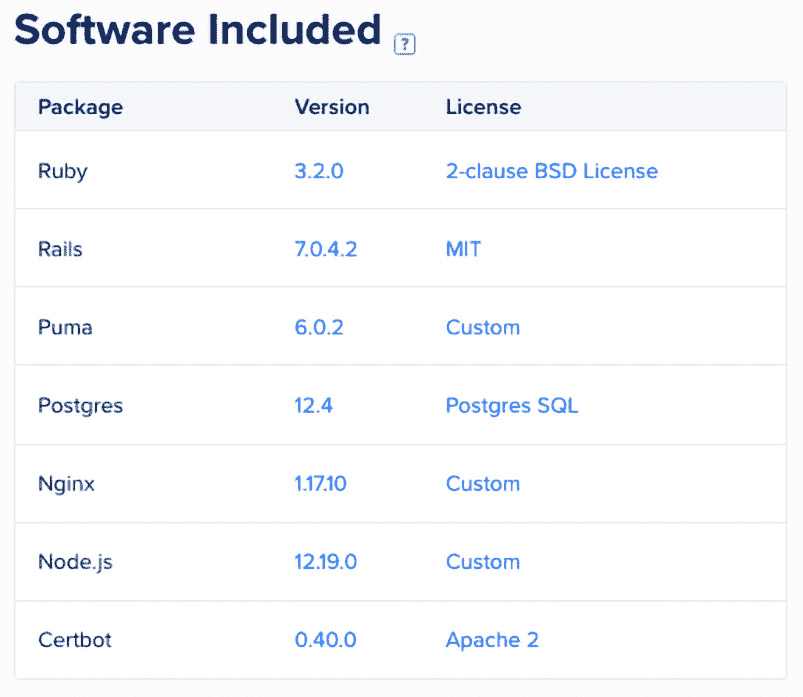
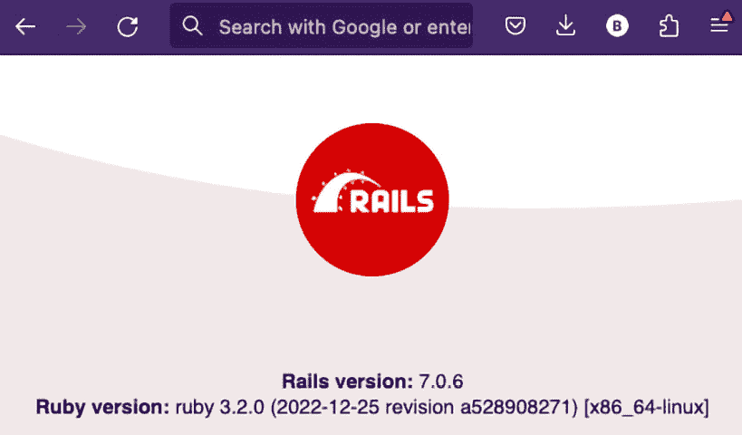
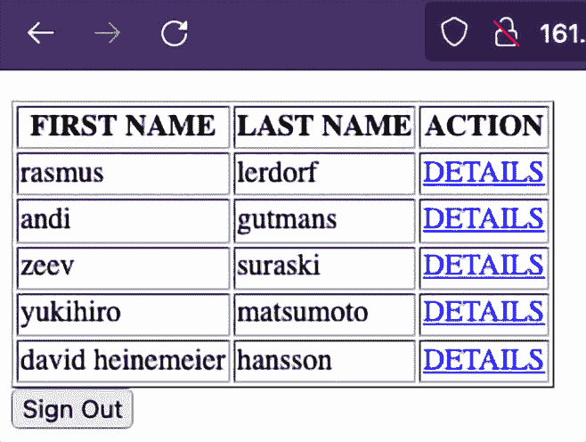
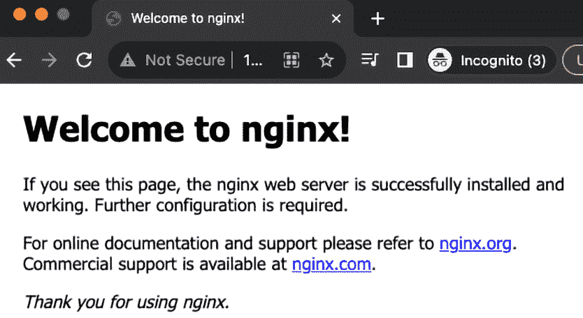
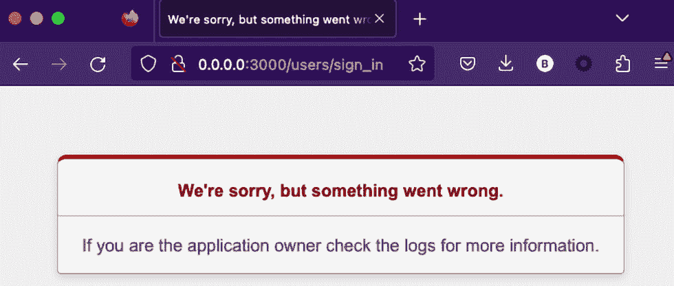
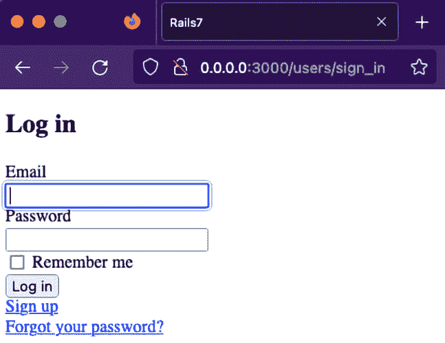

# 第十章：关于托管 Rails 应用程序与 PHP 应用程序的考虑

恭喜你到达这个阶段。你已经创建了一个简单的 Rails 应用程序，它使用了控制器、视图和模型。你使用了生成器来准备你的开发。你还通过迁移设置了数据库。最后，你添加了一个 gem 来帮助你进行身份验证。现在，你很高兴地说，这个应用程序在你的机器上运行正常。现在，是时候将你的应用程序与世界（或可能只是客户）分享，这就在 PHP 应用程序和 Rails 应用程序之间存在着一个重要的区别：托管。

在本章中，我们将探讨发布我们的 Rails 应用程序时必须考虑的托管的一些方面。我们将比较不同的托管选项，并检查我们为 Rails 应用程序需要了解的额外概念。然后，我们将查看 Rails 框架根据环境设置如何表现。更具体地说，我们将查看生产环境中的错误报告。

考虑到 Rails 托管，在本章中，我们将涵盖以下主题：

+   PHP 与 Rails 在价格方面的比较

+   自己动手做，还是让别人帮你做？

+   为什么选择 nginx？

+   错误八卦

# 技术要求

要跟随本章内容，你需要以下这些：

+   任何用于查看/编辑代码的 IDE（例如，SublimeText，Visual Studio Code，Notepad++，Vim，Emacs 等）

+   对于 macOS 用户，你还需要安装 Xcode 命令行工具

+   已安装并准备好使用的 Ruby 版本 3.1.1 或更高版本

+   在我们的本地机器上安装 Git 客户端

本章中展示的代码可在[`github.com/PacktPublishing/From-PHP-to-Ruby-on-Rails/`](https://github.com/PacktPublishing/From-PHP-to-Ruby-on-Rails/)找到。

# PHP 与 Rails 在价格方面的比较

在您对我这个不公平的比较提出异议之前，我要说明，我并不是直接比较 PHP 和 Rails。它们实际上是无法比较的，因为一个是编程语言，另一个是框架。一个更公平的比较应该是将 Laravel 框架与 Rails 框架进行比较。我试图传达的是一个 PHP 宇宙，其中许多工具都存在。但要做到这一点，我们必须回到 PHP 最终成为面向对象的时候。这种面向对象的 PHP 开辟了一个全新的可能性世界。在 2004 年，PHP 已经很流行了，而随着这个新特性（面向对象编程）的出现，它变得更加流行。WordPress 成为了管理博客和最终网站的标准。随着 PHP 开发出了更多的网络框架，如 CodeIgniter、Symfony、Laravel 等，这些框架也进入了视野。Joomla 和 Drupal 为开发者提供了另一种选择，这是一种框架和**内容管理系统**（**CMS**）的混合体。多亏了这种流行，每个人都提供了支持 PHP 的托管选项，如果我可以补充的话，价格非常便宜。随着其他技术的出现，这些技术的托管也变得可用，但成本要高得多。冒着听起来过于夸张的风险，我要说，我为一个客户在服务器上运行的应用程序，每年只需花费他们 20 美元。简而言之，到 2023 年，事情已经比 2004 年稍微平衡了一些，但您仍然可以找到非常便宜的 PHP 应用程序的托管选项，而（在大多数情况下）Rails 托管将稍微昂贵一些。快速搜索会给我们带来几个 Rails 托管的选项，包括以下更受欢迎的一些：

+   DigitalOcean ([`www.digitalocean.com/`](https://www.digitalocean.com/))

+   Amazon Lightsail ([`aws.amazon.com/lightsail/`](https://aws.amazon.com/lightsail/))

+   Heroku ([`www.heroku.com/platform`](https://www.heroku.com/platform))

+   AWS ([`aws.amazon.com/`](https://aws.amazon.com/))

+   Google Cloud ([`cloud.google.com/`](https://cloud.google.com/))

+   Azure ([`azure.microsoft.com/`](https://azure.microsoft.com/))

在成本方面，Amazon Lightsail 可能是您能找到的（在撰写本文时）最具成本效益的选项，其计划费用低至每月 3.50 美元。这个选项提供了一个简单易用的环境，背后有**亚马逊网络服务**（**AWS**）的支持，但避免了复杂性。DigitalOcean 提供了一个价格合理且灵活的选项，起价为每月 6 美元，他们亲切地称这种虚拟机为 Droplet。此计划包括一个 PostgreSQL 数据库。Heroku 的价格稍高，起价为 5 美元，但该价格不包括数据库。一个小型数据库每月额外增加 7 美元，总计 12 美元。最后两个选项我认为仅适用于更高级的需求和可能更高级的客户。它们（最初）可能很便宜，但随着需求的增加，成本也会上升。此外，在任何一个云服务中（无论是 AWS、Google Cloud 还是 Azure）设置一切可能是一个真正的挑战，因为您需要完全理解云生态系统的元素，而其他选项则为您的应用程序提供了一个现成的用户界面。

此外，根据您的应用程序的功能，成本会有所不同，您直到月底才能真正知道您会被收取多少费用。他们确实有内置的成本计算器和提供或多或少精确的月度估计，但由于他们为一切收费（虚拟机的执行时间、网络、数据传输、磁盘使用、固定 IP 以及许多其他事物），因此成本会逐月变化。您对应用程序的部署和执行有绝对的控制权，但这需要付出代价。然后还有最坏的情况，如果您的安全受到威胁，攻击者可能会控制您的服务器以及您的整个基础设施，可能因为一个简单的错误而让您损失数千美元。这并不是说您不应该考虑云选项作为可行的选择。它们只是不是初学者甚至中级开发者的选择。它们是那些能够处理风险并从其使用中受益的公司企业的解决方案。让我们更详细地看看这些捆绑式解决方案（DigitalOcean、Amazon Lightsail 和 Heroku）与自行构建的选项（AWS、Google Cloud 和 Azure）之间的差异。

# DIY 或让别人为您完成

我们已经看到了，在成本方面，我们可供选择的不同托管选项。然而，在确定和实施解决方案时，这并不是唯一需要考虑的区分因素。它们在哲学和用途方面也有所不同。目前，我们将坚持使用一个捆绑、包装并准备好使用的选项。通过*捆绑解决方案*，我指的是一个提供安装、配置并准备好使用的服务器的解决方案。为了简单起见，我选择了 DigitalOcean 并部署了我们的小型应用程序，但请放心，其他捆绑选项在实施上将会非常相似。由于这会产生成本，我不会添加跟随步骤，所以您只需坐下来享受这个过程。通常，您可以从市场上选择一个优化的服务器镜像。大多数捆绑解决方案都有自己的市场，您可以在其中搜索并选择适合您需求的镜像（或模板）。在我们的案例中，我们可以访问[`marketplace.digitalocean.com/`](https://marketplace.digitalocean.com/)并查看可用的选项。当然，它们将提供经典的**Linux-Apache-MySQL-PHP**（**LAMP**）镜像，但我们感兴趣的是 Ruby-on-Rails 的对应版本，我们在这里可以轻松找到：

[`marketplace.digitalocean.com/apps/ruby-on-rails`](https://marketplace.digitalocean.com/apps/ruby-on-rails)

一旦我们选择了将使用的技术，我们就可以查看这个虚拟机（或 Droplet）包含的内容：



图 10.1 – Rails 虚拟机

获取捆绑解决方案的最大优势是您不必担心安装 Ruby、Rails gem 以及我们可能需要的任何其他依赖项。正如我们在*图 10*.1 中可以看到的，这个虚拟机将包含 Rails 7.0.4.2 以及我们应用程序运行所需的所有依赖项。现在，我们面前有一个 shell，我们可以登录或者将我们的应用程序文件传输到这个服务器上。它甚至提供了一个已经配置好的示例应用程序，这样我们就可以确信 Rails 已经安装并准备好使用。当我浏览 DigitalOcean 为我提供的 IP 时，我遇到了这个熟悉的页面：



图 10.2 – DigitalOcean 上的 Rails 示例应用程序

部署我们的应用程序足够简单，只需要我们在本地执行的相同步骤：

1.  将源代码复制到服务器上。

1.  运行 Rails 迁移。

1.  运行 Rails 种子。

1.  添加一个用途

    哇哦：



图 10.3 – 在 DigitalOcean 上部署的 Rails 应用程序

我们之前在本地运行的同一应用程序现在已部署到托管解决方案。尽管有一些细微的差别，但我可以保证其他捆绑选项（如 Heroku 或 Amazon Lightsail）将提供类似的环境来运行我们的应用程序。这个过程（部署）的自动化超出了本书的范围，但如果你对更复杂的部署选项感兴趣，我建议你查看 Jenkins、Docker 和**持续集成/持续交付**（**CI/CD**）：

+   [`www.jenkins.io/`](https://www.jenkins.io/)

+   [`www.docker.com/`](https://www.docker.com/)

+   [`docs.docker.com/samples/rails/`](https://docs.docker.com/samples/rails/)

+   [`www.synopsys.com/glossary/what-is-cicd.html`](https://www.synopsys.com/glossary/what-is-cicd.html)

为了简化我们的应用程序，我们选择了使用 SQLite 数据库。它易于安装和本地实施，但在现实世界的场景中，我们会选择更健壮的选项，如 MySQL 或 PostgreSQL。这个 Droplet 还附带了一个即用型 PostgreSQL 数据库。这正是任何捆绑选项为我们提供的。

总结一下，捆绑选项的优势如下：

+   可以立即设置

+   环境即用

+   依赖关系已解决

+   强健的数据库已准备就绪

然而，这个解决方案可能并不适合每个人。大多数捆绑解决方案在 Ruby 方面具有灵活性，但在操作系统方面则没有。这些解决方案提供商可以并且会删除过时的包。一些解决方案提供商甚至可以在未经你许可的情况下更新包（出于安全目的），这可能会影响你应用程序的行为。此外，当你需要自定义服务器时，这可能是你考虑非捆绑解决方案选项的信号。

### DIY

与捆绑选项的托管服务相比，DIY 选项为您提供了更大的灵活性。为什么我们需要这种灵活性呢？有许多情况下这是必要的，但我想出的一个具体用例是扩展应用程序的资源。比如说，如果你的应用程序最初是为服务 500 个用户而设置的，但现在你注意到你的数据库中有 10,000 个用户。你的应用程序现在非常慢，但为 10,000 个用户增加服务器的规模（内存和 CPU）将非常昂贵。你也注意到并发用户数（即同时使用应用程序的用户数）达到了 4,000，而不是 10,000。这时，自动扩展就派上用场了！

自动扩展会在特定时刻确定资源需求，并在并发用户达到峰值时自动扩展，当用户并发下降时再缩小规模。通过 *扩展* 我指的是平台在需要处理更多用户时即时创建更多服务器。由于托管服务只在那些额外服务器实际运行时向您收费，整个过程可以为公司节省资金，因为您不需要一直开启整个服务器军团，而只是在用户数量达到峰值时才开启。此外，采用这种方法，您的应用程序可用性也会提高。我在简化整个过程，但我确实希望您能理解我的意图。这只是一个非捆绑式解决方案最适合的许多场景之一。如果您想了解更多关于自动扩展的信息，我建议您查看 AWS 官方页面上的自动扩展部分：

[`aws.amazon.com/autoscaling/`](https://aws.amazon.com/autoscaling/)

我打算为我们的假设解决方案选择 AWS，但同样也可以在任何其他云平台上实现。要在 AWS 上部署我们的简单应用程序，我们会创建一个 EC2 实例并添加安全组。

一旦我们启动了实例，我们会等待它启动，这可能需要几分钟。一旦我们的实例准备就绪，我们会通过 SSH 访问它，然后开始我们的 Ruby 配置。这包括安装 Ruby、bundler、GCC 编译器——所有这些。一旦 Ruby 准备就绪，我们会安装我们的 Rails 晶石。然后我们会将我们的应用程序代码上传到我们的虚拟机，并运行初始设置（安装依赖项、Rails 迁移、Rails 种子以及用户设置）。然后我们会启动服务器。从这里开始，事情会变得越来越复杂。我们会有一系列选项来使这个应用程序对世界可用。一个选项是将端口 `3000` 打开给世界，然后我们就出发了。然而，Rails 服务器永远不应该直接暴露给外界。我们将在下一节中看到这是为什么，但现在，让我们坚持这个原则。我们需要设置 Nginx 作为我们的 web 服务器，并让它将调用重定向到我们的 Rails 应用。一旦准备好了，我们就可以出发了。

如你所见，这似乎比捆绑选项更复杂。在这个简单的例子中，自己构建它并没有明显的优势，这是因为它实际上并没有给我们带来任何优势。至少，不是针对我们特定的案例——首先，因为 AWS 始终是一个昂贵的选择，其次，因为它是一个企业级解决方案，因此，就像大多数企业级解决方案一样，配置和部署将会更复杂，尽管这将为你的应用程序提供更多的选择。虽然我不会推荐将我们的应用程序部署到任何 DIY 公共云（AWS、Google Cloud 或 Azure）以供全世界分享，但我建议你将其作为一个练习来做，因为这会使你熟悉云解决方案的操作。如今，熟悉这类技术对于开发者来说是必须的。

虽然我们目前并不真的需要深入了解这些解决方案的细节（至少现在还不需要），但我相信我们确实需要掌握一些关于我们应用程序部署的概念。在我们的应用程序后面部署一个网络服务器（Nginx）就是这些概念之一，我们将在下一节中更深入地探讨这一点。

# 为什么是 nginx？

来自 PHP 背景的我，发现 Rails 缺乏 PHP 中常见的开箱即用的服务器功能是一个难以理解的概念。在 PHP 中，如果它被安装了，你可以在 shell 中打开它并输入以下内容：

```php
php -S localhost:9000
```

这将启动一个内部 PHP 服务器。现在你可以打开一个浏览器，将其指向`http://localhost:9000/`，这就足够了。我们添加到启动 PHP 服务器同一文件夹中的任何 PHP 脚本都将对该服务器可用。我们不需要任何 PHP 框架就可以开始用 PHP 编程。我们可以使用这个内部服务器进行开发，一旦我们将 PHP 应用程序部署到生产服务器，我们的应用程序只需要一个启用了 PHP 的网络服务器。这只是一个过于简化的实际操作过程，但本质上，这就是 PHP 服务器所需的所有内容。

在那些美好的日子里，Apache 是首选。如今，你仍然可以使用 Apache，但 Nginx 在这里已经取得了很大的进展，以至于 Nginx 现在几乎（如果不是）成为了标准。那么什么是 Nginx 呢？Nginx（根据其网站）是一个高级负载均衡器、Web 服务器和反向代理，旨在处理高流量网站和应用。它被广泛用作 Web 服务器，据报道已被 Netflix 和 Airbnb 等公司采用。由于这些公司的参与，我们可以安全地假设它在处理与 Web 相关组件时的效率极高。为什么我们应该将 Nginx 用作 Rails 的 Web 服务器呢？答案是委托。Web 服务器应该处理诸如静态资源（图像、样式表等）、文件上传、SSL 证书显示以及一些 DDoS 保护等任务，仅举几个例子。Rails（以及许多其他 Web 框架）也非常擅长处理这些任务中的大多数，但为什么要在我们能够使我们的 Rails 应用程序只需关注 Rails 任务，而 Nginx 关注 Web 相关任务时重新发明轮子呢？此外，Nginx 在处理这些任务方面比任何 Web 框架都要快得多、效率更高。事实上，我们的演示捆绑式托管解决方案（DigitalOcean）已经安装并配置了 Nginx，指向示例 Rails 应用程序。我禁用了 Rails 上游，并将 Nginx 页面设置为默认页面，这就是我得到的结果：



图 10.3 – DigitalOcean 上的 Nginx 默认页面

设置 Nginx 配置的任务是选择捆绑式解决方案的另一个原因——DIY 解决方案将安装和配置 Nginx 的任务留给了我们。虽然这绝对不是一项复杂的工作，但它确实给 DIY 解决方案增加了另一层工作量。我意识到在考虑托管选项时，这些信息量很大，但如果你想了解更多关于 Nginx 和相关主题的信息，请查看以下网站：

+   [`www.nginx.com/`](https://www.nginx.com/)

+   [`docs.nginx.com/nginx/admin-guide/installing-nginx/installing-nginx-open-source/`](https://docs.nginx.com/nginx/admin-guide/installing-nginx/installing-nginx-open-source/)

+   [`unit.nginx.org/howto/rails/`](https://unit.nginx.org/howto/rails/)

最后，我们需要记住，Rails 在本地运行时与在生产环境中运行时的行为会有所不同，这包括我们在服务器上查看错误的方式。

# 错误八卦和遗言

到目前为止，我们只使用了 Rails 框架的大部分默认选项。这些默认选项包括一些配置，否则会阻碍并减慢最终用户的整体体验。这些选项在开发中是有意义的，因为它们使得调试和测试变得非常容易。作为开发者，我们需要尽快设置我们的本地环境并开始编程。然而，这些默认选项在生产环境中并不合适。其中之一是关于错误报告的默认设置。我们在本地看到了错误是如何显示的，但在现实生活中，我们绝对不希望以同样的方式显示这些错误。我们不希望有详细的错误输出，包括路径、变量，甚至我们使用的数据库，因为这可能是安全漏洞，至少是开始。我们希望错误就像八卦一样：安静且在我们背后。这正是我们要做的。对于这个最后的练习，我们需要像前几章那样加载一个 Rails 应用程序。如果您还没有下载课程的源代码，请打开终端并输入以下`git`命令：

```php
git clone https://github.com/PacktPublishing/From-PHP-to-Ruby-on-Rails.git
```

如果您已经这样做，那么只需通过运行以下命令进入您项目中的`chapter10`文件夹：

```php
cd From-PHP-to-Ruby-on-Rails/chapter10/hosting_original/
```

再次，让我们使用以下命令安装我们的依赖项：

```php
bundle install
```

为了确认我们的设置是否正确，让我们运行以下命令：

```php
bundle exec rails –version
```

输出应该类似于以下内容：

```php
Rails 7.0.6
```

现在我们已经准备好在生产中运行我们的 Rails 应用程序。我们通过在 Rails 启动命令之前添加`RAILS_ENV=production`环境变量来实现这一点。让我们试一试。在我们的 shell 中，让我们输入以下内容：

```php
RAILS_ENV=production bundle exec rails server
```

一旦我们运行前面的命令，我们的应用程序将像往常一样运行，我们的 shell 将看起来像这样：

```php
=> Booting Puma
=> Rails 7.0.6 application starting in production
=> Run `bin/rails server --help` for more startup options
Puma starting in single mode...
* Puma version: 5.6.6 (ruby 3.1.1-p18) ("Birdie's Version")
*  Min threads: 5
*  Max threads: 5
*  Environment: production
*          PID: 6073
* Listening on http://0.0.0.0:3000
Use Ctrl-C to stop
```

但现在，如果我们去我们的浏览器并导航到`http://0.0.0.0:3000`，我们现在看到的是这个页面：



图 10.4 – Rails 在生产模式运行

当然，对于开发来说，这可能是个麻烦，但请相信我，当这个页面出现在您生产部署的应用程序上时，您会感到非常感激。因为我们正在以生产模式运行应用程序，所以所有错误都被隐藏了。现在我们需要在我们的日志中查找错误。到目前为止，我们忽略了日志文件，因为错误总是显示在浏览器上，但日志始终存在。如果我们查看`chapter10/hosting_original/log/`文件夹，我们现在有两个文件：


图 10.5 – Rails 日志文件

由于我们在生产环境中运行应用程序，让我们打开`production.log`文件。如果日志中信息过多，我们可以删除文件内容，保存文件，然后刷新浏览器。现在我们可以用更少的数据再次查看文件。我们现在应该看到如下内容：

```php
INFO -- : Started GET "/users/sign_in" for 127.0.0.1 at 2023-08-31 22:28:41 -0700
INFO -- : Processing by Devise::SessionsController#new as HTML
INFO -- : Completed 500 Internal Server Error in 5ms (ActiveRecord: 0.5ms | Allocations: 981)
FATAL -- :
ActiveRecord::StatementInvalid (Could not find table 'users'):
…
```

我们注意到`FATAL`关键字，这就是导致我们错误的原因。错误指出我们找不到`'users'`表。这是因为我们没有运行 Rails 迁移。所以，让我们来做这件事。通过在 shell 上按*Ctrl + C*停止我们的应用程序，然后在 shell 上运行以下命令：

```php
RAILS_ENV=production bundle exec rails db:migrate
```

不要忘记在命令前加上环境前缀。命令应该会输出详细说明已创建表的输出：

```php
I== 20230817050336 CreateFriends: migrating ======================
-- create_table(:friends)
   -> 0.0005s
== 20230817050336 CreateFriends: migrated (0.0005s)===============
== 20230817200425 DeviseCreateUsers: migrating ===================
-- create_table(:users)
   -> 0.0006s
-- add_index(:users, :email, {:unique=>true})
   -> 0.0001s
-- add_index(:users, :reset_password_token, {:unique=>true})
   -> 0.0001s
== 20230817200425 DeviseCreateUsers: migrated (0.0008s) ==========
```

现在让我们再次在 shell 上输入以下命令来重启我们的 Rails 应用程序：

```php
RAILS_ENV=production bundle exec rails server
```

现在，刷新浏览器。看起来一样，只是出现了一个错误页面。让我们再次删除`production.log`文件的内容，并再次刷新浏览器。现在当我们再次查看日志文件时，我们看到一个不同的`FATAL`错误：

```php
…
FATAL -- :
ActionView::Template::Error (The asset "application.css" is not present in the asset pipeline.
):
…
```

我为了清晰起见移除了日志的其余部分，但`FATAL`错误正是给我们提供问题线索的地方。在 Rails 中，当我们以生产模式执行应用程序时，一些资源需要被编译或转换。在这种情况下，需要生成和压缩 CSS 和 JavaScript 资源。幸运的是，Rails 有一个命令来完成这个任务。为了完成这个任务，我们需要在 shell 上使用*Ctrl + C*停止我们的应用程序，然后运行以下命令：

```php
RAILS_ENV=production rails assets:precompile
```

这应该会输出一系列消息，表明资源已经被生成：

```php
INFO -- : Writing hosting_original/public/assets/manifest-b84bfa46a33d7f0dc4d2e7b8889486c9a957a5e40713d58f54be71b66954a1ff.js
INFO -- : Writing hosting_original/public/assets/manifest-b84bfa46a33d7f0dc4d2e7b8889486c9a957a5e40713d58f54be71b66954a1ff.js.gz
INFO -- : Writing hosting_original/public/assets/application-e0cf9d8fcb18bf7f909d8d91a5e78499f82ac29523d475bf3a9ab265d5e2b451.css
…
```

生成了很多文件，但我们不会深入探讨其工作机制。简单来说，前端资源已经被生成。现在，让我们再次运行我们的应用程序，使用以下命令：

```php
RAILS_ENV=production bundle exec rails server
```

当我们再次刷新浏览器时，我们应该看到一个熟悉的页面：



图 10.6 – Rails 登录页面

恭喜，亲爱的读者们！我们现在正在以生产模式运行 Rails 应用程序。正如你所见，调试我们的应用程序变得更加麻烦，因为错误信息现在隐藏在日志中。在真正的生产环境中，我们可能需要查找这些日志被保存在哪里。运行 Rails 任务（数据库、生成器、资源等）可能也不会那么直接。你可能需要调整命令，在某些情况下，甚至不允许运行它们。无论如何，现在这条路已经走到了尽头，我为读者们能坚持与我一起完成这个 Ruby-on-Rails 之旅而鼓掌。

# 摘要

在本章中，我们涵盖了大量的信息。我们学习了托管成本、市场上的不同选项，以及选择为我们配置好的一切的捆绑解决方案是否合理，或者选择 DIY 选项，它提供了更多的灵活性，但也更加复杂和昂贵。我们还学习了为什么我们应该在 Nginx 后面部署我们的应用程序。最后，我们学习了如何在生产模式下调试应用程序。

我们现在可以使用这本书中学到的知识，并将 Ruby 添加到我们的武器库中。
