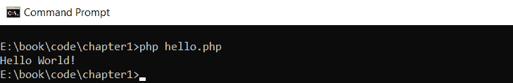
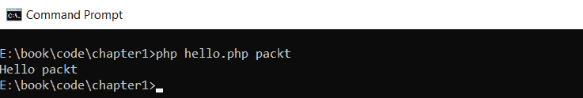
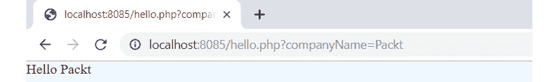
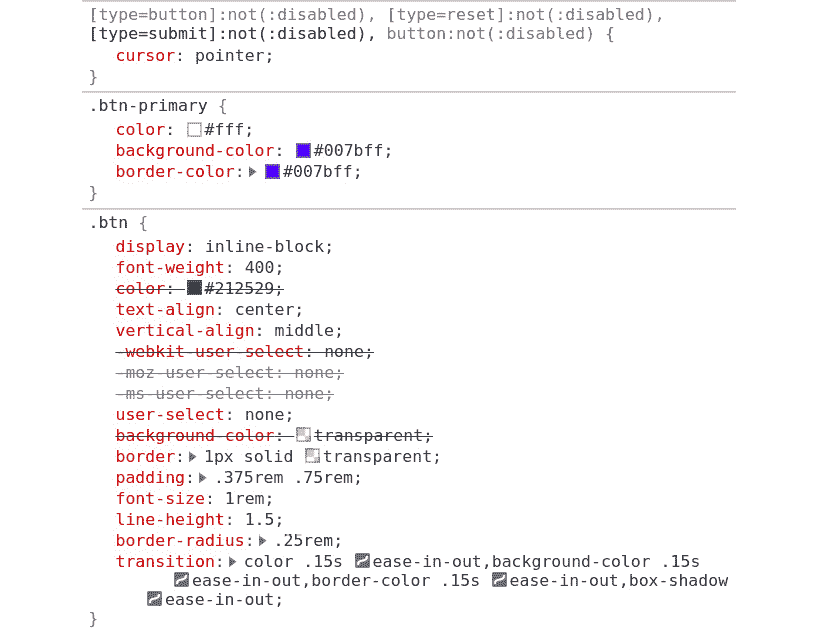
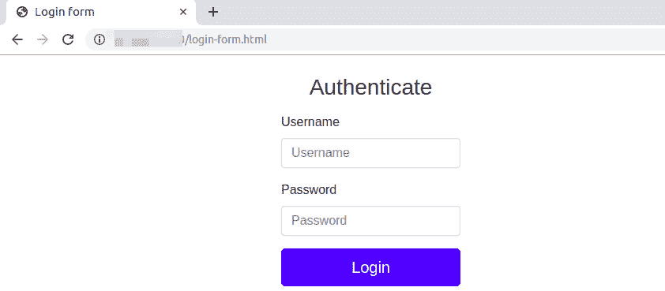
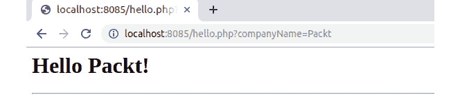
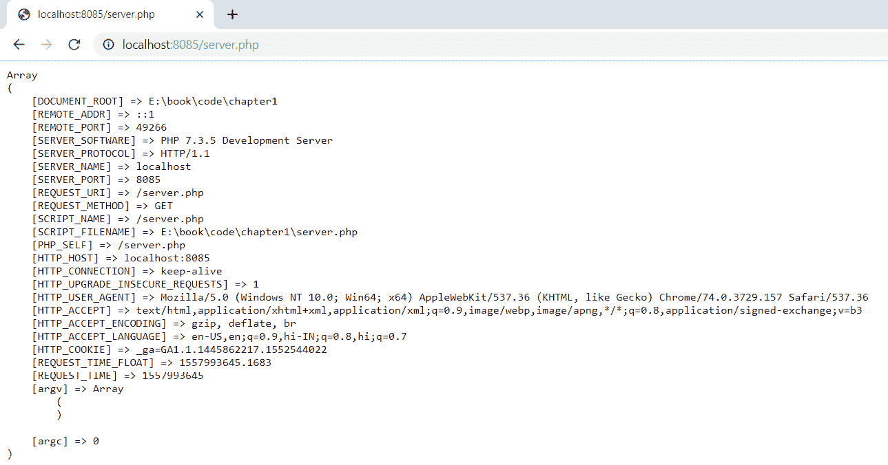
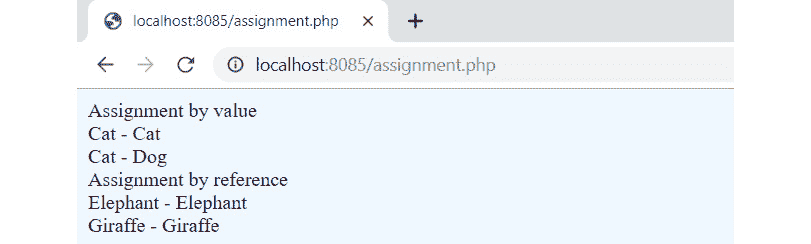
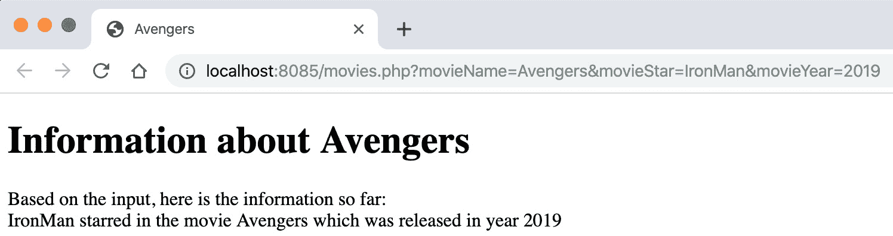

# 第一章：1. 介绍 PHP

概述

到本章结束时，你将能够使用 PHP 的内置模板引擎；编写简单的 HTML 文件；从命令行运行 PHP 脚本；创建变量并分配给它们，以便在网页浏览器上打印简单的消息；并在你的机器上运行 PHP 的内置 Web 服务器。

# 简介

欢迎来到 **超文本预处理器**（**PHP**）的世界。PHP 是一种流行的编程语言，它被广泛应用于互联网上创建网页/网站和应用程序。一个网页是一个单独的页面，而多个网页组合在一起通常被称为网站或网络应用程序。PHP 为 Facebook、Wikipedia 和 WordPress 等网站提供动力。

PHP 是作为一种脚本语言被创建的，以允许丰富的动态内容（内容可以来自其他 PHP 页面，或者本质上是动态的，并来自外部来源，如数据库）。PHP 是一种解释型语言，这意味着你不需要编译它并创建一个可执行文件。相反，PHP 文件是由运行 PHP 的 Web 服务器逐行解释的。

编译型语言在每次更改后不能直接运行。相反，它们需要一个解释器将代码编译成一个可执行程序。而另一方面，解释型语言在代码有变化时可以立即重新加载，这使得变化可以快速看到。

PHP 与 HTML、JavaScript 和 CSS 一起使用来创建动态网络应用程序。由于 PHP 容易学习，因此在全球范围内拥有庞大的开发者社区。这导致越来越多的开发者发布开源项目、框架和资源。例如，PHP 框架互操作性小组（PHP Framework Interop Group），也称为 PHP-FIG，([`packt.live/2oJ0FvY`](https://packt.live/2oJ0FvY)) 制定了一系列标准建议，大多数开发者都使用这些建议来编写他们的代码。GitHub 存储了许多开源项目，供他人使用，并且像 [`packt.live/2oaK3gt`](https://packt.live/2oaK3gt) 这样的网站上有许多关于网络开发的视频。

# 开始学习 PHP 网络开发

PHP 是一种服务器端脚本语言。服务器端脚本是一种网络服务器可以通过 HTTP 响应客户端请求的方式。其工作方式是，客户端（浏览器）请求一个 URL。然后，这个请求由 Web 服务器发送到脚本。脚本随后读取这个请求，并根据脚本中的代码返回页面的内容。

每次访问网页时都会发生这个过程。当处理表单时，数据从客户端发送到服务器。数据被处理并返回响应。一个常见的例子是在 Facebook 上，你输入状态更新并按下*Enter*键。文本将通过`POST`请求发送到服务器，由服务器上的脚本进行检查，然后保存到数据库中。然后网页会更新为新帖子。PHP 网站也可以是 API 服务，这些服务可能由 JavaScript 脚本（例如 AJAX 调用）或其他服务调用。在这些和类似的情况下，没有浏览器请求的参与。

以下工具是 Web 开发所需的：

+   浏览器，如 Google Chrome、Firefox 或 Microsoft Edge。

+   需要使用像 Microsoft Visual Studio Code 这样的文本编辑器，或者像 PHP Storm 这样的**集成开发环境**（**IDE**）。

+   可以使用运行 PHP 的 Apache 或 NGINX 服务器，以及 PHP 的内置服务器。

## 内置模板引擎

PHP 是为了编写 Web 应用程序而创建的。它可以与 HTML 一起编写以创建动态页面。我们将在稍后看到这方面的例子。

PHP 模板引擎是一种允许 PHP 代码与 HTML 内容一起输出的方式。这为页面提供了灵活性。任何打算使用 PHP 代码的页面都有一个.php 扩展名而不是.html 扩展名。这通知 Web 服务器预期 PHP 内容。

PHP 文件有一个.php 扩展名，它可以包含 HTML、JavaScript 和 CSS，以及 PHP。由于 PHP 解释器需要知道代码在 PHP 文件中的位置，因此 PHP 代码被写入两个特殊标签之间（`<?php`...`?>`）。这些标签被称为开标签和闭标签。一个典型的 PHP 文件看起来像这样：

```php
Example1.01.php
1  <!DOCTYPE html>
2  <html lang="en">
3  <head>
4      <meta charset="UTF-8">
5      <meta name="viewport" content="width=device-width, initial-scale=1.0">
6      <meta http-equiv="X-UA-Compatible" content="ie=edge">
7     <title>My First PHP Page</title>
8  </head>
9  <body>
10     <div>
11         <h1>The Heading</h1>
12         <p>
13             <?php
14             // your php code goes here 
15             ?>
https://packt.live/326OLKU
```

这个页面以 HTML 声明文档类型开始，告诉浏览器预期 HTML 内容，然后是 meta 标签，告诉浏览器预期 UTF-8 内容，以及一个 meta 标签来使用最新的渲染引擎和缩放级别。

注意

HTML 将在本章的后面详细讲解。

或者，PHP 中也有可用的短开标签，但默认情况下是关闭的。这可以通过在 Apache 中使用时编辑`.phpini`配置文件来更改（这超出了本介绍的范畴）。短代码看起来像这样：

```php
<?
// php code here
?>
```

简而言之，开标签和闭标签通知 PHP 解释器何时开始和停止逐行解释 PHP 代码。

由于 PHP 是一个有用的 Web 开发工具，你将经常在浏览器中工作。然而，你还需要熟悉交互式 shell。

## 交互式 Shell 中的 PHP

交互式 shell 有几个不同的名称。在 Windows 上，它们被称为命令提示符。在 Linux/Mac 上，Terminal 是允许向 shell 发出命令并由 shell 理解和由 PHP 拾取的计算机应用程序的名称。

交互式 shell 允许 PHP 脚本在没有浏览器的情况下运行。这是在服务器上通常执行脚本的方式。

## 练习 1.1：将 Hello World 打印到标准输出

在这个练习中，我们将使用交互式 shell 打印一个简单的语句。交互式 shell 可以用来执行 PHP 代码和/或脚本。在我们开始之前，请确保你已经遵循了前言中的安装步骤。按照以下步骤完成练习：

1.  在你的机器上打开一个 Terminal/命令提示符。

1.  输入以下命令以启动 PHP 的交互式 shell 并按 *Enter* 键：

    ```php
    php -a
    ```

    你将获得以下输出：

    ![Figure 1.1：开始使用交互式 shell

    ![img/C14196_01_01.jpg]

    图 1.1：开始使用交互式 shell

    `交互式 shell` 将出现在提示符上，并变为 `php >`。现在，你已经进入了 PHP 的交互式 shell，可以运行 PHP 代码和执行脚本。我们将在接下来的练习中探索更多的交互式 shell。

1.  输入以下命令：

    ```php
    echo "Hello World!";
    ```

    我们很快就会解释 `echo` 的含义。一旦你按下 *Enter* 键，你将在 shell 上看到打印出的 `Hello World!`，如下面的屏幕截图所示：

![Figure 1.2：将输出打印到控制台

![img/C14196_01_02.jpg]

图 1.2：将输出打印到控制台

恭喜！你已经执行了你的第一个 PHP 代码。

`echo` 是一个 PHP 构造，可以打印传递给它的任何内容。在练习中，我们传递了 `Hello World!`。由于 `Hello World!` 是一个字符串，所以我们用双引号将其包围。你可以使用 `echo` 来打印字符串、变量和其他内容。

`echo` 构造是打印到屏幕的一种方式。另一种方式是使用 `print('Hello world!')`。虽然这会显示传递给它的字符串，但 `echo` 和 `print` 之间的主要区别在于 `print` 只接受单个参数。

此外，还有一些函数可以查看变量内部的内容，例如 `print_r($item)`。这将输出传递给函数的任何变量的值。这不应该用来在屏幕上显示消息，而应该在你需要知道变量内容时使用。

这里需要注意的一个重要事项是行尾的分号。在 PHP 中，每个语句的末尾都必须有分号。如果语句不以分号结束，PHP 将抛出错误。

到目前为止，你应该已经明白了我们可以在交互式 shell 中执行基本语句。我们将在本章后面尝试更多此类操作。我们可以在 PHP 脚本中执行的所有函数都可以在交互式 shell 中执行。

现在，我们将运行一个 PHP 文件来输出 `Hello World`，而不是直接使用 shell 编码。

## 练习 1.2：通过执行 PHP 文件打印 Hello World

到目前为止，你已经学会了如何使用 `echo` 语句。现在，让我们继续创建你的第一个 PHP 脚本。我们将打印与之前相同的语句，但这次我们将使用一个 PHP 文件。按照以下步骤操作：

1.  在你的机器上创建一个名为 `book` 的文件夹。在其内部创建另一个名为 `chapter1` 的文件夹。建议你在后续章节中也遵循这种方法。

1.  在 `chapter1` 文件夹内创建一个名为 `hello.php` 的文件。

1.  使用代码编辑器（如 Visual Studio Code 或 Sublime Text）打开 `hello.php` 文件。

1.  在 `hello.php` 中编写以下代码并保存：

    ```php
    <?php
    echo "Hello World!";
    ?>
    ```

1.  现在，打开终端并切换到 `chapter1` 文件夹。使用 `cd` 命令后跟文件夹名称来进入该文件夹。要返回上一级文件夹，使用 `../`。

1.  在命令提示符中运行以下命令：

    ```php
    php hello.php
    ```

    你将在屏幕上看到打印出 `Hello World!`，就像以下截图所示：




图 1.3：将输出打印到终端

首先，我们有 PHP 的开标签。PHP 解释器将在其后逐行处理代码。这里我们只有一条代码，即 `echo` 语句，我们将 `Hello World!` 字符串传递给它。PHP 解释器处理它，然后这个字符串被打印在终端上。

所有的 PHP 文件都将这样编写。一些可能包含 HTML 和其他代码，而一些可能不包含。还要记住，一个文件中可以有多个开标签和闭标签。这些可以放在文件的任何位置。

因此，你已经学会了如何使用交互式外壳以及如何使用 `echo` 语句打印简单的字符串。现在我们将学习如何在 PHP 中创建和使用变量。

## 赋值和使用变量

就像任何其他编程语言一样，PHP 中的变量用于存储数据。一个关键的区别是 PHP 中所有的变量名都必须以美元符号 `$` 开头。

变量必须以字母开头。它们不能以数字或符号开头，但可以包含数字和符号。

存储在变量中的数据可以是以下类型：

+   整数 - 整数

+   布尔值 - 真或假

+   浮点数 - 浮点数

+   字符串 - 字母和数字

存储在变量中的数据称为变量的值。

## 在网页浏览器中创建和分配变量以打印简单消息

考虑以下示例，我们在其中将值赋给变量：

```php
<?php
$movieName = "Avengers: Endgame";
?>
```

在这里，创建了一个名为 `$movieName` 的变量，其值为字符串 "`Avengers: Endgame`"。由于值是字符串，因此需要用双引号或单引号包围它。`=` 被称为赋值运算符。代码基本上可以翻译为以下内容：*将赋值运算符右侧的值赋给左侧的变量*。

这里有一些创建变量的更多示例：

```php
<?php
$language = "PHP";
$version = 7.3;
echo $language;
echo $version;
?>
```

如果运行前面的脚本，你将看到打印出 `PHP7.3`。之前，我们直接使用 `echo` 语句打印值，但现在我们将值赋给变量。值现在存储在变量中。另一件需要注意的事情是，由于 7.3 是一个数字，因此不需要引号。

假设您在一页上写下了 50 次“PHP”。如果您必须将其更改为“JavaScript”，您必须替换所有 50 个地方。但如果相同的文本“PHP”被分配给一个变量，您只需更改一次，更改将在所有地方反映出来。

在创建变量时必须遵循一些规则：

+   PHP 中的所有变量名都应以`$`开头。

+   变量名不能以数字开头。它必须是一个字母或下划线。例如，`$1name`和`$@name`不是有效的变量名。

+   变量名中只允许使用 A-z、0-9 和 _。

+   变量名是区分大小写的；例如，`$name`和`$NAME`是不同的。

变量名必须经过深思熟虑的选择。它们应该对阅读代码的他人有意义。例如，在一个应用程序中，如果您必须创建一个存储用户银行余额的变量，变量名如`$customerBalance`比`$xyz`更明显。

与 Java 和.NET 等语言不同，PHP 在使用变量之前不需要声明。这意味着您可以在需要时创建变量，尽管在可能的情况下在脚本顶部定义变量被认为是最佳实践，以便清楚地表明其意图。

PHP 还有被称为预定义变量的东西。这些是由 PHP 提供的，任何人都可以使用。

其中一个变量是`$argv`。这是一个通过终端传递给脚本的参数列表。您不必单独执行脚本，而是可以向脚本传递值，这些值将可用于`$argv`变量。

## 练习 1.3：使用输入变量打印简单字符串

在这个练习中，我们将修改上一个练习中的脚本并使用输入变量来打印字符串。按照以下步骤操作：

1.  使用您喜欢的代码编辑器重新打开`hello.php`文件。

1.  将代码替换为以下代码并保存文件：

    ```php
    <?php
    $name = $argv[1];
    echo "Hello ". $name
    ?>
    ```

    目前不必担心语法。

1.  现在，转到`chapter1`文件夹内的终端。

1.  运行以下命令：

    ```php
    php hello.php packt
    ```

    您将在终端看到以下输出：



图 1.4：将输出打印到控制台

发生了什么？`hello.php`脚本打印了传递给它的值。让我们看看它是如何工作的。

您通过命令行传递了值`packt`。这被称为传递参数。您可以通过空格分隔多个参数并将它们发送，这些参数都将对 PHP 脚本可用。但如何做到这一点？

现在是`$argv`的时候了。`$argv`是一个预定义变量，一旦执行脚本，它就会被填充使用传递的值。它是在终端上`php`关键字之后的值列表。如果没有传递参数，列表中只包含文件名。在我们的例子中，列表将有两个值：`hello.php`和`packt`。

回到脚本，在代码的第一行，我们正在给 `$name` 变量赋值。这个值是什么？`$argv` 是一个包含两个值的数组（关于这一点将在后面的章节中详细介绍，但基本上，数组是一系列的项）。对于数组，计数从 0 开始而不是 1。因此，`$argv` 中的第一个值是 `hello.php`，可以使用 `$argv[0]` 取出。我们需要第二个值（必须是字符变量），因此我们使用了 `$argv[1]`。现在，传递给文件的 `packt` 参数被存储在 `$name` 变量中。

在第二行，我们正在将文本 `Hello` 和 `$name` 变量连接起来。点操作符 (`.`) 用于连接多个值。连接后，字符串变为 `Hello packt`，然后通过 `echo` 语句打印出来。

注意

您可以在 [`packt.live/2nYJCWN`](https://packt.live/2nYJCWN) 上了解更多预定义变量及其用法。

您可以使用单引号或双引号来表示字符串。然而，它们之间有区别。您可以在双引号字符串中使用变量，并且它们将被解析。我的意思是变量的值将被执行，而不仅仅是显示变量的名称。另一方面，单引号不会进行任何额外的解析，并将引号之间的内容按原样显示。因此，单引号稍微快一些，建议使用它们。

在最后一个练习中，我们看到了如何使用预定义的 `$argv` 变量。在这个练习中，我们将使用另一个预定义变量 `$_GET`。这允许信息传递到地址栏，PHP 可以读取它。它们被称为查询字符串

查询字符串是由 `?` 分隔的键值对。例如，`?a=1&b=2` 也是一个有效的查询字符串。

## 练习 1.4：使用内置服务器打印字符串

在这个练习中，我们将使用内置服务器通过 `companyName=Packt` 查询字符串打印 `Hello Packt`。这将允许您开始使用浏览器查看代码的输出，而不仅仅是使用交互式 shell。按照以下步骤操作：

1.  使用您喜欢的代码编辑器重新打开 `hello.php` 文件。

1.  将代码替换为以下代码并保存文件：

    ```php
    <?php
    $name = $_GET['companyName'];
    echo "Hello ". $name;
    ?>
    ```

1.  前往终端并进入 `chapter1` 文件夹。

1.  运行以下命令以运行 PHP 的内置 web 服务器：

    ```php
    php -S localhost:8085
    ```

1.  现在，打开浏览器并在地址栏中输入以下内容并按 *Enter*：

    ```php
    http://localhost:8085/hello.php?companyName=Packt
    ```

    您将在屏幕上看到以下输出：



图 1.5：将输出打印到浏览器

这与之前的练习有些类似，但不是使用终端，而是使用了浏览器。

注意浏览器中的 URL。在文件名之后，我们附加了 `?companyName=Packt`。`?` 表示其后的内容是查询字符串。在我们的代码中，有一个名为 `companyName` 的变量，其值为 `Packt`，正被传递到 PHP 文件中。

现在我们来看代码，在第一行，我们有`$_GET['companyName']`。`$_GET`也是一个预定义变量，当执行任何带有查询字符串的 PHP 字符串时，它会被填充。所以，通过使用`$_GET['companyName']`，我们将得到`Packt`这个值，它将被存储在`$name`变量中。记住，你可以使用相应的键从查询字符串中提取任何值。

下一行将它们组合并在浏览器上显示结果。

现在我们已经开始使用浏览器来查看我们工作的输出，让我们快速看一下 HTML。如前所述，PHP 和 HTML 经常一起使用，因此当你对 PHP 更加熟悉时，理解 HTML 将非常有用。

# 超文本标记语言

**超文本标记语言**（**HTML**）是一种通过标签和属性以分层方式定义其含义的语言。它用于创建诸如万维网上的网页之类的文档，这些文档通常在网页浏览器中显示。它们可以包括文本、链接、图片，甚至声音和视频。

HTML 使用不同的标签和属性来定义网页文档的布局，如表单。

标签是一个由`<`和`>`包围的 HTML 元素，例如`<body>`、`<p>`和`<br>`。它由一个开标签和一个结束标签组成，中间是内容。例如，考虑以下 HTML 行：

```php
<p>A paragraph</p>
```

开标签是`<p>`，闭标签是`</p>`，内容是“一个段落”。

HTML 元素的属性提供了有关该元素的其他信息，并由其名称和值描述，具有以下语法：`name[="value"]`。指定值是可选的。例如，以下超链接有一个名为`href`的属性，其值为`/home`：

```php
<a href="/home">Home</a>
```

任何 HTML 文档都需要文档类型声明`<!DOCTYPE html>`和`<title>`标签，如下所示：

```php
<!DOCTYPE html><title>The document title</title>
```

有许多开发者用来创建 HTML 文档结构的可选标签列表，包括`<html>`、`<head>`和`<body>`。`<html>`标签是 HTML 文档的根标签，它紧接在文档类型声明之后放置。它将包含其他两个可选标签：`<head>`和`<body>`。`<head>`标签用于页面元数据，包括描述文档中使用的编码字符集的`<meta>`标签，例如，它包括`<title>`标签和外部资源，如样式、字体和脚本。`<body>`块用于在浏览器窗口中渲染其内容，并包括最多种类的 HTML 标签。

上述 HTML 标签可以在任何 HTML 文档中看到。

这里是一个最常用标签的列表：

+   `<div>`：这个标签定义了 HTML 文档中的一个部分。它通常用作其他 HTML 元素的包装元素。

+   `<h1>`到`<h6>`：标题标签用于定义 HTML 文档的标题。`<h1>`定义最重要的标题（它们也使用最大的字体大小），而`<h6>`定义最不重要的标题。它们可以在 HTML 文档的任何位置使用。

+   `<p>`：段落标签用于在 HTML 文档中定义段落内容。

+   `<em>`：强调标签用于强调文本。

+   `<b>`和/或`<strong>`：粗体标签用于指定粗体内容。

+   `<a href="...">链接名称</a>`：锚标签用于将一个页面链接到另一个页面。

+   `<ul>`和`<li>`：无序列表和列表项标签用于无序列出内容（如项目符号列表）。

+   `<ol>`：此标签用于表示编号列表

+   `<br>`：换行标签用于换行。

+   ``：图像标签用于向 HTML 文档添加图像元素。

+   `<hr>`：水平线标签用于在 HTML 文档中显示水平线。

+   `<table>`：表格标签用于在 HTML 文档中创建表格。

+   `<tr>`：表格行标签用于在 HTML 表格中定义行。

+   `<th>`：表格标题单元格标签定义了表格中的标题单元格。

+   `<td>`：表格数据单元格标签定义了表格中的标准单元格。

+   `<form>`：表单标签用于创建 HTML 表单。

+   `<input>`：输入标签用于收集和提交用户数据（例如浏览器中的表单）。

+   `<select>`和`<option>`：选择输入标签用于从下拉列表中选择选项值。

+   `<label>`：标签标签打印表单输入的标签。

考虑以下 HTML 块：

```php
<!DOCTYPE html>
<html lang="en">
<head> 
    <meta charset="utf-8">
    <title>HTML Document Title</title>
</head>
<body>
<h1>Heading Text</h1>
<p>A paragraph</p>
<form method="post">
    <input type="text" name="domain">
    <input type="submit" value="Send">
</form>
</body>
</html>
```

让我们看看这个块中的 HTML 元素：

+   `<!DOCTYPE html>` 声明文档类型为 HTML5。

+   `<html lang="en">` 是 HTML 文档根元素的打开标签。`lang`属性指向文档内容语言。

+   `<head>` 打开元数据块。

+   `<meta charset="utf-8">` 声明 HTML 文档中使用的字符集。

+   `<title>HTML Document Title</title>` 设置标题为`HTML Document Title`。

+   `<body>` 打开 HTML 文档内容块。

+   `<h1>标题文本</h1>` 添加一个`标题文本`标题。

+   `<p>一个段落</p>` 添加一个包含文本`一个段落`的段落。

+   `<form method="post">` 打开表单块，声明将用于发送其数据的提交方法（关于这一点，请参阅*第六章*，*使用 HTTP*）。

+   `<input type="text" name="domain">` 添加一个名为`domain`的文本输入字段。`domain`值是输入类型的名称。

+   `<input type="submit" value="Send">` 添加一个带有`Send`的提交按钮。

+   `</form>`、`</head>`、`</body>`和`</html>`是`<form>`、`<head>`、`<body>`和`<html>`标签的关闭标签。

上述代码将渲染以下网页：


图 1.6：网页布局

我们可以使用`GET`请求访问文件。提交表单将导致`POST`请求：


图 1.7：使用的方法

请求类型和表单数据提交将在 *第六章*，*使用 HTTP* 中介绍。

# 层叠样式表

**层叠样式表**（**CSS**）是定义网页样式的语言。可以使用 CSS 改变颜色、字体等。虽然 HTML 描述了网页的结构，但 CSS 描述了网页在各种设备和屏幕类型上的外观。

现在，使用 CSS 框架非常普遍，因为它包含一些预设，使网页在不同浏览器之间兼容，并提供了一系列工具，如网格系统，使页面布局的创建更容易，并实现响应式。

这样的框架之一是 Bootstrap，使用它就像在 HTML 文档中包含生成的和压缩的 CSS 文件一样简单：

```php
<link href="https://stackpath.bootstrapcdn.com/bootstrap/4.3.1/css/bootstrap.min.css" rel="stylesheet">
```

在原始 HTML 文档中包含 CSS 文件将使浏览器以略微不同的方式渲染页面：


图 1.8：渲染网页

如您所见，字体不同，但没有其他重大变化可见。这是因为链接文件的 CSS 规则没有匹配任何要装饰的元素。Bootstrap 文档（[`packt.live/2N1LHJU`](https://packt.live/2N1LHJU)）展示了它的能力。通常，类属性用于匹配目标 HTML 元素。因此，通过简单地将 `class="btn btn-primary"` 添加到提交输入，我们将得到根据定义的样式格式化的按钮：


图 1.9：向按钮添加 CSS

我们不需要定义单个 CSS 规则。按钮是根据 Bootstrap 框架中已定义的规则渲染的。如果我们通过开发者工具（Chrome）检查提交的输入样式，我们将看到以下应用于 HTML 元素的级联：



图 1.10：在开发者工具中检查提交输入样式

当然，我们可以创建一个额外的 CSS 文件并将其链接到 HTML 文档，覆盖一些 Bootstrap 声明。

## 练习 1.5：使用 Bootstrap 创建登录表单页面

您需要使用 Bootstrap 框架创建一个简单的登录页面。按照以下步骤操作：

1.  创建一个名为 `login-form.html` 的文件。

1.  声明文档类型为 HTML5 并打开根 HTML 元素：

    ```php
    <!DOCTYPE html>
    <html lang="en">
    ```

1.  添加包含页面标题、Bootstrap CSS 框架链接和 CSS 框架所需的 meta 标签的 head 块：

    ```php
    <head>
        <title>Login form</title>
        <link href="https://stackpath.bootstrapcdn.com/bootstrap/4.3.1/css/      bootstrap.min.css" rel="stylesheet">
        <meta content="width=device-width, initial-scale=1, shrink-to-fit=no"       name="viewport">
    </head>
    ```

1.  打开 `body` 元素并添加容器 `div`，使内容居中对齐：

    ```php
    <body>
    <div class="container d-flex justify-content-center">
    ```

1.  打开表单元素并添加表单标题 - 一个居中的 H1 文本标题：

    ```php
        <form method="post">
            <div class="text-center mt-4">
                <h1 class="h3 mb-3 font-weight-normal">Authenticate</h1>
            </div>
    ```

1.  添加第一个表单标签和用户名输入组：

    ```php
            <div class="form-label-group mb-3">
                <label for="inputUser">Username</label>
                <input class="form-control" id="inputUser" name="username"               placeholder="Username" type="text">
            </div>
    ```

1.  添加与密码相关的标签和输入标签：

    ```php
            <div class="form-label-group mb-3">
                <label for="inputPassword">Password</label>
                <input class="form-control" id="inputPassword" name="password"                placeholder="Password" type="password">
            </div>
    ```

1.  添加将提交表单的按钮：

    ```php
            <button class="btn btn-lg btn-primary btn-block"           type="submit">Login</button>
    ```

1.  关闭所有打开的标签。

    注意

    最终文件可以参考[`packt.live/2MBLNZx`](https://packt.live/2MBLNZx)。

    在浏览器中打开文件。预期的输出如下：



图 1.11：登录页面

表单使用 Bootstrap 的默认样式渲染，这些样式比浏览器的默认样式丰富得多。

在这个练习中，您渲染了一个 HTML 页面，包括一些最广泛使用的 HTML 元素，例如表单元素，并且您使用了 Bootstrap CSS 文件：

```php
<h1>Hello <?php echo $name; ?></h1>
```

在这种情况下，`Packt`字符串存储在`$name`变量中，输出`Hello Packt`将以标题 1（最大字体大小）的形式打印。

注意

文件扩展名将是`.php`。

这是因为 PHP 会扫描脚本文件，并且只有在存在关闭标签（`?>`）时，才会运行从开标签（`<?php` 或 `<?=`）到关闭标签之间的代码，如果存在代码输出，则会将其替换。

## 练习 1.6：在 HTML 标签之间打印 PHP 代码输出

在这个练习中，我们将使用内置服务器通过`companyName=Packt`查询字符串打印`Hello Packt`。按照以下步骤操作：

1.  使用您最喜欢的代码编辑器重新打开`hello.php`文件。

1.  将代码替换为以下代码并保存文件：

    ```php
    <h1><?php echo "Hello ". $_GET['companyName'];?>!</h1>
    <hr>
    ```

1.  现在，打开浏览器并在地址栏中输入以下内容并按*Enter*键：

    ```php
    http://localhost:8085/hello.php?companyName=Packt
    ```

    您将在屏幕上看到以下输出：



图 1.12：将输出打印到浏览器

如我们所见，PHP 具有如此高的灵活性，它允许我们在其他类型的内容中使用 PHP 代码的某些部分。

让我们现在看看 PHP 中可用的其他预定义变量。

# 使用服务器变量

`$_SERVER`是由 PHP 提供的一个已填充的预定义数组。它包含有关服务器和环境的详细信息。`$_SERVER`中可用的信息因服务器而异，因此字段可能根据环境而有所不同。

## 练习 1.7：显示服务器信息

在这个练习中，我们将使用`$_SERVER`将服务器信息打印到浏览器。按照以下步骤操作：

1.  进入`chapter1`文件夹。

1.  在文件夹中创建一个名为`server.php`的新文件。

1.  将以下 PHP 代码写入文件并保存：

    ```php
    <?php 
    echo '<pre>';
    print_r($_SERVER);
    echo '</pre>';
    ?>
    ```

1.  打开您的浏览器并在地址栏中输入以下 URL：

    ```php
    http://localhost:8085/server.php
    ```

    您将看到以下屏幕：



图 1.13：将详细信息打印到浏览器

在前面的代码中，我们使用了`print_r`语句来打印`$_SERVER`的内容。由于它是一个包含多个条目的数组，我们使用了 PHP 的`print_r`函数而不是`echo`来显示其内容。上面的`pre`标签和下面的`pre`标签将每个项目分开到新的一行，使其更容易阅读。

在浏览器中，我们可以看到它打印了大量的信息。我们有端口信息、文件位置以及许多其他字段。如前所述，系统信息可能因环境而异。

## 其他预定义变量

这里有一些常用预定义变量及其用法：

+   `$_POST`: 我们在本章前面使用了`$_GET`。`$_POST`与此类似，但有一个区别。`$_GET`从查询字符串中获取值，而`$_POST`包含任何 PHP 页面上的表单数据。你将在后面的章节中更多地使用它。

+   `$_FILES`: 如果从页面上的表单上传文件，其信息将可在`$_FILES`数组中找到。

+   `$_COOKIE`: 这允许将基本文本信息作为 cookie 存储在客户端的浏览器上以供以后使用。一个常见的例子是，如果你登录到一个网站并勾选“记住我”，浏览器上会保存一个 cookie，下次访问时会读取它。

+   `$_REQUEST`: 它包含`$_GET`、`$_POST`和`$_COOKIE`的合并信息。

+   `$_SESSION`: 这些是用于在应用程序中维护状态的会话变量。它们允许在会话期间将值保存在内存中。这可以是会话存在期间保存并显示在页面上的用户名。

+   `$GLOBALS`: 它包含所有对脚本可用的变量。它包括变量、`$_GET`、`$_POST`中的数据、任何文件上传数据、会话信息和 cookie 信息。

## 按值赋值和按引用赋值

重要的是要意识到将值赋给变量的不同方式。在 PHP 中，有两种方法：按值赋值和按引用赋值。让我们逐一查看这些方法。

按引用赋值意味着使用一个变量（如`$var = &$othervar;`）的 ampersand 来赋值。按引用赋值意味着两个变量最终都指向相同的数据，并且任何地方都没有复制任何内容。

按值赋值意味着将值赋给一个新变量，但没有引用回任何其他变量。它是一个具有值的独立变量。

## 练习 1.8：按引用赋值并更改其值

在这个练习中，我们将按引用赋值一个变量。然后，我们将更改另一个变量的值，并确保原始变量的值也发生了变化。请按照以下步骤操作：

1.  将你的系统中的`chapter1`文件夹移动到内部。

1.  在这个文件夹中创建一个名为`assignment.php`的新文件。

1.  首先，我们将声明一个`$animal1`变量并将值`Cat`赋给它。然后，我们声明另一个变量`$animal2`并将`$animal1`变量赋给它。这意味着`$animal1`的值被复制到`$animal2`变量中。我们通过在第 10 行回显这两个变量来确认这一点，我们看到两个变量都有值`Cat`：

    ```php
    <?php 
    // Assignment by value
    echo 'Assignment by value';
    echo '<br>';
    $animal1 = 'Cat';
    $animal2 = $animal1;
    echo $animal1 . ' - ' . $animal2;
    echo '<br>';
    ```

1.  接下来，当我们写下 `$animal2 = 'Dog'` 时，我们更改了 `$animal2` 变量的值为 `Dog`，然后再次打印这两个变量。现在，我们可以看到尽管 `$animal2` 的值已更改，但它对 `$animal1` 没有任何影响。这就是我们所说的按值赋值。值只是从一个变量复制到另一个变量，两个变量保持独立：

    ```php
    $animal2 = 'Dog';
    echo $animal1 . ' - ' . $animal2;
    echo '<br>';
    ```

    现在，让我们看看按引用赋值。按引用意味着新变量成为旧变量的别名。因此，更改新变量的值会更改旧变量的值。

1.  现在，我们将声明另一个变量 `$animal3`，并将其值设置为 `Elephant`。接下来，我们创建一个新的变量 `$animal4`，并将 `$animal3` 变量的值赋给它。在赋值过程中，注意变量名前的 ampersand (`&`)。这个 ampersand 告诉 PHP 通过引用将 `$animal4` 变量赋给 `$animal3` 变量。在代码中，我们将通过打印两个变量的值来验证这两个变量的值，它们是相同的：

    ```php
    // Assignment by reference
    echo 'Assignment by reference';
    echo '<br>';
    $animal3 = 'Elephant';
    $animal4 = &$animal3;
    echo $animal3 . ' - ' . $animal4;
    echo '<br>';
    $animal4 = 'Giraffe';
    ```

1.  要查看按引用赋值的实际效果，我们将 `$animal4` 的值更改为 `Giraffe`。之后，我们再次打印这两个变量，可以清楚地看到更改 `$animal4` 的值也改变了 `$animal3` 的值：

    ```php
    echo $animal3 . ' - ' . $animal4;
    ?>
    ```

1.  现在，打开浏览器并通过打开此 URL 定位到我们的文件：

    ```php
    http://localhost:8085/assignment.php
    ```

    你应该看到一个像这样的屏幕：

![图 1.14：打印输出到浏览器]



图 1.14：打印输出到浏览器

在 PHP 中，除非指定，否则变量总是按值赋值。

## 使用 isset 检查变量声明

有时，我们需要检查变量是否已设置，尤其是在有来自表单的用户输入的情况下，我们需要在将其保存到数据库之前进行验证。`isset` 是一个内置的 PHP 函数，对于声明且值不为 `null` 的变量返回 `true`。

当一个变量没有值时，使用空数据类型。

让我们做一个练习。

## 练习 1.9：使用 isset 检查变量是否已设置

在这个练习中，我们将使用 PHP 的 `isset` 函数来检查变量是否已设置。按照以下步骤操作：

1.  前往你的系统上的 `chapter1` 文件夹。

1.  创建一个名为 `isset.php` 的新文件。

1.  在 `isset.php` 文件中写下以下代码并保存文件：

    ```php
    <?php 
    $name1 = '';
    $name2 = null;
    echo 'checking $name1 : ';
    var_dump(isset($name1));
    echo '<br>';
    echo 'checking $name2: ';
    var_dump(isset($name2));
    echo '<br>';
    echo 'checking undeclared variable $name3: ';
    var_dump(isset($name3));
    ?>
    ```

1.  现在，使用 `php -S localhost:8085` 命令运行内置的 PHP 网络服务器。确保你位于 `chapter1` 文件夹中。

1.  在你的浏览器中打开以下 URL：

    ```php
     http://localhost:8085/isset.php 
    ```

    你应该看到一个像这样的屏幕：

![图 1.15：打印输出]


图 1.15：打印输出

`var_dump` 是一个内置的 PHP 函数，用于打印变量的值和类型。它有助于查看变量的内容以及它包含的数据类型。然后，你可以根据这些信息做出如何处理变量的决定。

`isset` 是一个内置的 PHP 函数，用于确定一个变量是否已声明且与 `NULL` 不同。

在前面的代码中，我们声明了两个变量，`$name1` 和 `$name2`。`$name1` 是一个空字符串，`$name2` 被设置为 `null`。`$name3` 没有被声明。然后，我们使用 PHP 的 `var_dump` 函数来打印 `$name1`、`$name2` 和 `$name3`。由于 PHP 不需要声明变量，我们可以使用 `$name3`。

在打印值时，我们可以看到 `isset` 函数对 `$name1` 返回了 `true`，这意味着为 `$name1` 设置了一个有效的值。这是因为 `$name1` 有一个有效的值——一个空字符串。但它对 `$name2` 返回 `false`，因为它被设置为 `null`，这意味着 `$name2` 没有被设置。

最后，我们输出了关于未声明的变量 `$name3` 的信息。由于这个变量根本未声明，`isset` 函数返回 `false`，这意味着这个变量也没有被设置。

`isset` 是一个很有用的函数，当您处理数据时将会大量使用它。

与 `isset` 相关的函数是 `unset`，它清除变量的值。

## 活动 1.1：在浏览器中显示查询字符串

在这个活动中，我们将应用从早期练习中获得的知识，并使用变量从 URL 中检索查询字符串并将相关信息打印到浏览器中。

您将创建一个简单的应用程序，允许用户在浏览器中查看电影信息。一旦完成活动，您应该得到以下类似的输出：



图 1.16：预期结果

这些步骤将帮助您完成活动：

1.  创建一个名为 `movies.php` 的文件。

1.  在文件中捕获查询字符串数据以存储电影的详细信息，例如电影名称、演员/女演员名称和发行年份。

1.  创建一个基本的 HTML 结构，然后显示捕获的查询字符串。

1.  前往终端并执行命令以启动内置的 web 服务器。

1.  在 web 服务器启动并运行后，打开 PHP 页面，并在浏览器中的 URL 后附加您的查询字符串。

    注意

    本活动的解决方案可以在第 502 页找到。

# 摘要

在本章中，我们学习了 PHP 是什么以及它在当今市场的地位。我们还探讨了 PHP 的内置模板引擎和交互式外壳。模板引擎允许我们在同一文件中混合 PHP 和 HTML。然后，使用终端，我们了解到我们可以通过内置的 web 服务器运行 PHP 脚本，这样我们就可以通过访问服务器的 IP 地址（在本例中为 localhost）和文件名来在浏览器中查看脚本的输出。

我们学习了如何创建和分配变量——通过值和通过引用。我们还看到了如何使用 PHP 的预定义变量以及它们是如何被使用的。

最后，我们学习了如何运行 PHP 的内置 web 服务器并使用查询字符串在我们的代码中。将数据附加到查询字符串允许我们向 PHP 脚本传递额外的数据，脚本可以在其中显示或修改这些数据。

在下一章中，我们将探讨 PHP 编程中使用的不同类型。
