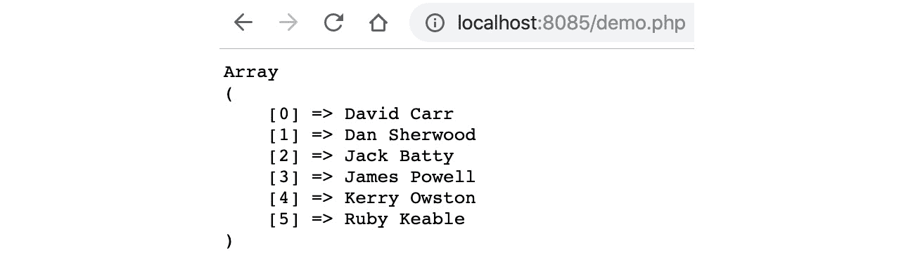
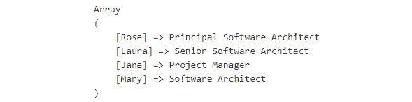
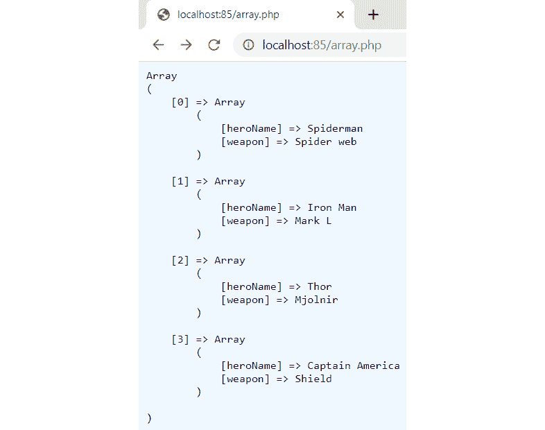
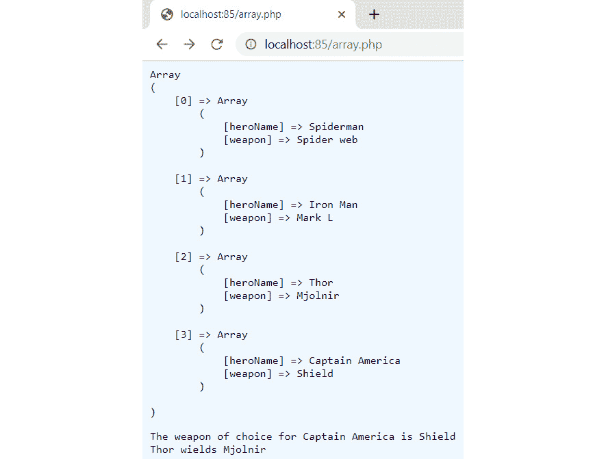

# 第二章：2. 类型与运算符

概述

到本章结束时，你将能够使用 PHP 的不同数据类型来存储和处理数据；创建和使用数组；实现多维数组的概念；使用运算符来评估操作值；以及执行类型转换以将变量从一种类型转换为另一种类型。

# 简介

在上一章中，我们介绍了如何使用 PHP 的模板引擎将信息写入网页，如何在命令行上使用交互式外壳，以及变量及其重要性。

本章将在此基础上继续深入。我们将从回顾 PHP 的数据类型开始，然后介绍数组，它们是什么，如何使用它们，以及可能的不同类型的数组。在此过程中，还将介绍 PHP 中内置的函数，这些函数使我们的代码能够执行特定的操作。

# 什么是数据类型？

在 PHP 中分配给变量的值将具有一组数据类型。以下是有八个原始数据类型：

+   字符串 – 一个基于文本的值

+   整数 – 持有一个数值，它是一个整数

+   浮点数 – 持有一个数值；可以是整数或小数

+   布尔值 – 持有一个等于 `true` 或 `false` 的单一值（`true` 和 `false` 的数值为 `1` 或 `0`）

+   数组 – 在其内部可以持有多个值或其他数组

+   对象 – 持有一个更复杂的数据结构

+   资源 – 持有一个资源引用；例如，函数的引用

+   NULL – 这个值实际上表示没有值

让我们现在更详细地了解不同的类型。

## 整数

整数是整数。使用整数的典型例子包括在购物车中指定数量，或者在处理数据库时作为 ID（*第七章*，*数据持久性*），或者任何需要执行数学操作的时候；例如，`$number = 1024`。在这里，`$number` 是整数类型，持有值 `1024`。

## 字符串

字符串由字符和数字组成。字符串的长度没有限制，但在数据库或其他存储区域中存储字符串时可能会有所限制。

在其最简单的形式中，字符串可以通过在一系列字符周围放置单引号或双引号来创建。这些可以是任何字符，例如字母、数字或特殊字符。

## 单引号和双引号字符串

字符串可以包含变量以及文本。单引号和双引号字符串除了一个变体外是相同的。单引号字符串中的任何变量将显示其实际变量，而不是其值。例如，考虑以下内容：

```php
$name = 'Dave';
echo 'Hello $name';
```

这将打印 `Hello $name` 而不是 `Hello Dave`。

现在，考虑以下示例：

```php
<?php
$name = "Dave";
echo "Hello $name";
```

这将打印 `Hello Dave`。

因此，我们可以看到双引号如何显示变量的值。

此外，如果你想在单引号字符串中包含单引号字符，你必须使用反斜杠字符来转义它。反斜杠字符也需要被转义。

这个例子演示了在单引号字符串内部使用反斜杠来转义单引号的使用：

```php
     echo 'Your code isn\'t bad, but it could be better'; 
// will print: Your code isn't bad, but it could be better.
```

你会注意到前一个例子中的`//`字符。这意味着它是一个注释。当你想要记录解释代码意图并使代码易于阅读时，注释非常有用。注释会被脚本忽略。

有单行注释，如上面`//`字符之上的注释，它们会在当前行添加注释。

要使用多行注释，语法如下：

```php
/*
This is a multi line comment
It can use as many lines as needed
to end a multiline comment use
*/
```

PHP 支持在双引号字符串中使用变量。以下是一个例子，其中将一个数字赋值给`$number`，然后在字符串中显示它：

```php
  $number = 123;
  echo "The number is: $number";
  // will print: The number is: 123
```

现在我们来看一些双引号字符串的例子。我们将使用与前面关于单引号的例子中相同的字符串：

```php
<?php
  $number = 123;
  echo "The number is: $number";
  // will print: The number is: 123
  echo '<br>';
  echo "Your code isn't bad, but it could be better";
  // Your code isn't bad, but it could be better
```

你注意到单引号和双引号字符串输出之间的任何差异了吗？观察第二个字符串的输出。当我们使用双引号时，打印的是`$number`变量的值：


图 2.1：字符串示例的输出

## Heredoc 和 Nowdoc 语法

有时，可能需要声明一个包含大量文本的大字符串。使用单引号和双引号方法，事情可能会很快变得混乱。为了帮助解决这个问题，PHP 提供了两种声明字符串的方法。这些被称为**heredoc**和**nowdoc**语法。使用这些语法，字符串可以跨越多行。此外，你不需要担心转义任何引号。以下是一个使用 heredoc 语法声明的字符串示例：

```php
$number = 100;
$longString = <<<STRING
This string is spanned across multiple lines.
We can use "double quotes" also.
We have declared number $number before it.
STRING;
```

如果看起来很奇怪，不要担心。如果你打印它，屏幕上会显示以下输出：

```php
This string is spanned across multiple lines. We can use "double quotes" also. We have declared number 100 before it.
```

在前面的代码片段中，我们首先声明了一个变量`$number`并将其值设置为 100。之后，我们声明了一个`$longString`变量。注意开头的`<<<`运算符后面跟着的单词`STRING`。在这里，`STRING`被称为标记或标识符。`<<<`运算符和标记应该位于非常开始的位置，而使用 heredoc 时，该行不应有任何内容。实际的字符串从下一行开始。你可以写多行。当你完成时，标记再次在单独的一行上写下，且前面没有空格。如果末尾的`STRING`标记不在单独的一行上，PHP 会抛出错误。

例如，看看下面的内容：

```php
$preferedHost = 'Linux';
$preferedLanguage = 'PHP';
$storeString = <<<STRING
This string is spanned across multiple lines.
The preferred host in this example is $preferedHost.
The preferred language in this example is $preferedLanguage
STRING;
```

我们也在字符串中使用了双引号，我们不需要转义它们。此外，请注意变量的值被打印出来。这意味着 heredoc 语法的行为类似于双引号字符串。

这意味着你可以使用任何单词作为字符串标记，但通常使用**线程结束**（**EOT**）名称。例如，看看以下内容：

```php
$name = 'Dave';
$str = <<<EOT
An example string 
That spans multiple lines.
```

注意

使用 heredoc 时，一个常见的约定是使用`EOT`来表示开始和结束块的字符。块之间的所有内容都将存储在变量中。

变量也可以在不进行任何特殊配置的情况下使用。你只需像`$name EOT`一样显示它们即可。

上述命令现在被存储在一个名为`$str`的变量中。

现在我们来看看使用 nowdoc 语法声明的字符串。我们将使用前面示例中的相同字符串，并将其更改为 nowdoc 语法：

```php
$number = 100;
$longString = <<<'STRING'
This string is spanned across multiple lines. We can use "double quotes" also. We have declared number $number before it.
STRING;
echo $longString;
```

一切都与 heredoc 的情况相同，只有一个区别。标记或标识符被单引号包围，这使得它是`nowdoc`语法。它表现得像单引号字符串，因此，内部不会进行变量解析，这就是为什么它会产生以下输出：

```php
This string is spanned across multiple lines. We can use "double quotes" also. We have declared number $number before it.
```

与 heredoc 不同，`$number`变量没有被解析，直接显示在屏幕上。这对于大块静态文本来说非常理想。

## 浮点数

浮点数是具有小数位的数字。当需要以小数格式存储金钱，例如购物车系统时，浮点数非常有用。

浮点数（也称为浮点数或双精度浮点数）可以声明如下：

```php
$w = 13.3333;
$x = -0.888;
$y = 17e+2;
$z = 8e-2;
```

在前面的代码块中，我们声明了四个变量。`$w`变量具有正值，而`$x`具有负值。PHP 还支持使用科学记数法进行声明。最后两个变量声明`$y`和`$z`就是使用科学记数法声明的。`$y`的值是`1700`，而`$z`的值是`0.08`。

注意

在这里，`e`表示“10 的幂”。

## 布尔值

布尔值是最简单的类型。它只能有两个值之一：`true`或`false`。布尔值用于检查条件是否为真或假，例如，检查变量是否具有预期的值。你将在接下来的练习中看到这一点，并在*第三章*，*控制语句*中进一步详细了解条件的使用。声明布尔值很简单。考虑以下示例：

```php
$isAdmin = true;
$isAdmin = false;
```

## 练习 2.1：使用简单数据类型

到目前为止，我们已经涵盖了字符串、整数、浮点数和布尔值。现在让我们将这些应用到实践中，看看你可能会如何使用它们。在这个练习中，我们将计算一个客户在单个订单中购买的商品总数并打印出来。我们可以这样说，一个订单只有在最终总金额大于或等于 25 时才算完成。以下是执行此操作所需的步骤：

1.  在`chapter2`文件夹内创建一个名为`order.php`的新文件（如果您还没有创建，请现在创建一个文件夹并命名为`chapter2`）。

1.  接下来，打开 PHP 并定义以下变量。这将允许我们模拟订单处理过程。我们将定义一个`$str`变量，用于在显示总和时打印文本，而`$order`变量将保存购买的商品的成本。我们将定义`$additional`变量来保存添加到账单的额外费用。`$orderTotal`变量将保存总账单金额，一个布尔变量`$complete`将指示订单是否完成。默认将其设置为`false`：

    ```php
    <?php
    $str = 'Your order total is: ';
    $order = 20;
    $additional = 5;
    $orderTotal = 0;
    $complete = false;
    ```

1.  定义了这些变量后，我们可以开始订单模拟。首先，让我们将`$additional`添加到`$order`中，并将结果存储在`$orderTotal`中：

    ```php
    //add additional items to order
    $orderTotal = $order + $additional;
    ```

1.  接下来，使用`if`语句（别担心，我们还没有介绍这个，但将在下一章中详细介绍；现在，只需考虑`if (expression)`然后执行给定的步骤），确定`$orderTotal`是否等于`25`：

    ```php
    //if order is equal to 25
    if ($orderTotal >= 25) {
    ```

1.  订单已匹配到`25`，因此将`$complete`设置为`true`，并向客户显示一条消息：

    ```php
    //change $complete to true to indicate the order is complete
     $complete = true;
    //display the $str and add the orderTotal
    echo $str . $orderTotal;
    ```

1.  将所有这些放在一起，我们得到以下结果：

    ```php
    <?php
    $str = 'Your order total is: ';
    $order = 20;
    $additional = 5;
    $orderTotal = 0;
    $complete = false;
    //add additional items to order
    $orderTotal = $order + $additional;
    //if order is equal to 25
    if ($orderTotal >= 25) {
        //change $complete to true to indicate the order is complete
        $complete = true;
        //display the $str and add the orderTotal
        echo $str . $orderTotal;
    }
    ```

1.  现在，打开命令行并导航到`chapter2`文件夹。在命令行上运行以下命令：

    ```php
    php -S localhost:8085
    ```

    现在，转到浏览器并打开`http://localhost:8085/order.php`。

    你将在屏幕上看到以下输出：


图 2.2：订单输出

在这个练习中，我们看到了如何使用不同的数据类型来进行计算并在其基础上做出决策。我们将在第三章“控制语句”中详细讲解`if`条件，从而更清晰地说明根据不同条件可以做出哪些决策。

## 数组

数组是 PHP 中可用的一种数据结构。与存储单个值的普通变量不同，数组是一种可以存储项目集合的数据结构。你可以把数组想象成一个项目列表。这些项目可以是任何类型，如字符串、数字、布尔值，甚至是另一个数组。每个项目可以是不同类型的。第一个可以是字符串，而第二个可以是整数。第三个可以是布尔值或另一个数组。这提供了很大的灵活性。

假设你需要存储九个名字。而不是创建九个不同的变量，我们只需创建一个包含九个元素的数组变量。数组的每个元素都可以通过索引访问。这个索引可以是数字或字符串。数字索引始终从 0 开始。因此，包含 9 个元素的数组将具有从 0 到 8 的索引。第一个元素将具有索引 0，第二个将具有索引 1，依此类推。最后一个元素将具有索引 8。正如你将在示例中看到的那样，这些索引用于从数组中访问值。可以使用 PHP 的内置数组函数向数组中添加项目或从数组中删除项目，我们将在本节稍后介绍：

```php
<?php 
$names = ['Dave','Kerry','Dan','Jack','James','Ruby','Sam','Teresa','Tony'];
print_r($names);
?>
```

这将显示以下输出：

```php
Array
(
    [0] => Dave
    [1] => Kerry
    [2] => Dan
    [3] => Jack
    [4] => James
    [5] => Ruby
    [6] => Sam
    [7] => Teresa
    [8] => Tony
)
```

要显示索引为`3`的`Jack`，你可以按以下方式打印：

```php
<?php echo $names[3];?>
```

## 索引数组和关联数组

PHP 中有两种类型的数组——索引数组和关联数组。索引数组从 0 开始的数字索引，而关联数组有字符串索引。让我们看看一个索引数组的示例：

```php
<?php 
$arrDays = ['Monday', 'Tuesday', 'Wednesday', 'Thursday', 'Friday', 'Saturday',  'Sunday'];
print_r($arrDays);
?>
```

我们声明了一个名为`$arrDays`的数组。为了创建这个数组，我们使用了 PHP 的`[]`函数，并在其中提供了一个逗号分隔的每周七天列表。这些每个都称为数组的元素。然后，我们使用`print_r()`函数来打印这个数组。

注意

`print_r()`用于查看变量的内容。这可以是单个值、数组或对象。例如，以下是将`$arrDays`数组的内容打印到屏幕上的结果。

以下代码片段的输出将如下所示。它将显示所有数组键的索引和值，如下所示：

```php
Array
(
    [0] => Monday
    [1] => Tuesday
    [2] => Wednesday
    [3] => Thursday
    [4] => Friday
    [5] => Saturday
    [6] => Sunday
)
```

前面的输出显示了数组及其索引和每个索引处的元素值。现在让我们尝试访问数组的各个元素。以下代码显示了如何访问单个数组元素：

```php
<?php 
$arrDays = ['Monday', 'Tuesday', 'Wednesday', 'Thursday', 'Friday', 'Saturday',  'Sunday'];
echo 'Element at index 0 is ' . $arrDays[0];
echo '<br>';
echo 'Element at index 4 is ' . $arrDays[4];
```

运行前面的代码将产生以下输出：

```php
Element at index 0 is Monday
Element at index 4 is Friday
```

记住数组索引是从 0 开始的。因此，要获取数组的第一个元素，我们在变量名后使用方括号，并将`0`传递给它。同样，我们传递`4`来获取第五个元素。

PHP 提供了一个`count`函数，可以用来确定数组的长度。以下是它的用法：

```php
<?php  
$arrDays = ['Monday', 'Tuesday', 'Wednesday', 'Thursday', 'Friday', 'Saturday',  'Sunday'];
echo 'Length of the array is: ' . count($arrDays);
// output: Length of the array is: 7
```

我们使用了之前相同的`$arrDays`数组。在声明数组后，我们使用`count`函数打印数组的长度。

接下来是关联数组，这些数组与索引数组类似，但关联数组的索引是由我们提供的。这使得访问项目变得更容易，因为你不需要记住索引。以下是如何创建关联数组的示例：

```php
<?php 
$heroInfo = array(
    'name' => 'Peter Parker',
    'superheroName' => 'Spiderman',
    'city' => 'New York',
    'creator' => 'Stan Lee'
);
print_r($heroInfo);
?>
```

这会产生以下输出：

```php
Array
(
    [name] => Peter Parker
    [superheroName] => Spiderman
    [city] => New York
    [creator] => Stan Lee
)
```

在前面的代码中，我们声明了一个变量`$heroInfo`。与索引数组不同，在这里，我们明确提供了索引。`name`、`superheroName`、`city`和`creator`都是索引。在索引后面使用`=>`运算符来在该索引处分配值。分配后，我们使用`print_r`函数打印数组。

与索引数组一样，我们将使用索引从数组中获取元素。以下是从`$heroInfo`数组中访问元素的代码：

```php
<?php 
$heroInfo = array(
    'name' => 'Peter Parker',
    'superHeroName' => 'Spiderman',
    'city' => 'New York',
    'creator' => 'Stan Lee'
);
echo $heroInfo['name'];
echo '<br>';
echo $heroInfo['superHeroName'];
?>
```

在前面的代码中，我们通过访问`name`和`superHero`索引来找到相应的值。这段代码将产生以下输出：

```php
Peter Parker
Spiderman
```

回顾一下，索引数组是索引为数字的数组。例如，如果你有一个包含人名作为值的数组，索引将是自动分配给每个条目的索引，从 0 开始：

```php
<?php
$people = [];
$people[] = 'David Carr';
$people[] = 'Dan Sherwood';
$people[] = 'Jack Batty';
$people[] = 'James Powell';
$people[] = 'Kerry Owston';
$people[] = 'Ruby Keable';
//display the contents of $people
print_r($people);
```

这会产生以下输出：



图 2.3：显示数组内容

另一方面，关联数组使用命名键而不是索引键。例如，你可以有一个包含人员的数组，其中人员的名字作为键，职位名称作为值：

```php
<?php
$people = [];
$people['Rose'] = 'Principal Software Architect';
$people['Laura'] = 'Senior Software Architect';
$people['Jane'] = 'Project Manager';
$people['Mary'] = 'Software Architect;
//display the contents of $people
print_r($people);
```

这将产生以下输出：



图 2.4：打印职位名称

## 从数组中添加和删除项目

数组是一种栈数据结构。项目可以添加到数组或从中删除。有多种添加和删除项目的方法，以下部分将展示如何使用数组索引方法添加项目到数组，以及如何使用命名键方法。将解释 `array_push` 函数及其如何用于将项目推送到数组。`array_pop` 可以用来从数组中删除项目，这将在演示中展示。

PHP 提供了多个数组函数。这些函数可以用来向数组中添加项目，从数组中删除项目，以及执行其他多项任务。

有两种方式可以向数组中添加元素。以下是第一种方法：

```php
<?php 
$animals = ['Lion', 'Cat', 'Dog'];
$animals[] = 'Wolf';
print_r($animals);
```

我们有一个包含三个元素的数组 `$animals`。注意，我们在变量名后面使用了方括号，并将值 `Wolf` 分配给它。这将在此元素末尾插入此项目，并创建一个新的索引。你可以通过打印数组来确认这一点，这将给出以下输出：

```php
Array ( [0] => Lion [1] => Cat [2] => Dog [3] => Wolf )
```

在关联数组的案例中，你还需要提供键名。以下是一个示例：

```php
<?php
$heroInfo = array(
    'name' => 'Peter Parker',
    'superheroName' => 'Spiderman',
    'city' => 'New York',
    'creator' => 'Stan Lee'
);
$heroInfo['publisher'] = 'Marvel Comics';
print_r($heroInfo);
```

在这里，我们向 `$heroInfo` 数组添加了一个新的键 publisher。这将把值 `Marvel Comics` 添加到数组的末尾，数组将如下所示：

```php
Array ( [name] => Peter Parker [superheroName] => Spiderman [city] => New York [creator] => Stan Lee [publisher] => Marvel Comics )
```

向数组中添加元素的另一种方式是使用 `array_push` 函数。以下是一个 `array_push` 函数的示例。我们将使用之前使用的相同数组：

```php
<?php  
$animals = ['Lion', 'Cat', 'Dog']     ;
array_push($animals, 'Wolf');
print_r($animals);
```

这将产生以下输出：

```php
Array
(
    [0] => Lion
    [1] => Cat
    [2] => Dog
    [3] => Wolf
)
```

`array_push` 函数接受两个参数。第一个是数组的名称，第二个是我们想要插入的值。它还会将值 `Wolf` 添加到数组的末尾。

`array_pop` 函数可以用来从数组的末尾删除一个元素；例如：

```php
<?php
$stack = array("black", "red", "green", "purple");
$fruit = array_pop($stack);
print_r($stack);
```

这将产生以下输出：

```php
Array
(
    [0] => black
    [1] => red
    [2] => green
)
```

`unset` 方法是另一种删除元素的方式，但它允许你指定要删除的键：

```php
<?php
$stack = array("black", "red", "green", "purple");
unset($stack[1]);//remove red as this is the key matching 1
```

这将产生以下输出：

```php
Array
(
    [0] => black
    [2] => green
    [3] => purple
)
```

多维数组是一个包含一个或多个数组的数组。这通常在嵌套数组时使用；例如，你有一个包含每个学校数组的学校数组，其中每个数组存储学校的名称和位置。让我们通过一个练习来详细说明。

## 练习 2.2：创建多维数组

正如我们所见，数组是一系列项目的集合。这些项目可以是任何类型。因此，一个数组可以包含整数、浮点数、布尔值或任何其他类型。这也意味着一个数组也可以是数组的一个元素。包含其他数组的数组被称为多维数组。没有包含任何数组的数组被称为单维或一维数组。让我们做一个练习，我们将创建一个多维数组，然后访问其内部的项：

1.  在 `chapter2` 文件夹内创建一个名为 `array.php` 的新文件。

1.  声明一个数组，`heroInfo`：

    ```php
    array.php
    1  <?php
    2       $heroInfo = [
    3      [
    4          'heroName' => 'Spiderman',
    5          'weapon' => 'Spider web'
    6      ],
    7      [
    8          'heroName' => 'Iron Man',
    9          'weapon' => 'Mark L'
    10     ],
    11     [
    12         'heroName' => 'Thor',
    13         'weapon' => 'Mjolnir'
    14     ],
    https://packt.live/2VqAHto
    ```

1.  使用 `pre` HTML 标签来格式化输出：

    ```php
    echo '<pre>';
    print_r($heroInfo);
    echo '<pre>';
    ```

1.  打开命令行并导航到 `chapter2` 文件夹。

1.  在命令行中运行以下命令：

    ```php
    php -S localhost:85
    ```

1.  现在，打开浏览器并访问 `http://localhost:85/array.php`：

    你将在屏幕上看到以下输出：

    

    图 2.5：打印数组元素

    前面的代码声明了一个名为 `$heroInfo` 的数组，它有四个元素。所有这些元素本身都是关联数组。每个数组都有两个键，`heroName` 和 `weapon`。然后我们打印了这个数组的所有内容。我们使用了 `pre` HTML 标签，以便在屏幕上格式化输出。

    现在我们尝试从这个数组中访问一些元素。

1.  在 `pre` 标签关闭后添加以下行：

    使用数组，提取英雄名称和武器。为此，指定数组名称后跟索引，然后是子索引，换句话说，`$heroInfo[3]['heroName']`：

    ```php
    echo 'The weapon of choice for ' . $heroInfo[3]['heroName'] . ' is ' .  $heroInfo[3]['weapon'];
    echo '<br>';
    echo $heroInfo[2]['heroName'] . ' wields ' . $heroInfo[2]['weapon'];
    ```

1.  保存文件并刷新浏览器页面。你应该会看到以下截图所示的内容：



图 2.6：打印结果

前面的数组有四个元素。因此，`$heroInfo[3]` 将给出这个数组的第四个元素。第四个元素本身也是一个数组，其中 `heroName` 是 `美国队长`，`weapon` 是一个 `盾牌`。要获取英雄名称，我们再次使用方括号，并传递一个 `weapon` 作为键。因此，`$heroInfo[3]['heroName']` 给出的是值 `美国队长`。同样，`$heroInfo[3]['weapon']` 给出的是 `盾牌`。我们在代码的最后一行也做了同样的处理。多维数组也可以有更深层次的嵌套。

在这个练习中，我们研究了多维数组以及如何使用它们来存储多个数组、显示其内容以及从数组中提取特定项。

# 标量类型

标量类型声明可以是强制性的（无需显式指定）或严格的（严格类型提示）。默认情况下，类型是强制性的。

强制转换意味着即使是一个字符串，PHP 也会将其强制转换为整数。

以下是一个示例。这里，我们有一个名为 `number` 的函数，它被类型提示为只接受整数。

在这个例子中，正在传递一个字符串。当以强制模式运行 PHP（这是默认开启的）时，这将工作并打印`1`到屏幕上：

```php
<?php
function number(int $int)
{
    echo "the number is: $int";
}
number('1');
```

为了便于严格模式，在包含以下内容的文件顶部放置一个单独的`declare`指令：

```php
declare(strict_types=1);
```

现在，在严格模式下再次运行示例：

```php
<?php
declare(strict_types=1);
function number(int $int)
{
    echo "the number is: $int";
}
number('1');
```

这将产生以下错误：

```php
Fatal error: Uncaught TypeError: Argument 1 passed to number() must be of the type int, string given
```

这是因为在严格模式下，字符串不能被转换为整数。

注意

类型提示在**第四章**，**函数**中有所介绍。

这强制执行严格数据类型，这意味着它们在脚本生命周期内不能被更改。

## 类型转换

PHP 不需要我们显式声明变量的类型。变量的类型是在它被赋值时设置的。

但有时我们需要改变变量的类型。有时，我们以字符串的形式有`float`值，我们希望将它们作为浮点数在我们的代码中使用。这在接受最终用户输入时很典型。假设用户在一个表单中填写了一个浮点值。当将其保存到数据库时，你必须将其从字符串（这是初始值存储的方式）转换为浮点数，如果数据库列类型是`float`。

为了实现这一点，使用了类型转换。考虑以下示例：

```php
$x = "13.3333";
var_dump($x);
echo "<br>";
$y = (float) $x;
var_dump($y); 
```

首先，我们声明了一个变量，`$x`，它是一个值为`13.3333`的字符串。然后，我们使用 PHP 的`var_dump`函数来显示`$x`的类型和值。之后，我们使用 PHP 的 cast float（在变量上转换数据类型，在`$x`变量之前设置数据类型，括号内）来改变`$x`变量的类型并将其赋值给`$y`。之后，我们再次使用`var_dump`函数来显示`$y`的类型和值。

运行前面的代码将生成以下输出：

```php
string(7) "13.3333" 
float(13.3333)
```

你可以看到变量`$y`的类型已更改为浮点，其值现在是浮点数`13.333`而不是字符串`13.333`。

这里是 PHP 中所有可用的类型转换列表：

+   (`int`) – 整数

+   (`bool`) – 布尔

+   (`float`) – 浮点数（也称为“浮点数”、“双精度浮点数”或“实数”）

+   (`string`) – 字符串

+   (`array`) – 数组

+   (`object`) – 对象

+   (`unset`) – NULL（NULL 表示没有值）

让我们看看更多不同类型的示例，并了解它们背后的细节。

## 练习 2.3：将布尔值转换为整数

在这个练习中，我们将接受布尔变量并将其转换为整数，从而演示类型转换的概念：

1.  在`chapter2`文件夹内创建一个名为`convertbooleanint.php`的 PHP 文件。打开`php`标签。显示一个标题，`布尔转整数`，并声明两个包含`true`和`false`的变量：

    ```php
    <?php
    echo '<h3>Boolean to Int</h3>';
    $trueValueBool = true;
    $falseValueBool = false;
    ```

1.  添加另一个标题，并使用`var_dump`查看`$trueValueBool`和`$falseValueBool`的值：

    ```php
    echo '<h3>Before type conversion:</h3>';
    var_dump($trueValueBool);
    echo '<br>';
    var_dump($falseValueBool);
    ```

1.  现在，添加另一个标题，这次通过类型转换将变量改为整数。然后，使用`var_dump`查看它们的更新值：

    ```php
    echo '<h3>After type conversion:</h3>';
    $trueValueInt = (int) ($trueValueBool);
    $falseValueInt = (int) ($falseValueBool);
    var_dump($trueValueInt);
    echo '<br>';
    var_dump($falseValueInt);
    ```

    这将产生以下输出：

    ```php
    Boolean to Int
    Before type conversion:
    bool(true) 
    bool(false)
    After type conversion:
    int(1) 
    int(0)
    ```

这个练习演示了如何获取布尔值并使用类型转换将它们的数据类型转换为整数。

## 练习 2.4：将整数转换为字符串

在这个练习中，我们将做相反的操作，将整数转换为布尔值：

1.  在`chapter2`文件夹内创建一个名为`convertintstring.php`的 PHP 文件。打开`php`标签。显示一个标题，`int to string`，并声明一个名为`$number`的整数变量：

    ```php
    <?php 
    echo '<h3>int to string:</h3>';
    $number = 1234;
    ```

1.  显示另一个标题，并使用`var_dump`查看`$number`的内容：

    ```php
    echo '<h3>Before type conversion:</h3>';
    var_dump($number);
    ```

1.  这次，将`$number`的数据类型更改为字符串，并将其分配给一个名为`$stringValue`的新变量，然后使用`var_dump`输出它：

    ```php
    echo '<h3>After type conversion:</h3>';
    $stringValue = (string) ($number);
    var_dump($stringValue);
    ```

    这将给出以下输出：

    ```php
    int to string:
    Before type conversion:
    int(1234)
    After type conversion:
    string(4) "1234"
    ```

我们从一个整数`$number`开始，将其值设置到另一个变量中，然后使用（一个字符串）前缀来设置其数据类型。然后我们使用`var_dump`输出其内容以检查内容。这种技术可以用来检查变量以确保它们是所需的数据类型。

PHP 还提供了一系列`is_datatype()`函数：

+   `is_array`

+   `is_bool`

+   `is_callable`

+   `is_countable`

+   `is_double`

+   `is_float`

+   `is_int`

+   `is_integer`

+   `is_iterable`

+   `is_long`

+   `is_null`

+   `is_numeric`

+   `is_object`

+   `is_real`

+   `is_resource`

+   `is_scalar`

+   `is_string`

这些可以用来确定它们使用的数据类型：

```php
is_array($variable);
```

这返回一个布尔值，指示给定的变量是否与函数的数据类型匹配。

## 练习 2.5：将厘米转换为米

在这个练习中，我们将创建一个脚本，该脚本将从命令行获取三个参数：一个名字，一个以米为单位的数字，以及另一个以厘米为单位的数字。这两个数字加起来将代表用户的高度。例如，一个名叫 Jo，身高 1 米 65 厘米的用户将输入"Jo 1 65。"对于输出，我们将厘米转换为米，并打印出来，同时显示名字。观察以下步骤：

1.  在`chapter2`文件夹内创建一个名为`activity-height.php`的文件。

1.  首先，打开 PHP，从命令行收集参数，并将这些参数分配给变量。为了收集变量，可以使用`$argv`。这是一个在此上下文中收集变量的命令；它们被称为参数。米和厘米应该被转换为`int`。这可以通过使用（`int`）`$arg`后跟索引来完成。例如，（`int`) `$argv[2]`：

    ```php
    <?php 
        // get all arguments
        $name = $argv[1];
        $heightMeters = (int) $argv[2];
        $heightCentiMeters = (int) $argv[3];
    ```

1.  接下来，使用（`float`）将厘米转换为米，然后除以`100`：

    ```php
    // convert centimeters to meters
    $cmToMeter = (float)($heightCentiMeters/100);
    ```

1.  现在，将米的高度加到结果厘米上：

    ```php
    $finalHeightInMeters = $heightMeters + $cmToMeter;
    ```

1.  最后，显示结果：

    ```php
    // display the output
          echo $name . ': ' . $finalHeightInMeters . 'm';
    ```

1.  打开终端，导航到`chapter2`文件夹，然后在命令行中运行以下命令：

    ```php
    php activity-height.php Alex 1 75
    ```

    你应该在终端上看到以下截图中的输出：

![图 2.7：打印高度

![图 2.7：打印高度

图 2.7：打印高度

现在，让我们尝试理解这段代码。我们声明了三个变量 - `$name`、`$heightMeters`和`$heightCentiMeters`。由于我们将从命令行获取 3 个值，我们使用了 PHP 的预定义`$argv`数组，通过索引`1`、`2`和`3`来获取这些值。我们从索引`1`开始，因为`$argv[0]`总是脚本名称，在这种情况下将是`activity-height.php`。请注意，我们为`$heightMeters`和`$heightCentiMeters`使用了整数转换。

在获取变量的值之后，我们将高度从厘米转换为米，通过将数值除以`10`，然后将结果存储在`$cmToMeter`变量中。在最后一行，我们按要求显示结果。这里需要类型转换的原因是为了确保数据是正确的数据类型。例如，可能传递了一个数组。通过设置数据类型，脚本告诉它必须设置哪种数据类型，如果无法设置，它将抛出一个错误。

在这个例子中，你看到了如何通过除以两个值来将米转换为厘米。这是一个算术运算的例子。现在，让我们看看更多运算符的例子。

# 运算符和表达式

在 PHP 中，运算符是某种可以接受一个或多个值或表达式，并应用一个操作以给出结果，该结果可以是值或另一个表达式。

PHP 将运算符分为以下几组：

+   算术运算符

+   字符串运算符

+   位运算符

+   赋值运算符

+   比较运算符

+   增量/减少运算符

+   逻辑运算符

+   数组运算符

+   条件赋值运算符

## 算术运算符

算术运算符用于执行数学运算，例如，加法、减法、除法和乘法。

这里是`+`运算符。它将不同的数字通过`+`运算符分隔开来，并将这些值相加：

```php
<?php echo 24 + 2; ?>
```

这将给出输出结果为`26`。

这里是`-`运算符。它将不同的数字通过`-`运算符分隔开来，并将减去这些值：

```php
<?php echo 24 - 2; ?>
```

这将给出输出结果为`22`。

这里是`*`运算符。它将不同的数字通过`*`运算符分隔开来，并将显示它们的乘积：

```php
<?php echo 24 * 2; ?>
```

这将给出输出结果为`48`。

这里是`/`运算符。它将不同的数字通过`/`运算符分隔开来，并将打印结果：

```php
<?php echo 24 / 2; ?>
```

这将给出输出结果为`12`。

`%`（取模）运算符用于计算两个给定数字除法的余数：

```php
<?php echo 24 % 5; ?>
```

这将给出输出结果为`4`。

## 字符串运算符

字符串运算符有连接运算符和连接赋值运算符。连接意味着将一个或多个变量添加到现有变量中。例如，假设我们有以下：

```php
<?php 
$first = 'Hello';
$second = 'World!';
```

现在，我们想要通过连接来一起显示这些项目：

```php
<?php echo $first . ' ' . $second; ?>
```

连接使用 `.` 语法 - 我们可以通过这种方式连接多个变量。在这个例子中，我们用空格分隔两个变量。注意语法：一个 `.` 后跟一个空格，然后是一个 `.` 以在单词之间添加所需的空间。

连接赋值意味着将一个变量追加到现有变量上：

```php
<?php
$str = ' second part'; 
$result = 'first part';
$result .= $str;
echo $result;
```

输出如下：


图 2.8：演示字符串连接

如您所见，使用 `.=` 语法，`$str` 变量被追加到 `$result` 变量。

## 位运算符

位运算符允许对整数中的特定位进行评估和操作。在这种情况下，整数被转换为位（二进制）以进行更快的计算。

取两个变量，`$a` 和 `$b`。它们可以用以下条件进行评估：

```php
<?php
$a = 1;//0001 in binary
$b = 3;//0011 in binary
//Bits that are set in both $a and $b are set.
echo $a && $b;
echo '<br>';
//Bits that are set in either $a or $b are set.
echo $a || $b;
echo '<br>';
//Bits that are set in $a or $b but not both are set.
echo $a ^ $b;
```

输出如下：

```php
1
1
2
```

`$a && $b` 表达式在计算两个操作数的最后一位的 AND 结果时将返回 `1`。`$a || $b` 表达式将执行两个操作数的最后一位的 OR 操作，并将返回 `1`。

`2` 的结果是 `$a` 或 `$b` 中存在的二进制位的总数，但排除了 `$a` 和 `$b` 中都存在的位。

注意

更多关于十进制到二进制转换的信息，您可以查看 [`packt.live/2B0M2XK`](https://packt.live/2B0M2XK)。

## 赋值运算符

当使用 `=` 为变量赋值时，这构成了一个赋值运算符：

```php
<?php 
$year = 2019; 
```

## 比较运算符

要比较两个值，使用比较运算符。有两种常见的比较运算符 - `==`，表示等于，和 `!=`，表示不等于。

注意

赋值运算符（`=`）用于赋值。它不能用于执行比较操作，因为比较一个值是否与另一个值相同需要使用 `==` 运算符。为了确定两个变量是否相同，换句话说，具有相同的类型，使用相同的 `===` 运算符。

这里有一个例子：

```php
<?php 
$cost = 200;
$money = 150;
if ($cost == $money) {
    echo 'cost matches money';
}

if ($cost != $money) {
    echo 'cost does not match money';
}
```

输出如下：


图 2.9：演示比较运算符的使用

## 增量/减少运算符

要增加一个值，使用 `++` 运算符。这将值增加一。或者，使用 `+` 和一个数字将值增加该数字。例如，`+3` 将增加 `3`：

```php
<?php 
$cost = 200;
$cost++;
echo $cost; //this will give 201
```

要减少一个值，过程相同，但使用 `–`：

```php
<?php 
$cost = 200;
$cost--;
echo $cost; //this will give 199
```

## 逻辑运算符

在这里，我们将探讨逻辑运算符。

`and` 运算符执行两个表达式的逻辑合取。如果两个表达式都评估为 `true`，则返回布尔值 `true`。`&&` 运算符是 `and` 的另一种说法。`OR` 运算符在两个操作数中的任何一个评估为 `true` 时返回布尔值 `true`，否则返回 `false`。`||` 运算符是 `or` 的另一种说法。

`!` 运算符表示非。它可以用来检查一个表达式是否不匹配。例如，考虑以下：

```php
<?php
$isAdmin = true;
If (! $isAdmin) {
//will only run if $isAdmin == false
}
```

## 数组运算符

PHP 数组运算符用于比较数组：

+   `==` 表示等于（两个变量的值匹配）。考虑以下示例：

    ```php
    $num1==$num2
    ```

    如果 `$num1` 的值等于 `$num2` 的值，则返回 `true`。

+   `===` 表示等于（两个变量具有相同的类型和值）：

    ```php
    ($num1 === $num2);
    ```

    如果 `$num1` 的值和数据类型等于 `$num2` 的值和数据类型，则返回 `true`。

+   `!==` 表示不等于（两个变量的值不同）：

    ```php
    ($num1 !== $num2);
    ```

    如果 `$num1` 不等于 `$num2`，或者它们不是同一类型，则返回 `true`。

## 条件赋值运算符

PHP 条件赋值运算符用于根据条件设置值：

+   `?`：这在三元比较中使用，例如 `$x = expr1 ? expr2 : expr3`（这将在下一章中详细介绍）。

+   `??`：这是一个空合并运算符，表示如果第一个表达式为 `true`，则使用它，否则使用第二个条件，例如 `$x = expr1 ?? expr2`（这将在下一章中详细介绍）。

## 活动二.1：打印用户的 BMI 值

假设你有一天决定监测你的健康状况，但不想使用第三方工具。你可以构建一个简单的工具来获取包括姓名、体重和身高在内的测量值。从那里，你可以计算你的 BMI。

在此活动中，你将编写一个脚本，从脚本中获取变量以执行计算以获得 BMI 结果。你将设置一些默认值，但也可以通过查询字符串指定自己的数据。

完成此活动的步骤如下：

1.  创建一个 `tracker.php` 文件。

1.  定义一个 `$name` 字符串来存储用户的姓名。

1.  定义一个 `$weightKg` 整数来存储千克为单位的体重。

1.  定义一个 `$heightCm` 整数来存储厘米为单位的高度。

1.  将高度转换为米。

1.  计算高度的平方值。

1.  通过将用户的体重除以高度的平方值来计算 BMI。

1.  在屏幕上显示一条消息，显示姓名和 BMI 结果。

输出将如下所示：


图 2.10：活动的预期结果

注意

此活动的解决方案可以在第 505 页找到。

# 摘要

在本章中，我们学习了不同的 PHP 数据类型，包括 `string`（字符串）、`integer`（整数）、`float`（浮点数）和 `array`（数组）。我们还学习了声明字符串的不同方法，包括 `heredoc` 和 `nowdoc` 语法。我们执行了数组操作，其中使用了索引、关联和多维数组，并从数组中添加和删除元素。我们还执行了类型转换来改变变量的类型。

在下一章中，我们将介绍条件逻辑。条件语句将逻辑引入到你的脚本中，并允许根据不同的条件执行不同的操作；例如，假设你有一个包含单词 *Pending* 的变量，并且你只想在单词等于 *Pending* 时显示一条语句。

理解条件语句将解锁编写代码的新方法，并允许进一步的用户交互。
