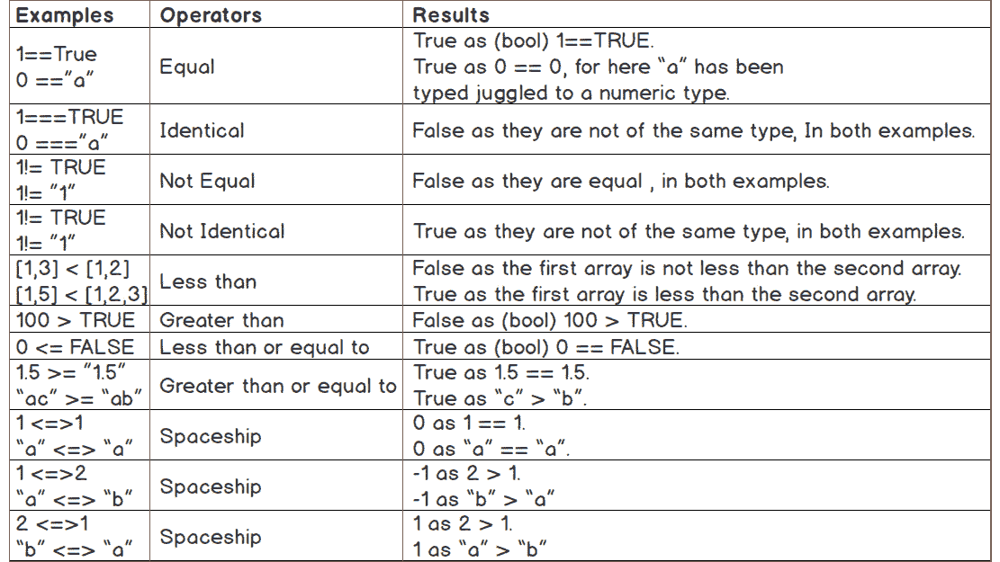
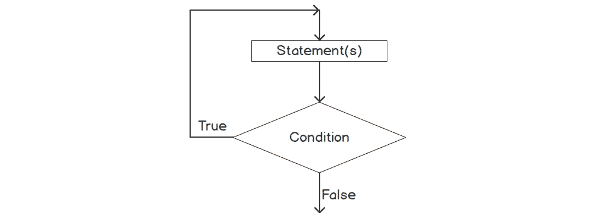

# 3. 控制语句

概述

到本章结束时，你将能够描述布尔表达式；利用逻辑运算符来组合布尔表达式；在控制语句中选择正确的比较运算符；描述 PHP 中的分支和不同的循环技术；使用`if`…`else`、`switch`情况、`break`和`continue`语句进行分支；区分有界和无界循环；实现 while、`do`…`while`、`for`和`foreach`循环；并编写一个 PHP 脚本来创建电影列表应用程序。

# 简介

由于 PHP 是一种动态类型语言，其中类型与数据相关联而不是与变量相关联，因此理解类型在数据操作领域中的作用至关重要。在前一章中，我们学习了 PHP 中可用的数据类型、它们与变量的使用以及类型转换。我们还练习了向数组中添加和删除项目，并了解了类型转换以及将字符串数据分配给变量的`heredoc`和`nowdoc`的替代方法。

在本章中，我们将讨论**控制语句**及其重要性，并探讨 PHP 在这一领域所能提供的功能。控制语句是任何编程语言最重要的特性。简单来说，它们有助于控制程序的流程。**分支**和**循环**是帮助决定程序流程的主要控制结构类型。它们还有助于构建用于复杂程序流程的递归循环。

分支使我们能够根据一定的逻辑在多个条件中遵循正确的路径。例如，假设我们想要与某个人取得联系。这个人可能有一个电子邮件地址或手机号码，我们可能想要通过电子邮件或短信与这个人联系。分支结构将帮助我们确定是否与该联系信息相关联有电子邮件地址，并根据该逻辑给这个人发送电子邮件。如果没有电子邮件地址可用，那么我们可以选择替代的通信方式，例如短信。

帮助分支的逻辑可以由一个或多个条件组成；例如，检查电子邮件地址是否可用以及检查电子邮件地址是否有效。通常，每个代码分支都会分组一组要执行的语句；例如，如果电子邮件地址可用，则发送联系人的电子邮件，记录电子邮件投递的历史记录，更新发件人电子邮件已成功发送，等等。PHP 支持`if…else`和`switch`控制语句进行分支。分支的想法完全是关于决定并执行正确的计划：


图 3.1：分支图

循环允许我们在满足一定逻辑的情况下执行重复的任务或重复执行程序语句。例如，我们需要给给定列表中所有具有有效电子邮件地址的人员发送电子邮件。循环结构允许我们遍历人员列表并逐个发送他们的电子邮件——如果给定的电子邮件地址是有效的，循环将继续到列表的末尾。`while`、`do…while`、`for`和`foreach`是 PHP 中可用的不同循环技术：

![图 3.2：循环图]


图 3.2：循环图

# 布尔表达式

分支和循环结构评估逻辑以执行分支或循环。这个逻辑可以测试某个值，可以是值的比较，也可以是测试逻辑关系，并且它可以写成表达式。表达式被评估为布尔值；即，由分支和循环结构评估为`true`或`false`。对于分支，表达式作为该分支的入口检查，这样我们就可以决定是否选择该代码分支。对于循环，表达式可能作为该循环的入口或退出检查，这样我们就可以决定循环应该迭代多少次。例如，要给一个人员列表中的所有人发送电子邮件，我们可以编写一个表达式来确定列表的大小，这样我们就可以设置发送电子邮件任务多少次，并编写另一个表达式来检查电子邮件地址的有效性以发送电子邮件。

一个`not`、`and`和`or`来检查任何陈述的真实性或非真实性或错误性。考虑一个水果类比：“*我喜欢苹果*”。如果苹果是水果，这个表达就是`true`。那么，“*我喜欢苹果和橙子*”呢？如果“*我喜欢苹果*”和“*我喜欢橙子*”都是`true`，那么这个表达就是`true`。比较运算符在布尔表达式中也扮演着角色，当我们需要比较两个值以确定它们是否相等，或者一个是否大于或小于另一个时。比较不仅限于值，还扩展到数据类型。

在下一节中，我们将讨论布尔常量，并学习如何使用运算符编写布尔表达式，在整个章节中，我们将应用逻辑表达式评估作为布尔值。

注意

本章中的所有示例都遵循 PSR 标准编码风格指南中的样式建议，该指南可在[`packt.live/2VtVsUZ`](https://packt.live/2VtVsUZ)找到。

# 布尔常量

`true`和`false`是唯一两个被视为常量的布尔值。一个简单的布尔值可以是一个简单的表达式，如下所示：

```php
if (true) {
    echo "I love programming.";
} else {
    echo "I hate programming.";
}
```

如果括号内的陈述结果是`true`，那么应该执行`true`块；否则，应该执行`false`块。

或者，我们可以写出以下表达式：

```php
if (false) {
    echo "I hate programming.";
} else {
    echo "I love programming.";
}
```

这两种方法都会输出`我喜欢编程`。

在前面的示例中，我们使用了`if…else`控制语句，我们将在本章稍后讨论。

# 逻辑运算符

如果*水果不是苹果*，则为`true`。因此，要否定一个陈述，我们使用如果"*我爱苹果*"或"*我爱橙子*"中的任何一个语句是`true`，则使用`true`。因此，我们使用或来在任一条件为`true`时产生布尔`true`，并使用`true`。

逻辑运算符可以用来将多个表达式组合成一个复杂的表达式。例如，语句"*我爱苹果或橙子但不是西瓜*"可以分解成更小的语句，例如"*我爱苹果*"，或"*我爱橙子*"，以及"*我不爱西瓜*"。如果*水果不是西瓜*，并且"*我爱苹果*"或"*我爱橙子*"中的任何一个语句是`true`，则表达式是`true`。

## 非运算符

如果变量的值不是`true`，则为`true`：

```php
!$a
```

## and 运算符

`and`运算符用于将多个变量或表达式连接起来以产生一个新的布尔值——`true`或`false`：

```php
$a and $b
$a && $b
```

前面的代码在`$a`和`$b`变量都为`true`时输出`true`。

注意

这里`and`运算符有两种不同的变体，并且它们按照不同的优先级顺序工作。

表达式中操作执行的顺序由优先级决定。`and`运算符的优先级低于`&&`运算符。

## or 运算符

`or`运算符用于将多个变量或表达式连接起来以产生一个新的布尔值——`true`或`false`：

```php
$a or $b
$a || $b
```

前面的代码在变量`$a`或`$b`中的任何一个为`true`时输出`true`。

注意

这里`or`运算符有两种不同的变体，并且它们按照不同的优先级顺序工作。

## xor 运算符

`xor`运算符用于将多个变量或表达式连接起来以产生一个新的布尔值——`true`或`false`：

```php
$a xor $b
```

前面的代码在`$a`或`$b`不是`true`时输出`true`。再次考虑一个水果的类比：当同时`*我爱芒果*`和`*我爱柠檬*`都是`true`时，语句"*我爱芒果或柠檬但不是两者都爱*"是`false`。

注意

在 PHP 中，`and`和`or`有两种不同的变体，它们按照不同的优先级顺序工作。请参阅[`packt.live/2IFwFYR`](https://packt.live/2IFwFYR)中的运算符优先级表。

## 短路评估和运算符优先级

如果`and`操作是`false`，则整体评估必须产生`false`，并且不一定需要评估第二个条件。对于`or`运算符也是如此：如果第一个条件是`true`，则整体评估必须产生`true`，无论第二个条件是否为`false`。

短路评估将进行尽可能少的比较来评估条件。以下是一些短路逻辑运算符的示例：

```php
function foo() {
    return true; 
}
$a = (false && foo());
$b = (false and foo());
```

前面的 `foo()` 函数永远不会被调用，因为表达式的第一部分给出了逻辑结论。与 `and` 一样，如果第一个参数是 `false`，则不需要评估其余部分，因为 `and` 操作只要至少有一个参数是 `false` 就是 `false`：

```php
function foo() {
    return false;
}
$a = (true  || foo());
$b = (true  or  foo());
```

`foo()` 函数永远不会被调用，因为表达式的第一部分给出了逻辑结论。与 `or` 一样，如果第一个参数是 `true`，则不需要评估其余部分，因为 `or` 操作只要至少有一个参数是 `true` 就是 `true`。

要看看另一个例子，短路评估对于以下条件很有用：

```php
if ($todayIsSunday && $isNotRaining) {
    echo "Let's play UNO at my place.";
}
```

如果 `$todayIsSunday` 是 `false`，则整个表达式将被评估为 `false`，并且没有在家玩游戏的机会。

注意

一旦知道结果，逻辑表达式的评估就会停止。

## 逻辑运算符的优先级

我们需要意识到赋值语句中相同逻辑运算符的优先级，以便布尔值在评估结果之前不会遇到赋值。以下示例显示了相同逻辑运算符（`||` / `or`）的优先级如何可能破坏评估。

### `||` 与 `or` 的比较

考虑以下例子：

```php
$a = false || true; //outputs true
```

`(false || true)` 表达式的结果已经被分配给 `$a`，并像 `($a=(false||true))` 一样进行评估，因为 `||` 的优先级高于 `=`：

```php
$a = false or true; //outputs false!
```

在 `or` 操作之前，将 `false` 常量分配给 `$a`，并像 `(($a = false) or true)` 一样进行评估，因为 `or` 的优先级低于 `=`。

### `&&` 与 `and` 的比较

考虑以下例子：

```php
$a = true && false; //outputs false
```

`(true && false)` 表达式的结果已经被分配给 `$a`，并像 `($a = (true && false))` 一样进行评估，因为 `&&` 的优先级高于 `=`：

```php
$a = true and false; //outputs true!
```

在 `and` 操作发生之前，将 `true` 常量分配给 `$a`，并像 `(($a = true) and false)` 一样进行评估，因为 `and` 的优先级低于 `=`。

考虑以下用例，其中我们需要在用户同时拥有用户名和密码的情况下授予访问权限。在示例中，我们可以看到用户没有密码，因此不应授予访问权限：

```php
$hasUsername = true;
$hasPassword = false;
$access = $hasUsername and $hasPassword; //true
```

这里，由于 `$hasPassword` 是 `false`，因此不应授予 `$access` 或应将其设置为 `false`。相反，由于语句被评估为 `(($access = $hasUsername) and $hasPassword)`，`$access` 变为 `true`，并且用户在没有密码的情况下被授予访问权限。

因此，为了避免这种表达式的不良评估，建议使用括号将表达式作为一个单元在括号内进行评估。

注意

`and` 和 `or` 的优先级低于 `=`，但 `||` 和 `&&` 的优先级更高。

## 比较运算符

我们经常需要比较值以决定程序流程。例如，我们可能想乘坐四座车，我们需要确保乘客数量不超过车的容量。因此，在编程中，为了检查此类条件，我们经常利用**比较运算符**。

比较运算符比较两个值，并根据给定的比较返回`true`或`false`。比较涉及检查两个值是否相等，是否为相同的数据类型，是否小于、大于等。或者，您还可以有混合比较，如小于等于、大于等于等。

PHP 引入了一种全新的比较运算符——太空船运算符`<=>`，它可以检查两个数字的相等性，并允许我们知道哪个数字更大。

让我们来看看比较运算符及其行为：


图 3.3：运算符及其描述

注意

当我们比较不同类型的值时，例如整数和字符串，会发生类型转换。字符串将被转换为数字以进行数值比较；也就是说，`1 == "01"`等价于`1 == 1`。对于`===`和`!==`，它们比较类型和值，类型转换不适用。

关于各种类型比较，请参阅*与各种类型的比较*，可在[`packt.live/2Vsk4NZ`](https://packt.live/2Vsk4NZ)找到。

查看一些比较运算符的有趣示例：



图 3.4：比较运算符表

通过前面的不同类型示例，我们希望对比较运算符及其背后的类型转换有一个清晰的了解。

注意

在表达式的评估过程中，比较运算符的优先级高于布尔运算符。

例如，在这个多表达式`($smallNumber > 2 && $smallNumber < 5)`中，比较是在布尔运算之前执行的。

# 分支

如我们之前讨论的，确定正确的路径或从多个代码块中选择一个代码块来执行可以描述为`true`或`false`。因此，根据布尔表达式的结果，我们可以选择执行所需的语句或语句组。

`if`和`switch`语句是两种主要的分支控制结构。`if`是任何编程语言中最常用的条件结构。`switch`可以在某些情况下使用，例如可以通过单个值或表达式选择多个分支，或者当一系列`if`语句不方便时。

## if 语句

`if`的语法如下：

```php
if (expression)
    statement;
```

在这里，`if (expression)`是控制结构，而`statement`是一个以分号结束的单行语句，或者是一对大括号内包含的多条语句，如下所示：

```php
if (expression) {
    statement1;
        .
        .
     statementN;
}
```

因此，如果表达式的结果评估为`true`，则应执行下一个语句或语句块。

让我们来看一个例子：

```php
$number1 = 5;
$number2 = 3;
if ($number1 > $number2) {
    print("$number1 is greater than $number2"); //prints 5 is greater than 3
}
```

前面的表达式产生布尔`true`，因此执行`true`分支。

注意

控制结构体可能包含一个单独的语句、一个封闭的语句块或另一个条件结构。

## if…else 语句

当`if`控制结构评估为`true`时，我们可以执行紧随其后的语句块，但如果控制表达式中的评估产生`false`，怎么办？我们可以在其中添加一个可选的`else`块来执行其中的语句。

让我们看看`if…else`语句的语法：

```php
if (expression)
    statement;
else
    statement;
```

在这里，`else`是当条件为`false`时的后备选项。使用`else`块，我们可以根据条件表达式评估为`false`来执行语句：


图 3.5：if…else 语句

让我们看看`if..else`控制结构的另一个例子：

```php
$number1 = 3;
$number2 = 5;
if ($number1 > $number2) {
    print("$number1 is greater than $ number2");
} else {
    print("$number1 is less than $number2"); //prints 3 is less than 5
}
```

现在我们已经看到了`if`和`if…else`语句的基本实现，让我们在接下来的两个练习中创建一些基本的脚本来实现它们，并观察实际程序中分支是如何发生的。

## 练习 3.1：创建一个基本的脚本以实现 if...else 测试用例

在接下来的练习中，你将学习如何使用 PHP 的内置`date()`函数获取日期。你将使用`if...else`测试用例来检查今天是否是星期日，然后打印`Get rest`或`Get ready and go to the office`：

1.  创建一个名为`test-sunday.php`的 PHP 文件，并插入以下内容：

    ```php
    <?php
    if ("Sunday" === date("l")) {
            echo "Get rest";
    } else {
            echo "Get ready and go to the office";
    }
    ```

    在这里，我们使用了一个带有日期格式标志的内置`date`函数，即`l`（小写 L），它返回当前星期的文本表示；即从*星期日到星期六*。请注意，*大写*用于日期字符串中的第一个字符；即星期日，因为函数以这种方式返回。

    `if`条件表达式`("Sunday" === date("l"))`将返回的星期名称与"*Sunday*"匹配。如果今天是星期日，那么`("Sunday" === "Sunday")`将完全匹配并产生`true`，并打印"`Get rest`"；否则，它将打印"`Get ready and go to the office`"。

1.  从终端或控制台运行 PHP 文件，如下命令所示：

    ```php
    php test-sunday.php
    ```

    如果今天是星期日，脚本将打印`Get rest`；否则，它将打印`Get ready and go to the office`。


图 3.6：if…else 脚本输出

注意

你可以在[`packt.live/35mGNzC`](https://packt.live/35mGNzC)找到更多关于 PHP `date`函数的信息。

## 练习 3.2：实现嵌套的 if...else 结构

在接下来的练习中，我们将练习使用嵌套的`if...else`结构，并在控制语句中使用不同类型的表达式。我们将创建一个脚本，该脚本将根据一个数大于另一个数且这两个数不相等的事实来打印两个给定数字之间的差异。在这里，这两个数都是正整数。

通过嵌套的`if...else`结构，我们将测试数字是否相等。如果不相等，我们将确定哪个数字更大，并从另一个数字中减去以打印差值：

1.  创建一个名为`test-difference.php`的 PHP 文件。

1.  声明两个变量，`$a`和`$b`，并分别将它们的值设置为`5`和`3`，如下所示：

    ```php
    <?php
    $a = 5;
    $b = 3;
    ```

1.  插入一个`if…else`结构，如下所示的内容：

    ```php
    <?php
    $a = 5;
    $b = 3;
    if($a - $b) {
        //placeholder for inner if...else
    } else {
        print("The numbers are equal");
    }
    ```

    如我们所知，表达式 ID 的结果评估为`true`或`false`，对于非布尔结果应转换为布尔类型。示例表达式`($a - $b)`取决于`0`被视为`false`的事实，所以*如果差值为零*，则表达式将被评估为`false`，因此将打印"`数字相等`"。

1.  在`if`情况体内添加另一个`if…else`结构来处理差值数字，如下所示：

    ```php
    <?php
    $a = 5;
    $b = 3;
    if($a - $b) {
        if ($a > $b) {
            $difference = $a - $b;
    } else {
            $difference = $b - $a;
    }
    print("The difference is $difference");
    } else {
        print("The numbers are equal");
    }
    ```

1.  在前面的例子中，内部`if...else`确定哪个数字更大，并从另一个数字中减去以打印差值。

1.  使用以下命令从终端或控制台运行 PHP 文件：

    ```php
    php test-difference.php
    ```

    如果数字不相等，脚本将打印"`差值是 2`"；否则，由于没有差值，将打印"`数字相等`"：

    

    图 3.7：嵌套的 if…else 脚本输出

1.  调整`$a`和`$b`的值，并重新运行脚本以获得不同的结果。

1.  *我们的目标是实现不同的条件覆盖率*，开发`if…else`控制结构。`if...else`结构在条件评估为`true`时执行`true`分支；否则，执行`false`分支。

## 三元运算符

可以将三元运算符视为具有以下语法的简写`if..else`语句：

```php
(expression1)? (expression2): (expression3)
```

在这里，如果`expression1`评估为`true`，则执行`expression2`；否则，`expression3`执行`expression1`的`false`评估。

三元运算符可以用于分配默认值，如下所示：

```php
$msg = ("Sunday" === date("l"))? "Get rest" : "Get ready and go to the office";
echo $msg;
```

在前面的例子中，如果今天是星期日，则将打印"`休息`"；否则，将打印`Get ready and go to the office`，并且我们可以评估条件以在单行上返回一个值。三元运算符适用于某些情况，特别是用于分配默认值，在`return`语句中用于评估和返回一个值，或者用于动态字符串中解析和打印输出。

也可以用以下方式编写三元运算符：

```php
echo ($msg) ? :"Get ready and go to the office";
//equivalent to
echo ($msg) ? $msg : "Get ready and go to the office";
```

如果`$msg`变量不为空，则将打印其值；否则，将打印`"Get ready and go to the office"`。

## if…elseif…else 语句

考虑一个需要评估一系列条件的例子。比如说，你想要根据 GPA（满分 4 分）的范围显示考试的成绩等级；也就是说，3.80 到 4 分得到 A+等级，3.75 到 3.80 以下得到 A 等级，依此类推。因此，如果 GPA 大于或等于 3.80，我们需要从最高条件开始，然后我们可以将 GPA 定义为 A+；否则，如果 GPA 大于或等于 3.75，那么它就是 A 等级，因为我们已经从最高条件回退了。如果 GPA 大于或等于 3.50，那么成绩将是 A-，依此类推。

考虑一个文章发布应用程序，其中我们需要根据用户角色的类型分配不同的操作。比如说，如果用户是编辑，则用户可以创建、阅读、编辑、发布和删除文章。如果用户是作者，他们只能创建、阅读和编辑文章。如果用户是读者，他们只能阅读和评论文章，等等。

因此，我们可能想要评估一系列表达式，如前例所示，以覆盖更多场景。这就是需要评估级联表达式序列的地方，如下嵌套的`if…elseif…else`语句语法：

```php
if (expression1)
    statement;
elseif (expression2)
    statement;
else
    statement;
```

这个`if…elseif…else`语法与`if…else if…else`语句相同，如下所示：

```php
if (expression1)
    statement;
else
    if (expression2)
        statement;
    else
        statement;
```

这里，可以通过级联`if...else`语句来评估更多的表达式。

使用这样的控制结构，我们可以评估一个数字是正数、负数还是零。查看以下简单示例：

```php
if ($n > 0) {
    print("$n is a positive number.");
} elseif ($n) {
    print("$n is a negative number.");
} else {
    print("$n is zero.");
}
```

这里，我们尝试确定整数`$n`的特性，并涵盖了三个简单场景；即检查数字是否为正数，检查数字是否为负数，最后，我们可以回退到数字为零的决策。你可以添加更多使用`elseif`语句评估的表达式，就像这样。`if…else`语句的结构支持多分支，并允许你只执行具有成功布尔评估的单个语句分支。

## 练习 3.3：使用 if...elseif...else 语句创建脚本

在以下练习中，你将学习如何利用`if...elseif...else`控制结构来确定年龄范围。我们将创建一个脚本，其中包含一个名为`$age`的变量，该变量包含一个代表年龄的数字。如果年龄值等于或大于 18，则打印"`young`"；否则，如果年龄值小于 18 且大于 10，则打印"`teenager`"。如果年龄小于 10，则打印"`child`"。

我们将根据`$age`变量中给出的值确定年龄范围，并相应地打印年龄类别：

1.  创建一个名为`test-age.php`的 PHP 文件。

1.  声明`$age`变量如下：

    ```php
    <?php
    $age = 12;
    ```

1.  插入以下`if…elseif…else`结构：

    ```php
    <?php
    $age = 12;
    if ($age >= 18) {
            print("Young");
    } elseif ($age > 10) {
            print("Teenager");
    } else {
            print("Child");
    }
    ```

    在这里，我们使用了之前章节中讨论的比较运算符。`($age >= 18)`语句确定年龄是否大于或等于 18。如果年龄既不大于也不等于 18，则执行将跳转到下一个测试表达式，`($age > 10)`检查年龄是否大于 10，因为年龄已经小于 18。再次，如果`($age > 10)`表达式不返回`true`，则年龄将被认为是小于 10，因此被归类为"`Child`"。

1.  从终端或控制台运行 PHP 文件，如下命令所示：

    ```php
    php test-age.php
    ```

    脚本根据不同的年龄范围打印出"`Young`"，"`Teenager`"和"`Child`"：

    

    图 3.8：if…elseif…else 脚本输出

1.  你可能还想添加更多的测试表达式来覆盖另一个年龄范围，如下所示：

    ```php
    <?php
    $age = 12;
    if ($age > 25) {
            print("Adult");
    } elseif ($age >= 18) {
            print("Young");
    } elseif ($age > 10) {
            print("Teenager");
    } else {
            print("Child");
    }
    ```

    这里，我们添加了`($age > 25)`作为另一个测试表达式来展示级联的`if…else`结构。

    注意

    测试的年龄范围和打印的年龄类别仅用于学习演示。

## switch Case

`switch`语句提供了与同一表达式上的`if`语句，并具有默认块，就像最后的`else`语句。

根据表达式的返回值，选择适当的带有适当值的 case 进行执行。表达式可以是任何类型的表达式或变量，它给出一个值，如数字或字符串：


图 3.9：switch 图

`switch`语句的语法如下：

```php
switch(expression) { 
    case value-1: 
        statement-1 
        statement-2 
        ... 
        break; 
    case value-2: 
        statement-3 
        statement-4 
        ... 
        break;     
        ...   
    default:
        default-statement 
} 
```

这就是前面代码中发生的情况：

+   `switch(…){…}`是控制结构。

+   `expression`是产生要匹配的不同情况的值的表达式。

+   `case value:…`是要执行的语句块。为了执行该块，case 值应该与表达式的返回值相似。

+   `default:`是当`switch`表达式的返回值不匹配任何 case 时要执行的语句块，就像`else`一样。

    注意

    `switch`case 进行松散比较。松散比较意味着它不会检查类型。从`switch`表达式评估的值应该等于匹配的 case 值，而无需检查类型。比如说，`switch`表达式评估为数字 1 可以匹配或等于 case 值，如字符串"1"，浮点数 1.00 或布尔值 true。

这里是一个`switch`语句的示例：

```php
<?php
switch ($fruit) {
    case "cherry":
        echo "The fruit is cherry.";
        break;
    case "banana":
        echo "The fruit is banana.";
        break;
    case "avocado":
        echo "The fruit is avocado.";
        break;
    default:
        echo "The fruit cannot be identified.";
        break;
}
```

前面的`switch`语句执行`$fruit`表达式，这是一个包含值的变量，因此应该将值与 case 值匹配，并执行相应的 case 语句，直到出现`break;`语句。

我们在使用`switch`语句和`break;`时需要小心。就像以下示例一样，PHP 将继续执行没有`break`的语句：

```php
<?php
switch ($n) {
    case 0:
        echo "the number is 0 ";
    case 1:
        echo "the number is 1 ";
    case 2:
        echo "the number is 2 ";
}
?>
```

对于 `$n` 为 `0`，前面的示例将打印 "`the number is 0 the number is 1 the number is 2`"。对于 `$n` 为 `1`，它将输出 "`the number is 1 the number is 2`"，因此我们需要在每个情况的末尾添加一个 `break;` 语句。我们将在下一节讨论 `break;` 语句。

在 `switch` 语句中，给定的条件被评估以匹配结果值与每个情况的值。

此外，同一块语句中的多个情况可以写成如下形式：

```php
<?php
switch ($n) {
    case 0: 
    case 1: 
    case 2:
        echo "the number is less than 3.";
        break;
    case 3: 
        echo "the number is 3.";
        break;
}
?>
```

使用 `default` 情况，我们可以扩展前面的示例如下：

```php
<?php
switch ($n) {
    case 0: 
    case 1: 
    case 2:
        echo "the number is less then 3.";
        break;
     case 3: 
        echo "the number equals to 3.";
        break;
     default:
        echo "the number is not within 0 to 3.";
}
?>
```

注意

`switch` 情况支持控制结构的替代语法。更多信息，请查看[`packt.live/2M0IMli`](https://packt.live/2M0IMli)。

现在，我们将检测数据类型，并在练习中使用 `switch` 情况来打印数据类型。

## 练习 3.4：创建一个实现 Switch Case 的脚本

在以下练习中，我们将创建一个脚本，该脚本将使用内置的 `gettype()` 函数在 `switch` 测试情况中获取变量的类型，并为不同的数据类型打印自定义消息。

对于 `integer` 和 `double` 数据类型，我们将打印 "`The data type is Number.`"。对于 `boolean`，`string` 和 `array` 类型，分别打印 "`The data type is Boolean`"，"`The data type is String`" 和 "`The data type is Array`"。对于未知数据类型和其他数据类型，打印 "`The data type is unknown`"。

1.  创建一个名为 `test-datatype.php` 的 PHP 文件。

1.  声明 `$data` 变量如下：

    ```php
    <?php
    $data = 2.50;
    ```

    在这里，我们声明了一个包含 `double` 类型数值的变量。我们还可以添加其他类型的数据。

1.  因此，为了获取 `$data` 变量的类型并匹配适当的情况，让我们插入以下 `switch` 结构：

    ```php
    <?php
    $data = 2.50;
    switch (gettype($data)) {
            case 'integer':
            case 'double':
                    echo "The data type is Number.";
                    break;
            case 'boolean':
                    echo "The data type is Boolean.";
                    break;
            case 'string':
                    echo "The data type is String.";
                    break;
            case 'array':
                    echo "The data type is Array.";
                    break;
            default:
                    echo "The data type unknown.";
                    break;
    }
    ```

    在这里，我们使用了内置的 `gettype()` 函数，它返回 `$data` 的类型，例如 "`boolean`"，"`integer`"，"`double`"，"`string`"，"`array`"，"`object`"，"`resource`"，"`NULL`"，以及 "`unknown` `type`"。

    我们已经知道，为了对多个情况进行相同的语句执行，我们可以合并这些情况。对于由 `switch` 表达式返回的 "`integer`" 和 "`double`" 字符串，由于要求对两者打印相同的信息，因为类型是数字，所以我们把这两个情况放在一起。另外，对于其他数据类型，我们已经处理了匹配的 `case` 语句，其余的类型，甚至是未知类型，都由 `default` 情况处理。

1.  使用以下命令从终端或控制台运行 PHP 文件：

    ```php
    php test-datatype.php
    ```

    脚本为不同的数据类型打印不同的消息：

    

    图 3.10：switch 情况输出

1.  使用不同类型的数据调整 `$data` 的值，并重新运行脚本以获得不同的输出。

# 循环

循环是一块只写一次但执行多次的语句块。循环体内的代码或循环体执行有限次数，这取决于是否满足某些条件，或者它们可能是无限的！

在本章中，我们将讨论`for`、`foreach`、`while`和`do…while`循环及其结构和示例。

## 有界循环与无界循环

一个**有界**循环有一个循环迭代限制，因此它执行到达到那个边界。为了将其限制在有限的迭代次数内，迭代次数在循环条件或循环语句中很容易看到，并且语言结构确保它不会超出那个范围。

再次强调，一个**无界**循环会一直迭代，直到满足某个条件，并且可以从循环内部控制条件。*有界循环也称为计数控制循环*，因为您可以使用语言结构来控制迭代次数；同样，*无界循环是条件控制循环*。

在 PHP 中，`while`、`do…while`和`for`都是无界循环，无论循环控制部分是入口控制还是出口控制，它们几乎都是相同的。我们将查看这些循环技术的示例及其在不同用例中的应用。

## `while`循环

`while`循环是最简单的循环结构之一。其语法如下：

```php
while (expression)
    statement
// to accommodate multiple statements, 
// enclose them by the curly braces
while (expression) {
    statement 1
    statement 2
    …    
}
```

在这里，`while (expression) {…}`是检查在`expression`条件中执行循环可能性的控制结构，后跟一个单条语句，或者可以由一对花括号括起来的多条语句：


图 3.11：while 循环图解

在`while`循环中，条件表达式被评估为布尔值。为了执行第一条语句，表达式应该评估为`true`。然后，它再次检查条件以进行下一次迭代。如果条件产生`false`，则循环终止，不会进一步执行。

例如，以下循环将永远不会执行：

```php
while (false)
    echo "This will never be printed.";
```

再次，以下循环可能会永远执行：

```php
while (true)
    echo "This will be printed. " . PHP_EOL;
```

在这里，`PHP_EOL`包含行结束字符，并在字符串末尾使用，以便在新的行上打印下一个字符串。

您可以使用给定的条件设置循环迭代的次数，如下面的循环，它将正好执行七次：

```php
$count = 1;
while ($count <= 7) {
    echo "This will be printed. " . PHP_EOL;
    $count++;
}
```

在这里，`$count`从值`1`开始，通过`$count++`语句增加 1。循环将打印 7 行，在第 8 次迭代时，`$count`将包含 8，因此`($count <= 7)`条件变为`false`，打印终止。因此，通过`count`控制，我们可以将`while`循环限制在执行特定次数。

注意

条件是在循环开始时评估的；这就是为什么`while`循环是入口控制循环。

## 练习 3.5：使用 while 循环打印数字 1 到 10

在这个练习中，我们将简单地通过`while`循环迭代以打印数字 1 到 10，并将应用一个条件表达式来检查数字是否在 1 到 10 的范围内，因为我们将会每次增加数字 1：

1.  创建一个名为`print-numbers-while.php`的 PHP 文件。

1.  声明一个`$number`变量并将其初始化为`1`。

1.  插入一个`while`循环以打印数字 1 到 10：

    ```php
    <?php
    $number = 1;
    while ($number <= 10) {
            echo $number . " ";
            $number++;
    }
    ```

    在这里，我们将数字初始化为`1`存储在`$number`变量中。通过`($number <= 10)`条件表达式，我们可以保证如果数字大于 10，循环将不会执行或打印。

    最后，我们通过增加`$number++;`变量来产生下一个数字。在这里，我们使用空字符串`" "`作为数字分隔符。

    因此，布尔表达式允许我们编写带有限制或边界的测试用例。此外，循环技术可以在这些限制或边界内执行一系列语句。

1.  使用以下命令从终端或控制台运行 PHP 文件：

    ```php
    php print-numbers-while.php
    ```

    脚本打印 1 到 10：

    

    图 3.12：while 循环输出

1.  使用不同的条件表达式调整脚本并重新运行，以查看新的输出。

## do…while 循环

与`while`循环相比，`do…while`循环在表达式评估结束时进行。这意味着循环将先执行一次，在条件评估之前执行循环内的代码。

这种退出控制的循环的语法如下：

```php
do statement
    while (expression);
// to accommodate multiple statements, 
// enclose them by the curly braces
do {
    statement 1
    statement 2
    …     
} while (expression);
```

这里，`do {…} while (expression)`是控制结构，表达式是条件表达式，它给出一个布尔结果：



图 3.13：do…while 循环图

例如，以下循环将只执行一次，无论条件评估结果为`false`与否：

```php
do 
    echo "This will be printed once. " . PHP_EOL;
while (false);
```

在这里，`do...while`循环的第一次迭代将在表达式评估结束时执行。如果条件为`true`，则进行第二次迭代；否则，如果为`false`，则防止进一步的循环。

因此，我们可以根据一个是入口控制循环而另一个是退出控制循环的事实来使用`while`或`do...while`循环。

你可以通过一个结束条件来查看循环可以迭代多少次。以下循环将正好执行七次：

```php
$count = 1;
do {
    echo "This will be printed. " . PHP_EOL;
    $count++;
} while ($count <= 7);
```

这里，`$count`的初始值为`1`，通过`$count++`语句每次增加 1。循环将打印 7 行，在第 7 次迭代时，`$count`将包含 8，因此`($count <= 7)`条件变为`false`，因此进一步的打印被终止。所以，通过`count`控制，我们可以将`do…while`循环限制为执行一定次数。

## 练习 3.6：将 while 循环转换为 do...while 循环

在这个练习中，我们将调整之前的练习，将`while`循环替换为`do…while`循环，并重新运行语句以查看输出：

1.  打开`print-numbers-while.php`文件，将内容复制到一个名为`print-numbers-do-while.php`的新文件中。

1.  将`while`循环替换为`do...while`：

    ```php
    <?php
    $number = 1;
    do {
        echo $number . " ";
        $number++;
    } while ($number <= 10);
    ```

    在这里，我们将之前的`while`循环替换为`do...while`控制结构。

    与之前的循环技术不同的是，条件测试被放置在结构的末尾，因为`do…while`是一个退出控制的循环。循环至少应该执行一次，无论条件如何。如果结束表达式评估为`true`，我们继续进行下一次迭代。所有循环技术都使用一个条件表达式来检查下一次迭代的资格，以确保循环是有限的。

1.  使用以下命令从终端或控制台运行 PHP 文件：

    ```php
    php print-numbers-do-while.php
    ```

    该脚本使用替换的`do…while`循环打印 1 到 10：

    

    图 3.14：do…while 循环输出

1.  使用不同的条件表达式调整脚本，并重新运行脚本以查看新的输出。

## for 循环

在前面的章节中，我们讨论了`while`和`do…while`循环结构，并看到了它们根据入口和退出条件进行迭代的方式。我们还研究了使用从`0`或`1`开始的计数器或数字，并在每次迭代中使用后增量`++`运算符对其进行递增，并检查计数器或数字是否不超过限制。在实际应用中，`while`和`do…while`循环使用在循环之前声明的循环步值，并在循环内部递增或递减步值。这个循环步值用于检查循环条件的限制。因此，我们需要安排我们控制`while`和`do…while`循环迭代的方式。

为了观察这种常见的实践，可以使用`for`循环，其结构本身提供了初始化循环步变量、检查步值的条件以及步增减语句的表达式。

让我们检查`for`循环的语法：

```php
for (expression1; expression2; expression3)
    statement
// to accommodate multiple statements, 
// enclose them by the curly braces
for (expression1; expression2; expression3) {
    statement1;
    statement2;
    …
}
```

这里，`for (expression1; expression2; expression3) {…}`是控制结构，`expression2`是作为布尔值评估的条件表达式。

第一个表达式`expression1`是一个无条件表达式，它在循环的起始处被评估，并被视为循环初始化语句。在每次迭代之前，`expression2`被评估为一个布尔表达式，结果为`true`。循环体在每个循环中执行。`expression3`在每个迭代结束时被评估。

注意

空的`expression2`意味着循环将无限运行。

for 循环的工作原理可以表示如下：


图 3.15：for 循环图

以下示例打印数字 1 到 10：

```php
for ($index = 1; $index <= 10; $index++) {
    echo "$index \n";
}
```

前面的`for`循环执行 10 次，并打印 1 到 10。在这里，`$index`变量在第一个表达式中初始化为`1`。第二个表达式检查`$index`的值是否小于或等于 10，以便循环迭代限制为 10 次，并且`$index++`在每次迭代后将`$index`的值增加 1。

前面的例子类似于以下内容：

```php
$index = 1;
for (;;) {
    if($index > 10) {
        break;
    }
    echo "$index \n";
    $index++;
}
```

您可以使用`break`语句终止循环执行，防止在块内进一步执行。

注意，一个空的`for`循环可以被认为是无限迭代：

```php
for (;;) 
    statement
```

这相当于：

```php
while (true)
    statement
```

## 练习 3.7：使用 for 循环打印星期

在这个练习中，我们将使用`for`循环遍历存储星期的数组，并打印这些天。我们将限制循环迭代，以确保循环不会超出数组中的元素：

1.  创建一个名为`print-days-for.php`的 PHP 文件。

1.  添加包含一周七天名称的`$days`数组，如下所示：

    ```php
    <?php
    $days = ["Saturday", "Sunday", "Monday", "Tuesday", "Wednesday",   "Thursday", "Friday"];
    ```

1.  添加一个包含三个表达式的`for`循环，如下所示：

    ```php
    <?php
    $days = ["Saturday", "Sunday", "Monday", "Tuesday", "Wednesday",   "Thursday", "Friday"];
    $totalDays = count($days);
    for ($i = 0; $i < $totalDays; $i++) {
        echo $days[$i] . " ";
    }
    //outputs
    //Saturday Sunday Monday Tuesday Wednesday Thursday Friday
    ```

    在这里，`$totalDays`是存储天数计数的变量。迭代次数可以通过`$i < $totalDays`表达式来控制，因为`$i`从`0`开始，这是数组的第一个索引，因此循环将正好执行`$days`数组中可用的元素（天数）的数量。每次迭代完成后，`$i`中的索引值通过`$i++`语句增加，以便我们可以访问数组中的下一个值。

1.  使用以下命令从终端或控制台运行 PHP 文件：

    ```php
    php print-days-for.php
    ```

    脚本从给定的数组中打印出七天的名称：

    

    图 3.16：for 循环输出

1.  使用不同的循环表达式调整脚本并重新运行，以查看新的输出。

## foreach 循环

到目前为止，我们已经看到了`for`循环如何利用循环步变量作为索引来访问数组，但这种方法对于需要使用索引或键作为有意义数据的关联数组迭代是不可行的。考虑一个包含个人信息数组的示例或对象，其中人的属性，如名字、姓氏、年龄、电子邮件等，已经存储在相同的属性名称作为键下，这样每个键定义了针对该索引存储的信息类型。

在这种情况下，为了遍历对象或数组，我们需要一个专门的循环结构——`foreach`循环。

使用`foreach`循环，*PHP 支持通过隐式方式遍历数组或对象的所有元素*。

`foreach`循环的语法如下：

```php
foreach (array_expression as $value)
    statement 
```

`array_expression`提供了一个要迭代的数组。在每次迭代中，当前元素的值分配给`$value`，并且数组指针增加一个。

`foreach`循环也可以写成以下形式：

```php
foreach (array_expression as $key => $value)
    statement
```

在这种形式中，每次迭代时，当前元素值被分配给`$value`变量，其对应的键被分配给`$key`变量。

在`foreach`循环中，而不是布尔评估条件，数组的大小控制了循环执行的次数。

## 练习 3.8：使用`foreach`循环打印星期

在这个练习中，我们将通过`for`循环遍历一周中天名的数组，并打印这些天。我们将限制循环迭代，以确保循环不会超出数组中的元素：

1.  打开`print-days-for.php` PHP 脚本，并将内容复制到一个名为`print-days-foreach.php`的新文件中。

1.  将`for`循环替换为`foreach`循环：

    ```php
    <?php
    $days = ["Saturday", "Sunday", "Monday", "Tuesday", "Wednesday",   "Thursday", "Friday"];
    foreach ($days as $day) {
        echo $day . " ";
    }
    //outputs
    //Saturday Sunday Monday Tuesday Wednesday Thursday Friday
    ```

    在前面的例子中，数组的大小控制了`foreach`循环执行的次数。因此，对于数组中的每个元素，从第一个开始，循环控制语句将元素值赋给一个变量，并迭代执行封闭块中的语句。

1.  使用以下命令从终端或控制台运行 PHP 文件：

    ```php
    php print-days-foreach.php
    ```

    该脚本打印出给定数组中的七天名称：


图 3.17：`foreach`循环输出

## 嵌套循环

随着程序复杂性的增加，你可能会发现自己处于一个单循环无法实现程序目标的位置。在这种情况下，我们可以使用循环中的循环；换句话说，嵌套循环。

要实现嵌套，可以在另一个循环的封闭范围内使用一个循环。在外部循环的第一轮迭代中，内部循环执行以运行给定的迭代次数。再次，在外部循环的下一轮迭代中，内部循环被触发并完成所有迭代。可以将内部循环结构视为封闭语句中的另一个语句。显然，我们可以使用`break`和`continue`（将在下一节讨论）语句来中断迭代的流程。

例如，`for`循环可以用作嵌套形式，如下所示：

```php
$basket = [
                ["Mango", "Apple", "Banana", "Orange"],
                ["Burger", "Fries", "Sandwich", "Brownie", "Soda"]
        ];
for ($i = 0; $i < count($basket); $i++) {
        for ($j = 0; $j < count($basket [$i]); $j++) {
                echo $basket[$i][$j]  . PHP_EOL;
        }
}
```

这将输出以下内容：

```php
Mango
Apple
Banana
Orange
Burger
Fries
Sandwich
Brownie
Soda
```

在这里，你可以看到使用了两个`for`循环来遍历二维数组，我们使用了`$i`和`$j`来生成索引以访问它们的对应值。

我们可以使用两个`foreach`循环代替`for`循环，如下所示：

```php
$basketItems = [
               ["Mango", "Apple", "Banana", "Orange"],
               ["Burger", "Fries", "Sandwich", "Brownie", "Soda"]
               ];
foreach ($basketItems as $foodItems) {
        foreach ($foodItems as $food) {
                echo $food . PHP_EOL;
        }
}
```

这将输出以下内容：

```php
Mango
Apple
Banana
Orange
Burger
Fries
Sandwich
Brownie
Soda
```

注意到`foreach`循环消除了使用索引来访问数组元素的需要，因此`foreach`循环对于迭代此类数组是有用的。

## 练习 3.9：使用嵌套`foreach`循环

在这个练习中，我们将练习循环嵌套，并展示内部和外部循环是如何工作的。我们将通过一个不同职业的数组进行循环，并打印每个职业。通过使用条件，如果职业等于"`Teacher`"，则我们将遍历另一个科目数组，并打印出这些科目。

我们可以使内部循环根据一个先决条件迭代；即，*当职业是教师时*。我们将打印科目名称的内部循环放在一个 `if` 控制结构中：

1.  创建一个名为 `print-professions-subjects.php` 的 PHP 脚本。

1.  按如下方式在数组中声明职业：

    ```php
    <?php
    $professions = ["Doctor", "Teacher", "Programmer", "Lawyer", "Athlete"];
    ```

1.  按如下方式在数组中声明科目：

    ```php
    <?php
    $professions = ["Doctor", "Teacher", "Programmer", "Lawyer", "Athlete"];
    $subjects =  ["Mathematics", "Computer Programming", "Business English",   "Graph Theory"];
    ```

1.  添加一个 `foreach` 循环来遍历 `$professions` 数组，如下所示：

    ```php
    <?php
    $professions = ["Doctor", "Teacher", "Programmer", "Lawyer", "Athlete"];
    $subjects =  ["Mathematics", "Computer Programming", "Business English",   "Graph Theory"];
    foreach ($professions as $profession) {
            echo "The Profession is $profession. " . PHP_EOL;
    }
    ```

    输出如下：

    ```php
    The Profession is Doctor.
    The Profession is Teacher.
    The Profession is Programmer.
    The Profession is Lawyer.
    The Profession is Athlete.
    ```

1.  添加以下内部 `foreach` 循环以打印职业为 `teacher` 时的科目，如下所示：

    ```php
    <?php
    $professions = ["Doctor", "Teacher", "Programmer", "Lawyer", "Athlete"];
    $subjects =  ["Mathematics", "Computer Programming", "Business English",   "Graph Theory"];
    foreach ($professions as $profession) {
            echo "The Profession is $profession. " . PHP_EOL;
            if ($profession === 'Teacher') {
                    foreach ($subjects as $name) {
                            echo " $name " . PHP_EOL;
                    }
            }
    }
    ```

    输出如下：

    ```php
    The Profession is Doctor.
    The Profession is Teacher.
     Mathematics
     Computer Programming
     Business English
     Graph Theory
    The Profession is Programmer.
    The Profession is Lawyer.
    The Profession is Athlete.
    ```

    这里，我们有两个不同的数组。`professions` 数组包含职业名称，而 `$subjects` 数组包含要打印的科目名称，如果职业名称与字符串 "`teacher`" 匹配。我们使用 `foreach` 循环遍历 `$professions` 数组。第一个 `foreach` 循环应被视为外循环。

    外循环打印职业名称，然后测试条件，该条件与职业名称匹配 `Teacher`。如果职业匹配 `Teacher`，则执行内部 `foreach` 循环。内部循环遍历 `$subjects` 数组以打印科目的名称。

1.  使用以下命令从终端或控制台运行 PHP 文件：

    ```php
    php print-professions-subjects.php
    ```

    脚本从给定的数组中打印职业名称，如果职业是 `Teacher`，则从给定的 `$subjects` 数组中打印科目的名称：

    

    图 3.18：嵌套 foreach 循环输出

    如您所见，内部循环是基于先决条件触发的，这意味着我们在这里使用了循环和分支技术。我们将在下一步使用 `for` 循环来实现这两者。

1.  修改 `print-professions-subjects.php` 并将内部循环替换如下：

    ```php
    <?php
    $professions = ["Doctor", "Teacher", "Programmer", "Lawyer", "Athlete"];
    $subjects =  ["Mathematics", "Computer Programming", "Business English",   "Graph Theory"];
    $totalSubjects = sizeof($subjects);
    foreach ($professions as $profession) {
            echo "The Profession is $profession. " . PHP_EOL;
            for ($i = 0; $profession === 'Teacher' && $i < $totalSubjects;   $i++) {
                    echo " ". $subjects[$i] . PHP_EOL;
            }
    }
    ```

    输出如下：

    ```php
    The Profession is Doctor.
    The Profession is Teacher.
     Mathematics
     Computer Programming
     Business English
     Graph Theory
    The Profession is Programmer.
    The Profession is Lawyer.
    The Profession is Athlete.
    ```

    在这里，`for` 循环中的第二个表达式支持条件表达式，因此我们将表达式组合成两个条件：一个检查职业是否为 `Teacher`，另一个检查数组索引是否不超过 `$subjects` 数组的大小。`sizeof()` 函数用于确定数组中的元素数量。

1.  使用以下命令从终端或控制台运行 PHP 文件：

    ```php
    php print-professions-subjects.php
    ```

    脚本打印的内容与 *步骤 6* 中的相同。

类似地，我们可以使用任何循环技术来实现内部循环，例如 `while` 或 `do…while`，然后重新运行 PHP 文件以查看输出。

## break 语句

到目前为止，我们已经查看了一些循环及其实现。然而，你可能会遇到需要中断循环的情况。例如，除了循环条件表达式外，我们可能还希望根据循环内检查的条件来终止循环的迭代。在这种情况下，`break` 非常有用，可以终止最内层的循环，为这种循环结构提供另一种控制。

*可以使用 `break;` 语句从循环中提前退出。* `break` 立即终止任何正在运行的循环的执行。

`break` 语句支持一个可选的参数，用于确定要跳出多少个嵌套结构。默认参数为 `1`，可以立即跳出最近的嵌套循环结构。要跳出多个嵌套循环结构，我们需要提供一个数字参数；例如，`break 2`。

如以下示例所示：

```php
break;
//or
break n;
```

查看以下示例，它中断了两个嵌套循环：

```php
for(;;){
     for(;;){
           break 2;
     }
}
```

两个 `for` 循环都应该无限循环，要退出这两个循环，我们需要提供一个 `break` 参数为 2。我们可以使用一个 `if` 控制结构来保护这个 `break` 语句，这样我们就不在没有条件的情况下退出循环。

## 练习 3.10：使用 break 语句终止循环的执行

我们将使用之前的 `while` 循环练习来检查数字是否等于 8，然后打印 `结束循环执行`，然后使用 `break` 语句结束循环：

1.  将 `print-numbers-while.php` 文件的内容复制过来，并创建一个 PHP 文件名，`print-numbers-break.php`，然后使用复制的内容。

1.  在 `while` 循环体中添加一个条件 `break` 语句，如下所示：

    ```php
    <?php
    $number = 1;
    while ($number <= 10) {
            echo $number . " ";
            if ($number === 8) {
                    echo "ends the execution of loop.";
                    break;
            }
            $number++;
    }
    //outputs
    // 1 2 3 4 5 6 7 8 ends the execution of loop.
    ```

    在这里，我们使用条件表达式检查 `$number` 是否等于 `8`，然后打印给定的消息并终止执行。`break` 语句被放置在循环内部，这意味着当执行 `break;` 表达式时，无论循环条件是否表示循环还有两次迭代，都可以终止循环。

1.  使用以下命令从终端或控制台运行 PHP 文件：

    ```php
    php print-numbers-break.php
    ```

    打印 `8` 后，循环打印 `结束循环执行` 消息，并使用 `break` 终止后续迭代：

![图 3.19：break 输出]

![img/C14196_03_19.jpg]

图 3.19：break 输出

## continue 语句

在任何循环中，我们可能希望根据某个条件跳过任何特定的迭代。例如，打印从 1 到 10 的数字时，我们可能想要跳过奇数并只打印偶数。要继续下一个迭代并跳过嵌套结构中的其余执行，可以使用 `continue` 语句。

`continue` 语句支持一个可选的数字参数，类似于 `break` 语句，它指定应该跳过多少层嵌套循环到当前迭代（s）的末尾。默认值 `1` 跳到当前迭代的末尾并继续其余迭代。

## 练习 3.11：使用 continue 跳过列表中的项目

在之前的循环示例中，我们创建了一个脚本，用于打印从 1 到 10 的数字。在这个练习中，我们将使用之前的循环技术练习来检查一个数字是否等于 8，然后跳过打印该数字，并继续打印其余的数字：

1.  创建一个名为`print-numbers-continue.php`的 PHP 文件。

1.  添加以下`for`循环以打印从 1 到 10 的数字：

    ```php
    <?php
    for ($i = 1; $i <= 10; ++$i) {
        print "$i ";
    }
    //outputs
    //1 2 3 4 5 6 7 8 9 10
    ```

1.  如果数字等于`8`，添加以下`continue`语句：

    ```php
    <?php
    for ($i = 1; $i <= 10; ++$i) {
        if ($i == 8) {
            continue;
        }
        print "$i ";
    }
    //outputs
    //1 2 3 4 5 6 7 9 10
    ```

    在这里，我们使用条件表达式检查`$i`是否等于`8`，然后执行`continue;`语句。因此，从这个特定点开始，迭代将跳过剩余的执行并进入下一次迭代。因此，可以跳过打印数字 8 的`print`命令，并继续打印 9 和 10。

1.  使用以下命令从终端或控制台运行 PHP 文件：

    ```php
    php print-numbers-continue.php
    ```

    打印`7`之后，循环将跳过打印`8`并继续打印剩余的数字：


图 3.20：break 脚本输出

注意

要退出循环，一个常见的做法是使用评估结果为`false`的条件语句，否则继续迭代。`break`和`continue`语句可以用作从循环中退出的特殊方式或跳过当前执行的剩余部分。

## 替代控制语法

PHP 支持编写控制结构的替代方式。根据替代语法，我们将用冒号替换初始花括号，用结构结束语句（如`endif`、`endswitch`、`endfor`或`endwhile`）替换结束花括号。

例如，`if...else`变为以下形式：

```php
if (expression):
     statement1
     statement2
     …
endif;
```

或者，使用结构结束语句的`if…elseif…else`语法如下：

```php
if (expression1):
     statement1
     statement2
     …
elseif (expression2):
     statement3
     …
else:
     statement4
     …
endif;
```

`while`循环变为以下形式：

```php
while (expression): 
     statement 
endwhile; 
```

对于`for`循环也是一样：

```php
for (expr1; expr2; expr3):
     statement1
     statement2
     …
endfor;
```

因此，取决于我们选择哪种语法。*替代语法支持 PHP 早期版本的用户*。本书通常在整个书中遵循标准语法。

注意

PHP 的替代语法可以在以下链接中找到：[`packt.live/2M0IMli`](https://packt.live/2M0IMli)。

## 使用系统变量

可以使用`$argv`系统变量获取命令行参数。我们将使用`$argv[1]`和`$argv[2]`来获取第二个和第三个参数。

注意

`$argv[0]`在这种情况下是脚本名称。

可以如下传递命令行参数：

```php
<?php
$varA = $argv[1] ?? 5;
$varB = $argv[2] ?? 5;
```

在这里，使用了`??`空合并运算符，以便如果`$argv[1]`或`$argv[2]`不存在或为`NULL`，则可以将默认数字 5 分配给`$varA`和`$varB`限制变量。

## 活动三.1：创建一个按导演打印电影的脚本

在这个活动中，我们将练习嵌套循环并应用条件来限制内外循环的迭代次数。我们将有一个多维关联数组，其中导演的名字作为键来保存电影名称的数组。因此，关联数组的每个元素都包含一个导演的名字作为键和电影名称数组作为值。我们将引入一个外循环来遍历关联数组元素并打印用作键的导演名字。另一个内循环应该遍历该导演的电影名称数组——即键。参数作为循环迭代步骤，以保持第一个参数定义了导演名字应该打印的次数，第二个参数定义了从给定导演中应该打印多少个电影名称。

多维数组包含五位导演。

要执行的步骤如下：

1.  创建 `activity-movies.php` 脚本文件，它接受两个参数，都是数值：第一个参数将用于导演的数量，第二个参数将用于电影的数量。

1.  添加一个包含五位导演名单的嵌套数组，每个条目包含五个电影标题的列表。

1.  通过运行脚本，按照输入参数打印导演名单和电影标题。

1.  如果没有传递输入参数，则考虑两个参数的默认值均为 5。

1.  这是运行 `php activity-movies.php 3 2` 脚本的示例输出：

    ```php
    Steven Spielberg's movies:
      > The Post
      > Bridge of Spies
    Christopher Nolan's movies:
      > Dunkirk
      > Quay
    Martin Scorsese's movies:
      > The Wolf of Wall Street
      > Hugo
    ```

    注意

    本活动的解决方案可以在第 506 页找到。

## 控制结构的技巧

在处理控制结构时，以下是一些最佳实践：

+   如果需要多个 `if` 或 `elseif` 语句，您可以考虑用 `switch` 语句替换，因为 `switch` 语句更快。

+   避免深度嵌套的控制结构，如 `if { if { if { ... }}}` 或 `for(;;) { for(;;){ for (;;){ … } } }`，因为深度嵌套将一个条件与另一个条件绑定，当我们需要修改绑定条件时，我们可能会在代码维护上花费大量时间。

+   将重复的代码放在不同的分支下是一个常见的错误，因此这些分支变得相同，因此请考虑重构代码；每个分支的目标应该是不同的。

+   `foreach` 是关联数组或对象的更好选择。

+   学习识别您是否需要边界或无边界循环。

+   使用由条件控制的未绑定循环时要小心，以免无限运行。

# 摘要

控制语句是计算机编程的核心。它们都是关于评估条件以执行特定代码块一次或循环。为了构建布尔表达式，我们使用了布尔常量、变量中的布尔值和逻辑运算符。此外，逻辑和关系比较可以应用于用作代码分支先决条件的表达式。

为了处理复杂场景，我们学习了如何轻松地组合嵌套的控制结构，以及我们如何有条件地跳出分支或跳过特定的循环迭代。我们还学习了如何避免深层嵌套以减少未来代码维护所需的时间。我们需要仔细决定哪种分支或循环技术适合特定场景，并且我们需要确保我们的循环不会无限运行。

最后，当我们到达本章的结尾时，我们应该能够编写更小的脚本以执行涉及条件评估、数组或对象迭代、应用条件以终止执行流程、对数据进行比较以分类或归类项目、执行重复性任务等操作。

在下一章中，我们将把一段代码作为一个名为函数的单元来分组，以便在需要执行该代码块的地方重用这些函数。例如，我们可能需要在代码的多个地方验证与变量关联的数据类型。而不是多次编写数据类型验证代码，我们可以将验证代码移入一个函数中，并在需要该数据类型验证时使用或调用该函数。因此，下一章将向您介绍如何重用代码以及如何以单元的形式编写代码。
