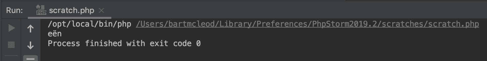
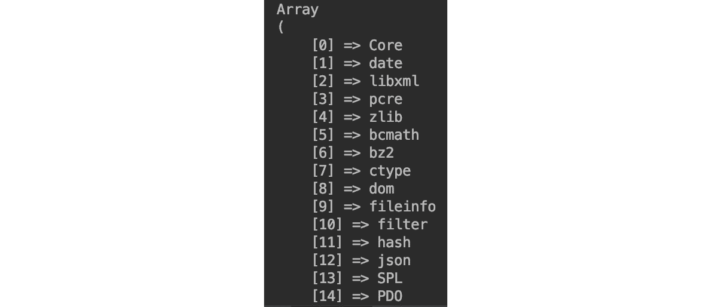
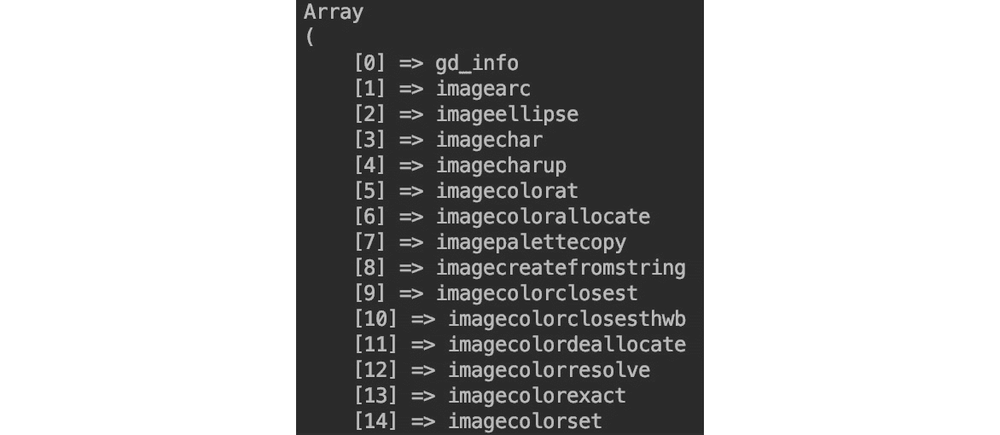
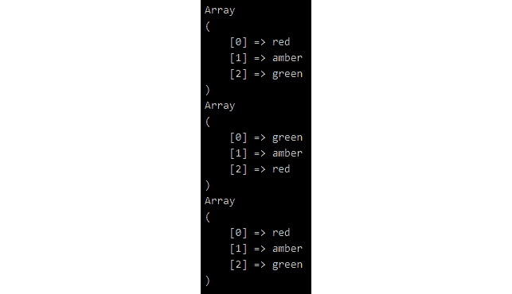
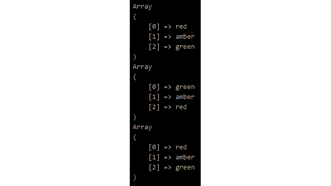
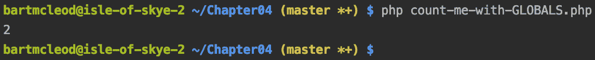
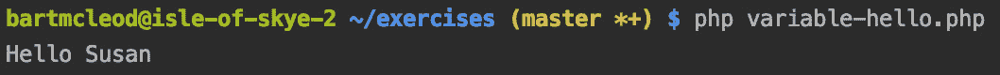
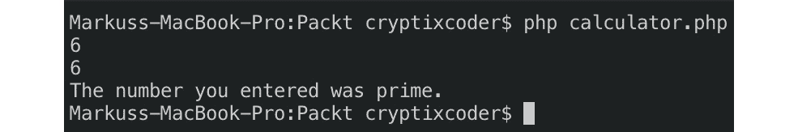

# 4. 函数

概述

到本章结束时，你将能够使用内置函数；创建用户定义的函数；并编写匿名函数。

# 简介

在编写软件时，我们经常遇到需要在构建的应用程序的不同地方执行特定任务的情况。如果不加思考，很容易养成反复重写相同代码的习惯，这会导致代码重复，并在错误出现时更难调试。然而，与其他所有编程语言一样，PHP 允许你以所谓的**函数**的形式结构化可重用代码，这有时也被称为方法。这两个术语将在本章中交替使用。

将函数视为一组可重用的指令或语句。一旦编写，你可以随意多次调用它。函数将本应不可分割地一起保留的逻辑捆绑在一起。

在函数内部分组和隔离一组指令带来了一系列好处。最明显的好处是可重用性：一旦你编写了函数，你永远不需要再次重写或重新发明这组特定的指令。函数还提高了一致性——这意味着每次你调用函数时，你可以确信将应用相同的指令集。

另一个不那么明显的优点是，你的代码变得更加易于阅读，尤其是当你给函数命名，使其清晰表明它们的功能时。

函数的另一个优点是它将局部变量包含在其作用域内，因此它们不会污染全局作用域。我们将在稍后更详细地讨论作用域。

这里是一个简单函数的示例：

```php
// simplest callable is a function
function foo()
{
}
```

这里有一个编写来计算传递给此函数的值的平均值的函数：

```php
// function that calculates the average of values that you pass to it
function average()
{
    $count = func_num_args();
    $total = 0;
    foreach (func_get_args() as $number) {
        $total += $number;
    }
    return $total / $count;
}
```

注意，这不是生产就绪的代码。该函数不检查其输入的任何内容，并且如果不传递任何参数，不会防止错误条件，例如除以零。`function-average.php` 文件包含了一个更详细的相同函数示例，你可以参考 GitHub 仓库。

函数是**可调用的**。然而，请注意，并非所有可调用项都是函数。函数可以调用其他函数，函数可以将函数传递给其他函数以供它们调用，并且函数可以创建函数。困惑了吗？继续阅读并查看示例，你会发现这并不复杂。

# 什么是可调用项？

简而言之，可调用项是你代码的一部分，你可以“调用”。当我们说你可以“调用”某物时，我们的意思是你可以告诉程序执行它。

可调用项可以在其后写上括号，例如，`functionName()`。

如前所述，函数是一种可调用类型，因此可以调用函数（即，你可以告诉程序执行它）。

例如，考虑以下用户定义的函数：

```php
function howManyTimesDidWeTellYou(int $numberOfTimes): string
{
    return "You told me $numberOfTimes times";
}
```

目前不必担心函数的细节——我们稍后会深入探讨。这个函数可以在你的代码的任何地方定义，但让我们假设它定义在一个名为 `how-many-times-did-we-tell-you.php` 的脚本中。

脚本的内容将如下所示：

```php
<?php
declare(strict_types=1);
function howManyTimesDidWeTellYou(int $numberOfTimes): string
{
    return "You told me {$numberOfTimes} times";
}
```

这个函数接受一个参数，`$numberOfTimes`，它必须是 `int`（整数）类型，并且它返回一个字符串。`int` 类型提示和 `string` 返回类型是可选的。我们将在本章后面讨论参数和返回值。现在，`function howManyTimesDidWeTellYou(int $numberOfTimes): string` 只是函数声明：它定义了函数。脚本本身目前什么也不做。

为了使这个函数真正能做些什么，我们需要从我们的代码中调用它。在同一个脚本文件中继续并调用我们刚刚定义的函数是完全有效的，如下所示：

```php
howManyTimesDidWeTellYou(1);
```

如果你打开一个终端并执行脚本，你将看不到任何输出。为什么？原因在于，虽然函数确实返回一个字符串，但它没有打印任何输出。要生成输出，你需要像以下这样 `echo` 函数的返回值：

```php
echo howManyTimesDidWeTellYou(1);
```

现在如果你执行这个脚本，你将看到输出。

通过在脚本所在的目录中从命令行调用它来执行脚本。你可以简单地输入以下文本并按 *Enter* 键：

```php
php how-many-times-did-we-tell-you.php 
```

输出如下：

```php
You told me 1 times
```

你会立即发现这个输出的一个问题：它是语法错误的。如果我们传递一个负整数呢？那么，输出在逻辑上也会是错误的。我们的函数目前还没有准备好投入生产。

函数的更详细示例以及如何调用它可以在 `how-many-times-did-we-tell-you.php` 文件中找到。

注意，你可以在函数内部使用 `echo` 来打印文本。然而，这会使函数的可重用性降低，因为它会在被调用时立即生成输出。在某些情况下，你可能想要延迟输出。例如，你可能在输出之前收集和组合字符串，或者你可能想要将字符串存储在数据库中，而不想在这个阶段显示它。尽管在函数内部直接打印通常被认为是不良的做法，但你将在像 WordPress 这样的系统中看到很多这样的例子。在生成输出是最重要的任务的情况下，从函数中打印可能是方便的。

## 练习 4.1：使用内置函数

这个练习是关于字符串操作。PHP 有许多内置的字符串操作函数。我们将在这里使用的是 `substr()`。像大多数其他内置函数一样，`substr()` 的行为可以通过传递各种参数来调整：

1.  创建一个名为 `Chapter04` 的新目录。然后，在其内部创建一个名为 `exercises` 的文件夹。

1.  在 `Chapter04/exercises` 目录中创建一个名为 `hello.php` 的文件。

1.  写入开头的脚本标签：

    ```php
    <?php
    ```

    开头标签告诉解析器，从这一点开始，我们写的内容是 PHP。

1.  编写指令，使用`substr()`从"Hello World"中提取并打印"Hello"：

    ```php
    echo substr('Hello World', 0, 5);
    ```

    `echo`命令打印其后语句的结果。该语句调用`substr`函数，并带有三个参数：字面字符串`Hello World`和字面整数`0`和`5`。这意味着"*从 0 开始给我五个输入字符串的字符*"。在 PHP 中，你可以将字符串视为几乎像数组一样，其中字符串中的每个字符都是一个元素。像许多其他编程语言一样，数组索引从零开始而不是一。如果你数一下字符，你会看到`H e l l o`是`Hello World`输入字符串的前五个字符。它们作为包含五个字符的新字符串从函数返回。

1.  可选地，在下一行，`echo`一个换行符，仅为了输出清晰：

    ```php
    echo PHP_EOL;
    ```

    `PHP_EOL`是一个预定义的常量，可以在正确的格式下输出换行符，适用于你所在的操作系统。使用这个常量可以使你的代码在不同操作系统之间更便携。

1.  打开终端并进入存放你的`hello.php`脚本的`Chapter04/exercises`目录，并使用以下代码执行文件：

    ```php
    php hello.php
    ```

    注意，`Hello`和换行符在终端中打印出来；这就是终端中的输出看起来像什么：

    ![图 4.1：将输出打印到终端

    ![img/C14196_04_01.jpg]

    图 4.1：将输出打印到终端

    注意

    如果你的路径与截图中的路径不同，不要担心，因为这将取决于你的系统设置。

1.  现在将代码更改为以下内容：

    ```php
    echo substr('Hello World', 5);
    ```

    再次运行脚本，注意输出现在是`World`（注意开头的空格）。发生的事情是，现在子字符串是从位置 5（第六个字符，空格）到字符串的末尾。

1.  将代码更改为：

    ```php
    echo substr('Hello World', -4, 3);
    ```

    运行脚本，注意输出将是`orl`。发生的事情是，现在开始是负数，从字符串的末尾向前计数。长度是`3`，从开始向字符串的末尾取：

    ![图 4.2：打印切片字符串

    ![img/C14196_04_02.jpg]

    图 4.2：打印切片字符串

    在前面的屏幕截图中，你可以看到*步骤 8*的输出。输出看起来是这个样子，因为我使用了 PhpStorm 中的临时文件。我添加了一个新的临时文件，并快速将代码粘贴进去，然后使用 PhpStorm 中的绿色播放按钮运行它。临时文件是在文件未添加到你的项目时快速测试一些代码的方法。

1.  将语句更改为以下内容：

    ```php
    echo substr('ideeën', -3);
    ```

    注意

    `Ideeën`是荷兰语单词，意为"想法"。然而，对于这个例子，我们需要`ë`字符，所以我们不能只输入"ideas"。

    再次运行脚本，注意输出是 `ën`。如果你一直很注意，你应该预期输出是 `eën`：它由三个字符组成，从 `start = -3` 开始计算，并从字符串的末尾向前计数直到字符串的末尾。那么，为什么在这个情况下输出是两个字符长而不是三个？解释是 `ë` 是一个多字节字符。如果你需要检查一个字符串是否是 UTF-8 编码，你可以使用一个额外的内置函数 `mb_detect_encoding`，将字符串作为第一个参数，将 UTF-8 作为第二个参数。`substr` 方法只计算字节，并不考虑长度超过一个字节的字符。现在，有一个解决方案：`mb_substr`。实际上，对于许多字符串操作函数，都有前缀为 `mb_` 的姐妹函数，以表示它们支持多字节字符。如果你总是使用这些方法的 `mb_` 版本，你将得到预期的结果。

1.  将语句更改为以下内容：

    ```php
    echo mb_substr('ideeën', -3);
    ```

    再次运行脚本，注意现在你得到了预期的输出 `eën`：

![图 4.3：打印切片字符串的输出]



图 4.3：打印切片字符串的输出

记住始终使用字符串操作函数的 `mb_*` 版本。

在本节中，我们介绍了可调用对象，并开始了解我们可用的内置函数。接下来，我们将更深入地探讨可调用对象的类型。

## 可调用对象的类型

有几种类型的可调用对象：

+   函数，例如 `mb_strtoupper`。

+   匿名函数或闭包。

+   存储函数名称的变量。

+   一个包含两个元素的数组，其中第一个元素是对象，第二个元素是你希望在该对象中调用的函数的名称，该函数以字符串的形式编写。这个示例可以在 `callables.php` 文档中找到。

+   定义了 `__invoke` 魔术方法的对象。

`__invoke` 方法是一个可以附加到类上的魔术函数，当将其初始化到变量中时，将使该分配的变量成为一个可调用的函数。以下是一个简单的 `__invoke` 方法的示例：

```php
<?php
// Defining a typical object, take note of the method that we defined
class Dog {
    public function __invoke(){
    echo "Bark";
    }
}
// Initialize a new instance of the dog object
$sparky = new Dog();
// Here's where the magic happens, we can now call this 
$sparky(); 
```

输出如下：

```php
Bark
```

在前面的示例中，我们声明了一个 `$sparky` 对象，并通过调用 `$sparky()` 将该对象作为函数执行。这个函数反过来调用了它的主要操作并打印了结果。

要验证某个东西是否是可调用的，你可以将其传递给内置的 `is_callable` 函数。如果其第一个参数是可调用的，该函数将返回 `true`，如果不是，则返回 `false`。实际上，`is_callable` 函数可以接受最多三个参数，这些参数会调整 `is_callable` 的行为。

尝试以下示例：

```php
// simplest callable is a function
function foo()
{
}
echo is_callable('foo') ? '"foo" is callable' : '"foo" is NOT a callable',   PHP_EOL;
// an anonymous function is also a callable
if (true === is_callable(function () {})) {
    echo 'anonymous function is a callable';
} else {
    echo 'anonymous function is NOT a callable';
}
```

你可以在 GitHub 仓库中的 `callables.php` 脚本中探索更多示例。

# 语言构造

`if` 和 `while`。类似于函数的语言构造在用法上与内置函数非常相似。如果你想打印一个字符串，你可以选择使用语言构造 `echo`；或者使用也是语言构造的 `print`。`echo` 和 `print` 之间有一些小的区别，其中 `echo` 是最常用的。在比较这两个时，`echo` 没有返回值，并且可以选择多个参数，而 `print` 返回一个可以在表达式中使用的值，并且只允许一个参数。`echo` 是两者中最灵活的，并且稍微快一点。语言构造可以带括号或不带括号使用。相比之下，可调用对象总是使用括号：

```php
// echo is a language construct
echo 'hello world'; // echo does not return a value
// print is also a language construct
print('hello world'); // print returns 1
```

两个语句都打印 `hello world`。在 C 语言中，语言构造的底层实现比函数更高效，因此执行速度更快。你可以使用括号与 `echo` 和 `print` 一起使用，但这不是强制性的。

# 内置函数简介

PHP 内置了许多函数，例如 `strtoupper`，它将输入字符串的字母转换为大写：

```php
echo strtoupper('Foo');
// output: FOO
```

PHP 本身就自带了大量函数。通过向 PHP 添加扩展，你可以添加更多内置函数和类。内置函数是在 C 语言中预编译的，因为 PHP 及其扩展都是用 C 语言编写的。

注意

如何添加扩展取决于你使用的操作系统。因此，在搜索时，始终将你的操作系统名称添加到搜索中，并确保首先查阅最新的结果，因为它们更有可能概述安装或编译扩展到 PHP 中的正确程序。

没有什么比花费数天时间编写一些功能，最后发现有一个内置函数能以五倍的速度完成同样的工作更令人沮丧了。因此，在编写自己的功能之前，尝试在 [`packt.live/2OxT91A`](https://packt.live/2OxT91A) 上搜索内置函数。如果你正在使用 IDE，一旦你在 PHP 文档中开始输入，内置函数就会通过自动完成建议。PHP 通常被称为粘合语言：它用于将不同的系统连接在一起。因此，有许多与数据库、文件资源、网络资源、外部库等通信的函数。

如果你正在使用一个由未安装或与你的 PHP 版本一起编译的扩展提供的函数，你将得到一个错误。例如，当 `GD` 没有安装时调用 `gd_info()` 将导致 `致命错误：未捕获的错误：调用未定义的函数 gd_info()`。顺便说一句，`GD` 是一个用于图像处理的库。

注意

顺便提一下，在许多实际项目中，我们处理多字节字符串。在处理多字节字符串时，你应该使用多字节安全的字符串操作函数。而不是使用 `strtoupper`，你会使用 `mb_strtoupper`。

## 查找内置函数

要找出你目前正在使用的 PHP 版本，打开终端，输入以下命令，然后按 *Enter* 键：

```php
php -v 
```

要找出系统上安装了哪些扩展，输入以下命令并按 *Enter* 键：

```php
php -m
```

这将列出当前在你的 PHP 安装中已安装和启用的所有扩展。你还可以使用内置的 `get_loaded_extensions` PHP 函数列出扩展。

要利用这一点，编写一个名为 `list-extensions.php` 的文件，内容如下：

```php
<?php
print_r(get_loaded_extensions());
```

按如下方式从命令行执行文件：

```php
php list-extensions.php
```

注意，如果你这样做，你将使用了两个内置函数：`print_r` 和 `get_loaded_extensions`。`print_r()` 函数以人类可读的形式打印其第一个参数。你可以使用第二个参数，一个 `true` 布尔值，来返回输出而不是将其打印到屏幕上。这样，你可以将其写入日志文件，例如，或者传递给另一个函数。

输出应该看起来像以下截图（注意，系统上的扩展可能不同）：




图 4.4：列出扩展

在探索内置函数和扩展时，你可能还会发现 `get_extension_funcs ( string $module_name ) : array` 函数很有用，你可以使用它来列出扩展提供的函数。通常，在扩展的文档中找到函数会更容易。

这是输出的一部分：

```php
print_r(get_extension_funcs('gd'));
```

输出如下：




图 4.5：列出顶级扩展

注意

你可以在 [`packt.live/2oiJPEl`](https://packt.live/2oiJPEl) 找到更多关于内置函数的信息。

## 参数和返回值

参数是在函数声明中写入的变量。参数是作为这些参数传递的值。返回值是函数完全执行后返回的值。在之前的例子中，`get_loaded_extensions` 没有带任何参数被调用：在 `get_loaded_extensions` 后面的大括号中没有内容。

`get_loaded_extensions()` 的返回值是一个包含在 PHP 中加载的扩展的数组 - 已安装并启用的扩展。该返回值被用作 `print_r` 的参数，它返回一个描述其输入的用户友好的字符串。为了澄清这一点，可以将 `list-extensions.php` 脚本重写如下：

```php
<?php
// get_loaded_extensions is called without arguments
// the array returned from it is stored in the variable $extensions
$extensions = get_loaded_extensions();
// the variable $extensions is then offered as the first argument to print_r
// print_r prints the array in a human readable form
print_r($extensions);
```

## 通过引用传递参数

对象参数总是通过引用传递。我们将在*第五章*，*面向对象编程*中进一步详细介绍对象，但为了给你一些背景信息，可以把对象想象成一个容器，它包含作用域变量和函数。这意味着，存在对象的内存地址会被传递到函数中，这样函数在需要时可以在内部找到实际的对象。如果函数修改了引用的对象，那么内存中持有的原始对象将反映这些更改。如果你想使用对象的副本来工作，你需要在工作之前使用`clone`关键字克隆对象。你可以把克隆想象成一个复制器，它会制作你想要复制的对象的精确副本。

`clone`关键字的用法示例可以在这里找到：

```php
$document = new Document();
$clonedDocument = clone $document;
```

如果需要在函数外部使用修改后的副本，你可以选择从函数中返回它。在以下示例中，`$document`成为一个包含`DomDocument`对象引用的变量：

```php
$document = new DomDocument();
```

使用标量变量参数时，函数的程序员决定参数是通过引用传递还是作为原始值的副本。请注意，只有变量可以通过引用传递。

标量变量是一个持有标量值的变量，例如以下示例中的`$a`：

```php
$a = 10;
```

与仅仅是`10`这样的整数值不同，标量可以是数字、字符串或数组。

如果你向期望引用的函数传递一个字面标量值，你会得到一个错误，指出只有变量可以通过引用传递。这是因为 PHP 解析器不持有标量的引用——它们只是它们自己。只有当你将标量赋值给变量时，该变量的引用才会存在。

## 通过引用传递标量变量

PHP 有许多在数组上工作的函数。它们在是否接受数组引用方面有很大差异。

考虑以下数组：

```php
$fruits = [
    'Pear',
    'Orange',
    'Apple',
    'Banana',
];
```

内置的`sort()`函数将前面的水果按字母顺序排序。数组是通过引用传递的。因此，在调用`sort($fruits);`之后，原始数组将按字母顺序排列：

```php
sort($fruits);
print_r($fruits);
```

输出应该如下：

```php
Array
(
    [0] => Apple
    [1] => Banana
    [2] => Orange
    [3] => Pear
)
```

与通过引用传递相反，`array_reverse`在其传入的数组副本上工作，并返回其元素顺序相反的数组：

```php
$reversedFruits = array_reverse($fruits);
// the original $fruits is still in the original order
print_r($reversedFruits);
```

输出如下：

```php
Array
(
    [0] => Banana
    [1] => Apple
    [2] => Orange
    [3] => Pear
)
```

对于更详细的示例，你可以参考 GitHub 上的`array-pass-by-reference.php`和`array-pass-a-copy.php`。

另一个你在现实生活中的代码中看到的例子是 `preg_match()`。这个函数会在字符串中匹配一个模式的出现，并将其存储在可选的 `&$matches` 参数中，该参数通过引用传递。这意味着在调用函数之前，甚至在你调用函数的过程中，你必须声明一个 `$matches` 变量。函数运行后，之前为空的 `$matches` 数组将被填充。模式是一个正则表达式。正则表达式值得拥有自己的章节，但本质是正则表达式定义了一个模式，解析器可以在字符串中识别该模式并将其作为匹配返回。`preg_match()` 函数如果模式存在于字符串中并且匹配，则返回 `1`，如果提供了 `matches`，则 `matches` 将包含实际的匹配：

```php
<?php
$text = "We would like to see if any spaces followed by three word characters   are in this text";
// i is a modifier, that makes the pattern case-insensitive
$pattern = "/\s\w{3}/i";
// empty matches array, passed by reference
$matches = [];
// now call the function
preg_match($pattern, $text, $matches);
print_r($matches);
```

输出如下：

```php
(
    [0] => wou
)
```

如你所见，第一个找到的匹配是存储在 `$matches` 中的单个匹配。如果你想找到所有跟随三个单词字符的空格，你应该使用 `preg_match_all()`。

为了演示如何简单地将 `preg_match` 函数更改为 `preg_match_all` 来返回所有匹配实例，我们将更改以下行：

```php
preg_match($pattern, $text, $matches);
...
```

我们将用以下代码替换它：

```php
preg_match_all($pattern, $text, $matches);
...
```

这将导致返回所有与我们的定义模式匹配的部分。

输出如下：

```php
(
    [0] => Array
        (
            [0] => wou
            [1] => lik
            [2] => see
            [3] => any
            [4] => spa
            [5] => fol
            [6] => thr
            [7] => wor
            [8] => cha
            [9] => are
            [10] => thi
            [11] => tex
        )
)
```

注意

要了解更多关于正则表达式的信息，请查看：[`packt.live/33n2y0n`](https://packt.live/33n2y0n)。

## 可选参数

你会注意到我们在很多例子中都使用了 `print_r()` 来显示变量的人性化表示，否则这些变量可能不会很有意义。让我们看一下以下数组：

```php
$values = [
    'foo',
    'bar',
];
```

使用 `echo $values;` 只会在屏幕上打印 `Array`，而 `print_r($values);` 会打印出我们可读的格式：

```php
Array
(
    [0] => foo
    [1] => bar
)
```

现在，假设你想要将 `$values` 的信息发送到屏幕以外的其他地方。这样做的原因可能是你想要发送有关错误的详细信息，或者你希望记录应用程序中的操作日志。在你发送的消息中，你希望包含有关 `$values` 内容的信息。如果你使用 `print_r` 来实现这一点，输出将不会出现在你的消息中，而是会被写入屏幕。这并不是你想要的。现在 `print_r` 的可选第二个参数就派上用场了。如果你在函数调用中传递第二个参数并设置为 `true`，输出将不会直接打印，而是由函数返回：

```php
$output = print_r($values, true);
```

`$output` 变量现在包含以下内容：

```php
"Array
(
    [0] => foo
    [1] => bar
)"
```

这可以在以后用来编写需要发送到任何地方的短信。

## 练习 4.2：使用 print_r()

在这个练习中，我们将使用 `print_r()` 函数以可读的格式打印不同的形状。为此，我们将执行以下步骤：

1.  让我们从在你的项目目录中创建一个新文件并命名为 `print_r.php` 开始。

1.  接下来，我们将使用开头标签打开我们的 PHP 脚本，并定义一个包含三个不同形状的 `$shapes` 变量：

    ```php
    <?php
         $shapes = [
                 'circle',
                 'rectangle',
                 'triangle'
         ];
    ```

1.  在下一行，让我们输出 `$values` 的内容：

    ```php
    echo $shapes;
    ```

1.  让我们打开项目目录并在终端中运行它：

    ```php
    php print_r.php
    ```

    你会看到打印出来的只有以下内容：

    ```php
    Array
    ```

    这是因为 `echo` 并未设计用于显示数组内容。然而，这正是 `print_r()` 发挥作用的地方。

1.  让我们用 `print_r` 替换 `echo`：

    ```php
    print_r($shapes);
    ```

    我们将使用以下命令运行脚本：

    ```php
    php print_r.php
    ```

    现在，我们可以这样看到数组的值：


图 4.6：打印数组的值

## 可变数量的参数

函数可以接受可变数量的参数。以 `printf` 为例，它用于从预定义的格式化字符串中打印文本字符串，并用值填充占位符：

```php
$format = 'You have used the maximum amount of %d credits you are allowed   to spend in a %s. You will have to wait %d days before new credits become   available.';
printf($format, 1000, 'month', 9);
```

这将打印以下内容：

```php
You have used the maximum amount of 1000 credits you are allowed to spend in a month. You will have to wait 9 days before new credits become available.
```

虽然 `$format` 是必需的参数，但其余参数是可选的，并且数量可变。这里的重要收获是你可以传递任意多的参数。

参数的数量必须与字符串中的占位符数量相匹配，但这仅适用于 `printf`。当允许参数数量可变时，函数的设计者需要决定是否要验证参数数量是否符合某些限制。

此外，还有 `sprintf` 函数，它的工作方式几乎相同；然而，它不是打印结果文本，而是从函数中返回它，以便你可以稍后使用输出。

你可能已经注意到占位符不同：`%d` 和 `%s`。这可以用作简单的验证：%d 期望一个数字，而 `%s` 接受任何可以转换为字符串的内容。

## 标志参数

在早期的示例中，我们使用 `sort()` 函数并只传递一个参数：我们希望排序的数组。该函数接受第二个参数。在这种情况下，第二个参数也被定义为标志，这意味着只接受某些预定义常数的值，称为标志。标志决定了 `sort()` 的行为方式。如果您想使用多个标志，则可以在每个标志之间简单地使用管道 (`|`) 符号。

现在让我们使用一个稍微不同的输入数组：

```php
$fruits = [
    'Pear',
    'orange', // notice orange is all lowercase
    'Apple',
    'Banana',
];
// sort with flags combined with bitwise OR operator
sort($fruits, SORT_FLAG_CASE | SORT_NATURAL);
print_r($fruits);
```

输出如下：

```php
Array
(
    [0] => Apple
    [1] => Banana
    [2] => orange
    [3] => Pear
)
```

数组现在按字母顺序排序，正如预期的那样。如果没有标志，排序将是大小写敏感的，`orange` 将排在最后，因为它是小写的。使用 `natcasesort($fruits)` 也可以达到相同的结果。请参阅 GitHub 上的 `array-use-sort-with-flags.php` 示例。

通常，在使用函数时，咨询有关使用额外参数的扩展功能的文档是一个好主意。通常，一个函数并不完全做你想要的事情，但可以通过传递额外的参数来实现。

## 练习 4.3：使用数组内置函数

在这个练习中，我们将看到 PHP 内置函数如何与数组一起工作：

1.  在 `Chapter04` 目录的 `exercises` 目录中创建一个名为 `array-functions.php` 的文件。

1.  输入开标签和创建名为 `$signal` 的数组的语句，该数组包含交通信号灯中的不同颜色：

    ```php
    <?php
    $signal = ['red', 'amber', 'green'];
    ```

1.  以人类可读的格式显示整数数组：

    ```php
    print_r($signal);
    ```

1.  使用以下命令执行脚本：

    ```php
    php array-functions.php
    ```

    输出如下：

    

    图 4.7：打印交通信号灯颜色数组

    注意在前面的输出中，数组元素是如何用颜色标记的，第一个元素位于索引 `0`，第三个元素位于索引 `2`。这些是在你没有声明自己的索引时的默认索引。

1.  使用 `array_reverse` 函数来反转数组：

    ```php
    $reversed = array_reverse($signal);
    ```

    `array_reverse()` 方法将反转数组元素的顺序，并将结果作为新数组返回，同时保持原始数组不变。

1.  打印反转后的数组：

    ```php
    print_r($reversed);
    ```

    执行 `php array-functions.php` 命令。

    输出看起来像以下截图：

    

    图 4.8：打印反转后的数组

    注意元素 `3` 现在是数组的第一个元素，索引为 `0`，元素 `1` 是最后一个。在索引 `2`，尽管数组已反转，但索引保持在原始数组中的相同位置。

1.  再次添加以下代码以打印原始数组：

    ```php
    print_r($signal);
    ```

    输出如下：

    

    图 4.9：打印数组

    这是为了演示原始数组不会被 `array_reverse` 改变。

1.  打开终端并转到你刚刚输入 `array-functions.php` 脚本所在的目录。运行脚本并按 *Enter*：

    ```php
    php array-functions.php
    ```

    观察到显示了三个数组。当数组中只有三个整数时，屏幕上的输出将类似于以下截图：

    

    图 4.10：打印三个数组

    第一个数组显示了你的整数数组，第二个是反转后的整数数组，第三个是未更改的原始数组，其中的整数按照你输入的顺序排列。

1.  将反转数组的语句更改为以下内容：

    ```php
    $reversed = array_reverse($signal, $preserve_keys = true);
    ```

    我们在这里所做的事情在 PHP 中并不总是可能的，但今天却是可能的：我们将 `true` 赋值给 `$preserve_keys` 变量，同时将其作为 `array_reverse` 的第二个参数传递。这样做的好处是自动记录我们正在进行的操作，并且如果需要，我们可以在以后重用该变量。然而，一般来说，这种类型的赋值很容易被忽略，如果你以后不需要该变量，可能最好只传递 `true`。你可能根据你正在构建的内容使用这种类型的赋值。

    仔细观察再次运行脚本时的输出：

    

    

    图 4.11：再次打印三个数组

    当你检查输出时，特别是中间的数组，你会注意到键已经被保留在反转后的数组中。确实，元素 `3` 现在是数组中的第一个元素，但请注意，索引 `2` 现在也是第一个索引。所以，`$integers[2]` 仍然包含 `3` 的值，而 `$integers[0]` 仍然持有 `1` 的值。

1.  现在让我们声明另一个 `$streets` 数组，包含一些街道的名称：

    ```php
    $streets = [
        'walbrook',
        'Moorgate',//Starts with an uppercase
        'crosswall',
        'lothbury',
    ];
    ```

1.  现在让我们使用与位或运算符结合的标志来对数组进行排序：

    ```php
    sort($streets, SORT_STRING | SORT_FLAG_CASE );
    print_r($streets);
    ```

    输出如下：

    ![图 4.12：按字母顺序打印数组

    ![img/C14196_04_12.jpg]

    图 4.12：按字母顺序打印数组

    在这种情况下，`sort()` 函数不区分大小写地排序字符串。

1.  如果我们使用位与运算符对数组进行排序，我们会看到以大写字母开头的街道名称移动到数组的顶部，其余的街道名称按字母顺序打印：

    ```php
    sort($streets, SORT_STRING & SORT_FLAG_CASE );
    print_r($streets);
    ```

    输出如下：

![图 4.13：打印数组顶部以大写字母开头的单词

![img/C14196_04_13.jpg]

图 4.13：打印数组顶部以大写字母开头的单词

在这个练习中，你看到了 PHP 的许多强大的数组操作函数之一在工作。你了解到这个函数——`array_reverse`——返回一个新的数组而不是修改原始数组。你可以推断出输入参数，即你的数组，不是通过引用传递的，因为否则原始数组会被反转所改变。你还了解到这个函数的第二个参数——`boolean $preserve_keys`——如果为 `true` 会改变函数的行为，使得元素保持在反转前的相同索引位置。你可以从这个推断出第二个参数的默认值是 `false`。然后我们探讨了如何使用 `sort` 函数以特定顺序排列数组的元素。

# 用户自定义函数简介

用户自定义函数是你或另一个用户编写的函数，不是 PHP 本身构建的。内置函数通常比执行相同操作的用户自定义函数更快，因为它们已经从 C 语言编译。在尝试编写自己的函数之前，总是先寻找内置函数！

## 函数命名

命名事物是困难的。尽量为你的函数选择描述性但不过于冗长的名称。非常长的函数名称是不可读的。当你阅读名称时，理想情况下应该能够猜出该函数的功能。PHP 中命名标识符的规则也适用于此处。函数名称不区分大小写；然而，按照惯例，你不会用与定义时不同的大小写来调用函数。说到惯例，你可以自由地以你喜欢的任何方式设计大小写，但通常有两种风格占主导地位：`snake_case()` 或 `camelCase()`。在所有情况下，做你团队同意的事情——一致性远比任何个人偏好都重要，无论这种偏好有多强烈。如果你可以自由选择编码规范，那么，请务必遵守 PHP-FIG 推荐的 PSR-1 标准（[`packt.live/2IBLprS`](https://packt.live/2IBLprS)）。尽管它指的是函数作为方法（如类方法），但你可以安全地假设这也适用于（全局）函数，本章就是关于这个的。这意味着如果你可以自由选择，你可以为函数选择 `camelCase()`。

不要重新声明内置函数（即不要在根命名空间中编写与内置函数同名的函数）。相反，给你的函数一个独特的名称，或者将其放入它自己的命名空间。最佳实践是永远不要使用现有函数的名称来命名你的函数，即使在你的命名空间内也不要，以避免混淆。

## 函数文档化

你可以在函数上方添加注释，这被称为 DocBlock。它包含以 `@` 符号作为前缀的注释。它还包含对函数功能的描述。理想情况下，它还描述了为什么需要这个函数：

```php
 /**
 * Determines the output directory where your files will 
 * go, based on where the system temp directory is. It will use /tmp as 
 * the default path to the system temp directory.
 *
 * @param string $systemTempDirectory
 * @return string
 */
function determineOutputDirectory(string $systemTempDirectory = '/tmp'): string { 
    // … code goes here
}
```

## 命名空间函数

`Date`。如果不同的库这样做，你不能同时使用这两个库，因为当第二次加载 `Date` 类时，PHP 会抱怨你不能重新声明 `Date` 类，因为它已经被加载了。

为了解决这个问题，我们使用命名空间。如果两个不同的库供应商使用他们的供应商名称作为命名空间，并在该命名空间内创建他们的 `Date` 类，那么名称冲突的可能性就小得多。

你可以把命名空间想象成某种前缀。比如说 `You` 和 `Me` 都是供应商，我们都想引入一个 `Date` 类。我们不会将类命名为 `MeDate` 和 `YouDate`，而是将它们创建在 `Me` 目录和 `You` 目录中的文件里。对于两个供应商，类文件都简单地称为 `Date.php`。在你的 `Date.php` 文件中，你将命名空间作为第一条语句（如果有严格类型声明，则在声明之后）写入：

```php
<?php
namespace You;
class Date{}
```

我们将编写一个 `Date.php` 文件，其起始部分如下：

```php
<?php
namespace Me;
class Date{}
```

现在，因为类生活在它们自己的命名空间中，它们有所谓的 `You\Date` 和 `Me\Date`。注意名称是不同的。你将在 *第五章*，*面向对象编程* 中了解更多关于命名空间的内容，因为它们对对象的影响比函数更大。

命名空间函数很少见，但它们是可能的。要在命名空间中编写函数，请在定义函数的文件顶部声明命名空间：

```php
<?php
namespace Chapter04;
function foo(){
    return 'I was called';
}
// call it, inside the same namespace:
foo();
```

然后在根命名空间（没有命名空间）的另一个文件中调用它：

```php
<?php
require_once __DIR__ . '/chapter04-foo.php;
// call your function
Chapter04\foo();
```

我们可以在单元测试的顶部使用 `use` 语句导入 `Chapter04` 命名空间：

```php
use Chapter04;
// later on in the test, or any other namespace, even the root namespace.
foo(); // will work, because we "use" Chapter04.
```

## 纯函数

纯函数没有副作用。不那么纯的函数会有副作用。那么，什么是副作用呢？嗯，当一个函数有副作用时，它会改变存在于函数作用域之外的东西。

## 作用域

你可以把作用域想象成一个“栅栏”，在这个栅栏内，变量或函数可以操作。在函数作用域内包括它的输入、输出以及函数体内提供的所有内容。函数可以将全局作用域中的内容拉入它们自己的作用域并修改它们，从而产生副作用。为了保持简单，当函数没有副作用时最好。当函数不试图改变它们所在的环境，而是专注于它们自己的职责时，查找错误和单元测试会更容易。

在函数外部声明的变量生活在全局作用域中，并在函数内部可用。在函数体内声明的变量在函数作用域之外不可用，除非做了额外的工作。

在以下示例中，使用了两种方法来演示如何使用全局作用域中的变量在函数内部：

```php
<?php
// we are in global scope here
$count = 0;
function countMe(){
    // we enter function scope here
    // $count is pulled from global scope using the keyword global
    global $count;
    $count++;
}
countMe();
countMe();
echo $count;
```

输出如下：

```php
2
```

函数被调用两次之后，`$count` 将具有 `2` 的值，这实际上是函数在单个脚本运行期间被调用的次数的计数。在下次运行之后，`$count` 变量将再次是 `2`，因为值在脚本运行之间不会被保留，也因为每次脚本运行时都会将其初始化为 `0`。无论如何，值在脚本运行之间不会保留，除非你明确地在文件或某种形式的缓存或其他持久化层中保留它们。

通常，函数没有副作用并且不干涉全局作用域会更好。

## $GLOBALS 超全局数组

全局变量始终在特殊的 `$GLOBALS` 超全局数组中可用。所以，我们可以在前面的例子中用 `$GLOBALS['count'];` 替代 `global` 关键字。

## 练习 4.4：使用 $GLOBALS 数组

在这个练习中，你将修改 `count-me-with-GLOBALS.php` 中的函数，使其不再使用 `global` 关键字，而是使用 `$GLOBALS` 超全局数组：

1.  再看看前面例子中使用的函数：

    ```php
    <?php
    // we are in global scope here
    $count = 0;
    function countMe(){
        // we enter function scope here
        // $count is pulled from global scope using the keyword global
        global $count;
        $count++;
    }
    ```

1.  将函数体的内容删除，使你的函数看起来像这样：

    ```php
    function countMe()
    {
    }
    ```

    函数现在是空的，什么也不做。

1.  在空函数体中添加一个新语句，该语句在`$GLOBALS`数组中增加`count`：

    ```php
    function countMe()
    {
        $GLOBALS['count']++;
    }
    ```

    函数现在与之前完全一样，但代码更少。

1.  调用`countMe()`函数两次。现在脚本应该看起来像`count-me-with-GLOBALS.php`中的脚本：

```php
count-me-with-GLOBALS.php
1  <?php
2  // declare global $count variable
3  $count = 0;
4  /**
5   * This function increments the global
6   * $count variable each time it is called.
7   */
8  function countMe()
9  {
10     $GLOBALS['count']++;
11 }
12 // call the function countMe once
13 countMe();
14 // and twice
15 countMe();
https://packt.live/323pJfR
```

当你运行脚本时，输出看起来像下面的屏幕截图。输出包括一个换行符和`$count`函数的值：



图 4.14：打印计数

## 单一职责原则

当一个函数只做一件事时——也就是说，当它只有一个职责时——它更容易使用，在重用时更可靠，也更容易测试。当你需要执行另一个任务时，不要将其添加到现有的函数中；而是写一个新的函数。

函数的语法如下：

```php
function [identifier] ([[typeHint][…] [&]$parameter1[…][= defaultValue]][,   [&]$p2, ..$pn]])[: [?]returnType|void] 
{
     // function body, any number of statements
     [global $someVariable [, $andAnother]] // bad idea, but possible
     [return something;]
}
```

不要被这个看似复杂的语法定义吓倒。函数实际上很容易编写，正如本章中的以下示例将向你展示的。

然而，现在让我们花些时间尝试分解这个语法。

## 函数关键字

`function`关键字告诉 PHP 解析器接下来的是函数。

## 标识符

标识符代表函数的名称。在这里，PHP 中标识符的一般规则将适用。需要记住的最重要的一点是，它不能以数字开头，也不能包含空格。它可以包含 Unicode 字符，尽管这相对较少见。然而，定义带有下划线的特殊、常用函数是很常见的：

```php
function __( $text, $domain = 'default' ) {
    return translate( $text, $domain );
}
```

这个函数用于在 WordPress 模板中翻译文本。其背后的想法是，你会立即发现这个函数是特殊的，你不会想自己写一个同名函数。它也非常容易输入，这对于常用函数来说很方便。正如你所看到的，它需要一个必需的参数`$text`来翻译。它还接受一个可选的`$domain`参数，其中定义了翻译，默认情况下是`default`域（在翻译中，`text`域用于区分可能对不同事物使用相同单词的不同领域，以便如果其他语言根据上下文有不同的单词，这些单词可以不同地翻译）。`__`函数是我们所说的翻译函数的包装器。它将其参数传递给`translate`函数，并返回`translate`函数的返回值。它输入更快，在模板中占用的空间更少，使模板更易于阅读。

## 类型提示

在函数声明中，类型提示用于指定参数的预期数据类型。自 PHP 5.0 起就存在对象类型提示，自 PHP 5.1 起就存在数组类型提示。标量类型提示自 PHP 7.0 起存在。可空类型提示自 PHP 7.1 起存在。`object` 类型提示自 PHP 7.2 起存在。考虑以下示例：

```php
function createOutOfCreditsWarning(int $maxCredits, string $period, int $waitDays): string
{
    $format = 'You have used the maximum amount of %d credits you are             
        allowed to spend in a %s. You will have to wait %d days before  
        new credits become available.';
    return sprintf($format, $maxCredits, $period, $waitDays);
}
```

在前面的示例中，有三个类型提示。第一个提示 `$maxCredits` 应该是一个整数。第二个提示 `$period` 应该是一个字符串，第三个提示 `$waitDays` 必须是一个整数。

如果类型提示前有一个问号，例如 `?int`，这表示参数必须是提示的类型或 `null`。在这种情况下，提示的类型是 `integer`。这自 PHP 7.1 起就可行了。

## 带类型提示的扩展操作符（…）

扩展操作符（`…`）是可选的，表示参数必须是一个只包含提示类型元素的数组。尽管它自 PHP 5.6 起就存在，但它是一个很少使用但非常强大和有用的特性，可以使你的代码更加健壮和可靠，同时代码量更少。不再需要检查同构数组的每个元素。当你使用这种类型提示定义参数时，你还需要用扩展操作符来调用函数。

以下是一个虚构的函数示例，我编造了这个示例来演示扩展操作符的使用。`processDocuments` 函数使用 **可扩展样式表语言转换**（**XSLT**）转换 XML 文档。虽然当你需要转换文档时这确实很有趣，但它对于扩展操作符的演示并不重要。

扩展操作符是函数签名中 `$xmlDocuments` 前的三个点。这意味着 `$xmlDocuments` 必须是一个只包含 `DomDocument` 提示类型对象的数组。`DomDocument` 提示类型是一个可以加载和保存 XML 的对象。它可以由 `XsltProcessor` 类的对象处理，以将文档转换为另一个文档。PHP 中的 `XsltProcessor` 非常强大且性能出色。你甚至可以在你的 XSL 样式表中使用 PHP 函数。然而，这个巧妙的功能应该谨慎使用，因为它将使你的 XSL 样式表对其他处理器无效，因为它们不知道 PHP。

函数的返回类型是 `Generator`。这是由于 `foreach` 循环内部的 `yield` 语句引起的。`yield` 语句使函数在值（在我们的例子中是一个文档）可用时立即返回每个值。这意味着它在内存使用上很高效：它不会将对象保留在数组中以一次性返回它们，而是在创建后立即逐个返回。这使得生成器在处理大型集合时非常高效，同时使用更少的内存资源：

```php
function processDocuments(DomDocument … $xmlDocuments):Generator
{
    $xsltProcessor = new XsltProcessor();
    $xsltProcessor->loadStylesheet('style.xslt');
foreach($xmlDocuments as $document){
     yield $xsltProcessor->process($document);
    }
}
```

前面的函数可能看起来相当令人困惑，但它相当简单。让我们从扩展运算符的使用开始；这用于表示参数将作为数组传递。此外，参数被类型提示为 `DomDocument` 对象，这意味着参数将是一个 `DomDocument` 对象的数组。接下来是函数，我们定义一个新的 `XsltProcessor` 实例并为其加载一个样式表。请注意，这是一个概念示例，有关 `XsltProcessor` 和样式表的信息可以在 PHP 文档中找到，网址为 [`packt.live/2OxT91A`](https://packt.live/2OxT91A)。最后，我们使用 `foreach` 循环遍历文档数组，并对每个文档的 `process` 方法的结果进行迭代。由于文档处理可能很耗费内存，如果可以想象将大量文档传递给此函数，那么生成器的用法就显而易见了。

要调用此函数，请使用以下代码：

```php
// create two documents and load an XML file in each of them
$document1 = new DomDocument();
$document1->load($pathToXmlFile1);
$document2 = new DomDocument();
$document2->load($pathToXmlFile2);
// group the documents in an array
$documents = [$document1, $document2];
// feed the documents to our function
$processedDocuments = processDocuments(…$documents);
// because the result is a Generator, you could also loop over the 
// result:
foreach(processDocuments(…$documents) as $transformedDocument) {
     // .. do something with it
}
```

## 用户定义函数中的参数

当定义一个函数时，你可以为它定义参数。当你定义一个参数时，考虑它是否应该始终是同一类型，或者你是否可以强制使用你代码的开发者始终传递同一类型。例如，当期望整数值时，使用 `int` 类型的类型提示是一个好主意。即使开发者传递 `2`，这是一个字符串，他们也可以很容易地被教育在传递给函数之前将其转换为整数，使用 `(int) "2"`。更现实的情况是，`2` 会被存储在一个变量中。所以，现在你有一个类型提示：

```php
int
```

接下来，你应该为你的参数想出一个好的名字。理想情况下，它应该是描述性的，但不要太长。当你期望一个 `DomDocument` 对象时，`$domDocument`、`$xmlDocument` 或简单地 `$document` 可以是合适的名字，而 `$doc` 可能对一些人来说太短且容易混淆，而 `$d` 则太糟糕：

```php
int $offset
```

`$offset` 的默认值有意义吗？在大多数情况下，它将是 `0`，因为我们通常在某个事物的开始处启动一个过程。所以，在这种情况下，`0` 将是一个很好的默认值：

```php
int $offset = 0
```

现在我们有一个类型提示为 `int` 且默认值为 `0` 的参数。该参数现在是可选的，并且应该在非可选参数之后定义。

如果无法期望参数始终是同一类型，则在函数中处理它可能更困难，因为你可能需要检查其类型以决定如何处理它。这使得对函数进行单元测试更困难，如果出现问题，它还会使故障查找复杂化，因为你的代码将根据输入类型具有多个执行路径。

当一个参数以 `&` 前缀开头时，这意味着如果传递一个标量，它将通过引用传递，而不是作为副本或字面量。对象总是通过引用传递，因此，在对象参数上使用 `&` 是多余的，并且不会改变函数的行为。

## 用户定义函数中的返回类型

返回类型以冒号后跟类型名称的形式编写。返回类型是在 PHP 7 中引入的。这使得你的代码更加健壮，因为你更明确地知道你期望从函数中得到什么，这可以在编译时进行检查，而不是在运行时出错时失败，这可能在生产环境中发生。如果你使用 IDE，它将在返回类型与实际返回或期望的内容不匹配时警告你。这意味着你可以在错误影响你的用户之前纠正错误。

在前面的例子中，`processDocuments` 函数的返回类型是 `Generator`。`Generator` 类型生成值并在可能的情况下尽快提供它们。这可以非常高效：你不需要等待所有值都可用才开始进一步处理。你可以在 `Generator` 类型产生第一个值时立即开始进一步处理。每次使用 `yield` 语言结构时，`Generator` 类型都会产生一个值。

`yield` 在 PHP 5 中被引入。在撰写本文时，我们处于 PHP 7.3，仍然有许多开发者从未使用过 `yield` 或甚至不知道它是什么。例如，当你处理数组或数据库中的记录，并且需要极端性能时，考虑你是否有一个适用于 `Generator` 类型的用例。

你可以使用 `void` 作为返回类型来表示函数没有返回任何内容。

## 签名

函数声明的一部分被称为 **签名**：

```php
([typeHint [&]$parameter1[= defaultValue], [&]$p2, …])[: returnType]
```

因此，函数的签名定义了它的参数和返回类型。

## 返回值

函数可能返回一个值或没有。当函数不返回任何内容，甚至不是 `null` 时，从 PHP 7.1 开始，返回类型可以是 `void`。通过键入 `return` 后跟你想返回的内容来返回值。这可以是任何有效的表达式，也可以是一个单独的变量或字面量：

```php
return true;
return 1 < $var;
return 42;
return $documents;
return; // return type will be "void" if specified
return null; // return type must be nullable if specified
```

## 参数和参数

函数接受参数。参数是一个字面量、变量、对象，甚至是可调用的，你将其传递给函数以便函数可以对其操作。如果参数在参数的位置被定义，你可以在函数内部使用参数的名称来使用该参数。参数的数量可能是可变的或固定的。*PHP 允许你传递比函数签名定义的更多参数*。如果你想使用动态参数，PHP 有两个内置函数可以实现这一点；你可以使用 `func_num_args()` 获取参数的数量，以及使用 `func_get_args()` 获取参数本身。为了展示这些函数的实际应用，我们将查看一个例子。

这里是一个使用 `func_num_args()` 的例子。在这个例子中，我们定义了一个没有任何预定义参数/参数的方法。但是，使用内置的 `func_num_args` 函数，我们将能够计算传递了多少个参数/参数：

```php
function argCounter() {
   $numOfArgs = func_num_args();
    echo "You passed $numOfArgs arg(s)";
}
argCounter(1,2,3,4,5);
```

输出如下：

```php
You passed 5 arg(s)
```

现在我们能够计算参数的数量，我们可以将此函数与`func_get_args()`结合使用来循环查看传递了什么。以下是一个使用`func_get_args()`的示例：

```php
function dynamicArgs(){
     $count = func_num_args();
     $arguments = func_get_args();
     if($count > 0){
           for($i = 0; $i < $count; $i++){
                echo "Argument $i: $arguments[$i]";
                echo PHP_EOL;
           }
     }
}
dynamicArgs(1,2,3,4,5);
```

输出如下：

```php
Argument 0: 1
Argument 1: 2
Argument 2: 3
Argument 3: 4
Argument 4: 5
```

## 可选参数

当函数为它们定义了默认值时，函数参数是可选的：

```php
function sayHello($name = 'John') {
    return "Hello $name";
}
```

此函数定义了一个参数`$name`，默认值为`John`。这意味着在调用函数时，你不需要提供`$name`参数。我们说`$name`参数是可选的。如果你不提供`$name`参数，`John`仍然会被传递给`$name`参数。可选参数应该在函数签名中定义在最后，因为否则，如果任何必需参数在可选参数之后，你仍然需要在调用函数时提供可选参数。

示例在`function-with-default-value.php`中。各种用法在`TestSayHello.php`单元测试中有文档说明。

## 通过引用传递给我们的函数的参数

记得`countMe`函数吗？它使用一个名为`$count`的全局变量来跟踪函数被调用的次数。这也可以通过引用传递`$count`变量来实现，这比在函数内部污染全局作用域稍微好一些：

```php
<?php
function countMeByReference(int &$count): void
{
    $count++;
}
```

在同一脚本中进一步使用它，如下所示：

```php
$count = 0;
countMeByReference($count);
countMeByReference($count);
countMeByReference($count);
echo $count; // will print 3
```

请注意，在定义的地方调用方法非常适合练习和玩代码，也适合简单的脚本，但实际上这样做违反了 PSR-1。这是一个编码约定，指出文件要么定义函数（不产生副作用），要么使用它们（产生副作用）。

## 参数的默认值

在以下示例中，我们展示了默认值的使用。通过定义默认值，你给使用该函数的开发者提供了使用该函数而不必传递他们自己的值的能力。

考虑以下示例：

```php
/**
 * @param string $systemTempDirectory
 * @return string
 */
function determineOutputDirectory(string $systemTempDirectory = '/tmp'): string
{
    return $systemTempDirectory . DIRECTORY_SEPARATOR . 'output';
}
```

在括号内是函数签名，它由一个参数`$systemTempDirectory`组成，类型提示为`string`，默认值为`/tmp`。这意味着如果你在函数调用中传递一个目录，它必须是一个字符串。如果你不传递参数，将使用默认值。

## 练习 4.5：编写一个加法函数

现在你已经阅读了一些关于编写你自己的函数的理论，让我们开始实际编写一些自己的函数。在这个练习中，我们将创建一个简单的函数，用于将两个数字相加并打印其和：

1.  在`Chapter04/exercises/`中找到`add.php`文件。

1.  在文件中开始键入以下注释并键入函数模板：

    ```php
    <?php
    function add($param1, $param2): string
    {
    }
    ```

    你从`function`关键字开始；然后是函数名，`add`；左大括号；`$param1`和`$param2`参数；右大括号；冒号来宣布返回类型；返回类型，`string`；最后是函数体，`{}`。

1.  在函数体内，使用`is_numeric()`检查参数是否为数值。这个内置函数如果其参数表示一个数值（即使其类型是`string`），则返回`true`。所以，它会对`23`、`0.145`和`10E6`等返回`true`。后者是 1,000,000 的科学记数法：

    ```php
    if (false === is_numeric($param1)) {
        throw new DomainException('$param1 should be numeric.');
    }
    if (false === is_numeric($param2)) {
        throw new DomainException('$param2 should be numeric.');
    }
    ```

    当值不是数字且无法相加时，我们会抛出一个异常。现在不用担心异常，它们将在下一章中解释。

1.  现在你已经可以确信这两个值都是数值，并且可以相加而不会出现意外结果，现在是实际相加它们的时候了。继续在函数体内输入：

    ```php
    $sum = $param1 + $param2;
    ```

1.  现在是时候编写请求的消息了。在下一行，输入以下内容：

    ```php
    return "The sum of $param1 and $param2 is: $sum";
    ```

    你在这里看到的是称为`$param1`、`$param2`和`$sum`的变量，它们将被扩展成字符串句子。它们也将自动转换为字符串。

1.  字符串插值，虽然非常快，但对于 PHP 解析器来说仍然是一个相对昂贵的操作。如果你需要在一个每个纳秒都很重要的用例中最大化性能，那么使用*字符串连接*会更好，因为它更快。以下是使用字符串连接编写的相同行：

    ```php
    return 'The sum of ' . $param1 . ' and ' . $param2 ' . '  is: ' . $sum;
    ```

    点（`.`）是字符串连接运算符。它将两个字符串粘合在一起。在连接发生之前，其他类型的值将自动转换为字符串。

1.  现在你可以在函数后面写以下内容：

    ```php
    echo add(1, 2);
    ```

1.  添加换行以使输出更清晰：

    ```php
    echo PHP_EOL;
    ```

1.  从`exercises`目录运行脚本：

    ```php
    php add.php
    ```

    输出如下：


图 4.15：打印求和结果

在这个练习中，你学习了如何验证和处理函数的参数，以及如何格式化和返回一些输出。你还学习了如何使用 PHP 进行一些非常简单的数学运算。

## 变量函数

如果你将函数名存储在一个变量中，你可以将这个变量作为函数来调用。以下是一个示例：

```php
$callable = 'strtolower';
echo $callable('Foo'); // will print foo;
```

这不仅限于内置函数。实际上，你可以用你自己的函数做同样的事情。

## 匿名函数

这些是没有标识符的函数（参考以下语法）。它们可以被传递给任何接受可调用对象作为输入的函数。考虑以下示例：

```php
function(float $value): int{
    if (0 <= $value) {
        return -1; // this is called an early return
    }
    return 1;
}
```

前面的是一个匿名函数，也称为闭包。它没有名字，所以不能通过名字来调用，但它可以被传递给另一个接受可调用对象作为输入的函数。

如果你想要调用匿名函数，有两种方法可以实现这一点：

```php
echo (function(float $value): int{
    if (0 <= $value) {
        return 1;
    }
    return -1;
})(2.3);
```

在前面的例子中，函数被创建并立即使用`2.3`参数调用。返回的输出将是`1`，因为`2.3`大于`0`。然后`echo`打印输出。在这个设置中，匿名函数只能调用一次——没有引用可以让你再次调用它。

在下一个例子中，函数将被存储在一个名为`$callable`的变量中。你可以将变量命名为任何你喜欢的名字，只要遵守 PHP 中变量命名的规则：

```php
$callable = function(float $value): int{
    if (0 <= $value) {
        return 1;
    }
    return -1;
}; // here semicolon is added as we assign the function to $callable variable.
echo $callable(-11.4); // will print -1, because -11.4 is less than 0.
```

## 在匿名函数内部使用作用域外的变量

如本章之前所述，你可能需要使用在定义的函数作用域之外定义的变量。在下面的练习中，你将看到一个例子，说明我们如何使用`use`关键字将变量传递给匿名函数。

## 练习 4.6：处理匿名函数

在这个练习中，我们将声明一个匿名函数并检查其工作方式：

1.  创建一个名为`callable.php`的新文件。如下添加你的 PHP 开头标签：

    ```php
    <?php
    ```

1.  然后，定义你想要使用的初始变量：

    ```php
    $a = 15;
    ```

1.  现在定义你的可调用函数并将你的`$a`变量传递给它：

    ```php
    $callable = function() use ($a) {
        return $a;
    };
    ```

1.  在下一行，让我们给`$a`赋予一个新的值：

    ```php
    $a = 'different';
    ```

1.  要查看`$a`的当前值，我们将调用`$callable`并将其打印到屏幕上：

    ```php
    echo $callable();
    ```

1.  最后，为了可读性，添加一个新行：

    ```php
    echo PHP_EOL;
    ```

1.  我们现在可以使用以下命令在命令行中运行此脚本：

    ```php
    php callable.php 
    ```

    输出如下：

    ```php
    15
    ```

    那么，这里发生了什么？首先，我们声明一个匿名函数并将其存储在`$callable`中。我们通过使用`use`关键字来说明它应该使用`$a`。然后，我们将`$a`的值更改为`different`，调用我们的`$callable`函数，然后`echo`结果。结果是`15`，这是`$a`的初始值。这是因为当使用`use`将`$a`导入函数的作用域时，`$a`将正好按函数创建时的状态使用。

    现在我们使用`$a`作为引用会发生什么？让我们看看：

    ```php
    <?
    $a = 15;
    $callable = function() use (&$a) {
        return $a;
    };
    $a = 'different';
    echo $callable(); // outputs 'different'
    // newline for readability
    echo PHP_EOL;
    ```

    注意这次我们在`$a`前加上了`&`。现在输出将是"`different`"。

由于对象总是通过引用传递，这也应该适用于对象，但这将在另一章中介绍。

## 练习 4.7：创建变量函数

在这个练习中，我们将创建变量函数并检查它们在 PHP 中的工作方式：

1.  打开一个文件，并将其命名为`variable-hello.php`。以 PHP 开头标签开始你的脚本，并将严格类型设置为`1`：

    ```php
    <?php
    declare(strict_types=1);
    ```

1.  声明一个变量来存储函数的值，如下所示：

    ```php
    $greeting = function(string $name): void 
    {
        echo 'Hello ' . $name;
    };
    ```

    这就是你需要做的，甚至更多，因为你添加了`string`类型提示和`void`返回类型，这两者都是可选的。它们是良好的实践，所以养成使用它们的习惯。请注意，闭包不返回输出。相反，它直接将问候打印到`stdOut`。

1.  现在继续在`variable-hello.php`脚本中输入：

    ```php
    $greeting('Susan');
    ```

1.  添加一个换行符：

    ```php
    echo PHP_EOL;
    ```

1.  验证终端上的输出为 `Hello Susan`：



图 4.16：打印输出

在这个练习中，你学习了如何使用字符串连接与函数参数以及如何直接从函数中打印输出。虽然这在许多情况下是一种不好的做法，但在其他情况下可能很有用。

## 练习 4.8：函数的玩耍

在这个练习中，我们将使用一些预定义的函数来了解数据处理和编写我们的处理器，以便它们是可重用的。这个练习的目标是取一个导演和他们的电影数组，并按导演的姓名进行排序。然后我们想要处理这个数组，并打印出第一个名字的首字母大写且姓氏全部大写的导演的姓名。此外，对于电影，我们想要将每个标题大写，用双引号包裹，并用逗号分隔。我们将构建两个函数来处理导演的姓名，另一个函数用于电影。我们将使用三个我们尚未讨论的新内置函数：`ksort`、`explode` 和 `implode`。要了解更多关于这些函数的信息，请查阅[`packt.live/2OxT91A`](https://packt.live/2OxT91A)上的文档：

1.  首先，我们将创建一个名为 `activity-functions.php` 的新文件，并使用 PHP 开头标签开始我们的脚本：

    ```php
    <?php
    ```

1.  然后，我们将继续定义一个数组，该数组将导演的姓名作为键，将他们的电影列表作为值：

    ```php
    activity-functions.php
    2  $directors = [
    3      'steven-spielberg' => [
    4          'ET',
    5          'Raiders of the lost ark',
    6          'Saving Private Ryan'
    7      ],
    8      'martin-scorsese' => [
    9          'Ashes and Diamonds',
    10         'The Leopard',
    11         'The River'
    12     ],
    https://packt.live/2p9Zbe6
    ```

1.  现在我们将编写我们的第一个函数来处理导演的姓名。记住，我们想要第一个名字的首字母大写，而姓氏将全部大写：

    ```php
    function processDirectorName($name){
         $nameParts = explode('-', $name);
         $firstname = ucfirst($nameParts[0]);
         $lastname = strtoupper($nameParts[1]);
         return "$firstname $lastname";
    }
    ```

1.  接下来，我们将编写一个函数来处理我们的电影字符串。请注意，我们想要将每个电影名称的大写版本包裹起来，并用逗号分隔：

    ```php
    function processMovies($movies)
    {
        $formattedStrings = [];
        for ($i = 0; $i < count($movies); $i++) {
            $formattedStrings[] = '"' . strtoupper($movies[$i]) . '"';
        }
        return implode(",", $formattedStrings);
    }
    ```

1.  最后，我们可以通过数组键对数组进行排序，并遍历处理数组：

    ```php
    ksort($directors);
    foreach ($directors as $key => $value) {
        echo processDirectorName($key) . ": ";
        echo processMovies($value);
        echo PHP_EOL;
    }
    ```

1.  我们现在可以在终端中运行此脚本：

    ```php
    php activity-functions.php
    ```

    你应该看到以下输出：

    ```php
    Felix GARY: "MEN IN BLACK: INTERNATIONAL","THE FATE OF THE FURIOUS","LAW ABIDING CITIZEN"
    Kathryn BIGELOW: "DETROIT","LAST DAYS","THE HURT LOCKER"
    Martin SCORSESE: "ASHES AND DIAMONDS","THE LEOPARD","THE RIVER"
    Steven SPIELBERG: "ET","RAIDERS OF THE LOST ARK","SAVING PRIVATE RYAN"
    ```

    注意

    输出中截断了 `Felix Gary Gray` 的第三部分。你能重构代码来修复这个错误吗？

## 活动 4.1：创建计算器

你正在开发一个基于计算器的网络应用程序。你被提供了所有用户界面代码，但被指示构建实际执行计算的函数。你被指示创建一个单一的可重用函数，用于应用程序中需要的所有计算。

以下步骤将帮助您完成活动：

1.  创建一个函数，该函数将计算并返回输入数字的阶乘。

1.  创建一个函数，该函数将返回输入数字（可变数量的参数）的总和。

1.  创建一个函数，该函数将评估 `$number` 输入，该输入必须是整数，并将返回该数字是否为素数。该函数的返回类型是布尔值 (`bool`)。

1.  创建一个基本的`performOperation`函数，该函数将处理预定义的数学运算。`performOperation`函数的第一个参数必须是一个字符串，可以是"`factorial`"、"`sum`"或"`prime`"。其余参数作为参数传递给被调用的数学函数。

    注意

    阶乘是一个整数与其所有小于它的整数的乘积。

输出应类似于以下内容。输出值将取决于你输入的数字：



图 4.17：预期输出

注意

本活动的解决方案可以在第 511 页找到。

# 摘要

在本章中，你学习了如何使用 PHP 内置的函数来完成许多其他情况下需要编写大量代码才能快速完成的任务。你还学习了编写自己函数的各种方法：带参数和不带参数，使用默认值或不使用默认值，甚至带有不同数量的参数。你了解了纯函数（不干涉全局作用域的函数）与具有副作用（因为它们从全局作用域中拉取变量或通过引用接收参数并更改它们）的函数之间的区别。你学习了可以通过名称或作为存储在变量中的可调用对象来调用函数，可以是匿名调用或命名调用。希望你已经尝到了函数的灵活性和强大功能，以及它们如何通过强制严格类型来帮助你编写健壮的代码。

在下一章中，你将学习如何将逻辑上属于一起的常量、变量和函数组合成对象。这将使你的代码组织达到更高的层次，并通过限制对象中变量和函数的访问级别，将信息隐藏提升到新的水平。请记住，我们称存在于对象属性上的变量为属性变量，称存在于对象上的函数为方法，而存在于对象上的常量称为类常量。尽管它们的名称不同，但它们的行为非常相似，因此你将能够重用本章中学到的所有内容。
