# 5. 面向对象编程

概述

到本章结束时，你将能够声明具有常量、属性和方法类的类；实例化一个类；处理构造函数和析构函数；实现类继承、访问修饰符、静态字段和方法；使用类类型提示作为依赖注入；使用属性和方法重写；通过魔术方法应用属性和方法重载；使用最终类和方法；自动加载类；以及使用特性和应用命名空间。

总结来说，我们将探讨可以用来编写模块化代码的**面向对象编程**（**OOP**）概念。

# 简介

为了理解**面向对象编程**（**OOP**）方法，我们首先应该讨论过程式编程方法。过程式方法是在高级语言中编写代码的传统方式，其中问题被视为一系列要执行的事情，如行走、吃饭、阅读等。可以编写多个函数来完成这些任务。过程式方法将一组计算机指令组织成称为过程（也称为函数）的组。因此，函数是代码中的第一公民。当我们如此关注函数时，随之而来的是数据得到的关注较少。

在多函数程序中，尽管函数可以包含局部数据，但许多重要数据被定义为全局数据。多个函数可能会操作这样的全局数据，因此数据可能会变得脆弱。此外，这种方法可能不会建立一个安全的方式来使用函数与数据交互。

以下图展示了函数如何操作全局数据以及它们如何相互交互：


图 5.1：过程式方法中的数据和函数

现在，面向对象的方法提供了一系列不同的方式来保护数据，通过将数据与函数更紧密地绑定，从而防止外部函数对数据的意外修改。这种方法本质上允许我们将一个大问题分解成称为对象的小实体，并将数据和函数打包到这样的对象中。以下图展示了数据和函数是如何组织到对象中的：


图 5.2：面向对象方法中的数据和函数

一种编程方法应该解决主要问题，例如如何在程序中表示现实生活中的问题实体，如何设计具有标准接口的程序以与函数交互，如何将程序组织成多个模块以便以后重用和扩展，如何向这些模块添加新功能，等等。面向对象的方法是为了解决这些问题而开发的。

# 面向对象方法

在编程中，一个可描述的事物，具有一组特定的动作，可以被称为对象。一个对象可能代表一个具有一定数量动作执行的现实生活实体。可以用某些状态来描述狗，如颜色、品种、年龄等，并执行某些动作，如吠叫、奔跑、摇尾巴等。台式风扇可以用颜色、速度、方向等来描述，并执行改变速度、改变方向、旋转等动作。

在面向对象编程中，数据和代码被捆绑成一个实体，称为对象。对象之间相互交互。考虑一个教师对象和一个学生对象。教师可能有一些科目可以提供，学生可能注册这些科目。因此，如果我们考虑注册是学生的一个动作，那么学生对象可能需要与教师对象就可用科目进行交互，并注册一个或多个科目。简单来说，对象是执行动作的数据。

将代码打包成对象有其自身的好处，例如你的代码库变得更加模块化，这意味着你可以单独针对对象进行维护、重用和调试。对象的实现（代码）对外界是隐藏的，这意味着我们可以隐藏我们的数据和内部复杂性，并且可以通过一套标准的程序与对象交互。例如，为了使用台式风扇，你不需要了解交流电机或电子电路；相反，你可以通过提供的行为来使用台式风扇，例如速度控制按钮或旋转控制。因此，隐藏此类信息是面向对象编程的另一个重要方面。

这种代码打包也区分了面向对象编程和过程式编程。一个对象简单地包含属性，也称为数据，以及一些与该对象通信的方法。这些方法是过程式编程的功能。在面向对象编程中，这些方法中的一些可以用来与该对象交互，因此这些方法构成了它的接口。

有许多著名的编程语言支持面向对象编程，例如 C++、Java、PHP、Python、C#、JavaScript、Ruby、Dart、Swift、Objective-C 等等。自从 PHP 引入其最新版本以来，PHP 支持完整的面向对象模型。PHP 支持基于类的对象初始化、构造函数和析构函数、继承、属性可见性、多态、抽象和最终类、静态字段和方法、匿名类、接口、命名空间、魔术方法、对象克隆、对象比较、类型提示、特性等许多有趣的面向对象技术和工具。我们将在本章中讨论它们，并使用不同的示例来实践面向对象编程的概念。

## 面向对象概念

面向对象的方法使用以下列表中给出的通用概念来解决编程问题。在本章中，我们将详细讨论这些概念，并通过一系列练习来实践它们，以便在章节结束时，我们将习惯于使用这些概念：

+   对象是有数据和接口的实体。它们可能代表一个人、一辆车、一个电风扇，或者可能是一个在我们的程序中扮演角色的银行账户。数据和函数（或方法）共同存在于一个对象中。

+   类是对象创建的模板。数据是对象的描述，而函数是那个对象的行为，因此可以使用类来编写数据和方法的定义。类可以被称为自定义数据类型。

+   数据封装是将数据和函数封装成一个单一单元——即类。想象一个不可穿透的胶囊，其中封装着数据和函数，这样外部世界就不能访问数据，除非我们为它们提供访问方法。这种将数据从程序直接访问中隔离出来的过程称为数据隐藏。简而言之，声明一个类就是数据的封装。

+   数据抽象是不提供细节而表示基本属性和特征的行为。因此，整个实体描述保持抽象，详细描述实体的责任可以通过实体创建过程或继承来完成。这种抽象使得每个人都可以“遵循指南，按自己的方式行事。”

+   继承是获取另一个类的属性和行为的过程，这样就可以以分层的方式重用共同的属性和行为。

+   多态是使用相同定义进行多个目的的概念。例如，飞行是一种多态行为，因为鸟类和飞机有它们自己不同的飞行方式。

+   动态绑定是将函数调用与响应函数调用的代码链接起来的过程。有了这个概念，与给定函数关联的代码在运行时调用之前是未知的。比如说，多个对象以不同的方式实现了同一个函数，在运行时，与被引用的对象匹配的代码会被调用。

+   消息传递是对象之间交互的方式。它涉及指定对象名称、方法名称和要发送的信息。例如，如果一辆车是一个对象，改变速度是它上面的一个方法，每小时千米数是传递的速度参数。外部世界将使用汽车对象将“改变速度”的消息发送给该参数。

*图 5.3* 使用车辆类比来展示前面的概念：

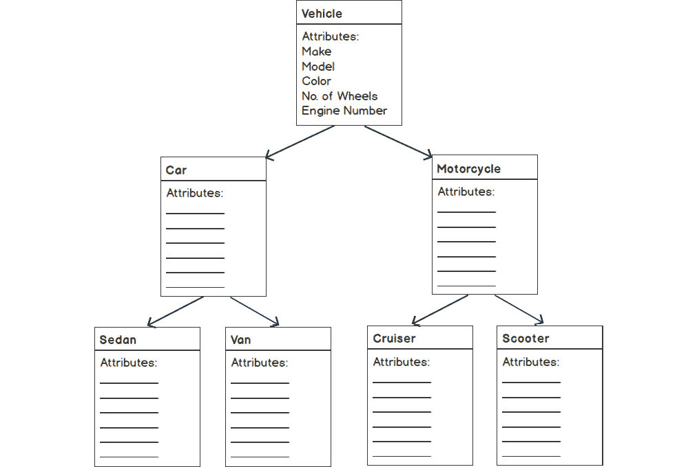

图 5.3：车辆属性继承图

有许多不同类型的车辆，例如汽车、公共汽车、摩托车、飞机等等。车辆具有一般属性，如制造商、型号、颜色、车轮、发动机大小等。这些是车辆子类型或类中常见的属性。由于汽车、公共汽车、摩托车等共享一个共同的属性列表，这些共同的属性和行为来自父类，每个子类都添加它自己的属性和行为。例如，汽车有四个车轮，摩托车是两轮车，汽车比摩托车有更多的乘客容量，等等。因此，这种车辆类型的偏差应该放置在其自己的车辆子类中。因此，我们可以继承共同的属性，并逐步添加我们自己的属性，使用面向对象的概念。

## 类

类是对象的蓝图。一个对象应该包含哪些数据以及需要哪些方法来访问这些数据可以使用类来描述。类充当对象创建的模板。考虑使用蓝图作为指南设计的汽车。车辆类型、制造商、型号、发动机大小、颜色等都在 `Car` 类中定义，以及检索这些信息的方法，例如获取型号名称、启动发动机等。

一个类以 `class` 关键字开始，后跟给定的名称，并用一对花括号括起来的主体。类的主体包含类成员，它们是变量、常量、函数、类变量（也称为类属性或类属性），以及属于类的函数，称为类方法。

查看以下类声明：

```php
class ClassName 
{
    // Class body
}
//or 
class ClassName 
{
    // Class variables declarations
    // Class methods declarations
}
```

类名以字母或下划线开头，后跟任意数量的字母数字字符和下划线。PHP 的预定义类名、常量和保留关键字（例如，`break`、`else`、`function`、`for`、`new` 等）不能用作类名。

PHP 中保留字列表可以在 [`packt.live/2M3QL1d`](https://packt.live/2M3QL1d) 找到。

在 PHP 标准建议中，PSR-1 建议类名以 `CamelizedClassName` 声明，类方法以 `camelizedMethodName` 声明。注意 *类名* 的驼峰式命名和在每个方法名开头使用小写字母。

要了解更多关于 PSR-1：基本编码标准的信息，请访问 [`packt.live/2IBLprS`](https://packt.live/2IBLprS)。

让我们查看以下简单的 `Person` 类：

```php
class Person 
{
    public $name = 'John Doe';
    function sayHello() 
    {
        echo 'Hello!';
    }
}
```

在这里，`class Person {…}` 是 `Person` 类的声明。通过添加一行 `public $name = 'John Doe';` 添加了一个属性，并且主体还包含了 `sayHello()` 成员方法，该方法会打印一个简单的字符串。

在下一节中，我们将讨论我们应该如何实例化一个类，以及当我们执行此类实例化时内存中会发生什么。

## 实例化一个类

一个对象是一个类的实例，因此实例化一个类意味着使用该类创建一个新的对象。我们可以使用`new`关键字来实例化一个类，如下所示：

```php
$object = new MySimpleClass();
```

在实例化过程中，一个对象在内存中创建，并包含其自身的属性副本。在这里，`$object`变量并不持有实际的对象；相反，它指向该对象。为了明确起见，`$object`变量是对象的指针，并不持有对象的引用。

`$object`变量应该是`MySimpleClass`类型，因为类通常被称为自定义数据类型。然后，如果声明了构造方法，构造方法会自动调用。类构造器和析构器是两种特殊的方法；例如，`__construct()`和`__destruct()`，它们分别在对象创建和删除时自动调用。

要访问对象的属性和方法，我们可以使用`->`对象操作符，如下所示：

```php
$object->propertyName;
$object->methodName();
```

因此，对象的创建涉及内存分配，然后自动调用构造方法。我们将在后面的章节中讨论构造方法和析构方法。

## 类属性

正如我们已经看到的，类的属性和变量持有数据。要在 PHP 中编写类属性，我们需要从`public`、`private`或`protected`关键字开始，然后是其余的一般 PHP 变量赋值语句。在先前的`Person`类示例中，`public $name = 'John Doe';`这一行被用来分配一个人的名字；在这里，`public`关键字是一个访问修饰符或类成员可见性关键字，它已经被用来确保属性可以在类外部被访问。我们将在后面的章节中详细讨论访问修饰符。

注意，类结构在 PHP 文件执行之前被编译。关于类属性的值赋值，值应该是静态的，这意味着值不能依赖于运行时。例如，以下类属性将不会工作：

```php
public $date = getdate();
public $sum = $a + $b;
```

在这里，属性分别依赖于`getdate()`函数的返回值和算术表达式评估，分别作为函数调用和算术表达式评估，这些都不会在类的编译时执行，而可以在运行时评估，因此这样的变量初始化在类属性的情况下不会工作。

因此，不涉及运行时信息的类属性应该被视为好的属性，例如以下内容：

```php
public $num = 10;
public $str = 'I am a String';
public $arr = array('Apple', 'Mango', 'Banana');
```

在这里，前面的变量可以在编译时而不是在运行时评估。

非静态类属性——例如，`public`、`private`和`protected`属性——可以通过使用`$this`对象上下文引用变量和`->`对象操作符来访问，如下所示：

```php
class Person 
{
    public $name = 'John Doe';
    function printName() 
    {
        echo $this->name;
    }
}
```

此外，静态属性可以用 `static` 关键字在变量声明开始处编写，并且可以使用 `self` 关键字后跟 `::`（双冒号）操作符来访问。双冒号也称为范围操作符：

```php
class Person 
{
    public static $name = 'John Doe';
    function printName() 
    {
        echo self::$name;
    }
}
```

关于访问修饰符和静态属性的更多内容可以在后面的章节中找到。

## 类常量

类特定的常量（在整个程序中不改变的固定值）可以写在类内部，如下面的示例所示：

```php
class SampleClass 
{
    const ONE = 1;
    const NAME = 'John Doe';
}
echo SampleClass::ONE; //1
echo SampleClass::NAME; //John Doe
```

注意，类常量不使用 `$` 符号，就像变量声明中使用的那样，并且所有字母都是大写。常量的默认可见性是 `public`，并且可以从类外部使用 `::` 范围操作符来访问。

注意

根据 PHP 标准建议，PSR-1，“类常量必须全部大写，使用下划线分隔。”你可以在 [`packt.live/2IBLprS`](https://packt.live/2IBLprS) 上了解更多信息。

类常量只为单个类分配内存，而不是为每个类实例分配。

此外，你可以在类内部使用 `self::` 来使用此类常量，如下所示：

```php
class SampleClass 
{
    const ONE = 1;
    const NAME = 'John Doe';
    function printName()
    {
        echo self::NAME;
    }
}
echo SampleClass::NAME; //John Doe
```

`self::` 操作符只能在类内部使用。自 PHP 5.6.0 版本以来，已添加了常量表达式，如下所示：

```php
class SampleClass 
{
    const ONE = 1;
    const SUM = self::ONE + 2;
}
echo SampleClass::SUM;//3
```

类常量也支持访问修饰符；例如，`public`、`private` 等，这些将在 *访问修饰符* 部分进行演示。

你可以在 PHP 接口中使用此类常量，这是另一种面向对象编程工具，用于建立公共接口或类应该实现的规范。

## `$this` 变量

`$this` 是在对象上下文中调用类成员变量或方法时可用的一个伪变量。当实例化一个类后，`$this` 就可以使用来访问相应对象的成员。因此，在对象上下文中访问一个属性时，我们使用 `$this->attribute_name`，访问方法时使用 `$this->methodName()`。

注意

例如，在类中声明的 `$name` 属性应该使用 `$this->name` 来访问，而不是使用 `$this->$name`。请注意这里的 `$` 符号。

## 类方法

类方法只是函数，并且像包装器一样作用于分配给属性的类数据。获取器和设置器是分别获取和分配数据的两种最常见方式。这两种方法只是简单地从和向成员变量返回和分配数据。我们可能希望使用 `get` 和 `set` 前缀以及我们选择的快速描述性方法名称来前缀获取器和设置器方法；例如，`getMyValue()` 或 `setMyValue()`。尽管这不是必需的，但这种做法可以提高代码的可读性。

查看以下获取器和设置器方法示例：

```php
class Person 
{
    public $name;
    function getName()
    {
        return $this->name;
    }
    function setName()
    {
        $this->name = 'John Doe';
    }
}
```

在这里，此类成员方法的关键概念是为对象中可用的数据提供一个包装器。

除了这些，还可以使用另一种类型的方法，它根据对象内部可用的数据执行某些操作或执行：

```php
Person.php
17     function sayGreetings()
18     {
19         if (date('G') < 12)
20         {
21             $greetings = 'Good Morning';
22         } 
23         elseif (date('G') < 17) 
24         {
25             $greetings = 'Good Afternoon';
26         } 
27         else 
28         {
29             $greetings = 'Good Evening';
30         }
https://packt.live/2IDp7G4
```

在这里，`sayGreetings()` 方法可以是实现识别当前小时并将问候字符串加载到局部变量的成员方法的示例，然后稍后使用分配给 `$name` 的给定属性值打印问候字符串。该方法用于打印问候语——例如，`'Good Morning John Doe'`、`'Good Afternoon John Doe'` 和 `'Good Evening John Doe'`——基于由 `date('G')` 函数返回的 24 小时制当前小时。

我们还有一些管理方法，如构造函数和析构函数，分别用于初始化对象的属性和清理对象使用的内存。在后面的章节中，我们将详细讨论它们。

## 练习 5.1：使用获取和设置方法

在以下练习中，你将声明一个具有型号、型号、颜色和轮子数量等属性的 `Vehicle` 类。此外，为了访问和操作这些给定的属性，我们将声明一些方法，例如获取型号名称、获取发动机编号、获取轮子数量等：

1.  创建一个名为 `Vehicle.php` 的 PHP 文件，并声明具有以下属性的 `Vehicle` 类：

    ```php
    <?php
    class Vehicle 
    {
        public $make = 'DefaultMake';
        public $model = 'DefaultModel';
        public $color = 'DefaultColor';
        public $noOfWheels = 0; 
        public $engineNumber = 'XXXXXXXX';
    }
    ```

    使用型号、型号、颜色、轮子数量和发动机编号来描述 `Vehicle` 对象。在这里，我们将有关车辆的数据添加为类属性。由于不同类型的数据可以打包在类内部，我们的 `Vehicle` 类可以充当自定义数据类型。就像前面的类一样，我们可以根据面向对象的概念封装大量关于对象的元数据。

    注意，分配给类属性的值不依赖于运行时；它们可以轻松地在编译时分配。所有这些都是不同类型的数据，并且由于它们使用公共访问修饰符，因此可以从类外部访问或可见。

1.  现在是时候向类添加成员方法了。根据我们的练习目标，我们需要了解有关车辆轮子数量、发动机编号、型号和颜色等信息。为了获取这些信息，我们将在属性部分之后添加以下五个方法：

    ```php
    Vehicle.php
    9      function getMake()
    10     {
    11         return $this->make;
    12     }
    13     function getModel()
    14     {
    15         return $this->model;
    16     }
    17     function getColor()
    18     {
    19         return $this->color;
    20     }
    https://packt.live/2VwyVHi
    ```

    在这里，我们添加了五个获取方法：`getMake()` 返回公司名称/型号，`getModel()` 返回型号名称，`getColor()` 返回颜色名称，`getNoOfWheels()` 返回车辆拥有的轮子数量，而 `getEngineNumber()` 返回发动机编号。所有这些方法执行起来都很简单，它们使用 `$this` 访问属性以返回值。

1.  要设置车辆的型号、型号、颜色、轮子数量和发动机编号，我们需要设置方法。现在，让我们在前面五个获取方法之后添加相应的设置方法：

    ```php
    Vehicle.php
    29     function setMake($make)
    30     {
    31         $this->make = $make;
    32     }
    33     function setModel($model)
    34     {
    35         $this->model = $model;
    36     }
    37     function setColor($color)
    38     {
    39         $this->color = $color;
    40     }
    41     function setNoOfWheels($wheels)
    42     {
    43         $this->noOfWheels = $wheels;
    44     }
    https://packt.live/33dTLO2
    ```

    在这里，我们添加了五个设置器方法来设置适当的类属性。`setMake($make)` 方法使用 `$this->make` 访问类属性 `$make` 并将 `$make` 参数分配给它。对于 `setModel($model)`、`setColor($color)`、`setNoOfWheels($wheels)` 和 `setEngineNumber($engineNo)` 也是同样的情况。所有这些方法都访问相应的类属性，将传递的参数分配给它们。因此，我们可以使用设置器方法设置类属性。

    最后，我们的类看起来如下所示：

    ```php
    Vehicle.php
    1  <?php
    2  class Vehicle 
    3  {
    4      public $make = 'DefaultMake';
    5      public $model = 'DefaultModel';
    6      public $color = 'DefaultColor';
    7      public $noOfWheels = 0; 
    8      public $engineNumber = 'XXXXXXXX';
    9      function getMake()
    10     {
    11             return $this->make;
    12     }
    https://packt.live/2p52XFU
    ```

1.  现在，让我们按照以下方式实例化类：

    ```php
    $object = new Vehicle();
    ```

    在这里，类已经被实例化以创建 `Vehicle` 类的对象。

1.  使用设置器方法设置类属性，如下所示：

    ```php
    $object->setMake('Honda');
    $object->setModel('Civic');
    $object->setColor('Red');
    $object->setNoOfWheels(4);
    $object->setEngineNumber('ABC123456');
    ```

    在这里，我们通过类成员方法（即设置器方法）分配了制造、型号、颜色、车轮数量和发动机号类属性；也就是说，设置器方法。

1.  要访问存储在 `Vehicle` 对象处理程序 `$object` 中的数据，我们需要使用获取器方法，如下所示：

    ```php
    echo "Make : " . $object->getMake() . PHP_EOL;
    echo "Model : " . $object->getModel() . PHP_EOL;
    echo "Color : " . $object->getColor() . PHP_EOL;
    echo "No. of wheels : " . $object->getNoOfWheels() . PHP_EOL;
    echo "Engine no. : " . $object->getEngineNumber() . PHP_EOL;
    ```

1.  使用 `Vehicle.php` PHP 命令运行 `Vehicle.php` 文件。前面的代码应该输出以下内容：


图 5.4：车辆对象的设置器和获取器方法

因此，我们有一个 `Vehicle` 类，它描述了具有与车辆相关联的不同属性的特定类型的车辆，以及用于操作这些属性的设置器和获取器方法。从现在开始，我们将使用这个 `Vehicle` 类来练习我们的面向对象理解。

简要来说，我们刚才进行的练习完全是关于定义一个类，所以这里的关键学习是，我们必须添加足够描述特定类型对象的类属性，并编写设置和从这些属性获取数据的方法。

在下一节中，我们将讨论构造函数和析构函数方法在类结构中的作用，并介绍一个关于如何实例化 `Vehicle` 类的练习。

## 构造函数

构造函数，如 `__construct()`，是一种特殊的方法，在实例化类时自动调用。

类构造函数的语法如下：

```php
class ClassName
{
    function __construct() 
    {
        //function body
    }
}
```

让我们在之前讨论的 `Person` 类中添加一个 `__construct()` 方法，如下所示：

```php
class MySimpleClass 
{
    public $name;
    function __construct($username)
    {
        $this->name = $username;
    }
}
```

使用 `__construct()` 方法的核心思想是在对象创建后立即执行需要执行的一组初始操作。在前面的简单方法中，`__construct()` 方法执行属性分配。

因此，我们可以创建 `Person` 类的实例，如下所示：

```php
$person1 = new Person('John Doe');
$person2 = new Person('Jane Doe');
echo $person1->name; //prints John Doe
echo $person2->name; //prints Jane Doe
```

在这里，`MySimpleClass` 构造函数 `__construct()` 接收一个参数 `$username`，并通过 `$this->name` 访问它，将其分配给 `$name` 属性。

除了初始值分配之外，构造函数方法可能包含数据库连接、设置 cookie、持有 HTTP 客户端、接受依赖项作为参数等。

构造函数方法不能有返回语句，它可以接受参数，并且名称应该是`__construct()`。

## 析构函数

析构函数方法`__destruct()`在对象被销毁时自动调用。当我们删除一个对象或者 PHP 脚本结束执行并释放变量使用的内存时，`__destruct()`就会被调用。

类析构函数的语法如下：

```php
class ClassName
{
     function __destruct() 
    {
        //function body
    }
}
```

让我们在之前讨论的`Person`类中添加一个`__destruct()`方法，如下所示：

```php
class Person 
{
    //attributes and methods
    function __destruct()
    {
        echo 'The object has been removed.';
    }
}
```

在这里，作为一个例子，可以添加`__destruct()`方法用于日志记录目的。

如果我们`unset()`对象处理变量来销毁对象实例，如下所示，析构函数应该会自动调用：

```php
$person = new Person();
unset($person); //output: The object has been removed.
```

此外，如果没有在内存中找到对象，析构函数方法也会自动调用，如下所示：

```php
$object = new Person();
$object = NULL; //output: The object has been removed. 
```

除了前面的手动对象销毁之外，当脚本执行结束时，不同对象中的所有`__destruct()`方法都会自动调用，PHP 将开始释放内存。

注意

析构函数方法不接收参数。

简而言之，到目前为止，我们已经学习了具有属性和方法类的声明、类的实例化以及构造函数和析构函数方法。因此，我们应该通过下一个练习来应用这些概念。

## 练习 5.2：实例化类并打印详细信息

在以下练习中，你将学习如何实例化我们在上一个练习中创建的`Vehicle`类。我们将向其中引入一个构造函数，这样我们就可以通过构造函数的参数来分配属性，而不是在类声明期间分配值。我们应该能够使用相应的获取器打印这些信息：

1.  打开`Vehicle`类文件，`Vehicle.php`，你应该会看到以下属性：

    ```php
    Vehicle.php
    1  <?php
    2  class Vehicle 
    3  {
    4      public $make = 'DefaultMake';
    5      public $model = 'DefaultModel';
    6      public $color = 'DefaultColor';
    7      public $noOfWheels = 0; 
    8      public $engineNumber = 'XXXXXXXX';
    9      function getMake()
    10     {
    11         return $this->make;
    12     }
    https://packt.live/2IFUlfA
    ```

    我们有更好的方法来使用构造函数方法分配这些属性的值。

1.  修改属性如下：

    ```php
        public $make;
        public $model;
        public $color;
        public $noOfWheels; 
        public $engineNumber;
    ```

    在这里，我们已经提取了分配给属性的默认值。

1.  在属性部分之后添加`__construct`方法，如下所示：

    ```php
        function __construct($make = 'DefaultMake', $model = 'DefaultModel',       $color = 'DefaultColor', $wheels = 4, $engineNo = 'XXXXXXXX')
        {
            //function body
        }
    ```

    在这里，我们将构造函数参数的默认值作为属性的默认值，如果没有传递值。

    构造函数方法将在`Vehicle`类实例化时自动调用。如果我们可以在创建新对象时传递参数，它们将在构造函数内部接收。

1.  在`__construct()`方法中，将参数分配给相应的属性，如下所示：

    ```php
        function __construct($make = 'DefaultMake', $model = 'DefaultModel',       $color = 'DefaultColor', $wheels = 4, $engineNo = 'XXXXXXXX')
        {
            $this->make = $make;
            $this->model = $model;
            $this->color = $color;
            $this->noOfWheels = $wheels;
            $this->engineNumber = $engineNo;
        }
    ```

    在这里，我们将从构造函数参数获得的属性分配给属性。

1.  删除或注释掉以下行以初始化`Vehicle`类和使用`Vehicle.php`中的设置器和获取器：

    ```php
    $object = new Vehicle();
    $object->setMake('Honda');
    $object->setModel('Civic');
    $object->setColor('Red');
    $object->setNoOfWheels(4);
    $object->setEngineNumber('ABC123456');
    echo "Make : " . $object->getMake() . PHP_EOL;
    echo "Model : " . $object->getModel() . PHP_EOL;
    echo "Color : " . $object->getColor() . PHP_EOL;
    echo "No. of wheels : " . $object->getNoOfWheels() . PHP_EOL;
    echo "Engine no. : " . $object->getEngineNumber() . PHP_EOL;
    ```

    我们已经删除了这些行，因为我们打算将`Vehicle.php`文件包含到另一个文件中，该文件将负责`Vehicle`的初始化。到目前为止，`Vehicle`类已经准备好在下一步中使用。

1.  在同一目录下创建一个名为 `vehicle-objects.php` 的新 PHP 文件，并添加以下行以包含 `Vehicle` 类：

    ```php
    <?php
    require_once 'Vehicle.php';
    ```

    在 `vehicle-objects.php` 脚本中，我们使用 `require_once` 命令添加了 `Vehicle` 类，如果文件尚未添加，则会添加该文件；如果找不到文件，则会产生致命错误。对于接下来的步骤，我们将在这个文件上工作。

1.  现在，是时候实例化类了。在包含 `Vehicle` 类之后，按照以下方式创建一个不向构造函数传递任何参数的对象：

    ```php
    $vehicle = new Vehicle();
    ```

    在这里，我们使用 `new` 关键字创建了一个 `Vehicle` 类型的对象，构造函数应该在为对象属性副本分配内存之后调用。

    由于我们已经编写了获取前面属性的 getter 方法，我们应该尝试打印属性信息。

1.  使用以下方式打印属性信息：

    ```php
    $vehicle = new Vehicle();
    echo "Make: " . $vehicle->getMake() . PHP_EOL;
    echo "Model: " . $vehicle->getModel() . PHP_EOL;
    echo "Color: " . $vehicle->getColor() . PHP_EOL;
    echo "No of wheels: " . $vehicle->getNoOfWheels() . PHP_EOL;
    echo "Engine No: " . $vehicle->getEngineNumber() . PHP_EOL;
    ```

    由于所有的 `Vehicle` 成员方法都是公开的，我们可以通过实例化的 `$vehicle` 对象的接口访问车辆数据。

    此外，所有的 `Vehicle` 属性都是公开的，因此我们可以在类外部使用 `$vehicle` 对象处理器来访问这些属性。所以，以下代码应该会输出与前面相同的结果：

    ```php
    $vehicle = new Vehicle();
    echo "Make: " . $vehicle->make . PHP_EOL;
    echo "Model: " . $vehicle->model . PHP_EOL;
    echo "Color: " . $vehicle->color . PHP_EOL;
    echo "No of wheels: " . $vehicle->noOfWheels . PHP_EOL;
    echo "Engine No: " . $vehicle->getEngineNumber() . PHP_EOL;
    ```

    注意

    访问对象属性的标准方式是通过对象的成员方法。当我们对对象属性施加限制时，访问它们应该仅通过对象接口或方法进行。

1.  从终端或控制台运行 `vehicle-objects.php`，使用 `php vehicle-objects.php` 命令。前面的代码输出以下内容：

    图 5.5：车辆对象的默认属性

    在这里，我们没有向类构造函数传递任何参数，因此属性被分配了默认参数值。

1.  现在，我们将在 *步骤 7* 之后的行中创建另一个对象，并传递给构造函数的参数，如下所示：

    ```php
    $vehicle1 = new Vehicle('Honda', 'Civic', 'Red', 4, '23CJ4567');
    echo "Make: " . $vehicle1->getMake() . PHP_EOL;
    echo "Model: " . $vehicle1->getModel() . PHP_EOL;
    echo "Color: " . $vehicle1->getColor() . PHP_EOL;
    echo "No of wheels: " . $vehicle1->getNoOfWheels() . PHP_EOL;
    echo "Engine No: " . $vehicle1->getEngineNumber() . PHP_EOL;
    ```

1.  使用 `php vehicle-objects.php` 命令重新运行 `Vehicle.php`。*步骤 9* 中的代码部分输出以下内容：

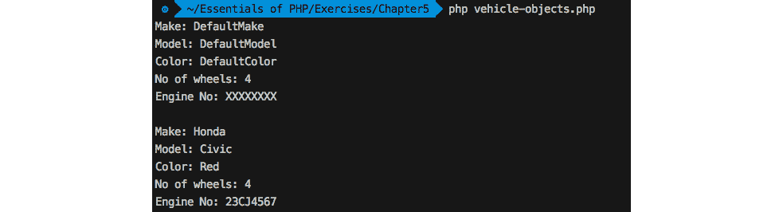

图 5.6：在终端上打印详细信息

因此，可以通过构造函数参数来设定属性的初始值。无论构造函数参数如何，当您想防止直接访问您的属性时，都可以使用设置器方法来分配属性。

## 继承

为了实现可重用性的想法，我们需要学习使用另一个类的对象（子类）获取一个类（父类）的对象属性的过程。因此，继承是从基类（父类）派生出一个类（子类或子类）的过程。

继承支持以分层方式将信息流向派生对象，这样，除了继承的属性外，派生类还可以添加自己的属性。再次强调，这样的派生类还可以被另一个类继承，以此类推。捆绑的数据和行为可以以组织化的方式重用，以向派生类添加额外的功能。

继承使我们能够以下面的方式实现层次分类的概念：

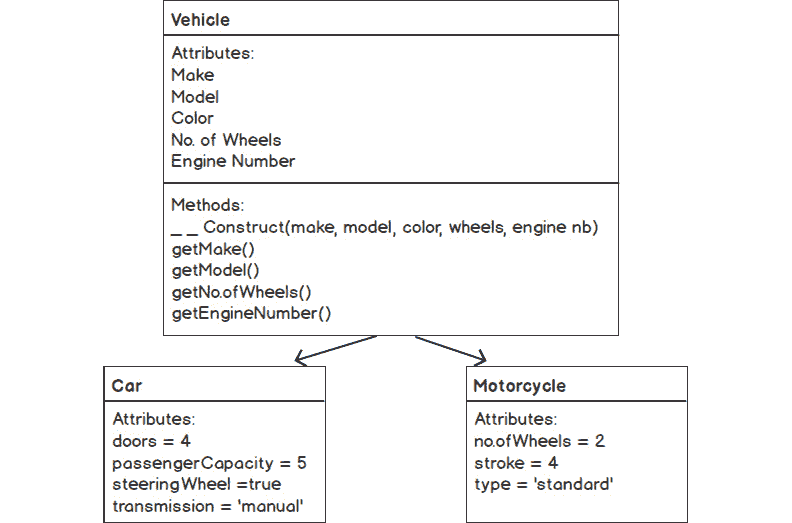

图 5.7：继承图

如前图所示，`Car` 和 `Motorcycle` 类可以从基类 `Vehicle` 派生出来，以重用属性、构造函数和方法。因此，派生类从基类继承了成员，并被允许添加自己的成员，例如，`Car` 添加了四个车门——或者修改继承成员——摩托车将轮子的数量修改为两个，等等。

通过派生类，你可以保留并重用父类的成员。此外，你还可以覆盖父类的属性和方法，以调整派生类中的需求。在派生类中修改继承成员被称为覆盖，这是另一种面向对象编程范式。我们将在后面的章节中详细探讨方法覆盖的例子。

简而言之，继承使我们能够通过类的代际共享共同的特征和行为。

PHP 使用 `extends` 关键字从父类继承。PHP 类继承的语法如下：

```php
class MyNewClass extends MySimpleClass 
{
    //class body
}
```

PHP 支持单继承，这意味着一个类可以继承自一个类；与 Java 不同，Java 可以同时从多个类继承。

为了访问父类的成员属性和方法，请编写以下代码：

```php
class MySimpleClass 
{
    public $propertyName = 'base property';
    function methodName()
    {
        echo 'I am a base method. ';
    }
}
class MyNewClass extends MySimpleClass 
{
    //class body
}
$object = new MyNewClass();
$object->propertyName; //holds, 'base property'
$object->methodName(); //prints, 'I am a base method. ' 
```

因此，父类的属性可以在派生对象中被重用。通常，为了共享常见的属性和行为，我们建立一个基类，这样子类就不需要重复添加相同的属性和行为。因此，数据和操作该数据的相关代码可以被重用，并且代码库的大小保持最小。

再次强调，在派生过程中，你可以添加额外的成员，并如下使用父类成员：

```php
class MyNewClass extends MySimpleClass 
{
    public $addedProperty = 'added property';
    function addedMethodName()
    {
        parent::methodName();
        echo 'I am an added method. ';
    }
}
$object = new MyNewClass();
$object->propertyName; //holds 'base property'
$object->addedProperty; //holds 'added property'
$object->addedMethodName(); //prints 'I am a base method. I am an added method.'
```

在这里，`MyNewClass` 添加了自己的 `$addedProperty` 属性和 `addedMethodName()` 方法。

你可以使用 `parent` 关键字后跟作用域运算符 `::` 来访问和使用父类的成员，例如，`parent::`。在上面的例子中，`MyNewClass` 子类添加了自己的 `addedMethodName()` 成员方法，它通过使用 `parent::methodName()` 访问父类的 `methodName()` 方法，并打印出 '`我是一个添加的方法`' 字符串。因此，`$object->addedMethodName()` 打印出 '`我是一个基类方法。我是一个添加的方法。`'。

注意

子类不能访问或继承父类的私有属性或成员，因为私有意味着应该保持私有。

## 练习 5.3：实现继承

现在，是时候对不同的车辆类型进行分类，并利用 `Vehicle` 类来派生新的车辆类型，例如汽车、公交车、卡车、摩托车等。为了产生新的车辆类型对象，我们将扩展 `Vehicle` 类以派生新的类，如 `Car` 和 `Motorcycle`。

在这个练习中，你将学习如何从 `Vehicle` 类派生类。我们将创建 `Car` 和 `Motorcycle` 子类，并在它们中添加新的属性，并通过实例化相应的对象来打印 `Car` 和 `Motorcycle` 的属性：

1.  在同一目录下创建一个新的 `Car` 类文件，名为 `Car.php`，并添加以下行以包含 `Vehicle` 类：

    ```php
    <?php
    require_once 'Vehicle.php';
    ```

1.  `Car` 类扩展了 `Vehicle` 类。在 `require` 命令之后添加以下内容：

    ```php
    class Car extends Vehicle 
    {
        //class body
    }
    ```

    `Car` 类继承自父类所有的属性和方法。现在，是时候向 `Car` 类中添加新的属性或属性，以便汽车对象可以在其他类型的车辆中区分开来。

1.  一辆汽车应该有车门、乘客容量、方向盘、变速器等，并继承默认的四个轮子以及其他属性。将以下属性添加到 `Car` 类中：

    ```php
    class Car extends Vehicle 
    {
        public $doors = 4; 
        public $passengerCapacity = 5;
        public $steeringWheel = true;
        public $transmission = 'Manual';
        //class body
    }
    ```

    因此，`Car` 类本身就是一个车辆，所以它具有车辆的所有给定特征，并添加了自己的特征集。

1.  现在，是时候利用继承的美丽之处了。我们将使用从 `Vehicle` 类继承的构造函数。我们可以通过传递构造函数参数来设置汽车的属性。我们可以实例化 `Car` 类，并使用 `Car` 类的对象来访问 `Vehicle` 类的成员，如下所示：

    ```php
    $car = new Car('Honda', 'Civic', 'Red', 4, '23CJ4567');
    echo "Vehicle Type: " . get_class($car) . PHP_EOL;
    echo " Make: " . $car->getMake() . PHP_EOL;
    echo " Model: " . $car->getModel() . PHP_EOL;
    echo " Color: " . $car->getColor() . PHP_EOL;
    echo " No of wheels: " . $car->getNoOfWheels() . PHP_EOL;
    echo " No of Doors: " . $car->doors . PHP_EOL;
    echo " Transmission: " . $car->transmission . PHP_EOL;
    echo " Passenger capacity: " . $car->passengerCapacity . PHP_EOL;
    ```

    在这里，除了额外的汽车属性外，我们还可以访问基类的继承特性。`get_class()` 返回我们用来获取 `Vehicle` 类型的类名。注意，我们是通过子对象的处理器来访问继承的方法的。

1.  在终端中运行 `Car.php`，使用 `php Car.php` 命令。前面的代码输出以下内容：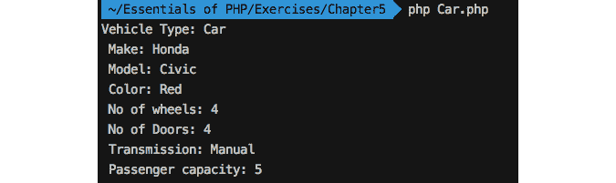

    图 5.8：打印汽车详情

1.  同样，让我们在这里创建另一种类型的车辆。通过扩展 `Vehicle` 类创建一个 `Motorcycle` 类。在同一目录下创建一个 `Motorcycle.php` 文件，内容如下：

    ```php
    <?php
    require_once 'Vehicle.php';
    class Motorcycle extends Vehicle 
    {
        public $noOfWheels = 2;
        public $stroke = 4;
        //class body
    }
    ```

    再次，这种特定类型的车辆添加了其新的属性。这就是继承如何使你的对象在重用现有功能的同时，带着新的特征向前发展。注意，`$noOfWheels` 和 `$stroke` 也可以在构造函数中设置，但我们也在这里覆盖了这些值，以防 `Motorcycle` 类使用默认的空构造函数实例化。

1.  现在，让我们实例化派生的 `Motorcycle` 类，并按如下方式访问继承和添加的属性：

    ```php
    <?php
    require_once 'Vehicle.php';
    class Motorcycle extends Vehicle 
    {
        public $noOfWheels = 2;
        public $stroke = 4;
    }
    $motorcycle = new Motorcycle('Kawasaki', 'Ninja', 'Orange', 2,   '53WVC14598');
    echo "Vehicle Type: " . get_class($motorcycle) . PHP_EOL;
    echo " Make: " . $motorcycle->make . PHP_EOL;
    echo " Model: " . $motorcycle->model . PHP_EOL;
    echo " Color: " . $motorcycle->color . PHP_EOL;
    echo " No of wheels: " . $motorcycle->noOfWheels . PHP_EOL;
    echo " No of strokes: " . $motorcycle->stroke . PHP_EOL;
    ```

    因此，两轮车辆类型应该将 `$noOfWheels` 属性的值设为 `2`。请注意，这里已将 `$noOfWheels` 覆盖为 `2` 并添加了一个额外的 `$stroke` 属性，它是 `Motorcyle` 的冲程类型。默认值为 `4`。

1.  使用 `php Motorcycle.php` 命令从终端运行 `Motorcycle.php` 文件。前面的代码输出以下内容：


图 5.9：摩托车对象的继承和新增属性

到目前为止，我们已经通过扩展 `Vehicle` 类派生了 `Car` 和 `Motorcycle`，在派生类中添加了新的属性，并且以直接的方式访问了父属性和方法，因为它们都是公开可访问的。继承允许您以分层的方式实现对象。您可能需要在整个系统中添加新功能或重用现有功能以保持代码模块化。在练习中，我们注意到访问父成员很容易，并且没有限制来阻止您访问它们的数据。

为了在类属性上强制执行特定的数据访问策略，我们需要在类属性和方法声明之前使用访问修饰符。

## 访问修饰符

面向对象编程的核心概念有两个，即模块化（允许重用）和封装（将数据和函数捆绑在一起，以隐藏信息）。为数据访问和对象之间的接口建立访问指南非常重要，以便定义谁可以访问什么以及访问的程度。访问修饰符为对象常量、属性和方法提供访问保护。其概念是保护对象的成员，以便我们可以为对象声明 `public`、`protected` 和 `private` 成员常量、属性和方法。`public`、`protected` 和 `private` 关键字在 PHP 中也被称为可见性关键字。`public` 关键字可以用在成员之前，以便通过对象从外部访问该成员。`protected` 关键字可以用来自从派生类访问成员，但不能从外部访问。`private` 关键字可以用来自限制成员的访问仅限于其自身类，并且不能通过派生或从外部访问。

让我们看看将 `public`、`protected` 和 `private` 关键字应用于类成员的示例：

```php
<?php
class MySimpleClass
{
    public PUBLIC_CONSTANT = 'Public';
    protected PROTECTED_CONSTANT = 'Protected';
    private PRIVATE_CONSTANT = 'Private';
    public $publicAttribute = 'Public Member';
    protected $protectedAttribute = 'Protected Member';
    private $privateAttribute = 'Private Member';
    public function publicMethod()
    {
        //function body
    }
    protected function protectedMethod()
    {
        //function body
    }
    private function privateMethod()
    {
        //function body
    }
}
$object = new MySimpleClass();
$object->publicAttribute;//ok
$object->protectedMember;//fatal error
$object->privateAttribute;//fatal error
```

要详细说明带有前缀的新访问修饰符的类成员，请查看以下表格，了解 `public`、`protected` 和 `private` 访问修饰符：

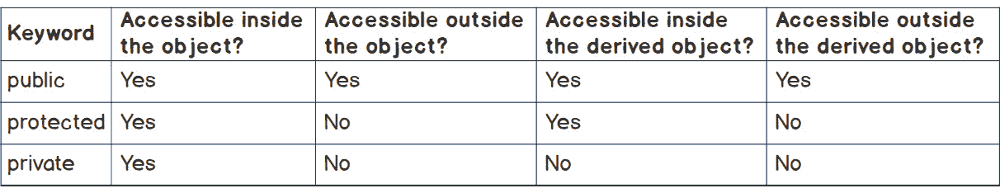

图 5.10：访问修饰符的作用范围

所有公共成员都可以通过对象处理程序（如 `$object->publicAttribute` 或 `$object->publicMethod()`）从其自身对象或派生对象外部访问，而从其自身对象或派生对象内部访问它们则需要使用特殊的 `$this` 变量。

所有受保护的成员只能从它们自己的对象或派生对象内部访问，使用 `$this->protectedAttribute` 或 `$this->protectedMethod()`。使用 `$object->protectedAttribute` 对象处理程序访问它们将产生一个 `FATAL` 错误。因此，当我们可以通过派生来重用数据和行为时，可以使用访问修饰符。

私有成员仅对其自己的对象是私有的，并且不能通过继承访问。这个访问修饰符的整个想法是，类特定的数据和行为不能被重用：

![图 5.11：访问修饰符图]

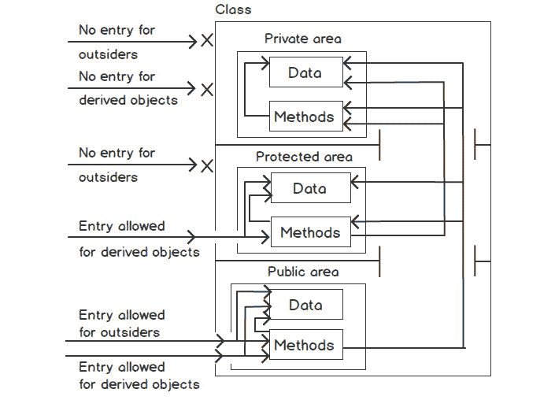

图 5.11：访问修饰符图

图表显示了谁可以访问哪些数据以及哪些方法。外部人员只能通过对象处理程序访问对象的公共数据和方法。外部人员的访问受到受保护和私有区域的限制。只有通过派生，才能允许访问受保护区域，而私有区域意味着类内部的私有。因此，类的受限区域只能通过其自己的方法访问，并且如果类声明了访问其受限区域的方法为公共的，那么世界只能间接地访问这些受限区域。

注意

如果在方法之前没有提到访问修饰符，那么它将默认被认为是公共的。

现在是时候将访问修饰符应用到 `Vehicle` 类上了。让我们通过一个练习来了解这个过程。在 `Vehicle` 类中，车轮的数量应该对不同的车辆类型可用以实现，引擎号应该是机密的，其他信息不应是机密的。

## 练习 5.4：应用访问修饰符

在这个练习中，我们需要在 `Vehicle` 类属性之前应用访问修饰符，以确保对引擎号变量 `$engineNumber` 的数据隐藏。引擎号只能通过成员方法 `getEngineNumber()` 获取。此外，车轮的数量不应在类外部可用；相反，它应该对派生类可用以实现它们自己的车轮数量，其余的属性可以在类外部访问：

1.  打开 `Vehicle.php` 文件，并按如下方式更新 `$noOfWheels` 属性的访问修饰符：

    ```php
    <?php
    class Vehicle 
    {
        public $make;
        public $model;
        public $color;
        protected $noOfWheels; 
        public $engineNumber;
        //methods
    ```

    在这里，我们保护了 `$noOfWheels` 数据，因为这需要对子类可用以实现它们自己的车轮数量，并且不应在类外部可用。我们将 `$noOfWheels` 属性从 `public` 更改为 `protected`。

1.  此外，引擎号应该对不同的车辆类型是私有的。将 `$engineNumber` 的可见性从 `public` 更改为 `private`，如下所示：

    ```php
    class Vehicle 
    {
        public $make;
        public $model;
        public $color;
        protected $noOfWheels; 
        private $engineNumber;
        //methods
    ```

    在这里，由于`$engineNumber`属性的可见性变化，该属性应保持为其自身类的私有属性，并且不应对派生类或类外部的代码可用。访问此类私有属性的一种方法是为外部编写一个公共获取器方法，或者只为派生类编写一个受保护的获取器方法。

    一些车辆类型可能需要修改车轮数量，我们不会允许外部进行此类修改；因此，我们将`$noOfWheels`属性声明为`protected`。如果将车轮数量设置为`public`会怎样？它可能会被直接修改（读：奇怪）：一辆车可能有两条轮子，或者一辆摩托车可能会被修改为有 100 条轮子。这就是为什么我们希望属性只能在子类中修改，而不是由外部修改。

    在这里，前三个属性是公开可见的，这意味着这些是任何车辆类型的公共属性，并且如果有人想这样做，可以直接通过对象访问此类信息。

    因此，我们能够通过`visibility`关键字对类属性施加限制。让我们通过实例化类来尝试访问具有更新可见性的属性。

1.  创建一个新的`vehicle-visibility.php`文件，并按照以下方式实例化`Vehicle`类：

    ```php
    <?php
    require_once 'Vehicle.php';
    $vehicle = new Vehicle();
    ```

1.  尝试使用对象处理程序在类外部访问成员属性，就像之前一样：

    ```php
    $vehicle = new Vehicle();
    echo "Make: " . $vehicle->make . PHP_EOL;
    echo "Model: " . $vehicle->model . PHP_EOL;
    echo "Color: " . $vehicle->color . PHP_EOL;
    echo "No of wheels: " . $vehicle->noOfWheels . PHP_EOL;
    echo "Engine No: " . $vehicle->engineNumber . PHP_EOL;
    ```

    注意，我们正在尝试使用对象操作符通过`$vehicle`对象处理程序在类外部访问`$noOfWheels`和`$engineNumber`，这两个都应该产生一个`FATAL`错误。

1.  从终端或控制台运行`vehicle-visibility.php`，使用`php -d display_errors=on vehicle-visibility.php`命令。使用`-d`标志并设置`display_errors=on`应该覆盖来自`php-cli`的默认`display_erros=off`设置：

    前面的命令输出以下内容：

    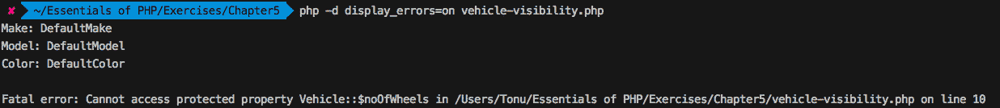

    图 5.12：访问车辆对象的受保护属性

1.  让我们移除包含`$vehicle->noOfWheels`的行，并尝试重新运行之前的命令：

    ```php
    Make: DefaultMake
    Model: DefaultModel
    Color: DefaultColor
    Fatal error: Cannot access private property Vehicle::$engineNumber ...
    ```

1.  我们需要改变访问此类受限属性的方法。我们需要使用`getNoOfWheels()`和`getEngineNumber()`对象接口，如下所示：

    ```php
    $vehicle = new Vehicle();
    echo "Make: " . $vehicle->make . PHP_EOL;
    echo "Model: " . $vehicle->model . PHP_EOL;
    echo "Color: " . $vehicle->color . PHP_EOL;
    echo "No of wheels: " . $vehicle->getNoOfWheels() . PHP_EOL;
    echo "Engine No: " . $vehicle->getEngineNumber() . PHP_EOL;
    ```

1.  因此，如果我们重新运行脚本，我们应该看到所有预期的值都按以下方式打印出来：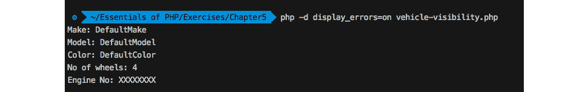

    图 5.13：通过车辆对象的方法访问私有和受保护的属性

    现在，我们应该尝试从子类访问修改后的可见性属性，以查看差异。

1.  让我们尝试从子类访问修改后的可见性属性。打开`Car.php`并定位到包含`$car->getNoOfWheels()`的行。受保护的`$noOfWheels`属性由`$car`对象继承，并且只能通过`getNoOfWheels()`标准接口访问。

    尝试使用 `php -d display_errors=on Car.php` 命令运行 `Car.php`。该命令会打印以下内容：

    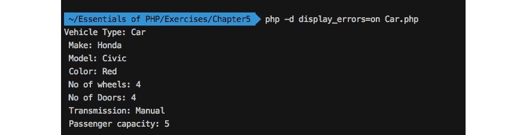

    图 5.14：通过继承访问父类的属性

    这就是访问修饰符如何确保在子类中保护数据的方法。如果我们尝试使用 `$car->noOfWheels` 访问受保护的属性，它将产生一个致命错误。

1.  现在，让我们尝试访问 `Car.php` 的父类的私有属性，并添加以下行：

    ```php
    echo " Engine number: " . $car->engineNumber . PHP_EOL;
    ```

    记住，尽管汽车是一种车辆并且是从 `Vehicle` 类继承的，但该属性应该保持对 `Vehicle` 类的私有性，并且对 `Car` 对象来说是未知的。

1.  尝试重新运行之前的命令，它将引发一个 `Notice` 消息（PHP 解释器的消息），因为属性对 `$car` 对象来说是未知的：

    ```php
    Vehicle Type: Car
     Make: Honda
     Model: Civic
     Color: Red
     No of wheels: 4
     No of Doors: 4
     Transmission: Manual
     Passenger capacity: 5
    Notice: Undefined property: Car::$engineNumber ...
     Engine number:
    ```

    PHP 只会引发一个 `Notice` 消息，因为该属性对对象来说是完全未知的。所以，这就是如何在类成员之前应用可见性关键字以确保数据的隐藏和保护以及通过继承的保护。请注意，`Notice` 消息是关于解释器违规的信息，不会停止程序执行，而错误应该停止程序执行，并且必须解决才能执行程序。

总结来说，访问修饰符允许我们控制我们的数据和行为，并为数据通过标准方法进行通信提供指导。因此，当我们需要在对象之间建立安全的数据通信时，我们已经学会了如何保护、私有化和公开数据。

## 静态字段和方法

当类实例或对象想要在它们之间共享相同的数据时，类需要将此类数据声明为静态。每个实例可能有自己的数据副本，但我们使用静态成员来确保某些数据和行为在实例范围内应该是相同的。

静态字段或属性和方法只是声明了 `static` 关键字（在访问修饰符之后）的属性和方法，它们具有特殊用途，即可以在不实例化类的情况下访问静态属性、常量和方法。到目前为止，我们已经从对象上下文访问了在类内部声明的成员。在不需要对象访问类成员的情况下，我们将它们声明为静态成员，并使用 `::` 范围运算符（双冒号）来访问它们。

语法看起来如下：

```php
class MySimpleClass
{
    public static $myStaticProperty = 'I am a static property. ';
    public static function myStaticMethod()
    {
        return 'I am a static method. ';
    }
}
echo MySimpleClass::$myStaticProperty; //prints 'I am a static property.'
echo MySimpleClass::myStaticMethod(); //prints 'I am a static method.'
```

要从它们自己的类中访问静态属性或方法，查看以下示例：

```php
class MySimpleClass
{
    public static $myStaticProperty = 'I am a static property. ';
    public static function myStaticMethod()
    {
        return self::$myStaticProperty . 'I am a static method. ';
    }    
    public static function myAnotherStaticMethod()
    {
        echo self::myStaticMethod();
    }
}
echo MySimpleClass::myAnotherStaticMethod(); 
//prints 'I am a static property. I am a static method.'
```

因此，静态成员可以使用类名和 `::` 范围运算符在类外部访问。此外，要访问类内部的静态成员，我们可以使用 `self` 关键字后跟 `::` 范围运算符。

要从子类访问静态属性或方法，我们使用 `parent` 关键字后跟 `::` 范围运算符。查看以下示例：

```php
class MySimpleClass{
    public static $myStaticProperty = 'parent static property. ';
    public static function myStaticMethod()
    {
        return self::$myStaticProperty . 'parent static method. ';
    }
}
class MySubClass extends MySimpleClass{
    public static function printSomething()
    {
        echo parent::myStaticMethod();
    }
}
echo MySubClass::printSomething(); 
//prints, parent static property. parent static method.
```

此外，静态方法在对象上下文中也是可用的：

```php
$object = new MySubClass();
echo $object->printSomething();
```

注意

静态属性和成员是全局变量和函数，除了它们存在于一个可以通过类名从任何地方访问的类中。静态成员应该是公共的；否则，使用类名从外部访问它们会产生致命错误。

## parent:: 和 self::

`self::` 指的是当前类，并且可以用来访问静态属性、常量和方法。

类似地，`parent::` 指的是父类，并且可以在子类内部使用，以便访问父类的成员属性、常量和方法。

## 练习 5.5：应用静态成员

在这个练习中，我们将探讨静态成员的一个有趣用例。我们将向 `Vehicle` 类添加一个静态属性，并在构造函数中增加该属性，以便随着每个对象的创建而增加静态成员：

1.  打开 `Vehicle.php` 文件并在类中添加一个静态属性，如下所示：

    ```php
    <?php
    class Vehicle 
    {
        public $make;
        public $model;
        public $color;
        protected $noOfWheels; 
        private $engineNumber;
        public static $counter = 0;
    ```

    在这里，我们添加了一个 `$counter` 静态属性，并用 `0` 初始化计数器。

1.  现在，只需在构造函数中添加一行代码来增加 `$counter`，如下所示：

    ```php
        function __construct($make = 'DefaultMake', $model = 'DefaultModel', $color = 'DefaultColor', $wheels = 4, $engineNo = 'XXXXXXXX')
        {
            $this->make = $make;
            $this->model = $model;
            $this->color = $color;
            $this->noOfWheels = $wheels;
            $this->engineNumber = $engineNo;
            self::$counter++;
        }
    ```

    在这里，计数器随着每个对象的创建而递增，因为我们知道在实例化类时调用构造方法。在我们的例子中，`Car` 和 `Motorcycle` 子类没有声明 `__construct()` 方法，所以它们应该通过继承使用父类的构造函数。

1.  现在，打开 `Car.php` 文件并多次创建 `Car` 对象，如下所示。使用 `Car::$counter` 打印 `$counter` 静态变量：

    ```php
    $car1 = new Car('Honda', 'Civic', 'Red', 4, '23CJ4567');
    $car2 = new Car('Toyota', 'Allion', 'White', 4, '24CJ4568');
    $car3 = new Car('Hyundai', 'Elantra', 'Black', 4, '24CJ1234');
    $car4 = new Car('Chevrolet', 'Camaro', 'Yellow', 4, '23CJ9397');
    echo "Available cars are " . Car::$counter . PHP_EOL;
    ```

    在这里，继承自 `Car` 类的静态属性包含了在任何特定时间点创建的对象数量。因此，我们可以知道应用程序中可用的汽车数量。前面的代码应该打印 `Available cars are 4`。注意，我们在父类 `Vehicle` 的构造函数中重用了静态计数器，这意味着派生的 `Car` 对象共享同一个计数器。

1.  现在，要计算 `Motorcycle` 对象的数量，只需创建一些对象，并使用 `Motorcycle::$counter` 打印 `$counter` 静态变量：

    ```php
    $motorcycle1 = new Motorcycle('Kawasaki', 'Ninja', 'Orange', 2,   '53WVC14598');
    $motorcycle2 = new Motorcycle('Suzuki', 'Gixxer SF', 'Blue', 2,   '53WVC14599');
    $motorcycle2 = new Motorcycle('Harley Davidson', 'Street 750', 'Black', 2,   '53WVC14234');
    echo "Available motorcycles are " . Motorcycle::$counter. PHP_EOL;
    ```

    前面的代码应该打印 `Available motorcycles are 3`。因此，我们在父类中声明了一个静态计数器，通过使用子类名称创建对象并访问 `static` 属性来获取创建的对象数量。这就是我们如何使用 `static` 属性和方法实现许多有趣功能的方法。

## 类抽象

在面向对象编程（OOP）中，类抽象是定义对象共同行为的方式，以便派生类可以以它们自己的方式实现这些行为以实现不同的目的。仅以车辆类比：汽车和摩托车都有共同的引擎，但你都知道每种类型的车辆的引擎是完全不同的。因此，类抽象应该为两种类型的车辆提供抽象引擎。为了匹配一个精确的共同定义的引擎，引擎应该可以启动，引擎应该可以停止，我们可能还想了解引擎的状态——它是否正在运行。

每种类型的车辆都应该实现其启动引擎的方式。例如，我们可以通过在点火开关中使用钥匙来启动汽车引擎，而摩托车可能需要我们踢启动引擎：


图 5.15：一个简单的抽象引擎图

PHP 支持抽象类和方法，并且可以使用`abstract`关键字来编写。抽象类不能被实例化；相反，它可以被继承以实现对象之间的共同行为。一个类必须包含至少一个抽象方法才能成为抽象类。使用此类，我们向子类提供共同的方法。在抽象类中，共同的方法可能是抽象的，因为它们只有签名，而子类以它们自己的方式实现这些方法。声明为抽象方法的方法不得包含实现代码。

查看以下语法：

```php
abstract class ClassName{
    abstract function methodName(param1);
    // more abstract method declarations
    function anotherMethod()
    {
        //function body
    }
    //more implemented functions
}
class MyChildClass extends ClassName{
    function methodName(param1, param2)
    {
        //the implementation goes here
    }
}
```

抽象类可以包含一些实现的方法，以及抽象方法。通常，我们保留这些方法为抽象的，它们应该在不同的子类中有不同的实现。

除了抽象方法实现外，子类必须添加抽象方法中给出的所有参数，并且可以选择添加额外的参数。比如说，抽象方法带有两个参数，那么子类必须添加这两个参数，并且可以选择添加它自己的参数。

在以下练习中，我们将向汽车和摩托车添加基本的引擎功能，以便引擎可以被打开和关闭。

## 练习 5.6：实现抽象类

在这个练习中，我们将把`Vehicle`类转换为一个抽象类，这样我们就可以以抽象的方式提供引擎启动动作，并且每个子类都可以以自己的方式实现引擎启动。我们可以添加一个抽象的引擎启动方法，这样`Car`和`Motorcycle`就可以继承引擎动作并实现它，以自己的方式启动车辆。这个练习的整个想法是练习和理解抽象如何帮助我们实现某些场景。为了为每种车辆类型提供一个抽象的引擎启动，我们将通过在它前面添加`abstract`关键字并将一个抽象的引擎启动方法添加到`Vehicle`类中，简单地声明`Vehicle`类为抽象类。由于`Car`和`Motorcycle`扩展了`Vehicle`类，它们将被迫实现这个`abstract`方法。

PSR 命名规范

抽象类名称必须以`abstract`前缀开头；例如，`AbstractTest`。您可以查看[`packt.live/2IEkR9k`](https://packt.live/2IEkR9k)。

让我们看看步骤：

1.  打开`Vehicle.php`类，在`class`关键字之前添加`abstract`关键字，如下所示：

    ```php
    abstract class Vehicle
    {
        //code goes here
    }
    ```

    因此，`Vehicle`类变成了一个抽象类，正如之前讨论的那样。

1.  此外，将类名前缀改为`Abstract`：

    ```php
    abstract class AbstractVehicle 
    {
        //code goes here
    }
    ```

    将`Vehicle.php`文件重命名为`AbstractVehicle.php`。

1.  使用以下方式更新`Car.php`文件，包括抽象`AbstractVehicle`类名称和`AbstractVehicle.php`文件名：

    ```php
    <?php
    require_once 'AbstractVehicle.php';
    class Car extends AbstractVehicle 
    {
        //code goes here
    }
    ```

    对于`Motorcycle.php`，添加以下内容：

    ```php
    <?php
    require_once 'AbstractVehicle.php';
    class Motorcycle extends AbstractVehicle 
    {
        //code goes here
    }
    ```

1.  我们需要在`AbstractVehicle`类中添加一个属性来存储引擎状态——它是否启动或停止，所以让我们添加一个受保护的`$engineStatus`属性，其类型为布尔型，以便它以`true`或`false`的形式保存正在运行的引擎状态：

    ```php
    <?php
    abstract class AbstractVehicle 
    {
        public $make;
        public $model;
        public $color;
        protected $noOfWheels; 
        private $engineNumber;
        public static $counter = 0;
        protected $engineStatus = false;
    ```

    在这里，我们添加了一个默认值为 false 的`$engineStatus`属性，这样我们就可以确认引擎没有在运行。

    根据我们的抽象类概念，我们将添加一些在每个车辆类型中都会实现的方法，以及一些在每个车辆类型中都会以不同方式实现的非实现抽象方法。汽车的引擎启动和摩托车不同，所以这个方法应该是抽象的，但停止引擎或获取引擎状态应该是相同的。

1.  在抽象类`Vehicle`中添加以下抽象方法签名，这个方法在`Car`和`Motorcycle`中应该有不同的实现（即：表现不同）：

    ```php
        abstract function start();
    ```

    现在，两个车辆子类都将被强制在自己的类中实现这个方法。

1.  此外，我们将通过实现的方法提供一些公共功能，以便子类可以使用。在`AbstractVehicle`类中添加以下两个方法：

    ```php
        function stop()
        {
            $this->engineStatus = false;
        }
        function getEngineStatus()
        {
            return $this->engineStatus;
        }
    ```

    在这里，为了停止引擎和获取引擎状态，我们添加了`stop()`和`getEngineStatus()`方法。所以，这两个方法在`Car`和`Motorcycle`中应该是相同的。

    最后，具有单个抽象方法的抽象类 `AbstractVehicle` 看起来如下：

    ```php
    AbstractVehicle.php
    1  <?php
    2  abstract class AbstractVehicle
    3  {
    4      public $make;
    5      public $model;
    6      public $color;
    7      protected $noOfWheels;
    8      private $engineNumber;
    9      public static $counter = 0;
    10     protected $engineStatus = false;
    https://packt.live/2AVSSh0
    ```

1.  现在，是时候在子类中实现抽象的 `start()` 方法了。汽车启动发动机有自己的方式——你需要将钥匙插入点火开关。在 `Car.php` 中，添加一个私有属性 `$hasKeyinIgnition`，以及 `start()` 实现如下：

    ```php
    Car.php
    1  <?php
    2  require_once 'AbstractVehicle.php';
    3  class Car extends AbstractVehicle 
    4  {
    5      public $doors = 4; 
    6      public $passengerCapacity = 5;
    7      public $steeringWheel = true;
    8      public $transmission = 'Manual';
    9      private $hasKeyinIgnition = true;
    10     public function start()
    11     {
    12         if($this->hasKeyinIgnition) 
    13         {
    14             $this->engineStatus = true;
    15         }
    https://packt.live/2pHdFmh
    ```

    因此，汽车通过在点火开关中插入钥匙来实现发动机启动。`$this->hasKeyinIgnition` 应该为 `true` 以将 `$engineStatus` 变量设置为 `start` 或 `true`。

1.  我们可以创建一个 `Car` 对象，并按如下方式启动/停止发动机：

    ```php
    $car = new Car('Honda', 'Civic', 'Red', 4, '23CJ4567');
    $car->start();
    echo "The car is " . ($car->getEngineStatus()?'running':'stopped') .   PHP_EOL;
    $car->stop();
    echo "The car is " . ($car->getEngineStatus()?'running':'stopped') .   PHP_EOL;
    ```

1.  使用 `php Car.php` 命令运行 `Car.php`。前面的代码应该输出以下内容：

    图 5.16：汽车对象上的抽象方法实现

1.  摩托车需要一把钥匙来解锁车辆，并踩在相应的杠杆上以启动发动机。术语“kickstart”就是从这个特定类型的车辆中来的。打开 `Motorcycle.php` 来模拟钥匙到位和启动过程。让我们添加两个私有属性 `$hasKey` 和 `$hasKicked`，并按如下方式实现 `start()` 方法：

    ```php
    class Motorcycle extends AbstractVehicle 
    {
        public $noOfWheels = 2;
        public $stroke = 4;
        private $hasKey = true;
        private $hasKicked = true;
        public function start()
        {
            if($this->hasKey && $this->hasKicked) 
            {
                $this->engineStatus = true;
            }
        }
    }
    ```

    在这里，在 `start()` 方法中，我们已经检查了启动摩托车发动机所需的两个元素是否存在，并通过将 `$engineStatus` 设置为 `true` 来启动了发动机。

1.  同样，我们可以创建一个 `Motorcycle` 对象，并按如下方式启动/停止发动机：

    ```php
    $motorcycle = new Motorcycle('Kawasaki', 'Ninja', 'Orange', 2,   '53WVC14598');
    $motorcycle->start();
    echo "The motorcycle is " . ($motorcycle->getEngineStatus()?'running':  'stopped') . PHP_EOL;
    $motorcycle->stop();
    echo "The motorcycle is " . ($motorcycle->getEngineStatus()?'running':  'stopped') . PHP_EOL;
    ```

1.  使用 `php Motorcycle.php` 命令运行 `Motorcycle.php`。前面的代码应该输出以下内容：


](img/C14196_05_16.jpg)

图 5.17：摩托车对象上的抽象方法实现

因此，子类中相同动作的不同行为应该以抽象的方式来自父类。

# 接口

我们已经讨论了如何通过抽象类提出共同和抽象的方法。在抽象类中，我们保留在派生类中应该不同的方法。如果我们想要一套完整的抽象功能呢？或者，如果我们想要确定功能标准呢？也许我们想要建立一个与对象通信的标准方法集？这就是为什么我们需要接口。接口将类似的抽象方法分组，以便它可以表达一个抽象特征，并且需要该功能的不同的类可以实现该接口。例如，`Flight` 功能由 `Birds` 和 `Aeroplanes` 实现。因此，`Flight` 接口必须是完全抽象的，这样 `Birds` 和 `Aeroplanes` 就可以实现完全不同的飞行技术。

接口可以类似于没有 `class` 关键字和没有所有方法体的类。因此，接口是一组要实现的方法签名，如下所示：

```php
interface MyInterface{
    function methodName1();
    function methodName2();
    //so on
}
class MyClass implements MyInterface{
    function methodName1() 
    {
        //method body
    }
    function methodName2() 
    {
        //method body
    }
}
```

接口不能扩展，而应实现；类使用 `implements` 关键字继承给定的接口，以便它们可以实施。PHP 支持接口中的常量，以便实现类自动定义这些常量。实现接口的类应该实现每个方法，如果任何方法未实现，则将产生致命错误。

一个类可以实现多个接口：

```php
class A implements B, C 
{
    // class body
}
```

一个接口可以扩展多个接口：

```php
interface.php
1  interface A 
2  {
3      function a();
4  }
5       
6  interface B 
7  {
8      function b();
9  }
10 interface C extends A, B 
11 {
12     function c();
13 }
https://packt.live/2IFanX7
```

因此，一个类可以扩展一个类，并实现多个接口，一个接口可以扩展多个接口。但是实现/扩展接口不应有同名的方法，这会导致接口冲突。

注意

接口方法始终是公开的，你无法在它们的声明中为方法原型声明访问修饰符。

接口常量可以像类常量一样访问，但它们不能通过继承被类或接口覆盖。

这是 `Drive` 接口的一个表示：

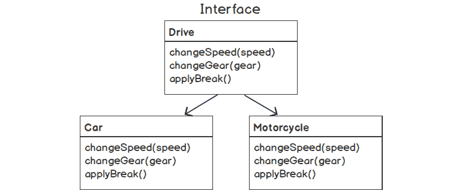

]

图 5.18：驱动接口图

参考前面的图，再次考虑车辆类比。汽车和摩托车都可以驾驶，因此它们需要自己的驱动接口。在驾驶过程中，它们应该改变速度、改变档位、施加制动等。我们可以看到，驾驶行为是共同的，两种类型的车辆中必要的动作是相同的。问题是，尽管动作相同，但它们处理这些动作的方式不同。这就是我们需要接口的地方。我们可能想要声明一个具有 `changeGear()`、`changeSpeed()` 和 `applyBreak()` 抽象方法的 `Drive` 接口。

因此，接口侧重于功能，而不是作为对象的模板（抽象类的模板）。这是接口和类抽象之间的主要区别。

我们可以为 `Car` 和 `Motorcycle` 添加一个简单的驱动接口，以便车辆可以改变速度、改变档位和施加制动。如果车辆没有实现制动，则将显示致命错误。

让我们在下面的练习中添加驾驶功能作为接口。

## 练习 5.7：实现接口

在这个练习中，我们将练习使用对象接口，并学习接口如何为对象实现行为提供一种标准方式。我们将创建一个接口，包含必要的驾驶指南，例如改变速度和档位的能力，或在需要时施加制动的能力：

注意

根据 PSR 命名约定，接口名称必须后缀为 `interface`；例如，`TestInterface` ([`packt.live/2IEkR9k`](https://packt.live/2IEkR9k))。

1.  创建以下 `Drive` 接口并将其保存为 `DriveInterface.php`：

    ```php
    <?php
    interface DriveInterface
    {
        public function changeSpeed($speed);
        public function changeGear($gear);
        public function applyBreak();
    }
    ```

    在这里，我们声明了 `Drive` 接口，并使用最小的方法签名集。记住，这里不应该有任何实现；相反，实现应该转移到实现该接口的对象中。

    要改变速度，我们添加了 `changeSpeed($speed)` 方法签名，它接受一个参数以实现所需的速度。要改变挡位，我们添加了 `changeGear($gear)` 方法签名，它接受一个参数以切换到要换的挡位。要应用刹车，我们添加了 `applyBreak()` 方法，这样我们就可以在需要时模拟“刹车”行为。

1.  按照以下方式将接口添加到 `Car` 和 `Motorcycle` 类中：

    ```php
    <?php
    require_once 'AbstractVehicle.php';
    require_once 'DriveInterface.php';
    ```

1.  现在，`Car` 和 `Motorcycle` 类应该按照以下方式实现接口，并为 `changeSpeed()`、`changeGear()` 和 `applyBreak()` 添加它们自己的实现：

    ```php
    class Car extends AbstractVehicle implements DriveInterface 
    {

    }
    class Motorcycle extends AbstractVehicle implements DriveInterface 
    {

    }
    ```

    如果我们尝试运行 `Car.php` 或 `Motorcycle.php`，它将产生一个致命错误，指出这些类必须包含三个抽象方法，因此必须声明为抽象或实现剩余的方法。因此，我们需要添加这三个接口或方法的实现。

1.  按照以下方式在 `Car` 类中实现这三个方法：

    ```php
        public function changeSpeed($speed)
        {
            echo "The car has been accelerated to ". $speed. " kph. ".          PHP_EOL;
        }
        public function changeGear($gear)
        {
            echo "Shifted to gear number ". $gear. ". ". PHP_EOL;
        }
        public function applyBreak()
        {
            echo "All the 4 breaks in the wheels applied. ". PHP_EOL;
        }
    ```

    在这里，`Car` 实现了 `DriveInterface` 接口的三个方法。我们可以在其中放置相关的实现，但为了学习的目的，我们只是在其中打印了一条简单的信息。

1.  现在，按照以下方式实例化 `Car` 类并开始驾驶：

    ```php
    $car = new Car('Honda', 'Civic', 'Red', 4, '23CJ4567');
    $car->changeSpeed(65);
    $car->applyBreak();
    $car->changeGear(4);
    $car->changeSpeed(75);
    $car->applyBreak();
    ```

    在这里，我们调用了驾驶方法来执行 `Car` 实现的操作。

1.  如果我们尝试使用 `php Car.php` 运行 `Car` 脚本，前面的代码应该打印以下内容：

    图 5.19：由汽车实现的 `DriveInterface` 接口

1.  还需要在 `Motorcycle` 类中添加这三个方法的实现，如下所示：

    ```php
        public function changeSpeed($speed)
        {
            echo "The motorcycle has been accelerated to ". $speed. " kph. " .           PHP_EOL;
        }
        public function changeGear($gear)
        {
            echo "Gear shifted to ". $gear. ". " . PHP_EOL;
        }
        public function applyBreak()
        {
            echo "The break applied. " . PHP_EOL;
        }
    ```

    在这里，我们在 `Motorcycle` 类中实现了 `DriveInterface` 接口。就像那样，你可以提出自己的实现，在这里，为了学习的目的，我们在这种 `DriveInterface` 实现中打印了不同的信息。

1.  现在，按照以下方式实例化 `Motorcycle` 类并开始驾驶：

    ```php
    $motorcycle = new Motorcycle('Kawasaki', 'Ninja', 'Orange', 2,   '53WVC14598');
    $motorcycle->changeSpeed(45);
    $motorcycle->changeGear(3);
    $motorcycle->applyBreak();
    ```

    在这里，我们调用了驾驶方法来执行 `Motorcycle` 实现的操作。

1.  如果我们尝试使用 `php Motorcycle.php` 运行 `Motorcycle` 脚本，前面的代码应该打印以下内容：


图 5.20：由摩托车实现的 `DriveInterface` 接口

因此，车辆可以在行驶过程中换挡、变速和刹车。`DriveInterface` 接口描述了车辆及其派生对象在行驶中应遵循的标准行为，而这些派生对象遵循了标准特性的公式。此外，该接口还可以添加更多功能，以便派生对象必须实现它们。

注意

实现方法和接口方法的声明必须相互兼容；例如，参数数量或签名应该完全相同。

## 抽象类与接口

我们已经了解了类抽象和对象接口的概念如何作为继承的附加维度很好地工作，从而为派生对象提供共同的行为和标准。关于何时使用抽象类和何时使用接口，经常有争论。尽管我们已经通过练习了解了两者的实际应用案例，但这个话题仍然需要讨论。

抽象类旨在通过方法向扩展对象提供共同的行为或动作，同时为共同方法的不同实现保留重要的空间。相比之下，接口是为了设置与对象交互的标准方式。一个抽象类必须至少有一个抽象方法，而接口中的所有方法都是抽象的。记住，这并不是一个有一个或多个抽象方法与所有抽象方法的概念。在继承方面，两者都有自己的用例：抽象类提供共同的功能，并允许我们实现自己的功能，而接口根本不是关于共享功能；相反，接口完全是关于为某些动作设置标准。

简单的抽象类可以有实现的方法和属性，而接口则不能，因为它们包含常量和没有主体的方法签名。因此，无法通过接口共享代码。

在之前的练习中，抽象类为我们提供了共同的引擎功能，并允许我们以自己的方式处理引擎的特定功能。接口向我们展示了驾驶汽车的标准，我们遵循这些指南以实现我们的驾驶行为目标。

## 类类型提示在依赖注入中发挥作用

类型提示允许我们定义要传递给函数的数据类型。PHP 支持类类型提示，这意味着在函数参数中，你可以提到传递的参数对象属于哪个类类型。例如，一个`User`类可能想使用`Mailer`服务来发送电子邮件。`Mailer`对象可以传递给`User`类，而`User`需要确保传递给它的不是`Mailer`对象以外的任何东西。

查看以下示例，其中函数参数预期为特定类的实例：

```php
function myMethod($object)
{
    if(!($obj instanceof ClassName)) 
    {
        throw new Exception('Only Objects of ClassName can be sent to this           function.');
    }
}
```

如果对象不是预期类的实例，则抛出异常，消息为"`只有 ClassName 的对象可以发送到这个函数。`"。

注意

异常是一个可以抛出并带有错误信息的类，这样捕获块就可以捕获异常并相应地工作。"第八章，错误处理"详细讨论了异常。

之前的代码片段等同于以下类类型提示语法：

```php
function myMethod(ClassName $object)
{
}
```

因此，使用类类型提示，我们可以强制函数或方法调用者传递适当的对象类型。当应用类类型提示时，PHP 会自动执行`instanceof`检查，如果对象不满足类关系，则产生错误。

`user`对象可能需要发送电子邮件并执行某些数据库操作；因此，用户依赖于`mailer`对象和`database`对象。我们可以如下提供这样的`mailer`和`database`对象给`user`对象：

```php
User.php
1  <?php
2  class User 
3  {
4      public $name;
5      private $mailer;
6      private $database;
7      
8      function __construct(string $name, Mailer $mailer, Database $db)
9      {
10         $this->name = $name;
11         $this->mailer = $mailer;
12         $this->database = $db;
13     }
14 }
https://packt.live/2M2Kl23
```

在这里，在实例化`User`类时，我们传递了用户名、一个`mailer`对象和一个`database`对象作为参数。`Mailer` `$mailer`类类型提示确保只能提供`Mailer`类的唯一实例，而`Database $database`类的其他类类型提示确保只能提供`Database`类的唯一实例。我们在用户的构造函数中添加了这两个对象依赖项，以便对象加载了某些依赖项，并且任何注入依赖项的失败都将阻止对象创建。

之前的技术被称为**构造器注入**。您可以使用 setter 方法注入依赖项，或者可以使用依赖注入容器。您可以搜索书籍或在线资源来进一步扩展您对依赖注入的了解。

在下一节中，我们将讨论多态的两个重要方面，它们在不同条件下服务于相同的目的。

# 覆盖

覆盖是更新现有实现（继承的实现）的过程；它可以是重新声明派生对象中的类属性，或者可以是使用全新的函数体更新继承的成员方法。覆盖保持外部接口不变，而内部

功能可能完全改变以适应您的目标。在 PHP 中，您可以同时进行属性和方法覆盖。请注意，这种覆盖发生在通过继承派生的新类中。

例如，一个动物类可能提供一种共同的行为；例如，吃。这种行为通过继承在动物子类之间共享。但事实是，每个动物子类都有自己独特的方式进食。像狗和鸟一样，它们在自己的类中重新定义了进食的行为。添加自己独特方式的观念被概念化为覆盖。

## 属性覆盖

属性覆盖是替换子类中父类数据的进程。我们已经看到，`Motorcycle`类覆盖了从父类`Vehicle`继承的轮子数量，将其更改为两个，因为摩托车是两轮车。因此，为了满足派生类的要求，我们覆盖了以下属性：

```php
<?php
require_once 'AbstractVehicle.php';
class Motorcycle extends AbstractVehicle 
{
    public $noOfWheels = 2;
    public $stroke = 4;
}
```

## 方法覆盖

当我们需要重写继承的方法时，方法重写是必要的。例如，为了获取车辆的价格，类提供了一个 getter 方法，车辆子类可以通过继承使用 getter。如果我们想调整特定类型车辆返回的价格；例如，折扣后的摩托车价格，并保持`Car`的 getter 不变？我们需要通过重写来调整所需的子类价格 getter。

查看以下方法重写的示例：

```php
class MySimpleClass{
    public $propertyName = 'base property';
    function methodName()
    {
        echo 'I am a base method. ';
    }
}
class MyNewClass extends MySimpleClass{
    function methodName()
    {
        echo 'I am an overridden method. ';
    }
}
$object = new MyNewClass();
$object->propertyName; //holds 'base property'
$object->methodName(); //prints 'I am an overridden method.'
```

因此，我们可以重写继承的方法，并更新方法以使用新的实现。

让我们玩得开心一些，出售我们的车辆。到目前为止，我们已经在 OOP 的帮助下为我们的车辆添加了技术特性。现在，让我们为我们的车辆类型添加一些与商业相关的特性。在下面的练习中，汽车和摩托车的价格应使用通用方法返回。摩托车的价格应在应用 5%折扣后返回，而汽车价格不适用折扣。

## 练习 5.8：重写继承的方法

在这个练习中，我们将通过向父`Vehicle`类添加简单的`getPrice()`getter 方法并重写子类中的方法来练习方法重写。如果我们向父`Vehicle`类添加一个具有方法实现的 getter 方法，那么它应该对所有子类可用。我们将重写`Motorcycle`类中的`getPrice()`方法，因为我们需要在那个子类中以不同的方式处理定价：

1.  打开`AbstractVehicle.php`并在属性部分添加以下受保护的属性：

    ```php
        protected $price;
    ```

1.  还在方法部分添加`getPrice()`和`setPrice()`价格 getter 和 setter 方法，如下所示：

    ```php
        function getPrice()
        {
            return $this->price;
        }
        function setPrice($price)
        {
            $this->price = $price;
        }
    ```

    在这里，`getPrice()`简单地返回价格，`setPrice()`接受`$price`作为参数，将其分配给车辆的`price`属性，并且这两个方法都应该对`Car`和`Motorcycle`对象可用，以便我们可以分别设置和获取汽车和摩托车的价格。

1.  想象一下，为了特殊场合，所有类型的摩托车都有 5%的折扣。现在，我们需要将这个折扣应用到这种特定车辆类型的价格上。

    为了对价格进行不同的处理，我们需要在`Motorcycle.php`类中重写`getPrice()`方法，并将`getPrice()`方法添加到类中，如下所示，并修改价格计算：

    ```php
        function getPrice()
        {
            return $this->price - $this->price * 0.05;
        }
    ```

    在这里，我们从原始价格中扣除了折扣值。因此，摩托车对象将返回折扣后的价格，而汽车对象将返回原始价格。

1.  为了测试折扣后的价格，我们应该实例化`Motorcycle`类，设置价格，并获取价格以查看是否应用了折扣。让我们在`Motorcycle.php`中执行以下操作：

    ```php
    $motorcycle = new Motorcycle('Kawasaki', 'Ninja', 'Orange', 2,   '53WVC14598');
    $motorcycle->setPrice(5000);
    echo "The price is ". $motorcycle->getPrice() . PHP_EOL;
    ```

    在这里，我们将原始价格设定为`5000`并尝试使用`getPrice()`方法获取价格。

1.  现在，如果我们使用`php Motorcycle.php`命令运行`Motorcycle.php`，前面的代码将输出以下内容：

    ```php
    The price is 4750
    ```

因此，所提到的折扣已经应用于摩托车价格，如果我们为汽车应用 getter 和 setter 方法，我们应该得到与原始设置相等的汽车价格。这就是为什么当我们需要子类以不同方式实现某些功能时，我们需要重写。

## 重载

使用重载的多态概念的一个重要方面是关于同一事物以不同的方式定义或在不同场合表现出不同的行为。

通常，在 C++和 Java 等编程语言中，方法重载或函数多态只是声明具有不同参数的相同函数；例如，`int add(int a, int b)`，`int add(int a, int b, int c)`，`double add(double a, double b, double c)`等等。这些可能具有不同的实现。在这种传统方式中，函数名保持不变，而返回类型和参数的数量及其类型可能不同。这种情况也发生在静态类型编程语言（C++/Java）中，其中类型检查发生在编译时，函数绑定取决于每个参数的类型。因此，对于静态类型语言，每个这样的函数都是不同的。

在 PHP 中，你可以尝试声明一个与以下相同的名称的函数或方法：

```php
function add($a, $b)
{
    //function body
}
function add($a, $b, $c)
{
    //function body
}
```

这将产生一个致命错误，你不能重新声明具有相同名称的函数或方法。

PHP 不支持多次声明相同的函数。尽管如此，你可以使用内置的`func_get_args()`函数来实现经典的重载功能，以便使同一个函数能够接受多个参数，因为 PHP 不关心参数类型。以下是一个讨论的例子。让我们使用以下方法：

```php
function add() 
{
    $sum = 0;
    $args = func_get_args();
    foreach ($args as $arg)
    {
        $sum += $arg;
    }
    return $sum;
}
echo add(1, 2); //outputs '3'
echo add(10.5, 2.5); //outputs '13'
echo add(10.5, 2.5, 9.6, 55.2); //outputs '77.8'
```

`func_get_args()`可以使你的函数支持多个参数。此外，如果你担心参数类型，你可以在函数内部处理类型检查。

因此，前面提到的方法不是本节将要讨论的关于面向对象编程（OOP）中方法重载的方法。PHP 在面向对象编程中的重载方面提供了很多灵活性。然而，这种方法与其他语言不同，这也可能是为什么在传统重载方式与 PHP 的重载方式之间存在一些争议。

PHP 中重载的解释与大多数其他面向对象的语言不同。重载允许你拥有多个具有相同名称但不同签名的函数。

PHP 允许通过实现某些魔术方法来重载属性和方法调用。当尝试访问当前作用域中未声明或不可访问的属性和方法时，会调用这些魔术方法。这些特殊的代理方法用于在运行时创建属性和方法（动态属性和方法），我们可以在我们的类中轻松实现魔术方法以实现多种功能。

## 属性重载

我们可能需要在运行时向我们的对象添加数据；例如，在我们的 `Car` 子类中，我们没有声明模型、年份、车主姓名等属性。但在程序运行时，我们可能希望将这些属性存储在我们的对象中。PHP 允许您通过属性重载在运行时实现这样的动态属性添加。因此，通过这种动态声明，属性在用途上足够多态，并且可以轻松重载。

对于属性或属性重载，PHP 支持以下两个魔术方法：

+   `public __get(string $attribute) : mixed`

+   `public __set(string $attribute, mixed $value)`

`__get()` 在访问或读取未声明或不可访问（受保护或私有）属性时被调用，而 `__set()` 在尝试写入未声明或不可访问（受保护或私有）属性时被调用。我们只需要在我们的类中实现这两个特殊方法，以使用动态（在运行时创建）属性。`__set()` 接受任何类型的（混合）数据作为第二个参数；`__get()` 返回该类型的数据。在这里，`mixed` 关键字被用来解释该方法返回或接受的数据类型，如整数、字符串、数组、对象等。

让我们看看这里具有这些两种方法实现的类：

```php
<?php
class MyMagicClass 
{
    private $arr = array();
    public function __set($attribute, $value)
    {
        $this->arr[$attribute] = $value;
    }
    public function __get($attribute)
    {
        if (array_key_exists($attribute, $this->arr)) 
        {
            return $this->arr[$attribute];
        }
        else 
        {
            echo 'Error: undefined attribute.';
        }
    }
}
$object = new MyMagicClass();
$object->dynamicAttribute = 'I am magic';
echo $object->dynamicAttribute . PHP_EOL; //outputs, I am magic 
```

在这里，私有声明的属性 `$arr` 存储来自 `__set()` setter 魔术方法的动态属性。该属性已被用作数组键，通过 `$this->arr[$attribute] = $value` 这一行存储传递的值。

此外，为了通过实现的 getter 魔术方法 `__get()` 返回已设置的属性，我们已使用 `array_key_exists()` 函数检查该属性是否存在于数组中。如果存在，则通过使用属性名作为键访问 `$arr` 来返回属性值。否则，打印错误信息。

在 `$object->dynamicAttribute = 'I am magic';` 这一行，我们访问了一个在 `MyMagicClass` 类内部任何地方都没有声明的属性。因此，在幕后，调用了魔术方法 `__set('dynamicAttribute', 'I am magic')` 来存储该属性。`__get('dynamicAttribute')` 在 `echo $object->dynamicAttribute . PHP_EOL;` 这一行被调用。

实现这样的魔术方法为您提供了很多灵活性来定义自己的属性。请记住，属性重载在对象上下文中工作，而不是在静态上下文中。

现在，问题是，我们是否允许动态创建许多属性，或者我们应该施加一些限制？或者是否存在一组预定义的属性，我们接受为重载。答案是，我们应该预定义我们将要重载的属性集。在先前的例子中，我们应该将一个预定义的重载属性列表添加到一个数组中，并在`__set()`方法中，将给定的动态属性与我们的预定义数组交叉检查，以确定是否允许。

让我们来看看以下示例：

```php
MyMagicClass.php
1  <?php
2  class MyMagicClass
3  {
4      private $arr = array('dynamicAttribute' => NULL,'anotherAttribute' => NULL);
5      public function __set($attribute, $value)
6      {
7          if (array_key_exists($attribute, $this->arr))
8          {
9              $this->arr[$attribute] = $value;
10         } 
11         else 
12         {
13             echo 'Error: the attribute is not allowed. ';
14         }
15     }
https://packt.live/2B1RAkO
```

在这里，我们在`$arr`私有属性中添加了一个关联数组，当`__set()`方法触发时，我们使用`array_key_exists()`函数检查属性是否在`$arr`中允许；否则，我们打印一条错误信息。

我们足够灵活，可以提出这样的特殊代理方法的创新实现和限制。在魔法设置器和获取器实现之后，我们可以实现以下两个魔法方法：

+   `public __isset(string $attribute) : bool`

+   `public __unset(string $attribute): void`

如果我们想要使用`isset($attribute)`或`empty($attribute)`函数检查属性，那么应该实现`__isset()`。同样，如果我们想要实现和取消设置属性，应该实现`__unset()`。没有`__isset()`和`__unset()`，我们将无法使用原生的`isset()`和`unset()`。

注意

PHP 的魔法方法不应声明为静态，因为它们仅在对象上下文中触发。实现的魔法方法必须声明为公共的。此外，在魔法方法中不能使用按引用作为参数。`__`符号是为魔法方法保留的。

## 方法重载

方法重载完全是关于使用相同的方法做额外的工作。例如，在我们的`Car`子类中，我们没有声明`honking`行为。如果我们能够在运行时动态地使用`honk()`方法，并且可以用响亮的声音重载正常的`honking`行为，那会怎么样？PHP 支持这样的动态方法声明，并且我们允许重载这些方法。

对于方法重载，PHP 支持以下两个魔法方法：

+   `public __call(string $method, array $arguments): mixed`

+   `public static __callStatic(string $method, array $arguments): mixed`

这些是当在对象上下文中调用不可访问的方法时触发的`__call()`，以及当在静态上下文中调用不可访问的方法时触发的`__callStatic()`。这些方法的第二个参数是`$arguments`，它是一个数值索引数组。索引 0 包含第一个参数，依此类推。

让我们来看看以下这些魔法方法的实现：

```php
MyMagicMethodClass.php
1  <?php
2  class MyMagicMethodClass 
3  {
4      public function __call($method, $arguments)
5      {
6          var_dump($arguments);
7      }
8      public static function __callStatic($method, $arguments)
9      {
10         var_dump($arguments);
11     }
12 }
https://packt.live/2ou8JRm
```

在这里，使用 `$object->showMagic('object context', 'second argument');` 这一行，`showMagic()` 在任何地方都没有声明，或者是一个对对象处理程序不可访问的方法，所以幕后 `__call()` 被调用，就像 `__call('showMagic', array('object context', 'second argument'))`。同时，你可以看到 `showMagic()` 方法可以与不同数量的参数交互。

同样，`__callStatic('showMagic', array(static context'))` 在静态上下文中工作，当调用 `MyMagicMethodClass::showMagic('static context')` 时。

## 练习 5.9：实现属性和方法重载

在这个练习中，让我们在 `AbstractVehicle` 中实现属性和方法重载的魔术方法，以便车辆类型都应该能够在运行时定义它们的动态属性和方法。我们所需做的只是，将之前讨论的 `__set()`、`__get()` 和 `__call()` 魔术方法实现到 `AbstractVehicle` 类中。这将帮助 `Car` 和 `Motorcycle` 对象获得这样的运行时属性和方法创建：

1.  打开 `AbstractVehicle.php` 并添加以下私有属性，它持有动态时间属性：

    ```php
            private $runtimeAttributes = array();
    ```

    在这里，`$runtimeAttributes` 应该作为一个关联数组来存储动态属性的运行时键值对。属性或属性名称应该是键，相关值是关联值。

1.  现在，我们应该在 `AbstractVehicle` 类中添加魔术设置器，`__set()`，如下所示：

    ```php
            function __set($attribute, $value)
            {
                $this->runtimeAttributes[$attribute] = $value;
            }
    ```

    在这里，`$attribute` 名称和 `$value` 通过 `$attribute` 和 `$value` 参数传递给魔术方法。使用 `$attribute` 属性名称参数作为键，将 `$value` 运行时属性存储在关联数组中，这样我们就可以通过 `$this->runtimeAttributes[$attribute]` 访问运行时属性。

1.  让我们添加魔术获取器，`__get()`：

    ```php
            function __get($attribute)
            {
                if (array_key_exists($attribute, $this->runtimeAttributes)) 
                {
                    return $this->runtimeAttributes[$attribute];
                } 
                else 
                {
                    echo "Error: undefined attribute. " . PHP_EOL;
                }
            }
    ```

    在这里，魔术方法要求通过传递属性名称作为参数来返回运行时属性值。该方法使用 PHP 的 `array_key_exists()` 函数检查属性名称是否作为键存在于 `$this->runtimeAttributes` 中。如果属性之前已设置，则应返回它，否则将打印前面的错误消息。

1.  现在，在 `Car.php` 类中尝试在运行时创建这样的属性。例如，我们可以添加汽车属性，如 `ownerName`、`make`、`year` 等，如下所示：

    ```php
    $car = new Car('Honda', 'Civic', 'Red', 4, '23CJ4567');
    $car->ownerName = 'John Doe';
    echo " Owner: ". $car->ownerName . PHP_EOL;
    $car->year = 2015;
    echo " Year: ". $car->year . PHP_EOL; 
    $car->wipers;
    ```

    在这里，我们没有在 `Car` 类中声明 `$ownerName` 和 `$year`。当通过一个未声明或对对象不可访问的 `Car` 对象处理程序访问属性时，PHP 将调用魔术方法以提供该属性。请注意，如果没有为这样的运行时属性分配值，它将不可用或注册。

    由于 `Car` 类继承了实现的魔术方法，并且我们已经使用 `$car->ownerName` 和 `$car->year` 在属性上设置了值，它们已经被添加到私有父类 `Vehicle` 的 `$runtimeAttributes` 数组中。

1.  如果我们尝试使用`php Car.php`命令运行`Car.php`，前面的代码应该按以下方式打印：

    ```php
            function __call($method, $arguments)
            {
                echo "The method $method() called. " . PHP_EOL;
            }
    ```

1.  这里，我们添加了带有两个参数的魔术方法实现。第一个参数`$method`是方法名称，后者`$arguments`是一个参数数组，当调用给定方法时，我们将传递这些参数。

    因此，我们可以添加自己的样式或模式作为实现，但现在，为了简单起见，我们只是在函数内部打印了方法名称。

1.  在`Car.php`的底部添加以下行：

    ```php
    $car->honk();
    ```

    这里，我们调用了`honk()`方法，以动态地向我们的`Car`对象添加鸣笛行为。

1.  如果我们使用`php Car.php`命令运行`Car.php`，它将输出以下内容：

    图 5.22：汽车的函数重载

1.  我们现在可以通过在`AbstractVehicle.php`中更新`__call()`方法，以下列内容轻松地重载`honk()`方法：

    ```php
    AbstractVehicle.php
    111     function __call($method, $arguments) 
    112     { 
    113         switch ($method) { 
    114             case 'honk': 
    115                 if (isset($arguments[0])) { 
    116                     echo "Honking $arguments[0]... " . PHP_EOL; 
    117                 } else { 
    118                     echo "Honking... " . PHP_EOL; 
    119                 } 
    120                 if (isset($arguments[1])) { 
    121                     echo "$arguments[1] enabled... " . PHP_EOL; 
    122                 } 
    123                 break; 
    124             default: 
    125                 echo "The method $method() called. " . PHP_EOL; 
    126                 break; 
    127         } 
    128     } 
    https://packt.live/2pbDEC8
    ```

    在这里，我们添加了一个 switch case 来适应不同的动态方法。我们为`honk()`方法添加了一个 case，以便我们可以对其做出响应并执行`honk()`方法的步骤。在`honk()`case 中，为了演示目的，我们检查了提供的参数，根据第一个参数打印了一条消息，并根据第二个参数打印了另一条消息，依此类推。我们也可以以不同的方式处理参数。

1.  在`Car.php`的底部，在之前的`$car->honk()`行之后，添加以下两行：

    ```php
    $car->honk('gently');
    $car->honk('louder', 'siren');
    ```

    这里，我们重载了`honk()`方法，并且该方法变得多态。我们可以鸣笛（默认），我们可以轻柔地鸣笛，我们可以大声鸣笛，在紧急情况下我们可以启用警报器。鸣笛的类比整个想法是总结我们如何在 PHP 中重载方法。

1.  如果我们使用`php Car.php`命令运行`Car.php`，它将输出以下内容：


图 5.23：`honk`方法的重载

这就是我们可以向我们的对象添加动态属性和行为的方法，当然，我们当然可以在这些魔术方法中添加属性/方法限制，并与预构建的清单进行交叉检查，实现模式，等等。

## 最终类和方法

当我们通过提供一组标准的属性和方法来描述对象并既不希望修改类也不希望扩展该类来最终化我们的类声明时，我们需要使用 `final` 关键字声明它。例如，在一个简单的登录过程中，我们将给定的密码与存储的密码匹配以授予用户访问权限。我们不希望修改这个密码匹配器方法，因此我们需要将该方法声明为最终方法，或者我们的用户身份验证类可能有一组标准的我们不想修改或扩展的方法，因此我们需要将类声明为最终类。

最终类被编写为不继承，最终方法不能被覆盖。PHP 使用 `final` 关键字在最终类和最终方法之前。

查看以下最终类的示例：

```php
final class MyClass
{
    public function myFunction()
    {
        echo "Base class method called.";
    }
}
class MyChildClass extends MyClass 
{
}
```

在这里，如果我们尝试扩展最终类 `MyClass`，它将产生一个致命错误，即 `MyChildClass` 类不能从最终的 `MyClass` 类继承。

此外，让我们有一个最终方法的示例：

```php
class MySimpleClass
{
    final public function mySimpleMethod()
    {
        echo "Base class method mySimpleMethod() called.";
    }
}
class MyChildClass extends MySimpleClass
{
    public function mySimpleMethod()
    {
        echo "Child class method mySimpleMethod() called.";
    }
}
```

前面的操作将产生一个致命错误，因为您不能覆盖最终方法。

## 练习 5.10：实现最终类和方法

在这个练习中，我们将练习实现一个最终类和方法，以了解最终化方法和类的后果。我们将在 `Car` 子类中将一个成员方法作为最终方法应用，然后我们将把 `Car` 类作为最终类应用，这样我们就可以阻止从 `Car` 类的任何派生（继承）：

1.  打开 `Car.php` 并按照以下方式定位 `start()` 方法：

    ```php
    <?php
        public function start()
        {
            if($this->hasKeyinIgnition) 
            {
                $this->engineStatus = true;
            }
        }
    ```

    如您所见，`Car` 会检查钥匙是否在点火位置以启动发动机。我们需要确保发动机启动过程涉及检查钥匙。换句话说，我们不会允许覆盖这个发动机启动过程。因此，我们需要通过在 `start()` 方法的访问修饰符之前使用 `final` 关键字来锁定任何可能的覆盖。

1.  在 `start()` 方法之前添加 `final` 关键字，如下所示：

    ```php
        final public function start()
        {
            if($this->hasKeyinIgnition) 
            {
                $this->engineStatus = true;
            }
        }
    ```

    在这里，`start()` 方法已经被最终化，不应允许覆盖。

1.  在 `Van.php` 文件中创建一个新的 `Car` 子类 `Van`，内容如下：

    ```php
    <?php
    require_once 'Car.php';
    class Van extends Car 
    {
    }
    ```

    在这里，`Van` 是 `Car` 类的后代，并准备好覆盖从父类获得的所有方法。

1.  让我们尝试覆盖由 `Car` 类声明的最终方法 `start()`：

    ```php
    class Van extends Car 
    {
        public function start()
        {
            $this->engineStatus = true;
        }
    }
    ```

    在这里，`Van` 类覆盖了 `Car` 类的 `engine start()` 方法，这在 `Car` 类中是不允许的。

1.  如果我们使用 `php –d display_errors=on Van.php` 命令运行 `Van.php`，我们应该看到以下致命错误：

    图 5.24：`Van` 子类尝试覆盖 `Car` 发动机启动方法

    覆盖失败在 `Van` 子类。当我们需要确保我们的方法不与对象通信时，我们需要最终化这些方法。

1.  现在，假设我们不需要进一步派生`Car`类，并且我们已经通过在`Car`类关键字之前添加`final`关键字来最终确定`Car`类，如下所示：

    ```php
    final class Car extends AbstractVehicle implements DriveInterface 
    {
    }
    ```

1.  再次，如果我们使用`php –d display_errors=on Van.php`命令运行`Van.php`，我们应该看到以下致命错误：

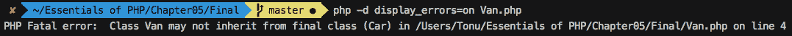


图 5.25：Van 子类尝试扩展 Car 类

这就是如何使用`final`关键字来防止方法覆盖和类扩展。在实践中，那些无论如何都不应该被覆盖的方法应该被最终化，那些不应该被扩展的类也应该被最终化。

# `trait`

在像 PHP 这样的单继承语言中，我们常常觉得我们可以扩展另一个类来继承一些功能。例如，在我们的`Car`类中，我们已经继承了所有通用的车辆功能，现在我们可能需要添加一些电子商务功能。同样，`Motorcycle`类可能也需要这样的电子商务功能。由于与电子商务相关的功能不属于`Vehicle`类，我们需要考虑一个替代方案来重用这样的电子商务行为。因此，当我们需要向我们的对象添加一组行为时，我们通过方法将行为分组，并在我们的类中使用`trait`。`trait`类似于一个类，但你不能实例化它；相反，你可以在类中使用`trait`。`trait`可以在类上下文中使用`use`关键字；例如，`use TraitName`。

查看以下`trait`语法：

```php
trait MyTraitName{
    function one()
    {
        …
    }
    function two()
    {
        …
    }
}
class MyClass extends B{
    use MyTraitName;
}
$object = new MyClass();
$object->one();
$object->two();
```

在这里，`MyTraitName``trait`帮助组合多个方法，`one()`和`two()`，并且为了重用这些方法，我们可以使用`MyTraitName;`来使用`trait`。因此，`trait`方法对`MyClass{…}`可用，并且可以使用`MyClass{…}`对象处理程序来调用，如前面的代码所示。

你可以使用多个`trait`，如下所示：

```php
class MyClass extends B
{
    use Trait1, Trait2;
}
```

再次，由`trait`插入的成员覆盖了继承的成员。让我们看看以下例子：

```php
<?php
class A{
    public function say()
    {
        echo 'Base ';
    }
}
trait T{
    public function say() 
    {
        parent::say();
        echo 'Trait ';
    }
}
class MyClass extends A{
    use T;
}
$object = new MyClass();
$object->say(); //outputs, Base Trait
```

在这里，`MyClass`扩展了具有名为`say()`方法的类`A`，因为`MyClass`使用了`trait`方法`say()`。然后，我们可以将`MyClass`成员`say()`视为覆盖了父类的`say()`。为了调用原始父方法`say()`，`trait`支持使用`parent::`来访问父类的方法。`trait`完全是关于向你的类提供被认为是类有用部分的方法的。

当前类成员可以覆盖`trait`添加的成员。再次，如果我们扩展前面的例子，我们可以得到以下例子：

```php
MyClass.php
1  <?php
2  class A 
3  {
4      public function say() 
5      {
6          echo 'Base ';
7      }
8  }
9  trait T  
10 {
11     public function say() 
12     {
13         parent::say();
14         echo 'Trait ';
15     }
https://packt.live/2M56lcA
```

注意，`say()`方法根据顺序被覆盖。`trait`方法覆盖继承的方法，类成员覆盖`trait`方法。因此，父类`A`中的`say()`被`trait` `T`的`say()`方法覆盖，然后，最终，`MyClass`中的`say()`覆盖了`trait`的`say()`方法。

特性是一种添加功能和扩展继承的方式。特性使您能够水平地添加更多功能，而无需继承另一个类。

## 练习 5.11：实现特性

在这个练习中，我们将创建一个新的特性名为`PriceTrait`，并将价格设置器和获取器方法从`AbstractVehicle`类移到这个特性中。由于与价格相关的功能不应属于核心车辆特性，而应属于电子商务特性，我们将添加各种价格方法到新的价格相关特性中。将价格相关方法移入`PriceTrait`的整体想法是概念化特性如何进入场景，并将逻辑上相关的方法定义为具有名称的组。

注意

根据 PSR 命名约定，特性名称必须后缀为 Trait；例如，`TestTrait` ([`packt.live/2IEkR9k`](https://packt.live/2IEkR9k))。

1.  打开`AbstractVehicle.php`并定位`getPrice()`和`setPrice()`方法。

1.  创建一个名为`PriceTrait.php`的新 PHP 文件，包含以下特性：

    ```php
    <?php
    trait PriceTrait
    {
    }
    ```

1.  将`Vehicle`类中的`getPrice()`和`setPrice()`方法剪切并粘贴到以下`PriceTrait`特性中：

    ```php
    <?php
    trait PriceTrait  
    {
        public function getPrice()
        {
            return $this->price;
        }
        public function setPrice($price)
        {
            $this->price = $price;
        }
    }
    ```

    在这里，我们添加了包含从`AbstractVehicle`类移除的`getPrice()`和`setPrice()`方法的`PriceTrait`特性体。请注意，这些方法仍然包含使用`$this`（对象实例变量）的原始行，尽管特性不能实例化，这意味着这些方法是为了被将要使用`PriceTrait`的类的对象访问而设计的。

1.  现在我们需要在`AbstractVehicle`类中引入`PriceTrait.php`文件，如下所示，以便`AbstractVehicle`类可以使用该特性：

    ```php
    <?php
    require_once 'PriceTrait.php';
        abstract class AbstractVehicle 
        {
            //code goes here
        }
    ```

1.  从`Vehicle`类中使用`PriceTrait`，如下所示：

    ```php
    <?php
    require_once 'PriceTrait.php';
    abstract class AbstractVehicle 
    {
            use PriceTrait;
            public $make;
            public $model;
            public $color;
            protected $noOfWheels; 
            private $engineNumber;
            public static $counter = 0;
            protected $engineStatus = false;
            protected $price;
            ...
    ```

    在这一行`use PriceTrait`中，`AbstractVehicle`类获取了包含两个价格设置和获取方法的`PriceTrait`特性。因此，`Car`和`Motorcycle`类继承了这两个方法，这正是我们的意图，以这种方式水平地添加功能。请注意，我们在`AbstractVehicle`类中保留了`$price`属性，以便通过派生车辆的设置器和获取器来访问它。

1.  `Car`和`Motorcycle`子类没有变化，因为它们应该自动使用特性方法。由于父类`Vehicle`使用`PriceTrait`，特性方法成为`Vehicle`类的成员，子类可以覆盖这些继承的方法。`Car`类没有覆盖价格方法，但`Motorcycle`类覆盖了`getPrice()`方法，以对给定的价格应用 5%的折扣。在`Motorcycle`类中定位`getPrice()`方法：

    ```php
        function getPrice()
        {
            return $this->price - $this->price * 0.05;
        }
    ```

    在这里，特性之后的这种覆盖对子类有效，这里不需要进行任何更改。

1.  为了测试折扣价格，我们应该实例化`Motorcycle`类，设置价格，并获取价格以查看是否应用了折扣，这在之前的`Motorcycle.php`中已经完成。在`Motorcycle.php`文件中定位以下内容：

    ```php
    $motorcycle = new Motorcycle('Kawasaki', 'Ninja', 'Orange', 2,   '53WVC14598');
    $motorcycle->setPrice(5000);
    echo "The price is  ". $motorcycle->getPrice() . PHP_EOL;
    ```

1.  现在，如果我们用`php Motorcycle.php`命令运行`Motorcycle.php`，前面的代码将输出以下内容：


图 5.26：由摩托车覆盖的特性方法

因此，特性可以用来添加类的成员方法，可以覆盖任何同名的现有成员方法，并且可以通过继承来被覆盖。或者，我们也可以直接在`Car`和`Motorcycle`类中使用`PriceTrait`，而不是通过`Vehicle`类来添加特性。我们的意图是通过父类`Vehicle`共享车辆的共同特性，这就是为什么我们在母类中使用了特性的原因。

## 类自动加载

如果你选择使用 Composer，你可以跳过这一部分。考虑为无法使用 Composer 的旧版 PHP 项目进行类自动加载。

注意

随着 PHP 包管理器 Composer 的加入，你可以利用 Composer 的自动加载器来加载类、库等等。有关更多详细信息，请参阅[`packt.live/2MrJG9u`](https://packt.live/2MrJG9u)。第九章，*Composer*详细讨论了**Composer**和**自动加载**。

要在另一个文件中使用的类，我们必须在当前文件中包含包含该类的相应文件。这种方法最终会在任何 PHP 脚本中包含大量的文件。因此，我们需要某种自动包含所需类文件的东西。

为了自动加载你的类，PHP 自带了`spl_autoload_register()`函数。使用该函数，我们可以注册任意数量的自动加载器，以便我们可以按需加载类和接口。是的——按需。这意味着自动加载是懒加载的——只有当它们被调用时才会加载类或接口。

查看以下简单的代码片段：

```php
<?php
spl_autoload_register(function ($className) 
{
    require_once $className. '.php';
});
$obj1= new ClassName1();
$obj2 = new ClassName2(); 
```

前面的代码片段等同于以下：

```php
<?php
require_once 'ClassName1.php';
require_once 'ClassName2.php';

$obj1  = new ClassName1();
$obj2 = new ClassName2(); 
```

因此，在前面的代码片段中，你可以看到我们向`spl_autoload_register()`函数传递了一个匿名 PHP 函数。这个匿名函数接受类或接口名称，并尝试包含/要求相应的文件。使用`spl_autoload_register`函数，我们可以注册我们自己的这样的自动加载器函数，并且我们可以执行所有 sorts 的操作来加载文件，例如设置文件路径/目录，检查文件是否存在，抛出异常等等。因此，我们可以避免一个较大的文件包含语句列表。

例如，对于`Car.php`和`Motorcycle.php`，我们可以用`spl_autoload_register()`函数替换以下两行：

```php
require_once 'AbstractVehicle.php';
require_once 'DriveInterface.php';
```

前面的代码片段可以用以下代码替换：

```php
spl_autoload_register(function ($className) 
{
    require_once $className. '.php';
});
```

因此，如下所示，当`Car`类继承自`AbstractVehicle`类并实现`DriveInterface`接口时，自动加载器会被调用以加载相应的类文件和接口文件：

```php
class Car extends AbstractVehicle implements DriveInterface 
{
...
}
```

在这里，当类或接口被使用时，注册的自动加载器会被调用以加载文件。

注意

要自动加载 PSR-4 类，请遵循[`packt.live/314fBCj`](https://packt.live/314fBCj)上的指南。

`spl_autoload_register()`函数的规范可以在[`packt.live/2B1PLEu`](https://packt.live/2B1PLEu)找到。

# 命名空间

正如其名所示，命名空间提供了命名和作用域，因此，命名空间是封装项的另一种方式。我们可以调用命名作用域，命名空间可以包含具有名称的组中的相关常量、函数、类、抽象类、特质和接口，并且可以使用名称来访问它们。

作为类比，考虑人的命名。人在家庭中会被赋予独特的名字以便识别和称呼。在家庭之外，如果有两个人同名怎么办？在计算机科学系可能有一个 John Doe，在电子工程系可能也有另一个 John Doe。巧合的是，他们最终都加入了大学足球队，因此他们可以被称作计算机科学系的 John Doe 或电子工程系的 John Doe。当然，球队不希望把足球传给错误的人。

同样适用于计算机文件系统：有目录和子目录。在一个目录内部，可以包含其他目录，但不能有两个同名目录。再次强调，同名文件可以存在于两个不同的目录中；例如，`/usr/home/readme.md` 和 `/var/projects/readme.md`。

在编程中，命名空间解决了诸如名称冲突等问题，其中类或库具有相同的名称，以便它们可以在不同的名称下使用。当然，我们不希望编写一个与另一个类的名称冲突而污染全局作用域的类。此外，命名空间提供了别名功能——我们可以缩短长名称，从而提高代码的可读性。

PHP 支持使用`namespace`关键字声明命名空间，如下所示：

```php
<?php
namespace MyNamespace;
const MYCONST = 'constant';
function myFunction()
{
...
}
class MyClass
{
...
}
echo MyNamespace\MYCONST;
echo myFunction(); //resolves to MyNamespace\myFunction
echo MyNamespace\myFunction();//explicitly resolves to MyNamespace\myFunction    
$object = new MyNamespace\MyClass();
```

命名空间应该是您在脚本中声明的第一个语句。尽管如此，您可以在不使用命名空间的情况下编写代码。

如果我们不定义命名空间，我们的代码将保持在全局命名空间中。这就是为什么全局命名空间很容易被产生名称冲突所污染。

声明命名空间的可选语法如下：

```php
namespace MyNamespace
{
    ...
}
```

我们可以在单个文件中声明多个命名空间，如下所示：

```php
<?php
namespace MyNamespaceA;
class MyClass
{
...
}
namespace MyNamespaceB;
class MyClass
{
...
}
$object1 = new MyNamespaceA\MyClass();
$object2 = new MyNamespaceB\MyClass();
```

强烈不建议在同一个文件中放置多个命名空间，以促进良好的编码实践。一个在同一个文件中放置多个命名空间的通用用例是包含多个 PHP 文件在同一个文件中。

您还可以声明子命名空间以实现命名空间的层次结构，如下所示：

```php
<?php
namespace MyNamespace\SubNamespace;
const MYCONST = 'constant';
function myFunction()
{
...
}
class MyClass
{
...
}
echo \MyNamespace\SubNamespace\MYCONST;
echo \MyNamespace\SubNamespace\myFunction();
$object = new \MyNamespace\SubNamespace\MyClass();
```

我们可以使用 `use` 关键字导入命名空间，并且可以选择使用 `as` 关键字给命名空间起别名，如下所示：

```php
//file1.php
<?php
namespace MyNamespaceA;
const MYCONST = 'constant';
function myFunction()
{
...
}
class MyClass
{
...
}
```

`file2.php` 将如下所示：

```php
<?php
namespace MyNamespaceB;
require_once 'file1.php';
use MyNamespaceA\MyClass as A; //imports the class name
$object = new A();//instantiates the object of class MyNamespaceA\MyClass
use function MyNamespaceA\myFunction;//importing a function
myFunction();//calls MyNamespaceA\myFunction
use function MyNamespaceA\myFunction as func;//aliasing a function
func();//calls MyNamespaceA\myFunction
use const MyNamespaceA\MYCONST; //imports a constant
echo MYCONST;//prints the value of MyNamespaceA\MYCONST
```

在 `use MyNamespaceA\MyClass as A;` 行中，`MyClass` 和 `MyNamespaceA` 被导入到 `MyNamespaceB` 中，并且在导入时将类名别名为 `A`，这样我们就可以将 `MyClass` 类实例化为类 `A`，即 `$object = new A();`。

对于其他导入也是如此。我们可以从另一个命名空间导入一个函数，例如使用 `MyNamespaceA\myFunction;` 函数，并通过使用 `MyNamespaceA\myFunction as func;` 函数来给它起别名。

这样，我们可以使用 `func()` 别名来调用函数。同样，在导入常量时也可以这样做。使用 `use const MyNamespaceA\MYCONST;` 行，我们导入了常量。

组合多个导入也是可能的：

```php
//file2.php
<?php
namespace MyNamespaceB;
require_once 'file1.php';
use MyNamespaceA\MyClass as A, MyNamespaceA\myFunction; 
$object = new A();//instantiates the object of class MyNamespaceA\MyClass
myFunction();//calls MyNamespaceA\myFunction
```

在 `use MyNamespaceA\MyClass as A, MyNamespaceA\myFunction;` 行中，我们同时导入了类和方法，并且将类名别名为 `A`。通常，导入必要的类或函数从命名空间的目的就是这样的导入，而不是导入整个命名空间。

PHP 命名空间提供了很多功能，并且有更多用例和方面可以在 [`packt.live/2AYilqj`](https://packt.live/2AYilqj) 学习。

## 练习 5.12：实现命名空间

在这个练习中，我们将将命名空间应用到我们的与车辆相关的类、特性和接口中。我们将对 `AbstractVehicle` 类、`DriveInterface`、`Car` 和 `Motorcycle` 类应用一个公共命名空间。对于特性，我们将应用不同的命名空间，以便我们可以将特性保持在与公共命名空间分开的状态：

1.  创建一个 `Vehicle` 目录来将 `AbstractVehicle.php` 和 `DriveInterface.php` 移动到其中。

1.  将 `AbstractVehicle.php` 和 `DriveInterface.php` 移动到当前工作目录下的车辆子目录中。

1.  创建另一个目录 `Traits` 来移动 `PriceTrait.php` 文件和未来的特性。

    目录结构如下所示：

    

    图 5.27：命名空间目录结构

1.  现在是时候将命名空间应用到我们的类和特性中了。打开 `PriceTrait.php` 文件并在开头添加 `Traits` 命名空间，如下所示：

    ```php
    <?php
    namespace Traits;
    trait PriceTrait  
    {
        … 
    }
    ```

    在这里，我们在 `PriceTrait` 的开头声明了 `Traits` 命名空间。我们的目的是在将来，在同一个命名空间下添加不同的特性文件；例如，`namespace Traits`（在任意新的特性文件的开头）。整个想法是将 `Traits` 命名空间应用到多个特性文件中，这样我们就可以通过命名空间选择正确的特性。因此，我们可以像使用 `\Traits\PriceTrait` 一样使用 `PriceTrait`。

1.  打开 `AbstractVehicle.php` 文件并删除以下行：

    ```php
    require_once 'PriceTrait.php'; 
    ```

    由于我们将自动加载类和特性文件，我们不需要手动要求文件。

1.  在 `AbstractVehicle` 类之前添加以下命名空间：

    ```php
    namespace Vehicle;
    ```

    在这里，`Vehicle` 命名空间将成为我们在车辆子类和接口之间共享的公共命名空间。

1.  使用命名空间更新 `use PriceTrait`，如下所示：

    ```php
    <?php
    namespace Vehicle;
        abstract class AbstractVehicle 
        {
            use \Traits\PriceTrait;
            …
        }
    ```

    在这里，`use \Traits\PriceTrait;` 行告诉自动加载器从位于代码库根目录的 `Traits` 目录加载 `PriceTrait`。

1.  在 `DriveInterface` 接口之前添加 `Vehicle` 命名空间，如下所示：

    ```php
    <?php
    namespace Vehicle;
    interface DriveInterface 
    {
        …
    }
    ```

    在这里，`DriveInterface` 与 `Vehicle` 命名空间共享，因此可以通过相同的命名空间访问该接口。

1.  打开 `Car.php` 文件以消除以下手动文件包含：

    ```php
    require_once 'AbstractVehicle.php'; 
    require_once 'DriveInterface.php';
    ```

    将 `Vehicle` 命名空间替换为以下内容：

    ```php
    <?php
    namespace Vehicle;
    class Car extends AbstractVehicle implements DriveInterface 
    {
        …
    }
    ```

    在这里，`Car` 与 `Vehicle` 具有相同的命名空间。因此，在类行中，`Car` 继承自 `AbstractVehicle` 并实现了 `DriveInterface`、`AbstractVehicle` 和 `DriveInterface`，以解决当前的命名空间 `Vehicle`。这与 `Car` 类继承自 `Vehicle\AbstractVehicle` 并实现 `Vehicle\DriveInterface` 相似。

1.  现在，在 `Car` 类之前添加 `spl_autoload_register()` 函数，如下所示：

    ```php
    <?php
    namespace Vehicle;
    spl_autoload_register();
    class Car extends AbstractVehicle implements DriveInterface 
    {
        …
    }
    ```

    因此，自动加载函数应从 `Vehicle` 目录加载 `AbstractVehicle` 类和 `DriveInterface` 接口，因为它支持从命名空间目录加载类。

1.  对于 `Motorcycle.php` 也进行相同的操作，如下所示：

    ```php
    <?php
    namespace Vehicle;
    spl_autoload_register();
    class Motorcycle extends AbstractVehicle implements DriveInterface 
    {
        …
    }
    ```

    在这里，`Motorcycle` 类也共享相同的命名空间 `Vehicle`，以便使用 `AbstractVehicle` 和 `DriveInterface`。

1.  在 `Car.php` 中，添加以下 `Car` 实例以测试 `AbstractVehicle` 和 `DriveInterface` 的实现：

    ```php
    $car = new Car('Honda', 'Civic', 'Red', 4, '23CJ4567');
    $car->start();
    echo "The car is " . ($car->getEngineStatus()?'running':'stopped') .   PHP_EOL;
    $car->changeGear(1);
    $car->changeSpeed(15);
    $car->changeGear(2);
    $car->changeSpeed(35);
    $car->applyBreak();
    $car->stop();
    echo "The car is " . ($car->getEngineStatus()?'running':'stopped')  .   PHP_EOL;
    ```

    在这里，为了测试扩展类和实现接口，我们实例化了 `Car` 类，并使用对象处理程序访问不同的成员方法。

1.  如果我们使用 `php Car.php` 命令运行前面的 `Car.php` 脚本，将产生以下输出：

    图 5.28：应用于 Car 的命名空间

    我们可以看到 `Car` 类可以访问应用于抽象类和接口的命名空间。

1.  现在，将以下 `Motorcycle` 实例添加到 `Motorcycle.php` 中以测试 `AbstractVehicle` 和 `DriveInterface` 的实现：

    ```php
    $motorcycle = new Motorcycle('Kawasaki', 'Ninja', 'Orange', 2,   '53WVC14598');
    $motorcycle->start();
    echo "The motorcycle is " . ($motorcycle->getEngineStatus()?'running':  'stopped') . PHP_EOL;
    $motorcycle->changeGear(3);
    $motorcycle->changeSpeed(35);
    $motorcycle->applyBreak();
    $motorcycle->stop();
    echo "The motorcycle is " . ($motorcycle->getEngineStatus()?'running':'stopped') . PHP_EOL;
    $motorcycle->setPrice(5000);
    echo "The price is ". $motorcycle->getPrice() . PHP_EOL;
    ```

1.  在运行 `Motorcycle.php` 脚本并使用 `php Motorcycle.php` 命令后，前面的代码将产生以下输出：

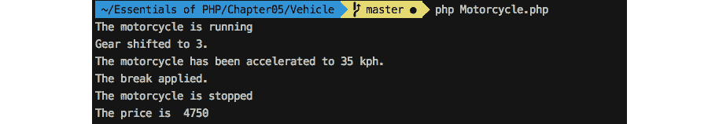

图 5.29：应用于 Motorcycle 的命名空间

在前面的练习中，我们看到了 `Vehicle` 命名空间封装了所有相关项，例如抽象类、接口和子类。因此，命名空间可以在多个文件的相关代码组件之间共享。此外，我们还可以在内部库、插件、实用文件等中创建子命名空间。命名空间的想法是将你的项目组织在一个独特且相关的名称下，这样在集成第三方代码组件时，你的代码组件不会发生冲突。

## 活动第 5.1 部分：构建学生和教授对象关系

在这个活动中，我们将实现 OOP 概念，创建具有参数化构造函数、属性和成员方法的 `Student` 和 `Professor` 类。我们将实例化这两个类，并在对象之间建立关系。教授可能在其课程中有一定数量的注册学生。应使用 `Professor` 对象的成员方法打印学生列表。

要执行的操作如下：

1.  创建一个名为 `activity1` 的目录，将所有活动内容放入其中。这应该是我们的工作目录（你可以使用 `cd` 命令进入该目录）。

1.  创建一个名为 `activity-classes.php` 的脚本文件。

1.  在不同的目录中创建 `Professor` 和 `Student` 类，并具有以下功能。

    两者都使用自己的命名空间自动加载类。

    两个类都将名称作为构造函数的第一个参数；`Professor` 类接受第二个参数作为学生列表 – 列表将仅过滤 `Student` 实例。

    两者都将具有标题属性，对于 `Professor` 类默认为 `Prof.`，对于 `Student` 类默认为 `student`。

1.  创建一个函数，用于打印教授的标题、姓名、学生数量和学生列表。

1.  创建一个 `Professor` 实例，提供一个名称和学生列表 – 构造函数中的 `Student` 实例具有名称。

1.  向 `Professor` 实例添加一定数量的 `Student` 实例。

1.  将教授的标题更改为 `Dr.`。

1.  通过调用函数并使用 `Professor` 实例来打印输出。

输出应如下所示：

```php
Dr. Charles Kingsfield's students (4):
  1\. Elwin Ransom
  2\. Maurice Phipps
  3\. James Dunworthy
  4\. Alecto Carrow
```

注意

本活动的解决方案可以在第 515 页找到。

# 摘要

在本章中，我们使用了面向对象的概念，并注意到了每个概念如何适应不同的场景。封装、继承、多态、数据抽象、动态绑定和消息传递都为我们的程序增添了新的维度。请注意，当这些概念适合你的特定场景时，可以采用它们；在此之前，没有必要使程序复杂化。我们已经看到，OOP 原则的误用很常见，而且将来这会增加复杂性的负担。

依赖项应从外部注入，而不是在内部硬编码。抽象不应依赖于细节；适当地隐藏你的数据，隐藏你的复杂性，并在消息传递时展示简单性。总的来说，应负责将程序中的对象与问题域进行映射。请记住这个简单的陈述：“如果你不能重用它，那么它就没有价值。”

在下一章中，我们将描述请求处理、存储本地数据和文件上传。
