# 第八章：8. 错误处理

概述

到本章结束时，你将能够描述 PHP 中的不同错误级别；使用自定义错误处理器；触发和记录错误消息；在关闭时捕获致命错误；解释 PHP 中异常的工作方式；定义、使用和捕获多个异常类；并注册顶级异常处理器。

此外，在本章中，你将触发所谓的用户级错误消息以及它们如何有帮助。在最后一部分，你将了解异常以及如何使用它们来控制脚本流程。

# 简介

在上一章中，你被介绍了 PHP 如何用于与文件系统交互，以便处理上传的文件、写入文本文件、创建文件和目录等。此外，你还被展示了如何使用 PHP 与 SQL 服务器一起操作结构化数据，例如用户账户或联系人列表。

在应用程序中处理错误非常重要，关注它们可以导致早期错误检测、性能改进以及应用程序的整体健壮性。错误可以触发以指示多种故障——数据丢失、语法错误、已弃用功能等，并且根据严重程度可能会终止脚本过程。例如，当数据库连接不可用时，应用程序会发出致命错误，这可以通过写入日志文件、向维护者/开发者发送包含丰富跟踪信息（如连接详情）的警报电子邮件，并在用户输出（例如浏览器）上显示友好的消息来处理。例如，在一个社交媒体网站上，当用户尝试对在中间被删除（或变得不可访问）的帖子添加评论时，会显示一个错误，通知无法添加评论的失败。

# PHP 中的错误

在软件编程中，错误和错误处理器是一个无价的概念，它帮助开发者在应用程序的编译时或运行时识别故障点。它们可以表示不同级别的严重性。因此，脚本可以发出导致进程停止的致命错误，可以发出警告，指出脚本可能的误用，也可以发出一些提示代码改进的通告（例如，在操作中使用未初始化的变量）。因此，根据严重性将错误分组在不同的级别，例如致命错误、警告、通知和调试消息，仅举几例。所有这些消息通常都收集到持久存储中，这个过程称为记录。最易访问的记录方法是写入本地文件系统上的文件，这是大多数（如果不是所有）应用程序的默认方法。开发者通过读取这些日志来识别问题或查找其他特定信息，例如内存使用或 SQL 查询响应时间。现代应用程序，如基于云的应用程序，不会在文件系统上保留应用程序日志；相反，它们将它们发送到专门的日志处理应用程序。

在 PHP 中，错误通过一系列内置函数来处理和记录。通过注册自定义错误处理器或设置特定范围的错误报告，这些函数可以方便地定制错误处理和记录以满足应用程序的需求。

由于这些函数已集成在 PHP 核心中，因此无需安装其他扩展即可使用它们。`php.ini`配置文件中的设置，或在运行时使用`ini_set()`函数，都会影响这些函数的行为。

以下表格列出了最常遇到的错误和广泛使用的记录配置选项：

![图 8.1：常见的错误和记录配置

![img/C14196_08_01.jpg]

图 8.1：常见的错误和记录配置

在安装了某个版本的 PHP 并设置了适当的值之后，始终建议检查这些值。当然，应特别注意生产服务器上的 PHP 设置。如果您希望在运行时更改配置值，可以使用以下方式使用`ini_set()`函数：

```php
ini_set('display_errors', 'Off');
```

然而，最好将所有配置都放在文件中。例如，在设置`display_errors`为"`Off`"以隐藏任何错误消息从用户输出的情况下，如果脚本在设置到达并读取之前失败编译，则错误将显示给用户。

现在让我们谈谈“编译时”和“运行时”。PHP 运行分为两个主要阶段，首先是编译，其次是解释：

1.  在第一阶段——编译时，PHP 解析脚本文件并构建所谓的机器码。这是由机器（计算机和服务器）运行的原始二进制格式，不是人类可读的。这一步可以使用 Opcache 或 APC 等工具进行缓存，由于它带来的巨大性能提升，因此推荐使用。

1.  在第二阶段——运行时，机器码实际上被执行。

此外，为了与运行 PHP 的服务器进行通信，它使用服务器应用程序编程接口（也称为服务器 API，简称 SAPI）。例如，从命令行（在终端）运行 PHP 时，将使用命令行界面（CLI）SAPI。对于网络流量，可以使用 Apache2 SAPI（作为 Apache2 服务器的模块），或者与 NGINX 服务器一起使用 FastCGI 进程管理器（FPM）SAPI。这些是 PHP 最常用的接口，它们根据需要安装，每个都包含自己的配置文件，通常导入主/默认配置，并扩展了它们自己的特定配置文件。我们稍后会讨论配置文件。

这里是错误消息最常见的预定义常量：

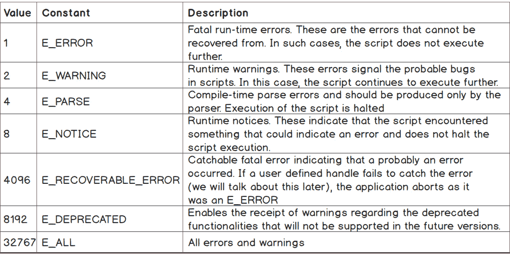

图 8.2：错误消息的预定义常量

这些错误由 PHP 引擎生成并报告，将在我们稍后遇到的错误处理器中报告。要更改 PHP 中的错误报告级别，可以使用 `error_reporting()` 函数，它只需要一个参数——用作 *位掩码* 的十进制数（在这种情况下，位掩码是一个二进制序列，用于匹配触发的错误消息级别），可以使用 `error_reporting()` 函数。`error_reporting()` 函数参数通常用作两个或多个错误级别常量之间的位运算表达式。例如，如果我们只想报告错误和警告，我们将在脚本运行时调用 `error_reporting(E_ERROR | E_WARNING);`。在 INI 配置文件中的 `error_reporting` 条目中也可以使用位运算表达式。

除了这些，还有一些其他错误代码（包括常量）用于用户脚本中按请求生成错误。

这里是用户级生成错误消息的预定义常量列表，使用 PHP 函数 `trigger_error()`：

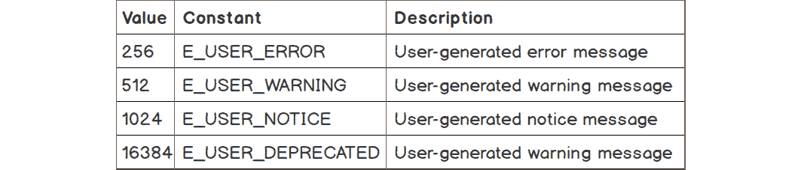

图 8.3：用户级生成错误消息的预定义常量

当开发者想在特定上下文中报告某些内容但又不想停止脚本的执行时，这些很有用。例如，当您通过“删除”函数等方式重构组件（在您的应用程序代码或您管理的 PHP 库中）时，您可能更愿意在要删除的函数中包含一个 `E_USER_DEPRECATED` 级别的消息，指向首选的替代方案，而不是仅仅删除函数，从而增加调用未定义函数错误消息的可能性，这可能会停止您的脚本。

要在运行时之前设置自定义 PHP 设置，只需将自定义配置文件添加到 PHP 的 INI（配置）目录中即可。要找到此目录，您应该运行 `php --ini`；输出将类似于以下内容：

![Figure 8.4：php-ini 命令的输出]

![img/C14196_08_04.jpg]

![Figure 8.4：php-ini 命令的输出]

注意

`--ini` 选项扫描并加载每个目录内的所有 `.ini` 文件。

查找“扫描附加 .ini 文件”，在那里您将找到您设置应该去的目录。

如果使用的配置目录在 CLI 和 FPM 模式之间是分开的，您应该确保为两种模式都添加自定义配置文件。

注意

如果前面的目录路径中包含 `/cli/`，这意味着配置仅适用于 CLI，您应该在 CLI 同一级别的 FPM 目录中查找并添加自定义配置。

接下来，请确保您已在自定义 INI 文件中设置了与 PHP 中的错误和日志相关的以下值。

创建 `/etc/php/7.3/cli/conf.d/custom.ini` 文件并设置以下值：

```php
error_reporting=E_ALL
display_errors=On
log_errors=Off
error_log=NULL
```

尽管我们可以利用 `error_log` 配置将所有内容记录到文件中，但我们将这项工作留给一个能够处理多个输出的日志组件，而不是单个输出——将日志发送到文件、日志服务器、Slack 等等。

您应该在错误报告和处理以及记录这些错误之间做出明确区分。

此外，前面的 PHP 配置值将被视为已设置。

快速检查时，使用 `ls -ln /etc/php/7.3/cli/conf.d`，我们应该得到以下内容：

![Figure 8.5：列出文件夹下的配置文件]

![img/C14196_08_05.jpg]

图 8.5：列出文件夹下的配置文件

如您所注意到的，已安装模块的配置与之前讨论过的 `/etc/php/7.3/mods-available/` 中的通用配置文件相关联。

## 处理错误

默认情况下，PHP 会将错误消息输出到用户输出（通过浏览器访问程序时在浏览器屏幕上，或在命令行界面运行时在终端/命令行中）。在应用程序开发的早期阶段应该更改这一点，以便在发布应用程序后，你可以确信不会向用户泄露任何错误消息，因为这会显得不专业，有时可能会吓到最终用户。应用程序的错误应该以这种方式处理，即最终用户在它们发生时不会看到一些可能的故障（例如，无法连接到缓存服务），或者与无法执行的操作相关的用户友好的错误消息（例如，在无法连接到数据库时无法添加评论）。

## 默认错误处理器

如果用户（开发者）没有指定其他错误处理器，PHP 将使用默认的错误处理器，该处理器简单地输出错误消息到用户输出，无论是浏览器还是终端/命令行。此消息包含错误消息本身、文件名以及错误被触发的行号。通过检查是否在命令行界面中运行默认错误处理器，`php -r 'echo $iDontExist;'`，你将得到以下输出：

```php
PHP Notice: Undefined variable: iDontExist in Command line code on line 1
```

这种类型的错误可能由应用程序的各个部分输出，原因多种多样：未定义的变量、将字符串用作数组、尝试打开一个不存在的（或没有读取权限）的文件、在对象上调用缺失的方法，等等。即使你设置了自定义的错误处理器并且不向最终用户显示这些错误，最好的做法也是解决它们而不是隐藏它们。设计你的应用程序以避免触发此类错误，将使你的应用程序性能更佳、更健壮，并且更不容易出现错误。

## 使用自定义错误处理器

我们总是希望在我们的应用程序中管理报告的错误，而不是在响应中输出它们。为此，我们必须注册我们自己的错误处理器，我们将使用内置函数 `set_error_handler()`。

语法如下：

```php
set_error_handler(callable $error_handler [, int $error_types = E_ALL |   E_STRICT ])
```

第一个参数是一个可调用对象，而第二个参数将指定此处理器将被调用的级别。

可调用对象是在执行过程中的某个点运行的函数，它将接收一个预期的参数列表。例如，通过运行以下 PHP 代码，`php -r 'var_dump(array_map("intval", [ "10", "2.3", "ten" ]));'`，`array_map()` 函数将为数组参数 `("10", "2.3", "ten")` 的每个元素调用 `intval()` 函数，提供元素值；因此，我们得到一个长度相同的数组，但包含整数值：

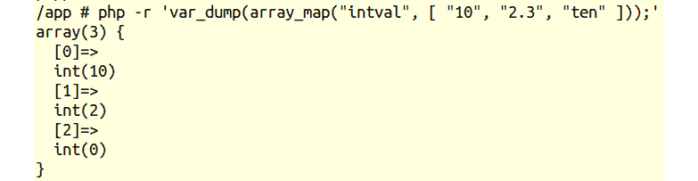

图 8.6：向函数传递值

可调用的类型可以是声明的函数、函数变量（匿名函数）、实例化的类方法、类静态方法，或者实现`__invoke()`方法的类实例。

如果抛出的错误类型与`set_error_handler()`中指定的不同，则将调用默认错误处理器。此外，当自定义错误处理器返回布尔值`FALSE`时，也将调用默认处理器。无论`error_reporting`的值如何，处理器仅用于指定的`$error_types`参数。

错误处理器应该具有以下签名：

```php
handler(int $errno, string $errstr [, string $errfile [, int $errline [, array   $errcontext]]]): bool
```

参数如下：

+   `$errno (整数)`: 指向消息的错误级别

+   `$errstr (字符串)`: 是错误信息本身

+   `$errfile (字符串)`: 发生错误的文件路径

+   `$errline (整数)`: 发生错误的文件中的行号

+   `$errcontext (数组)`: 在`$errfile`文件中`$errline`行发生错误时所有可用的变量列表，以关联数组中的名称-值对形式

## 练习 8.1：使用自定义错误处理器

到目前为止，我们已经学习了关于错误代码以及使用默认错误处理器进行错误报告的一些配置。在这个练习中，我们将注册一个自定义错误处理器，并学习如何使用它：

1.  创建一个名为`custom-handler.php`的文件，并添加以下内容。首先，我们定义错误处理器 – 存储在`$errorHandler`变量中的匿名函数，它将打印当前日期和时间、消息、文件名、行号和错误代码，格式由我们选择：

    ```php
    <?php
    $errorHandler = function (int $code, string $message, string $file,   int $line) {
        echo date(DATE_W3C), " :: $message, in [$file] on line [$line]       (error code $code)", PHP_EOL;
    };
    ```

1.  然后，我们使用`set_error_handler()`函数为所有类型的错误注册之前定义的错误处理器：

    ```php
    set_error_handler($errorHandler, E_ALL);
    ```

1.  最后，我们编写一个表达式，该表达式应在运行时触发一些错误消息 – 一个除法操作，其变量尚未定义：

    ```php
    echo $width / $height, PHP_EOL;
    ```

1.  在终端中执行以下命令：

    ```php
    php custom-handler.php
    ```

    输出如下：

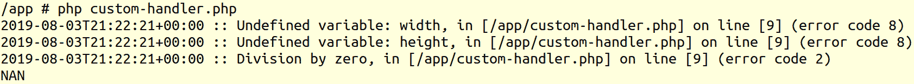

图 8.7：程序输出

因此，我们有两个`未定义变量`（代码 8）错误和一个`除以零`（代码 2）错误。并且，在最后一行，我们得到了`NAN` – 不是数字，因为除以零没有意义。查看预定义常量表，我们可以看到`代码 2`错误是一个警告，而`代码 8`错误是一个通知。

恭喜！你刚刚使用了你的第一个自定义错误处理器。

现在，让我们看看如何比仅仅在屏幕上打印错误信息更好地使用它。你还记得你不想让网站的访客看到所有这些内容吗？所以，而不是打印，我们只需将它们记录（写入）到文件中。

如前所述，将错误（或其他类型的消息）记录在文件中的原因是为了让它们记录在持久存储中，这样任何人都可以在任何时候读取，即使应用程序没有运行，只要有权限访问服务器。这尤其有用，因为许多错误可能会在最终用户“利用”应用程序后出现，而记录日志是检查此类使用后发生的错误的一种适当方式。

## 练习 8.2：使用自定义错误处理器进行记录

在文件系统上记录错误只是众多其他记录日志方法之一，而且可能是最简单的一种。在这个练习中，我们将看到我们如何使用错误处理器以最简单的方式写入日志文件：

1.  创建一个名为`log-handler.php`的文件，并添加以下内容。

1.  如果尚未完成，自定义错误处理器将使用`fopen()`创建一个数据流资源，使用`"append" (a)`标志。目标是脚本目录中的`app.log`文件。使用静态关键字初始化`$stream`变量，以便缓存后续调用。写入的流使用`fwrite()`函数，消息格式与之前的练习相同：

    ```php
    <?php
    $errorHandler = function (int $code, string $message, string $file, int $line) {
        static $stream;
        if (is_null($stream)) {
            $stream = fopen(__DIR__ . '/app.log', 'a');
        }
        fwrite(
            $stream,
            date(DATE_W3C) . " :: $message, in [$file] on line [$line] (error code $code)" . PHP_EOL
        );
    };
    ```

1.  然后，再次为所有错误类型设置错误处理器，接着是触发错误的测试算术表达式：

    ```php
    set_error_handler($errorHandler, E_ALL);
    echo $width / $height, PHP_EOL;
    ```

1.  现在，使用以下命令在命令行界面中运行文件：

    ```php
    php log-handler.php
    ```

    这次，作为输出，我们只得到预期的`NAN`，因为我们正在将错误记录在`app.log`文件中：

    

    图 8.8：显示 NAN 值的输出

1.  检查`app.log`文件内容；你应该会发现以下内容：

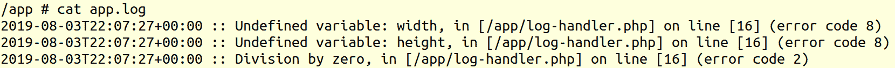

图 8.9：日志文件的内容

如您所见，脚本输出现在看起来更干净了，而在日志文件中，我们只有错误日志消息。最终用户看不到任何底层的错误，日志文件只包含与错误本身相关的信息。

在这个例子中，使用`fopen()`，我们没有检查它是否成功打开并返回流资源，因为脚本将在它自身所在的同一目录中创建文件，所以失败的概率非常小。在现实世界的应用程序中，目标文件可能有一个在磁盘上尚不存在的目录路径，或者没有对该位置的写权限等，你应该以你认为最好的方式处理所有这些失败情况，无论是停止脚本执行、输出到标准错误输出、忽略错误等。我个人的方法，在许多情况下，是将输出到标准错误输出，并设置一个健康检查器，在调用时将报告日志问题。但是，在日志组件被认为至关重要的情况下（法律或商业约束），你可能会决定在出现日志问题时阻止应用程序运行。

## 触发用户级错误

有时，根据目的，在脚本中触发错误是有用的。例如，模块重构会导致过时的方法或输入，在这种情况下，直到依赖于该模块的应用程序完成迁移，应该使用过时错误，而不是仅仅移除旧 API 的方法。

为了实现这一点，PHP 提供了`trigger_error()`核心函数，其语法如下：

```php
trigger_error( string $error_msg [, int $error_type = E_USER_NOTICE ] ): bool
```

第一个参数是错误消息，是必需的。第二个参数是错误消息的级别，是可选的，默认值为`E_USER_NOTICE`。

在我们继续之前，让我们设置一个错误处理器，我们将在接下来的练习中包含它。我们将把这个文件命名为`error-handler.php`，其内容如下：

```php
<?php
$errorHandler = function (int $code, string $message, string $file, int $line) {
    echo date(DATE_W3C), " :: $message, in [$file] on line [$line] (error code       $code)", PHP_EOL;
    if ($code === E_USER_ERROR) {
        exit(1);
    }
};
set_error_handler($errorHandler, E_ALL);
return $errorHandler;
```

首先，我们定义错误处理器——一个匿名函数，它将在屏幕上打印错误消息，然后对于致命错误`E_USER_ERROR`，它将使用退出代码`1`停止脚本的执行。这是一个我们可以用于生产环境或命令行脚本的处理器，因为输出是在屏幕上打印的，在发生致命错误时脚本会停止，并且退出代码将不为零（意味着脚本没有成功完成）。

然后，我们为所有类型的错误设置错误处理器，并返回它，以便它最终可以被调用此文件的脚本使用。

## 练习 8.3：触发错误

在这个练习中，你将故意在满足特定条件时在脚本中触发一些错误。为了继续，请确保你创建了之前描述的错误处理器文件，因为它将在这个和接下来的练习中使用。

在这个特定的简单脚本中，我们的目标是返回输入参数的平方根：

1.  创建一个名为 `sqrt.php` 的文件，并添加以下内容。首先，我们包含之前创建的错误处理程序文件，以便设置我们的自定义错误处理程序。然后，我们检查第一个参数是否存在，如果不存在，我们使用 `trigger_error()` 输出错误消息，这将终止脚本的执行，因为我们使用 `E_USER_ERROR` 作为第二个参数。如果第一个输入参数存在，我们将其存储在 `$input` 变量中以方便使用：

    ```php
    <?php
    require_once 'error-handler.php';
    if (!array_key_exists(1, $argv)) {
        trigger_error('This script requires a number as first argument',       E_USER_ERROR);
    }
    $input = $argv[1];
    ```

1.  接下来，有一个输入验证和清理的列表。首先，我们检查输入是否为数字，如果不是，我们则触发错误，这将终止脚本：

    ```php
    if (!is_numeric($input)) {
        trigger_error(sprintf('A number is expected, got %s', $input),       E_USER_ERROR);
    }
    ```

1.  第二次验证是对浮点数的验证。请注意，我们使用 `$input * 1` 表达式技巧（因为输入是一个数字字符串）将其转换为整数或浮点数。

    由于输入是字符串，我们需要使用一些函数将其转换为预期的类型（在我们的例子中是整数）或通过解析来测试其匹配的类型。我们使用了 `is_numeric()` 函数，它告诉我们输入看起来像数字，但为了测试字符串输入看起来像小数，我们必须进行这个乘以 1 的小技巧，因为在这种情况下，PHP 会根据上下文将涉及的变量转换为浮点数或整数类型。例如，`"3.14" * 1` 将得到一个值为 `3.14` 的浮点数：

    

    ```php
    if (is_float($input * 1)) {
        $input = round($input);
        trigger_error(
            sprintf(
                'Decimal numbers are not allowed for this operation. Will use               the rounded integer value [%d]',
                $input
            ),
            E_USER_WARNING
        );
    }
    ```

1.  最后，我们检查提供的数字是否为负数。如果是负数，我们则简单地使用绝对值，借助 `abs()` 函数。此外，我们触发一个警告错误，以提供通知，说明在此脚本中不允许运行负数，这个错误不会终止脚本的执行：

    ```php
    if ($input < 0) {
        $input = abs($input);
        trigger_error(
            sprintf(
                'A negative number is not allowed for this operation. Will use               the absolute value [%d].',
                $input
            ),
            E_USER_WARNING
        );
    }
    ```

1.  在脚本的最后部分，我们最终执行并打印了输入的平方根：

    ```php
    echo sprintf('sqrt(%d) = ', $input), sqrt((float)$input), PHP_EOL;
    ```

1.  在命令行界面中运行此脚本：

    ```php
    php sqrt.php; 
    ```

    你将得到以下输出：

    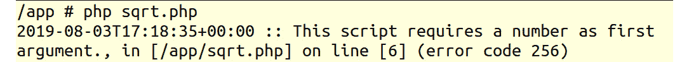

    图 8.11：错误消息

    在这种情况下，第一个条件未满足，因为第一个参数未提供。因此，在打印错误消息后，脚本被终止。

1.  现在，执行以下命令：

    ```php
    php sqrt.php nine;
    ```

    输出如下所示：

    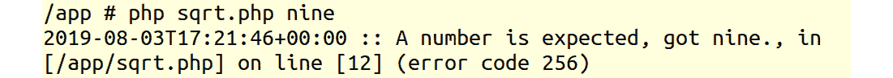

    图 8.12：将文本作为值添加时的错误

    就像上一个例子一样，脚本因为 `E_USER_ERROR`（代码 `256`）而终止，这是由于无效输入；这将是条件编号二——输入必须是数字。

1.  现在，运行以下命令：

    ```php
    php sqrt.php -81.3; 
    ```

    输出将如下所示：

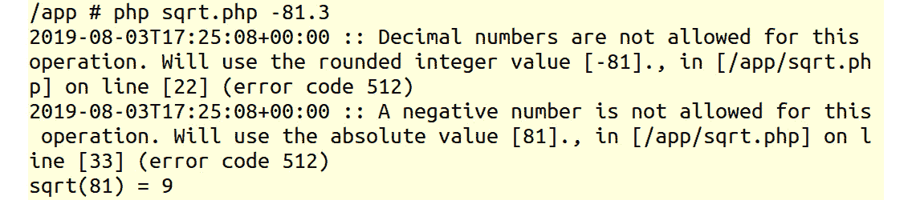

图 8.13：命令输出

第一行是一个错误消息（一个警告 - `错误代码 512`），它通知我们`-81.3`输入值已被更改，现在将使用四舍五入的值`-81`，以便脚本继续执行。

第二行是另一个警告，它注意到输入值的符号变化，因此将使用绝对值`81`而不是负数`-81`，允许脚本进一步执行。

最后，在最后一行，我们得到了处理输出，`sqrt(81) = 9`。如果我们用`81`作为输入参数而不是`-81.3`，由于输入格式的正确性，我们只会得到这一行。当然，任何数字都可以使用，所以通过运行`php sqrt.php 123`，我们得到输出`sqrt(123) = 11.090536506409`：


图 8.14：打印 123 的平方根

正如你所见，在这个练习中，我们使用了由用户触发的错误，这些错误由我们的自定义错误处理器处理。`E_ERROR`和`E_USER_ERROR`错误类型由于其性质会导致脚本立即停止。你也看到了警告表明脚本没有按照理想路径执行；输入数据被更改，或者做出了某些假设（例如使用未定义的常量名称 - PHP 将假设该名称为字符串而不是 null 或空值）。因此，在警告的情况下，最好立即采取行动并解决任何歧义。在我们的例子中，我们使用了一些警告来处理无效输入，但我们可以使用一些更底层的警告，如`E_USER_NOTICE`，以降低错误日志条目的重要性，或者使用更高级的警告，如`E_USER_ERROR`，这将停止脚本。正如你所见，这些警告取决于任务规范，并且使用 PHP 很容易实现这一点。

## 在脚本关闭时记录错误

致命错误，如调用未定义的函数或实例化未知类，无法由注册的错误处理器处理。它们会简单地停止脚本执行。所以，你可能会问为什么我们还在`set_error_handler()`中将`$error_types`参数设置为`E_ALL`。这只是为了方便，因为它最容易记住，并且在某种程度上描述了它涵盖了所有可以覆盖的错误类型。问题是，致命错误必须停止脚本执行，如果这个简单的责任留给自定义错误处理器，那么通过简单地不使用`exit()`或其别名`die()`来停止脚本执行，就很容易绕过它。

仍然可以通过使用`register_shutdown_function()`函数来**捕获**和记录一些致命错误 - 这个函数正是这样做的 - 它注册一个**函数**（一个可调用的对象）在脚本关闭时被调用，以及`error_get_last()`，它将返回最后一个错误（如果有的话）：

```php
register_shutdown_function( callable $callback [, mixed $... ] ): void
```

在这里，第一个参数是要在关闭时调用的可调用函数，后面跟着可选参数，这些参数将成为`$callback`参数。考虑以下代码片段：

```php
register_shutdown_function(
    function (string $file, int $line) {
        echo "I was registered in $file at line $line", PHP_EOL;
    },
    __FILE__,
    __LINE__
);
```

在代码片段中，可调用函数接收两个参数——字符串`$file`和整数`$line`——它们的值由`__FILE__`和`__LINE__`魔术常量设置，作为参数在`register_shutdown_function()`中传递，编号为二和三。

可以使用`register_shutdown_function()`注册多个函数，以便在关闭时调用。这些函数将按照它们的注册顺序被调用。如果我们在这其中任何一个注册的函数中调用`exit()`，处理将立即停止：

```php
error_get_last(): array
```

`error_get_last()`函数不期望任何参数，输出是上述关联数组，描述错误或，如果没有发生错误，则输出`null`。

## 练习 8.4：在关闭时记录致命错误

查找致命错误非常重要，因为它将给你提供重要信息，说明应用程序为什么在崩溃时确实会崩溃。在这个练习中，我们想要捕获并打印与脚本停止（原因和发生的地方）相关的信息。因此，你将使用之前创建并注册在`error-handler.php`文件中的自定义错误处理程序记录这样的错误：

1.  创建一个名为`on-shutdown.php`的文件，并插入以下内容。与其他示例不同，我们现在存储错误处理程序文件输出，即自定义错误处理程序回调（记得在`'error-handler.php'`文件中的最后一行，`return $errorHandler;`？）我们希望保留错误处理程序以供以后使用：

    ```php
    <?php
    $errorHandler = require_once 'error-handler.php';
    ```

1.  在这一步，我们定义了关闭函数，该函数使用`error_get_last()`函数获取最后一个错误，并将其存储在`$error`变量中，该变量将被评估，如果它不为空，则进入下一步。如果你有一个`E_ERROR`或`E_RECOVERABLE_ERROR`类型的错误，那么继续下一步：

    ```php
    if ($error = error_get_last()) {
        if (in_array($error['type'], [E_ERROR, E_RECOVERABLE_ERROR], true)) {
    ```

    注意

    在这个例子中，我们使用了`[E_ERROR, E_RECOVERABLE_ERROR]`；你可以在你的代码中使用所有致命错误代码。

1.  现在，是时候使用错误处理程序了；它被调用，参数按照适当的顺序指定，以便与回调签名匹配：

    ```php
    $errorHandler(
        $error['type'],
        $error['message'],
        $error['file'],
        $error['line']
    );
    ```

    注意

    由于我们得到的最后一个错误的结构与任何其他错误相同，我们不是重复处理程序的逻辑（以特定格式记录错误），而是重用了错误处理程序回调来完成这个目的。

1.  使用`register_shutdown_function()`注册关闭函数：

    ```php
         register_shutdown_function(
        function () use ($errorHandler) {
            if ($error = error_get_last()) {
                if (in_array($error['type'], [E_ERROR, E_RECOVERABLE_ERROR],               true)) {
                    $errorHandler(
                        $error['type'],
                        $error['message'],
                        $error['file'],
                        $error['line']
                    );
                }
            }
        }
    }
    }
    );
    ```

1.  在脚本的最后一行，我们只是尝试实例化一个不存在的类，以触发致命错误：

    ```php
    new UnknownClass();
    ```

    在命令行界面中运行脚本`php on-shutdown.php;`，你应该看到以下输出：

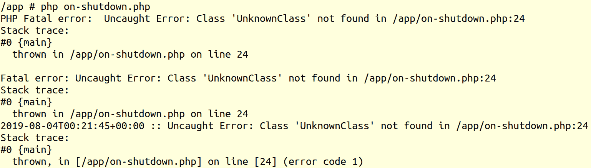

图 8.15：错误信息的截图

这条消息是一个由默认错误处理器打印的 `E_ERROR`，该处理器还负责在发生此类致命错误时停止脚本执行，如前所述。因此，你可能想知道我们是否可以在默认处理器被调用之前处理它，实际上我们可以做到，但让我们进一步看看。

对于单个错误来说，这里有太多的信息。以下是发生的情况：

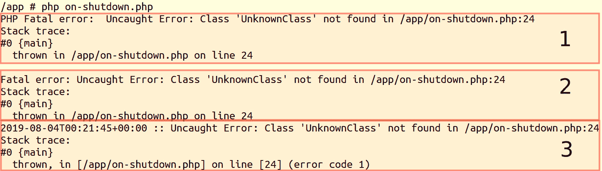

图 8.16：所有错误信息的说明

这条消息包含相同的信息——我们还有调用堆栈（运行时过程到达错误之前遵循的路径）。这条错误信息是一个可抛出的错误（也称为异常），由默认异常处理器打印。异常是特殊对象，包含错误信息，我们将更详细地了解它们。在这种情况下，因为没有注册自定义异常处理器，所以异常被转换为错误。

在最后一个块（第三个消息框）中，我们打印转换后的错误信息，该信息被发送到自定义错误处理器。

输出可能看起来出乎意料，但这是有道理的。尝试实例化一个未知的类将触发错误异常，如果没有注册自定义异常处理器，异常将被转换为错误，并将触发默认错误处理器和默认异常处理器。最终，随着脚本的关闭，关闭函数被调用，我们在那里捕获最后一个错误并将其发送到我们的自定义错误处理器进行记录。

# 异常

异常是在程序运行时发生的事件，它破坏了其正常流程。

从版本 7 开始，PHP 改变了错误报告的方式。与 PHP 5 中使用的传统错误报告机制不同，在版本 7 中，PHP 使用面向对象的方法来处理错误。因此，现在许多错误都被抛出为异常。

PHP 中的异常模型（自版本 5 起支持）与其他编程语言类似。因此，当发生错误时，它会被转换成一个对象——异常对象，该对象包含有关错误及其触发位置的相关信息。我们可以在 PHP 脚本中抛出和捕获异常。当异常被抛出时，它会被传递给运行时系统，该系统将尝试在脚本中找到一个可以处理异常的位置。这个要查找的位置被称为异常处理器，它将在当前运行时调用的函数列表中进行搜索，直到异常被抛出。这个函数列表被称为调用栈。首先，系统将在当前函数中查找异常处理器，然后按调用栈的逆序进行搜索。当找到异常处理器时，在系统处理异常之前，它将首先匹配找到的异常处理器接受的异常类型。如果匹配成功，则脚本执行将在该异常处理器中继续。如果在调用栈中没有找到异常处理器，则默认的 PHP 异常处理器将接收到异常，脚本执行将停止。

异常的基类是 `Exception` 类，从 PHP 版本 5 开始引入异常时起。

现在，让我们回到 PHP 7 的错误报告。从 PHP 7 开始，大多数致命错误都被转换成异常，为了确保现有脚本的向后兼容性（以及库能够在 PHP 5.x 和 PHP 7.x 中与异常处理器保持一致），致命错误异常使用一个新的异常基类 `Error` 抛出。同时，添加了一个新的接口，称为 `Throwable`，它由 `Exception` 和 `Error` 类实现。因此，在 `try-catch` 块中捕获 `Throwable` 将导致捕获任何可能的异常。

## 基本用法

考虑以下代码块：

```php
try {
    if (!isset($argv[1])) {
        throw new Exception('Argument #1 is required.');
    }
} catch (Exception $e) {
    echo $e->getMessage(), PHP_EOL;
} finally {
    echo "Done.", PHP_EOL;
}
```

在这里，我们可以区分四个关键字：`try`、`throw`、`catch` 和 `finally`。我将在下面解释代码块和关键字的使用：

+   `try` 块用于运行在异常情况下预期会失败（抛出异常错误）的任何代码。在这个块内部，我们可以显式地抛出异常，或者不抛出异常（当我们在 `try` 块中运行的函数抛出异常时），依靠异常的冒泡特性，通过调用栈回溯（搜索前面提到的异常处理器）；

+   `throw` 用于触发一个新的异常，并且需要一个异常类实例作为参数（任何扩展 `Exception` 或 `Error` 类的类——关于这一点稍后讨论）。

+   `catch`块用于处理异常，需要指定要“捕获”的异常类型（类）以及异常将被存储的变量名；异常类型可以是具体的类名、抽象类名或接口名——捕获的异常是实现了、扩展了或确实是具体指定的类的异常；可以指定多个`catch`块，但只有第一个类型匹配的捕获异常块将被执行；如果没有任何`catch`块，则必须要有`finally`块。

+   `finally`块将为每个`try`尝试运行其内部的代码，即使没有抛出异常，或者如果抛出了异常并被捕获，或者如果抛出了异常但没有被任何`catch`块捕获。这在长时间运行的过程结束时关闭打开的资源（文件、数据库连接等）特别有用。

在前面的例子中，脚本进入`try`块并检查第一个参数是否在运行时设置，如果没有设置，它将抛出一个`Exception`类型的异常，该异常被`catch`块捕获，因为它期望捕获`Exception`类的异常，`Exception` `$e`变量在进入`catch`块后。

## 练习 8.5：实现异常

在这个练习中，你将在 PHP 中抛出和捕获异常。为了实现这一点，我们将创建一个基于用户输入实例化类的脚本。此外，脚本将打印几句话以跟踪脚本流程，以便更好地理解 PHP 中的异常机制：

1.  创建一个名为`basic-try.php`的文件，并添加以下代码。用`SCRIPT START`消息标记脚本的开始：

    ```php
    <?php
    echo 'SCRIPT START.', PHP_EOL;
    ```

1.  打开一个`try`块并打印`Run TRY block`消息：

    ```php
    try {
        echo 'Run TRY block.', PHP_EOL;
    ```

1.  如果在输入参数中没有指定类名，打印`NO ARGUMENT: Will throw exception.`消息以通知意图，并抛出异常：

    ```php
        if (!isset($argv[1])) {
            echo 'NO ARGUMENT: Will throw exception.', PHP_EOL;
            throw new LogicException('Argument #1 is required.');
        }
    ```

1.  否则，当我们有一个输入参数时，我们打印它并尝试实例化，假设输入参数是一个已知的类名。使用`var_dump()`函数将新对象输出到输出：

    ```php
        echo 'ARGUMENT: ', $argv[1], PHP_EOL;
        var_dump(new $argv[1]);
    ```

1.  关闭`try`块并添加`catch`块，提示接受的异常类型为`Exception`类。在`catch`块中，我们打印格式化的异常信息文本消息：

    ```php
    } catch (Exception $e) {
        echo 'EXCEPTION: ', sprintf('%s in %s at line %d', $e->getMessage(),       $e->getFile(), $e->getLine()), PHP_EOL;
    ```

1.  在这个脚本中，除了打印关于到达执行过程这一阶段的信息外，不执行任何特殊操作的`finally`块：

    ```php
    } finally {
        echo "FINALLY block gets executed.\n";
    ```

1.  最后，打印一条消息通知用户脚本执行已退出`try/catch`块，并且脚本将结束：

    ```php
    echo "Outside TRY-CATCH.\n";
    echo 'SCRIPT END.', PHP_EOL;
    ```

1.  使用以下命令在命令行界面运行脚本：

    ```php
     php basic-try.php; 
    ```

    输出应该看起来像这样：

    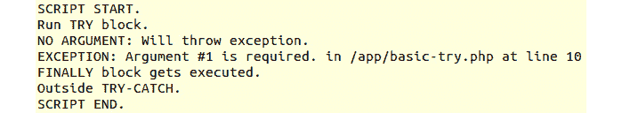

    图 8.17：try/catch 程序的输出

    注意到`try`块的最后两行没有执行，这是因为抛出了一个异常——由于缺少输入参数而引发的`LogicException`。异常被`catch`块捕获，并在屏幕上打印了一些信息——错误消息、文件和`throw`位置所在的行。由于异常被捕获，脚本继续执行。

1.  现在，运行`php basic-try.php DateTime;`，输出将如下：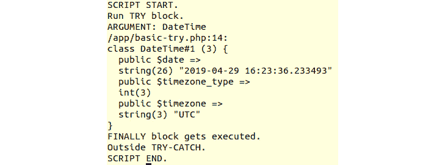

    图 8.18：命令输出

    你会注意到，现在输出中有了`ARGUMENT: DateTime`，后面跟着`DateTime`实例的转储。脚本流程是*正常*的，没有抛出任何异常。

1.  使用`php basic-try.php DateTimeZone`运行脚本，输出如下：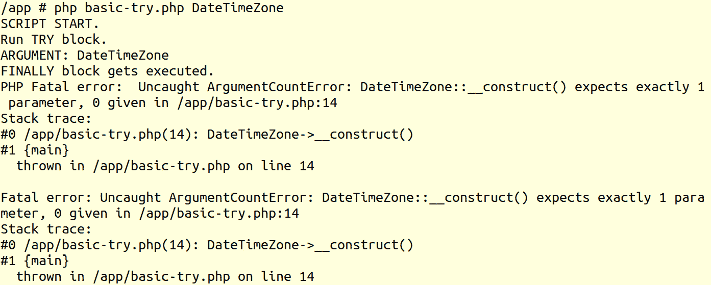

    图 8.19：由于缺少参数抛出错误

    现在，我们得到了一个异常错误，有趣的是，这个异常似乎没有被捕获——看到输出中的`ARGUMENT`行后面跟着`FINALLY`行，并且没有打印出`EXCEPTION`。这是因为抛出的异常没有扩展`Exception`类。

    在前面的例子中，`ArgumentCountError`扩展了`Error`异常类，并且没有被`catch (Exception $e)`语句捕获。因此，异常由默认异常处理器处理，脚本进程被终止——注意`FINALLY`行后面既没有`Outside TRY-CATCH.`也没有`SCRIPT END.`行。

1.  将脚本复制到名为`basic-try-all.php`的新文件中，并添加`catch (Error $e)`块；添加的代码应放置在`try`和`finally`块之间：

    ```php
    } catch (Error $e) {
        echo 'ERROR: ', sprintf('%s in %s at line %d', $e->getMessage(),       $e->getFile(), $e->getLine()), PHP_EOL;
    ```

1.  运行以下命令：

    ```php
     php basic-try-all.php DateTimeZone; 
    ```

    输出如下：

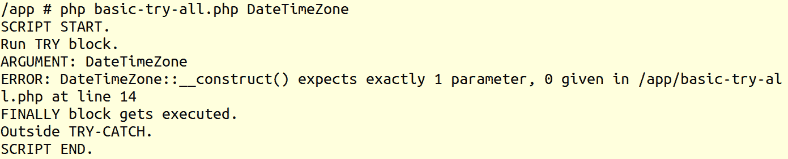

图 8.20：执行命令的输出

如预期的那样，错误异常现在被捕获并以我们的格式打印出来，脚本没有意外终止。

在这个例子中，我们看到了如何捕获异常。不仅如此，我们还学习了两个基本异常类，并且我们现在理解了它们之间的区别。

在上一个练习中提到了可抛出接口，该接口由`Error`和`Exception`类实现。由于 SPL（标准 PHP 库）提供了一系列丰富的异常，让我们显示 PHP 7 版本中添加的`Error`异常的异常层次结构：

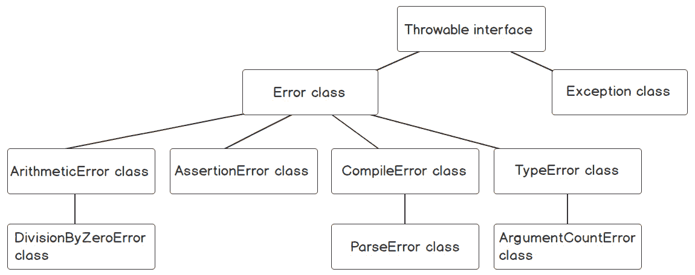

图 8.21：异常层次结构

今天现代的 PHP 库和框架中可以找到许多其他自定义异常类。

## 自定义异常

在 PHP 中，可以定义自定义异常，并使用自定义功能扩展它们。自定义异常很有用，因为可以根据应用需求扩展基本功能，将业务逻辑捆绑在基应用异常类中。此外，它们通过根据相关的业务逻辑命名来为应用流程带来意义。

## 练习 8.6：自定义异常

在这个练习中，我们将定义一个具有扩展功能的自定义异常，我们将抛出并捕获它，然后将在屏幕上打印自定义格式的消息。具体来说，这是一个验证电子邮件地址的脚本：

1.  创建一个名为 `validate-email.php` 的文件，并定义一个名为 `InvalidEmail` 的自定义异常类，它将扩展 `Exception` 类。此外，新的异常类提供了存储和检索上下文为数组的选项：

    ```php
    <?php
    class InvalidEmail extends Exception
    {
        private $context = [];
        public function setContext(array $context)
        {
            $this->context = $context;
        }
        public function getContext(): array
        {
            return $this->context;
        }
    }
    ```

    注意

    建议的异常名称不包括 `Exception` 后缀，因为这用作命名约定。尽管异常名称不需要特定的格式，一些开发者更喜欢添加 `Exception` 后缀，以提供“在类名中具有特异性”的论点，而其他人则更喜欢不包含后缀，以提供“更容易阅读代码”的论点。无论如何，PHP 引擎并不关心，将异常命名约定留给开发者或编写代码的组织。

1.  添加 `validateEmail()` 函数，该函数不返回任何内容，但在出错的情况下会抛出异常。`validateEmail()` 函数期望输入参数与脚本输入参数相同。如果输入数组的第 `1` 个位置未设置（第一个参数不存在），则抛出 `InvalidArgumentException` 异常。在此步骤之后，函数执行将停止。否则，当第 `1` 个位置设置时，我们将使用内置的 `filter_var()` 函数验证该值。

1.  和 `FILTER_VALIDATE_EMAIL` 标志。如果验证失败，则实例化 `InvalidEmail` 异常类，设置上下文为测试值，然后抛出它：

    ```php
    function validateEmail(array $input)
    {
        if (!isset($input[1])) {
            throw new InvalidArgumentException('No value to check.');
        }
        $testInput = $input[1];
        if (!filter_var($testInput, FILTER_VALIDATE_EMAIL)) {
            $error = new InvalidEmail('The email validation has failed.');
            $error->setContext(['testValue' => $testInput]);
            throw $error;
        }
    }
    ```

1.  使用 `try-catch` 块运行 `validateEmail()` 函数，并在没有抛出异常或异常规定的情况下打印成功消息：

    ```php
    try {
        validateEmail($argv);
        echo 'The input value is valid email.', PHP_EOL;
    } catch (Throwable $e) {
        echo sprintf(
                'Caught [%s]: %s (file: %s, line: %s, context: %s)',
                get_class($e),
                $e->getMessage(),
                $e->getFile(),
                $e->getLine(),
                $e instanceof InvalidEmail ? json_encode($e->getContext()) :               'N/A'
            ) . PHP_EOL;
    }
    ```

    因此，在 `try` 块中，你将调用 `validateEmail()` 函数并打印成功的验证消息。只有当 `validateEmail()` 函数没有抛出异常时，才会打印该消息。相反，如果抛出异常，它将在 `catch` 块中被捕获，错误消息将打印在屏幕上。错误消息将包括错误类型（异常类名）、消息以及异常创建的文件和行号。此外，在自定义异常的情况下，我们还将包括上下文，以 JSON 编码。

1.  不带参数运行脚本：

    ```php
     php validate-email.php; 
    ```

    输出将如下所示：

    

    图 8.22：执行不带参数的代码

    我们得到了预期的 `InvalidArgumentException`，因为没有向脚本提供任何参数。

1.  使用无效参数运行脚本：

    ```php
    php validate-email.php john.doe; 
    ```

    输出将看起来像这样：

    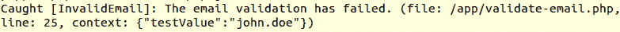

    图 8.23：执行带无效参数的代码

    这次，捕获到的异常是 `InvalidEmail`，上下文信息包含在打印到屏幕上的消息中。

1.  使用有效的电子邮件地址运行脚本：

    ```php
     php validate-email.php john.doe@mail.com; 
    ```

    输出将看起来像这样：


图 8.24：有效电子邮件地址的输出

这次，验证成功，确认信息已打印到屏幕上。

在这个练习中，您创建了自己的自定义异常类，并且它可以与扩展功能一起使用。脚本不仅能够验证输入作为电子邮件，而且在验证失败的情况下，还会提供原因（异常），并在适当的时候捆绑一些有用的上下文。

## 自定义异常处理器

通常，您只想捕获和处理某些异常，允许应用程序继续运行。有时，然而，没有正确数据就无法继续；您希望应用程序停止，并且希望以优雅和一致的方式（例如，为网络应用程序的错误页面，为命令行界面提供特定的消息格式和详细信息）停止。

为了实现这一点，您可以使用 `set_exception_handler()` 函数。其语法如下：

```php
set_exception_handler (callable $exception_handler): callable
```

此函数期望一个可调用的异常处理器，并且此处理器应该接受一个 `Throwable` 作为第一个参数。也可以传递 `NULL` 作为可调用项；在这种情况下，将恢复默认处理器。返回值是之前的异常处理器或错误或没有之前的异常处理器时的 `NULL`。通常，返回值会被忽略。

## 使用自定义异常处理器

就像在默认错误处理器的情况下，PHP 中的默认异常处理器会打印错误信息，并且也会停止脚本执行。由于您不希望任何这些信息到达最终用户，您可能更愿意注册自己的异常处理器，在那里您可以实现与错误处理器相同的功能 – 以特定格式渲染消息并记录以供调试。

## 练习 8.7：使用自定义异常处理器

在这个练习中，您将定义、注册和使用一个自定义异常处理器，该处理器将以特定格式打印错误信息：

1.  创建一个名为 `exception-handler.php` 的文件，并添加以下内容。定义并注册您自己的异常处理器：

    ```php
    <?php
    set_exception_handler(function (Throwable $e) {
        $msgLength = mb_strlen($e->getMessage());
        $line = str_repeat('-', $msgLength);
        echo $line, PHP_EOL;
        echo $e->getMessage(), PHP_EOL;
        echo '> File: ', $e->getFile(), PHP_EOL;
        echo '> Line: ', $e->getLine(), PHP_EOL;
        echo '> Trace: ', PHP_EOL, $e->getTraceAsString(), PHP_EOL;
        echo $line, PHP_EOL;
    });
    ```

    在这个文件中，我们注册了异常处理器，它是一个接受`Throwable`参数作为`$e`变量的匿名函数。然后，我们使用`mb_strlen()`和`str_repeat()`内置函数计算消息长度，并创建一条与错误消息长度相同的横线。接下来是对消息的简单格式化，包括异常创建的文件和行号，以及异常跟踪；所有这些都被两条横线包裹，一条在消息块的顶部，另一条在底部。

1.  我们将使用`basic-try.php`文件作为我们例子的起点。将此文件复制到`basic-try-handler.php`，并在`basic-try-handler.php`中的`SCRIPT START`行之后包含`exception-handler.php`文件：

    ```php
    require_once 'exception-handler.php';
    ```

1.  由于我们知道在这个例子中，我们只捕获`Exception`，而跳过了`Error`异常，因此我们将直接运行会产生`Error`的命令，以便它能够被处理器捕获。因此，运行以下命令：

    ```php
    php basic-try-handler.php DateTimeZone; 
    ```

    预期输出类似于以下内容：

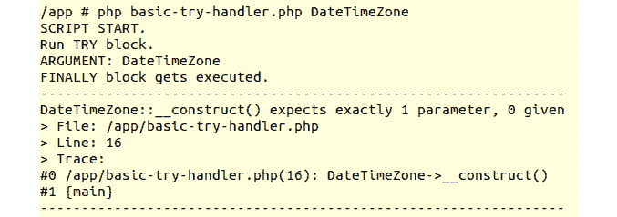

图 8.25：命令的输出

现在，输出看起来比默认异常处理器产生的输出更干净。当然，异常处理器可以用来记录异常，特别是意外的异常，并尽可能添加更多信息，以便更容易识别和追踪错误。

如您可能注意到的，异常处理器与 PHP 中的错误处理器非常相似。因此，如果能使用单个回调来执行错误和异常处理将非常棒。为了帮助解决这个问题，PHP 提供了一个名为`ErrorException`的异常类，它将传统的 PHP 错误转换为异常。

## 将错误转换为异常

要将 PHP 错误（在错误处理器中捕获）转换为异常，可以使用`ErrorException`类。这个类扩展了`Exception`类，并且与后者不同，它具有与它扩展的类不同的构造函数签名。

`ErrorException`类的构造函数语法如下：

```php
public __construct (string $message = "", int $code = 0, int $severity = E_ERROR, string $filename = __FILE__, int $lineno = __LINE__, Exception $previous = NULL)
```

接受的参数如下：

+   `$message`：异常消息字符串

+   `$code`：表示异常代码的整数

+   `$severity`：异常的严重级别（虽然这是一个整数，但建议使用`E_*`错误代码常量之一）

+   `$filename`：抛出异常的文件名

+   `$lineno`：抛出异常的文件中的行号

+   `$previous`：用于异常链的先前异常

现在，让我们看看这个类是如何工作的。

## 练习 8.8：将错误转换为异常

在这个练习中，我们将注册一个错误处理器，它只需要将错误转换为异常，然后调用异常处理器。异常处理器将负责处理所有异常（包括转换的错误）——这可以是记录日志、渲染错误模板、以特定格式打印错误消息等。在我们的练习中，我们将使用异常处理器以友好的格式打印异常，就像在之前的练习中使用的那样：

1.  创建一个名为 `all-errors-handler.php` 的文件，定义异常处理器，并将其保存在 `$exceptionHandler` 变量下。这是我们在上一个练习中使用的相同回调函数：

    ```php
    <?php
    $exceptionHandler = function (Throwable $e) {
        $msgLength = mb_strlen($e->getMessage());
        $line = str_repeat('-', $msgLength);
        echo $line, PHP_EOL;
        echo get_class($e), sprintf(' [%d]: ', $e->getCode()),       $e->getMessage(),      PHP_EOL;
        echo '> File: ', $e->getFile(), PHP_EOL;
        echo '> Line: ', $e->getLine(), PHP_EOL;
        echo '> Trace: ', PHP_EOL, $e->getTraceAsString(), PHP_EOL;
        echo $line, PHP_EOL;
    };
    ```

1.  现在，我们定义并分配错误处理器到 `$errorHandler` 变量。此函数将使用函数参数作为类构造函数的参数来实例化 `ErrorException`。然后，调用异常处理器，将 `ErrorException` 实例作为唯一参数传递。最后，如果错误严重性为 `E_USER_ERROR`，则截断脚本的执行：

    ```php
    $errorHandler = function (int $code, string $message, string $file, int   $line) use ($exceptionHandler) {
        $exception = new ErrorException($message, $code, $code, $file, $line);
        $exceptionHandler($exception);
        if (in_array($code , [E_ERROR, E_RECOVERABLE_ERROR, E_USER_ERROR])) {
            exit(1);
        }
    };
    ```

1.  在脚本的最后部分，我们只是设置了错误和异常处理器：

    ```php
    set_error_handler($errorHandler);
    set_exception_handler($exceptionHandler);
    ```

1.  现在，我们将使用一个错误报告和错误处理器使用的示例来测试新的处理器。让我们选择 `sqrt.php` 脚本，将其复制到 `sqrt-all.php`，并将文件开头的 `require_once 'error-handler.php';` 行替换为 `require_once 'all-errors-handler.php';`：

    ```php
    <?php
    require_once 'error-handler.php'; // removed
    require_once 'all-errors-handler.php'; // added
    ```

1.  `sqrt-all.php` 的内容可以在 [`packt.live/2INXt9q`](https://packt.live/2INXt9q) 找到（以下代码在 *练习 8.3*，*触发错误* 中解释）：

1.  按以下顺序运行以下命令：

    ```php
    php sqrt-all.php
    php sqrt-all.php s5
    php sqrt-all.php -5
    php sqrt-all.php 9
    ```

    输出将如下所示：

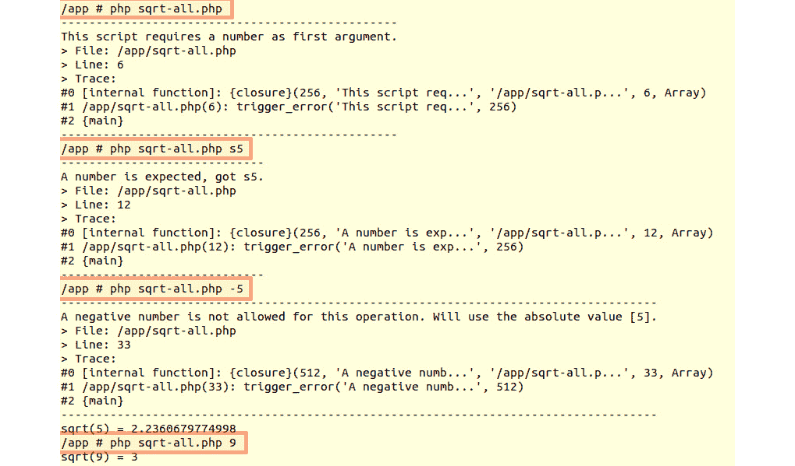

图 8.26：不同情况下的输出

如前所述，`E_USER_ERROR`（代码 256）使脚本停止，而 `E_USER_WARNING`（代码 512）允许脚本继续。

在这个练习中，我们通过将每个错误转换为异常，成功地将错误处理器捕获的所有错误转发到异常处理器。这样，我们可以在脚本的单个位置实现处理错误和异常的代码——在异常处理器中。同时，我们使用了 `trigger_error()` 函数来生成一些错误，并由异常处理器打印。

然而，我们将应用程序/技术错误处理与业务逻辑错误处理混合在一起。我们希望在操作流程方面有更多的控制，以便能够现场处理问题并相应地采取行动。PHP 中的异常允许我们做到这一点——运行一个预期会抛出某些异常的代码块，并在它们发生时现场处理，控制操作流程。查看上一个练习，我们可以通过“捕获”在它们到达错误处理器之前发生的错误来改进它，例如，我们可以打印一些更简洁的错误消息。

为了实现这一点，我们将使用异常方法。因此，我们将使用`try`-`catch`块，这允许我们控制操作流程，而不是使用`trigger_error()`函数，该函数将错误直接发送到错误处理器。

## 练习 8.9：简单的异常处理

在下面的练习中，我们将实现一个多用途脚本，旨在执行任意 PHP 函数。在这种情况下，我们将无法对输入验证有太多控制，因为任意选择的函数需要不同类型的输入参数，按照特定顺序，以及可变数量的参数。在这种情况下，我们将使用一种验证和处理输入的方法，并在验证失败的情况下抛出异常，这些异常将被当前函数捕获：

1.  创建一个名为`run.php`的文件，并包含错误处理器文件。然后，我们定义一个名为`Disposable`的自定义异常，这样我们就可以精确地捕获我们预期可能会抛出的异常：

    ```php
    <?php
    require_once 'all-errors-handler.php';
    class Disposable extends Exception
    {
    }
    ```

1.  接下来，我们声明`handle()`函数，该函数将负责验证和运行给定函数名和参数的脚本。如果没有提供函数/类名参数，将抛出`Disposable`异常：

    ```php
    function handle(array $input)
    {
        if (!isset($input[1])) {
            throw new Disposable('A function/class name is required as the           first argument.');
        }
    ```

1.  否则，第一个参数将被存储在`$calleeName`变量中：

    ```php
        $calleeName = $input[1];
        $calleeArguments = array_slice($input, 2);
    ```

    `callee`参数被准备为一个从原始输入的切片，因为，在`$input`变量的第一个位置（索引 0）是脚本名称，在第二个位置（索引`1`）是`callee`名称，我们需要从`$input`开始的索引`2`的切片；为此，我们使用`array_slice()`内置函数。

1.  如果被调用者是一个现有的函数，那么使用`call_user_func_array()`函数来调用`$calleeName`函数，提供`$calleeArguments`的参数列表：

    ```php
        if (function_exists($calleeName)) {
            return call_user_func_array($calleeName, $calleeArguments);
    ```

1.  否则，如果`$calleeName`是一个现有的类名，那么创建一个`$calleeName`类的实例，为构造函数方法提供参数列表：

    ```php
        } elseif (class_exists($calleeName)) {
            return new $calleeName(...$calleeArguments);
    ```

1.  最后，如果被调用者既不是函数也不是类名，那么抛出一个`Disposable`异常：

    ```php
        } else {
            throw new Disposable(sprintf('The [%s] function or class does not           exist.', $calleeName));
        }
    }
    ```

1.  在脚本的最后部分，我们使用`try`-`catch`块。在`try`部分，我们调用`handle()`函数，提供脚本参数，并将输出存储在`$output`变量中：

    ```php
    try {
        $output = handle($argv);
        echo 'Result: ', $output ? print_r($output, true) :       var_export($output, true), PHP_EOL;
    ```

    我们以下述方式显示结果：如果`$output`评估为`TRUE`（非空值，如零、空字符串或`NULL`），则使用`print_r()`函数以友好格式显示数据；否则，使用`var_export()`来提供有关数据类型的提示。请注意，如果`handle()`函数抛出异常，则不会发生输出打印。

1.  捕获部分只会捕获`Disposable`异常，这是我们预期将在屏幕上打印的错误消息。使用`exit(1)`来表示脚本执行不成功：

    ```php
    } catch (Disposable $e) {
        echo '(!) ', $e->getMessage(), PHP_EOL;
        exit(1);
    }
    ```

1.  使用`php run.php`运行脚本，然后使用`php run.php unknownFnName`；预期以下输出：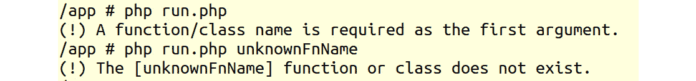

    ![图 8.27：命令输出    我们得到了预期的输出——`handle()` 函数在两种情况下都抛出了 `Disposable` 异常，因此函数输出没有被打印。1.  使用以下命令运行脚本：    ```php    php run.php substr 'PHP Essentials' 0 3;     ```    输出将如下所示：    

    ![图 8.28：打印子字符串    在这个情况下，`substr` 是一个有效的函数名，因此被调用，并传递了三个参数。`substr` 正在从一个字符串值（第一个参数）中提取，从特定的位置开始（第二个参数——在我们的例子中是 `0`），并返回所需的长度（第三个参数——在我们的例子中是 `3`）。由于没有抛出异常，输出被打印在屏幕上。1.  使用以下命令运行脚本：    ```php    php run.php substr 'PHP Essentials' 0 0;     ```    输出将如下所示：    ![图 8.29：控制台未打印字符串    ![图 8.29：打印警告信息    ![图 8.29：控制台未打印字符串    由于我们得到了一个空字符串，在这种情况下，输出使用 `var_export()` 打印。1.  使用以下命令运行脚本：    ```php    php run.php substr 'PHP Essentials';    ```    输出将如下所示：    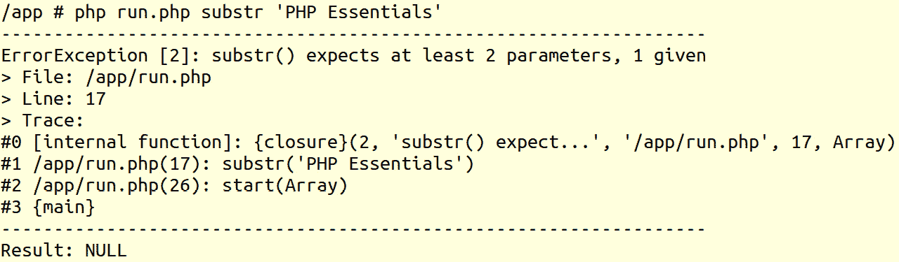

    ![图 8.30：打印警告信息    在这种情况下，报告了一个 `E_WARNING` 消息，因为 `substr()` 函数至少需要两个参数。由于这不是一个致命错误，脚本的执行继续，并返回 `NULL`。输出再次使用相同的 `var_export()` 函数打印。1.  使用以下命令运行脚本：    ```php    php run.php DateTime;     ```    输出将如下所示：    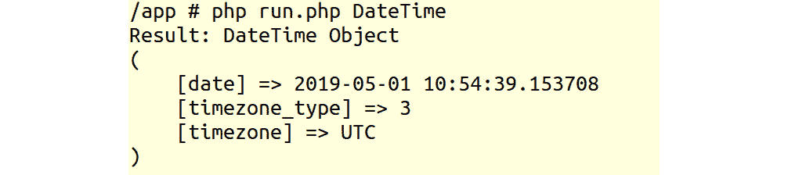

    ![图 8.31：打印时间详情 1.  使用以下命令运行脚本：    ```php    php run.php DateTime '1 day ago' UTC;     ```    输出将如下所示：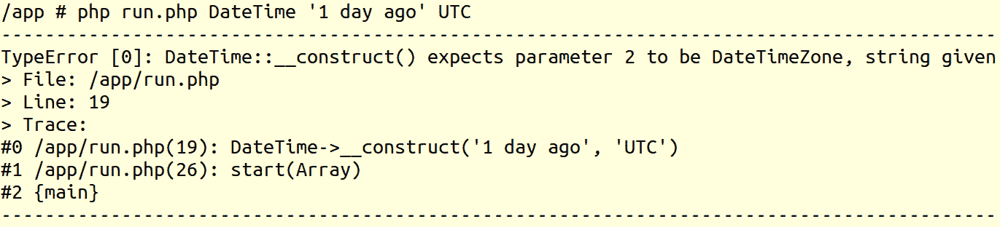

![图 8.32：致命错误

如您所见，我们现在正在处理一个致命的 `TypeError` 异常。这个异常没有被捕获，并由异常处理器处理；因此，脚本被终止。

由于这是一个通用的多用途脚本，处理所有类型的错误非常困难，为每个 `callee` 验证特定的输入，无论是函数名还是类名——在我们的例子中，你将为预期被调用的每个函数或类编写输入验证规则。在这里要学习的一点是，尽可能精确是一种好的编程方法，因为它给了你，开发者，对应用程序的控制。

## 练习 8.10：异常的更好使用

在这个练习中，我们将尝试一个比上一个例子更好的 `DateTime` 实例化方法，目的是展示如何通过精确控制来提高脚本的控制能力。这种方法应该解析输入数据并准备 `DateTime` 类的参数，同时尊重每个接受的输入数据类型：

1.  创建 `date.php` 文件，包含错误处理程序，并定义名为 `Disposable` 的自定义异常：

    ```php
    <?php
    require_once 'all-errors-handler.php';
    class Disposable extends Exception
    {
    }
    ```

1.  接下来，我们定义 `handle()` 函数，该函数将处理请求。首先，它将检查 `$input[1]` 中的类名参数，如果没有找到这样的值，将抛出 `Disposable` 异常：

    ```php
    function handle(array $input)
    {
        if (!isset($input[1])) {
            throw new Disposable('A class name is required as the first           argument (one of DateTime or DateTimeImmutable).');
        }
    ```

1.  否则，值将被验证，要求只允许 `DateTime` 或 `DateTimeImmutable` 中的一个；如果传递了另一个名称，将抛出 `Disposable` 异常：

    ```php
        $calleeName = $input[1];
        if (!in_array($calleeName, [DateTime::class,       DateTimeImmutable::class])) {
            throw new Disposable('One of DateTime or DateTimeImmutable is           expected.');
        }
    ```

1.  所需的时间存储在 `$time` 变量中，如果没有设置参数，默认值为 `now`。时区存储在 `$timezone` 变量中，如果没有设置时区参数，默认为 `UTC`：

    ```php
        $time = $input[2] ?? 'now';
        $timezone = $input[3] ?? 'UTC';
    ```

1.  接下来，当尝试实例化 `DateTimeZone` 和 `$calleeName` 对象时使用 `try`-`catch` 块。所有 `Exception` 错误都会被捕获，并使用 `Disposable` 异常类抛出一个友好的消息：

    ```php
        try {
            $dateTimeZone = new DateTimeZone($timezone);
        } catch (Exception $e) {
            throw new Disposable(sprintf('Unknown/Bad timezone: [%s]',           $timezone));
        }
        try {
            $dateTime = new $calleeName($time, $dateTimeZone);
        } catch (Exception $e) {
            throw new Disposable(sprintf('Cannot build date from [%s]',           $time));
        }
    ```

1.  最后，如果一切顺利，则返回 `$dateTime` 实例：

    ```php
        return $dateTime;
    }
    ```

1.  脚本的最后一部分是一个 try-catch 块，就像之前的练习一样，其中 `handle()` 使用脚本输入参数运行，其输出存储在 `$output` 变量中，然后使用 `print_r()` 函数在屏幕上打印：

    ```php
    try {
        $output = handle($argv);
        echo 'Result: ', print_r($output, true);
    ```

1.  如果 `handle()` 函数抛出 `Disposable` 异常，这个异常会被捕获，并在进程以退出代码 1 停止之前，在屏幕上打印错误信息。任何其他异常将由在 `all-errors-handler.php` 中注册的异常处理器处理：

    ```php
    } catch (Disposable $e) {
        echo '(!) ', $e->getMessage(), PHP_EOL;
        exit(1);
    }
    ```

1.  使用 `php date.php` 运行脚本，然后使用 `php date.php Date` 运行脚本；预期的输出如下：![图 8.33：打印 `Disposable` 异常的错误信息    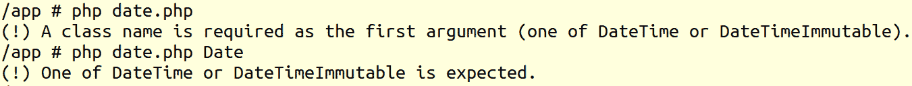

    图 8.33：打印 `Disposable` 异常的错误信息

    如预期的那样，`Disposable` 异常被捕获，错误信息在屏幕上显示。由于没有抛出异常，没有打印输出结果。

1.  使用以下命令运行脚本：

    ```php
    php date.php DateTimeImmutable midnight; 
    ```

    输出如下：

    

    图 8.34：打印时间详情

    现在，脚本打印了 `DateTimeImmutable` 对象，其中包含今天的日期，时间设置为午夜，而默认使用 UTC 作为时区。

1.  使用 `php date.php DateTimeImmutable summer` 运行脚本，然后使用 `php date.php DateTimeImmutable yesterday Paris` 运行脚本；查看输出，应该看起来像这样：

    图 8.35：函数内部捕获的异常

    如你所见，这些是在 `handle()` 函数内部捕获的 `Exception` 类异常，然后作为 `Disposable` 异常（在上级捕获）抛出，并带有自定义消息。

1.  最后，使用以下命令运行程序：

    ```php
    php date.php DateTimeImmutable yesterday Europe/Paris 
    ```

    你应该得到类似这样的结果：

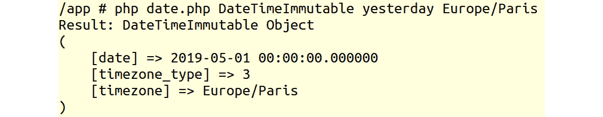

图 8.36：打印 Europe/Paris 日期时间详情

这将是昨天的日期，欧洲/巴黎时区的午夜。在这种情况下，脚本已执行而没有异常；`DateTimeImmutable`的第二个参数是一个具有`Europe/Paris`时区设置的`DateTimeZone`对象，因此结果按预期打印。

## 活动 8.1：处理系统和用户级错误

假设你被要求开发一个脚本，该脚本将计算给定输入的阶乘数，具有以下规范：

+   至少需要一个输入参数。

+   输入参数应验证为正整数（大于零）。

+   对于每个提供的输入，脚本应计算阶乘数；结果按行打印每个输入参数。

应根据规范验证输入，并处理任何错误（抛出的异常）。不应有任何异常停止脚本的执行，区别在于预期的异常打印到用户输出，而对于意外的异常，打印一个通用的错误消息，并将异常记录到日志文件中。

执行以下步骤：

1.  创建一个名为`factorial.php`的文件，该文件将运行脚本。

1.  创建异常处理器，它将格式化的日志消息记录到文件中；消息格式与`all-errors-handler.php`文件的异常处理器中相同。

1.  创建错误处理器来处理报告的系统错误；这将把错误转发到异常处理器（将错误转换为异常）。

1.  注册异常和错误处理器。

1.  创建自定义异常，每个验证规则一个。

1.  创建一个函数，用于验证和计算单个数字输入（例如，`calculateFactorial()`）。

1.  创建一个函数，用于以特定格式打印错误消息。它将为每条消息添加`(!)`前缀，并包括一个换行符。

1.  如果没有提供输入参数，显示一条消息，强调至少需要一个输入数字的要求。

1.  遍历输入参数，并调用`calculateFactorial()`函数，提供`input`参数。结果将按照以下格式打印：`3! = 6`（其中`3`是输入数字，`6`是`calculateFactorial()`的结果）。

1.  捕获`calculateFactorial()`函数可能抛出的任何（预期的）自定义异常，并打印异常消息。

1.  捕获所有意外的异常，除了之前定义的自定义异常之外，并调用异常处理器将它们记录到日志文件中。同时，向用户输出显示一个通用的错误消息（例如，对于输入数字 N，发生了意外的错误，其中 N 是在`calculateFactorial()`函数中提供的输入数字）。

输出应类似于以下内容：

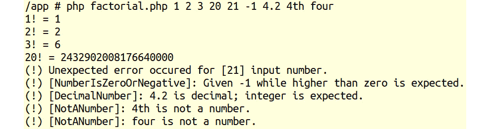

图 8.37：打印整数的阶乘

注意

本活动的解决方案可在第 552 页找到。

# 摘要

在本章中，你学习了如何处理 PHP 错误以及如何与异常一起工作。现在，你也理解了传统错误和异常及其用例之间的区别。你学习了如何设置错误和异常处理器。现在，你理解了 PHP 中的不同错误级别，以及为什么某些错误会截断脚本的执行，而大多数错误则允许脚本继续执行。此外，为了避免代码重复，你学习了如何将传统错误转换为异常并将它们转发到异常处理器。

最后，我的建议是考虑设置一个日志服务器（一些免费解决方案可供下载和使用），你可以将所有日志发送到那里，这样，当你访问日志平台时，你可以过滤条目（例如，按严重性/日志级别或按搜索词），使用各种聚合创建数据可视化（例如，在过去 12 小时内每 30 分钟间隔的警告计数），等等。这将帮助你比浏览日志文件更快地识别某些错误级别的消息。

当应用程序至少部署在两个实例上时，日志服务器尤其有用，因为日志的集中化不仅允许你非常快速地发现问题，你还将能够看到导致问题的实例以及可能更多的上下文信息。此外，日志管理解决方案可以用于多个应用程序。

实际上，对于后者，你可以查看包括*学习 ELK Stack*在内的标题；包括 ElasticSearch、LogStash 和 Kibana ELK 系列的视频课程；以及*Packt Publishing*平台上的许多其他内容。

在登录文件系统是完全可接受的，尤其是在开发过程中，但在某个时候，当你在开发应用程序时，生产环境将需要一个集中的日志解决方案，无论是 HTTP 访问/错误日志、应用程序日志还是其他日志（尤其是在分布式架构/微服务中）。你希望提高生产力，编写或修复代码，而不是迷失在存储在文件系统中的文件和日志行之间。

在下一章中，我们将定义作曲家和使用 Composer 管理库。
