# 9. Composer

概述

到本章结束时，你将能够描述在应用程序中使用依赖管理器的优点；识别解决常见问题的优质开源包；将第三方库添加到你的项目中；在你的项目中设置自动加载，这样你就不必使用 include 语句；并实现 Monolog 日志包。

# 简介

在上一章中，我们介绍了如何通过使用 PHP 内置的`Exception`类来处理错误条件，以及如何使用`try`…`catch`块来控制应用程序的流程。

大多数现代应用程序都是建立在其他开源库的混合之上。许多在所有应用程序中经常遇到的问题已经被开发者解决并测试过，他们已经将他们的解决方案免费提供给包括在你的项目中的使用。这可能是一个生成唯一标识符的库，也可能是一个完整的应用程序框架，帮助你组织代码。以身份验证为例。几乎每个 PHP 应用程序都将包含某种形式的身份验证，而且大多数情况下，它将以完全相同的方式构建。我们使用第三方解决方案进行身份验证，这样我们就不必在编写的每个应用程序中重复编写相同的身份验证代码。其他这类需要在多个应用程序中使用的库，称为横切关注点，包括日志记录、安全和与文件系统的交互。列表还在继续。

由于许多外部库的依赖，拥有一些用于管理这些库的工具变得至关重要。在 PHP 中，我们非常幸运地拥有一个专为这一目的设计的优秀开源工具——Composer。除此之外，如果你愿意，可以利用 Composer 将公司经常实现的功能组织成一个库，作为所有应用程序的起点，避免重复编写代码，并管理该库的任何更新。

在本章中，我们将解释什么是依赖管理以及为什么你应该使用一个工具来处理它。我们将带你了解你将用于在项目中开始使用它的基本命令，并解释配置文件。我们将介绍 PSR-4，这是由 **PHP 框架互操作性小组**（**PHP-FIG**）定义的许多建议之一，它不仅限于 Composer，但经常被用来简化代码在称为 **自动加载** 的过程中的包含。我们将通过设置一个使用流行的日志框架 Monolog 的示例项目来演示自动加载。最后，我们将介绍 Packagist，这是一个作为包目录列表的网站，我们将提供一些关于导航网站和评估你找到的包的建议，以帮助你选择不仅提供你需要的功能，而且有支持水平的包。

# 依赖管理

你可能会问自己，为什么我们需要另一个工具的复杂性来管理我们的外部依赖。你总是可以直接获取源代码的副本并将其直接放入你的项目中。答案在问题中的一个词中变得明显：*外部*。这些依赖不是你的代码，你也不想负责管理它们。当你考虑到这些包可能也依赖于其他库，而这些库可能自身也有依赖，如此等等时，这一点变得更加明显。此外，随着这些库实现新功能、修复错误和安全维护版本，它们需要相互兼容，这也使得问题更加复杂。

Composer 会完成所有艰苦的工作，确定你依赖的任何库是否有可用的升级，并确定这些库的哪些版本可以相互兼容，然后生成一个详尽的包及其元数据列表，告诉它确切需要安装什么以及这些包可以在项目的哪个位置安装。你所要做的就是使用几个简单的命令或编辑一个配置文件，为 Composer 提供一个你想要包含在项目中的包列表，并运行一个命令来安装它们。

## 使用 Composer

Composer 是一个你将最频繁地从命令行与之交互的工具。接下来的几节将介绍你日常最常用的操作，并为每个操作提供练习。你需要安装 Composer，安装说明在序言中提供。Composer 可以在项目级别或系统全局级别安装。确保你已经全局安装了 Composer。

## 练习 9.1：开始使用 Composer

在这个简短的练习中，我们将从命令行首次运行 Composer 以验证其是否正确安装，运行一个命令，该命令将给出我们可以传递给它的参数列表，以便执行其提供的各种功能，然后向您介绍 `help` 命令，以便您可以获取 Composer 所提供的任何命令的摘要信息：

1.  打开您的命令提示符并导航到您存储代码的文件夹。

1.  通过运行以下命令来检查您已安装的 Composer 版本，以验证 Composer 是否正常工作：

    ```php
    composer –V
    ```

    版本号可能不同，但如果一切设置正确，您将看到类似以下截图的输出：

    

    ![图 9.1：打印版本号 1.  接下来，使用以下命令列出 Composer 所有的可用功能及其简要说明：    ```php    composer list    ```    您将获得类似以下输出的结果：    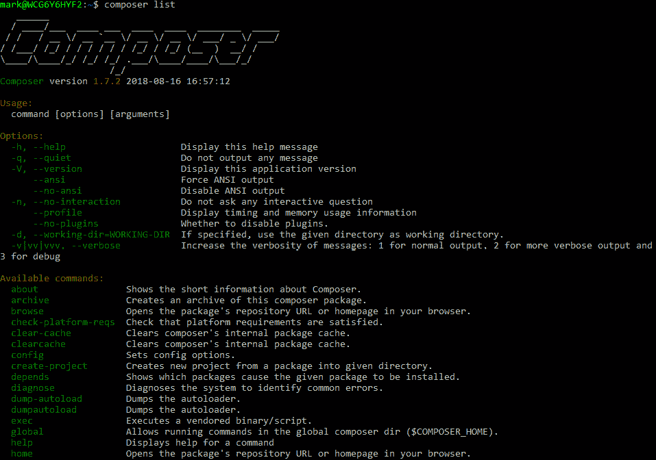

    ![图 9.2：Composer 的功能    这是一种探索 Composer 功能和查找您之前使用过但记不清确切名称的命令的简单方法。1.  最后，`help` 命令接受一个命令名称作为参数，并解释该功能的用法。调用 `help` 命令，将 `init` 命令作为参数传递：    ```php    composer help init    ```    您将获得类似以下输出的结果：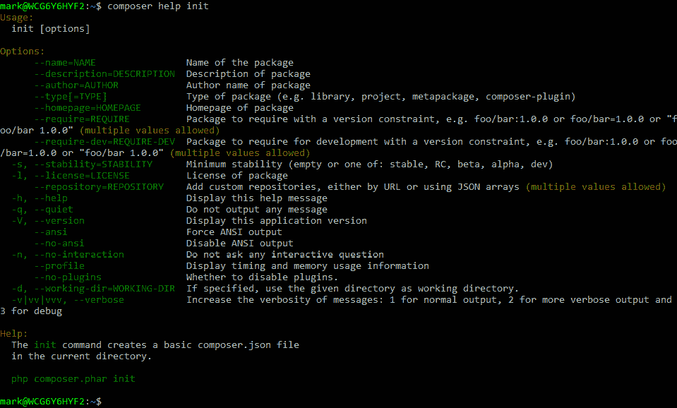

![图 9.3：帮助命令的截图如果您记不起具体的语法，或者甚至想要发现可能修改其行为以适应您需求的选项，`help` 命令是一个有用的工具。## 初始化项目现在您已经看到了如何在命令行上调用 Composer，您可以使用一些基本设置来初始化一个项目。这些设置存储在一个名为 `composer.json` 的文件中，该文件应位于您的项目根目录中。此文件将包含有关您项目的元信息以及您项目中要安装的每个依赖项的定义。幸运的是，Composer 提供了一个简单的命令来帮助我们开始：`init`。## 练习 9.2：初始化项目在这个练习中，我们将通过使用 `init` 命令来逐步介绍项目的初始安装。您将需要配置一些选项，如下所示：1.  为此示例创建一个新的目录作为项目目录，并导航到该目录。这里，我们将使用 `composer-example`。1.  从此目录运行以下命令以初始化项目：    ```php    composer init    ```1.  输入您想要为您的包选择的名称并按 *Enter*：    ```php    mccollum/composer-example    ```1.  输入描述并按 *Enter*。1.  按 *Enter* 以接受默认的作者。1.  输入 `stable` 作为最低稳定性。    注意    最小稳定性告诉 Composer 在您需要包时选择哪个版本的包时可以接受的稳定性级别。选项，从最稳定到最不稳定，依次为稳定版、RC 版、beta 版、alpha 版和开发版。通常，对于最终将用于生产的项目，选择 "稳定版" 是最好的。1.  输入 *project* 作为包类型并按 *Enter* 键。1.  按 *Enter* 键跳过选择许可证。1.  对定义依赖和开发依赖项进行交互式操作时，回答 `no`。    您屏幕上的输出应类似于以下内容：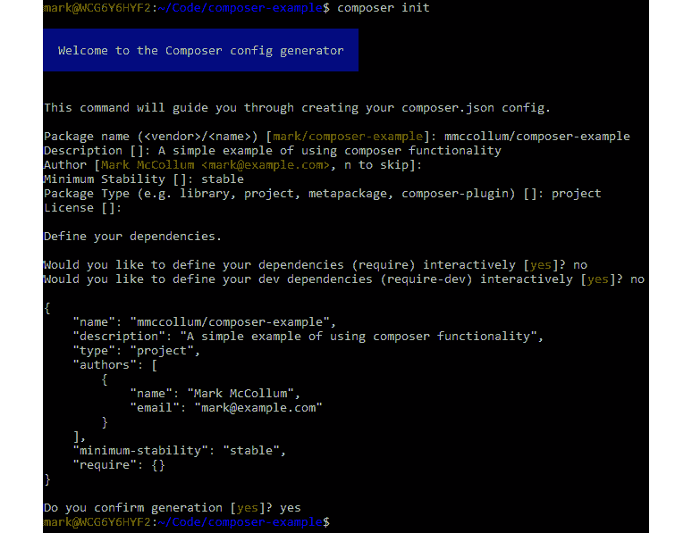

图 9.4：确认后的截图

现在，您项目根目录下将列出一个新的 `composer.json` 文件。`composer.json` 文件的内容在生成文件的最后一步输出到屏幕上。打开它并查看它。您在 `init` 命令期间输入的所有信息都应该列在该文件中。您可以直接修改此文件，但在大多数情况下，从命令行与之交互更方便。

## 需求包

到此阶段，所有设置都已完成，您现在可以开始将包拉入您的项目。您只需要告诉 Composer 您的项目需要该包，Composer 将确定安装包的适当版本，修改 `composer.json` 文件以将包添加为依赖项，并下载项目文件并将它们放置在供应商目录中，如果不存在，它将创建该目录。

供应商目录是一个特殊目录，Composer 将所有添加到您项目的文件都保存在这里。如果需要将其设置为不同的目录，则可以进行配置，但通常最好保持默认设置以符合惯例。一旦您在文件夹内需求包，将为每个项目创建一个文件夹，其中包含该库的源代码。重要的一点是不要编辑此目录内的文件，否则在包升级时您的更改可能会丢失。一般来说，将您自己的代码与您构建在之上的依赖项保持分离是一个好主意。

为了通过一个示例进行操作，我们需要选择一个可以通过 Composer 拉取的包。我们选择了 Monolog，它恰好是由 Composer 的主要开发者之一开发和维护的。这是一个方便的库，它作为所有应用程序中常见日志功能的抽象。它允许您设置任意数量的进程，这些进程将使用通用接口监听日志函数的调用，并将日志记录到各自的输出中，这些输出从文件系统到 NoSQL 数据库客户端，再到亚马逊网络服务的存储桶。如果您想捕获日志的地方，Monolog 很有可能支持它，并使其变得容易实现。

## 练习 9.3：添加依赖

在这个练习中，我们将使用 Composer 向您的项目添加依赖项。我们选择了一个流行的日志框架，我们将在本章后面使用它：

1.  在您的命令提示符中，导航到您初始化项目的目录。

1.  运行以下命令安装 Monolog：

    ```php
    composer require monolog/monolog
    ```

    输出如下：

    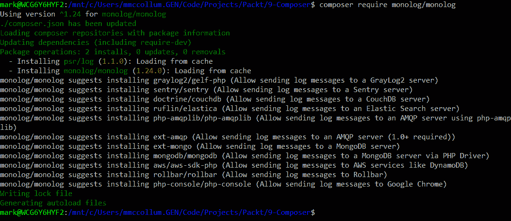

    图 9.5：安装 Monolog

1.  检查供应商目录：

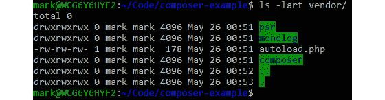

图 9.6：检查目录

在供应商目录中，您将看到 Monolog 的目录以及它的依赖项 `psr`。还有一个用于 Composer 自身的目录，以及一个 `autoload.php` 文件。我们将在本章后面介绍自动加载文件的作用。`composer.json` 文件也将被更新，现在在 `require` 部分包括 `monolog/monolog` 的一行，并显示它选择的包版本：


图 9.7：打印版本

# 语义化版本控制

Composer 中可用的包遵循一种称为语义化版本控制的版本约定。这是一个用于增加版本标识符的标准格式，它赋予数字以意义，基于此，标识符中的数字增加。官方文档位于 [`semver.org/`](https://semver.org/)。版本格式化为三个整数，由点分隔。第一个整数代表主要版本变更，表明发布可能包含破坏性更改，其客户端需要重新工作以与库集成。第二个整数表示次要更改，如新功能，应向后兼容。第三个数字表示错误修复或安全更新，也称为补丁，通常应允许自动更新。

当一个数字增加时，其后的数字会重置为 0。例如，在撰写本文时，当我安装 Monolog 包时，当前的稳定版本是 1.24.0。这意味着自项目被认为稳定并准备投入生产以来，已有 24 个小版本发布。如果发现软件中存在错误并且他们单独发布，下一个版本号将是 1.24.1。之后，下一个小功能版本的发布将版本号提升到 1.25.0。如果他们需要以破坏消费者界面的方式更改库，版本号将提升到 2.0.0。这是一个非常有用的格式，我建议在您的版本控制系统中的项目中使用它。

## 应用版本约束

当你需要一个包时，你可以选择性地指定版本约束，以限制 Composer 可能选择的安装的包的版本。你将想要确保当你升级由 Composer 安装的包时，它不会自动升级到一个将与你的代码库不兼容的版本。最常见的用例是你只想自动应用补丁级别的更新，并在可以测试次要和主要版本之前等待，然后再与你的代码一起发布。另一个例子来自我的个人经验，当时我们转换了一个大型遗留应用程序以使用 Composer，该应用程序使用了比当前版本落后几个主要版本的库。更新库并不划算，所以我需要将其锁定在由 Composer 管理之前安装的同一版本。

Composer 提供了一些修饰符，你可以添加到版本定义中，以便根据你的指定动态选择版本。你可以在 [`packt.live/2MJNAur`](https://packt.live/2MJNAur) 找到这些修饰符的完整描述。其中最常见的是下一个重要版本的操作符：一个由波浪线字符表示，如 ~1.24.3，另一个是 caret 符号，如 ¹.24.0\。

波浪线操作符将限制升级到下一个主要或次要版本，具体取决于是否指定了补丁号。例如，~1.24.3 将接受任何低于 1.25.0 的版本，而 ~1.24 将接受任何低于 2.0.0 的版本。caret 操作符类似，但假设任何非破坏性更改，如语义版本控制所指定，都是可接受的。如果指定了 ¹.24.3，这将允许任何低于 2.0.0 的升级。

## 练习 9.4：应用版本约束

在这个练习中，我们将介绍 `show` 命令，并给出将版本约束应用于依赖项的示例。你还会看到，当你需要包时，你可以在命令的末尾添加你希望安装的版本，它将针对该约束：

1.  从命令提示符运行命令以查看当前安装的包：

    ```php
    composer show
    ```

1.  将你的需求更新到 Monolog 的 1.0.0 版本：

    ```php
    composer require monolog/monolog:1.0.0
    ```

    如果你再次运行 Composer，你会看到 Monolog 已降级到 1.0.0：

    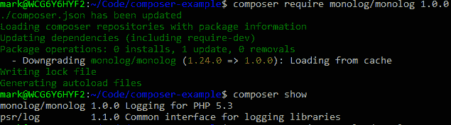

    图 9.8：Composer 的截图

1.  现在，更新 `require` 命令以接受 1.23 或更高版本，但低于 2.0\. 注意，它将安装低于 2.0.0 的最高版本：

    ```php
    composer require monolog/monolog:~1.23
    ```

    Composer 将再次显示它已升级到当前版本（写作时的 1.24.0 版本）。

使用这些约束，你可以确信随着时间的推移和新版本的发布，你的代码将不受影响，直到你准备好实施他们的更改。你也许还会注意到，`psr/log` 的版本不会随着升级或降级 Monolog 的版本而改变，因为 1.1.0 满足这两个版本。

## 锁定文件

在这个阶段，如果你检查你的项目目录中的文件，你会看到使用`init`命令生成的`composer.json`文件，当你需要一个包时创建的供应商目录，以及最后的`composer.lock`文件。`composer.lock`文件是`composer.json`文件的对应文件，每次你对所需包进行修改时都会重新生成。如果你查看文件的内容，你会看到几个部分，例如`_readme`和内容哈希，但主要的部分是包部分，它详细说明了你安装的包以及一些元数据，这些元数据允许 Composer 以相同的配置可靠地重新安装包。每个包都有列出名称、安装的版本、版本控制类型以及可以找到它的 URL，以及其他所需依赖项等。

这很重要，因为它允许你使用在开发期间使用的已知版本一致地重新安装整个依赖项列表。想象一下这样一个场景：你被带到团队中参与一个项目，需要使用版本 1.0.0 的`acme/awesome-package`。然而，当你加入项目时，版本 2.0.0 已经发布。如果没有`.lock`文件，你可能会得到一个可能与代码库不兼容的库版本。使用`install`命令将利用`.lock`文件来确定要安装的包的版本，而`update`命令将忽略当前的锁文件，并生成一个与所有所需包兼容的最新版本的新锁文件。`.lock`文件指定了每次更新依赖项时安装的包的确切版本。因此，通常将`composer.json`和`composer.lock`文件提交到版本控制。通过指定安装的确切版本，你可以有信心你得到的版本将与你的代码兼容，直到你明确更新包的那一刻。

## 练习 9.5：重新安装供应商文件

为了展示`composer.lock`文件是如何工作的，我们将完全删除供应商目录，并使用`install`命令恢复所需包：

1.  从命令提示符中删除整个供应商目录：

    OSX 或 Linux: `rm –rf vendor`

    Windows: `rmdir vendor`

1.  查看你的项目目录的内容，以查看供应商目录已消失。你应该仍然拥有你的`composer.json`和`composer.lock`文件，这将允许你通过运行`install`命令重新安装所需包。

1.  运行以下命令来安装依赖项：

    ```php
    composer install
    ```

    输出如下：

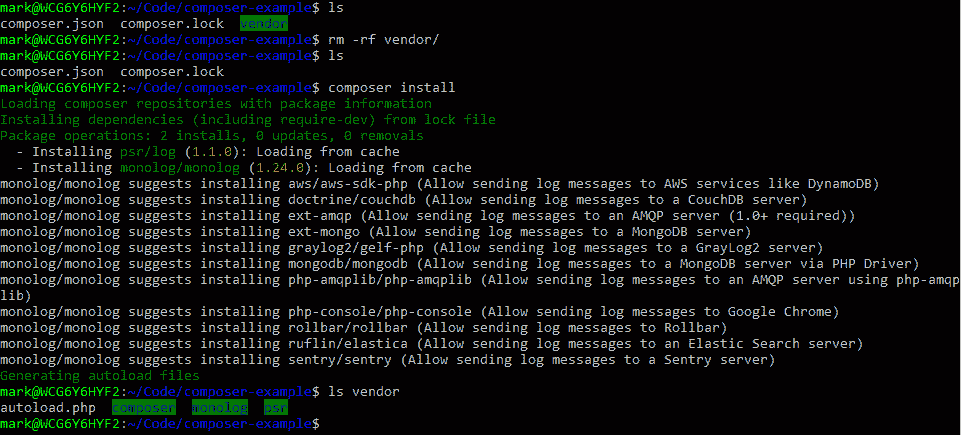

图 9.9：安装依赖项

哇！供应商目录已恢复，所有依赖项的文件和文件夹都回到了它们通常的位置。

## 开发依赖项

你项目依赖的许多包将是生产代码，但其中一些将是仅用于开发目的的库。这些例子包括测试框架和命令行工具。Composer 提供了将包指定为开发依赖项的能力，这样当你在非开发环境中运行`install`命令时，你可以传递`--no-dev`标志，它将省略任何仅用于开发的包。

## 练习 9.6：安装开发依赖项

在这个练习中，我们将仅将流行的单元测试框架 PHPUnit 添加为开发依赖项：

1.  安装 PHPUnit 测试框架：

    ```php
    composer require --dev phpunit/phpunit
    ```

1.  现在，如果你查看`composer.json`文件的内容，你将在`require-dev`部分看到列出的`phpunit/phpunit`包：

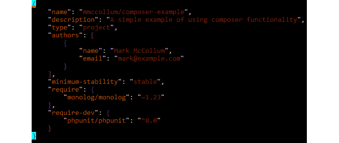

图 9.10：composer.json 的内容

将包作为开发依赖项是一种在打算推向生产的代码和真正仅用于开发目的的代码之间保持良好分离的方法。

## Packagist

Composer 有一个配套网站[`packagist.org`](https://packagist.org)，它作为所有可拉入你项目的包的主要列表。当你正在向应用程序添加功能时，你应该首先问问自己，在其他开发者之前是否可能已经解决了这个问题，然后你应该检查 Packagist，看看是否有可以简化你功能开发的包。这将使你作为一个开发者更加高效，因为你将不会花费时间编写其他开发者已经一次又一次编写过的代码，可以专注于使你的项目产生价值的代码。软件开发的成本不仅仅是编写代码；你还需要测试和维护代码。养成使用开源解决方案的习惯，从长远来看可以节省你无数的开发时间。只需根据你正在寻找的功能的关键词进行搜索，或者如果你知道包名，也可以按包名搜索。

当你在 Packagist 上浏览包时，理解的一个重要概念是它们以供应商命名空间为前缀，后面跟着一个斜杠和实际包的名称。例如，有一组开发者称自己为*非凡包联盟*，因为他们生产了各种经过良好测试的开源库，并使用现代编码实践。

他们最受欢迎的包之一是`flysystem`，这是一个作为与文件系统交互的抽象层的库。他们运营的供应商名称是"league"，因此包的名称是`league/flysystem`。

将供应商名称和包名称结合使用，可以通过允许项目具有相同的基名，同时仍然能够区分两个不同的包来有所帮助。在某些情况下，具有相同名称但两个不同供应商前缀的项目可能是一个被一个供应商遗弃并由另一个供应商以新供应商名称拾起的项目。这是开源的一大优点。项目总是可供复制和使用，作为扩展的起点。

## 练习 9.7：在 Packagist.org 上发现包

在接下来的练习中，我们将通过一个示例来展示您如何使用 Packagist 网站寻找包，以及一些可以作为评估不同包的指导准则的标准，以便您可以选择适合您特定情况的包。我们将搜索一个广泛使用的包来处理我们应用程序的日志功能：

1.  打开浏览器窗口并导航到[`packt.live/2MlwgNv`](https://packt.live/2MlwgNv)：![图 9.11：Packagist 窗口]

    ![图片 C14196_09_11.jpg]

    图 9.11：Packagist 窗口

1.  在主搜索栏中输入`logging`：![图 9.12：搜索包]

    ![图片 C14196_09_12.jpg]

    图 9.12：搜索包

    注意

    Packagist 在搜索结果中列出包的下载次数和星级。选择下载次数和星级尽可能多的包是个好主意，因为这些包更有可能是高质量的，并且长期维护支持的可能性也更大。

1.  点击链接查看与 monolog/monolog 包相关的详细信息，这应该是列表中的第一个条目之一。在撰写本文时，它已有超过 1.32 亿次下载和超过 14,000 颗星：

![图 9.13：Monolog 的详细信息]

![图片 C14196_09_13.jpg]

图 9.13：Monolog 的详细信息

注意

在右侧的面板上，您将看到指向 GitHub 上存储库和包主页的链接。这些通常会提供有关如何使用包的重要说明。您可以在 GitHub 上查看包的源代码。这有助于评估包的质量。

您可以从 Packagist 上包的详细信息页面中获取大量信息，这些信息将帮助您确定是否将其包含在自己的项目中。以下是一些您可能想要考虑的事项：该包是否被其他开发者广泛使用？一个很好的迹象是该包的星级、安装次数以及其他列出它作为建议的包的数量。

使用该包的人越多，它在未来被良好维护的可能性就越大。如果项目没有像其他一些非常受欢迎的项目那样拥有那么多星和下载量，这是否意味着它只适用于更窄的使用案例，但在这个较小的群体中仍然非常受欢迎？GitHub 页面上是否有许多开放的问题？他们是否已经回应了这些问题？这些问题已经开放了多久？有多少问题已经被解决？项目最后一次更新是什么时候？找到这些问题的答案应该能让你对项目是否得到了良好的维护有一个感觉。

由于项目是开源的，我们将会看到分支和拉取请求。分支是指开发者用自己的供应商名称创建项目的副本，以便他们可以对项目进行更新，并且很可能会通过拉取请求将其提交回主项目的维护者。这被称为拉取请求，因为进行更新的开发者正在请求将更新拉回到主项目仓库。你可以在 GitHub 上看到有多少拉取请求已被合并，这真的是一个很好的指标，表明项目会随着时间的推移而更新，甚至如果你发现了一个有用的功能或需要修复的 bug，这还给你提供了向项目贡献的机会。

在详情页面的中心面板中，你会看到其他包的两个列表：一个列出所选包作为其依赖项的包，而另一个则列出建议的包。如果你计划安装一个包，评估每个包的依赖项就像评估原始包一样是个好主意，因为它们最终都会成为你的应用程序可能执行的代码。你可能无法阅读每一行源代码，但你应该能够合理地判断这个包是否值得信赖。建议的包是与所选包兼容的包，但它们并不适用于安装该包的每个项目，因此不值得包含在主包中。例如，我们之前提到的`flysystem`包有许多与包括亚马逊网络服务、Azure 和 Dropbox 在内的系统集成的扩展建议。只包含基础部分，让用户选择适合自己的扩展，这是最有意义的。

也很重要的是，要注意这些包正在互联网上免费提供，你应该从安全的角度评估它们，并确保在安装它们时你得到的是你预期的代码。

在选择第三方软件并将其包含到您的项目中时，您应该考虑这些重要的信息。如果您不想直接与 Packagist 接口，Composer 的制作者提供了适用于企业的解决方案，包括 Toran Proxy 和 Satis。这些解决方案作为 Packagist 和 GitHub 的代理，可以用来托管您自己公司的包，但请保持它们仅对您的组织内部可见。Toran Proxy 提供商已被淘汰，现在推荐使用 Private Packagist ([`packt.live/2Beq5Ez`](https://packt.live/2Beq5Ez))。如今，开源软件已经解决了我们许多常见问题，只要稍加努力，您通常就能找到一个正好符合您需求的包，然后只需实现它即可。

# 命名空间

在我们继续使用 Composer 安装的包之前，让我们简要回顾一下在*第五章*，*面向对象编程*中学到的关于命名空间的知识。这与我们在 Packagist 网站上提到的命名空间类似。然而，这些是内置于 PHP 语言中的。命名空间自 PHP 5.3 版本以来就是 PHP 的一部分，您遇到的库几乎都会使用命名空间。命名空间允许多个代码片段在名称冲突的情况下并排存在。在命名空间之前，供应商不得不不便利地创建非常长的类名，这些类名以供应商名称为前缀，通常由下划线分隔，以避免命名冲突。强烈建议您在自己的代码中使用命名空间，以帮助保持事物井然有序并简化文件之间的引用。

要在文件中定义一个命名空间，它必须在文件顶部声明，在任意其他代码之前。只需使用`namespace`关键字，后跟您想要定义的命名空间，并用分号完成该行。您可以通过在前缀和命名空间之间插入反斜杠字符以目录结构的方式给命名空间添加前缀。如果您愿意，可以使用多级前缀。您将在下一个练习中看到这个示例。要引用一个命名空间，您可以通过提供命名空间的绝对路径来引用一个完整的命名空间，或者您可以使用`use`关键字，这将使命名空间在整个作用域内可用。这将在示例中演示。

## 自动加载

在我们使用 Composer 安装的依赖项编写代码之前，还有一个主题需要讨论，那就是自动加载。自动加载是一个术语，指的是在您正在工作的文件外部程序化地自动包含类和函数。没有它，我们的代码将会充斥着`include`或`require`语句。PHP 提供了一个函数`spl_autoload_register`，它接受一个函数来为您完成自动加载，但 Composer 使这个过程更加简单。

当 Composer 创建 vendor 目录时，它会在其中放置一个 `autoload.php` 文件。通过在 `composer.json` 文件中进行一些配置，如果您需要这个文件（理想情况下在启动应用程序其余部分时作为一个中央文件）并遵循文件和目录的命名约定，Composer 将自动为您包含所有内容，从而节省您的时间和麻烦。

## 使用 Composer 包

现在我们来了解一下如何使用由 Composer 拉入的库。您可以将 Monolog 的这个示例用作构建任何 PHP 应用程序时日志记录的坚实基础。首先，我们将创建一个简单的脚本作为示例，然后我们将连接我们的脚本到 Composer，以便我们的依赖项中的类将被自动加载。这样，我们的代码可以保持干净，不会被无用的 `require` 或 `include` 语句所杂乱。

Composer 也可以为您自动加载您自己的类。您可以在 `composer.json` 文件中配置此功能。PHP 有一个标准的文件和目录结构，您不需要指定它们。它是 PHP-FIG 维护的一系列标准的一部分。自动加载标准被称为 PSR-4。您可以在 [`packt.live/314fBCj`](https://packt.live/314fBCj) 查看完整的文档。为了遵循此标准，您应该将您的类放置在与您的类命名空间结构相匹配的目录结构中。例如，如果您编写了一个具有命名空间 `Acme/Helper` 的虚拟类，其路径将是 `Acme/Helper/Dummy.php`。通常，此路径位于项目根目录内的另一个目录中，以保持您的应用程序代码分离，例如一个 `src` 目录。

## 练习 9.8：使用 PSR-4 加载类

在这个练习中，我们将编写一个基本的 PHP 类，并使用符合 PSR-4 约定的文件名和目录结构。然后，我们将使用 Composer 来自动加载该类，无需我们自己引入类文件：

1.  在包含 `composer.json` 文件的目录中，创建一个名为 `src` 的新目录。在该目录内，创建一个名为 `Packt` 的目录：

    ```php
    mkdir src
    cd src
    mkdir Packt
    ```

1.  在 `Packt` 目录中，创建一个名为 `Example.php` 的文件，并包含以下内容：

    ```php
    <?php
    namespace Packt;
    class Example
    {
        public function doSomething()
        {
            echo "PHP is great!" . PHP_EOL;
        }
    }
    ```

1.  在您的项目根目录中，打开 `composer.json` 文件，并在 `require-dev` 部分下方添加自动加载部分：

    ```php
    composer.json
    15 "require-dev": {
    16       "phpunit/phpunit": "⁸.0"
    17 },
    18 "autoload": {
    19       "psr-4": {
    20             "Packt\\":"src/Packt/"
    21 }
    22 }
    https://packt.live/2VSAwHu
    ```

1.  创建一个 `index.php` 文件：

    ```php
    <?php
    require 'vendor/autoload.php';
    use Packt\Example;
    $e = new Example();
    $e->doSomething();
    ```

1.  运行 `index.php` 文件。您可以在下面的屏幕截图中看到输出：

![图 9.14：index 的输出]

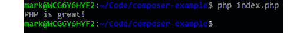

图 9.14：index 的输出

您可以看到，通过配置 Composer 并遵循 PSR-4 格式，当您调用类时，您的类将按需加载到内存中，无需显式地引入文件。接下来，让我们通过一个非常基本的 Monolog 实现来扩展我们的示例。

## 练习 9.9：实现 Monolog

在这个练习中，我们将给出一个示例实现，说明如何将我们在本章早期安装的 Monolog 库集成。这个示例假设你已经完成了之前的示例，并且正在主项目目录的命令提示符下工作：

1.  从命令行创建一个`logs`目录。这个目录将是我们日志的存放位置：

    ```php
    mkdir logs
    ```

1.  编辑`index.php`文件以包含 Monolog 的`use`语句，设置一个处理器，并将其传递给我们的`Example`类：

    ```php
    <?php
    require 'vendor/autoload.php';
    use Monolog\Logger;
    use Monolog\Handler\StreamHandler;
    use Packt\Example;
    $logger = new Logger('application_log');
    $logger->pushHandler(new StreamHandler('./logs/app.log', Logger::INFO));
    $e = new Example($logger);
    $e->doSomething();
    ```

1.  编辑`src/Example.php`文件以添加 Monolog 的`use`语句，添加一个接受日志记录器的构造函数，并调用日志记录器：

    ```php
    Example.php
    1  <?php
    2  namespace Packt;
    3  use Monolog\Logger;
    4  class Example
    5  {
    6      protected $logger;
    7      public function __construct(Logger $logger)
    8      {
    9          $this->logger = $logger;
    10     }
    https://packt.live/2MNutj6
    ```

1.  再次运行`index.php`脚本：

    ```php
    php index.php
    ```

1.  现在，查看`./logs`目录下的`app.log`文件：

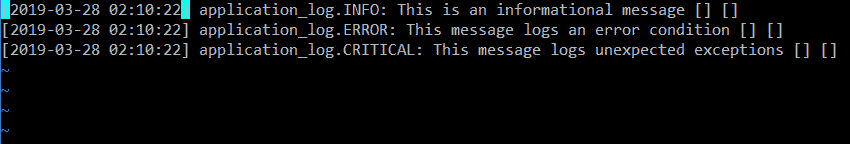

图 9.15：打印日志

你将在`doSomething`方法中的三个日志级别中看到三条写入的行。

通过这个示例的学习不仅展示了你如何使用通过 Composer 包含在你的项目中的库，而且还提供了一个非常基本的 Monolog 设置示例，你可以将这些相同的原理应用到设置你应用程序的高级日志中。

在开始下一个活动之前，你应该熟悉一些概念，以便在实际世界中使其有用。你将修改我们刚刚编写的示例应用程序，以生成一个称为 UUID 的通用唯一标识符。UUID 是一个 128 位的数字，用于在计算机系统中唯一标识数据。它们看起来像由破折号分隔的长字母数字字符串。它们可以有多个用途，但最常见的一个用途是为你的系统中可能存储在数据库中的数据生成唯一的 ID。现在，使用递增整数作为公开可访问对象的唯一标识符通常被认为是不良的做法，因为你可能不希望用户能够猜测序列中的下一个数字。我们为这个活动选择的包使这项任务变得非常简单。

## 活动九.1：实现一个生成 UUID 的包

在这个活动中，你有机会应用本章学到的知识。你需要完成本章之前的练习，并将它们作为起点。有一个名为`ramsey/uuid`的 Composer 包用于生成 UUID：

1.  将 UUID 包添加到你的项目依赖项中，并确保它已安装在 vendor 目录中。

1.  在你的`Example.php`脚本中添加一个方法来调用库生成 UUID 并输出结果。提供了多种生成 UUID 的方法；`uuid1()`就足够了。在`echo`语句的末尾包含一个连接的新行，`PHP_EOL`。

1.  在你的`index.php`文件中调用你在`Example.php`中创建的新方法，在你的前一个输出之后。

1.  运行`index.php`脚本并确认你看到了生成的 UUID。

输出应类似于以下内容：

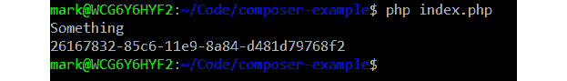

图 9.16：预期结果

注意

该活动的解决方案可以在第 558 页找到。

# 摘要

在本章中，您介绍了依赖管理以及 Composer 的概念，Composer 是 PHP 中将外部依赖项引入项目的首选工具。依赖管理对于保持您的应用程序代码与需要保持更新并相互兼容的第三方库分离非常重要。

我们介绍了 Packagist，这是 Composer 的配套网站，它列出了可用于项目包含的包。您可以通过注意评分、下载次数和其他此类标准来识别信誉良好的包。该网站链接到其列表的每个源代码，因此如果您需要更好地了解其内部工作原理或想要确认代码的质量，您可以自己审查代码。

我们概述了如何设置项目以使用 Composer，以及如何使用您将需要集成其他库的基本功能。在命令行中或直接编辑`composer.json`文件时需要库。可以对它们施加版本约束，以便 Composer 只安装指定范围内的版本。每次需要包时，都会生成一个锁文件，以跟踪当前已安装的库的确切版本。包也可以指定为仅用于开发目的，因此可以在传递给`install`脚本的标志时省略开发依赖项。

最后，我们设置了一个 Monolog 的示例实现，以展示如何使用 Composer 安装的包。只要我们遵循 PSR-4 标准并利用命名空间，我们就可以使用 Composer 来自动加载我们的代码。在下一章中，我们将探讨网络服务的基本概念，以及如何使用 Guzzle（一个流行的 PHP 开源库，用于发送 HTTP 请求）将您的应用程序与它们连接。

在下一章中，我们将概述网络服务，并查看一些与之交互的示例。
