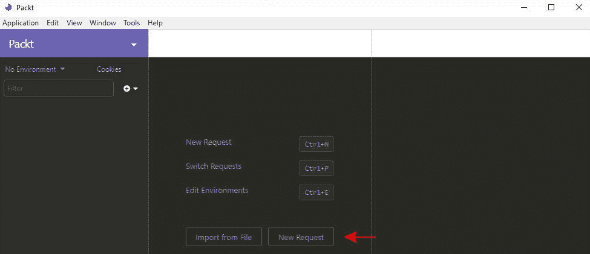
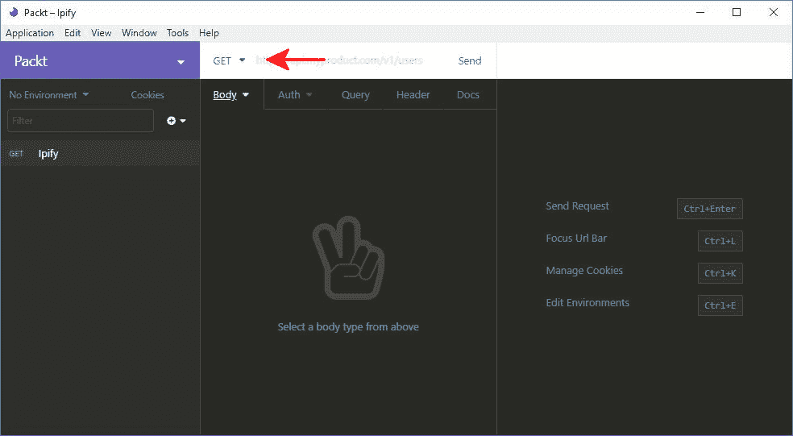
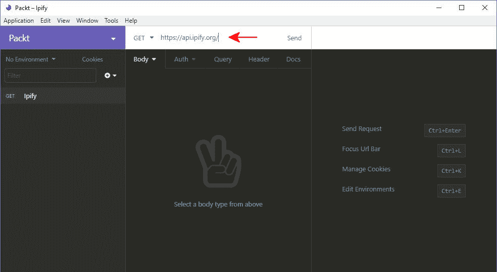
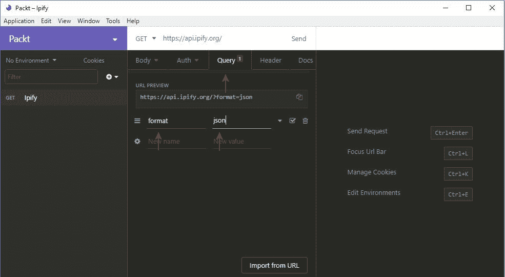
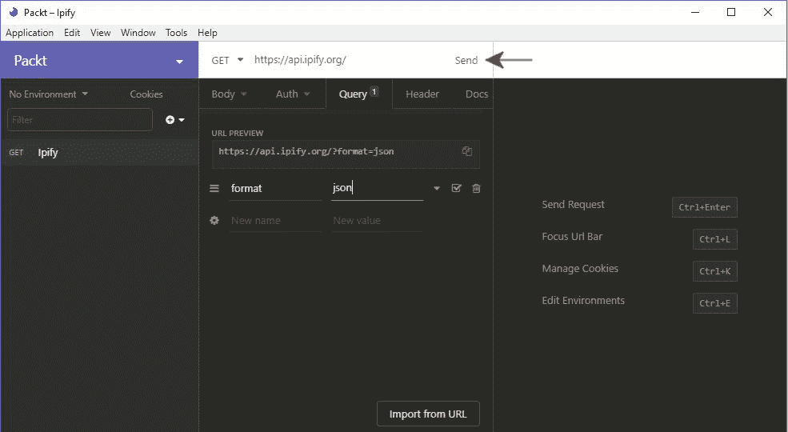
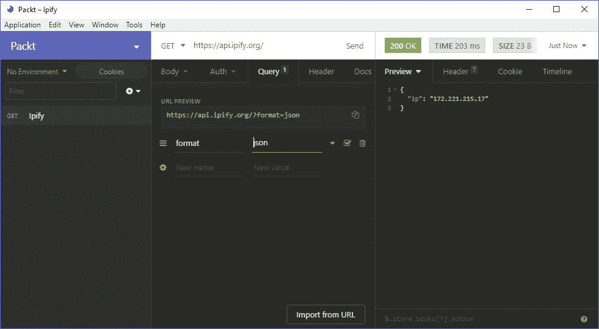

# 10. 网络服务

概述

在本章结束时，您将能够识别选择第三方网络服务的关键因素；解释 RESTful 网络服务的基本概念；确定要添加到请求中的正确头信息；解释常见的网络服务认证和授权方案；在 JSON 中创建和读取请求体；使用 REST 客户端进行手动 API 测试；以及使用 Guzzle 在 PHP 中编写`GET`和`POST`请求，然后处理结果。

本章介绍了网络服务的基本概念，并解释了如何使用 Guzzle（一个流行的 PHP 开源库，用于发送 HTTP 请求）将您的应用程序与它们连接。

# 简介

在上一章中，我们学习了如何使用 PHP 的包管理器 Composer 将第三方包包含到您的应用程序中。通过这样做，您可以看到如何从已经解决的问题的开放源代码解决方案中受益，并极大地减少您必须在自己的项目中产生和维护的代码量。

网络服务是我们行业实现许多创新的技术。互联网上有无数的网络服务可供选择，其中一些需要付费账户才能访问其服务，而另一些则可以免费提供给公众，前提是你不超过速率限制。这一点很重要，因为它意味着你不需要拥有你应用中使用的所有数据。你可以利用他人构建的数据和系统，然后在它们之上构建，将它们串联起来，以提供你应用程序特有的功能。PHP 是一种专为网络 API 时代而构建的用于网络的编程语言。有些人称它为“最佳粘合剂”，可以将一系列外部服务拼接在一起。

在本章中，我们将概述网络服务，并展示一些与它们交互的示例。如果您不熟悉什么是网络服务，这个术语通常用来指代一种应用程序服务，它要么是公开可访问的，要么是在内部网络中可编程交互的，可以用来检索或更改数据。换句话说，网络服务是一个或多个服务器，可以通过网络访问，并处理由计算机进程生成的请求，而不是用户在浏览器中输入 URL。一些最著名的网络服务是社交网络公开的公共 API，如 Facebook 或 Twitter，允许授权的应用程序访问其用户的数据。一个电子商务应用程序可能会在接收订单之前使用 FedEx 网络服务来验证订单的送货地址。另一个基本示例是一个包含大量电影数据的数据库，允许客户查找与特定标题、演员或导演相关的数据。

HTTP 是这些服务用于通信的协议。它与网络浏览器用于从服务器请求网页的协议相同。向网络服务发出请求使用您在*第六章*，“使用 HTTP”中了解到的相同的请求/响应周期，实际上，您可以直接从您的浏览器发出一些请求。

# 一个示例网络服务

作为一个快速示例，我们可以使用我们在本章后面将要与之交互的网站，使用 PHP，但就目前而言，让我们看看当你浏览到[`packt.live/33iQi0M`](https://packt.live/33iQi0M)时会发生什么。这是一个简单的网络服务，它接收来自客户端的请求，读取请求来自的网络公共 IP 地址，并以计算机和人类都容易阅读的格式将包含该 IP 地址的响应发送回客户端。以下是您在浏览器中看到的截图；然而，请注意，IP 地址将不同，因为它取决于您的实际位置：


图 10.1：打印 IP 地址

这是一个非常简单的服务，但它说明了我们试图学习的概念，而无需非常复杂的企业逻辑。当您将前面的 URL 输入到您的浏览器中时，您应该会看到一些文本周围格式化的花括号、冒号和双引号。文本应指示您的计算机所在的网络的公共 IP 地址。您的浏览器向服务器发出 HTTP `GET`请求，然后服务器处理您的请求，并以格式化的响应返回给您的浏览器。PHP 有工具可以编程地发出这些请求，然后解析结果，以便它们可以被您的应用程序使用。

## 选择第三方 API

有时候，您可能没有选择与哪个网络服务集成的选择，要么是因为它是唯一提供您所需功能的服务的服务，要么是因为某些其他约束限制了您的选择。当这种情况不是这样时，拥有一套您可以用来比较网络服务并帮助您选择的指南是有用的，例如，商业合同义务。您可能想要考虑的一些事情（不分先后顺序）是文档、稳定性、可用性和定价。

如果您之前曾经与第三方 API 集成过，您知道拥有清晰、简洁和完整的文档来引导您完成这个过程的价值，而不是没有高质量文档的困难。没有完整的文档，您可能会发现自己处于可能反应缓慢的支持链的 mercy，如果甚至有支持的话。确保在将任何 API 作为应用程序的依赖项之前，阅读并理解其文档。

你选择网络服务的稳定性也是需要考虑的另一个因素。如果你为该服务付费，你可能会在**服务级别协议**（**SLA**）中获得对可用性的保证。这并不总是如此，你可能没有关于第三方系统稳定性的可靠数据，但你可以询问其他事情，例如他们如何处理系统维护和推出 API 的新版本。

在这个上下文中，“可用性”有几个不同的含义。在某些情况下，性能对你应用程序的重要性将是至关重要的。在这些情况下，如果你依赖于对外部系统的实时调用，你将希望确保网络服务能够及时响应你的请求。性能良好的网络服务将以微秒为单位返回响应，而不是秒。可用性的另一个方面是，一些网络服务可能会限制你在特定时间段内对其服务发起请求的数量，例如，Facebook 每小时接受的请求数量。如果这种情况发生，你需要确保网络服务能够支持你的应用程序在高峰使用期间可能发起的请求数量。当然，如果你正在处理的数据是可缓存的，那么这始终是一个更可取的选择。

一些网络服务可以免费使用，或者只需创建一个账户即可使用，但有些则需要付费访问。通常，如果使用网络服务需要付费，它们将有一个使用分层结构的定价模型，允许在账单周期内指定数量的请求。如果价格对于你的商业模式来说太高，这可能会消除一些服务作为选项。

## RESTful 概念

你现在看到的许多网络服务都会将自己标识为 RESTful 网络服务。这是一个重要的概念，无论是与这些服务交互还是设计你自己的服务。**表征状态转移（REST）**是一种 API 开发风格，而不是像 HTTP 或**简单对象访问协议（SOAP）**这样的协议。它是一组设计约束，用于构建网络服务，最初由 Roy Fielding 在他的博士论文《架构风格和网络软件架构设计》中定义。

我们不会试图涵盖整个论文，而是会介绍一些你需要了解的重要概念，以便与 RESTful 服务交互。首先，它们是无状态的。这意味着每个对服务器的请求都是独立的。换句话说，服务器不应该需要了解客户端之前的请求来处理当前请求。每个请求都应该包含处理该请求所需的所有信息。这为 API 提供了简单性、可扩展性和灵活性的好处。

下一个概念是 RESTful API 通过表示请求的 URL 来公开其功能。每个 URL 代表单个资源或资源集合，你用来发送请求的 HTTP 方法（`GET`、`POST`、`PUT`、`PATCH`或`DELETE`）决定了你是检索资源、创建资源、更新资源还是删除资源。对于所有这些操作，URL 将是相同的；只有 HTTP 动词会改变。特定资源的 URL 还将包含该资源的唯一标识符。假设有一个虚构的位于`acme.com/api`的 Web 服务，你可以通过 API 与之交互的资源之一被称作`products`。要检索标识为`123`的记录，你需要向`api.acme.com/products/123`发送一个`GET`请求。要更新该记录，你需要向`api.acme.com/products/123`发送一个包含要更新产品表示的`POST`请求。类似的请求也可以用来创建和删除记录。`api.acme.com/products` URL 将为你提供产品列表。URL 和 HTTP 动词的组合被称为`endpoint`，这是 RESTful API 文献中的一个常用术语。

作为这些 API 的消费者，你需要关注 HTTP 状态码以确定请求的成功与否。这些是标准化的代码，提供了关于服务器响应的信息。这些代码分为五组：1xx、2xx、3xx、4xx 和 5xx。我们已经在*第六章*，*使用 HTTP*中看到了这些代码的定义。你可以在[`packt.live/2M2NfnH`](https://packt.live/2M2NfnH)上看到完整的列表及其值的解释。

对于一个用于检索资源的`GET`请求，状态码 200 表示成功。创建记录的请求将返回状态码 201。如果你请求一个不存在的资源，你预期会收到状态码 404。这些是最常见的状态码，了解它们是个好主意。

RESTful API 的另一个特点是响应应该定义它们是否可缓存，也就是说，它们是否适合在客户端存储一段时间以避免重复请求。某些请求可能不可缓存，例如更新数据的请求或频繁更新的资源。对于任何可缓存的请求，如果你打算频繁请求，作为 API 的消费者，缓存它可能对你最有利。这有助于减少你的应用程序发出的外部请求总数，这可以显著提高你的性能。

你应该熟悉的最后一个概念被称为**超媒体作为应用状态引擎**（**HATEOAS**）。这个原则指出，客户端应该能够使用响应内容中包含的超媒体链接动态地导航应用程序。

最简单的例子是在响应 PUT 请求以创建新资源时；资源的一个超媒体链接（在我们的早期示例中为 `acme.com/api/widgets/123`）作为响应中的元数据返回。虽然这是使网络服务完全符合 REST 架构约束之一，但由于完成此阶段需要额外的努力，许多人并没有应用它。然而，重要的是要意识到这一点，因为你可能在将来遇到它。

## 请求格式

在你的请求中，你将使用两种主要格式来格式化发送给服务器的数据：XML 和 JSON。这两种格式都提供了层次结构来格式化数据，以便计算机和人类都能轻松读取。

`<` 符号和以 `>` 符号结束。关闭标签由在元素名称之前的前斜杠表示。一个包含数据的完整 XML 元素示例看起来像这样：`<element>Some Data Here</element>`。这些元素标签也可以嵌套，创建嵌套层次。对于每个嵌套级别，文本缩进以提高可读性。

这里有一个例子：

```php
<element>
    <property attr="some attribute">value</property>
    <items>
        <item>some value</item>
        <item>some other value</item>
    </items>
</element>
```

每个元素也可以有属性，这些属性放置在打开标签内，如下所示：`<element attribute="some value">`。这使得 XML 在建模数据结构方面具有很大的灵活性，允许在不影响整个结构的情况下存储元数据。然而，这是一个权衡，以复杂性和冗长为代价来换取灵活性。这些缺点是网络社区开始转向名为 JSON 的新、更简洁格式的原因之一。

**JSON** 是 **JavaScript Simple Object Notation** 的缩写。尽管其名称中包含 JavaScript，但 JSON 是一种与语言无关的数据格式。JSON 现在是独立的，但它最初是为了在 JavaScript 中表达对象而发明的，并且它作为避免更重、更昂贵的 XML 数据传输的数据传输支持而流行起来。JSON 使用花括号来包围数据对象，双引号来表示属性和字符串值，以及方括号来包围数组。逗号分隔序列中的项，这些项可以是属性或数组项。项缩进以保持整洁，就像在 XML 中一样。这种结构应该给出足够的视觉表示：

```php
{
    "property": "value",
    "some array": [
        "item 1": "some value",
        "item 2": "some other value"
]
}
```

JSON 很棒，因为它简洁，这使得它在网络中传输速度快。它还允许在内存中将对象轻松转换为 JSON 字符串，然后再转换回对象。PHP 提供了两个内置函数来处理这些过程，即`json_encode`和`json_decode`。使用`json_encode`时，你传入要转换为 JSON 的对象，它将返回该对象，而`json_decode`则执行相反的操作。值得注意的是，如果你将 JSON 解码到对象中，你将得到通用`stdClass`类型的对象，而不是编码前的原始类型。JSON 确实失去了 XML 提供的描述性，因此你可能会在对象的属性中看到表示元数据的属性。然而，总的来说，它更容易阅读，更容易编写，并且在代码中交互起来更简单。

## 练习 10.1：JSON 编码

在这个练习中，我们将为一家虚构的电子邮件营销网络服务准备一些数据，该服务允许你通过他们的 API 添加数据，以便你可以通过他们的平台向你的邮件列表发送电子邮件。如果它是一个 RESTful 网络服务，它可能会在`/recipient`等端点接受带有 JSON 格式的请求体的 PUT 请求。这个练习的目的是简单地演示将 PHP 对象转换为 JSON，我们将在本章后面部分介绍实际发送请求：

1.  为此示例创建一个新的文件夹`json-example`，并通过终端导航到该文件夹，如下所示：![图 10.2：导航到目标文件夹]

    ![图片 C14196_10_02.jpg]

    图 10.2：导航到目标文件夹

1.  在一个与同一名称的 PHP 文件中创建一个`MailingListRecipient`类。包含公共属性`$email`、`$firstName`和`$lastName`，这些属性通过构造函数传入：

    ```php
    <?php
    class MailingListRecipient
    {
        public $email;
        public $firstName;
        public $lastName;

        public function __construct($email, $firstName, $lastName)
        {
            $this->email = $email;
            $this->firstName = $firstName;
            $this->lastName = $lastName;
        }
    }
    ```

1.  创建一个名为`json.php`的文件，该文件需要`MailingListRecipient`类：

    ```php
    <?php
    require ' MailingListRecipient.php';
    ```

1.  实例化一个新的`MailingListRecipient`类：

    ```php
    $recipient = new MailingListRecipient('jdoe@acme.com','John','Doe');
    ```

1.  将接收者变量编码为 JSON 字符串并写入输出：

    ```php
    $requestBody = json_encode($recipient);
    echo $requestBody.PHP_EOL;
    ```

1.  运行脚本以查看作为请求体发送的 JSON 格式的字符串：

![图 10.3：显示为 JSON 的字符串]

![图片 C14196_10_03.jpg]

图 10.3：显示为 JSON 的字符串

当你作为客户端与网络服务集成时，你的请求体需要格式化以匹配请求中头部指定的内容类型。一些网络服务支持多种请求/响应数据格式，允许你请求最适合你的格式，而其他服务将要求你使用特定的格式。

# HTTP 头部

每个 HTTP 请求和响应都会发送多个头，这些头有助于客户端和服务器之间的通信，或提供关于自身的元信息。一些头将作为客户端发出请求的一部分自动为你生成，例如`Host`、`User-Agent`或`Content-Length`。了解你可能希望在发出请求时包含的额外头非常重要，因为它们可以让你对收到的响应或可能被要求用于请求被接受的头进行一些控制。

这些中的第一个是`Accept`头。它允许你指定一个以逗号分隔的内容类型列表，这些内容类型以 MIME 类型表示，例如`text/html`或`application/json`，这将用于与服务器协商，以确定一个共同的响应体，以便客户端可以正确解析请求。客户端可以提供多个它将接受的内容类型，服务器将选择一个，并在响应头中指定用于格式化响应的内容类型。如果客户端正在发送带有主体的 POST 请求，则应提供`Content-Type`头以帮助服务器解析发送的数据。最常见的情况是，你会看到它以`application/json`或`application/xml`的形式传递。

服务器响应中的`Cache-Control`头将提供信息，说明响应是否可以被缓存以供客户端稍后使用。这通常只用于对 GET 请求的响应，但如果你使用的是可缓存的数据，这仍然有助于减少对服务的总请求次数，从而提高应用程序的性能。如果响应可缓存，它将有一个`max-age`头，指定在请求被视为无效并生成新请求之前应该保持请求的秒数。

如果请求需要认证，客户端可能需要传递一个`Authorization`头。我们将在下一节中介绍认证和授权。

## 认证和授权

作为良好的安全实践，Web 服务器被设计用来验证用户的身份，并认证请求的资源是否对用户可访问。认识到这两个术语之间的区别很重要。认证是验证用户是否是他们所说的那个人的过程。这可能像检查密码或 API 密钥与用户账户上存储的密码或 API 密钥进行比对那样简单，也可能像对包含只有客户端和服务器知道的“秘密”值的哈希值进行比对那样复杂。如今，拥有一个单独的认证服务器来处理这项任务已成为常见做法，这样做可以将责任从应用服务器中移除，并以集中化的方式处理。

授权是验证已认证用户是否有权访问他们请求的资源的过程，无论是查看数据还是修改数据。例如，如果一个服务向任何拥有免费账户的人提供基本级别的访问权限，但同时也提供会员订阅服务，其中只有某些端点对付费会员可用，那么它需要在请求受保护资源时验证已认证用户是否有权限。授权的另一个用例是当用户只能访问他们自己创建的资源，或者可以读取任何创建的资源，但只能编辑他们自己的资源。

我们将花一点时间简要概述一些你可能遇到的常见身份验证和授权方案。第一个是开放身份验证，意味着该网络服务不验证用户的身份。这并不常见，因为它不够安全。尽管如此，还有一些情况下它是可以接受的，例如我们将在本章后面使用的一些示例服务。

接下来是 API 密钥认证，用户在网络上创建了一个账户并请求一个密钥，该密钥将作为每个请求的一部分。这类似于网站上的用户名和密码登录过程，你提供账户 ID 和 API 密钥，网络服务在处理你的请求之前会验证 API 密钥是否属于你的账户。这比开放身份验证安全得多，并且你与之交互的大多数公共网络服务都会使用这种方法。

最后，是开放 ID 连接用于身份验证和 OAuth 2.0 用于访问授权的组合。这些是协同工作的独立协议，提供完整的访问控制解决方案。开放 ID 连接建立在 OAuth 2.0 之上，以填补仅使用 OAuth 2.0 作为伪身份验证机制的服务留下的安全漏洞。简而言之，客户端通过开放 ID 服务器进行身份验证，该服务器可能是一家知名互联网公司，如谷歌、Facebook、微软或 Twitter，也可能是一家公司的内部授权提供商。身份验证后，会向应用程序提供一个令牌，应用程序可以使用它向资源服务器发出请求。如果我们最终与这些服务之一集成，我们可以使用 GitHub 上的 PHP league 的 Composer 包进行 OAuth，该包可以在[`packt.live/35s7tiv`](https://packt.live/35s7tiv)找到。

## 手动 API 测试

有时候，当你与新的网络服务集成时，你可能需要经历一个试错的过程，以使你的请求格式正确，以便服务能够接受它。在这些情况下，拥有一个允许你手动构造请求、从客户端发送到服务并显示响应的客户端将非常有帮助，这样你可以排除自己的代码是问题的来源。一旦你得到成功的响应，你就可以在代码中正确地重新创建请求。有时候，这是故障排除的必要步骤，至少在尝试调试代码时，它可以节省你大量的挫败感。在接下来的几段中，我将描述一些你可以选择的选项。

如果你更喜欢在 IDE 中直接拥有客户端以减少开发过程中打开的应用程序数量，一些 IDE 直接集成了 REST 客户端。JetBrains 的 PHPStorm IDE 就集成了这样的客户端，它在很多方面与 Insomnia 类似。PHPStorm 是一个功能强大的 IDE，拥有无数有益的特性，可以加快开发速度，但它是一个授权的软件产品，需要订阅。如果你有这个条件，它绝对物有所值。

如果你只是发送 GET 请求，这些客户端可能看起来有些过度，但如果你需要发送带有主体的 POST 请求或需要发送用于身份验证的自定义头，这些客户端可能是你手动测试网络服务的唯一选择。如果你将要与网络服务集成，设置其中一个这样的客户端是非常值得的。

我们在这里用于手动网络服务测试的客户端称为 Insomnia，可以在[`packt.live/2VuRco8`](https://packt.live/2VuRco8)找到。这是一个需要安装才能使用的厚客户端，但它有一个直观的界面，使得编写各种类型的请求和查看结果变得简单。

## 练习 10.2：使用 Insomnia 进行手动 API 测试

在这个练习中，我们将演示如何使用 Insomnia 手动向我们在本章开头通过浏览器调用的`ipify`端点发送网络服务请求。与浏览器相比，使用此类客户端的好处是你可以设置请求头或表单数据，而这些在浏览器中是无法设置的：

1.  打开 Insomnia 并点击“新建请求”按钮。然后，将请求名称输入为`Ipify`：

    图 10.4：Insomnia 界面

1.  确保请求方法设置为`GET`：

    图 10.5：检查请求方法

1.  在网址栏中输入[`packt.live/2oyJqxB`](https://packt.live/2oyJqxB)：

    图 10.6：添加网址

1.  打开 `查询` 选项卡，在第一个新名称字段中输入 `format`，在第一个新值字段中输入 `json`：

    图 10.7：在查询选项卡中添加数据

1.  点击 URL 栏末尾的 `发送` 按钮：

    图 10.8：发送 URL

1.  你将看到一个显示 JSON 响应的 `预览` 部分：



图 10.9：JSON 响应

## 使用 PHP 发送请求

现在我们已经讲完了所有理论，接下来我们将介绍如何在 PHP 中实际发送请求。你可以使用几种方法在语言中发送请求，最终它们都会使用 cURL 扩展来发送请求。如果你有一个简单的 GET 请求要发送，那么你可以使用内置的 `file_get_contents` 函数。你可以使用 cURL 函数直接与 cURL 扩展交互，这些函数在 [`packt.live/2olkmKv`](https://packt.live/2olkmKv) 上有很好的文档；然而，这可能很繁琐，并且缺乏面向对象方法可以提供的抽象级别。为此，Composer 提供了一个名为 `guzzlehttp/guzzle` 的包。实际上，Guzzle 是 PSR-7 标准 HTTP 消息接口的官方实现，并且被广泛使用。

## 练习 10.3：使用 Guzzle 发送 GET 请求

在这个练习中，我们将回顾实例化一个 Guzzle 客户端、配置请求以及调用方法发送 `GET` 请求的过程：

1.  首先，在你的代码存储目录中为这一章创建一个新的项目，并切换到该目录：

    ```php
    mkdir guzzle-example
    ```

1.  初始化一个新的 Composer 项目（如需帮助，请参阅 *第九章*，*Composer*），然后安装 Guzzle：

    ```php
    composer init
    composer require guzzlehttp/guzzle
    ```

1.  创建一个名为 `ipify.php` 的 PHP 脚本，并包含 Composer 自动加载文件：

    ```php
    <?php
    require 'vendor/autoload.php';
    ```

1.  使用 `use` 语句引用 `GuzzleHttp\Client` 类，然后创建一个新的 `Client` 对象，传入 `ipify` 网服务的基准 URL：

    ```php
    use GuzzleHttp\Client;
    $client = new Client(['base_uri'=>'https://api.ipify.org']);
    ```

1.  向网络服务的根发送一个带有值为 `json` 的格式查询参数的 HTTP `GET` 请求，并将其存储在 `$response` 变量中：

    ```php
    $response = $client->request('GET', '/'),['query'=>['format'=>'json']]);
    ```

1.  使用 `getBody()` 和 `getContents()` 方法提取响应体，这是一个 JSON 字符串，通过 `json_decode()` 函数将其解析为对象，并将其存储在 `$responseObject` 变量中：

    ```php
    $responseObject = json_decode($response->getBody()->getContent());
    ```

1.  输出一个字符串以打印出响应对象的 `ip` 属性：

    ```php
    echo "Your public facing ip address is {$responseObject->ip}".PHP_EOL;
    ```

1.  在命令行中运行脚本。你应该会看到类似于以下截图的输出：


图 10.10：打印 IP 地址

让我逐行解释示例代码的功能。首先，我们包含 Composer 的自动加载文件，这样我们所有的依赖项都会像我们在上一章中介绍的那样自动包含。然后，我们添加一个`use`语句，这样我们就不必每次引用`GuzzleHttp\Client`时都使用完整路径。接着，我们实例化一个`Guzzle`客户端实例，在构造函数中传入的`options`数组中设置我们的目标 Web 服务基本 URL。接下来，我们在`Guzzle`客户端上调用请求方法。这个方法接受 HTTP 方法作为第一个参数，在这个例子中是一个`GET`请求。第二个参数是我们试图访问的资源的相关 URI，在这个例子中只是根，所以我们只输入一个反斜杠。最后一个参数是一个选项数组，我们用关联数组填充它，告诉 Web 服务我们希望响应体以 JSON 格式进行格式化。

在我们得到响应后，我们调用`Guzzle`提供的方法，以链式方式获取主体对象，然后获取响应的内容作为字符串，在这个例子中将是 JSON 格式的文本。为了能够访问响应中的数据，我们通过`json_decode`将其转换为通用的`stdClass`对象，这样我们就可以访问属性。最后，我们使用字符串插值将服务返回的`ip`地址注入到我们的消息中输出。

注意

将 JSON 字符串解码成数组而不是对象是可能的。

发送`GET`请求是有用的，你写的许多请求都将使用此方法，但我们也应该介绍发送`POST`请求，在这种情况下，你必须向 Web 服务提供一些要处理的数据。我们发现另一个简单的免费 Web 服务可以让我们进行此类请求，你也可能觉得它很有用。这是一个允许你在请求体中传递一个电子邮件地址和一些选项的 JSON 字符串的服务，并返回该电子邮件地址的`SpamAssassin`评分。我们还将演示在请求中设置`Accept`和`Content-Type`头，以告诉 Web 服务如何解析我们的请求体以及我们希望以什么格式接收响应。检查你的 API 调用以查找错误条件非常重要，我们也将展示一些这方面的例子。

## 练习 10.4：带有头的 POST 请求

这个练习将与上一个类似，主要区别在于我们将使用`POST`方法在请求体中发送数据。这次，我们调用的服务是接受一个电子邮件地址并返回该电子邮件的`SpamAssassin`评分的服务。`SpamAssassin`是由 Apache 软件基金会发起的一个开源项目，帮助系统管理员从发送未经请求的大量邮件的来源过滤电子邮件：

1.  在与上一章相同的文件夹中创建一个 `spamcheck.php` 脚本。引入 Composer 自动加载文件，添加一个使用 `Guzzle` `Client` 类的语句，并定义一个包含任何电子邮件地址的字符串变量：

    ```php
    <?php
    require 'vendor/autoload.php';
    use GuzzleHttp\Client;
    $email = 'test@test.com';
    ```

1.  实例化 `Guzzle` `Client` 对象，在构造函数中传入服务的 URL：

    ```php
    $client = new client(['base_uri'=>'https://spamcheck.postmarkapp.com/']);
    ```

1.  为我们的请求体创建一个数组，第一个元素是电子邮件变量，键为 `email`，第二个元素是字符串 `short`，键为 `options`。然后，使用 `json_encode()` 函数将其转换为 JSON 字符串，并存储在 `$requestBody` 变量中：

    ```php
    $requestBody = json_encode(['email'=>$email, 'options'=>'short']);
    ```

1.  打开一个 `try`…`catch` 块，并在其中向 `/filter` 端点发起 `POST` 请求。`Accept` 和 `Content-Type` 头部信息包含在 `options` 数组中，以及我们的请求体：

    ```php
    try
    {
        $response = $client->request('POST','/filter'),[
            'headers' => [
                'Accept'=>'application/json'
                'Content-Type'=>'application/json'
                ],
                'body'=>$requestBody
                ]);
    ```

1.  检查响应的 HTTP 状态码，如果不是 `200`（即成功），则抛出异常：

    ```php
    if($response->getStatusCode()!==200){
            throw new Exception("Status code was {$response->getStatusCode()},           not 200");
        }
    ```

1.  将 JSON 字符串响应解析为对象并存储在变量中：

    ```php
    $responseObject = json_decode($response->getBody()->getContents());
    ```

1.  如果 `response` 对象上的 `success` 属性未设置为 `true`，则抛出异常：

    ```php
    if($responseObject->success!== true){
            throw new Exception("Service returned an unsuccessful respose:           {$responseObject->message}");
        }
    ```

1.  输出一个字符串，表示电子邮件的 `SpamAssassin` 分数：

    ```php
    echo "The SpamAssassin score for email {$email} is   {$responseObject->score}".PHP_EOL;
    ```

1.  捕获可能抛出的任何异常并输出消息：

    ```php
    catch
    {
        echo "An error occurred: ".$ex->getMessage().PHP_EOL;
    }
    ```

1.  运行脚本并查看输出：


图 10.11：最终输出

这个例子在许多方面与上一个例子相似，但有几点例外。首先，我们使用 `json_encode` 将关联数组转换为 JSON 字符串，并将其存储在 `$json` 变量中。当我们使用请求方法调用网络服务时，我们传递 `POST` 作为 HTTP 方法，这次相对路径是 `/filter`，因此完整的请求 URL 为 [`packt.live/3269n6i`](https://packt.live/3269n6i)。在 `options` 数组中，我们包括一个包含我们想要包含在请求中的头部键值对的头部数组。

`Content-Type` 头部告诉网络服务我们的请求体格式为 JSON，而 `Accept` 头部告诉服务我们期望响应格式为 JSON。如果您需要在请求中包含其他头部，可以通过将它们添加到数组中来实现。包含我们请求有效载荷的 JSON 字符串的 `$json` 变量通过 `body` 参数传递。

这次，在我们从响应中获取内容之前，我们检查以确保我们有一个有效的响应。在大多数情况下，最简单的方法是查看 HTTP 状态码。成功的响应将在 2xx 范围内。大多数时候，你可以寻找 200 或 201，这取决于你使用的 HTTP 方法。在解码响应后，我们检查以确保`success`属性设置为 true。这是另一个告诉我们请求已正确处理的层次。并非所有网络服务都会以相同的方式提供这一层，但在响应体中包含一些指示器是相当常见的。如果我们发现表示请求未成功的条件，我们将抛出一个异常，并清楚地说明失败的原因，然后在`catch`子句中处理它，将消息传递给用户。

## 活动 10.1：向 httpbin.org 发送自己的 POST 请求

现在是时候自己练习发送请求了。为此，你将使用位于[`packt.live/2oyJqxB`](https://packt.live/2oyJqxB)的不同服务。`Httpbin`是一个公开的网络服务，它将读取你对其发送的请求，并根据你请求的 API 端点在响应体中返回各种数据。`/response-headers`端点将读取你请求中传递的查询字符串参数，并将它们作为 JSON 对象响应中的属性包含在内。

编写自己的脚本，向[`packt.live/2OE94LV`](https://packt.live/2OE94LV)发送请求。请求中包含两个查询参数，一个以`first`属性为键，值为`John`，另一个以`last`属性为键，值为`Doe`。务必将`Accept`头设置为`application/json`。检查响应的状态码是否为 200，如果不匹配则抛出异常。将响应从 JSON 解码，并在字符串中输出解码对象中`first`和`last`属性的值。

输出应如下所示：


图 10.12：预期的输出

以下步骤将帮助您完成活动：

1.  在`guzzle-example`目录中创建一个`httpbin.php`文件。需要引入 Composer 自动加载文件并导入`Guzzle 客户端`类。

1.  通过传递`httpbin`地址实例化一个新的`Guzzle 客户端`。

1.  在`try`…`catch`块中，向`/response-headers`端点发送`POST`请求。添加一个设置为`application/json`的`Accept`头，并设置两个查询参数键值对，其中`first`为`John`，`last`为`Doe`。

1.  检查 HTTP 状态码是否不是 200，如果是，则抛出异常。

1.  使用`json_decode()`将响应体解析为对象并存储在变量中。

1.  输出一个字符串，`The web service responded with`，与响应对象中的第一个和最后一个属性连接。

1.  运行脚本并查看输出是否包含`John Doe`。

    注意

    本活动的解决方案可在第 560 页找到。

# 摘要

网络服务是现代计算中最重要的概念之一，使我们能够使用许多丰富的互联网应用。在本章中，我们讨论了在评估用于你应用程序的网络服务时你可能想要使用的某些标准，例如文档、可用性和定价。我们简要介绍了 RESTful 网络服务的概念，这些是无状态服务，通过 HTTP 动词公开接口以与资源交互。我们还涵盖了 JSON 和 XML 格式，这些是用于在请求主体中传输数据以及其它用途的分层结构。

HTTP 请求由一个主体和多个头部组成，其中一些是必需的，一些是可选的，还有一些包含关于请求的元数据并协商内容类型。我们讨论了网络服务提供商通常使用的认证方法，包括 API 密钥和与 OAuth 2.0 结合的 Open ID Connect 进行授权。REST 客户端是在你与它们集成时手动测试 API 端点的一个有用工具。Guzzle 是 PHP 中制作 HTTP 请求的抽象层，通过 Composer 包管理器提供，它提供了一个干净且简单的接口。
