# 第二章：PHP 开发

在本章中，我们将涵盖以下主题：

+   使用 Composer 创建 PHP 项目

+   创建一个空项目

+   重用现有项目

+   创建一个新的 PHP 类

+   创建一个新的 PHP 方法

+   添加 getter/setter 方法

+   创建代理方法

+   使用控制结构包围代码

+   查找匹配的大括号

+   注释代码段和 PHPDoc

+   创建工作集

+   创建 TODO 任务

# 简介

现在你已经打开了前灯，你可以采取“无论发生什么”的态度，开始驾驶你最喜欢的汽车——PHP。现在你已经准备好了你心爱的工具——PhpStorm，就放手一搏吧。PhpStorm 将会负责消除你生活中的干扰，让你能够专注于编程。

你可以用 PHP 解决问题的任何方面来思考，PhpStorm 都会在那里帮助你。

你是否面临着一个即将解决的问题，一个让你感到棘手的问题，或者一个挑战你作为软件工程师存在感的问题？如果你坚持软件工程原则，PhpStorm 将会发挥你的能力，让你在解决当前问题时创造奇迹。PhpStorm 让你能够专注于设计业务逻辑，因为它会帮你分担记住细节的烦恼，比如确切的方法签名和参数列表。

想象一下，你的经理叫你去讨论一些必须尽快开发的新业务功能。你又陷入了困境。再次面临选择魔鬼还是深海的抉择。

PhpStorm 用户无需担心。他们有一个第三选择——乘坐直升机从当前场景中到达目的地。

你已经足够勇敢，从业务端收集了需求。现在你选择哪条路？决定你是想向右走还是向左走。如果你向右走，你将选择创建新项目的路线。如果你向左走，你将选择重用现有项目并对其进行修改的路线。

无论你走到哪里，无论你选择哪条路，你都必须达到同一个目的地。最后，你必须向你的经理汇报你为了实现目标所做的一切。你不仅必须快速决定，还必须迅速行动。

# 使用 Composer 创建 PHP 项目

欢迎那些走上正确道路的人！系好安全带，准备好在 PHP 中创建一个新的项目。

### 小贴士

创建一个新项目本身是一个非常成熟的决定，所以你应该始终成熟和战略性地做出决定。可能会有这样的情况，出于纯粹的激情，你选择了创建一个新项目，但几天后，你意识到你计划创建的大部分功能已经被开发出来了。你最终会做很多复制粘贴的工作。

## 准备工作

软件工程的原则总是教导学生，设计应该是高耦合和低内聚。这意味着应用程序应该使用其他程序，但不能依赖它们。PHP 中的 Composer 是一个帮助您采用这种方法的系统。Composer 是 PHP 的依赖管理器，它允许其他用 PHP 编写的包被包含在其他项目中。

PhpStorm 允许您创建遵循此原则的项目。要创建一个新的 Composer 项目，您需要在 **文件** | **新建项目** 菜单提供的下拉菜单中选择 **Composer 项目** 选项。接下来询问您的问题是要选择 `composer.phar` 的路径——从本地磁盘或从网站：[`www.getcomposer.org`](http://www.getcomposer.org)

## 如何操作...

不要因为完全的困惑而抓耳挠腮——更多的知识确实意味着更多的困惑，但这并不意味着你应该追求零知识以避免任何困惑！一个可执行的 `composer.phar` 文件引发了处理这些包的魔法。您可能正在想，Composer 内部究竟是什么让它成为当今的热门话题——每个人都似乎在谈论它。执行以下步骤：

1.  前往 [`getcomposer.org/download/`](https://getcomposer.org/download/)，您将看到以下命令：

    ```php
    curl -sS https://getcomposer.org/installer | php

    ```

1.  如果您在来到 PhpStorm 之前已经安装了 composer，您应该指定 `/path/to/composer.phar`，即 composer 已经安装的路径。

1.  然后，您可以从左侧面板中的可用包列表中进行选择。在右侧，您可以查看所选包的相应描述。您可以选择要安装的包的版本，然后点击 **确定**。

### 小贴士

**下载示例代码**

您可以从 [`www.packtpub.com`](http://www.packtpub.com) 账户下载您购买的所有 Packt 书籍的示例代码文件。如果您在其他地方购买了这本书，您可以访问 [`www.packtpub.com/support`](http://www.packtpub.com/support) 并注册，以便将文件直接通过电子邮件发送给您。

## 它是如何工作的...

命令实际上是两个命令的串联，它们获取安装脚本的内容并通过 PHP 命令行执行。如果您在网页浏览器中打开指定的链接，您将看到 Composer 背后的整个 PHP 代码。您能自由呼吸吗（当然，这里是一个双关语）？回到工作，命令的第二部分意图是通过 PHP 命令行执行 PHP 内容。

回到原始主题，您试图选择正确的 `composer.phar` 类型。看看下面的截图：

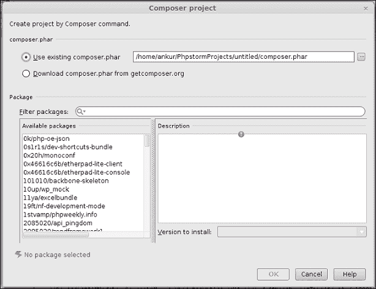

PhpStorm 会处理安装过程中剩余的 *你选择的包* 任务。

Composer 系统会生成一个名为`composer.json`的`json`文件，其中包含关于依赖项的详细信息。以下是一个从头开始创建的项目所对应的`composer.json`文件：

```php
{
  "name": "2085020/api_pingdom",
  "description": "pingdom api for php",
  "require": {
    "guzzle/guzzle": "v2.7.2"
  },
  "authors": [
    {
      "name": "Emagister",
      "email": "jcruz@emagister.com"
    }
  ],
  "autoload": {
    "psr-0": {
      "Emagister":"src"
    }
  }

}
```

很明显，这个 json 文件向读者传达了大量的信息。`"name":`是下载的包的名称。`"description":`是下载的包的描述。如果你有很好的记忆力，你会记得在包选择窗口的右侧面板中有一个描述。这个描述正是相同的。`"require":`是此下载包所依赖的包的名称。json 文件指定项目名称作为键，相应的版本号作为值。`"authors":`是下载的包的作者。它包括作者的名字和电子邮件地址。`"autoload":`是编码标准，可以是 PSR-0、PSR-1、PSR-2、PSR-3、PSR-4，以及命名空间映射到实际目录。其层次结构如下：编码标准包含命名空间映射的值。命名空间映射意味着名称作为键，目录（相对于项目根目录）作为值。

PhpStorm 和 Composer 的组合效果显著。当你让 PhpStorm 下载并排列包时，它会自动为你安排项目的包含路径。现在不再会有关于缺失文件的警告或错误来阻碍你的工作。考虑以下截图：

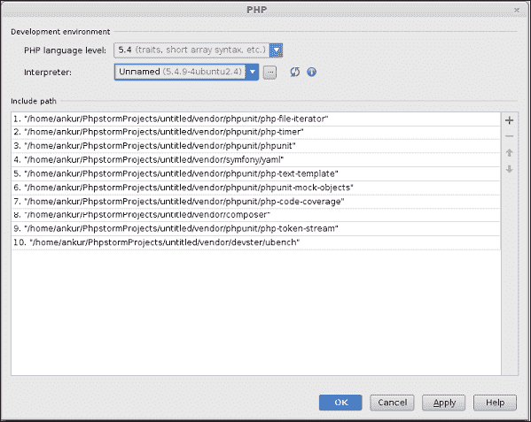

假设你已经在项目中添加了一些包，现在你意识到你需要更多的包。不要担心，PhpStorm 会提供一个选项，让你以**添加依赖项**的形式添加更多包。这样做非常简单。在打开的项目中，你需要转到**工具** | **Composer** | **添加依赖项**。会出现一个熟悉的弹出窗口，要求你选择包名称并继续安装。其余的任务将像往常一样由 PhpStorm 处理。你将看到的将是下载的文件和文件夹，以及你特定项目的`composer.json`文件中的变化。以下是一个这样的`composer.json`文件的代码片段：

```php
{
  "name": "redis/ranking",
"description": "Wrapping Redis's sorted set APIs for specializing ranking operations.",
  "keywords": ["redis", "ranking", "sort", "realtime"],
  "homepage": "https://github.com/matsubo/redis-ranking",
  "type": "library",
  "license": "PHP3",
  "require" : {
    "php": ">=5.3.0",
    "lib/curl": "0.3",
    "php-curl-class/php-curl-class": "1.0.1",
    "php-mod/curl": "1.0",
    "development/curl": "dev-master",
    "phpdocumentor/phpdocumentor": "2.0.0b7",
    "abhi/tangocard": "dev-master",
    "10up/wp_mock": "dev-master"
  },
  "authors": [
    {
      "name": "Yuki Matsukura",
      "email": "matsubokkuri@gmail.com"
    }
  ],

  "require": {
  },
  "require-dev": {
    "devster/ubench": "1.1.*-dev",
    "phpunit/phpunit": "3.*"
  },
  "autoload": {
    "psr-0": {"Matsubo": "src/"}
  }
}
```

符号具有通常的含义。外部依赖项已根据`json`标记添加到列表中，并由单个键 required 表示，其中值是具有键作为名称和相应版本作为值的依赖项的实际列表。

# 创建一个空项目

当你在困难时期找到一些支持时，你得到的感受可以与在口渴时找到冷饮的感觉相类比。这个陈述与当前情景的类比是，直到这个时间点，你无法找到要创建的确切项目类型，但现在你找到了一条出路。

## 准备工作

当你确信需要创建一个新项目并实现新的成就，以满足经理的业务需求时，你需要创建一个空的 PHP 项目。

## 如何操作...

创建一个新空项目是最容易的：

1.  你需要为新项目指定一个名称。即使名称本身有拼写错误，也不要担心，因为 PhpStorm 不会将你指定的名称与字典进行核对。

1.  项目名称应仅包含操作系统下目录名称应包含的有效字符。

## 工作原理...

创建一个空项目很容易理解。如果你已经有一些基本框架作为起点，你需要指定 `/path/to/files/and/folders/`。参见 *集成框架*，否则 PhpStorm 将为你设置默认路径（`~/PhpstormProjects/<name-of-your-project>`）。

# 重用现有项目

那些计划走右侧路线的人正确地选择了这样做。有时，重新发明轮子并不是一个明智的行为。

## 准备工作

如果你重用，你将能够避免在已经创建的东西上浪费时间资源。PhpStorm 允许你重用现有项目，并让你继续前进。要重用现有项目，你需要将项目放在磁盘上。

## 如何操作...

要打开现有项目，请执行以下步骤：

1.  你需要转到 **文件** | **打开**。将会出现一个来自 PhpStorm 的弹出对话框。

1.  你需要告诉 PhpStorm 保存项目的目录路径，PhpStorm 将为你自动打开项目。

    ### 注意

    一旦某个目录在 PhpStorm 中作为项目打开，你将在下次能够区分它，因为 PhpStorm 会将它的标志放在这个目录旁边。

现在，你可以专注于收集你的技术需求。强烈建议你在实际编写代码之前提前做好规划，因为尽管完美的软件工程计划尚未存在，但你仍然可以保持乐观，创建一个足够好的计划，足够灵活，以便在需要时进行修改。

# 创建新的 PHP 类

当您来到厨房，您应该准备好在烹饪时弄脏双手。当您尝试烘焙数据结构时，您将不得不面对溅出的液体、成员变量的飞溅和汗水带来的湿润；它们可能太热而难以处理。您可能会在内侧造成灼热感（不受控制的*酸度*；有意为之）。您必须准备好可能添加的糖分不足（语法上的糖分），或者考虑错误的盐处理算法。各种烹饪问题都会困扰您，这可能会让您完全放弃烹饪并逃跑...害怕吗？也许吧...但您不会感到疲倦，您不会动摇，您也不会失败，亲爱的朋友们，罗马人和同胞们！

## 准备工作

一些基本概念...一些程序员总是谈论**类**。实际上，所有人都应该。如果您一直想知道类究竟是什么，您首先需要理解数据类型。现在您可能已经开始怀念起学校时代，那时老师们用那些陌生的词汇困扰您。回来并尝试理解数据类型是什么。

**数据类型**是根据其类型（有些人喜欢称之为其属性）和操作（有些人更喜欢称之为其行为）对数据进行分类。那么类和数据类型之间有什么关系呢？答案是类是一个自定义数据类型。困惑吗？请不要困惑。如果您尝试创建一个类，您会做什么？您规划一系列成员变量…停止。

变量是如何定义的？这里有一个联系。因此，完整的陈述现在变为：您规划一系列成员变量、方法（函数，有些人喜欢这样称呼）来打包进一个类中。

一个类可以继承自另一个类，可以实现一个接口，或者被设计为可继承。您可以从集合{简单、抽象、继承、超类和子类}中的任何排列组合进行思考，您会发现大多数排列组合都是有效的。您如何解决问题？简单的常识会建议从问题的最容易部分开始解决。所以，这里是如何使用 PhpStorm 创建一个简单的 PHP 类。

## 如何做到这一点...

要准备创建一个新类，您可能已经创建了一个项目。在那个项目中，您可以通过选择目标文件夹并访问右键单击上下文菜单来创建一个新类。

PhpStorm 是一个好奇的机器。您刚要求它为您做点什么，它就开始向您提出一系列相关问题。在这里，当您要求 PhpStorm 为您创建一个新类时，它会问您以下问题：

+   **名称**: 这一点相当直观，是一个必填字段。您需要告诉 PhpStorm 您想要创建的类的名称。在命名类时，您应该小心，因为这一点必须与您的项目工程计划保持一致。

+   **命名空间**: 这是一个需要小心处理的选择。您需要指定命名空间，以便明确告诉解释器使用哪个版本的函数。这是一个可选但重要的字段——如果您不指定它，不会发生任何坏事，您也不会遭受任何疾病。

+   **文件名**: 这是一个在使用时需要谨慎处理的选择。默认情况下，它假定与类的名称相同。如果您通过提供其他名称错误地处理此选项，您创建的任何产品都将完全归命运所有，没有任何工程原理能够轻松维护您的产品。

+   **目录**: 在这里，您可以设置您希望类在磁盘上物理存在的位置。默认情况下，它假定您创建项目的位置——确切地说，是项目根目录。

+   **类型**: 现在，这是您必须根据在选定此项目之前制定的工程计划来决定的事情。如果您有一个计划，根据该计划您将在稍后阶段决定功能，您可以将文件类型设置为接口；或者对于所有其他情况，您需要将类型选择为类。在这些条件下，您将添加盐到食谱中（有意为之）。特性是一种有“我也一样”哲学的东西。现在您可以安全地忽略它。

+   **文件扩展名**: 这是一个不建议您不必要地更改的选项。所有 PHP 文件的核心只有一个扩展名——`.php`文件。PhpStorm 知道这一点。请允许它继续。

添加类选项可通过两个菜单项获得。其中一个已经讨论过，对于另一个，请执行以下步骤：

1.  前往 **文件** | **新建**：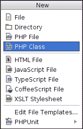

## 它是如何工作的...

一个简单的示例类将如下代码片段所示：

```php
<?php
class Review {

}
```

在 PhpStorm 中创建接口也不困难。告诉 PhpStorm 创建接口时，输出将与类类似，只是将关键字“class”替换为关键字“interface”。它看起来如下所示：

```php
<?php

interface Readable {
```

### 注意

如果您想区分类和接口，那么您只需要在 PHP 方面的常识即可。`Class`关键字用于类，而`interface`用于在 PHP 中创建接口。

# 创建新的 PHP 方法

如果代表现实世界实体的类是名词，那么没有动词——要执行的动作——它们就不存在。为了能够最大限度地提高您为经理创造的技术利润，您必须准备好使用函数来处理您用例中存在的所有动词。

## 准备工作

假设你手头有一个披萨烹饪任务。食谱将包括一个（最基本）披萨面包（名词），奶酪（名词），一些盐（名词）。如果你思考你的问题，你会意识到你需要将奶酪涂抹在披萨面包上，并按口味添加盐。如果你从技术角度看待这个场景，你可能会决定需要一个`PizzaDish`类，其中包含`applyCheese(pizzaBread)`、`addSalt(cheese)`等函数。

## 如何操作...

在 PhpStorm 中创建一个方法很简单。假设你有一个`PizzaDish`类。你的披萨菜肴是一个`Dish`，所以你的`PizzaDish`会扩展`Dish`。你的类如下代码片段所示：

```php
<?php
class Dish {
/**
* @param string $dishName The name of the dish
*/
protected function addSalt(){}
}
```

你的`PizzaDish`类可以如下代码片段所示：

```php
<?php
class PizzaDish extends Dish{
  private $dishName;
  function addSalt($dishName){
    $this->dishName = $dishName;
    parent::addSalt($this->dishName);
  }
}
```

在 PhpStorm 中编码可以通过使用代码提示或代码补全来简化。你只需输入几个字符作为提示，PhpStorm 就会准备好建议下一步可能的内容。你输入`fun`并按*Ctrl* + *Space*，就会出现关于你的函数可以是什么的多个提示。如果你想对你的披萨制作食谱进行更多操作，比如添加一些配料，如彩椒或蘑菇，你可以有一个通用函数，`add($ingredient, $dishname)`。你可以在你的`PizzaDish`类中这样做。你可以使用代码补全来设置访问修饰符。你必须手动处理其他操作。

要将方法`addSalt()`转换为`add()`，你需要重命名`addSalt`方法。这可以通过 PhpStorm 的重构选项完成。

要重构一个项目（这里指`addSalt`方法），可以通过右键点击上下文菜单进行操作 | **重构** | **重命名** 或 **重构** | **更改签名**。

如以下截图所示，**重命名**子菜单只会更改方法的名称：

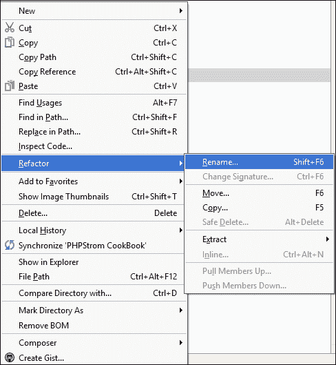

**更改签名**选项是一个更详细的重构功能，你可以更改方法的全签名，如下面的截图所示：

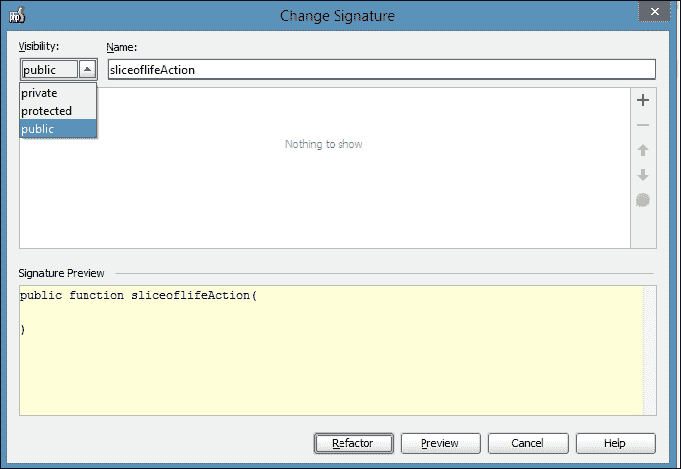

因此，你的新添加函数如下代码片段所示：

```php
<?php
require_once 'Dish.php';

class PizzaDish extends Dish{
  private $dishName;

  function __construct($dishName){
    $this->dishName = $dishName;
  }

  function add($ingredientName){
    parent::add($this->dishName, $ingredientName);
  }
}
```

在父`Dish`类中也发生了类似的变化，其中`addSalt`方法已被重命名为`add`，如下面的代码所示：

```php
<?php
class Dish {
  /**
  * @param string $dishName  The name of the dish
  */
  protected function add($dishName, $ingredient){
  }
}
```

你可以通过执行以下截图中的代码来使用`PizzaDish`类及其方法：

```php
$pizzaDish = new PizzaDish('New Pizza');
$pizzaDish->add('salt');
$pizzaDish->add('cheese');
$pizzaDish->add('capsicum');
```

## 它是如何工作的...

代码生态系统的运作相当简单。你通常实例化了`PizzaDish`类。你调用了`add`函数。但是，当你实际调用`add`函数时，究竟发生了什么？`add`函数调用了其父类中定义的`add`函数（记得在`PizzaDish`的开始处添加了`extends`）使用一个特殊的词——`parent`。所以，你以为你调用的是`PizzaDish`的`add`方法来做你的工作，但实际上是`Dish`做了你的工作！不，不，这并不是欺骗。这是继承，正如软件工程原则所解释的。

### 小贴士

键盘快捷键是*Ctrl* + *F6*和*Shift* + *F6*，分别用于更改签名和重命名。

# 添加 getter/setter 方法

在 PhpStorm 中添加`getter`和`setter`方法同样简单。你所需要做的只是拥有一个类的成员变量。在`PizzaDish`示例中，它是`dishName`。

## 准备工作

要为`dishName`创建 getter 和 setter，PhpStorm 提供了这样的功能。如果你需要，可以通过右键单击目标变量的上下文菜单，点击**生成**并从弹出菜单中选择**getter**和**setter**。PhpStorm 将为所选成员创建所需的 getter 和 setter。

你的`PizzaDish`类现在将看起来像以下这段代码：

```php
<?php
require_once 'Dish.php';

class PizzaDish extends Dish{
  private $dishName;

  /**
  * @param mixed $dishName
  */
  public function setDishName($dishName)
  {
    $this->dishName = $dishName;
  }

  /**
    * @return mixed
  */
  public function getDishName()
  {
    return $this->dishName;
  }
  function add($ingredientName){
    $this->setDishName($ingredientName);
    parent::add($this->dishName);
  }
}
```

## 如何操作...

添加盐、奶酪和红椒的过程仍然是相同的。

你必须将以下几行代码发送到你的 PHP 引擎，以便创建一个新的披萨盘并添加一些配料：

```php
$pizzaDish = new PizzaDish('New Pizza');
$pizzaDish->add('salt');
$pizzaDish->add('cheese');
$pizzaDish->add('capsicum');
```

## 它是如何工作的...

之前，当你需要访问`$dishName`时，你是直接访问的。这引发了许多不良的工程实践，例如暴露成员变量的表示。实际上，这个列表是无穷无尽的。你所需要做的只是确保你必须使用 getter 和 setter 来成为一名优秀的软件工程师。所以，在你提供的代码中，你只需要调用`getter`方法（例如`getDishName`）和`setter`方法（例如`setDishName`）。

你是否仍然感到不舒服？要有耐心。欢迎来到真正的软件工程世界。

# 创建委托方法

委托是软件工程中的一个重要设计模式。它增强了代码的可重用性。

## 准备工作

在 PHP 中，可以按照委托原则创建委托方法。在调用委托函数时，你不需要事先知道实际函数的名称——PHP 引擎可以为你找到它。

## 如何操作...

PHP 提供了两个工厂方法用于此目的。然而，你可以使用面向对象编程的原则创建自己的委托方法。

PHP 提供的工厂方法是`call_user_func()`和`call_user_func_array()`。虽然这两个方法的用法超出了本文的范围，但委托方法的创建和使用可以通过以下代码中所示的烹饪`PizzaDish`的相同场景来更好地解释：

```php
<?php
require_once 'Dish.php';

class PizzaDish{
  private $dishName;

  /**
    * @param mixed $dishName
  */
  public function setDishName($dishName)
  {
    $this->dishName = $dishName;
  }

  /**
  * @return mixed
  */
  public function getDishName()
  {
    return $this->dishName;
  }

  private $instance;

  /**
    * @return mixed
  */
  public function getInstance()
  {
    return $this->instance;
  }

  /**
    * @param mixed $instance
  */
  public function setInstance($instance)
  {
    $this->instance = new $instance;
  }

  function __construct($dishName, $instanceName){
    $this->setInstance($instanceName);
    $this->setDishName($dishName);
  }

  function add($ingredientName){
    $this->getInstance()->add($ingredientName);
  }
}
```

委托方法的用法几乎相同，但并不完全相同：

```php
$pizzaDish = new PizzaDish('New Pizza', 'Dish');
$pizzaDish->add('salt');
$pizzaDish->add('cheese');
$pizzaDish->add('capsicum');
```

现在 `Dish` 类看起来如下：

```php
<?php
class Dish {
  /**
    * @param string $ingredient The name of the ingredient to be added
  */
  public function add($ingredient){
    echo "\nYou have added: ", $ingredient;
  }
}
```

## 它是如何工作的...

惊讶吗？这里发生的事情是，当你调用 `PizzaDish` 类并传递 `Dish` 类的名称到构造函数中，`$instance` 的值是 `Dish` 类的一个新创建的对象。其余的，就像它进行的那样，是通过类对象进行的常规方法调用。现在你可以深呼吸了，因为你已经将 `PizzaDish` 中的 `add` 函数委托给 `Dish` 的 `add` 函数。看起来 `PizzaDish` 类正在执行任务，但实际上是由 `Dish` 类完成的。

# 使用控制结构包围代码

无论你想到什么算法，无论你使用什么工具来设计功能需求，无论你前往哪个星球，使用什么硬件作为你的开发平台，都有一个无处不在、无所不在的事实：循环将伴随你到任何地方。控制结构是任何你想到的代码的构建块。你不信？你的 `PizzaDish` 用例本身就能证明这一点。

## 准备工作

你首先需要一个计算机来勤奋地计算、做决策和解决复杂问题。计算机只解决一个问题就停止了吗？不。它被编程为继续执行所有可能的指令次数。程序是如何实现这种勤奋的呢？你说对了。请说得再大声一点。是的，控制循环。即使这个解释可能对你们这些高手来说显得微不足道，但事实是，没有控制结构，你无法继续编写代码。

PhpStorm 允许你编写代码。它让你专注于实际的业务逻辑。你可以编写你认为将是原子部分的代码行。当你确信逻辑正确时，你可以使用 PhpStorm 的 **Surround** 功能将这段代码包围在你的期望控制结构中。

## 如何做...

如果你希望向你的 `PizzaDish` 添加配料，你可以使用循环。有多种方式来表达一个单一语句：

+   使用 `foreach`，`PizzaDish` 类的调用方式如下：

    ```php
    $pizzaDish = new PizzaDish('New Pizza', 'Dish');
    $ingredients = array('salt','cheese','capsicum');
    foreach ($ingredients as $ingredient) {
    $pizzaDish->add($ingredient);
    }
    ```

    你必须在这行代码上保持光标位置，编写 `$pizzaDish->add($ingredient)`。

    通过访问 **代码** | **Surround with** 来调用 Surround，并选择 `foreach` 选项为你解决了问题。然而，你必须指定循环结构内部的变量。你也可以使用键盘快捷键 *Ctrl* + *Alt* + *T*。

+   你可以对 `for` 循环执行类似操作。这个更改将允许你调用你的代码。看看下面的代码片段：

    ```php
    $pizzaDish = new PizzaDish('New Pizza', 'Dish');
    $ingredients = array('salt','cheese','capsicum');
    for ($count = 0; $count < count($ingredients); $count++) {
      $pizzaDish->add($ingredients[$count]);
    }
    ```

+   通过使用 `while` 控制结构包围代码，执行类似的操作。你的 `PizzaDish` 通过以下代码片段被调用：

    ```php
    $pizzaDish = new PizzaDish('New Pizza', 'Dish');
    $ingredients = array('salt', 'cheese', 'capsicum');
    $ingredientCount = 0;
    while ($ingredientCount < count($ingredients)) {
      $pizzaDish->add($ingredients[$ingredientCount]);
    $ingredientCount++;
    }
    ```

    仔细观察会发现，`while` 循环的行为与 `for` 循环的行为完全相同。那么为什么有两个功能来实现相同的功能呢？人类的大脑喜欢有更多的选择。一段（伪）代码能更好地解释这一点：

    ```php
    while($moreChoicesAvailable){
      $humanMind = array(
        'feeling' => 'happy',
        'status' => 'comfortable'
      );
    }
    ```

## 它是如何工作的...

这里解释的两个控制结构有很多共同之处。简而言之，它们可以被称作入口控制结构，因为它们遵循**先决定后执行**的原则。它们并不是为了让你后悔自己的行为（有意为之）。有一个枪手控制结构，它靠枪活着，也因枪而死，即`do-while`循环。如果你在使用它时没有给予适当的注意，它可能会让你后悔自己的决定。在同样的术语下，它是一个退出控制结构，并且至少会执行一次任务。虽然在某些情况下这可能是必需的，但你被建议避免使用`do-while`。看看下面的截图：

```php
$pizzaDish = new PizzaDish('New Pizza', 'Dish');
$ingredients = array('salt','cheese','capsicum'
);

$ingredientCount = 0;
do {
  $pizzaDish->add($ingredients[$ingredientCount]);
  $ingredientCount++;
} while ($ingredientCount < count($ingredients));
```

因此，本质上，语句`$pizzaDish->add($ingredients[$ingredientCount])`至少执行一次，将`$ingredientCount`的值增加一，然后检查该值是否在限制范围内。要使用`do-while`，你需要将光标放在目标语句上，并在**代码** | **用...包围**的**选择**对话框中选择出现的`do-while`选项。

### 小贴士

为了让你的应用程序程序足够负责，你需要实现由**try-catch**块表示的异常处理。在这个菜谱中，将展示一个简单的用例来演示异常处理的用法。你试图准备你的`PizzaDish`。你计划像往常一样放盐和奶酪，并作为配料放彩椒以使其变得令人惊叹。然而，在烹饪过程中，你发现冰箱里没有彩椒！但你饿得足够厉害，不会让任何东西阻碍你和你`PizzaDish`之间的距离。在这种情况下，你将添加番茄。那么，这段代码中的责任在哪里？那就是在代码准备阶段处理一个*异常*情况时，配料缺失，但代码承担了责任，通过添加番茄代替彩椒来处理这个异常情况。

你的`PizzaDish`继续以下方式烹饪：

```php
$pizzaDish = new PizzaDish('New Pizza', 'Dish');
$ingredients = array( 'salt', 'cheese', '' );
$ingredientCount = 0;
try {
  while ($ingredientCount < count($ingredients)) {
    if ($ingredients[$ingredientCount] == '') {
      throw new Exception("\nYou have run out of capsicum.");
    } else {
      $pizzaDish->add($ingredients[$ingredientCount]);
      echo "\nWaiting for capsicum topping...";
    }
    $ingredientCount++;
  }
} catch (Exception $e) {
  echo $e->getMessage();
  $pizzaDish->add('tomato');
}
```

以下截图展示了如何查看 which-control-to-surround 的外观。值得注意的是，你应该知道你将要使用哪种控制结构。

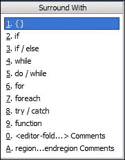

# 查找匹配的大括号

*如果你拥抱大括号，你永远不会感到尴尬。*

> *一些 PhpStorm 食谱作者*

## 准备就绪

大括号是编程中的重要元素。它们不仅为程序员定义了边界，也为解释器定义了边界。你们两个都知道结构或变量的范围从哪里到哪里。PHP 解释器只需要为每个开括号有一个闭括号来继续执行，而不论代码是如何编写的。但是，PHP 解释器并不强大到可以为你编写代码——你必须自己来做。

## 如何做到这一点...

如果你提供一小段少于 100 行长的代码，你设法阅读和维护代码。如果行数超过 100，代码格式化就会帮助你。

PhpStorm 允许你通过简单的鼠标点击或单个键盘快捷键格式化所有或部分选定的行。要格式化代码，你需要选择**代码** | **重新格式化代码**，你的代码将像魔法一样被格式化。

这个快捷键是*Ctrl* + *Alt* + *L*。

## 它是如何工作的...

在 PhpStorm 格式化代码后，你的生活变得更轻松了。你可以通过将光标放在括号上非常容易地找到匹配的括号。配对的括号会自动高亮。这个高亮功能也可以自定义。你需要转到**文件** | **设置** | **编辑器** | **光标移动时高亮显示**，勾选或取消勾选**高亮匹配括号**复选框来开启或关闭高亮匹配括号。你可以更改括号颜色、括号背景颜色等。你可以使括号看起来加粗或斜体。为了自定义这种行为，你需要设置一个新的方案。首先，你需要转到**文件** | **设置** | **编辑器** | **颜色与字体** | **语言默认值** | **括号**，选择一个默认主题，然后进行**另存为**以创建一个副本，如图所示：

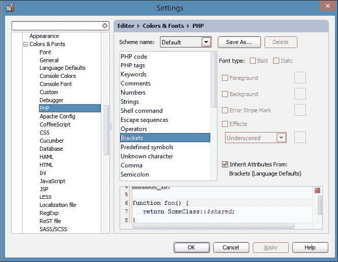

### 注意

你刚刚保存的颜色方案被保存为扩展名为`.icls`的 XML 文档，位于`~/.WebIdeXX/config/colors`目录下。该文档的名称与你在复制颜色方案时提供的名称相同。

## 还有更多...

让我们看看如何格式化一个长字符串。

### 换行字符串

当你编写了一些非常长的字符串或一些非常长的语句时，代码格式化的另一个重要方面变得尤为重要。你可能试图阅读这些长行时会遇到麻烦。即使你设法阅读了，你也可能对那些长、难以处理的长行的开始和结束感到困惑。

PhpStorm 允许你根据固定宽度包裹长行和语句。你可以通过访问**文件** | **设置** | **编辑器** | **虚拟空间**面板，让 PhpStorm 为你记住一些限制。

你可以通过选择**编辑器中使用软换行**选项旁边的复选框，在编辑器中包裹长行。长行不仅会在编辑器中折磨你。当你使用 PhpStorm 终端执行命令行 PHP 时，有时也会创建使用折磨。如果你勾选**在控制台中使用软换行**选项，你可以一劳永逸地避免这个问题。PhpStorm 为你提供了设置控制台中换行缩进级别的选项。如果你选择此复选框，包裹的长行将继续到下一行，但带有指定的空格数。现在，你不能抱怨你不确定哪一行是你的包裹行，哪一行是你的原始行！

# 注释代码段和 PHPDoc

**PHPDoc**是 PHP 提供的一个功能，旨在记录你非常努力构建的复杂代码。对于那些在某个时刻照顾过他人代码的人来说，代码记录和良好记录的代码的重要性无需解释。对于所有人，以及那些知道但渴望知识的人，这里有一些可能解释为什么你应该始终记录你的代码——无论是什么和如何。敬请期待一些有趣的用例。

## 准备工作

你计划制作`PizzaDish`。你是如何进行的？你创建了一个名为`Dish`的实体，并在其中设计了一些函数来帮助你添加一些配料，并创建了一般情况`Dish`的特殊情况。你将这个特殊情况命名为`PizzaDish`。为了制作你的披萨，你调用了`PizzaDish`并享受了你最喜欢的披萨。一切都很顺利。但是，有多少次你没有做其他事情？你能只吃披萨过一生吗？你不认为你还有其他任务要完成吗？这里有一个类比。有多少次你需要除了你编写的代码之外的其他东西？你能只通过使用你自己的类或代码成为一个优秀的程序员吗？你会为每个你执行的任务创建算法吗？

简而言之，你相信重新发明轮子吗？

普通人可能会回答不。对他们来说，你是如何使用其他程序员编写的类的？你是如何发现`Engine::start('car')`函数会打开点火开关的？这就是文档的作用。它是你能够发现`Engine`类中的启动方法旨在打开发动机点火开关的媒介。

编写干净的代码是文档化的第一个关键。你应该始终考虑那些能解释很多内容的名称。你应该始终考虑描述性的名称。如果你认为你的名称快要用完了，你可以利用 PHP 命名空间。

为了开始思考如何编写干净的代码，你被要求仔细阅读这本书。为了开始编写干净的代码，你被要求开始编写代码。

## 如何做...

如果你足够细心并且记忆力好，你早就已经阅读了`Dish`和`PizzaDish`类。看着变量是如何定义的，方法是如何声明的，你是否觉得需要其他文档？他们说得好，他们说得对：*好的代码本身就是好的文档*。但是，如果你在代码中无法想到描述性的名称，那么 PHPDoc 就是你的救星。

你有三种方法可以向你的代码中添加注释：

+   单行注释

+   多行或块注释

+   文档注释

为了学习，你必须执行。为了执行，你必须开始。那么，让我们开始吧。为了使`PizzaDish`类本身更清晰，请添加注释到该类上。

PHP 代码中单行注释是最简单和最易写的一种注释形式。单行注释以`//`开头，PHP 引擎将单行中跟随的内容视为单行注释。在`PizzaDish`类中，旁边已经添加了成分列表（PHP 数组）的单行注释，如下所示：

```php
// This is the list of ingredients that you plan to add
```

为了在 PhpStorm 中写单行注释，你需要注意注释的位置。

### 小贴士

你可以写注释而不需要以`//`开头。当你完成你的句子时，你可以使用快捷键*Ctrl* + */*，PhpStorm 会愉快地将语句转换为单行注释。

你的生活能被限制为只写一行注释吗？如果你想要有多个单行注释呢？需要多行或块注释。

你需要做的只是确定宝贵的代码范围，并在代码的开始处添加`/*`，在结尾处添加`*/`。在这个世界上，有些人对“宝贵”的概念一无所知。所有优秀的软件工程师都会忽略这样的人，继续前进。在讨论的`PizzaDish`类中，你可以看到最后几行被注释掉了。这是一个块注释。在当前情况下，你的味蕾是商业端，人们！

文档注释以`/**`开头，以`*/`结尾。这看起来不像块注释吗？更仔细的检查会告诉你它们之间的区别。

虽然块注释只需要一个开始符号和一个结束符号，但文档注释需要在每一行的开始处有一个`*`符号。虽然 PHP 引擎会跳过块（和多行）注释中的内容，但在生成实际的漂亮注释时，PHP 引擎（实际上是文档引擎）会“窥视”文档行。你在哪里能看到文档？亲爱的，当你按*Ctrl* + *Q*在任何方法声明上时，你看到了什么？是的，它是一个与文档引擎生成的相同的文档。魔法？PhpStorm 的魔法。

爆炸！太长了？没看？下面是一步一步的解释：

```php
/**
  * Class PizzaDish
  *
  * Bake a new type of <strong>Dish</strong>.
  * This dish has the following features:
  * <ul>
  * <li>It eases the appetite</li>
  * <li>It makes the taste buds happy</li>
  * <li>It confirms to the software engineering practises</li>
  * <li>It teaches engineers various aspects of PHP programming</li>
  * </ul>
*/
```

## 工作原理...

这可能是你第一次查看文档注释。你会惊讶地发现，你在这里写的 HTML 标签实际上是由 PHP 文档引擎处理的。文档注释的输出出现在你将光标放在目标成员上并转到**视图 | 快速文档**时：

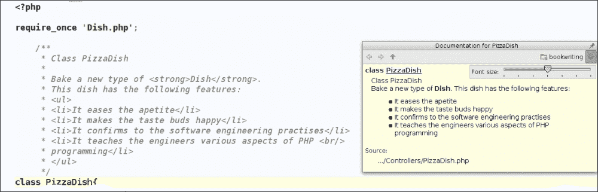

一图胜千言。你可以轻松地看到 HTML 标签是如何被处理以给文档提供正确格式的。

同样，你也可以给你的方法添加文档（同一个类和同一个方法，但这次是`setDishName`，并添加了文档）。文档行如下所示：

```php
/**
  * <strong>Setter</strong> method for giving a name to your Pizza<br/><br/>
  * In order to set values for the members variables, it is <em>advised</em> to use setter methods.
  * @param string $dishName The name of the dish you want to create.
  */
```

你刚刚使用了 HTML strong 标签来强调`setDishName`方法的类型。你还能够强调软件工程原则建议使用 setter 方法。这个方法的注释采用以下形式：

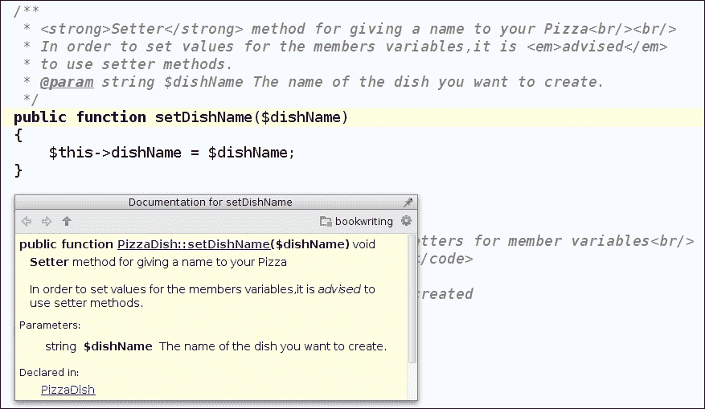

### 小贴士

为了使用键盘快捷键*Ctrl* + *Q*，你不必一定将光标放在方法名下。这也适用于文档注释区域。PhpStorm 很智能，所以它理解这一点，并显示相同的文档。

PhpStorm 从不让你失望。在 PhpStorm 中有一个功能，你可以自定义你的文档注释的外观。为此，你需要转到**文件** | **设置** | **代码样式** | **PHP** | **PHPDoc**，如下面的截图所示。选项相当详细。

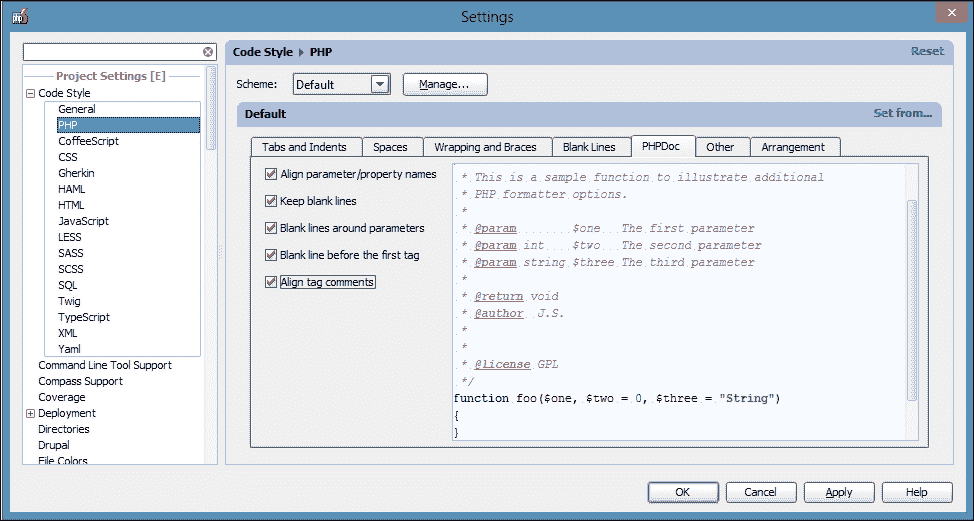

# 创建作业集

你可能多次感觉到不同的 PHP 项目有不同的优先级。你做得对。例如，一个网站开发项目可能需要一个运行的 Web 服务器配置，可能不需要命令行 PHP。

## 准备就绪

另一方面，一个简单的 PHP 项目可能需要命令行 PHP，而不需要 Web 服务器，目录列表可能仅限于层次结构中的某些文件夹。这里的要点是，不同的项目有不同的依赖和设置。拥有一个作业集使得 PhpStorm 能够为当前打开的项目做出适当的反应。

## 如何做到这一点...

如果你仔细监控**设置**面板，你会注意到有两个主要部分。一个是项目设置部分，在这里你可以根据你的项目进行设置。这非常有帮助。PhpStorm 为每个项目构建一个索引。如果你为你的项目创建一个合适的作业集，这将帮助 PhpStorm 构建一个更精确的索引，项目处理将更快。一些重要的设置包括：

+   **PHP 特定设置**：为你要创建的应用程序执行设置是非常方便的。你不必担心如何执行和测试你的应用程序。你只需要从 PhpStorm 在你面前提供的选项列表中选择即可。

+   **解释器**：你可能需要在你的 Web 托管服务上实现一些离线任务，这可能包括更新、检查、日志清理等任务。你可能需要为这些文件配置命令行 PHP，以便你可以通过直接键盘快捷键访问它们。

+   **Web 服务器**：大多数情况下，你需要有一个 Web 服务器来运行你的 PHP Web 应用程序代码。为此，你可以在 PhpStorm 中指定 Web 服务器的设置。

+   **调试器**：对于 Web 开发者来说，没有调试器的生活就像医生没有听诊器的生活。当你不知道内部发生了什么时，你怎么能找出真正发生的事情呢？你肯定需要一个调试器。

+   **目录**：PhpStorm 为项目中的文件和文件夹建立索引。较长的索引列表意味着更多的内存消耗。排除不需要的 *目录* 从索引中，PhpStorm 会感激您。

+   **检查**：PhpStorm 作为您所写代码的检查员。默认情况下，有一些检查是开启的，并且很可能您并不需要在任何时候都需要所有这些检查。

+   **版本控制**：如果您在一个团队中工作，拥有一个版本控制系统是当务之急。您可以设置版本控制系统的详细信息，例如 URL、用户名、密码以及所有在下载（检出）或上传（提交）团队正在工作的项目时使您生活更轻松的必要细节。

另一个是 IDE 特定的设置部分。这为您提供了对所有在 PhpStorm 下的项目都普遍适用的配置的控制。描述超出了本主题的范围。

# 创建 TODO 任务

假设这是一天结束的时候，您必须 *匆忙回家*（没有开玩笑），您脑海中充满了绝妙的主意，您非常确信您将无法重新生成这些想法。在这些情况下，您可以请求 TODO 来帮助您。

## 准备工作

当在 PHP 代码中添加 **TODO** 标签时，它会在 TODO 视图中变得可见。您还可以参考本章的 TODO 部分，以进行复习。

考虑到相同的 `Dish` 和 `PizzaDish` 场景，假设您想到了一个检查菜肴是否煮熟的系统，您可以在那里放置一个标志。这个标志会不断提醒您这一点。

## 如何操作...

要执行 TODO，您只需写下 TODO，然后是提醒文本，并按 *Ctrl* + */*（即注释代码）。根据您已经学到的知识，您现在可以记录您的 `Dish` 类。可能看起来像以下代码片段：

```php
class Dish {
  /**
  * Add some ingredients to your dish. <br/>
  * You can do that by specifying the name of the ingredient.
  *
  * @param string $ingredientName The name of the ingredient to be added
  */
  public function add($ingredient){
    echo "\nYou have added: ", $ingredient;
  }

//    TODO Add some method to check if the pizza is cooked
}
```

您成功地保持了功能完整；您只是为类和成员方法添加了文档注释。其他一切都是常规操作；唯一的外来物品就是 TODO。所以，如您所见，简单地添加了一个 TODO。人们可能会争论 TODO 的用法。他们说的对，也说的不对。他们说的对的情况是小型项目，其中代码不多，简单的注释可见且容易记住。在其他所有（和现实世界）情况下，他们完全错误，在这些情况下，有无数行代码，您实际上可能会在试图找出与某个建议相关的注释时遇到噩梦。PhpStorm 能够从您的项目中提取所有 TODO，并在 TODO 视图中准确显示。

## 它是如何工作的...

除了提醒您未来要完成的任务外，还可以有一些 **FIXME** 标签。正如其名所示，FIXME 标签可以用来表示一些产生错误或容易产生错误的特性。您只需使用 FIXME 关键字，然后是描述，接着使用 *Ctrl* + */*（注释）即可。PhpStorm 将开始在 TODO 部分显示它，如下面的代码所示：

```php
public function add($ingredient){
  echo "\nYou have added: ", $ingredient;
  //  FIXME Check for a valid ingredient name
}
```

fixme（或 FIXME）标签将开始指示存在一些必须修复的问题。

然而，TODO 还没有结束。如果您的开发团队中有许多程序员，您可以为个别队友添加标志。如何？PhpStorm 为您提供了过滤器。这可以在 **文件** | **设置** | **TODO** 中找到。

您需要添加一个新的模式和新的过滤器，以便在 TODO 视图中的过滤器部分使其可用。添加后，您将能够为特定的程序员设置标志。具有此新标志的代码看起来像以下片段：

```php
public function add($ingredient){
  echo "\nYou have added: ", $ingredient;
  //  FIXME Check for a valid ingredient name
}

//  TODO Add some method to check if the pizza is cooked
//  TODO for ALice Please add the appropriate usecase for the checking functionality
```

默认情况下，过滤器和模式不区分大小写，因为程序员的日常生活中已经有很多问题需要处理。请记住这一点！

你能完成 TODO 吗？

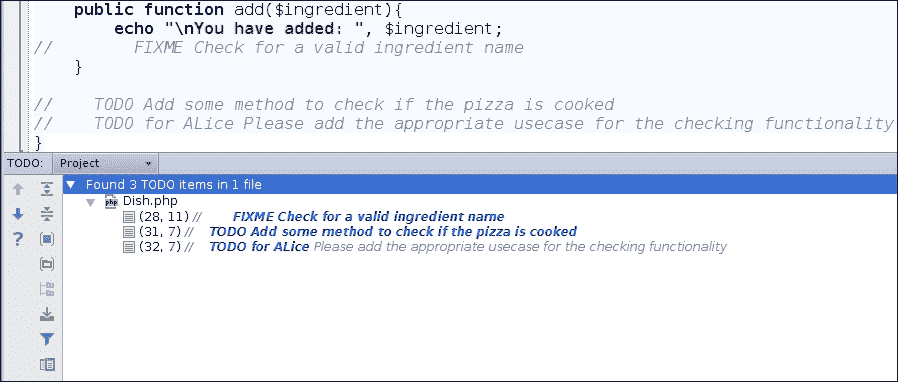
