# 第三章。重构和构建

在本章中，我们将介绍以下食谱：

+   重命名元素

+   复制元素

+   移动元素

+   移动一个方法

+   移动一个变量

+   删除元素

+   在项目中搜索代码

+   比较文件

+   使用比较来恢复元素

+   设置运行配置

+   运行你的代码

# 简介

奶奶的建议：坚持软件工程。

软件工程建议：强调代码的可重用性。任何根据软件工程范式构建的代码库都将可重用。也就是说，你一旦编写了代码，就可以永远使用它。他们常说“一次编写，永远使用”。

回顾披萨烘焙用例，你会观察到为了烹饪任何菜肴，你只需使用`add`函数，因为你坚持了上述范式。假设你将要烹饪 50 种不同的菜肴。每种菜肴本身都不同，但每种都需要`add`方法。如果你将这转化为技术，你将在大多数情况下继承`Dish`类。那就是你的`PizzaDish`。`Dish`类的所有方法都在`PizzaDish`等所有类中重用。

如果你想要更改业务逻辑，你可以愉快地舒适地更改方法体内的逻辑，并且这些更改将在继承（或使用）此类的所有类中反映出来。

到目前为止，一切顺利...但是，如果你要更改基类内部方法的签名，你会怎么做？是的，这可能在开发初期，当计划略有变化，从而导致用例变化时出现。

# 重命名元素

正如俗话所说，变化是不可避免的；你必须为变化做好准备，无论时间表如何。工程师在重命名时可能会犯错误——打字错误、忘记在哪里更改等等。别担心，至少你可以放心，因为你有 PhpStorm。PhpStorm 所做的是提供一个重构系统，在这个系统中，你可以让你的更改在整个项目中渗透，一步到位：**重构步骤**。如果你选择重构，你将拥有进行多项重构任务的自由。

因此，`addIngredient`方法可以在代码的某个地方轻松地写成`addingredient`；`toolTip`可以写成`tootLip`等等。在你的代码中可能有五个地方使用了`addSalt`方法；但是，当你更改`add`的方法签名时，不知何故你忘记了，只在你代码库中的四个地方进行了更改。这样的小错误可以安全地称为愚蠢的错误，但可能会造成比你想象的更大的损害。它们消耗了最宝贵的资源——时间。你最终会意识到这只是一个打字错误或失误，但只是意识到你已经错过了截止日期。

通过重构，你可以安全地重命名方法签名，并告诉 PhpStorm 通过查找并跨所有出现进行相同的更改来渗透这个更改。

重构适用于代码的所有元素：类名、方法名、方法签名、变量名等等。PhpStorm 将它们视为一样！正义的 PhpStorm！

在 PHP 项目中，目录与 Java 中的包非常相似——如果你之前接触过 Java 编程语言。简单来说，PHP 项目中的目录是类的分组。你可以在目录中分组相似的类。因此，你的控制器类可能位于控制器目录下，模型类位于模型目录下，配置文件位于`config`目录下，等等。目录很重要。考虑一下，如果你想要更改特定目录的名称，你需要重构它。你需要重命名它。因此，所有引用类的代码行（`include`、`include once`或`require`、`require_once`）在你重命名特定目录后都将自动更新。

## 如何操作...

我们将要重命名的元素是目录和类；让我们逐一看看它们。

### 重命名一个目录

要重命名一个目录，请执行以下步骤：

1.  为了重命名一个目录，你需要右键点击上下文菜单并选择**重命名**选项。

1.  在提供新名称时，你可以选择是否让这个更改渗透到整个项目中，无论这个目录在哪里被引用。

1.  您还可以选择是否要替换注释和字符串中的出现。这在上面的屏幕截图中有展示：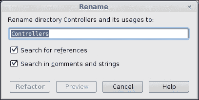

### 注意

如果你想要查看与这个目录对应的哪些出现，你可以选择**预览**按钮，或者直接**重构**更改。一旦你重构了更改，你就可以坐下来专注于进一步的开发计划。

### 重命名一个类

有时候，即使最好的计划也不能保证万无一失。你可能已经开始向东走，但由于风向，你感觉向东南走是一个更好且可行的选择。计划被破坏了吗？当然不是——需要一些修正，然后你就可以继续前行了。

这里有一个用例——你计划做一些`Dish`（菜肴），然后去了厨房，但发现关键的食材缺失。你会怎么做？继续饿着？当然不是...你会继续做一些其他的`Dish`。为了继续，你会尝试重用你在`PizzaDish`中使用的某些逻辑。从技术角度来说，你需要重命名（重构）你的类。

## 它是如何工作的...

为了做到这一点（重构你的类），你需要将光标放在类名上，访问右键上下文菜单，并选择**重命名**。你可以进行**预览**来检查哪些出现将被更改，一旦你确信，你可以进行**重构**。

简单，不是吗？确实如此。

在这种情况下，重构将看起来如下面的截图所示：

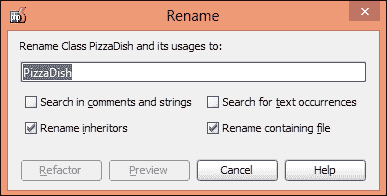

## 更多...

到目前为止，我们已经熟悉了重命名元素。现在，是时候看看如何重命名一个方法了。

### 重命名方法

在 PhpStorm 中，对于方法的重构，你可以精细控制对方法名称或方法签名的更改。要更改方法名称很容易。类似于重命名目录和重命名类，你需要将光标放在目标方法名称上，访问右键上下文菜单，然后进行**重命名**。你可以在指定的框中应用更改。如果你想预览，你可以**预览**，或者你可以**重构**，PhpStorm 会愉快地将更改传播到所有出现的地方。

### 重命名成员变量

在所有提供的重命名标准和解释中，重命名成员变量是最典型的，并且需要处理上最多的成熟度。简而言之，这是一个“小心处理”的情况。变量可以是局部的、全局的或基于范围的。你可能需要一个变量名`$salt`，用于将盐这种成分添加到`PizzaDish`中，另一个`$salt`用于算法目的——比如说为了向你的密码中添加随机字符，使烹饪菜肴的容器更加安全。因此，你希望有一些盐来烹饪你的菜肴，同时也防止别人吃掉它。

### 注意

为了谨慎地重命名变量，步骤与前面描述的相同——增加的是警告**小心**。你需要将光标放在变量名称上，访问右键上下文菜单，并选择**重命名**，PhpStorm 将显示所有出现。你可以从可用列表中选择，并选择性地重命名所需的出现的变量。

## 参见...

你也可以参考前几节中关于重命名方法和重命名目录的内容。

改变方法签名也不困难。在复数情况下，你可能会意识到传递一个额外的参数就能达到目的。所以，你有了 PhpStorm 的魔法棒，可以非常容易地施展魔法来实现这一点。

你可以从将光标放在方法名称上，访问右键上下文菜单，并选择**更改方法签名**开始。魔法开始了。

PhpStorm 为你提供了许多选项来更改目标方法的签名。你可以参考前面的章节，其中详细描述了如何更改方法签名。

### 小贴士

为了避免仅仅为了添加或删除参数而更改方法签名，您可以使用 PHP 的 `func_get_args()`，这样可以使您的方法独立于参数的麻烦。因此，您只需要创建一个不带参数的方法，并使用 `func_get_args()` 来获取所有参数，1、5 或甚至 35 个参数都很容易。您可能会问“为什么我们一定要用参数呢？”这个答案相当简短。您应该对 PHP 解释器表示同情；在这种情况下，它需要进行更多的处理。

# 复制元素

目录包含类，类包含方法和变量，方法包含变量，并且方法使用变量。

需要证明的观点是，一切都在某种程度上相互关联。您同样可能想要复制一个目录，就像您想要安全地将一个类复制到当前位置或声明之外的其他位置一样。

## 如何操作...

复制一个目录意味着在某个地方，某个概念发生了变化，这导致了类的重新分组。因此，最好再思考一下。如果您仍然决定这样做，您需要执行以下步骤：

+   前往 **项目视图**（*Alt* + *1*），突出显示目标目录，访问右键单击上下文菜单，转到 **重构**，然后选择 **复制** 选项。PhpStorm 将要求您提供详细信息。这些详细信息将是新名称，以及您希望将目录复制到的目标目录。PhpStorm 将为您复制。

还有另一种方法可以达到相同的效果，针对目录：

+   您也可以通过传统的 *Ctrl* + *C* 和 *Ctrl* + *V* 组合直接将一个目录从一个位置复制到另一个位置。

对于目录，它创建相同的效果，区别在于它们工作的方式。重构是 PhpStorm 复制的一种更优雅的方式；它不会将任何内容保存到剪贴板中。

## 它是如何工作的...

复制更像是一种操作系统方法。它将名称作为字符串值复制到剪贴板中。因此，您可以在编辑器中直接粘贴名称，在项目视图中直接粘贴目录。有趣，不是吗？

复制目录的外观如下所示：

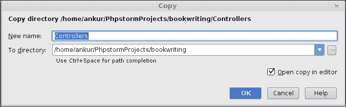

那么，您应该选择哪一个呢？这取决于您。做任何一项，但请确保您遵循 **不要重复自己**（**DRY**）的原则。

## 还有更多...

到目前为止，您已经熟悉了复制元素，现在是时候转向复制一个类了。

### 复制一个类

复制一个类在大多数情况下意味着复制其中的业务逻辑。在软件工程中，这个过程被赋予了一个复杂的名称，即**现成**开发。你可以欺骗所有人，但不要欺骗自己，你只是一个模仿者！复制类的目的是为了重用其中大部分现有的业务逻辑。然而，更多的逻辑被注入到类中以膨胀它。要复制一个类并开始你的现成开发，你需要通过访问右键单击上下文菜单并选择**复制**选项来复制一个类。对话框是相似的。问题也是相似的。效果是相似的。结果却不同。在这里，一个类从一处复制到另一处。

### 注意

就像你可以对目录进行复制粘贴一样，你也可以对你选择的类执行完全相同的操作。遵循操作系统的复制方式，要复制的类的名称也被放在了剪贴板上。如果你在编辑器中粘贴它，类的名称将被粘贴，如果你在项目视图中粘贴类的名称，整个类将在项目视图中被粘贴到所选位置。

# 移动元素

任何敏锐的软件工程师都知道剪切或复制和粘贴的重要性。与这个重要声明相关的信息如下：

+   剪切和粘贴比复制和粘贴更快。然而，剪切和粘贴会改变所选元素的位置。而复制则保持原始位置不变，剪切则将其从原始位置移除。

任何有经验的软件工程师都会通过过去的经验拥有这种知识。

## 如何操作...

我们已经讨论了重命名元素、复制元素，现在，是时候移动一个目录了。

### 移动目录

如果你确定你的架构在某处发生了变化，以至于你的分组发生了变化，你应该准备好将整个目录（你的分组）移动到另一个分组（另一个目录或位置）。为了移动一个目录，你需要执行以下步骤：

1.  你需要转到项目视图，选择所需的目录（也称为分组），访问右键单击上下文菜单，并选择**移动**选项。

1.  PhpStorm 将询问你一个问题，即你希望将所选目录移动到何处。

1.  一旦你回答，PhpStorm 将处理其余的事情，你的任务将完成。

### 移动类

你想把你的类移动到另一个目录（或命名空间、文件夹或分组，用最通俗的话说），理想情况下是在你匆忙开始开发而没有适当计划的情况下，现在你意识到你想象中的实体不是最佳解决方案。好吧，不要责怪自己。相反，使用 PhpStorm 帮助你通过将其移动到更合适的位置来重构你的类。执行此操作的命令是相同的。

使用右键单击上下文菜单，进行重构，然后移动。指定目标目录的位置，您希望将此类移动到该位置。PhpStorm 将在操作完成后提示您。

# 移动方法

将方法移动到其他类的前提有两个。一个是最常见的：您应该清楚自己在做什么。另一个是要移动的方法必须是静态的。如果不是，PhpStorm 将通过提示“不支持移动非静态方法”来警告您。

## 如何操作...

要移动方法，请执行以下步骤：

1.  只需将光标放在方法名称上，从右键单击上下文菜单中访问**重构**选项并移动。

1.  您需要提供目标类的名称，您希望将此方法移动到该类。

1.  您可以选择预览此更改（移动）将影响哪些出现。

1.  一旦您对建议的结果感到满意，您就可以重构方法。目标类现在将包含您刚刚移动的方法，如下截图所示：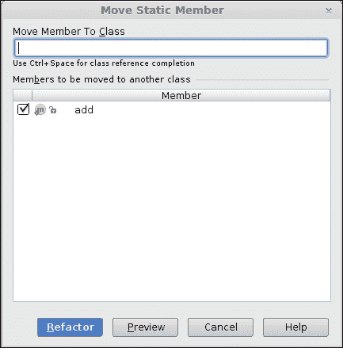

# 移动变量

将成员变量移动到其他类既简单又非常重要，从架构角度来看。变量通常表示现实世界中的属性。因此，如果您为`PizzaDish`计划了糖，您肯定会非常快速地将糖从`PizzaDish`移动到其他菜肴，比如`Cookie`。就像方法一样，您只能将静态成员移动到其他类。

## 如何操作...

从右键单击上下文菜单中选择**重构**，然后选择**移动**。

如果要移动的当前成员变量在当前类中是私有的，则**移动**操作将成员转换为公共。

在执行移动操作之前，PhpStorm 会警告您，如下截图所示：

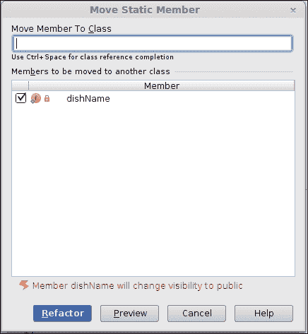

### 小贴士

无论您在哪里放糖，您都应该始终尝试使用语法糖，因为它可以稍微减轻一些文档负担。

PhpStorm 说“您的知识水平已提升至 200%”。您必须说“太棒了”！...200%...如何？您已经知道如何在您熟悉的操作系统下复制或剪切粘贴。100%的知识...现在您知道了使用 PhpStorm 进行相同操作的方法，并且增加了 100%的知识。所以，应用简单的数学，您的知识水平现在是 200%”

### 注意

除了通过移动进行重构之外，您还可以通过将任何程序结构或标识符在代码中移动来玩转您的代码。这不仅仅是重构，而是简单的移动。PhpStorm 可以配置为尊重您的`if-else`或其他代码块。要移动一行代码，只需将光标放在所需的行上，并使用神奇的快捷键*Alt* + *Shift* + *向上*或*向下*。您的行将向上或向下移动。此操作对代码选择也有效。

# 删除元素

从代码库中删除代码本身是一项非常大胆的任务。要求程序员删除代码中的业务逻辑就像要求他捐出一个肾脏一样！

## 准备工作

PhpStorm 通过提供**安全删除**选项来简化这个过程。您可以通过重构来删除代码中的元素。这个重构会找到所选元素的所有出现，一旦您要求它继续，PhpStorm 就会愉快地删除项目中该元素的所有选定出现。

## 如何操作...

要删除文件，您需要遵循以下步骤：

1.  在目标文件名上放置光标后，访问右键单击上下文菜单。

1.  选择**安全删除**选项。然后，PhpStorm 会询问您是否想查看代码中的注释和字符串，如下面的截图所示：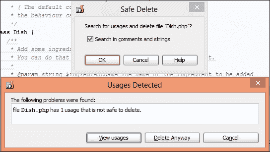

1.  如果您继续，PhpStorm 会通知您删除文件时可能出现的任何潜在问题。

1.  您可以通过选择**查看用法**选项或按*Alt* + *F7*来查看那些处于雷达之下的文件列表。

1.  PhpStorm 会提供一个列表，列出所有引用您要删除内容的文件。如果您改变主意，可以重新运行安全删除。如果您决心已定，可以继续删除。如果您选择不删除，可以取消整个过程，如下面的截图所示：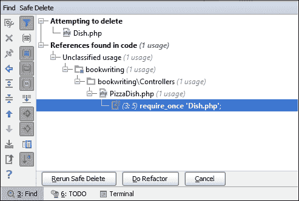

1.  如果您对删除过程的结果感到满意，可以选择**无论如何删除**选项。

## 它是如何工作的…

一旦确定，PhpStorm 将执行以下操作来删除文件：

+   在要删除的文件中找到元素

+   在项目中的其他文件中找到元素的出现

+   从项目中的其他文件中删除出现

+   删除最初选定的文件

# 在项目中搜索代码

很少有人会记住每一行代码。如果您的经理因为您没有记住最后修改的那一行而责备您，您只需微笑并继续使用 PhpStorm 工作。当您在输入时忘记无线键盘放在哪里，或者在驾驶同一辆车时忘记车钥匙放在哪里，您可能会忘记任何事情。人类可以忘记任何事情。人脑以无法解释的方式行事。

## 准备工作

有 PhpStorm 在身边意味着您可以忘记您的代码。即使您对像 Pizza 或 Dish 这样的关键字有一些记忆，在 PhpStorm 中也有可以找到所有这些关键字引用的设施。您还没有被 PhpStorm 的这种强大功能所说服吗？请继续关注更多信息。

在 PhpStorm 中，有一个**在路径中查找**工具。从技术和使用角度来看，这是 PhpStorm 提供的一项最佳功能。从技术角度来看，它被编程为既智能又快速。如果你搜索到 PhpStorm 认为可能成为问题的内容，它会通过显示警告来提醒你，如下面的截图所示：

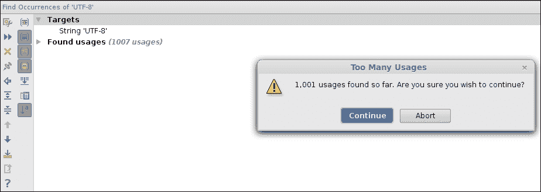

## 如何做...

在项目中搜索一个项目的旅程从简单且易于记忆的键盘快捷键开始，*Ctrl* + *Shift* + *F*。一旦你启动了命令，你将被要求提供你的搜索参数。

你提供的第一个选项是你想要搜索的字符串。这是搜索能够继续的最基本和最重要的要求。

如果你没有提供任何文本，**查找**按钮无法执行搜索。你在这里输入的文本应该有策略地提供，以节省你和 PhpStorm 的时间。以下具有多个视角的示例是最好的。假设你非常饿，需要知道如何烤披萨。你的搜索字符串将是`pizza`。

你可以缩小搜索条件，如下面的截图所示：

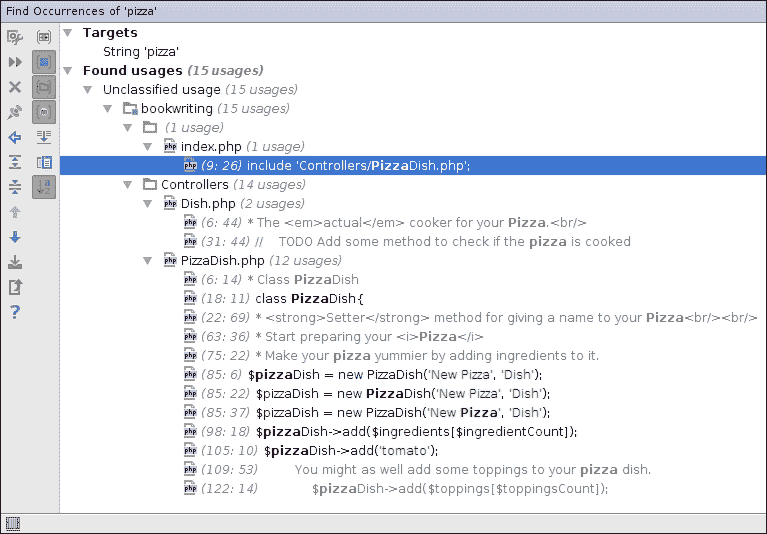

在弹出窗口中有一个**目录**单选按钮。你可以选择它来让 PhpStorm 知道它必须只选择特定目录内。当你指定目标目录的路径时，PhpStorm 将执行相同的搜索任务，但这次它将使用缩小后的搜索条件。这里值得注意的一点是，项目只是一个目录的集合，所以当你在一个项目中搜索时，你实际上是在一组目录和/或某些文件中搜索。当你选择一个目录时，因此使搜索更快，因为 PhpStorm 需要搜索的更少。懒惰的 PhpStorm！

如果目标目录内有子目录，你可以通过选择**递归**选项来告诉 PhpStorm 实际进入这些目录，如下面的截图所示：

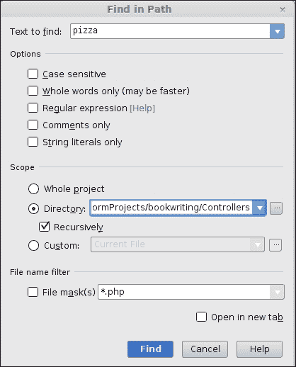

然而，你可能仍然需要浏览许多结果来找到目标。

如果你想要告诉 PhpStorm 在特定文件中搜索，你可以通过从**自定义**范围旁边的下拉框中选择以下值之一来实现：

+   **项目文件**：搜索将限制在项目文件中。

+   **项目和库**：搜索将包括项目目录和项目中使用的库。

+   **项目测试文件**：搜索将查看项目的测试文件。

+   **打开的文件**：搜索将查看当前在编辑器中打开的文件。

+   **之前搜索结果中的文件**：搜索将查看之前搜索中使用的文件。这意味着 PhpStorm 会记住你搜索了什么。

如果你想要自己的自定义搜索标准，你也可以做到。PhpStorm 将记录你的首选项，并允许你随时切换到它们进行搜索。为此，有一个在自定义下拉菜单旁边的按钮。当你按下它时，你将被要求保存你的首选项，如下面的截图所示：

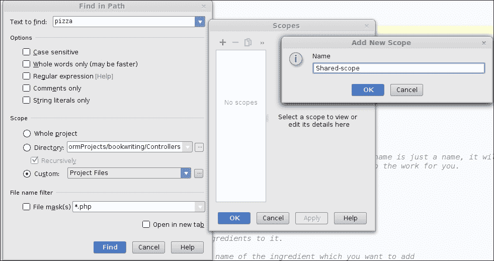

一旦你点击**保存**按钮，你的首选项将开始出现在同一下拉菜单下的**自定义**范围内。如果在未来的某个时刻，你需要更改你刚刚创建的自定义搜索范围，你需要遵循相同的步骤。将出现相同的表单，你可以从那里编辑你的首选项。

## 它是如何工作的…

你还有许多要搜索的内容。人的大脑非常懒惰，它总是寻找消耗更少能量的更好的替代方案。在项目内部搜索有点太多。你仍然需要手动查看搜索结果，然后决定你想要的披萨版本，如下面的截图所示：

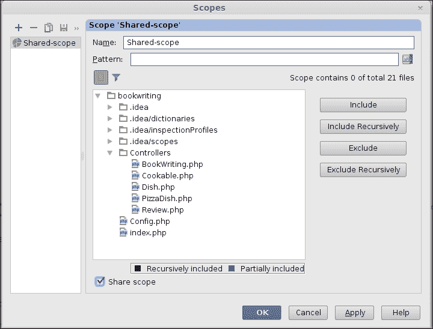

你的`pizza`可能是一个`Pizza`。在这种情况下，你需要选择**区分大小写**选项。PhpStorm 将区分`Pizza`和`pizza`。

### 注意

如果你确定你只想搜索披萨，你应该选择**仅全词**选项。这样，PhpStorm 就会知道它只能搜索披萨，而不是像`pizzadish`、`pizzacooking`或`pizzacooked`这样的类似词。

如果你只想搜索注释中（包括 PHPDoc）`pizza`的出现，你需要选择**仅注释**选项。

如果你只想找出包含单词`pizza`的字符串数量，你应该选择**仅字符串字面量**选项。PhpStorm 将只查看字符串常量。

## 更多内容…

搜索最重要的部分出现在你决定要搜索所有以`pizza`结尾、在中间或开头的案例时。到目前为止，正则表达式可能已经开始响起铃声。如果你对以披萨开头的所有单词感兴趣，你的搜索字符串可能类似于`^pizza`。然后你需要选择**正则表达式**选项。显然，你将想要创建更多和更多的用例，以便掌握**正则表达式（RegEx）**的艺术。有关正则表达式使用的帮助，你可以前往 PhpStorm 的帮助部分。为了方便，相同的表格已经复制在这里。熟悉 Java 的人会感到宾至如归！

# 比较文件

代码的更改是一个噩梦。全世界开发者的社区都一致认为这一点。为了控制更改，有版本控制系统可用。这些系统可以在你将更改的文件上传到版本控制系统时详细显示文件何时发生变化。然而，谁对你的本地工作副本所做的更改负责？你将如何跟踪哪个更改导致你的代码崩溃？

## 准备工作

您可以使用文件比较功能。由于 PhpStorm 记录了您在编辑器上执行的每一个活动，您可以通过比较不同时间线上的问题文件来找出实际的非工作代码。如果您觉得*时间线*在这里很陌生，您可能会更容易知道 PhpStorm 实际上是根据时间戳保存您的本地副本版本。如果在某个时间点，您的代码停止工作，撤销操作也无法帮助，您可以使用文件比较来查看时间线，并将历史文件与当前文件进行比较。这样，您就能识别出是哪个更改阻止了您的代码执行。

## 如何操作...

为了查看本地历史记录并将当前文件与历史文件进行比较，请执行以下步骤：

1.  您需要访问右键点击上下文菜单，选择**本地历史**选项，并选择**显示历史**选项。

1.  根据文件历史的时间戳，您将获得差异的详细信息，如下截图所示：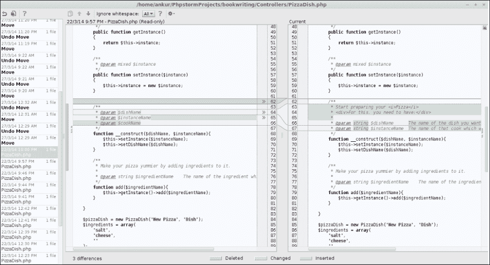

1.  同样，您也可以比较两个文件。您需要转到项目视图，选择感兴趣的文件，点击右键访问上下文菜单，并选择**比较 2 个文件**选项。您将看到一个类似的比较窗口，显示您所选两个文件之间的任何差异。

1.  蓝色线条显示的是更改的内容，绿色线条显示的是新内容，红色线条显示的是冲突内容。

1.  有方向箭头（**>>** 和 **<<**），它们指示哪些更改应该传递到哪个文件，如下截图所示：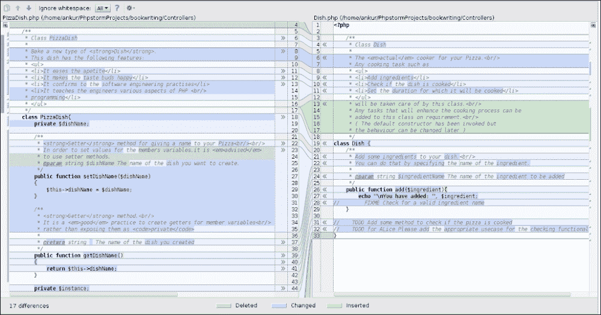

## 它是如何工作的...

如果您不喜欢颜色，您也可以通过导航到**文件** | **设置** | **编辑器** | **颜色与字体** | **差异**来更改它们，如下截图所示：

有时候，您必须忍受他人对软件工程实践的违规行为。当您在团队工作时，这种情况就会出现。团队成员不小心对代码进行了更改并将其推送到代码库。作为高级程序员，您被要求采取行动并修复它。但您对如何进行操作毫无头绪。您可以使用相同的差异（或文件比较系统）来比较存储库中的文件。一旦您将其与最后几项修订进行比较，您将立即发现错误，并能够修复它。这样，您将证明您作为程序员的实力！感谢 PhpStorm。

### 注意

无论您进行何种比较，无论您比较哪些文件，默认的键盘快捷键是*Ctrl* + *D*。希望您能记住这个快捷键。记住这个快捷键仅适用于更改历史窗口打开时进行比较。

# 使用比较恢复元素

除了文件比较，如果您希望恢复已删除的文件或文件夹，这个差异系统可以提供极大的帮助。您只需记住已删除文件最初所在的目录名称。这会与问题相关吗？是的，会的。如果您查看文件夹的本地历史记录，您将能够看到对目录执行了哪些操作。

## 准备工作

操作可以是任何东西：新文件或文件夹，某些文件或文件夹的更改，文件或文件夹的删除，等等。现在您可以安全地感谢 PhpStorm 监控您所执行的每一个操作。

一旦您找到您最缺少的资源，您可以将时间戳回滚到灾难性更改之前。

## 如何操作...

恢复更改的最简单方法是使用键盘快捷键*Ctrl* + *Z*撤销。您将能够撤销文件中的上一个编辑，直到您关闭它。对于项目也是如此。

您可以撤销删除、重命名或项目中的任何更改。这些都是安全的，PhpStorm 会记录所有历史记录。

## 它是如何工作的...

文件的恢复基于时间戳，或者可以使用 SVN 或其他版本控制工具进行恢复。我们已经讨论过撤销在软件工程中的有用性，但其工作原理基于您的操作系统，这超出了本书的范围。

## 参见

此恢复过程已在*恢复已删除资源*中描述。

### 注意

唯一的前提是删除过程应在 PhpStorm 内部执行。如果资源是在外部删除的，PhpStorm 将无法提供帮助。

# 设置运行配置

在学习如何在 PhpStorm 编辑系统中编码后，您现在应该能够执行您的代码了。不，不是！这里并没有假设您不知道如何运行代码——这里讨论的视角是 PhpStorm。现在您可以再次阅读提到的声明。

## 如何操作...

1.  可以为项目范围内的文件设置运行配置。要配置这些设置，您需要从主菜单中选择**运行** | **编辑配置**。将出现一个对话框，它会向您提出许多问题。这些答案将通过提供更快执行代码的方式帮助您。

1.  一旦您打开设置区域，您需要广泛关注您感兴趣的方法。如果您没有指定任何设置，PhpStorm 将确定您所编写的脚本的类型。PHP 脚本设置是对您曾经通过命令行执行 PHP 脚本并通过提供命令行参数、指定解释器选项或环境变量（如果您想做一些疯狂的事情）进行操作的情景的模拟。

您指定的参数是您的 PHP 脚本的命令行参数。

解释器选项是你用来提供给你的 PHP 解释器的选项。一些常用的开关会让你回想起那些痛苦的日子：`-a`、`-v`、`--info`等等。

以下是一个可用选项列表：

| 选项 | 描述 |
| --- | --- |
| `-a` | 作为交互式 shell 运行。 |
| `-c<path>&#124;<file>` | 在此目录中查找 `php.ini` 文件。 |
| `-n` | 不会使用 `php.ini` 文件。 |
| `-d foo[=bar]` | 定义 INI 条目 `foo` 的值为 `bar`。 |
| `-e` | 为调试器/分析器生成扩展信息。 |
| `-f<file>` | 解析并执行 `<file>`。 |
| `-h` | 这是帮助信息。 |
| `-i` | 这将给出 PHP 信息。 |
| `-l` | 仅进行语法检查（lint）。 |
| `-m` | 显示编译在模块中的代码。 |
| `-r<code>` | 运行 PHP `<code>`而不使用脚本标签`<?...?>`。 |
| `-B<begin_code>` | 在处理输入行之前运行 PHP `<begin_code>`。 |
| `-R<code>` | 对每一行输入运行 PHP `<code>`。 |
| `-F<file>` | 对每一行输入解析并执行 `<file>`。 |
| `-E<end_code>` | 在处理所有输入行之后运行 PHP `<end_code>`。 |
| `-H` | 隐藏传递给外部工具的任何参数。 |
| `-S<addr>:<port>` | 使用内置 Web 服务器运行。 |
| `-t<docroot>` | 为内置 Web 服务器指定文档根 `<docroot>`。 |
| `-s` | 输出 HTML 语法高亮源代码。 |
| `-v` | 这将给出版本号。 |
| `-w` | 输出去除注释和空白符的源代码。 |
| `-z<file>` | 加载 Zend 扩展 `<file>.` |
| `args...` | 脚本传递的参数。当第一个参数以`-`开头或脚本从`stdin`读取时，使用`-- args`。 |
| `--ini` | 显示配置文件名称。 |
| `--rf<name>` | 显示关于函数 `<name>` 的信息。 |
| `--rc<name>` | 显示关于类 `<name>` 的信息。 |
| `--re<name>` | 显示关于扩展 `<name>` 的信息。 |
| `--rz<name>` | 显示关于 Zend 扩展 `<name>` 的信息。 |
| `--ri<name>` | 显示关于扩展 `<name>` 的配置。 |

保存设置后，你的 PHP 脚本将准备好运行。

### 注意

值得注意的是，这仅仅是 PhpStorm 执行命令行 PHP 脚本的一种方式。如果你记得 PhpStorm 中有一个终端视图可用，你将很容易联想到你同样可以在终端中完成相同的任务。

另一个值得你关注的配置是 PHP Web 应用程序设置。对于普通人或非程序员来说，它似乎表明 Web 编程是一件轻而易举的事情。

拒绝邪恶之人的建议，不效仿罪人的榜样，是幸福的。

## 它是如何工作的...

认为 Web 编程很容易，就像认为每个人都能烤出美味的披萨一样。记住，美味是关键词。要处理执行基于 Web 的应用程序的挑战，你需要告诉 PhpStorm 一些基本设置的事实。你需要在此处指定的设置是：

+   需要指定一个有效的网络服务器，您的应用程序将在该服务器上启动。要配置新的服务器，在提供的下拉菜单右侧有一个小方块按钮。点击该按钮，您将被带到全新的设置区域，在那里您需要设置网络服务器。

    复杂！去找那些说网络编程很简单的人。您对他们可以随意行事，但在这里，使用 PhpStorm，您需要指定设置网络服务器的配置。要设置新的网络服务器，您需要指定将来（无论远近）将用于访问此网络服务器的名称。您需要设置主机名（您可能使用 localhost 或`127.0.0.1`）和端口号（最常见的情况将导致您将`80`作为这里的值）。您还可以在这里指定调试器。

    默认情况下，PhpStorm 支持**Xdebug**和**zend-debugger**。不要因为不知道调试器是什么而挠头。它将在本书的后面讨论。一些开发者更喜欢通过只在其中放置符号链接来保持网络服务器文档根的清洁。这些符号链接指向本地磁盘上的其他位置。这样做的原因是文档根可能不提供写入目录所需的足够权限。您显然比服务器文档根更容易控制自己的目录。如果您在文档根内部有符号链接，您也可以告诉 PhpStorm。表格的左侧是您的项目实际保存的路径，右侧是文档根下的符号链接。

    您可以指定起始 URL（口语中的基本 URL）。这很简单。

+   需要指定用于查看网络应用程序的浏览器。您可以从预定义的浏览器列表中选择浏览器。如果您认为需要专门针对某些浏览器来查看您的代码，您需要转到**Web Browsers**设置。这可以通过两种方式实现：

    +   浏览器下拉菜单右侧的方块按钮。您需要填写的是与浏览器相关的配置。您可以告诉 PhpStorm 跟随所选默认浏览器背后的操作系统。您可以通过选择可执行文件所在的路径从 Firefox、Internet Explorer、Safari、Chrome 或 Opera 中选择。您还可以设置一个浏览器为活动或非活动状态，并使其成为默认浏览器。您可以使用浏览器设置与 PhpStorm 一起使用。

    +   另一种方式是通过**文件** | **设置** | **Web Browsers**。这两个路径都将您带到同一个目的地，如下所示：

    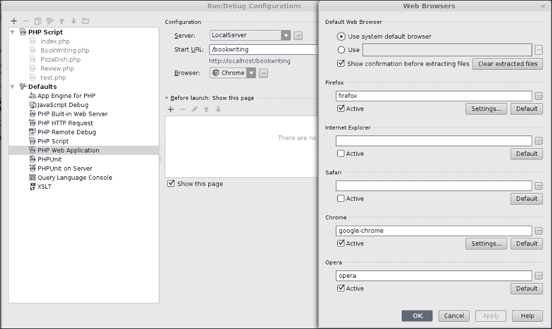

    全球有众多可用的网络浏览器。您可以选择您喜欢的网络浏览器，并将其设置在这里以便在 PhpStorm 中使用。

## 还有更多...

你还可以设置一个预运行配置，通过设置一些在应用程序执行之前执行的命令。有一些配置选项可用。你甚至可以根据这个配置创建自己的新的 PhpStorm 工具，并在此处使用它，如下面的截图所示：

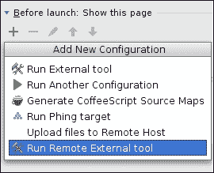

这就是将你的网络应用程序设置为在 Web 服务器上执行并在 Web 浏览器中查看的全部内容。要执行你创建的网络应用程序代码，你需要在编辑器中的文件上右键单击并选择**在浏览器中打开**。搞定！

# 运行你的代码

有意进入 PHP 的世界，你也步入了网络编程的世界，因为 PHP 也是一种流行的网络编程语言。用 PHP 编写的应用程序必须在两种介质之一中执行。

## 准备工作

你需要一个安装了 PHP 模块的 Web 服务器，如 Apache。如果你需要一个 Web 服务器，你很可能正在创建一个将在 Web 浏览器上运行的网络应用程序。

## 如何操作…

要运行 PHP 代码，你只需要学习一个快捷键 *Ctrl* + *Shift* + *F10*。其余的由 PhpStorm 来处理。

代码将根据你设置的配置来执行。有关执行 PHP 代码的更多详细信息，你也可以参考上一章。

然而，如果你没有在 PhpStorm 中执行 PHP 代码的先验经验，你也不愿意尝试新事物，你可以求助于老式方法。

## 它是如何工作的…

你可以使用 PhpStorm 作为开发系统和文件传输系统，将你的代码上传到 Web 服务器，在那里你可以立即测试代码。前提是 Web 服务器应该是一个开发服务器，你只需要修改 PHP 代码。

这听起来是不是太老式了？也许吧。继续阅读。

如果开发服务器是你的本地机器，这将是一种低效的工作方式。如果你的开发服务器不在你的本地机器上，即使它在本地网络中，通过网络传输文件也会存在延迟。显然，作为一个开发者，你无法承担这种延迟，除非业务需求是这样的，你不能在本地机器上设置整个系统。

### 小贴士

在所有其他情况下，建议你在你的机器上设置一个开发服务器的本地副本。

跟上新的潮流。PhpStorm 很棒！
