# 第五章：测试和调试

在本章中，我们将涵盖以下主题：

+   安装 PHPUnit

+   PHPUnit 中的测试用例

+   使用 PHPUnit 测试应用程序

+   开始调试会话

+   设置断点

+   配置断点条件

+   创建异常断点

+   步进你的代码

+   运行到选定的代码行

+   观察表达式和变量

+   评估表达式

+   在线更改代码

+   PhpStorm 中的代码覆盖率

# 简介

每当你创建一个新的软件时，都会在它上面固有一个业务依赖。显然，如果你的软件没有出售，你可能已经选择了其他职业。由于业务因素，你总是期望你的软件是可靠的。这只能在软件通过测试后才能实现。并不是说，程序员们将做所有的测试并将测试人员踢出去。你需要在编写代码的同时进行单元测试。如果你对你的代码进行单元测试，失败的可能性会大大降低。理想情况下，单元测试应该在创建代码时进行，而进行单元测试的理想时间是在某个里程碑功能创建后立即进行。

要明智行事并进行（单元）测试，请使用 PHPUnit。**PHPUnit**是一个用你最喜欢的 PHP 编写的系统（应用程序）。它让你为编写的代码编写测试用例，这样你就可以继续检查任何可能潜入你逻辑中的错误。因此，在你使用构建工具创建类似 phar 或其他存档时，你已经确保了已经应用了第一层过滤。 

显然，你会问 PHPUnit 的用途。这个答案很简单：你需要 PHPUnit 来防止错误传递到集成测试阶段。但如果在单元测试阶段有一些错误或功能无法检测到怎么办？如果由于另一个组件或模块传递了错误数据而出现错误怎么办？

不要将改变一个人存在的时态的规则应用到测试用例上，你再次被建议要明智行事。使用调试器。大多数 IDEs 都会在调试器旁边显示一个带有 bug 图标的调试器，所以你不会在 PhpStorm 中很难找到它。PhpStorm 为你提供了选择调试器并集成以供使用的选项。

使用调试器，你可以创造奇迹。你实际上可以对你的代码获得细粒度的控制。你获得了穿越墙壁和透视铁板的权力！请停止梦想成为超级英雄，你仍然是一名软件工程师？调试器给你提供了查看代码中任何变量的值和方法返回值的能力，可以随意暂停执行并随意恢复，而且列表无穷无尽。

在深入知识海洋之前，了解测试和调试之间的区别很重要。**测试**是一个可能在开发阶段进行的过程，在开发了一些业务逻辑之后，它需要在发布到生产之前被彻底清理和净化。**调试**是从代码中移除错误的过程。错误是那些在测试阶段通过且在后续测试阶段或甚至在生产阶段被发现的不希望（不适当）的功能。实际上，两者是相似的，因为它们的目的只是清理产品和功能软件应用。

# 安装 PHPUnit

讨论从测试开始，因为在软件开发生命周期中，测试发生在调试之前。PHP 提供了一个单元测试系统，称为 PHPUnit。

## 准备工作

如果你使用 PHPUnit，你将获得编写一些代码和检查一些代码的自由。是的，你没听错。你可以使用 PHPUnit 编写一些程序来检查其他程序输入和输出。有趣的现象，对吧？

当你可以使用一个应用程序（PhpStorm）编写一个应用程序（PHP 代码）时，为什么不使用一个应用程序（PHPUnit 测试用例）来测试这个应用程序（PHP 代码）呢？由于 PHPUnit 只是一个用 PHP 编写的应用程序，它以**PHP 归档**（**PHAR**）的形式提供。它只是将你的文件和文件夹作为一个整体发送并使其准备就绪以执行的方法。

### 注意

在安装 PHPUnit 之前，请确保你已经安装了 PHP 解释器。

## 如何做...

你可以通过下载 PHPUnit 归档（PHAR 文件）并在包含路径列表中将 `/path/to/phpunit.phar` 设置为非常容易地安装它。

你只需要执行以下步骤：

1.  前往**项目**视图。

1.  在**外部库**目录上右键单击以访问上下文菜单。

1.  选择**配置 PHP 包含路径**选项。

你也可以通过选择**外部库**目录，按 *F4*，并指向正确的 `phpunit.phar` 文件来快速完成，如下面的截图所示：

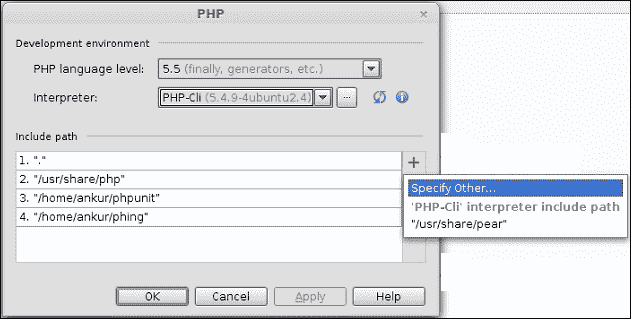

## 它是如何工作的...

由于你已经将 PHPUnit 作为包（PHAR）安装，测试系统将在你继承（或扩展）位于 `phpunit` 目录下 `phpunit-lts.phar` 目录和名为 `PHPUnit_Framework_TestCase` 的框架子目录中的类时立即启动。

# PHPUnit 中的测试用例

成功安装 PHPUnit 后，你的挑战还没有结束——它只是引出了一系列新的挑战。测试不是一件容易的事情，但它很有趣。就像你喜欢编写漂亮的 PHP 代码一样，你也会喜欢在 PHPUnit 中编写测试用例，因为它就像编写 PHP 代码的同时注意一些约定。

**测试用例**是一段专门编写来检查（或测试）另一个应用程序中某些条件的应用程序代码的一部分。因此，当你编写测试用例时，你实际上是在编写 PHP 代码来测试其他 PHP 代码（即你编写的满足业务需求的代码）中是否出现了错误。

在这里，很重要的一点是指出，作为程序员，你通常有以下观点：

+   你认为既然你非常了解你的代码，你就知道你的代码没有错误

+   即使你的代码中存在一些错误，由于你对代码了解得很深，你可以迅速修复它们

+   你认为你在编写测试用例上浪费的时间可以更好地用于编写更多的代码

这些（以及许多类似）点是错误的。你需要编写测试用例。

## 如何操作...

要创建一个新的测试用例，你需要创建一个新的 PHPUnit 类。因此，执行以下步骤：

1.  转到**项目**视图。

1.  选择你想要测试的文件。这个文件应该是一个有效的 PHP 类。这是一个明显的陈述。

1.  从右键单击上下文菜单中选择**新建** | **PHPUnit** | **PHPUnit 测试用例**，如图所示：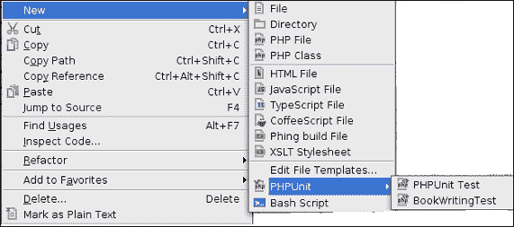

1.  提供名称和相关细节，就像你创建新的 PHP 类时做的那样。

### 注意

你创建的测试用例将是这个类中具有公共访问修饰符的 PHP 方法。

## 它是如何工作的...

要查看测试用例的工作原理，你需要遵循一些约定。原因是，由于测试用例是 PHP 代码，它必须具有一些固有的功能。以下列出了这些约定，以便快速参考：

+   测试类应该与目标类具有相同的名称。因此，在`XXXTest.php`文件中创建`XXXTest`，假设要测试的类名为`XXX`。

+   所有测试类都应该扩展（继承）`PHPUnit_Framework_TestCase`类。当你将 PHAR 包含到你的 PhpStorm 项目中时，这个类就对你可用（正如我们在本章的*安装 PHPUnit*小节中看到的）。

因此，你的`XXXTest`类将具有以下声明：

```php
class XXXTest extends PHPUnit_Framework_TestCase{
..
}
```

测试类中要测试的确切方法应该以`test`开头，后跟要测试的方法名。

并非你的测试仅仅因为这个原因就会失败，但这是一种标准的命名约定。

没有任何约束要求你将一对一的测试方法映射到单个目标方法。这同样只是一种良好的实践。

因此，考虑到要测试的方法名为`YYY`，你的测试类中的测试将具有以下声明（定义）：

```php
public function testYYY(){
  ...
}
```

根据约定，你应该在单个方法中编写一个测试。这有助于更好地组织代码，并使其更容易理解。

实际的测试是通过断言一些事实来完成的。这些事实是你将要测试的方法的输出。因此，如果某个方法返回一个字符串，你可以通过编写以下代码行来检查该方法返回类型是否为`string`：

```php
   $this->assertInternalType("string", $methodReturnValue);
```

测试类应该在`setUp`方法内部包含常见内容。这在需要在这个类的所有测试方法中共享一段代码的情况下特别有用。是否使用它由你决定。

在被调用的测试方法结束时，你可能不需要保留资源。你可能想要将其从内存中删除。

在这里，记住这一点非常重要，你应该始终明智地设计你的测试。你应该始终防止在测试中产生不必要的内存使用，因为一旦你做到了这一点，你将不得不在这个测试类上添加另一个测试。

了解了测试用例的细微差别，你现在已经准备好进行测试了。这是故意滥用字母表中的字母来提醒你！

无论你做什么，PhpStorm 都会帮助你。所以，不要等待和思考要做什么，准备就绪，出发吧！

# 使用 PHPUnit 测试应用程序

你心中可能有一个关于 PhpStorm 在这个测试中作用的问题。现在是采取行动的时候了。有了足够的关于编写测试的规范知识，你可以进入测试的真正世界。你测试得越多，你的代码就会越纯净。测试是好的。测试是健康的。测试是推荐的。

## 如何做...

好问题。这个问题最好通过回到过去，回到相同的比萨饼烹饪用例来回答。你从小就听着奶奶的建议去重复使用物品。现在是你重复使用的时候了。执行以下步骤：

1.  重复使用`PizzaDish`类。你将创建一个类似于以下测试类：

    ```php
    require_once "PizzaDish.php";
    class PizzaDishTest extends PHPUnit_Framework_TestCase {

      function setUp(){
        $this->pizzaDish = new PizzaDish("Pizza Dish", "Dish");
      }

      function tearDown(){
        unset($this->pizzaDish);
      }

      public function testGetInstance(){
        $this->assertInstanceOf('Dish',
        $this->pizzaDish->getInstance());
      }

      public function testGetDishName(){
        $this->assertInternalType("string", 
        $this->pizzaDish->getDishName());
      }
    }
    ```

    正如承诺的那样，你可以看到 PHPUnit 完全是关于编写 PHP 类。

1.  要执行这个测试，你需要运行（执行）这个类。

1.  运行这个类非常简单。*Ctrl* + *Shift* + *F10*是你的救星。

1.  如果你只想运行一个方法，PhpStorm 也为此提供了支持。你只需将光标放在你想要执行的方法体内任何位置，然后发出运行命令。

    ### 小贴士

    如果光标不在方法体内，整个测试类将被执行。

以下截图显示了测试结果：

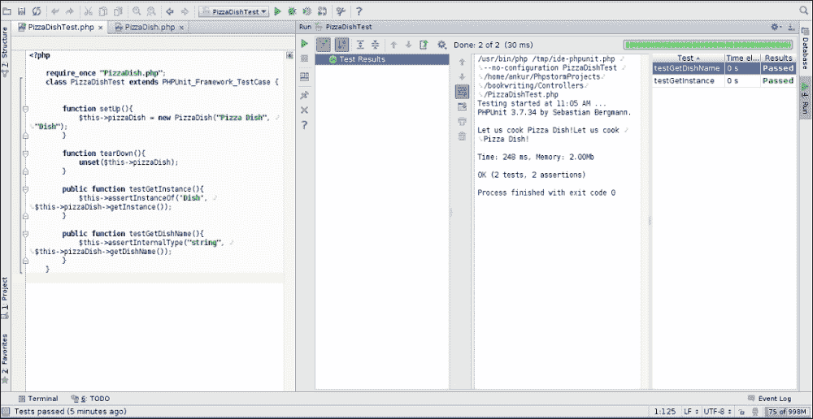

## 它是如何工作的...

为了执行你的单元测试，PhpStorm 进行了一些改进。就像它对其他每个库所做的那样，它使用自己的执行脚本来执行测试。该文件的完整名称是`/tmp/ide-phpunit.php`。因此，正是这个文件接受你编写的测试类文件的名称。

测试应用程序的工作原理很简单。正如已经提到的，所有继承自`PHPUnit_Framework_TestCase`类的类都成为测试类。`setUp`方法实例化目标类`PizzaDish`的对象，并将其提供给整个测试类。

在你的测试类内部，当你运行测试时，`testGetInstance`和`testGetDishName`方法会被执行。在测试方法内部，会实例化一个新的对象以启动实际的测试过程。直到这一点，你所做的活动与 PHP 类的活动相同。在方法内部，有一些断言执行实际的测试。有这些特殊的方法，即`assertInstanceOf`和`assertInternalType`，这些方法是在框架提供的`Assert`类中声明的。你可以通过将光标放在方法名下并按*Ctrl* + *Q*来查看该方法的文档。这些是实际通过检查给定的断言是否为真来执行测试任务的方法。因此，你创建的测试类的目的是检查是否实例化了所需的类，以及你想要烹饪的菜名是否为`string`类型。

### 注意

一旦运行测试，你将能够在通常的运行视图中看到测试结果，该视图可以通过*Alt* + *4*访问。

# 开始调试会话

> *"现在是所有程序员开始调试他们的代码的时候了"*

与大多数 IDE 一样，PhpStorm 也使用一个错误图标来显示调试器。就像虫子吸血并让你无法专注于主要任务一样，软件错误可以消耗宝贵的 CPU 周期，并阻止你的软件按预期工作。

为了防止此类错误进入软件的生命周期，你需要进行调试。调试是一个深入代码的过程，找出可能成为代码中问题区域的潜在区域，因此需要进行广泛的查找以发现和修复错误。

用于此目的的工具在业界被称为调试器。**Xdebug**是此类工具的名称。它是一个非常常用、免费且开源的调试器，可以与大多数 IDE 连接。

## 准备工作

要连接它，你需要在你的开发机器上安装它。执行以下步骤：

1.  从**GitHub**检出源代码，这是 Xdebug 托管的地方。你需要在终端中发出此命令`git clone git://github.com/xdebug/xdebug.git`。

1.  进入已检出代码的目录。

1.  发出`phpize`命令。当你这样做时，控制台将输出大量文本。一旦输出完成，你需要执行配置文件，它恰好是一个可执行的 shell 脚本。

1.  在配置时，你需要使用`--enable-xdebug`开关启用`xdebug`。因此，你应该写`./configure --enable-xdebug`。

1.  完成这些后，你需要发出`make && make install`命令以完成编译。

1.  步骤的输出将是一个模块——确切地说是一个共享对象或 `.so` 文件，您需要在 PHP 设置中指定它。请记住这一点。

1.  在适当的 `ini` 文件中，您需要写下以下代码：

    ```php
    zend_extension="/path/to/compiled/xdebug/so/xdebug.so" 
    xdebug.remote_enable=On
    xdebug.remote_host=localhost
    xdebug.remote_port=9000
    ```

1.  为了知道您的 PhpStorm 使用哪个 `php.ini` 文件，您需要转到 **工具** | **运行命令** 并执行命令 `php --ini`。您将获得所有解析的 `.ini` 文件列表。现在您有了正确的 `.ini` 文件来做出更改。

    ### 注意

    此外，还有一个快捷键，*Ctrl* + *Shift* + *X*，它打开命令行工具控制台。

安装了强大的调试器后，您可以继续使您的代码无错误。

## 如何做到这一点...

仅针对基于 Web 的 PHP 应用程序启动调试会话。为了能够启动 Web 应用的调试，请执行以下步骤：

1.  您需要有一个，比如说 Chrome 的 `xdebug` 辅助工具。它帮助您在输入 URL 后启动调试会话。

1.  您知道，对于客户端，应该有一个服务器，这样当您尝试启动调试会话时，必须有监听传入连接的监听器。

1.  因此，您需要启动传入调试连接的监听器。为此，您需要转到 **运行** | **开始监听调试连接**。

1.  第一次启动会话后，PhpStorm 会显示有关某些条目的警报，如下一个信息框后的截图所示：

    ### 注意

    确保已勾选 **可以接受外部连接** 的复选框。这可以在 **设置** | **PHP** | **调试** 中找到。

    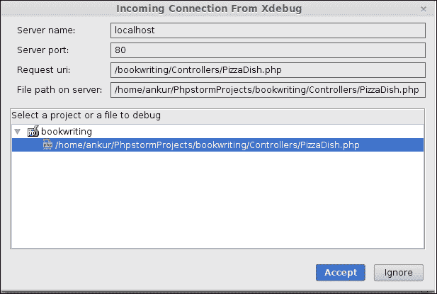

## 如何工作...

一旦您接受连接，PhpStorm 会将其保存。已保存的服务器可以在 **文件** | **设置** | **PHP** | **服务器** 下稍后查看。从这一点开始，基于 Web 的应用程序和命令行应用程序的调试过程将相同。因此，调试器将查看代码中的任何变量，并根据您提供的断点，暂停、继续、逐行或跳过代码，从而使您能够非常容易地看到代码内部正在发生什么。

### 小贴士

您也可以访问 [`www.xdebug.org/wizard.php`](http://www.xdebug.org/wizard.php) 了解更多关于您服务器上 `xdebug` 安装的详细信息。

# 设置断点

代码中的断点是指您希望程序执行暂停的（或代码行）。当您在烤披萨并添加配料时，假设您想知道在任何时刻即将添加哪种配料，您可以设置一个断点，使解释器暂停在包含即将添加的配料名称的变量的那一行。设置断点后，您可以在调试窗口的变量框架中看到变量的值。

断点有两种类型，如下所示：

+   **永久断点**：一个常规断点是指它将一直存在，直到您手动移除它

+   **临时断点**：另一方面，临时断点是在满足某些条件时被移除或禁用的断点，最常见的条件是触发。

## 如何操作...

1.  要设置一个常规断点，您需要通过将光标放在可疑代码行下选择该行代码。

1.  前往**运行** | **切换行断点**。

1.  在左侧面板上将会创建一个红色圆圈，以提供视觉指示，表明该行是一个断点。

1.  您可以使用键盘快捷键 *Ctrl* + *F8* 做同样的事情。

## 如何工作...

断点允许您查看变量栈的状态。因此，当解释器在断点处停止时，您可以查看程序执行中涉及的变量的内容。如果您添加了一些变量或表达式到**监视**中，您可以在当前作用域内始终查看所选变量的内容，只要它保持在该作用域内。在执行的其他所有时间，都会显示消息**无法评估表达式**。调试器向解释器提供指令，在断点被触发时暂停执行。根据请求，调试器指示解释器将（输出）消息写入控制台（对人类眼睛来说，这看起来像是 PhpStorm 完成了这项工作！）

# 配置断点条件

PhpStorm 提供了自定义断点的方法。因此，您有更多的舒适度来坐下来享受调试过程，同时确保您的任务能够按时完成。

## 如何操作...

1.  一旦您设置了断点，您可以按 *Ctrl* + *Shift* + *F8* 来获取一个配置面板。使用该面板，您可以将常规断点更改为临时断点。

1.  勾选**一旦触发则移除**选项旁边的复选框。这样，该断点只会在断点被触发一次后存在。

1.  您可以选择**将消息记录到控制台**，以便在断点被触发时输出。

1.  您可以通过勾选**记录评估表达式**复选框来创建一个表达式，一旦这个断点被触发就会进行评估。您也可以有条件地使这个断点保持休眠状态。

1.  您可以告诉 PhpStorm 激活此断点，使其保持禁用状态，直到抛出特定类型的异常，如以下截图所示：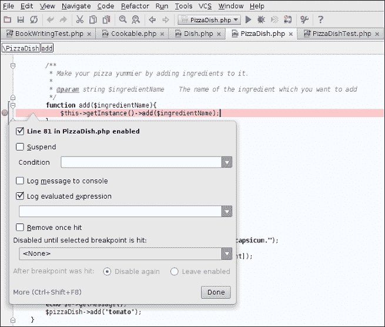

## 如何工作...

再次强调，关于断点是如何工作的，并没有逻辑上的解释。您需要遵循显示的步骤，PhpStorm 会为您完成这项工作。其工作原理与操作系统有关。

### 小贴士

在弹出窗口仍然打开时，您可以按 *Ctrl* + *Shift* + *F8* 来获取一个更大的面板，您可以在其中查看代码，同时仍然保持控制面板打开。

如以下截图所示：

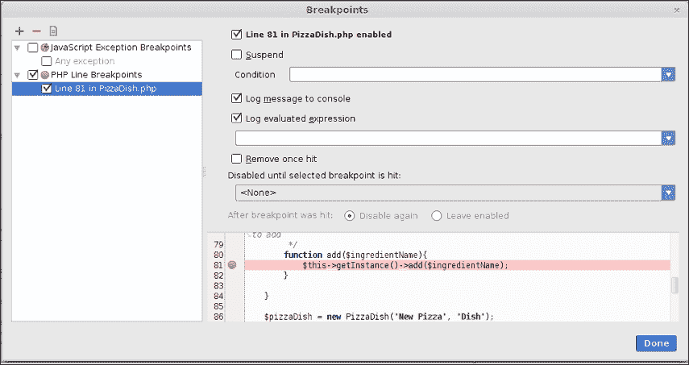

# 创建异常断点

您的大脑需要吸收新的信息。直到这个时间点，您都认为只有在怀疑某些代码行可能有问题时，才能手动创建断点。但实际上，您可以在遇到异常时创建一个断点。这种类型的断点被称为**异常断点**。您可能会想，“为什么会有这个名字？”这个断点在遇到异常时被激活。

## 如何操作...

要创建一个新的异常断点，您只需记住几个小步骤：

1.  在编辑器内部，按*Ctrl* + *Shift* + *F8*，那里将弹出一个窗口。

1.  在左上角，有一个**+**号，按它，您将获得创建异常断点的选项。

1.  在继续之前，您将被要求输入希望执行停止的异常名称。

1.  您还可以自定义断点行为的方式。您可以要求 PhpStorm 在代码中抛出意外（或未捕获）异常时激活此断点，如下面的截图所示。这对于明智的程序员来说特别有帮助，因为大多数预期的异常已经包含在代码中。除了这个不同之处外，适用于一般断点的所有其他规则也适用于异常断点。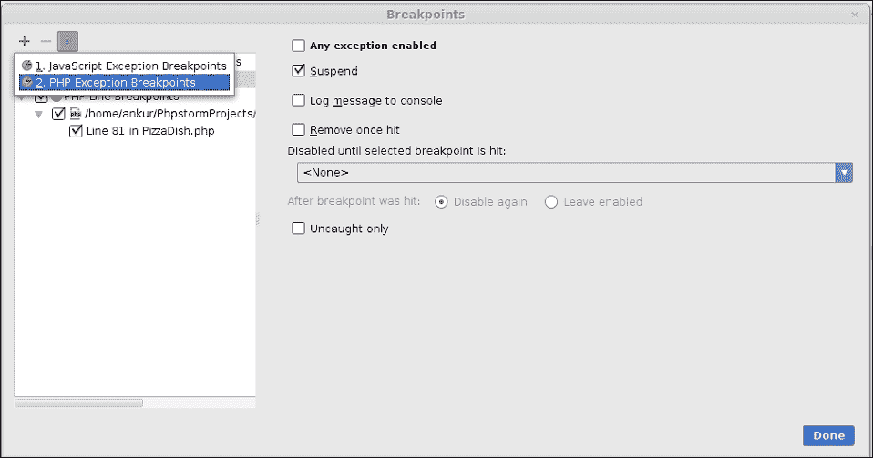

    ### 注意

    一旦触发，您就不能禁用异常断点。换句话说，您不能创建一个临时的异常断点。

1.  如果您希望异常断点在某些条件下被激活，您可以暂时禁用异常，直到另一个异常发生或另一个断点被触发。PhpStorm 为您提供了从断点列表中选择选项的功能。

    ### 小贴士

    为了避免在决定选择哪个异常时费尽心思，您可以选择将异常设置为`Exception`类。这可能会很有用，因为所有异常类最终都继承了这个`Exception`类。

## 它是如何工作的...

执行将继续以正常方式进行——如果您设置了断点，将会有暂停，就像以前一样。但现在，执行将在异常发生时暂停。因此，这个异常断点是一个不可见的断点，您将看不到它，但内部它将是活跃的。作为一个断点，它将继续像断点一样工作。

# 逐步执行您的代码

生活时刻都在教导我们新的课程。对于所有那些发现短语“逐步执行代码”是新的你们来说，这是一个分析变量值、控制结构和方法调用层次的过程。这个过程包括三种类型的逐步执行：

+   **进入**

+   **跳过**

+   **跳出**

## 准备工作

你真的需要逐步执行代码吗？当然需要。什么时候？当你需要找出代码中的瑕疵时。当你需要知道整个程序中的下一行时，你必须进入代码。当你需要知道整个程序中的下一行将要执行时，你必须跳过代码。当你需要知道所选方法之后的下一行时，你必须从代码中退出。

## 如何操作...

为了逐步执行代码，你只需处于调试会话中。其余的只是点击或键盘快捷键的事。执行以下步骤：

1.  从逐步执行代码开始。当你的调试会话处于活动状态时，你需要按*F8*或选择以下截图所示的按钮：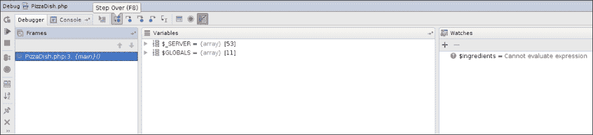

1.  为了进入代码，你只需按*F7*或选择以下截图所示的按钮：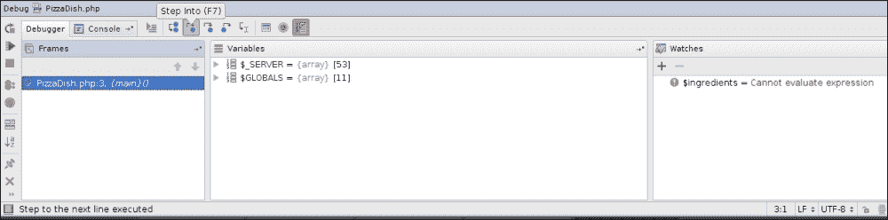

1.  为了从代码中退出，你需要使用键盘组合*Shift* + *F8*或选择以下截图所示的按钮：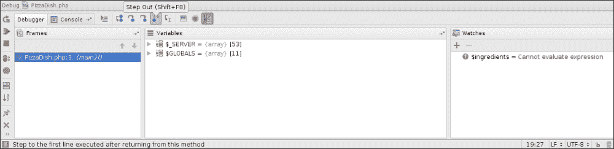

## 它是如何工作的...

一旦你使用了任何逐步执行的方法，你显然会想知道幕后发生了什么。一个非常高级的解释会告诉你，当你进入代码时，调试器会带你到程序中的下一行。一旦你在代码的下一行，你可以在该代码行上执行很多检查，例如变量的内容。

一旦你进入代码，调试器实际上会显示在同一程序文件或另一个程序文件中立即执行的下一行。一旦显示，你可以在该代码行上再次执行很多检查。

一旦你从代码中退出，调试器会显示在当前方法执行之后将立即执行的下一行。如果调试器无法找到这样的行，执行将以通常的方式完成，就像没有调试器一样。

### 注意

在尝试*F8*、*F7*和*Shift* + *F8*等快捷键之前，你必须有一个调试会话。

# 跳转到选定的代码行

如果你不想在代码中设置断点，但仍然希望调试器在代码的某个点中断，你找到了正确的配方，正在阅读正确的文本。这也适用于你设置的断点已经执行或跳过，但你仍然怀疑另一行有错误。

## 如何操作...

1.  要让 PhpStorm 告诉调试器在某个你选择的任意点中断，你应该使用 **运行到光标处** 选项。作为先决条件，你必须将光标放在程序中的某一行代码上。完成这个步骤后，你现在需要转到 **运行** | **运行到光标处**，PhpStorm 将会顺从地（并且礼貌地）请求 Xdebug 在光标所在的位置暂停。这和常规断点的情况是一样的行为。

1.  有三种情况需要考虑：

    +   第一种情况是你刚开始调试代码；执行将在你指定的行上暂停。

    +   另一个情况是当你已经在代码中指定了一个断点，并且调试器已经超过该断点（显然是在暂停之后），调试器将再次在指定的行上停止。

    +   第三种情况是当你指定了一行根本不会执行的代码——如果你有辣椒，你不会加番茄。在这种情况下，执行将继续到那一行之后，并移动到下一个断点或完全结束。

    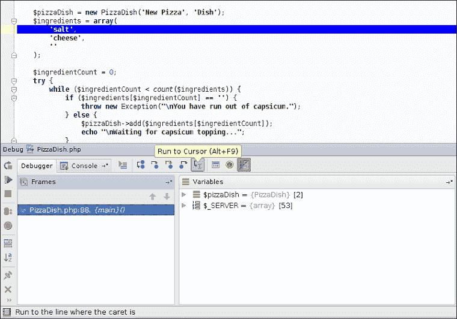

## 它是如何工作的...

魔法的运作原理非常简单易懂。就像临时断点一旦触发就会消失一样，这个 **运行到光标处** 选项也是以同样的方式工作的。因此，你放置光标的代码行变成一个临时断点，具有额外的不可见特性。因此，一旦断点被触发一次，它就会自动无痕地移除。如果有一行永远不会被执行，调试器将简单地忽略代码中的这个位置并继续前进。

### 注意

键盘快捷键可以提升你的速度。使用 *Alt* + *F9* 来快速操作。

# 观察表达式和变量

调试器的最重要的功能是它实际上为你提供了 X 光眼镜，让你可以看穿不透明物体。

这种看穿不透明物体（称为执行）的现象被称为 **监视**。它与现实世界的监视是同义的。你监视某物吗？你不断地关注你所监视的周围发生的事情。爸爸说，“我会看到你，儿子”，无论地点如何，儿子担忧的问题就会出现。但是，PhpStorm 的监视功能会让你担忧吗？

## 如何操作...

如果你决心要观察一个变量的位置和活动情况，你可以让 PhpStorm 帮你完成。当你开始调试时，在调试窗口中，默认打开三个框架：**框架**、**变量**和**监视**。要将变量添加到监视功能中，有两种方法：

+   如果那个变量出现在到那个点为止被覆盖的变量列表中，你可以选择该变量，访问右键点击的上下文菜单，从列表中选择 **添加到监视** 选项。你会看到监视部分将添加一个变量，就像这个一样。

+   如果该变量未出现在变量列表中，您无需担心。如果您记得您怀疑的变量名，您可以直接在监视变量列表（在**监视**窗口中）下添加它，通过选择**+**符号并在出现的文本框中输入变量的确切名称，如图所示：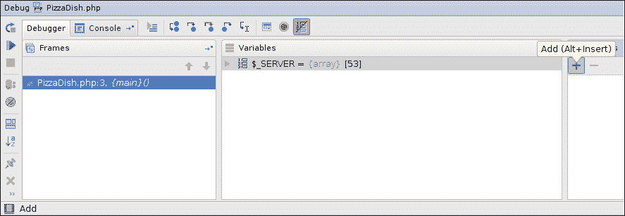

PhpStorm 还允许您以与变量相同的方式添加监视表达式。您只需像在编辑器内部编写一样编写一个表达式即可。PhpStorm 会处理其余部分。

## 它是如何工作的...

当一个变量被置于监视之下时，PhpStorm 会简单地将其内容输出到控制台，这恰好是一个监视窗口。因此，被监视的变量在程序执行（调试）的整个过程中始终保持可见。如果变量值发生变化，变化将立即反映在监视窗口中。如果在执行过程中变量超出了作用域，变量的内容将变为**无法评估表达式**。因此，您可能会觉得内容不可用，尽管实际上内容是可用的。

对于表达式也是如此。IDE 将其视为正常内容，并尝试始终显示其值。就像在监视正常变量的情况下发生的那样，如果表达式包含当前作用域中未覆盖的变量，表达式将评估为**无法评估表达式**。

### 小贴士

请务必记住使用变量的*确切*名称。

# 飞行中更改代码

根据没有调查，已经确定大多数编程错误是由于数据类型和值的不确定性引起的。调试器的真正效用在于您在执行过程中可以自由地干预生成的数据。因此，您实际上可以更改解释器在您与代码中的错误作斗争时覆盖的变量的值。

这在您必须设置文本容器的宽度，但又无法确定文本容器的最大宽度的情况下尤其有用。

## 如何操作...

1.  在此场景中，**调试**视图是您的朋友。关注**变量**框架。

1.  要给变量赋值，从可用的变量列表中选择它。

1.  访问右键单击上下文菜单。选择**设置值**选项，并在出现的文本框中提供一些值。按下回车键后，您立即完成。

1.  从现在开始，无论何时访问这个变量，它都将假定这个特定的值。执行此操作的快捷键由 PhpStorm 提供，即*F2*。

## 它是如何工作的...

到目前为止，您肯定已经轻松猜到调试器位于您的代码和解释器之间。因此，当您给一个变量赋值时，调试器通过传递更改后的值作为原始值来“欺骗”解释器。解释器，一个可怜的盲生物，通过假设值是代码中指定的值，并使用这个值继续前进，而陷入了这种困境。

世界根本不被信任！

### 注意

当您给一个变量赋值时，并不意味着值将固定，而不考虑业务逻辑。一旦满足变量将更改其值的条件，变化就会像没有调试器时一样正常发生。

# PhpStorm 中的代码覆盖率

在将平台设置为编写干净代码并从代码中移除错误以制作好软件之后，您肯定在想，您的任务已经完成，现在您可以坐下来放松了。

现在还不是时候！还有更多的事情要做。既然您承诺您不会感到疲倦，您不会失败，您内心必须燃烧着继续前进的火焰。这次，您将进行代码覆盖率。是的，您没有看错，代码覆盖率。

现在您已经对测试系统（**PHPUnit**）和调试系统（**Xdebug**）有了实际的知识，这是了解这种现象的合适时机。代码覆盖率是由 PHPUnit 和 Xdebug 提供的联合功能带来的现象。这意味着，如果您真的想要代码覆盖率，您必须在您的开发机器上安装这两个系统。

## 准备工作

为了解决这些事情，出现了代码覆盖率。不，不，不要认为代码覆盖率会移除未使用的行——将是你移除它们。覆盖率会告诉你从哪里移除未使用的行。因此，代码覆盖率是一种检查在执行过程中哪些代码行被覆盖，哪些代码行没有被覆盖的现象。您内心充满了疑问——那么 PhpStorm 在这个问题中扮演什么角色呢？当您进行代码覆盖率时，您会得到一个视觉指示，告诉您哪些行没有被覆盖。正是这个 PhpStorm 功能负责管理这种视觉指示给您。

## 如何操作...

再次覆盖 PHP 代码需要一些 PHP 代码。您必须编写世界上的一切！编写测试的简单方法是为目标类编写测试。框架（PHPUnit）将尝试覆盖整个类。在这种情况下，您在编写代码时不需要做任何新的工作，因为变化发生在您尝试运行测试时。

PhpStorm 中有一个选项可以让您运行带有覆盖率测试。为此，您需要执行以下步骤：

1.  您需要选择测试文件并转到**运行 | 运行** `<test>` **带有覆盖率**，如图下所示截图。

1.  目标文件将以常规方式测试，并且整个文件的覆盖率也将得到处理。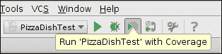

1.  然而，假设你想覆盖代码的一部分或一个方法，你也可以做到。PHPUnit 提供了一个名为`covers`的注释。使用这个注释，你可以告诉 PHP 解释器你只想覆盖目标类中的选定部分。

1.  因此，如果你只想测试(target) `PizzaDish`类中的`getDishName`方法，你可以在`PizzaDishTest`类中`testGetDishName`方法声明之前使用如下代码：

    ```php
    /**
      * @covers PizzaDish::getDishName
    */
    public function testGetDishName(){
      $this->assertInternalType("string",
      $this->pizzaDish->getDishName());
    }
    ```

1.  在你的编程生涯中，会有一些时候你不想做任何有趣的事情。你只是想测试代码，而不覆盖任何代码——你只想测试。你有选择。有一个名为`coversNothing`的注释可用。这是告诉 PHPUnit 框架“好的，伙计，你只会为我进行测试。不要浪费时间在覆盖代码上。”的一种方式。因此，你可以编写如下代码：

    ```php
    /**
      * @coversNothing
    */
    public function testGetInstance(){
      $this->assertInstanceOf('Dish', $this->pizzaDish- >getInstance());
    }
    ```

使用了注释后，你成功操作了代码覆盖率的功能。恭喜你！

## 如何工作...

注释是 PHP 中的特殊功能，为解释器提供一些信息以执行某些工作而不发出声音。因此，当你写下`@covers <Classname>::<Method-name>`时，你是在告诉解释器覆盖目标类中的某些代码。同样，当你写下`@coversNothing`时，解释器理解它不需要进行覆盖率。

因此，PhpStorm 通过用特定颜色给你的代码区域着色来提供视觉指示，表示覆盖率和不覆盖。当你运行带有覆盖率的测试时，编辑器窗口的右下角会显示覆盖率视图，如下面的截图所示。你可以查看刚刚测试过的代码的统计数据（包括覆盖率）。

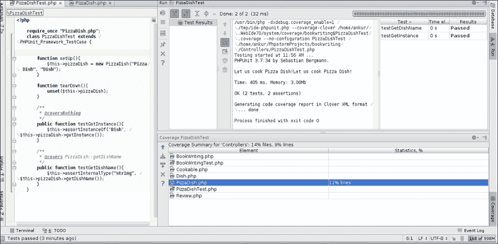

你也会得到视觉指示。它显示在目标类的编辑器窗口中（这里为`PizzaDish.php`，如下面的截图所示），红色区域表示未覆盖。

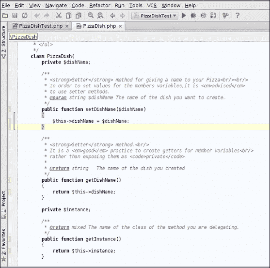

## 更多内容…

现在我们已经学习了 PhpStorm 中的代码覆盖率，是时候看看代码覆盖率的目的了。

### 代码覆盖率的目的

再次，你心中可能又出现了同样的疑问：我为什么需要代码覆盖率呢？答案并不明显，但了解这一点是很有价值的。你同意代码中存在错误，所以你使用了某些调试工具来找出并移除这些错误。你同意你实现的算法有时会失效，所以你对其进行了测试并修复了它。但你是否曾有过一种感觉，认为你编写的代码中可能存在未使用的行？可能存在一些解释器无法处理的行，也可能存在一些在某个条件下永远不会被满足的行。谁会考虑到这些以及其他许多类似的情况呢？另一个可能会出现在你脑海中的问题是：“当你可以在代码中添加注释行时，多一行代码有什么危害？”答案就在这里。

注释是解释器不会关心的事情，但一个活跃但未使用的行是解释器会关心的事情。这就像你在射击结束后，腰间绑着一把手枪在厨房里走来走去。你需要在厨房里放一把手枪吗？为什么你要随身携带它呢？
