# 第六章。在团队中使用 PhpStorm

在本章中，我们将涵盖以下食谱：

+   获取版本控制系统服务器

+   创建版本控制系统仓库

+   将 PhpStorm 连接到版本控制系统仓库

+   将 PhpStorm 项目存储在版本控制系统仓库中

+   将文件提交到版本控制系统仓库

+   从版本控制系统仓库更新代码

+   将你的代码与 VCS 仓库同步

+   检查版本控制系统仓库

+   从版本控制系统仓库检出项目

+   创建代码补丁

+   创建 VCS 标签或分支

+   为团队创建任务

# 简介

> *罗马不是一天建成的。也不是由一个人...*

无论你玩什么运动或去哪里，它始终是一项团队运动。他们总是说团结就是力量，分裂就是失败。一个 PhpStorm 食谱作者也曾说过，重新发明轮子是一种应该避免的行为。因此，你应该始终在团队中工作。原因很明显：将任务分配给团队可以更快地完成。

根据软件工程的一个原则，你应该在两个人的团队中编程。这样，你们两个人都将在开发阶段本身发现彼此代码中的错误。

那么，当你在一个团队中工作时，你将如何在一个其他人正在另一个模块上工作的应用程序开发中进行工作？一种方法是用同一台机器编码，这样你就可以从另一个人停止工作的地方继续。但是，等待是否明智？如果你在不同的班次工作，这是可以接受的。但是，如果那个人地理位置上离你很远呢？即使一切都很顺利，如果你需要第三个人加入团队，那个人在哪里工作？如果你工作 8 小时，在任何时刻最多有三个人在项目上工作。这种基础设施的低效使用！

你对代码仓库有什么看法？当有人在你面前说**版本控制**或**源控制**时，你有什么想法？你对 VCS... VCS 作为**版本控制系统**有什么了解？

软件版本是什么意思？

为了得到答案，你已经步入了版本控制系统的世界。欢迎！

# 获取版本控制系统服务器

你必须采取的第一个行动是决定你要使用哪个版本的 VCS。有几种系统可供选择，例如 Git 和 Subversion（通常称为 SVN）。这是一款免费的开源软件，你可以下载并安装在你的开发服务器上。还有一个名为**并发版本系统**（**CVS**）的系统。两者都旨在为你提供代码版本控制服务。SVN 比 CVS 新，据说比 CVS 快。由于 SVN 是较新的系统，并且为了向你提供有关最新事项的信息，本文将仅关注 Subversion 的功能。

## 准备工作

因此，最终那个时刻已经到来，你将通过为你的团队获取一个 VCS 系统来开始团队合作。在开发系统上安装 SVN 可以有两种方式：简单和困难。困难步骤可以不考虑而跳过，因为那是为想要为 Subversion 系统做出贡献的开发者准备的。由于你正在处理 PhpStorm，你需要记住更简单的方法，因为你还有更多的事情要做。

## 如何操作...

安装步骤非常简单。在基于 Debian 的系统中，有这个 **aptitude** 工具可用，而在基于 Red Hat 的系统中，有 Yum 工具可用。执行以下步骤：

1.  你只需要发出命令 `apt-get install subversion`。操作系统的包管理器将为你完成剩余的工作。在很短的时间内，在命令行控制台充斥着消息之后，你将安装好 Subversion 系统。

1.  要检查安装是否成功，你需要发出命令 `whereis svn`。如果有消息，则意味着你已成功安装 Subversion。

    ### 注意

    如果你不想在你的开发系统上承担安装 Subversion 的负担，你可以使用商业第三方服务器。但这更多的是一种解决问题的门外汉方法，而且没有任何 PhpStorm 烹饪书作者会推荐你这样做。你是一名软件工程师；你不应该轻易放弃。

## 它是如何工作的...

当你安装版本控制系统时，你实际上是在安装一个服务器，该服务器为版本控制客户端提供版本控制服务。默认情况下，版本控制服务监听端口 `3690` 的远程客户端的传入连接。

## 还有更多...

如果你想要安装较旧的配套软件，CVS，你可以用类似的方式安装，如下面的步骤所示：

1.  你需要下载 CVS 服务器软件的存档。

1.  你需要使用你喜欢的解压缩软件将其从存档中解压出来。

1.  你可以将其移动到另一个方便的位置，因为你将来不需要打扰这个文件夹。

1.  然后你需要进入目录，编译过程将从这里开始。你需要执行 `#. /configure` 来创建构建目标。创建目标后，你需要输入 `#make install` 以完成安装过程。

由于它是较旧的软件，你可能不得不从源代码编译，作为唯一的替代方案。

# 创建 VCS 仓库

更多时候，期望 PHP 程序员了解一些系统概念，因为经常需要更改 PHP 解释器的设置。这些更改可能是改变执行时间或添加/删除模块等形式。为了开始团队合作，你将不得不通过系统操作来亲自动手。

## 准备工作

您需要在开发服务器上创建一个新的仓库，这样 PhpStorm 才能作为客户端进行连接。在这里，重要的是要注意 SVN 客户端和 SVN 服务器之间的区别——SVN 客户端可以是以下任何一种：独立客户端或 IDE 等嵌入式客户端。另一方面，SVN 服务器是一个单一的项目。它是在您选择的服务器上持续运行的过程。

## 如何操作...

在执行此活动时请务必小心，因为一个错误可能会毁掉您的努力。请按照以下步骤操作：

1.  您需要了解一个名为`svnadmin`的命令。使用此命令，您可以在服务器上创建一个新的目录，其中将包含代码库。再次提醒，在选择服务器上的目录时请务必小心，因为它将出现在您 SVN URL 的其余部分中。该命令应按以下方式执行：

    ```php
    svnadmin create /path/to/your/repo/

    ```

1.  在服务器上创建了一个新的仓库后，您需要对服务器进行一些设置。这只是正常现象，因为每个服务器都需要配置。

1.  SVN 服务器配置位于`/path/to/your/repo/conf/`下，文件名为`svnserve.conf`。在文件内部，您需要做出三项更改。您需要在文件底部添加以下行：

    ```php
    anon-access = none
    auth-access = write
    password-db = passwd
    ```

必须有一个密码文件来授权允许使用仓库的用户列表。在这种情况下，密码文件将被命名为`passwd`（默认文件名）。文件中的内容将是多行，每行包含一个用户名和相应的密码，格式为`username = password`。

### 注意

由于这些文件是按照特定的算法由服务器扫描的，因此您不能在文件中留下故意空格——在这些情况下将显示错误消息。

在进行了适当的设置后，现在您可以启动 SVN 服务，以便 SVN 客户端可以访问它。

您需要发出命令`svnserve -d`来完成此操作。

### 小贴士

总是检查您所做的是否正确是一个好习惯。为了验证正确的安装，您需要发出命令`svn ls svn://user@host/path/to/subversion/repo/`。

输出将如以下截图所示：

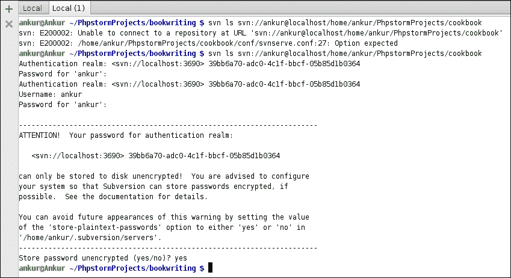

## 它是如何工作的...

`svnadmin`命令用于在 Subversion 服务器上执行管理任务。`create`选项在服务器上创建一个新的文件夹，该文件夹作为 Subversion 客户端的仓库。

服务器安装时默认创建配置文件。添加到文件中的内容实际上是控制 Subversion 服务器行为的配置指令。因此，所提到的设置防止了匿名访问并限制了某些用户的写操作，这些用户的访问详情在文件中提及。

命令`svnserve`又是一个需要在服务器端运行的命令，用于启动服务器实例。`-d`开关表示服务器应以守护进程（系统进程）的方式运行。这也意味着您的服务器将继续运行，直到您手动停止它或整个系统崩溃。

### 小贴士

再次提醒，如果您选择了第三方版本控制服务提供商，您可以跳过这一部分。

# 将 PhpStorm 连接到 VCS 仓库

软件的实际效用在于您使用它。因此，在安装了版本控制系统后，您需要准备好使用它。

## 准备工作

由于 SVN 是客户端-服务器软件，您已经安装了服务器，现在您需要一个客户端。再次提醒，您可能会很难找到好的 SVN 客户端。别担心；客户端已经由工厂内置在 PhpStorm 中。PhpStorm 的 SVN 客户端通过提供有关代码更改的详细信息，为您提供了加速开发任务的功能。所以，继续将 PhpStorm 连接到您创建的 Subversion 仓库。

## 如何操作...

为了将 PhpStorm 连接到 Subversion 仓库，您需要激活 Subversion 视图。

它位于**视图** | **工具窗口** | **Svn 仓库**。按照以下步骤激活 Subversion 视图：

1.  在激活了 Subversion 视图后，您现在需要将仓库位置添加到 PhpStorm 中。

1.  要做到这一点，您需要在您打开的视图的左上角使用**+**符号，如下面的截图所示：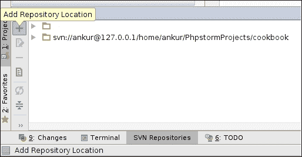

在选择**添加**选项时，PhpStorm 会询问仓库的位置。您需要提供仓库的完整位置。一旦您提供了位置，您将能够在按下**添加**按钮的同一 Subversion 视图中看到仓库。

在这里，您应该始终牢记正确的协议。这取决于您在开发机上安装 Subversion 系统的方式。

### 注意

如果您通过安装程序实用程序（`apt-get`或`aptitude`）进行了默认安装，您需要指定`svn://`。如果您已配置 SVN 通过`SSH`访问，您需要指定`svn+ssh://`。如果您已明确配置 SVN 与 Apache Web 服务器一起使用，您需要指定`http://`。如果您使用 Apache 通过安全协议配置了 SVN，您需要指定`https://`。

# 将 PhpStorm 项目存储在 VCS 仓库中

现在是团队合作的实际开始。即使您和其他团队成员已经连接到仓库，这又有什么优势呢？仅仅连接到版本控制仓库能解决什么问题？正确。真正重要的是您正在工作的代码。正是这些代码让您得以谋生。

## 准备工作

现在，你应该将项目存储在 Subversion 仓库中，以便其他团队成员可以工作并添加更多功能到你的代码。是时候将项目添加到版本控制了。并不是说你需要从头开始创建一个新的项目来添加到仓库。任何项目，任何你已完成并希望团队现在一起工作的项目都可以添加到仓库。鉴于当前环境中最相关的项目是烹饪项目，你可以尝试添加该项目。

就这样。

## 如何操作...

为了将项目添加到仓库，请执行以下步骤：

1.  你需要使用提供的菜单项**VCS** | **导入到版本控制** | **共享项目（Subversion）**。PhpStorm 会询问你一个问题，如下面的截图所示：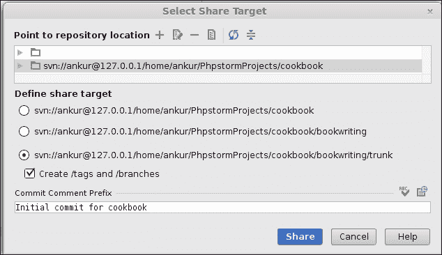

1.  选择正确的层次结构来定义共享目标——你的项目将被保存的正确位置。

1.  如果你希望在代码库中创建标签和分支，你需要选择相应的复选框。对提交的更改提供注释是良好的实践。

当你坐下来创建发布文档时，背后的原因就显而易见了。这也使得变更对其他团队成员来说更容易理解。PhpStorm 会询问你希望工作副本的格式。这与版本控制软件的版本有关。你只需微笑并选择最新的版本号，然后继续，如下面的截图所示：

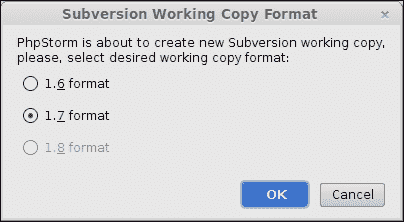

完成这些操作后，PhpStorm 现在会要求你输入你的凭据。

你需要输入配置文件中保存的相同凭据（参见*创建 VCS 仓库*配方）或服务提供商给你的凭据。你可以让 PhpStorm 为你保存凭据，如下面的截图所示：

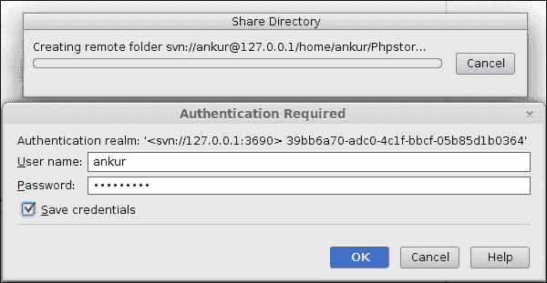

## 它是如何工作的...

这里值得理解幕后的情况。当你使用 PhpStorm 中的任何 Subversion 相关任务时，有一个内置的 SVN 客户端会为你执行命令。因此，当你将项目添加到版本控制时，代码会被赋予一个版本号。这使得版本控制系统记住代码库的状态。换句话说，当你将代码库添加到版本控制时，你添加了一个检查点，你可以在未来的任何时间点重新访问它，前提是代码库处于相同的版本控制系统下。

这是一个有趣的现象，不是吗？

## 还有更多...

如果你自己安装了版本控制软件，并且你没有设置将密码以加密文本的形式存储，PhpStorm 会提供一个警告，如下面的截图所示：

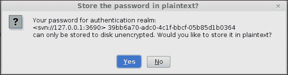

# 将文件提交到版本控制系统

让我们回到一个用例。到目前为止，`Dish`类的记忆可能已经被厚厚的灰尘覆盖，因为它已经有一段时间没有使用了。向前走，伙计。擦去灰尘，撕掉懒惰，从不同的角度看待事物。

## 准备工作

在你的大脑上施加一点压力（并且显然是阅读文档）会让你记住你匆忙中创建了`Dish`类。现在，你已经足够成熟，可以使用 PhpStorm 作为 IDE，你需要证明你在编程方面的实力。你需要使`Dish`类更加功能化。

## 如何做...

你可以从查看`Dish`类中的唯一方法开始。一旦你这样做，你将清楚地看到有一个`FIXME`标签。正如`FIXME`标签所述，在允许将其添加到菜肴之前，你应该检查有效的配料名称。这将防止任何不想要的配料被添加到你的菜肴中，从而破坏它。你需要指定两个更改：

+   你需要将参数默认值设置在方法签名中的某个值。

+   你需要检查名称是否有效，即非空且不包含无效元素。

因此，你将在`Dish`类中做出的更改将类似于以下截图：

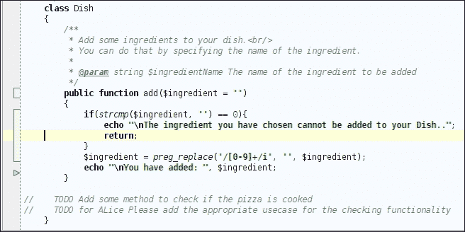

## 它是如何工作的...

使用像 PhpStorm 这样的 IDE 的一个主要好处是，对象以这种方式显示，你可以从中获得更多信息。当你进行更改时，PhpStorm 开始使用颜色向你指示更改。如果你添加一行，它将以绿色显示，当你删除一行时，它将以一个指向你右侧的灰色三角形表示。当你更改代码中的一行时，它将以蓝色显示。除此之外，当你提交代码时，版本控制编号会附加另一条信息，这条信息本身也非常重要。该信息包含提交代码的用户、提交日期、提交时间和修订号。修订号表示特定文件被更改的次数。

## 还有更多...

PhpStorm 作为一个谨慎的系统，为你提供了许多可供选择的功能。如果你启用**提交后自动更新代码/目录**，你可以告诉 PhpStorm 在提交后自动更新代码/目录。

如果你想在提交过程中保持文件锁定，可以在**保持文件锁定**旁边的复选框中启用此功能。

在提交操作之前，有一些与编程相关的任务。

你可以通过启用**重新格式化代码**选项来重新格式化你即将提交的代码。

你可以通过选择**优化导入**选项从即将提交的代码中删除未使用的导入/包含/要求。

你可以通过选择**执行代码分析**选项来分析你即将提交的代码。

如果你不小心将代码中的 TODO 推送到版本控制，启用**检查 TODO**选项，PhpStorm 可以警告你。你可以通过点击**配置**来配置你想要查看的 TODO。因此，在提交之前，PhpStorm 将显示你即将提交的文件/项目中创建的 TODO。

你甚至可以将提交的文件上传到你可能已经配置的 FTP 服务器。因此，PhpStorm 也可以为你部署代码！

PhpStorm 会持续通知你所有你更改的文件。自上次提交以来在本地更改的文件名称以蓝色显示。默认情况下，未更改的文件以黑色显示。如果你正在更改一个文件，而另一个团队成员恰好也在同一文件中进行了更改，将出现文本冲突，此类文件以红色显示。然而，此类冲突主要发生在更新过程中。

### 注意

你可以更改配色方案为你喜欢的样式。为此，你需要转到**文件** | **设置** | **编辑器** | **颜色与字体** | **差异**。

现在你的更改已完成，你需要提交代码以便其他团队成员可以使用。你需要访问右键点击的上下文菜单，选择**Subversion** | **Commit**。会弹出一个对话框，显示你将要执行的操作。一旦你确认更改没有问题，你可以继续提交文件。文件将再次变为黑色，表示它与版本控制系统同步。

### 小贴士

**避免问题**

并非你可以无问题地提交和提交。如果另一个团队成员在你更改的同一代码段中提交了代码，版本控制系统将通过提供警告并禁止你提交代码来防止代码的不一致性。它会显示一个消息，指出你正在工作的文件已过时。为了避免这个问题发生，你始终需要基于最新的代码库进行工作。因此，在提交之前，始终要更新。

# 从 VCS 仓库更新代码

你总是考虑你的团队。你总是认为你会以这种方式工作，成为你团队中最强的纽带。

## 准备工作

你将充当过滤器，清理团队成员编写的糟糕代码。你将成为你同伴编写的代码的同行评审员。你将为团队中某些人习惯编写的乱糟糟的代码添加文档。所有这些说完，你将如何实现这些目标？每次你计划开始成为团队中的詹姆斯·邦德时，你都必须从版本控制系统获取更新。

## 如何操作...

不幸的是，为了从版本控制系统中接收更新，PhpStorm 没有提供自动推送通知系统。然而，你可以执行以下步骤：

1.  您必须手动检查更新。但请放心，您只需记住几个导航链接，就能更新特定的代码、特定的文件夹或整个项目。

1.  更新链接可在**版本控制系统** | **Subversion** | **更新文件**中找到。如果您想更新当前正在工作的文件，请使用以下截图所示的选项：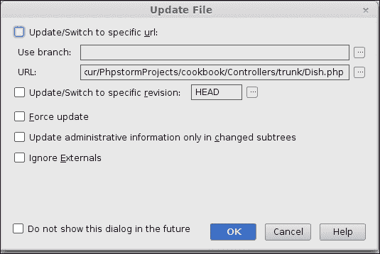

这里，您有一些可选的选项可以做出选择。

您正在工作的项目可能有许多开发版本的分支。假设管理层已经为项目的单独分支或版本做出了规定——可能其中一个分支是一个新主题，以便进行测试，或者有一个单独的分支来优化代码，或者任何可能的排列组合。请执行以下步骤：

1.  您可以通过选择**更新/切换到特定 URL**选项来更新到版本控制的特定分支。

1.  当您选择此选项时，您可以指定一个分支。您也可以指定 URL。

1.  此文本框默认填充了当前文件的 Subversion 路径。

如果您想回到过去，知道曾经存在但现在已被删除的算法，PhpStorm 也为您提供了相应的选项。为了达到这个目的，请执行以下步骤：

1.  您可以选择**更新/切换到特定修订版本**复选框。

1.  您有一个**强制更新**选项可供选择，该选项将强制更新所选文件。

当您启用**仅在更改的子树中更新管理信息**选项时，PhpStorm SVN 客户端将只更新受更新操作影响的管理信息，例如版本号、前一个修订版本和文件校验和相关的版本信息。启用此选项可能会提高更新操作的性能，因为要更新的文件更少，遵循在更短的时间内做更少的简单规则。请注意，在特定情况下，您可能必须执行一个**正常**的更新。

### 注意

如果您启用**忽略外部**复选框，更新将忽略当前文件中更新的所有外部定义。

同样，您可以更新您选择的目录。为了做到这一点，请执行以下步骤：

1.  您需要选择要更新的目录，访问右键单击上下文菜单，并选择**Subversion** | **更新**。

1.  这次将提供相同的选项，但上下文已从文件更改为目录。因此，当您强制更新时，目录内的**未版本化**更改将自动添加到版本控制中，整个目录将更新以匹配存储库副本。

    ### 提示

    由于项目也是一个目录，您也可以更新整个项目。方法与更新目录的方法完全相同。

## 它是如何工作的...

更新操作非常简单易懂。Subversion（以及其他版本控制系统）维护项目的副本。这个工作副本是根据一系列标准创建的，例如修改日期、更改的文本和版本号。当你更新文件/目录时，所有这些以及其他必要的信息都会添加到你的机器上的工作副本中。

## 还有更多...

如果你希望将本地副本与存储库中的版本控制副本更新，有两种可能性，如下所示：

+   你正在尝试更新一个你没有做任何更改的文件/目录。在这种情况下，更新将正常进行。

+   在另一种可能性中，如果你正在进行常规更新，将会有冲突。

版本控制系统会告诉你它正在困惑，不知道应该保留哪个副本进行版本控制：是你的还是他们的？选择**接受他们的**，即其他团队成员，如以下截图所示：

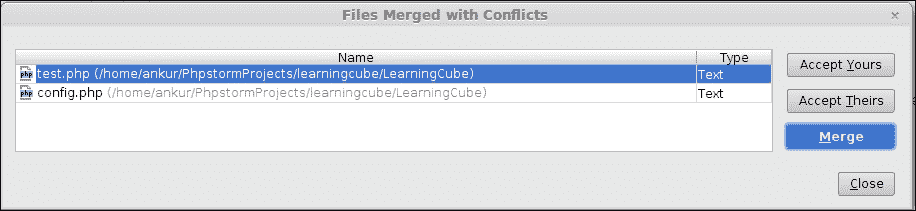

你需要通过合并文件和解决冲突来平息版本控制系统。冲突在 PhpStorm 中以鲜艳的颜色显示。显然，你也可以修改颜色。红色是冲突行，蓝色是更改行，绿色是新增行。你需要使用引导箭头来在文件之间发送内容，如以下截图所示：

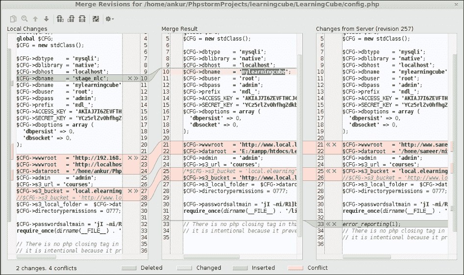

# 将你的代码与 VCS 存储库同步

你无法控制你出生的地方。你也不能控制你选择的职业：你只需要保持自己与工作带来的挑战同步。

## 准备工作

程序员面临的最大挑战之一是与团队保持同步。由于对未知发生事情的恐惧，程序员往往会在他们的开发系统中遇到项目版本不匹配的情况。他们倾向于遵循艾萨克·牛顿的第一运动定律。匀速运动的状态已经描述。外部力量是业务需求的变化以及新的任务分配。

解决这个问题的简单方法是始终将你的代码库与版本控制同步。

## 如何做到这一点...

代码同步需要比其他任何操作都更加小心。原因很明显——你可能会接受错误的代码版本，从而需要更多的时间进行开发。你可以通过多种方式同步代码，以下步骤帮助你了解其中一种方法：

1.  你需要了解版本控制历史，以确定哪些更改被做出。

1.  当你选择项目，访问右键单击上下文菜单，并选择**Subversion** | **显示历史**选项时，你可以这样做。

1.  选择你想要与代码库同步的版本号。访问右键点击上下文菜单并选择**显示所有受影响文件**选项。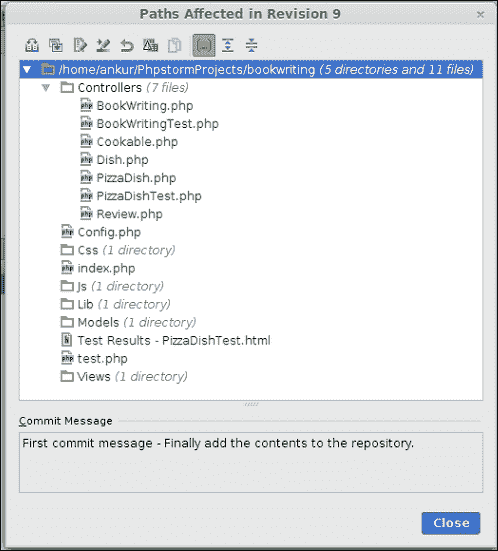

1.  你现在需要选择**显示与本地差异**选项，PhpStorm 将按层次结构方式显示文件列表，如图所示的前一个屏幕截图。

你需要选择此按钮以查看自所选修订以来更改的文件列表，如图所示的下一个屏幕截图：

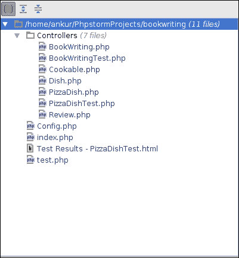

你现在可以继续查看文件中的个别差异。你可以选择你想要接受的更改，并跳过你不想接受的更改。

如果你提前很好地了解效果，这可以是一个有用的选项；否则，不要选择这个功能——如果变更列表很大，可能会很烦人。

## 它是如何工作的...

当你同步时，你只是在执行一个更新操作——这次是手动和有选择性的。因此，同步过程是将更改复制到你的本地工作副本。更改可以是任何东西：新写的一行代码、删除或更改。

# 检查版本控制系统（VCS）仓库

> *知道的越多，知道的越多*

更常见的情况是，你需要看到内部的情况才能做出决定。

## 准备工作

拥有额外信息总是帮助你转动最后一颗棋子，这通常在项目的命运中起到决定性作用。因此，你可能想了解代码库的结构，特定目录中的文件，甚至整个项目中的目录。这样的愿望清单是无穷无尽的。

做比仅仅计划更好。

## 如何操作...

当你下定决心要浏览仓库时，你可以求助于 PhpStorm。要开始查看内部的情况，请执行以下步骤：

1.  你需要选择**版本控制** | **浏览 VCS 仓库** | **浏览 Subversion 仓库**。一旦你这样做，你将能够看到你在使用 PhpStorm 时添加的所有仓库，无论项目如何，如图所示的下一个屏幕截图：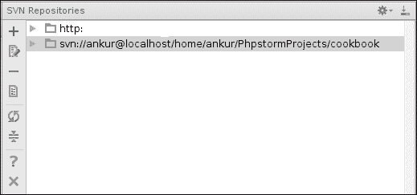

    你可以从可用位置列表中选择所需的仓库位置。

1.  一旦你选择了一个位置，你可以通过双击选中的条目来浏览仓库。除此之外，你还可以做更多的事情。一旦你右键点击并访问上下文菜单，就会有多个选项可供你选择。

1.  如果你选择**新建** | **仓库位置**，你可以创建一个新的仓库位置。

1.  如果你选择**新建** | **远程文件夹**选项，你可以在选定的仓库中创建一个新文件夹。你需要指定文件夹将被知晓的名称以及要显示给此添加到仓库的消息。记得团队合作吗？这就是**新建** | **远程文件夹**的外观：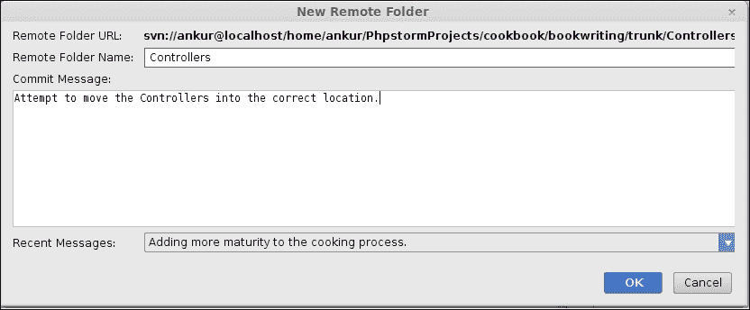

如果你选择**Show History**选项，你可以查看所选仓库位置的修订历史。你能回忆起还有其他查看 Subversion 历史的方法吗？

如果你想在本地机器上检出项目，PhpStorm 允许你通过提供一个名为**Checkout**的选项来完成。这类似于酒店结账，你离开酒店时带着所有的行李。在这里，将 Subversion 服务器比作酒店，将实际代码比作行李。然而，这并不是一个 100%的类比，因为你通常不会在酒店房间结账时检查别人的行李。那些是经验丰富的专业人士（有意为之）表演的特技。不要在家里尝试（无意为之）。

当你在浏览时，可能需要找出在分支或标记版本中另一个代码库版本的不同之处；你可以使用**Compare with**选项来完成这个操作。一旦选择，PhpStorm 会提供一个信息框，你可以用它以你喜欢的任何方式查看信息。你可以选择你想要比较的版本。在此需要注意的是，比较的顺序很重要，因为你也有进行反向比较的选项。你可以通过启用**Reverse diff**选项来实现这一点。

在获取文件差异时，PhpStorm 为你提供了两种选择。如果你选择**Graphical Compare**选项，你可以为你的眼睛提供视觉享受，或者你也可以将差异保存到当前目录中名为`diff.txt`的文本文件中。

你也可以在当前选定的仓库中进行搜索。

如果你希望搜索特定作者所做的更改，你需要启用**Author**选项并提供有效作者的姓名。

如果你希望搜索在某个特定日期之后所做的更改，你可以启用**After**选项，并从点击此选项旁边的日期选择器窗口中设置所需的日期。

当你想搜索到某个特定日期之前所做的更改时，你需要启用**Before**选项。日期选择器窗口的显示方式与之前的情况相同。

### 提示

如果你记得版本号，你可以通过修订号浏览更改。你可以选择修订号大于**From**选项且小于**To**选项的更改。

## 它是如何工作的...

当你完成指定搜索条件后，PhpStorm 会向你展示符合你选择标准的变化列表。

PhpStorm 表示你可以利用这些信息做更多的事情，并为你提供了修改搜索条件、基于更改日期或更改作者进行分组，以及在此结果中执行基于正则表达式的搜索的选项。要查看可用的选项，你只需右键单击并访问所选项目的上下文菜单。你将获得一系列一目了然的选择，例如**刷新**以重新加载搜索结果；**过滤**以再次指定搜索条件；**显示详细信息**以快速查看修订详情；**创建补丁**以创建所选修订的差异补丁文件；**撤销更改**以撤销所选修订中做出的更改，并将文件/目录回滚到立即之前的状态；以及**编辑修订注释**以修改在创建所选修订时传递给版本控制系统的注释。

艺术是长久的，而生命是短暂的，对吧？

# 从 VCS 仓库检出项目

检出的现象非常有趣。你（通常）从酒店房间中检出你的行李；你（大多数时候）告诉你的朋友：“伙计，看看我的新大屏手机”；你（犹豫着）从版本控制中检出代码。检出究竟意味着什么？这似乎更像是一个时髦词...检出，检出，再检出！

## 准备工作

理解上下文是你需要明白的。一个词的意义会随着上下文的变化而变化。在当前上下文中，你需要做你犹豫不决的事情。因此，检出代码是版本控制系统提供的一种现象，其中你取出代码库的最新版本并将其下载到你的开发计算机上。这种下载不仅仅是简单的下载，它为你提供了在版本控制下可用的最新代码版本，并使你了解截至当前日期对代码库所做的更改列表。因此，当你检出一段代码时，你也会了解到代码的历史。

在你得到*如何做到这一点...*部分中的答案之前，你需要知道为什么你应该这样做。团队是你开始思考版本控制时谈论的内容。因此，如果团队有新成员加入，让新成员开始处理现有项目的唯一方法就是检出。如果你的开发机器已经改变，并且你希望从你离开的地方继续工作，你甚至可以使用检出。

## 如何做到这一点...

从版本控制中检出代码是每个人的最爱。请执行以下步骤：

1.  你可以通过访问**版本控制** | **检出**的**VCS** | **Subversion**菜单项来极其容易地做到这一点。

1.  一旦你选择了这个选项，你将看到一个新窗口，其中列出了你在 PhpStorm 中连接的 Subversion 仓库列表，无论项目如何，如下截图所示：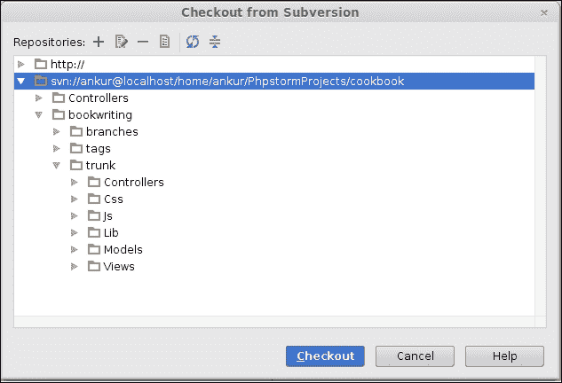

在选择了适当的版本后，继续操作时，PhpStorm 会询问它应该将检出的代码库保存在哪里。你需要指定这一点，如下面的截图所示：


当你设置目标位置时，PhpStorm 会保持好奇。它会询问你一般的检出选项，例如你想要检出代码的深度，你是否想要检出最新代码或只检出至某个修订，以及你是否想要选择外部定义，如下面的截图所示：

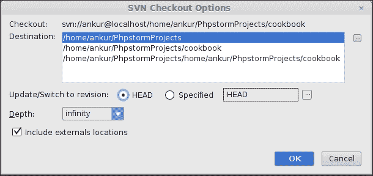

## 它是如何工作的...

在设置完所有选项后，你现在可以轻松地坐下来享受美景。PhpStorm 会检查代码，并在你的本地（开发）机器上以有组织的方式保存。

# 创建代码补丁

这通常用三个简单的陈述来说明：

+   做它

+   做对它

+   立即行动

语句很简单，但意图并非如此。每个经理都希望任务能被完成，而作为程序员的你，如何完成这个任务成了你的头疼问题。你常常会写出错误的代码。不幸的是，痛苦并没有结束；你会在一天结束时偶然将错误代码推送到 Subversion，告诉你的经理你一天的工作内容。在这场匆忙中，你意外地将一些错误推送到版本控制。现在，将有两种类型的资源浪费：

+   该成员（以及任何其他做过同样事情的成员）将花费时间来定位错误——浪费了人力

+   找到错误后，你必须撤销更改并做一些其他更改——浪费了前一个人的时间（当你推送有错误的代码时）

不仅如此，这还会滥用版本控制系统，因为当错误进入版本控制时，使用版本控制的初衷就被抵消了——多个人会做相同的工作——再次，重蹈覆辙。

## 准备工作

因此，作为这种浪费的源头，你必须考虑一个解决方案来解决这个问题。解决方案将是使用 SVN 补丁。补丁是在你创建它时生成的文件。显然！所以，补丁是一个只包含差异文本和关于更改所做的文件细节的文件。因此，补丁可以应用于文件，并且可以在以后撤销。因此，代码更改只有你给过这个补丁文件的人才能看到。优势？应用补丁的人可以审查你打算做出的更改，如果有些错误可见，补丁可以从代码库中移除，并且你可以被告知你需要做更多工作来创建无错误的代码。

你可以将补丁文件的应用过程比作裁缝。当你做饭披萨时不小心烧坏了衬衫（业务需求发生了变化），你去找裁缝修补你的衬衫（业务团队来找你以使新功能运行）。裁缝（你）找到一块类似的布料，通过缝合它来覆盖你衬衫烧毁的部分（代码库）。如果你不喜欢补丁（审查员在代码中发现了错误），你可以要求裁缝移除补丁并尝试另一种颜色（审查员会要求你制作并实施另一种算法）。裁缝很容易撕掉补丁并尝试另一种颜色（你/审查员从代码库中移除补丁）。这个过程会一直进行，直到你对补丁满意（直到审查员发现你的代码运行良好）。裁缝最终正确地完成缝合并将衬衫交给你（你提交代码并将其交给发布工程师继续处理）。

总结一下，你可以在 PhpStorm 中创建代码补丁。

## 如何操作...

如果你想在 PhpStorm 中创建 Subversion 补丁，请执行以下步骤：

1.  你需要在顶部菜单中查找（查找菜单项），找到**版本控制**，点击它，然后找到**创建补丁**选项，PhpStorm 会显示你可能熟悉的窗口。

1.  是的，这是一个类似于**提交**窗口的窗口，不同之处在于将**提交**按钮替换为**创建补丁**按钮。

    并且，功能也有所不同。你需要指定一个注释，该注释最终将作为补丁文件的名称（空格用连字符替换），如下面的截图所示：

    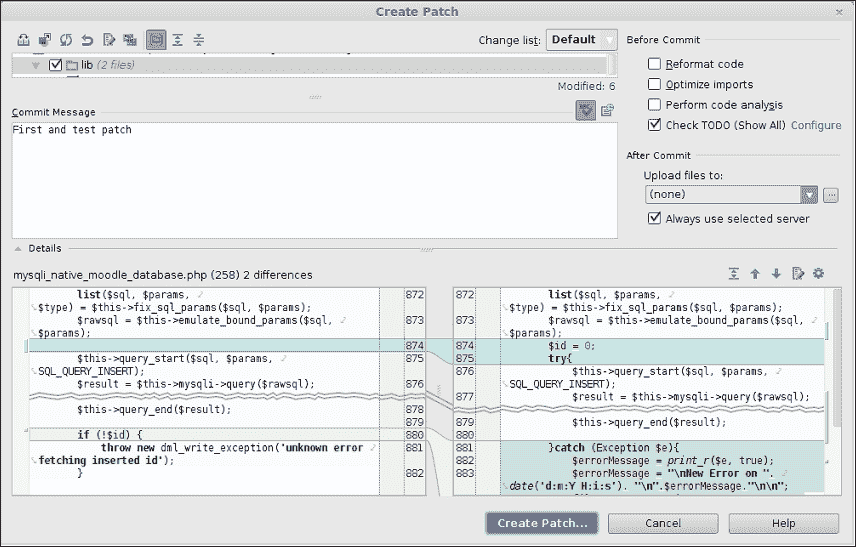

1.  默认选项最容易理解和执行。一旦你指定了补丁信息将要创建的位置（名称和位置），PhpStorm 就会在那个位置创建补丁，如下面的截图所示：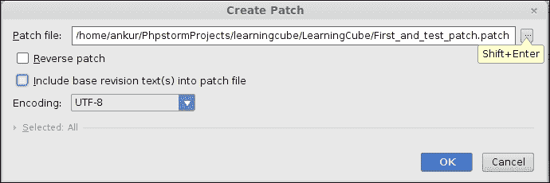

1.  如果你选择**反向补丁**选项，PhpStorm 将反转比较标准——在默认情况下，它保持了最新版本（**Head**）作为比较的基础，并将这个版本中的更改视为新的。

1.  在创建反向补丁时，PhpStorm 会将立即前一个版本作为基础，并将这个版本中的更改视为新的。

1.  如果你选择**将基版本文本（们）选入补丁文件**，这意味着你要求 PhpStorm 将当前版本中的文件内容放入补丁文件中。因此，补丁文件的大小将会增加。在这里，重要的是要注意，你可以选择你希望在补丁文件中包含的文件基版本。

在完成必要的选项并启动补丁文件创建过程后，PhpStorm 会显示一个成功消息，并附带一个选项，现在可以转到补丁文件的位置，如下面的截图所示：

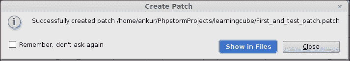

现在，你可以将这个补丁文件传递给代码审查员，关闭你的机器，安全地开车回家，无需担心浪费任何资源。

## 它是如何工作的...

当你创建补丁文件时，你实际上创建了一个包含两个文件或更精确地说，修订版本之间差异的文件：基本修订版本和即将到来的修订版本。因此，补丁文件包含以下信息：

+   文件名和基本修订版本

+   被修改的行号

+   内容的差异

一个典型的补丁文件看起来如下：

```php
--- lib/dml/mysqli_native_moodle_database.php (revision 258)
```

变更是对此文件和指定的修订版本进行的，如下所示：

```php
+++ lib/dml/mysqli_native_moodle_database.php (revision )
@@ -871,13 +871,20 @@
```

修改的行号是 `871,` 删除了 `13` 行，并增加了 `20` 行。看看下面的代码：

```php
list($sql, $params, $type) = $this->fix_sql_params($sql, $params);
$rawsql = $this->emulate_bound_params($sql, $params);
-
+ $id = 0;
+ try{
- $this->query_start($sql, $params, SQL_QUERY_INSERT);
- $result = $this->mysqli->query($rawsql);
- $id = @$this->mysqli->insert_id; // must be called before query_end() which may insert log into db
- $this->query_end($result);
```

`-` 符号表示内容已被删除。看看下面的代码：

```php
+ $this->query_start($sql, $params, SQL_QUERY_INSERT);
+ $result = $this->mysqli->query($rawsql);
+ $id = @$this->mysqli->insert_id; // must be called before query_end() which may insert log into db
+ $this->query_end($result);
```

`+` 符号表示内容已被添加。看看下面的代码：

```php
- if (!$id) {
+ }catch (Exception $e){
+ $errorMessage = print_r($e, true);
+ $errorMessage = "\nNew Error on ". date('d:m:Y H:i:s'). "\n".$errorMessage."\n\n";
+ file_put_contents("/tmp/errorMessage", $errorMessage, FILE_APPEND);
+ }
+
+ if (!$id || $id==0) {
throw new dml_write_exception('unknown error fetching inserted id');
}
```

快乐地打补丁。

# 创建 VCS 标签或分支

人类大脑是一个超负荷的机器。它很容易忘记事件、事物或计划。需要持续的努力来让大脑记住事物。由于大脑的大部分区域都用于视觉感知，最普遍的使用方法是提供视觉提示。视觉提示的作用与在 PhpStorm 烹饪书中的常规书签相同，它们让你记住你正在阅读的章节以及何时阅读。

## 准备工作

PhpStorm 提供了一个功能，你可以创建视觉上吸引人的标签，即标签。

标签是视觉标签，让你和你的团队能够知道哪个修订版本对你来说特别。因此，你可以创建视觉上吸引人的标签或标签来表示特殊事件，例如 `Release Version 2.3` 或 `Bug fixes for V2.2` 等。那么，提示在哪里呢？提示就是名字。为什么是视觉的？因为你可以轻松记住名字和视觉元素。

## 如何操作...

标签过程从你决定创建标签的时间开始。

它应该是一个描述性的标签，因为如果你在创建标签的时候没有完全清醒，你可能会得到像 `Tag 1` 和 `My Tag` 这样的名字。这会导致资源浪费和技术滥用。要创建一个标签，请执行以下步骤：

1.  无论如何，如果你想创建一个新的标签，你需要在选择 **VCS** | **VCS Operations** 弹出菜单时选择可用的 **Branch or Tag** 选项，如下面的截图所示：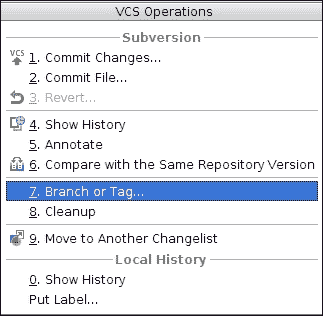

    当你这样做时，你会看到 PhpStorm 会提出问题，让你感到宾至如归，如下面的截图所示：

    

1.  你需要在你的开发机器上指定你希望从标签中复制文件或文件夹的源，通过启用 **Working Copy** 选项并指定源文件路径来实现。

1.  如果您需要指定要复制的文件或文件夹，您需要选择**仓库位置**选项，并指定当前仓库中的确切位置和所需的修订号或**Head**（最新修订）。

1.  然后，您需要指定目标位置，您将在那里保存标记版本。

您可以通过指定基础 URL 和标签名称来在仓库中指定位置。这个标签名称将为您提供一个视觉提示。

### 注意

您也可以指定一个任意位置，例如仓库位置，甚至是您的开发机器上的位置。

## 它是如何工作的...

一旦您确信某件事是可行的，那么进一步探索幕后的情况以及是什么让这件事工作，将会是一次极好的体验。所以，分支或标签创建过程以相同的方式运作——当您在仓库中创建标签或分支时，您只是从一处复制文件到另一处。是的，这就是大多数工程师都擅长的复制（无意中开玩笑）。因此，有四种组合可用：

+   您从本地工作副本复制到本地工作副本

+   您从本地工作副本复制到同一仓库中的另一个位置

+   您从另一个仓库位置复制到您的本地工作副本中的位置

+   您从另一个仓库位置复制到同一仓库中的另一个位置

    ### 小贴士

    这不是强制性的，但始终建议您在进行任何操作时添加注释——您可以添加描述性注释，以便您能够将此更改与未来的某个操作联系起来。

## 还有更多...

在学习了如何在仓库中标记更改后，您可以通过继续创建分支来更深入地探索知识海洋。标签和分支之间的相似之处在于它们都是具有特定名称的文件夹。它们在所服务的目的上有所不同。虽然标签可能对小的更改有用，但分支是更大图景的一部分。

一个用例将使场景对您更清晰，您将能够区分这两者。假设技术团队已经发布了一个版本，并且他们认为这是该版本最后的新开发。因此，您可以创建一个名为`Version 2.3 final`的标签，向其中添加内容，并永远保留它。因此，在未来任何时候，无论何时您需要回顾您的项目，您都将能够识别出`Version 2.3 final`意味着这样的一个版本，具有这样的变化。

创建分支与创建标签类似，因为它们都是仓库目录。执行以下步骤：

1.  要创建一个新的分支，您需要转到**Subversion**视图，从项目视图中选择适当的目录，并访问右键单击上下文菜单。

1.  选择**Subversion**菜单项，然后选择**分支或标签**选项。一旦您这样做，就会弹出一个熟悉的窗口。您需要填写创建分支所需的基本信息，例如：

    +   你从哪里获取要推送到 Subversion 的文件：这个源可以在你的本地开发系统中的某个地方（你默认选择的文件/文件夹）或仓库位置（你也可以指定修订号）。

    +   你将放置分支的目的地：这同样需要在你的本地开发机器上的完整路径名或指向仓库位置的 URL。在此需要注意的是，仓库位置必须与你的源代码所在的同一仓库。

    +   你希望添加的注释，以便你和团队记住分支创建的目的。

因此，你创建一个标签来确保修订在仓库中永远安全。你创建一个分支来制作一个安全稳定的代码版本——分支被创建；你在上面工作，进行测试并获得批准，然后将它合并到主分支。

> *这一切都是感知的问题*

# 为团队创建任务

你是否曾经想过如何创造伟大事物？人们是如何成功构建出如此高效的大型系统的？当他们决定迈出一步，尝试额外努力时，他们的思维和心态是怎样的？

这个问题的答案相当简单。千里之行，始于足下。所以，当你开始思考与团队一起工作时，你决定使用版本控制。你继续前进，在版本控制中学习技巧。现在，是你迈出一步，尝试额外努力的时候了。结合你所获得的知识，准备好探索你可以创建团队任务的一种方式。

## 准备工作

你想要创建一个团队任务，以便你可以设定你的团队中哪个程序员需要关注代码的哪个部分。你可以通过结合 TODO（还记得创建 TODO 任务吗？）和版本控制的强大功能来实现这一点。因此，任何程序员都可以很容易地知道某个任务已经被分配，并且需要有一个适当的发展计划。这对团队大有裨益——你将引导他们走向正确的道路。

这在软件工程中的极限编程（**eXtreme Programming**）范式中的同行代码审查过程中也扮演着一定的角色，其中你编写代码，你的同行审查你的代码。然后，同行会指出你代码中可能存在问题的部分。因此，一旦你将带有任务给你的代码推送到版本控制，同行就可以推送他们所做的更改，包括需要你修复或考虑的任务，或者任何可能出现的即时需求。

## 如何做到这一点...

创建一个任务并不是一个困难的任务（有意为之）。所以，如果你想指向你团队中的另一个成员，请执行以下步骤：

1.  你只需要继续你旧的编程风格，但稍作修改：无论何时你觉得需要做更多的工作。

1.  你只需要添加一个 TODO，然后描述你希望引起团队注意的任务。在审查代码时创建一般团队任务的实际流程如下：

    +   找到一段代码

    +   仔细阅读

    +   写`// TODO <随后是待完成的任务，例如添加文档，团队>`

    +   将代码提交到版本控制

当你自己在编写代码时，你可以添加一个 TODO 来创建一个任务，让团队思考特定的方向。流程如下：

+   编写（精炼）的代码——你无法承担犯错的代价

+   找到一个你认为没有完全实现的逻辑

+   写`//TODO <随后是待完成的任务，例如找到一些万无一失的正则表达式，团队>`

+   将代码提交到版本控制

当你想将任务分配给团队时，可以使用 TODO 用户后跟你认为最适合完成工作的程序员的姓名。流程如下：

+   仔细阅读更改后的代码。

+   在你的开发系统上测试代码。

+   找出可以进行的改进，并根据团队成员的能力分组。

+   写 TODO 和目标程序员的姓名，然后针对你发现的每个可能的改进写上注释。一些示例 TODO 如下：

    +   `//TODO Alice`: 这个部分需要移除不必要的变量

    +   `//TODO Bob`: 循环内的操作可以移到循环外以降低执行时间

+   将代码提交到版本控制。

    ### 小贴士

    这只是其中一种方法——你将是那个发现越来越多版本控制使用方法的人。

## 它是如何工作的...

当你创建团队任务时，你只需创建一个 TODO 任务并将其推送到版本控制。因此，从实际意义上讲，你是在利用 PhpStorm 的 TODO 功能。所以，你的 TODO 实际上是通过 PhpStorm 的帮助传递给团队成员的，因为它是用 PhpStorm 构建的解析器，可以识别 TODO 关键字。因此，当团队从版本控制中获取更新时，这个 TODO 也会包含在你的工作副本中。所以，当其他程序员选择 TODO 视图时，意图是显而易见的。

当你为团队中的特定程序员创建 TODO 任务时，情况也是如此。因此，当团队中的每个人都从版本控制中获取更新时，同样的 TODO 现在包含了程序员的姓名。这使得团队成员能够正确地专注于他们的任务。

团队任务不仅帮助团队更专注于分配的任务并投入更多精力，还试图减轻分配工作的繁琐任务带来的压力。

PhpStorm 再次来拯救你！
