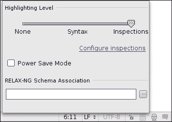
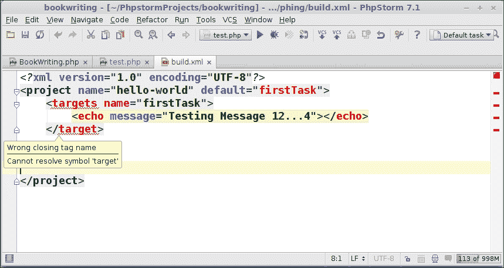
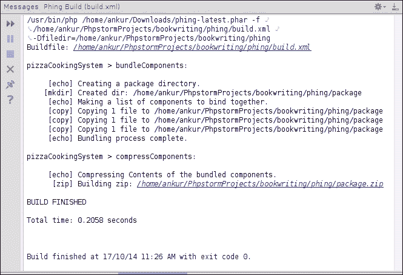

# 第七章. PhpStorm 和 Phing

在本章中，我们将涵盖以下主题：

+   连接 Phing 和 PhpStorm

+   捕获 Phing 构建文件语法问题

+   使用 Phing 构建 PhpStorm 应用程序

+   使用不同的构建文件

+   用 Phing 创造奇迹

+   使用 Phing 构建视图

# 简介

奶奶曾经说过：“不要复制，要原创”。软件工程则说：“不要重新发明轮子”。

你信任谁？如果奶奶不是软件工程师，那么就信任软件工程吧！

他们通过这种方式复制并构建了伟大的事物。说“复制”可能会引起争议，所以基于一个更符合政治正确的术语来描述复制，我们用*灵感*。因此，用外交术语来说，他们是受到了现有软件的启发，并完全创建了一个新的软件。

但是，这是邪恶的吗？如果那个软件不存在呢？如果那个软件非常有用呢？

在这张黑白图片中添加颜色，这里就有软件：一个为另一种语言 Java 提供的构建工具，名为 Ant。PHP 爱好者（程序员）们想到了拥有一个类似的构建工具，于是有好事者辛勤劳作，为这项任务创造了**Phing**。因此，Phing 成为了 PHP 的构建工具，据说 Phing 是基于 Ant 的。

一些 PHP 程序员可能会说，当 PHP 被解释时，为什么还需要一个单独的工具呢？当 PHP 源代码必须提供给客户时，创建一个捆绑包有什么用？一个简单的包含 PHP 脚本的目录就足够了。对这个问题的最简单、最恰当的回答是，当你是一名软件工程师时，你应该总是让一切自动化——即使是这个最简单的任务。Phing 自动化了许多过程：在 PHP 环境中你能想象到的一切。你可以创建归档、检出代码、部署代码、清理日志、备份代码——只需思考，就会有 Phing（有意为之的押韵）。

当你与 Phing 一起工作时，你还需要了解底层发生了什么。所以，你根据一些规则写下 XML 格式的指令。这些基于 XML 的指令被称为 Phing 的任务。这些任务可以有很多，包含这些任务的文件也可以有很多。在这里值得注意的是，在分离任务（或分组任务）时，你需要使用适当的（并且有文档记录的）智慧，因为越坚持软件工程的原则，你将越容易更好地处理模块化。正如已经提到的，Phing 本身是用 PHP 编写的代码。当执行时，它会读取你编写的 XML 文件，并忠诚地遵循其中的内容（前提是 XML 文档本身格式良好，并遵循 Phing 的 XML 规则）。你可以把这个 XML 文件称为构建文件，因为这是它的常见名称。

你注意到 Phing 有一个奇怪的名字吗？它听起来更像是无线电中继之间的商业广告的指示性声音。开玩笑的，Phing 是一个递归缩写词——你还记得第一次听到这个词的时候吗？只需记住，当你什么都想不起来的时候，最好从开始的地方（双关语）开始。Phing 代表**PH**ing **I**s **N**ot **G**nu's make。愿上帝保佑那些名字很短的人。

# 连接 Phing 和 PhpStorm

在获取了一些关于 Phing 的非常基本的信息之后，现在是你进行实际操作的时候了！如果没有 PhpStorm，操作将集中在 Phing 上，但既然你在使用 PhpStorm，你需要从多个角度来考虑。因此，对你来说，一个可能的路线图可能是获取 Phing，在你的开发机器上本地安装它，并告诉 PhpStorm Phing 已经安装，并且需要与 Phing 同步工作。实际上，PhpStorm 正是利用了 Phing 提供的功能。

在我们深入探讨构建文件的深度之前，值得注意 Phing 的一些主要特性，如下所示：

+   简单的 XML 构建文件

+   提供了丰富的任务集

+   通过 PHP 类轻松扩展

+   平台无关性

+   无需外部依赖

    ### 小贴士

    如果你想了解更多关于 Phing 任务的信息，我建议你访问 Phing 的官方网站（[`www.phing.info/`](http://www.phing.info/))。

## 如何做到这一点...

获取 Phing 确实是每个人的最爱。你可以使用命令`wget -c http://www.phing.info/get/phing-latest.phar`将其作为 phar 下载。你可以在终端（通过*Alt* + *F12*访问）中运行此命令。一旦这样做，在有工作的互联网连接的情况下，你可以下载这个 phar。你需要注意文件被加载的路径。建议你将可执行文件移动到一个不修改的公共文件夹下（没有与之关联的写权限）。这样做并不是因为它会有错误——这样做是良好的实践，并且使操作系统文件和目录保持组织。

获取 phar 后，是时候告诉 PhpStorm 关于 Phing 的信息了。你需要执行以下步骤：

1.  前往**项目**视图。定位到**外部库**。

1.  访问右键点击上下文菜单，并选择**配置 PHP 包含路径**选项。

1.  提供你下载（或移动）包的完整路径。

Bingo！你成功告诉 PhpStorm 你为开源项目添加了一个新的库。

### 小贴士

要使 Phing 对所有运行 PHP 的应用程序可用，你可以将其添加到 PHP 主包含路径中——类似于`/usr/share/php5`。

在这个时候，如果你希望检查安装 Phing 时应用了哪些更改，你将不会成功。你将无法在任何地方看到任何与 Phing 相关的菜单项。你将无法看到任何额外的图标，也无法看到任何与 Phing 相关的额外视图。你可能会开始考虑在 Phing 安装过程中遗漏了某些东西。不用担心，请继续关注！

## 它是如何工作的…

要释放 Phing 的力量，你需要执行它。要执行它，你需要安装它。但你已经安装了 Phing，你不确定它是否被正确安装。这似乎是一个恶性循环。Phing 需要一个输入文件来理解它需要做什么。这被称为**构建文件**。因此，你需要在你的项目内部创建一个新的构建文件。构建文件是一个 XML 文档，并基于一些规则。默认名称是 `build.xml`。所以，一个非常基本的构建文件看起来可能像以下代码：

```php
<?xml version="1.0" encoding="UTF-8"?>
<project name="firstTask" default="firstTask">
<target name="firstTask">
<echo message="Testing Message 12...4"></echo>
</target>
</project>
```

完成这些后，你需要做以下事情：

1.  打开项目视图并选择构建文件。

1.  访问右键单击上下文菜单。

1.  将会有一个名为**添加为 Phing 构建文件**的新选项（神奇！）。选择该选项。

为了检查集成是否成功，你可以选择**视图** | **工具窗口**，你将能够看到一个新选项可用，**Phing 构建**。如果你能看到这个新选项，恭喜你，你已经成功将 Phing 连接到 PhpStorm。

### 注意

在创建构建文件时，PhpStorm 需要至少指定一个目标。如果你留一个构建文件为空，PhpStorm 将成为你的好朋友。

## 还有更多…

由于 Phing 是用 PHP 编写的软件，PhpStorm 希望让这个软件在其范围内。所以，你添加包含路径到项目中以实现这个目标。当 PhpStorm 拥有 Phing 在其范围内时，它会尝试为 Phing 创建一些选项。为此，它会查找以找到构建文件和目标。一旦找到目标，它就会理解目标并创建必要的选项。

# 捕获 Phing 构建文件语法问题

现在你已经努力将 PhpStorm 和 Phing 连接起来，你一定知道是什么驱动着 Phing。是什么让你能够用 Phing 做出奇迹？是什么让你的生活变得更轻松，让遵循软件工程原则变得更简单？你必须想到的名字是构建文件。是的，正是构建文件控制着 Phing 的行为。是的，使用构建文件，你可以用 Phing 做出奇迹。是的，使用构建文件，你可以以干净的方式执行任务——从而遵循软件工程的原则。

## 准备工作

写一个新的构建文件来使用 Phing 执行任务是完全正常的。但这个问题很突出——你如何检查你写的构建文件在语法上是否正确。来吧，如果你说你写的时候没有犯错误，那你一定是 JARVIS，而不是人类。犯错是人类的本性，检查和移除错误是*PhpStorm-ine*。

## 如何操作…

在开始编写构建文件之前，你需要了解一些非常基本的规则，这样你至少可以测试 Phing 中的演示或 Hello World 操作。（是的，你听得很对：使用 Phing 创建一个`Hello World`消息是可能的。）只有当构建文件：

1.  文件包含一个开始和结束项目标签。应该只有一个，并且它应该是 XML 树的根节点。在项目标签内部，文件应该至少包含一个目标标签：例如`property`、`tstamp`和`propertyprompt`这样的标签。

1.  现在，重新查看相同的构建文件，你将能够更好地理解构建文件——第二次尝试比第一次尝试让你更加成熟。在这里，看看以下代码：

    ```php
    <?xml version="1.0" encoding="UTF-8"?>
    <project name="hello-world" default="firstTask">
    <target name="firstTask">
    <echo message="Testing Message 12...4"></echo>
    </target>
    </project>
    ```

1.  为了检查语法，必须注意检查。底部状态栏提供了一个图标。你需要点击它，将**省电模式**设置为关闭，并将高亮级别设置为**检查**，如下面的截图所示：

1.  是时候让你在构建文件上玩一玩了。不用担心，有本地历史记录来帮助你——你可以随意回滚一些更改。所以，无论何时你在语法上犯错误，PhpStorm 都会显示错误：

    +   如果你指定了一个错误的开始标签，最近的匹配标签将显示红色下划线，并且状态栏显示信息**开始标签有错误的结束标签**。

    +   错误的结束标签名称将在错误的标签和最近的匹配标签以及底部状态栏中显示红色下划线，并且状态栏显示信息**错误的结束标签名称**。

    +   如果你指定了一个在 Phing 的规则列表中未定义的标签，问题将以多种方式显示，如下面的截图所示：

    +   如果你指定了一个对于该标签未定义或不允许的属性，错误的属性会变成红色，并且状态栏会显示信息**属性 <incorrect-attribute> 在此处不允许**。

    +   如果你忘记指定一个标签的结束标签，状态栏将显示信息**元素 <element-without-closing-tag> 未关闭**。

    再次使用*PhpStorm*，证明了 PhpStorm。

### 小贴士

由于你将经常为 Phing 编写任务，你也可以为构建文件创建一个新的模板。为此，你需要选择**文件** | **新建**选项，并选择**编辑文件模板**选项。在出现的窗口中，你需要添加此模板的名称（它将在你选择**文件** | **新建**时出现）和此模板的扩展名（你需要指定`.xml`），并放入你将始终需要的最基本构建文件的内容。点击**确定**将保存此模板。

以下截图显示了 Phing 文件：


## 它是如何工作的…

PhpStorm 会实时检查代码。因此，检查的一般规则也适用于构建文件。此设置可以通过选择**文件** | **设置** | **检查** | **Phing** | **Phing 检查**来打开或关闭。所以，随着你继续输入，检查器会继续检查你输入的内容，并继续以视觉方式显示警告。

## 还有更多…

如果你想要禁用检查，你可以这样做，以至于所有检查都被关闭。虽然不推荐，但在处理大文件时可能会很有用。

# 使用 Phing 构建 PhpStorm 应用程序

因此，现在是时候使用 Phing 进行一些实际操作了。现在是时候尝试使用 Phing 的问题（并受到其射击的伤害）了。现在是时候为你的事业做些有用的事情了，你是这个事业的支柱。系好头盔，在阳光下开始工作。

在需要编译的其他语言中，构建的一般含义是编译代码，链接对象，并创建可执行文件。然而，在 PHP 中，你不能编译代码；它是被解释的，亲爱的：你可以模拟构建过程。如何？请耐心等待。

## 准备工作

首先，你需要回忆一下你曾经饿过！你一定不要忘记生活中的某些事情——其中之一就是你的饥饿。它让你意识到你仍然需要努力工作来赚取面包以平息这种饥饿。所以，当你饿的时候，你只是进入你的厨房，试图为自己做些披萨。对吗？如果你希望传递给你做披萨的相同系统，你的行动会是什么？你需要为 Phing 创建一个构建文件，并在其中编写一些目标和操作，以便你能够将必要的组件组合在一起，并以一个单一单元传递出去。

## 如何操作…

要创建一个新的构建文件，你需要执行以下步骤：

1.  前往**项目**视图。

1.  选择适当的目录，并在右键菜单中选择构建文件类型。

1.  你将创建一个看起来像以下代码的构建文件；不用担心这个代码——你将会详细了解它：

    ```php
    <?xml version="1.0" encoding="UTF-8"?>
    <project name="pizzaCookingSystem" default="compressComponents">
    <target name="bundleComponents">
    <echo message="Creating a package directory." />
    <mkdir dir="./package" />
    <echo message="Making a list of components to bind together." />
    <copy file="../Controllers/Dish.php" tofile="package/Dish.php" />
    <copy file="../Controllers/PizzaDish.php" tofile="package/PizzaDish.php" />
    <copy file="../Controllers/PizzaDishTest.php" tofile="package/PizzaDishTest.php" />
    <echo message="Bundling process complete."></echo>
    </target>

    <target name="compressComponents" depends="bundleComponents">
    <echo message="Compressing Contents of the bundled components." />
    <zip destfile="package.zip">
    <fileset dir="package" >
    <include name="*" />
    </fileset>
    </zip>
    </target>
    </project>
    ```

## 它是如何工作的…

最后，你理解 Phing 驱动原理的时候到了。因此，`<project name="pizzaCookingSystem" default="compressComponents">` 创建一个项目元素，并将其绑定到具有`name`属性的命名空间。`default`属性定义了 Phing 将选择执行的目标。如果你将 Phing 构建文件视为树形结构，项目是树的根节点。《target name="bundleComponents">` 创建一个新的目标元素，它是你想要执行的操作的容器。因此，你希望执行的所有任务都写在目标组件内部。目标是通过`name`属性选择的。如果你将 Phing 构建文件视为包含节点和叶子的树形结构，目标元素是树的一个节点。

`<target name="compressComponents" depends="bundleComponents">` 是另一种带有附加属性`depends`的目标元素写法。因此，当你指定`depends`属性时，你告诉 Phing 引擎这个目标元素依赖于其他目标元素。重要的是你要知道，当你指定`depends`属性时，该目标元素将先于当前元素执行。

`<echo message="Creating a package directory." />` 创建一个元素，用于向控制台输出消息。显示的消息将取决于消息属性的内容。（还记得显示`Hello World`吗？你的笑容真迷人！）

`<mkdir dir="./package" />` 创建一个元素，在当前目录中创建一个新的目录。这与`*nix`系统下的`mkdir`命令同义，它接受相对路径和绝对路径作为目标位置。

`<copy file="../Controllers/Dish.php" tofile="package/Dish.php" />` 执行从文件属性指定的文件位置到`tofile`属性指定的文件位置的文件复制操作。这与`*nix`系统下的`cp`命令同义，并接受相对或绝对文件路径名。

`<zip destfile="package.zip">` 创建一个元素，用于处理 ZIP 格式的文件压缩。`destfile`属性指定了压缩文件的名称，该文件将是输出。输出路径可以是相对路径或绝对路径。

`<fileset dir="package" />` 创建一个元素，用于设置要选入压缩输出文件的文件。换句话说，这将从由`dir`属性指定的目录中获取文件。

如果你想要将选定的文件包含在包中，你可以创建一个`include`元素，并指定你想要添加到输出压缩文件中的文件名（`<include name="*" />`）。通配符字符在这里是可以接受的。因此，星号（`*`）意味着将选择文件集元素`dir`属性内部指定的所有文件。

现在，你可以自豪地说，你拥有了利用 Phing 的能力。这是你帽子上的另一根羽毛，对吧？表现优秀，继续保持！

# 使用不同的构建文件

经常发生的情况是你手头上有相互独立且互斥的任务。软件工程的原理总是反对将任务组合在一起——模块化是所倡导现象的正确名称。你和 Phing 的情况也是如此。如果你有一系列任务要执行，你有两条路可以选择：较短的和较长的。较短的路会迅速带来结果，但你的朋友，软件工程，会感到不悦。较长的路一开始可能会让你感到烦恼，但亲爱的朋友，这将让你更接近软件工程。

一个明智的决定是与软件工程为友，走更长的路线。因此，你将为每个任务创建单独的构建文件。但要注意，决定任务的分组本身是一把双刃剑——它两面都锋利。

## 如何做…

根据任务的性质分组后，你现在需要专注于 Phing 如何在你繁忙的日常生活中帮助你。你只需要遵循规则：

+   **组别**：将任务分组是开始的重要步骤。你需要创建一个预期包含任务的目录（构建文件）。这并不是说会有错误：这是遵循的良好实践。一个查看你的代码层次结构的人将能够轻松地理解你的意图。

+   **创建**：创建实际的构建文件是下一步，你不仅需要做，而且要非常小心。由于这是工作马，你需要确保程序结构是最小的——冗余的行会让你困惑。你需要根据你分组的单个活动来编写任务。确保你不要把业务团队落下！因此，要创建构建文件，选择**文件** | **新建** | **Phing 构建文件**选项，并在其中编写任务。如果你没有为构建文件设置任何模板，你需要选择**文件** | **新建** | **文件**，并指定具有`.xml`扩展名的文件名。

+   **设置**：像往常一样，你的朋友 PhpStorm 需要考虑到你的工程需求。是 PhpStorm 让你的生活变得更轻松——始终记住。因此，你需要通过选择**添加为 Phing 构建文件**选项来添加单个构建文件。这可以通过从项目视图中右键单击适当的构建文件来实现。

+   **执行**：一切准备就绪。当需要时，选择适当的文件，右键单击并选择**运行构建文件**选项。

以下截图显示了构建文件：



因此，PhpStorm 没有让你和软件工程这两个朋友之间有任何隔阂。

一个示例构建文件看起来像以下代码：

```php
<project name="pizzaCookingSystem" default="compressComponents">

  <target name="bundleComponents">
  <echo message="Creating a package directory."/>
  <mkdir dir="./package"/>
  <echo message="Making a list of components to bind together."/>
  <copy file="../Controllers/Dish.php" tofile="package/Dish.php"/>
  <copy file="../Controllers/PizzaDish.php" tofile="package/PizzaDish.php"/>
  <copy file="../Controllers/PizzaDishTest.php" tofile="package/PizzaDishTest.php"/>
  <echo message="Bundling process complete."/>
  </target>

    <target name="compressComponents" depends="bundleComponents">
    <echo message="Compressing Contents of the bundled components."/>
    <zip destfile="package.zip">
      <fileset dir="package" />
    </zip>
  </target>

</project>
```

## 它是如何工作的…

构建文件是唯一提供指导给 Phing 的来源。换句话说，Phing 只认为构建文件足够适合接受执行请求。因此，不同的任务只是单个任务的复数形式（没有开玩笑的意思）。所以，不同的任务被记录在不同的构建文件中，以确保结构模块化得到保持。单个任务根据任何给定时间所需的任务执行。

# 用 Phing 创造奇迹

没有实际用途的艺术是什么？实际用途意味着艺术的实用性。艺术的实用性清楚地表明了解决问题的能力。所以，将 Phing 视为一种艺术，它具有实际用途。由于它具有实际用途，它具有实用性。由于它具有实用性，它清楚地表明它可以为您解决问题。

您还在等什么？

考虑构建问题，无论是常见的还是不常见的，考虑 Phing。最常见的问题是最常见的头痛原因——您团队中的某些开发者可能不知道特定的数据库语言，有些人可能不知道特定于操作系统的命令，有些人可能不值得信任以允许他们处理系统权限；因此，日志文件或临时文件清理任务。

您可以编写 Phing 任务来处理所有这些问题。

您能写一个 Phing 任务来从 SVN 服务器检出文件并在目标服务器上部署它们吗？是的，您可以。

## 准备中

您需要加载**PHP SSH2**扩展。在`*nix`（基于 Debian）环境中，PHP SSH2 扩展以`libssh2-php`的名称提供。它可以非常容易地通过命令`apt-get install libssh2-php`下载。

您还需要在您希望部署代码的服务器上添加您的 SSH 公钥（通常是一个以`.pub`扩展名结尾的文件）。

## 如何做到这一点…

当您想到 Phing 时，您必须心理上准备好处理 XML 的严格语法。因此，您需要根据 Phing 的规则编写一些 XML 代码来：

1.  根据 Subversion 修订号创建一个更改列表，并将其保存到文件中。

1.  通过读取步骤 1 中创建的文件，将更改的文件导出到您的本地服务器。

1.  将导出的文件部署到服务器上。

这就像看起来那么简单。所以，您可能会做以下类似的事情：

```php
<project name="SvnDeploy" default="prepareFilesForUpload">
<target name="svnLogin">
<property name="svnUrl" value="http://www.somerepositoryurl/somerepopath"/>
<property name="svnUsername" value="you"/>
<property name="svnPassword" value="you@the-rep0s"/>
<property name="svnCodebaseName" value="name-of-code-base"/>
</target>

<target name="takeDiff" depends="svnLogin">
<propertyprompt promptText="Enter the starting revision number" propertyName="startRev" defaultValue="1"/>
<propertyprompt promptText="Enter the ending revision number (optional)" defaultValue="HEAD" propertyName="endRev" />
<exec command="svn diff ${svnUrl}@${startRev} ${svnUrl}@${endRev} --summarize --xml" output="filelist.${startRev}.${endRev}" />
</target>
<target name="prepareFilesForUpload" depends="takeDiff">
<loadfile property="listOfFiles" file="filelist.${startRev}.${endRev}" />
<property name="directoryName" value="uploads-${startRev}-${endRev}" />
<mkdir dir="${directoryName}" />
<xmlproperty file="filelist.${startRev}.${endRev}" collapseAttributes="true"/>
<foreach delimiter="," list="${diff.paths.path}" param="file" target="exportFilesToLocal" />
</target>
<target name="exportFilesToLocal">
<php expression="str_replace('${svnUrl}/${svnCodebaseName}', '', '${file}');" returnProperty="filePath" />
<if>
<not>
<equals arg1="${filePath}" arg2=""/>
</not>
<then>
<echo message="Exporting file: ${filePath} " />
<php expression="preg_replace('/([a-z0-9-_\.])+\.([a-z])+/i', '', '${filePath}')" returnProperty="fileWithDir"/>
<echo message="Creating dir: ${fileWithDir} " />
<exec command="mkdir -p ${directoryName}/${fileWithDir}" />
<exec command="svn export ${file} ${directoryName}/${filePath} -- force" />
<phingcall target="deployFiles" />
</then>
</if>
</target>

<target name="deployFiles" depends="serverLogin">
<exec command="scp -r ${directoryName}/* ${serverUsername}@${serverUrl}:${serverDeploymentPath}/" checkreturn="true"/>
</target>

<target name="serverLogin">
<property name="serverUrl" value="localhost" />
<property name="serverUsername" value="ankur" />
<property name="serverDeploymentPath" value="/home/techie/Desktop/deployment/" />
</target>

</project>
```

重型 XML 代码！您被鼓励勇敢地打开引擎盖，看看里面发生了什么。

## 它是如何工作的…

**属性提示**是 Phing 在执行期间请求用户输入的方式。您想要显示的消息应写入`promptText`属性。稍后可以通过在`propertyName`属性中指定的名称访问输入值。如果您想设置一个默认值作为后备值，以防用户没有输入值，您需要设置默认值属性的值。

**Exec** 是 Phing 执行命令的方式。如果命令生成了您想在代码的另一个地方使用的输出，您需要指定一个名称，该名称将成为此输出的参考点。

Phing 允许您使用此 `loadfile` 标签加载文件的 内容。您需要在文件属性中指定文件的路径（绝对路径或相对路径）。此文件的引用名称写在 `property` 属性内：

```php
<foreach delimiter="A"list="${listOfFiles}"
param="file" target="exportFilesToLocal" />
```

您可以使用 `foreach` 标签迭代某个条件。`delimiter` 属性分隔使用 `list` 属性指定的输入值。循环中的单个元素可以通过 `param` 属性中指定的值访问。`target` 属性表示在循环内要重复执行的目标。请看以下代码：

```php
<mkdir dir="${directoryName}" />
```

## 还有更多...

如果您编写了 `mkdir` 标签并指定要创建的目录的名称在 `dir` 属性中，Phing 可以创建一个新的目录。如果目录已存在，Phing 将保持沉默，不会产生关于目录的消息——您需要自己小心。您可以使用 `phingcall` 标签调用构建文件中的任意目标，并在 `target` 属性中指定目标名称。

所以，奶奶又对了。您使用小而简单的对象创建了一个更大、更复杂的目标。始终记住她的价值观。

# 使用 Phing 构建视图

PhpStorm 就是如此。PhpStorm 很好。PhpStorm 不歧视。为每个提供的重要工具都提供了工具窗口。Phing 也是如此。因此，您可以了解 Phing 可以做什么。

## 如何操作...

您可以在 **视图** | **工具窗口** | **Phing 构建窗口** 中访问 Phing 构建视图。Phing 视图提供了对 Phing 相关操作有用的功能。因此，您可以：

+   **添加新的构建文件以执行**：您可能已经在其他编辑器中编写了 Phing 构建文件或从另一个人那里获得了这些文件。您可以将这些文件作为构建文件添加到 PhpStorm 中。要添加文件，请点击 **+** 按钮。

+   **删除现有的构建文件**：如果您觉得您已添加了错误的构建文件版本，您总是可以从错误中恢复。您可以通过点击 **–** 按钮从项目中删除构建文件。您也可以使用键盘上的 *Delete* 键。

+   **运行构建文件**：如果您觉得所有目标都已正确编写，您可以通过执行构建文件来执行此操作。要这样做，您需要选择一个构建文件并点击绿色的 **运行** 按钮。

+   **应用目标隐藏设置**：在 Phing 视图中，您可以获得对单个构建文件及其内部编写的目标的综合视图。因此，您可以通过选择目标、访问右键单击上下文菜单并点击 **标记为隐藏** 来隐藏一个目标。当您选择位于 **运行** 按钮旁边的此选项时，将应用隐藏设置。

+   **全部展开**：您可以将所有构建文件展开以显示每个构建文件的（未隐藏的）所有目标。要使用的快捷键是*Ctrl* + (数字键盘) *+*。

+   **全部折叠**：您可以将构建文件折叠以仅显示构建文件而不是目标。相同的快捷键是*Ctrl* + (数字键盘) *-*。

+   **设置**：您可以通过 Phing 为任务的执行进行设置。设置窗口可以通过 Phing 视图内的快捷键*Alt* + *Enter*访问。在**设置**窗口中，您有权力做出改变。以下是您如何做到这一点的方法：

    +   您可以获得一个指向 Phing 可执行选项的路径，在那里您可以设置读取或更新项目 Phing 可执行路径。

    +   然后，还有命令行选项允许您传递某些选项，例如`-l`（列出目标）和`-debug`（设置调试模式）。

    +   您可以以键值对的形式设置**属性**。PhpStorm 为您提供从可用宏或预制的占位符列表中进行选择的选择。您可以通过选择或取消选择**隐藏目标**复选框来选择要隐藏或取消隐藏的目标。

此外，所有在 PhpStorm 中可用的视图设置都提供在这里。选项包括：您可以为视图设置显示模式，选择固定、停靠、浮动和分割中的一种方式。您可以将窗口移动到屏幕上的四个区域之一（顶部、左侧、底部和右侧）；调整窗口到所需大小，完全隐藏视图，等等。

### 注意

您创建的 Phing 应用程序特定设置必须为添加到 PhpStorm 的每个构建文件单独创建。

## 它是如何工作的…

在这里，理解 Phing 设置的工作方式非常重要。PhpStorm 充当它所执行的任何工具的代理——它始终为目标工具创建包装器（类）。因此，当您尝试设置命令行选项或添加属性时，您是在告诉这个代理应用程序记住，每当发出 Phing 命令时，命令行选项文本框中的参数都应该被执行。换句话说，您将参数传递给 PhpStorm 代理应用程序，该应用程序反过来执行相同的旧 Phing 命令。您设置的属性将按原样用于构建文件。因此，当您设置属性时，您确实是在使属性持续到您自己不删除它为止。
