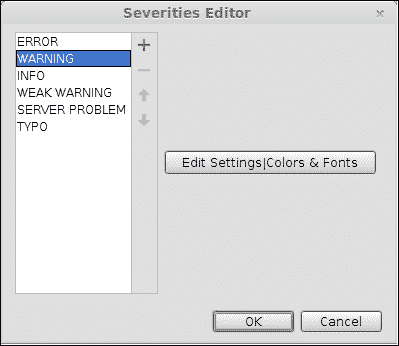
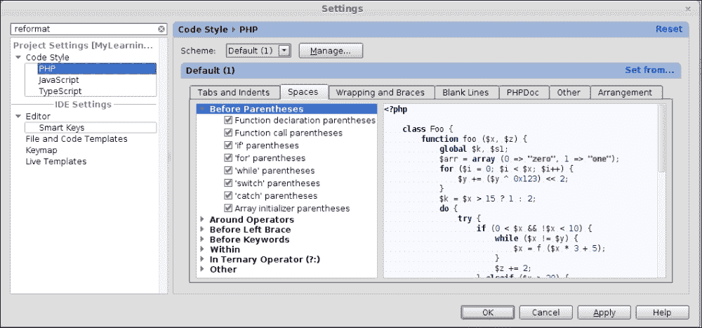

# 第九章。代码质量分析

在本章中，我们将涵盖以下主题：

+   杂乱检测器和 PhpStorm

+   代码嗅探器和 PhpStorm

+   定位代码重复

+   代码格式化和排列

# 简介

工程之美。工程之美在于它在执行甚至最简单的任务时，不留任何石头，不遗漏任何路径。对于普通人来说可能显得过于微不足道——但它们也被工程所关注；软件工程，具体而言。

你会同意时间会使人成熟。你还记得当你作为一个新手软件工程师，面对一个需要解决的问题时，你的态度是怎样的吗？你开始使用你对实际*代码*的幼稚认识来制定计划。多么幼稚啊？随着时间的推移，你开始积累经验，你开始使用类似草稿纸的东西，首先使用原始的草图技术来规划，以可视化算法的流程。这就是你开始感觉到需要工程图的时候。你开始学习 UML——所有建模语言的母亲，也是软件工程的基础。

时间一直在带你经历生活的艰难课程。在适当的时候，你意识到如果不遵循工程原则，前进起来很容易，但道路是单方面的，单向的。一旦你需要回头纠正你作为人类所犯的错误，这个行动可能会让你陷入一种无人遵守重力法则的状态。所以，你和软件工程成为了朋友，生活变得容易多了。

到目前为止，一切顺利。

如果说你可以更多地了解你的亲密朋友——软件工程——这并不错误或不恰当。软件工程不仅帮助你设计系统时保持道德，还跟踪你编写的代码。例如，你编写的代码行数可以作为一个衡量软件成本的指标（考虑到每行代码都花费一定数量的金钱）。你代码中的变量名需要遵循严格的标准。为什么？一旦需要修改，只有人类才需要逐行检查代码。由于变化是不可避免的，这个事件发生的概率很高。

总结来说，软件工程为你提供了系统来分析你的软件应用的这一方面。这个过程被称为**代码质量保证**，因为你可以创建出可读且易于维护的代码。帮助你实现这一里程碑的系统被称为**PHP Mess Detector**（**PHPMD**）和**PHP Code Sniffer**（**PHPCS**）。PHPMD 实际上会识别和检查团队成员在代码库中造成的混乱，并提供警告、错误信息和指示，不仅可以帮助清理混乱的代码，还试图保持代码库的整洁。Code Sniffer 充当嗅探犬，每当它检测到代码库中的潜在错误时就会发出警报。并不是说你的眼睛和大脑无法检测代码中的简单错误，但在开发阶段，作为一位疲惫的软件工程师，你可能会犯下非常简单的错误。随着时间的推移，这些错误会逐渐演变成一个神秘的 bug，可能非常难以破解。PHPCS 在遏制此类错误方面非常有帮助。

一个显而易见的问题：PhpStorm 在这个场景中在哪里？答案是 PhpStorm 始终可供你使用。它是如何做到的呢？提到的两个系统与 PhpStorm 结合使用，以破坏试图潜入开发阶段的 bug，并长时间甚至长时间地困扰你。这是对你带宽的浪费，从而降低了士气——你的经理不会轻易让你离开，直到你能够调试你的应用程序。

# 混乱探测器和 PhpStorm

PhpStorm 是你的忠实勤奋的奴隶。它确保你的任何努力都不会被归类为粗糙或不经过工程化。它是如何做到的呢？它为你提供了集成系统的设施，这些设施反过来帮助你让努力达到工程化的成熟度。你一定很想知道这里所说的系统是哪一个。所以，你可以伸出双手，为被称为 PHPMD 的混乱探测器鼓掌。确实是一个简单的缩写。并不是说 PhpStorm 剥夺了你从代码中清除混乱的应有赞誉，但是的，PhpStorm 为你提供了查找适当版本、下载、集成，然后开始规划要做什么的便利。然后呢？然后呢？只需坐下来，让 PhpStorm 和混乱探测器协作，为你完成任务。

## 准备工作

您需要了解 PHPMD 的最新（且稳定）版本信息。您可以通过任何流行的搜索引擎在互联网上简单地搜索它。官方网站([`phpmd.org/`](http://phpmd.org/))提供了有关可用下载方法的信息。由于您对 PHP 存档有很好的品味，您可以从 URL [`static.phpmd.org/php/1.4.1/phpmd.phar`](http://static.phpmd.org/php/1.4.1/phpmd.phar)（这是撰写本文时可用的最新 phar）获取 phar（这将是可执行文件）。就像其他存档一样，您不需要采取任何其他行动——只有这个下载就足够了。

当您谈论可执行文件时，由于`*nix`系统将所有从外部来源下载的文件视为只读，检查 phar 的访问权限就是您的责任。在大多数情况下，下载的文件只读权限只是为了安全起见。您需要足够聪明，将权限降级以允许适当的存档访问。在`*nix`系统中，有一个可用的命令`chmod`，您可以使用它来在指定的文件或文件夹上玩转访问权限。因此（使用`chmod`），您可能可以将此存档的权限字符串设置为`766`。

## 如何操作...

现在是重要的部分——您需要告诉 PhpStorm 关于 PHPMD 的信息。这是一项您确实需要确保已设置的配置。原因在于 PhpStorm 的开始是为了让 PhpStorm 知道它有一个新成员，因此需要相应地采取适当的行动。执行以下步骤：

1.  您需要选择**文件** | **设置** | **PHP** | **Mess Detector**并设置您刚刚下载的 phar 路径（或者可能从朋友那里借来的），如下面的截图所示：

1.  验证您所做的工作。不用担心，PhpStorm 会帮助您，因为有一个通过**验证**按钮检查配置是否正确的功能。如果您一切都做得正确，您将收到来自 PhpStorm 的绿色信号，指示软件的名称（**PHPMD**）、作者和版本号，如下面的截图所示：

1.  您需要在 PhpStorm 中配置 PHPMD 可用的选项。设置可在**文件** | **设置** | **检查**中找到。

1.  打开检查功能。

1.  通过在**文件** | **设置** | **检查**中打开设置向导并选择**PHP Mess Detector**验证旁边的复选框来配置检查。

1.  存在一系列预定义的规则；您需要根据您的需求选择其中一些或全部。因此，您可以选择一个或所有代码验证规则，然后继续编写代码。就是这样。下面的截图显示了**检查**页面：

    PHPMD 将在后台继续工作，并在你编写代码时继续显示错误和警告。通知是根据你配置的方式进行分类的。

1.  要配置通知，你需要选择单个规则，并根据需要更改颜色、字体等。以下截图显示了在严重性编辑器页面上的“编辑设置\颜色和字体”标签页的外观：

## 它是如何工作的…

让 PHPMD 运行起来并不困难。你只需要做一些设置，然后继续做你最喜欢的工作——编写代码。然而，由于你是一名工程师，你应该渴望了解在引擎盖下究竟发生了什么，让你能够继续前进。

默认情况下，PHPMD 遵循一些规则。这些规则是在考虑到软件工程原则的同时制定的。有一些规则需要检查：

+   **代码大小规则**：时不时会有事件发生，需要你检查代码的大小。重要的是要说明，你不仅是为了写代码而写，而且是为了以后阅读和维护它。一个非常重要的因素是代码的大小及其相关的复杂性。

+   **圈复杂度**：理论上，需要绘制一个流程图来表示所讨论的算法，然后计算边、节点和出口点，最后通过边数减去节点数再加上流程图中的出口点数得到结果。

    PHPMD 在其实现中抽象了这些细节。它考虑了决策点的数量，例如循环结构——if、for、while、case 等，并计算复杂度为代码中的决策点数加 1（一个）作为方法的入口点。

+   **N 路径复杂度**：然后，还有 N 路径复杂度，这是 PHPMD 负责的。N 路径是代码中可能的结果数量。它可以是在代码产生输出的情况下。因此，PHPMD 决定，对于健康的代码，200 是一个合理的限制。这意味着如果你的方法是高质量的代码，你的代码（方法）可以有最多 200 个结果。

+   **过度方法长度规则**：PHPMD 通过计算方法中的代码行数来限制方法的长度。这被称为过度方法长度规则。因此，如果一个方法的代码行数超过 100 行，那么这个方法违反了这一限制，PHPMD 会以警告或你配置的方式向你指示：

    +   如果你类中的代码行数超过 1,000 行，你需要重构你编写的类。谁说的？这是 PHPMD 过度类长度限制。

    +   如果声明的参数数量超过 10 个，PHPMD 会通知你将参数数量减少到 10 个以下。然后你可以尝试传递一个包含类似参数的单个对象。这个规则被称为过度参数列表限制。

    +   如果一个类中有太多的公共成员，PHPMD 将其视为低质量代码，并通过 PhpStorm 向你报告。过多的因素设置为默认值 45，超过这个值，PHPMD 开始将你的代码视为不良代码。

    +   拥有太多的私有或受保护的成员也不被视为良好。如果有超过 15 个这样的成员或字段（更技术性的说法），PHPMD 会通知你。你需要重构你的类以减少字段数量。为什么不尝试使用组合？这是“*有*”关系...还记得吗？

    +   如果你在一个类中写了太多的方法，要小心。PHPMD 将将其视为低质量代码，并指出你需要重构类以减少类中的方法数量。阈值是 10。

+   **有争议的规则**：当以下情况发生时，PHPMD 将代码视为低质量代码：

    +   你可以直接访问一个*超级全局数组*，而不将其封装在某个对象中。

    +   你没有使用驼峰式命名法来命名类、类成员以及你在代码中使用的任何变量。

+   **设计规则**：当用 PHP 编写的代码满足以下条件时，将被视为不良代码：

    +   你的代码中在常规代码中有退出点，例如没有异常/错误处理行的退出点。

    +   你喜欢在代码中使用`eval`。

    +   你觉得在代码中使用`goto`很有趣。

    +   你创建了一个类过多的子类。对于 PHPMD 来说，15 是阈值。

    +   你创建了一个类层次结构，其中一个类继承了超过六个父类。

+   **命名规则**：当 PHPMD 发现以下情况时，也会皱眉并指出代码不良：

    +   变量名过长或过短。当长度超过 20 个字符时，名称过长；当长度小于三个字符时，名称过短。真的非常短！

    +   方法名过短，难以理解。当长度小于三个字符时，名称过短。

    +   构造函数使用了封装类的名称。

    +   类中的常量以小写字母书写，单词之间用下划线（`_`）分隔。

+   **未使用代码规则**：PHPMD 并不重视代码的未使用状态。根据 PHPMD，代码不良的情况包括：

    +   你声明了，并/或为局部变量或私有字段赋值。

    +   你声明并/或定义了一个方法，但没有使用它。

    +   你声明了一个方法的形式参数，但没有使用它。

    这里是 PHPMD 在行动中的样子。你可以看到当你继续编写代码时，PHPMD 如何提供错误和警告：

    

## 还有更多…

如果你认为预定义的规则集不足以支持你的需求，你可以将你自己版本的规则集文件添加到 PhpStorm 中。你需要做的就是创建一个新的 XML 文件，给它一个合理的名字，并让 PhpStorm 将其合并，如下面的截图所示：


你的规则集文件看起来有点像以下代码：

```php
<?xml version="1.0" encoding="UTF-8"?>
<ruleset name="test-ruleset"

xsi:schemaLocation="http://pmd.sf.net/ruleset/1.0.0 http://pmd.sf.net/ruleset_xml_schema.xsd"
xsi:noNamespaceSchemaLocation="http://pmd.sf.net/ruleset_xml_schema.xsd">
<description>A custom ruleset – You can do wonders with this.
</description>
<rule ref="rulesets/codesize.xml/TooManyFields"/>
</ruleset>
```

实际的检测是在你编写`<rule ref="rulesets/codesize.xml/TooManyFields"/>`时进行的，因为正是这一行选择了为 PHPMD 开启哪个选项。其他在开头编写的行——你不需要费脑筋——只是构成了基本框架部分。故事最好的部分是，你不需要记住这些行：你只需从这里复制这些行并将其粘贴到任何你想要的`ruleset.xml`中。你需要记住的唯一事情是你希望应用的规则的准确名称。

# 代码嗅探器和 PhpStorm

你注意到为什么防御人员会使用嗅探犬吗？没有？嗅探犬的目的是嗅探周围物品并检测这些物品中是否存在任何非法物品。你可能想知道狗是如何决定哪个是非法的，哪个是合法的，即使它做到了，它又是如何通知人类关于物品有效性的。狗只知道如何吠叫：它会在两种情况下吠叫，无论是高兴还是悲伤。不管怎样，问题仍然存在。狗是如何知道非法物品的？

答案是直接、简短和简洁的：狗是被*配置*或训练来做这件事的。

你有 PhpStorm 吗？你一直在用它来满足你的编程需求，对吧？你可以用类似的方式使用 PhpStorm 来嗅探你的代码，并在代码包含一些编码标准违规时通知你。为 PhpStorm 提供此功能的是 PHPCS 或 PHP Code Sniffer。

PHP Code Sniffer 是一个 PHP5 脚本，它将 PHP、JavaScript 和 CSS 文件进行标记化，以检测违反定义的编码标准。它是一个确保你的代码保持清洁和一致性的基本开发工具。它还可以帮助防止开发者犯下的常见语义错误。

PHPCS 是一个用 PHP 编写的应用程序，可以用预定义或自定义的编码规则集进行配置。它检测可能的不一致和不整洁的代码，因此不允许常见的语义错误在生产代码中通过。

## 准备就绪

在你甚至计划开始代码嗅探之前，你需要下载 PHPCS 为`.tgz`格式，这样你就可以在你的本地系统中准备好安装文件。该文件可以从[`download.pear.php.net/package/PHP_CodeSniffer-2.0.0a2.tgz`](http://download.pear.php.net/package/PHP_CodeSniffer-2.0.0a2.tgz)下载。之后，就是安装过程。在 PhpStorm 中安装 PHPCS 相当简单（和其他操作一样简单）。你需要执行以下步骤：

1.  将你下载的 tgz 文件内容提取到你的开发机器上的一个方便位置——通常是你用 PhpStorm 进行实验的电脑。

1.  在提取的目录中，找到`phpcs`文件，这是一个用 PHP 编写的脚本。这很可能是脚本目录中。

1.  检查设置在可执行文件上的权限是否足够允许 PhpStorm 使用它。如果你发现可疑之处，请将此 PHPCS 文件的权限设置为`755`。

1.  执行最重要的步骤。你需要告诉 PhpStorm 有 PHPCS 可用。为此，你需要选择**文件** | **设置** | **代码检查器**，并设置此 PHPCS 的路径，如以下截图所示：

1.  验证设置是否已正确设置，并且一切如截图所示正常：

## 如何操作…

在使用 PhpStorm 配置了代码检查器系统后，你不必担心 PHPCS 如何工作。它只是默认的检查系统在后台工作。然而，你需要将其打开。可以通过选择 PHPCS 可用的检查选项来启动代码检查过程：

1.  在右下角，有一个可用的检查图标。你需要点击它，然后点击可用的**配置检查**选项，或者可以通过选择**文件** | **设置** | **检查**来获取相同的选项。

1.  你需要选择 PHP 检查树，并在其中选择**PHP 代码检查器验证**选项。

1.  在编码标准旁边有一个下拉菜单。你需要选择其中一个可用的值。

1.  如果你向 PHPCS 添加更多值，你需要刷新可用的标准列表。刷新操作会通过一个消息得到确认，如以下截图所示：

1.  完成这些后，你现在可以专注于为你的组织编写业务逻辑。PHPCS 将在后台继续运行，并在你进行时持续显示错误。以下是一个显示错误的截图：

## 它是如何工作的…

PHPCS 的工作原理并不难理解——尤其是对于像你这样的人，你已经熟悉 PHPMD 等系统（以防你不熟悉它。这是个双关语！）。PHPCS 还能理解 XML，并且 PHPCS 还内置或预定义了规则。当你将 PHPCS 与 PhpStorm 集成时，这一点尤为明显。你可以通过下拉菜单中的这些默认值访问可用的编码标准。这个下拉菜单的标签是**编码标准**：PHPCS 系统遵循这些标准，并在你打开代码时进行检查。

到目前为止，一切顺利。实际的“关键部分”位于 `ruleset.xml` 文件中。不，这不是由于工程复制粘贴导致的印刷错误！`ruleset.xml` 文件在创建过程中遵循某些标准。驱动 PHPCS 的规则是：

+   由于它是 XML 格式，最重要的行是添加 XML 版本：

    ```php
    <? Xml version="1.0"?>
    ```

+   规则集中所有节点的父节点是 `ruleset` 节点。名称属性使节点在 PhpStorm 中通过名称识别：

    ```php
    <ruleset name="PHP Code Sniffer Standard">
    ```

+   可能有一个描述节点，其中包含正在构建的标准描述：

    ```php
    <description>A custom coding standard</description>
    ```

+   然后是实际的规则。PHPCS 可以接受对他人可能创建的规则的外部引用：

    ```php
    <rule ref="/path/to/some/persons/ruleset.xml"/>
    ```

+   可能有一个包含以 PHP 类层次结构形式存在的代码标准的目录：

    ```php
    <rule ref="/full/path/to/standard-classes/"/>
    ```

+   或者，可能有一个对知名编码标准的引用，例如 PEAR 或 Zend：

    ```php
    <rule ref="PEAR"/>
    ```

+   一些默认标准被包含在以下代码中：

    ```php
    <rule ref="Generic.Files.LineLength.TooLong">
    <message>Line longer than %s characters; contains %s characters</message>

    </rule>
    ```

    或者，它还可以有以下的代码：

    ```php
    <rule ref="Generic.File.LineEndings">
      <properties>
        <property name="eolChar" value="\r\n"/>
      </properties>
    </rule>
    ```

## 还有更多...

由于标准是以 PHP 类层次结构的形式定义的，因此包含也尊重了`ref`属性中的层次模式。所以，实际引用的类是位于`/path/to/PHP_CodeSniffer/CodeSniffer/Standards/Generic/Sniffs/FilesLineEndingsSniff.php`目录下的`Generic_Sniffs_Files_LineEndingsSniff`类，该类是在 2.0.0a2 版本中定义的。正在尝试设置的类属性是`eolChar`，它恰好是类的一个公共字符串类型成员。

你可以在[`pear.php.net/manual/en/package.php.php-codesniffer.annotated-ruleset.php`](http://pear.php.net/manual/en/package.php.php-codesniffer.annotated-ruleset.php)找到示例规则集文件。

# 定位代码重复项

商业需要资金，资金需要工程，工程需要计划，而计划需要时间。由于商业需要资金，而时间就是金钱，因此商业不希望浪费时间。浪费时间就是浪费金钱，所有（软件）商业都认为花出去的钱就是损失。由于商业节省开支，工程就转向代码复用。然而，客户需要质量——毕竟，客户已经支付了一大笔钱来完成这项工作。这是一个恶性循环。

当工程团队时间紧迫时，面临的挑战始终是确保复制粘贴的任务在控制之下，没有副作用。控制意味着软件能够完成预期的任务。副作用是软件中的重复部分，这可能导致代码行数的增加。

情况似乎很严峻！

在你的编码生涯中，你必须始终记住 PhpStorm——无论你是休闲还是遇到麻烦。PhpStorm 总是为你提供一些东西。这次，PhpStorm 将帮助你摆脱这个恶性循环。有一个功能允许你扫描代码并定位重复代码。

## 如何做到这一点...

为了有效地在代码中定位重复项，请执行以下步骤：

1.  你需要从主菜单中选择**代码** | **查找重复**。你将得到一个弹出窗口，这是你的选择点，如下面的截图所示：

1.  默认选择是**整个项目**。你有选择在整个项目中查找代码重复项的选项。

1.  你还可以根据开发周期阶段设置标准来处理文件类型或类别。你可以选择**未提交的文件**来定位你尚未提交的代码中的重复项。这可以是一个提高代码质量的好主意。

1.  你可以在编辑器中选择当前打开的文件来定位重复项。PhpStorm 还为你提供了设置自定义重复查找范围的选择：

    +   **项目测试文件**：当你想要定位为项目创建的测试文件中的重复代码片段时，可以使用此功能。当你有大量的测试用例（具体来说是 PHPUnit 测试用例）时，这会很有用。

    +   **打开的文件**：当你需要选择编辑器中的打开文件时，PhpStorm 会将重复搜索的范围设置为仅限于打开的文件。

    +   **模块**：当你想要分析非项目文件，如库或软件开发工具包（SDK）时，PhpStorm 通过允许此选项为你提供便利。

    +   **当前文件**：当你非常确定只想查看当前打开并正在积极查看的文件时，PhpStorm 为你提供此功能。

    +   **选定的文件**：当你需要从项目视图中选择几个文件时，PhpStorm 会将重复搜索的范围设置为仅限于选定的文件。

    +   **已更改的文件**：作为一名经验丰富的专业人士，你可能需要审查其他开发者编写的代码。此选项对于已更改但尚未提交到代码库的文件非常有用。

    +   **默认**：当你想要在代码库更改的默认更改列表中查找可能的重复项时使用此选项。

    ### 注意

    你可以单独包含或排除重复分析中的测试源。

1.  代码重复分析设置定义了搜索的敏感性，并设置限制以帮助避免报告每个类似的代码结构。以下截图显示了代码重复分析设置：

1.  你可以将函数、变量和字面量匿名化以节省内存堆。

1.  你可以指示 PhpStorm 将重复分析设置限制为仅挖掘大于特定大小的代码块。默认大小为 10。

## 如何工作…

这个问题的答案很诚实！代码重复检测是诚实的，并找出代码中的重复。因此，在你调用重复代码查找器后，它会找到文件中具有重复代码的实例。重复代码块是基于你在设置中指定的过滤条件（请参阅*如何操作…*部分）找到的，如下面的截图所示：


## 更多内容...

需要清楚地理解代码重复的概念，以便深入了解重复分析的工作原理。何时可以将代码块称为重复？答案是：当有多个相同代码行被重写用于不同目的时。由于业务端的压力，你可能会觉得如果你为各种任务复制粘贴相同的代码，你的任务将能够按时完成，但 PhpStorm 对此态度表示反对。每当代码重复时，*DRY*原则就会被违反。每当 DRY 原则被违反时，软件工程要求你确保代码的可重用性。最常见的方法是适当地编写类和方法。由于 PhpStorm 是维护软件工程原则的伟大战士，为了确保这一事业，重复分析会在一个专门的代码重复窗口中列出所有此类发生的情况。

# 代码格式化和排列

一位 PhpStorm 食谱作者说：“仅仅编写代码并不能让你成为软件工程战士——一个工程师只有在代码运行良好，并且相邻的人能从中理解一些东西时，才能成为忍者。”

人们可能会对这个陈述的有效性提出异议。但鉴于工程师中普遍存在对工作不满的趋势，对于你这样的团队高级软件开发人员来说，控制代码的编写方式变得非常重要。当然，这是你的责任！

## 如何做…

1.  当你下定决心确保所写的代码必须格式正确时，你需要从主菜单中选择**代码** | **重新格式化代码**。

1.  如同往常一样，将弹出一个窗口供你进行选择。非常高兴的是，你可以利用这个弹出窗口做些奇妙的事情，如下面的截图所示：

1.  默认选择将格式化当前选定的文件。执行以下步骤以获得所需的结果：

    1.  如果你选择了文本，PhpStorm 只有在提供了**所选文本**选项的情况下才会格式化所选文本。

    1.  当你在**...**选项中选择所有文件时，你可以选择特定文件夹中的所有文件。通过选择**包含子目录**旁边的复选框，你可以选择所选目录内的子目录。

    1.  你可以通过移除代码中不需要的导入来**优化导入**。

    1.  你可以通过选择**重新排列条目**选项来在目标代码中重新排列导入条目。**重新排列条目**将重新排列代码中元素出现的顺序。

    1.  你也可以通过选择**仅 VCS 更改的文本**来仅重新格式化由 Subversion 更改的文本。

    1.  在选择**运行**按钮后，代码格式化过程开始工作。

## 它是如何工作的…

格式化系统通过尊重您在**代码样式** | **PHP**中指定的设置来工作。您可以通过选择选项卡来控制**制表符和缩进**，如下面的截图所示：


代码中要提供的空格是由**设置**面板中的**空格**选项卡控制的，如下面的截图所示：



代码中的包裹和括号是由**包裹和括号**选项卡控制的，如下面的截图所示。此选项卡指定了文本在代码中将如何换行，以及括号在目标代码中将如何格式化。


当在**空白行**选项卡中进行设置时，代码中会适当地插入空白行，如下面的截图所示：


PHPDoc 也可以进行格式化。还记得这个设置吗？


代码格式化涉及在**其他**选项卡下可用的各种设置。这提供了不属于其他类别的通用设置。以下截图显示了**其他**选项卡下找到的代码格式化设置：


类成员的排列是由**排列**选项卡下的设置驱动的。代码中元素排列的顺序可以在该选项卡下找到。您可以使用**管理**按钮保存设置，并在其他项目中使用它。如果您已经在那个“其他”项目中，您需要选择蓝色文本**从...设置**以选择已设置的格式规则，如下面的截图所示：


所有工作都已完成。祝您代码格式化愉快！

在离开厨房之前，我们，作为作者，想声明，由于知识总是在不断演变，因此作为（高级）软件开发者，您不应该将自己限制在有限的知识资源中。作为这一规则的体现，我们计划添加更多因截止日期限制而被跳过的食谱。您可以在 PhpStorm 社区中继续关注更新；同时，作者们将继续致力于 PhpStorm，为您带来更多有趣和美味的佳肴。

这不是结束，而是更多和**前所未有**类型事物的开始。PhpStorm 很棒！
