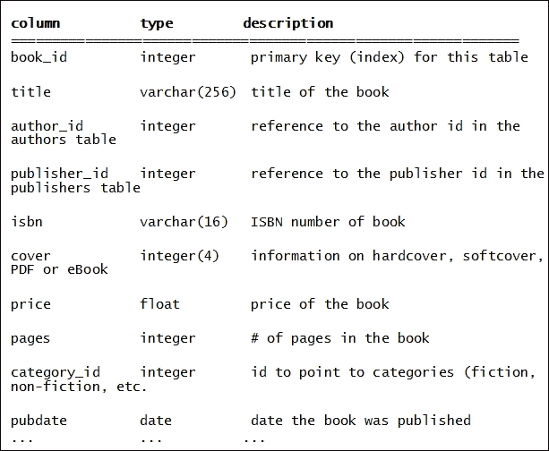
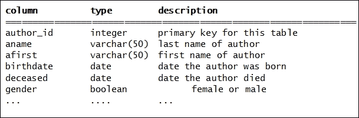

# 第六章 PHP 和 MySQL

在上一章中，我们讨论了 PHP 作为服务器端编程语言的使用。它的主要用途是动态生成 HTML 以创建由 Web 服务器发送给客户端的网页，以及存储、检索和操作服务器上的数据。我们已使用文件作为数据的容器，但我们已经给出不止一个暗示，一旦数据量变得很大和/或复杂，我们希望使用数据库。

在本书第一部分最后一章中，我们介绍了 MySQL，这是许多从事 Web 开发的人的选择数据库。你可能听说过 LAMP 栈。这是 LAMP 中的 M（**Linux/Apache/MySQL/PHP**）。

在深入探讨 MySQL 本身以及如何在 PHP 中与之交互（因此本章的标题）之前，我们想给你一个关于数据库的一般性轻松介绍。

# 数据库

数据库不过是一组数据的集合，通常以某种结构化的方式组织。我们每天都在使用数据库，尽管我们可能不会把它们当作数据库来想。以电话簿为例。它包含大量数据。数据本身由姓名、地址和当然，电话号码组成，通常按姓氏排序。然而，这个纸质数据库有许多缺点。一旦它被打印出来，就会不完整且过时。如果我们想查找住在同一条街上所有人的电话号码，我们就不知道从哪里开始。但它是数据库，没错。

## 关系数据库

**关系数据库**这个术语可以追溯到 1970 年爱德华·弗兰克·科德（Edgar Frank Codd）撰写的一篇文章，当时他在 IBM 工作，这篇文章名为《大型共享数据银行的关系数据模型》（A Relational Model of Data for Large Shared Data Banks）。

它展示了一个显示数据不同元素之间关系的模型，并大量使用表格。在每个这样的表中，都有几个字段或列可以包含各种类型的数据（字符串、数字、日期等等）。这些表中的条目被称为**行**，每行中的第一列是一个索引或主键，一个数字，通常在创建后不会改变。

因此，可以有一个包含客户信息的表。索引代表客户 ID，而所有其他列或字段都是经典的东西，比如名字、姓氏、地址等等。你可以轻松创建其他表并选择它们可以包含的内容。让我们假设我们打算卖书。我们可以有一个包含书籍信息的表，从书籍 ID 开始，书籍标题、作者、类别（小说或非小说，或更多类别）、ISBN 号码、价格、是否为精装、平装或电子书等等。

你可以有一个单独的表用于分类；一个用于作者，当然还有一个用于你的订单信息的表。如果你这样组织你的数据，并在订单信息中使用客户、分类和书籍 ID，那么当例如客户更改地址时，你只需在数据库中的一个地方更改信息。本章中你要学习的数据库正是这样工作的。

我们提出的流程是一个两步过程。在第一步中，我们设计我们希望我们的表看起来如何，以及它们是否应该属于单个数据库或多个数据库。接下来，我们将编写我们的应用程序，如果你愿意，我们的网站，以使用数据库及其表而不是平面文件。

要实现所有这些，你需要学习很多新事物。其中一个新事物是另一种编程语言：**SQL**，这并不令人惊讶。

# SQL

许多人认为 SQL 代表**标准查询语言**，但实际上并非如此——它只是普通的 SQL。然而，它是一种语言，是一种用于在数据库上执行查询的标准。它也是那些存在多年且不会很快消失的少数编程语言之一。我刚开始使用 C 语言时，人们还认为它是新的，但即使那时它已经发展了十年。

SQL 用于查询数据库，可以将其视为一种命令行语言，即输入计算机控制台中的内容。以下是一个例子：

```php
SELECT * FROM CRIMINALS WHERE NAME = "JONES" AND BIRTHYEAR  > "1965";
```

这里还有一个例子：

```php
SELECT  LAST, FIRST, ADDRES FROM CRIMINALS WHERE BIRTHYEAR > "1965";
```

如果这让你想起了*旧金山街道*或其他七十年代的犯罪系列剧的场景，你绝对是对的。他们在这些计算机屏幕上所做的是在数据库中查找信息，而这几乎就是计算机当时唯一被使用的功能。在我们的例子中，`CRIMINALS`是表名，`SELECT`命令用于查找满足（因此`WHERE`）特定条件的所有记录。

没有必要学习完整的语言：只需掌握几个命令和条件语句，我们就能拥有足够的知识来创建程序，这些程序可以在我们创建了数据库和表之后立即执行数据库的基本操作。这组基本操作通常被称为**CRUD**（**创建、读取、更新**和**删除**）。在 SQL 中，我们只需使用五个命令就能处理这些操作：`SELECT`、`INSERT`、`CREATE`、`UPDATE`和`DELETE`。为了适应从两个表而不是一个表中获取数据，你将学习另一个有用的 SQL 特性，称为`INNER JOIN`。

为了避免重复，我们将在 MySQL 部分教授这些命令的基本知识。

# MySQL

你不需要是机械师就能开车，但引擎必须在引擎盖下，否则它不会移动。要运行使用数据库的应用程序，引擎盖下必须有一个数据库引擎。数据库服务器过去是专用计算机；据我所知，卡尔·马尔登和迈克尔·道格拉斯在我之前提到的电视剧中使用了数据库服务器。

现在，数据库服务器通常是软件包。Oracle 公司专注于数据库软件；微软有多个 SQL Server 产品。这些软件包可以安装在专用计算机上，仅作为数据库服务器使用，但也可以安装在充当 Web 服务器的同一台计算机上，以及我们的开发系统上。我们将要使用的软件包被称为 **MySQL**。

MySQL 是开源的，这意味着它是一个由瑞典公司创建并由 Sun Microsystems 收购的数据库服务器，Sun Microsystems 又被 Oracle 收购。

如果你已经为 Windows 安装了如 **XAMPP** 或 **WAMPSERVER** ([wampserver.com](http://wampserver.com)) 这样的捆绑包，那么你已经有 MySQL 了。如果没有，你可以从 [mysql.com](http://mysql.com) 下载它。安装非常简单。之后，你可能需要在计算机设置中检查确保每次启动系统时 MySQL 服务器都会启动。像 UNIX 系统一样，MySQL 有用户的概念，其中最强大的是 **root**。MySQL 安装时 root 没有密码。你应立即更改它。你可以使用 `mysqladmin` 命令来完成此操作。对于其他所有事情，我们将使用工具或自己编写程序。以下是更改 root 密码的命令：

```php
mysqladmin -u root password yourchoiceofpassword

```

# phpMyAdmin

`phpMyAdmin` 是一个用 PHP 编写的开源实用工具，用于帮助您管理您的 MySQL 数据库（们）。您不必使用它，因为还有其他选项，但我已经将其作为我的工作流程的一部分来创建用户、数据库和表格，甚至最初填充表格。这相当于 SQL 精通者所说的 **模式语句**。

我也偶尔使用 `phpMyAdmin` 来删除或更改表格行。`phpMyAdmin` 是 XAMPP 的一部分，所以如果你不使用 XAMPP，你将不得不先下载它。一旦掌握了以下概念，使用起来应该很简单。在最坏的情况下，你可以从网上抓取一些文章。甚至有一本关于 `phpMyAdmin` 的书，由 Packt Publishing 出版。

## 创建数据库

你可以用一个数据库做所有的事情，只需为每个项目添加表格。然而，如果你的项目足够独特且相当大，为每个项目创建不同的数据库会更好。`phpMyAdmin` 允许你这样做，无需使用 SQL 命令。

## 创建和管理用户

我们已经提到了根密码。根用户可以执行所有操作。当你的程序访问数据库时，你不想任何人意外地删除数据库中的任何数据。这就是为什么我们在 MySQL 中创建其他用户，只赋予数据库足够的 CRUD 权限。你只想允许在特定数据库中创建、读取、更新和删除（CRUD 代表的内容）记录。为此，你创建用户，给他们设置密码，并分配权限。再次感谢`phpMyAdmin`，你仍然不需要学习 SQL 命令。

## 创建和管理数据库表

正确规划数据库将包含的表对于成功至关重要。最好首先在纸上草拟一下。一旦你接近你想要的样子，你就可以使用`phpMyAdmin`为你的数据库创建表。你为表命名，指定它属于哪个数据库，然后开始列出所有列，或字段，它们的名称、类型，以及可能的最大长度，索引作为`主键`首先列出。

一旦设置好，你甚至可以开始传播那些表中的数据。对于一个书店 Web 商店应用程序，你可以使用这个工具输入你出售的所有书籍的信息；应用程序本身将负责将客户数据和订单数据添加到你的数据库中。"customers"和"orders"当然可以作为表的选择。使用`phpMyAdmin`，你至少会创建你表的结构，但可能是你的 Web 应用程序填充了数据。以下是有两个表的示例：**books**和**authors**。

书籍表将包含以下数据：



作者表将包含以下数据：



那么，我们如何从应用程序到达数据库？这又把我们带回了 PHP 和**mysqli**对象。

# PHP 中的 MySQLi

尽管我们在第五章中故意省略了这一点，但 PHP 具有面向对象编程语言中的特性。所以，你不必编写函数，而是可以创建对象并为它们编写方法。这正是 PHP 编程接口与 MySQL 工作的方式：有一个专门的`mysqli`对象和一系列方法。使用这些方法，你可以连接到数据库，提交查询，获取结果，最后关闭连接。

假设我们有一个在线书店的 Web 应用程序。我们的数据库名为`bookstore`，我们为它创建了一个用户`bookuser`，密码为`book**4u`。数据库本身至少包含书籍和作者表。

让我们现在用 MySQL 编写第一个 PHP 程序。

## 连接到数据库

首先，我们需要连接到数据库。为了做到这一点，我们需要确定我们想要连接到哪个数据库，数据库服务器在哪个主机上运行，以及我们想要使用的数据库用户。主机几乎总是 `localhost`。所以，这是我们程序的开始：

```php
<?php
$database = "bookstore";
$user = "bookuser";
$password = 'book**4u';  // I want to make sure asterixes do not get expanded
$host = "localhost";
$mysqli = new mysqli();     // create a mysqli object
$mysqli->connect($host, $user, $password, $database);
$mysqli->set_charset("utf8");  // Make sure we  get data back encoded as UTF-8
?>
```

我们可能想要从函数中调用调用连接方法的语句，这样我们就可以添加一些智能功能，在数据库连接失败时，为用户提供有意义的反馈。

关于字符集的说明非常重要。我是一个 I18N 的人，所以我会省略细节；我甚至不会解释 I18N 是什么意思。UTF-8 是一个代码集，它涵盖了用于许多不同语言的字母如何转换成数字。这一行有助于你确认数据是否以正确的方式存储在你的数据库中。

接下来，当你的数据被检索并需要在屏幕上显示时，它可能需要转换成另一个代码集。但这样，你至少知道你自己的数据是如何存储的。

## 我们真正的第一个 SQL 查询！

在纯 SQL 中，从存储在我们表 `books` 中的数据库获取数据的简单查询将是：

```php
SELECT * FROM books WHERE 1;
```

这是 `phpMyAdmin` 会建议的默认 SQL 查询。它甚至可以更短：

```php
SELECT * FROM books;
```

注意到查询以分号结束，并且我们没有提到数据库名称。我们在建立连接时已经做了这件事。所有的 SQL 关键字都是大写的。我们的 `WHERE` 子句是最简单的，因为它总是为真。我们只是添加它来帮助我们理解示例。`*` 告诉服务器获取所有列。如果你只想获取标题和价格，你会使用：

```php
SELECT title, price FROM books WHERE 1;
```

现在，我们将把这个查询翻译成一对 PHP 语句。在你继续阅读之前，我建议（假设你已经创建了一个数据库和书籍表，并在其中放入了一些书籍）你进入 `phpMyAdmin`，选择我们的数据库，点击 **SQL** 选项卡，输入上面的查询，并检查结果。

## 在 PHP 中编写 MySQL 查询

我们在 PHP 中的第一个 MySQL 查询相当简单。我们将把查询转换成 PHP 字符串，并调用 `query` 方法来获取结果：

```php
<?php
$sql = 'SELECT title, price FROM books WHERE 1;';
$result = $mysqli->query($sql);
?>
```

## 获取结果

现在，如果我们正确地输入了所有内容——一开始你可能不小心遗漏了关闭单引号两侧的一个分号——MySQL 将会返回我们表中每本书的标题和价格。它是通过返回一个我们命名为 `$result` 的对象来做到这一点的，我们可以对这个对象应用一些方法。

最简单的一个会给我们找到的行数，最强大的是 `fetch_assoc()`，它将为我们创建一个关联数组，我们可以在 while 循环中立即使用。所以，这就是我们如何用几行代码生成一个包含所有书籍标题和价格的 HTML 表格的方法：

```php
<?php
$numbooks = $result->num_rows;
$htmlstring = '<table><thead><tr><th>Book title</th><th>Price</th></tr></thead><tbody>';
while ($row = $result->fetch_assoc())
{
$htmlstring .= '<tr><td>'.$row['title'].'</td><td>'.$row['price'].'</td></tr>';
}
$htmlstring .= '</tbody></table>';
echo $htmlstring;
?>
```

关联数组的键只是表中列的名称。

## 从多个表中获取数据

假设我们不想列出所有书籍，只想列出单一作者的书籍。我们想要所有 John Muir 的书籍，所以这里的 SQL 命令是：

```php
SELECT title, price FROM books WHERE author_id = ??? ;
```

等一下！我们如何知道 John Muir 的 `author_id` 是多少呢？我们不知道。关于 John Muir，我们知道他的名字和姓氏，这些存储在 `authors` 表中。所以，这就是本章中最困难的一个查询：

```php
SELECT title, price FROM books b INNER JOIN authors a WHERE b.author_id = a.author_id AND aname = "Muir" and afirst = "John";
```

或者，我们也可以使用：

```php
SELECT title, price FROM books b INNER JOIN authors a WHERE b.author_id = a.author_id AND a.aname = "Muir" and a.afirst = "John";
```

注意到细微的差别吗？我们使用 `a` 和 `b` 作为作者和书籍的简称。因为我们明智地选择了字段名，所以在其他表中没有出现重复的名字。如果那样的话，我们就需要指定表名后跟一个点，就像我们在第二个例子中所做的那样。否则，会出现一个关于歧义的错误信息。

查询结果包括了所有书籍的标题和价格，其中 `books` 表中的 `author_id` 与 `authors` 表下的 `author_id` 相同，并且在这个表中，它匹配了 `aname` 设置为 Muir 且 `afirst` 设置为 John 的那些。请注意，使用这个查询可能会返回两个不同的 John Muir 的结果。

这就是如何从多个表中获取数据的方法。还有一些细微差别，比如 `LEFT JOIN` 和 `RIGHT JOIN`，但这些都超出了本书的范围。

# 添加数据

我们提到了使用 `phpMyAdmin` 来传播我们的表。一旦我们的应用程序运行起来，我们需要知道如何使用 PHP 代码添加日期，例如，向系统中添加一个订单。我们将提供一个向 `books` 表添加书籍的示例。当然，我们使用的所有字符串都可以替换为 PHP 变量。我们这里需要的 SQL 命令是 `INSERT`：

```php
<?php
$insertsql = 'INSERT INTO books  (title, author_id, price) VALUES ("My new book", "3", "38);'
$mysqli->query($insertsql);
$newestbook = $mysqli->insert_id;
?>
```

这将自动在你的表中添加一行，创建一个比其他所有值都高一级的主键，插入标题、`author_id` 并将价格插入该行。所有其他字段将获取你在使用 `phpMyAdmin` 构建表时指定的默认值。

如果你想要检索新创建的主键的值，`insert_id` 函数非常方便。我们现在将使用这个函数将价格从 `38` 改为 `39`。

## 更新数据

假设我们想要更改书籍的价格或添加我们在发出添加数据的 `INSERT` 命令时没有输入的信息。这就是 `UPDATE` 命令被使用的地方。其语法如下：

```php
<?php
$updatesql =  'UPDATE  books SET price="39" WHERE book_id='"'.$newestbook.'";';
$mysqli->query($updatesql);
?>
```

这将把刚刚添加的书的定价从 `38` 改为 `39`。

你可以在 [mysql.com](http://mysql.com)、[php.net](http://php.net) 和许多其他网站上找到一个非常全面的 MySQL 命令在线手册；只需在 Google 上搜索 `mysql UPDATE`，它就会出现。这就是为什么我们只在本章中提供基础知识的原因。

# 摘要

在本章中，我们解释了如何将数据库添加到整体网络开发图中。我们选择 MySQL 作为数据库引擎，因为它开源、具有 PHP 编程接口，并且可在所有平台上使用。我们介绍了另一种编程语言 SQL，并解释了它如何与 MySQL/PHP 结合。

为了创建和管理数据库，包括向您的表中添加初始数据，我们讨论了使用`phpMyAdmin`，这是一个我们推荐添加到您的工作流程中的优秀工具。

本章也总结了本书的第一部分，这部分内容涵盖了被我称为经典网络开发的内容。我们回顾了所有经典组件，特别是人们用来开发网站和简单网络应用的编程语言：HTML、CSS、JavaScript、PHP 和 MySQL。

在本书的第二部分，我们将更进一步，向您展示如何编写更短的代码，使用单个网页而不是数百万个网页来完成工作，并以更智能、不同的方式编写一切，以便您的网站或应用在所有设备上看起来都很棒，从桌面到平板电脑再到智能手机。
