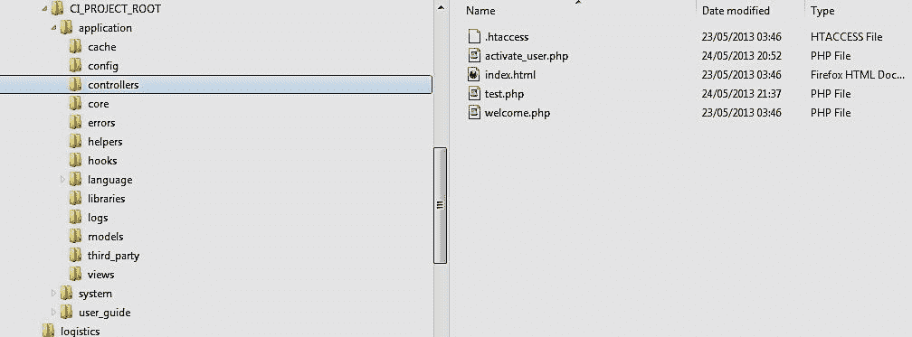

# 第二章. 配置和命名规范

本章最初介绍了 CI 命名规范。这些规范包括规则、风格指南和 CodeIgniter 命名精神。本章的第二部分将回顾 CI 项目配置，包括内置资源以及用户定义的或第三方附加库。请注意，我们实际上将在 第一章 中描述的子目录 application 中构建自己的项目代码，*入门*，可选地包含项目自制的资源的相关资源目录，例如 CSS / 媒体 / jQuery 库的资源或第三方附加组件，扩展从 Ellis Labs 网站或 GitHub 下载的基本 CI。

我们应该记住，开发 CI 项目是通过替换/扩展默认提供的控制器、视图、模型和其他资源，以良好的 OOP 风格完成的。我们应该扩展控制器、模型，添加额外的视图，以及使用定义的帮助器或库。我们可以从第三方库或帮助器中添加这些，或者为我们的特殊项目业务逻辑和需求开发新的。

安装 CI 后的初始步骤是为我们的项目需求进行适当的配置，例如数据库、会话、自动加载的帮助器以及我们想要的库。

CI 在项目目录中定义了一套配置文件，位于 `application/config`。这些配置在执行任何项目 CI 控制器时最初加载，无论是通过浏览器使用 URI 调用还是通过代码发出 HTTP 请求。主要的配置文件是：`config.php`、`database.php`、`autoload.php` 和 `routes.php`。

我们应该审查每个主要配置文件及其配置值，包括推荐值和可能的值。

# CI 目录树

以下是 CodeIgniter 的经典目录树结构：



注意，当我们添加新的插件和其他资源，如 `bootstrap` 时，可能会添加新的资源目录，您可以根据自己的选择命名，以便您可以从正在开发的特定资源中引用它们，使用 CI `BASEPATH` 定义参数作为 `CI_PROJECT_ROOT` 目录的路径。

如果我们在项目根目录下添加一个新目录，比如 `bootstrap`，则包含资源（如 CSS、JavaScript 或图像，例如 `hello.png`）的路径将是 `$path = BASEPATH."bootstrap/hello.png"`。

## config.php

CI 的主要配置文件具有以下主要配置：

```php
$config['base_url'] = '';
```

默认为空字符串，以便 CI 可以计算项目根目录的基本 URL。在我们的代码中，我们将多次引用基本 URL，主要用于执行控制器。要获取基本 URL，我们应该调用：

```php
$base_url = base_url();
// defined in the URL
// helper mentioned before.
```

URL 辅助函数中的 `base_url()` 函数返回 CI 项目基本 URI 字符串。例如，如果 CI 项目是在名为 `example.com` 的域名下名为 `public_html` 的目录中开发的，并且我们有一个名为 `find` 的控制器，一个名为 `stock` 的方法，以及一个名为 `myprod` 的目录，我们可以在 `myprod` 和 `mydev` 项目中使用 `base_url()` 来调用 `find` 或 `stock` 方法：

```php
$url = base_url()."index.php/ find/stock";
```

在 `mydev` 项目中，我们将得到：

```php
$url = "http://example.com/mydev/index.php/find/stock"
```

在 `myprod` 项目中，我们将得到：

```php
$url = "http://example.com/myprod/index.php/find/stock"
```

因此，为了调用名为 `my_class` 的控制器类，我们使用：

```php
$URL = base_url()."index.php/my_class/mymethod";
```

这将定义 `$u` `rl` 为 `http://example.com/` `mydev/index.php/my_class`。

要将索引页面设置为 CI 控制器/方法的 URI 路径的一部分，我们使用：

```php
$config['index_page'] = 'index.php';
```

`index.php` 文件是处理所有 URI 请求的 CI 根 PHP 服务。它用作资源路径 URI 的一部分，例如 `http://mysite.com/fci/index.php/tables_managemen`t/show`。然而，我们可以通过设置 CI 隐藏 URI 路径中的 `index.php` 文件来调用 CI 资源，如[http://mysite.com/fci/tables_managemen`t/show`]。为此，我们需要执行以下配置步骤：

1.  在 CI `index.php` 文件所在的工程根目录中，添加了一个名为 `.htaccess` 的 HTACCESS 类型文件，其中包含以下配置行，它将不包含 `index.php` 的 URI 重定向到 CI 项目控制器路径：

    ```php
    RewriteEngine On
    RewriteCond %{REQUEST_FILENAME} !-f
    RewriteCond %{REQUEST_FILENAME} !-d
    ```

    ```php
    RewriteRule ^(.*)$ index.php/$1 [L]

    <Files "index.php">
    AcceptPathInfo On
    </Files>
    ```

    更多信息请参阅[`en.wikipedia.org/wiki/Htaccess`](http://en.wikipedia.org/wiki/Htaccess)。

1.  我们应该将更改应用到 `/config/config.php` 文件中，以便在 URI 路径字符串中 `index_page` 为空，而不是默认的 `index.php`。 $config['index_page'] = '';

`.htaccess` 文件在这里通过在从浏览器接收 URI 请求并在执行之前将其添加到 URI 中，完成了这个任务。结果是，浏览的用户将看不到它，但它会正确地调用所需的资源，类似于我们使用 `index.php` 的方式：

语言设置如下：

```php
$config['language'] = 'english';
```

建议您将其保留为默认设置。请注意，即使我们使用其他语言，如阿拉伯语或希伯来语，也没有问题。我们只需确保我们的 PHP 文件以 UTF-8 格式保存，不带 BOM（字节顺序标记是一个 Unicode 字符，用于标记支持多语言方案的文件编码方法；有关更多信息，请参阅[`en.wikipedia.org/wiki/Byte_order_mark`](http://en.wikipedia.org/wiki/Byte_order_mark)，以通知接收渲染的 HTML 页面的浏览器将其处理为 UTF-8 文件）。

这个标签的确切含义超出了本书的范围，可以从 HTML 标准中学习。

```php
$config['charset'] = 'UTF-8';
```

此外，为了支持多语言，我们强烈建议在视图文件的 HTML 头部添加以下行：

```php
<meta http-equiv="Content-Type"
content="text/html; charset=utf-8" />
```

这些设置通知浏览器处理字符编码为 UTF-8 的渲染 HTML 页面，这是非英语语言（如希伯来语、阿拉伯语和中文）最常用的多语言标准。

不要修改这些设置；这对于支持多语言非常有用。

```php
$config['enable_hooks'] = FALSE;
```

如果将前面的配置设置为 `TRUE`，将使我们能够定义 CI 事件的钩子，钩子定义在 `application/hooks` 目录中。除非你有针对 CI 事件钩子的特定计划，否则不要修改这些设置。请注意，将钩子添加到 CI 核心活动中的概念超出了本书的范围。

```php
$config['subclass_prefix'] = 'MY_';
```

前面的配置将使我们能够为我们的库类名称的前缀定义命名角色，以便与其他默认库区分开来。

```php
$config['permitted_uri_chars'] = 'a-z 0-9~%.:_\-';
```

前面的代码定义了在调用 CI 资源（主要是控制器）的 URI 中的允许字符。建议不要修改此设置。

```php
$config['allow_get_array'] = TRUE;
```

这将使我们能够以参数调用控制器类方法，例如在前面提供的示例中所示。

```php
<?php echo base_url(); ?>index.php/my_handler/calc/5/7
```

以下代码将提供与 `my_handler` 类本身中的类方法相同的结果，格式如下：

```php
$Val= $this->calc(5,7);
```

以下配置定义是否使用 GET URL 查询字符串：

```php
$config['enable_query_strings'] = FALSE;
```

如果将此配置设置为 `TRUE`，将使我们能够通过 GET URL 查询表单调用控制器类方法：

```php
<?php echo base_url();?>index.php/my_handler/calc.php?a=5&b=7
```

强烈建议将其保留为 `FALSE`，因为 CI 提供了在 URI 中传递参数的解决方案，如本章开头提供的 `calc` 示例所示。

对于严重级别的日志阈值，任何具有相同或更高严重级别的活动都将被记录到 CI 中。支持的阈值级别及其含义如下：

+   **0**：禁用日志（错误日志关闭）

+   **1**：错误消息（包括 PHP 错误）

+   **2**：调试消息

+   **3**：信息性消息

+   **4**：所有消息

    ```php
    $config['log_threshold'] = 4;
    // 4 is the highest level for all CI events from notice level 
    // events and worse
    ```

如果启用了错误日志，前面的配置将在 `/application/logs` 根据日志阈值 `()` 级别生成错误日志。

注意，启用错误日志会导致我们的 Web 应用程序性能降低。只有在必须用于调试时才使用它。否则将其设置为 `0`。

```php
$config['log_path'] = '';
```

CI 项目的默认日志文件路径为 `application/logs`。除非你有明确的原因，否则不要修改此配置。

日期时间格式：

```php
$config['log_date_format'] = 'Y-m-d H:i:s';
```

默认的日期时间格式设置为 `2012-06-18 14:54:11`。建议不要修改此配置。

缓存文件路径：

```php
$config['cache_path'] = '';
```

默认值为 `application/cache`。建议不要修改此配置。会话密钥：

```php
$config['encryption_key'] = '';
```

此 `encryption_key` 必须设置为一个密钥，才能使用会话类服务。例如：

```php
$config['encryption_key'] = 'cMGy4DSwGUvxYSar4279626HgOn2342efrwerr2TE2RF4G3reg4tF3etf';
```

在控制器内使用会话库并设置会话变量的示例如下：

```php
$uid = 119; // where uid is the id of the loggeing user
$this->session->set_userdata ('this_user_id', $uid );
```

在另一个控制器中获取会话变量的方法如下：

```php
$uid = $this->session->userdata('this_user_id');
```

会话数据存储机制如下：

```php
$config['sess_use_database'] = FALSE;
```

如果将推荐配置设置为`TRUE`，我们将使用存储在相关默认数据库中的大量会话参数。

会话过期超时（秒）：

```php
$config['sess_expiration'] = 7200;
// The number of seconds the session will be kept
```

在 CI 用户手册中可以找到额外的会话配置参数。跨站脚本（XSS）过滤激活/停用：

```php
$config['global_xss_filtering'] = FALSE;
```

这将启用对发送到应用程序的 URI 请求的 XSS 过滤。请注意，所有 URI 请求最初都由根`index.php`处理，以分析 URI 请求并发出适当的 CI 调用。如果设置为`TRUE`，它将保护 URI 请求免受 XSS 类型恶意攻击者的侵害。建议即使我们稍微降低应用程序性能，也应将其设置为`TRUE`。

```php
$config['csrf_protection'] = FALSE;
```

如果设置为`TRUE`，CI 将防止**跨站请求伪造**（**CSRF**/**XSRF**）攻击。风险在于欺诈表单提交时。如果我们正在接受用户数据，强烈建议启用 CSRF 保护。请注意，当使用 AJAX 时，可能需要额外的代码来启用带有 AJAX 的 CSRF 保护。

## database.php

数据库配置允许定义一个或多个数据库连接，这些连接可以被应用程序使用。数据库配置以下形式的二维数组：

```php
$db['db_entry']['db_connection_param']
```

通过设置数据库默认条目的参数，我们将定义以下参数：

```php
$db['default']['hostname'] = 'localhost';
// note: in some cases '127.0.0.1' must be used instead 
// localhost if the database server is in another server use
// URI such as: 'domain.db.NNNNNNN.hostedresource.com' or 
// similar – advise our system admin/service provider
// Optional configuration of DB server connection port

$db['default']['port'] = '4009';
// In case our DB server operates on another port
// otherwise we may drop the port config line!

$db['default']['username'] = 'mydefaultdb';
$db['default']['password'] = 'mypass1';
$db['default']['database'] = 'mydatabase1';
$db['default']['dbdriver'] = "mysql";
$db['default']['dbprefix'] = "";
$db['default']['pconnect'] = TRUE;
$db['default']['db_debug'] = TRUE;
$db['default']['cache_on'] = TRUE;
$db['default']['cachedir'] = "";
$db['default']['char_set'] = "utf8";
$db['default']['dbcollat'] = "utf8_general_ci";
```

通过设置名为`dbentry2`的另一个数据库的参数，我们将定义以下参数：

```php
$db['dbentry2']['hostname'] = 'localhost';
$db['dbentry2']['username'] = 'mySecondDB';
$db['dbentry2']['password'] = 'mypass2';
$db['dbentry2']['database'] = 'mySecondDB';
$db['dbentry2']['dbdriver'] = "mysql";
$db['dbentry2']['dbprefix'] = "";
$db['dbentry2']['pconnect'] = TRUE;
$db['dbentry2']['db_debug'] = TRUE;
$db['dbentry2']['cache_on'] = TRUE;
$db['dbentry2']['cachedir'] = "";
$db['dbentry2']['char_set'] = "utf8";
$db['dbentry2']['dbcollat'] = "utf8_general_ci";
```

在加载数据库类时，无需连接和加载默认数据库，因为它会自动完成，但是调用如下：

```php
$this->load->database();
```

或者，为了引用特定的数据库条目名称，它是：

```php
$this->load->database('default');
```

为了连接和加载前面提到的`dbentry2`数据库设置，请使用以下代码：

```php
$this->dbentry2= $this->load->database(dbentry2', TRUE); 
```

要使用数据库类库的默认数据库`db,`，请使用：

```php
$q1 = $this->db->query ("select * from mytable");
```

要使用`dbentry2`数据库，请使用：

```php
$q2 = $this->dbentry2->db->query ("select * from DB2table");
```

## routes.php

定义默认控制器，当通过 URI 引用到项目的`base_url`时将执行此控制器——假设为`http://mydomain.com/myapp`，这样`myapp`就是服务器上`public_html`的子目录，并且我们有`home_page_controller`。

```php
$route['default_controller'] = "home_page_controller"
```

当用户发出`http://mydomain.com/myapp`时，由于对主页控制器的路由配置，CI 将发出的 URI 将好像用户正在引用`http://mydomain.com/myapp/home_page_controller`。

```php
$route['404_override'] = '';
```

在前面的示例中，如果用户引用不存在的项目控制器，如`http://mydomain.com/myapp/sadfasdfsdfsdi`，将执行默认的`application/errors/error_404.php`页面。

例如，我们可能决定为不存在的页面弹出消息并将路由到默认 URI，以最小化用户不便。

# 定义和使用自己的配置

CI 使我们能够定义自己的配置，并通过`config`类轻松访问它们。例如，使用`application/config/my_config.php`，假设我们在该`config`文件中定义了一个参数，如下所示：

```php
$param1 = "value1";
```

我们可以轻松访问我们的配置文件参数，将所有参数加载到数组中：

```php
$array = $this->config->load('my_config', TRUE);
```

第二个参数 `TRUE` 确保我们的配置参数将定义在一个以配置文件名作为前缀的数组中。

考虑以下代码：`$param1 = $array['my_config']['param1'];`

或者：`$param1 = $this->config->item('param1', 'my_config');.` 

`$param1` 将具有我们在构建的配置文件中设置的 `value1` 的值。

# 理解和使用 CI 命名规范

CI 命名规范的理解和使用对于正确使用 CI 进行开发至关重要。它们使您能够使用严格且简洁的规则集编写最小化代码。

完整的 CI 命名规范和风格指南可以在[`codeigniter.com/user_guide/general/styleguide.html`](http://codeigniter.com/user_guide/general/styleguide.html)找到。

命名规范涉及参数、函数/方法、与类相关的 PHP 文件名存储代码、项目资源路径等的命名。以下是我们将审查的具体问题：

+   在我们的项目资源中扩展 CI 资源，如 CI 控制器或模型（以类扩展类的方式——例如，扩展 `CI_controller` 或 `CI_model`；参见 *控制器定义命名规则* 部分中讨论的示例）

+   定义视图并通过控制器渲染它们，无论是否提供视图代码可能用于其操作的参数

+   使用 CI 辅助器和库中现有的通用可重用资源（可以从任何控制器或模型中加载，并由渲染的视图重用），以及定义新的 CI 辅助器和库

+   定位文件和命名的如何做、应该做和不应该做，根据定义的控制器、模型、库和辅助器进行分类

+   定义类资源名称、包含文件名、加载定义的类、辅助器或模型、通过 URI 实例化和调用调用方法以及调用带参数的类方法之间的关系

## 主要资源类型命名规则

CI 定义了“一类一个文件标准”，这样每个 CI 控制器扩展和库类 CI 模型扩展都位于一个文件中。这也适用于一组函数的辅助器。每个资源类别（控制器、库、模型和视图）都将位于特定的目录或其子目录中。最常用的资源类别如下：

+   **控制器**：这些使客户端（例如，浏览器）能够操作

+   **视图**：这些由控制器渲染并通过 HTTP 返回给浏览器

+   **库**：这些由项目资源（如控制器、视图、模型和辅助器）调用

+   **模型**：这些由项目资源（如控制器、视图、库和辅助器）调用

+   **辅助器**：这些由项目资源（如控制器、视图、库和模型）调用


### 控制器定义命名规则

让我们定义一个初始项目控制器来处理一些基本服务。注意，控制器类名为`My_handler`，必须位于我们 CI 项目目录中的`/application/controllers`下的一个名为`my_handler.php`（全部小写）的文件中。以下是用于回顾命名约定的代码示例：

```php
class My_handler extends CI_Controller { 
function __construct(){
// Must Call Patent to get all its services inherited
parent::__construct();
}
  function index () {
// executed when referring to My_handlercontroller via URLecho "Hello World"; }

function calc  ($a = 2, $b=2) {// executed when referring to My_handler/calc via URL echo   " $a * $b = ".$a*$b;
}

functionAJAX_calc () {
// If the request is not an AJAX we shall abort!
//This is done by the
if (!$this->input->is_AJAX_request())  
exit ('none AJAX calls rejected!'); // see http://codeigniter.com/user_guide/libraries/input.html

$a = $this->input->post('a');// get the posted a parameter$b = $this->input->post('b');// get the posted b parameter
$result = (int) $a * (int) $b; 
$data = array('result'=> $result);// to add more array parameters: ,'p2' => $p2, 'p3'=>$p3,..
echojson_encode($data);// return the JSON encoded array
return;
}

} // closing the class definition
```

我们通过 HTTP 请求 URL 调用此控制器，作为 HTTP 或 HTTPS 请求。例如：`http://mydomain.com/index.php/my_handler`。

让我们通过这个控制器类定义来回顾几个使用场景。注意，你可以启用 CodeIgniter 在路径中不使用`index.php`文件来操作；有关更多信息，请参阅本章后面讨论的`index.php`文件问题。在本节中，我们将回顾 CI 控制器及其相关的命名规则的不同用例。以下主要是用于调用控制器的用例：

+   直接从浏览器中

+   从使用 CI PHP 锚点辅助函数嵌入的 HTML 页面脚本中

+   从使用嵌入页面的 JavaScript/jQuery AJAX 调用的 HTML 页面中

+   从使用 cURL 调用的 crontab PHP 脚本中

控制器有其自己的命名规则和使用指南，我们现在将进行回顾。控制器最常见的是通过视图使用锚点标签来调用。然而，它也可以通过 AJAX 甚至使用 PHP 函数文件或基于 cURL 的请求的 crontab PHP 脚本来调用。

### 示例 1 – 调用控制器索引方法

控制器主要通过用户在客户端浏览器处理渲染视图的交互会话来调用。控制器方法被调用以发起另一个进程，例如 AJAX 请求或处理请求并将额外的视图或网页渲染回客户端浏览器。为了在视图定义（application/views）中定义控制器调用，我们定义一个由浏览器根据用户请求执行的锚点。注意，在这些示例中，我们使用了一个名为`anchor()`的其他 URL 辅助函数。

```php
anchor( $uri, $text, $html_attributes);
```

注意，为了使用 CI 锚点辅助函数，我们最初将通过`config/autoload.php`加载辅助函数 URL。

```php
$autoload['helper'] = array('url');
```

另一种方法是加载锚点辅助函数到渲染视图的控制器中，我们想在其中使用锚点：

```php
$this->load->helper('url');
```

+   `$URI`：调用控制器或任何我们想要执行的 URI 路径

+   `$text`：显示给用户点击的锚点标签

+   `$html_attributes`：可以为 HTML 锚点元素定义的任何 HTML 属性

下面是一个客户端浏览器将要执行的 HTML 结果的示例：

```php
<a href="myapps.com/myciapp/showme" class='mybutton'>
Press Me 
</a>
<!-- where 	$uri = 'myapps.com/myciapp/showme';
$text = 'Press Me';
$html_attributes = "class='mybutton'";-->
```

回到我们的例子——允许用户调用定义的控制器的视图代码部分将如下所示（PHP 部分在视图文件中的其他 HTML 标签中）：

```php
<?PHP 
echo anchor(ase_url().' index.php/my_handler ','Press Me A');
?>
```

### 注意

由于我们只引用了类名，其构造函数和（如果定义）索引方法将被执行。如果我们没有为这个 `my_handler` 控制器定义索引方法，前面的调用将仅使用其构造函数定义实例化类，如果定义了索引方法，它也将被调用。在我们的情况下，索引方法被定义了，所以它也将被调用。

### 示例 2 – 不带参数调用控制器和 calc 方法

在本例中，我们允许最终用户调用具有参数的特定类方法，但不需要参数，因此必须通过浏览器使用默认方法参数。

注意，为了使用任何 CI 辅助函数，我们需要确保它已被自动加载或已在控制器（用于控制器方法的用法或渲染的视图）、库或模型中特别加载。

```php
<?PHP 
echo anchor(base_url().' index.php/my_handler/calc ' ,'Press Me B');
?>
```

注意，为了引用名为 `calc` 的特定 `My_handler` 类方法，我们在类名后拼接了 `/calc`。从浏览器发出此视图，我们将得到以下结果：**2 * 2 = 4。为什么？**。

这仅仅是因为我们在接收控制器方法中定义了默认值。因此，如果没有发送参数，如本例所示，将使用这些默认值，它们都设置为 `2`，因此类 `calc` 方法将输出 `4`。

### 示例 3 – 使用参数调用控制器和 calc 方法

在本例中，我们允许最终用户通过浏览器调用具有其参数的特定类方法。

```php
<?PHP
echo anchor(base_url().' index.php/my_handler/calc/5/7', 'Press Me C',);
?>
```

从浏览器发出此请求，我们将得到：**5 * 7 = 35。为什么？**。

由于我们提供了 `5` 作为第一个参数和 `7` 作为第二个参数，使用 CI URI 命名约定中的观察 `/` 将参数值传递给被调用的控制器类方法。由于我们将参数用作乘法整数，PHP 将它们转换为整数，因此我们有 5 * 7，结果是 35。

注意，为了使用参数调用特定控制器方法，我们在方法名后添加 `/` 分隔符，然后跟随着参数，每个参数也由 `/` 分隔。

要更好地理解这一点，请查看以下用例及其含义，CI 使用 URI 如下：

当发出 URI：

```php
<?PHP base_url() ?>/controller_name/method_name/param1/param2/../paramN
```

命名为 `controller_name` 的控制器将由 CI 使用控制器构造函数实例化，然后调用 `method_name` 方法，使用第一个参数 `param1`，第二个参数 `param2`，依此类推。

在 PHP 控制器端，`controller_name` 方法原型将如下所示：

```php
Publicfunction method_name($user, $name, $email, $phone) {
```

因此，`$user` = `param1`，`$name` = `param2`，依此类推。

这是通过 URL 或获取数组的一种可能方式。在 CodeIgniter 中，我们不必获取数组，因此我们可以使用 URI 类来获取参数。有关参考，请参阅 [`ellislab.com/codeigniter/user-guide/libraries/uri.html`](http://ellislab.com/codeigniter/user-guide/libraries/uri.html)。

如果我们提供：

```php
<?PHP base_url() ?>/controller_name
```

如果控制器有此类方法，CI 将仅执行控制器构造函数和 `index()` 方法。

如果我们提供：

```php
<?PHP base_url() ?>/controller_name/method_name
```

以下代码将在调用特定方法`method_name`之后，而不调用`index()`方法之前执行。请记住，我们不应该在我们的参数中使用`/`，并且可能希望使用 URL 编码或其他可逆编码方法提供它们。我们也可以使用 POST/GET 调用我们的控制器方法，以便以以下方式检索在类方法中发布的参数值：

```php
$param1_val = $this->input->post('param1');
```

例如，在类代码中，我们发出一个 AJAX 调用到函数，如下一个示例所示。

### 示例 4 – 带参数调用面向 AJAX 的方法

在这个例子中，我们允许最终用户通过 HTTP `POST`向特定的类方法发出 AJAX 调用，并传递其参数。

```php
<script src="img/jquery.min.js"></script>
<script type="text/javascript">

function AJAX_call () {
a_val  = $('[name="a"]').val();
b_val  = $('[name="b"]').val();
AJAX_url = '<?PHP echo base_url()."index.php/my_handler/AJAX_calc";?>';
$.AJAX({
type: "POST",url : AJAX_url,data:  {a : a_val,  b : b_val },dataType: "json",success: function(data) {$('#result').html (data.result); }
}); // AJAX Call end
}</script>

<form onsubmit="AJAX_call();"><label>Enter A</label><input type="text" name="a" /><label>Enter B</label><input type="text" name="b" />Result:<div id='result'>The Result Will Be Shown Here</div><input type="submit" value="Calculate" /></form>
```

为`A`和`B`输入两个数值并点击**计算**按钮。我们将在`div`部分中，`id='result'`将得到将整数`A`转换为整数并乘以将整数`B`转换为整数的结果。

### 加载库、模型和辅助函数

为了在我们的控制器中重用其他库、模型和辅助函数的能力，我们可能还想将库和辅助函数加载到我们的控制器或模型类中，以便为我们的需求重用它们。如果我们决定某些辅助函数、库或模型是有用的，我们将自动加载它们。我们可以在名为`autoload.php`的自动加载配置文件中这样做，该文件位于我们的项目中的`application/config/autoload.php`。

以下是一个自动加载配置示例：

```php
$autoload['libraries'] = array('template','database','session');

$autoload['helper'] = 
array('url', 'utilities');
// Note: url helper provide base_url() service
```

请记住，如果我们想在某个控制器或模型中加载我们的辅助函数或库，我们可以按照以下示例启用它：

```php
classMy_handler extends CI_Controller { 
function __construct(){
// see previous explanation on this parent call 
parent::__construct();

// Loadingspecific helperto enable calling 
// its functions in all this 
// controller class methods as well as in all 
// rendered views.
// Note how the full name and path is abbreviated:

$this->load->helper('ssl_helper');

//Loading and instantiatinga library s
// application/librarues/smart_handler.php to 
// enable calling all its class methods as from // this controller as well from all the rendered 
// by this controller.
$this->load->library('smart_handler' );
}
function enforce_ssl () {
force_ssl();
// A function in the ssl_helper for more see 
// helpers chapter
}
function smarty () {
//call a method smart_service in the loaded //smart_handler library
//for more see Libraries chapter
$this->smart_handler->smart_service($param1, $param2); 
} 
}//End Controller My_handler
```

我们将按照以下方式调用使用辅助函数的方法：

```php
<?php echo base_url(); ?>index.php/my_handler/enforce_ssl
```

对于加载库中的 smarty 方法调用，我们使用以下代码：

```php
<?php echo base_url(); ?>index.php/my_handler/smarty
```

将参数传递到控制器中的视图，`application/controllers/my_controller.php`如下所示：

```php
$array = array ('a' =>100,'b' =>200);
$view_params = array 
('param1' => 'hello world', 'param2' =>$array
);
$this->load_view('my_view', $view_params);
```

在视图文件`application/views`中的`my_view.php`，视图可以使用以下方法使用提供的参数：

```php
<?PHP 
echo $param1;// will echo hello world
```

注意，在控制器中，它被定义为`param1`键数组元素，其中数组被发送到视图。

```php
// To get the param2 values we shall perform :

foreach ( $params2 as param ){
echo param;  
// will echo 100 and 200 as $params2['a'] and 
// $params2['b'] values
}
?>
```

# 杂项命名约定

CI 指南有一些通用的命名约定，如下所示：

+   您的类、函数和参数应该有简短的名字，如果由多个单词组成，它们应该使用下划线分隔符，如下所示：

    ```php
    // several lowercase words naming with under score
    get_file_properties();
    ```

+   当定义一个字符串值时，如果字符串没有参数要评估，我们应该使用单个逗号，如下所示：

    ```php
    $my_string   = 'the string';
    ```

+   如果我们想让字符串具有一个如`$name`这样的参数，我们使用双引号来编写我们的字符串：

    ```php
    $name = 'big string parameter';
    $my_string = "This is a $name ";
    ```

+   布尔值和联系人名称都应该使用大写：

    ```php
    $this_vale = FALSE;
    // While in javascript we shall use true / false 
    // to distinguish
    ```

对于更一般的 CI PHP 风格指南，请参阅[`codeigniter.com/user_guide/general/styleguide.html`](http://codeigniter.com/user_guide/general/styleguide.html)。

# 摘要

在本章中，我们通过一系列关于参数、类、控制器、模型、辅助函数、库和视图的示例，审查并实践了 CI 的命名规范、规则和用法。

遵循我们已审查的命名规范，我们审查了主要的配置文件，例如`config.php`、`database.php`、`autoload.php`和`routes.php`的深度。我们还审查了在配置用于我们项目的多个数据库时如何使用配置参数。除此之外，我们还看到了如何添加更多针对特定项目的配置。
