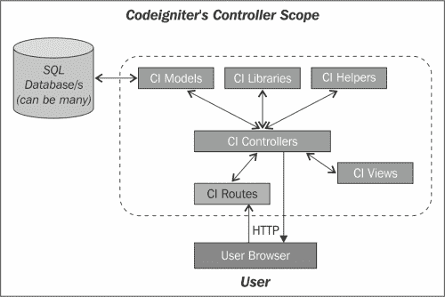

# 第三章 控制器使用和作用域

本章涵盖了 CI 控制器的作用域和不同的控制器使用类别，并提供了几个 Web 应用程序的代码示例。控制器是处理或路由请求以及如何响应操作（如将渲染的视图作为 HTML 页面发送回浏览器，AJAX 响应以允许当前请求页面通过响应更新某些选择器区域，或者甚至只是无缝更新数据库）的前线决策者。控制器使用可用的模型、帮助器、库和视图来响应用户，无论是 Web 浏览器 URL 还是自动发出 cURL 类型`POST`/`GET`请求的 cron 进程。

CI 内置控制器在项目范围内表现得像一个抽象类，因此我们的任何项目控制器都必须是内置 CI 控制器的扩展。我们开发的控制器将继承 CI 内置控制器的功能和内置资源，例如自动加载的帮助器、库和模型，并允许我们编写任何特定的服务作为控制器方法来满足我们的项目需求，并满足视图的渲染需求。

如前所述，控制器是 MVC 开发框架的一部分，该框架与模型一起运行，并应用业务逻辑，通常将视图渲染回客户端 Web 浏览器以进行用户交互。

Web 用户通过浏览器引用一个 URL。在 CI 中，视图是通过调用 CI 控制器方法实现的。CI 控制器方法处理浏览器请求，并发送回一个渲染的视图，该视图成为浏览用户的可视化网页。

从 CI 控制器接收到的网页被称为渲染的控制器视图；它可能包括用户与控制器交互的锚点和按钮。当用户在浏览器中点击一个锚点时，会调用一个控制器（锚点通过 HTTP 请求激活控制器调用）。如果用户发出事件，如按钮点击、操作滚动条等，以便此用户事件将触发使用 jQuery 激活的操作，例如 jQuery 回调函数。jQuery 回调函数可能调用另一个渲染控制器，例如：

`$(location).attr('href',controller_url_to_call);`

另一个选项是激活对 AJAX 控制器的异步 AJAX 调用。此类控制器函数处理我们将在后面讨论的 AJAX 请求。当从服务器返回的 AJAX 调用返回时，其返回的数据可以由客户端 JavaScript 用于更新网页的某些区域/（HTML 选择器/），例如，在输入搜索字符串并发出搜索按钮时，AJAX 响应将提供要可视化的搜索结果，或者将跳转到另一个页面。

更多关于控制器的一般信息可以在[`en.wikipedia.org/wiki/Model-view-controller`](http://en.wikipedia.org/wiki/Model-view-controller)找到。

以下是我们将涵盖的章节主题和子主题：

+   CI 控制器的范围

+   使用类别：

    +   渲染视图

    +   服务器端浏览器 AJAX 请求的控制器

    +   服务器端浏览器 AJAX 请求的 Linux 计划`cron`执行请求

+   CI 控制器扩展和使用（）（有关更多信息，请参阅第二章，*配置和命名约定*）

    +   加载模型、助手和库的资源

    +   使用加载的资源

    +   调用 CI 控制器方法

+   示例 1：默认主页控制器

+   示例 2：发送带附件的电子邮件

+   示例 3：管理员和普通用户登录

我们将首先简要回顾 CI 框架中应用程序控制器的范围和使用案例，以及我们如何使用它们来满足项目需求。

# CI 控制器的范围

CI 控制器是 CI MVC 的中心和大脑，处理 HTTP 请求，如来自浏览器的请求，并与其他 CI 资源一起操作以响应。CI 控制器的范围在以下图中描述，并与其他 CI 资源一起操作以响应请求：



CI 控制器的一般流程如图所示。用户的浏览器将 HTTP 请求发送到 CI 项目的 URL。最初，请求的 URL 通过基于路由配置`/conf/routes.php`的路由进行处理。有关更多信息，请参阅第二章，*配置和命名约定*。特定的 CI 控制器被实例化，并调用特定的方法。CI 方法可能由项目资源（如模型、库和操作助手）协助，如业务逻辑和数据库查询。CI 控制器通常使用定义要响应 HTTP 响应的网页的视图。

# 用户定义的 CI 控制器

每个 CI 项目必须有一个或多个用户定义的控制器才能运行。用户定义的控制器是任何 CI 用户交互的起点。可以通过多种方式调用控制器及其方法。可以通过向浏览器提交项目根 URI 来调用控制器（将调用项目默认控制器），通过从渲染的视图中发出用户锚点，通过客户端 AJAX 请求执行操作（更新页面选择器），或者甚至通过`crontab`（Linux 已知调度服务）计划执行的动作，该动作作为某个控制器方法的 URI 重复执行。

我们可以看到，控制器范围是所有其他项目资源（如模型、视图、助手和库）的通用管理者，管理所有资源以处理来自用户或计划请求的执行请求。

任何应用程序控制器都将位于`project`目录下的`application/controller/`中。

控制器可以加载其他 CI 项目代码资源，包括库、模型和辅助工具，以便它们可以直接由渲染的视图访问。这意味着，如果控制器加载了一个库，渲染的视图 PHP 文件可以以与控制器完全相同的方式调用库函数。以下是可以由控制器加载的代码资源：

+   `application/helpers`：辅助工具是内置的 CI 第三方库或用户自定义的。

+   `application/models`：模型通常是针对特定数据库和特定项目的表用户定义的，扩展了内置的 CI 模型。为特定定义的数据库和表提供 CRUD 服务，也可以是第三方（例如，可以与任何数据库通用使用的通用数据映射扩展）。

+   `application/libraries`：库可以是内置的、第三方的或用户自定义的。库是一个基于面向对象 PHP 类的服务，可以提供与特定项目相关的或跨多个项目的一些可重用服务。例如，作为 Flickr、Facebook 或 LinkedIn 包装 API 库。一个好的做法是，除了我们可能决定使用的第三方库之外，我们还定义面向项目库以增强我们的项目简单性和可维护性。

## 扩展 CI 控制器

正如我们所言，我们的应用程序控制器扩展了内置的 CI 控制器，这在开发范围内类似于一个抽象类，因此为了满足我们的需求使用控制器，我们必须构建一个扩展基本类的控制器。我们可以以几种方式扩展 CI 控制器。

+   加载辅助工具、模型和库的资源：

    +   这些可以来自 CI 内置仓库、第三方开发或自行开发。有关如何自行开发模型的更多信息，请参阅第六章，*模型*；有关如何自行开发库的更多信息，请参阅第四章，*库*；有关如何自行开发辅助工具的更多信息，请参阅第五章，*辅助工具*。

    +   控制器可以在其任何方法中以以下方式加载任何外部资源，通常在构造函数中，以及在资源需要通过`autoload.php`配置文件（ ）在所有控制器中（请参阅第三章，*配置和命名约定*以获取更多信息）。然而，为了实现最佳资源优化，以最小化占用空间和开销，资源将仅在需要其服务的控制器方法中加载。

    下面是一些如何加载所提及资源的示例：

    ```php
    $this->load->model('some_model');
    $this->load->library('some_library', $keyed_array);
    $this->load->helper('some_helper');
    ```

+   添加公共和私有方法：

    +   这是一种常见的 PHP OOP 指南，你应熟悉（尽管有关此内容的详细说明可以在[`php.net`](http://php.net)找到）。以下是一个公共方法如何调用私有方法以获取数据的简单示例：

        ```php
        public function get_something () {
          $some_data= $this->_get_it ();
          }
        private function _get_it () {
          return= 'hello';
          }
        ```

+   使用加载的资源：

    加载的资源可以在加载后使用如下：

    +   使用加载的模型方法：

        ```php
        $status= $this->some_model->save_data($table, $row);$rows= $this->some_model->get_table($table_name);
        ```

    +   使用加载的库方法：

        ```php
        $another_data = $this->some_library->method($some_data);
        ```

    +   使用加载的辅助函数：

        ```php
        $your_ip =get_your_ip();  // myhtml_helper function
        // NOTE: a helper defines regular functions!

        ```

+   调用控制器：

    +   控制器由 CI 核心自动实例化，其方法通过 HTTP URI 调用。有关更多信息，请参阅第二章，*配置和命名约定*。

    +   调用控制器的方法：

        仅调用构造函数，然后调用（如果定义如下）索引方法：`$URI = "base_url().'/mycontroller'; mycontroller';`

        不带参数调用`mycontroller`类的`mymethod`方法：`$URI = "base_url.'/mycontroller/mymethod';`

        使用两个参数 a 和 b 调用`mycontroller`类的`mymethod`方法：`$URI = "base_url.'/mycontroller/mymethod/a/b';`

# CI 控制器使用案例

CI 用户自定义控制器有几种不同的使用场景。通常，CI 控制器将处理启动/渲染 HTML 页面，使我们能够让用户浏览和查看我们定义的不同 Web 应用页面。然而，控制器也可能提供其他服务，例如 AJAX 服务器端控制器，异步处理客户端浏览器请求，并通常返回 JSON 格式的数据而不是渲染的视图。AJAX 的确切范围和用途不是 CI 框架的一部分，但它是一种非常有用的标准事实技术。要了解更多关于 AJAX 的信息，请参考维基百科上的 AJAX（异步 JavaScript 和 XML）[`en.wikipedia.org`](http://en.wikipedia.org)。

在 CI 框架中，我们控制器的主体使用类别如下：

+   渲染视图：这类控制器主要对数据进行一些准备，并将请求的视图以及准备好的数据渲染给用户，以便在下一个用户会话状态中显示 Web 应用。

+   一种特殊情况是主页视图渲染。因此，用户通过 URI 引用项目根目录，如下所示：

    ```php
    http://mydomain.com/my_ci_project.

    ```

+   CI 路由将在项目根目录下的`application/config/routes.php`中将`maincontroller`定义为主页或默认控制器，如下所示。这样，默认控制器将被定义为以下内容：

    ```php
    $route ['default_controller'] = "maincontroller";

    ```

+   然后调用

    ```php
    http://mydomain.com/my_ci_project will be routed by the CI routes 
    ```

    到

    ```php
    http://mydomain.com/my_ci_project/maincontroller
    ```

    对于用户导航请求到另一个页面，我们在渲染的视图中应有 HTML 锚点，用于导航到另一个页面，如下所示视图代码：

    ```php
    <?PHP echo anchor 
        'Navigate me to page B'); ?>

    ```

+   服务器端控制器服务于浏览器 AJAX 请求。这些控制器响应 AJAX 客户端请求，并且通常将 JSON 数据返回给调用 jQuery 脚本的脚本如下：

    ```php
    <script type="text/javascript">
    function autocomplete(clue_val) {
      varurl = '<?php echo site_url(); ?>/AJAX_controller/autocomplete_name';
      $AJAX ({type: "POST", url: url, data: {clue: clue_val},
        dataType: "json", success: function(data) {
          // show the data of matching names
          }
        return;
        });
    ```

+   服务器 Linux 计划任务 `cron` 请求：我们发现 CI 的一个非常强大的用法是服务 Linux `cron` 计划请求，这些请求是在 Linux `cron` 中定义的（有关 Linux `cron` 计划的更多信息，请参阅[`en.wikipedia.org/wiki/Cron`](http://en.wikipedia.org/wiki/Cron)）。

    我们可以在 **DirectAdmin** apache 管理工具中找到一个 UI 编辑器来定义服务器要执行的计划 `crontab` 可重复操作。

    对于每个请求，我们将定义 PHP 处理器路径；例如，`/user/local/bin/php`，以及要执行的 PHP 脚本；例如，`/home/mysite.com/public_html/crontabs/ci_crontab.php`。

    `ci_crontab.php` 可以执行 CI 控制器方法。

    `http://myCIproject/mycontroller/mymethod` 例如，将扫描数据库并更新一个名为 `sums_table` 的表，该表包含所有表在每次执行后添加的行数。让我们看看如何从 PHP 脚本中调用该 CI 控制器的示例。

    为了通过 HTTP 请求调用 CI 控制器，`ci_crontab.php` 将使用 cURL 服务来调用 CI 控制器，类似于我们从浏览器中发出请求的方式（**cURL** （**客户端 URL**），[`php.net/manual/en/ref.curl.php`](http://php.net/manual/en/ref.curl.php)）。

    让我们在 `/home/mysite.com/public_html/crontabs/ci_crontab.php` 中构建。

    Linux crontab 将重复调用每个定义的操作。

    `ci_crontab.php` 的代码将类似于以下代码：

    ```php
    <?PHP
    function file_get_contents_curl($url) {
      $ch = curl_init();
      curl_setopt($ch, CURLOPT_HEADER, 0);
      curl_setopt($ch, CURLOPT_RETURNTRANSFER, 1);
      curl_setopt($ch, CURLOPT_URL, $url);
      $data = curl_exec($ch);
      curl_close($ch);
      return $data;
      }
    $http_to_execut='http://myCIproject/mycontroller/mymethod';
    $result = file_get_contents_curl ($http_to_execute);
    ```

    `$result` 将是控制器生成的输出，主要是简单的 echo 消息，例如 `Processed 127 entries`。当然，我们可以每次记录结果并将其附加到操作日志的日志文件中。

    我们刚刚看到了如何使用 CI 控制器来服务 Linux cron 服务，这在许多业务场景中具有非常强大的功能。

# 示例 1 – 默认主页控制器

初始时，我们将从一个简单的控制器示例开始，该示例打开一个带有导航选项来回切换到另一个页面 B 的主页，以及类似地返回主页。我们将这样做，同时在视图中渲染一些控制器计算的数据。

此示例不使用数据库。此示例将从以下 CI 框架组件配置、控制器和视图文件构建。

让我们定义默认控制器文件名为 `controller/home_page.php`，主页视图为 `views/home_page_view.php`。

假设项目根 URI 为 `http://mydomain.com/myproject`。

## 控制器文件

控制器文件 `/home_page.php` 将准备一些要在视图中显示的数据，并将允许用户导航到页面 B，以及类似地返回主页。

所使用的辅助工具由本书提供的示例源代码提供。

以下是对应的代码：

```php
<?php
class Home_page extends CI_Controller
{
  function __construct() {
    parent::__construct();
    $this->load->helper ('validators_helper');
    $this->load->helper ('dates_time_helper');
    }
  public function index() {
    $data = array ();
    $data ['email'] = $email = "the@email.com";
    // validators_helpercalls
    $data ['email_valid'] = isValidEmail($email);
    $data ['url'] = $url = "http://cnn.com";
    $data ['url_valid'] = isValidURL($url);
    $data ['url_exist'] = isURLExists($url);
    $this->load->view('home_page_view', $data);
    }
  publicfunction page_b () {
    $data = array ();
    $myqsl_date = "1970-01-01";
    // dates_time_helper calls
    $data ['since'] = ui_date ($myqsl_date);
    $data ['past'] = getAgeAccurate ($myqsl_date, $percision = 2);
    $this->load->view ('page_b_view', $data);
    }
  }
// End controller
```

## 视图文件

控制器文件将为显示在主页视图 `views/home_page_view.php` 中的当前日期和时间进行准备。

```php
<!DOCTYPE html>
<meta content="text/html; charset=utf-8"/>
<?PHP
/* data from controller
$email, $email_valid, $url, $url_valid , $url_exist
*/
$validation_text = ($email_valid) ? "Is Valid ": "Is Not Valid!";
$validation_url = ($url_valid) ? "Is Valid ": "Is Not Valid!";
$exist_url = ($url_exist) ? "Exist ": "Not exist!"; ?>
<body style="text-align: left; color: blue;">
<H1>Main Page</H1>
<HR></HR>
<div style = "float: left">
The Email: <? = $email; ?><? = $validation_text; ?>
</div>
<div style = "clear: both;"></div>
<HR></HR>
<div>
The url: <? = $url; ?><? = $validation_url; ?> and <? = $exist_url; ?>
<? = anchor ($url, '[visit the url]', array ("target" => "_blank", "title" => "opens a new Tab")); ?>
</div>
<div style = "clear: both;"></div>
<HR></HR>
<?php echo anchor ('home_page/page_b', 'Navigate me to page B') ?>
</body>
</html>
```

控制器有一个`page_b()`方法来渲染以下视图文件。它将为该页面准备`$since`和`$past`参数，以便在渲染的视图`page_b_view`中内联使用，如下所示：

视图文件是`views/page_b_view.php`。

```php
<!DOCTYPE html>
<meta content="text/html; charset=utf-8" />
<?PHP
/* data from controller $since, $past */ ?>
<body style = "text-align: left; color: blue;">
<H1>Page B</H1>
<HR></HR>
<div style = "float: left">
<!We render the provided controller parameters $since & $past>
Since: <? = $since; ?> past<? = $past; ?> years</div>
<div style = "clear: both;"></div>
<HR></HR>
<?php echo anchor ('home_page', 'Back to Home Page') ?>
</body>
</html>
```

## 配置文件

首先，我们应在 application/config/routes.php 中定义要调用的默认控制器。

```php
For example, $route['default_controller'] = "home_page";.
```

因此，如果你在浏览器中输入项目根部的 URI，比如说：

`http://mydomain.com/myproject`

`http://mydomain.com/myproject/home_page`将被调用。

可选地，我们可以配置 CI 以消除在 URI 路径中需要使用`index.php`来调用我们的 CI 项目控制器/的需求（有关信息，请参阅第二章，*配置和命名约定*）。

# 示例 2 – 发送带附件的电子邮件

在此示例中，我们将看到控制器如何加载邮件服务库并使用它来发送邮件附件。

CI 邮件库不是自动加载的库，因此，将由我们为发送电子邮件构建的控制器来加载。

CI 邮件库使得发送非英语语言的邮件主题和正文变得简单，支持 UTF-8 编码。使用 CI 邮件库添加附件变得轻而易举。我们只需要在我们的服务器上有一个已知的目录路径的文件，并引用它们来附加到邮件中。

我们可以附加一个或多个文件来创建邮件正文。HTML/TEXT 通过 CI 邮件库的简单配置设置来定义。

此示例将仅从邮件控制器构建；你可以在以后添加渲染的视图，以添加到示例报告，发送电子邮件目的地列表的报告，而不是仅发送一到两个目的地的报告。

让我们指定默认控制器文件名为`controller/mail`。

假设项目根部的 URI 是`http://mydomain.com/myproject`。因此，执行发送邮件的控制器 URI 将是`http://mydomain.com/myproject/mail`。

我们应该记住，在 CodeIgniter 中，如果你只引用控制器 URI 路径，CI 将操作功能控制器类`index()`函数，如果有的话。实际上在任何情况下，都会调用控制器构造函数来创建类实例。

## 控制器文件

控制器文件`controller/email.php`将首先加载 CI 邮件库，然后配置邮件服务属性，如发件人/收件人电子邮件地址、主题、HTML 正文和附件文件。最后，控制器将发出库的电子邮件发送服务，获取操作完成状态以报告给网络用户。如果失败，控制器将渲染一个报告，说明失败的原因，并提供 CI 邮件库提供的调试信息。

### 注意

使用的辅助工具由本书提供的示例源代码提供。

由于这个控制器示例有几个函数，我们将在以下代码审查之前先审查它们的用法：

+   `__construct()`：这个构造函数加载 CI 电子邮件库，供其他函数使用

+   `index()`：这构建电子邮件消息并发送到目的地

+   `doc_root_path()`：这提供了查找要发送的电子邮件附件的目录路径

关于加载资源（如库、辅助工具和模型）的需求，最佳实践是在我们的控制器中使用它们的数量。例如，假设我们拥有 40 个控制器，其中 39 个需要相同的库。我们应该将该库添加到自动加载列表中，`/config/autoload.php`。如果我们添加了资源，如库、模型或辅助工具到项目的自动加载中，我们可以通过以下方式消除在需要资源服务的类中加载它：

```php
class Email extends CI_Controller
// The controller/email.php file will contain this class
{
  function __construct()
  {
 // call the parent constructor to inherit all its services
    parent::__construct();
 // Loads the CI e-mail library, so that it will be instantiated // and its methods will be accessed, as $this->mail->METHOD_NAME.
    $this->load->library('email');
    }
 // Define the controller methodindex (the default method), so that referring to the URI mydomain.com/myproject/email will execute the index method call
  function index() {
 // Configure the library to work with UTF-8 strings // multi-language support, as well as enable HTML content body.
    $config['charset'] = 'utf-8';
    $config['mailtype'] = 'html';

 // Loads the configuration settings by initialize method
    $this->email->initialize($config);
 // Since the mail body is HTML, define CR/LF to be // replaced with HTML <BR/>
    $this->email->set_newline("<BR/>");
 // Define the 'From' Email address
    $this->email->from('eliorr@phpmyqsl.com', 'Eli Orr');

 // Define the 'To' Email/s
    $this->email->to (array('"Name 1" <name1@name.com>', '"Name 2" <name2@name.com>'));
 // Set the e-mail subject
    $this->email->subject ("This is the Subject – can be ANY UTF-8 chars");
 // Define the e-mail body in HTML format, as we set the message to be HTML typed
    $this->email->message
    ('<H1>Hello there!<H1/>
    <p>
    This Email is sent from CI via its cool e-mail library)<BR/>
    <font color=green size=3><b>See Attached Files</b></font><BR/>
    Attachedfiles: <BR/>
    <ul>
    <li> 1 - File One.</li>
    <li> 2 - Second File </li>
    </p>
    );

 // Load the attachments
    $path = $this->doc_root_path ();
 // Doc root For example, /home/yourdomain.com/public_html
 // Let say attachment under public_html as /attachments
    $attachment_path1 = $path."/attachments/file1.jpg";
    $attachment_path2 = $path."/attachments/file2.php";

 // Set the two attachment file paths
    $this->email->attach($attachment_path1);
    $this->email->attach($attachment_path2);

 // We have the e-mail object ready! Let us send it!
 // execute send and check the result status
    if ($this->email->send())
    {
 // The e-mail was sent successfully.
      echo 'Your email was sent!';
      }
    else {
 // We had some problems, let's show what was wrong
      echo $this->email->print_debugger();
      }
    }
  functiondoc_root_path () {
    // An auxiliary method for calculating attachment // file path in our server 
    return $doc_root = $_SERVER["DOCUMENT_ROOT"];
    }
  }
```

# 示例 3 – 管理员和普通用户登录

在本例中，我们将看到控制器如何使用模型和视图来协调普通用户和超级管理员用户的登录会话，以便每个用户都有一个独特的菜单。为了使用提供的数据库文件并成功登录，请按照以下步骤操作：

+   对于普通用户登录：

    +   用户：`reg_user`

    +   密码：`111111111`（9 个 1）

+   对于管理员用户登录：

    +   用户：`admin_user`

    +   密码：`111111111`（9 个 1）

此示例将由以下控制器、模型和视图构建：

+   `application/controller/auth.php`：此控制器用于控制认证检查并重定向每个用户类别到其视图或通知登录失败。普通用户和管理员用户将具有不同的视图菜单、消息和注销选项。

+   `application/models/users_model.php`：这是验证提交的用户名和密码（通过 MD5 存储在数据库中）与预定义的用户数据库表的模型。

+   `application/views/login_view.php`：这是显示给未登录用户的视图，以便他们登录。

+   `application/views/logged_in_view.php`：这是显示给成功登录并执行`reg_user`/管理员用户角色的用户的视图。

+   `MySQL 数据库-USERS_DB.sql`：这是我们将会上传到数据库中的数据库表。

假设项目根的 URI 是`http://mydomain.com/myproject`。

因此，执行登录的认证控制器的 URI 将是`http://mydomain.com/myproject/auth`。

## 控制器文件

控制器文件，`controller/auth.php`，最初将加载 CI 表单辅助工具；这个辅助工具将用于构建和操作登录表单。有关辅助工具的使用和作用域的更多信息，请参阅第五章，*辅助工具*。

`users_model`，专门编写以服务于验证用户凭据的控制器，将被加载。`auth`/`index`控制器将从初始阶段以及`login_view`提交后调用。

会话是 PHP 中众所周知的问题，但超出了本书的范围。然而，CI 允许通过名为`ci_sessions`的表将操作会话存储在数据库中供客户端使用。

这样，会话对项目来说就更有序了，可以用来搜索会话和加载会话参数。为了使用数据库存储的会话，我们需要编辑`/config/config.php`。

```php
$config['sess_use_database'] = TRUE;
/* Enforce storing sessions data in the database */

```

此外，我们还将添加一个会话库，因为我们想在这个示例中使用它，以及其他常用的`/config/autoload.php`库。

```php
$autoload['libraries'] = array('database', 'session', 'xmlrpc');

```

如果有提交，密码的输入 post 将不会为空，控制器将使用`users_model`模型进行凭据检查。如果成功，用户记录字段将保留在会话中，并且将根据模型返回的用户角色调用`auth/admin_main_menu`或`auth/user_main_menu`控制器方法。如果已登录用户点击注销链接，将调用`auth/logout`来销毁会话并将用户重定向到登录表单。

以下是对应的代码：

```php
class Auth extends CI_Controller {
  function __construct() {
    parent::__construct
    $this->load->helper ('form');
    $this->load->model ('users_model');
    }
  // called with auth is called with no specific method and // simply calls the login method
  function index() {
    $this->login();
    }
  functionlogin()
  {
    // The message to user in case of login failure
    $msg = "";
    if ($this->input->post('password'))
    {
      // The caller is from the form submission 
      // we will check credentials validity using the local method // check_login.
      $stat = $this->check_login();
      // Extract failure message to user if any
      $msg = $stat ['msg' ];
      if($stat['result'] == 'ok')
      {
        // Successful login!
        // See what We have
        // admin_user or regular user?
        if ($this->session->userdata ('role') == 'admin_user')
        // Issue the controller for admin user main menu
        redirect('auth/admin_main_menu');
        else
        // Issue regular user main menu controller
        redirect('auth/user_main_menu');
        return;
        }
      }
    else {
      // rendered with no submission 
      // let's destroy any previous session and challenge again // the user
      $this->session->sess_destroy();
      }
    // We can get here due to login failure or referring to auth // controller without any active submission.
    // Keep the msg return from the model into view view_setup
    ['msg'] = $msg; 
    // render the login view to challenge the user
    $this->load->view('login_view.php', $view_setup);
    }
  functioncheck_login() {
    // Extract the credentials from the submitted login_viewform
    $user_name = $this->input->post('user_name');
    $password = $this->input->post('password');
    // init an array to return
    $ret = array ();
    // Check if login is ok and get the $row using the loaded // users_model model.
    $user_record = $this->users_model->check_login ($user_name, $password);
    if ($user_record) {
      // User passed credentials checkup successfully
      // We have the user record. Let's use it to extract info // for the logged session buildup
      $this->session->set_userdata ('user_id', $user_record->id);
      $this->session->set_userdata ('user_name', $user_record->user_name);
      $this->session->set_userdata ('role', $user_record->role);
      $ret ['result'] = 'ok'; $ret ['msg' ] = 'Logged-in!';
      }
    else {
    // login failed!
    $ret ['result'] = 'notok';
    // inform the login form to alert user for the failure
    $ret ['msg' ] = 'Invalid User/Pass - Try Again!';
    }
  return $ret;
  }
// logout method called auth/logout
function logout() {
  // destroy the current session
  $this->session->sess_destroy();
  redirect('auth');
  }
functionadmin_main_menu() {
  // Shall render an admin main menu page
  $view_setup ['uid'] = $this->session->userdata ('user_id');
  $view_setup ['user_name'] = $this->session->userdata ('user_name');
  $view_setup ['role'] = $this->session->userdata ('role');
  $view_setup ['menu'] = "Add User/Modify User/Delete User";
  $this->load->view ('logged_in_view.php', $view_setup);
  }

functionuser_main_menu() {
  // Shall render a regular user
  $view_setup ['uid'] = $this->session->userdata ('user_id');
  $view_setup ['user_name']= $this->session->userdata ('user_name');
  $view_setup ['role']= $this->session->userdata ('role');
  $view_setup ['menu']= "View Content/Modify Your Account/Logout";
  $this->load->view ('logged_in_view.php', $view_setup);
  }
}
```

## 模型文件

模型文件`application/models/users_model.php`将为验证用户凭据的用户表提供控制器。如果成功，模型将返回用户数据库行给调用者。

根据`auth/admin_main_menu`或`auth/user_main_menu`返回的用户角色调用。如果已登录用户点击注销链接，将调用`auth/logout`来销毁会话并将用户重定向到登录表单。

以下是对应的代码：

```php
class Users_model extends CI_Model {
  function __construct()
  {
    parent::__construct();
    }
  functioncheck_login ($user, $pass)
  {
 // Important notice.
 // Since the model extends the base CI model, it already got the // instance. However, we can use the $ci = &get_instance(); instead // $this-> anywhere in helpers, libraries, and so on.
  // convert the typed password in the login form to md5, same as // we do, when opening a user account.
  $md5_pass = md5($pass);
  // build up the query 
  $sql = "SELECT * FROM users WHERE user_name = '$user' AND password = '$md5_pass' ";
  $q = $this->db->query($sql);
  if ($q->num_rows()) {
    foreach ($q->result() as $row)
    return $row;
    }
  // In case no num_rows: return NULL;
  }
}
```

## 为此示例上传的数据库文件

我们将上传作为本书资源一部分的数据库文件到与 CI 连接的数据库中。

用户表包括两个用户，即`reg_user`和`admin_user`。他们的密码以文本密码的 md5 存储，其中`111111111`和`222222222`是`reg_user`和`admin_user`用户的密码。

以下是对应的代码：

```php
-- phpMyAdmin SQL Dump
-- http://www.phpmyadmin.net
SET SQL_MODE="NO_AUTO_VALUE_ON_ZERO";
SET time_zone = "+00:00";
--
-- Table structure for table `users`
--
CREATE TABLE IF NOT EXISTS `users` (
  `id` int(11) NOT NULL AUTO_INCREMENT,
  `user_name` varchar(128) NOT NULL,
  `password` varchar(128) NOT NULL,
  `role` varchar(128) NOT NULL,
  PRIMARY KEY (`id`)
  ) ENGINE=MyISAM DEFAULT CHARSET = utf8 AUTO_INCREMENT = 3;
--
-- Dumping data for table users
--
INSERT INTO `users` (`id`, `user_name`, `password`, `role`)
VALUES (1, 'reg_user', 'bbb8aae57c104cda40c93843ad5e6db8', 'regular_user'), (2, 'admin_user', '0d777e9e30b918e9034ab610712c90cf', 'admin_user');
```

## `login_view`视图文件

`login_view`视图由`application/auth/index`索引方法渲染，以向未登录的网站访客显示登录页面，以便在登录阶段挑战他们。

用户输入用户名和密码并提交`login_view`视图表单后，将调用`application/auth/login`，并使用用户模型检查凭据。如果登录成功，并且基于从用户模型获取的已登录用户类别，将调用以下`auth`方法之一：

+   `auth/admin_main_menu`：如果用户具有管理员角色，将渲染成功登录视图供管理员用户使用

+   `auth/user_main_menu`：如果用户具有管理员角色，则用于渲染普通用户的成功登录视图

视图位于 `application/views/login_view.php`。此视图使用了由 `auth` 控制器加载的许多 CI 表单辅助函数。当用户提交表单时，输入首先在客户端进行检查，然后再向 `application/auth` 发出提交调用。

以下为代码：

```php
<!DOCTYPE html">
<meta http-equiv = "Content-type" content = "text/html; charset=utf-8"/>
<html>
<head>
<script src = http://code.jquery.com/jquery-latest.js type = 'text/javascript'></script>
</head>
<body>
<H1>Login Here</H1>
<!—Building the login form using the form helper-->
<?php
// Define the form attributes
// We will use the 'form' helper 'auth' will // be called on submission only, if check_if_valid()// will return true!
$submit_attributes = array('onsubmit' =>"return check_if_valid();", 'id' => 'auth');
echoform_open('auth', $submit_attributes);
echo "<table><tr><td>";
// The attributes of the <input tag>
echoform_label("User Name");
echo "</td><td>";
echoform_input(array('name' => 'user_name', 'value' => ''));
echo "</td><td>";

// The error message holders – hidden by default echo
<label id='user_name_err' style = 'color:red; display:none'>name is too short </label>";
echo "</td></tr><tr><td>';
echoform_label("Password");
echo "</td><td>";
echoform_password("password","");
echo "</td><td>";
// The error message holders – hidden by default echo
<label id='password_err' style = 'color: red; display: none'> password is too short </label>";
echo "</td></tr>";
echo "</table>";
// The submit button echo
form_input(array('type' => 'submit', 'value' =>'Login'));
echoform_close(); ?>
<HR></HR>
<!-- Server Credentials failure message -->
<p style = "color: red"><?php echo $msg; ?></p>
</body>
<!-- Local JavaScript service -->
<script type='text/javascript'>
functioncheck_if_valid() {
  var submit = true;
  varuser_name = $('[name="user_name"]').val();
  var password = $('[name="password"]').val();
  if (user_name.length< 2) {
    $('#user_name_err').show();
    submit = false;
    }
  else $('#user_name_err').hide();
  if (password.length< 6) {
    $('#password_err').show();
    submit = false;
    }
  else $('#password_err').hide();
  return submit;
  }
</script>
</html>
```

## 登录视图文件

`login_in_view` 视图是在成功登录后由 `application/auth/admin_main_menu` 控制器方法或基于用户类别的 `application/auth/user_main_menu` 方法渲染的。该视图根据登录用户的详细信息显示给登录用户。

两个控制器都使用 `users_model` 模型来验证登录尝试并获取登录用户。视图向登录用户显示有关其账户的一些信息，例如用户名和角色以及其用户类别可用的菜单。

视图位于 `application/views/login_in_view.php`。此视图使用 `$user_nam`、`$uid`、`$role` 和 `$menu` 控制器提供的参数显示给登录用户。从该视图，用户可以发出注销锚点，调用 `auth/logout` 来销毁会话并将登录用户重定向到登录视图。

许多 CI 表单辅助函数都是由 `auth` 控制器加载的。当用户提交时，输入首先在客户端进行检查，然后再向 `application/auth` 发出提交调用。

以下为代码：

```php
<!DOCTYPE html">
<meta http-equiv = "Content-type" content = "text/html; charset<!DOCTYPE html">
<meta http-equiv = "Content-type" content = "text/html; charset=utf-8"/>
<html>
<body>
<H1>Welcome <? = $user_name; ?>!</H1>
<H1>You are logged in!</H1>
<HR></HR>
<H3>Your User ID is: <? = $uid; ?></H3>
<H3>Your System Role is:<? = $role; ?></H3>
<H3>Your Menu options: <? = $menu; ?></H3>
<?php echo anchor ('auth/logout', 'Logout') ?>
</body>
</html>
```

# 摘要

在本章中，我们回顾了 CI 控制器的作用域以及针对视图渲染、服务 AJAX 客户端请求或 Apache crontab 定时处理请求的不同控制器使用类别。我们回顾了控制器可以辅助的各种资源，例如辅助函数、库和模型。最终，我们提供了以下使用示例：

+   示例 1：默认主页控制器

+   示例 2：发送带附件的电子邮件

+   示例 3：管理员和普通用户登录
