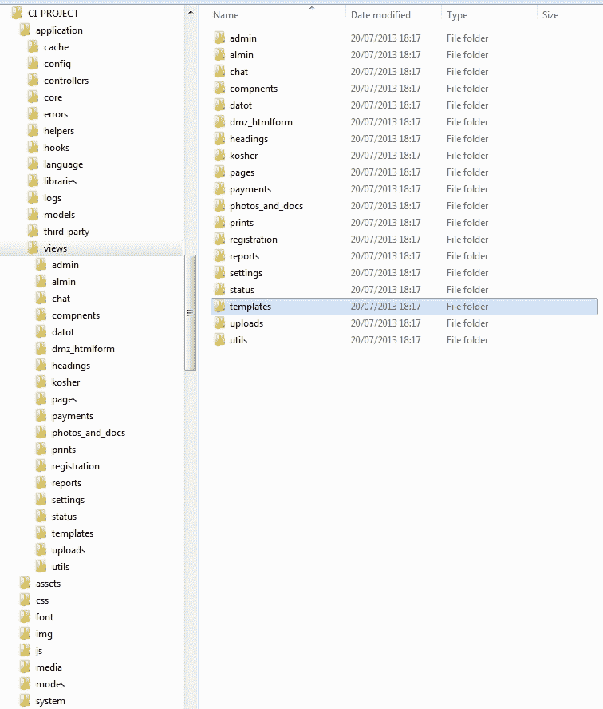

# 第七章。视图

本章涵盖了渲染视图的过程流程、视图文件内的过程流程、不同类型的视图及其与几个网络应用程序代码示例的角色和用法。

视图是程序性部分，为浏览器提供内容，在客户端（即用户的 PC）上执行，以在本地计算机上创建用户界面会话。

PHP 视图文件渲染的输出作为 HTTP 响应内容从服务器返回给请求的浏览器应用程序（即通过在浏览器导航区域提交 URI 来请求）。

初始时，浏览器发送一个 URI 请求，即用户输入的 URI，到默认或特定的控制器方法，例如 `http://mysite.com/myapp/helloworld`。

被调用的控制器方法处理请求，执行其决策，并可能使用其他 CI 资源，如辅助函数、库、模型，最终将视图作为 HTTP 响应渲染回浏览器，该响应是浏览器对控制器操作的初始 HTTP 请求。返回给浏览器的 HTML 文件包括 HTML、CSS 和 JavaScript。浏览器执行从服务器接收到的渲染视图，并使用它来执行用户界面会话（视觉元素和 UI 元素，如按钮、滚动条和导航元素）；我们通过浏览器看到并操作，以导航到其他页面视图或通过发出页面锚点、按钮、点击图标等方式获取特定信息或媒体。所描述的操作会导致另一个 HTTP 请求（s），要么是同步的（主要是锚点），要么是由嵌入网页中的 JavaScript 处理的异步 AJAX 请求（s）。

CI 视图是一个 PHP 文件，可能包含以下部分或全部内容：PHP 语句、HTML 标签、CSS、JavaScript 程序、Flash、图片和媒体源。在 CI 中，视图文件可能包含使用控制器提供的参数的 PHP 代码，甚至可以直接调用 CI 辅助函数、库或模型来生成作为生成 HTML 文件响应一部分的输出。生成的 PHP 输出可以是字符串或数值，它们被整合到 HTML 标签中，甚至可以是一个完整的 HTML 页面。

本章将主要关注以下主题：

+   CI 视图作用域：

    +   CI 视图资源路径

    +   渲染流程

    +   客户端灵活性

    +   在视图中访问库/辅助函数

    +   表单

    +   使用 AJAX

    +   视图解析器配置问题

    +   集成 jQuery 或其他客户端库

+   视图渲染插件（视图模板插件示例）

+   示例 1：由 Google Maps 驱动的 HTML5 位置

+   示例 2：由 AJAX 和 jQuery UI 驱动的用户反馈

我们将首先简要回顾 CI 视图的作用域，然后通过几个使用示例来涵盖可以在实际项目中组合的不同用例。

# CI 视图的作用域

CI 视图具有极大的灵活性，可以集成客户端第三方资源，以及访问 CI 库、辅助函数和模型的 CI 资源。

本节将重点介绍 CI 视图语法和用法指南，作为即将到来的使用代码示例的序言。

我们可以使用 CI echo 系统中的第三方库来扩展 CI 库，或者开发我们自己的库。

## CI 视图资源路径

在 CI 项目中，视图文件位于 `application/views/` 目录或此路径的任何子目录下。例如，我们可以在 `application/views/` 子目录下构建，比如两个不同的视图类别，以提高我们项目中文件结构的清晰度。以下截图显示了 CI 项目目录树中的视图位置：



例如，要渲染位于 `Application/views/templates/` 的模板文件 `home.php`，我们应该编写以下代码：

```php
$this->load->view('templates/home');
//The following load view call, render a view using all its optional parameters
$this->load->view('view_file', // PHP view file to render
$view_params,  // parameters array for view
FALSE  //  FALSE - default. to output
//   TRUE – back as string
  );
```

在此示例中，`view_file` 指的是 CI 资源 PHP 视图文件 `application/views/view_file.php`。

`$view_params` 是视图文件的参数数组（每个条目为标量/数组），正如我们在几个地方之前所展示的，因此每个数组键，比如 `name`，成为视图中的 `$name` PHP 变量以供使用。

如果我们希望将处理过的视图放入缓冲区，用于特殊处理、缓存或其他处理目的，例如，你可以调用以下示例：

```php
$view_buffer=$this->load->view('sectionA/view_file', $params, TRUE);
```

注意，第三个参数的值设置为 `TRUE`（默认值设置为 `FALSE`，并将视图输出到标准输出；在控制器渲染的情况下，这意味着它将作为 HTTP 响应返回给浏览器，由控制器发起请求）。

上述示例引用以下视图文件：`application/views/sectionA/view_file.php`。

## 渲染流程

视图是由控制器渲染的。控制器提供了参数给渲染的 PHP 视图文件以供使用。

控制器使用以下内置 CI load 库：`$this->load->view('my_view',$data);`

否则，控制器将使用第三方渲染服务库。在本章中，我们将使用此类库。CI 控制器渲染是通过 CI load view 库完成的，该库可选地接受渲染的 PHP 视图文件可以使用的 `$data` 参数和对象。以下代码为例：

```php
$data['myval'] = 'Hello';
$this->load->view('my_view',$data);
```

渲染的 PHP 视图文件 `application/views/my_view.php` 如下使用通过加载库提供的 `$data` 参数：

```php
<H1><?PHP echo $myval; ?></H1>
```

注意，控制器如下定义数据：

```php
$data['myval'] = 'Hello';
```

当在 PHP 视图文件中使用的用法如下：

```php
<H1><?PHP echo $myval; ?></H1>
```

之后，PHP 视图文件将被执行，因此生成的 HTML 代码将如下所示：

```php
<H1>Hello</H1>
```

渲染的整个 PHP 视图文件，包括 PHP 执行，将生成将被通过 HTTP 返回给浏览器的视图 HTML 文件，并在本地执行。

## 视图灵活性

CI 为 PHP 视图文件代码使用任何客户端 JavaScript/CSS/HTML 或其他 JavaScript 库提供了灵活性，而无需在服务器端控制器中声明它们，这在某些其他平台上是常见的。

此外，CI 视图可以访问任何其他 CI 资源，例如 CI 库、CI 模型或 CI 辅助函数，就像它是视图的渲染控制器一样；例如，直接访问会话参数。

```php
$param = $this->session->userdata('param1' );
```

此外，CI 视图可以直接调用 CI 库方法，就像渲染控制器一样（假设渲染控制器加载了这个库）。

```php
$calc = $this->my_lib->my_lib_calc( $param);
<H1><?PHP echo $calc; ?></H1>
```

# 访问库/辅助函数

如前所述，CI PHP 视图文件可以访问 CI 的任何资源，例如以与控制器相同的方式调用 CI 辅助函数、库或模型。

以下是一个更详细和完整的 PHP CI 视图文件示例，访问 CI 资源，如库/模型/辅助函数：

```php
<HTML>
<?PHP
// URI is a built-in CI library
// if the rendering controller for this view was// http://mysite/myproject/mycontroller/test3
// the segment(1) = mycontroller – the controller name
// the segment(2) = test3 - the controller method
$the_controller = $this->uri->segment(1);
$the_method = $this->uri->segment(2);
?>
<H1>This View Rendered by Controller
<?=$the_controller; ?> </H1>
<H1>Using its method named <?=$the_method; ?></H1>
```

## 表单

CI PHP 视图文件可以包含任何数量的 HTML 数据输入表单，以接受浏览用户的输入数据。我们可以使用 CI 表单辅助服务来简化数据输入构建并启用验证服务。

CI 表单辅助函数提供了一套有用且全面的 PHP 函数，用于多种数据输入和输入方式。其中我们可以找到文本字段的数据输入、区域文本字段、单选按钮、复选框、组合框和菜单选项。

以下是最常见的 CI 表单辅助函数列表：

+   `form_open()`

+   `form_input()`

+   `form_dropdown()`

+   `form_password()`

+   `form_upload()`

+   `form_textarea()`

+   `form_multiselect()`

+   `form_checkbox()`

+   `form_radio()`

+   `form_close()`

CI 表单辅助函数生成一个 HTML 部分，该部分作为返回给浏览器的 HTML 文件的一部分进行渲染。

例如，让我们看看一个颜色拾取的下拉选择示例。

```php
<HTML>
<?PHP
$attr = ' class="nice_field" ';
$options = array();
$options[0] = 'Blue';
$options[1] = 'Green';
$options[2] = 'Yellow';
$default    = 1;
echo form_dropdown("color", $options, $default, $attr);
?>
```

`form_dropdown` 辅助函数将生成以下代码：

```php
<select class="nice_field" name="color">
<option value="0»>Blue</option>
<option selected=»selected» value=»1»>Green</option>
<option value=»2»>Yellow</option>
</select>
```

更多信息，请参阅 CI 表单帮助用户手册。

## AJAX

异步 JavaScript 和 XML 服务（AJAX）[`en.wikipedia.org/wiki/Ajax`](http://en.wikipedia.org/wiki/Ajax) 在视图中的 JavaScript/jQuery 集成对于今天几乎任何 Web 应用程序都是至关重要的。它通过异步并行于用户操作来提供高级用户体验，并且只更新某些 HTML 选择器部分，而不是整个页面，就像非 AJAX 更新操作一样。

AJAX 有许多用例示例，可以增强用户体验。以下是一些常见的使用示例：

+   当用户在字段中输入时，自动完成功能会显示所有匹配项，并在弹出列表中供用户选择。如果没有 AJAX 自动完成，UI 服务几乎是不可能的。

+   当使用 AJAX 提交表单数据条目时，可以发出服务器提交以存储或处理数据，并在特定的选择器（通知消息）中显示结果，而不是像需要表单操作的提交那样刷新整个页面。（格式：项目符号）

+   当浏览许多信息页面（称为分页）并点击某个页码以查看时。AJAX 允许在整页 HTML 中不刷新整个页面，在选择的 DIV 内渲染所选页面。（格式：项目符号结束）

目前，AJAX 正成为必不可少的视图组件，主要通过流行的 jQuery 库实现，这使得它很容易使用。AJAX 是构建智能和交互式视图的极其宝贵的 UI 资产。例如，以下是一个 AJAX 服务的示例，对于给定的**SSN**（**社会保险号**），如果找到，在定义的选择器中提供个人的姓名和电话号码，否则发出警报。每当用户点击**获取信息**按钮时，就会触发 AJAX 调用，并发送一个异步 AJAX 调用到 AJAX 控制器，以 SSN 获取个人的记录。当响应返回时，如果找到 SSN，个人的电话和姓名将被更新。否则，将提供通知，表示未找到 SSN 个人的记录。

以下是实现之前描述的过程的代码，其中 AJAX 调用是操作的核心：

```php
<script type="text/javascript">
function get_person_info (SSN_val, name_sel, phone_sel, err_sel) {
  /*
  //SSN_val –the value of the SSN user typed in to search 
  //name_sel–the name input that the Ajax will update if SSN found
..//phone_sel-the phone selector to be update if SSN found as well
  //err_sel-the error message area, to explain error such as SSN //not found or some other error occurred.
  */
  varajax_url = '<?php echo base_url();?>ajax/get_person_info';
  $.ajax({
    type: "POST",    //Very important POST is the best
    url: ajax_url,
    // the URI of the AJAX server side controller method that will processes this request
    data: {SSN: SSN_val},
    // SSN is the parameter name
    // SSN_val is the value
    dataType: "json",
    //the retuned data expected to be JSON
    success: function(data) { 
      // the data is the array conversion of the JSON data// retuned to ease our usage in the JavaScript!
      if(data.result=='found') {
        // Let's show the name and phone of the person with the//given SSN
        $(name_sel).val(data.name);
        $(phone_sel).val(data.phone);
      } else{
        // SSN Not found in the database!
        // Let's notify SSN has no person match
        $(err_sel).css ('color', 'red');
        $(err_sel).text('No person found with SSN' + SSN_val );
      }
    },
    error : //Ajax error occurred such as Ajax server not found//and so on
    function ( msg ) { alert ('Error:' + msg )
    $(err_sel).css ('color', 'red');
    $(err_sel).text ('Error:' + msg);
  }
});
// Wait for the document to be ready and bind the user click// on the #get id selector to call the AJAX search service// with the user typed SSN
$(function(){
  $('#get').click( function(){ 
    get_person_info ($('#SSN').val(),
    '#name',
    '#Phone',
    '#err_sel'
  );
  });
});
</script>
```

以下是从 HTML 表单本身的部分：

```php
<form>
<label>Enter SSN</label>
<input type='text' name="SSN" id="SSN">
<button id='get'>Get Info</button>
<BR/>
<label>Name</label><B id='name'></B><BR/>
<label>phone</label><B id='phone'></B>
</form>
<B id='err_sel'></B>
```

## 解析器配置问题

视图在渲染回请求的浏览器之前由 CI 解析器解析。在 HTML 标签内输出 PHP 参数/计算表达式值的默认语法是`<?PHP echo trim($param); ?>`。

然而，CI 在`application/config/config.php`和配置参数`$config['rewrite_short_tags'] = TRUE;`中提供了自动 PHP 短标签解析支持的配置。

如果`rewrite_short_tags`设置为`TRUE`，我们可以使用`<?=trim($param)?>`的短标签。

关于这一点的重要提示是，在调试方面，非短/常规 PHP echo 格式更受欢迎，因为短形式错误可能更难以这种方式追踪。然而，由于这种格式在许多我们看到的代码项目中都被使用，我们也提到了它。

## 集成 jQuery 或其他客户端库

CI 提供了集成任何客户端库的自由，因此 CI 不需要特别配置，或者我们不需要执行任何特殊的 CI 声明。

客户端集成以相同的方式进行，就像没有使用任何平台一样；它们是完全透明的。然而，CI 通过 PHP 提供客户端 jQuery 代码生成服务，例如构建 JavaScript 库以创建 jQuery 代码，作为控制器编码的一部分。

```php
$this->load->library('javascript');
```

然而，对于当今最新的 jQuery 和许多其他基于 JavaScript 的解决方案，没有必要使用这种渲染 JavaScript 片段的方式，但我们可以使用视图本身的 JavaScript A-Z。关于 JavaScript 库的（哇级）资源，可以在我们迄今为止找到的最大的 JavaScript 库资源[`www.jsdb.io`](http://www.jsdb.io)中找到。

在[`delicious.com/eliorr1961`](https://delicious.com/eliorr1961)可以找到更多关于客户端平台的酷链接。

注意，CI 视图中源目录路径的计算，就像视图文件在项目根目录一样。

例如，假设 JavaScript 库位于`<Project_root>/javascript/myjs.js`。

视图位于`<Project_root>/application/views/view1.php`或`<Project_root>/application/views/topicB/view2.php`视图路径下的`views`。

在使用内置 CI URL 助手`<base href="<?php echo base_url() ?>"/>`提供根路径后，两者都将加载`myjs.js`如下：

```php
<script type='text/javascript'src="img/myjs.js" ></script>
```

它们加载时就像它们位于项目根目录一样。这是因为 CI 将请求和视图渲染作为根目录`index.php`的一部分进行处理。因此，所有从视图 PHP 部分来的 SRC 或 INCLUDE 目录路径都被视为来自项目根目录。这是由于所有指向项目的 URI 都是由`index.php`执行的。所以对于所有项目代码，目录路径就像你的代码在`index.php`的同一目录或 CI 项目根目录一样。

## 视图渲染插件

如本章开头所述，我们可以使用第三方库来使我们能够在模板布局方式中创建更高级的渲染服务。

例如，由*Colin Williams*提供的 CodeIgniter 模板类，可在[`www.williamsconcepts.com/ci/libraries/template/index.html`](http://www.williamsconcepts.com/ci/libraries/template/index.html)找到。

此插件使我们能够将渲染的页面定义为一种**乐高**风格的布局，具有预定义的页面区域，这样我们就可以为每个区域使用不同的 PHP CI 视图来渲染。

这样我们可以有很好的可重用性和统一的风格，并填充整个应用程序页面，这在许多情况下是一种好的**UX**（用户体验）实践。在这种情况下，用户，比如说，将知道在顶部他们将有一个特定的主要导航区域，在右侧有某些状态信息和操作快捷方式，等等。

我们可以定义一个或多个布局，这样每个页面布局模板都将有其区域组织。每个区域通常定义在一个 DIV 内。

有多个模板布局，我们最初可以选择我们想要使用的适当布局，然后我们将使用为每个区域定义的 CI 视图来加载其区域内容。例如，假设我们想要一个名为`default`的布局。

`default` 模板的主体布局将被命名为 `template`，例如，使用视图文件 `main_template.php`，因此 `main_template.php` 将包含以下区域：

+   `header`

+   `upper_navigation`

+   `content`

+   `footer`

我们将在 `application/config/template.php` 执行以下配置。

### 注意

这不是 CI 内置插件，而是一个附加插件，包括库和配置文件，以及我们安装到 CI 项目的其他资产。

```php
//The default template shall be defined as follow:
//Note, more templates can be defined in the same fashion
$template['default']['template'] = 'main_template';
$template['default']['regions'] = array ('header', 'upper_navigation', 'content', 'footer');
```

`main_template` 指的是 `application/views/main_template.php`。

`main_template.php` 的内容将包括所有定义的模板区域的渲染，如下所示：

```php
<html>
<body>
<div><?=$header;?></div>
<div ><?= $upper_navigation;?></div>
<div><!--main content area -->
<?= $content; ?>
</div>
<!-- #footer -->
<?=$footer;?>
</body>
</html>
```

为了使用前面的模板插件，我们将执行以下操作：

首先，在 CI 控制器构造函数/s 中加载模板库，我们希望使用模板。请记住，模板库位于 `<Project_root>/application/libraries/Template.php`。

我们将按照以下方式加载模板库：

`$this->load->library('template');`

`<Project_root>/application/libraries/Template.php`

```php
$this->load->library('template');
```

然后，我们将加载我们已配置的特定模板文件（我们可以定义多个以供选择），例如，在控制器构造函数中，我们还将假设所有控制器方法使用相同的模板。

```php
//set the selected template from the template config we want//to use
$this->template->set_template('default');
```

现在，为了使用预定义的视图将模板区域渲染为已渲染的视图，我们将按照以下方式操作：

对于每个模板区域，例如在 `<Project_root>/application/views/`，我们将按照以下方式将其加载到相应的区域：

```php
$this->template->write_view ('header', 'header_view', $data);.
$this->template->write_view('upper_navigation', 'upper_navigation_view', $data );
$this->template->write_view ('content', 'content_view', $data);
$this->template->write_view ('footer', 'footer_view', $data);
```

现在模板区域已使用它们的区域视图文件进行渲染。我们可以按照以下方式渲染整个模板及其所有区域：

```php
// Now, we have all the regions rendered into the
// template instance buffer, we can render them all to
// the desired template base page.
$this->template->render();
```

需要记住的是，模板有很好的优点，但也存在一些缺点。模板强制执行一种非常严格的渲染模板基础页面的方式，这种方式并不总是具有所需的灵活性，因此我们可能会发现自己需要编写多个模板并在它们之间切换，根据 UI 情况而定。

# 示例 1 – 由 Google Maps 提供支持的 HTML5 位置

在本例中，我们将扩展来自 第四章 的 Google Maps 集成示例，*库*，以便将有一个新的选项显示用户在 Google 地图上的位置。为此，我们将使用 HTML5 `navigator.geolocation` 服务请求浏览用户与应用程序共享其位置。如果用户同意，并且使用支持此服务的先进浏览器，例如最新的 Firefox、Chrome 构建。一旦我们获取了值，我们将收集地理位置，并调用控制器方法来准备该区域的 Google 地图，以使用 `navigator` 选项渲染 Google 地图视图。我们将按照以下方式使用 HTML5 `navigator.geolocation` 服务：

```php
navigator.geolocation.getCurrentPosition(getLocation, locationFail);

```

在这里，如果位置成功获取，则调用 `getLocation`，如果失败，则调用 `locationFail`。

我们将从控制器开始。

## 控制器文件

控制器 PHP 文件位于`application/controllers/gmaps.php`。以下是基于第四章*库*的扩展 Google Maps API 集成示例的控制器代码，其中新代码部分被突出显示：

```php
class Gmaps extends CI_Controller
{
// Extends the CI controller to be our Gmaps controller powered by 
// the Google API wrapper library.
 // Setting the initialization parameters of Google Maps 
 // Library Mapper for the window size where the 
 // user interaction with Google Maps created window will occur
 private $user_lon = 0;
 private $user_lat = 0;
  function __construct()
  {parent::__construct();
    $this->load->library('googlemaps');
    // Set the map window sizes:
    $config['map_width'] = "1000px";  // map window width
    $config['map_height'] = "1000px";  // map window height
    $this->googlemaps->initialize($config);
  }
  function index()
  {
  /*Initialize and setup Google Maps for our App starting with 3 marked places: London, UK, Bombai, India, Rehovot, Israel */
  // Initialize our map for this use case of show 3 places // altogether.
  // let the zoom be automatically decided by Google for// showing the several places in one view
  $config['zoom'] = "auto";
  $this->googlemaps->initialize($config);
  //Define the places we want to see marked on Google Map!
  $this->add_visual_flag ('London, UK');
  $this->add_visual_flag ('Bombai, India');
  $this->add_visual_flag ('Rehovot, Israel');

 // **NEW CODE ** 
 // optional user location if user allow it and was fetched// successfully
 if ( $this->is_user_location_defined () ) {
 $this->add_visual_flag ($this->get_user_location ());
 }

  $data = $this->load_map_setting ();
  // Load our view, passing the map data that has just been //created.
  $this->load->view('google_map_view', $data);
}
// ** NEW CODE **
function user_location ($lat=0, $lon=0)
{
 // This is a new code we add for showing the //Geolocation fetched from the view base HTML5 Geolocation//service.
 //Initialize our map with it if it is set.
 if (! $lat&& ! $lon ) $this->index();

 // They are ok - let's keep them 
 $this->user_lat = $lat;
 $this->user_lon = $lon;
 $config['center'] = $this->get_user_location ();
 // Define the address we want to be on the map center
 $config['zoom'] = "5";
 // since its approximate location is country level
 $this->googlemaps->initialize($config);
 //Add visual flag
 $this->add_visual_flag ($config['center']);
 $data = $this->load_map_setting ();
 // Load our view, passing the map data that has just been //created.
 $this->load->view('google_map_view', $data);
 }
// ** NEW CODE
functionis_user_location_defined ( ) {
 return ( $this->user_lat != 0 ) || ( $this->user_lon!= 0 );
 }
// ** NEW CODE
functionget_user_location ( ) {
 return $this->user_lat.", ".$this->user_lon;
 }

functionlondon() 
{
  // as before
  }

functionbombai()
{
  // as before
  }
functionrehovot()
{
  // as before
  }
functionload_map_setting ( ) {
  // as before
  }
functionadd_visual_flag ( $place ) {
  // as before
  }
}
//End class Gmaps
```

## 视图文件

视图 PHP 文件位于`application/views/google_map_view.php`。以下是基于第四章*库*的扩展 Google Maps API 使用示例视图的视图文件代码，其中新代码部分被突出显示。

在这里，我们通过 JavaScript 添加一个 HTML5 服务来收集用户的地理位置，并调用控制器方法`user_location ($lat=0, $lon=0)`。

```php
<!DOCTYPE html">
<meta http-equiv="Content-type" content="text/html;charset=utf-8" />
<html>
<head>
<script src="img/jquery-latest.js" type ='text/javascript'></script>
<script>
// New Code to get the user Geolocation and ask the controller to// render a Google Map for it.
var latitude = 0;
var longitude = 0;
functionshow_on_map () {
 var DIRECTORY_SEPARATOR = '/';

 // Prepare the URL path of calling the Gmaps controller method// user_location with latitude and longitude coordinates as// parameters using the CI naming convention of
 // ControllerName/methodName/Param1/Param2
 Var url_to_show = 
 '<?php echo base_url(); ?>index.php/gmaps/user_location/' +
 longitude + DIRECTORY_SEPARATOR + latitude;
 // Use jQuery to issue the HTTP controller call and rendering// request
 $(location).attr('href', url_to_show );
 }
$(document).ready(function() {
 // if user clicks on the <li> for getting its Geolocation
 $('#getmylocation').click(checkLocation);
 functioncheckLocation() {
 // Check if the browser supports the HTML5 Geolocation
 // Note that navigator.geolocation will pop a request from// the user to allow getting its location (Privacy)
 if (navigator.geolocation) {
 // It does so let the user be notified
 $('#notifications').html ( 'fetching your location, wait...' );
 $('#notifications').css ( 'color', 'blue' );

 // Try to fetch the latitude/longitude of the browsing user//and provides the callbacks
 // Success: getLocation
 // Failure: locationFail
 navigator.geolocation.getCurrentPosition(getLocation, locationFail);
 }

else {
 $('#notifications').html( 'Sorry, your browser settings does not enable fetching yourGeolocation');
 } // ends checkLocation()
 //this is what happens if getCurrentPosition is successful
 functiongetLocation(position) { 
 latitude = position.coords.latitude;
 longitude = position.coords.longitude;
 // Notify user for its location:
 $('#notifications').html
 ( 'Your approx. position : (' + latitude + ',' + longitude + ')' );
 $('#notifications').css ( 'color', 'green' );
 // Two seconds after the notification to user we have the// location issue call to the controller to show it on// the Google Map
 setTimeout ( show_on_map, 2000);
 }
 //this is what happens if getCurrentPosition is unsuccessful//(getCurrentPositionerrorCallback)
 functionlocationFail() {
 $('#notifications').html('Sorry, your browser could not fetch your location ...');
 $('#notifications').css ('color', 'red');
 }
 });
 </script>
    <!—As Before..  -->
 <!—Notification selector  -->
 <HR></HR>
 <DIV style='background:lightgreen;width:300px;'>
 <span id='notifications'>...</span>
    </DIV>
    <HR></HR>
    <ul>
    <!-- Let the User Always Get Back to the default Zoom out withall places marked>
    <li><?php echo anchor("index.php/gmaps", '<B>See All Locations</B>' ) ?></li>
 <!—If user clicks this one the Geo Location service will start -->
 <li id = 'getmylocation' style = 'cursor: pointer;color: blue; decoration: underline'> Show Me My Location</li>
    <!—As Before..  -->
```

# 示例 2 – 由 AJAX 和 jQuery UI 驱动的用户反馈

在本例中，我们将展示如何使用 jQuery UI 和 AJAX 调用 CI AJAX 控制器方法来收集用户反馈，并在不刷新/渲染页面的情况下提交。

我们将重用并扩展第三章中的登录示例，即*控制器的使用和范围*，因此如果用户已登录，我们将使用会话中保存的用户 ID 记录反馈，如果没有，我们将将其记录为匿名用户反馈。

记住以下事项：

+   **用户名**: `reg_user`,

+   **密码**: `111111111` (9 个 1)用于普通用户登录

重用和扩展的资源如下：

+   `auth.php`: 这里没有变化

+   `ajax_handler.php`: 这是新的 AJAX 处理器控制器

+   `users_model.php`: 这是扩展的用户模型

+   `logged_in_view.php`: 这是扩展的普通用户登录视图

我们扩展代码以包括新的`Ajax_handler`，以保持 jQuery UI 对话框提交的浏览用户反馈，并通过 AJAX 异步接口获取用户登录消息。注意，我们在`Ajax_handler`中检查请求是否为 AJAX。如果不是，我们在浏览器中发出以下 URL：

[`photographersnav.com/ci_utils/index.php/ajax_handler`](http://photographersnav.com/ci_utils/index.php/ajax_handler).

我们将在浏览器中收到通知，这是一个错误的请求。

`users_model`资源被扩展以提供更多服务，具体如下：

+   `get_logged_in_user()`: 此函数用于在用户登录时返回登录用户记录，否则返回 NULL。`get_user_rec` ( `$uid` )根据其 ID 获取特定用户记录。

+   `keep_user_feedback` (`$feedback`): 此函数用于将用户反馈及其用户 ID 存储在数据库中，如果用户已登录。

+   `get_user_feedbacks` (`$uid`): 此函数获取迄今为止保存在数据库中的所有用户反馈消息，以数据库对象数组的形式。每个反馈数据库行返回的反馈消息及其时间戳格式化为 HTML，并通过 JSON 格式返回给 AJAX 调用者，以便通过 jQuery 选择器基于 HTML 渲染显示给最终用户（例如，`$(selector).html` (`从服务器返回的 _html_item`)）。

`logged_in_view` 资源已扩展，为用户提供以下新服务：

+   添加一个新的反馈按钮，点击后会弹出用于此目的的 jQuery UI 对话框

+   显示反馈日志按钮，点击后会显示一个可滚动的用户反馈列表

现在我们来回顾源代码本身。

## `ajax_handler.php` 控制器文件

控制器 PHP 文件位于 `application/controllers/ajax_handler.php`。代码和内联说明如下：

```php
<?php if (!defined('BASEPATH'))exit('No direct script access allowed');
class Ajax_handler extends CI_Controller {
  function __construct()
  {parent::__construct();
    /* Standard libraries, database & helper URL loaded via theauto load
    */
    if (!$this->input->is_ajax_request())
    {exit( "Bad Request ignored! - Your info has been logged forfurther investigation of attacking the site!");
    }
  /* ------ Our Users Model ---------- */
  $this->load->model ( 'users_model' );
}

functionsave_user_feedback () {
  // Get the feedback content
  $feedback = $this->input->post('feedback');
  // Get if the user is logged in keep the user id
  $this->users_model->keep_user_feedback($feedback);
  }
functionget_user_feedback_log () {
  $user = $this->users_model->get_logged_in_user ();
  if ( $user ) $uid = $user->id;
  $user_feedback_rows = $this->users_model->get_user_feedbacks( $uid );
  $html = '';
  foreach ($user_feedback_rows as $row )
  $html.= $row->timestamp.' -  <B>'.$row->feedback.'</B><BR/>';
  $result = array ('result' => $html);
  echojson_encode ($result);
  return;
  }
} // End Ajax_handler
```

## `users_model.php` 模型文件

模型 PHP 文件位于 `application/models/users_model.php`。代码和内联说明如下：

```php
<?php if (!defined('BASEPATH'))
exit('No direct script access allowed');
class Users_model extends CI_Model {
  function __construct()
  {parent::__construct();
  }
  functioncheck_login ($user, $pass)
  {
    /* No change here
    */ 
    }
  functionget_logged_in_user (  )
  {
    // Will check if there's a login user session and if so will// fetch its record
    $ci = &get_instance();

    //get the login in user ID, if any
    $uid = $this->session->userdata('user_id');
    if (! $uid ) return NULL;
    $sql = "SELECT *
    FROMusers
    WHERE id = '$uid' ";

    $q = $ci->db->query($sql);
    if ($q->num_rows())
    {foreach ($q->result() as $row )
      return $row;
      }
    return NULL;
    }
    Function get_user_rec ( $uid ){
      // Will check if there's a login user session and if so will// fetch its record
      $ci = &get_instance();
      // get the login in user ID, if any
      if (! $uid ) return NULL;
      $sql = "SELECT *FROM users WHERE id = '$uid' ";
      $q = $ci->db->query($sql);
      if($q->num_rows())
      {foreach ($q->result() as $row ) return $row;
        }
      return NULL;
      }
    Function keep_user_feedback ($feedback) {
      $ci = &get_instance();
      $uid_rec = $this->get_logged_in_user ();
      $uid = $uid_rec ? $uid_rec->id: 0;
      /* id email uid feedback timestamp
      */
      $table = 'user_feedback';
      $data = array ( 'feedback'  =>urldecode ($feedback),'uid'=>  $uid);
      $ci->db->insert($table, $data);
      }
      Function  get_user_feedbacks ( $uid ) {
        $ci = &get_instance();
        if (! $uid ) return NULL;
        $feedbacks = array();
        $table = 'user_feedback';
        $sql = "SELECT * FROM  $tableWHERE  uid = '$uid'
        ORDER BY timestamp DESC";
        $q = $ci->db->query($sql);
        if ( $q->num_rows() ) {
          foreach ($q->result() as $row)
          $feedbacks[] = $row;
          }
        return $feedbacks;
        }
      } // End Users_model
```

## `logged_in_view.php` 视图文件

PHP 视图文件位于 `application/views/logged_in_view.php`。此文件扩展了几个更多服务，如前例所述。代码和内联说明如下：

```php
<!DOCTYPE html">
<meta http-equiv="Content-type" content="text/html;charset=utf-8" />
<html>
<head>
<script src="img/jquery-latest.js" type='text/javascript'></script>
<scriptsrc="img/jquery-1.8.2.js"></script>
<script src="img/jquery-ui.js">
</script>
<link rel="stylesheet" type="text/css" href="<?=base_url(); ?>/css/my_style.css" media="screen" />
<script type='text/javascript'>
// The AJAX handler controller method URLs
varsave_user_feedback_submitter = '<?=site_url()?>'+'index.php/ajax_handler/save_user_feedback';
varget_user_feedbacks = '<?=site_url()?>' +'index.php/ajax_handler/get_user_feedback_log';
functionajax_save_user_feedback (feedback) {
  $.ajax({
    type : "POST",
    url : save_user_feedback_submitter,
    data : {feedback: feedback},
    dataType: "json",
    success: function(data) {
      // When AJAX return back alert // ('Your feedback Updated - Thanks!');
      }
    });
  }

functionajax_get_user_feedback_log() {
  $.ajax({
    type: "POST",
    url: get_user_feedbacks,
    dataType: "json",
    success: function(data) {
      $('#feedback_log_view').show();
      $('#feedback_log_view').html(data.result);
      }
    });
  }
$(document).ready(function() {
  // Set up the jQuery UI feedback dialog
  $("#ideas-form").dialog({
    autoOpen: false,
    height: 270,
    width: 700,
    modal: true,
    resizable: false,
    effect: 'drop',
    direction: "up",
    show: "slide",
    buttons: {
      "Send Us Your Feedback": function() {
        varuser_feedback = $('#user_feedback').val();
        ajax_save_user_feedback(user_feedback);
        // clean feedback entry for next one
        $('#user_feedback').val('');
        // Show user all its feedback so far
        ajax_get_user_feedback_log();
        $(this).dialog("close");
        },
      "Cancel": function() {
        $(this).dialog("close");
        }
      }
    });

  // When user clicks on for a popup feedback window
  $('#user_ideas').button().click(function() {
    $("#ideas-form").dialog("open");
    });

  $('#feedback_log').button().click(function() {
    ajax_get_user_feedback_log();
    });
  });// Document ready section
</script >
</head>
<body>
<H1>Welcome <?=$user_name; ?>! </H1>
<H1>You are logged in! </H1>
<HR></HR>
  <H3>Your User ID is: <?=$uid; ?></H3>
  <H3>Your System Role is: <?=$role; ?></H3>
  <H3>Your Menu options: <?=$menu; ?></H3>
<DIV>
  <button id='user_ideas' style="cursor: pointer; position: relative; top:0px" title='Share your feedback/ideas'> Add A New Feedback </button><BR/>
  <button id="feedback_log" style= "cursor: pointer; position: relative; top:0px" title="Your feedback log"> See Your Feedback Log </button>
</DIV>
  <div id='feedback_log_view' style= "display: none; width: 800 px; border-style: solid;border-color: black; overflow-x: auto; height: 200 px; overflow-y: auto;">
</DIV>
<H2><?php echo anchor ('index.php/auth/logout', 'Logout')?></H2>

  <div id= "ideas-form", title= "Your Feedback To Improve">
<form>
<fieldset>
<span id= "user_name" class= "text ui-widget-content ui-corner-all"> Thanks <? = $user_name; ?>, Please share your feedback with us</span>
<textarea name= "idea_desc", id = "user_feedback", rows = "10" cols = "83", placeholder = 'Your ideas'></textarea>
</fieldset>
</form>
</div>
</body>
</html>
```

# 摘要

在本章中，我们回顾了 CI 视图、作用域以及它们的通用 MVC 作用域，以及不同类型的视图和用法。此外，我们展示了如何将我们的 CodeIgniter 代码与第三方模板插件（CI 库、配置和额外的代码资源）集成，为应用程序控制器提供视图模板服务。

我们还学习了在 CI 视图中集成 jQuery UI 和 AJAX 的示例，与 CI 控制器/模型一起使用。
