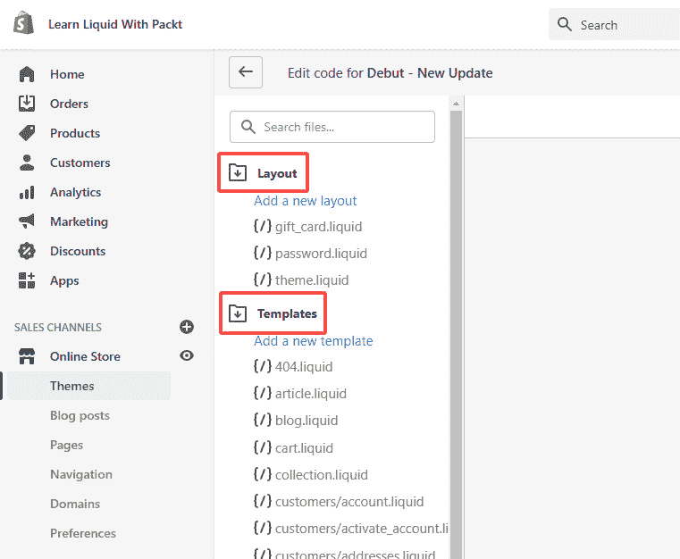

# *第一章*：Shopify 入门

从互联网的黎明开始，人们就看到了拥有信息触手可及的便利性。从那时起，人们一直在努力创建各种互联网应用程序和全面的服务，使我们的生活更加便捷，随之而来的是电子商务商店。因此，Shopify 诞生了。

第一章为理解 Shopify 是什么以及它是如何工作的奠定了坚实的基础，而根据实践，我们经常跳过这一点。直接跳入语法而省略理论的方法可能听起来很有吸引力。然而，即使是微小的涟漪也可能在长期内引起相当大的问题。虽然我们不会深入探讨 Toby Lutke 如何创建 **Shopify**，但在本章中，我们将涵盖以下主要主题：

+   什么是 Shopify？

+   如何开始？

+   导航管理面板

+   管理主题

+   理解主题结构

到本章结束时，我们不仅将学习 Shopify 是什么，还将学习如何在 Shopify 合作伙伴计划下创建账户，创建一个用于练习的开发商店，学习如何导航 Shopify 管理员界面，创建子主题并理解其结构。有了这些知识，我们将为如何进一步踏上我们的学习之旅，在 Shopify 上定制主题打下坚实的基础。

# 技术要求

考虑到 Shopify 是一个托管服务，我们将需要互联网连接来能够遵循本章中概述的步骤，尽管每个主题都将得到解释和伴随的图形展示。

# 什么是 Shopify？

不论是开发者还是通过一般使用互联网，Shopify 这个名字很可能至少出现过一次，*但 Shopify 是什么？* **Shopify** 是一家总部位于加拿大渥太华的跨国电子商务公司，为其实客户提供各种全面的服务。这项基于订阅的服务提供从购买域名到轻松构建和管理未来梦想商店的一切。

在其存在的多年里，Shopify 已经证明它不仅仅是一个商店构建者或销售产品的工具。相反，它已经确立了自己作为一个电子商务巨头，允许任何人构建商店并为他们的购物者创造独特的体验。作为一个基于模板的商店构建者，Shopify 提供了各种免费或付费主题，以实现商店定制，使您能够在没有开发知识的情况下使用直观且简单的主题编辑器。然而，如果最终目标是创建一个具有各种定制选项的独特商店，那么我们将需要一个了解 Liquid 的开发者来定制主题并在代码编辑器中创建额外的选项。

# 如何开始？

学习和开始在 Shopify 上工作的第一步是了解 Shopify 合作伙伴计划。合作伙伴计划是由 Shopify 创建的一个平台，它汇集了来自世界各地的人们，并为他们提供了为店主建立新的电子商务商店、设计主题、开发应用程序以及将新客户推荐给 Shopify 的能力。该平台最吸引人的扩展之一是它将允许我们创建一个开发商店来练习我们的 Liquid 知识。

在创建我们的**开发商店**并熟悉 Shopify 之前，我们首先需要在 Shopify 合作伙伴计划内创建一个账户。创建账户是一个相对直接的过程，我们可以在以下页面开始：[`www.shopify.com/partners`](https://www.shopify.com/partners):

1.  我们可以通过点击页眉右上角的**立即加入**按钮或点击**登录**按钮来访问现有账户，开始这个过程。在创建账户页面和随后的**账户信息**页面填写基本信息后，我们将首次看到合作伙伴仪表板：

    图 1.1 – Shopify 合作伙伴仪表板的示例

1.  在创建账户之后，下一步将是创建我们的**开发商店**。我们可以通过访问左上角的**商店**链接并点击**添加商店**按钮来完成此操作，这将提示我们填写一个需要填写的商店注册表单：

图 1.2 – 创建开发商店的示例

大多数选项都不需要简化，因为它们是自我解释的，但我们需要分析最重要的一个选项，即**商店类型**，它包含两个选项：

+   **开发商店**

+   **托管商店**

为了我们的学习目的，我们将使用**开发商店**。然而，我们还将提供一个简短的解释，说明**托管商店**选项的含义以及何时可以使用它。

**托管商店**选项将使我们能够请求对现有商店的**协作者**访问权限。选择此选项将提示另一个名为**权限**的部分，在那里我们需要选择我们请求的访问类型。通常，我们可以选择请求访问客户商店的所有区域。但是，为了在客户商店上进行主题定制，我们需要访问**在线商店**下的**主题**选项。

一旦我们选择了执行工作所需的权限级别并输入了我们请求访问的商店的 URL，剩下的就是通过点击**保存**按钮发送请求。商店所有者将收到商店访问请求的通知，然后可以选择授予或拒绝访问。

**开发商店**选项将允许我们创建一个全新的商店，在那里我们可以练习我们的 Liquid 技能，在它们被推广到 Shopify 实时店面之前测试新功能，或者创建一个我们稍后可以转交给客户的商店。

重要提示：

虽然创建**开发商店**完全免费，但在将商店转移到客户时，主题将自动失去开发状态。我们转让所有权的人需要选择一个持续计划，这样最初创建主题的开发者将收到持续佣金，直到他们支付订阅计划。

让我们通过选择**开发商店**作为商店类型并填写商店信息来创建我们的开发商店。

小贴士：

开发者预览是 Shopify 最近推出的一项新功能，将允许我们在它们到达实时店面之前预览他们推出的创新。然而，我们将放弃使用此选项。

填写登录信息、商店地址并选择商店用途后，按**保存**按钮创建您的商店。

成功！我们的商店已准备就绪，并且随着它，我们准备熟悉 Shopify 管理面板。

# 导航管理面板

通过创建一个新的开发商店，我们将首次看到我们的商店主页。主页由中间屏幕组成，其中将包含一些一般建议，帮助商店所有者开始他们的业务，日常任务，最近的活动，并且在屏幕的左侧，我们将看到侧边栏，这是我们主要关注的焦点。

![Figure_1.3 – Example Shopify admin home page

![Figure_1.3_B17606.jpg]

图 1.3 – 示例 Shopify 管理主页

虽然我们一开始不会深入细节，但对我们将在本书的不同章节中引用的商店的每个区域有一个基本了解是至关重要的。为了便于参考，我们将侧边栏分为三个部分，可以列出如下：

+   核心方面

+   销售渠道

+   设置

## 核心方面

第一部分，**核心方面**，包含商店所有者通常使用的与商店相关的选项，包括以下信息：

+   **订单**部分包含商店所有者收到的所有订单信息。在这里，商店所有者可以逐个预览每个订单并决定是否继续处理。所有者还可以使用草稿方法手动创建订单并预览被遗弃的结账。

+   **产品**部分由四个独立区域组成，允许我们创建和管理产品，处理现有产品的进货，如果您愿意，还可以创建和管理收藏或产品类别，以及创建礼品卡。

+   **客户**部分，正如其名称所示，允许我们创建和管理我们的客户数据库。这个部分，连同之前的**产品**部分，将特别引起我们的兴趣。我们将在稍后返回并详细解释一些我们将感兴趣的功能。

+   下一个部分，名为**分析**，主要将由店主使用。它提供了大量有关商店性能的信息，例如详细的销售报告，以及客户访问商店的实时视图及其行为。

+   如其名称所示，**营销**部分允许我们查看商店市场策略概述。我们可以通过电子邮件或其他社交网络创建和管理活动，并创建自动化以提高商店的留存率。

+   我们可以使用**折扣**部分创建一个折扣券代码，我们可以将其与客户分享，让他们在结账时手动输入以获得整个订单或特定产品的折扣。此外，我们还可以设置一个自动折扣，一旦我们满足店主设定的要求，它就会自动触发。

+   最后一个部分，名为**应用程序**，为我们提供了一个所有安装在商店中的应用程序的快速预览，我们可以选择管理或删除应用程序。

    重要提示：

    由于 Shopify 平台限制，无法合并折扣。如果我们已经符合了 10%的自动折扣条件，我们将无法输入之前从店主那里获得的免费送货手动折扣券代码。

    小贴士：

    虽然可能，但在管理类型商店的协作账户下工作时，你绝不应该自行安装应用程序。假设你需要一个特定的应用程序来完成分配给你的任务。在这种情况下，你应该联系店主，解释安装它的必要性，并要求他们在你继续之前为你安装，因为他们需要授予特定的权限并与应用程序共享商店数据，该应用程序应由店主审查和接受。

## 销售渠道

我们侧边栏的第二部分，**销售渠道**，代表我们可以用来销售商店产品的各种平台。默认情况下，唯一可见的渠道是**在线商店**，这将是我们的主要目标；然而，我们可以通过点击销售渠道旁边的加号按钮轻松添加更多。

**在线商店**渠道是商店的核心，因为它为我们提供了向客户展示可见店面能力，并且我们可以将其分解为六个独立的部分：

+   **主题**部分允许我们通过自定义商店主题来管理我们的商店外观，使其符合我们独特的品牌。一旦我们打开**主题**部分，有时我们首先看到的是 Shopify 的备注，说明我们的在线商店是**密码保护**的，这意味着商店尚未对客户可见。在密码保护设置期间，每个试图查看我们商店的访客都只会看到一个通知，说明商店是密码保护的，目前无法访问。

    重要备注：

    我们可以轻松地通过点击**主题**部分中的密码保护备注上的**查看商店密码**按钮，或者在**在线商店**部分的**偏好设置**部分访问，来禁用密码保护。然而，考虑到我们已选择开发选项作为我们的商店，禁用密码保护不可用。我们只能在将商店转移到客户或购买我们自己的订阅计划之后才能移除密码保护。

    在密码保护备注之后，我们可以在**主题**部分下看到下一个区域，名为**当前主题**。该部分显示了当前主题的名称和一个小预览，接着是**在线商店速度**部分，它为我们提供了商店的速度报告。**在线商店**速度部分目前对密码保护的商店是禁用的。

    在上一节之后，在屏幕底部附近，我们可以找到最后一个区域，名为**主题库**。我们可以通过选择相应的链接或通过选择**上传主题**按钮上传我们自定义的主题，轻松地在这个区域探索免费和付费主题。

+   **博客文章**部分允许我们管理和创建我们希望在商店中展示的博客文章，并将它们分类到不同的博客下。

+   **页面**部分允许我们创建客户经常访问的多个页面，例如*关于我们*或*联系我们*页面，或者提供深入信息的支持我们产品的页面。有关管理页面的更多信息，请参阅[`help.shopify.com/en/manual/online-store/pages`](https://help.shopify.com/en/manual/online-store/pages)。

+   在**导航**部分，我们可以找到创建最多两层嵌套菜单所需的工具，我们的客户可以使用这些菜单在在线商店中导航。有关创建导航菜单和管理链接列表的信息，请参阅[`help.shopify.com/en/manual/online-store/menus-and-links`](https://help.shopify.com/en/manual/online-store/menus-and-links)。

+   `my-store-name.myshopify.com`。此外，我们可以通过点击**购买新域名**按钮购买自定义域名，或者如果我们通过第三方获得了域名，我们然后可以将其设置为我们的主要域名。有关域名的更多信息，请参阅[`help.shopify.com/en/manual/online-store/domains`](https://help.shopify.com/en/manual/online-store/domains)。

+   在我们的**在线商店**频道下的最后一个和最终部分被命名为**偏好设置**。由于该部分下的大多数选项都是自我解释的，我们将不会深入太多细节，以保持书籍的要点。然而，如果您想了解更多关于每个选项的信息，您可以访问它们各自的页面，我们将列出，以获取更多信息。**偏好设置**部分允许我们调整一些重要的设置，这将有助于店主们管理未来的商店，我们可以以下列方式列出：

    +   **标题和元描述**：有关标题和元描述的详细信息，请参阅[`help.shopify.com/en/manual/online-store/setting-up/preferences#edit-the-title-and-meta-description`](https://help.shopify.com/en/manual/online-store/setting-up/preferences#edit-the-title-and-meta-description)。

    +   **社交分享图片**：有关社交分享图片的详细信息，请参阅[`help.shopify.com/manual/using-themes/change-the-layout/theme-settings/showing-social-media-thumbnail-images`](https://help.shopify.com/manual/using-themes/change-the-layout/theme-settings/showing-social-media-thumbnail-images)。

    +   **谷歌分析**：有关谷歌分析的详细信息，请参阅[`help.shopify.com/manual/reports-and-analytics/google-analytics`](https://help.shopify.com/manual/reports-and-analytics/google-analytics)。

    +   **Facebook 像素**：有关 Facebook 像素的详细信息，请参阅[`help.shopify.com/manual/promoting-marketing/facebook-pixel`](https://help.shopify.com/manual/promoting-marketing/facebook-pixel)。

    +   **客户隐私**：有关客户隐私的详细信息，请参阅[`help.shopify.com/en/manual/your-account/privacy/cookies`](https://help.shopify.com/en/manual/your-account/privacy/cookies)。

    +   **密码保护**：有关密码保护的详细信息，请参阅[`help.shopify.com/manual/using-themes/password-page`](https://help.shopify.com/manual/using-themes/password-page)。

    +   **垃圾邮件保护**：有关垃圾邮件保护和 Google reCaptcha 的使用信息，请参阅[`help.shopify.com/en/manual/online-store/setting-up/preferences#protect-your-store-with-google-recaptcha`](https://help.shopify.com/en/manual/online-store/setting-up/preferences#protect-your-store-with-google-recaptcha)。

## 设置

我们侧边栏的第三部分和最后一部分被命名为**设置**，包含许多选项，可以帮助店主设置和运营他们的商店。由于**设置**部分下的部分数量众多，选项也很多，我们不会涵盖所有内容，但将在本书的一些后续章节中提及一些对我们有意义的选项。

# 管理主题

我们已经在 **主题** 部分提到了这个话题，但 *什么是主题？* **主题** 是一个主模板文件，它控制着您的商店布局，使我们能够通过编辑代码或通过此模板编辑主题编辑器设置来更改店面布局。

默认情况下，在创建新商店时，会自动添加一个名为 debut 的主题作为起始主题。然而，为了我们的学习目的，我们将尝试安装一个我们自己的主题：

1.  我们需要做的第一件事是在 **在线商店** 销售渠道中的 **主题** 部分定位自己。一旦进入，向下滚动到名为 **主题库** 的区域，并搜索并点击名为 **探索免费主题** 的按钮：

    图 1.4 – 探索免费 Shopify 主题

1.  通过点击 **探索免费主题** 按钮，我们将看到一个弹出窗口，其中包含八个可添加到我们的商店的免费 Shopify 主题和已安装的 **Debut** 主题，该主题带有标签 **当前**：

    图 1.5 – 选择名为 Minimal 的免费 Shopify 主题

1.  虽然我们可以选择这些主题中的任何一个，但让我们通过点击它来选择第三行中第二列的 **Minimal** 主题。

    与大多数主题一样，**Minimal** 主题包含多种风格，如 **现代**、**复古** 和 **时尚**。虽然所有这些都是不错的选择，但为了我们的学习目的，我们将选择 **现代** 选项。一旦您选择了 **现代** 选项，请点击 **添加到主题库** 按钮以完成此过程并将新选定的主题添加到我们的商店主题库中：

    

    图 1.6 – 选择所选主题的风格并将其添加到主题库

    根据您的网络连接，Shopify 在您的商店中加载新主题可能需要几秒钟，之后您将收到通知，表明 **Minimal** 主题已成功添加到您的商店。尽管我们已经为我们的商店添加了新的主题，但 **Debut** 主题仍然是我们的实时主题，而如果我们查看主题库，我们将看到我们新添加的 **Minimal** 主题。要更改这一点，我们需要将我们的新主题设置为当前主题。

1.  我们可以通过向下滚动到我们想要实时发布的主题来发布新的主题。在我们的例子中，这个主题是 **Minimal**。点击 **操作** 按钮，然后点击 **发布** 按钮，之后将出现一个弹出窗口，要求确认发布 **Minimal** 主题。第二次点击 **发布** 按钮以确认我们的选择，这将自动发布并将 **Minimal** 主题设置为我们的商店的当前主题：

    图 1.7 – 在 Shopify 上发布新的主题

1.  现在我们已经安装了新的主题，是时候预览我们的新主题在店面中的外观了。我们可以通过点击 **操作** 按钮来完成此操作：

    图 1.8 – 预览主题店面

    然而，这次，我们应该点击的 **操作** 按钮将是在我们的当前主题上，而不是主题库中，然后选择 **预览** 按钮，这将在新标签页中打开我们的商店预览。

    如我们从为我们打开的预览页面中可以看到，店面看起来并不吸引人，因为它缺少内容。我们只能看到一些带有占位符图像的默认部分。

1.  在我们对店面进行任何更改之前，我们首先应该创建一个 *副本主题* 来测试我们的更改，而不用担心它会崩溃我们的实时店面并给我们带来损害。然而，在我们开始复制过程之前，让我们通过再次发布来将 **Debut** 主题作为我们的当前主题。无论如何，我们都更喜欢 **Debut** 主题，此外，它将帮助我们练习我们刚刚学到的知识。

    小贴士：

    在对主题进行任何重大修改之前，创建一个新的副本主题应该是我们的首要考虑。拥有多个主题副本将帮助我们确定任何由应用程序或简单的疏忽引起的潜在问题，这些问题将破坏我们的实时店面，这在某个时候不可避免地会发生。

1.  在设置 `Copy of Debut` 之后。

    重要提示：

    每次决定进行重大修改时创建一个副本主题是鼓励的。然而，我们应该记住，Shopify 只允许每个店面最多有 20 个副本主题。当我们达到这个限制时，我们将收到通知，表明我们已达到每个店面 20 个副本主题的限制。此限制也将阻止我们创建新的主题副本，如果我们想再创建一个，我们需要删除一些我们不再使用的较旧的主题副本。

1.  默认情况下，Shopify 将自动将我们要复制的主题名称作为主题名称，并在其前面添加“副本”一词。鉴于拥有多个类似命名的主题可能会迅速失控，我们应该立即将我们的新主题重命名，以避免未来可能出现的混淆。

1.  点击我们新创建的 **Debut 的副本** 主题上的 **操作** 按钮，并选择 **重命名选项**：

图 1.10 – 重命名主题及其确认示例

此操作将自动弹出一个窗口，您可以在其中输入新名称。Shopify 为我们提供了最多 50 个字符来命名我们的新主题，这为我们选择合适的名称提供了足够的空间。您应该包括补充信息，例如日期和包含的自定义内容。在我们的例子中，我们将主题命名为`Debut - Learning Shopify - 19 Apr '21`，然后我们将点击**重命名**按钮以确认我们的选择。

现在我们已经学会了如何创建和重命名重复主题，是时候深入了解我们新创建的主题以及它是如何工作的了。

# 理解主题结构

为了开始熟悉主题结构，我们首先需要打开代码编辑器。我们可以通过点击`Debut - Learning Shopify - 19 Apr '21`主题然后点击**编辑代码**按钮来打开代码编辑器。

我们可以将代码编辑器分为以下两个部分：

+   标题

+   侧边栏

## 标题

我们可以在页面的顶部找到**标题**部分，它包含主题的名称，左侧有退出编辑器的箭头按钮，右侧有三个按钮，名称如下：

+   **预览**

+   **定制主题**

+   **专家主题帮助**

### 预览

我们列表中的第一个按钮，即**预览**按钮，将允许我们快速预览我们正在工作的重复主题以及我们所做的任何更改。虽然我们当前的主题预览只包含占位符内容，但它确实包含一个对我们非常有用的元素，即**预览栏**：

图 1.11 – 预览屏幕和预览栏的示例

我们可以在预览屏幕的底部找到预览栏，它包含我们正在预览的主题名称，右侧包括三个按钮：

+   **预览**按钮将自动关闭我们的重复主题预览，并将我们重定向到我们的实时主题主页。

+   点击**分享预览**按钮将触发一个弹出窗口，我们可以与任何人分享，以向他们展示我们在同一主题上所做的更改。虽然拥有此链接的任何人都可以查看您新主题的所有方面，但他们将无法完成任何购买或到达结账页面。此外，自动生成的预览链接仅持续 14 天，这意味着在 14 天后，您需要通过重复预览步骤并再次与您选择的任何人分享来生成新的预览链接。

+   我们预览栏中的最后一个按钮被称为**隐藏栏**，正如其名称所暗示的，它允许我们隐藏预览栏，这样我们就可以在没有视觉障碍的情况下预览我们的更改。请注意，预览栏将在刷新页面时自动显示。

### 定制主题

在我们编辑器的 **标题** 区域下，下一个项目是 **自定义主题** 按钮，它将打开另一个不同类型的编辑器，即主题编辑器。在这个编辑器内，我们可以更新一些主题设置，例如字体、颜色和媒体链接，甚至管理店面部分。

### 专家主题帮助

最后，**专家主题帮助**按钮是店主将使用它来通过 Shopify 合作伙伴计划发布工作请求的东西，在本书结尾时，您将作为 Shopify 专家等待。

## 侧边栏

代码编辑器内的第二部分，**侧边栏**，列出了我们将要引用的所有文件和目录；然而，目前我们无法看到所有目录。我们可以通过点击 **布局** 和 **模板** 目录来折叠它们：

图 1.12 – 在代码编辑器内折叠目录

折叠这两个目录后，我们会注意到目录图标内的两个箭头现在消失了，并且我们现在可以看到我们的主题包含的额外四个目录。Shopify 主题包含以下目录：

+   `Layout`

+   `Templates`

+   `Sections`

+   `Snippets`

+   `Assets`

+   `Config`

+   `Locales`

### 布局

`布局` 目录是我们主题的主要目录，因为它包含我们的商店工作所需的必要文件。这个目录通常包含多达四个文件，我们可以称之为主题布局模板，具体如下。

#### gift_card.liquid

`gift_card.liquid` 是一个模板文件，包含渲染礼品卡页面的代码，并在客户购买礼品卡时通过电子邮件通知发送给他们。

#### 密码.liquid

`password.liquid` 文件模板渲染了在线商店密码页面，如果客户在商店处于开发模式时访问我们的商店，他们将会看到这个页面。我们在 *导航管理面板* 部分讨论 **销售渠道** 和其 **在线商店** 区域时提到了密码保护是什么以及如何禁用它。

为了更好地理解密码保护页面，让我们尝试预览它以查看其工作方式。您可以通过将商店的 URL，`https://my-store-name.myshopify.com`，和末尾添加单词 `/password` 来预览您的商店密码页面。

图 1.13 – Shopify 密码保护页面的示例

如我们所见，密码保护只包含最基本的信息。然而，它通过阻止人们查看我们的密码，仍然在开发商店中，成功地完成了我们为其设计的任务。

在我们的密码保护页面的右上角，我们会注意到一个按钮，**使用密码进入**，这将启动一个弹出窗口，我们可以使用我们的商店管理员凭据登录我们的商店，然后点击 **在此登录** 链接，这将将我们重定向到我们的管理面板：

图 1.14 – 密码页面登录表单

然而，如果我们想通过输入密码来预览我们的主题店面呢？这个表单请求的密码就是我们为启用我们的密码保护页面所设置的密码。在我们的例子中，当我们将开发选项作为我们的商店类型选择时，系统会自动生成这个密码。

为了确定我们的密码保护页面的密码，我们需要通过在新浏览器标签的 URL 中输入 https://my-store-name.myshopify.com/admin 返回到我们的管理员面板。一旦进入，在左侧侧边栏下，在 **销售渠道** 下，通过点击它来展开 **在线商店** 字段，然后点击 **偏好设置** 选项。在名为 **密码保护** 的区域下，您将找到我们密码页面表单所需的密码，以便访问我们的店面：

图 1.15 – 密码保护页面设置

假设我们返回到我们的密码保护页面并输入我们找到的密码。在这种情况下，密码保护页面将暂时为我们暂停，商店将根据我们最初打开的链接类型将我们重定向到预览或实时主题店面。

#### theme.liquid

在我们的代码编辑器内部，我们可以将列表中的下一个项目，命名为 `theme.liquid` 的文件，视为主布局文件，其中将渲染所有其他模板文件以及我们稍后将要了解的任何其他元素。

#### checkout.liquid

我们列表中的最后一个布局文件，命名为 `checkout.liquid`，目前在我们的开发商店中不可见。这个布局文件仅对购买了 **Shopify** **P****lus** 订阅的 Shopify 商店所有者可见。

通常，每个主题都包含一组预定义的选项，这将允许我们对结账页面进行一些基本的样式更改。然而，在我们拥有 `checkout.liquid` 布局文件的情况下，我们将能够访问我们的结账文件，在那里我们可以创建一些更复杂的修改，否则我们无法做到。

注意，即使我们手头有 `checkout.liquid` 文件，由于安全原因，我们也不能修改结账页面流程的流程。我们只能进行一些不会打断结账流程的基本修改。

我们只能通过向 Shopify 支持提交请求来激活 Shopify 计划。在审查我们的申请后，他们将为我们商店中启用此独特计划生成一个定制价格。

重要提示：

即使你在你的商店中激活了 Shopify Plus 计划，`checkout.liquid`文件也不会立即可见。相反，你需要向 Shopify 支持提交请求，并要求他们将此独特文件包含在你的商店中。

由于这些原因，我们不会过多地详细介绍`checkout.liquid`文件。然而，我们将涵盖布局文件包含的`how-to`和最基本元素，这应该能让我们走上理解布局文件的正确道路。有关编辑结账文件的更多信息，请参阅：[`shopify.dev/themes/architecture/layouts/checkout-liquid`](https://shopify.dev/themes/architecture/layouts/checkout-liquid)

### 模板

我们主题目录列表的下一个点是`Templates`，这是一个允许我们一次性创建和管理多个页面外观的文件组。`Templates`文件包括两种类型的文件：

+   `Templates`文件的第一种类型是`.json`类型的文件，这是 Shopify 的新增功能。使用`.json`类型的模板，我们可以通过主题编辑器轻松控制任何页面的布局。然而，为了更好地理解，我们不会在这里过多地深入细节。在接下来的章节中，我们将更详细地介绍`.json`模板及其可能性。

+   第二种类型是`.liquid`类型的文件，这是一种简单的标记类型文件，我们将立即熟悉它。

实践表明，每个主题都为每种页面类型提供了一个模板文件，例如，`product.liquid`，系统将自动将其分配给任何当前或未来创建的产品页面。考虑到 Shopify 是一个基于模板的文件，对特定模板的任何更改都将影响我们之前分配此模板的任何页面。然而，Shopify 还允许我们为每种页面类型创建额外的模板文件，并进一步自定义它们，而无需更改原始模板文件布局。

我们可以通过点击位于模板目录下方**添加新模板**按钮来创建一个新的模板文件，之后会弹出一个窗口，询问我们为新模板文件选择类型和名称：

![图 1.16 – 创建新的模板文件

![img/Figure_1.16_B17606.jpg]

图 1.16 – 创建新的模板文件

在成功创建一个新的模板文件后，我们现在可以将新模板分配给为我们创建的新模板的页面。我们可以通过打开管理面板中的任何页面来实现，具体取决于我们创建的页面模板类型，然后在**主题模板**区域下方的**模板后缀**下拉菜单中选择新的模板名称。

重要提示：

**模板后缀** 下拉菜单只能从当前实时主题中读取值。这意味着新创建的模板文件在我们发布我们的副本主题或在我们当前的实时团队中创建相同的模板文件之前将不可见。如果我们选择第二种选择，请注意，我们需要使用相同的名称创建文件；我们不需要对文件的内容进行任何更改。

如果在我们的管理界面中没有看到 **主题模板** 区域，我们应该通过检查我们创建了哪种模板类型来确认我们是否在正确的页面上，因为 **模板后缀** 下拉菜单仅在创建了多个模板的页面上可见。

### 部分（Sections）和片段（Snippets）

在我们的目录列表中下一个值得关注的点是名为 `Sections` 的目录，这是一种不同类型的模板文件，当与模板文件结合使用时，允许我们创建 Shopify 因其而闻名的真正可定制的功能。请注意，在部分内部创建的任何变量将无法在部分外部访问，反之亦然。此规则的唯一例外是，如果部分包含片段，则提供单向通信。

`片段` 文件允许我们通过引用它们的名称在 `模板`/`部分` 中重用重复的代码片段。除了允许我们重用代码的部分外，`片段` 还将使我们能够访问父元素内部的变量，只要我们将这些变量作为参数传递给片段。

### 资产

如其名所示，`Assets` 目录允许我们存储任何与主题相关的资产，包括图像、字体文件、JavaScript、CSS 文件，并可以在整个主题文件中轻松引用它们。

### 配置（Config）

`Config` 目录在我们的主题中至关重要。在此目录中，我们可以定义和管理主题的全局 JSON 值。该目录包含两个关键文件：

+   `settings_schema.json` 文件允许我们在主题编辑器中创建和管理主题内的内容，我们可以在整个主题文件中引用这些内容。

+   另一方面，`settings_data.json` 文件记录了我们方案文件中定义的所有选项及其值。您可以将此文件视为您的主题数据库，它将允许我们预览当前 JSON 值或通过在主题编辑器下更新主题设置或直接编辑 `settings_data.json` 文件中的值来修改它们。

### 本地化

我们列表中的最后一个目录，名为 `Locales`，包含主题本地化文件，我们可以使用它来翻译主题的内容。此目录可能包含的文件数量可能会有所不同。它可以有一个默认文件 `en.default.json`，或者根据您希望在您的商店提供的语言数量，它可以包含多个文件。

# 摘要

在本章中，我们通过学习 Shopify 是什么以及如何在 Shopify 合作伙伴计划中创建账户，了解了 Shopify 的基本要素，这些内容将贯穿我们的学习过程，并用于我们在 Shopify 平台上的任何未来工作。

我们创建了一个开发商店，并且也理解了在做出任何重大更改之前创建一个副本主题的重要性和原因。虽然我们涵盖的一些内容可能听起来不相关，但每一项都将帮助我们更好地理解作为 Shopify 开发者我们将要定期执行的常规工作流程。

最后，我们对主题文件的内结构有了些了解，这将在下一章中对我们非常有用，我们将熟悉 Liquid 的基础知识，并进一步深化我们对主题定制的知识。

# 问题

1.  合作伙伴计划是什么？

1.  我们如何禁用开发类型商店的密码保护？

1.  `布局`和`模板`目录文件之间的区别是什么？

1.  在什么情况下，新的模板文件将在您页面的管理部分可见？

1.  什么类型的文件和什么条件允许我们访问父文件作用域内的变量？

# 进一步阅读

+   如需更多信息和对 Shopify 管理员的概述，请参阅[`help.shopify.com/en/manual/shopify-admin`](https://help.shopify.com/en/manual/shopify-admin)。

+   如需有关管理您的商店账户的详细信息，请参阅[`help.shopify.com/en/manual/your-account`](https://help.shopify.com/en/manual/your-account)。

+   如需有关在线商店的更多信息，请参阅[`help.shopify.com/en/manual/online-store`](https://help.shopify.com/en/manual/online-store)。
