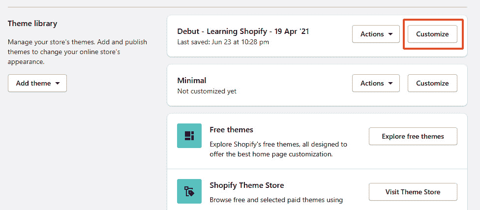
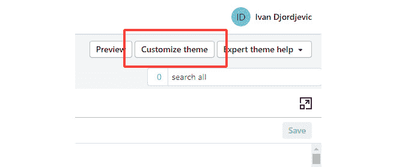
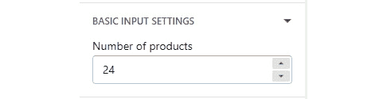
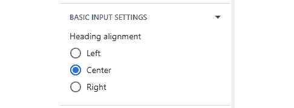
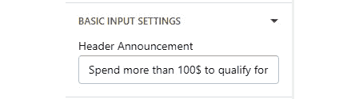
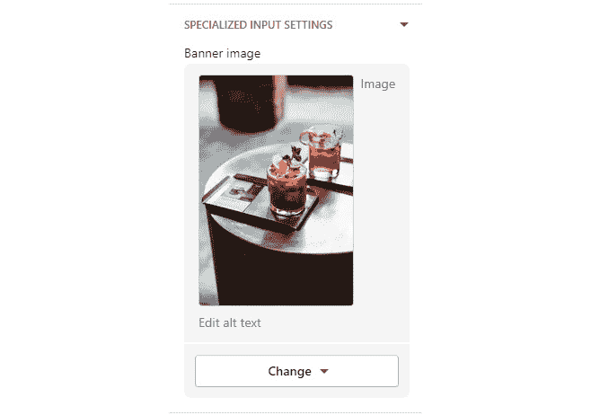
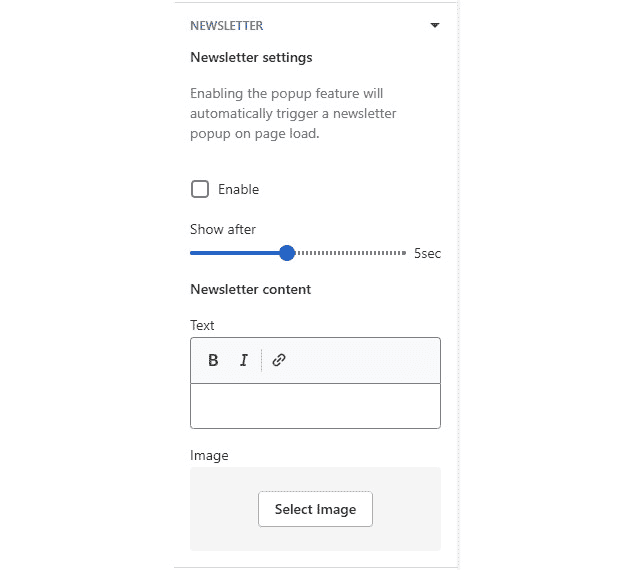
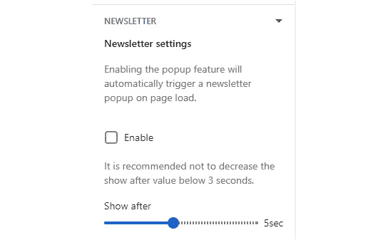

# 第六章：*第六章*：配置主题设置

在前面的章节中，我们一直在学习 Shopify 作为平台，熟悉 Liquid 基础知识，并使用 Liquid 核心来创建店面上的各种功能。然而，除非店主是开发者，否则他们对我们为他们创建的任何功能将不会有太多控制权。

在本章中，我们将学习如何使用 JSON 创建通过主题编辑器可访问的设置，这将允许店主轻松地定制主题，而无需在整个主题中进行代码调整。本章将涵盖以下主题：

+   探索 JSON 设置

+   了解输入设置属性

+   基本和特殊输入类型

+   组织主题编辑器

+   查看已弃用的设置

到我们完成这一章的时候，我们将对 JSON 的重要性有更深入的理解，以及我们如何使用它来创建在整个主题的任何页面上都可访问的主题设置。我们可以使用这些设置来修改 CSS 值，更改某些功能的内容，甚至可以使用这些设置来完全启用或禁用某个特定功能。通过学习如何使用 JSON 来创建这些设置，我们将朝着创建一个真正动态和可定制的功能店面迈出另一步，这正是 Shopify 所追求的。

# 技术要求

虽然我们将解释每个主题并配合相关图形进行展示，但考虑到 Shopify 是一个托管服务，我们需要互联网连接来遵循本章中概述的步骤。

本章的代码可在 GitHub 上找到：[`github.com/PacktPublishing/Shopify-Theme-Customization-with-Liquid/tree/main/Chapter06`](https://github.com/PacktPublishing/Shopify-Theme-Customization-with-Liquid/tree/main/Chapter06)。

本章的“代码实战”视频可在此找到：[`bit.ly/3nLQgMf`](https://bit.ly/3nLQgMf)

# 探索 JSON 设置

在 *第一章* *开始使用 Shopify* 中，我们简要提到了 `Config` 目录，我们可以在其中定义和管理整个主题的全局 JSON 值。让我们回顾一下我们可以在这个目录中找到的两个基本和重要的 `.json` 文件：

+   `settings_schema.json` 文件允许我们在主题编辑器中创建和管理主题内的内容，我们可以在整个主题文件中引用这些内容。

+   另一方面，`settings_data.json` 文件记录了我们方案文件中定义的所有选项及其值。我们可以将此文件视为我们的主题数据库，我们可以通过更新主题编辑器中的主题设置或直接编辑 `settings_data.json` 文件内的值来管理它。

我们可以将全局设置选项分组到不同的类别中，以便更直观地导航，这可以通过使用`name`和`settings`属性来完成：

```php
{
  "name": "Category",
  "settings": [
  ]
}
```

正如我们所见，与前面章节中提到的`Locales`目录中的`.json`文件一样，`settings_schema.json`文件有一个我们必须遵守的特定格式。使用`name`属性，我们可以设置类别的名称，而`settings`属性将包含该类别将包含的设置数组：

```php
{
  "name": "Category",
  "settings": [
    {
      "type": "color",
      "id": "store_background_color",
      "label": "Background Color",
      "default": "#ffffff"
    },
    {
      "type": "color",
      "id": "store_border_color",
      "label": "Border Color",
      "default": "#cccccc"
    }
  ]
}
```

在前面的例子中，我们包含了两种类型的颜色设置，一种将控制我们商店的背景颜色，另一种将负责设置我们在整个商店中使用的边框颜色。正如我们所见，我们将每个`settings`选项都包含在大括号内，并用逗号分隔。然而，请注意，类别中最后一个`settings`选项后面没有逗号。

重要提示：

在`settings`块中的最后一个属性后面包含逗号，或者在类别中最后一个`settings`块后面包含逗号，将导致错误，我们将无法保存我们的工作。

现在我们已经定义了全局设置，我们需要学习如何访问它们并恢复它们的值。我们可以使用`settings`关键字和输入的 ID 来恢复任何全局输入设置的值，这些值我们想要恢复，用点分隔并放在双大括号内：

```php
{{ settings.store_background_color }}
{{ settings.store_border_color }}
```

我们现在有机会看到我们如何定义输入设置选项并读取它们的值，但我们究竟在哪里渲染这个选项以及如何修改它？

我们可以通过导航到管理区域的**在线主题**部分，然后点击我们想要定制的主题上的**自定义**按钮来访问主题编辑器：



图 6.1 – 通过在线主题部分访问主题编辑器的示例

注意，在整个主题编辑器中做出的更改都是针对特定主题的，因此我们应该记得点击我们想要定制的主题上的**自定义**按钮。

或者，我们可以通过点击位于右上角的**自定义主题**按钮，通过代码编辑器访问主题编辑器：



![图 6.2 – 通过代码编辑器访问主题编辑器的另一种方式一旦进入主题编辑器，我们将在侧边栏中看到一系列类别选项。然而，这些选项中的大多数都是我们将要在下一章中了解更多内容的章节和块的一部分。现在，我们可以通过点击位于右下角的**主题设置**按钮来访问我们在`settings_schema.json`文件中定义的全局设置：![图 6.3 – 在主题编辑器中访问全局设置![图 6.3 – 图 6.3 的示例图 6.3 – 在主题编辑器中访问全局设置在`settings_schema.json`文件中，每个输入集包含一组属性。虽然其中一些是必需的，但其他的是可选的。让我们更深入地了解它们。# 了解输入设置属性每个输入设置选项可以包含以下五个属性，也称为标准属性：+   如其名称所示，`type`属性允许我们设置输入设置的类型，可以是基本类型或专用类型。`type`属性是强制的。+   `id`属性是另一个我们将要使用的强制属性，用于访问和读取设置值。+   `label`属性允许我们在主题编辑器中设置输入设置的标签。`label`属性是强制的。+   `default`值作为安全措施，允许我们为输入设置设置默认选项。然而，它不是强制的。+   最后一个属性，`info`，允许我们包含有关输入设置的额外说明，并且也不是强制的。虽然大多数输入设置将只包含之前提到的属性，但根据输入类型，我们可能需要包含一些额外的属性。我们之前提到，类型属性允许我们在两种不同的输入设置类型之间进行选择，基本和专用，但它们究竟是什么呢？## 基本输入类型基本输入类型是一组选项，允许我们在主题编辑器中包含各种类型的输入设置。在基本类别下，我们可以使用以下选项：+   `checkbox`+   `number`+   `radio`+   `range`+   `select`+   `text`+   `textarea`正如我们之前提到的，大多数输入设置将只包含标准属性。然而，一些专用输入甚至基本输入将需要额外的属性。现在让我们查看每种输入类型，学习如何使用它，以及我们可以期待什么类型的成果。### 复选框输入如其名所示，`checkbox`类型的输入是一个布尔类型的字段，允许我们在主题编辑器中创建复选框选项：```php{  "type": "checkbox",  "id": "enable_popup",  "label": "Enable popup",  "default": true}```正如我们所见，`checkbox`输入包含三个强制属性和一个可选属性，我们将它们的值设置为`true`。否则，如果我们移除`default`属性，复选框的默认状态将是`false`。以下截图展示了复选框输入类型的示例：![图 6.4 – 复选框基本输入类型的示例![图 6.4 – 复选框基本输入类型的示例图 6.4 – 复选框基本输入类型的示例我们可以使用布尔输入类型来切换功能的开和关，这可以通过获取复选框输入值并使用`if`语句检查其当前状态来实现：```php```通过检查`checkbox`输入值是否等于`true`，我们创建了一个简单的功能，可以轻松启用或禁用商店中的某个功能，因为语句内部的代码块仅在语句为`true`时渲染：```php```注意，我们可以通过将复选框输入值与`blank`变量进行比较来实现相同的结果。### 数字输入`number`类型的输入是 Shopify 的最新添加，正如其名称所暗示的，它是一个数字类型的字段，允许我们在主题编辑器内部创建一个数字选择器输入。除了标准属性外，我们还可以使用可选的`placeholder`属性，这允许我们在文本输入中包含一个占位符值：```php{  "type": "number",  "id": "number_of_products",  "label": "Number of products",  "placeholder": "24"}```注意，`number`类型的输入只能包含一个数值。在以下屏幕截图中，我们可以看到一个`number`输入类型的示例：

图 6.5 – 基本数字输入类型的示例

一旦我们定义了数字输入，我们可以通过将`settings`关键字与文本输入的 ID 配对来访问它：

```php
{{ settings.number_of_products }}
```

`number`输入值将始终返回一个数值，除非它是空的，在这种情况下，它将返回一个`EmptyDrop`值。我们可以通过重新阅读*第二章*，*液体的基本流程*，并检查*理解数据类型*部分中的*EmptyDrop*子部分来提醒自己`EmptyDrop`。

### 单选输入

使用`radio`输入类型，我们可以输出一个`radio`选项字段，这允许我们进行多选项选择。`radio`输入使用标准属性，并增加了必需的`options`属性。

`options`属性接受一个包含`value`和`label`属性的数组，这些属性是必需的：

```php
{
  "type": "radio",
  "id": "heading_alignment",
  "label": "Heading alignment",
  "options": [
    {
      "value": "left",
      "label": "Left"
    },
    {
      "value": "center",
      "label": "Center"
    },
    {
      "value": "right",
      "label": "Right"
    }
  ],
  "default": "center"
}
```

注意，我们需要将`default`属性设置为`options`数组内部之前定义的其中一个值。否则，如果未定义`default`属性，则默认选择第一个单选按钮。以下是一个`radio`输入类型的示例：



图 6.6 – 基本单选输入类型的示例

一旦我们定义了`radio`输入，我们可以通过将`settings`关键字与单选输入的 ID 配对来访问它：

```php
.heading {
  text-align: {{ settings.heading_alignment }};
}
```

单选按钮值将始终返回一个字符串值。

### 范围输入

使用`range`输入类型，我们可以创建一个范围滑块字段。与之前的输入相比，`range`输入有四个额外的属性和一个对标准属性的改变。我们可以以下这种方式列出额外的属性：

+   `min`属性允许我们设置范围输入的最小值。`min`值是必需的。

+   `max`值也是一个必需的属性，允许我们设置范围输入的最大值。

+   `step`值允许我们设置滑块步骤之间的增量值。`step`滑块是必需的。

+   第四个和最后一个额外属性`unit`是一个可选属性，它允许我们为范围滑块值设置视觉单位，例如`px`。请注意，`unit`属性只接受最多三个字符，并且将在主题编辑器中纯视觉地输出 px。实际值将返回一个不带单位的数值。

标准属性集的一个额外变化是`default`属性现在是必需的：

```php
{
  "type": "range",
  "id": "logo_size",
  "min": 120,
  "max": 220,
  "step": 1,
  "unit": "px",
  "label": "Logo Size",
  "default": 140
}
```

注意，`min`、`max`、`step`和`default`属性都是数值类型。在这些属性中包含字符串值将导致错误。

与之前的属性相比，`range`属性有一些我们必须遵守的规则。第一条规则是`default`值必须在`min`和`max`值之间。第二条且更为重要的规则是，每个范围滑块最多可以有 100 个步骤，但这究竟意味着什么呢？

例如，在上面的例子中，我们设置了`min`值为`120`和`max`值为`220`。由于我们设置了`step`值为`1`，我们在两个值之间有精确的 100 个步骤。

另一方面，如果我们把`max`值设置为`320`，我们也必须更新`unit`值为`2`以保留`min`和`max`值之间的 100 个步骤。在下面的屏幕截图中，我们可以看到`range`输入类型的示例：


图 6.7 – 范围基本输入类型的示例

一旦我们定义了`range`输入，我们可以通过将`settings`关键字与`range`输入的 ID 配对来访问它。然而，请记住，`unit`属性完全是视觉上的。由于`range`输入返回一个数值，我们需要在样式表中手动包含`unit`值：

```php
.logo-img {
  max-width: {{ settings.logo_size }}px;
}
```

这是我们应该始终在定义样式设置时包含`default`属性，或者至少将整个 CSS 行包裹在一个检查值是否存在的语句中的原因之一。否则，如果输入的值未定义，我们可能会破坏样式表。

### 选择输入

`select`输入类型允许我们创建一个下拉选择字段。除了标准属性集之外，`select`输入类型还有两个额外属性。我们可以以下列方式列出额外属性：

+   `options`属性与`range`输入类似，允许我们创建一个包含`value`和`label`属性的数组来定义下拉选项。选项以及数组内的`value`和`label`都是必需属性。

+   `group`属性是一个可选属性，它允许我们在下拉菜单中分组不同的选项。

与`radio`输入类型一样，如果我们没有定义`default`属性，则默认选择第一个选项：

```php
{
  "type": "select",
  "id": "font_family",
  "label": "Font Family",
  "options": [
    {
      "value": "raleway-light",
      "label": "Raleway - Light",
      "group": "Raleway"
    },
    {
      "value": "raleway-regular",
      "label": "Raleway - Regular",
      "group": "Raleway"
    },
    {
      "value": "playfair-display-regular",
      "label": "Playfair Display - Regular",
      "group": "Playfair Display"
    }
  ],
  "default": "playfair-display-regular"
}
```

由于`select`输入返回一个字符串值，最常见的一种用途是在主题中包含一个自定义字体族，正如我们在前面的例子中看到的那样：


图 6.8 – select 基本输入类型的示例

此外，通过使用`group`属性，我们已经成功地将属于同一家族的所有选项分组：

```php
.heading {
  font-family: {{ settings.font_family }};
}
```

Shopify 还拥有一个广泛的字体库，我们可以使用，以及一个专门提供对我们提到的库的访问权限的输入，我们将在稍后学习。然而，如果我们想包含 Shopify 字体库中不可用的自定义字体，那么我们需要通过包含一个`select`类型下拉菜单来使用自定义解决方案来包含它。

### 文本输入

如其名所示，`text`类型的输入是一个字符串类型的字段，它允许我们在主题编辑器中创建一个单行文本选项。除了标准属性外，我们还可以使用`placeholder`属性，这允许我们为文本输入包含一个占位符值：

```php
{
  "type": "text",
  "id": "header_announcement",
  "label": "Header Announcement",
  "placeholder": "Enter a short announcement.",
  "default": "Spend more than 100$ to qualify for a 10%     discount!"
}
```

注意，`text`类型的输入只能包含字符串值，不能包含任何 HTML 标签。在下面的屏幕截图中，我们可以看到一个`text`输入类型的示例：



图 6.9 – text 基本输入类型的示例

一旦我们定义了文本输入，我们可以通过将`settings`关键字和文本输入的 ID 配对来访问它：

```php
{{ settings.header_announcement }}
```

`text`输入值始终返回一个字符串值，除非它是空的，在这种情况下，它将返回一个`EmptyDrop`值。

### textarea 输入

输入类型`textarea`与文本输入类似，唯一的区别是`textarea`是一个多行文本字段，而`text`输入是一个单行字段。除了标准属性外，我们还可以使用`placeholder`属性来为`textarea`输入包含一个占位符值：

```php
{
  "type": "textarea",
  "id": "header_announcement_textarea",
  "label": "Header Announcement",
  "placeholder": "Enter a short announcement.",
  "default": "Spend more than 100$ to qualify for a 10%     discount!"
}
```

同样，与`text`输入值一样，`textarea`输入值始终返回一个字符串值，除非它是空的，在这种情况下，它将返回一个`EmptyDrop`值。我们可以在下面的屏幕截图中看到`textarea`输入的示例：


图 6.10 – textarea 基本输入类型的示例

通过`textarea`，我们现在已经涵盖了所有基本输入设置，这使我们走上了理解和处理主题编辑器`.json`文件的坚实道路。然而，要真正可以说我们掌握了`.json`文件的工作知识，我们还需要学习有关专门输入设置的内容。

## 专门输入设置

专业输入类型是一组专业选项，它不允许我们在主题编辑器中包含各种类型的输入设置，但同时也为我们提供了轻松访问各种 Liquid 对象的能力。在专业输入下，我们可以使用以下选项：

+   `richtext`

+   `html`

+   `linklist`

+   `liquid`

+   `color`

+   `url`

+   `video_url`

+   `image_picker`

+   `font_picker`

+   `article`

+   `blog`

+   `collection`

+   `page`

+   `product`

与基本输入类型相似，大多数输入设置将只包含标准属性。然而，一些输入将需要额外的属性。通过了解所有不同类型的专业输入，我们将学习如何使用它们以及我们可以期待的结果类型，这将有助于创建我们在下一章中将要学习的复杂部分。

### `richtext`输入

`richtext`输入类型类似于基本的`textarea`类型输入，因为它们都输出一个多行文本字段。主要的区别在于`richtext`还为我们提供了一些基本的格式化选项：

+   粗体

+   斜体

+   下划线

+   ]

+   段落

第二个区别是，虽然`text`和`textarea`输入值返回一个干净的字符串，但`richtext`总是会返回一个格式化为段落并封装在 HTML `<p></p>`标签内的字符串值。以下截图展示了`richtext`输入的一个示例：


图 6.11 – `richtext`专业输入类型的示例

此外，使用`richtext`提供的格式化选项将自动更新字符串值与相应的 HTML 标签。

重要提示：

使用格式化选项将自动将必要的 HTML 标签应用到`richtext`字符串值上。然而，我们无法在主题编辑器的`richtext`字段中手动包含任何 HTML 标签。

虽然`default`属性不是强制的，如果我们决定使用它，我们必须在`default`属性值中包含`<p></p>`标签。否则，我们将收到错误：

```php
{
  "type": "richtext",
  "id": "header_announcement_richtext",
  "label": "Header Announcement",
  "default": "<p>Spend more than 100$ to qualify for a 10%     discount!</p>"
}
```

注意，与接受`placeholder`属性的`textarea`不同，`richtext`不接受任何`placeholder`属性。

### `html`输入

`html`输入类型是一个多行文本字段，正如其名称所暗示的，它允许我们在输入字段中包含 HTML 标记。除了标准属性外，`html`输入类型还接受一个可选的`placeholder`属性：

```php
{
  "type": "html",
  "id": "google_analytics",
  "label": "Google Analytics",
  "placeholder": "Paste the Google Analytics code here."
}
```

虽然`html`输入将接受大多数 HTML 标签，但 Shopify 会自动移除以下三个标签：

+   `<html>`

+   `<head>`

+   `<body>`

`html`类型输入值将始终返回一个字符串值，如果它是空的，则返回`EmptyDrop`值。我们可以在以下截图中的示例中看到`html`输入：


图 6.12 – `html`专业输入类型的示例

注意，虽然我们可以在`html`类型输入中包含 HTML 代码，但我们不能在字段中包含 Liquid 代码，因为它将被处理为一个简单的字符串。

### 链接列表输入

使用`link_list`输入类型，我们可以创建一个特殊的菜单选择字段类型，允许我们输出一个商店导航菜单。请注意，我们只能在之前在**在线商店**部分下位于**导航**部分的**管理界面**中看到的菜单：

```php
{
  "type": "link_list",
  "id": "header-menu",
  "label": "Header Menu",
  "default": "main-menu"
}
```

注意，虽然`default`属性是可选的，但它只接受两个特定的值，即`main-menu`和`footer`。让我们看看以下屏幕截图中`linklist`输入的外观：


图 6.13 – `linklist`专业输入类型的示例

使用设置和 ID 检索`link_list`值将返回一个`linklist`对象，我们可以使用它来构建导航菜单。如果我们回想一下，在*第四章*，*使用对象深入 Liquid 核心*中，我们使用了以下代码来输出具有特定`indoor-navigation`句柄的导航菜单：

```php

  

```

如果我们想要使用不同的导航，我们就必须手动更新菜单导航句柄。然而，考虑到我们现在可以直接从主题编辑器中恢复`linklist`对象，我们可以更新之前硬编码的`linklist`对象值，并用一个动态值替换它：

```php

  

```

注意，如果`link_list`类型输入没有`default`属性或我们尚未选择菜单，我们将收到一个`blank`值作为返回值。

### 液体输入

`liquid`输入类型也是 Shopify 最近添加的功能，它允许我们包含 HTML 标记和有限的 Liquid 代码，这使得它成为一个相当强大的工具。以下是该输入的示例代码：

```php
{
  "type": "liquid",
  "id": "liquid_block",
  "label": "Liquid block"
}
```

注意，当我们保存设置时，任何未关闭的 HTML 标签都会自动关闭。在下面的屏幕截图中，我们可以看到一个`liquid`输入类型的示例：


图 6.14 – `liquid`专业输入类型的示例

`liquid`输入类型为我们提供了访问所有全局对象、基于页面的对象以及标准标签和过滤器的权限。

注意，如果`liquid`类型输入值是空的，它将始终返回一个字符串值或`EmptyDrop`值。

### 颜色输入

如其名所示，`color`输入类型允许我们创建一个颜色选择器类型的输入，以便轻松更新商店的颜色调色板：

```php
{
  "type": "color",
  "id": "store_background_color",
  "label": "Background Color",
  "default": "#ffffff"
}
```

我们可以通过组合`settings`关键字和输入的 ID 来访问`color`输入类型的值：

```php
body {
  background-color: {{ settings.store_background_color }};
}
```

除了可以在`color`字段中手动输入十六进制颜色外，我们还可以触发一个实际的调色板，在那里我们可以选择所需的颜色色调：


图 6.15 – `color`专业输入类型的示例

注意，虽然 `default` 属性是可选的，但我们应始终包含默认值或在整个 CSS 行中包含整个语句，以检查输入值是否为空。如果我们忽略包含这两个中的任何一个，如果 `color` 输入值未定义，我们可能会得到一个损坏的样式表。

### url 输入

`url` 类型输入为我们提供了一个特殊的 URL 输入字段，我们可以手动输入外部 URL 或使用一系列下拉菜单来选择以下资源的路径：

+   文章

+   博客

+   集合

+   页面

+   产品

+   政策

我们也可以通过粘贴 URL 并随后点击下拉菜单中的链接来确认选择，从而在我们的商店之外包含对网站的链接：


图 6.16 – `url` 专用输入类型的示例

注意，虽然 `default` 属性是可选的，但它只接受两个特定的值 – `/collections` 和 `/collections/all`：

```php
{
  "type": "url",
  "id": "banner_link",
  "label": "Banner link",
  "default": "/collections"
}
```

我们可以通过组合 `settings` 关键词和输入的 ID 来访问 `url` 输入类型的值，然后将其作为 HTML `<a>` 标签的 `href` 参数包含：

```php
<a href="{{ settings.banner_link }}"></a>
```

考虑到 HTML `<a>` 标签是硬编码的，我们无法使用 `url` 类型输入对其进行任何动态修改。然而，我们可以引入一个额外的输入类型，例如 `checkbox`，我们可以使用它来显示或隐藏 `target="_blank"` 属性。

注意，`color` 类型输入值将始终返回一个字符串值或 nil（如果未定义值）。

### video_url 输入

`video_url` 类型输入为我们提供了一个特殊的 URL 输入字段，我们可以手动输入来自 YouTube 或 Vimeo 的视频的外部 URL 并提取它们的 ID 以供以后使用。除了标准属性集之外，`video_url` 输入类型还有两个附加属性。我们可以以下列方式列出附加属性：

+   `accept` 属性是一个必填的数组类型属性，我们可以定义我们将接受的不同类型的提供者的视频 URL。有效值是 `youtube`、`vimeo` 或两者的组合。

+   `placeholder` 属性是一个可选的类型属性，它允许我们为 `video_url` 输入包含一个占位符值。

以下代码显示了具有先前属性的 `video_url` 类型输入：

```php
{
  "type": "video_url",
  "id": "banner_video_url",
  "label": "Video url",
  "accept":  [
    "youtube",
    "vimeo"
  ],
  "placeholder": "Enter the YouTube or Vimeo video URL."
}
```

在将视频 URL 包含到两个视频平台之一后，我们将看到视频名称和第一帧，这使我们能够确认我们拥有正确的视频 URL：


图 6.17 – `video_url` 专用输入类型的示例

我们可以通过组合 `settings` 关键词和输入的 ID 来访问 `video_url` 输入类型的值，这将返回我们在主题编辑器中先前包含的 URL：

```php
{{ settings.banner_video_url }}
```

与之前返回单个值的输入类型相比，`video_url` 允许我们访问视频 URL 的两个附加部分：

+   `id` 属性，它允许我们仅恢复视频 ID

+   `type` 属性，它允许我们轻松识别视频是否来自 YouTube 或 Vimeo 平台：

    ```php
    {{ settings.banner_video_url.id }}
    {{ settings.banner_video_url.type }}
    ```

注意，无论我们尝试返回完整的 URL 还是仅返回其 `type`/`id`，返回的值始终是字符串类型，除非 `video_url` 值未定义，在这种情况下，返回的值将是 nil：

```php
_9VUPq3SxOc
youtube
```

现在我们已经恢复了视频信息，剩下要做的就是在每个相应平台的 `iframe` 嵌入中包含返回的值。注意，我们需要为每个平台包含一个单独的 `iframe` 嵌入，这应该不成问题，因为我们可以使用 `type` 属性轻松识别视频属于哪个平台。

注意，由于 `video_url` 返回字符串类型的 URL，因此不可能使用我们在前几章中提到的媒体对象生成必要的 `iframe` 嵌入。

### image_picker 输入

如其名称所示，`image_picker` 输入类型允许我们创建一个图像选择器选择字段。图像选择器选择器允许我们上传新图像，从 Shopify 上提供的免费照片系列中选择照片，或使用 **Shopify** 管理员中 **文件** 部分之前包含的任何照片。

`文件` 部分是我们通过管理员或主题编辑器上传的所有资产的家园，我们可以在 `文件` 部分中找到它，我们还可以使用右上角的 **上传文件** 按钮直接将资产上传到 `文件` 部分此外，我们可以轻松恢复任何资产的直接 URL 路径并使用它。

在以下代码块中，我们可以看到如何使用 `image_picker` 输入的示例：

```php
{
  "type": "image_picker",
  "id": "banner_image",
  "label": "Banner image"
}
```

注意，`image_picker` 类型输入值将始终返回一个图像对象值或 nil，如果值未定义：



图 6.18 – image_picker 专用输入类型的示例

由于 `image_picker` 返回一个 `image` 对象，我们可以使用 `img_tag` 或 `img_url` 过滤器动态生成必要的图像标签：

```php

{{ settings.banner_image | img_tag: image_item.alt, "class1   class2", "600x600" }}
```

关于 `img_tag` 和 `img_url` 过滤器的详细说明，我们可以回顾 *第五章* 的 *HTML 和 URL 过滤器* 部分，*深入 Liquid 核心与过滤器*。

### font_picker 输入

在学习 `select` 输入类型时，我们提到 Shopify 为我们提供了访问广泛字体库的权限。`font_picker` 类型输入允许我们创建一个字体选择器选择字段，我们可以用它来选择 Shopify 字体库中的任何字体：

```php
{
  "type": "font_picker",
  "id": "body_font",
  "label": "Body font",
  "default": "helvetica_n4"
}
```

标准属性集的一个额外变化是，`default`属性现在是强制性的。我们可以在以下链接中找到`default`属性的可能的字体句柄值，[`shopify.dev/themes/architecture/settings/fonts#available-fonts`](https://shopify.dev/themes/architecture/settings/fonts#available-fonts)，通过点击`font_picker`类型输入：


图 6.19 – font_picker 专业输入类型的示例

由于`default`值是强制性的，`font_picker`值将始终返回一个`font`对象，允许我们使用`font`过滤器和对象来操纵`font_picker`值以满足我们的需求。

假设我们尝试使用常规方法访问`font_picker`值，我们会收到`FontDrop`作为结果。为了解决这个问题，我们将包括`font_face`过滤器，这将生成`@font-face`CSS：

```php
<style>
  {{ settings.body_font | font_face }}
</style>
```

声明`font_face`过滤器将自动获取特定字体的所有必要信息，并将所有信息填充到`@font-face`内部：

```php
<style>
  @font-face {
  font-family: Helvetica;
  font-weight: 400;
  font-style: normal;
  src: url("https://fonts.shopifycdn.com/helvetica/  helvetica_n4.fe093fe9ca22a15354813c912484945a36b79146   .woff2?&hmac=64c57d7fee8da8223a0d4856285068c02c248ef210ca   e57dcd9c3e633375e8a4") format("woff2"),
    url("https://fonts.shopifycdn.com/helvetica     /helvetica_n4.8bddb85c18a0094c427a9bf65dee963ad88de     4e8.woff?&hmac=f74109e3105603c8a8cfbd8dec4e8a7e535     72346fb96aacec203fc3881ddabf1") format("woff");
}
</style>
```

在`font_face`过滤器到位后，我们现在可以访问所选字体。然而，在当前设置中，我们可能需要为每个`font-family`硬编码值。所以，让我们学习如何单独提取`@font-face`属性。

我们需要做的第一件事是创建一个变量，我们将把`font_picker`对象值保存在这个变量中，之后我们需要使用`font_face`过滤器调用这个变量：

```php
<style>
  
  {{ body_font | font_face }}
</style>
```

`font_face`声明后，我们现在可以轻松访问变量内的`@font-face`。

假设我们想要修改特定属性，例如`font-weight`和`font-style`，对于特定元素。为了实现这种功能，我们可以使用`font_modify`过滤器，它接受两个属性，即`style`属性，允许我们修改`font-style`，以及`weight`，我们可以用它来修改`font-weight`属性：

```php
<style>
  
  {{ body_font | font_face }}
  
  
  
{{ body_font_bold | font_face }}
{{ body_font_italic | font_face }}
{{ body_font_bold_italic | font_face }}
</style>
```

注意，我们现在有三个不同的变量，包含三种不同类型的`@font-face`。现在我们只剩下提取所需的特定属性并将它们分配给样式化内容。

我们可以通过使用`font`对象的`family`、`style`和`weight`属性来返回特定的`@font-face`属性值：

```php
<style>
  
  {{ body_font | font_face }}
  
  
  
  {{ body_font_bold | font_face }}
  {{ body_font_italic | font_face }}
  {{ body_font_bold_italic | font_face }}
  .body_bold {
    font-family: "{{ body_font_bold.family }}";
    font-style: "{{ body_font_bold.style }}";
    font-weight: "{{ body_font_bold.weight }}";
  }
  .body_italic {
    font-family: "{{ body_font_italic.family }}";
    font-style: "{{ body_font_italic.style }}";
    font-weight: "{{ body_font_italic.weight }}";
  }
</style>
```

我们现在已经成功学习了`font_picker`输入类型的工作原理，更重要的是，我们还学习了如何使用`font`对象和过滤器来输出`font_picker`值，并使字体选择过程完全动态。

为了使我们的代码更实用，我们可以在上一个示例中添加一个后备字体族，以防选定的字体族由于某种原因无法渲染。我们可以通过引入`fallback_families`对象来实现这一点，该对象将返回一个建议的后备字体族：

```php
<style>
  
  {{ body_font | font_face }}
  
  
  
  {{ body_font_bold | font_face }}
  {{ body_font_italic | font_face }}
  {{ body_font_bold_italic | font_face }}
  .body_bold {
    font-family: "{{ body_font_bold.family }}", 
        "{{ body_font_bold.fallback_families }}";
    font-style: "{{ body_font_bold.style }}";
    font-weight: "{{ body_font_bold.weight }}";
  }
  .body_italic {
    font-family: "{{ body_font_italic.family }}", 
        "{{ body_font_italic.fallback_families }}";
    font-style: "{{ body_font_italic.style }}";
    font-weight: "{{ body_font_italic.weight }}";
  }
</style>
```

关于所有可用字体过滤器的更多信息，我们可以参考[`shopify.dev/api/liquid/filters/font-filters`](https://shopify.dev/api/liquid/filters/font-filters)，以及关于所有可用字体对象的更多信息，我们可以参考[`shopify.dev/api/liquid/objects/font`](https://shopify.dev/api/liquid/objects/font)。

### 文章输入

`article`类型输入为我们提供了一个特殊的文章选择器选择字段。通过文章选择器，我们可以访问商店中所有可用的文章：

```php
{
  "type": "article",
  "id": "featured_article",
  "label": "Featured article"
}
```

直到最近，`article`输入类型总是会返回文章的字符串 handle，然后需要使用它来恢复`article`对象。然而，自 Shopify Unite 2021 活动以来，`article`和其他页面相关输入现在返回一个对象，这使得我们的工作变得容易得多。

注意，虽然与页面相关的输入类型会返回一个对象，我们可以从中提取所需的任何值，但我们有时仍会发现自己正在处理一个主题，该主题使用旧方法来检索与页面相关的输入类型对象。因此，我们将提及两种方法，因为我们虽然不会使用旧方法，但如果我们需要使用它，了解其工作原理是至关重要的。在下面的屏幕截图中，我们可以看到一个`article`输入类型的示例：


图 6.20 – 文章专用输入类型的示例

由于`article`输入值返回一个对象值，我们已经有权访问`article`对象，并且可以轻松检索我们可能需要的任何属性：

```php

```

如我们所见，现在`article`输入返回一个对象，访问该对象本身和检索任何属性的值几乎不费吹灰之力。现在让我们来看看使用文章 handle 检索`article`对象的过时方法。

如前所述，在 Shopify Unite 2021 活动之前，`article`输入值返回一个 handle 字符串。要访问`article`对象，我们需要将我们要访问的对象名称复数化，然后加上方括号`[]`表示法，类似于我们在*第二章* *Liquid 的基本流程*中处理产品 handle 的方式：

```php

```

现在，我们有权访问`article`对象，并且可以轻松地将任何类型的文章内容输出到商店的任何部分。请注意，虽然两种方法产生相同的结果，但通过其 handle 恢复页面相关输入对象的第二种方法现在已过时。

博客输入

`blog`类型输入的工作方式类似，因为它通过提供一个特殊的博客选择器选择字段，使我们能够访问商店中所有可用的文章：

```php
{
  "type": "blog",
  "id": "featured_blog",
  "label": "Featured blog"
}
```

访问特色博客将始终返回一个`blog`对象或 nil，如果值尚未定义：


图 6.21 – 博客专用输入类型示例

与`article`对象类似，我们可以直接访问`blog`对象或使用方括号`[]`表示法检索它。唯一的区别是`object`关键字的变化：

```php



```

一旦我们恢复了`blog`对象，我们可以使用`for`标签遍历所选博客中的所有文章并正确渲染它们。

### 集合输入

`collection`类型输入为我们提供了一个特殊的集合选择器字段，通过该字段我们将获得对所选集合中所有可用产品的访问权限：

```php
{
  "type": "collection",
  "id": "featured_collection",
  "label": "Featured Collection"
}
```

与之前的设置类型相似，如果我们尚未选择集合，则返回值将为 nil。否则，返回值将返回一个对象值，我们可以使用它来检索任何对象属性值：

![Figure 6.22 – 集合专用输入类型示例

![Figure 6.22_B17606.jpg]

图 6.22 – 集合专用输入类型示例

此外，我们可以直接访问`collection`对象，或者通过将我们要访问的对象名称复数化，然后跟一个方括号`[]`表示法来访问：

```php

```

在`collection`对象就绪后，我们现在可以轻松访问所有集合属性。

### 页面输入

`page`类型输入为我们提供了一个特殊的集合选择器字段，通过该字段我们将获得对之前在商店的**页面**管理部分创建的所有页面的访问权限：

```php
{
  "type": "page",
  "id": "featured_page",
  "label": "Featured page"
}
```

当访问**特色页面**值时，它将始终返回一个对象值，如果值尚未定义，则返回 nil：

![Figure 6.23 – 页面专用输入类型示例

![Figure 6.23_B17606.jpg]

图 6.23 – 页面专用输入类型示例

我们可以直接访问`page`对象或通过方括号`[]`表示法访问：

```php

```

使用声明的页面变量，我们现在可以访问`page`对象，我们可以使用它来进一步访问特定页面的任何属性。

### 产品输入

正如其名所示，`product`为我们提供了一个产品输入选择器，我们可以使用它来访问`product`对象：

```php
{
  "type": "product",
  "id": "featured_product",
  "label": "Featured product"
}
```

当访问时，如果值尚未定义，将返回 nil，或者我们会得到一个对象值：

![Figure 6.24 – 产品专用输入类型示例

![Figure 6.24_B17606.jpg]

图 6.24 – 产品专用输入类型示例

我们可以使用返回的对象值来访问属性值，或者我们可以使用`product`对象的方括号`[]`表示法来使用过时的方法检索对象：

```php

```

通过产品变量，我们现在可以访问所选`product`对象中的所有属性。

到目前为止，我们已经学习了所有不同类型的输入设置，无论是基本还是专业输入类型，我们如何访问它们，以及我们可以包含的附加属性，以及我们可以从它们那里期望接收到的值类型。然而，如果没有对这些设置进行排序，那么在单个类别中堆叠大量设置可能会让人感到不知所措。

# 组织主题编辑器

在上一节中，我们学习了不同类型的可配置设置，这使我们能够通过一系列基本或专业输入选择器轻松更新其值。现在，我们将学习另一组设置，**侧边栏设置**。侧边栏设置将允许我们将每个类别的设置划分为其他单独的块。

侧边栏设置不包含任何值，我们也不能通过主题编辑器来配置它们。它们唯一的用途是提供给我们额外的信息，并帮助我们将不同的输入设置集组织成单独的块，以便更直观地导航。

在侧边栏设置下，我们可以使用以下选项：

+   `header`

+   `paragraph`

与基本和专业输入设置不同，`header`和`paragraph`只能包含以下标准属性：

+   如其名称所示，`type`属性允许我们设置设置的类型，其值可以是`header`或`paragraph`设置。对于`header`和`paragraph`，`type`属性是必需的。

+   虽然侧边栏设置不能包含任何值，但我们可以使用`content`属性将某些信息输出到主题编辑器。对于`header`和`paragraph`，`content`属性也是必需的。

+   最后一个属性，`info`，允许我们提供有关`header`类型设置的附加信息。请注意，`info`不是必需的属性，我们只能与`header`类型设置一起使用。

现在我们已经了解了所有不同类型的侧边栏设置及其属性，让我们分别查看每种设置类型，并学习如何使用它们。

## 标题类型

`header`类型的设置，正如其名称所暗示的，允许我们创建一个标题元素，并因此将所有设置输入类型组合在一个单独的块中。请注意，引入`header`类型设置将自动将分类内的所有输入类型设置组合在一起，直到遇到另一个`header`元素，或者当前类别中没有更多的设置：

```php
{
  "type": "header",
  "content": "Newsletter settings",
  "info": "Enabling the popup feature will automatically     trigger a newsletter popup on page load."
}
```

如我们所见，使用`header`类型设置相对简单，我们获得的好处相当显著，因为现在我们可以轻松地将相关的输入设置分组。此外，通过包含可选的`info`属性，我们能够包含一些与特定设置块相关的附加信息，这可以在下面的屏幕截图中看到：



图 6.25 – 头部侧边栏类型设置的示例

我们现在已经学会了如何将相关的设置分组在头部名称下，并包含有关特定设置块的一些附加信息。然而，如果我们需要包含一组额外的信息来进一步描述特定的设置集，该怎么办？为了实现这一点，我们可以使用以下类型的侧边栏设置，即`paragraph`。

## 段落类型

如前所述，侧边栏设置中的`段落`类型允许我们包含额外的信息，类似于使用头部类型设置中的`info`属性：

```php
{
  "type": "paragraph",
  "content": "It is recommended not to decrease the show     after value below 3 seconds."
}
```

注意，在`段落`类型设置中，除了`type`和`content`之外，包含任何其他属性将导致错误。在下面的屏幕截图中，我们可以看到一个在主题编辑器中使用`段落`的示例：



图 6.26 – 段落侧边栏类型设置的示例

虽然我们不能包含额外的属性，但我们可以使用`content`属性创建指向特定页面的直接链接，提供一些附加信息。我们可以通过以下格式包含必要的信息：

```php
link text
```

包含指向特定页面的直接链接将使我们的主题编辑器更加简洁。同时，这也允许我们包含使用它的人可能需要的所有必要信息：

```php
{
  "type": "paragraph",
  "content": "The paragraph type setting allows us to    include a direct link to any page. Learn more"
}
```

注意，我们可以在任何接受`info`属性的设置类型中创建指向任何页面的直接链接，无论是`content`还是`info`属性。

我们现在已经了解了所有类型的输入和侧边栏类型设置。然而，虽然了解所有当前设置至关重要，但同样重要的是要提及一些现在已弃用的设置，尽管我们可能在日常工作中还会遇到它们。

# 查看已弃用的设置

虽然以下设置不再受支持，但我们有很大可能会在所有者从未更新的旧主题中遇到它们。由于这些设置不再受支持，我们不会过多地详细介绍它们的工作原理，但我们将提供一些识别它们及其功能的通用指南。

## 字体输入

`font`输入类型设置允许我们生成 Shopify 上可访问的字体文件的简短列表：

```php
{
  "type": "font",
  "id": "body_font",
  "label": "Body font"
}
```

我们之前提到的`font_picker`输入类型的引入使`font`输入类型设置变得过时。

## 碎片输入

正如其名所示，`snippet`输入类型允许我们选择我们之前在主题中创建的任何片段文件，并在特定位置执行其内容：

```php
{
  "type": "snippet",
  "id": "featured_products",
  "label": "Featured products"
}
```

`sections`的引入，我们将在下一章中学习，已经使`snippet`输入类型设置变得过时。

# 摘要

在前面的章节中，我们避免了对每个具体选项进行详述，从而创建了一个我们需要学习的选项列表，以保持内容简洁并直截了当。然而，在本章中，我们详细介绍了每个选项，并仔细解释了何时使用它，以及我们可以期待什么，因为鉴于它们的重要性，我们将定期使用本章学到的知识。

我们已经学习了如何生成一些最基本输入类型，我们可以使用它们来输出各种类型的内容和输入类型，从而允许我们创建与特定内容相关的附加逻辑。此外，我们还学习了如何输出专业化的输入类型，允许我们通过简单且可配置的界面创建复杂功能。

最后，我们学习了如何将 JSON 设置组织成独立的块以提高可读性。通过本章获得的知识将在下一章中派上用场并接受检验。

在下一章中，我们将学习关于部分和块的内容，并使用它们来创建商家可以通过主题编辑器使用的特定部分/块设置。

# 问题

1.  有哪两种输入设置类型？

1.  以下代码片段将导致错误的哪个问题？

    ```php
    {
      "type": "text",
      "id": "header_announcement",
      "label": "Text",
    }
    ```

1.  我们如何在 Shopify 中包含自定义字体文件并在主题编辑器中使用它？

1.  哪两个问题会阻止我们执行以下代码片段？

    ```php
    {
      "type": "range",
      "id": "number_of_products",
      "min": 110,
      "max": 220,
      "step": 1,
      "unit": "pro",
      "label": "Number of products",
      "default": 235
    }.
    ```
