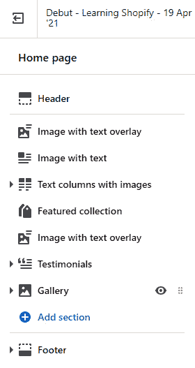
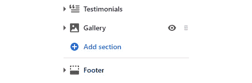
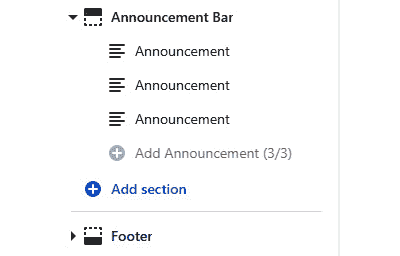
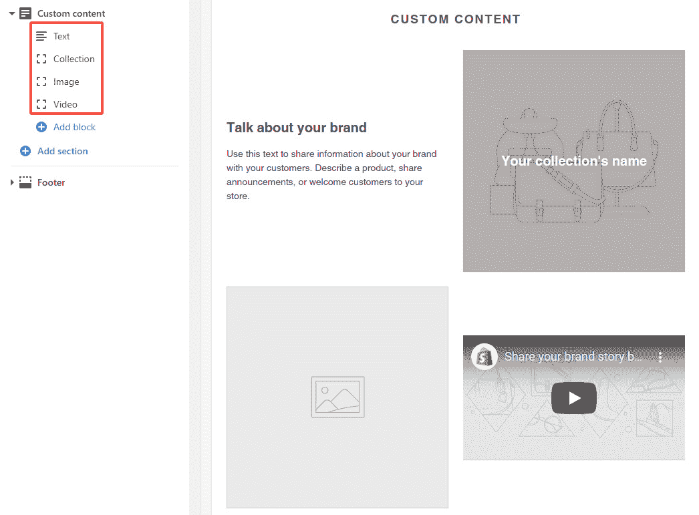
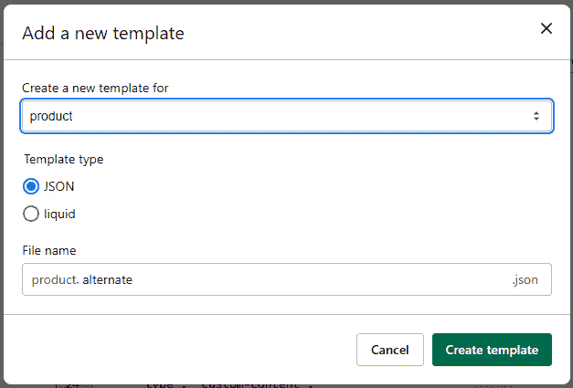
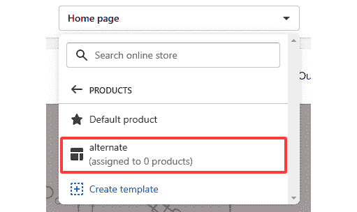
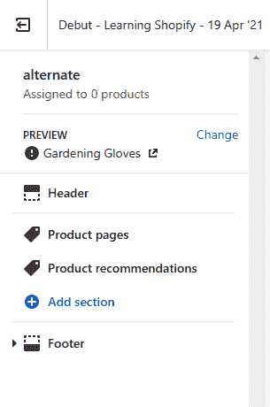
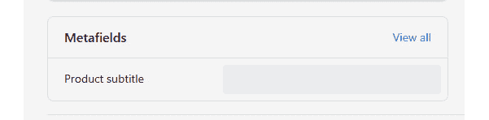
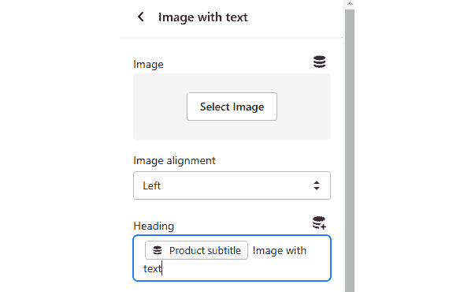

# *第七章*《处理静态和动态部分》

在上一章中，我们熟悉了不同类型的输入，无论是基本的还是专业的，以及我们如何使用它们来创建可以通过主题编辑器轻松配置的全局设置。

在本章中，我们不仅将使用之前提到的输入，还将学习如何创建易于配置和可重复使用的部分，我们可以使用这些部分来轻松更改页面或模板的布局。

在本章中，我们将学习以下主题：

+   静态部分与动态部分

+   与部分架构一起工作

+   使用块构建

+   使用 JSON 模板增强页面

+   探索特定于部分的标签

在完成本章后，我们将了解部分是什么，何时使用它们，以及如何创建一个部分。我们还将了解静态部分与动态部分之间的区别，以及我们如何通过主题编辑器来配置它们。

通过了解部分架构和我们可以使用的不同属性，我们还将学习如何在部分内创建可重复使用的模块，我们可以使用这些模块来重复操作并获得不同的结果。在熟悉了部分和块之后，我们将通过学习 JSON 模板和内置元字段来提高这些概念。最后，我们将了解在部分文件内可以使用的不同类型的专用标签，这将帮助我们创建可重复使用和动态的模块。

# 技术要求

虽然我们将解释每个主题并配合相应的图形展示，但考虑到 Shopify 是一个托管服务，我们需要互联网连接来跟随本章中概述的步骤。

本章的代码可在 GitHub 上找到：[`github.com/PacktPublishing/Shopify-Theme-Customization-with-Liquid/tree/main/Chapter07`](https://github.com/PacktPublishing/Shopify-Theme-Customization-with-Liquid/tree/main/Chapter07)。

本章的“代码实战”视频可以在这里找到：[`bit.ly/3hQzhVg`](https://bit.ly/3hQzhVg)

# 静态部分与动态部分

在*第一章*《Shopify 入门》中，当我们讨论主题结构时，简要提到了部分文件，*但部分究竟是什么呢？*

除了是主题文件中的一个目录名称之外，*部分*是一种文件类型，它允许我们创建可重复使用的模块，我们可以使用主题编辑器来定制这些模块，正如我们之前所学的。然而，与我们所学的全局设置相比，主要区别在于部分的 JSON 设置是在每个部分文件内部定义的，并且是针对特定部分的。

特定部分的设置允许我们在页面上多次使用相同的部分模块，并为每个出现选择不同的选项集，这使得它成为一个相当强大的功能。例如，我们可以创建一个特色收藏部分，并重复三次以显示来自三个不同收藏的三种产品。

在我们继续之前，让我们通过从代码编辑器中点击**自定义**按钮来导航到主题编辑器，并查看部分文件的实际效果。点击**自定义**按钮将自动打开主题编辑器，并将我们定位在主页上，页面预览在右侧，侧边栏在左侧。在侧边栏中，我们可以看到此特定页面上可用的几个部分：



图 7.1 – 主题编辑器内页面部分的示例

初看之下，我们可以看到**页眉**和**页脚**部分通过一条细边框与其它部分分开。这告诉我们**页眉**和**页脚**部分是静态部分，我们不能从主题编辑器中改变它们的位置。

类似于片段文件，`section`主题标签：

```php

```

通过包含`section`标签，我们将自动将部分的内容渲染到我们包含标签的位置，并能够通过其 JSON 设置进一步自定义它。请注意，由于这是一个我们手动包含在主题文件中的静态部分，通过主题编辑器应用到此特定部分的任何设置将在我们包含此部分的任何页面上可见。

例如，主题开发者已经在`theme.liquid`布局文件中包含了页眉和页脚部分文件，这是我们的主题主文件，这意味着页眉和页脚部分将在我们商店的任何页面上可见。另一方面，如果我们导航到主题编辑器内的不同页面，我们会看到一个页眉、一个页脚，以及在这两个之间的一组完全不同的部分，与我们之前在主页上看到的不同。

通过在`theme.liquid`文件中包含页眉和页脚部分，我们已经使它们在整个主题的任何页面上都可见。然而，我们不会在`theme.liquid`文件中包含所有部分，因为它们不是必需的。相反，我们将某些特定模板的部分包含在其各自的模板文件中，这样它们就只能在我们访问具有特定模板的页面时访问。

假设我们想在产品页面上包含相关产品部分。在这里，我们会导航到`product.liquid`模板，并在任何位置包含`section`标签，这将使相关产品部分在任何使用此特定模板的产品上可见。

如我们从*第四章*，“使用对象深入 Liquid 核心”中回忆的，在“*The Please apply P-Italics here content_for_layout object*”部分，我们提到`content_for_layout`对象允许我们通过加载动态生成的内容，包括来自其他模板的章节文件，将其连接到`theme.liquid`文件。

由于`content_for_layout`输出所有其他模板的内容，通过将其放置在页眉和页脚部分之间，我们已经确保了将所有来自其他模板文件的章节文件放置在页眉和页脚部分之间。让我们看看`theme.liquid`布局文件；我们会注意到`content_for_layout`被放置在`header`和`footer`部分之间，如下面的代码块所示：

```php

  <div class="page-container drawer-page-content" 
    id="PageContainer">
    <main class="main-content js-focus-hidden"         id="MainContent" role="main" tabindex="-1">
      {{ content_for_layout }}
    </main>
    
```

注意，在多个模板中包含相同的部分文件将在所有模板中显示相同的内容。通过从主题编辑器配置静态部分，我们可以将选择的数据保存到`settings_data.json`文件中，这将返回相同部分的任何出现的精确数据。

如果我们需要多次重复静态部分并包含不同的内容，我们需要使用不同的名称创建一个新的部分文件：

```php


```

到目前为止，我们已经看到了静态部分是什么以及如何使用它们来创建基于模板的可配置布局。但我们也有访问动态部分的能力，我们不必每次手动重新定位部分时都包括它们。

正如名称所示，**动态部分**是一组我们可以添加、删除、重新定位或重复任意次数，内容各不相同，而不需要修改任何代码的部分，所有这些都可以从主题编辑器中完成。让我们回到主题编辑器中的主页，并查看一些现有的动态部分：




图 7.2 – 主题编辑器中页面部分的示例

我们可以通过简单地悬停在部分本身上轻松地区分静态部分和动态部分。我们会注意到动态部分名称右侧有两个图标——一个**眼睛**图标和一个**六个点**图标——通过悬停。眼睛图标将允许我们切换部分的可见性。通过单击并按住六个点图标，我们可以通过将其移动到其他部分的上方或下方来重新定位部分。

此外，在动态部分的底部，我们会注意到一个**添加部分**按钮，点击后会出现一个下拉菜单，我们可以通过简单地点击它们来包含我们商店中存在的任意数量的部分。通过**添加部分**按钮添加到主题中的任何部分都将允许我们为任何出现包含不同的内容，并且我们可以根据需要重复此操作任意多次。

直到最近，主页是我们唯一可以使用动态部分的地方。对于所有其他模板，我们不得不依赖于使用静态部分。然而，自从 Shopify Unite 2021 活动以来，Shopify 引入了 JSON 类型模板，我们在*第一章*“使用 Shopify 入门”中简要提到了这一点。JSON 模板，我们将在本章后面了解更多，可以为任何页面添加动态部分，并将商店的整个功能提升到一个全新的水平。

现在我们已经了解了什么是部分以及如何使用它们，现在是时候学习如何创建它们了。

# 与部分模式一起工作

在上一章中，我们学习了如何使用 JSON 创建全局设置，其格式与部分文件的 JSON 格式相似。然而，部分 JSON 有一些显著的不同之处。

第一个主要区别是我们需要在部分文件内定义 JSON，而不是在`settings_schema.json`文件中。为此，我们需要引入`schema`标签：

```php

```

`schema`标签是一个 Liquid 标签，它本身没有输出。它仅仅允许我们在部分文件中编写 JSON 代码。请注意，每个部分文件只能包含一个`schema`标签，它必须独立存在。它不能嵌套在任何其他 Liquid 标签内。

一旦我们设置了`schema`标签，我们就可以熟悉在`schema`标签内可以使用哪些类型的属性了。

## 名称属性

如其名称所示，`name`属性允许我们设置部分名称，我们将在稍后通过主题编辑器识别该部分：

```php

{
  "name": "Announcement bar"
}

```

有了这些，我们已经学会了如何定义部分文件的名称，*但如果我们想创建一个国际化的商店，我们可以在主题编辑器中轻松翻译不仅商店内容，还包括商店设置标签怎么办呢？*

我们可以轻松地将`schema`标签内的大多数属性通过在`name`属性值中包含翻译键来翻译：

```php

{
  "name": {
    "cs": "Panel oznámení",
    "da": "Meddelelseslinje",
    "de": "Ankündigungsbereich",
    "en": "Announcement bar"
  }
}

```

第一个值代表`Locales`目录内文件的名称，而第二个值代表翻译值。通过引入翻译键，我们确保一旦我们更改商店语言，`name`值将自动调整并显示当前选定语言文件的值。

注意，我们可以包括不同类型属性的翻译键，包括我们在上一章中学到的某些输入设置。我们可以使用翻译键的属性包括`name`、`info`、`label`、`group`、`placeholder`、`unit`、`content`和`category`。

注意，`name`是一个必填属性。然而，与其他部分相比，`name`属性不必是唯一的，因此我们在创建新部分时应注意，以避免混淆。

## 类属性

`class`是一个简单的属性，允许我们向`div`元素添加额外的类，该元素围绕部分内容：

```php

{
  "name": {
    "cs": "Panel oznámení",
    "da": "Meddelelseslinje",
    "de": "Ankündigungsbereich",
    "en": "Announcement bar"
  },
"class": "homepage-section desktop-only"
}

```

通过这个可选属性，我们可以轻松地将任意数量的类包含在围绕我们的部分的父元素中，如下面的代码块所示：

```php
<div id="shopify-section-[id]" class="homepage-section   desktop-only">
</div>
```

注意，虽然我们可以包含任意数量的类，但由于`class`属性只接受字符串值，我们无法动态修改它们。

## 设置属性

使用`settings`属性，我们可以创建特定于部分的设置，这允许我们使用主题编辑器来配置部分：

```php

{
  "name": {
    "cs": "Panel oznámení",
    "da": "Meddelelseslinje",
    "de": "Ankündigungsbereich",
    "en": "Announcement bar"
  },
  "class": "homepage-section desktop-only",
  "settings": [
  ]
}

```

一旦我们定义了`settings`属性，我们就可以开始包含任何我们之前学过的基本或专业的输入设置，以创建我们需要的流程。由于我们正在创建一个公告栏，我们可以包含以下输入：

```php

{
  "name": {
    "cs": "Panel oznámení",
    "da": "Meddelelseslinje",
    "de": "Ankündigungsbereich",
    "en": "Announcement bar"
  },
  "class": "homepage-section desktop-only",
  "settings": [
    {
      "type": "text",
      "id": "announcement-text",
      "label": "Text"
    },
    {
      "type": "color",
      "id": "announcement-text-color",
      "label": "Text color",
      "default": "#000000"
    }
  ]
}

```

通过引入`settings`和输入设置，我们已经成功创建了第一个部分，其文本和文本颜色值可以在主题编辑器中调整。如果我们尝试将其作为静态部分包含，我们之前创建的两个输入设置将立即在相应的部分下可见：

```php

```

然而，如果我们导航到主页并通过**添加部分**按钮包含公告部分，我们将找不到它。我们仍然缺少一个属性，我们需要创建一个可以动态添加到主页的部分。

## 预设属性

`presets`属性允许我们定义一个部分的默认配置，这使得部分可以通过`presets`属性访问，它可以包含以下属性：

+   `name`属性是强制的，它将定义部分在**添加部分**下拉菜单中的显示方式。

+   `category`属性不是强制的。我们可以使用它将不同的部分分组到单个类别下，以便更直观地导航。

注意，虽然 Shopify 没有严格要求，但建议为`presets`部分使用一个独特的名称以避免混淆。否则，我们可能会得到多个具有相似名称的部分：

```php

{
  "name": {
    "cs": "Panel oznámení",
    "da": "Meddelelseslinje",
    "de": "Ankündigungsbereich",
    "en": "Announcement bar"
  },
  "class": "homepage-section desktop-only",
  "settings": [
    {
      "type": "text",
      "id": "announcement-text",
      "label": "Text"
    },
    {
      "type": "color",
      "id": "announcement-text-color",
      "label": "Text color",
      "default": "#000000"
    }
  ],
  "presets": [
    {
      "name": "Announcement bar",
      "category": "Text"
    }
  ]
}

```

注意，我们只应该为动态部分包含`presets`属性。如果我们计划将其用作静态部分，我们应该删除`presets`属性。

如果我们现在打开主题编辑器并点击主页上的**添加部分**按钮，我们会看到**公告栏**部分，其中包含我们之前定义的文本和颜色设置。

访问特定部分的 JSON 输入值与访问`settings_schema.json`文件内的设置的方式相对类似。唯一的区别是，访问部分的`settings`对象的唯一方式是通过`section`对象：

```php
{{ section.settings.announcement-text }}
{{ section.settings.announcement-text-color }}
```

关于`section`对象的更多信息，请参阅[`shopify.dev/api/liquid/objects/section`](https://shopify.dev/api/liquid/objects/section)。

到目前为止，我们已经学习了什么是章节，静态章节和动态章节之间的区别，以及如何使用它们。然而，回顾我们已工作的公告章节项目，很明显整个章节相当基础，因为它只允许我们创建一个公告。

我们可以包含一些额外的文本输入选项，我们可以使用这些选项来创建多个公告，但这将需要我们每次需要包含额外的公告时都手动编辑 JSON 代码。*如果我们想创建一个可以添加任意数量公告的章节，而不需要在每次需要包含额外的公告时都修改 JSON 代码，那会怎么样？* 对于这个，我们可以使用`blocks`属性。

# 使用模块构建

`blocks`属性是 Shopify 中最强大的工具之一。通过使用它们，我们可以创建可以重复使用任意次数的模块，并从主题编辑器内部重新排序章节内容。然而，这可能会让人感到困惑，因为它听起来与我们刚刚学到的关于动态章节的内容相似。然而，关键的区别在于`blocks`章节允许我们在章节内部重新排序内容，而不是章节本身，这使得我们可以创建更复杂的功能。

此外，我们可以将`blocks`属性与静态章节结合使用，以创建类似于我们目前在主页上拥有的动态章节功能，并将其包含在任何页面上。然而，我们将重新排列的不是章节，而是模块。

`blocks`属性允许我们使用对象格式创建不同类型的模块，其中每个对象类型将作为一个独特的模块。在这里，我们可以在每个模块下包含一组不同的输入设置选项。

下面是创建和使用`blocks`模块的步骤：

1.  让我们通过引入`blocks`属性来修改之前创建的公告栏章节。此外，我们将删除某些功能，如翻译键和`class`属性，以使代码保持简洁和可读：

    ```php
    
    {
      "name": "Announcement Bar",
      "settings": [
        {
          "type": "text",
          "id": "announcement-text",
          "label": "Text"
        },
        {
          "type": "color",
          "id": "announcement-text-color",
          "label": "Text color",
          "default": "#000000"
        }
      ],
      blocks attribute has its own set of attributes that we need to use to create different modules:*   The `name` attribute allows us to set the name of the `blocks` module and decide how the block will appear in the theme editor. The `name` attribute is mandatory.*   The `type` attribute is a mandatory attribute that accepts a string value where we can define the block type. Note that the `type` attribute does not have a predefined set of values. Instead, we can use any string value to define the block type.*   Using the `limit` attribute, we can limit how many times we can repeat a particular block type. The `limit` attribute is optional and only accepts a `number` type value.*   The `settings` attribute allows us to include `blocks` module-specific settings. The `settings` attribute is optional.Note that the `name` and `type` attributes of the `blocks` module need to remain unique within the section, whereas the `id` attribute needs to remain unique within the `blocks` modules. Otherwise, we will end up with invalid JSON code.
    ```

1.  现在，让我们学习如何在章节模式中包含之前提到的`blocks`模块属性。请注意，我们只展示`blocks`属性内部的代码，以保持代码简洁并突出重点：

    ```php
    "blocks": 
    blocks module with the name attribute set to Announcement, the type attribute set to announcement, and the limit attribute set to 3, which limits the blocks module to a maximum of 3 repetitions.
    ```

1.  现在我们已经设置了所有必要的属性，我们只需要将必要的输入设置填充到`settings`属性中。因为我们已经创建了文本和文本颜色输入设置，所以我们可以简单地将文本输入设置迁移到`blocks`模块内部：

    ```php
    "blocks": [
    blocks module, we can dynamically repeat the entire block up to three times, consequently creating three separate announcements.
    ```

1.  让我们通过导航到主题编辑器并点击`settings`对象来查看这看起来是什么样子：![Figure 7.03 – Example of a section inside the theme editor    ![Figure 7.03_B17606.jpg    图 7.3 – 主题编辑器内章节的示例    由于我们只迁移了文本输入，而将文本颜色输入留在了`section`设置对象中，我们可以一次性使用它来设置所有块的文本颜色。让我们点击`blocks`模块左侧的箭头。    我们会注意到，除了**添加部分**按钮外，我们还在我们创建的**公告栏**部分下方有一个**添加公告**按钮：    

    图 7.4 – 区块块模块的示例

1.  点击`settings`对象，点击`blocks`模块并立即定位到块内部。在这里，我们可以定义公告文本输入。

1.  在`blocks`模块的对象设置中定义所有输入后，我们可以点击左侧的箭头。然而，请注意，由于我们引入了一个值为`3`的`limit`属性，我们只能重复使用**公告**块最多 3 次，如下所示：



图 7.5 – 有限数量的区块块模块示例

一旦我们包含了定义的最大模块数，`blocks`模块。同样，与动态部分一样，悬停在`blocks`模块上会显示两个图标。这些图标将允许我们隐藏当前选定的块或使用拖放功能重新排列块的顺序。

现在我们已经学会了如何创建和使用`blocks`模块，我们需要学习如何输出`blocks`模块输入设置的值：

1.  我们可以像访问`section`对象一样访问`blocks`模块的对象设置：我们需要使用一个`section`对象与`blocks`属性结合。这个`section`对象和`blocks`属性的组合将返回一个包含区块块的数组，我们可以使用简单的`for`循环来访问这些数组：

    ```php
    
    
    ```

1.  一旦我们创建了`for`循环，剩下的唯一事情就是输出每个块的值，就像我们对部分所做的那样。唯一的区别是这次，我们将使用在`for`循环中定义的变量，而不是使用`sections`关键字：

    ```php
    
      {{ block.settings.announcement-text }}
    
    ```

到目前为止，我们已经学会了如何创建整个部分架构，通过它我们可以创建静态和动态部分，并构建`blocks`模块。我们还学会了如何输出`sections`和`blocks`模块输入设置的值。然而，在先前的例子中，我们只有一种类型的块；*如果我们有多个块类型会怎样呢？*

区块块真正的力量在于我们可以在单个`section`元素内创建多个`blocks`模块类型，这可以通过简单地创建具有不同类型值的多个`section`块对象来实现：

```php
"blocks": [
  {
    "name": "Product",
    "type": "product",
"settings": [
      {
        "type": "product",
        "id": "featured-product",
        "label": "Product"
      }
    ]
  },
  {
    "name": "Collection",
"type": "collection",
    "settings": [
      {
        "type": "collection",
        "id": "featured-collection",
        "label": "collection"
      }
    ]
  }
]
```

注意，所有`name`和`type`属性值在整个节区内都需要是唯一的，而输入设置的`id`属性只需要在单个块内是唯一的。

正如我们所见，创建多个`blocks`模块元素相对简单。虽然在我们的示例中我们只创建了两个简单的`blocks`模块，但我们可以创建任意数量的`blocks`模块，并通过主题编辑器重新排列以创建复杂的布局：



图 7.6 – 某节区内多个块模块的示例

如我们从示例中可以看到，我们有四种不同类型的块（**文本**、**集合**、**图片**和**视频**），我们可以使用这些块来创建一个店主可以轻松配置的布局，而无需自己修改代码。

之前，我们学习了如何通过使用`section.blocks`返回的`for`标签来遍历块数组。然而，如果我们有多个`blocks`模块类型，我们还需要引入一个额外的步骤。

假设，正如前面的示例中那样，我们有一个包含四种类型块的节。*我们如何识别块类型并知道应该为哪个块输出哪种布局？*为了解决这个问题，我们可以使用与`type`属性配对的`block`对象，这将允许我们恢复块类型值。

关于`block`对象的更多信息，请参阅[`shopify.dev/api/liquid/objects/block`](https://shopify.dev/api/liquid/objects/block)。

一旦我们识别出每个块类型，我们就可以使用`if`语句或`case/when`控制流标签来执行相应值的正确代码。假设我们需要提醒自己如何使用语句或`case/when`控制标签；我们可以回顾*第三章*，*使用标签深入 Liquid 代码*，并查阅*控制 Liquid 流程*部分，其中概述了使用控制流标签的过程：

```php

  
    
      
    
      
    
      
  

```

在前面的示例中，我们结合使用`case/when`控制流标签和`block.type`来识别我们当前正在遍历的块类型。在识别块类型后，我们渲染了包含相应块正确布局的片段文件。

注意，我们已经将`block`对象传递给每个片段。如您所回忆的那样，片段文件是唯一可以访问父目录中定义的变量的文件类型。然而，即使是片段文件也无法自动访问这些变量。相反，我们需要将这些值作为参数传递。

假设我们需要提醒自己如何将值传递给片段文件；我们可以回顾*第三章*，*使用标签深入 Liquid 代码*，并查阅位于*主题标签*部分下的*渲染标签*部分，其中概述了处理片段文件的过程。

除了学习如何创建`blocks`模块外，我们还了解了`limit`属性，我们可以使用它来限制重复特定类型`blocks`模块的次数。当我们只有一个类型块时，这效果很好。*但是，如果我们想创建一个限制，以便在某个部分内可以拥有任意组合的最大数量块呢？*

## `max_blocks`属性

`max_blocks`属性与`limit`属性类似，允许我们限制在某个部分内可以创建的`blocks`模块的数量。然而，它们有一个显著的区别：`limit`属性只允许我们限制重复特定块类型的次数，而`max_blocks`属性允许我们限制特定部分的最大块类型数量。

注意，`max_blocks`属性是可选的，并且只接受数字数据作为其值：

```php

{
  "name": "Footer",
  "max_blocks": 5,
  "settings": [
  ],
  "blocks": [
  ]
}

```

`max_blocks`属性最常见的使用是在页脚部分。有了它，店主可以轻松地以任何顺序重新排列块，无论是重复单个块五次还是使用五个不同的块，同时确保整个部分的布局保持适当的流程。

在此之前，我们学习了如何创建`blocks`模块，以及如何识别不同类型的块类型并相应地访问每个块对象。现在我们已经学会了如何使用`max_blocks`来限制某个部分内的产品数量，我们就拥有了构建任何类型`blocks`模块所需的所有必要知识。

正如我们所见，块功能非常强大，允许我们创建从基本文本功能到复杂布局功能的一切，这些功能与不同类型的块交织在一起，店主可以使用这些块来讲述他们产品的故事。

通过以上内容，我们已经了解了静态部分和动态部分之间的区别，静态部分是我们可以在任何页面上手动嵌入的，而动态部分则允许我们动态地向主页添加任意数量的部分。然而，正如我们在本章开头提到的，Shopify 最近为我们提供了通过 JSON 模板在任意页面上动态包含部分的方法。通过使用 JSON 模板，我们可以将静态和动态部分结合成一个新的功能，我们可以在主题编辑器内对其进行控制。

# 使用 JSON 模板增强页面

在*第一章*《Shopify 入门》中，当我们讨论主题结构时，我们简要提到了 JSON 模板，*但它们究竟是什么呢？*

`.json`类型模板通常与其对应的`.liquid`模板具有相同的目的，因为它们都允许我们通过单个模板创建和管理多个页面的外观。然而，两者之间的显著区别在于，虽然`.liquid`类型模板仅作为标记文件，`.json`文件则作为数据类型文件，这使我们能够轻松地在任何页面上添加、删除或重新排列部分，类似于我们在主页上所能做的。

`.json`类型模板也与`Section`目录文件有相似之处，其中我们需要在部分文件中包含一个有效的模式设置。`.json`类型模板必须是一个有效的`.json`文件，模板内部定义了 JSON 代码。虽然我们可以创建任意数量的`.json`类型文件，但模板文件的名称必须在`.liquid`或`.json`文件中是唯一的。例如，如果我们创建一个`product.json`文件模板，我们不能同时创建一个`product.liquid`文件。

此外，JSON 文件有一个限制。每个模板最多可以渲染 20 个部分，每个部分最多 16 个块，这是一个相当高的数字，但如果我们达到这个限制，我们可能需要重新考虑我们的页面布局。

现在我们已经对 JSON 类型模板是什么以及它们是如何工作的有了一些基本了解，让我们学习如何创建我们的第一个 JSON 类型文件。

## 构建 JSON 模板结构

而不是简单地列出创建文件所需的必要属性，我们将学习如何通过将当前的`product.liquid`类型模板迁移到 JSON 模板来创建一个 JSON 模板。

让我们从打开`Templates`目录并点击`alternate`开始创建一个 JSON 类型模板：



图 7.7 – 创建新的 JSON 类型模板的示例

一旦我们创建了一个新的 JSON 文件，Shopify 将自动将我们重定向到新创建的文件。我们将看到一个几乎为空、只包含两个属性的文件。因此，让我们开始创建必要的属性并开始我们的迁移过程。

正如我们之前提到的，JSON 模板必须是一个有效的 JSON 文件，其根是一个对象，可以包含以下一些属性：

+   `name`属性是一个必需的字符串类型属性，正如其名称所暗示的，我们可以定义模板的名称：

    ```php
    {
      "name": "JSON product template"
    }
    ```

+   `layout` 属性是一个可选属性，它接受两种类型的值，一个字符串或 false，这取决于我们想要实现什么。字符串值应该表示我们想要与这个特定模板一起使用的布局文件的名称，不包括 `.liquid` 扩展名。如果您需要了解更多关于布局文件的信息，请回顾 *第三章*，*深入 Liquid 核心与标签*，在那里我们学习了 *主题标签* 部分的 `layout` 标签。请注意，如果我们不包括 `layout` 属性，Shopify 将默认使用 `theme.liquid` 布局。然而，为了学习目的，我们将手动添加并选择 `theme` 布局：

    ```php
    {
      "name": "JSON product template",
      "layout": "theme"
    }
    ```

+   `wrapper` 属性是一个字符串类型属性，它允许我们选择在模板内部每个节周围想要包含的 HTML 包装器的类型。我们在这里可以使用以下 HTML 标签：

    +   `div`

    +   `main`

    +   `section`

    注意，除了选择 HTML 包装器的类型之外，我们还可以包含我们可能需要的任何其他属性，例如 `class`、`id` 或 `data`。请注意，`wrapper` 属性完全是可选的：

    ```php
    {
      "name": "JSON product template",
      "layout": "theme",
      "wrapper": "div.product-wrapper[data-type=product]"
    }
    ```

+   `sections` 属性是一个强制性的对象类型属性，它使用节的名称作为键，`section` 数据作为值。在 `sections` 对象内部，我们可以定义我们想要在页面内部包含哪些节：

    ```php
    {
      "name": "JSON product template",
      "layout": "theme",
      "wrapper": "div.product-wrapper[data-type=product]",
      sections object allows us to include a mandatory static section, similar to our main page content, that is more page-specific. First, we will need to set a unique ID representing each static section that we are looking to include:

    ```

    {

    "name": "JSON 产品模板",

    "layout": "theme",

    "wrapper": "div.product-wrapper[data-type=product]",

    "sections": {

    sections 属性使用与之前我们了解过的 section 属性相同的格式，我们还需要在 sections 对象内部包含一些额外的属性。例如，我们需要包含 type 属性，其值应该是我们想要包含的节的名字，如果需要的话，还可以包含 settings 或 blocks 属性：

    ```php
    {
      "name": "JSON product template",
      "layout": "theme",
      "wrapper": "div.product-wrapper[data-type=product]",
      "sections": {
        "main-block": {
          settings or blocks attribute should not contain the input type settings. Instead, we should set the key value to the ID of the existing input inside each section, as well as the value of the settings input value that we wish to set:

    ```

    {

    "name": "JSON 产品模板",

    "layout": "theme",

    "wrapper": "div.product-wrapper[data-type=product]",

    "sections": {

    "main-block": {

    "type": "name-of-the-section",

    "settings": {

    main 和 recommendations) 不是预设值，我们可以将它们的名称更改为我们喜欢的任何值。在处理 `sections` 对象时，我们需要牢记三个关键点：*   我们需要在 `sections` 对象内部至少设置一个块。*   所有块名称在整个 `sections` 对象中必须是唯一的。*   `type` 属性的值需要与我们要包含的节的名字相匹配。通过在我们的新 JSON 模板中包含 `main` 和 `recommendations` 节，我们已经确保了这两个节在预览分配了特定 JSON 类型模板的页面时，始终会在主题编辑器中可见。然而，尽管这些节被认为是静态的，我们仍然可以隐藏它们并重新排列，就像动态节一样。

    ```php

    ```

    ```php

    ```

+   最后一个属性是`order`属性，这是一个必填属性。`order`属性是一个数组类型的属性。在这里，我们可以包括我们在`sections`对象内部之前设置的`sections`块 IDs 并对它们进行排列：

    ```php
    {
      "name": "JSON product template",
      "layout": "theme",
      "wrapper": "div.product-wrapper[data-type=product]",
      "sections": {
        "main": {
          "type": "product-template"
        },
        "recommendations": {
          "type": "product-recommendations"
        }
      },
      "order": [
        "main",
        "recommendations"
      ]
    }
    ```

并且在`order`属性设置到位后，我们的 JSON 模板就准备好了！让我们导航到主题编辑器并测试一下。

要测试新的商品模板，请按照以下步骤操作：

1.  导航到管理员仪表板的**商品**。

1.  点击任何商品，然后从**模板后缀**下拉菜单中选择新的模板名称，该下拉菜单位于**主题模板**区域下。

    重要提示：

    **模板后缀**下拉菜单只能读取当前实时主题中的值。这意味着新创建的模板文件在我们发布或复制它们为实时，或者在我们当前实时团队中创建相同的模板文件之前，将不会在我们的管理员仪表板中可见。如果我们选择后者，请注意，我们需要使用相同的名称创建文件；我们不需要对文件内容进行任何更改。

然而，使用这种新的模板类型，我们也有了一种新的预览模板的方法。请注意，以下方法只能让我们预览模板。我们仍然需要通过导航到管理员仪表板的商品页面，并在下拉菜单中选择模板来分配模板：

1.  让我们从导航到主题编辑器开始，点击屏幕中间的下拉菜单，并选择**商品**选项。这将显示我们目前正在工作的主题下的模板。让我们通过点击它来选择我们创建的新 JSON 类型模板：

    图 7.8 – 在主题编辑器中选择模板的示例

1.  点击**备用**模板将自动将我们重定向到一个随机商品，允许我们预览我们选择的模板。

    重要提示：

    与主页上的动态部分类似，只有具有预设属性存在于`sections`架构中的部分将在**添加部分**下拉菜单下可见。

    如果我们一切操作正确，我们应该在左侧边栏中看到两个部分和**添加部分**按钮：

    

    图 7.9 – 在主题编辑器中预览 JSON 类型模板的示例

1.  现在，尝试点击任何两个部分，更新任何设置，或者通过点击其名称旁边的**X**，通过我们创建的`.json`类型模板添加一个新部分，然后再次打开它。

    我们将注意到**Shopify**已更新模板文件，并且它现在包含所有设置及其值。

    由于我们可以在模板文件中找到所有设置及其值，如果我们将 JSON 模板文件分配给多个产品，它们将使用具有相同设置的布局。如果我们想创建一个额外的 JSON 模板，以便我们可以创建不同的布局，我们可以手动创建一个新的 JSON 模板并复制代码，或者通过主题编辑器完成此操作。

1.  让我们回到主题编辑器，点击屏幕中间的下拉菜单，并选择**产品**选项。但这次，我们将点击**创建模板**按钮，这将导致以下弹出窗口出现：

![图 7.10 – 通过主题编辑器创建新 JSON 类型模板的示例

![img/Figure_7.10_B17606.jpg]

图 7.10 – 通过主题编辑器创建新 JSON 类型模板的示例

如我们所见，在弹出窗口中，我们可以轻松设置新的模板名称并选择我们应该复制内容的 JSON 模板。

有了这些，我们已经学会了如何为任何数量的页面创建任何数量的模板，*但如果我们想为多个页面使用相同的布局，而只为每个页面使用不同的内容呢？* 这就是元字段发挥作用的地方！

## 使用元字段升级 JSON 模板

如您可能从*第四章*，“使用对象深入液态核心”中回忆起，在浏览“使用元字段改进工作流程”部分时，我们提到 Shopify 引入了一个功能，允许我们使用元字段而无需依赖第三方应用程序。

除了允许我们在仪表板内创建元字段外，Shopify 还提供了一套全新的不同类型的元字段，我们可以创建：

1.  首先，导航到仪表板中的**设置**选项，位于屏幕的左下角，并点击**元字段**选项。

1.  进入后，我们会看到我们没有设置任何元字段，并且我们只能使用产品和变体元字段；其他字段仍在等待中。让我们通过点击**产品**元字段链接来继续操作。

1.  考虑到我们目前没有设置任何元字段，我们可以立即点击**添加定义**按钮。这将带我们到一个可以创建元字段定义的页面。虽然大多数字段应该与您在*第四章*“使用对象深入液态核心”中学习元字段时熟悉，但我们现在有一个新的字段。让我们点击**选择内容类型**字段，这将显示一个包含我们可以创建的所有可用元字段类型的下拉菜单：![图 7.11 – 可用元字段类型字段的示例

    ![img/Figure_7.11_B17606.jpg]

    图 7.11 – 可用元字段类型字段的示例

    注意，每种类型的元字段都会在我们的产品页面仪表板内创建一个选择器。我们可以选择文本输入，这将自动显示一组额外的设置。然而，我们现在不会更改这些设置。

1.  在选择元字段的文本类型后，我们只需要设置其名称。为了我们的目的，我们将通过点击**名称**字段并选择**产品副标题**来选择预定义的元字段值，这将自动填写所有其他字段。请注意，我们需要按下**保存**按钮来保存新创建的元字段：

    图 7.12 – 产品仪表板内元字段示例

1.  现在我们已经创建了一个产品元字段，让我们点击位于我们管理仪表板左上角的**产品**链接，并点击我们选择的任何产品。如果我们滚动到页面底部，我们会注意到我们创建的元字段现在已成为我们产品页面的一部分。

1.  如我们所见，通过简单地创建产品元字段定义，我们已经自动将相同的元字段添加到每个产品中，这使得我们比使用第三方应用程序更容易更新元字段的值。让我们通过添加任何字符串值并按下**保存**按钮来更新元字段的值。

1.  现在，返回到主题编辑器，导航到 JSON 模板，并找到我们可用的部分中的任何文本输入类型。为了我们的目的，我们添加了一个名为`Image with text`的新部分。

1.  在查看本节时，我们会注意到特定类型字段旁边出现的新图标：![img/Figure_7.13_B17606.jpg]

    图 7.13 – 主题编辑器内元字段图标的示例

    点击**标题**文本输入旁边的底部图标会立即显示我们可以从该特定产品中提取的所有元字段列表。

1.  选择我们之前选择的**产品副标题**元字段，并点击**插入**按钮。这将自动添加所选元字段的值，并在我们选择的输入字段中输出：



图 7.14 – 主题编辑器内元字段图标的示例

通过这种方式，我们已经学会了如何通过使用元字段动态更新部分设置的值，而不必为每个产品创建一个新的 JSON 模板。我们现在需要做的就是通过在 JSON 模板内排列必要的部分来创建适当的布局。

注意，通过使用元字段，我们可以更新所有类型的输入，如图片、URL 或甚至是颜色样本。然而，我们应该创建一个适当的元字段，以确保元字段值和输入类型值匹配。

如我们之前所见，仅使用部分就能非常强大。将部分与 JSON 模板和元字段混合使用，使其更加引人注目。这允许商家轻松地为每个页面配置不同的设置，而无需为每个页面创建新的模板或手动插入部分。

除了我们迄今为止所学的，我们还知道 Shopify 还提供了一些额外的特定于部分的标签，我们可以使用这些标签创建更强大的元素。

# 探索特定于部分的标签

虽然我们可以轻松地在主题的相关资产文件中定义样式或包含 JavaScript 代码，但 Shopify 提供了三种类型的标签，我们可以使用这些标签直接在部分文件中包含 CSS 和 JavaScript。

## `stylesheet` 标签

与 `schema` 标签类似，`stylesheet` 标签是一个 Liquid 标签，它本身没有输出。它仅仅允许我们在部分文件内编写 CSS 代码。请注意，每个部分文件只能包含一个 `stylesheet` 标签，该标签必须独立存在。它不能嵌套在任何其他类型的 Liquid 标签内：

```php


```

虽然一开始这可能看起来不是一个好主意，因为我们最终会在多个文件中分散 CSS 代码，但 Shopify 会自动收集来自不同部分文件的所有 CSS 文件，将它们合并成一个样式表文件，并通过 `content_for_header` 全局对象将其注入主题文件。

重要提示：

`stylesheet` 标签仅接受 CSS 值。我们无法在标签内包含 Liquid 代码。

注意，捆绑的资产不是针对部分或块的。对于针对部分或块的样式表，我们需要使用 `style` 标签。

## `style` 标签

`style` 标签与 `stylesheet` 标签类似，因为它允许我们直接在部分文件中编写 CSS 代码。然而，`style` 标签与 `stylesheet` 标签有两个显著的区别：

+   第一个区别在于 `style` 标签等同于使用 HTML `<style>` 标签，这意味着 Shopify 不会收集和捆绑通过 `style` 标签包含的 CSS 代码。相反，Shopify 将在包含它的同一位置渲染 HTML `style` 标签及其内容：

    ```php
    
    
    ```

+   第二个也是更重要的一点是，`style` 标签允许我们包含 Liquid 代码，我们可以使用主题编辑器动态地通过它来修改 CSS 内容：

    ```php
    
    .featured-wrapper { 
      background-color: {{ section.settings.background-    color }};
    }
    
      
        
          .featured-product {
            font-size: {{ block.settings.product-font-size }}          px;
          }
        
          .featured-collection {
            font-size: {{ block.settings.collection-font-                size }}px;
    }
      
    
    
    ```

注意，与定义在 `settings_schema.json` 文件内的输入设置不同，其值可以在任何文件中全局访问，部分和块的输入值只能在部分文件本身或片段文件内访问，在我们将值作为参数传递之后。

在前面的示例中，我们看到了如何输出部分输入值并使用它们动态地修改 CSS 代码。然而，在我们的示例中，我们使用了静态类，这意味着我们应用到的`background-color` CSS 将影响每个部分和块。*但如果我们想为每个部分或块应用不同的颜色呢？*

要为特定元素应用独特的样式，我们需要使用`section`或`block`对象，结合`id`属性，创建一个我们可以稍后调用的唯一标识符：

```php
<div class="featured-wrapper featured-wrapper-{{ section.id 
}}"></div>

  <div class="featured-collection featured-collection-{{     block.id }}"></div>

```

注意，`section.id`将为动态部分返回一个动态生成的 ID 以及部分文件名（对于静态部分不包含 Liquid 扩展名）。`block.id`将始终返回一个动态生成的 ID。

现在我们已经生成了唯一的选择器，我们只需要在`style`标签内包含相同的选择器：

```php

.featured-wrapper-{{ section.id }} {
  background-color: {{ section.settings.background-color}};
}

  
    
      .featured-collection-{{ block.id }} {
        font-size: {{ block.settings.collection-font-size                 }}px;
      }
  


```

现在我们已经知道了如何生成和调用唯一选择器，我们可以轻松地为部分和块元素创建不同的样式。请注意，我们还可以在 HTML 中使用`style`属性包含具有动态值的 CSS。

## `javascript`标签

`javascript`标签的工作方式与`stylesheet`标签相同。该标签本身没有输出；它只是允许我们直接在部分文件内编写 JavaScript 代码。我们可以在一个部分中包含一个单独的`javascript`标签，该标签必须独立存在，并且不能嵌套在其他 Liquid 标签内：

```php


```

类似地，与`stylesheet`标签一样，`javascript`标签只接受 JavaScript 代码。我们无法在标签内包含任何 Liquid 代码。此外，Shopify 将自动将`javascript`标签内的任何代码打包，并通过`content_for_header`全局对象将其注入主题文件。

由于我们无法在`javascript`标签内使用 Liquid 代码，一种应用特定部分 JavaScript 的方法是使用数据属性，这将输出特定的输入值，并在稍后使用 JavaScript 恢复该值：

```php
<div class="rotating-announcement" data-speed="{{   section.settings.speed }}"></div>

  var rotationSpeed = parseInt(document.querySelector     ('.rotating-announcement').dataset.speed);

```

考虑到捆绑的资产不是针对部分或块的，如果我们需要创建一些针对部分或块的特定 JavaScript 代码，我们就需要使用 HTML `<script>`标签。请注意，目前 Shopify 没有接受 Liquid 代码的 Liquid 标签。

使用 HTML `<script>`标签，我们现在可以编写针对部分和块的特定 JavaScript，并直接包含输入设置值。然而，请注意，当直接在 JavaScript 中包含输入设置值时，应使用空白控制来确保不包含额外的空格：

```php
{{- section.settings.speed -}}
```

如果你需要提醒自己如何使用空白控制，请重新阅读*第二章*，*Liquid 的基本流程*，并查阅*控制空白*部分，其中我们概述了控制空白的过程。

# 摘要

在本章中，我们学习了如何将我们之前获得的基本和专用输入知识与部分架构相结合。这使得我们能够创建从简单到复杂的布局，我们可以在主题编辑器中轻松配置。

通过学习静态和动态部分之间的区别，我们学会了如何扩展部分的功能，使其在任何类型的页面上都易于访问。此外，除了学习如何创建不同类型的部分外，我们还获得了创建不同类型的`blocks`模块的知识，这将使我们能够重新排列单个部分的结构，使其易于配置。

最后，我们了解了我们可以用来进一步开发部分内容以及为特定部分或甚至`blocks`模块创建独特体验的不同类型的部分特定标签。

在下一章中，我们将了解 Shopify Ajax 是什么以及我们如何利用它来实现高级功能并使商店更加动态。

# 问题

1.  静态部分和动态部分之间主要区别是什么？

1.  我们可以使用什么对象来访问块输入值？编写一些代码，使我们能够访问特定的`blocks`模块输入值。

1.  `limit`和`max_blocks`属性之间的区别是什么？

1.  我们如何应用特定部分的 CSS 样式？

# 熟能生巧

与前几章的项目一样，这个项目将包含关于我们需要做什么以及适当的说明，以帮助你实现结果。

我们建议独立于前几章的项目进行工作，因为这将确保你真正理解了你迄今为止所学的内容。

没有一个项目有正确或错误解决方案。然而，如果你有任何困难，你总是可以查阅项目解决方案，该解决方案可在本书末尾找到。

## 项目 4

对于我们的第四个项目，我们将致力于创建一个具有多种块类型的部分架构。虽然我们可以包括任何数量的块类型，但我们应确保包括以下类型：

+   文本类型，将渲染单个富文本输入

+   产品类型，将渲染一个包含产品名称、价格、图片和链接的单个产品元素

+   列表类型，将在导航管理部分渲染一个可配置的一级导航列表

+   视频类型，将渲染来自 YouTube 或 Vimeo 视频平台的视频

下面是关于资产的说明：

1.  创建一个名为`featured-content.liquid`的新部分文件。

1.  为每个部分创建一个单独的片段文件，同时将适当的对象传递给每个片段。

以下是为这项作业的说明：

1.  包含我们需要的所有动态部分属性。

1.  根据提供的规范创建四个模块。

1.  将视频区块类型限制为最多重复两次，而其他所有区块应限制为仅出现一次。

1.  任何时刻存在的区块总数不应超过四个区块。

1.  应通过使用预定义的下拉值单独配置每个区块的宽度，并通过类应用所选宽度到每个区块，而不是直接应用值。这些值是 100%、50%、33.33%和 25%。

1.  只在区块文件中包含区块或区块特定的 CSS。我们应该在主题的相关 CSS 文件中包含所有其他 CSS 样式。

1.  在每个代码片段文件的区块设置部分定义以下输入设置：`font-size`、`font-family`、文本`颜色`和`背景颜色`。我们应该能够从 Shopify 的`font`库中选择字体家族。

1.  在区块内创建一个文本输入元素，我们将使用它来定义整个区块的 H1 标题。如果输入字段为空，我们应该隐藏 h1 HTML 元素。

1.  将整个项目迁移到`.json`页面类型模板。
