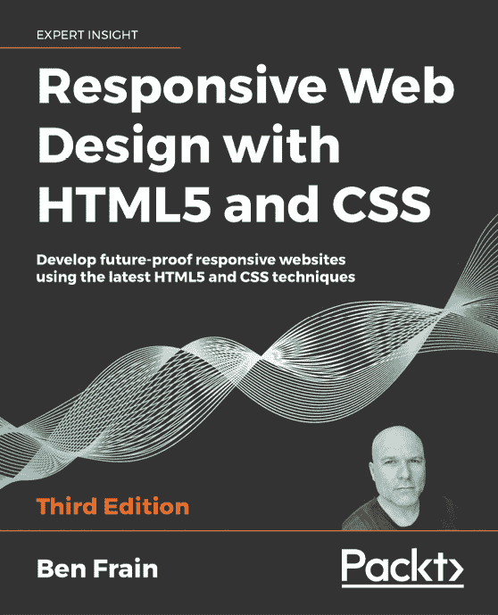
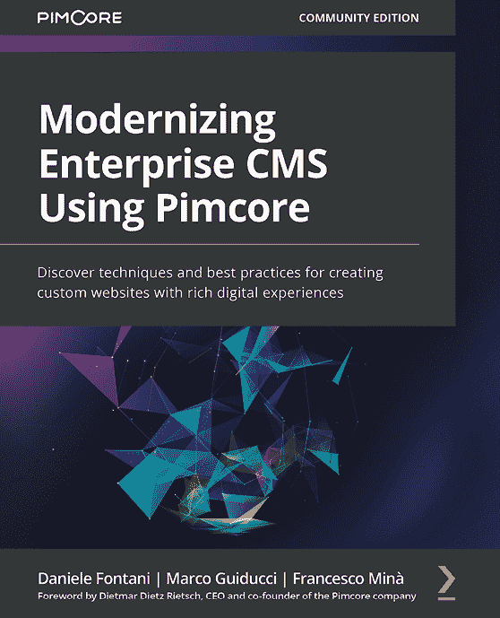
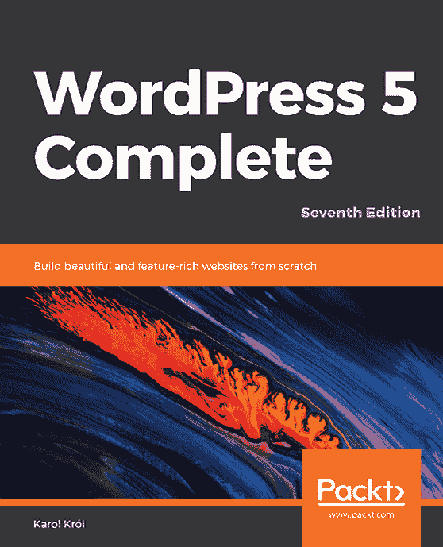

[Packt.com](http://Packt.com)

订阅我们的在线数字图书馆，全面访问超过 7,000 本书籍和视频，以及领先的行业工具，帮助您规划个人发展并提升职业生涯。更多信息，请访问我们的网站。

# 第十章：为什么订阅？

+   使用来自超过 4,000 位行业专业人士的实用电子书和视频，节省学习时间，增加编码时间

+   通过为您量身定制的 Skill Plans 提高学习效果

+   每月免费获得一本电子书或视频

+   完全可搜索，便于轻松访问关键信息

+   复制粘贴、打印和收藏内容

您知道 Packt 为每本书都提供电子书版本，包括 PDF 和 ePub 文件吗？您可以在[packt.com](http://packt.com)升级到电子书版本，并且作为印刷书客户，您有权获得电子书副本的折扣。有关更多信息，请联系我们[customercare@packtpub.com](http://customercare@packtpub.com)。

在[www.packt.com](http://www.packt.com)，您还可以阅读一系列免费技术文章，注册各种免费通讯，并享受 Packt 书籍和电子书的独家折扣和优惠。

# 您可能喜欢的其他书籍

如果您喜欢这本书，您可能对 Packt 的其他书籍也感兴趣：

[链接](https://www.packtpub.com/product/responsive-web-design-with-html5-and-css-third-edition/9781839211560)

**HTML5 和 CSS 响应式网页设计 - 第三版**

Ben Frain

ISBN: 978-1-83921-156-0

+   将 CSS 媒体查询集成到您的设计中；为不同的设备应用不同的样式

+   根据屏幕大小或分辨率加载不同的图像集

+   利用可访问 HTML 模式的速度、语义和干净的标记

+   将 SVG 集成到设计中，以提供分辨率无关的图像

+   应用 CSS 的最新特性，如自定义属性、可变字体和 CSS 网格

+   将验证和界面元素，如日期和颜色选择器，添加到 HTML 表单中

+   了解使用过滤器、阴影、动画等多种方式增强界面元素的方法

[链接](https://www.packtpub.com/product/modernizing-enterprise-cms-using-pimcore/9781801075404)

**使用 Pimcore 现代化企业 CMS**

Daniele Fontani, Marco Guiducci, Francesco Minà

ISBN: 978-1-80107-540-4

+   创建、编辑和管理 Pimcore 文档以用于您的网页

+   使用数字资产管理（DAM）功能在 Pimcore 中管理网络资产

+   发现如何为您的网页创建布局、模板和自定义小部件

+   使用管理 UI 管理您的 Pimcore 网站的第三方插件

+   发现使用 Pimcore 作为产品信息管理（PIM）系统的实践方法

+   探索 Pimcore 的主数据管理（MDM）以用于企业 CMS 开发

+   使用有效的技巧和窍门构建可重用的网站组件并节省时间

[WordPress 5 Complete - 第七版](https://www.packtpub.com/product/wordpress-5-complete-seventh-edition/9781789532012)

**WordPress 5 完全指南 - 第七版**

Karol Król

ISBN: 978-1-78953-201-2

+   学习如何使用 Gutenberg 编辑器调整您的插件

+   创建适合在网络上发布的优化内容

+   利用块编辑器制作外观出色的页面和帖子

+   以可访问和清晰的方式构建您的网页

+   安装和使用插件和主题

+   定制您网站的设计

+   轻松有效地上传多媒体内容，如图片、音频和视频

+   开发您自己的 WordPress 插件和主题

+   使用 WordPress 构建除博客以外的网站

# Packt 正在寻找像您这样的作者

如果您有兴趣成为 Packt 的作者，请访问 [authors.packtpub.com](http://authors.packtpub.com) 并今天申请。我们已与成千上万的开发者和技术专业人士合作，就像您一样，帮助他们将见解与全球技术社区分享。您可以提交一般申请，申请我们正在招募作者的特定热门话题，或者提交您自己的想法。

# 分享您的想法

现在您已经完成了 *Shopify 主题定制与 Liquid*，我们非常乐意听听您的想法！如果您在亚马逊购买了这本书，[请点击此处直接进入该书的亚马逊评论页面](https://packt.link/r/1-801-81396-5) 并分享您的反馈或在该购买网站上留下评论。

您的评论对我们和整个技术社区都至关重要，并将帮助我们确保我们提供高质量的内容。

您可能还会喜欢的其他书籍

您可能还会喜欢的其他书籍

您可能还会喜欢的其他书籍
