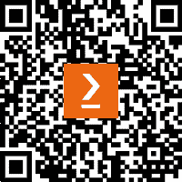

# 前言

在过去的几年里，我一直帮助朋友和同事更多地了解 PHP 和**测试驱动开发**（**TDD**）。我意识到，我发现自己在与不同的人讨论时重复了一些事情。我告诉自己，如果能把我与不同人讨论的内容整理成笔记集，那将非常棒，这样我就可以从项目的开始阶段到部署阶段，帮助他们开发 PHP 应用程序。不幸的是，我的笔记只有我自己能看懂。

2009 年，我是一名 C#开发者，与同样是编程爱好者的同事成为了朋友。不幸的是，我们已经很久没有联系了。11 年后，在 2020 年的 COVID 封锁期间，我与久未联系的朋友取得了联系，并开始讨论编程。他们告诉我，他们非常想学习使用 PHP 进行 TDD。然后我们在周末进行了一次屏幕共享教程会话，我意识到我迫切需要开始编写一些更有组织的材料，以帮助对这一主题感兴趣的其他人。

我大部分时间都在进行自我培训。我购买书籍，阅读它们，并观看关于我想自己学习的主题的教程。然后我决定写一本关于使用 PHP 进行 TDD 的书。由于我从 Packt 出版的书籍中学到了很多，我想我应该联系他们。

阅读这本书将帮助你开始组织你的想法和作为软件开发者需要为项目构建的事物。你将学习如何编写和使用自动化测试来帮助提高你生产的软件质量，你还将学习如何使用工具来自动执行你的测试，以及将你的代码部署到远程服务器上。我的目标是让读者理解 TDD 作为一个过程的价值，而不仅仅是学习编写自动化测试。这就是为什么我涵盖了从开始项目到将其部署到公共服务器上的所有主题。

# 本书面向的对象

如果你是一名对工作在不易测试或维护的应用程序感到厌倦的专业 PHP 开发者，这本书将帮助你成为一名更好的专业 PHP 开发者。你将学习如何利用**测试驱动开发**（**TDD**）和**行为驱动开发**（**BDD**）来帮助你生产出更有结构和可维护的软件。

# 本书涵盖的内容

*第一章**，什么是测试驱动开发以及为什么在 PHP 中使用它？*，介绍了 TDD 的定义，它试图解决的问题，PHP 的优势以及我们开发者从实施中能得到什么。这一章还将让你了解 TDD 在大项目中的价值以及它如何帮助减少回归。

*第二章**，理解和组织我们项目的业务需求*，解释了如何将业务需求解释为一个有组织的列表。该列表可用于帮助开发者确定我们需要构建哪些功能，以及哪些功能需要首先构建。

*第三章**，使用 Docker 容器设置我们的开发环境*，主要介绍了用于开发的 Docker 容器。使用容器可以帮助开发者在不同的服务器环境中获得更一致的应用程序设置。

*第四章**，在 PHP 中使用面向对象编程*，探讨了 PHP 中的**面向对象编程**（**OOP**）概念。理解 PHP 中的 OOP 对于实现 TDD 和 BDD 至关重要。

*第五章**，单元测试*，涵盖了单元测试的基础知识。本章学到的知识将是下一章讨论在应用 TDD 和 BDD 时的概念的基础。

*第六章**，应用行为驱动开发*，介绍了 BDD 的过程。BDD 过程将帮助软件开发者确保软件产品的预期行为得到实现。

*第七章**，使用 BDD 和 TDD 构建解决方案代码*，展示了如何结合使用 BDD 和 TDD。同时实现 BDD 和 TDD 将有助于确保预期的行为得到实现，同时也有助于提高所生产软件的可靠性。

*第八章**，使用 SOLID 原则进行 TDD*，涉及在项目中遵循 SOLID 原则。这将帮助开发者在更现实的使用场景中遵循 TDD 的同时实现 SOLID 原则。

*第九章**，持续集成*，详细介绍了用于测试执行的**持续集成**（**CI**）。CI 用于确保所有自动化测试通过后，将可靠的代码合并到项目的 master 分支。

*第十章**，持续交付*，讨论了使用**持续交付**（**CD**）来自动化发布过程。比 CI 更进一步，我们将自动化产品的部署过程。

*第十一章**，监控*，解释了如何使用监控工具来监控已部署的应用程序。在生产环境中运行的应用程序需要维护，而监控工具可以帮助开发者掌握生产中可能出现的问题。

# 为了充分利用本书

书中的说明基于 Unix。书中用作示例的主机开发机器运行在 MacOS 12.3 上，并且应该适用于后续版本。然而，Docker 容器也应该在 Windows 和 Linux 机器上运行。

| **本书涵盖的软件/硬件** | **操作系统要求** |
| --- | --- |
| Docker | macOS、Linux 或 Windows |
| PHP 8.1 | Linux |
| MySQL 8 | Linux |
| PHPStorm | macOS、Linux 或 Windows |

**如果你使用这本书的数字版，我们建议你亲自输入代码或从书的 GitHub 仓库（下一节中有一个链接）获取代码。这样做将帮助你避免与代码的复制和粘贴相关的任何潜在错误。**

# 下载示例代码文件

你可以从 GitHub 下载这本书的示例代码文件[`github.com/PacktPublishing/Test-Driven-Development-with-PHP-8`](https://github.com/PacktPublishing/Test-Driven-Development-with-PHP-8)。如果代码有更新，它将在 GitHub 仓库中更新。

我们还有其他来自我们丰富图书和视频目录的代码包可供在[`github.com/PacktPublishing/`](https://github.com/PacktPublishing/)获取。查看它们吧！

# 下载彩色图像

我们还提供了一份包含本书中使用的截图和图表的彩色图像的 PDF 文件。你可以从这里下载：[`packt.link/BwjU3`](https://packt.link/BwjU3)。

# 使用的约定

本书中使用了多种文本约定。

`文本中的代码`: 表示文本中的代码单词、数据库表名、文件夹名、文件名、文件扩展名、路径名、虚拟 URL、用户输入和 Twitter 昵称。以下是一个示例：“测试类的名称需要后缀为`Test`，并扩展`PHPUnit\Framework\TestCase`类。”

代码块按照以下方式设置：

```php
<?php
namespace App\Validator;
use App\Model\ToyCar;
use App\Model\ValidationModel;
interface ToyCarValidatorInterface
{
    public function validate(ToyCar $toyCar): ValidationModel;
```

任何命令行输入或输出都按照以下方式编写：

```php
$ cd docker
$ docker-compose build && docker-compose up -d
```

**粗体**: 表示新术语、重要单词或你在屏幕上看到的单词。例如，菜单或对话框中的单词以粗体显示。以下是一个示例：“将脚本粘贴到文本区域，然后单击**提交****文件**按钮。”

小贴士或重要注意事项

看起来像这样。

# 联系我们

我们欢迎读者的反馈。

**一般反馈**: 如果你对这本书的任何方面有疑问，请通过客户关怀@packtpub.com 给我们发邮件，并在邮件的主题中提及书名。

**勘误**: 尽管我们已经尽一切努力确保内容的准确性，但错误仍然可能发生。如果你在这本书中发现了错误，我们非常感谢你能向我们报告。请访问[www.packtpub.com/support/errata](http://www.packtpub.com/support/errata)并填写表格。

**盗版**: 如果你在互联网上以任何形式遇到我们作品的非法副本，如果你能提供给我们地址或网站名称，我们将不胜感激。请通过版权@packt.com 与我们联系，并提供材料的链接。

**如果您有兴趣成为作者**：如果您在某个领域有专业知识，并且您有兴趣撰写或为书籍做出贡献，请访问[authors.packtpub.com](http://authors.packtpub.com)。

# 分享您的想法

一旦您阅读了《PHP 8 测试驱动开发》，我们很乐意听听您的想法！请[点击此处直接进入此书的 Amazon 评论页面](https://packt.link/r/1803230754)并分享您的反馈。

您的评论对我们和科技社区非常重要，并将帮助我们确保我们提供高质量的内容。

# 下载本书的免费 PDF 副本

感谢您购买本书！

您喜欢在路上阅读，但无法携带您的印刷书籍到处走？

您的电子书购买是否与您选择的设备不兼容？

别担心，现在每购买一本 Packt 书籍，您都可以免费获得该书的 DRM 免费 PDF 版本。

在任何地方、任何设备上阅读。直接从您最喜欢的技术书籍中搜索、复制和粘贴代码到您的应用程序中。

优惠不会就此停止，您还可以获得独家折扣、时事通讯和每日免费内容的访问权限

按照以下简单步骤获取福利：

1.  扫描二维码或访问以下链接



[`packt.link/free-ebook/978-1-80323-075-7`](https://packt.link/free-ebook/978-1-80323-075-7)

1.  提交您的购买证明

1.  就这些！我们将直接将免费 PDF 和其他福利发送到您的邮箱

# 第一部分 – 技术背景和设置

在本书的这一部分，您将学习 PHP 中的测试驱动开发和面向对象编程的概念，将业务需求解释为可执行列表，并使用 Docker 容器设置开发环境。

本节包括以下章节：

+   *第一章*，*什么是测试驱动开发，为什么在 PHP 中使用它？*

+   *第二章*，*理解和组织我们项目的业务需求*

+   *第三章*，*使用 Docker 容器设置我们的开发环境*

+   *第四章*，*在 PHP 中使用面向对象编程*
