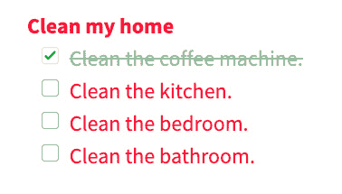
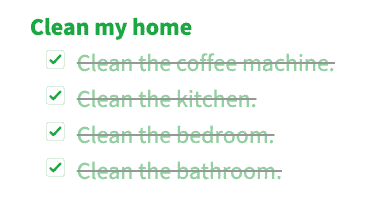

# 1

# 什么是测试驱动开发以及为什么在 PHP 中使用它？

使用 PHP 编程语言开发 Web 应用程序既有趣又高效。开始学习 PHP 的曲线相对较浅，这是编程语言的一个重要特性。对于 PHP 开发者来说，有许多开源的学习材料、框架、包和完整的可扩展产品，这些都得到了一个非常庞大的开源社区的支撑。PHP 是一种企业级编程语言，被广泛用作基于 Web 的解决方案来解决不同的商业问题。企业和开发者可以快速使用 PHP 开发和部署 Web 应用程序。一旦这些企业开始成功并增长，他们就需要更多的功能、错误修复和改进来发布在原始解决方案之上。这正是事情变得有趣的地方。维护商业成功的软件可能是软件成本的最大贡献因素之一，尤其是当它不是从开始就易于维护或测试的时候。实施**测试驱动开发**（**TDD**）将提高软件的可维护性，并有助于减少功能上市的成本和时间。

我们中的大多数开发者可能已经经历过或观察到一个问题：一个功能或错误修复已经发布，但它导致了更多的问题、回归或意外的软件行为。如果你来自一个大多数或所有**质量保证**（**QA**）测试都是在开发后、前或甚至在开发过程中手动完成的开发环境，那么你可能已经体验到了我提到的问题。这就是实施 TDD 真正能帮助的地方。TDD 不仅有助于实施自动化测试，而且以某种方式引导或甚至强迫我们开发更干净、更松散耦合的代码。TDD 帮助开发者甚至在编写单个功能代码之前就编写和构建测试——这有助于确保每当编写功能或解决方案代码时，已经为其编写了相应的测试。它还帮助我们开发者停止说“*我稍后会添加我的单元* *测试*。”

在编写任何代码之前，理解 TDD 是什么以及它不是什么非常重要。关于 TDD 存在一些常见的误解，我们需要澄清这些误解，以便我们能够专注于 TDD 的真正含义。在本章中，我们还将尝试使用一个非常简单的类比，并强调为什么我们想要将 TDD 作为软件开发项目的一部分来实施。

在本章中，我们将涵盖以下内容：

+   什么是 TDD？

+   关于 TDD 的常见误解

+   我们为什么要考虑 TDD？

+   我们在这本书中计划实现什么？

# 什么是 TDD？

TDD 是一种简单的软件开发方式，我们在开始编写解决问题的实际代码之前，先思考并定义程序需要达到的**结果**。

TDD 是一种软件开发过程，其中在编写解决实际问题的实际代码之前，先开发测试用例。这些测试用例将以 PHP 代码的形式编写，将使用或调用开发者将要构建的解决方案代码。你构建的测试用例代码将触发你将要编写的解决实际问题的解决方案代码的开发。

从我所见到的来看，这种字面上的描述让很多开发者失去了应用这一过程的动力。TDD 是一个过程，它是一种思维方式。它不仅仅是关于编写单元测试。

你编写的测试程序在第一次运行时应该总是失败，因为你还没有构建测试需要通过的程序。然后，你基本上必须构建测试程序将使用的解决方案代码，直到测试程序本身从你的解决方案代码中获得预期的结果。实际上，失败的测试将驱使你编写通过测试的代码——这就是 TDD（测试驱动开发）这个术语的由来。甚至你可以称之为“失败的 TDD”。这就像说“我编写了一个测试来让我的代码失败，现在我需要*修复它*。”

在 TDD 中，我可以看到四个主要的原因说明为什么先编写一个失败的测试很重要。首先，你会编写一个失败的测试并确保你的测试框架应用能够识别它。这确保了你的开发环境配置得当，你可以运行你的测试程序。其次，你的失败的测试将帮助你定义你想要编写的解决方案或功能代码，以及该测试通过时预期的内容。这将帮助你作为开发者，在设置或集中你的思维在你要编写的功能代码的目的上。第三，你编写的失败的测试将作为提醒，让你知道还需要完成哪些其他程序。第四，先编写测试将有助于确保你的解决方案代码被自动化测试覆盖。

通过尝试使你的解决方案代码可单元测试，你有时无意中使你的代码耦合度降低——就像一个循环。随着你继续编写松散耦合的代码，你会发现你的代码开始看起来更有组织，不那么混乱。随着你继续按照 TDD 过程编写解决方案代码，它将不断地帮助你发现产品中紧密耦合的地方，有时甚至鼓励你重构和解除耦合代码，以便使其可单元测试。有一些软件开发原则可以帮助你进一步提高你的代码，例如单一职责原则，这将在*第八章*“使用 TDD 与 SOLID 原则”中进一步讨论。

现在我们已经定义了 TDD，并对它有一个简要的了解，让我们来看看与 TDD 相关的常见误解。

# 关于 TDD 的常见误解

在本节中，我们将探讨一些我亲自观察到的开发者对 TDD 的误解。一次又一次，我遇到了对 TDD 理解很差的人。当我与他们谈论为什么不喜欢 TDD 时，他们有时会告诉我一些甚至与 TDD 无关的原因。

## 测试软件不是我的工作，因此我不需要 TDD

我自己也曾说过这句话。我曾经认为，我只需要尽可能快地生成解决方案代码，手动测试一点，然后让测试部门确保一切构建正确。这可能是我对 TDD 最大的误解。作为软件开发者，我们开发软件是为了解决问题。如果我们开发者是造成更多问题的原因，那么我们就没有做好我们的工作。

## 使用 TDD 进行开发是不必要的缓慢

如果这是你第一次听到这个观点，我会感到惊讶。我第一次是从一个有技术背景的客户那里听到的，而不是从开发者那里。我自己也不是 TDD 的粉丝，当时很乐意同意客户的观点。当然，编写测试代码和解决方案代码确实会更慢；毕竟，我需要在键盘上多打一些字符！

在处理企业项目时，根据我的经验，TDD 是我们避免了几个月的时间来修复错误和回归问题的关键。编写测试并拥有良好的测试覆盖率，如第 *第五章* 中讨论的 *单元测试*，将有助于确保下次有人触摸代码或添加新功能时，不会引入回归。TDD 将帮助你构建大量的自动化测试，运行这些测试比将未经测试的解决方案代码交给测试团队或测试公司进行手动测试更便宜、更快。

## 编写自动化或单元测试是 TDD

TDD 并非关于为现有功能编写自动化测试或单元测试。TDD 也不是指让 QA 部门或第三方公司为现有软件编写自动化测试。这与 TDD 完全相反。

我观察到的最常见的误解是，一些开发者和测试人员认为 TDD 与测试人员为开发者构建的代码编写自动化测试有关。我认为这是一个非常错误的误解。这和开发一个程序然后将其发送到 QA 部门进行手动测试没有区别。

让测试人员编写自动化功能测试是非常好的事情，特别是对于没有自动化测试的现有功能来说，但这应该只被视为软件的补充测试覆盖率，不应与 TDD 混淆。

## TDD 是一个银弹

我遇到的最后一个误解是，如果我们开发者通过遵循 TDD 构建了优秀的测试覆盖率，我们就不再需要来自软件开发部门和 QA 部门或团队的输入。一次又一次，我证明了自己是错的，认为通过 TDD 方法编写的代码是坚不可摧的。我很幸运能与知识渊博和技能娴熟的软件工程师和测试工程师一起工作。代码审查是至关重要的；始终让你的代码和测试场景得到同行评审。开发者可能忽略的边缘情况测试和功能场景会导致问题——在我的经验中，它们已经导致了大问题。

对于开发和测试团队来说，正确理解功能测试和验收测试用例非常重要，以便涵盖所有可想象的情况：不同类型的测试将在*第五章*，*单元测试*中涵盖。这就是行为驱动开发（BDD）开始变得有意义的地方；BDD 将在*第六章*，*应用行为驱动开发*中更详细地讨论。我和能够想出我无法想象的边缘情况的测试工程师和 QA 人员一起工作过。

我们已经讨论了一些关于 TDD 的常见误解。现在让我们尝试说明为什么我们想要考虑在我们的开发过程中使用 TDD。

# 我们为什么要考虑 TDD 呢？

我为什么要让我的代码由测试驱动呢？我希望我的代码是由需求和满意的客户驱动的！你可能听说过 TDD 这个术语，并且对此感到不舒服。当我第一次听到 TDD 这个术语时，我也有些不舒服。为什么要浪费时间编写测试代码来测试尚未存在的解决方案代码呢？说真的，我需要编写解决业务问题的实际代码，而你却想让我先写测试代码？实际上，我培训过的一些开发人员和我一起工作时也有过同样的疑问——这正是阻止他们对 TDD 产生兴趣的问题！

当我开始我的软件开发生涯时，我在一家小公司工作，我们被要求尽快交付结果，在非常少的迭代中完成。仅仅想到为我的快速编写的代码编写自动化测试就是一大浪费！因此，当我第一次读到 TDD 时，我没有兴趣。我忽视了那些肉丸意大利面式的代码；我所关心的是确保客户在最短的时间内得到预期的业务结果。将由糟糕的代码引起的回归问题留到以后解决。我需要尽快让客户满意——那就是，现在。这可能是我在职业生涯中犯过的最短视的错误之一。大多数时候，我和我的同事不得不添加功能并维护我们自己的意大利面式混乱。一次又一次，当我们看到我们造成的混乱时，我们都会讨厌过去的自己。作为软件开发者，我们职业生涯的早期有很多错误、低效和短视。幸运的是，我们不是第一个遇到这些问题的。有一些流程我们可以遵循，以帮助我们提高我们生产的软件质量，其中之一就是 TDD。

现在，经过这么多错误、这么多失败，以及参与数百个业务关键软件项目后，我甚至无法想象没有遵循 TDD（测试驱动开发）来编写测试就能过一天。当我在一个项目上工作时，我不知道我的自动化测试是否通过或失败，我就无法好好睡觉；至少我有测试！

想象一下在你的手机上创建一个“清洁我的家”待办事项清单：上面只有一个项目，那就是“清洁咖啡机”。你写下这个项目，然后分心忘记了，继续你的一天。当你再次查看你的清单时，你会意识到你还没有清洁咖啡机！然后你继续清洁机器，并将该项目标记为已完成。

好吧，这有点像 TDD 的工作方式。你先写一个失败的测试，然后编写代码来通过这个测试——然后，在你的待办事项清单上，你写下“清洁咖啡机”；然后在你实际清洁咖啡机后，你从清单上划掉它。

重要提示

在所有其他事情之前，我现在要告诉你，测试一开始就失败是很正常的，你需要非常舒适地接受它。这就像在你的手机上写下咖啡机清单项一样。一旦你把它添加到待办事项清单中，待办事项清单就会失败，直到你通过标记待办事项为完成来通过它。在编写任何通过测试的程序之前，你需要先编写失败的测试。这是**红、绿、重构**（**RGR**）概念的一部分，这将在*第七章*“使用 BDD 和 TDD 构建解决方案代码”中进一步讨论。

回到你的手机上，你向那个清单上添加更多项目：*清洁厨房*，*清洁卧室*，*清洁浴室*…然后你去了健身房，分心了。你记得你的清单，想知道在你出去之前你是否真的清洁了你的家，所以你查看你的待办事项清单。你意识到你只完成了清单上的一个项目；你必须回去完成其他任务，以完全满足“清洁我的家”待办事项清单。当你回家后，你可以继续清洁你的家，勾选你的待办事项清单：



图 1.1 – 未完成的待办事项清单

你可以将你待办事项清单上的未完成项目视为失败的测试。清洁某物的行为是编写代码以满足失败的待办事项清单项目。你完成清洁卧室或浴室的任务，就像通过了一个测试。现在想象你已经完成了所有的清洁工作，等等，你在手机上的“清洁我的家”清单上勾选了所有项目：你完成了！



图 1.2 – 完成的待办事项清单

现在，你可以想象你的“清洁我的家”清单也是一个测试。你的测试通过构建满足你的较小单元和集成测试（测试类型将在*第七章*“使用 BDD 和 TDD 构建解决方案代码”）的代码的整体完整性来满足。

我们可以将“清洁我的家”清单视为一个测试。这个测试涵盖了清洁一个家的所有过程。清单中的一些项目涉及清洁浴室，一些涉及厨房，等等。就像我们编写待办事项清单时做的那样，你首先编写代表更大图景的失败测试，而不是更小、更详细的测试：

```php
// Test Method
public function testCanCleanMyHome()
{
     $isMyHomeClean = $this->getCleaner()->clean();
     $this->assertTrue($isMyHomeClean);
}
```

在编写了只能通过构建清洁房屋每个部分的程序来满足的失败的“清洁我的家”测试之后，我们可以开始编写针对解决方案较小部分的失败测试：

```php
// Test Method
public function testCanCleanCoffeeMachine()
{
     $isMyCoffeeMachineClean = $this->getCleaner()->
         clean();
     $this->assertTrue($isMyCoffeeMachineClean);
}
```

现在想象一下，在你清洁完你的家之后，你最终把卧室搞得一团糟，你清单上的“清洁我的卧室”项目没有勾选。从技术上来说，你的“清洁我的家”待办事项清单现在又是不完整的了。当你通过了所有的测试，而你的团队中的某个人或者你自己修改了代码并改变了预期行为时，也会发生同样的事情。如果你然后运行你的`testCanCleanMyHome()`测试，它将会失败。如果我们然后在将代码部署到生产之前运行这些自动化测试，我们就能及早捕捉到回归问题！这将更容易捕捉到破坏预期行为的代码更改！

这是一个过于简化的说法，但当你继续阅读时，你会发现这就是 TDD（测试驱动开发）的样子。这并不是一个糟糕的、浪费时间的行为！

我们是人类，我们倾向于犯错误——至少我认为是这样。尽管如果你认为你没有犯错误，你不妨把键盘上的*删除*键撬下来，因为你不需要它。我犯过很多错误，为了增强我对代码的信心，我确保通过所有测试并获得代码同行评审。

通过为软件实现 TDD 和拥有大量的测试覆盖率，是帮助你和你的团队在它们在生产中造成损害之前发现错误的好方法。在部署前运行所有这些不同类型的测试，有助于我晚上睡得更香。

# 我们在这本书中计划实现什么？

好吧，显然，我们想要更好地理解 TDD——不仅仅是理论上的，而是实际可用和可应用的理解。我们想要帮助自己编写更好的代码，这将使其他开发者在编写你的代码时也能受益。我们想要能够为编写健壮、坚固、自我诊断和更具可扩展性的软件打下基础。

我们之前使用了一个非常简单的类比，即使用“清洁我的家”待办事项列表来尝试解释 TDD 是什么以及它是如何进行的——但如果只是理论的话，这不会很有趣。在这本书中，我们将尝试使用一个示例项目来真正实现 TDD！

我们将构建一个示例项目，这将帮助我们做到以下几件事：

+   确定客户或企业想要实现的目标

+   将那些需求翻译成实际的工单

+   学习如何实现 TDD 和 BDD（行为驱动开发）

+   按照设计模式和最佳实践编写干净的代码

+   使用持续集成自动运行所有测试

+   使用持续部署自动部署我们的代码

# 摘要

在本章中，我们定义了 TDD 是什么以及它不是什么。我们试图将 TDD 与简单的日常任务，如清洁你家的某些部分联系起来。通过尝试澄清关于 TDD 的常见误解，我们希望对 TDD 有一个更清晰的理解。TDD 是一个过程；它不仅仅是编写单元测试和自动化测试。

我们还讨论了为什么在开发 PHP 应用程序时我们会想要使用 TDD（测试驱动开发）。TDD 帮助我们开发更干净、解耦、可维护的代码，并且它使我们更有信心，在发布代码时不会引入回归，这要归功于遵循 TDD 时固有的自动化测试覆盖率。

在下一章中，我们将通过提出一个简单的假设商业挑战来开始构建示例项目，并弄清楚需要构建什么来解决该问题。
