# 第二章：理解和组织我们项目的业务需求

在编写任何代码之前，我们首先需要了解项目的目标和我们要解决的问题。我们构建软件是为了解决问题，如果我们没有充分理解客户或商业试图实现的目标，我们将难以提出理想的解决方案——或者更糟糕的是，我们可能会花费数月时间构建根本不满足业务需求的软件。

作为软件开发者，有一个清晰的待建列表是非常好的。这就像有一个简单的购物清单。这个列表将帮助我们确定哪些功能需要首先开发或发布。因此，在我们通过编写软件来构建解决问题的解决方案之前，我们将尝试提出一个简单的例子，在这个例子中，我们将尝试将商业问题和目标解释为需要编写代码的软件功能列表。

在本章中，我们将提出一个示例商业问题。我们将尝试分析这个示例商业试图实现的目标，以及阻止它实现这一目标的原因。我们将提出一个解决方案，帮助我们定义和组织业务需求，形成一个可操作的*用户故事*列表。这些用户故事反过来将被用来表示我们的行为驱动测试。这些行为驱动测试将帮助我们构建我们的测试驱动代码。**行为驱动开发**（**BDD**）将在*第六章* *应用行为驱动开发*中更详细地讨论。

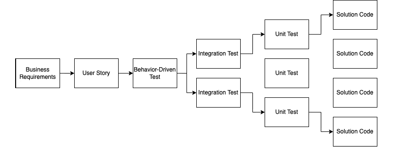

图 2.1 – 使用 TDD 和 BDD 进行构建

与**测试驱动开发**（**TDD**）和 BDD 相比，开发者也可以直接为用户故事或需求编写解决方案代码。这是一个未来灾难的配方。事实上，这就是我过去开发软件的方式：

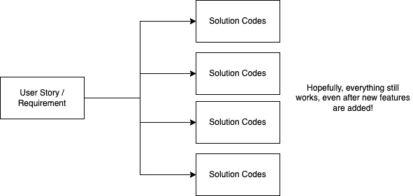

图 2.2 – 不进行测试的开发解决方案

在这本书中，我们将专注于基于业务需求构建解决方案代码，这些需求由测试程序表示。那么，让我们开始了解示例商业问题和需求。

在本章中，我们将涵盖以下内容：

+   示例商业项目

+   将业务需求分解为软件功能

+   将 Jira 与 Bitbucket 集成

# 技术需求

本章要求读者具备 Git 版本控制的基本知识。

# 示例商业项目

我们将使用一个简单的例子——*汽车博物馆*——来帮助我们通过定义目标和问题，并将它们组织成可操作的单元。

## 业务场景

几个月前，我和我在珀斯的几个朋友一起喝啤酒，他们告诉我，他们为了乐趣在周末志愿帮助一个汽车博物馆整理收到的玩具汽车模型的库存。博物馆收到了装满玩具汽车的巨大箱子。

在喝酒的时候，他们告诉我，这既有趣又有时具有挑战性，因为没有特定的工具或流程来列出博物馆收到的玩具汽车。有时，他们打开一个装满玩具汽车的整个箱子，没有任何关于玩具的信息，有时整个箱子都装着包装好的玩具汽车，每个玩具汽车的箱子里都有所有信息，比如制造年份、驾驶它的赛车手、颜色等等。他们必须列出这些玩具并将它们放入电子表格中，这就是事情变得有趣的地方。

他们说他们使用了一个电子表格文件，他们会将其共享并转交给下一个志愿者。记录玩具汽车的信息是一项任务——例如，有人将玩具汽车的颜色记录为蓝色，但另一个人可能只是写下“火焰”，这显然不是一种颜色。有时颜色会被拼写错误。所以，现在，如果他们想要搜索所有蓝色汽车，可能会变得复杂，因为有时人们在保存信息时可能会将“blue”拼写错误。他们还希望能够搜索特定赛车手驾驶的模型汽车，并希望发现玩具汽车模型在博物馆的哪个部分。

在聊天过程中，我不禁开始想象数据被输入、提交、验证、处理，然后持久化。我暂时忘记了饮料，我的思绪开始飘忽不定，开始想象代码。如果你是软件开发者，你大概知道我的意思！

我想：我可以利用这个现实生活中的挑战，并将其作为一个业务项目的例子。这很简单，听起来很有趣，但也将作为一个很好的例子来展示如何实现 TDD 和 BDD。

我问我的朋友们是否可以让我使用他们的例子来完成这个项目，他们对此表示很高兴。所以，从现在开始，我们将把他们称为我们的客户或商家。

## 理解场景和问题

通过与商家或客户交谈，我们可以获取一些关于他们所遇到问题的非常重要的信息。我们可以尝试列出一个非常粗略和简单的关于问题、约束和可能解决方案的清单。

**商家试图** **实现的目标**：

+   库存管理员或志愿者能够列出并记录玩具汽车模型信息

+   用户能够搜索记录，并找到博物馆中可以查看汽车模型的哪个部分。

**问题/挑战**：

+   没有系统允许不同用户同时记录汽车模型数据

+   没有系统验证存储的数据——例如，对于颜色拼写

+   没有简单的方法让游客找到或搜索博物馆中特定车型展示的位置

**约束**：

+   该项目仅关注玩具车模型的库存

+   只有注册的博物馆工作人员才能将数据输入到库存中

**解决方案**：

+   为玩具车模型构建一个简单的库存系统

+   为访客构建一个带有表格的简单页面以查看库存

我们能够列出关于业务场景的非常重要的几点。最终，我们所列出的所有项目都将满足一件事，那就是解决业务试图实现的目标。这是最重要的理解。我们通过首先正确理解问题来构建解决方案。在解决问题之后，我们必须确保我们已经解决了业务试图实现的目标。

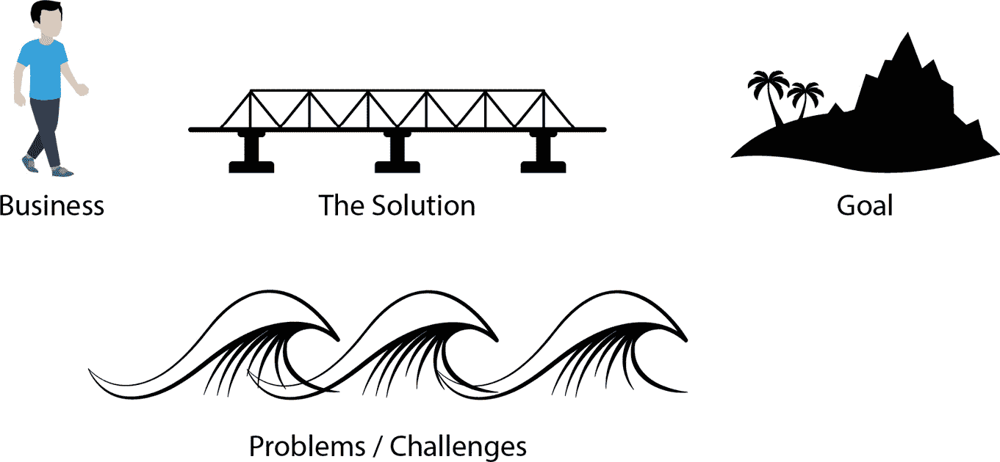

图 2.3 – 解决方案

我有过一次经历，我看到开发者花费大量时间构建软件，当项目交给我时，我意识到他们所走的方向是完全错误的。所以，不管软件有多好——如果它不能解决实际问题，如果它不能帮助实现业务目标，那么它就没有价值。

现在我们已经定义了业务试图实现的目标，并确定了业务面临的问题和挑战，我们现在可以开始组织一个我们需要做的事情的列表来解决这些问题。

# 将业务需求分解为软件功能

我们需要一种解决方案来组织我们所有需要工作的任务。我们可以通过使用笔记本、便签纸、便利贴，甚至一个简单的看板来实现这一点。但鉴于我们计划开发可维护的软件，并且我们希望对开发过程的进度有可见性，拥有比笔记本更强大的解决方案会更好。

在这个项目中，我们将使用**Atlassian Jira**。Jira 是我们可以用来自组织所有我们需要构建和工作的项目的软件。我们将将其用作一个增强型笔记本，以包含我们的软件功能待办事项列表。

我们不会深入关注方法论；相反，我们将使用 Jira 来帮助我们组织项目，以便我们可以有组织地开始编写软件。

我们希望有能力将我们的 Git 分支、拉取请求和提交链接到我们正在工作的一个问题。我们希望有能力将我们的**持续集成**（**CI**）(*第九章**,* *持续集成*）解决方案集成到我们的问题中。你可以将*Jira 问题*视为代表业务问题或软件功能的列表项。

我们将开始将业务需求分解为软件功能列表，这些功能由用户故事表示，这是 Jira 中的一个问题类型。但为此，我们首先需要创建一个 Jira 账户并初始化我们的项目。

## 创建 Jira Cloud 账户并初始化 Jira Cloud 项目

要创建 Jira Cloud 账户并初始化 Jira Cloud 项目，请按照以下步骤操作：

1.  要开始，我们首先需要创建一个免费的 Jira 账户。你可以通过访问以下网址来完成：[`www.atlassian.com/try/cloud/signup?bundle=jira-software&edition=free`](https://www.atlassian.com/try/cloud/signup?bundle=jira-software&edition=free)。然后，注册一个账户：

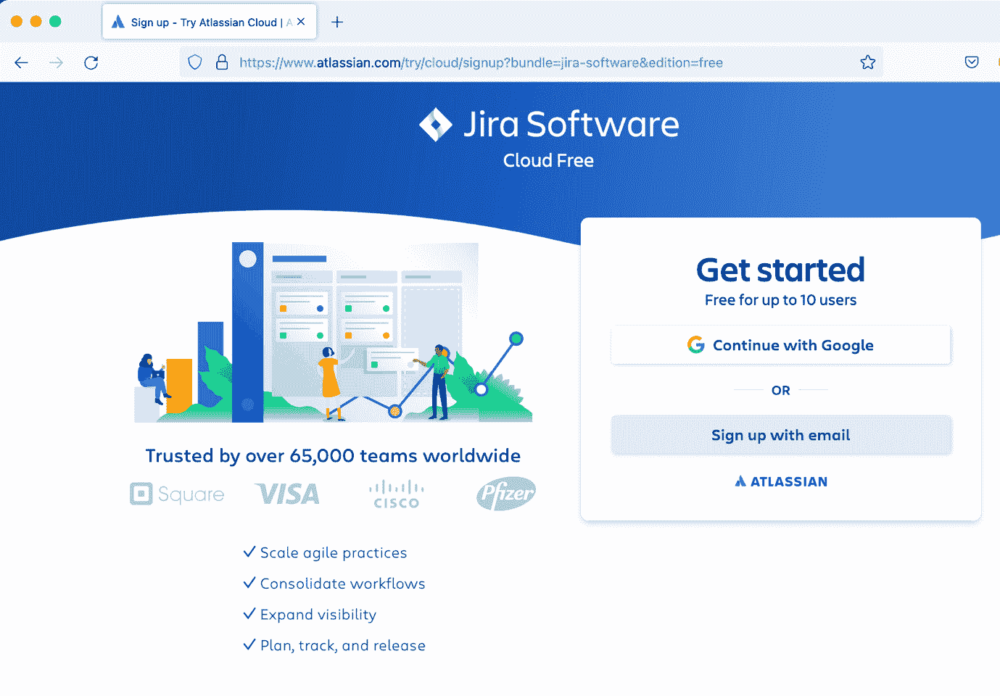

图 2.4 – Jira 注册

1.  注册账户后，你将被提示在**您的站点**字段中输入一个子域名名称。使用你想要的任何子域名。完成此步骤后，你可以跳过所有其他弹出窗口，直到你到达**项目** **模板**页面：

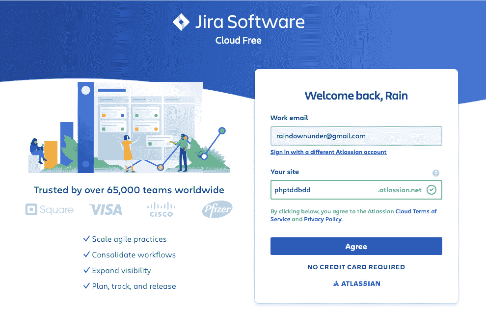

图 2.5 – 输入子域名名称

1.  在**项目模板**页面，选择**Scrum**：

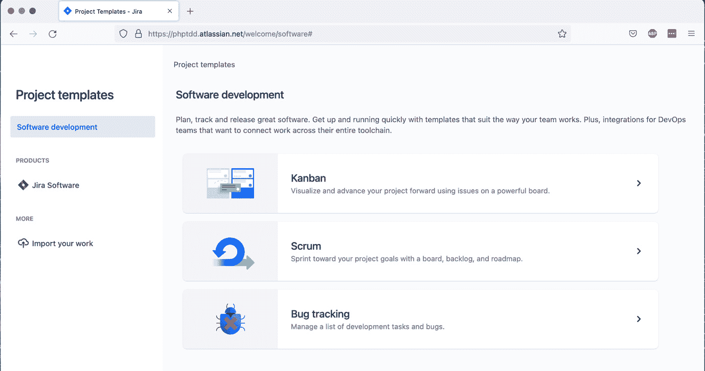

图 2.6 – 选择 Scrum

1.  在**Scrum**页面，点击屏幕右上角的**使用模板**按钮：

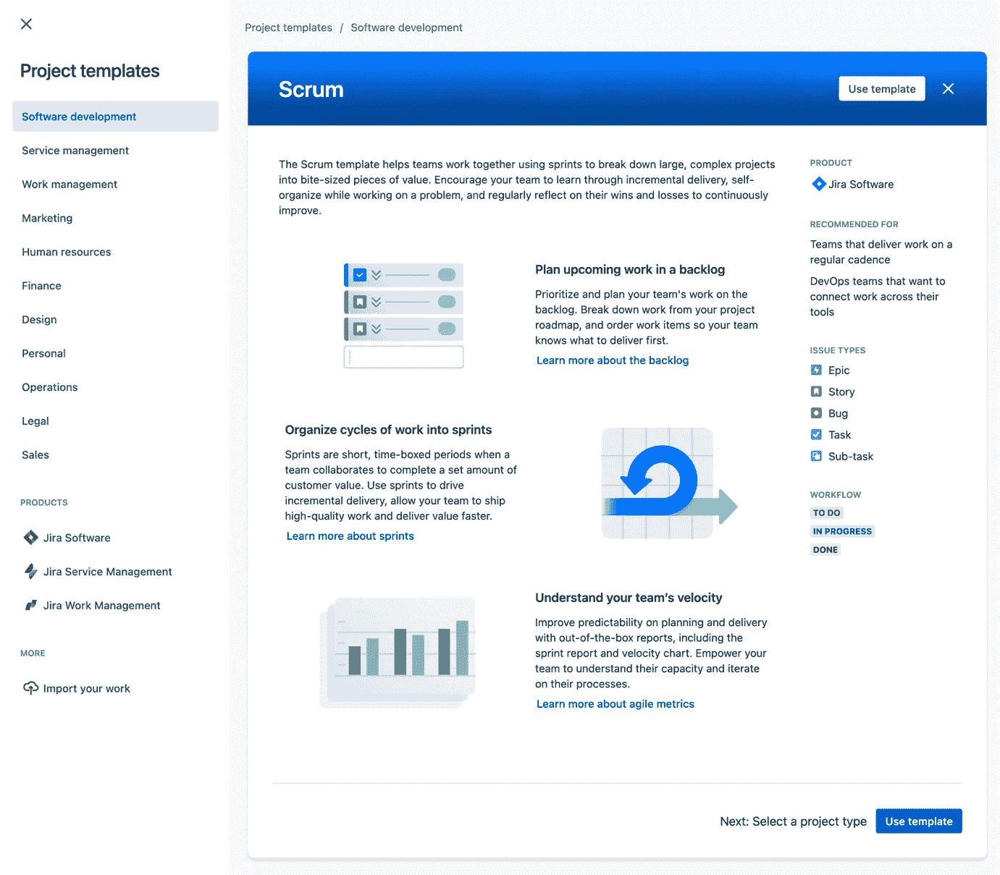

图 2.7 – 使用模板按钮

1.  在**选择项目类型**页面，点击**选择一个** **团队管理项目**：

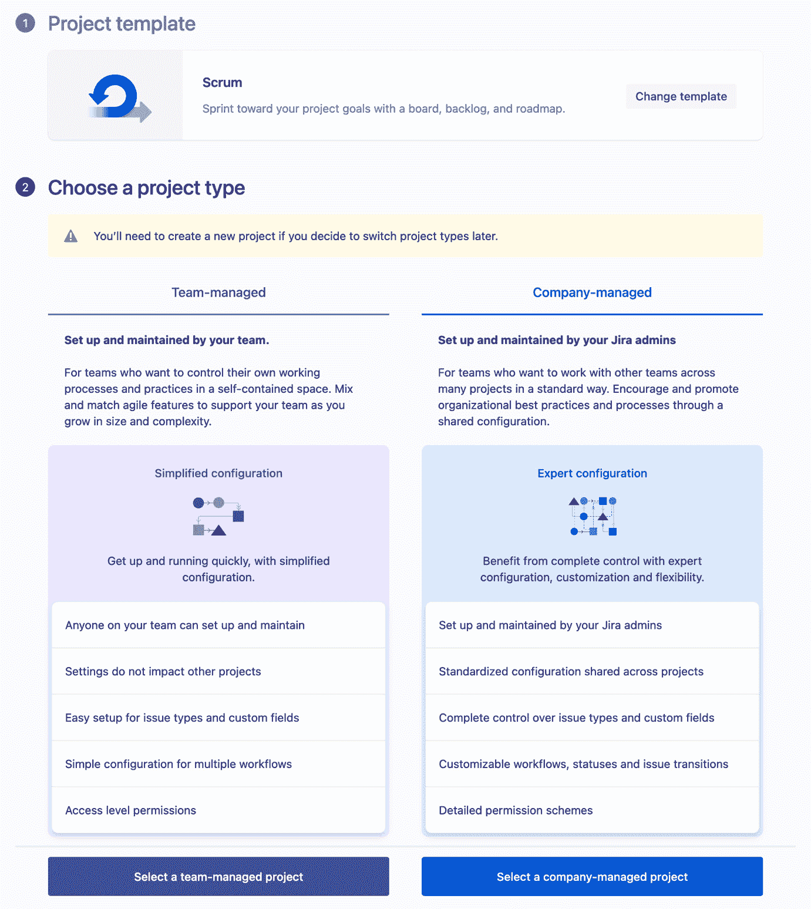

图 2.8 – 选择团队管理项目

1.  将项目名称设为`toycarmodels`，并在**键**字段中输入`TOYC`：

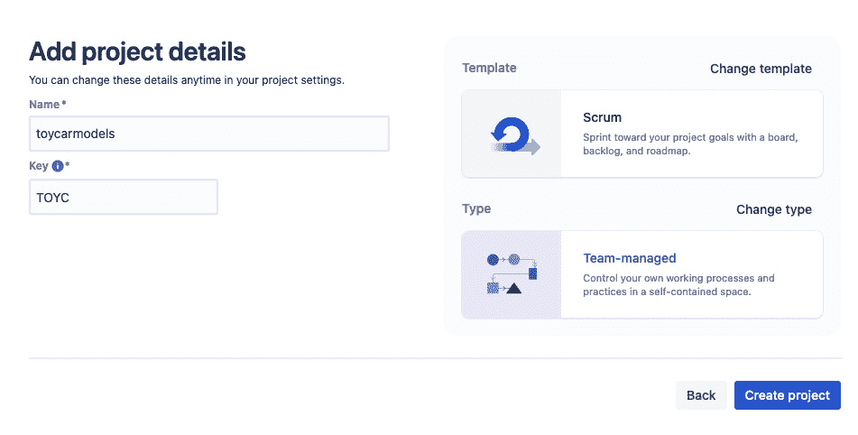

图 2.9 – 添加项目详情

1.  经过这些步骤后，你应该会看到一个空的**TOYC** **看板**页面：

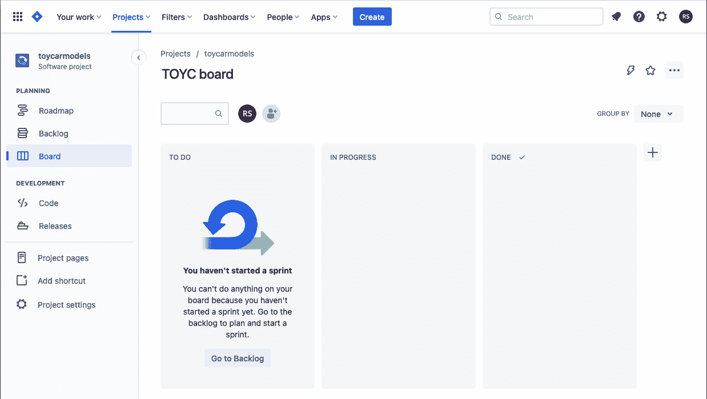

图 2.10 – 空的 TOYC 看板

现在我们有一个可以操作的 Jira 项目，我们可以开始创建代表我们需要完成的任务以帮助餐厅业务进行在线预订系统项目的票据。我们将使用*Jira 史诗*来分组相关的 Jira 问题，这些问题代表我们想要构建的软件功能。

## 创建 Jira 史诗

如果我们回顾一下之前定义的问题和解决方案，我们可以列出一些简单的事项，我们可以将其作为功能来构建。

我们已经确定，我们想要为库存管理员志愿者提供一个记录捐赠玩具车模型到库存的方法，我们也确定了博物馆参观者需要通过库存搜索并定位玩具车模型在博物馆的展示位置的需求。现在，我们已经确定我们将有两种类型的用户：

+   需要输入和存储数据（库存管理员）

+   想要查看数据（博物馆参观者）

这意味着我们可以将我们需要构建的程序分成两个独立的小项目：一个是为存货管理员的小项目，另一个是为访客的小项目。有时，将一个大项目的不同部分分割成各自的小项目是有帮助的；这可以帮助为项目的不同区域分配不同的开发者，也可以帮助开发者集中精力。

面向存货管理员的解决方案可能包含许多小任务。我们可以开始将这些任务定义为实际的 Jira 票据，但在考虑更小的票据之前，让我们先创建一个史诗。

让我们回到上一组指令中的 Jira **TOYC 板**页面，并开始创建票据：

1.  在左侧菜单中，点击**路线图**菜单项：

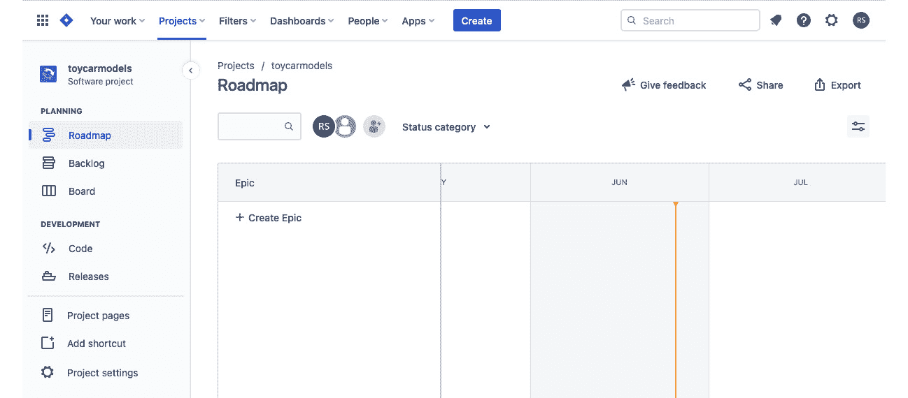

图 2.11 – Jira 路线图

1.  在表格中，点击 `需要做什么？`：

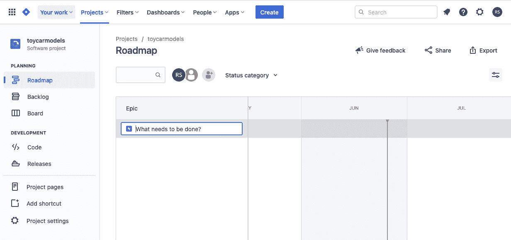

图 2.12 – 史诗标题

1.  在文本框中输入 `Inventory Clerk Solution`，然后按 *Enter*：

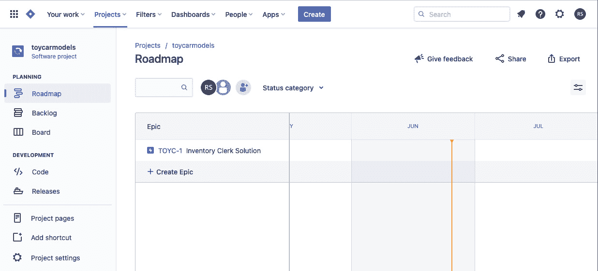

图 2.13 – 第一个史诗

1.  点击您刚刚创建的史诗，将弹出一个窗口。在描述文本区域，您可以输入任何描述，详细说明我们需要做的事情。在这个例子中，我将只使用以下文本：`使存货管理员能够输入和存储玩具车模型数据`，然后在**分配给**字段下，点击**分配给我**链接：

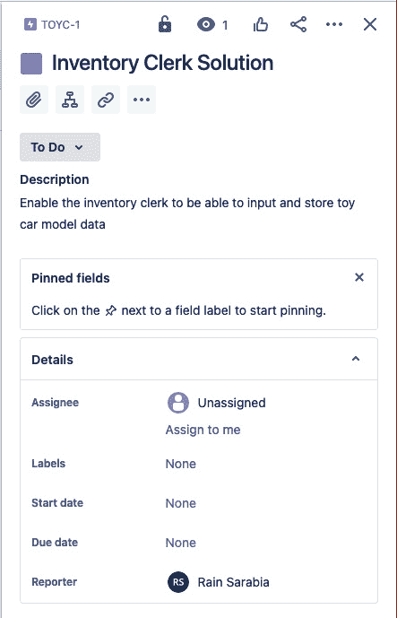

图 2.14 – 史诗描述

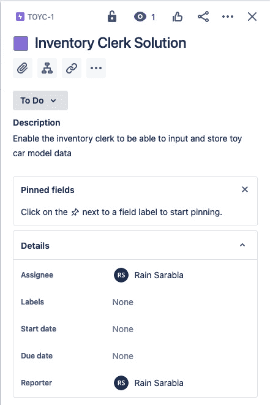

图 2.15 – 分配者

1.  关闭弹出窗口。

现在我们已经创建了一个 Jira 史诗，我们可以向这个史诗添加 *项目*。我们将添加到史诗中的项目将是用户故事。

## 编写用户故事

一个 *Jira 用户故事* 是从最终用户的角度以非正式的、描述性和表达性的方式编写的软件功能。最终用户可以是非技术客户或将成为即将生产的软件消费者的软件开发者。

在上一节中，我们创建了一个名为**存货管理员解决方案**的史诗，它将包含存货管理员记录所有捐赠玩具车型号信息的所有所需内容。

但存货管理员需要什么才能实现这个目标呢？首先，他们需要一个包含表单的窗口或网页。然后，这个表单将被用来记录特定玩具车型号的数据。

但存货管理员如何向系统标识自己呢？看起来我们需要身份验证和授权功能，有了这些功能，我们就能将系统数据输入部分仅限于授权用户。

在存货管理员完成身份验证后，他们应该能够开始将玩具车型号数据输入和记录到系统中。

现在，让我们坚持这些简单的功能并开始编写故事。

仅通过思考库存管理员需要能够做什么来输入和记录玩具车模型到系统中，我们就已经确定了至少三个用户故事。

我们可以使用以下模板来编写我们自己的用户故事：

*作为[参与者]，[我想要]，[**以便**]*

+   作为库存管理员，我希望能够登录到系统，以便我可以访问库存系统

+   作为库存管理员，我希望能够输入玩具车模型数据，以便我可以保存数据

+   作为库存管理员，我希望能够看到包含记录的表格，以便我可以审查所有存储的玩具车型号数据

现在我们已经列出了所需的客户用户故事，让我们为他们创建工单。

### 创建 Jira 用户故事

按照以下步骤创建 Jira 用户故事：

1.  鼠标悬停在`需要做什么？`上：

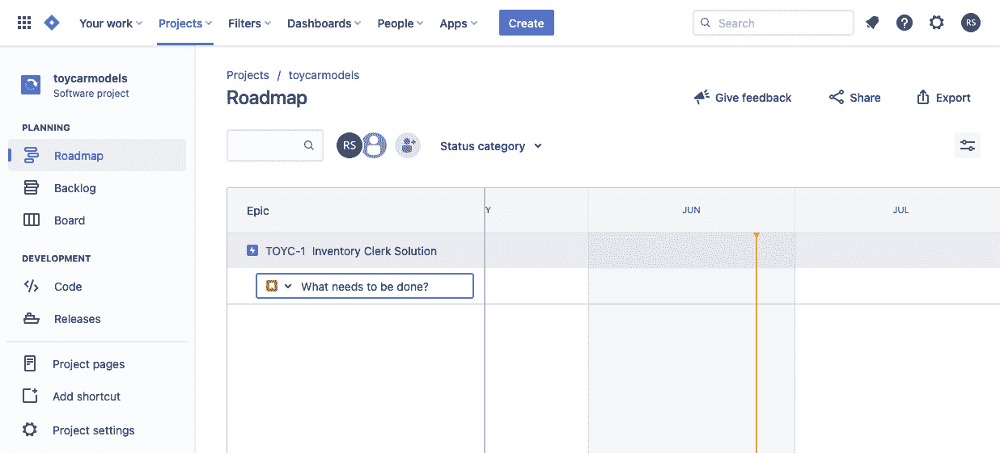

图 2.16 – 需要做什么？文本：用户故事标题

1.  在文本字段左侧的下拉菜单中，确保**故事**被选中：

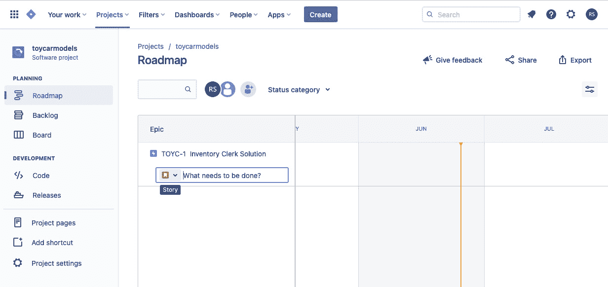

图 2.17 – 从下拉菜单中选择故事

1.  在文本字段中，为我们的第一个用户故事输入标题，`作为库存管理员，我希望能够登录到系统，以便我可以访问库存系统`，然后按*Enter*键：

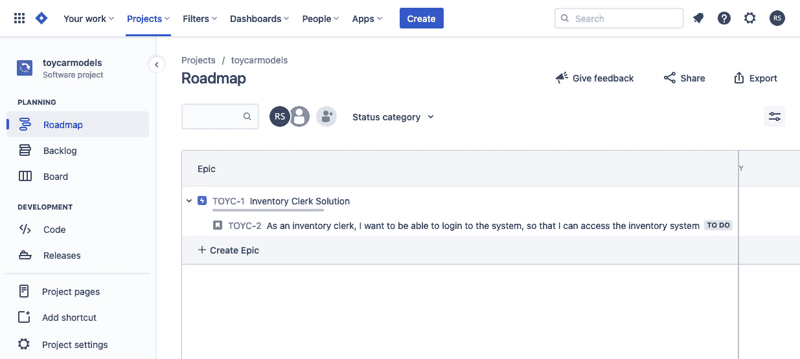

图 2.18 – 第一个用户故事

1.  重复步骤以创建我们列出的三个故事：

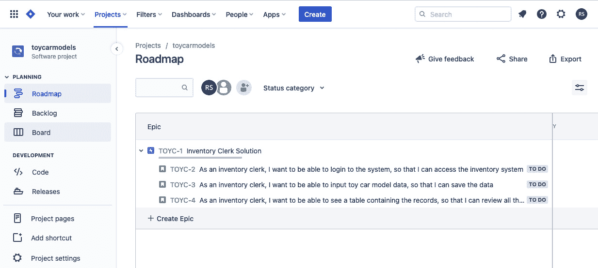

图 2.19 – 带有用户故事的史诗

这些用户故事将在我们即将编写的第六章中发挥非常重要的作用，即*应用* *行为驱动开发*。

现在我们已经为**库存管理员解决方案**史诗创建了第一个史诗和用户故事，重复这些步骤来创建访客史诗和用户故事。您可以使用以下史诗名称和用户故事：

管理员史诗名称：**访客页面**

用户故事：

+   作为访客，我希望看到包含汽车型号信息的公共页面，以便我可以浏览库存

+   作为访客，我希望能够过滤表格，以便我可以缩小结果：

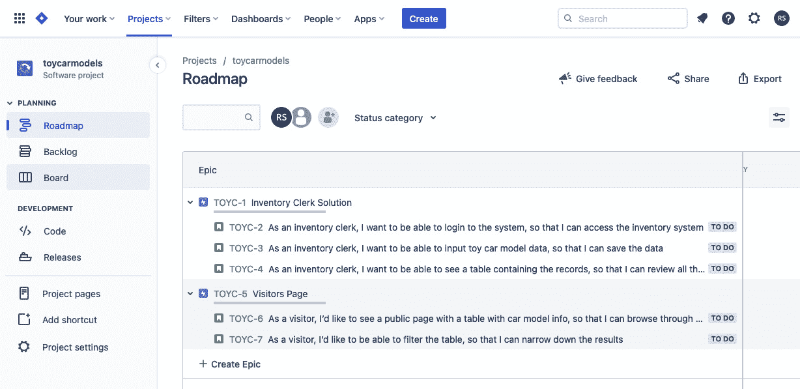

图 2.20 – 史诗和用户故事

在这些步骤之后，我们现在将有一些作为客户和作为管理员想要实现的事情的列表。我们想要实现的事情的列表被称为**用户故事**，我们通过史诗对其进行分组。在编写代码之前，我们希望能够在某个地方存储和版本控制我们的代码。我们将使用 Bitbucket 作为我们的版本控制解决方案。

## 将 Jira 与 Bitbucket 集成

我们需要一个 Git 仓库来存放我们的代码，如果能将其与我们需要构建的任务列表（Jira 工单）集成那就太好了。Jira 提供了许多软件集成解决方案，这真是太好了。Jira 可以与我们的代码仓库集成，以及与 CI 解决方案集成，这些将在*第九章* *持续集成*中讨论。

现在有许多 Git 版本控制托管软件，但在这个项目中，我们将使用 Bitbucket，以便我们可以快速将其与 Jira 集成，并将更多宝贵的时间用于实际的编码。

首先，您需要为这个示例项目创建一个 Bitbucket 账户。访问[`bitbucket.org/product`](https://bitbucket.org/product) 并注册一个账户。如果您已经有了现有的 Bitbucket 账户，那也可以使用。

集成 Bitbucket 与 Jira Cloud 有一套详细的说明；请遵循 https://support.atlassian.com/jira-software-cloud/docs/enable-code/ 或 [`support.atlassian.com/jira-cloud-administration/docs/connect-jira-cloud-to-bitbucket/`](https://support.atlassian.com/jira-cloud-administration/docs/connect-jira-cloud-to-bitbucket/)上的说明。

您也可以直接点击左侧菜单上的**代码**链接：

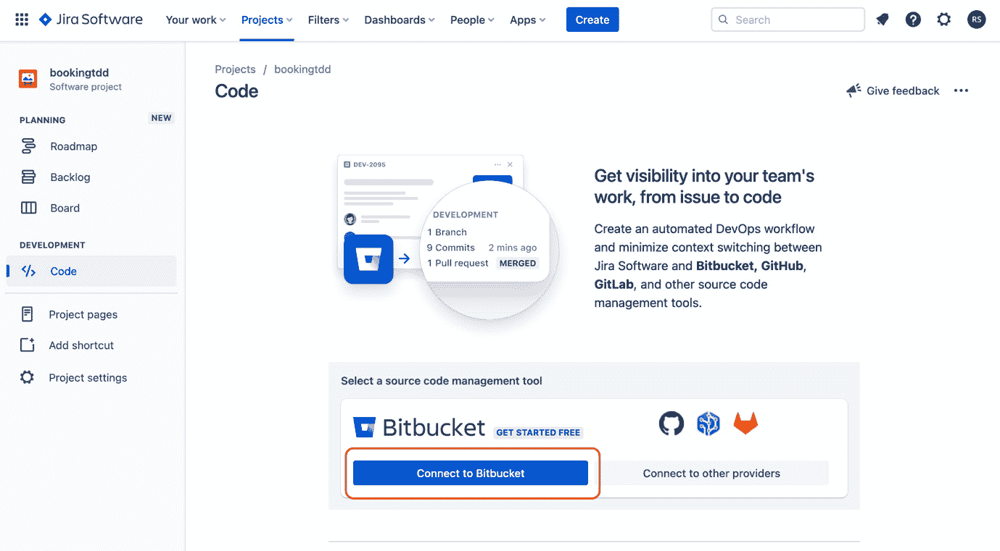

图 2.21 – 代码页面

点击主面板上的**连接到 Bitbucket**按钮。然后您可以按照说明将您的 Jira 项目连接到您选择的 Bitbucket 账户。

接下来，点击左侧菜单上的**项目设置**链接：

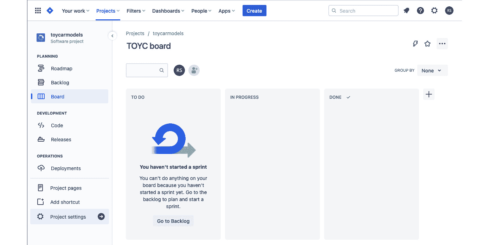

图 2.22 – 项目设置菜单项

在**项目设置**页面内，点击**功能**菜单项。一旦进入**功能**页面，在**开发**组中，点击**代码**部分内的**配置…**按钮：

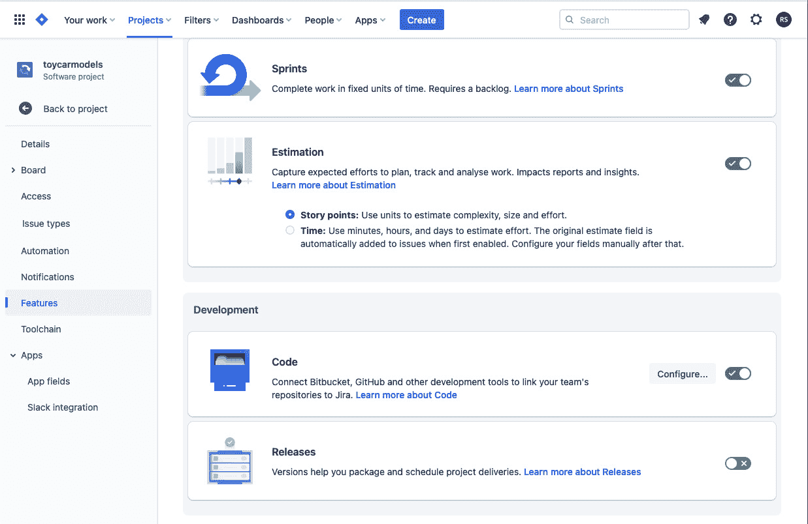

图 2.23 – 代码配置…按钮

点击**配置…**按钮后，您将被重定向到一个**工具链**页面；在**构建**部分，点击**+ 添加** **仓库**按钮：

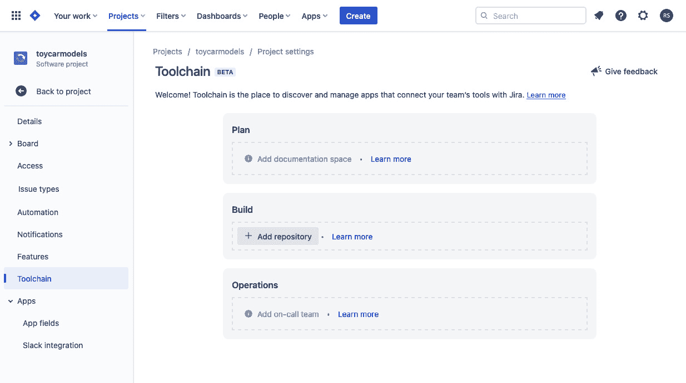

图 2.24 – + 添加仓库按钮

将会出现一个弹出窗口—选择您想与项目一起使用的任何 Git 解决方案。在我的情况下，我正在使用一个免费的 Bitbucket 账户：

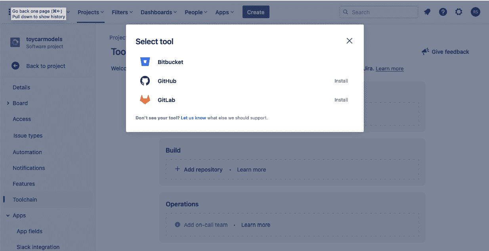

图 2.25 – 选择 Git 产品

点击**Bitbucket**后，您现在可以输入一个您想与 Jira 项目集成的新的仓库名称。或者，您也可以选择您在自己的账户中创建的现有仓库。在这个示例中，我将只创建一个新的仓库：

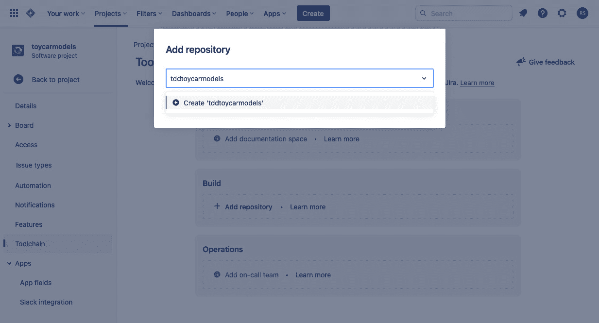

图 2.26 – 为 Jira 项目创建新仓库

点击 **+ 创建** 按钮，现在你的 Jira 项目应该已经与你的 Git 仓库集成：

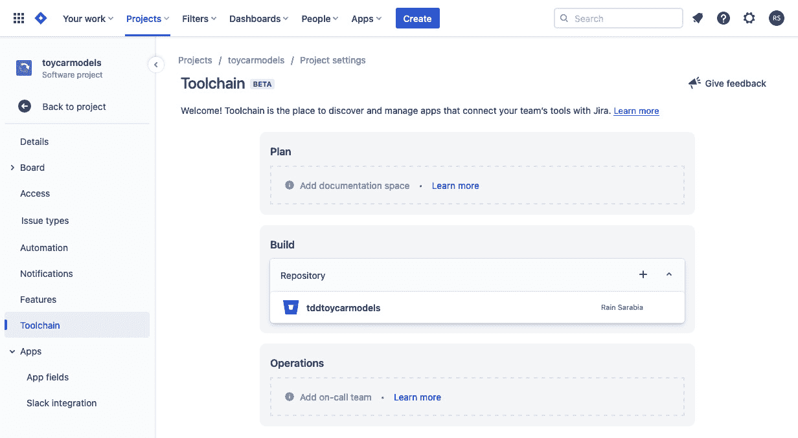

图 2.27 – 与 Jira 集成的仓库

现在，你可以通过点击 **返回项目** 链接回到项目窗口；然后，点击 **路线图** 链接。点击我们之前创建的 **库存管理员解决方案**史诗，你应该在我们的票据中看到一个新的 **开发** 部分：

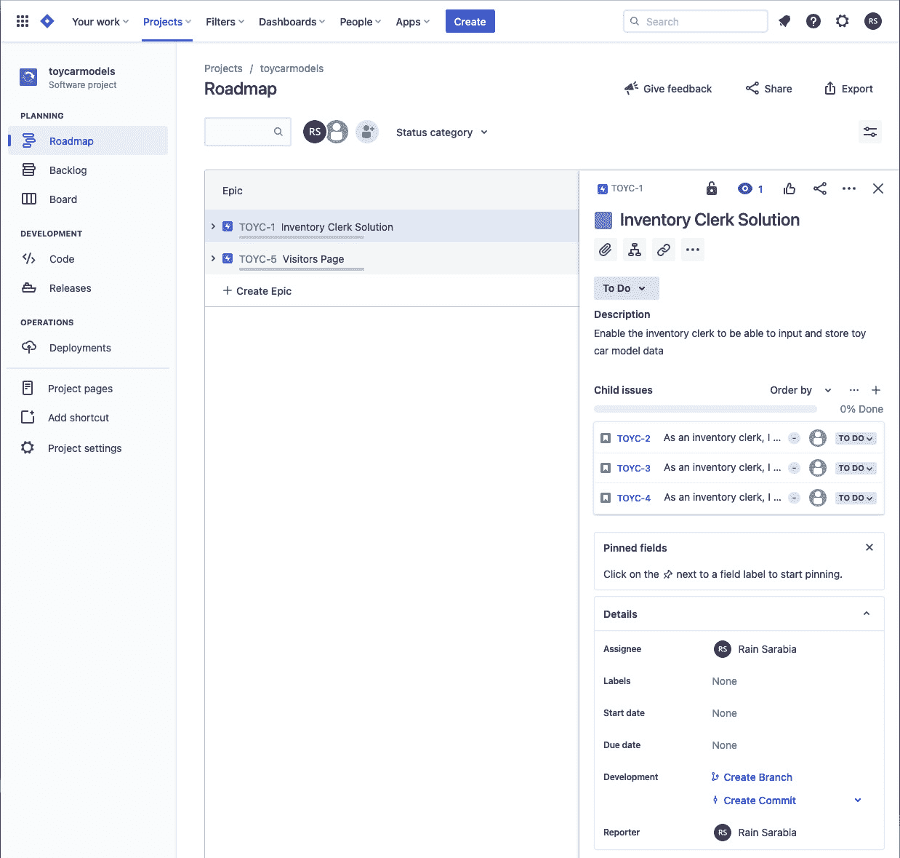

图 2.28 – 票据：带有创建分支链接的新开发部分

现在一切配置就绪，你应该能够从你的 Jira 票据中创建 Bitbucket 分支。在 **库存管理员解决方案** 弹出窗口中，点击 **创建分支** 链接。你将被重定向到你的 Git 仓库页面，在那里你可以继续创建分支：

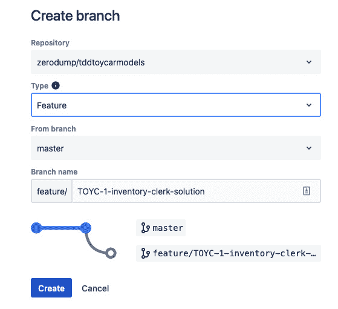

图 2.29 – 为史诗创建新分支

返回 **路线图** 页面，刷新页面。再次打开 **库存管理员解决方案**史诗，这次，在 **开发** 部分中，你会看到现在有一个分支连接到我们的 Jira 史诗：

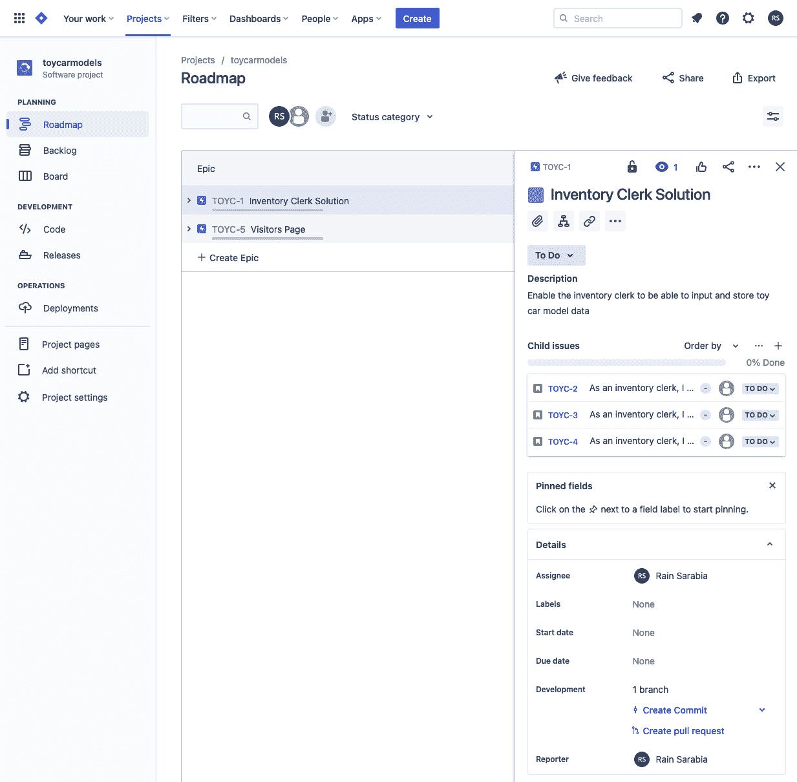

图 2.30 – 一个连接到 Jira 史诗的分支

现在，我们有了使用 Jira 创建 Git 仓库的能力。随着项目的进行，这将非常有用，因为这意味着我们的 Git 仓库现在已正确集成到我们的票据解决方案中。

我们将在这个示例项目中使用 BitBucket，但你完全可以选择你自己的首选版本控制系统并将其与 Jira 集成。

# 摘要

在本章中，我们能够基于朋友在汽车博物馆遇到的真实问题创建了一个示例项目。通过试图理解业务或客户想要实现的目标，我们能够确定阻碍业务或客户实现该目标的问题或挑战。通过分析我们针对问题的解决方案，我们能够制定解决方案的计划。我们将解决方案列成用户故事，并将它们分组在一个史诗下。

这些用户故事告诉我们关于行为的信息——确切地说，是系统行为。为什么这些很重要呢？好吧，通过理解我们需要构建什么，我们开发者可以更好地规划如何构建解决方案。我见过软件被构建了数周或数月，完成后，开发者和业务分析师才意识到该解决方案甚至没有解决阻碍业务或客户实现其目标的根本问题，仅仅是因为业务分析师和开发者没有理解业务试图实现或解决的问题。

通过拥有一份清晰的待建项目列表，我们将能够制定出自动测试，以检查我们是否满足了预期的行为。我们将在*第六章*中构建这些自动化的行为驱动测试，即*应用行为驱动开发*。

在下一章中，我们将介绍*Docker 容器*并构建我们自己的容器。这个容器将被用来包含并运行我们将构建以实现业务目标的 PHP 软件解决方案。
