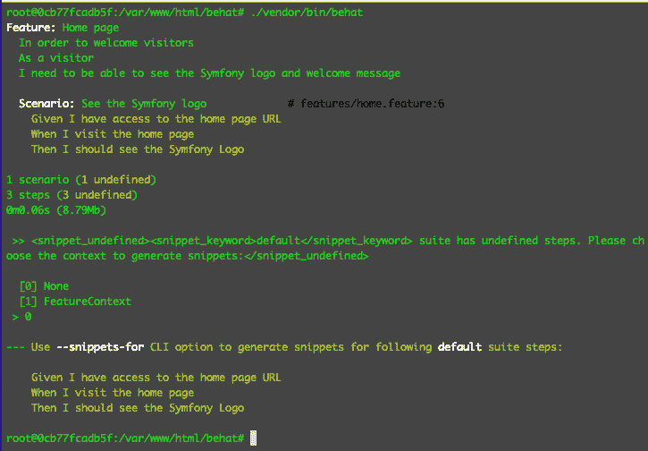
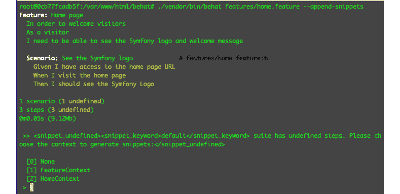
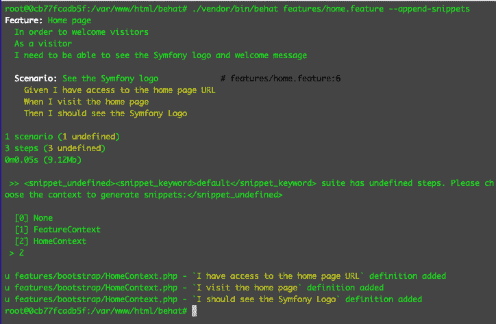
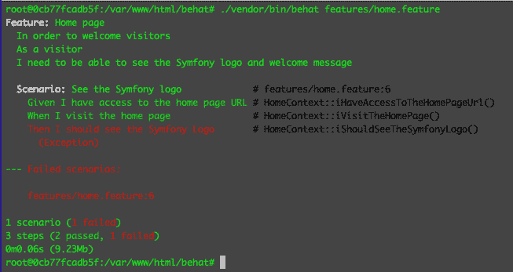
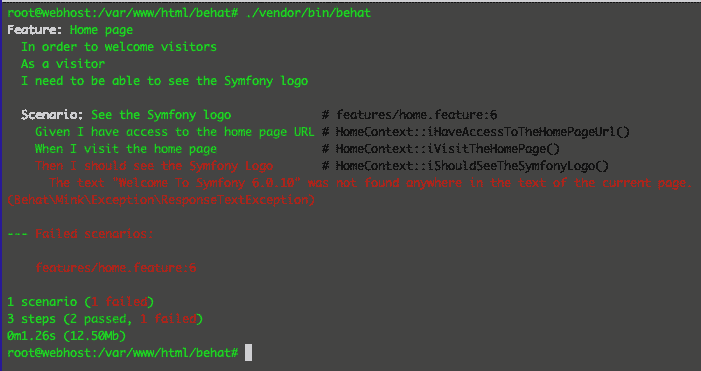
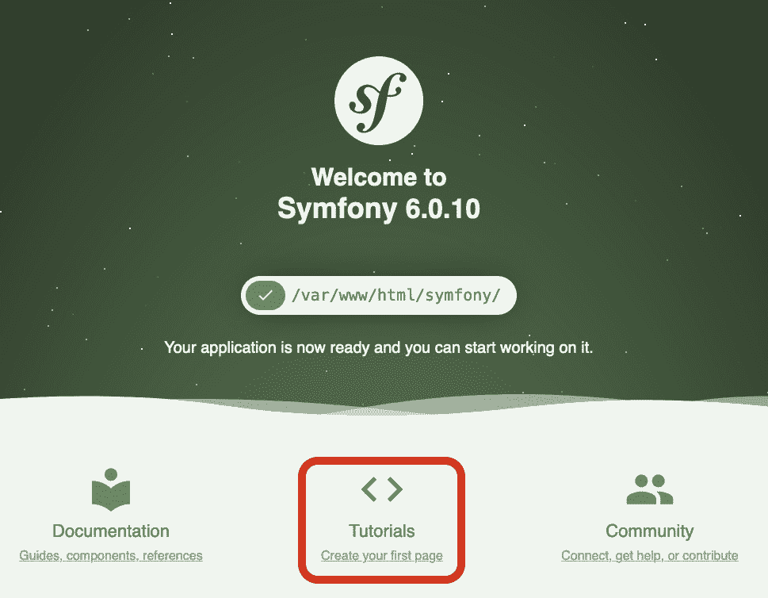
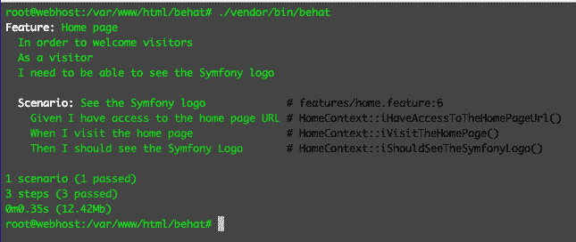
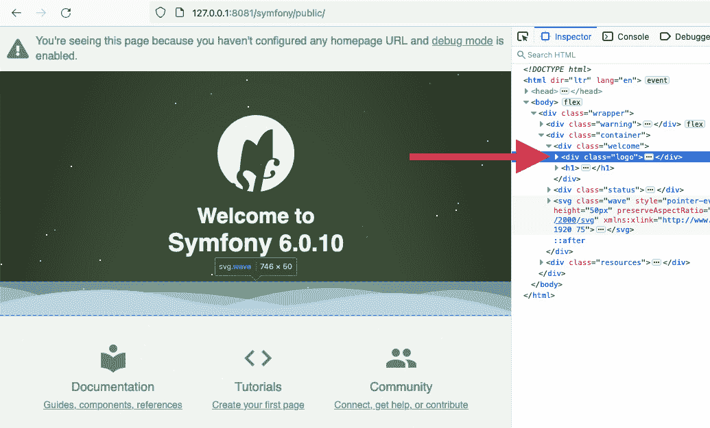
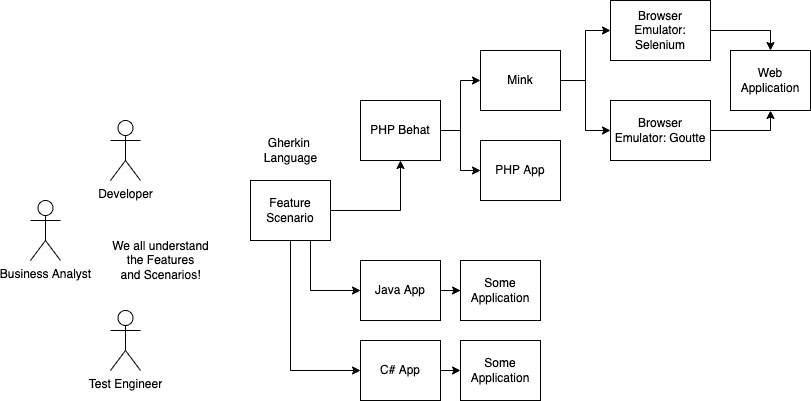

# 第六章：应用行为驱动开发

在上一章中，我们学习了如何创建和使用单元测试来发挥我们的优势。我们使用单元测试和集成测试来帮助确保解决方案代码的稳定性。这可能就像学习如何在沙袋上打基本拳一样。如果你去拳击课，他们可能会教你如何更有效地使用你的基本拳，并教你如何使用基本拳进行组合拳，以及如何防御。这与**行为驱动开发**（**BDD**）和**测试驱动开发**（**TDD**）类似。我们首先需要从基础开始：单元和集成测试。现在我们有了这些基础知识，我们可以开始应用流程或技术，以便我们可以更有效地使用它们。

许多开发者都知道如何编写单元测试和集成测试——毕竟，这些测试只是我们开发者编写的程序。根据我的个人经验，我注意到许多开发者不知道如何在他们的项目中有效地利用他们的单元测试和集成测试。有些开发者知道如何编写单元测试，但甚至无法为他们的项目编写一个。所以，仅仅拥有编写单元测试的基本或技术知识是不够的，以帮助改进项目。应用并有效地使用它才是关键。

使用 BDD 和 TDD，这正是我们想要尝试的。我们将通过遵循一个流程来利用这些测试技能，帮助我们构建我们的示例项目。

在本章中，我们将讨论以下主题：

+   BDD 是什么？

+   使用 Behat 和 Gherkin 应用 BDD

+   基于 Gherkin 编写 PHP 代码

+   浏览器模拟器和 Mink

+   那为什么还要使用 Gherkin 呢？

到本章结束时，你将能够编写行为驱动的特性、场景和解决方案代码。

# 技术要求

本章要求你拥有我们在*第五章*、“单元测试”中使用的所有容器、配置和测试工具。你可以从以下 URL 下载源文件并运行容器：[`github.com/PacktPublishing/Test-Driven-Development-with-PHP-8/tree/main/Chapter%205`](https://github.com/PacktPublishing/Test-Driven-Development-with-PHP-8/tree/main/Chapter%205)。

## 准备本章的开发环境

首先，获取*第六章*的基础代码，位于[`github.com/PacktPublishing/Test-Driven-Development-with-PHP-8/tree/main/Chapter%206/base/phptdd`](https://github.com/PacktPublishing/Test-Driven-Development-with-PHP-8/tree/main/Chapter%206/base/phptdd)，或者简单地运行以下命令：

```php
curl -Lo phptdd.zip "https://github.com/PacktPublishing/Test-Driven-Development-with-PHP-8/raw/main/Chapter%206/base.zip" && unzip -o phptdd.zip && cd base && ./demoSetup.sh
```

要运行容器并执行本章中的命令，你应该在`docker-server-web-1`容器内部。

运行以下命令以确认我们的 Web 服务器的容器名称：

```php
docker ps
```

要运行容器，请从你的主机机器上的`/phptdd/docker`目录运行以下命令：

```php
docker-compose build && docker-compose up -d
docker exec -it docker_server-web_1 /bin/bash
```

一旦进入容器，运行以下命令通过 Composer 安装所需的库：

```php
/var/www/html/symfony# ./setup.sh
```

# 什么是 BDD？

BDD 是一种开发软件的方式或过程，其中解决方案的预期行为首先由商业定义，然后将其翻译成自动化测试场景，在开始实际开发解决方案代码之前。

这种开发流程促进了软件公司不同部门或团队之间的协作。这可能听起来很荒谬，但根据我的经验，在项目开始时，确切地了解“需要构建什么”以及项目的实际目标，是我看到的最难以捉摸的部分。

有时候，商业或客户甚至不知道他们想要什么，或者可能商业或客户不知道如何有效地表达或传达这些目标。现在，想象一下你是一家软件公司的软件开发者——你的工作是开发解决方案来解决问题以实现目标。如果这个目标没有明确定义呢？或者，如果目标是由商业定义的，但没有正确传达给软件开发者呢？基本上，开发者最终会开发出错误解决方案，更糟糕的是，针对错误的问题！这就是为什么软件公司不同部门之间的协作非常重要。

商业分析师、项目经理、架构师和开发者可以定义项目的目标，以及为什么项目最初是必要的。然后测试工程师和软件开发者可以与商业分析师协调、辩论和讨论，以确定解决方案的预期或期望行为，然后将它们分解成更小的部分。这是 BDD（行为驱动开发）的第一个步骤：确切地知道目标是什么，需要构建什么，以及期望从解决方案中获得哪些行为。

现在我们已经知道了 BDD 是什么，我们可以开始将其应用到我们的示例项目中。

# 使用 Behat 和 Gherkin 应用 BDD

为了帮助我们更容易地理解 BDD 是什么以及如何使用它，我们将尝试将其应用到项目中的示例场景中。

回到*第二章*，*理解和组织我们项目的业务需求*，我们已经创建了 Jira 票据来帮助我们分解需要构建的功能。在**库存管理员解决方案**史诗中，我们创建了一个具有以下标题的用户故事：

*作为一名库存管理员，我希望能够登录到系统中，以便我可以访问库存系统*。

通过这个用户故事，我们可以推断出我们需要一个应用程序的用户，并且这个用户需要能够进行身份验证，以便他们可以访问受限制的功能。

所以，通常，作为软件开发者，我们接下来会开始构建解决方案代码——编写代码，然后检查我们刚刚创建的控制器或网页的结果。我们不会这样做。

使用 BDD，我们首先从一个失败的场景开始。听起来熟悉吗？是的——从上一章来看，这就像在我们编写解决方案代码通过那个失败的测试之前，先编写我们的失败的单元测试一样。

在我们开始编写 BDD 测试之前，我们需要使用一些 PHP 包来做到这一点。我们将使用 Behat 测试框架来帮助我们构建和组织我们的 BDD 测试。

## Behat 是什么？

Behat 是一个为在 PHP 中实现行为驱动开发（BDD）而构建的 PHP 框架。它是一个框架，帮助我们 PHP 开发者编写行为驱动测试和程序。这将帮助我们更快地编写更好的行为驱动程序，这样我们就不必在编写这些行为驱动测试时重新发明轮子，即编写引导代码或骨架代码。Behat 使用 Gherkin 来描述我们想要测试的实际功能。

## Gherkin 是什么？

Gherkin 是一种用于定义业务场景和目标的语言。它使用纯英文文本，因此公司中的任何人——甚至非技术人员——都能理解所描述的业务场景。

## Mink 是什么？

这对于像我这样的 PHP 开发者来说非常有趣。Mink 是一个 PHP 库，将作为网络浏览器的模拟器。我们这些网络应用开发者开发 PHP 应用程序；我们的用户将通过网络浏览器使用我们的网络应用程序。因此，如果我们能够通过网络浏览器自动化测试应用程序的过程，这将对我们非常有好处。我们不必手动点击按钮或填写表单等，我们可以使用一些程序来为我们完成这些工作。所以，想象一下，一个机器人版本的你在通过网络浏览器为你测试程序。

在下一节中，我们将安装 Behat。

## 安装 Behat 和 Mink

在我们开始编写第一个行为驱动测试程序之前，我们首先需要安装所有需要的库和依赖项。让我们开始吧：

1.  在 `codebase` 目录下创建一个名为 `behat` 的新目录，这样我们就可以有一个与我们的 Symfony 应用程序分开的安装目录：


图 6.1 – Behat 根目录

在创建新目录后，我们可以继续通过 Composer 安装 Behat PHP 包。

1.  使用你的终端，在 `behat` 目录中，运行以下命令：

    ```php
    /var/www/html/behat# composer require --dev behat/behat
    ```

1.  安装完成后，你可以通过运行以下命令来验证 Behat 是否成功安装：

    ```php
    /var/www/html/behat# ./vendor/bin/behat -V
    ```

完成后，你应该能看到你刚刚安装的 Behat 版本：


图 6.2 – Behat 已安装

现在，我们还需要安装 Mink，这样我们才能进行一些前端测试。

运行以下命令来安装 Mink：

```php
/var/www/html/behat# composer require --dev behat/mink-extension -W
/var/www/html/symfony# composer require --dev behat/mink-goutte-driver
```

太好了！现在，我们需要让 Behat 创建一些骨架文件来帮助我们开始。运行以下命令：

```php
/var/www/html/behat# ./vendor/bin/behat --init
```

现在，你应该会看到一个名为 `features` 的新目录。这就是我们将放置我们的业务功能场景的地方。

### 创建一个 Behat 功能

现在我们已经安装了 Behat 并初始化了它，我们可以创建我们的第一个示例特性文件。我们将使用 Gherkin 语言来定义特性的故事。这实际上就像讲故事一样。

在 `features` 目录中，创建一个名为 `home.feature` 的新文件，并添加以下内容：

/var/www/html/behat/features/home.feature

```php
Feature: Home page
  In order to welcome visitors
  As a visitor
  I need to be able to see the Symfony logo 
  Scenario: See the Symfony logo
    Given I have access to the home page URL
    When I visit the home page
    Then I should see the Symfony Logo
```

我们已经使用 Gherkin 语言创建了 `feature` 和 `scenario` 文件。它们是描述性的，并且非常容易理解。你不需要程序员就能理解它们的意思。所以，向你的同事，如业务分析师或测试工程师展示它们不会成为问题；他们甚至能帮助你微调或改进你的特性和场景。

接下来，我们将重点关注 `Feature` 关键字及其内容。

#### 特性关键字

如前述代码片段所示，我们在 `Feature` 关键字下方写了三个部分。下面的三个部分如下所示：

+   `In order to` <business goal>

+   `As` `a/an` <actor>

+   `I need to be able to` <actor previously defined should be able to do>

在 `In order to` 部分中，我们定义了在这个特性中业务想要实现的目标。在我们的例子中，我们希望当访客到达我们的主页时，能感受到欢迎。

在 `As a/an` 部分中，我们定义了谁在执行动作。在我们的例子中，这是访问主页的网站访客。

最后，在 `I need to be able to` 部分中，我们定义了演员应该能够做什么或达到什么目标，以便业务能够实现其最终目标。在我们的例子中，我们只想让演员或访客看到 Symfony 标志和欢迎信息。

接下来，作为特性的一部分，我们需要使用 `Scenario` 关键字添加场景。

#### 场景关键字

在一个特性中，我们可以有一个或多个场景。在我们创建的 `home.feature` 文件中，你会注意到 `Scenario` 标签相对于上面的 `Feature` 标签是缩进的。场景是用纯英文书写的；它只是事件序列的书面概述。在 Gherkin 中，我们将场景分为三个部分：

+   `Given`: 用于声明系统现有的或当前的状态或值

+   `When`: 用于定义在系统上执行的动作或动词

+   `Then`: 在 `When` 部分声明的动词或动作执行后的预期结果

现在我们已经定义了一个示例特性和场景，让我们尝试运行 Behat 看看我们会得到什么。

执行以下命令：

```php
/var/www/html/behat# ./vendor/bin/behat
```

你应该看到以下结果：



图 6.3 – 缺失的片段

你会注意到 Behat 尝试寻找一些代表我们之前声明的场景的 PHP 代码，但我们没有这样做。所以，这意味着我们还需要为 Behat 编写一些 PHP 代码，以便在执行实际的 `Given`、`When` 和 `Then` 定义时使用。

接下来，我们将编写支持我们刚刚创建的特性场景所需的 PHP 代码。

# 根据 Gherkin 编写 PHP 代码

我们需要 PHP 程序来表示我们使用 Gherkin 创建的功能和场景。Behat 框架将遵循我们在上一节中创建的功能和场景，但它也会寻找表示每个功能和场景的 PHP 代码。在这段 PHP 代码中，我们可以添加任何自定义逻辑，以将功能和场景解释为程序。创建 Behat 框架运行我们的功能和场景所需的以下文件：

1.  首先，我们需要创建一个新的上下文类。上下文类是 Behat 用于将 Gherkin 功能表示为 PHP 程序的东西。创建以下文件，并包含所示内容：

codebase/behat/features/bootstrap/HomeContext.php

```php
<?php
use Behat\Behat\Tester\Exception\PendingException;
class HomeContext implements \Behat\Behat\Context\Context
{

}
```

1.  然后，在创建 `HomeContext.php` 类之后，我们还需要告诉 Behat 我们有一个新的上下文类。我们可以通过创建一个配置文件来完成此操作。创建以下文件，并包含所示内容：

codebase/behat/behat.yml

```php
default:
  suites:
    default:
      contexts:
        - FeatureContext
        - HomeContext
```

在这里，我们可以声明更多的 PHP 上下文类。默认情况下，您可以使用本章前面自动创建的 `FeatureContext.php` 文件，但如果我们在 `FeatureContext.php` 类中继续添加不同的步骤，最终会变得混乱。

1.  现在，让我们再次尝试运行 Behat，但这次，我们将使用以下命令来自动生成我们 `Given`、`When` 和 `Then` 步骤缺失的片段：

    ```php
    /var/www/html/behat# ./vendor/bin/behat features/home.feature --append-snippets
    ```

然后，系统会提示您输入想要使用的特定上下文类：



图 6.4 – 选择上下文类

1.  在 CLI 中输入 `2`，然后按 *Enter*。现在，您应该得到以下结果：



图 6.5 – 自动生成的片段

Behat 已经自动生成了表示我们在 `home.feature` 文件中定义的 `Given`、`When` 和 `Then` 步骤所需的 PHP 片段。

1.  打开我们之前创建的 `HomeContext.php` 类，在那里您应该看到新自动生成的函数：

    ```php
    <?php
    ```

    ```php
    use Behat\Behat\Tester\Exception\PendingException;
    ```

    ```php
    class HomeContext implements \Behat\Behat\Context
    ```

    ```php
         \Context
    ```

    ```php
    {
    ```

    ```php
        /**
    ```

    ```php
         * @Given I have access to the home page URL
    ```

    ```php
         */
    ```

    ```php
        public function iHaveAccessToTheHomePageUrl()
    ```

    ```php
        {
    ```

    ```php
            throw new PendingException();
    ```

    ```php
        }
    ```

    ```php
        /**
    ```

    ```php
         * @When I visit the home page
    ```

    ```php
         */
    ```

    ```php
        public function iVisitTheHomePage()
    ```

    ```php
        {
    ```

    ```php
            throw new PendingException();
    ```

    ```php
        }
    ```

    ```php
        /**
    ```

    ```php
         * @Then I should see the Symfony Logo
    ```

    ```php
         */
    ```

    ```php
        public function iShouldSeeTheSymfonyLogo()
    ```

    ```php
        {
    ```

    ```php
            throw new Exception();
    ```

    ```php
        }
    ```

    ```php
    }
    ```

1.  在 `iShouldSeeTheSymfonyLogo()` 方法中，将 `PendingException` 类替换为仅有的 `Exception` 类。

1.  太好了！现在，让我们再次运行 Behat，看看我们会得到什么：

    ```php
    /var/www/html/behat# ./vendor/bin/behat features/home.feature
    ```

由于自动生成的片段返回一个 `PendingException` 对象，我们将从 Behat 获得以下结果：



图 6.6 – 使用自动生成的 PHP 片段的 Behat

现在，我们应该能看到温暖而舒适的失败测试消息。到目前为止，我们已经能够使用 Gherkin 定义我们的功能。然后，我们创建了一个单独的上下文类来存放 Behat 将执行的与每个 `Given`、`When` 和 `Then` 步骤相关的方法。然后，我们使用 Behat 自动生成这些方法。现在，我们如何让所有这些测试通过呢？嗯，我们可以从 `iShouldSeeTheSymfonyLogo()` 方法中移除我们抛出的异常！如您所见，这一切都在 PHP 领域内发生。但为了真正通过测试，我们必须让 Behat 启动一个浏览器，访问主页 URL，并验证它是否可以看到 Symfony 标志。

那么，我们该如何做呢？记得我们之前安装 Mink 的时候吗？现在，我们将使用 Mink 和浏览器模拟器来为我们完成浏览器的工作。

# 浏览器模拟器和 Mink

浏览器模拟器是模拟或模仿网页浏览器功能和行为的程序。这些模拟器可以被其他程序，如 Behat 或 Codeception，用来模拟真实用户在使用您的应用程序时在网页浏览器上的操作。

浏览器模拟器有两种类型：

+   **无头**：这类模拟器发送 HTTP 请求，并简单地监听来自 web 应用程序的返回 DOM 或响应。它们最适合轻量级测试，不需要进行复杂的检查，例如在鼠标悬停事件后检查 AJAX 响应。

+   **控制器**：这类模拟器使用真实浏览器，它们基本上就像一个控制真实浏览器的人。根据我的经验，使用这类模拟器的好处是我们可以设置我们想要测试的浏览器类型。我们还可以检查页面上的 JavaScript 和 AJAX 结果。

在我们的例子中，我们将使用无头浏览器，因为我们不需要执行任何 JavaScript/AJAX 操作。如果您需要在项目中使用真实的浏览器模拟器，我强烈推荐使用 Selenium2。您可以在 Selenium 网站上了解更多关于 Selenium 的信息：[`www.selenium.dev`](https://www.selenium.dev)。

接下来，为了让我们的 Behat 应用程序能够开始与浏览器模拟器交互，而不是真实用户，创建以下程序文件：

1.  打开我们之前创建的 `HomeContext.php` 类，并将其替换为以下内容：

codebase/behat/features/bootstrap/HomeContext.php

```php
<?php
use Behat\Mink\Mink;
use Behat\Mink\Session;
use Behat\Mink\Driver\GoutteDriver;
use Behat\MinkExtension\Context\MinkContext;
use Behat\MinkExtension\Context\MinkAwareContext;
class HomeContext extends MinkContext implements MinkAwareContext
{
    public function __construct()
    {
        $mink   = new Mink([
            'goutte'    => new Session(new 
                GoutteDriver()), // Headless browser
        ]);
        $this->setMink($mink);
        $this->getMink()->getSession('goutte')->start
            ();
    }
}
```

在构造函数中，我们实例化了一个 Mink 对象，并将其注入了一个 `Session` 对象。我们将一个 Goutte 无头模拟器的实例注入到会话中。Mink 支持不同类型的浏览器模拟器；您可以在[`mink.behat.org/en/latest/at-a-glance.html`](https://mink.behat.org/en/latest/at-a-glance.html)了解更多相关信息。

接下来，在同一个类中添加以下函数。这些方法代表您在场景中定义的每个步骤：

```php
    /**
     * @Given I have access to the home page URL
     */
    public function iHaveAccessToTheHomePageUrl()
    {
        return true;
    }
    /**
     * @When I visit the home page
     */
    public function iVisitTheHomePage()
    {
        // Using the Goutte Headless emulator
        $sessionHeadless = $this->getMink()->getSession
            ('goutte');
        $sessionHeadless->visit("symfony/public");
        $sessionHeadless->getPage()->clickLink('Create your 
            first page');
    }
    /**
     * @Then I should see the Symfony Logo
     */
    public function iShouldSeeTheSymfonyLogo()
    {
        // Headless emulator test:
        $assertHeadless = $this->assertSession('goutte');
        $assertHeadless->elementExists('css', '.logo');
        $assertHeadless->pageTextContains('Welcome To 
            Symfony 6'); 
    }
```

在`iVisitTheHomePage()`方法中，我们检索了我们刚刚创建的 Goutte 注入的会话，然后我们让模拟器访问 URL 并点击一个链接。

1.  现在，让我们运行测试看看它是否工作！运行以下命令：

    ```php
    /var/www/html/behat# ./vendor/bin/behat
    ```

然后，你应该看到以下结果：



图 6.7 – 失败的无头浏览器断言

我们再次失败了测试，但为什么是那样呢？注意在`iVisitTheHomePage()`方法内部，我们有这样一行：

```php
$sessionHeadless->getPage()->clickLink('Create your first page');
```

这行代码告诉模拟器点击主页上的**教程**选项，它使用的是**创建你的第一个页面**锚文本：



图 6.8 – 创建你的第一个页面链接

发生的事情是模拟器成功加载了 Symfony 主页，然后点击了教程链接，因此浏览器被重定向到了另一个页面！这就是我们测试失败的原因。所以，如果我们更新`iVisitTheHomePage()`方法并删除有问题的行，我们现在应该能够通过测试！

1.  再次运行测试，运行以下命令：

    ```php
    /var/www/html/behat# ./vendor/bin/behat
    ```

我们应该看到以下结果：



图 6.9 – 第一次 Behat 测试通过

太好了！我们终于通过了第一次 Behat 测试！在`iShouldSeeTheSymfonyLogo()`方法中，你会注意到我们有两个断言。在第一个断言中，我们想要检查返回的 DOM 中是否存在一个元素，即*标志*元素。然后我们添加了另一个断言来检查**欢迎使用 Symfony 6**文本。

1.  打开你的网络浏览器并访问以下页面：`http://127.0.0.1:8081/symfony/public/`。

1.  打开你的元素检查器；你应该能看到标志元素。这是我们告诉 Mink 要查找的内容：



图 6.10 – 标志元素

由于当浏览器模拟器访问主页时，*标志*元素和**欢迎使用 Symfony 6**文本都存在，它最终通过了测试！

现在，我想你会有一个想法，这些工具是多么有用和强大。这可以为你和你的团队节省数小时的手动测试时间。

在这个阶段，你可以开始使用 Gherkin 语言编写由特性表示的行为和场景，然后使用 Behat 执行这些测试，然后使用 PHP 开发特性以满足这些测试。如果你遵循这个流程，你的开发将受到在编写任何代码之前定义的行为的驱动。现在，你的开发是行为驱动的！

# 那为什么还要使用 Gherkin 呢？

本章中我们使用的例子非常简单，但你可能会想，我们完全可以跳过用 Gherkin 语言编写的功能。好吧，我也这么做了。我想：这并不那么有用。但当开始参与更大规模的项目，更大的团队，不同公司合作在同一项目和目标上时，我想：如果有一个我们可以共享的通用格式，那么我们都能够理解企业试图实现的目标，那该多好。我正在与一家第三方公司合作，我想问他们是否可以借用或获取他们的测试用例，但问题是，他们直接将测试用例写入他们的应用程序中，而这个应用程序不是用 PHP 编写的。然后我意识到，拥有某种通用语言是多么重要，我们可以使用这种语言来理解编程语言无关的系统预期行为！

以下图表展示了 Gherkin 语言作为平台无关的中介语言，在表示预期软件解决方案行为方面的有用性：



图 6.11 – Gherkin 特性和场景

通过使用一种共同的语言来定义项目中预期功能和场景，我们可以轻松地与完全不进行任何软件编程的不同团队进行协调。这对企业来说非常重要。来自不同团队的人将能够更容易、更快地协作和理解彼此，通过这样做，开发者也可以更有信心和确定性，他们所构建的是正确的。这听起来可能有些荒谬，但我看到很多项目因为企业不同团队之间沟通的破裂而失败。

# 摘要

在本章中，我们定义并解释了 BDD 是什么以及为什么我们需要它。通过实施 BDD，我们将能够更好地开发解决方案，以正确地解决实际业务目标。我们可以开始使用 Gherkin 语言编写的功能和场景来定义这些业务目标，Gherkin 语言只是简单的英语。通过这样做，公司来自不同团队的不同人员将能够在定义系统的预期行为方面更好地协调和理解彼此。这将有助于弥合不同团队之间的差距和语言障碍。

我们创建了一个功能和场景，然后使用 Behat、Mink 和 Goutte 定义预期系统行为，打开无头浏览器，访问网络应用程序，并验证主页的内容。

这只是 BDD 冰山一角。在下一章中，我们将开始编写解决方案代码，同时确保我们的代码通过使用 BDD 和 TDD 一起，是可维护和可测试的。
