# 使用 BDD 和 TDD 构建解决方案代码

现在我们已经了解了使用**测试驱动开发**（**TDD**）和**行为驱动开发**（**BDD**）编写测试程序的基础，我们可以开始在开发我们的示例应用程序时使用这两个过程。当处理商业成功的大型应用程序时，有一件事是共同的：它们都需要维护。在产品的功能方面，总会有改进的空间。可能会有一些被遗漏的 bug，而且更常见的是，为了改进产品，将不断向应用程序中添加更多功能。这就是编写糟糕的代码变得更糟的通常方式。一个编写得很好的类最终可能成为一个神级类：一个可以用几千行代码做所有事情的类。一个开发者可以在另一个开发者使用该类的同时在神级类中编写额外的函数，因此改变类的行为。你可以猜到接下来会发生什么！引入了一个新的 bug。

在开发过程中，开发者可能会开始开发一个将依赖于尚未编写的其他功能的功能。那么，我们如何为这类功能编写测试呢？我们需要开始模拟这些依赖项。在本章中，我们将学习如何使用模拟对象，并且我们将开始编写代码，以便遵循 SOLID 原则使其更干净、更容易维护。我们还将使用红-绿-重构模式来帮助我们构建所需的测试和功能。但在所有这些之前，我们首先创建一个 Behat 功能来启动我们将要编写的所有测试和代码。

在本章中，我们将探讨以下主题：

+   实施红-绿-重构模式

+   为示例项目编写测试和解决方案代码

+   基于 Jira 工单创建 Behat 功能

+   通过 Behat 注册功能

# 技术要求

在本章中，建议您使用以下来自此代码仓库的基本代码：[`github.com/PacktPublishing/Test-Driven-Development-with-PHP-8/tree/main/Chapter%207/base/phptdd`](https://github.com/PacktPublishing/Test-Driven-Development-with-PHP-8/tree/main/Chapter%207/base/phptdd)。完成本章后，最终的解决方案代码可以在[`github.com/PacktPublishing/Test-Driven-Development-with-PHP-8/tree/main/Chapter%207/complete`](https://github.com/PacktPublishing/Test-Driven-Development-with-PHP-8/tree/main/Chapter%207/complete)处找到以供参考。

## 准备章节的开发环境

首先，获取本章的基础代码，可以在[`github.com/PacktPublishing/Test-Driven-Development-with-PHP-8/tree/main/Chapter%207/base`](https://github.com/PacktPublishing/Test-Driven-Development-with-PHP-8/tree/main/Chapter%207/base)找到，或者简单地运行以下命令：

```php
curl -Lo phptdd.zip "https://github.com/PacktPublishing/Test-Driven-Development-with-PHP-8/raw/main/Chapter%207/base.zip" && unzip -o phptdd.zip && cd base && ./demoSetup.sh
```

要运行容器并执行本章中的命令，你应该在 `docker-server-web-1` 容器内。

运行以下命令以确认我们的 web 服务器的容器名称：

```php
docker ps
```

要运行容器，从你的主机机器上的 `/docker` 目录运行以下命令：

```php
docker-compose build && docker-compose up -d
docker exec -it docker-server-web-1 /bin/bash
```

一旦进入容器，运行以下命令以通过 Composer 安装所需的库：

```php
/var/www/html/symfony# ./setup.sh
/var/www/html/behat# ./setup.sh 
```

# 实施红-绿-重构模式

红绿重构模式是一种编程方法，用于实现 TDD。这是一个循环，你首先故意编写一个失败的测试，在执行测试时，你会看到一个红色的失败信息。然后，你编写解决方案代码来通过那个测试，在这个过程中，你会看到一个绿色的通过信息。通过测试后，你就可以回到清理和重构你的测试和解决方案代码了。

如果你打开本书前面创建的 `codebase/symfony/runDebug.sh` 文件，在 *第五章* 中，你会注意到我们通过添加 `--color=always` 参数来运行 PHPUnit。然后，无论何时我们运行 PHPUnit 并得到失败的测试，你都会注意到我们总是得到红色的错误或失败的测试信息。

为了清楚地展示这个模式，让我们通过一个例子来演示：

1.  创建一个名为 `HelloTest.php` 的新文件：

codebase/symfony/tests/Unit/HelloTest.php

```php
<?php
namespace App\Tests\Unit;
use PHPUnit\Framework\TestCase;
class HelloTest extends TestCase
{
    public function testCanSayHello()
    {
        $this->fail("--- RED ---");
    }
}
```

1.  在创建新的单元测试后，运行以下命令以确保 PHPUnit 可以执行 `testCanSayHello` 测试：

    ```php
    /var/www/html/symfony# php bin/phpunit --filter testCanSayHello --color=always
    ```

你应该会看到以下结果：

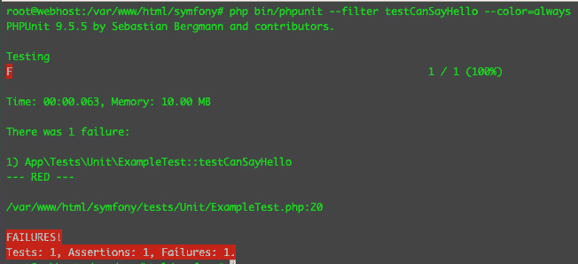

图 7.1 – 红色高亮的失败信息

在 TDD 中，我们总是从编写一个没有任何实现支持的测试开始。然后我们需要运行这个测试以确保 PHPUnit 识别测试并且可以执行它。我们还想确认我们已经创建了正确的测试类，在正确的测试套件和正确的目录中，并且使用了正确的命名空间。

在运行之前提到的命令后，这个新创建的测试将如预期失败，PHPUnit 将显示红色的错误或失败信息。这就是红-绿-重构模式中的*红色*！

一旦我们确信可以使用 PHPUnit 运行测试，我们就可以开始编写代码来通过失败的测试。还记得 TDD 吗？我们的测试将启动或驱动解决方案代码的创建，以解决问题，因此是测试驱动的。所以，现在，为了快速通过失败的测试，我们将编写一些代码来通过失败的测试，按照以下步骤进行：

1.  修改测试并添加一个新类：

Codebase/symfony/tests/Unit/HelloTest.php

```php
<?php
namespace App\Tests\Unit;
use App\Speaker;
use PHPUnit\Framework\TestCase;
class HelloTest extends TestCase
{
    public function testCanSayHello()
    {
        $speaker = new Speaker();
        $this->assertEquals('Hello' $speaker->
            sayHello());
    }
}
```

1.  创建一个新类：

codebase/symfony/src/Speaker.php

```php
<?php
namespace App;
class Speaker
{
    public function sayHello(): string
    {
        return 'Hello';
    }
}
```

在`HelloTest`类中，我们修改了`testCanSayHello()`方法，使其创建我们创建的新`Speaker`类的实例，然后在断言行中，我们直接将预期的单词`Hello`与`sayHello()`方法返回的字符串进行比较。现在，如果我们再次运行测试，我们就不应该再看到红色的失败消息。

1.  使用以下命令运行相同的测试：

    ```php
    /var/www/html/symfony# php bin/phpunit --filter testCanSayHello --color=always
    ```

现在，我们应该看到以下结果来自 PHPUnit：

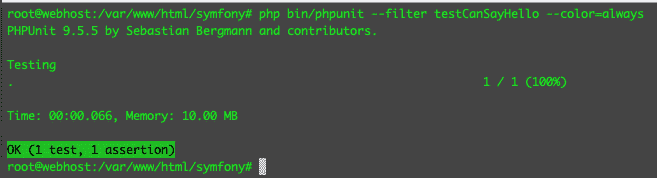

图 7.2 – 高亮显示的绿色消息

我们通过了测试！现在，我们的`testCanSayHello()`测试不再返回红色的错误/失败消息。我们只做了最基本的工作来通过测试，现在我们可以看到一个绿色的**OK (1 test, 1 assertion)**消息。这是红-绿-重构模式中的**绿色**。

当你在自己的项目中工作时，在通过测试的这个阶段，你可以继续进行列表中的下一个测试或下一个问题，或者你可以尝试改进测试和解决方案代码，使其更简洁、更易于阅读。

在本例中，我们将继续改进测试和解决方案代码，以便它支持更多的测试场景。

按照以下步骤操作：

1.  使用以下内容修改`HelloTest`类：

codebase/symfony/tests/Unit/HelloTest.php

```php
<?php
namespace App\Tests\Unit;
use App\Speaker;
use PHPUnit\Framework\TestCase;
class HelloTest extends TestCase
{
    /**
     * @param \Closure $func
     * @param string $expected
     * @dataProvider provideHelloStrings
     */
    public function testCanSayHello(\Closure 
        $func, string $expected)
    {
        $speaker        = new Speaker();
        $helloMessage   = $speaker->sayHello($func);
        $this->assertEquals($expected, $helloMessage);
    }
    /**
     * @return array[]
     */
    private function provideHelloStrings(): array
    {
        return [
            [function($str) {return ucfirst($str);},  
                'Hello'],
            [function($str) {return strtolower($str)
                ;}, 'hello'],
            [function($str) {return strtoupper($str)
                ;}, 'HELLO'],
        ];
    }
}
```

1.  使用以下内容修改`Speaker.php`类：

codebase/symfony/src/Speaker.php

```php
<?php
namespace App;
class Speaker
{
    /**
     * @return string 
     */
    public function sayHello(\Closure $func): string
    {
        return $func('Hello');
    }
}
```

我们重构了测试，以便我们可以为`Speaker.php`类添加更多灵活性。我们还重构了`HelloTest.php`测试类本身，使其更加灵活。如果我们再次运行测试，我们应该仍然通过测试。

1.  通过运行以下命令再次运行测试：

    ```php
    /var/www/html/symfony# php bin/phpunit --filter testCanSayHello --color=always
    ```

现在，我们应该看到以下结果：

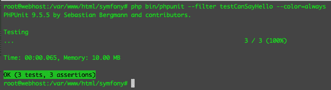

图 7.3 – 重构后仍然绿色

你会注意到，我们不是使用`@dataProvider`。然后我们创建了一个名为`provideHelloStrings()`的新函数，它返回一个包含闭包和字符串的数组。每个数组集将被用作`testCanSayHello()`测试方法的参数。在这个阶段，即使我们进行了重构，我们仍然可以通过测试。这是红-绿-重构模式中的**重构**阶段。

在现实世界的企业项目中，编写依赖于其他人项目（而你或你的团队无法轻易获得）的程序是非常常见的。这会阻止你开发依赖于尚未完成的某物的程序吗？可能不会！接下来，我们需要一种方法来专注于测试我们应用程序的特定部分，即使它依赖于尚未构建的其他对象。为此，我们将需要使用模拟对象。

# 为示例项目编写测试和解决方案代码

在*第二章* *理解并组织我们项目的业务需求*中，我们使用 Jira 作为工具来组织我们需要为项目构建的项目清单。除了使用 Jira 之外，还有其他的项目跟踪软件，或者我们也可以简单地使用便签或一张纸，写下我们想要编写的程序的任务。但我们只是想更有条理一些，如果你与软件开发团队以及其他公司团队一起工作，使用问题跟踪软件比使用一张物理纸张更容易协作。

我们已经将 Jira 用户故事分为两组：**库存管理员解决方案**组和**访客页面**组。这些组被称为史诗。我们将首先开始工作于**库存管理员解决方案**史诗。这是为了让汽车博物馆的库存管理员能够将那些宝贵的数据输入到系统中供访客查看。

到目前为止，当我们通过 BDD 和 TDD 进行操作时，我们以我们的开发环境设置为例进行操作。现在，我们也可以用它来构建我们的示例项目。从[`github.com/PacktPublishing/Test-Driven-Development-with-PHP-8/tree/main/Chapter%207/base/phptdd`](https://github.com/PacktPublishing/Test-Driven-Development-with-PHP-8/tree/main/Chapter%207/base/phptdd)下载基础代码。你可以使用基础代码并将其推送到与你的 Jira 项目链接的 master 分支。然后，我们将从该 master 分支分叉，并将所有后续的票证分支出来，合并到该 master 分支中。

让我们从第一张票开始，`TOYC-2`。回到你的 Jira `TOYC-2` 故事，然后从弹出菜单中点击 **创建分支** 链接：

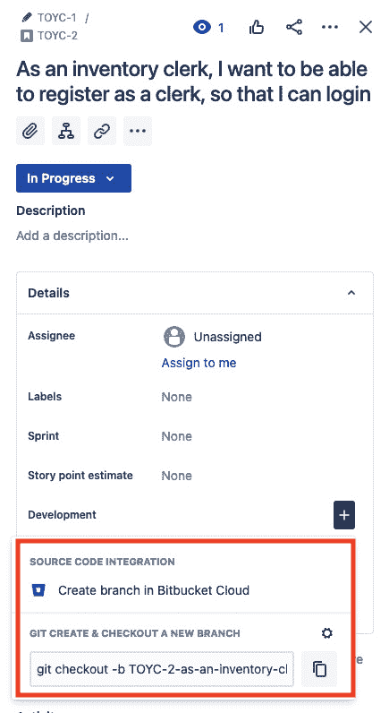

图 7.4 – TOYC-2 故事：创建分支链接

我们需要为这个特性创建一个新的 Bitbucket 分支。这就是我们将提交所有为这个特定票证构建的额外代码的地方。理想情况下，你需要从一个 master 分支分叉出一个分支。然后我们将从 develop 分支分叉，完成一个特性后，我们将将其合并回 develop 分支。

从 develop 分支创建一个新的特性分支。让我们称这个分支为 `TOYC-1`，它代表我们的 `TOYC-1` 分支，并创建一个新的特性分支——让我们称它为 `TOYC-2`。将 `TOYC-2` 分支检出至你的本地开发环境，在这个阶段，你应该已经将所有基础文件克隆到你的本地机器中。

我们需要确保我们的容器正在运行。运行以下命令来构建和运行容器。

使用你的终端，在 `docker` 目录下，运行以下命令：

```php
$ docker-compose build && docker-compose up -d
```

容器成功运行后，执行以下命令，并确保你可以进入网络容器：

```php
$ docker exec -it docker_server-web_1 /bin/bash
```

到目前为止，您应该已经看到了我们的主要 `behat` 和 `symfony` 目录：

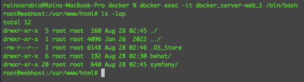

图 7.5 – behat 和 symfony 根目录

在这个阶段，我们的开发环境再次正常运行。接下来，我们将创建一个 Behat 功能，这将帮助我们开始为 `TOYC-2` 工单的软件解决方案的开发。

# 基于 Jira 工单创建 Behat 功能

在上一章中，我们学习了如何创建一个简单的 Behat 功能。在本节中，我们将创建一个新的 Behat 功能，该功能将代表我们在 *第二章*，*理解和组织我们项目的业务需求*中创建的 `TOYC-2` Jira 工单。这将有助于推动集成和单元测试的开发，从而帮助我们构建实际的解决方案代码。让我们开始步骤。

创建一个 Behat 功能文件，命名为 `inventory_clerk_registration.feature`，并保存以下功能内容：

codebase/behat/features/inventory_clerk_registration.feature

```php
Feature: Inventory Clerk Registration
  In order to access the inventory system
  As an Inventory Clerk
  I need to be able to create a clerk account
  Scenario: Access Registration Page
    Given I am in the home "/" path
    When I click the "Register" link
    Then I should be redirected to the registration page
  Scenario: Register
    Given I am in the register "/register" path
    When I fill in Email "Email" with 
        "clerk_email@phptdd.bdd"
    And I fill in Password "Password" with "password"
    And I check the "AgreeTerms" checkbox
    And I click on the "Register" button
    Then I should be able to register a new account
```

如果您阅读了我们刚刚创建的 Behat 功能，它将非常清楚地说明我们试图实现什么。这些步骤是现实生活中的用户为了能够注册到我们的系统中会执行的步骤。在这个阶段，我们不会构建解决方案代码，而是首先创建 Behat 注册测试代码。

## 创建 Behat 注册功能

由于我们使用的是本章的基础代码，因此我们必须确保安装了所有库，以便我们能够运行 Behat。

我们需要再次安装 Composer 包才能使用 Behat。运行以下命令以重新安装所需的库：

```php
/var/www/html/behat# composer install
```

这将拉取并安装我们在上一章中使用的所有库。安装后，让我们看看我们是否可以为我们的登录功能生成 Behat PHP 类：

1.  使用以下内容更新 `behay.yml` 文件：

codebase/behat/behat.yml

```php
default:
  suites:
    default:
      contexts:
        - FeatureContext
        - HomeContext
        - InventoryClerkRegistrationContext
```

1.  更新 `behat.yml` 文件后，现在尝试运行以下命令以生成 PHP 上下文类：

    ```php
    /var/www/html/behat# ./vendor/bin/behat --init 
    ```

运行命令后，我们应该能够在 `codebase/behat/features/bootstrap/InventoryClerkRegistrationContext.php` 中生成一个新的 PHP 类。

1.  现在，让我们尝试根据 `inventory_clerk_registration.feature` 文件自动在 `InventoryClerkRegistrationContext.php` 类中生成 PHP 方法。

运行以下命令：

```php
/var/www/html/behat# ./vendor/bin/behat features/inventory_clerk_registration.feature --append-snippets
```

运行命令后，您应该看到以下结果：

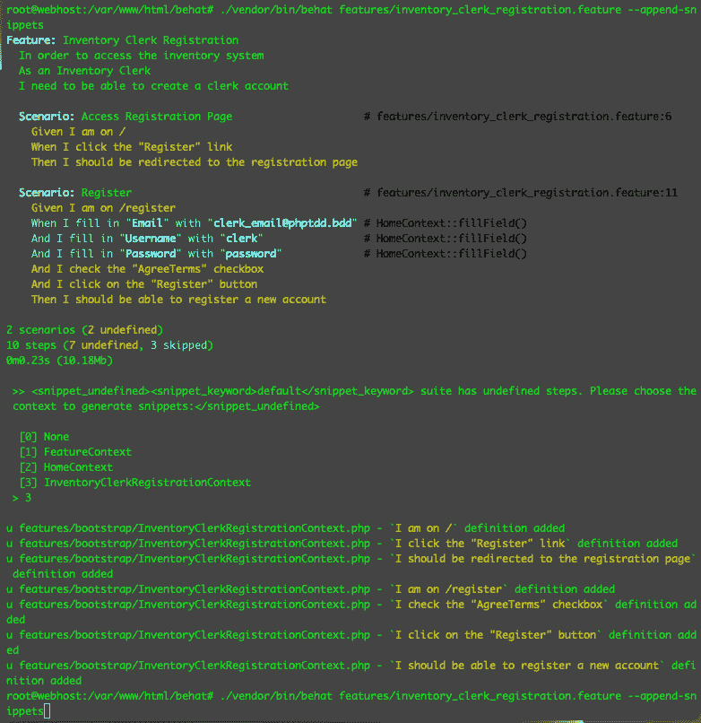

图 7.6 – 自动生成上下文方法

运行前面的命令后，如果您打开 `codebase/behat/features/bootstrap/InventoryClerkRegistrationContext.php` 类，您应该能够看到新添加的方法。现在，如果我们运行 Behat，我们可能会得到一个失败的结果。

1.  运行以下命令：

    ```php
    /var/www/html/behat# ./vendor/bin/behat
    ```

您应该看到以下结果：

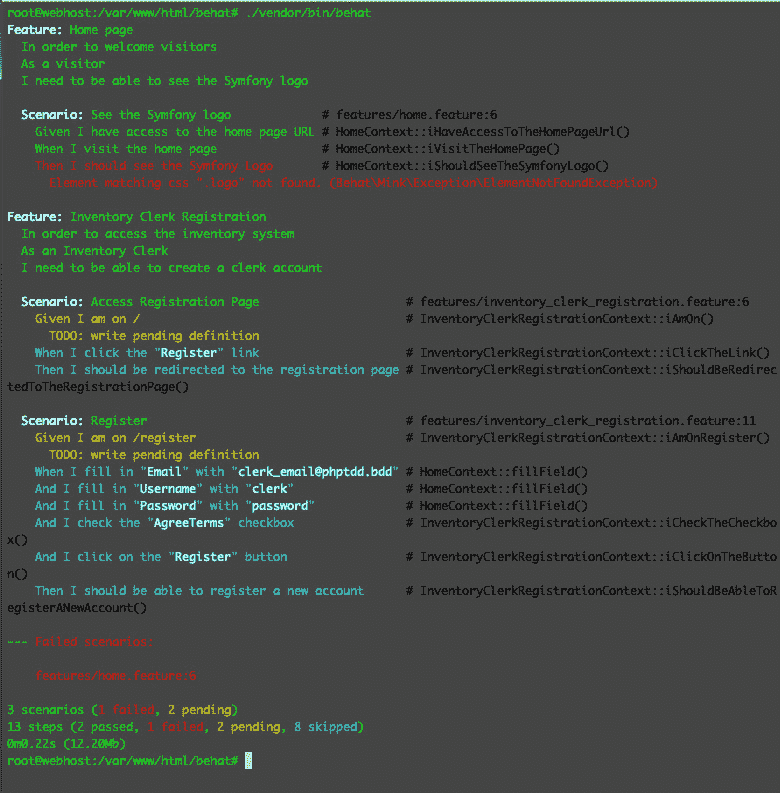

图 7.7 – Behat 失败

你会注意到我们失败了首页功能，跳过了挂起的测试，在这个阶段，我们甚至无法访问首页。这是因为我们还需要为 Symfony 应用程序安装缺失的库。就像我们对 Behat 所做的那样，让我们为 Symfony 应用程序安装缺失的 Composer 包。

1.  运行以下命令：

    ```php
    /var/www/html/symfony# composer install
    ```

1.  在安装缺失的 Symfony 包之后，让我们修改`InventoryClerkRegistrationContext.php`类，以便在`iAmOn`方法上抛出异常：

codebase/behat/features/bootstrap/InventoryClerkRegistrationContext.php

```php
/**
 * @Given I am on \/
 */
public function iAmOn()
{
    throw new \Exception();
}
```

现在，让我们再次尝试运行 Behat，看看我们是否至少能够通过首页功能测试。

1.  通过运行以下命令再次运行 Behat：

    ```php
    /var/www/html/behat# vendor/bin/behat
    ```

现在我们应该能够通过**首页**功能测试，同时仍然无法通过库存管理员功能测试：

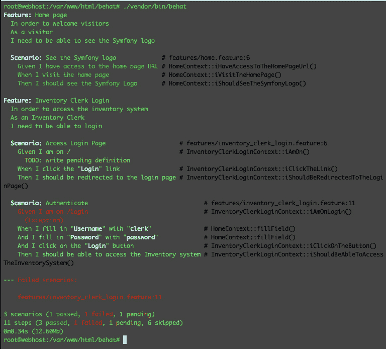

图 7.8 – 首页功能通过，登录失败

由于我们已安装了缺失的 Symfony 包，首页测试现在通过了。但因为我们还没有构建任何解决方案代码来通过登录测试，它将继续失败。

通过遵循红-绿-重构模式，现在我们有一个失败的测试，这是红阶段，我们现在可以继续编写通过这个失败的测试所需的解决方案代码，这是绿阶段。

# 通过 Behat 注册功能

现在我们有几个失败的 Behat 登录功能测试，让我们尝试做最少的努力来完成这个功能，并通过测试。幸运的是，Symfony 使得实现安全性变得容易。我们可以使用`symfony/security-bundle` Composer 包来为我们的应用程序添加身份验证和授权，而无需从头开始构建一切。

你可以在[`symfony.com/doc/current/security.html`](https://symfony.com/doc/current/security.html)上了解更多关于 Symfony 安全文档的信息。

为了通过失败的 Behat 注册功能，因为 Behat 模拟用户使用网络浏览器，我们必须创建所有必要的程序，以便真实用户能够从网络浏览器在我们的应用程序中注册账户，然后击中控制器，服务，然后到数据库持久化过程。让我们从控制器开始。

## 编写失败的控制器测试

在通过我们的主要 Behat 功能测试之前，这些测试也可以被视为功能测试，让我们在我们的 Symfony 应用程序内部编写一些控制器测试。尽管 Behat 测试也会对控制器进行测试，但这些 Symfony 控制器测试将比 Behat 功能测试更简单。

通过阅读我们之前创建的 Behat 注册功能，我们可以轻松地确定我们至少需要两个控制器：主页控制器和注册页面控制器。主页是用户开始旅程的地方，注册页面是职员为新账户注册的地方。

创建以下内容的首页测试类：

codebase/symfony/tests/ Integration /Controller/HomeControllerTest.php

```php
<?php
namespace App\Tests\Integration\Controller;
use Symfony\Bundle\FrameworkBundle\Test\WebTestCase;
class HomeControllerTest extends WebTestCase
{
    public function testCanLoadIndex(): void
    {
        $client = static::createClient();
        $client->request('GET', '/');
        $this->assertResponseIsSuccessful();
    }
}
```

接下来，创建以下内容的注册页面测试类：

codebase/symfony/tests/ Integration /Controller/RegistrationControllerTest.php

```php
<?php
namespace App\Tests\Integration\Controller;
use Symfony\Bundle\FrameworkBundle\Test\WebTestCase;
class RegistrationControllerTest extends WebTestCase
{
    public function testCanLoadRegister(): void
    {
        $client = static::createClient();
        $client->request('GET', '/register');
        $this->assertResponseIsSuccessful();
        $this->markTestIncomplete();
    }
}
```

现在我们已经有了我们将用于通过 Behat 功能测试的主要控制器的测试，让我们首先看看我们是否通过了这些 Symfony 测试。

运行以下命令：

```php
/var/www/html/symfony# php bin/phpunit --testsuite Functional 
```

运行测试后，你应该得到两个失败的测试。我们使用了`--testsuite`参数，以便只执行我们刚刚创建的两个控制器测试。

现在我们知道我们必须通过这两个测试，我们可以继续工作，解决通过它们的问题。在这个阶段，我们处于之前章节中讨论的 Red-Green-Refactor 模式的“红”阶段。

我们现在可以开始着手注册和注册解决方案了。

## 使用 Symfony 实现注册解决方案

使用开源框架的好处是，我们开发者需要为我们的项目构建的许多软件很可能已经被作为开源库或包构建。为了通过失败的注册测试，让我们使用 Symfony 的`security-bundle`包而不是从头开始编写一切。

记住——作为软件开发者，我们不仅仅编写代码。我们开发解决方案。如果存在可以帮助你加快解决方案开发速度的现有包或库，并且如果它们符合你的规格，你可以考虑使用它们而不是从头开始构建代码。

你可以在 Symfony 官方文档页面上了解有关 Symfony 安全解决方案的更多信息：[`symfony.com/doc/current/security.html`](https://symfony.com/doc/current/security.html)。

我们可以通过运行以下命令使用 Symfony 的安全解决方案：

```php
/var/www/html/symfony# php bin/console make:user 
```

阅读提示并输入建议的默认值。

接下来，我们需要设置我们需要的数据库。记住——我们不仅使用一个数据库，还需要一个单独的测试数据库。你可以在*第五章*，*单元测试*中了解更多关于此内容。

### 数据库设置

我们需要创建两个数据库：`cars`和`cars_test`数据库。`cars`数据库将作为我们的主数据库，而`cars_test`数据库将类似于一个副本数据库，我们的自动化测试将使用它。毕竟，你不想在生产数据库上运行数据突变测试。

运行以下命令来设置我们的数据库：

```php
/var/www/html/symfony# php bin/console doctrine:database:create --env=test
/var/www/html/symfony# php bin/console doctrine:database:create
/var/www/html/symfony# php bin/console make:migration
/var/www/html/symfony# php bin/console doctrine:migrations:migrate -n --env=test
/var/www/html/symfony# php bin/console doctrine:migrations:migrate -n
```

正如我们在*第五章*中做的，*单元测试*，我们已经根据`codebase/symfony/src/Entity`目录中找到的 Doctrine 实体创建了我们的 MySQL 数据库和表。

接下来，让我们使用 Symfony 的`security-bundle`包创建一个注册表单。

#### 使用 Symfony 的注册表单

接下来，我们可以使用 Symfony 的注册表单。基本解决方案代码已经在`composer.json`文件中声明了所有依赖项，所以你可以直接运行以下命令来生成注册代码：

```php
/var/www/html/symfony# php bin/console make:registration-form
```

上述命令将生成几个文件，其中之一是`RegistrationController.php`类。如果你打开这个类，你会看到它有一个`register`方法。我们也为这个控制器和方法创建了一个测试。让我们看看它现在是否工作。

运行以下命令：

```php
/var/www/html/symfony# php bin/phpunit --filter RegistrationControllerTest
```

运行测试后，我们现在应该能够通过这个测试：

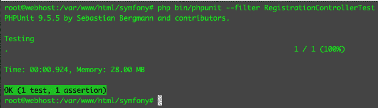

图 7.9 – 通过注册路由测试

在这个阶段，我们处于红-绿-重构模式的“绿色”阶段。这意味着我们完成了注册功能吗？绝对不是。因为我们还没有完成这个测试，通常我会使用 PHPUnit 的`$this->markTestIncomplete();`方法并将其添加到测试类中。这可以帮助提醒开发者测试已经编写，解决方案部分存在，但仍然不完整。现在，请在`codebase/symfony/tests/Functional/Controller/RegistrationControllerTest.php`测试类中的`testCanLoadRegister`方法内添加`$this->markTestIncomplete();`方法。

现在，再次运行测试：

```php
/var/www/html/symfony# php bin/phpunit --filter RegistrationControllerTest
```

你应该看到以下结果：

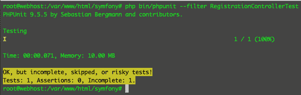

图 7.10 – 不完整的注册路由测试

现在测试被标记为不完整，我们可以在稍后回到它。是否使用这个功能取决于你，但我在处理大型项目时觉得它很有用。唯一我不喜欢的是，有时候它没有失败测试那么吸引我的注意力。现在，让我们移除**不完整**的标记。

#### 创建主页控制器

现在让我们创建一个主页控制器，用户通常会首先到达这里。在这里，我们也会找到用户点击以重定向到**注册**页面的**注册**链接。

通过运行以下命令创建一个主页控制器：

```php
/var/www/html/symfony# php bin/console make:controller HomeController
```

运行那个命令后，我们现在应该有一个新的 Symfony 控制器在`codebase/symfony/src/Controller/HomeController.php`。编辑控制器内的路由，并将`/home`替换为仅一个正斜杠(`/`)。

现在，让我们看看我们的控制器测试是否通过。再次运行 Symfony 功能测试：

```php
/var/www/html/symfony# php bin/phpunit --testsuite Functional --debug
```

你现在应该看到以下结果：

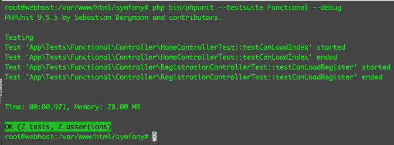

图 7.11 – 通过控制器测试

由于我们的控制器测试非常简单，我们基本上只是在测试路由的页面响应是否成功；我们现在可以确信这两个测试都通过了。但这不会满足 Behat 注册功能测试的要求。所以，让我们继续工作吧！

让我们修改主页控制器的 twig 模板内容。打开以下文件，并将整个`example-wrapper` div 内容替换为以下内容：

codebase/symfony/templates/home/index.html.twig

```php
<div class="example-wrapper">
    <h1>{{ controller_name }}</h1>
    <ul>
        <li><a href="/register" id="lnk-register">
            Register</a> </li>
    </ul>
</div>
```

我们刚刚添加了一个指向注册页面的链接。如果你尝试通过浏览器访问主页，你会看到类似以下的内容：

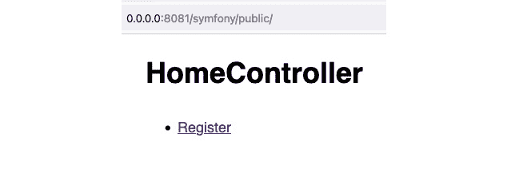

图 7.12 – HomeController

接下来，让我们回到`behat`目录下的 BDD 测试。让我们尝试编写一些测试代码，看看我们是否最终能够注册一个新用户。

## 通过 Behat 功能传递

我们的 Behat 注册功能模拟了用户访问主页，点击注册链接，被重定向到注册页面，填写注册表单，点击**注册**按钮，然后被重定向到某个选定的页面。

这正是手动测试员测试注册功能时会做的事情。而不是手动使用浏览器执行这些步骤，让我们只用 Behat 为我们完成所有这些步骤。

打开以下 Behat 上下文文件，并将内容替换为以下内容：

codebase/behat/features/bootstrap/InventoryClerkRegistrationContext.php

```php
<?php
use Behat\Mink\Mink;
use Behat\Mink\Session;
use Behat\Mink\Driver\GoutteDriver;
use Behat\MinkExtension\Context\MinkContext;
use Behat\MinkExtension\Context\MinkAwareContext;
/**
 * Defines application features from the specific context.
 */
class InventoryClerkRegistrationContext extends MinkContext implements MinkAwareContext
{
    /**
     * Initializes context.
     *
     * Every scenario gets its own context instance.
     * You can also pass arbitrary arguments to the
     * context constructor through behat.yml.
     */
    public function __construct()
    {
        $mink = new Mink([
            'goutte'    => new Session(new GoutteDriver()), // Headless browser
        ]);
        $this->setMink($mink);
        $this->getMink()->getSession('goutte')->start();
    }
}  
```

在前面的片段中，我们从构造函数开始。我们在类中声明了我们将要使用的模拟器和会话对象。

接下来，添加以下代码：

```php
/**
 * @Given I am in the home :arg1 path
 */
public function iAmInTheHomePath($arg1)
{
    $sessionHeadless = $this->getMink()->getSession
        ('goutte');
    $sessionHeadless->visit($arg1);
    // Make sure the register link exists.
    $assertHeadless = $this->assertSession('goutte');
    $assertHeadless->elementExists('css', '#lnk-register');
}
/**
 * @When I click the :arg1 link
 */
public function iClickTheLink($arg1)
{
    $sessionHeadless = $this->getMink()->getSession
        ('goutte');
    $homePage = $sessionHeadless->getPage();
    $homePage->clickLink($arg1);
}
```

上述代码将模拟用户在主页上，然后点击**注册**链接。

在下一个片段中，Behat 将尝试确认它是否被重定向到了注册控制器页面：

```php
/**
 * @Then I should be redirected to the registration page
 */
public function iShouldBeRedirectedToTheRegistrationPage()
{
    // Make sure we are in the correct page.
    $assertHeadless = $this->assertSession('goutte');
    $assertHeadless->pageTextContains('Register');
    $assertHeadless->elementExists('css', '#registration_form_email');
} 
```

你可以通过检查路由来轻松地检查你是否在正确的页面上，但前面的片段显示了你可以检查由控制器返回的 DOM 本身。

接下来，添加以下代码来模拟用户在输入表单中输入值：

```php
/**
 * @When I fill in Email :arg1 with :arg2
 */
public function iFillInEmailWith($arg1, $arg2)
{
    $sessionHeadless = $this->getMink()->getSession
        ('goutte');
    $registrationPage = $sessionHeadless->getPage();
    $registrationPage->fillField($arg1, $arg2);
}
/**
 * @When I fill in Password :arg1 with :arg2
 */
public function iFillInPasswordWith($arg1, $arg2)
{
    $sessionHeadless = $this->getMink()->getSession
        ('goutte');
    $registrationPage = $sessionHeadless->getPage();
    $registrationPage->fillField($arg1, $arg2);
}
```

在前面的片段中，代码模拟了在`Email`和`Password`字段中输入文本。接下来，我们将模拟检查复选框并点击**提交**按钮。添加以下代码：

```php
/**
 * @When I check the :arg1 checkbox
 */
public function iCheckTheCheckbox($arg1)
{
    $sessionHeadless = $this->getMink()->getSession
        ('goutte');
    $registrationPage = $sessionHeadless->getPage();
    $registrationPage->checkField($arg1);
}
/**
 * @When I click on the :arg1 button
 */
public function iClickOnTheButton($arg1)
{
    $sessionHeadless = $this->getMink()->getSession
        ('goutte');
    $registrationPage = $sessionHeadless->getPage();
    $registrationPage->pressButton($arg1);
}
```

在前面的代码中，我们检查了**同意条款**复选框，然后点击了**注册**按钮。

接下来，添加以下代码来完成测试：

```php
/**
 * @Then I should be able to register a new account
 */
public function iShouldBeAbleToRegisterANewAccount()
{
    $sessionHeadless = $this->getMink()->getSession
        ('goutte');
    $thePage = $sessionHeadless->getPage()->getText();
    if (!str_contains($thePage, 'There is already an 
        account with this email')) {
    $assertHeadless = $this->assertSession('goutte');
    $assertHeadless->addressEquals('/home');
}
```

由于在 Symfony 应用中，我们在成功时将用户重定向回主页控制器，因此我们可以检查我们是否被重定向到了主页。你会注意到它还检查了用户是否已经存在；你可以根据需要进一步分解这个测试，以便可以分离出这样的场景。

在前面的代码块中，我们做了以下工作：将`codebase/behat/features/inventory_clerk_registration.feature`文件中的场景分解成 PHP 方法。然后我们编写了 PHP 代码来点击链接和按钮，填充文本字段，勾选复选框等等。

但让我们看看这是否真的有效。运行以下命令来运行此测试：

```php
/var/www/html/behat# ./runBehat.sh --suite=suite_a features/inventory_clerk_registration.feature
```

执行将需要几秒钟，但您应该得到以下结果：

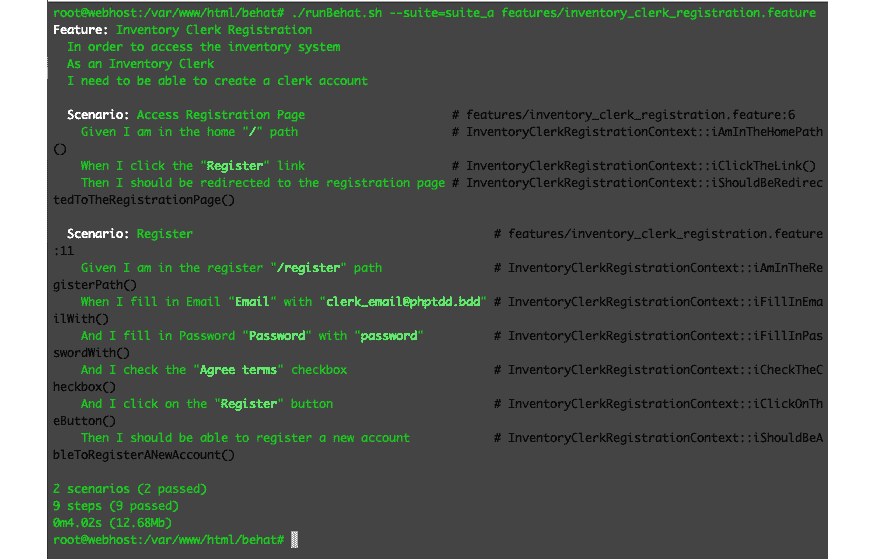

图 7.13 – 注册功能测试

通过运行 Behat 测试，我们可以替换通常从浏览器进行的手动测试过程。但我们需要确认我们是否真的能够注册，并且使用 Doctrine ORM 将数据持久化到我们的 MySQL 数据库中！在这个阶段，我们处于 Red-Green-Refactor 模式的“重构”阶段，我个人认为“重构”阶段可以更加开放和灵活。

您可以使用自己的 MySQL 客户端或我们之前配置的 phpMyAdmin 应用程序（*第三章*，*使用 Docker 容器设置我们的开发环境*），来验证数据。

您可以使用 MySQL 容器中的命令行得到以下结果：

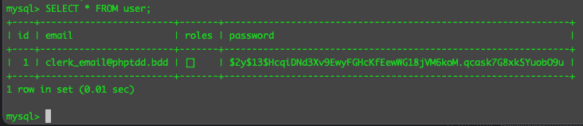

图 7.14 – 用户成功注册：从 CLI 查看

这是我们配置的 phpMyAdmin 应用程序的结果，可以通过本地浏览器在`http://127.0.0.1:3333`访问：

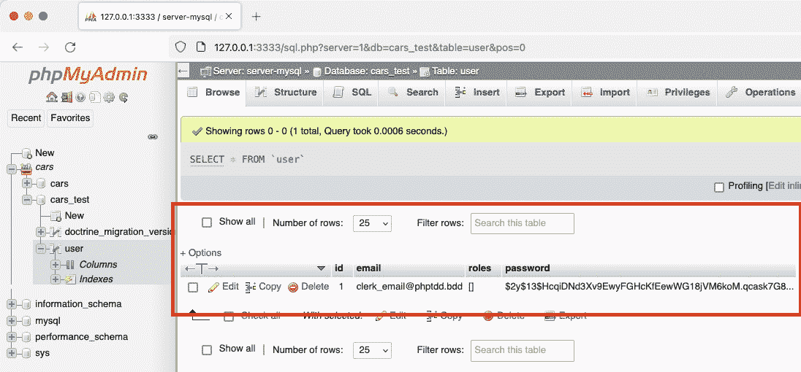

图 7.15 – 用户成功注册：从 phpMyAdmin 查看

从数据库中我们可以看到，我们已经能够持久化注册详情。在这个阶段，我们可以说我们的注册功能是正常工作的！而且我们能够在不手动打开桌面浏览器输入表单详情的情况下对其进行测试。

我们现在有一个 PHP 程序在为我们进行注册功能测试，但我们还需要构建登录功能以及最重要的部分：库存系统本身。我们还有许多其他功能要构建，但这是一个很好的开始！

# 摘要

在本章中，我们首先基于一个 Jira 工作项创建了一个易于理解的特性列表和场景列表，详细说明了需要构建的内容。在着手编写解决方案代码之前，我们首先从 Gherkin 功能“**库存管理员注册**”开始。这个功能可以被任何人阅读——甚至非开发者也能理解它。这个功能解释了我们的系统应该如何表现。然后，我们根据这种行为在 Symfony 应用程序内部创建了简单且失败的函数测试。创建这些失败的测试给我们列出了一些建设内容。然后，我们着手开发解决方案以通过这些失败的函数测试。最后，我们编写了代码来告诉 Behat 如何执行点击链接或按钮以及填写字段的复杂步骤。BDD 和 TDD 不仅关乎编写自动化测试——它关乎将它们作为开发我们解决方案的过程。

在下一章中，我们将继续构建测试和解决方案代码。我们将通过 SOLID 原则来帮助我们结构化自己的代码，以确保代码更易于维护和测试。
