# 8

# 使用 SOLID 原则进行 TDD

当我开始编程时，我立刻沉迷其中。我对于使用程序和自己的想象力来解决问题想出解决方案的想法感到非常兴奋。在学校的时候，有一次老师给我们布置了一个任务，就是使用 Turbo-C 来解决一些简单的代数挑战。当我很快意识到我可以编写程序来反复解决这类挑战时，我感到非常兴奋，甚至起了一身鸡皮疙瘩。编写一次程序，传递不同的参数，得到不同的结果。我喜欢这样。我记得有一个挑战是计算如果有人站在桥上，扔下一个球，几秒钟后听到声音，桥的高度是多少。简单！现在，我可以用我的程序反复计算桥的高度。现在，我不再需要记住地球的重力加速度大约是 9.8 m/s²了——我可以在程序中声明它！我了解到在编程中，我可以遵循自己的规则从 A 点到 B 点。给我一个任务，我可以用自己的想象力想出解决方案来完成这个任务。对我来说，这就是编程最好的地方。我成了一个自豪的意大利面代码编写机器。我不在乎我的代码有多干净——我只需要用代码来解决问题！学习其他编程语言让我更加兴奋，我认为可能性是无限的——如果任务或挑战不违反物理定律，我认为可以用编程来解决！我没有注意代码的整洁性或可维护性。那些是什么？我不需要那些！

当我开始作为软件开发者专业工作时，我继续以仅仅享受使用编程解决问题的心态工作。我不在乎我的解决方案有多不整洁——它们解决了问题，我的雇主和客户都很高兴。完成了，我就可以离开了。太简单了。我认为我知道一切，而且我觉得自己无所不能。哦，我错了。我学得越多，就越意识到我懂得编程的越少。

当我继续与其他开发者一起工作，同时维护这些项目时，我痛苦地意识到，由于编写了自己难以维护的代码，我给自己带来了多大的麻烦。我可能不是地球上唯一经历过这种问题的开发者。我确信其他人之前也遇到过这些问题，我也确信有解决方案。其中一个帮助我生活变得容易的解决方案是尝试遵循**罗伯特·C·马丁**的**SOLID**原则。它们真的帮助改变了我的编程生活，并且使用这些原则与**测试驱动开发**（**TDD**）一起使我的编程生活变得更加容易！还有更多的原则和架构设计模式可以帮助使你的应用程序更易于维护，但在这个章节中，我们将逐个关注 SOLID 原则，并在进行 TDD 的同时进行。

我们将逐步解释将 Jira 工单转换为 BDD 测试的过程，这将反过来帮助我们创建集成测试，直至开发解决方案代码。然后，我们将逐个通过使用 TDD 来介绍每个 SOLID 原则，就像在真实项目中做的那样。

本章将介绍以下主题：

+   Jira 到 BDD 到 TDD

+   基于单一职责原则的 TDD

+   基于开放封闭原则的 TDD

+   基于 Liskov 替换原则的 TDD

+   基于接口分离原则的 TDD

+   基于依赖倒置原则的 TDD

# 技术要求

在本章中，读者需要使用位于[`github.com/PacktPublishing/Test-Driven-Development-with-PHP-8/tree/main/Chapter%208`](https://github.com/PacktPublishing/Test-Driven-Development-with-PHP-8/tree/main/Chapter%208)的仓库中的基础代码。

## 准备本章的开发环境

首先，获取本章的基础代码，该代码位于 https://github.com/PacktPublishing/Test-Driven-Development-with-PHP-8/tree/main/Chapter%206/base/phptdd，或者简单地运行以下命令：

```php
curl -Lo phptdd.zip "https://github.com/PacktPublishing/Test-Driven-Development-with-PHP-8/raw/main/Chapter%208/base.zip" && unzip -o phptdd.zip && cd base && ./demoSetup.sh
```

要运行容器并执行本章中的命令，你应该在 `docker-server-web-1` 容器内部。

运行以下命令以确认我们的 Web 服务器的容器名称：

```php
docker ps
```

要运行容器，从主机机器上的 `/docker` 目录运行以下命令：

```php
docker-compose build && docker-compose up -d
docker exec -it docker-server-web-1 /bin/bash
```

一旦进入容器，运行以下命令通过 `composer` 安装所需的库：

```php
/var/www/html/symfony# ./setup.sh
/var/www/html/behat# ./setup.sh 
```

# Jira 到 BDD 到 TDD

根据罗伯特·C·马丁的定义，SOLID 原则是一套编码指南或标准，有助于开发者编写更组织化、解耦、可维护和可扩展的软件。在本章中，我们将逐一介绍它们，但我们将通过在一个真实项目上工作并实现每个原则来模拟这个过程。

在本章中，我们将编写尝试遵循 SOLID 原则的解决方案代码，但在那之前，我们需要一个要解决的问题的例子。正如我们在*第七章*，“使用 BDD 和 TDD 构建解决方案代码”中所做的那样，我们将从一个 Jira 工单开始，编写一些 Gherkin 特性，编写 Behat 测试，编写集成和单元测试，然后编写如以下流程图所示的遵循 SOLID 原则的解决方案代码：


图 8.1 – 开发流程

让我们使用我们在*第二章*，“理解并组织我们项目的业务需求”中创建的一个 Jira 工单，*理解并组织我们项目的业务需求*。我们创建了一个故事，让登录用户输入并保存一些玩具车型号数据。这将是一个很好的简单功能，用于演示 SOLID 原则：

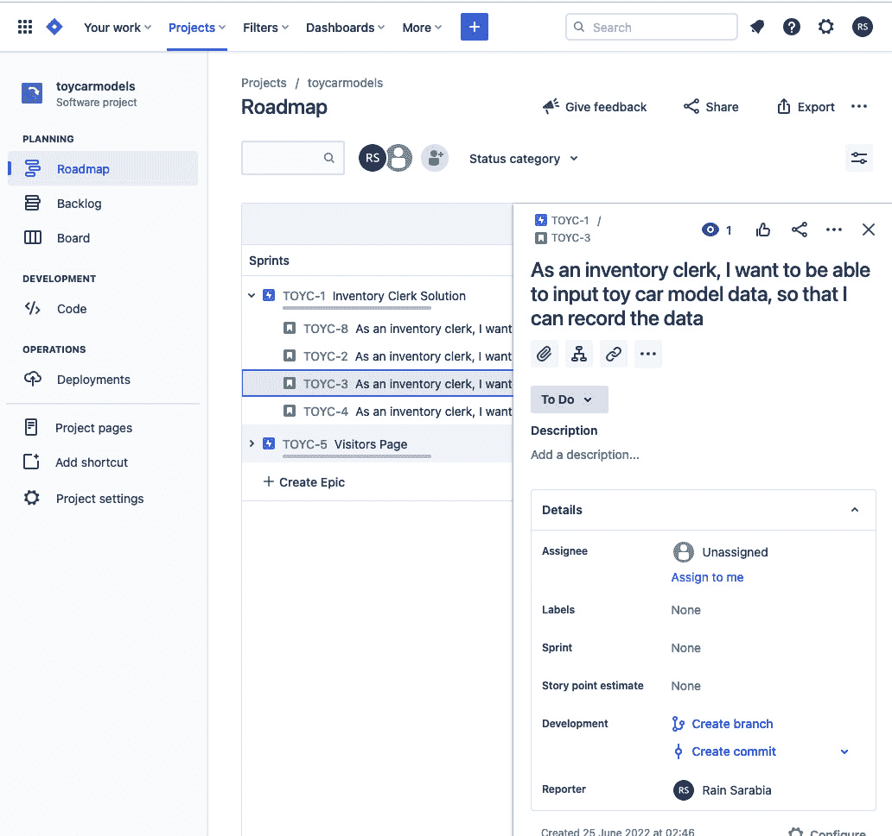

图 8.2 – 创建玩具模型数据的工单

正如我们在*第七章*，*使用 BDD 和 TDD 构建解决方案代码*中做的那样，为你的 Jira 票据创建一个新的 git 分支。从你在*第二章*，*理解和组织我们项目的业务需求*中设置的仓库检出 git 分支，然后让我们开始编写一些测试和程序！

在我们开始学习 SOLID 原则之前，首先，我们需要工作于 BDD 测试，这将引导我们编写遵循 SOLID 原则的解决方案代码。记住，我们始终需要从失败的测试开始。接下来，为了开始使用 BDD，我们需要首先编写一个 Gherkin 功能。

## Gherkin 功能

让我们从编写一个 Gherkin 功能来描述我们期望构建的行为开始。在`behat`目录中创建以下功能文件，并包含以下内容：

codebase/behat/features/create_toy_car_record.feature

```php
Feature: Clerk creates new toy car record
  In order to have a collection of toy car model records
  As an Inventory Clerk
  I need to be able to create a single record
  Scenario: Create new record
    Given I am in the inventory system page
    When I submit the form with correct details
    Then I should see a success message
```

现在我们有了我们的功能，让我们为它生成 Behat PHP 上下文类。

## Behat 上下文

现在，我们将使用 Gherkin 功能并为其创建一个 PHP 上下文类。按照以下步骤操作：

1.  首先，更新`behat.yml`文件：

codebase/behat/behat.yml

```php
default:
  suites:
    default:
      contexts:
        - FeatureContext
        - HomeContext
    suite_a:
      contexts:
        - InventoryClerkRegistrationContext
    suite_create:
      contexts:
        - CreateToyCarRecordContext
```

1.  更新主`behat.yml`文件后，运行以下命令来创建 PHP 上下文类：

    ```php
    /var/www/html/behat# ./vendor/bin/behat --init
    ```

    ```php
    /var/www/html/behat# ./vendor/bin/behat features/
    ```

    ```php
     create_toy_car_record.feature --append-snippets –
    ```

    ```php
     suite=suite_create
    ```

1.  现在应该在`features/bootstrap/CreateToyCarRecordContext.php`中创建了一个新的类。重构`iAmInTheInventorySystemPage`方法，使其抛出`\Exception`。

1.  接下来，让我们确保我们可以通过运行以下命令来执行此功能测试：

    ```php
    /var/www/html/behat# ./vendor/bin/behat features/
    ```

    ```php
    create_toy_car_record.feature --suite=suite_create
    ```

你应该会看到以下测试结果：

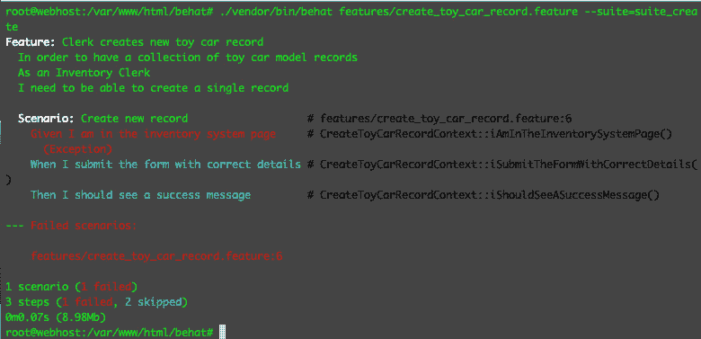

图 8.3 – 失败的测试

好的 – 现在，我们知道这个功能的 Behat 测试可以执行并且如预期那样失败，所以让我们继续到 Symfony 应用程序。

## 功能测试

我们创建的 Behat 测试已经是一个功能测试 – 我们是否还需要在 Symfony 目录中创建一个功能测试？我认为这是可选的，但它将帮助我们快速运行基本烟雾测试 – 例如，如果我们想快速检查我们的控制器是否加载并且没有遇到致命错误。我们不需要运行更大、更慢的 Behat 测试来找出这一点：

1.  创建以下测试类，并包含以下内容：

codebase/symfony/tests/Functional/Controller/InventoryAdminControllerTest.php

```php
<?php
namespace App\Tests\Functional\Controller;
use Symfony\Bundle\FrameworkBundle\Test\WebTestCase;
class InventoryControllerTest extends WebTestCase
{
    public function testCanLoadIndex(): void
    {
        $client     = static::createClient();
        $client->request(‘GET’, ‘/inventory-admin’);
        $this->assertResponseIsSuccessful();
    }
}
```

1.  在创建我们的控制器测试类之后，让我们运行以下命令以确保 PHPUnit 可以执行此测试并且它失败：

    ```php
    /var/www/html/symfony# ./vendor/bin/phpunit --filter 
    ```

    ```php
     InventoryAdminControllerTest
    ```

在运行测试后，请确保你得到一个测试失败。还记得那个红色阶段吗？

太好了 – 我们现在可以暂时忘记创建控制器了。让我们继续到集成测试。这些测试将用于开发将玩具车模型持久化到数据库的机制。

## 集成测试

我们现在需要开始编写集成测试，这将帮助我们编写代码以持久化或创建一个新的玩具车模型。通过通过这些测试后，然后我们可以回到我们之前创建的 Behat 测试，并确保它们通过：

1.  创建以下测试类，内容如下：

codebase/symfony/tests/Integration/Processor/ToyCarProcessorTest.php

```php
<?php
namespace App\Tests\Integration\Repository;
use Symfony\Bundle\FrameworkBundle\Test\
    KernelTestCase;
class ToyCarProcessorTest extends KernelTestCase
{
    public function testCanCreate()
    {
        $this->fail(“--- RED ---”);
    }
}
```

1.  在创建测试类后，确保 PHPUnit 可以通过运行以下命令识别新的测试类：

    ```php
    /var/www/html/symfony# ./vendor/bin/phpunit --filter ToyCarRepositoryTest
    ```

1.  运行命令后，你应该看到熟悉的、令人安慰的 PHPUnit 失败结果：

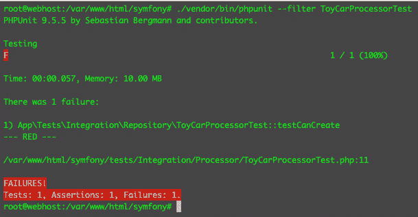

图 8.4 – 失败的处理器测试

现在我们有一个失败的集成测试，让我们构建代码来通过它。我们希望能够将新的玩具车模型持久化到持久层，也就是我们的数据库。我们甚至有为其创建的 DB 表吗？没有，还没有。但我们不在乎。我们可以继续工作在解决方案代码上。接下来，我们将尝试遵循**单一职责原则**（**SRP**）来编写我们的解决方案代码。

# 使用单一职责原则进行 TDD（测试驱动开发）

让我们从我认为在 SOLID 原则中最重要的一条原则开始。你对上帝类或对象熟悉吗——一个类可以几乎做任何事情？一个用于登录、注册、显示已注册用户等的单一类？如果有两个开发者正在同一个上帝类上工作，你能想象这会有多具挑战性吗？而且，当你将其部署到生产环境中并发现显示已注册用户列表的部分有问题时，会发生什么？你将不得不更改或修复那个上帝类，但现在用于登录和注册的同一个类已经被修改，这些流程也可能受到影响。仅仅尝试修复已注册用户列表，就有可能引入登录和注册功能的回归。你修复了一个功能，但打破其他功能的可能性更大。

这就是 SRP 开始变得有意义的地方。SRP 规定，一个类应该只有一个主要职责，以及一个改变的理由。这很简单吗？有时并不简单。一个`Login`类应该只了解让用户登录，而不应该让程序负责显示已注册用户列表或检查购物车，但有时在哪里划线可能非常主观。

接下来，我们将开始编写实际的解决方案代码，同时尝试实现 SRP（单一职责原则）。

## 编写解决方案代码

我们有一个失败的测试，用于测试我们的应用程序是否能够创建一个玩具车模型并将其持久化到数据库中，但我们还没有为它创建数据库表。没关系——我们现在只关注 PHP 方面的事情。

### 模型类

对于我们的处理器 PHP 类来说，处理对象而不是直接了解数据库表行等会更好。让我们创建一个**普通 PHP 对象**（**POPO**），它将代表玩具汽车模型，而不关心数据库结构：

1.  创建以下文件，内容如下：

codebase/symfony/src/Model/ToyCar.php

```php
<?php
namespace App\Model;
class ToyCar
{
    /**
     * @var int
     */
    private $id;
    /**
     * @var string
     */
    private $name;
    /**
     * @var CarManufacturer
     */
    private $manufacturer;
    /**
     * @var ToyColor
     */
    private $colour;
    /**
     * @var int
     */
    private $year; 
}
```

在声明属性后，最好为所有这些属性生成访问器和修改器，而不是直接访问它们。

如您所见，这只是一个 POPO 类。没有任何关于如何在我们的数据库中持久化的信息。它的职责只是作为一个代表玩具汽车的模型。

1.  让我们再创建`CarManufacturer`和`ToyColor`模型。创建以下类，内容如下：

codebase/symfony/src/Model/ToyColor.php

```php
<?php
namespace App\Model;
class ToyColor
{
    /**
     * @var int
     */
    private $id;
    /**
     * @var string
     */
    private $name; 
}
```

在声明属性后，为这个类生成访问器和修改器。

1.  以下为汽车制造商的示例：

codebase/symfony/src/Model/CarManufacturer.php

```php
<?php
namespace App\Model;
class CarManufacturer
{
    /**
     * @var int
     */
    private $id;
    /**
     * @var string
     */
    private $name; 
}
```

现在，也为这个类生成访问器和修改器。

现在，我们有主要的`ToyCar`模型，它也使用了`ToyColor`和`CarManufacturer`模型。如您所见，与`ToyCar`模型一样，这两个类也不负责持久化或读取数据。

如您所记，我们正在使用 Doctrine ORM 作为与数据库交互的工具。如果我们想的话，我们也可以在我们的处理器类中直接使用 Doctrine 实体，但这意味着我们的处理器类现在将使用一个依赖于 Doctrine 的类。如果我们需要使用不同的 ORM 呢？为了使事情稍微不那么耦合，我们将在我们即将创建的处理器类中使用`codebase/symfony/src/Model/ToyCar.php`。

### 处理器类

为了创建和持久化玩具汽车模型，我们需要一个类来为我们处理它。问题是，在这个阶段我们还没有数据库——我们该在哪里持久化玩具汽车模型？目前还没有地方，但我们仍然可以通过测试：

1.  创建以下接口，内容如下：

codebase/symfony/src/DAL/Writer/WriterInterface.php

```php
<?php
namespace App\DAL\Writer;
interface WriterInterface
{
    /**
     * @param $model
     * @return bool
     */
    public function write($model): bool;
}
```

我们创建了一个非常简单的接口，我们的数据写入对象可以实现。然后我们将使用这个接口来处理我们的处理器类。

1.  现在，让我们创建玩具汽车工作流程或处理器类。创建以下类，内容如下：

codebase/symfony/src/Processor/ToyCarProcessor.php

```php
<?php
namespace App\Processor;
use App\DAL\Writer\WriterInterface;
use App\Model\ToyCar;
use App\Validator\ToyCarValidationException;
class ToyCarProcessor
{
    /**
     * @var WriterInterface
     */
    private $dataWriter;
    /**
     * @param ToyCar $toyCar
     * @return bool
     * @throws ToyCarValidationException
     */
    public function create(ToyCar $toyCar)
    {
        // Do some validation here
        $this->validate($toyCar);
        // Write the data
        $result = $this->getDataWriter()->
            write($toyCar);
        // Do other stuff.
        return $result;
    }
    /**
     * @param ToyCar $toyCar
     * @throws ToyCarValidationException
     */
    public function validate(ToyCar $toyCar)
    {
        if (is_null($toyCar->getName())) {
            throw new ToyCarValidationException
                (‘Invalid Toy Car Data’);
        }
    }
    /**
     * @return WriterInterface
     */
    public function getDataWriter(): WriterInterface
    {
        return $this->dataWriter;
    }
    /**
     * @param WriterInterface $dataWriter
     */
    public function setDataWriter(WriterInterface 
        $dataWriter): void
    {
        $this->dataWriter = $dataWriter;
    }
}
```

我们创建了一个处理器类，它有一个`create`方法，接受我们之前创建的玩具汽车模型，然后尝试使用一个不存在的写入类实例来写入模型。如果贵公司的另一位开发者正在处理数据写入类，并且需要两周时间才能完成，你会等待两周来通过集成测试吗？

如果你的处理器类必须在数据写入数据库后验证数据并执行其他操作，那么这些程序是否也应该因为你在等待其他开发者完成他们的工作而延迟？可能不是！我们可以使用测试替身来暂时替换缺失的依赖项。

#### 测试替身

大多数时候，要运行一个针对具有所有已构建依赖项的功能的测试是困难的或不切实际的。有时，我们需要一个解决方案来测试我们想要的特定功能，即使我们还没有构建其他依赖项，或者只是想隔离或仅关注某个特定功能。在这里，我们可以使用测试替身。你可以在[`phpunit.readthedocs.io/en/9.5/test-doubles.html`](https://phpunit.readthedocs.io/en/9.5/test-doubles.html)了解更多关于 PHPUnit 测试替身的信息。

#### 模拟和存根

我们刚刚创建的处理器类需要一个`ToyValidatorInterface`和`WriterInterface`的具体实例。由于我们还没有创建这些类，我们仍然可以通过使用`Mock`对象来通过测试。在 PHPUnit 中，`Mock`对象是一个扩展了`Stub`接口的接口。这意味着在代码中，`Mock`对象是`Stub`接口的一个实现。用`Mock`对象替换`ToyValidatorInterface`和`WriterInterface`的实例，并在执行特定方法时设置`return`值的过程称为存根（stubbing）。让我们实际尝试一下：

1.  返回到`ToyCarProcessorTest`类，并使用以下内容重构它：

codebase/symfony/tests/Integration/Processor/ToyCarProcessorTest.php

```php
<?php
namespace App\Tests\Integration\Repository;
use App\DAL\Writer\WriterInterface;
use App\Model\CarManufacturer;
use App\Model\ToyCar;
use App\Model\ToyColor;
use App\Processor\ToyCarProcessor;
use Symfony\Bundle\FrameworkBundle\Test\
    KernelTestCase;
class ToyCarProcessorTest extends KernelTestCase
{
    /**
     * @param ToyCar $toyCarModel
     * @throws \App\Validator
         \ToyCarValidationException
     * @dataProvider provideToyCarModel
     */
    public function testCanCreate
       (ToyCar $toyCarModel): void
    {
        // Mock: Data writer
        $toyWriterStub = $this->createMock
            (WriterInterface::class);
        $toyWriterStub
            ->method(‘write’)
            ->willReturn(true);
        // Processor Class
        $processor = new ToyCarProcessor();
        $processor->setDataWriter($toyWriterStub);
        // Execute
        $result = $processor->create($toyCarModel);
        $this->assertTrue($result);
    }
    public function provideToyCarModel(): array
    {
        // Toy Car Color
        $toyColor = new ToyColor();
        $toyColor->setName(‘Black’);
        // Car Manufacturer
        $carManufacturer = new CarManufacturer();
        $carManufacturer->setName(‘Ford’);
        // Toy Car
        $toyCarModel = new ToyCar();
        $toyCarModel->setName(‘Mustang’);
        $toyCarModel->setColour($toyColor);
        $toyCarModel->setManufacturer
            ($carManufacturer);
        $toyCarModel->setYear(1968);
        return [
            [$toyCarModel],
        ];
    }
}
```

在这里的`testCanCreate`函数中，我们正在为`ValidationModel`、`ToyCarValidator`和`ToyCarWriter`类创建模拟对象。然后我们实例化主要的`ToyCarCreator`类，并将模拟的`ToyCarValidator`和`ToyCarWriter`类传递给其构造函数。这被称为依赖注入，将在本章后面进一步讨论。最后，我们运行`ToyCarCreator`的`create`方法来模拟开发者尝试创建一个新的玩具车记录：

1.  让我们通过输入以下命令来运行测试，看看我们会得到什么结果：

    ```php
    /var/www/html/symfony# ./vendor/bin/phpunit --filter ToyCarProcessorTest
    ```

你应该会看到以下结果：

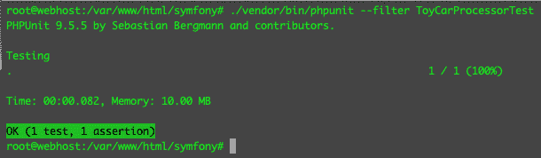

图 8.5 – 使用存根通过了测试

我们通过了测试，尽管我们还没有在数据库中真正持久化任何内容。在更大、更复杂的项目中，你可能会不得不依赖于测试替身（test doubles）来隔离并专注于你的测试，即使其他依赖项尚未构建，或者太复杂以至于无法作为测试的一部分包含在内。

现在回到 SRP（单一职责原则），我们的`ToyCarProcessor`现在有两个职责 – 验证和创建玩具车模型。同样，其他开发者也在使用你的类的`validate`方法。让我们重构我们的代码，重新定义`ToyCarProcessor`类的焦点和职责：

1.  重命名以下类：

    +   将`ToyCarProcessor.php`重命名为`ToyCarCreator.php`

    +   将`ToyCarProcessorTest.php`重命名为`ToyCarCreatorTest.php`

1.  接下来，让我们重构`ToyCarCreatorTest.php`类。打开以下类，并将其内容替换为以下内容：

codebase/symfony/tests/Integration/Processor/ToyCarCreatorTest.php

```php
<?php
namespace App\Tests\Integration\Repository;
use App\DAL\Writer\WriterInterface;
use App\Model\CarManufacturer;
use App\Model\ToyCar;
use App\Model\ToyColor;
use App\Processor\ToyCarCreator;
use App\Validator\ValidatorInterface;
use Symfony\Bundle\FrameworkBundle\Test\KernelTestCase;
class ToyCarCreatorTest extends KernelTestCase
{
    /**
     * @param ToyCar $toyCarModel
     * @throws \App\Validator
         \ToyCarValidationException
     * @dataProvider provideToyCarModel
     */
    public function testCanCreate
        (ToyCar $toyCarModel): void
    {
        // Mock 1: Validator
        $validatorStub = $this->createMock
            (ValidatorInterface::class);
        $validatorStub
            ->method(‘validate’)
            ->willReturn(true);
        // Mock 2: Data writer
        $toyWriterStub = $this->createMock
            (WriterInterface::class);
        $toyWriterStub
            ->method(‘write’)
            ->willReturn(true);
        // Processor Class
        $processor = new ToyCarCreator();
        $processor->setValidator($validatorStub);
        $processor->setDataWriter($toyWriterStub);
        // Execute
        $result = $processor->create($toyCarModel);
        $this->assertTrue($result);
    }
    public function provideToyCarModel(): array
    {
        // Toy Car Color
        $toyColor = new ToyColor();
        $toyColor->setName(‘Black’);
        // Car Manufacturer
        $carManufacturer = new CarManufacturer();
        $carManufacturer->setName(‘Ford’);
        // Toy Car
        $toyCarModel = new ToyCar();
        $toyCarModel->setName(‘Mustang’);
        $toyCarModel->setColour($toyColor);
        $toyCarModel->setManufacturer
            ($carManufacturer);
        $toyCarModel->setYear(1968);
        return [
            [$toyCarModel],
        ];
    }
}
```

如您所见，我们添加了一个新的`Mock`对象用于验证。我将在重构`ToyCarCreator.php`类的内容后解释为什么我们必须这样做。让我们创建一个验证器接口，然后重构`ToyCarCreator`类。

1.  创建以下文件，并包含以下内容：

codebase/symfony/src/Validator/ValidatorInterface.php

```php
<?php
namespace App\Validator;
interface ValidatorInterface
{
    /**
     * @param $input
     * @return bool
     * @throws ToyCarValidationException
     */
    public function validate($input): bool;
}
```

1.  打开`codebase/symfony/src/Processor/ToyCarCreator.php`，并使用以下内容：

    ```php
    <?php
    ```

    ```php
    namespace App\Processor;
    ```

    ```php
    use App\DAL\Writer\WriterInterface;
    ```

    ```php
    use App\Model\ToyCar;
    ```

    ```php
    use App\Validator\ToyCarValidationException;
    ```

    ```php
    use App\Validator\ValidatorInterface;
    ```

    ```php
    class ToyCarCreator
    ```

    ```php
    {
    ```

    ```php
        /**
    ```

    ```php
         * @var ValidatorInterface
    ```

    ```php
         */
    ```

    ```php
        private $validator;
    ```

    ```php
        /**
    ```

    ```php
         * @var WriterInterface
    ```

    ```php
         */
    ```

    ```php
        private $dataWriter;
    ```

    ```php
        /**
    ```

    ```php
         * @param ToyCar $toyCar
    ```

    ```php
         * @return bool
    ```

    ```php
         * @throws ToyCarValidationException
    ```

    ```php
         */
    ```

    ```php
        public function create(ToyCar $toyCar): bool
    ```

    ```php
        {
    ```

    ```php
            // Do some validation here and so on...
    ```

    ```php
            $this->getValidator()->validate($toyCar);
    ```

    ```php
            // Write the data
    ```

    ```php
            $result = $this->getDataWriter()->write
    ```

    ```php
                ($toyCar);
    ```

    ```php
            // Do other stuff.
    ```

    ```php
            return $result;
    ```

    ```php
        }
    ```

    ```php
    }
    ```

接下来，为我们在类中声明的私有属性添加必要的访问器和修改器。

我们只是将类重命名，使其具有更具体的名称。有时，只是将类的名称改为其他名称就可以帮助你清理代码。此外，您会注意到我们已经删除了公开可见的`validate`类。这个类将不再包含任何验证逻辑 – 它只知道在尝试持久化数据之前将运行一个验证例程。这是这个类的主要职责。

我们还没有编写任何验证和数据持久化代码，但让我们看看我们是否还能通过测试来测试类的主体职责，即执行以下操作：

1.  接受一个`ToyCar`模型对象。

1.  运行验证例程。

1.  尝试持久化数据。

1.  返回结果。

1.  运行以下命令：

    ```php
    /var/www/html/symfony# ./vendor/bin/phpunit --filter ToyCarCreatorTest
    ```

现在，你应该看到以下结果：

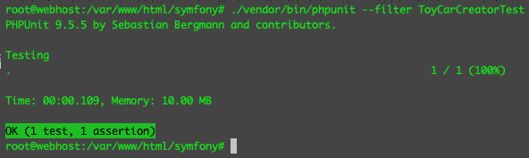

图 8.6 – 使用两个存根通过测试

在本节中，我们使用了 BDD 和 TDD 来指导我们编写解决方案代码。我们创建了具有单一职责的 POPOs。我们还创建了一个`ToyCarCreator`类，该类不包含验证逻辑，也不包含持久化机制。它知道它需要执行一些验证和一些持久化，但没有这些程序的具体实现。每个类都将有自己的专业化或特定的工作，或特定的单一职责。

太好了 – 现在即使在重构之后，我们也能再次通过测试。接下来，让我们继续编写解决方案代码，遵循 SOLID 原则中的 O（开闭）原则，即**开闭原则**（**OCP**）。

# 基于开闭原则的 TDD

OCP（开闭原则）最初由**伯纳德·迈耶**定义，但在这章中，我们将遵循**罗伯特·C·马丁**定义的后续版本，也称为多态 OCP。

OCP 原则指出，对象应该对扩展开放，对修改封闭。目标是我们应该能够通过扩展原始代码来修改行为或功能，而不是直接重构原始代码。这很好，因为它将帮助我们这些开发者和测试者对我们正在处理的工单更有信心，因为我们没有触及可能被其他地方使用的原始代码——降低回归的风险。

在我们的`ToyCarCreateTest`类中，我们正在模拟一个验证对象，因为我们还没有编写具体的验证类。实现验证的方法有很多种，但在这个例子中，我们将尝试让它非常简单。让我们回到代码中创建一个验证器：

1.  创建一个新的测试类，内容如下：

codebase/symfony/tests/Unit/Validator/ToyCarValidatorTest.php

```php
<?php
namespace App\Tests\Unit\Validator;
use App\Model\CarManufacturer;
use App\Model\ToyCar;
use App\Model\ToyColor;
use App\Validator\ToyCarValidator;
use PHPUnit\Framework\TestCase;
class ToyCarValidatorTest extends TestCase
{
    /**
     * @param ToyCar $toyCar
     * @param bool $expected
     * @dataProvider provideToyCarModel
     */
    public function testCanValidate(ToyCar $toyCar, 
        bool $expected): void
    {
        $validator  = new ToyCarValidator();
        $result     = $validator->validate($toyCar);
        $this->assertEquals($expected, $result);
    }
    public function provideToyCarModel(): array
    {
        // Toy Car Color
        $toyColor = new ToyColor();
        $toyColor->setName(‘White’);
        // Car Manufacturer
        $carManufacturer = new CarManufacturer();
        $carManufacturer->setName(‘Williams’);
        // Toy Car
        $toyCarModel = new ToyCar();
        $toyCarModel->setName(‘’); // Should fail.
        $toyCarModel->setColour($toyColor);
        $toyCarModel->setManufacturer
            ($carManufacturer);
        $toyCarModel->setYear(2004);
        return [
            [$toyCarModel, false],
        ];
    }
}
```

在创建测试类之后，像往常一样，我们需要运行测试以确保 PHPUnit 能够识别你的测试。

1.  运行以下命令：

    ```php
    /var/www/html/symfony# ./vendor/bin/phpunit --testsuite=Unit --filter ToyCarValidatorTest 
    ```

确保你得到一个错误，因为我们还没有创建验证器类。还记得红色阶段吗？你会注意到在数据提供者中，我们为名称设置了一个空字符串。我们将使验证器类在看到玩具汽车名称为空字符串时返回`false`。

1.  现在，我们已经有了失败的测试，让我们继续创建一个类来通过它。创建一个新的 PHP 类，内容如下：

codebase/symfony/src/Validator/ToyCarValidator.php

```php
<?php
namespace App\Validator;
use App\Model\ToyCar;
class ToyCarValidator
{
    public function validate(ToyCar $toyCar): bool
    {
        if (!$toyCar->getName()) {
            return false;
        }
        return true;
    }
}
```

我们创建了一个非常简单的验证逻辑，我们只检查玩具汽车的名称是否不为空字符串。现在，让我们再次运行测试。

1.  运行以下命令：

    ```php
    /var/www/html/symfony# ./runDebug.sh --testsuite=Unit --filter ToyCarValidatorTest
    ```

你现在应该看到一个通过测试。

好吧，所以现在我们可以确保玩具汽车型号的名称应该始终是一个非空字符串——但是这里的问题是，如果我们想添加更多的验证逻辑怎么办？我们将不得不继续修改`ToyCarValidator`类。这并没有错。只是我们认为遵循 OCP 更好，这样我们就不需要修改我们的代码——减少类修改，降低破坏事物的风险。让我们重构我们的解决方案代码以通过测试：

1.  让我们为年份添加一些验证逻辑，并保留玩具汽车的名称验证。

1.  目前，我们处于绿色阶段，正在转向重构阶段。我们将使用多态性，这在*第四章*中讨论过，即使用 PHP 面向对象编程，而不是在这个解决方案中使用继承。创建以下接口并包含以下内容：

codebase/symfony/src/Validator/ToyCarValidatorInterface.php

```php
<?php
namespace App\Validator;
use App\Model\ToyCar;
use App\Model\ValidationModel;
interface ToyCarValidatorInterface
{
    public function validate(ToyCar $toyCar): 
        ValidationModel;
}
```

1.  我们创建了一个新的`ToyCarValidatorInterface`接口，它将取代`ToyCarValidator`具体类。你会注意到验证方法返回了一个对象——让我们也创建这个对象：

codebase/symfony/src/Model/ValidationModel.php

```php
<?php
namespace App\Model;
class ValidationModel
{
    /**
     * @var bool
     */
    private $valid = false;
    /**
     * @var array
     */
    private $report = [];
}
```

在创建类之后，为属性生成访问器和修改器。

在我们的验证程序中，我们不仅可以简单地返回`true`或`false`，现在还可以返回一个包含字段名和该字段名的验证结果的数组。让我们继续编码。

1.  创建以下测试类，内容如下：

codebase/symfony/tests/Unit/Validator/ToyCarValidatorTest.php

```php
<?php
namespace App\Tests\Unit\Validator;
use PHPUnit\Framework\TestCase;
use App\Validator\YearValidator;
class YearValidatorTest extends TestCase
{
    /**
     * @param $data
     * @param $expected
     * @dataProvider provideYear
     */
    public function testCanValidateYear(int $year, 
        bool $expected): void
    {
        $validator  = new YearValidator();
        $isValid    = $validator->validate($year);
        $this->assertEquals($expected, $isValid);
    }
    /**
     * @return array
     */
    public function provideYear(): array
    {
        return [
            [1,     false],
            [2005,  true],
            [1955,  true],
            [312,   false],
        ];
    }
}
```

1.  如果你运行这个测试，你会看到四个失败，因为我们有四个`provideYear`数据提供者中的值集。通过以下命令运行测试：

    ```php
    /var/www/html/symfony# ./runDebug.sh --testsuite=Unit --filter YearValidatorTest --debug
    ```

如果测试失败，那很好。让我们继续编写解决方案代码：

1.  创建以下解决方案类，内容如下：

codebase/symfony/src/Validator/YearValidator.php

```php
<?php
namespace App\Validator;
class YearValidator implements ValidatorInterface
{
    /**
     * @param $input
     * @return bool
     */
    public function validate($input): bool
    {
        if (preg_match(“/^(\d{4})$/”, $input, 
            $matches)) {
            return true;
        }
        return false;
    }
}
```

现在，我们有一个简单的验证类，用于检查年份是否适合我们的汽车。如果我们想在这里添加更多逻辑，例如检查最小和最大可接受值，我们可以将所有这些逻辑都放在这里。

1.  再次运行以下命令，看看测试是否通过：

    ```php
    /var/www/html/symfony# ./runDebug.sh --testsuite=Unit --filter YearValidatorTest --debug
    ```

你应该看到以下结果：

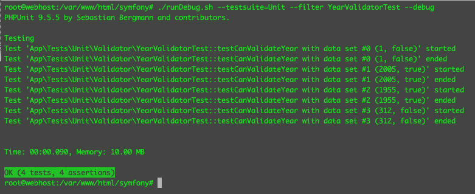

图 8.7 – 简单日期验证测试

现在我们已经通过了年份验证器的非常简单的测试，接下来，让我们继续到名称验证器：

1.  创建以下测试类，内容如下：

codebase/symfony/tests/Unit/Validator/NameValidatorTest.php

```php
<?php
namespace App\Tests\Unit\Validator;
use App\Validator\NameValidator;
use PHPUnit\Framework\TestCase;
class NameValidatorTest extends TestCase
{
    /**
     * @param $data
     * @param $expected
     * @dataProvider provideNames
     */
    public function testCanValidateName(string $name, 
        bool $expected): void
    {
        $validator  = new NameValidator();
        $isValid    = $validator->validate($name);
        $this->assertEquals($expected, $isValid);
    }
    /**
     * @return array
     */
    public function provideNames(): array
    {
        return [
            [‘’,            false],
            [‘$50’,         false],
            [‘Mercedes’,    true],
            [‘RedBull’,     true],
            [‘Williams’,    true],
        ];
    }
}
```

1.  与年份验证器一样，如果你现在运行这个测试，你会遇到多个错误，但我们必须确保它确实失败或出错。运行以下命令：

    ```php
    /var/www/html/symfony# ./runDebug.sh --testsuite=Unit --filter NameValidatorTest
    ```

1.  运行命令后，你应该看到五个错误。这没关系。现在让我们为它构建解决方案代码。创建以下类，内容如下：

codebase/symfony/src/Validator/NameValidator.php

```php
<?php
namespace App\Validator;
class NameValidator implements ValidatorInterface
{
    public function validate($input): bool
    {
        if (preg_match(“/^([a-zA-Z’ ]+)$/”, $input)) {
            return true;
        }
        return false;
    }
}
```

1.  现在，我们有一个简单的逻辑来验证名称。让我们再次运行名称验证器测试，看看它是否通过。再次运行以下命令：

    ```php
    /var/www/html/symfony# ./runDebug.sh --testsuite=Unit --filter NameValidatorTest
    ```

你现在应该看到五个通过测试。

让我们总结一下到目前为止我们添加了什么。我们创建了两个新的验证类，并且根据我们的单元测试，它们都按预期工作 - 但这比我们最初创建的解决方案好在哪里？这与 OCP 有什么关系？首先，我们需要将这些事情联系起来，并通过更大的`ToyCarValidatorTest`。

1.  让我们使用以下内容重构`ToyCarValidator`类：

codebase/symfony/src/Validator/ToyCarValidator.php

```php
<?php
namespace App\Validator;
use App\Model\ToyCar;
use App\Model\ValidationModel as ValidationResult;
class ToyCarValidator implements 
    ToyCarValidatorInterface
{
    /**
     * @var array
     */
    private $validators = [];
    public function __construct()
    {
        $this->setValidators([
            ‘year’  => new YearValidator(),
            ‘name’  => new NameValidator(),
        ]);
    }
    /**
     * @param ToyCar $toyCar
     * @return ValidationResult
     */
    public function validate(ToyCar $toyCar
        ValidationResult
    {
        $result     = new ValidationResult();
        $allValid   = true;
        foreach ($this->getValidators() as $key => 
            $validator) {
            $accessor   = ‘get’ . ucfirst(strtolower
                ($key));
            $value      = $toyCar->$accessor();
            $isValid    = false;
            try {
                $isValid = $validator->validate
                    ($value);
                $results[$key][‘message’]   = ‘’;
            } catch (ToyCarValidationException $ex) {
                $results[$key][‘message’]   = $ex->
                    getMessage();
            } finally {
                $results[$key][‘is_valid’]  = 
                     $isValid;
            }
            if (!$isValid) {
                $allValid = false;
            }
        }
        $result->setValid($allValid);
        $result->setReport($results);
        return $result;
    }
}
```

然后，为`$validators`属性生成访问器和修改器。

1.  你会注意到在构造函数中，我们实例化了两个验证类，在`validate`方法中使用了这些验证类。每个验证类都将有自己的自定义逻辑来运行`validate`方法。现在，使用以下内容重构以下测试类：

codebase/symfony/tests/Unit/Validator/ToyCarValidatorTest.php

```php
<?php
namespace App\Tests\Unit\Validator;
use App\Model\CarManufacturer;
use App\Model\ToyCar;
use App\Model\ToyColor;
use App\Validator\ToyCarValidator;
use PHPUnit\Framework\TestCase;
class ToyCarValidatorTest extends TestCase
{
    /**
     * @param ToyCar $toyCar
     * @param array $expected
     * @dataProvider provideToyCarModel
     */
    public function testCanValidate(ToyCar $toyCar, 
        array $expected): void
    {
        $validator  = new ToyCarValidator();
        $result     = $validator->validate($toyCar);
        $this->assertEquals($expected[‘is_valid’], 
            $result->isValid());
        $this->assertEquals($expected[‘name’], 
            $result->getReport()[‘name’][‘is_valid’]);
        $this->assertEquals($expected[‘year’], 
            $result->getReport()[‘year’][‘is_valid’]);
    }
    public function provideToyCarModel(): array
    {
        // Toy Car Color
        $toyColor = new ToyColor();
        $toyColor->setName(‘White’);
        // Car Manufacturer
        $carManufacturer = new CarManufacturer();
        $carManufacturer->setName(‘Williams’);
        // Toy Car
        $toyCarModel = new ToyCar();
        $toyCarModel->setName(‘’); // Should fail.
        $toyCarModel->setColour($toyColor);
        $toyCarModel->setManufacturer
            ($carManufacturer);
        $toyCarModel->setYear(2004);
        return [
            [$toyCarModel, [‘is_valid’ => false, 
                ‘name’ => false, ‘year’ => true]],
        ];
    }
}
```

1.  现在，在这个测试中，我们正在检查整个玩具车模型对象的合法性，以及检查玩具车模型的具体字段是否通过了或未通过验证。让我们看看测试是否通过。运行以下命令：

    ```php
    /var/www/html/symfony# ./runDebug.sh --testsuite=Unit --filter ToyCarValidatorTest
    ```

现在，你应该看到以下结果：

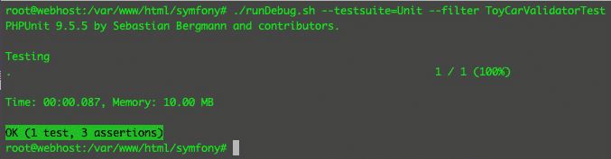

图 8.8 – 通过的玩具车验证测试

你会注意到我们通过了三个断言。看起来我们开始得到一个具有更多职责的测试。仍然最好每个测试只做一条断言，这样我们才不会最终得到一个糟糕的测试类！现在，我们将继续前进。

现在，通过重构，我们取得了什么成果？首先，我们不再需要在 `ToyCarValidatorTest` 类中检查玩具名称的合法性验证逻辑。其次，我们现在可以检查年份的合法性。如果我们想改进日期和名称验证逻辑，我们不需要在主要的 `ToyCarValidator` 类中做这件事——但如果我们想添加更多的验证器类呢？比如一个 `ToyColorValidator` 类？嗯，我们仍然可以做到，甚至不需要触及主类！我们将重构 `ToyCarValidator`，并在本章的 *TDD 与依赖倒置原则* 部分稍后讨论如何做。

但如果我们想改变我们创建的 `ToyCarValidator.php` 类的整个行为并完全改变逻辑呢？嗯，没有必要修改它——我们只需用 `ToyCarValidatorInterface` 接口的不同具体实现来替换整个 `ToyCarValidator.php` 类！

接下来，我们将讨论 **Liskov 替换原则**（**LSP**）。

# 使用 Liskov 替换原则进行 TDD

LSP 是由 Barbara Liskov 提出的。我使用它的方式是，一个接口的实现应该可以用另一个接口的实现替换，而不会改变行为。如果你正在扩展一个超类，子类必须能够替换超类而不破坏行为。

在这个例子中，让我们尝试添加一个业务规则来拒绝在 1950 年或之前建造的玩具车模型。

如往常一样，让我们从测试开始：

1.  打开我们之前创建的 `YearValidatorTest.php` 类，并使用以下内容修改测试类：

codebase/symfony/tests/Unit/Validator/YearValidatorTest.php

```php
<?php
namespace App\Tests\Unit\Validator;
use App\Validator\ToyCarTooOldException;
use PHPUnit\Framework\TestCase;
use App\Validator\YearValidator;
class YearValidatorTest extends TestCase
{
    /**
     * @param $data
     * @param $expected
     * @dataProvider provideYear
     */
    public function testCanValidateYear(int $year, 
        bool $expected): void
    {
        $validator  = new YearValidator();
        $isValid    = $validator->validate($year);
        $this->assertEquals($expected, $isValid);
    }
    /**
     * @return array
     */
    public function provideYear(): array
    {
        return [
            [1,     false],
            [2005,  true],
            [1955,  true],
            [312,   false],
        ];
    }
    /**
     * @param int $year
     * @dataProvider provideOldYears
     */
    public function testCanRejectVeryOldCar(int 
        $year): void
    {
        $this->expectException
            (ToyCarTooOldException::class);
        $validator  = new YearValidator();
        $validator->validate($year);
    }
    /**
     * @return array
     */
    public function provideOldYears(): array
    {
        return [
            [1944],
            [1933],
            [1922],
            [1911],
        ];
    }
}
```

1.  我们添加了一个新的测试，以便我们检查 `ToyCarTooOldException`。让我们也添加这个异常类，但首先，让我们运行测试。

1.  运行以下命令：

    ```php
    /var/www/html/symfony# ./runDebug.sh --testsuite=Unit --filter testCanRejectVeryOldCar
    ```

1.  现在你将看到四个错误。这是可以的。现在，让我们添加缺失的异常类：

codebase/symfony/src/Validator/ToyCarTooOldException.php

```php
<?php
namespace App\Validator;
class ToyCarTooOldException extends \Exception
{
}
```

正如你所见，它只是一个简单的异常类，它扩展了主要的 PHP `\Exception` 类。

如果我们再次运行测试，现在我们应该通过测试，因为我们已经通过使用 `$this->expectException()` 方法告诉 PHPUnit 我们期望这个测试抛出异常。

1.  运行以下命令：

    ```php
    /var/www/html/symfony# ./runDebug.sh --testsuite=Unit --filter testCanRejectVeryOldCar
    ```

现在，我们应该能够通过测试 - 你应该看到以下结果：

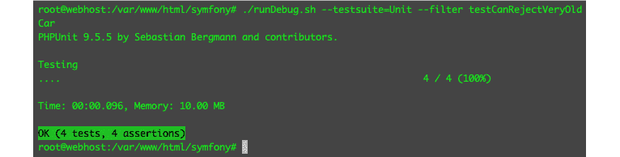

图 8.9 – 通过旧车拒绝测试

这意味着每次我们提交一个小于或等于 1950 年的年份时，我们都会正确地抛出`ToyCarTooOldException`对象 - 但我们的`ToyCarValidatorTest`会发生什么？

让我们修改测试数据，年份小于 1950 年，看看会发生什么：

1.  使用以下内容修改数据提供者内容：

codebase/symfony/tests/Unit/Validator/ToyCarValidatorTest.php

```php
public function provideToyCarModel(): array
{
    // Toy Car Color
    $toyColor = new ToyColor();
    $toyColor->setName(‘White’);
    // Car Manufacturer
    $carManufacturer = new CarManufacturer();
    $carManufacturer->setName(‘Williams’);
    // Toy Car
    $toyCarModel = new ToyCar();
    $toyCarModel->setName(‘’); // Should fail.
    $toyCarModel->setColour($toyColor);
    $toyCarModel->setManufacturer($carManufacturer);
    $toyCarModel->setYear(1935);
    return [
        [$toyCarModel, [‘is_valid’ => false, ‘name’ => 
            false, ‘year’ => false]],
    ];
}
```

1.  现在，运行以下命令并查看会发生什么：

    ```php
    /var/www/html/symfony# ./runDebug.sh --filter ToyCarValidatorTest 
    ```

你会注意到我们用以下消息失败了测试：

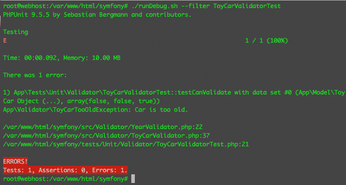

图 8.10 – 玩具车验证失败

现在，我们可以看到我们有一个未捕获的异常。我们的`ToyCarValidator`程序没有编写来处理这个异常对象。为什么是这样呢？嗯，这个例子中的接口是`codebase/symfony/src/Validator/ValidatorInterface.php`接口。这个接口抛出一个`ToyCarValidationException`对象。现在的问题是，我们的实现类，即`YearValidator.php`类，抛出的异常与其合同或接口不同。因此，它破坏了行为。为了解决这个问题，我们只需要抛出接口中声明的正确异常。

1.  让我们修改`ToyCarTooOldException`类：

codebase/symfony/src/Validator/ToyCarTooOldException.php

```php
<?php
namespace App\Validator;
class ToyCarTooOldException extends 
    ToyCarValidationException
{
}
```

如你所见，我们只是将继承的类替换为`ToyCarValidationException`。`ToyCarValidator.php`类被设计用来捕获这个异常。

1.  现在，让我们运行以下命令来执行测试，看看它是否真的起作用：

    ```php
    /var/www/html/symfony# ./runDebug.sh --filter ToyCarValidatorTest
    ```

我们现在应该通过测试并看到以下结果：

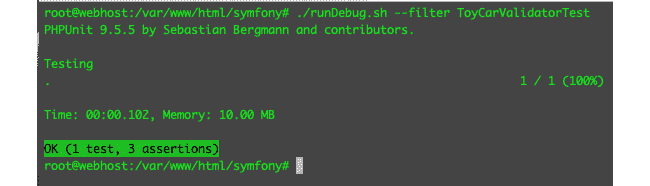

图 8.11 – 通过玩具车验证器测试，使用旧车验证

1.  现在我们再次通过测试，让我们看看我们的`ToyCarValidator`程序返回了什么。还记得我们之前在*第五章*，*单元测试*中写的 shell 脚本吗？让我们使用其中一个。在`codebase/symfony/tests/Unit/Validator/ToyCarValidatorTest.php`的第**23**行设置一个断点。然后，运行以下命令：

    ```php
    /var/www/html/symfony# ./runDebug.sh --filter ToyCarValidatorTest
    ```

1.  检查`$result`变量，你应该看到以下内容：


图 8.12 – 验证模型

你可以看到我们的`ToyCarValidator`的 validate 方法返回一个`ValidationModel`对象。它总结了我们对哪些字段进行了验证，以及`year`字段的异常消息。

我们已经看到了接口如何有用，但有时它们变得过于强大。接下来，我们将讨论**接口分离原则（ISP**）来帮助防止这种情况发生。

# 基于接口分离原则的 TDD

接口非常有用，但有时很容易让它们充满那些实际上不应该成为接口一部分的功能。我经常遇到这种违规行为。我一直在想，我怎么能一直创建带有待办注释的空方法，几个月或几年后，发现这些类仍然带有那些待办注释，方法仍然是空的。

我过去总是先触摸接口，然后把所有我认为需要的功能都塞进去。然后，当我最终编写具体的实现时，这些具体的类大多数都是空方法。

一个接口应该只包含与该接口特定的方法。如果其中有一个方法与该接口完全不相关，你需要将其分离到不同的接口中。

让我们看看它是如何工作的。再次，让我们从一个——你猜对了——测试开始：

1.  打开`codebase/symfony/tests/Unit/Validator/NameValidatorTest.php`测试类，并添加以下内容：

    ```php
    /**
    ```

    ```php
     * @param $data
    ```

    ```php
     * @param $expected
    ```

    ```php
     * @dataProvider provideLongNames
    ```

    ```php
     */
    ```

    ```php
    public function testCanValidateNameLength(string 
    ```

    ```php
        $name, bool $expected): void
    ```

    ```php
    {
    ```

    ```php
        $validator  = new NameValidator();
    ```

    ```php
        $isValid    = $validator->validateLength($name);
    ```

    ```php
        $this->assertEquals($expected, $isValid);
    ```

    ```php
    }
    ```

    ```php
    /**
    ```

    ```php
     * @return array
    ```

    ```php
     */
    ```

    ```php
    public function provideLongNames(): array
    ```

    ```php
    {
    ```

    ```php
        return [
    ```

    ```php
            [‘TheQuickBrownFoxJumpsOverTheLazyDog’, 
    ```

    ```php
                false],
    ```

    ```php
        ];
    ```

    ```php
    }
    ```

我们在测试中引入了一个新的函数`validateLength`，这是字符串共有的。我们还添加了一个非常长的名字，并将`false`设置为在数据提供者中期望返回的值。

1.  运行以下测试：

    ```php
    /var/www/html/symfony# ./runDebug.sh --testsuite=Unit --filter testCanValidateNameLength
    ```

你应该会得到一个错误，因为我们还没有创建新的方法。

1.  现在，打开`ValidatorInterface.php`接口，并添加我们期望在测试中拥有的`validateLength`方法：

codebase/symfony/src/Validator/ValidatorInterface.php

```php
<?php
namespace App\Validator;
interface ValidatorInterface
{
    /**
     * @param $input
     * @return bool
     * @throws ToyCarValidationException
     */
    public function validate($input): bool;
    /**
     * @param string $input
     * @return bool
     */
    public function validateLength(string $input): 
        bool;
}
```

1.  太好了——现在我们有了验证字符串长度的合约。如果我们回到`NameValidator.php`类，IDE 会显示以下错误：

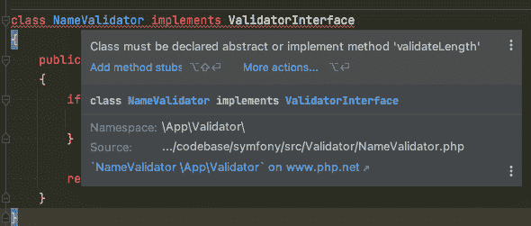

图 8.13 – 必须实现的方法

显然，我们需要为`NameValidator.php`类实现`validateLength`方法，这是可以接受的，因为我们想验证字符串长度——但如果我们也想为`ToyCar`模型的颜色创建一个验证器呢？`ToyCar`模型的颜色属性期望一个`ToyColor.php`对象，而不是一个字符串！因此，解决方案是从`ValidatorInterface`中删除`validateLength`方法。某些类将不需要实现此逻辑即可实现`ValidatorInterface`。我们可以做的是创建一个新的接口，称为`StringValidator`接口，它可以包含`validateLength`方法。

1.  重构`codebase/symfony/src/Validator/ValidatorInterface.php`接口，并删除我们刚刚添加的`validateLength`方法，并创建以下文件，内容如下：

codebase/symfony/src/Validator/StringValidatorInterface.php

```php
<?php
namespace App\Validator;
interface StringValidatorInterface
{
    /**
     * @param string $input
     * @return bool
     */
    public function validateLength(string $input): 
        bool;
}
```

在这个阶段，我们将`validateLength`方法分离到一个单独的接口中，从`ValidatorInterface.php`接口中移除了它。

1.  现在，打开`NameValidator.php`类，并使用以下内容重构它：

codebase/symfony/src/Validator/NameValidator.php

```php
<?php
namespace App\Validator;
class NameValidator implements ValidatorInterface, 
    StringValidatorInterface
{
    const MAX_LENGTH = 10;
    /**
     * @param $input
     * @return bool
     */
    public function validate($input): bool
    {
        $isValid = false;
        if (preg_match(“/^([a-zA-Z’ ]+)$/”, $input)) {
            $isValid = true;
        }
        if ($isValid) {
            $isValid = $this->validateLength($input);
        }
        return $isValid;
    }
    /**
     * @param string $input
     * @return bool
     */
    public function validateLength(string $input): 
        bool
    {
        if (strlen($input) > self::MAX_LENGTH) {
            return false;
        }
        return true;
    }
}
```

1.  我们已经重构了`NameValidator`类，使其现在也检查名称的长度。让我们运行测试，看看它是否通过：

    ```php
    /var/www/html/symfony# ./runDebug.sh --testsuite=Unit --filter testCanValidateNameLength
    ```

现在，你应该能看到以下结果：

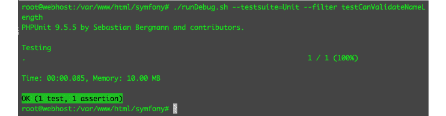

图 8.14 – 通过字符串长度验证测试

我们所做的是，不是将不同的方法组合到`ValidatorInterface`中，而是将它们分成了两个不同的接口。然后，我们只为需要这个`validateLength`方法的验证器对象实现`StringValidator`接口。这基本上就是 ISP（接口隔离原则）的全部内容。这是一个非常基础的例子，但如果你不留意，很容易就会成为这些非常强大的接口的受害者。

接下来，我们将回到`ToyCarValidator`类，看看我们如何可以在*使用开放-封闭原则的 TDD*示例中改进我们之前的内容。

# 使用依赖倒置原则的 TDD

在使一个类更易于测试方面，DIP（依赖倒置原则）可能是列表中对我最重要的原则。DIP 建议细节应该依赖于抽象。对我来说，这意味着不属于类的程序的具体细节应该被抽象化。DIP 允许我们作为开发者移除一个程序或例程的具体实现，并将其放入一个完全不同的对象中。然后我们可以使用 DIP 在需要的时候注入所需的对象。我们可以在构造函数中注入对象，作为类实例化时的参数传递，或者简单地暴露一个修改器函数。

让我们回顾一下本章早期创建的`ToyCarValidator`类，看看我们如何可以实施 DIP（依赖倒置原则）。

**在我们的代码中这会是什么样子？**

回到`ToyCarValidator.php`类，你会在`__constructor`方法中注意到，我们实例化了两个类：

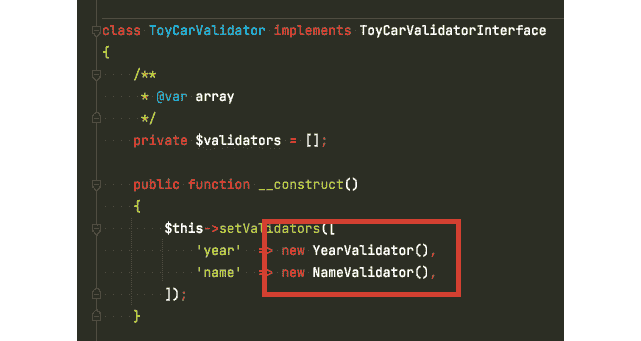

图 8.15 – 硬编码的依赖关系

我们如何改进这个？嗯，这个程序是工作的——正如你所看到的，我们正在传递`ToyCarValidatorTest`。唯一的问题是我们的`ToyCarValidator`类现在硬编码到了它的依赖中——`YearValidator`和`NameValidator`类。如果我们想替换这些类——或者如果我们想添加更多的验证器呢？嗯，我们可以从类内部移除这个依赖。按照以下步骤操作：

1.  重构以下测试类，并将`testCanValidate`方法替换为以下内容：

codebase/symfony/tests/Unit/Validator/ToyCarValidatorTest.php

```php
/**
 * @param ToyCar $toyCar
 * @param array $expected
 * @dataProvider provideToyCarModel
 */
public function testCanValidate(ToyCar $toyCar, array 
    $expected): void
{
    $validators = [
        ‘year’  => new YearValidator(),
        ‘name’  => new NameValidator(),
    ];
    // Inject the validators
    $validator = new ToyCarValidator();
    $validator->setValidators($validators);
    $result = $validator->validate($toyCar);
    $this->assertEquals($expected[‘is_valid’], 
        $result->isValid());
    $this->assertEquals($expected[‘name’], 
        $result->getReport()[‘name’][‘is_valid’]);
    $this->assertEquals($expected[‘year’], 
        $result->getReport()[‘year’][‘is_valid’]);
}
```

你会注意到，`ToyCarValidator`所依赖的对象现在是在`ToyCarValidator`类外部实例化的——然后我们使用`setValidators`修改器设置验证器。

1.  现在，从`ToyCarValidator`的构造函数中移除硬编码的验证器实例化：

codebase/symfony/src/Validator/ToyCarValidator.php

```php
<?php
namespace App\Validator;
use App\Model\ToyCar;
use App\Model\ValidationModel as ValidationResult;
class ToyCarValidator implements 
    ToyCarValidatorInterface
{
    /**
     * @var array
     */
    private $validators = [];
    /**
     * @param ToyCar $toyCar
     * @return ValidationResult
     */
    public function validate(ToyCar $toyCar): 
        ValidationResult
    {
        $result     = new ValidationResult();
        $allValid   = true;
        $results    = [];
        foreach ($this->getValidators() as $key => 
            $validator) {
            $accessor   = ‘get’ . ucfirst(strtolower
                ($key));
            $value      = $toyCar->$accessor();
            $isValid    = false;
            try {
                $isValid = $validator->validate
                    ($value);
                $results[$key][‘message’]   = ‘’;
            } catch (ToyCarValidationException $ex) {
                $results[$key][‘message’]   = 
                    $ex->getMessage();
            } finally {
                $results[$key][‘is_valid’]  = 
                    $isValid;
            }
            if (!$isValid) {
                $allValid = false;
            }
        }
        $result->setValid($allValid);
        $result->setReport($results);
        return $result;
    }
    /**
     * @return array
     */
    public function getValidators(): array
    {
        return $this->validators;
    }
    /**
     * @param array $validators
     */
    public function setValidators(array $validators): 
        void
    {
        $this->validators = $validators;
    }
}
```

1.  我们不再有硬编码的验证器实例化——现在，让我们运行测试，看看测试是否仍然通过：

    ```php
    /var/www/html/symfony# ./runDebug.sh --testsuite=Unit --filter testCanValidateNameLength
    ```

运行命令后，你应该看到测试仍然通过。在这个时候，我们可以继续创建新的验证器，并将它们添加到我们想要注入到`ToyCarValidator.php`类的验证器数组中。

1.  现在，打开本章中我们创建的`ToyCarCreator.php`类，你会看到它已经准备好接受外部的依赖。我们还可以重构这个类，以便在实例化时自动注入它需要的依赖。

1.  打开以下测试类，并使用以下内容进行重构：

codebase/symfony/tests/Integration/Processor/ToyCarCreatorTest.php

```php
<?php
namespace App\Tests\Integration\Repository;
use App\DAL\Writer\WriterInterface;
use App\Model\CarManufacturer;
use App\Model\ToyCar;
use App\Model\ToyColor;
use App\Model\ValidationModel;
use App\Processor\ToyCarCreator;
use App\Validator\ToyCarValidatorInterface;
use Symfony\Bundle\FrameworkBundle\Test\KernelTestCase;
class ToyCarCreatorTest extends KernelTestCase
{
    /**
     * @param ToyCar $toyCarModel
     * @throws \App\Validator
           \ToyCarValidationException
     * @dataProvider provideToyCarModel
     */
    public function testCanCreate(ToyCar 
        $toyCarModel): void
    {
        $validationResultStub = $this->createMock
            (ValidationModel::class);
        $validationResultStub
            ->method(‘isValid’)
            ->willReturn(true);
        // Mock 1: Validator
        $validatorStub = $this->createMock
            (ToyCarValidatorInterface::class);
        $validatorStub
            ->method(‘validate’)
            ->willReturn($validationResultStub);
        // Mock 2: Data writer
        $toyWriterStub = $this->createMock
            (WriterInterface::class);
        $toyWriterStub
            ->method(‘write’)
            ->willReturn(true);
        // Processor Class
        $processor = new ToyCarCreator($validatorStub, 
            $toyWriterStub);
        // Execute
        $result = $processor->create($toyCarModel);
        $this->assertTrue($result);
    }
    public function provideToyCarModel(): array
    {
        // Toy Car Color
        $toyColor = new ToyColor();
        $toyColor->setName(‘Black’);
        // Car Manufacturer
        $carManufacturer = new CarManufacturer();
        $carManufacturer->setName(‘Ford’);
        // Toy Car
        $toyCarModel = new ToyCar();
        $toyCarModel->setName(‘Mustang’);
        $toyCarModel->setColour($toyColor);
        $toyCarModel->setManufacturer
            ($carManufacturer);
        $toyCarModel->setYear(1968);
        return [
            [$toyCarModel],
        ];
    }
}
```

如你所见，我们已经实例化了`ToyCarCreator.php`类的依赖，然后在`ToyCarCreator($validatorStub, $toyWriterStub);`中实例化类时将它们作为参数注入。

1.  然后，打开`ToyCarCreator.php`解决方案类，并使用以下内容进行重构：

codebase/symfony/src/Processor/ToyCarCreator.php

```php
<?php
namespace App\Processor;
use App\DAL\Writer\WriterInterface;
use App\Model\ToyCar;
use App\Validator\ToyCarValidationException;
use App\Validator\ToyCarValidatorInterface;
class ToyCarCreator
{
    /**
     * @var ToyCarValidatorInterface
     */
    private $validator;
    /**
     * @var WriterInterface
     */
    private $dataWriter;
    public function __construct
        (ToyCarValidatorInterface $validator, 
            WriterInterface $dataWriter)
    {
        $this->setValidator($validator);
        $this->setDataWriter($dataWriter);
    }
    /**
     * @param ToyCar $toyCar
     * @return bool
     * @throws ToyCarValidationException
     */
    public function create(ToyCar $toyCar): bool
    {
        // Do some validation here and so on...
        $this->getValidator()->validate($toyCar);
        // Write the data
        $result = $this->getDataWriter()->write
            ($toyCar);
        // Do other stuff.
        return $result;
    }
    /**
     * @return WriterInterface
     */
    public function getDataWriter(): WriterInterface
    {
        return $this->dataWriter;
    }
    /**
     * @param WriterInterface $dataWriter
     */
    public function setDataWriter(WriterInterface 
        $dataWriter): void
    {
        $this->dataWriter = $dataWriter;
    }
    /**
     * @return ToyCarValidatorInterface
     */
    public function getValidator(): 
        ToyCarValidatorInterface
    {
        return $this->validator;
    }
    /**
     * @param ToyCarValidatorInterface $validator
     */
    public function setValidator
        (ToyCarValidatorInterface $validator): void
    {
        $this->validator = $validator;
    }
}
```

在实例化时，验证器和编写器依赖项都通过构造函数设置。

如果我们运行测试，它应该仍然通过：

```php
/var/www/html/symfony# ./runDebug.sh --testsuite=Integration --filter ToyCarCreatorTest
```

运行命令后，你应该仍然看到通过测试。

使用这种方法最明显的事情是，你必须自己管理所有依赖，然后将它们注入到需要它们的对象中。幸运的是，我们不是第一个遇到这种头疼问题的人。有很多服务容器可以帮助管理应用程序需要的依赖，但在选择 PHP 服务容器时，最重要的是它应该遵循 PSR-11 标准。你可以在[`www.php-fig.org/psr/psr-11/`](https://www.php-fig.org/psr/psr-11/)了解更多关于 PSR-11 的信息。

# 摘要

在本章中，我们逐个介绍了 SOLID 原则。我们使用测试来启动解决方案代码的开发，以便我们可以将它们作为在现实生活中实现 SOLID 原则的示例。

我们已经介绍了 SRP（单一职责原则），它帮助我们使 PHP 类的职责或能力更加专注。OCP（开闭原则）帮助我们避免在某些情况下需要修改类的行为时，需要触及或修改类。LSP（里氏替换原则）帮助我们更严格地对待接口的行为，使得我们更容易在不破坏父类行为的情况下切换实现该接口的具体对象。ISP（接口隔离原则）帮助我们使接口的职责更加专注——实现此接口的类将不再因为接口的声明而拥有空方法。DIP（依赖倒置原则）帮助我们快速测试`ToyCarCreator`类，即使没有创建其依赖的具体实现，如`ToyCarValidator`类。

在实际项目工作中，一些原则很难严格遵循，有时边界也模糊不清。再加上现实生活中的截止日期压力，事情就变得更加有趣。有一点可以肯定，使用行为驱动开发（BDD）和技术驱动开发（TDD）将帮助您对自己的开发功能更有信心，尤其是在您已经深入一个项目几个月之后。在之上添加 SOLID 原则会使您的解决方案更加完善！

在下一章中，我们将尝试利用自动化测试来帮助我们确保任何开发者在将代码推送到您的代码仓库时，不会破坏软件预期的行为。我们将通过使用持续集成来自动化这一过程。

# 第三部分 - 自动化部署和监控

在本书的这一部分，您将学习如何利用自动化测试来改进和自动化代码集成过程，以及自动化应用程序的部署过程。您还将学习如何在应用程序部署后监控 PHP 应用程序。

本节包括以下章节：

+   *第九章*，*持续集成*

+   *第十章*，*持续交付*

+   *第十一章*，*监控*
