# 9

# 持续集成

在前几章中，我们探讨了玩具车模型库存解决方案的软件开发过程。我们遵循了测试驱动开发的过程，在这个阶段，我们应该已经熟悉了它。然而，我们正在构建的软件中仍然有很多缺失的功能。在本章中，我们将从一个几乎完整的解决方案开始，你可以从本章的 GitHub 仓库中获取这个解决方案。然后我们将确保我们的解决方案能够正常工作。

在本章中，我们将从一个几乎完整的软件解决方案开始，除了缺少的最后一个功能，即过滤包含玩具车模型的表格。我们已经编写了很多测试；如果我们能够在创建 develop 或 main 分支的 pull request 时自动触发这些测试的执行，那岂不是很好？自动触发我们花费了大量时间开发的测试套件将帮助我们捕捉到在它们甚至被合并到主分支之前就已经存在的错误或缺陷。这就是持续集成能够帮助我们的地方。

在本章中，我们将探讨以下主题：

+   运行并通过所有 Symfony 应用程序测试

+   使用 Bitbucket Pipelines 进行持续集成

# 技术要求

在本章中，你应具备使用 Git 版本控制进行 Web 应用程序的基本知识。你还应使用本书 GitHub 仓库中的开发环境和解决方案代码：[`github.com/PacktPublishing/Test-Driven-Development-with-PHP-8/tree/main/Chapter%209`](https://github.com/PacktPublishing/Test-Driven-Development-with-PHP-8/tree/main/Chapter%209)。

## 为本章准备开发环境

首先，下载位于[`github.com/PacktPublishing/Test-Driven-Development-with-PHP-8/tree/main/Chapter%209`](https://github.com/PacktPublishing/Test-Driven-Development-with-PHP-8/tree/main/Chapter%209)的代码。

要运行容器并执行本章中的命令，你应该在 `docker-server-web-1` 容器内部。

运行以下命令以确认我们的 web 服务器的容器名称：

```php
docker ps
```

要运行容器，请从主机机器上的 `/docker` 目录运行以下命令：

```php
docker-compose build && docker-compose up -d
docker exec -it docker-server-web-1 /bin/bash
```

一旦进入容器，运行以下命令以通过 Composer 安装所需的库：

```php
/var/www/html/symfony# ./setup.sh
/var/www/html/behat# ./setup.sh 
```

# 运行并通过所有 Symfony 应用程序测试

在上一章中，我们开始编写解决方案代码，试图遵循 SOLID 原则。为了开发应用程序的其他部分，我们可以继续遵循相同的过程。在本章中，我已自行完成了所有其他测试和通过这些测试所需的解决方案代码。我们将通过这些测试并确保它们通过。

## 设置本地环境

将*技术要求*部分提供的源代码检查到你的本地开发机器中，并从主机机器上运行以下命令来配置你的开发环境：

```php
$ cd docker
$ docker-compose build && docker-compose up -d
```

在运行这些命令后，确保本书前面构建的容器正在运行，可以通过运行以下命令来检查：

```php
$ docker ps
```

你应该会看到以下 Docker 容器名称：

```php
docker_server-web_1
docker_app-phpmyadmin_1
docker_server-mysql_1
```

现在容器正在运行，我们需要通过安装它们依赖的包以及创建我们的示例 PHP 应用所需的数据库和表来准备`docker_server-web_1`容器内运行的 Symfony 和 Behat 应用。

### 准备 Symfony 应用和测试

现在，让我们设置我们的 Symfony 应用所需的数据库表和库。仍然在`docker`目录内，从你的主机机器上运行以下命令：

```php
$ docker exec -i docker_server-web_1 /var/www/html/symfony/setup.sh
```

或者，在`docker_server-web_1`容器内部运行以下命令：

```php
/var/www/html/symfony# ./setup.sh
```

`setup.sh`文件只是一个 shell 脚本，我添加它来方便地配置我们的 Symfony 应用，并准备运行测试所需的数据库和表。

如果你打开以下 shell 文件，你会看到我们只是在运行一些 Doctrine 命令，并使用 Composer 安装所有所需的 Symfony 依赖项：

`codebase/symfony/setup.sh`

```php
#!/bin/bash
composer install -d /var/www/html/symfony/
# Test DB
php /var/www/html/symfony/bin/console doctrine:database:create -n --env=test
php /var/www/html/symfony/bin/console doctrine:migrations:migrate -n --env=test
php /var/www/html/symfony/bin/console doctrine:fixtures:load -n --env=test
# Main DB
php /var/www/html/symfony/bin/console doctrine:database:create -n
php /var/www/html/symfony/bin/console doctrine:migrations:migrate -n
php /var/www/html/symfony/bin/console doctrine:fixtures:load -n
```

当我们在**持续集成**（**CI**）机器上运行应用时，这个 shell 脚本将非常有用。

在运行`setup.sh`命令后，你的开发环境应该已经准备好，可以从我们的 Symfony 应用内部运行所有单元和集成测试。

在*第五章*的*单元测试*部分，我们创建了一个名为`codebase/symfony/runCoverage.sh`的 shell 脚本。这个 shell 脚本将帮助我们运行所有测试并检查我们的解决方案代码的测试覆盖率。然而，从现实的角度来看，我们不需要覆盖应用内部的所有代码，因为其中一些是没有任何测试的第三方库，或者其中一些可能是简单的**纯 PHP 对象**（**POPO**）类。但对于我们开发的代码，我们应该为它们添加自动化的测试。

如果你认为需要从代码覆盖率报告中排除一些类，你可以打开`codebase/symfony/phpunit.xml`配置文件，并添加你想要从覆盖率报告中排除的目录。

在`docker_server-web_1`容器内部，如果你打开我们的 Symfony 应用中的`codebase/symfony/tests`目录，你会看到以下测试：

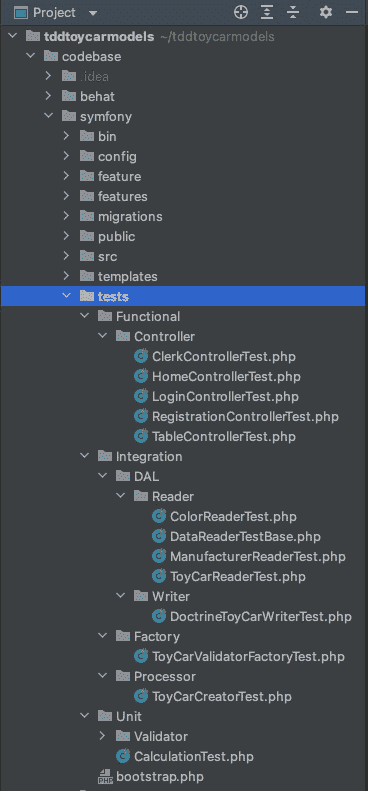

图 9.1 – Symfony 测试目录

我们有三个主要的测试目录：**功能**、**集成**和**单元**。在这个例子中，**功能**测试是控制器测试，这些测试使用 HTTP 请求；你可以把它们看作是集成测试，但它们覆盖了更集成的代码。**集成**测试是运行通过不同自定义类及其相互交互的测试，确保它们都按预期工作。最后，**单元**测试是简单的测试，专注于特定类中的单个单元或函数。

你可以浏览`codebase/symfony/src`目录和类，以检查我们的测试实际针对的类。

让我们看看测试是否通过；从主机机器上运行以下命令：

```php
$ docker exec -i docker_server-web_1 /var/www/html/symfony/runTests.sh
```

或者，在`docker_server-web_1`容器内部运行以下命令：

```php
/var/www/html/symfony# ./runTests.sh
```

由于我们已经配置了测试所需的数据库和表，你应该看到以下结果：

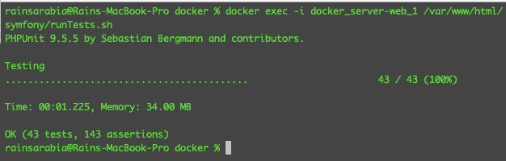

图 9.2 – 通过 Symfony 测试

看起来我们有很多通过测试，但让我们打开一个测试类，看看我们确切在测试什么。

打开`codebase/symfony/tests/Integration/DAL/Reader/ColorReaderTest.php`；你会看到以下内容：

```php
<?php
namespace App\Tests\Integration\DAL\Reader;
use App\DAL\Reader\Doctrine\ColorReader;
use App\Entity\Color;
use App\Model\ToyColor;
class ColorReaderTest extends DataReaderTestBase
{
    public function testCanReadColors()
    {
        $reader = $this->getServiceContainer()->get(ColorReader::class);
        $colorsFromDb = $reader->getAll();
        /** @var Color $color */
        foreach ($colorsFromDb as $color) {
            $this->assertInstanceOf(ToyColor::class, $color);
            $this->assertIsInt($color->getId());
            $this->assertNotNull($color->getName());
        }
    }
}
```

你会注意到，在这个测试类中，我们从数据库中读取数据，并对数据库的结果执行一些断言。在*第七章*，“使用 BDD 和 TDD 构建解决方案代码”，我们创建了测试所需和实际解决方案代码的主数据库。

在`docker_server-mysql_1`容器内部有以下数据库：

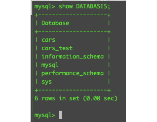

图 9.3 – MySQL 数据库

我们使用`cars`数据库作为实际解决方案代码，使用`cars_test`进行自动化测试。这样，我们的自动化测试就不会污染我们的主要应用程序数据库。

现在，最后，在我们部署到 CI 解决方案之前，让我们运行我们之前构建的`runCoverage.sh` shell 脚本。

从主机机器上运行以下命令：

```php
$ docker exec -i docker_server-web_1 /var/www/html/symfony/runCoverage.sh
```

或者，在`docker_server-web_1`容器内部运行以下命令：

```php
/var/www/html/symfony# ./runCoverage.sh
```

现在，你应该看到以下测试结果：

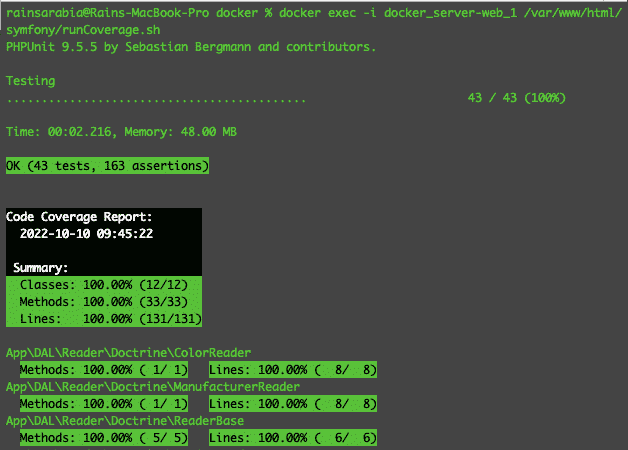

图 9.4 – 测试覆盖率报告

太好了！在这个阶段，我们确信测试正在正常运行，并且它们也可以连接到测试数据库：


图 9.5 – 测试数据

如果你检查`cars_test` MySQL 数据库中的`toy_cars`表，你应该看到自动化测试创建的一些样本数据。

接下来，让我们继续到 Behat 应用程序内部定义的更详细的函数测试。

### 准备 Behat 应用程序和测试

在上一节中，我们能够运行并通过所有 Symfony 应用程序测试。现在，我们需要确保我们也通过了 Behat 应用程序中的行为驱动测试。

从您的宿主机运行以下命令来设置 Behat 应用程序：

```php
$ docker exec -i docker_server-web_1 /var/www/html/
behat/setup.sh
```

或者，在`docker_server-web_1`容器内运行以下命令：

```php
/var/www/html/behat# ./setup.sh
```

就像我们在之前的 Symfony 应用程序中做的那样，我们首先需要设置 Behat 应用程序并安装其依赖项。

在*第六章*“应用行为驱动开发”中，我们使用 Gherkin 语言创建了测试功能和场景。我们还创建了一些包含我们在创建的功能文件中定义的步骤的上下文 PHP 类。这些上下文类将由 Behat 执行，作为功能 PHP 测试。

Symfony 测试和我们的 Behat 应用程序测试之间的区别在于，Behat 测试不关心我们如何实现结果或特定的 PHP 类如何与其他 PHP 类交互。它们只关心测试非常高级的功能和行为场景。

就这些了——现在，我们已经准备好运行我们的行为驱动测试了。

从宿主机运行以下命令，看看您是否可以通过我们的 Behat 测试：

```php
docker exec -i docker_server-web_1 /var/www/html/behat/runBehatTests.sh
```

或者，在`docker_server-web_1`容器内运行以下命令：

```php
/var/www/html/behat# ./runBehatTests.sh
```

您应该看到以下结果：

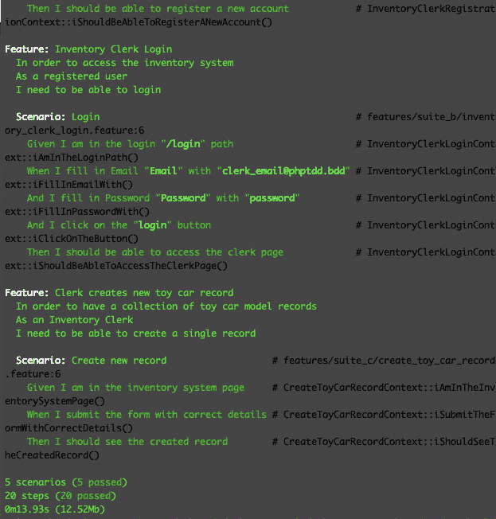

图 9.6 – Behat 测试通过

太好了！我们已经通过了我们定义的所有测试场景。如果您想检查所有功能文件和场景，您可以在`codebase/behat/features`中打开这些文件。

现在我们确信我们的自动化测试在开发机器上运行正常，我们就可以准备在 Bitbucket Pipelines 中为我们 CI 解决方案使用它们了。

# 使用 Bitbucket Pipelines 进行持续集成

我们投入了大量的努力来构建我们的自动化测试和解决方案代码，所有这些努力都是为了帮助我们开发可维护且更可靠的软件。持续集成（CI）是指能够从不同来源集成代码变更的实践。随着自动化测试的加入，我们所有的努力将开始在大规模上得到回报，因为我们已经编写了所有这些测试。这将帮助我们防止将回归引入主代码库。例如，CI 过程可以拒绝一个 git pull 请求，如果存在损坏的自动化测试。

现在有大量的 CI 工具，但在这个例子中，由于我在项目中使用 Bitbucket 进行版本控制，所以我将只使用 Bitbucket Pipelines，因为它已经很好地与 Bitbucket Cloud 集成。它非常容易使用，您将会看到。让我们开始吧：

1.  在 Bitbucket Cloud 仪表板中，选择您用于项目的存储库，然后点击左侧菜单上的**流水线**链接：

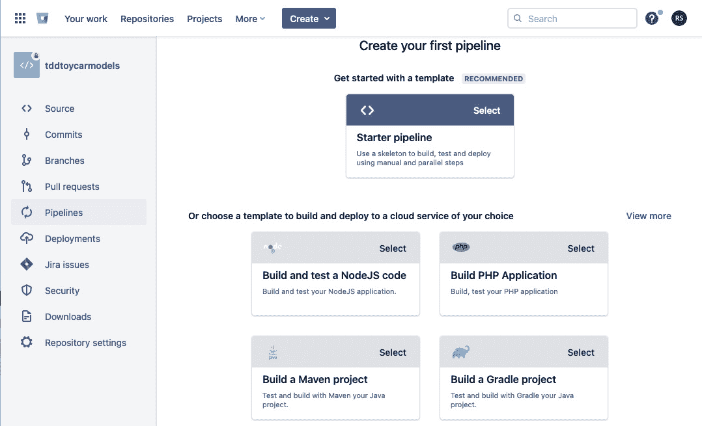

图 9.7 – 创建你的第一个管道

1.  然后，选择 **构建 PHP 应用程序** 复选框。您将看到创建第一个管道的示例模板：

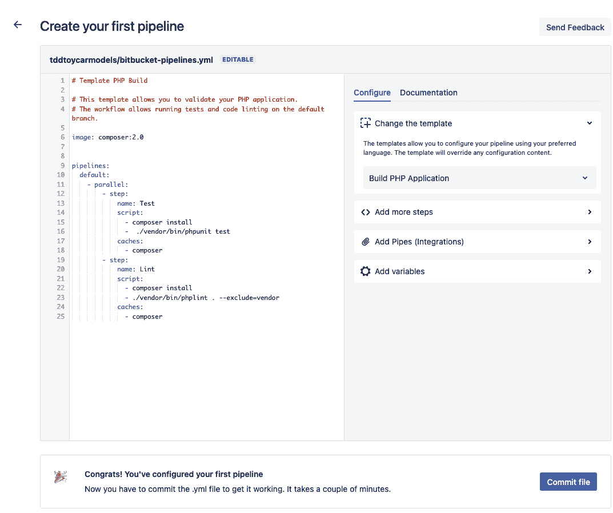

图 9.8 – 创建你的第一个管道

1.  在这里，您将看到一个简单的 `.yml` 文件；您可以编辑它以运行您的脚本。对于我们的示例项目，您可以使用以下内容：

bitbucket-pipelines.yml

```php
image: docker:stable
options:
 docker: true
pipelines:
 default:
 - parallel:
 - step:
 name: Prepare environment
 script:
 - set -eu
 - apk add --no-cache py-pip bash
 - apk add --no-cache gcc
 - apk add --update --no-cache --virtual 
.tmp-build-deps gcc libc-dev linux-headers postgresql-dev && apk add libffi-dev
 - apk update && apk add python3-dev gcc libc-dev
 - pip install --upgrade pip setuptools wheel
 - pip install --no-cache-dir docker-compose
 - docker-compose -v
 - ls -lap
 - pwd
 - cd docker
 - docker-compose build && docker-compose up -d
 - docker exec -i docker_server-web_1 /var/www/html/symfony/setup.sh
 - docker exec -i docker_server-web_1 
 /var/www/html/symfony/runCoverage.sh
 - docker exec -i docker_server-web_1 
 /var/www/html/behat/setup.sh
 - docker exec -i docker_server-web_1 
 /var/www/html/behat/runBehatTests.sh
 caches:
 - composer
```

如您所见，这些只是我们在设置 CI 云中需要使用的 Docker 容器时想要运行的命令。您会注意到我们正在使用 `codebase/symfony/setup.sh` 和 `codebase/behat/setup.sh` 文件来安装我们的 Symfony 和 Behat 应用程序所需的全部依赖项和库。这包括在我们的 Symfony 应用程序内部创建我们使用的 `cars` 和 `cars_test` 数据库！

1.  将脚本粘贴到文本区域，然后点击 **提交文件** 按钮。您将被重定向到 **管道** 页面，在那里您将看到您的构建正在运行：

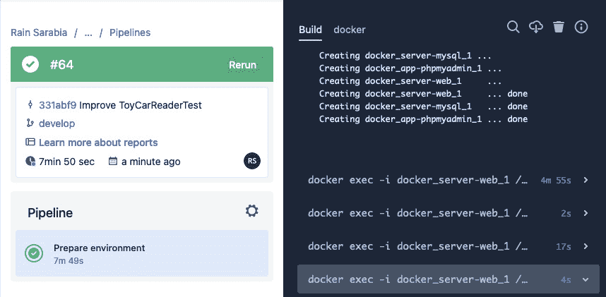

图 9.9 – 管道运行

从前面的屏幕截图可以看出，我们能够构建与我们在本地机器上工作相同的容器。

构建过程将需要几分钟。在这里，我们希望在 CI 云中发生以下操作：

1.  创建主机机器。

1.  安装运行 `docker-compose` 所需的必要库。

1.  构建我们用于解决方案的 Docker 容器。

1.  安装 Symfony 的 Composer 包。

1.  运行 Doctrine 数据库迁移以进行 Symfony。

1.  执行 `runCoverage.sh` 测试脚本以进行 Symfony。

1.  确保我们通过所有的 Symfony 测试。

1.  安装 Behat 的 Composer 包。

1.  执行 `runBehatTests.sh` 测试脚本以进行 Behat。

1.  确保我们通过所有的 Behat 测试。

这需要很多步骤！但我们需要做所有这些事情，以确保我们可以像在本地机器上运行它们一样运行我们的自动化测试。几分钟后，回到您的 **构建** 页面，查看我们是否通过了 Symfony 测试：

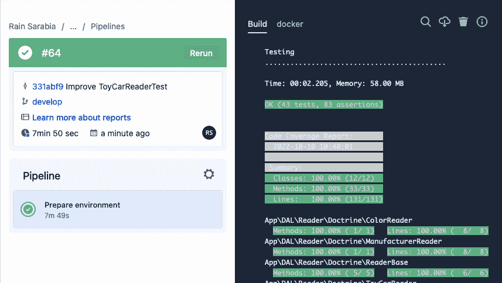

图 9.10 – CI 通过 Symfony 测试

太好了！通过在 CI 内部运行 `runCoverage.sh` 脚本，我们可以确保所有测试和代码仍然按预期运行！现在，让我们看看我们的 Behat 测试是否也通过。继续向下滚动构建屏幕，直到您找到 Behat 测试结果：

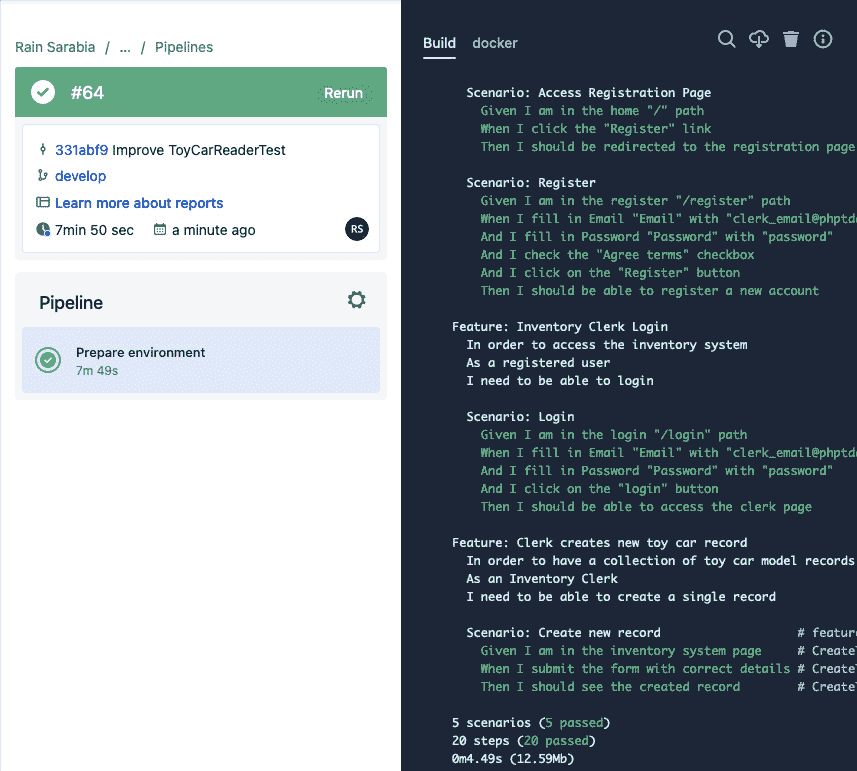

图 9.11 – CI 通过 Behat 测试

如您从日志中看到的，我们通过了与之前从本地开发机器上通过相同的五个场景！

在这个阶段，**管道** 将显示一个带有勾选标记的绿色条，表示我们已经通过了整个构建。

在*第二章*，*理解和组织我们项目的业务需求*中，我们创建了一些 Jira 工单并将我们的 Bitbucket 仓库集成到 Jira 项目中。现在，这对于 Bitbucket Pipelines 来说将非常方便，因为它也与 Jira 无缝集成。

在从[`github.com/PacktPublishing/Test-Driven-Development-with-PHP-8/tree/main/Chapter%209`](https://github.com/PacktPublishing/Test-Driven-Development-with-PHP-8/tree/main/Chapter%209)克隆的解决方案代码的根目录中，您将找到一个`bitbucket-pipelines.yml`文件，其中包含我们用于运行第一个管道的脚本。现在，每次您将更新推送到与您正在处理的 Jira 工单连接的 Bitbucket 分支时，Jira 将能够自动检测为您的 Jira 工单运行的 Pipelines 构建：

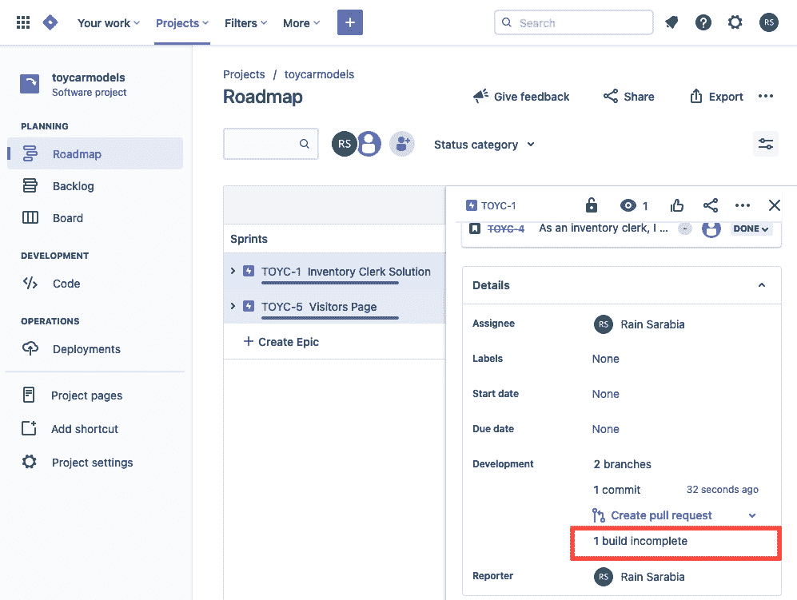

图 9.12 – Jira 和 Pipelines 集成

点击前面截图中的**创建拉取请求**区域下方的**1 构建不完整**链接；您将看到一个弹出窗口，其中包含为该分支和工单已执行的构建列表：

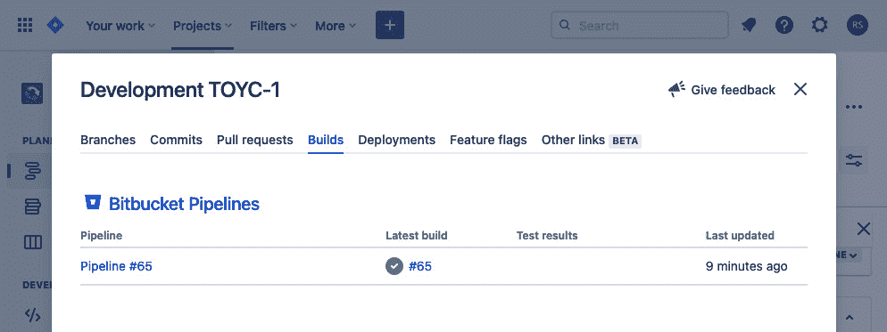

图 9.13 – 从 Jira 页面构建弹出窗口

这是一套非常强大的工具。您的团队可以使用 Jira 监控任务，并确保在您决定是否部署解决方案之前，您或任何其他开发者推送的源代码不会对现有软件造成损害。

如果开发者推送的代码改变了应用程序的负面行为，并且有足够的自动化测试来覆盖它，那么您将能够在 CI 构建失败时捕捉到问题。

# 摘要

在本章中，我们完成了设置我们的更新后的开发环境的过程，包括构建示例项目所需的全部测试和解决方案代码。我们创建并使用 shell 脚本来帮助我们安装依赖项、设置数据库和初始化数据，确保我们拥有从本地机器或云端轻松运行测试所需的一切。

我们还创建了我们的第一个 Bitbucket Pipeline，以帮助我们实现持续集成。通过使用 CI，我们可以将所有自动化测试在云端运行，以确保每次提交和推送更改到分支时，我们不会破坏代码库中的任何内容。

在下一章中，我们将把我们的解决方案部署到外部 Web 服务器，在那里我们也将能够使用 Web 浏览器测试应用程序。
