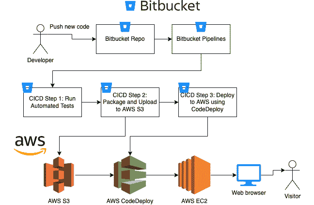

# 第十章：持续交付

我们已经构建了一个包含自动化测试的软件解决方案，并设置了一个持续集成管道来运行这些自动化测试。现在，如果团队中的开发人员推送了一些更改解决方案预期行为的代码，我们的自动化测试和持续集成解决方案将捕获这些问题，并帮助你和你的团队停止发布有害代码。但是，如果在将所有新代码推送到仓库后所有测试都通过了，那会怎么样？如果有一个解决方案可以帮助我们准备并将应用程序部署到开发、测试或生产服务器，那岂不是很好？

在本章中，我们将为我们的开发过程添加最后一块缺失的拼图。我们将在 AWS 中准备一个远程服务器，并使用 **持续交付**（**CD**）自动将我们的应用程序部署到该服务器。

*图 10*.1 展示了我们将要采取的步骤，将我们的解决方案代码部署到面向公众的 web 服务器。我们将通过将新代码推送到仓库的过程，这将反过来触发我们在上一章中配置的 CI 管道。CI 管道将运行我们构建的自动化测试，如果成功，CD 过程将把我们解决方案代码上传到 AWS S3。然后，我们将使用 AWS CodeDeploy 将我们的应用程序部署到作为示例生产服务器的 AWS EC2 实例：



图 10.1 – 整个流程

从开发人员推送新代码并在云中运行所有自动化测试，到自动将解决方案代码部署到 Linux 服务器，我们将涵盖所有这些内容！

在本章中，我们将讨论以下主题：

+   设置 AWS EC2 实例

+   创建 AWS CodeDeploy 应用程序

+   在 AWS EC2 实例内安装 Docker 和其他依赖项

+   使用 Bitbucket Pipelines 和 AWS CodeDeploy 进行持续交付

# 技术要求

在本章中，你应该遵循上一章中提供的说明并配置 Bitbucket Pipelines 管道。你还应具备 AWS 的基本知识，并应使用本书代码库中的代码 [`github.com/PacktPublishing/Test-Driven-Development-with-PHP-8/tree/main/Chapter%2010`](https://github.com/PacktPublishing/Test-Driven-Development-with-PHP-8/tree/main/Chapter%2010)。

要查看所有测试正常运行，你可以运行以下命令以下载本章的完整代码，并运行 Docker 容器：

```php
curl -Lo phptdd.zip "https://github.com/PacktPublishing/Test-Driven-Development-with-PHP-8/raw/main/Chapter%2010/complete.zip" && unzip -o phptdd.zip && cd complete && ./demoSetup.sh
```

要运行容器并执行本章中的命令，你应该在 `docker-server-web-1` 容器内部。

运行以下命令以确认我们的 web 服务器的容器名称：

```php
docker ps
```

要运行容器，请从主机上的 `/phptdd/docker` 目录运行以下命令：

```php
docker-compose build && docker-compose up -d
docker exec -it docker_server-web_1 /bin/bash
```

一旦进入容器，请运行以下命令以通过 Composer 安装所需的库：

```php
/var/www/html/symfony# ./setup.sh
```

在`/var/www/html/symfony`目录中，运行以下命令以查看所有测试通过：

```php
/var/www/html/symfony# ./runCoverage.sh
```

运行`runCoverage.sh`命令后，它应该执行我们所有的 Symfony 测试，并且你可以确保它们都通过。

# 设置 AWS EC2 实例

如果你还没有 AWS 账户，你可以按照[`aws.amazon.com/premiumsupport/knowledge-center/create-and-activate-aws-account/`](https://aws.amazon.com/premiumsupport/knowledge-center/create-and-activate-aws-account/)上的说明创建一个账户。你还需要创建一个 AWS IAM 用户组。说明可以在[`docs.aws.amazon.com/IAM/latest/UserGuide/id_groups_create.html`](https://docs.aws.amazon.com/IAM/latest/UserGuide/id_groups_create.html)找到。你需要一个 AWS IAM 用户，并按照 AWS 的官方文档在[`docs.aws.amazon.com/IAM/latest/UserGuide/id_users_create.html`](https://docs.aws.amazon.com/IAM/latest/UserGuide/id_users_create.html)在你的 AWS 账户中创建 IAM 用户。

为了完成 EC2 设置，我们还需要以下 AWS 资源：

+   AWS EC2 密钥对

+   IAM 实例配置文件

为什么我们需要 EC2 实例？嗯，这将作为我们的远程服务器。你可以把它想象成在云中运行的宿主计算机。我们将使用这个服务器来托管我们的 Docker 容器，以便运行和提供我们的应用程序：


图 10.1 – EC2 实例

如您从图中所见，它几乎将成为您本地开发环境的复制品。这就是使用容器的大好处，正如我们在*第三章*，*使用 Docker 容器设置我们的开发环境*中讨论的那样。

按照以下步骤创建 EC2 实例：

1.  登录 AWS 控制台，在**服务**搜索栏中搜索`EC2`以进入 EC2 仪表板。

1.  在 EC2 仪表板中，点击**启动实例**按钮：


图 10.2 – 启动实例按钮

你将看到**启动实例**向导。

1.  在`tddphp-instance1`中。这个名称标签将非常重要。我们将在本章后面使用这个标签来部署我们的 CodeDeploy 应用程序：


图 10.3 – 实例名称标签

1.  接下来，在**应用程序和操作系统镜像（Amazon 机器镜像）**区域，选择**Amazon Linux 2 AMI**：


图 10.4 – Amazon Linux 2 AMI

1.  接下来，你可以选择 EC2 实例类型。在这个例子中，你可以坚持使用**t2.micro**实例，因为这个类型的实例是免费层合格的。你也可以选择更强大的实例配置 – 这完全取决于你：


图 10.5 – t2.micro 实例类型

1.  你需要一个密钥对才能能够 SSH 进入这个机器实例。如果你还没有设置一个，只需点击**创建新的密钥对**链接；将弹出一个窗口供你创建一个新的密钥对：


图 10.6 – 创建新的密钥对

1.  创建密钥对后，你可以将其分配给 EC2 实例向导中的密钥对字段。

1.  接下来，在**网络设置**部分，允许所有 HTTP 和 HTTPS 流量。这样我们就可以轻松地从浏览器访问网络应用程序：


图 10.7 – 网络设置；允许 HTTP 和 HTTPS

1.  接下来，在**高级详情**部分，如果你还没有 IAM 实例配置文件，你可以通过点击**创建新的 IAM** **配置文件**链接轻松创建一个：


图 10.8 – 创建新的 IAM 配置文件链接

1.  你将被重定向到 IAM 向导。输入你想要使用的任何 IAM 角色名称；然后，在**受信任实体** **类型**部分选择**自定义信任策略**选项：


图 10.9 – 自定义信任策略文本区域

1.  在文本区域中，使用以下策略：

    ```php
    {
    ```

    ```php
        “Version”: “2012-10-17”,
    ```

    ```php
        “Statement”: [
    ```

    ```php
            {
    ```

    ```php
                “Effect”: “Allow”,
    ```

    ```php
                “Principal”: {
    ```

    ```php
                    “Service”: [
    ```

    ```php
                        “ec2.amazonaws.com”,
    ```

    ```php
                        “codedeploy.ap-southeast-2.
    ```

    ```php
                            amazonaws.com”
    ```

    ```php
                    ]
    ```

    ```php
                },
    ```

    ```php
                “Action”: “sts:AssumeRole”
    ```

    ```php
            }
    ```

    ```php
        ]
    ```

    ```php
    }
    ```

由于我在澳大利亚，我通常使用`Sydney ap-southeast-2`区域。你可以用你喜欢的任何区域替换它。

1.  点击**下一步**按钮继续。

1.  在**添加权限**部分，搜索以下策略，并在策略名称前勾选复选框：

    +   **AmazonEC2FullAccess**

    +   **AmazonS3FullAccess**

    +   **AWSCodeDeployFullAccess**

1.  选择这些策略后，点击**下一步**。

在创建角色之前，确保这些策略在 IAM 向导的审查屏幕上显示：


图 10.10 – 访问策略

1.  接下来，点击**创建角色**按钮，然后返回到**EC2 实例**向导。你现在可以从**高级** **详情**部分选择你刚刚创建的 IAM 角色：


图 10.11 – 新创建的 IAM 实例配置文件

1.  就这样 – 滚动到页面底部并点击**启动实例**按钮。AWS 启动你的新 EC2 实例需要几分钟时间。几分钟后，返回到仪表板；你现在应该能看到你的 EC2 实例正在运行：


图 10.12 – 正在运行的 Amazon Linux 2 实例

我们现在有一个正在运行的 Amazon Linux 2 实例；我们将使用这个实例来运行我们的容器。

在进行 CodeDeploy 设置之前，我们需要创建一个 S3 存储桶。这个存储桶将同时被我们的 Bitbucket Pipelines 和 CodeDeploy 应用程序使用：

1.  在 AWS 控制台中，搜索`S3`并点击**S3**服务项：


图 10.13 – S3 服务

您将被重定向到 Amazon S3 控制台。

1.  点击 **创建** **存储桶** 按钮：


图 10.14 – 创建存储桶按钮

1.  为存储桶使用您想要的任何唯一名称，并选择与您的 EC2 实例相同的区域。对我来说，是 **ap-southeast-2**：


图 10.15 – 创建 S3 存储桶

1.  您可以保留所有默认设置，然后点击 **创建存储桶** 按钮。

就这样。我们现在可以继续创建 CodeDeploy 应用程序。CodeDeploy 应用程序将使用我们刚刚创建的 EC2 实例和 S3 存储桶。

# 创建 AWS CodeDeploy 应用程序

我们将使用 AWS CodeDeploy 自动将我们的 PHP 应用程序部署到 EC2 服务器。但 CodeDeploy 将从哪里获取部署的文件呢？它将从 S3 存储桶中获取。但我们的解决方案代码最初是如何出现在 S3 中的呢？嗯，我们将告诉 Bitbucket Pipelines 将其上传到那里！我们将在本章后面详细说明：


图 10.16 – CodeDeploy 流程

按照以下步骤设置 AWS CodeDeploy，一旦所有自动化测试通过，我们的 Bitbucket CI 管道将触发它：

1.  在 AWS 控制台中，搜索 CodeDeploy 服务并点击 **创建** **应用程序** 按钮：


图 10.17 – 创建 CodeDeploy 应用程序

1.  在 CodeDeploy 向导中，在 **应用程序配置** 部分使用您想要的任何名称。然后，在 **计算平台** 字段中，选择 **EC2/本地** 选项，并点击 **创建** **应用程序** 按钮：


图 10.18 – 应用程序配置部分

您将被重定向到 CodeDeploy **应用程序** 页面。

1.  接下来，点击 **创建部署** **组** 按钮：


图 10.19 – 创建部署组按钮

+   在 `codedeploy_group1`：


图 10.20 – 部署组向导 – 组名称

1.  接下来，在 **服务角色** 部分中选择我们在本章前面创建的 IAM 角色：


图 10.21 – 部署组向导 – IAM 角色

1.  接下来，在 `tddphp-instance1`。这非常重要。这是我们告诉 CodeDeploy 我们想要在这个特定实例中部署应用程序的方式。如果您想部署到其他实例，也可以在这里添加更多标签：


图 10.22 – 部署组向导 – EC2 实例详情

1.  接下来，在**负载均衡器**部分，取消选中**启用负载均衡**复选框，然后点击**创建部署****组**按钮：


图 10.23 – 部署组向导 – 负载均衡器

太好了！这就是从 AWS 控制台进行 CodeDeploy 配置的全部内容。

接下来，我们需要进入我们刚刚创建的 EC2 实例内部，并安装一些我们需要的应用程序，以便它能够连接到 CodeDeploy，并且我们能够运行 Docker 容器。

# 在 AWS EC2 实例内部安装 Docker 和其他依赖项

在 EC2 实例内部，我们需要三个非常重要的应用程序。首先，我们需要 AWS CodeDeploy 代理，之后我们需要安装 Docker 和 docker-compose，这样我们才能构建和运行我们应用程序所需的 Docker 容器。

## 连接到 EC2 实例

在安装任何东西之前，我们需要进入实例内部。幸运的是，我们可以通过浏览器中的 AWS 控制台来完成这个操作：

1.  在 EC2 仪表板上，选择我们之前创建的正在运行的实例，然后点击表格顶部的**连接**按钮：


图 10.24 – EC2 表格 – 连接按钮

您将被重定向到**连接到实例**页面。

1.  在该页面上点击**连接**按钮。最后，您将被重定向到浏览器的终端窗口：


图 10.25 – EC2 终端窗口

太好了！现在，我们可以安装我们为 CD 和我们的 PHP 解决方案所需的程序。

## 安装 CodeDeploy 代理

我们在本章中创建的 CodeDeploy 应用程序需要在我们的 EC2 实例内部安装额外的软件，以便它能与之通信。这就是为什么我们需要 CodeDeploy 代理。您可以在 AWS CodeDeploy 代理的官方 AWS 文档页面上了解更多信息：[`docs.aws.amazon.com/codedeploy/latest/userguide/codedeploy-agent.html`](https://docs.aws.amazon.com/codedeploy/latest/userguide/codedeploy-agent.html)。

按照以下步骤安装 CodeDeploy 代理：

1.  在终端中，输入以下命令来安装代理：

    ```php
    sudo yum update -y
    ```

    ```php
    sudo yum install -y ruby
    ```

    ```php
    sudo yum install -y wget
    ```

    ```php
    wget https://aws-codedeploy-ap-southeast-2.s3.ap-
    ```

    ```php
     southeast-2.amazonaws.com/latest/install
    ```

    ```php
    chmod +x ./install
    ```

    ```php
    sudo ./install auto
    ```

1.  运行这些命令后，通过运行以下命令来验证代理是否正在运行：

    ```php
    sudo service codedeploy-agent status
    ```

您现在应该得到以下结果：


图 10.26 – CodeDeploy 代理正在运行

太棒了！我们的 EC2 实例现在可以被我们的 CodeDeploy 应用程序使用。接下来，我们可以继续安装 Docker。

## 安装 Docker

我们一直使用 Docker 容器来运行我们的 PHP 解决方案。现在，CodeDeploy 将尝试在我们刚刚创建的 EC2 实例中部署我们的代码，但我们的解决方案代码依赖于已安装的 Docker 和 docker-compose。

按照以下步骤安装 Docker：

1.  在 AWS 终端窗口中运行以下命令：

    ```php
    sudo amazon-linux-extras install -y docker
    ```

    ```php
    sudo service docker start
    ```

    ```php
    sudo usermod -aG docker ec2-user
    ```

    ```php
    sudo chkconfig docker on
    ```

1.  运行安装命令后，通过运行以下命令检查 Docker 是否正确安装：

    ```php
    docker --version
    ```

你应该看到以下结果：


图 10.27 – Docker 已安装

1.  接下来，我们需要重新启动实例以确保我们可以以正确的权限执行 Docker。运行以下命令：

    ```php
    sudo reboot
    ```

1.  运行命令后，终端窗口会挂起。给它几分钟时间，然后再次连接到 EC2 门户，就像我们之前做的那样：


图 10.28 – 重启时的终端错误

如果你看到前面的错误消息，不要担心。只需等待几分钟，然后再次尝试连接。

最后，我们还需要安装 docker-compose。

## 安装 docker-compose

我们一直在使用 docker-compose 工具在我们的本地开发环境中运行和配置我们的多容器设置。我们还需要在 EC2 实例中安装它。按照以下步骤操作：

1.  在 AWS 终端窗口中，运行以下命令：

    ```php
    sudo curl -L “https://github.com/docker/compose/releases/download/v2.11.2/docker-compose-$(uname -s)-$(uname -m)” -o /usr/local/bin/docker-compose
    ```

    ```php
    sudo chmod +x /usr/local/bin/docker-compose
    ```

1.  运行这两个命令后，为了确保 docker-compose 已正确安装，请运行以下命令：

    ```php
    docker-compose --version
    ```

你应该看到已安装的版本。太好了！在这个阶段，我们已经安装了 CodeDeploy 能够在这个 EC2 实例中部署我们的 PHP 应用程序所需的所有东西。

接下来，我们将为我们的 EC2 实例添加一个弹性 IP。

## 将弹性 IP 附加到 EC2 实例

为了使我们的 EC2 实例可以通过网页浏览器轻松访问，我们将添加一个 AWS 弹性 IP 到 EC2 实例。我们还可以在需要时轻松地将此弹性 IP 附加到不同的 EC2 实例。

要创建弹性 IP，请按照以下步骤操作：

1.  返回 AWS 控制台中的 EC2 仪表板，然后点击**弹性** **IPs**按钮：


图 10.29 – 弹性 IP 按钮

1.  在下一屏幕上，在**公共 IPv4 地址池**部分中选择**Amazon 的 IPv4 地址池**单选按钮。然后，点击**分配**按钮：


图 10.30 – 分配弹性 IP 地址

1.  接下来，点击新创建的弹性 IP 地址，然后点击**关联弹性 IP** **地址**按钮：


图 10.31 – 关联弹性 IP 地址按钮

1.  在下一屏幕上，在**实例**字段中，选择我们之前创建的 EC2 实例。然后，点击**关联**按钮：


图 10.32 – 将弹性 IP 地址与 EC2 实例关联

在这个阶段，我们将有一个指向我们的 EC2 实例的永久 IP 地址。一旦我们将 PHP 应用程序部署到 EC2 实例中，我们将使用这个 IP 来访问 Web 应用程序。

接下来，我们需要配置 Bitbucket Pipelines，使其知道我们希望使用 AWS CodeDeploy 自动部署我们的代码。

# 使用 Bitbucket Pipelines 和 AWS CodeDeploy 进行持续交付

在上一节中，我们为 PHP 应用准备了一个 AWS EC2 实例。现在，我们需要一种方法将我们的解决方案代码从 Bitbucket 传输到 EC2 实例本身。为此，我们需要配置 Bitbucket Pipelines 以使用 AWS CodeDeploy。你可以阅读有关在[`support.atlassian.com/bitbucket-cloud/docs/deploy-to-aws-with-codedeploy/`](https://support.atlassian.com/bitbucket-cloud/docs/deploy-to-aws-with-codedeploy/)中使用 Bitbucket Pipelines 到 AWS CodeDeploy 部署的更多信息。

## Bitbucket Pipelines 设置

由于我们将使用这些信息连接到我们的 AWS CodeDeploy 应用程序，因此我们需要在 Bitbucket 中添加一些 AWS 特定的信息。要添加这些信息，请按照以下步骤操作：

1.  在 Bitbucket 仓库仪表板中，点击**仓库** **设置**选项：


图 10.32 – 仓库设置

1.  然后，从左侧菜单中选择**仓库变量**链接。你应该会被重定向到**仓库变量**页面。在**名称**和**值**字段中，添加以下名称和值：

    +   **AWS_ACCESS_KEY_ID**: 使用密钥对文件中的值

    +   **AWS_SECRET_ACCESS_KEY**: 使用密钥对文件中的值

    +   **AWS_DEFAULT_REGION**: **ap-southeast-2**

    +   **S3_BUCKET**: <你的唯一 S3 存储桶名称>

    +   **DEPLOYMENT_GROUP**: **codedeploy_group1**

    +   **APPLICATION_NAME**: **mycodedeployapp**:


图 10.33 – 仓库变量；AWS 值

接下来，我们需要告诉 Bitbucket Pipelines，我们希望将我们的应用程序压缩并上传到 AWS S3。然后，我们将使用 AWS CodeDeploy 将其部署到我们的 EC2 实例。

1.  返回我们的代码库，在根目录下，你会找到我们在上一章创建的`bitbucket-pipelines.yml`文件。向文件中添加以下行：

/bitbucket-pipelines.yml

```php
- step:
    name: Package and Upload
    script:
      - apk add zip
      - zip -r phptddapp.zip .
      - pipe: atlassian/aws-code-deploy:0.2.10
        variables:
          AWS_DEFAULT_REGION: $AWS_DEFAULT_REGION
          AWS_ACCESS_KEY_ID: $AWS_ACCESS_KEY_ID
          AWS_SECRET_ACCESS_KEY: 
              $AWS_SECRET_ACCESS_KEY
          COMMAND: ‘upload’
          APPLICATION_NAME: ‘mycodedeployapp’
          ZIP_FILE: ‘phptddapp.zip’
          S3_BUCKET: $S3_BUCKET
          VERSION_LABEL: ‘phptdd-app-1.0.0’
- step:
    name: Deploy to AWS
    script:
      - pipe: atlassian/aws-code-deploy:0.2.5
        variables:
          AWS_DEFAULT_REGION: $AWS_DEFAULT_REGION
          AWS_ACCESS_KEY_ID: $AWS_ACCESS_KEY_ID
          AWS_SECRET_ACCESS_KEY: 
              $AWS_SECRET_ACCESS_KEY
          APPLICATION_NAME: $APPLICATION_NAME
          DEPLOYMENT_GROUP: $DEPLOYMENT_GROUP
          S3_BUCKET: $S3_BUCKET
          COMMAND: ‘deploy’
          VERSION_LABEL: ‘phptdd-app-1.0.0’
          IGNORE_APPLICATION_STOP_FAILURES: ‘true’
          FILE_EXISTS_BEHAVIOR: ‘OVERWRITE’
          WAIT: ‘true’
```

在这里，我们将使用我们在上一节仓库变量页面中输入的 AWS 值。

接下来，我们需要告诉 CodeDeploy 在部署我们的应用程序时运行哪些脚本。

## 创建 CodeDeploy 配置文件

CodeDeploy 需要一个名为`appspec.yml`的基本配置文件。在这里，我们可以告诉 CodeDeploy 为我们运行脚本，例如运行 docker-compose 和运行我们的 Symfony 应用的`setup.sh`脚本。

创建`/appspec.yml`文件，并将以下内容添加到其中：

```php
version: 0.0
os: linux
files:
  - source: /
    destination: /home/ec2-user/phptdd
hooks:
  AfterInstall:
    - location: aws/codedeploy/containers_setup_php.sh
      timeout: 3600
      runas: ec2-user
```

在此文件中，我们告诉 CodeDeploy，我们希望将代码复制到`/home/ec2-user/phptdd`目录。然后，在安装过程之后，我们希望运行我们将在下一节创建的`containers_setup_php.sh`文件。使用以下内容创建此文件：

aws/codedeploy/containers_setup_php.sh

```php
#!/bin/bash
# Build and run containers (PHP, MySQL)
docker-compose -f ~/phptdd/docker/docker-compose-production.yml down
docker-compose -f ~/phptdd/docker/docker-compose-production.yml build
docker-compose -f ~/phptdd/docker/docker-compose-production.yml up -d
# Setup the PHP Applications inside the containers (install composer packages, setup db, etc).
docker-compose -f ~/phptdd/docker/docker-compose-production.yml exec server-web php --version
docker-compose -f ~/phptdd/docker/docker-compose-production.yml exec server-web /var/www/html/symfony/setup.sh
docker-compose -f ~/phptdd/docker/docker-compose-production.yml exec server-web /var/www/html/behat/setup.sh
```

您会注意到我们在运行 docker-compose。之后，我们运行为 Symfony 和 Behat 应用程序创建的自定义`setup.sh`文件。

接下来，我们需要使用 Bitbucket Pipelines 运行整个 CI/CD 流程。

## 运行 Bitbucket Pipelines

现在我们已经拥有了所有需要的东西，只需提交并推送文件到您的仓库以触发 Bitbucket 管道运行，或者直接手动运行管道。

我们的工作流程现在分为三个步骤：

+   **运行自动化测试**：这将运行我们的 Symfony 和 Behat 测试

+   **打包和上传**：这将压缩并将我们的代码上传到 AWS S3

+   **部署到 AWS**：这将使用 CodeDeploy 将我们的解决方案部署到我们配置的 EC2 实例中

运行所有内容需要几分钟，但想象一下用手工测试成百上千个特性和服务器部署的过程：


图 10.34 – CI/CD 结果

太好了 – 经过 18 分钟，我们已经完成了整个流程！这个设置和流程仍然可以进行调整和优化，但仅仅几分钟，我们就能够自动运行所有测试场景，并将它们自动部署到远程服务器上！

但部署是否成功？让我们来查明。

返回到 AWS 控制台，再次连接到 EC2 实例：


图 10.35 – 新的 phptdd 目录

如果代码部署成功，您会注意到应该有一个新的`/phptdd`目录。让我们看看里面是否有内容：


图 10.36 – /phptdd 内容

如您所见，我们已经将所有推送到 Bitbucket 仓库的文件都准备好了！但我们的 Docker 容器怎么办？让我们看看它们是否正在运行。

运行以下命令：

```php
docker ps
```

如果 CodeDeploy 正确安装了所有内容，我们应该看到我们的容器正在运行：


图 10.37 – 运行中的 Docker 容器

很好 – 所有容器都在运行！现在，如果我们运行自动化测试呢？让我们看看结果。运行以下命令：

```php
docker-compose -f -/phptdd/docker/docker-compose-production.yml
```

您应该看到以下内容：


图 10.38 – 在 EC2 中运行 Symfony 覆盖率测试

太好了！所有我们的 Symfony PHP 测试都通过了！但实际的 Web 应用程序怎么办？自动化测试对我们访客来说没有意义。

返回到 EC2 仪表板，点击我们创建的 EC2 实例。然后，点击**弹性 IP** **地址**链接：


图 10.39 – 弹性 IP 地址链接

将加载弹性 IP 地址的详细信息。然后，复制**公共** **DNS**值：


图 10.40 – 弹性 IP – 公共 DNS

在复制公共 DNS 后，只需简单地将其粘贴到您的网页浏览器中，看看是否可以加载：


图 10.41 – HomeController

如您所见，我们现在可以通过网页浏览器访问我们的 Web 应用程序。您可以尝试注册账户、登录并添加新的玩具车条目。

让我们先尝试注册功能：

1.  点击**注册**链接，并输入电子邮件地址和密码：


图 10.42 – 注册

1.  点击**注册**。接下来，点击**登录**按钮：


图 10.40 – 登录

如果一切正常，它将重定向您到**添加玩具车**页面。

1.  在**添加玩具车**页面上，在字段中添加一些值：


图 10.41 – 添加玩具车

1.  点击**添加玩具车**按钮。如果一切正常，它应该会重定向您到表格控制器：


图 10.42 – 表格控制器

在表格控制器中，我们将创建的玩具车条目将全部显示。如果我们想向应用程序添加更多功能，我们可以简单地从一个 Jira 工单开始，创建一个新的分支，编写一些代码，提交并推送代码——这就完成了。CI/CD 流程将负责剩下的工作！

# 摘要

在本章中，我们介绍了设置 AWS EC2 实例、AWS CodeDeploy 以及我们托管 PHP 应用程序所需的所有其他 AWS 资源的过程。我们将 Bitbucket Pipelines 与我们的 AWS CodeDeploy 应用程序集成，并在 CodeDeploy 运行时使用自定义脚本来自动配置 AWS EC2 实例内部的 Docker 容器。

我们从开发者推送新的代码更改到应用程序，运行所有自动化测试，并通过 AWS 将整个解决方案部署到 Linux 服务器的过程进行了介绍。我们还能使用网页浏览器手动测试我们的 Web 应用程序，以确保消费者可以使用该应用程序。

在下一章中，我们将探讨一些帮助我们监控应用程序的工具。这对于开发大型应用程序非常有帮助，因为这将帮助我们，作为开发者，分析应用程序的性能和健康状况。
