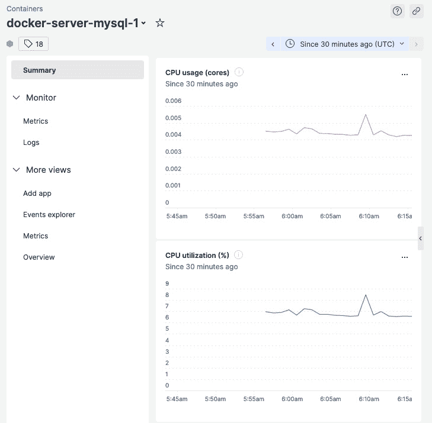

# 监控

在现实世界中，在生产环境中，您的应用程序将真正受到极限的考验。尽管在开发测试场景和通过不同阶段的质量保证方面付出了很多努力，但仍然会有一些边缘情况，开发团队或质量保证团队可能没有考虑到，因此这些遗漏的边缘情况可能会导致错误发生。有时会遇到与硬件相关的问题，或者有时可能会有一些代码相关的性能瓶颈导致超时和不愉快的客户。这种情况会发生，但并非世界末日。如果开发团队能够访问生产环境的用法统计信息、容器的 CPU 或内存使用情况、最常访问的控制器、异常的堆栈跟踪等，那将是极好的。

拥有这些信息将帮助您和您的团队在问题发生时更快地解决问题。这将使您和您的团队能够更好地理解您的应用程序被使用的程度。在本章中，我们将使用一个**应用程序性能监控**（**APM**）工具来收集和查看这些宝贵的应用程序性能和用法数据。

在本章中，我们将讨论以下主题：

+   为 PHP 设置 New Relic APM

+   查看应用程序性能数据

# 技术要求

对于本章，您应已通过 *第十章*，*持续交付* 的流程和步骤，并且需要能够访问用于托管 PHP 应用程序的 AWS EC2 实例；PHP 应用程序的代码库可以在 [`github.com/PacktPublishing/Test-Driven-Development-with-PHP-8/tree/main/Chapter%2010`](https://github.com/PacktPublishing/Test-Driven-Development-with-PHP-8/tree/main/Chapter%2010) 找到。

# 为 PHP 设置 New Relic APM

市面上有很多不同的 APM 工具，但在这本书中，我们将只关注使用 New Relic。

New Relic 提供了许多性能监控工具，但在这本书中，我们将专注于监控我们的 PHP 应用程序及其运行的基础设施。

在本节中，我们将安装和配置 New Relic PHP 代理到我们的 EC2 实例中，以便我们开始收集 PHP 和服务器数据。

## 创建 New Relic 账户和许可证密钥

在将 New Relic 代理安装到 EC2 实例之前，您需要的是一个免费的 New Relic 账户。您可以在 [`newrelic.com/signup`](https://newrelic.com/signup) 注册以创建一个免费账户。您将在设置过程中稍后需要您的许可证密钥。

许可证密钥可以在**管理**仪表板下的 New Relic **API 密钥**页面找到：


图 11.1 – 许可证密钥

您可以从本页复制许可证密钥，并在下一步中设置代理。

## 在 PHP 8 容器中安装 New Relic 代理

要安装 PHP 代理，我们需要连接到我们用于托管应用程序的 AWS EC2 实例。

使用 SSH 或 AWS EC2 实例连接 Web 应用程序连接到 EC2 实例。

一旦进入实例，我们将在容器内安装代理。这可以是您部署自动化的一部分，但在这本书中，我们将手动安装它。您可以使用以下命令连接到您的 PHP 容器：

```php
docker exec -it docker-server-web-1 /bin/bash
```

一旦进入容器，运行以下命令来安装 PHP 代理：

```php
curl -L "https://download.newrelic.com/php_agent/release/newrelic-php5-10.2.0.314-linux.tar.gz" | tar -C /tmp -zx
export NR_INSTALL_USE_CP_NOT_LN=1
/tmp/newrelic-php5-*/newrelic-install install
```

运行这些命令后，您将被提示输入您的 New Relic 许可证密钥。从 New Relic 的**API 密钥**页面粘贴许可证密钥，并完成安装过程：


图 11.2 – PHP 代理安装结果

安装过程完成后，您会注意到在`/usr/local/etc/php/conf.d/newrelic.ini`中创建了一个新的`ini`文件。您可以手动修改此文件以设置您选择的 PHP 应用程序名称，或者只需运行以下命令：

```php
sed -i \
      -e 's/newrelic.appname = "PHP Application"/newrelic.appname = "NEWRELIC_TDDPHP"/' \
      -e 's/;newrelic.daemon.app_connect_timeout =.*/newrelic.daemon.app_connect_timeout=15s/' \
      -e 's/;newrelic.daemon.start_timeout =.*/newrelic.daemon.start_timeout=5s/' \
      /usr/local/etc/php/conf.d/newrelic.ini
```

更新`newrelic.ini`文件后，通过运行以下命令重启`apache2`：

```php
service apache2 restart
```

新的 Relic PHP 代理现在已安装在我们为 Symfony 和 Behat 应用程序服务的 PHP 容器中。

接下来，我们将检查代理是否能够将数据发送到 New Relic，并且我们将通过 New Relic 仪表板查看我们将能够获得哪些性能数据。

# 查看应用程序性能数据

在上一节中，我们安装了一个工具来从我们的 PHP 应用程序中收集性能和用法数据。除非我们能够查看并理解这些数据，否则这些数据将毫无用处。

要查看我们刚刚安装的 PHP 代理正在收集的数据，请按照以下步骤操作：

1.  返回到[`one.newrelic.com`](https://one.newrelic.com)上的**new relic**仪表板，然后点击**APM & services**菜单项：


图 11.3 – New Relic 服务 – APM

1.  接下来，点击仪表板上的`NEWRELIC_TDDPHP`项目。您会注意到这与我们在`/usr/local/etc/php/conf.d/newrelic.ini`文件中使用的 PHP 名称相同。


图 11.4 – newrelic.ini – newrelic.appname

一旦您监控了许多应用程序，这些应用程序名称将非常有用，因此如果您能够标准化您的应用程序名称将非常棒。您可以在官方文档中了解更多关于 New Relic 的 APM 最佳实践，该文档位于[`docs.newrelic.com/docs/new-relic-solutions/best-practices-guides/full-stack-observability/apm-best-practices-guide/`](https://docs.newrelic.com/docs/new-relic-solutions/best-practices-guides/full-stack-observability/apm-best-practices-guide/)。

点击`NEWRELIC_TDDPHP`项目后，您将被重定向到 APM 仪表板：


图 11.5 – PHP APM 仪表板

在仪表板上，您将能够查看关于我们正在监控的 PHP 应用程序的不同指标。例如，我们可以检查哪些数据库操作执行时间最长：


图 11.6 – 数据库操作

您和您的团队能够从这些仪表板上报告的数据中学到很多东西。您可以发现性能瓶颈，并查看用户遇到的所有错误异常。

在**错误**仪表板上，您将能够查看应用程序报告的错误指标：


图 11.7 – 错误仪表板

您还可以点击错误项本身以深入了解正在发生的事情：


图 11.8 – 异常跟踪

在这里，您可以看到哪个特定的对象抛出了异常，以及抛出了什么异常，以及堆栈跟踪。这些都是对您和您的团队发现和解决问题非常有价值的信息。

## 监控您设置中的其他容器

在我们的示例应用程序中，我们使用了不止一个容器。我们还可以监控这些容器，例如 MySQL 服务器，以及我们之前使用的那个示例`phpMyAdmin`容器。

在 EC2 控制台中，运行以下命令将 New Relic 代理安装到我们的 AWS EC2 Linux 实例中：

```php
curl -Ls https://download.newrelic.com/install/newrelic-cli/scripts/install.sh | bash && sudo NEW_RELIC_API_KEY=<your licence key> NEW_RELIC_ACCOUNT_ID=<your account id> /usr/local/bin/newrelic install -n logs-integration
```

请确保包括您的 New Relic 许可证密钥和账户 ID，这些可以在之前章节中提到的**API 密钥**页面找到。

安装过程完成后，返回**New Relic**仪表板，在左侧菜单中点击**所有实体**菜单项，然后选择**容器**。您将看到该 EC2 实例中所有的 Docker 容器：


图 11.9 – Docker 容器性能监控

如果您点击列表中的其中一个容器，您将能够获取更多关于该容器的指标，例如内存使用情况、CPU 利用率等：



图 11.10 – MySQL 容器指标

所有这些数据可视化工具都将帮助您更好地了解您的容器和应用程序的使用情况，并在出现性能问题时帮助您诊断问题。

# 摘要

在本章中，我们已经讨论了将 APM 工具作为您设置的一部分的重要性。我们已经将 New Relic APM 代理安装到我们的 AWS EC2 实例和 Docker 容器中，以开始记录性能和用法数据。使用 APM 工具完全是可选的，但拥有一个将帮助您和您的团队能够通过提供真实的生产性能数据来更快地解决问题。通过拥有 APM 工具，您将能够更好地理解您的应用程序，并且它将帮助您优化和改进您的应用程序。
