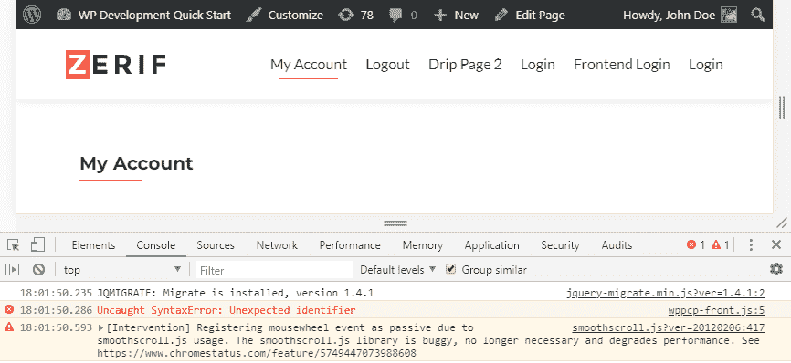
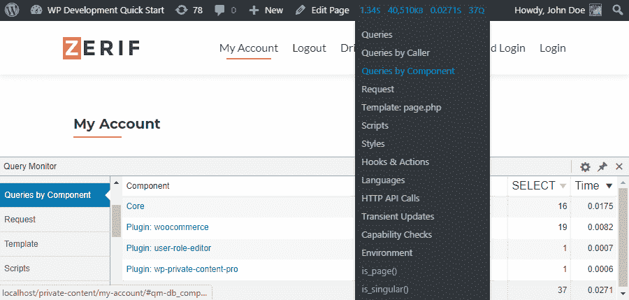
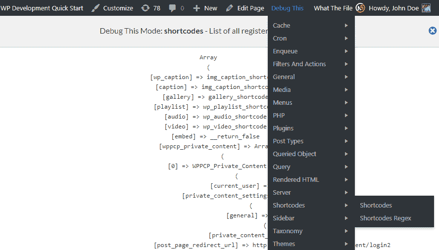
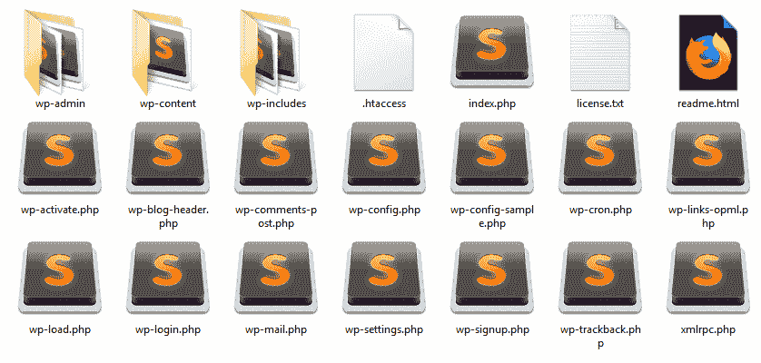
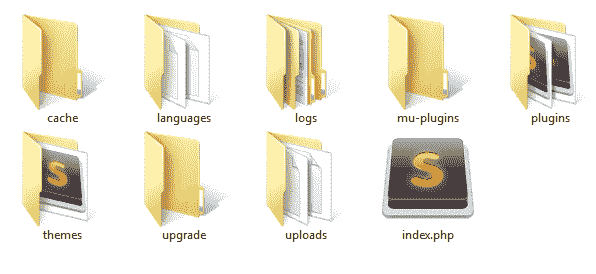

# WordPress 开发简介

WordPress 是世界上使用最广泛的 CMS，对开发者的需求正在上升。初学者 WordPress 开发者通常局限于使用现有插件和通过主题功能文件进行微调。作为一名开发者，你需要对 WordPress 核心模块和组件有深入的了解，以及一个适当的开发环境来应对复杂的应用需求。

本章的重点是向您介绍 WordPress 开发的先决条件，同时澄清一些关于开发的误解。与其他框架不同，WordPress 没有 MVC 架构或类似架构。因此，开发者有自由去寻找自己的技术。我们将从开发者如何使用现有功能进行开发，以及将我们的代码与 WordPress 组件集成的技术进行概述开始。然后，我们将继续讨论 WordPress 的安装以及默认和高级配置下配置文件的使用。开发工具和编码标准是生产高质量代码的关键，因此我们还将讨论 WordPress 特定编码标准的使用以及流行开源开发工具的使用。

在本章中，我们将涵盖以下主题：

+   安装和配置 WordPress 开发环境

+   如何使用 WordPress 配置文件

+   WordPress 文件/目录结构的高级概述及其在开发中的使用

+   WordPress 编码标准和其使用的简要介绍

+   使用流行的工具进行代码调试

到本章结束时，你将具备理解 WordPress 关键开发领域和为流畅的工作流程准备开发环境所需的知识。

# WordPress 开发简介

本书旨在为初学者 WordPress 开发者和希望使用 WordPress 构建自定义网站的网站所有者编写。我们深入探讨使用 WordPress 开发解决方案，了解开发的确切含义和涉及到的领域非常重要。许多人自称是 WordPress 开发者，但实际上他们所做的只是改变一些主题设计和使用主题功能文件。WordPress 开发可以从简单的主题设计更改到构建复杂的网络应用程序。

下面是 WordPress 开发中涉及到的组件：

+   **主题功能文件**：开始开发时遇到的第一项技术。通常，我们可以使用过滤器和动作添加小的代码片段来改变主题或插件的功能。由于此文件在主题更新时会被更新，因此不建议添加自己的自定义代码。然而，在使用自己的主题或没有版本更新的主题时，有一些例外。这是一个添加一些代码并学习如何通过动作和过滤器自定义 WordPress 的好起点。

+   **子主题**：这是开发过程中的下一步，在深入使用插件进行复杂实现之前。子主题是基于现有主题创建的主题。我们可以选择覆盖子主题中的所有文件，或者只添加必要的文件以覆盖。如果你刚开始 WordPress 开发并想添加一些快速代码片段，创建子主题并使用函数文件是理想的解决方案。在开发过程中，子主题应用于较小的实现，如设计更改或在前端屏幕上显示更多/更少的数据。由于我们只使用`functions.php`文件进行代码更改，因此不建议使用此技术来实现高级功能。然而，现代主题功能丰富，因此在子主题中进行高级实现可能会有例外。

+   **插件**：作为开发者，开发插件是构建自定义网站最重要的方面。插件允许你构建独立和可扩展的解决方案。通常，将任何定制添加到单独的插件或基于其范围的特定站点通用插件中是一个好习惯。你可以创建插件来自定义现有的 WordPress 后端和前端功能、主题功能，以及开发超出 WordPress 内置模块的完全新功能。

+   **插件扩展**：尽管我们称之为插件扩展，但它们是扩展另一个插件功能的插件。在 WordPress 开发中，我们不会从头开始构建一切，因为有一个庞大的免费插件库和数千个付费插件可以完成各种任务。大多数这些现有插件可能无法完美地满足我们的需求。因此，我们需要一种方法来定制这些插件的功能，而不会在插件更新时丢失更改。插件扩展通过使用插件提供的动作、过滤器和 API 来实现。

这些是开发自己的 WordPress 解决方案的主要组件和文件。现在，我们需要将重点转移到开发中涉及的主要领域以及它们如何适应 WordPress。让我们回顾一下在开发中现有功能的用法以及自定义构建功能的用法。

# 帖子、页面和自定义帖子类型管理

自 WordPress 诞生以来，它一直被用作以博客为主的 CMS。经过这么多年，帖子页面仍然是 WordPress 的主要方面，加上自定义帖子类型。许多网站的主要功能是帖子管理。因此，你需要掌握帖子创建、编辑、显示和管理附加数据的各个方面。随着自定义帖子类型的出现，开发者可以满足许多用户数据捕获应用的需求。由于基本功能如创建、编辑、显示和列表都内置在自定义帖子类型中，开发者可以快速扩展这些功能。

许多大型应用程序，如活动管理系统、在线商店、房地产网站和职位管理网站，都是使用自定义帖子类型建模的，因此它是 WordPress 开发中的一个主要功能。

# 用户管理

这又是一个具有全面功能，用于用户数据、访问级别和权限的内置模块。在许多现代应用程序和网站上，你可能需要注册成员。因此，你可以使用现有用户模块的功能来处理基本用户数据和权限，同时通过扩展核心功能来开发前端登录、注册和资料管理的高级功能。

与自定义帖子类型类似，你会发现许多应用程序的主要功能之一是用户管理。论坛、在线学生管理系统和 CRM 是 WordPress 中一些高级用户管理应用程序的例子。

# 表单数据管理

捕获、处理和显示用户数据的过程是许多网站的主要特征。我们之前已经讨论了使用自定义帖子类型来简化数据建模过程。然而，内置的自定义帖子类型功能仅限于后端。从前端捕获用户数据到自定义帖子类型，表单管理是必不可少的。在某些情况下，由于某些限制，我们不得不从头开始使用表单管理，而不使用自定义帖子类型。这些限制包括使用现有的数据库表、钩子和自定义帖子类型中的内置模板。

我们可以使用主题模板、短代码或现有的钩子来添加表单。在处理这些表单时，将使用现代 JavaScript 库，同时使用自定义数据库表来增强灵活性。因此，这是 WordPress 开发中另一项基本技能。

# 构建自定义布局和扩展主题布局

每个 WordPress 网站或应用程序都是围绕一个主题和一系列插件构建的。一般来说，大多数人更喜欢使用高质量的现有主题，而有些人则需要从头开始为他们构建一个完整的主题。无论这些偏好如何，你需要具备主题开发技能，以适应现代趋势。基于小部件的动态屏幕、响应式布局以及基于用户偏好的动态内容显示是主题中使用的现代趋势之一。最常见的发展形式是自定义现有主题布局和构建新的帖子/页面模板。

现代应用程序可能还需要你在主题中添加复杂功能，而不是将它们分离成插件。因此，你需要具备处理主题文件以及常见主题钩子的实际经验，以构建高级用户界面。

这些是 WordPress 开发中经常涉及的一些领域，因此你需要熟悉这些领域，以便能够快速提供解决方案。除了这些领域之外，你还可以使用现有的钩子扩展大多数 WordPress 功能，以及构建自定义功能，如 API、集成第三方 UI 组件等。

# 设置开发环境

为了开始 WordPress 开发，你需要一个支持 WordPress 的工作开发环境。因此，我们需要关注构建开发环境的必要步骤，如下所示：

+   安装支持 PHP、Apache 和 MySQL 或 Maria DB 的开发栈

+   安装和配置 WordPress

+   设置网络浏览器和代码编辑器

让我们快速查看每个选项，以构建理想的 WordPress 开发环境。

# 安装开发栈

运行 WordPress 的最基本要求包括 PHP、Apache 服务器和 MySQL 数据库。因此，我们需要从头开始安装这些组件，或者使用现有的工具，如 WAMP、XAMPP 或 MAMP。由于本书是关于 WordPress 开发的快速入门，我们将使用现有的工具，而不浪费时间去手动安装。你可以根据你的操作系统选择工具。对于本书，我们将在 Windows 平台上使用 WAMP 服务器。

WAMP 服务器提供了一个内置的安装过程，你只需要在通过几个定义良好的安装屏幕时提供所需输入即可。由于这已经在多个在线资源中讨论过，我们在这里不会解释安装过程。你可以参考 [`www.wampserver.com/en/`](http://www.wampserver.com/en/) 了解设置 WAMP 的说明。

# 安装和配置 WordPress

一旦安装了开发栈，我们就可以进入 WordPress 安装过程。WordPress 提供了安装软件框架的最简单自动化过程之一。完整的安装过程不超过 5-6 步，只需几分钟。由于它已经在 WordPress 代码库中得到了全面记录，我们不会浪费时间从头开始解释。你可以参考 [`codex.wordpress.org/Installing_WordPress#Detailed_Instructions`](https://codex.wordpress.org/Installing_WordPress#Detailed_Instructions) 了解完整的安装过程。

尽管安装过程很简单，但配置可能会根据你的要求和不同的环境而有所不同。因此，我们将在接下来的章节中详细讨论配置。

# 设置网络浏览器和代码编辑器

作为开发者，您应该在您的系统上安装至少两个浏览器。WordPress 经常更新到现代库和趋势的现代版本，如响应式设计。因此，您需要确保可用的浏览器已更新到最新版本。此外，您可能还需要安装所有流行的浏览器，如 Chrome、Firefox、Opera、Safari 和 Internet Explorer，以符合浏览器兼容性。

代码编辑器是开发的重要方面之一，开发者需要选择一个符合他们个人兴趣的工具。一些流行的代码编辑器包括 Sublime Text、Brackets、Textmate 和 Notepad++。在选择代码编辑器时，您需要寻找以下基本功能：

+   支持的编程语言

+   语法高亮和代码可读性

+   自动完成

+   简化的缩进和格式化

+   版本管理

+   文件/文件夹搜索和替换

许多这些编辑器都是功能齐全的解决方案，因此所有这些功能都是默认可用的。在这种情况下，您可以根据个人偏好做出决定。到此，我们的开发环境已经准备好，配备了启动所需的常见工具。

# 准备开发工具

尽管我们可以立即开始开发，但拥有使我们的任务更容易作为开发者的必要工具，同时节省宝贵的时间，这一点很重要。您可以在创建用于测试和调试代码以及帮助您定位实现中问题的数百个开发者工具中找到。在这里，我们将探讨一些最必要的工具来支持您的开发。

# 使用浏览器开发工具进行客户端监控

曾经我们不得不安装不同的扩展来在不同的浏览器中使用开发工具。现在，开发工具已成为所有现代浏览器最新版本的标准。这些工具提供了广泛的调试代码的便利设施。以下截图预览了 Chrome 浏览器的开发者工具部分：



上一张截图预览了控制台标签页，在这里您将看到与用户请求相关的错误、通知和信息。此标签页简化了跟踪和修复客户端编码中错误的过程。我们还可以使用其他标签页，如“资源”、“网络”、“性能”、“安全”来跟踪 AJAX 请求、文件加载优先级、内存和带宽使用，以及可能的安全风险。

“AJAX 是异步 JavaScript 和 XML 的缩写。AJAX 是一套使用许多客户端 Web 技术来创建异步 Web 应用的 Web 开发技术。使用 Ajax，Web 应用可以在不干扰现有页面显示和行为的情况下，异步（在后台）从服务器发送和检索数据。”

– 维基百科

其他浏览器提供了具有类似功能的内置开发工具。Firefox 浏览器包括 Inspector、Console、Debugger、Style Editor、Performance、Memory、Network 和 Storage 标签页。Internet Explorer 包括 DOM Explorer、Console、Debugger、Network、UI Responsiveness、Profiler 和 Memory 标签页。主要功能集在所有浏览器中都是一致的。作为开发者，您至少应该使用浏览器工具来完成一些简单任务，例如监控错误、检查 HTML 标签、跟踪 AJAX 请求和测试 CSS 样式。

# 使用 WordPress 插件进行服务器端监控

WordPress 插件库提供了相当多的插件来帮助开发者跟踪错误、性能问题、请求中使用的样式、执行的钩子、加载的脚本以及各种其他有用的功能。选择使用多少插件以及使用哪些插件取决于您。在本节中，我们将探讨一些最受欢迎的调试和测试插件。

# 查询监控

这是调试类别中最近更新插件中最广泛使用的插件。此插件的主要功能是监控用户请求中的数据库查询，并帮助您优化它们。我们使用许多插件来构建 WordPress 网站，因此每个用户请求可能执行大量查询。在大多数情况下，相当一部分查询与用户请求无关，是由于插件开发者低质量的编码而执行。此插件允许您按插件跟踪查询，这使得识别负责执行大量查询以及不必要的插件的插件变得更容易。

以下截图预览了使用**Query Monitor**跟踪 WordPress 核心和单个插件执行的查询：



除了监控查询外，您还可以使用此插件来检查当前用户请求中加载的钩子、脚本和样式。Query Monitor 是 WordPress 的必备插件。您可以在[`wordpress.org/plugins/query-monitor/`](https://wordpress.org/plugins/query-monitor/)找到有关 Query Monitor 插件的更多详细信息。

# 调试此插件

这是最近创建的用于支持开发者的插件之一。与**Query Monitor**不同，此插件没有主要功能。相反，它为跟踪 WordPress 中所有类型的特性提供了广泛的功能。您可以跟踪短代码、文章类型、PHP 类/函数使用、媒体附件以及许多其他内容，包括我们在 Query Monitor 中已经讨论过的特性。

以下截图预览了使用 Debug This 的可用功能列表：



如您可能注意到的，这是一个对开发者极其有用的工具。唯一的缺点是信息以纯数组的形式输出，这使得阅读变得困难。尽管它缺乏使用用户友好的屏幕对信息进行适当组织，但您可以在不使用代码中的 `var_dump` 的情况下解决复杂问题。您可以在 [`wordpress.org/plugins/debug-this/`](https://wordpress.org/plugins/debug-this/) 找到有关“调试此”插件的更多详细信息。

除了这两个插件之外，还有更多有用的插件可以帮助开发者编写高质量的代码，并通过错误处理和优化节省时间。以下是在开发中使用的此类插件列表：

+   **文件内容** ([`wordpress.org/plugins/what-the-file/`](https://wordpress.org/plugins/what-the-file/)): 此插件允许您快速追踪当前用户请求中使用的模板和模板部分。它还支持基于 BuddyPress 的主题。

+   **调试栏** ([`wordpress.org/plugins/debug-bar/`](https://wordpress.org/plugins/debug-bar/)): 此插件类似于“调试此”插件。然而，它提供了更少的功能和更好的用户界面。

我们查看了 WordPress 插件库中最受欢迎的测试和调试插件。有付费插件和在线服务可以进一步改进开发过程。您可以测试这些插件，看看哪些适合您的开发环境。

# 配置文件的使用

WordPress 使用一个名为 `wp-config.php` 的配置文件，位于您 WordPress 安装根目录内。在前面的部分，我们介绍了安装过程，此文件根据指定信息自动生成。为了使用 WordPress 的高级功能，以及根据系统更改进行手动修改，我们将详细解释此文件。让我们快速查看此文件的初始内容，如下所示：

```php
define('DB_NAME', 'wpquick'); 
define('DB_USER', 'wpdadmin'); 
define('DB_PASSWORD', ' GBm+Hq1T1Clyq '); 
define('DB_HOST', 'localhost'); 
define('DB_CHARSET', 'utf8mb4'); 
define('DB_COLLATE', ''); 

define('AUTH_KEY',         '}ezywl=_z-&_r-Ter]^)GafZQ!;T}sG{`RI?y.!BDgKKtW6WLqk>FnH<p1@ZsHZ`'); 
define('SECURE_AUTH_KEY',  'm1+,]G-])dt)%T:9ziw;|,]s&k^ ^Z0Vp.7DaSC0U)GT>*GY:jW@'); 
define('LOGGED_IN_KEY',    '&W_%WB%jjS0+_oBN:-cz5]qK<Jv*1{oM vji[~}k(uN*`g>wczC}<6?8t!BX{Z;G'); 
define('NONCE_KEY',       'vL9gM*pJPP3BC>I29+8*f[[)%kI$>)^clg%T;`9ONsl7RXAkzm]oX18Y~1c.;n%6'); 
define('AUTH_SALT',        'y>:&&$GBm+Hq1T1Clyq=Vp{Mk>f;nRofa/f!i}ex(m&-rs&dkT!ja0ilwJD~Lk4qQ'); 
define('SECURE_AUTH_SALT', 'PQMwuucwM`=0z7AwEJO@## }kQ]+o,bl2CZ()!d|*_FEl)>iI'); 
define('LOGGED_IN_SALT',   'XDlT]5pBg4jTg=e#XA2u{CTrdP!SU|aD o&Rq4/}: !Gu_2;)u-nW}0(/EEu4Ysb'); 
define('NONCE_SALT',       'CCX2?iAcCJ{Se5!ViEUO(/E0~/`ez_TZ=oAFrZ?DMru/RzLz(iPv(LwV%L0#a5px'); 

$table_prefix  = 'wp_'; 
define('WP_DEBUG', false); 

if ( !defined('ABSPATH') ) 
   define('ABSPATH', dirname(__FILE__) . '/'); 
require_once(ABSPATH . 'wp-settings.php'); 
```

文件的第一部分处理您网站的数据库配置。如您所见，数据库详细信息已根据您在安装过程中提供的输入自动添加。当您将网站从本地环境迁移到生产环境，或者更改数据库详细信息（如用户名和密码）时，您需要手动修改此部分。一旦数据库详细信息被修改并保存，它将立即影响您网站的加载。

下一个部分定义了 WordPress 的安全密钥。这些密钥在 WordPress 安装时自动生成。在没有安全密钥的情况下，您可以访问[`api.wordpress.org/secret-key/1.1/salt/`](https://api.wordpress.org/secret-key/1.1/salt/)并生成一组新的密钥。本节包含四个密钥和四个盐值，用于您的网站。这些密钥用于保护用户的 cookies。您不需要了解每个密钥的含义或记住这些密钥。WordPress 将使用这些密钥生成 cookie 名称以及 cookie 值的哈希值，这使得黑客攻击您的认证信息变得困难。尽管我们采取了多少安全预防措施，但由于 WordPress 的开源性质和第三方插件的使用，您的网站仍然有可能被黑客攻击。在这种情况下，您可以重新生成并添加这些密钥到配置文件中。这将使所有现有的 cookies 失效，因此所有用户都必须重新登录。

下两行定义了表前缀和调试模式。前缀是通过安装过程中提供的输入配置的。建议将前缀更改为除`wp`之外的其他任何内容，以提高安全性。默认情况下，调试模式设置为`FALSE`，因此您不会在网站上看到任何 PHP 错误。在开发环境中，您应该将此值更改为`TRUE`，以便识别代码中的错误。一旦开发完成，您应该在将文件上传到实时服务器之前将其改回`FALSE`。最后几行定义了文件路径，并加载设置文件。

这是`wp-config.php`文件的最基本版本，它足以处理基本的 WordPress 网站。

# 高级配置概述

作为一名开发者，您将需要从简单的 WordPress 博客构建到完全功能性的网络应用程序。因此，高级配置对于安全性、高级功能和应用程序的性能变得非常重要。让我们快速了解一下您如何使用其他配置选项修改配置文件。

# 保护插件和上传目录

由于 WordPress 的开源性质，每个人都知道插件和文件在您的网站中的存储位置。因此，黑客或垃圾邮件攻击者对您的网站进行攻击的过程变得更容易。作为解决方案，我们可以使用配置文件将插件和上传目录移动到不同的路径，以增加攻击者找到攻击路径的难度。

让我们添加更多配置来更改这些目录的默认位置：

```php
define( 'WP_PLUGIN_DIR', $_SERVER['DOCUMENT_ROOT'] . '/example.com/modules/' ); 
define( 'WP_PLUGIN_URL', 'http://localhost/ example.com /modules/'); 
define( 'UPLOADS', 'modules/media' ); 
```

前两行将插件目录从 `wp-content/plugins` 移动到您根目录中的 `modules` 目录。由于路径已更改为根目录，攻击者将难以识别路径。这些配置仅更改目录。如果您已经在 `wp-content/plugins` 目录中安装了插件，您将不得不手动将它们移动到新目录。下一行将媒体上传路径从 `wp-content/uploads` 更改为主安装内的 `modules/media` 目录。

将主题目录移动的过程并不简单，因为路径是相对于 `wp-content` 目录配置的。因此，在您想要更改主题目录的情况下，您将不得不更改 `wp-content` 目录的主路径。您可以手动使用这些配置，或者使用现有的插件来帮助保护您的网站。

# 配置高级调试设置

之前，我们通过将 `WP_Debug` 设置为 `TRUE` 在开发环境中启用了调试。还有更多设置可以控制调试过程并提供有关我们代码中问题的更多信息。让我们了解一下开发者的一些高级选项。

# 脚本调试

通常，由于不同插件和主题中使用不同的脚本版本，JavaScript 文件中的冲突是一个常见问题。当使用压缩版本和合并的脚本文件时，识别这些错误是一个繁琐的过程。让我们看看用于解决这些问题的规则：

```php
define( 'SCRIPT_DEBUG', true ); 
define( 'CONCATENATE_SCRIPTS', false ); 
```

第一行通过加载未压缩的文件而不是压缩版本来启用脚本调试。第二行防止多个脚本的合并，允许您跟踪错误的行。当您在 WordPress 核心文件中遇到脚本问题时，应使用这些配置规则。

# 记录错误和自定义 php.ini 规则

我们可以在浏览器中显示编码错误或将它们记录到单独的日志文件中。这取决于开发者的偏好，但我觉得记录错误是未来参考的理想解决方案。此外，有时我们需要更改 PHP 配置以使我们的代码工作。许多托管服务器不允许您直接编辑 `php.ini` 文件，因此我们可以使用 `wp-config.php` 文件来覆盖 `php.ini` 文件的默认设置。

一些托管提供商不提供更改 `php.ini` 文件的访问权限，您将不得不通过服务器支持请求修改。

考虑以下配置规则，通过修改 `php.ini` 进行错误日志记录：

```php
@ini_set( 'log_errors', 'On' ); 
@ini_set( 'display_errors', 'Off' ); 
@ini_set( 'error_log', '/home/example.com/logs/php_error.log' ); 
```

首先，我们通过使用 `display_errors` 设置启用 PHP 错误记录并禁用在浏览器中显示错误。然后，我们定义错误将被记录的文件路径。您需要首先创建此目录，并在此规则生效之前提供必要的写入权限。

在本节中，我们简要概述了 WordPress 开发中最基本和高级的配置。还有很多其他设置可以帮助开发者，以及控制功能。您可以在 WordPress 手册中查看可用的配置及其用法，网址为[`codex.wordpress.org/Editing_wp-config.php`](https://codex.wordpress.org/Editing_wp-config.php)。现在，我们已经有了完整的设置，可以开始基于 WordPress 的开发任务。

# 理解 WordPress 文件和目录结构的作用

开始 WordPress 开发并不是一个复杂任务。它涉及对主题进行细微的修改、安装和定制现有插件，以及使用可用的钩子。随着您的进步，您会遇到更复杂的需求，并期望得到未来兼容的解决方案。在不考虑未来 WordPress、插件和主题版本的情况下尝试构建这样的解决方案可能会导致噩梦。熟悉现有的 WordPress 文件/目录及其作用对于开发可维护的解决方案至关重要。在本节中，我们将查看默认 WordPress 安装中现有的文件和目录。

以下是你 WordPress 安装中典型文件和目录的截图：



让我们来看看 WordPress 内部一些最重要的文件和目录：

+   `wp-admin`：这是 WordPress 存储与后台功能相关的文件的地方。这个目录中的文件基于`admin.php`文件。这些文件的主要功能包括检查管理员权限、连接到数据库以及加载管理员仪表板功能。这个目录会随着 WordPress 版本更新而升级，因此这些文件的内容会被替换。

+   `wp-content`：这是 WordPress 存储用户上传的文件的地方，如插件、主题和媒体文件。我们可以在不受到 WordPress 版本更新影响的情况下在这里添加额外的文件/目录。因此，这个目录中的内容不会被替换。

+   `wp-includes`：这是 WordPress 中最大的目录，包含超过 800 个文件，用于提供管理员仪表板以及前端功能。这个目录中的主要文件是`functions.php`，被认为是主要的 WordPress API。这个目录会随着 WordPress 版本更新而升级，因此这些文件的内容会被替换。

+   `.htaccess`：这个文件是您描述 Apache 服务器配置规则的地方。默认情况下，它将包含最少的规则。您可以根据需求手动添加配置规则。有一些插件会自动将必要的配置规则添加到这个文件中。这个文件用于 WordPress 永久链接的配置。从 WordPress 设置部分更改永久链接结构是跟踪此文件中规则更改的最简单方法。

+   `index.php`：此文件负责根据用户请求初始化 WordPress，并提供服务响应。

+   `wp-config.php`：此文件用于网站的配置，包括数据库、密钥、插件和主题目录路径。因此，尽可能保持此文件的安全性非常重要。在 WordPress 版本升级时，此文件不会被替换，因此你可以使用自己的配置。

在这里，我们查看涉及开发的最重要文件和目录。你还可以查看其他核心文件的注释，以了解其功能。

# 如何选择开发所需的文件和目录

WordPress 开发的流程与其他 PHP 框架相比稍微更具挑战性。在任何一个其他框架中，我们选择一个特定的框架版本，并为该特定版本开发功能。升级我们解决方案框架的未来版本完全是可选的。然而，与 WordPress 相反。我们无法长时间坚持使用特定的 WordPress 版本，尤其是由于安全问题的考虑。你们大多数人都会希望 WordPress 发布新版本后立即升级版本。因此，开发不因版本升级而中断的解决方案非常重要。基本上，我们应该能够在不触及任何我们的代码的情况下升级 WordPress。

因此，你需要首先理解的是你可以将代码文件放在哪里，以及你如何在开发中使用 WordPress 的核心文件/目录。我们在上一节讨论了 WordPress 目录内的主要文件和目录。让我们缩小范围，专注于用于自定义开发的文件和文件夹。基本上，我们必须选择不会被 WordPress 更新所替换的文件和文件夹。在我们讨论的文件和文件夹中，`wp-content`、`wp-config.php`和`htaccess`不受升级的影响。因此，我们的开发应该专注于这些文件和文件夹。

正如我们提到的，`wp-content`是存储所有用户上传文件的目录。因此，我们需要在这个目录内添加我们的代码文件。让我们探索这个目录的内容，以了解可以创建在哪里以及什么类型的文件。

以下是你`wp-content`文件夹内文件和文件夹的截图：



上述截图包含了默认目录和根据自定义需求创建的自定义目录。让我们简要概述每个文件夹的作用：

+   `plugins`：这是 WordPress 存储运行网站所需所有插件的地方。在初始安装时，你会获得 Akismet 反垃圾邮件插件和 Hello Dolly 插件。之后，你可以使用这个目录添加自己的插件，以及从其他开发者那里安装现有的插件。这个目录可以被认为是 WordPress 开发的中心。

+   `主题`：这是 WordPress 存储所有主题的地方，这些主题为您的网站提供设计和初始功能。初始安装包含一些默认主题，例如**二十十七**、**二十十六**等。之后，您可以使用此目录添加自己的主题，以及从其他开发者那里安装现有主题。与插件不同，您在任何时候都只能从此目录中使用一个主题。

+   `上传`：这是存储所有用户上传的帖子、页面和插件文件的地方。此目录在您上传第一个文件之前不会创建。通常，帖子和页面的所有媒体文件都将存储在以年/月格式的子目录结构中。您可以为处理插件和主题的文件创建无限多的子目录。

+   `语言`：此目录在初始安装时不可用，当您在 WordPress 中更改语言时会创建它。因此，它对开发任务来说并不重要。

+   `mu-plugins`：此目录存储了网站必须使用的插件，初始安装时不可用。必须使用的插件是运行网站所必需的插件，因此无法停用。这些插件在您的 WordPress 安装的所有网站上自动启用。尽管在某些情况下这些插件很有用，但由于执行某些钩子时的某些限制，使用它们并不理想。因此，我们不会考虑将它们纳入本书的开发任务中。

+   `升级`：此目录默认不可用，用于存储 WordPress 版本升级的临时文件。因此，对我们开发任务来说非常重要。

+   `缓存和日志`：这些是一些由插件或主题创建的用于处理某些功能的自定义目录。我在此截图中使用它们来解释自定义文件夹的使用。您可以创建这样的自定义文件夹来处理与主题或插件相关的文件。

在快速浏览了文件和目录之后，我们可以得出结论，我们的主要关注点应该是`wp-content`目录内的`插件`、`主题`和`上传`目录。在这些目录中使用代码和媒体文件确保我们的解决方案不会被版本升级所清除。

# WordPress 编码标准的简要概述

在编程中，编写可工作的代码并不是开发者唯一的职责。他们还需要负责编写高质量的代码，这些代码可以扩展以供未来的增强，并确保代码对其他开发者易于理解。这就是编码标准成为开发重要方面的地方。编码标准是一套针对特定编程语言的规则和约定，所有开发者都应遵循这些标准以使代码保持一致性。

我假设你们熟悉 PHP 编码标准，并准备好利用这些经验来开发 WordPress。然而，WordPress 本身有一套编码标准，其中一些规则与 PHP 标准略有不同。编码标准目前分为四个部分，称为 PHP、HTML、CSS 和 JavaScript。作为一名开发者，你需要熟悉 WordPress 编码标准，尤其是在你为 WordPress 仓库开发主题和插件时。

让我们来看看 WordPress 中使用的一些主要 PHP 编码标准：

+   **单引号和双引号**：PHP 处理单引号比双引号快，因为解析器不需要检测和执行任何变量。这就是为什么对于没有评估的字符串，最好使用单引号。

+   **缩进**：你应该使用制表符而不是空格来缩进代码。

+   **括号的开闭**：即使对于单行评估不是必需的，你也应该始终使用开闭括号。

+   **使用空格**：WordPress 建议在逗号后面，以及在逻辑、比较、字符串和赋值运算符的两侧放置空格。

+   **命名约定**：你应该始终使用小写字母和下划线来命名变量、函数、动作、过滤器等。WordPress 编码标准中不推荐使用`camelCase`方法。

+   **动态钩子**：钩子是 WordPress 特有的，因此指南建议通过将变量括在花括号中来使用插值，而不是使用连接。

这些是 WordPress 中的一些常见编码标准，你可以在[`codex.wordpress.org/WordPress_Coding_Standards`](https://codex.wordpress.org/WordPress_Coding_Standards)找到完整的标准集，包括 CSS、JavaScript 和 HTML。熟悉纯 PHP 编码的开发者会注意到 WordPress 标准中的一些细微变化，例如使用大量空格，并且函数不使用驼峰命名法。因此，即使是经验丰富的开发者，要想跳出舒适区，以 WordPress 的方式编写代码，也是一个挑战。

前一节介绍了主要的 PHP 编码标准。你们大多数人应该对这些标准有一个大致的了解，因为你们已经使用过 PHP。然而，由于基于钩子的架构，WordPress 有一些特定的编码风格/约定。你们中许多人可能没有意识到这些约定，但这些约定对于构建不与其他冲突的主题和插件至关重要。

让我们快速概述一下这些约定，这些将在本书的后续章节中详细讨论：

+   **加载脚本和样式**：通常，我们可以通过使用`<script>`和`<link>`标签在任何 HTML 页面中加载脚本和样式。WordPress 使用内置的 PHP 函数来加载脚本和样式。因此，建议您只在这些被称为`wp_enqueue_scripts`的操作中加载这些文件。在这些操作之外加载这些文件可能会导致与 WordPress 核心功能以及其他`插件`或`主题`的冲突。

+   **加载第三方库**：如**jQuery**、**Underscore**、**以及** **Backbone.js**这样的库在现代 Web 开发中经常被使用。通常，开发者有选择在他们的代码文件中包含这些库或从 CDN 加载它们以获得更快性能的选项。在 WordPress 中，由于涉及许多不同开发者的插件，这种方法是不可行的。因此，我们需要加载库的一个通用版本以避免代码冲突。所以，我们必须使用与 WordPress 内置的库版本。

+   **使用适当的执行事件**：在纯 PHP 编程中，我们可以根据我们的喜好在任何地方和任何时候执行代码。WordPress 使用基于钩子的事件驱动架构，因此代码以预定义的方式通过事件执行。除非我们使用正确的事件，否则我们的代码可能会与其他代码冲突。例如，我们需要在`init`钩子内或之后访问`$_POST`变量。在必要的事件之前尝试访问这些数据可能会导致代码中出错。

我们简要介绍了开始 WordPress 开发所需的编码标准和约定。通常，对于特定客户的开发项目来说，这已经足够了。然而，有时您可能需要进一步的知识，尤其是在插件和主题开发的事件驱动约定方面。我们将在接下来的章节中介绍必要的编码约定。

# 摘要

本章的目标是准备好环境并了解复杂开发任务的前提条件。我们探讨了将我们的代码集成到 WordPress 中的技术，以及确定开发中最常用的模块。

我们简要概述了开发环境的安装和配置，同时确定了简化我们任务的必要工具。最后，我们了解了 WordPress 文件和目录结构，以便我们的解决方案能够以未来兼容的方式提供。

在第二章“管理数据库结构、存储和检索”中，我们将探讨现有的 WordPress 数据库结构及其使用，同时讨论自定义数据库表的实际应用。
