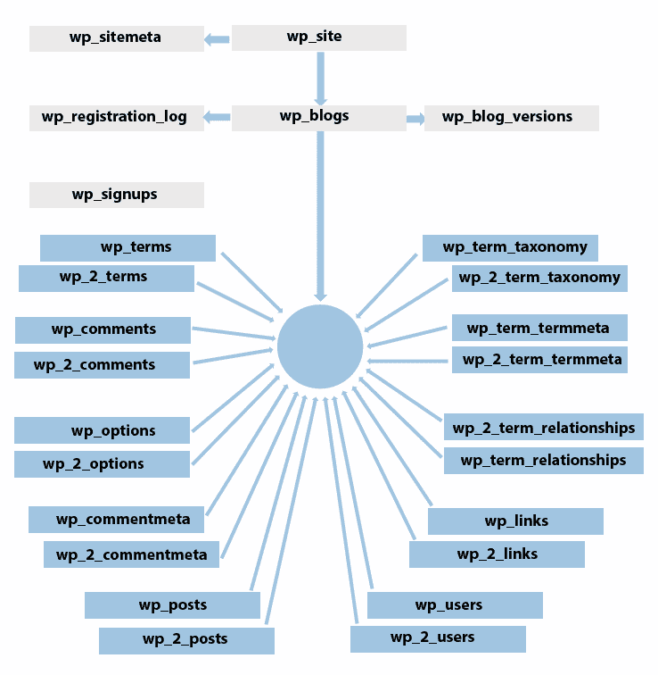

# 管理数据库结构、存储和检索

数据库是存储应用程序数据的主要位置。WordPress 提供了一个内置的数据库，其中包含预定义的表，与传统从零开始设计的 Web 应用程序相比，WordPress 的数据库设计更为成熟。熟悉现有数据库表的优势和劣势是开发高质量主题和插件的关键。

在本章中，我们将学习现有数据库表在 WordPress 中的功能和限制。您将了解现有数据库表及其作用，同时了解如何在常见功能（如文章创建、用户创建、媒体上传等）中管理数据。您还将了解在开发中自定义表的使用以及使用查询函数检索数据。

在本章中，我们将涵盖以下主题：

+   理解默认数据库表的作用

+   跟踪和理解主要功能数据库使用情况

+   创建和管理自定义表

+   实施 CRUD 操作

+   多站点数据库结构的简要概述

到本章结束时，您将具备最大化使用现有数据库表进行开发的知识，同时为高级用例使用自定义表。

# WordPress 数据库简介

规划和设计数据库的过程是任何项目最关键的阶段之一。一个良好的数据库设计可以简化未来增长的过程，同时提高数据存储和检索的性能。通常，识别实体及其之间关系是开发团队的职责。另一方面，WordPress 是一个 CMS，因此提供现有的数据库来处理核心功能。所以，在大多数情况下，规划数据库的过程并不是作为开发者的责任。相反，开发者面临着一个更艰巨的任务，即理解核心表并管理数据需求及其限制。当然，你可以为任何需求创建和使用自己的数据库表。但这样做就消除了在 WordPress 之上开发的目的。

WordPress 数据库目前支持 MySQL 和 MariaDB，其中 MariaDB 是最受欢迎的选择。然而，大多数现有的 WordPress 站点仍在使用 MySQL。在成功安装后，WordPress 将创建十一个数据库表来满足核心功能。自其诞生以来，向后兼容性一直是 WordPress 团队的首要任务之一。因此，在不久的将来，您可能不会看到这十一个表有重大变化。

# 理解内置数据库表的作用

WordPress 数据库结构旨在存储核心功能所需的最小数据量。因此，开发者需要彻底了解现有表，以便有效地使用它们来构建灵活的网站。让我们看一下最新 WordPress 版本的实体关系图：


如您所注意到的，所有现有的表与其他表的关系不超过一两个，因此理解和操作数据库变得是一个更简单的任务。现在，我们将查看每个数据库表及其重要列、其角色以及它是如何与其他表协同工作的。您需要参考前面的图表来可视化我们讨论中的要点。

# 与帖子相关的数据库表

直接涉及帖子的数据库表有三个，而处理与帖子相关数据的表有六个。许多现有的 WordPress 网站要么是只有几个页面的基本网站，要么是拥有数百篇帖子的博客。因此，大多数网站的数据都由这六个数据库表管理。让我们来看看与帖子直接相关的两个表。

# wp_posts

这是许多 WordPress 网站和应用程序的主要数据存储位置。此表包含帖子、页面和自定义帖子类型的主要数据。此表包含二十三列。让我们确定这个表中一些最重要的列：

| `post_author` | 在这里您可以找到创建帖子或页面的用户的 ID。此列用于与`wp_users`表建立关系。 |
| --- | --- |
| `post_content` | 帖子/页面的完整内容存储在这个列中。因此，这个列中的数据可以从几个词到数千个词和图片不等。 |
| `post_title` | 帖子/页面的标题存储在这个列中。它用于在后台识别页面以及在前端突出显示标题。 |
| `post_excerpt` | 此列中的数据是可选的，用于保存帖子/页面的摘要。通常，这用于帖子列表（存档）页面，以展示帖子的概要，并鼓励用户阅读整个帖子。 |
| `post_status` | WordPress 特定的帖子状态存储在这个列中。这些状态定义了帖子生命周期中的一个步骤。默认状态包括发布、待审、私有、未来、继承、垃圾箱、草稿和自动草稿。大多数这些状态都是不言自明的。然而，您可能需要关于继承和自动草稿状态的解释。WordPress 提供了在数据库中存储帖子修订版本的能力。当我们更新帖子时，数据库中的先前帖子数据自动成为标记为**继承**状态的修订版本。此外，WordPress 会在特定的时间间隔自动保存帖子，这些修订版本被标记为**自动草稿**。 |
| `post_password` | 此列存储受密码保护的帖子或页面的密码。 |
| `post_parent` | 此列存储父帖子的 ID。WordPress 支持附件、页面和帖子修订版本的子帖子。 |
| `guid`  | 帖子/页面的完整 URL 存储在这个列中。 |
| `post_type`  | 此处存储具有唯一键的类型文章。默认文章类型包括文章、页面、修订、附件和`nav_menu_item`。除了这些类型之外，您可以使用自定义文章类型创建任何新类型。 |

通常，此表旨在用于内置类型，如文章、页面、菜单和附件。随着自定义文章类型的引入，此表被广泛用于存储数据，如产品、论坛主题、属性以及您能想到的任何东西。

# wp_postmeta

这是文章的二级存储，其中存储与文章和页面相关的可选数据。此表包含四个列。让我们确定此表中一些最重要的列：

| `post_id` | 这是您找到包含这些附加数据的文章 ID 的地方。此列用于与`wp_posts` 表形成关系。 |
| --- | --- |
| `meta_key` | 所有附加文章数据都保存为键值对。此列定义了文章数据的标识。应使用字母数字字符、下划线和破折号为此列使用唯一键。默认情况下，WordPress 存储文章和页面的**编辑锁定**信息。随着您向文章或创建菜单添加数据，您将看到更多带有下划线前缀的键存储。这与我们作为开发者所使用的不同，我们使用不同的表存储这些数据，并将这些键作为列。 |
| `meta_value` | 此列包含指定元键的相关文章数据。通常，这些值以纯文本或序列化值的形式存储。 |

通常，此表用于存储从文章编辑屏幕添加的管理级别值和自定义字段。在具有自定义文章类型的大型网站上，此表变得至关重要。在这样的网站上，我们可以存储数据，如在线商店中的产品选项、房地产网站中的房产详情以及工作管理网站中的工作详情。

# 术语相关表格

在本节中，我们可以找到四个表格，旨在处理特定文章的分类。在 WordPress 中，我们使用术语*taxonomoy*来表示这些分类。默认情况下，我们有两个分类法，即分类和标签。这些表格能够处理这两种分类法类型以及您自己的分类法类型。让我们详细查看这四个表格。

# wp_terms

这用于存储分类法的选项。您应该了解 WordPress 文章中的分类和标签。我们称那些类型为分类法。分类法内的选择称为术语。**分类**是一个分类法，我们创建的诸如健康、体育和旅行之类的选择被认为是术语。此表包含四个列。让我们确定此表中一些最重要的列：

| `name` | 存储在网站前端显示的术语标题 |
| --- | --- |
| `slug` | 存储术语的唯一标识符 |

WordPress 初始安装生成了两个分类法，称为分类和帖子标签。然而，默认情况下没有创建任何术语，只包含**未分类**作为术语。我们可以使用这个表来创建帖子标签或分类选择。我们还可以在自定义场景中使用它来创建术语，如 WordPress、PHP 和 jQuery，用于工作管理网站中的工作技能。

# wp_termmeta

这是存储术语数据的二级位置。这个表由四个列组成，并且使用键值对的方式与其他元数据表类似工作。

默认情况下，这个表不常使用。你可以使用这个表来存储你自己的术语的附加细节。假设你有关于文章的术语，如体育、健康、旅行。你想要使用不同的设计来显示每个类别的存档页面。在这种情况下，你可以在术语元表中存储 CSS、图片、模板，并使用这些信息来加载设计。

# wp_term_relationships

这曾经用于在帖子与术语之间建立关系。这个表由三个列组成，并且只使用 ID 作为数据。让我们来识别这个表中一些最重要的列：

| `object_id` | 存储与分类相关联的帖子或自定义帖子类型的 ID |
| --- | --- |
| `term_taxonomy_id` | 存储分类法的 ID |

这是一个纯粹关联表，通过 ID 连接两个表。作为开发者，你只需要分配关系，这个表不根据站点类型有不同的用途。

# wp_term_taxonomy

这个表存储了称为分类法的分类类型。这个表由六个列组成。让我们来识别这个表中一些最重要的列：

| `term_id` | 这是术语的 ID，用于与`wp_terms`表建立连接。 |
| --- | --- |
| `taxonomy` | 这是分类法的唯一 slug。默认分类法是分类和`post_tag`。 |
| `parent` | 存储在网站中使用子术语时的父术语。 |
| `count` | 存储属于此分类法的帖子数量和自定义帖子类型。 |

这个表包含默认的分类和`post_tag`分类法，用于正常 WordPress 帖子。我们可以在工作管理网站上创建如工作技能这样的自定义分类法，在线商店中的产品类型，房地产网站中的属性特征等等。

# 用户相关表

用户数据通过现有数据库中的两个表进行管理。默认情况下，我们在这些表中存储了关于用户的基本详细信息。现代网站引入了个性化内容的概念，因此用户管理变得越来越重要。所以，你会在许多网站上看到这些表的大量使用。让我们详细看看这两个表中的每一个。

# wp_users

这是用户的主要存储位置，由十个列组成。让我们来识别这个表中一些最重要的列：

| `user_login` | 用作网站的登录名。您可以使用自己的实现允许用户更改它。然而，此值需要是唯一的。 |
| --- | --- |
| `user_pass` | 存储用户的加密密码。 |
| `user_email` | 用作用户的电子邮件。由于 WordPress 允许用户使用电子邮件登录，因此此值对于每个用户都必须是唯一的。 |
| `user_registered` | 存储注册日期，常用于对用户列表进行排序或在基于会员的网站上分配会员期限。 |

此表中的数据不会根据您正在开发网站的类型而改变，因此您只需要了解在此表中插入、更新和删除用户的知识。

# wp_usermeta

用作用户数据的次要位置。默认情况下，它跟踪名称、描述、能力等。此表由四列组成。以下表格中我们将识别一些最重要的列：

| `user_id` | 这是您找到此数据所属用户 ID 的地方。此列用于与`wp_users`表建立关系。 |
| --- | --- |
| `meta_key` | 所有附加用户数据都保存为键值对。此列定义了用户数据的标识。应使用字母数字字符、下划线和短横线为该列使用唯一的键。这与我们作为开发者所使用的不同，我们使用不同的表来存储这些数据，并将这些键作为列。 |
| `meta_value` | 此列包含指定元键的用户相关数据。通常，这些值以纯文本或序列化值的形式存储。 |

除了默认选项之外，我们还可以使用此表来存储简单的自定义用户数据，如出生日期、国家、城市，以及高级用户数据，如兴趣和简介图片。

# 选项和评论表

本节由三个用于配置和评论的表组成。让我们详细查看这些表。

# wp_options

此表存储 WordPress 的所有内置和自定义设置。这是另一个类似于`wp_postmeta`和`wp_usermeta`的表，其中使用键值对来保存数据。此表中的默认选项包括网站 URL、网站描述、日期格式等。

开发者可以使用此表来存储他们主题或插件设置。通常，插件或主题设置以序列化值的形式存储在此表的单行中。然而，你可以根据你的偏好存储尽可能多的选项。

# wp_comments

此表存储文章、页面和自定义文章类型的评论。此表由十五列组成。以下表格中我们将识别一些最重要的列：

| `comment_post_ID` | 存储评论所属的文章、页面或自定义文章类型的 ID。 |
| --- | --- |
| `comment_author` | 保存创建此评论的用户名称。 |
| `comment_content` | 用于保存用户添加的评论。此列可以包含纯文本值，也可以根据网站允许的选项包含 HTML。 |
| `comment_approved` | 在大多数网站上，评论在公开显示之前需要经过审核。此列存储关于评论是否已批准或待批准的布尔状态。 |
| `comment_type` | 存储评论类型。默认评论类型包括评论、pingbacks 和 trackbacks。我们还可以使用自定义评论类型。 |
| `user_id` | 创建评论的用户 ID。此列用于与`wp_users`表建立连接。 |

通常，此表用于存储帖子、页面和自定义帖子类型的基本评论。然而，我们可以通过创新地使用评论来超越常规。我们可以使用评论作为基于问题的网站（如 stackoverflow）的答案、论坛主题中的用户消息或在线产品市场中的评论。

# wp_commentmeta

这用于存储额外评论数据的辅助位置。此表由四个列组成，其工作方式类似于 WordPress 中的其他元数据表。

此表没有默认用途。我们可以使用此表来存储额外的数据，例如产品评论网站中的评分、问答网站中的验证状态等。

在本节中，我们探讨了 WordPress 中的所有十一个默认数据库表及其在开发中的作用。您必须了解这些表中的每一列及其可能值，因为大多数 WordPress 开发都是在核心功能之上进行的。

# 理解数据库使用的重要性

在当今世界，许多开发者对 WordPress 核心功能缺乏深入了解，但仍然能够将您的需求转化为可行的解决方案。然而，这些解决方案通常基于假设，而不是了解底层的具体过程和数据使用情况。

跟踪数据库使用情况并了解任何给定过程的精确数据需求对于构建灵活且可扩展的解决方案，这些解决方案能够完美地与其他网站部分集成至关重要。让我们确定一些需要完美了解 WordPress 功能中数据使用情况的用例：

# 在前端构建现有功能

WordPress 为管理员级用户提供了一个功能强大的后端，其中包含许多功能。帖子创建和用户管理是后端的一些顶级功能。相比之下，现有的 WordPress 前端功能相对较弱，主要专注于显示数据。因此，将后端功能转移到前端是一个常见的需求，允许权限较低的用户从前端创建内容，而不必提供对后端的访问权限。

在这种情况下，我们需要了解后端过程中使用的确切数据，以便我们可以在前端过程中模拟它。通常，开发者对这些过程中存储的所有数据的必要知识不足。因此，此功能的客户端方面工作得很好，但由于数据不足，后端出现了问题。

让我们考虑一个简单的场景，即你希望让用户通过你网站上的表单上传文件，并将文件存储在 WordPress 媒体库中。乍一看，你会发现媒体文件存储在`wp_posts`表中，并包含必要的数据。因此，你将数据保存到`wp_posts`表中。然而，你可能没有注意到文件的其他元数据存储在`wp_postmeta`表中。因此，你的前端实现可能会破坏依赖于这些数据的核心功能或其他插件。

# 定制现有插件

在 WordPress 网站开发中使用其他现有插件几乎是肯定的。通常，这些插件并不直接满足我们的需求，因此定制成为明显的选择。了解数据的使用变得尤为重要，因为这些定制插件与核心功能相比，缺乏文档和代码质量。在不了解其数据使用的情况下定制插件，与核心功能相比可能会导致重大冲突。

在这种情况下，我们需要对文档进行彻底检查，以手动跟踪数据库使用情况，并在可能的情况下获得开发者的支持来构建定制解决方案。让我从一个我们自己的插件中举一个例子。我们有一个用户资料管理插件，其中我们在`wp_usermeta`表中存储额外的用户详细信息。由于在`wp_usermeta`表中搜索每个用户的数百行是一个繁琐的任务，所以我们也将所有附加数据存储在单行中作为搜索缓存。我们见过许多开发者定制插件以更新用户数据，却不知道需要搜索缓存值。尽管用户数据已更新，但由于缺少搜索缓存值，用户不会出现在搜索结果中。这种场景在插件定制中很常见，必须使用数据跟踪方法来识别和避免它们。

我们已经研究了跟踪和了解数据使用成为关键的最常见情况。你可能会发现其他不太常见的情况，其中数据的一致性变得至关重要。

# 如何跟踪 WordPress 中的数据库使用情况

我们确定了跟踪和了解核心功能以及定制功能的数据需求的重要性。接下来，问题是我们如何跟踪和理解数据以避免潜在的冲突。因此，我们需要一种记录/显示用户请求中运行的所有查询的方法。有无数种跟踪数据库查询的方法，包括付费的企业级工具和命令行。由于你刚开始 WordPress 开发，我们将探讨一些更简单且有用的方法，这些方法可以扩展你的知识。

# 使用 MySQL/MariaDB 日志文件

这是一种作为开发者必须知道的一个简单且重要的方法。MySQL 和 MariaDB 都允许我们创建一个日志文件，我们可以跟踪数据库中连接、初始化和执行查询的所有步骤。首先，我们需要向 MySQL/MariaDB 的`ini`文件添加一些配置。由于我们正在使用 WAMP 来完成本书的开发任务，你可以点击 WAMP 图标，转到 MySQL 部分，并打开`my.ini`文件。你可以使用相同的过程来处理 MAMP 或其他提供 MySQL/MariaDB 配置的工具。

在 Linux 服务器上，MySQL/MariaDB 的配置文件通常是`/etc/mysql/my.cnf`；如果你找不到它，尝试使用`sudo updatedb ; locate my.cnf`来定位它。

接下来，你可以在文件末尾添加以下行来配置日志文件输出：

```php
[mysqld]
log-output = FILE
general-log = 1
general_log_file=C:/wamp/logs/general-query.log
```

在 Linux 服务器上，你可以使用`/var/log/mysql/mysql-debug.log`而不是`C:/wamp/logs/general-query.log`作为日志文件路径。修改后，像这样重新启动 MySQL/MariaDB 服务器：`/etc/init.d/mysql restart`。

一旦添加了规则，你应该保存并重新启动 WAMP 服务器。现在，你可以刷新你的 WordPress 站点来测试用户请求。

请记住，许多托管提供商不允许访问 MySQL/MariaDB 日志。

然后，在指定位置打开日志文件，你将看到在该请求中执行了许多查询。因此，你可以使用这种方法通过清除文件、执行请求和查看更新的日志文件来跟踪数据库更改。这种方法的一个限制是，它显示了包括大量`SELECT`查询在内的所有查询。由于我们只想跟踪`INSERT`、`UPDATE`和`DELETE`查询，这并不是一个完美的方法。

# 比较数据库备份

这是一种比较更改的简单方法之一，而不是通过审查执行的查询来识别它们。在这个方法中，我们使用`phpMyAdmin`进行数据库备份，执行用户请求，然后进行另一个数据库备份。然后，我们可以使用像**MELD**（[`meldmerge.org/`](http://meldmerge.org/)）这样的文件比较工具来检查请求期间数据库是如何变化的。这个过程的一个限制是，你需要手动进行数据库备份，对于大型数据库，比较可能会变得耗时。

# 创建手动查询记录器

这是我们创建自己的查询记录器并指定需要跟踪哪些查询的理想方法。让我们看看以下代码的实现：

```php
function wpc_filter_query( $query ) {
  if (strpos($query, 'INSERT') !== false || strpos($query, 'UPDATE') !== false || strpos($query, 'DELETE') !== false)
    error_log('#### $query', 0);

  return $query;
};
add_filter( ‘query', ‘wpc_filter_query', 10, 1 );
```

上一段代码使用了 WordPress **查询**过滤器来过滤用户请求中执行的所有查询。一个完整的`sql`查询被解析为一个参数，我们过滤`INSERT`、`UPDATE`和`DELETE`查询。然后，我们可以将查询记录到指定的文件中。在这里，我们为了说明目的，将查询添加到 PHP 错误日志中。你可以使用`wamp/logs/php_error.log`中的日志文件来检查预期的查询。你可以将此代码包含在主题的`functions.php`文件中，直到我们开始插件开发。

你可以选择一种首选方法或外部数据库工具来跟踪任何用户请求的数据库使用情况，并了解不同过程中必须使用的数据。

# 跟踪常见 WordPress 功能的数据库使用情况

到目前为止，你应该能够配置和跟踪后端和前端用户请求的数据库使用情况。在本节中，我们将探讨 WordPress 最常用功能中的数据库使用情况，并了解存储指定数据的需求。

# 帖子创建

由于这是 WordPress 网站中最常用的功能，你需要深入了解数据库的使用。首先，你需要进入**帖子** | **新建**部分，清除现有的查询日志。然后，你可以添加数据并发布帖子以跟踪数据库使用情况。帖子创建屏幕提供了广泛的功能，因此数据库使用可能根据你使用的选项数量而变化。让我们通过使用帖子创建中最常见的选项来跟踪查询：

```php
INSERT INTO `wp_posts` (`post_author`, `post_date`...........) VALUES (1, '2018-07-13 08:43:22'.....)
UPDATE `wp_posts` SET `post_author` = 1, `post_date` = '2018-07-13 08:43:30' ..... WHERE `ID` = 48
INSERT INTO `wp_postmeta` (`post_id`, `meta_key`, `meta_value`) VALUES (48, 'test field', '1')
INSERT INTO `wp_term_relationships` (`object_id`, `term_taxonomy_id`) VALUES (48, 23)
UPDATE `wp_term_taxonomy` SET `count` = 3 WHERE `term_taxonomy_id` = 23
INSERT INTO `wp_term_relationships` (`object_id`, `term_taxonomy_id`) VALUES (48, 24)
UPDATE `wp_term_taxonomy` SET `count` = 4 WHERE `term_taxonomy_id` = 24
```

日志文件将包含大量查询。其中许多是由于 WordPress 自动保存过程和用于 transients、缓存和管理员级别选项的临时数据存储而生成的。我们已经省略了这些查询，并包括了理解帖子创建所必需的基本查询。

在这个场景中，我们分配了现有的分类、标签和自定义字段，以及主要帖子内容。正如你所见，这个过程从向`wp_posts`表插入查询开始，该表存储所有主要帖子特定数据。当你加载帖子创建屏幕时，此查询立即执行。然后，当你点击发布按钮时，WordPress 更新已创建的帖子。下一个查询将自定义字段数据添加到`wp_postmeta`表。如果你有多个自定义字段，你会看到多个这样的查询，每个字段一个。

接下来，两个查询将帖子与分类相关联，并更新该特定分类的帖子计数。剩下的两个查询使用与分类相同的流程来处理标签。在这里，我们看到了在帖子创建中使用四个数据库表。我们不仅可以使用现有的分类和标签，还可以创建新的来分析帖子创建中所有六个帖子相关表的使用情况。我建议你进一步通过更改帖子状态、添加特色图片、更改帖子格式和更改帖子可见性来跟踪数据库使用情况。

# 页面创建

这与帖子创建过程类似，我们使用**页面** | **新建**部分来加载页面创建屏幕。与帖子创建过程相比，页面创建的选项更少。因此，我们应该注意到在此过程中执行的查询数量有所减少。让我们看看执行的查询：

```php
INSERT INTO `wp_posts` (`post_author`, `post_date`, ........) VALUES (1, '2018-07-13 09:09:15',.......)
UPDATE `wp_posts` SET `post_author` = 1, `post_date` = '2018-07-13 09:09:31', ..... WHERE `ID` = 49
```

正如我们预期的，这个过程中只执行了两个查询。第一个查询在页面加载时创建页面，下一个查询在用户点击**发布**按钮时更新内容。因此，与帖子相比，作为开发者管理页面更容易。

# 用户创建

许多网站只由一个或两个管理员组成，公共注册功能被阻止。然而，由于需要个性化内容而不是所有用户都使用相同的内容，现代网站对用户注册的需求正在增加。因此，前端注册成为一种常见的实现方式。让我们通过从后端**用户** | **添加新用户**部分创建用户来跟踪数据库使用情况：

```php
INSERT INTO `wp_users` (`user_pass`, `user_email`, `user_url`, `user_nicename`, `display_name`, `user_registered`, `user_login`)
VALUES ('$P$B.NS/td6lI7ug01eNW64p.', 'testuseremail@gmail.com', '', 'testuser', 'john doe', '2018-07-13 09:14:21', 'testuser')
INSERT INTO `wp_usermeta` (`user_id`, `meta_key`, `meta_value`) VALUES (4, 'nickname', 'testuser')
INSERT INTO `wp_usermeta` (`user_id`, `meta_key`, `meta_value`) VALUES (4, 'first_name', 'john')
INSERT INTO `wp_usermeta` (`user_id`, `meta_key`, `meta_value`) VALUES (4, 'locale', '')
INSERT INTO `wp_usermeta` (`user_id`, `meta_key`, `meta_value`) VALUES (4, 'wp_capabilities', 'a:1:{s:10:\"subscriber\";b:1;}')
```

该过程从向`wp_users`表插入一个新用户开始，包括如用户名、电子邮件、密码和注册日期等主要细节。用户的附加细节以键值对的形式存储在`wp_usermeta`表中。这又不同于我们作为开发者所使用的，我们将这些数据存储在不同的表中，这些键作为列。我们可以看到许多用于存储如名称、描述、语言等细节的 INSERT 查询。在这些值中，`locale`和`wp_capabilities`是关键值，其中我们定义了用户的语言并维护用户角色和能力。开发者可以使用`wp_usermeta`表来存储他们网站所需的定制数据。

# 媒体上传

在现代网站上，我们很少只看到基于全文的内容。大多数帖子页面都是设计用来使用图片和视频的。因此，媒体管理器成为许多网站所有者必须使用的功能。使用和开发 WordPress 媒体上传器可能与从头开始构建文件上传表单有所不同。让我们回顾一下使用**媒体** | **添加新内容**部分进行媒体上传的数据库使用情况：

```php
INSERT INTO `wp_posts` (`post_author`, `post_date`, ...........) VALUES (1, '2018-07-13 09:16:26',....)
INSERT INTO `wp_postmeta` (`post_id`, `meta_key`, `meta_value`) VALUES (50, '_wp_attached_file', '2018/07/test.png')
INSERT INTO `wp_postmeta` (`post_id`, `meta_key`, `meta_value`) VALUES (50, '_wp_attachment_metadata', 'a:5:{s:5:\"width\";i:512;s:6:\"height\";i:512.....')
```

在传统开发中，我们使用一个单独的表来存储上传文件的相关细节。然而，WordPress 通过将媒体视为一种帖子类型采取了不同的方法。这可能不是理想的实现方式，因为大量的媒体文件可能会影响加载重要帖子页面的性能。但我们需要习惯这个过程。因此，主要媒体文件细节存储在`wp_posts`表中。除此之外，在`wp_postmeta`表中创建了两个元字段来处理路径和元数据，如标题、宽度、高度。作为开发者，我们可以使用 postmeta 表来存储项目中媒体文件所需的大量附加数据。

我们使用了四种最常用的场景来跟踪数据库使用情况。你可能已经理解了保持数据一致性和使用数据库跟踪以实现这一目标的重要性。在这里，我们跟踪了默认 WordPress 安装中的查询。随着我们使用越来越多的插件，这些场景变得极其复杂。因此，我建议你使用这种技术来跟踪流行 WordPress 插件的功能数据，并了解我们如何在不破坏其他部分的情况下自定义功能。

# 多站点数据库结构概述

多站点网络是一个允许在同一 WordPress 安装中创建多个站点的功能，同时共享可用资源。从纯 PHP 开发转向 WordPress 的开发者可能不熟悉这个概念。在多站点中，整个数据库结构会发生变化，这是我们不能预料的。因此，如果你计划开发兼容多站点的插件和主题，了解多站点数据库的工作方式是很重要的。以下是将多站点与单站点安装相比的简单说明：



如你所见，数据库中已添加了六个新表，现有表的数量也有所增加。这张图仅说明了在多站点环境中表之间的连接方式。然而，这并不是表之间的精确关系图。让我们在先前的图中识别六个新表的作用：

+   `wp_site`: 它是主要数据库表，其中存储了所有网络详情。WordPress 允许你在同一安装中创建多个网络。然而，我们很少看到同一安装中有超过一个网络的实际应用。这意味着这个表将只有一个记录来存储网络详情，例如网络域名和路径。

+   `wp_sitemeta`: 它存储网络选项和设置，其工作方式类似于`wp_options`表。

+   `wp_blogs`: 它是网络中站点的首要存储位置。由于你正在运行多站点网络，这个表将包含两个额外的记录，用于存储站点详情，包括域名、路径、创建日期和特定站点的状态。

+   `wp_blog_versions`: 它存储网络中站点的当前数据库版本。WordPress 在版本升级时需要特定的数据库版本。在这种情况下，这个表将用于跟踪数据库版本。

+   `wp_registration_log`: 它存储网络中每个站点的管理员用户详情。

+   `wp_signups`: 它存储通过 WordPress 注册过程添加的新用户以及相应站点的元数据。这些数据也存储在相应站点的`wp_users`表中。

我们简要介绍了多站点特定的表。让我们看看在其他多站点环境中其他表是如何连接的。习惯于使用传统数据库概念（如规范化）的开发者可能会发现理解并适应 WordPress 处理多站点的方式比较困难。通常，我们设计数据库表时，会以必要表之间的关系连接一切。然而，在这种情况下，我们看到一些表没有与其他表连接，而一些表则没有表关系地与其他表连接。因此，了解这些表在多站点中的工作方式是很重要的。

多站点网络的目的在于共享 WordPress 安装、主题和插件。然而，我们仍然需要不同的数据库表来处理网络中每个站点的数据。WordPress 在多站点网络中创建了同一数据库表的多个版本。因此，默认表被分配给多站点网络中的第一个站点。网络中新创建的站点将拥有与`wp_2`、`wp_3`等前缀相同的表集。插图显示这些核心表与`wp_blogs`表相连。然而，`wp_blogs`与其他表之间没有关系。相反，当站点加载时，WordPress 会识别加载的博客 ID，然后使用具有博客 ID 前缀的表。网络中的每个站点在共享 WordPress 安装、插件和主题的同时，使用具有博客 ID 前缀的独立数据库表。

在开发过程中，多站点结构可能不会成为主要问题，除非你不遵循推荐的数据库访问方式。然而，了解每个站点的数据存储位置对于测试和解决冲突非常重要。

# 创建和管理自定义表格

默认的 WordPress 数据库可以通过任意数量的自定义表来扩展，以满足我们项目的需求。我们唯一需要考虑的是在现有表上创建自定义表。创建自定义表有两个主要原因：

+   **匹配数据到现有表的难度**：现有的数据库表足够灵活，可以处理许多常见需求。然而，在某些情况下，我们需要足够明智地选择自定义表。假设我们有一个需要存储用户以前工作历史的要求。如果我们考虑现有表，我们只能将这个要求匹配到`wp_usermeta`表作为键值对。然而，使用具有多个值的相同元键来实施这些数据的适当搜索是非常困难的。在这种情况下，我们需要一个自定义表来创建预定义的列，并简化用户工作搜索的过程。

+   **数据量增加**：文章表在 WordPress 站点中扮演着重要角色。当涉及到大型网站或具有大量数据的网站和应用时，不建议将所有数据都保存在文章表中。假设我们正在构建一个创建数百万订单的产品目录。将订单详情作为自定义文章类型存储在文章表中并不是理想的实现方式。在这种情况下，由于数据集很大，文章表将失去控制。同样的理论也适用于现有的元数据表。在这些情况下，将不同的数据集分离到它们自己的表中，以提高性能并保持事物可管理，是明智之举。

现在，我们可以看看如何与自定义数据库表一起工作的过程。

# 创建自定义表格

在纯 PHP 开发中，我们在进入实现阶段之前会手动创建数据库表。在基于 WordPress 插件的架构中，我们肯定在项目的后期阶段可能需要使用插件来创建自定义表格。通过插件创建自定义表格涉及 WordPress 推荐的一定预定义的程序。由于表创建是一个一次性任务，我们应该在插件激活或安装时实现此过程。让我们看看创建自定义数据库表的代码：

```php
function create_custom_tables() {
  global $wpdb;
  require_once( ABSPATH . 'wp-admin/includes/upgrade.php' );
  $custom_table = $wpdb->prefix.'user_job_history'; 
  if($wpdb->get_var("show tables like '$custom_table'") != $custom_table) {
    $sql = "CREATE TABLE $custom_table (
              id mediumint(9) NOT NULL AUTO_INCREMENT,
              time datetime DEFAULT '0000-00-00 00:00:00' NOT NULL,
              user_id mediumint(9) NOT NULL,
              job_title mediumint(9) NOT NULL,
              job_description longtext NOT NULL,
              job_period var varchar(255) NOT NULL,
              UNIQUE KEY id (id
                );";
    dbDelta( $sql );
  } 
}
```

首先，我们必须包含`upgrade.php`文件以使用`dbDelta`函数。接下来最重要的事情是使用数据库表的名称前缀。默认情况下，WordPress 为所有表创建一个名为`wp_`的前缀。我们应该在第一章，*WordPress 开发简介*中提到的安装过程中更改前缀。使用现有前缀以保持一致性并避免在多站点场景中出现问题是很重要的。接下来，我们必须使用`show tables`查询检查数据库表的存在。最后，你可以定义你的表创建查询，并使用`dbDelta`函数在数据库中实现它。

查阅创建表查询的指南[`codex.wordpress.org/Creating_Tables_with_Plugins`](http://codex.wordpress.org/Creating_Tables_with_Plugins)，因为`dbDelta`函数在某些场景中可能很棘手。

我们应该仅使用插件安装/卸载来创建和删除自定义表格，以避免不必要的查询。由于我们尚未开始插件开发，你需要等待本书的后续章节来了解如何以及在哪里使用此代码。

我们探讨了 WordPress 网站上自定义表格的必要性。尽管自定义表格在 WordPress 中为你提供了更多的灵活性，但正如以下所列出的，将会有相当多的限制：

+   WordPress 默认备份将不包括自定义表格。

+   没有内置的函数用于访问数据库。所有查询、过滤和验证都需要从头开始使用现有的 `$wpdb` 变量来完成。

+   显示这些表格数据的用户界面需要从头开始创建。

因此，在所有可能的情况下，你应该避免创建自定义表格，除非它们在你的应用程序的上下文中具有优势。

# 在现有表上执行基本的 CRUD 操作

WordPress 提供了用于访问现有数据库表的优化内置方法。因此，我们不需要编写自己的查询。让我们看看基本的**创建、读取、更新、删除**（**CRUD**）操作是如何在现有表上执行的。

# 插入记录

所有现有表都包含用于创建新记录的预构建插入函数。其中一些函数使用预定义的参数集，而其他函数接受信息数组以插入记录。让我们看看一些常用的插入函数：

| `wp_insert_post` | 在 `wp_posts` 表中创建新帖子或页面。如果用于现有帖子，它将更新现有记录。接受一个包含所有帖子详细信息的数组类型参数。 |
| --- | --- |
| `add_option` | 如果不存在，则在 `wp_options` 表中创建新选项。接受键和值作为参数。 |
| `wp_insert_user` | 在 `wp_users` 表中创建新用户。接受一个包含所有帖子详细信息的数组类型参数。 |

# 更新记录

所有现有表都包含用于更新现有记录的预构建更新方法。以下列表说明了几个内置的更新函数：

| `update_post_meta` | 这将在 `wp_postmeta` 表中创建或更新关于帖子的额外详细信息。接受帖子 ID、键和值作为参数。 |
| --- | --- |
| `wp_update_term` | 这将在 `wp_terms` 表中更新现有术语。接受术语 ID 和分类法作为参数。 |
| `update_user_meta` | 根据用户 ID 在 `wp_usermeta` 表中更新用户元详细信息。接受用户 ID、键和值作为参数。 |

# 删除记录

我们在现有表的删除记录方面有类似的方法，就像更新记录一样。以下列表说明了几个内置的删除函数：

| `delete_post_meta` | 这使用指定的键在 `wp_postmeta` 表中删除自定义字段。接受帖子 ID、键和值作为参数。 |
| --- | --- |
| `wp_delete_post` | 这从 `wp_posts` 表中删除现有帖子、页面或附件。接受帖子 ID 作为参数。 |
| `delete_user_meta` | 这从 `wp_usermeta` 表中删除匹配用户元数据的记录。接受用户 ID、键和值作为参数。 |

# 选择记录

如同往常，有一组内置函数用于从现有表中选择记录。以下列表包含了一些数据选择函数：

| `get_posts` | 根据传递的参数从 `wp_posts` 表中检索帖子作为数组。此外，我们还可以使用带有必要参数的 `WP_Query` 类以面向对象的方法从 OOP 获取帖子列表。接受一个包含所有帖子详细信息的数组类型参数。 |
| --- | --- |
| `get_option` | 这从 `wp_options` 表中检索给定键的选项值。接受一个键参数。 |
| `get_users` | 这从 `wp_user` 表中检索用户列表作为数组。接受一个包含所有帖子详细信息的数组类型参数。 |

大多数对现有表的数据库操作都可以使用这些内置函数执行，并且很少需要创建自己的查询。

# 在自定义表上执行基本的 CRUD 操作

WordPress 提供了一个名为`wpdb`的内置类来处理数据库查询。这个类位于`wp-includes`目录中。`wpdb`类将在你的插件和主题中作为全局变量可用，并提供访问 WordPress 数据库中所有表的方法，包括自定义表。使用这个类进行查询增加了额外的安全层，同时也优化了数据库查询。

使用`wpdb`类进行 CRUD 操作非常简单，它提供了内置的方法。关于如何使用`wpdb`类的完整指南可以在[`codex.wordpress.org/Class_Reference/wpdb`](http://codex.wordpress.org/Class_Reference/wpdb)找到。

基本上，没有内置的方法可以直接使用函数访问自定义表，因此必须使用`wpdb`类来处理自定义表。

# 插入记录

`wpdb`类提供了一个内置的插入函数来将记录插入到自定义数据库表中。因此，我们需要使用它以提高性能，而不是从头开始编写`INSERT`查询。让我们看看插入函数的语法：

```php
$wpdb->insert(
  'table',
  array( 'column1' => 'value1', 'column2' => 'value2' ),
  array( '%s', '%d' )
);
```

第一个参数接受表名。你需要指定带有 WordPress 数据库前缀的自定义表名。下一个参数使用列名和相应值的数组。最后一个参数定义了之前数组中定义的字段的正确格式。在成功时，我们可以获取受影响的行数，在失败时返回 false。

# 更新和删除记录

这些操作与插入类似，通过使用`wpdb`类的更新和删除函数来实现。让我们看看语法：

```php
$wpdb->update(
  'table',
  array( 'column1' => 'value1' ),
  array( 'ID' => 1 ),
  array( '%s' ),
  array( '%d' )
);
```

在这个方法中，将条件作为数组传递给第三个参数，将 where 子句中列的格式作为第五个参数。其他参数与插入函数完全相同：

```php
$wpdb->delete( 'table', array( 'ID' => 1 ), array( '%d' ) );
```

在这种方法中，我们只需要将删除条件作为一个数组以及相应列的格式传递。前面的查询将删除 ID 等于`1`的记录。

# 选择记录

我们可以将查询传递给各种`wpdb`类函数，如`get_results`、`query`和`get_var`，并获取结果数据集。以下部分说明了这些函数的使用：

| `$wpdb->get_results( 'select query' )` | 这可以用来从任何数据库表中选择一组记录。 |
| --- | --- |
| `$wpdb->query('query')` | 这可以用来执行任何自定义查询。这通常用于更新和删除语句，而不是选择语句，因为它只提供受影响的行数作为结果。 |
| `$wpdb->get_row('query')` | 这可以用来从数据库中检索一行，作为一个对象、关联数组或数字索引数组。 |

在本节中，我们对查询数据库所使用的技巧以及简化数据库操作的内置函数进行了简要概述。在接下来的章节中，我们将在开发主题和插件时使用这些函数以及高级查询技巧。

# 摘要

本章的目标是了解默认数据库表的作用以及我们如何根据需求调整它们。我们首先分析了数据库关系图，并确定了表之间的连接。我们还研究了每个数据库表在常用数据中的作用。

我们确定了了解核心功能正确数据库使用方法的需求，并探讨了跟踪每个功能数据库使用的各种方法。然后，我们对多站点数据库的结构进行了简要概述，以及它与单站点数据库结构的差异。最后，我们查看了一些用于查询默认表和自定义表的函数。

在第三章，*使用主题开发设计灵活的前端*，我们将通过使用子主题、主题模板和动态主题组件来开始开发过程。
