# 使用主题开发设计灵活的前端

网站的设计在吸引访客方面起着至关重要的作用。WordPress 主题被用作设计网站前端的标准技术。数千种现有主题的可用性使得设计过程既简单又灵活。这意味着开发者能够以快速的过程构建自定义设计。通过修改现有主题文件构建高级设计是开发中的常见问题，通常在网站开发的后期阶段实现。开发者应该能够将默认的 WordPress 主题转变为惊人的前端，并构建自定义主题，同时与 WordPress 核心和主题升级兼容。

在本章中，你将了解主题中应该包含什么，以及如何使用主题文件层级结构通过自定义模板构建灵活的设计。你还将学习通过使用子主题、动作、过滤器和页面模板来扩展主题。从那里，你将学习理解并修改现有网站中各种主题模板的过程。理解不同的主题组件如何融入你的设计，并在不破坏主题的情况下修改这些组件是本章的亮点。

在本章中，我们将涵盖以下主题：

+   理解主题在开发中的作用

+   跟踪和理解现有网站中的主题组件

+   使用子主题扩展现有主题

+   对主题模板层级的深入概述

+   使用动作和过滤器扩展主题功能

+   条件更改主题设计的技巧

到本章结束时，你将能够理解主题的作用，并拥有构建高度可定制主题模板以设计现代网站的知识。

# 技术要求

遵循此程序需要安装 WordPress 4.9.8。即使你有 WordPress 的更高版本，描述的示例也应该没有重大问题地工作。

本章的代码文件可以在 GitHub 上找到：

[`github.com/PacktPublishing/WordPress-Development-Quick-Start-Guide/tree/master/Chapter03`](https://github.com/PacktPublishing/WordPress-Development-Quick-Start-Guide/tree/master/Chapter03)

查看以下视频以查看代码的实际应用：

[`bit.ly/2EPpNIR`](http://bit.ly/2EPpNIR)

# WordPress 主题简介

WordPress 主题是一组文件，使用预定义的结构和功能创建，作为网站的展示层。简单来说，展示层应包含生成布局和所有由模型传递的数据所需的 HTML。WordPress 旨在创建内容管理系统，因此它不关注将展示层与其业务逻辑分离。

主题包含模板文件，这些文件是 HTML 代码和 PHP 逻辑的混合。作为一个开发者，你需要了解设计和应用逻辑以与主题一起工作。

你 WordPress 网站中的主题位于`wp-content/themes`目录中，每个主题使用自己的文件夹。一个主题通过在`style.css`文件中使用的预定义注释集来识别。如果此文件不可用或注释损坏，即使主题文件已放置在`wp-content/themes`目录中，WordPress 也不会将其列为主题。

# 安装和配置主题

安装 WordPress 主题的过程非常简单，即使对于一个没有 CMS 先前经验的人也是如此。WordPress 在初始安装时包含了一些基本主题，并激活了网站上最新的主题。Twenty Seventeen 主题是最新版 WordPress 默认激活的主题。

让我们来看看安装主题的过程：

1.  首先，你必须以管理员身份登录并转到“外观”|“主题”部分。你将看到可用主题的列表，第一个是活动主题。你可以通过点击列表中其他可用主题的“激活”按钮来更改主题。

1.  一旦新主题被激活，旧的主题将被自动停用。通常，除非你的网站需要基本功能，否则我们不会使用现有的主题。因此，我们需要一种安装新主题的方法。

1.  我们可以通过在“外观”|“主题”部分使用“添加新主题”按钮来安装主题。你将获得来自 WordPress 主题目录的免费主题列表，如下面的截图所示：

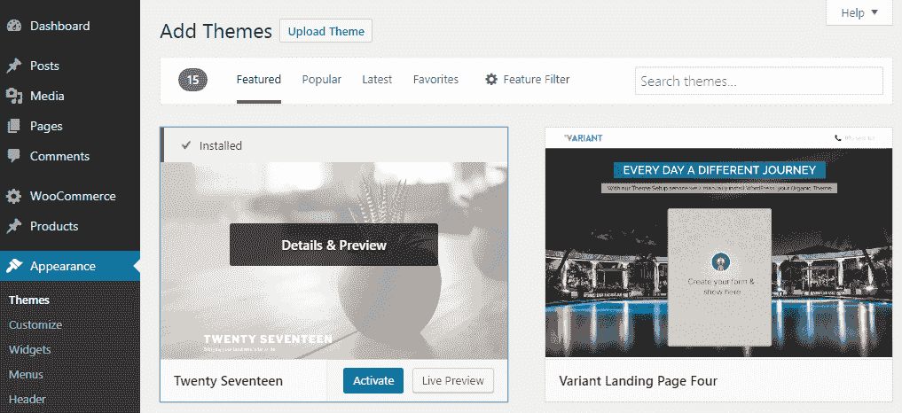

1.  你有两种选择：从免费主题目录安装主题或上传目录中不可用的主题。第一种选项只需要你点击列表中主题的“激活”按钮。另一种选项需要你点击“上传主题”按钮并上传一个有效的 WordPress 主题的.zip 文件。安装后，你可以从单独的屏幕激活主题。

新主题的文件将位于`wp-content/themes`目录中，以主题名称创建一个新的目录。一旦安装了新主题，你将在“外观”菜单的“自定义”、“小工具”和“菜单”部分看到变化。主题特定的设置和组件将被添加到这些菜单项中。

我们将在本章中始终使用默认的 Twenty Seventeen 主题。由于它是一个免费的内建主题，因此你不会找到一个单独的选项面板。在高级付费主题中，你会在一个单独的菜单项中找到一个选项面板，在那里你可以配置主题的功能和布局。

这种基本的安装方式已经足够好，你现在可以深入到主题的开发方面。我们将从了解如何在使用开发中利用主题开始。

# 理解主题在开发中的作用

在成千上万的免费和付费主题中选择现有主题的能力是 WordPress 作为 CMS 成功的原因之一。使用现有主题可以显著减少开发时间和成本，相比之下，从头开始设计网站。

主题的主要目的是作为网站的展示层。然而，WordPress 已经发展到这样一个状态，即仅作为展示层设计的简单主题不再适用。因此，开发者们在他们的主题中包含越来越多的高级功能和逻辑，以与其他主题竞争。在现代网站上，开发者的角色可能包括自定义主题设计、从头开始构建主题，甚至创建特定应用的主题。因此，我们需要了解主题中涉及的开发类型。让我们看看作为开发者最常见的任务：

+   **自定义文章和页面设计**：这是开发者在其开发者角色初期面临的最常见任务。已有数百万个网站使用 WordPress 创建，其中很大一部分是由使用现有主题和插件的非技术性网站所有者创建的。因此，当需要更改主题时，所有者除了寻找第三方开发者外别无选择。在这种情况下，你将被要求修改现有主题设计以符合客户的要求。因此，开发者需要熟悉各种类型的现代主题和设计技术。

+   **创建页面模板**：这是开发者的下一步，客户会要求你创建不同类型的着陆页来推广他们的产品、服务和其他业务。

+   **集成 UI 组件**：现代网站充满了各种交互式组件，如滑块、画廊、手风琴、图表等。其中大部分都是从开源库中生成的。许多付费主题内置了对这些类型组件的支持。但在你的网站使用基本主题的情况下，你可能会被要求集成这些组件，使它们更具吸引力，并在有限的空间内提供大量信息。因此，你需要了解将这些库集成到主题中的技术。

+   **将设计转换为主题**：这需要你从头开始构建一个主题。在以前，我们从设计师那里获得 PSD 文件，开发者的角色是将它转换为 HTML。使用 WordPress，你需要额外的一步，将 HTML 转换为 WordPress 主题。除非你了解 WordPress 模板层次结构、主题函数和必要的 WordPress 约定，否则这是一个非常困难的过程。

上述列表概述了在旨在作为基本 CMS 运行的网站上与主题一起工作的任务。然而，现代 WordPress 网站通过创建完整的 Web 应用超越了常规。在这些应用中，我们可以看到应用主题的使用。

# 应用特定主题是什么？

通用 WordPress 主题主要使用一组标准主题文件，主要目的是提供出色的博客文章和页面功能。另一方面，应用特定主题使用更多应用特定文件，旨在构建应用特定功能。这些文件包括应用特定功能、业务逻辑和模板。这类主题的优势在于可以直接在网站上使用，而不是在通用主题之上开发这些功能。然而，应用主题的局限性在于无法切换主题，因为大多数功能都绑定在主题上。让我们看看一些常见的应用主题类型，以了解应用主题的概念：

+   **Buddypress**: 这是一个允许您将社交网络功能添加到 WordPress 的插件。如今，专为 BuddyPress 设计的主题旨在扩展基本社交网络功能。BuddyPress 主题的功能包括用户管理、用户群组管理、用户活动、用户消息等。您可以在[`themeforest.net/category/wordpress/buddypress`](https://themeforest.net/category/wordpress/buddypress)查看 BuddyPress 特定主题的惊人功能。

+   **房地产**: 这类主题是为创建房产列表和销售而设计的。除了基本的帖子模板和页面模板外，这类主题还包含各种高级模板和功能，如房产地图、经纪人管理、房产比较和搜索。您可以在[`themeforest.net/category/wordpress/real-estate`](https://themeforest.net/category/wordpress/real-estate)查看房地产特定主题的功能。

+   **LMS**: 这类主题是为学习管理系统而设计的，其中包含教师、学生和课程。除了基本主题功能外，这些主题还包括管理课程、讲师、学生、考试和成绩的模板和功能，以及所有上述数据的先进搜索功能。您可以在[`themeforest.net/category/wordpress/education?term=lms`](https://themeforest.net/category/wordpress/education?term=lms)查看 LMS 特定主题的功能。

在查看特定应用主题的使用后，您将了解到这些主题包含整个插件或可能整个应用的功能。这可能不符合开发最佳实践的理想实现。然而，我们必须习惯于构建或使用这样的主题，以便提供成本效益的解决方案。

如您可能已经注意到的，作为开发者，您在主题方面的角色非常广泛。大多数情况下，您将不得不承担设计部分的责任，以及主题的功能性。了解主题组件如何协同工作以构建网站的设计和功能非常重要。

# 理解内置主题组件

任何 WordPress 前端屏幕的设计都由许多组件组成，这些组件位于模板文件之上。这些组件充当网站数据的占位符位置。通过了解这些组件，您可以允许管理员根据各种需求动态更改内容和位置。

让我们来看看这些组件及其在主题中的角色：

+   **菜单**：这是一个包含帖子、页面、自定义帖子类型和自定义链接的链接集合。导航菜单是任何网站中必须使用的功能，可以在不丢失路径的情况下浏览可用的页面。在以前，我们只有位于网站页眉部分的单个菜单。现代网站包含多个菜单，并将相同的菜单放置在多个位置以简化导航。您网站上的菜单数量取决于主题支持的菜单位置。您可以选择使用一个或多个主题支持的菜单位置。可以通过访问[`www.example.com/wp-admin/nav-menus.php?action=locations`](http://www.example.com/wp-admin/nav-menus.php?action=locations)来识别主题中支持的菜单。

+   **小工具**：这是一个允许您显示静态内容、从数据库显示动态内容、捕获用户数据或为用户提供特定功能的块。小工具可以放置在您网站的侧边栏中。默认的小工具集合包括存档、日历、分类、元信息、最近的文章和搜索。除了 WordPress 提供的这些默认小工具之外，您还将获得相当数量的特定于插件的主题。可以通过停用所有插件并访问[`www.example.com/wp-admin/widgets.php`](http://www.example.com/wp-admin/widgets.php)来识别主题中可用的小工具。

+   **侧边栏**：这原本是为了在网站的任何页面/帖子左侧或右侧作为一列来工作的。侧边栏的内容是通过从 WordPress 的后端拖动小工具来添加的。然而，现代网站需要更高级的布局，因此侧边栏被用作小工具区域，而不仅仅是作为一列。在现代主题中，您可以在网站的任何地方都有侧边栏，以便重复使用小工具以及动态更改内容。可以通过访问[`www.example.com/wp-admin/widgets.php`](http://www.example.com/wp-admin/widgets.php)并检查屏幕的右侧来识别主题中可用的侧边栏。

在本节中，我们简要概述了内置主题组件的功能以及我们可以在 WordPress 后端找到它们的位置。这些细节将帮助您在从头创建网站的过程中。然而，当与现有网站一起工作时，您可能需要通过在前端识别它们然后移动到后端来反向追踪它们。下一节将涵盖这些组件的识别。

# 识别现有网站中使用的主题组件

正如我们已经讨论过的，从头开始开发主题不是使用 WordPress 构建的小型到中型网站的主要要求。在大多数情况下，开发者将不得不与现有网站和现有主题一起工作，这些主题是由所有者选择的。因此，您应该具备查看网站中任何给定帖子/页面的技能，然后识别用于帖子或页面的模板和主题组件，以便快速将需求转化为解决方案。让我们看看识别在帖子或页面上显示的重要主题组件的过程：

+   **菜单**：在现有网站上，我们需要能够识别某些屏幕中的菜单以便进行自定义。我们没有内置或外部的跟踪菜单的功能。

    通常，菜单位于网站的页眉和页脚部分。首先，您需要寻找一组看起来像菜单并指向您网站文章和页面的链接。然后，您可以使用浏览器检查工具查找菜单容器。通常，您会发现菜单容器将在元素 ID 或类中包含菜单名称。让我们检查 Twenty Seventeen 主题顶部菜单的元素，如下面的截图所示：

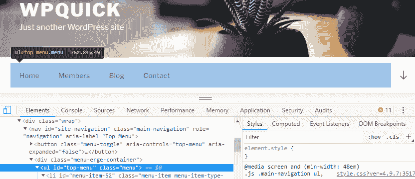

如您所见，`<ul>`元素使用了一个名为**top-menu**的 ID，而`<nav>`元素使用了一个名为**区域标签**的**Top Menu**。因此，现在我们可以访问[`www.example.com/wp-admin/nav-menus.php?action=locations`](http://www.example.com/wp-admin/nav-menus.php?action=locations)并找到**Top Menu**。接下来，我们可以更改该位置的菜单或菜单项。如果您需要自定义菜单位置的代码，您可以在主题中搜索以**menu_id**为**top-menu**的`wp_nav_menu`函数。这些菜单名称在元素中的使用因主题而异。然而，您应该能够通过检查元素找到有关菜单位置的提示。

+   **使用的模板**：当我们被要求为现有网站屏幕进行定制时，最难的部分是识别用于生成屏幕的主题模板。然而，我们有使用**What The File** ([`wordpress.org/plugins/what-the-file/`](https://wordpress.org/plugins/what-the-file/))插件的选项，我们在第一章，*WordPress 开发简介*中讨论过。一旦安装了这个插件，你将在每个前端屏幕上获得一个名为 What The File 的菜单项。然后，你可以查看一个屏幕，并将鼠标悬停在 What The File 菜单项上，以查看用于该屏幕的模板，如下面的截图所示：

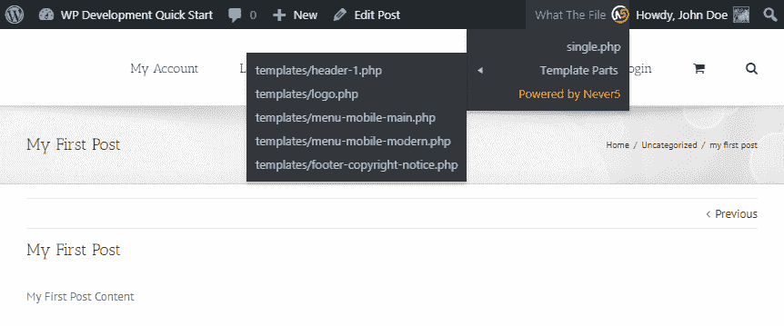

上一张截图显示了一个付费主题的单个帖子。你可以很容易地注意到用于给定屏幕的主要模板和子模板。你可以在主题中找到这些模板以进行必要的修改。

+   **侧边栏和小工具**：通常，侧边栏位于任何屏幕的左侧或右侧，小工具被放置在其中。然而，现代主题使用许多动态小工具区域，因此侧边栏可以放置在网站的任何位置。这使得在没有工具的情况下跟踪侧边栏变得困难。幸运的是，我们可以使用调试栏([`wordpress.org/plugins/debug-bar/`](https://wordpress.org/plugins/debug-bar/))插件，我们在第一章，*WordPress 开发简介*中讨论过，以及一个名为调试栏 – 侧边栏与小工具([`wordpress.org/plugins/debug-bar-sidebars-widgets/`](https://wordpress.org/plugins/debug-bar-sidebars-widgets/))的附加插件。这个附加插件已经四年没有更新了。然而，它似乎运行良好，并且是我找到的完成这项任务的最佳工具。

    一旦安装了这两个插件，你可以在屏幕上查看并从顶部菜单点击**调试 | 侧边栏**。你将获得一个类似于以下屏幕：

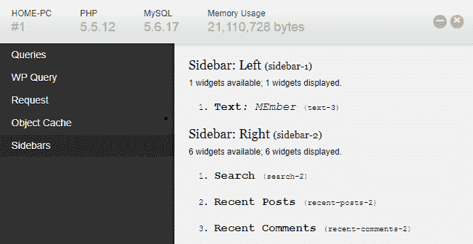

这个工具清楚地显示了在任何给定屏幕中加载的侧边栏及其细节，以及每个侧边栏中加载的小工具及其细节。现在，我们可以使用这些信息访问后端小工具部分，并对当前屏幕进行必要的修改。

你应该使用这些技术来快速跟踪任何现有网站中的组件，并在快速过程中构建解决方案。

# 开始开发主题

我们在前一节中讨论了主题中涉及的开发任务。从头开始构建主题是一个范围非常广泛的过程，因此在这种类型的书中讨论是不可行的。因此，我们将专注于定制现有主题，同时提供构建主题所需的知识。在现有主题中添加或修改功能有两种方法：

+   通过修改模板文件来构建和定制设计功能

+   通过可用的过滤器和动作扩展主题功能

这两种技术都需要我们修改现有主题的文件。在大多数网站上，我们将使用由第三方开发者开发的现有、免费或付费主题。因此，我们显然会收到带有更多功能、错误修复和改进代码的主题更新版本。主题更新过程会清除对核心主题文件所做的所有更改。这意味着我们需要一种方法来定制主题，而不会在主题更新时丢失更改。这就是子主题概念被使用的地方。

# 什么是子主题？

子主题是主题的一个子版本，继承了其功能、设计和样式。我们将主主题称为父主题。根据其名称和目的，你可能认为子主题是父主题的一部分。然而，子主题在`wp-content/themes`目录内有自己的目录，并通过几行注释与父主题相关联。子主题不会随着父主题更新而更新，因此我们可以用它来进行定制开发。

# 创建子主题

对于 WordPress 新手开发者来说，可能会认为这是一个相当复杂的过程，涉及许多步骤和配置。然而，这是一个简单的过程，只需不到一分钟。让我们为现有的**Twenty Seventeen**主题创建一个名为`WPQuickStart`的子主题。

第一步是在`wp-content/themes`目录中创建一个名为`wpquickstart`的目录。接下来，我们需要在`wpquickstart`目录中创建一个`style.css`文件，并添加以下注释：

```php
/*
Theme Name: WPQuickStart
Theme URI:
Description: Twenty Seventeen Child Theme
Author: Rakhitha Nimesh
Author URI: http://example.com
Template: twentyseventeen Version: 1.0.0 */
```

代码中高亮显示的行定义了目录为子主题，并定义了父主题。你应该使用父主题的目录名称作为模板设置。此过程的最后一步是在`wpquickstart`目录中创建一个`functions.php`文件，并添加以下代码以加载父主题样式：

```php
add_action( 'wp_enqueue_scripts', 'wpquickstart_enqueue_styles' ); 
function wpquickstart_enqueue_styles() { 
    wp_enqueue_style( 'twenty-seventeen-style', get_template_directory_uri() . '/style.css' ); 
    wp_enqueue_style( 'wpquickstart-style',    get_stylesheet_directory_uri() . '/style.css', 
        array('twenty-seventeen-style')    ); 
}  
```

上述代码包含了父主题和子主题的`style.css`文件。我们通过将`twenty-seventeen-style`传递到依赖数组中，为子主题样式文件添加了一个依赖。由于子主题的`style.css`文件依赖于父主题，它将在`Twenty Seventeen`主题的`style.css`文件之后加载。因此，我们使用`WPQuickStart style.css`文件覆盖必要的父主题样式。

只需三个步骤，我们的子主题就可以具备父主题的所有功能。其他文件遵循相反的过程，除了`functions.php`文件。如果子主题中有模板文件，它将加载而不是父主题的模板文件。另一方面，子主题中缺失的模板文件将从父主题加载。

# 使用子主题修改父主题

现在，最重要的了解是如何使用子主题来实现前面章节中讨论的两个技术。让我们从使用模板文件开始。

# 通过修改模板文件来构建和定制设计

我们创建了一个子主题来定制父主题的设计，而不会在主题更新时丢失更改。这可以通过修改父主题的整个模板或部分模板来实现。让我们通过使用一个示例模板设计更改来学习这一点。考虑以下截图，以满足我们的需求：

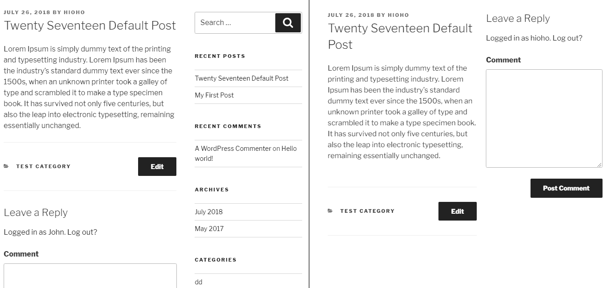

左侧的屏幕显示了**Twenty Seventeen**主题的默认单篇帖子设计。假设我们想要更改帖子模板以移除侧边栏，并显示评论表单，以便用户在阅读帖子时可以添加评论。因此，我们必须将左侧的屏幕更改为与右侧的屏幕相匹配。

为了满足我们的要求，我们必须覆盖父文件模板。因此，我们需要将 Twenty Seventeen 主题的`single.php`文件复制到 WPQuickStart 子主题的根文件夹中。对于新的设计，我们不需要侧边栏，因此以下行需要从我们在子主题中创建的`single.php`文件中删除：

```php
<?php get_sidebar(); ?>
```

相反，我们需要将评论表单添加到相同的位置。评论模板已经通过以下代码加载到`single.php`中，在帖子内容之后：

```php
if ( comments_open() || get_comments_number() ) : 
  comments_template(); 
endif; 
```

我们需要从`single.php`文件的现有位置删除此代码，并将其添加到我们之前放置侧边栏的位置。考虑以下代码，其中我们将`comments`代码放置在一个名为`wpquickstart-comments`的容器元素中：

```php
<div id="wpquickstart-comments" >             
  <?php if ( comments_open() || get_comments_number() ) :       
          comments_template();                      
        endif; ?>     
</div> 
```

最后，我们需要将具有`primary` ID 的元素的 CSS 类从`content-area`更改为`wpquickstart-content-area`。现在，我们可以应用 CSS 来减小帖子内容元素的大小，并将评论移至帖子内容右侧。将以下 CSS 添加到子主题的`style.css`文件中：

```php
.wpquickstart-content-area{ 
    width:50% !important; float:left; 
} 
#wpquickstart-comments{ 
    width: 45%;    float: left;    padding: 0 3%; 
} 
#wpquickstart-comments #comments{ 
    padding-top: 0 !important; 
} 
```

现在，您可以刷新浏览器以检查带有右侧评论表单的新设计。这是一个如何根据我们的需求更改父主题设计的非常基础的例子。通过使用几行样式和移动现有元素，我们能够在几分钟内创建一个新的设计。在实际网站开发中，您可以通过使用相同的过程将简单的设计转变为高级、功能丰富的设计。

# 通过可用的过滤器和动作来扩展主题功能

我们已经讨论了使用子主题来定制和扩展主题模板的重要性。使用 WordPress 过滤器和动作钩子是另一种定制主题功能的方法。我们将主要使用这些钩子来扩展主题提供的功能。然而，我们可以使用一些过滤器和动作钩子来更改模板的部分，而无需完全替换它们。

在 WordPress 中，一个动作是一个在过程特定点执行的 PHP 函数。一个过滤器是一个用于修改过程中的现有数据或功能的函数。尽管动作旨在在事件前后执行某些操作，但它们经常用于向模板添加内容。关于动作和过滤器的更多内容将在后续章节中介绍。

一旦我们选择了一个主题，我们就可以探索主题内的动作和过滤器，以了解其可扩展功能和位置。识别这些动作和过滤器的最简单方法是使用代码编辑器的目录或项目搜索功能。大多数高质量的代码编辑器默认提供此功能。你应该使用术语`apply_filters`来搜索主题中的过滤器，并使用`do_action`来查找其中定义的动作。你可能会在免费主题中找到少量这些钩子，在付费主题中找到数百个。这些钩子包括内置的 WordPress 钩子以及主题特定的钩子。作为一个开发者，你需要对主题中常见的内置 WordPress 钩子有深入的了解。让我们看看在主题中常用的某些过滤器和动作：

+   `the_content`: 这是在主题中最常用的过滤器，旨在修改帖子内容。我们可以修改整个帖子内容，或者在一个帖子前后添加动态内容。通常，这用于显示有关帖子（如相关帖子、广告和社交分享按钮）的附加数据。以下代码用于在每个帖子后添加自定义内容。此代码应放置在子主题的`functions.php`文件中：

```php
add_filter( 'the_content', 'wpquickstart_add_custom_text_single_posts' );  
function wpquickstart_add_custom_text_single_posts( $content ) { 
    if ( is_single() && in_the_loop() && is_main_query() ) { 
        return $content . "Custom Text After Post"; 
    }  
    return $content; 
} 
```

+   帖子内容作为参数传递给这个函数。在这里，我们使用`is_single`模板标签来确保自定义内容仅应用于单个帖子，而不是存档。其他两个条件限制此文本不应用于主查询和循环之外的帖子。这是`the_content`过滤器功能的一个非常基本的示例。你可以添加更多内容并设置不同的条件来处理各种需求。

+   `the_permalink`: 这个过滤器会过滤当前帖子的永久链接显示。你可以使用与前面示例类似的代码来修改帖子链接。

+   `the_title`: 这个过滤器会过滤帖子的标题。用于根据某些条件修改帖子标题。

+   `comment_form_default_fields`: 这个过滤器会过滤评论表单的字段。默认情况下，评论表单包含评论、姓名、电子邮件和网站字段。字段作为数组类型参数传递给此过滤器。你可以使用此过滤器添加新字段或从评论表单中删除现有字段。以下代码使用此过滤器从评论表单中删除`website`字段：

```php
function wpquickstart_remove_website_field($fields) { 
    unset($fields['url']); 
    return $fields; 
}  
add_filter('comment_form_default_fields', 'wpquickstart_remove_website_field'); 
```

+   `wp_nav_menu_item_custom_fields`：名称表明这是一个过滤器，但实际上它是在 WordPress 中执行的动作。将自定义字段添加到菜单项的过程是菜单项特定 CSS 和菜单项限制等功能的常见任务之一。在这种情况下，我们可以使用此动作来添加自定义字段，如下面的代码所示：

```php
add_action( 'wp_nav_menu_item_custom_fields', 'wpquickstart_menu_button_fields', 10, 4 ); 
function wpquickstart_menu_button_fields( $item_id, $item, $depth, $args ) {     ?> 
  <div class="fusion-menu-options-container"> 
   <div class="option-details"> 
     <h3><?php _e( 'Menu Class', 'wpquickstart' ); ?></h3> 
     <p class="description"><?php _e( 'Add custom css class.', 'wpquickstart' ); ?></p> 
   </div> 
   <div class=""> 
     <input type="text" id="wpquick-menu-class" name="wpquick-menu-class" value="" /> 
   </div> 
  </div> 
<?php } ?> 
```

+   上述代码将在后端菜单中的菜单项中添加一个名为`菜单类`的新文本字段。

这些是数百个可能的 WordPress 动作和过滤器中常用的一些。您应该通过使用各种 WordPress 主题来探索这些钩子，以确定您实现所需的钩子。

在上一节中讨论的过滤器和动作用于常见的 WordPress 用途，因此可以在任何主题中使用。另一方面，特定于主题的动作和过滤器是为高级主题功能设计的。大多数这些动作和过滤器不能在其他主题中使用。我们可以通过查看钩点名使用的前缀来轻松识别特定于主题的钩子。**Twenty Seventeen**主题使用`twentyseventeen_`作为特定于主题钩子的前缀。让我们考虑在 Twenty Seventeen 主题中可用的一个过滤器，以了解特定于主题钩子的使用：

```php
apply_filters( 'twentyseventeen_content_width', $content_width ); 
```

此过滤器用于根据页面布局自定义页面宽度。让我们看看我们如何实现此过滤器来修改宽度：

```php
add_filter( 'twentyseventeen_content_width', 'wpquickstart_content_width' ); 
function wpquickstart_content_width($content_width){ 
  if(is_page()) { 
    $content_width = "800"; 
  } 
  return $content_width; 
} 
```

在上述代码中，我们通过使用特定于主题的过滤器更改了**Twenty Seventeen**主题中页面的宽度。我们可以添加更多条件来更改宽度和显示不同类型的布局。

# 扩展特定于主题钩子的步骤

现在，您应该对主题中内置的钩子和特定于主题的钩子有一个简要的了解。让我们看看使用这些钩子自定义主题的基本步骤：

1.  在主题上执行目录搜索，通过跟踪`apply_filters`和`do_action`函数来识别钩子。

1.  对于过滤器，检查是否已向`apply_filters`函数传递了超过两个参数。第二个参数将是您将要过滤的变量，额外的参数将用于支持过滤过程。

1.  如果`apply_filters`函数包含两个参数，您可以使用以下代码实现它：

```php
    add_filter( 'filter_hook_name', 'filter_implementation_function_name' ); 
    function filter_implementation_function_name ($param1){ 
         // Modify $param1 based on your preferences 
         return $param1; 
    }
```

1.  如果`apply_filters`函数包含超过两个参数，您可以使用以下代码：

```php
    add_filter( 'filter_hook_name', 'filter_implementation_function_name',10,3 ); 
    function filter_implementation_function_name ($param1,$param2,$param3){ 
         // Modify $param1 based on your preferences and help of $param2 and $param3 
         return $param1; 
    }
```

1.  在上述代码中，10 将是优先级。数字 3 将是`apply_filters`函数中在钩子名称之后的参数数量。

1.  对于动作，检查是否已向`do_action`函数传递了多个参数。这些参数将用于支持我们自定义动作代码的执行。

1.  使用以下代码实现动作：

```php
    add_action( 'filter_hook_name', 'action_implementation_function_name',10,2 ); 
    function action_implementation_function_name ($param1,$param2){ 
         // execute some code related to action - Ex: send emails, save data to database 
         echo 'Custom Content' ; // you can add content to location where action hook is executed 
    }    
```

1.  您应根据参数的数量更改 2。如果钩子只有一个参数，则可以省略 10 和 2。

在本节中，我们探讨了两种修改或扩展主题功能的技术。您应该检查网站的要求，并决定您是否可以使用现有的钩子进行某些自定义，或者是否需要在子主题中完全替换模板文件。

# 使用 WordPress 主题模板层次结构

一个 WordPress 主题可以用仅三个文件来构建：**style.css**、**index.php**和**comments.php**。然而，完整的模板层次结构可以支持相当多的子模板，足够灵活以满足许多网站的先进需求。通常情况下，开发者将在层次结构中工作少于十个文件。然而，对于具有高级需求的项目，了解完整的模板层次结构可能会很有用。让我们看看以下图表，它由 WordPress 用于处理初始请求的页面类型组成：

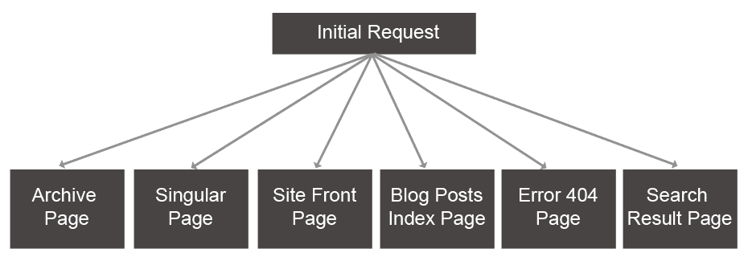

根据加载的内容，有六种路径来处理用户请求。**归档页面**和**单页**是其中最复杂且最灵活的，结构较高。在深入了解完整的模板层次结构之前，让我们确定这些页面的主要用途：

+   **归档页面**：通常用于显示文章列表、分类文章、标签文章、作者文章和自定义文章类型，并附带关于文章的简要摘要

+   **单页**：用于显示单个文章、页面或自定义文章类型

+   **网站首页**：用于显示您网站的首页

+   **博客文章索引页面**：此页面用于显示您网站上的文章列表

+   **404 错误页面**：当 WordPress 找不到请求的匹配模板时使用

+   **搜索结果页面**：显示包含帖子列表和页面的搜索结果

您可以在[`developer.wordpress.org/themes/basics/template-hierarchy/`](https://developer.wordpress.org/themes/basics/template-hierarchy/)找到更多关于模板层次结构的详细信息。现在，我们需要遍历每种页面类型的完整层次结构，以获取处理高级应用需求的知识。让我们从**归档页面**开始。

# 归档页面层次结构

此路径分为六个子类型，WordPress 将为任何给定请求的帖子数据集合使用这些子类型之一。让我们考虑以下图表，用于归档页面层次结构：

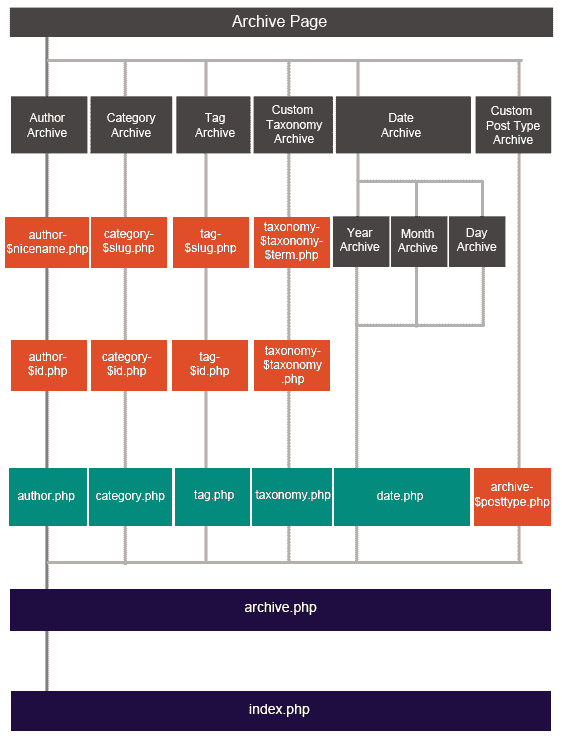

在此路径中，我们使用`archive.php`文件作为主要模板。对于主题而言，这是一个可选文件，当此模板在主题中缺失时，`index.php`文件将处理归档。然而，几乎所有的这些主题都会包含`archive.php`文件来处理数据集合。让我们看看各种类型的归档页面，从作者归档开始。

# 作者归档页面

在 WordPress 中，帖子是由管理员或具有帖子创建能力的用户创建的。在大多数主题中，您会在帖子标题旁边看到一个链接的作者名称。一旦您点击链接，您将被重定向到一个包含指定用户创建的所有帖子的页面。这是作者存档页面，通常由`archive.php`文件处理。让我们看看 Twenty Seventeen 主题的作者存档页面。

基本上，我们拥有作者的显示名称和描述。这可能对于拥有博客和一到两个作者的简单 WordPress 站点来说已经足够好了。在拥有大量作者且主要站点功能是发布文章的情况下，这可能看起来有些朴素。相反，这类网站需要您拥有一个精心设计的个人资料，包括个人照片、网站详情和社交媒体账户详情。以下截图是来自一个流行主题修改后的作者模板预览：


如您所见，这个网站使用了一个完整的用户个人资料以及一个修改后的两列帖子列表。我们无法在不使模板变得过于复杂的情况下使用`archive.php`来构建这种设计。相反，我们可以利用作者存档路径中的额外模板，如前图所示。作者存档路径中有三个模板，如下所示：

+   `author.php`：这是自定义作者存档的主要模板。许多主题，包括付费主题，使用`archive.php`来生成作者存档，而不是单独的模板。因此，我们可以在子主题中添加自己的`author.php`文件，并设计一个单独的作者存档。这个模板在`archive.php`和`index.php`之前执行。

+   `author-$id.php`：这是在`author.php`模板之前执行的两种动态模板之一。用户的 ID 作为模板名称的一部分，因此这个模板只为单个用户加载。由于这是一个动态模板，您在任何主题中都不会找到它。这是开发者应该创建以适应网站特定需求的东西。为每个作者创建主题模板并不实际，除非您有数量有限且固定的作者。因此，在开发中很少需要使用这种模板。

+   `author-$nicename.php`：这与`author-$id.php`类似，并且在之前的模板之前执行。这个模板使用 WordPress 的昵称而不是 ID。

在需要自定义作者存档页面的情况下，您应将`archive.php`页面的内容复制到`author.php`文件中，并根据需要更改设计。有关作者模板和作者数据的实现，更多信息请参阅[`codex.wordpress.org/Author_Templates`](https://codex.wordpress.org/Author_Templates)。

# 分类、标签和自定义分类法存档

分类是 WordPress 用来将事物分组到不同部分的一个术语。如果你已经使用过 WordPress 文章，你应该熟悉在文章创建屏幕中的**分类**和**文章标签**。这两个是默认分配给普通文章的内置分类。另一方面，自定义分类是根据不同网站的需求为特定文章类型创建的分组类型。我们可以将一个或多个分类值分配给文章或自定义文章类型项。一旦文章被分配，我们就会得到一个包含特定分类文章列表的存档页面。

分类、标签和自定义分类以完全相同的方式工作，具有类似的模板层次结构。`archive.php`文件默认使用分类标题和描述来加载这三种类型。在作者存档中，我们需要一种方式来以吸引人的设计显示完整的作者详情。在这种情况下，我们不需要关注这些细节，因为分类很少使用附加详情。相反，我们可能需要更改分类存档页面中文章的设计和显示。在这种情况下，我们可以使用`category.php`、`tag.php`和`taxonomy.php`模板，类似于我们使用`author.php`的方式。这些模板需要根据你的需求添加到子主题中，因为大多数主题只使用`archive.php`文件来处理这三种类型。

与作者存档类似，这三种类型各自也有两个使用分类 ID 或短语的动态子模板。然而，我们很少使用它们，因为模板需要根据我们在开发中使用的分类动态创建。

# 日期存档页面

这是一种另一种存档页面，我们可以看到按年、月或日排列的文章列表。我们正在使用**Twenty Seventeen**主题，因此你会在侧边栏看到一个名为**存档**的部件，其中包含一系列值，如 2018 年 8 月、2018 年 7 月等。一旦你点击这些链接之一，它将加载该月创建的文章。网站的 URL 可能看起来类似于`http://www.example.com/2018/07`。我们可以通过从 URL 中删除 07 来检查年度存档，通过在 07 之后添加日期来检查每日存档。再次强调，默认情况下使用`archive.php`来处理这三种存档页面。

现在，如果你考虑我们的存档页面图，你会注意到使用`date.php`文件将日期存档与`archive.php`文件分开。这个模板与我们已经讨论过的作者和分类模板类似工作。尽管它不常被使用，但我们可以在子主题中添加`date.php`文件，并显示关于每年、每月或每天的任何附加信息。

# 自定义文章类型存档

在现代 WordPress 网站上，自定义文章类型的使用很常见。与普通博客文章不同，自定义文章类型可以包含相当多的数据和设计要求。因此，在大多数情况下，使用`archive.php`来加载自定义文章列表可能不可行。

相反，我们可以观察前面的图表来识别额外模板文件的使用。与之前的路径不同，我们只有一个用于自定义文章存档的动态模板，称为`archive-$post_type.php`。文章类型变量应该被替换成你网站上的文章类型，如产品、主题和论坛。尽管这是一个动态模板类型，但我们可以创建并添加这个模板到子主题中，因为大多数情况下，一个网站中的自定义文章类型是固定的。在这种情况下，当 WordPress 找不到带有`archive-$post_type.php`的模板时，它将只加载`archive.php`。如今，许多高级主题都内置了自定义文章类型支持，因此你将在主题文件中找到这样的模板。让我们看看以下截图，用作存档页面：


左侧的屏幕显示了一个正常的博客文章存档，它使用`archive.php`文件进行显示。右侧的屏幕显示了一个自定义文章类型，以用户友好的方式展示了一个完全不同的设计和各种数据。我们需要`archive-$post_type.php`来构建这样的设计，因为使用同一个`archive.php`文件无法生成这两个屏幕。

# 单页层次结构

这个路径分为两个子类型，用于显示单个文章或页面的数据。让我们考虑以下图表，用于**单页**层次结构。

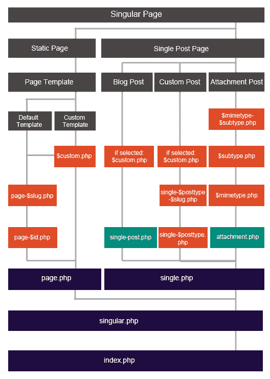

在存档中，我们展示了带有摘要详情的文章集合。在这个路径中，我们需要显示单个文章或页面的完整数据。我们使用`single.php`文件作为这个路径的主要模板。这是一个主题的可选文件，当这个模板在主题中缺失时，`index.php`文件将处理文章和页面。然而，几乎所有的主题都会包含`single.php`文件以用于单个文章数据。让我们看看以下各种单页类型，从静态页面开始。

# 静态页面层次结构

在 WordPress 中，页面用于管理网站的架构并包含永恒的内容。通常，我们称页面为静态的，尽管它们与我们过去拥有的纯 HTML 网站的页面不完全相同。然而，内容不经常改变，因此与文章相比被认为是静态的。在一个基本网站上，你会找到 WordPress 页面用于联系、关于、服务等等。这个路径分为两种类型，称为**自定义模板**和**默认模板**。让我们从**默认模板**开始，这样我们可以理解自定义模板的需求。

默认情况下，WordPress 页面由`page.php`、`singular.php`或`index.php`处理。大多数主题包含一个单独的`page.php`文件来处理页面，因此`singular.php`和`index.php`可能不会被使用。

我们可以用`page.php`文件构建我们的大部分页面设计。然而，在某些情况下，如果你想用不同的设计处理不同的页面，`page.php`之前还有两个可选模板：

+   `page-$slug.php`：这个模板使用别名来识别页面并提供单独的设计。这个模板只能用来设计一个页面。

+   `page-$id.php`：这个模板使用页面 ID 为选定的页面提供单独的设计。这个模板只能用来设计一个页面。

许多网站包含有限数量的页面，这些页面的设计通常各不相同。因此，可以通过指定 ID 或别名来使用不同的页面模板。然而，在现代网站上，这两个模板可能不会被使用，因为可以通过自定义页面模板实现相同的功能，这将在下一节中讨论。默认模板适用于大多数页面设计简单且仅旨在向用户提供内容的网站。

与此相反，自定义页面模板是不同于默认设计的模板，用于更改网站中一个或多个页面的外观和感觉。这个模板在`page.php`模板之前加载。与其他层次结构中的模板不同，页面模板没有预定义的命名模式。相反，我们可以将其命名为我们想要的任何名称，并在模板文件中使用 PHP 注释将其指定为模板。

# 创建和使用自定义页面模板

创建新的页面模板的过程相对简单。首先，我们需要在主题的根目录下创建一个文件。让我们将其命名为`fullwidth.php`。接下来，我们需要在`fullwidth.php`文件的顶部添加以下注释，如下所示：

```php
/* Template Name: WPQuickStart Full Width */
```

上述注释将注册此为页面模板，WordPress 将在页面创建屏幕中将其作为选项加载。在**Twenty Seventeen**主题中，页面设计包含两列，其中标题显示在左侧，内容显示在右侧。左侧列几乎占据页面的一半，因此对于网站上的某些页面来说并不理想。因此，我们的全宽模板将删除左侧列并将内容区域的宽度增加到 100%。

首先，我们必须从`page.php`文件中复制内容并将其添加到我们的`fullwidth.php`模板中。接下来，将以下行替换为来自`twentyseventeen/template-parts/post/content.php`文件的内容：

```php
get_template_part( 'template-parts/page/content', 'page' );
```

接下来，我们必须删除完整的标题标签以省略左侧列。然后，我们需要将包含**entry-content**类的`<div>`元素的宽度增加到 100%。最后，在**entry-content** div 元素内添加页面标题。现在，我们已经准备好了一个全宽页面模板。

现在，我们可以从管理部分转到“页面 | 添加新页面”来创建一个新的页面。你的主题提供的可用页面模板将列出，如下面的截图所示：

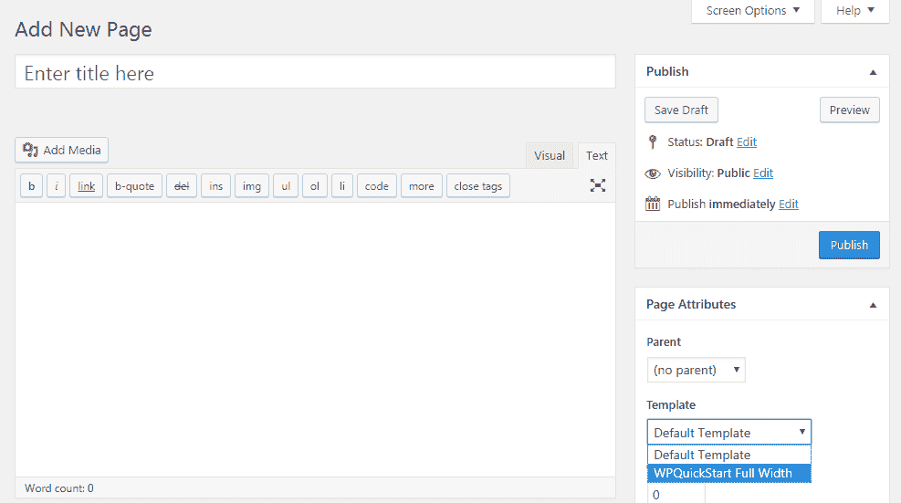

模板设置允许我们为任何给定页面分配一个页面模板。因此，当多个页面需要相同的设计时，我们可以使用此类模板。在默认模板部分，我们讨论了`page-$slug.php`和`page-$id.php`文件的可用性。使用这种技术，我们必须为每个需要的页面创建模板。当我们删除或更改现有页面时，我们还需要手动修改模板。自定义页面模板没有这些限制，我们可以使用一个模板来设计多个页面。我们还可以从页面创建部分快速更改模板。因此，我们应该优先考虑自定义页面模板，而不是默认路径中可用的动态页面类型。

在其基本形式中，我们使用页面模板来改变页面的结构。我们已经通过引入全宽模板来改变了页面的结构。最基本的模板类型包括两列、三列、全宽、右侧边栏和左侧边栏模板。与我们在现代高级主题中获得的模板相比，这些都是非常基本的模板类型。这些现代主题包括具有列表、网格和相册的精选集模板、联系表单、带有各种滑块的首页模板等等。

这只是一个模板类型的列表，你需要查看这些模板设计，以便了解页面模板的实际功能。你可以在许多高级主题中找到这些类型的模板。我建议你访问[`themeforest.net/category/wordpress`](https://themeforest.net/category/wordpress)，并查看现代主题提供的页面类型。你会对页面模板的创新使用感到惊讶。

了解如何从头开始构建页面模板非常重要。基本上，你可以在**模板名称**注释之后添加任何内容。由于你刚开始 WordPress 开发，你可以在模板中使用`page.php`文件中的各种函数，并在其基础上构建。一旦你有了经验，你应该从头开始创建高级模板，而不需要从现有模板中获取任何代码。

# 单个帖子页面层次结构

在上一节中，我们讨论了页面作为静态元素。另一方面，帖子是高度动态的，并提供了时间敏感的信息。通常，帖子列表页面会频繁更改，新帖子会显示在列表的顶部。在本路径中，我们考虑的是显示单个帖子或自定义帖子类型的完整详情。

默认情况下，WordPress 帖子由`single.php`、`singular.php`或`index.php`处理，具体取决于层次结构中先前模板文件的可用性。大多数主题包含一个单独的`single.php`文件来处理帖子，因此`singular.php`和`index.php`可能不会被使用。`single.php`模板与`page.php`非常相似。然而，帖子有诸如分类、标签、特色图片和其他帖子的分页等选项。因此，包括这些细节将使`single.php`从`page.php`中改变。

此路径分为三种类型，称为**附件帖子、自定义帖子**和**博客帖子**。让我们从**附件帖子**特定的模板开始。

# 附件帖子层次结构

在 WordPress 中，上传到媒体库或分配给帖子的文件被视为附件。图中显示了附件模板的上至七级。然而，除非网站的主要功能是管理附件，我们很少使用这些模板。因此，`single.php`模板将负责处理大多数主题中的附件。由于这些可选模板使用较少，我们不会讨论它们。

您可以转到媒体 | 库，点击其中一个附件。然后，您可以点击查看附件页面链接，使用`single.php`文件查看附件。如果您的网站需要您更改默认模板，您应该在子主题中添加`attachment.php`文件并尝试自定义设计。

# 博客帖子层次结构

WordPress 中的默认帖子通常被称为博客帖子，因为它旨在为博客提供内容。默认情况下，`single.php`文件负责处理博客帖子的模板。在存档部分，我们了解了正常帖子列表与自定义帖子类型列表在高级功能方面的区别。同样，我们需要更多特定于自定义帖子类型的模板，因此使用`single.php`处理所有三种类型可能不可行。在这种情况下，我们可以使用`single-post.php`模板，该模板正是为正常博客帖子设计的。`single-post.php`文件的内容将与`single.php`类似，我们可以添加更多元素和样式来改变设计。

我们还可以在博客帖子路径中找到可选的`$custom.php`模板。这是页面模板的一种变体，我们可以为特定帖子类型指定模板。此功能是在 WordPress 4.7 版本中引入的。

# 创建和分配帖子页面模板

创建特定帖子模板的过程与我们之前使用的过程类似。我们只需在主题的根目录中创建一个带有首选名称的模板文件，并将以下注释添加到文件的顶部：

```php
/* Template Name: Featured Post
Template Post Type: post, product */
```

在这个模板中，我们必须添加一个额外的注释，称为**模板帖子类型**，列出支持的帖子类型。根据我们的注释，此模板将适用于正常博客文章和产品自定义帖子类型。将模板分配给帖子的过程与我们用于页面的过程相同。

# 自定义帖子层级

这是网站中使用的自定义帖子类型的路径，其中`single.php`是默认模板。通常，自定义帖子类型的设计与博客文章的设计有很大差异，因此几乎可以保证使用动态的`single-$post_type.php`模板。我们必须在主题的根目录中创建一个新的模板，并以帖子类型的 slug 命名。这些模板在高级主题中经常被使用，因此您可以寻找带有**single-**偏好的模板。

除了主模板外，我们还可以通过使用帖子的 slug 和帖子模板，如前节所述，获得两个前置模板。使用`single-$post_type-$slug.php`将不再是必需的，因为可以通过使用带有额外优点的`$custom.php`模板来实现相同的功能。让我们看一下下面的截图，以便我们了解正常`single.php`模板和自定义设计的`single-$post_type.php`模板之间的区别：

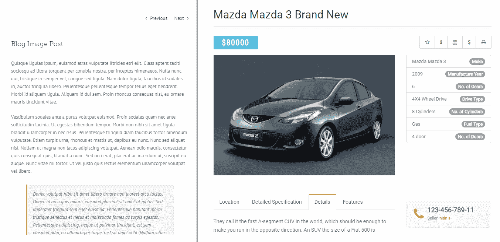

左侧的屏幕显示了一个使用`single.php`设计的正常博客文章。右侧的屏幕包含使用`single-vehicle.php`模板的`Vehicle`自定义帖子类型的先进设计。您可以清楚地看到设计上的差异以及自定义帖子类型中`single-$post_type.php`模板的需求。在 WordPress 网站开发中，您将需要构建自定义帖子类型的先进模板的技能，因此了解这些额外的模板及其代码非常重要。

# 模板层级中的其他页面

到目前为止，我们已经讨论了 WordPress 两个主要起始模板类型的层级。还有四种其他页面类型，深度有限，其作用不如存档和单页类型重要。让我们看一下下面的图表，以了解这些四种类型的层级：

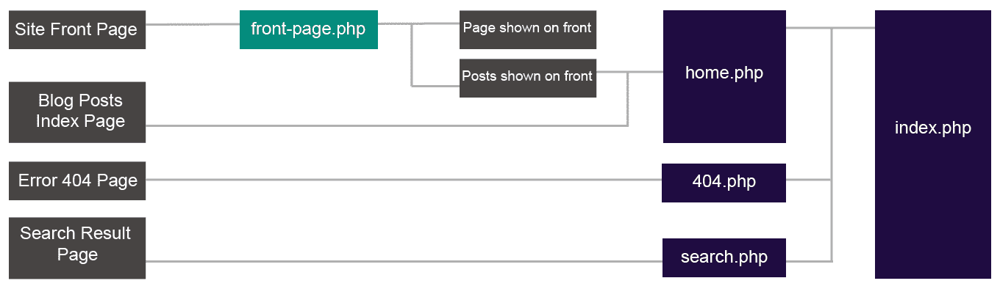

# 网站首页模板路径

在基本主题中，网站的首页由`index.php`处理，其中所有博客文章都显示为列表。除非您的网站主要功能是博客，否则将需要一个单独的模板来设计首页的设计。根据模板层级，`home.php`可以用来设计网站的首页。这个模板在大多数高级主题中都是可用的，并包含非常先进的设计。在这个路径中还有一个可选的模板，称为`front-page.php`。然而，它在大多数主题中不可用，因此在常规开发任务中可能不需要使用它。

除了使用`home.php`或`front-page.php`模板之外，我们还可以使用任何默认页面作为我们网站的首页。这由 WordPress 后端的一个设置处理。我们可以使用 WordPress 的“设置 | 阅读设置 | 您的首页显示设置”来更改首页，如下面的截图所示：

**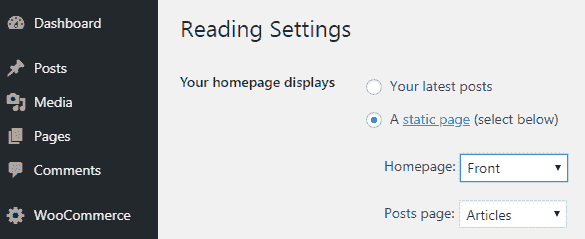**

默认情况下，此设置将使用“您最新的文章”选项。将此设置更改为“静态页面”并使用自定义页面是一种常见的技术。

# 博客文章索引页面模板路径

此路径定义了用于主博客页面的模板，其中显示一系列常规文章。默认情况下，这由`index.php`文件处理，并作为网站的首页加载。我们可以创建任何页面并将其用作博客文章索引，通过使用前述章节中解释的设置。此模板路径简单直接，通常不会根据不同场景而改变。

# 错误 404 页面模板路径

当 WordPress 无法在模板层次结构或任何模板修改钩子中找到合适的模板时，将使用此路径。大多数主题都内置了一个包含“内容未找到”信息的 404 模板。在主题中拥有此模板对于帮助用户以有意义的信息和提供到网站上其他重要内容的链接至关重要。

# 搜索结果页面模板路径

WordPress 具有内置的搜索功能，搜索结果通常包含文章和页面。这些结果类似于存档页面，顶部有搜索文本。默认情况下，此路径由`index.php`文件处理。然而，可能存在搜索结果页面需要与常规存档页面不同的场景。在内容中突出显示搜索项的需求，是我们需要单独设计的实例之一。在这种情况下，我们可以使用包含与`index.php`文件相同内容的`search.php`文件，并根据客户的定制要求进行修改。

在本节中，我们对完整的 WordPress 主题模板层次结构进行了详细的介绍。您可能已经对模板的所有理论方面感到疲惫。然而，深入了解这些模板对于构建高级网站设计和定制现有网站至关重要，在这些网站中，您将需要不断与新的主题合作。

# 条件性更改模板设计和内容

主题的主要目的是为您的网站提供一致的布局。我们只能使用一个主题，因为混合来自不同主题的不同布局会创建对比鲜明的设计，使最终用户感到困惑。相反，我们可以在主题内部条件性地更改设计，而不会失去一致性。

现在，你可能想知道，什么是统一的布局？基本上，设计中的元素应该在所有屏幕上保持相似。假设我们在页面上使用 UI 组件库构建了一个表单。那么，应该声明的是，网站上其他部分的表单应该使用相同的 UI 组件库。如果你在其他部分使用不同的 UI 元素，用户可能会感到困惑。同样，设计中的每个其他元素都需要保持一致性。然而，这并不意味着我们不能在不同部分的网站上改变设计。更多关于这一点将在接下来的章节中讨论。

# 什么是条件模板设计？

在网站开发中，我们可能需要改变不同部分的设计和内容，以便进行以下操作：

+   **匹配用户偏好**：许多现代网站允许用户选择内容偏好。因此，用户有多种选择，例如选择在任何给定屏幕上显示哪些组件，从某些类别过滤内容，甚至布局和配色方案。

+   **仅显示帖子/页面的相关内容**：通常，我们有一个侧边栏，里面充满了许多小工具。在某些情况下，这些内容可能与主要内容没有直接关系。假设我们有普通文章和另一种称为书籍的帖子类型。在书籍中，我们可能有一个侧边栏小工具来显示诸如评分、ISBN、页数和纸张类型等信息。这与普通文章不相关，因此需要有条件地移除。

+   **突出显示不同内容类型的各个部分**：不同的内容类型需要特定的布局。假设我们网站上既有普通文章也有电子产品。对于普通文章，我们显示标题、图片和内容。这种风格对于产品来说是不适用的，因为我们需要一种吸引顾客的方式。因此，我们需要通过使用图片画廊、图片滑块或可展开的标签来突出产品特性。总的来说，我们需要根据内容类型有条件地改变布局以突出内容。

我们已经讨论了 WordPress 模板层次结构。内置的模板层次结构提供了许多模板类型，以便进行有条件的变化。了解模板和内容变化的可能，而不需要作为开发者付出太多努力，这是很重要的。我们可以从基本样式到页眉、页脚、侧边栏、菜单，甚至整个模板应用有条件的变化。

根据变化类型，有几种方式可以有条件地改变设计。在本节中，我们将讨论两种简单的技术。

# 在主题文件中添加条件

这是最简单的作为开发者开始的方式。在这种技术中，我们修改现有的主题文件，添加条件，并在这些条件内加载不同的元素和内容。我们已经讨论了更改核心主题文件的缺点。在这里，我们需要在子主题中实现这项技术。你可以在本章前面创建的 Twenty Seventeen 子主题中实现这些技术。

让我们通过为我们的网站创建有条件的页眉来理解这项技术。通常，WordPress 网站上的页面是静态的，提供有关网站的信息。关于我们、服务和联系是一些常见的页面用途。另一方面，帖子或自定义帖子类型页面高度动态，包含各种内容，如促销、广告、社交分享选项等。因此，存在需要为帖子页面使用不同页眉的场景。现在让我们保持页眉不变，并修改带有顶部广告的帖子页眉。以下是对**Twenty Seventeen**主题默认页眉部分的截图：

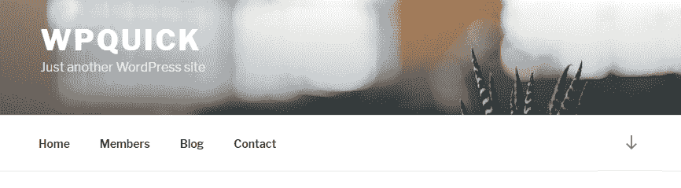

首先，你需要将**Twenty Seventeen**的`header.php`文件复制到子主题的根目录。接下来，你可以定义条件来更改帖子页眉部分。以下代码为正常帖子模板的页眉部分添加了一个广告栏：

```php
<?php if(is_single()) { ?> 
  <div id="wpquick-article-ads" style="padding:20px;text-align:center;font-size:20px;background:red;color:#FFF;"> GET MEMBERSHIP WITH 30% DISCOUNT </div> 
<?php } ?> 
```

上述代码应在子主题中的`header.php`文件的`<header>`标签之后添加。现在，你可以查看单个帖子，页眉将包含动态广告栏，如下面的截图所示：

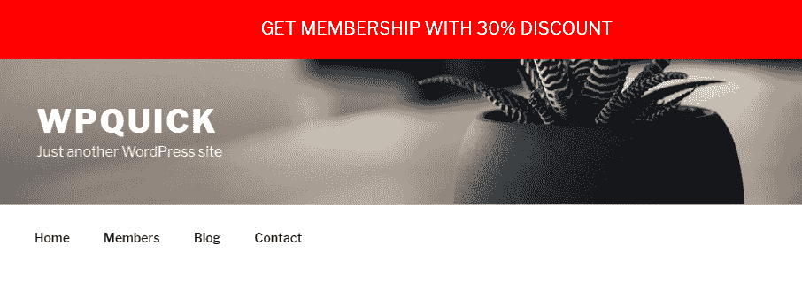

这种技术可以有效地用于在只有有限不同条件的情况下有条件地更改模板。然而，由于它会复杂化模板文件，因此不适合处理复杂条件。

我们可以使用相同的过程有条件地更改网站的其他重要部分。让我们快速看一下更改这些部分所涉及的步骤：

+   **页脚**：我们需要将父主题中的`footer.php`文件复制到子主题中。然后，我们根据必要条件遵循相同的流程来添加/删除内容。

+   **侧边栏**：我们需要将父主题中的`sidebar.php`文件复制到子主题中。然后，我们根据必要条件遵循相同的流程来加载不同的侧边栏或向现有的侧边栏模板中添加静态内容。

+   **菜单**：通常，菜单是通过 `wp_nav_menu` 函数生成的，该函数位于主题的 `header.php` 文件中。在这种情况下，我们使用的是 **Twenty Seventeen** 主题，因此你可以在 `template-parts/navigation/navigation-top.php` 文件中找到这个函数。你可以复制这个模板并修改它，以便根据必要的条件加载不同的菜单。

在本节中，我们探讨了根据条件更改网站标题的过程。你可以扩展这项技术，在标题中进行重大设计更改，以及使用其他条件，如主页、分类页面、特定页面等。你可以在 [`codex.wordpress.org/Template:Conditional_Tags`](https://codex.wordpress.org/Template:Conditional_Tags) 找到用于添加各种类型条件的可用模板标签列表。

# 条件加载模板文件

在这项技术中，我们使用现有的 WordPress 过滤器根据自定义条件动态更改模板。WordPress 在加载默认模板之前执行一个名为 `template_include` 的过滤器，基于我们之前讨论的层次结构。在模板层次结构部分，我们通过使用给定路径中的前一个模板来更改模板。使用此过滤器允许我们在任何给定路径中更改任何模板。让我们看一下以下代码，以了解这项技术的实现：

```php
add_filter( 'template_include', 'wpquickstart_conditional_template', 99 ); 
function wpquickstart_conditional_template( $template ) { 
   if ( is_page( 'portfolio' ) ) { 
         $new_template = locate_template( array( 'portfolio-page-template.php' ) ); 
         if ( !empty( $new_template ) ) {  
               return $new_template; 
         } 
   } 
   return $template; 
} 
```

默认模板的位置作为参数传递给此过滤器。在这种情况下，我们检查名为 `portfolio` 的页面是否被加载。如果条件匹配，我们将返回一个动态的新模板而不是默认模板。前面的代码将在主题的根目录中查找模板。这种方法的优势在于能够同时在不同模板路径上使用不同的条件并加载必要的模板。我们还可以使用这项技术根据条件如 URL 参数、登录用户或用户角色以及请求的引用来加载动态模板。

作为一名开发者，你必须了解这项技术。可能有网站在主题的 `functions.php` 文件中以及使用自定义插件时使用这项技术。如果你不了解这项技术，你将不得不浪费大量时间浏览模板层次结构以找出加载的模板。

# 摘要

应用程序的前端是用户的主要交互点，因此请求前端更改的可能性相对较高。因此，使用主题的现有功能来使模板尽可能灵活是非常重要的。在本章中，我们探讨了主题及其组件在开发中的重要性。然后，我们开始使用子主题、动作和过滤器扩展现有主题。接下来，我们深入概述了主题模板层次结构，以便以灵活的方式构建新主题以及自定义现有主题。最后，我们探讨了根据高级站点需求有条件地更改设计的技巧。

在第四章《使用插件开发构建自定义模块》中，我们将探讨构建不同类型 WordPress 插件的过程，以及添加超出主题功能之外的功能。
