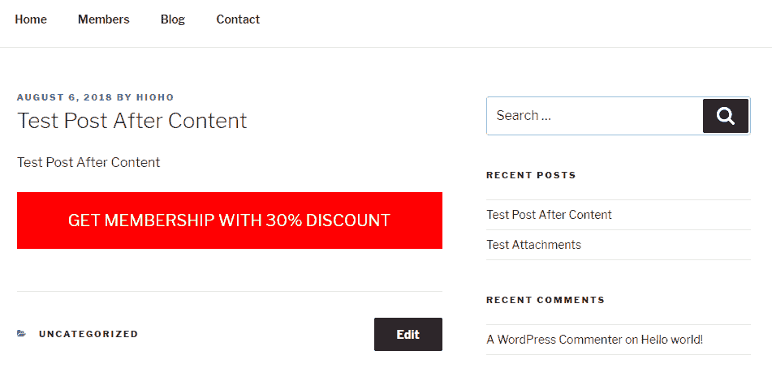
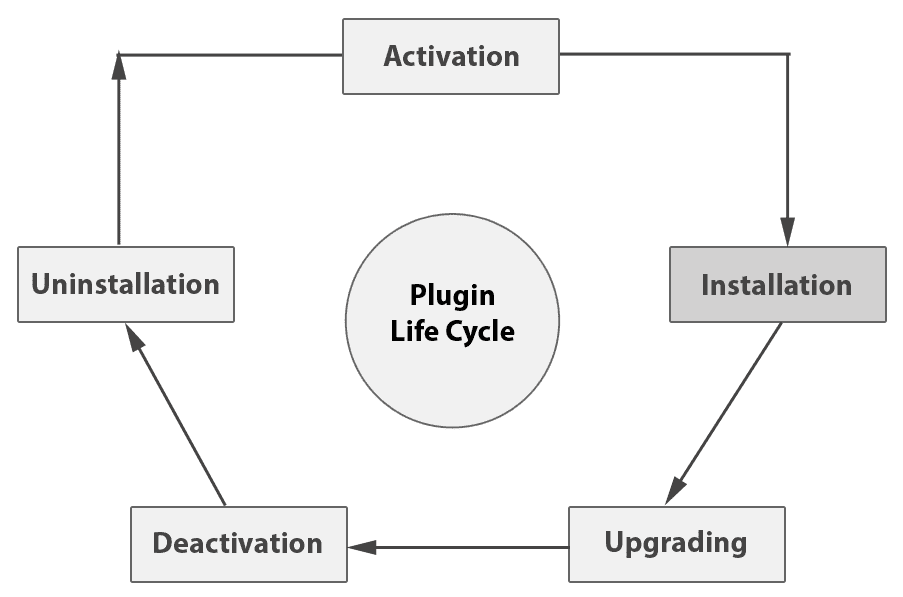
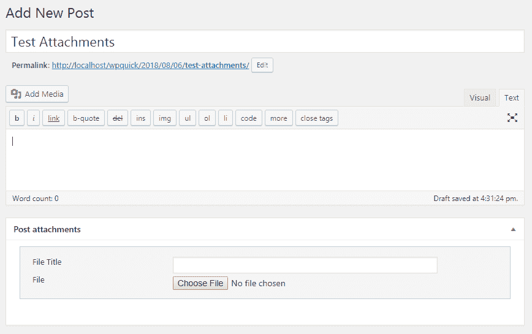
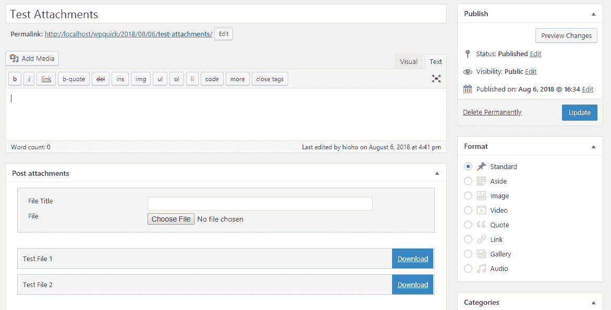
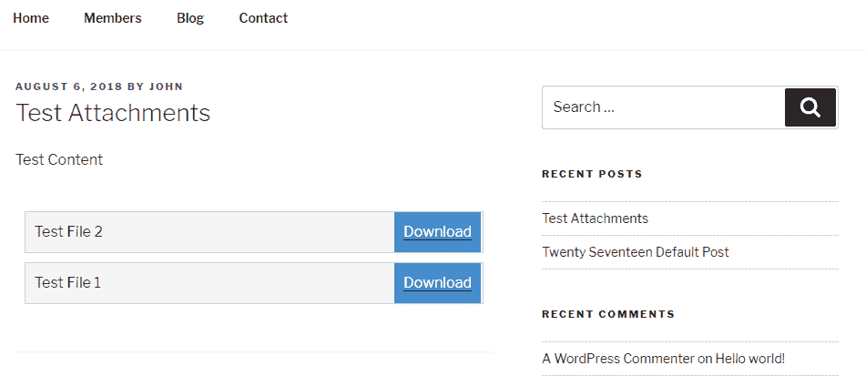

# 使用插件开发构建自定义模块

丰富的免费插件库和基于插件的架构是 WordPress 作为 CMS 成功的关键。插件允许开发者构建独立的功能，以及与其他开发者开发的模块连接。我们可以使用插件来构建由全球顶级 WordPress 开发者编写的优质网站，而无需花费一分钱。从开发者的角度来看，插件允许您帮助成千上万的用户，同时还能推广您作为开发者的技能。任何具有基本编程知识的人都可以创建插件以满足特定应用的需求。然而，开发出可跨多个项目复用的优质插件需要相当大的努力。

在本章中，您将了解插件的概念以及它们与您的主题有何不同。您还将通过创建一个帖子附件插件来了解适当的插件的生存周期事件，以说明这些事件的使用。插件开发中的主要概念，如数据验证、清理和 nonce，将被介绍。了解如何利用现有的 WordPress 功能来构建可以添加或删除而不会影响其他部分的插件是本章的亮点。

在本章中，我们将涵盖以下主题：

+   理解插件在开发中的作用

+   从零开始创建基本插件

+   探索插件的生存周期

+   开发帖子附件插件

+   识别自定义插件开发的优点

+   构建高质量插件的指南

到本章结束时，您应该能够理解插件的作用，并具备使用推荐实践从头开始构建基本插件所必需的知识。

# 技术要求

遵循此流程需要您已安装 WordPress 4.9.8。即使您拥有更晚版本的 WordPress，描述的示例也应能无重大问题地运行。

即使您拥有更晚版本的 WordPress，描述的示例也应能无重大问题地运行。

本章的代码文件可以在 GitHub 上找到：

[`github.com/PacktPublishing/WordPress-Development-Quick-Start-Guide/tree/master/Chapter04`](https://github.com/PacktPublishing/WordPress-Development-Quick-Start-Guide/tree/master/Chapter04)

查看以下视频以查看代码的实际应用：

[`bit.ly/2Py2szO`](http://bit.ly/2Py2szO)

# 理解插件的作用

插件是一组专门用于作为独立解决方案工作的函数，同时扩展或添加 WordPress 的新功能。在 WordPress 中，插件类似于我们在 iOS 和 Android 中使用的应用。我们有权使用或删除任何插件，而不会影响 WordPress 的核心功能。此外，插件允许我们将独立功能分离成各自的插件，使它们更容易维护。[wordpress.org](http://wordpress.org)的插件库拥有超过 50,000 个免费插件，有时你甚至不需要为 WordPress 网站开发任何东西。你只需使用多个插件并正确集成它们，就可以构建高级功能。

插件在网站开发中起着至关重要的作用。在第三章中，*使用主题开发设计灵活的前端*，我们讨论了主题的作用以及主题范围之外的功能。基本上，任何超出主题范围的功能都应该使用插件来开发。然而，也有一些场景，我们也会使用插件来开发特定于主题的事物，如模板和样式，以便它们与多个主题兼容。在大多数情况下，插件应该要么使用它们自己的样式和设计，要么默认使用主题的样式。专注于特定主题的插件开发并不理想，因为在后期阶段几乎不可能切换到另一个主题。

在开发过程中，构建插件的范围可以从只有几行代码的过滤器实现到数千行代码的高级模块。让我们看看一些使用插件的常见开发任务：

+   **构建可重用块**：WordPress 网站大多由非技术性的网站所有者构建，因此构建简单功能的块是常见任务。这些块允许客户在网站的任何位置添加功能，而无需开发者。我们可以使用短代码或小工具提供作为可重用块的特性。在现代网站上，页面构建器经常被用来构建页面设计。因此，我们也可以开发用于页面构建器的组件，这些组件将被用作可重用块。

+   **修改内置功能**：这对于许多网站来说是必须的，尤其是对于扩展后端功能和自定义后端显示。由于这些是内置功能，我们不能修改 WordPress 文件来定制它们。因此，我们需要选择内置功能的动作和过滤器，并使用插件来实现它们。

+   **数据捕获和显示**：这是另一种常见的需求类型，尤其是对于超出基本博客功能的网站。在这些任务中，我们需要在前端创建自定义表单，并使用后端功能存储数据或创建自己的数据存储。内置的自定义帖子类型和自定义构建表单用于处理此类需求。

+   **集成 UI 组件**：现代网站充满了旨在在有限空间内显示大量数据的交互式用户界面组件。这些组件大多由开源 JavaScript 库提供支持。因此，集成这些库并允许管理员向这些组件添加数据是另一个常见需求。

在处理特定 WordPress 网站时，你将面临一些挑战。构建插件以处理这些类型的需求对于 WordPress 开发者来说是必不可少的，因此我们将在接下来的章节中介绍它们。然而，如果你计划开发自己的插件，挑战和可能性是巨大的。我们可以探索 WordPress 插件目录，了解插件能做什么以及涉及的范畴。

# 基于功能的 WordPress 插件类型

随着你继续探索，你会明白插件的作用可能各不相同。因此，识别这些不同类型的插件以面对扩展不同 WordPress 模块的挑战是很重要的。在这里，我们将选择一些不同插件类型的流行插件，并讨论它们如何与 WordPress 的前端和后端交互。这纯粹是个人偏好，因此在你探索插件目录后，你可能希望以不同的方式对它们进行分类：

+   **Yoast SEO** ([`wordpress.org/plugins/wordpress-seo/`](https://wordpress.org/plugins/wordpress-seo/)): 此插件通过在页面中添加必要的内容来提高网站的 SEO。此类插件在后台有界面，我们可以添加内容或设置。然而，这些插件在前端内部工作，因为我们看不到任何内容。这类插件的例子包括来自缓存、分析和翻译类别的插件。

+   **WordPress 导入器** ([`wordpress.org/plugins/wordpress-importer/`](https://wordpress.org/plugins/wordpress-importer/)): 此插件通过文件将数据导入 WordPress 数据库。这类插件在前端或后端界面中没有任何功能。相反，这些插件通过更改数据库值来提供功能。这类插件的例子包括重复帖子插件和 All-in-One WP 迁移插件。

+   **WooCommerce** ([`wordpress.org/plugins/woocommerce/`](https://wordpress.org/plugins/woocommerce/)): 此插件通过创建和销售产品来简化在线购物过程。这类插件在后台有界面以添加内容，在前端也有界面以显示内容。除此之外，这些插件包含广泛的数据处理。这是你在开发任务中最常见的插件类型。这类插件的例子包括 BuddyPress 和 bbPress。

+   **Meta Slider** ([`wordpress.org/plugins/ml-slider/`](https://wordpress.org/plugins/ml-slider/))：此插件为网站的前端添加了优雅的图片滑块。这类插件具有用于添加内容的后端界面和用于在现代 UI 元素中显示内容的客户端界面。然而，不涉及数据处理。此类插件的例子包括 Easy FancyBox 和 Max Mega Menu。

+   **管理员菜单编辑器** ([`wordpress.org/plugins/admin-menu-editor/`](https://wordpress.org/plugins/admin-menu-editor/))：此插件允许你更改菜单和相关设置。这类插件允许你添加、更改和删除内置的后端功能以满足你的需求。此类插件不与前端或数据交互。此类插件的例子包括 Admin Columns 和 Simple Page Ordering。

+   **Easy Google Fonts** ([`wordpress.org/plugins/easy-google-fonts/`](https://wordpress.org/plugins/easy-google-fonts/))：此插件允许你为网站内容使用 Google 字体。这类插件通常没有与后端或前端相关的功能。相反，它们将第三方服务与 WordPress 连接。此类插件的例子包括 AddToAny 分享按钮和 Google 文档嵌入器。

+   **高级自定义字段** ([`wordpress.org/plugins/advanced-custom-fields/`](https://wordpress.org/plugins/advanced-custom-fields/))：此插件充当框架，允许开发者和客户使用现有组件构建表单。这类插件与后端和前端都进行交互。然而，这些插件不提供特定于站点的功能。相反，管理员决定向用户显示哪些元素以及如何处理数据。此类插件的例子包括 Elementor 页面构建器和 Pods 自定义内容类型和字段。

我们可以构建的插件类型非常多，这里无法全部涵盖，即使我们有一个专门章节来介绍它们。因此，我们选择了一些包含最流行开发任务的插件。

# 创建你的第一个插件

开发一个简单插件的过程并不复杂。它遵循了我们用于主题的相同流程，其中我们使用了 PHP 头部注释。首先，你必须在`wp-content/plugins`目录内创建一个新的目录，并给它一个首选的名称。在这个例子中，我们将将其命名为`wpquick-after-post-content`。一旦创建了插件目录，我们就可以创建主要的插件文件，即`wpquick-after-post-content.php`。你可以为主插件文件使用首选的名称。现在，我们必须添加以下头部注释部分来定义它为一个插件：

```php
<?php
/*
Plugin Name: WPQAPC After Post Content
Plugin URI: http://www.wpexpertdeveloper.com/wpquick-after-post
Description: Add dynamic content after the post
Version: 1.0
Author: Rakhitha Nimesh
Author URI: http://www.wpexpertdeveloper.com
*/
```

插件定义注释与主题定义类似，其中主题名称和主题 URI 被插件名称和插件 URI 所替换。一旦注释被添加，这个目录就变成了一个插件，你可以刷新后端插件列表以反映插件的详细信息。现在，你可以在主插件文件或子文件中添加任何 PHP 代码，以开始使用 WordPress 进行开发。与常规 PHP 开发不同的是，这里使用的是 WordPress 钩子。我们将在本章中介绍必要的钩子。

让我们给这个插件添加一些功能。我们把这个插件命名为“帖子内容之后”。这个功能是在网站的每篇帖子之后添加动态内容。在第三章，“使用主题开发设计灵活的前端”，我们向头部部分添加了一个动态广告栏。在这里，我们将在帖子内容之后显示相同的广告。考虑以下代码来实现这个功能：

```php
add_filter( 'the_content', 'wpqapc_file_attachment_display' );
function wpqapc_file_attachment_display( $content ){
  global $post;
  if( is_singular( 'post' ) ){
    $after_content = '<div id="wpquick-article-ads" style="padding:20px;text-align:center;font-size:20px;background:red;color:#FFF;">GET MEMBERSHIP WITH 30% DISCOUNT</div>';
    return $content . $after_content;
  }
  return $content;
}
```

这段代码被添加到主插件文件中，在头部注释部分之后。通常，我们不得不修改帖子模板来在纯 PHP 开发中添加这样的内容。在 WordPress 中，所有内容都钩接到一个动作或过滤器上，因此我们可以使用它们而不修改模板文件。在这里，我们使用了`the_content`过滤器与一个回调函数。我们已经在第三章，“使用主题开发设计灵活的前端”中讨论了过滤器的作用。这个过滤器用于修改帖子/页面内容，并且包含在所有正确编码的主题中。默认的帖子内容传递给这个过滤器，插件可以通过实现这个钩子来改变这个内容。

在这个场景中，我们使用了`is_singular`函数进行条件检查。这个函数用于检查我们是否正在查看任何给定帖子类型的单页。一旦条件匹配，我们就在现有帖子内容之后添加动态广告栏。现在，你可以在前端创建和查看新帖子。我们添加的内容将以与以下截图所示类似的方式显示：



我们在非常短的时间内创建了一个简单的插件。WordPress 插件可以从几行代码如这一例，到数千行代码的复杂系统。因此，正如我们所看到的，开发 WordPress 插件并不困难。将即使是几行代码也分离成单独的插件总是一个好选择，假设这些功能对许多网站都有用。在这个例子中，我们只向每篇帖子添加了一个固定的栏。在实际应用中，我们还需要更改这些广告，并具有从后端将它们添加到每篇帖子的能力。

# 探索插件的生命周期

产品生命周期是一系列从产品或流程开始到完成的事件或阶段。WordPress 插件包含生命周期事件，从初始激活到卸载。理解所有这些事件对于保持插件正常运行和数据一致性至关重要，即使在退出插件之后也是如此。许多开发者只知道其中的一些事件，导致插件质量低下。

在本节中，我们将探讨插件的整个生命周期以及如何管理生命周期中的每个事件。以下图表展示了插件中事件的基本示意图：



如您所见，插件的生命周期包含五个事件，除了其功能之外。插件通过激活事件开始生命周期。通过停用或卸载事件完成周期，然后再次通过激活事件开始新的周期。让我们了解这五个事件：

+   **激活**：这是一个内置事件，当从 WordPress 插件列表或安装屏幕点击激活按钮时触发。这可以用于在激活时执行某些操作，以及初始化插件的数据和设置。理想情况下，初始化任务应该通过一个单独的安装过程来完成，因为插件激活不是一次性的事件。然而，只有少数插件提供单独的安装过程，因为它是一个特定于插件的事件。因此，大多数开发者将使用 WordPress 的内置激活过程来初始化插件，并进行必要的条件检查。在激活过程中执行的一些实际功能包括添加重写规则、创建/修改数据库表、添加默认设置以及创建演示数据。

+   **安装**：这不是一个内置事件，大多数 WordPress 插件使用激活事件进行安装。然而，对于复杂的插件，我们可能需要一个类似于 WordPress 的逐步安装过程。通过这种方式，我们可以在激活后使用自定义代码实现自己的安装过程。您可以通过安装 WooCommerce 来查看如何通过自定义屏幕处理特定于插件的安装过程。

+   **升级**：这是一个 WordPress 插件库中插件的内置事件，在版本升级完成后使用。然而，除非我们构建一个自定义的升级过程从我们的服务器获取文件，否则此事件对其他插件不可用。因此，我们需要通过结合现有的 WordPress 钩子和条件检查来处理这种情况，在没有自定义自动升级过程的情况下。此事件可以用于在新版本中添加默认值以设置附加设置、更改数据库表、将现有数据转换为新的格式等。

+   **停用**：这是一个由点击 WordPress 插件列表中的停用链接触发的内置事件。这个动作应该用于在插件停用之前执行某些任务。通常，开发者会误解这个动作的用途，并倾向于将其用作卸载过程。停用是一个临时事件，因此你在这个钩子中不应该删除插件数据。理想情况下，这个事件应该用于诸如删除重写规则、清除缓存和临时数据库值等功能。

+   **卸载**：这也是一个由点击 WordPress 插件列表中的删除链接触发的内置事件。这是处理卸载的正确事件，必须用于清除插件特定的数据。许多插件没有卸载过程，导致插件数据留在数据库中。一旦插件被停用，插件数据不会影响网站的功能。然而，这些数据会影响网站的性能，并使其容易与未来将使用的插件发生冲突。因此，为插件实现卸载事件以及指导用户在卸载后会发生什么非常重要。

在下一节中，我们将使用插件最重要的和强制性的生命周期事件来开发一个插件。

# 开发一个帖子附件插件

在前两个章节中，我们讨论了构建基本插件和生命周期事件的步骤。在本节中，我们将开发一个插件，同时涵盖生命周期事件在插件开发中的实现和关键特性。让我们总结一下插件的需求。

在大多数 WordPress 网站上，使用博客文章并在帖子后显示动态内容是常见的。我们已经在前开发的第一个插件中查看过在帖子后添加内容的过程。现在，我们将扩展功能，允许在帖子后下载附件。在一些网站上，允许用户下载与帖子相关的文件是必不可少的。这个插件将允许管理员从后端向帖子添加文件，并允许用户通过在帖子内容后显示这些文件来下载这些文件。

让我们从在`wp-content/plugins`目录内创建一个名为`wpquick-post-attachments`的新目录开始，来开发我们的插件。然后，我们需要在新目录内创建主插件文件，命名为`wpquick-post-attachments.php`。像往常一样，我们需要在这个文件中添加插件头部注释部分，以便 WordPress 将其列为插件。你可以使用之前插件的插件头部注释，只需修改名称和描述即可。

现在，我们必须确定这个插件开发过程中涉及的任务：

+   创建一个自定义表来存储每篇帖子的附件详情

+   在帖子创建屏幕中添加一个文件字段来上传附件

+   在自定义表中上传和保存附件

+   在帖子内容后显示附件并具有下载功能

让我们从在之前讨论的插件生命周期事件中添加这些功能开始开发过程。

# 在插件激活时创建设置

插件的激活过程由内置的`register_activation_hook`函数处理。在这种情况下，我们正在开发一个简单的插件来阐述插件开发中概念的重要性。在这里，我们将使用内置的激活事件来初始化此插件设置和数据，而不是创建单独的安装过程。将以下代码添加到`wpquick-post-attachments.php`文件中，在头部注释部分之后：

```php
register_activation_hook( __FILE__, 'wpqpa_activate' );
function wpqpa_activate(){
  global $wpdb;
  $table_attachments = $wpdb->prefix . 'wpqpa_post_attachments';
  $sql_attachments = "CREATE TABLE IF NOT EXISTS $table_attachments (
                 id int(11) NOT NULL AUTO_INCREMENT,
                 file_name varchar(255) NOT NULL,
                 user_id int(11) NOT NULL,
                 post_id int(11) NOT NULL,
                 file_path longtext NOT NULL,
                 updated_at datetime NOT NULL,
                 uploaded_file_name varchar(255) NOT NULL,
                 PRIMARY KEY (id)
                 );";

  require_once( ABSPATH . 'wp-admin/includes/upgrade.php' );
  dbDelta( $sql_attachments );
  $default_headers = array('Version' => 'Version');
  $plugin_data = get_file_data(__FILE__, $default_headers, 'plugin');
  update_option( 'wpqpa_version',$plugin_data['Version'] );
}
```

我们使用`register_activation_hook`函数来注册一个在激活过程中要执行的自定义函数。第一个参数接受主插件文件的路径，而第二个参数用于定义函数名称。在这里，我们使用了一个名为`wpqpa_activate`的函数。

我们通过创建一个自定义表来存储帖子附件路径和其他必要细节来开始插件激活过程。我们已经在第二章中讨论了创建自定义表和`dbDelta`函数的使用，因此本节中不会重复解释。除了表创建之外，我们还可以保存初始数据或运行插件所需的设置。在这种情况下，我们通过使用`get_file_data`函数从头部注释部分捕获插件版本，并将其保存到具有特定键`wpqpa_version`的`wp_options`表中。

我们使用激活过程在数据库中生成必要的配置。在开发这些功能之前，我们需要指定必要的路径以访问插件中的其他文件。因此，让我们通过以下代码在主插件文件中添加一些常量：

```php
if ( ! defined( 'WPQPA_PLUGIN_DIR' ) ) {
  define( 'WPQPA_PLUGIN_DIR', plugin_dir_path( __FILE__ ) );
}
if ( ! defined( 'WPQPA_PLUGIN_URL' ) ) {
  define( 'WPQPA_PLUGIN_URL', plugin_dir_url( __FILE__ ) );
}
```

首先，我们必须使用`defined`函数来检查是否已经定义了具有给定名称的常量，以防止错误。在这里，我们添加了两个常量来定义插件目录内插件文件的 URL 和完整目录路径。这两个常量将在后续部分中用于加载插件的脚本、样式和 PHP 文件。现在，我们可以进入构建插件功能的过程。

# 实现帖子附件上传

帖子创建屏幕设计为允许开发者通过使用自定义元框来扩展功能。在这种情况下，我们需要一种让管理员能够将文件上传到帖子中的方法。因此，我们需要定义一个自定义元框来显示输入元素，如下面的代码所示：

```php
add_action( 'add_meta_boxes_post', 'wpqpa_post_attachments_meta_box' );
function wpqpa_post_attachments_meta_box( $post ){
  add_meta_box( 'wpqpa-post-attachments', __( 'Post attachments', 'wpqpa' ),
'display_post_attachments_meta_box', 'post', 'normal', 'high' );
}
```

`add_meta_boxes_post`动作用于为普通帖子注册一个新的元框。在这个动作内部，我们可以使用`add_meta_box`函数创建一个新的元框。

如果你正在为特定文章类型注册元框，建议你使用`add_meta_boxes_{post_type}`动作。在元框为多个文章类型注册的场景中，你可以使用通用的`add_meta_boxes`动作。

此函数的前三个参数是必需的，分别用于唯一的元框 ID、元框标题和回调函数。在这种情况下，我们正在调用主插件文件中的一个函数，因此我们可以直接使用函数名。然而，如果回调函数位于 PHP 类中，你需要使用以下语法来在类的对象上调用函数：

```php
$wpqpa = new WPQPA();
add_meta_box( 'wpqpa-post-attachments', __( 'Post attachments', 'wpqpa' ),
array($wpqpa, 'display_post_attachments_meta_box') , 'post', 'normal', 'high' );
```

上述代码中的剩余三个参数分别用于屏幕、上下文和优先级。让我们看看这三个参数的使用方法：

+   **屏幕**: 此参数指定了用于显示元框的 WordPress 屏幕 ID 或 ID 数组。WordPress 中的每个屏幕都有一个特定的 ID，以便开发者为特定屏幕构建功能。在这里，我们使用了“文章”作为屏幕，因为我们只为普通文章显示元框。您可以通过访问[`codex.wordpress.org/Plugin_API/Admin_Screen_Reference`](https://codex.wordpress.org/Plugin_API/Admin_Screen_Reference)来检查管理屏幕的可用的屏幕 ID。

+   **上下文**: 此参数定义了屏幕内的位置。对于文章屏幕，我们有三个选项：普通、高级和侧边。默认值是高级，在文章编辑器下方显示元框。然而，如果创建了一个*普通*元框，它将显示在具有高级上下文的元框之前。侧边选项将元框移动到侧边栏，与发布按钮一起。

+   **优先级**: 此参数定义了元框在上下文中的位置。我们有四个值，称为高、核心、默认和低。高值将元框放置在上下文顶部，而随着我们移动到低选项，优先级将降低。

接下来，在我们可以检查文章屏幕上的新元框之前，我们需要完成回调函数的实现。让我们考虑以下用于实现`display_post_attachments_meta_box`函数的代码：

```php
function display_post_attachments_meta_box( $post, $metabox ){
  global $wpdb;
  $display = '<div class="wpqpa-files-panel" >
   <div class="wpqpa-files-add-form" >
     <div class="wpqpa-files-msg" style="display:none" ></div>
     <div class="wpqpa-files-add-form-row">
     <div class="wpqpa-files-add-form-label">'.__("File Title","wpqpa").'</div>
     <div class="wpqpa-files-add-form-field">
     <input type="text" class="wpqpa-file-name" name="wpqpa_file_name" />
     </div>
     </div>
     <div class="wpqpa-files-add-form-row">
     <div class="wpqpa-files-add-form-label">'.__("File","wpqpa").'</div>
     <div class="wpqpa-files-add-form-field">
     <input type="file" class="wpqpa-file" name="wpqpa_file" />
     </div>
     </div>
    <div class="wpqpa-clear"></div>
  </div>';
  $display .= wp_nonce_field( "wpqpa_attachment", "wpqpa_nonce", true, false );
  echo $display;
}
```

此函数自动接收文章对象和元框详情作为参数。大部分代码都是自我解释的，因为它包含容器元素和必要的 HTML 字段。然而，最后一行对于开发者来说非常重要。WordPress 使用一种称为**nonce**的技术来提高你代码的安全性。让我们看看 nonce 的定义，它已经从官方手册中提取出来：

“一次性数是一个“一次使用”的数字，用于帮助保护 URL 和表单免受某些类型的滥用，无论是恶意的还是其他类型的。WordPress 的一次性数不是数字，而是由数字和字母组成的哈希值。它们也不是只使用一次，而是在有限的生命周期后过期。在此期间，给定用户在给定上下文中将生成相同的一次性数。该动作的一次性数将保持不变，直到该一次性数生命周期完成。”

简而言之，一次性数用于验证用户请求并保持提交数据的完整性。在插件开发中，尤其是在开发供公众使用的插件时，使用一次性数验证是必须的。`wp_nonce_field`函数用于添加一个带有一次性数值的隐藏字段。此函数的第一个参数是在验证过程中将使用的动作名称，第二个参数是 HTML 隐藏字段的名称。我们可以不使用这些参数中的任何一个来使用`wp_nonce_field`函数，但强烈建议使用这两个选项。以下是从使用`wp_nonce_field`函数生成的示例输出：

```php
<input type="hidden" id="wpqpa_nonce" name="wpqpa_nonce" value="bff32cce02">
<input type="hidden" name="_wp_http_referer" value="/wp-admin/post.php?post=9&action=edit">
```

这个一次性值将在数据保存过程中用于验证。到目前为止，我们已经添加了必要的 HTML 来显示文件上传输入字段。然而，如果没有必要的样式，这些元素可能会到处显示。因此，我们需要在我们的插件目录内创建一个名为`css`的目录，并添加一个 CSS 文件，命名为`wpqpa.css`。然后，我们需要通过使用推荐的 WordPress 操作来包含这个 CSS 文件。以下是一个包含 CSS 文件的代码示例：

```php
add_action( 'admin_enqueue_scripts', 'wpqpa_load_scripts',9 );
add_action( 'wp_enqueue_scripts', 'wpqpa_load_scripts',9 );
function wpqpa_load_scripts(){
  wp_register_style( 'wpqpa_css', WPQPA_PLUGIN_URL . 'css/wpqpa.css' );
  wp_enqueue_style( 'wpqpa_css' );
}
```

在 WordPress 中，我们需要使用`admin_enqueue_scripts`动作来添加脚本和样式文件到后端，并使用`wp_enqueue_scripts`动作来处理前端。在这种情况下，我们在前端和后端都显示了相同的文件列表。因此，我们使用这两个动作来加载我们创建的 CSS 文件。首先，我们必须使用带有唯一键和路径的`wp_register_style`函数注册样式文件。然后，我们使用`wp_enqueue_style`函数将样式文件添加到页面中。脚本和样式加载的更多细节和高级用法将在后续章节中讨论。本章节不讨论此插件的 CSS 样式。你可以使用本章的源文件来理解和修改它们。

现在，我们可以看一下带有我们的元框修改后的帖子创建屏幕，如下面的截图所示：



自定义元框显示在帖子编辑器下方。然而，在一个单站点中，我们可能会使用许多带有自定义元框的插件。因此，除非你愿意更改这些插件的代码，否则你无法将元框放置在我们需要的确切位置。

# 上传附件和保存附件数据

在此过程中下一步是上传并保存管理员选择的文件。在这种情况下，我们通过定义的字段在元框中添加文件和文件标题。然后，管理员需要点击文章的“发布”或“更新”按钮来保存附件。

理想情况下，附件详情应使用 AJAX 上传并保存，以支持多文件上传而无需更新文章。在这种情况下，我们使用了正常的表单提交，因为我们尚未引入 AJAX，并且我们需要了解处理正常 POST 请求的过程。

让我们通过以下代码查看附件保存过程，该代码已被添加到我们的插件主文件中：

```php
add_action( 'init', 'wpqpa_save_private_attachment_files' );
function wpqpa_save_private_attachment_files(){
  global $wpdb;
  if( ! isset( $_POST['wpqpa_file_name'] ) ){
    return;
  }
  $file_name = isset($_POST['wpqpa_file_name']) ?        sanitize_text_field($_POST['wpqpa_file_name']) : '';
  $file_nonce = isset( $_POST['file_nonce'] ) ? ( $_POST['file_nonce'] ) : '';
  $post_id = isset( $_POST['post_ID'] ) ? (int) ( $_POST['post_ID'] ) : 0;
  $user_id = get_current_user_id();
  // Remaining code
}
```

通常，开发者可以直接在任何网站文件中访问 POST 请求数据。然而，WordPress 使用基于事件的架构，因此我们需要实现适当的钩子来访问这些数据。在适当的 WordPress 事件之外访问请求数据可能会导致冲突或数据不可用。因此，我们使用 `init` 动作来访问 POST 数据，因为用户请求在到达 `init` 动作时已经完全加载。关于动作执行过程的更多内容将在第五章“使用插件扩展、过滤器、和动作”中讨论，第五章。

`init` 动作将为每个请求执行，因此我们需要确保我们仅在必要时使用自定义代码。因此，我们检查用户请求中 `wpqpa_file_name` 字段的可用性，当它不可用时，我们不执行自定义代码并返回。然后，我们必须从 POST 请求中获取必要的数据。在这里，我们需要三个值：文件名、nonce 和文章 ID。

你可能已经注意到了一个名为 `sanitize_text_field` 的函数的使用。此函数用于从文本字段提交中删除不必要的标签、空格、换行符和字符。你不应该信任传入的数据；这就是为什么在记录之前你应该使用 `sanitize_text_field`。我们应该始终验证并限制用户输入值，以提高代码的安全性并防止数据库中的冲突。WordPress 通过验证、清理和转义来使用三个步骤来保护数据：

+   **清理**：在这个阶段，我们必须获取用户提交的数据并确保它包含接受的值。WordPress 提供了一组用于清理用户输入并使其安全的函数。`sanitize_text_field` 是其中的一个函数，共有 13 个清理函数。可用的函数及其用途在 [`codex.wordpress.org/Validating_Sanitizing_and_Escaping_User_Data#Sanitizing:_Cleaning_User_Input`](https://codex.wordpress.org/Validating_Sanitizing_and_Escaping_User_Data#Sanitizing:_Cleaning_User_Input) 中解释。

+   **验证**：在这个阶段，我们验证上一阶段清理后的输入值。此步骤的目的是检查用户提交的数据是否与接受的值匹配。与清理不同，没有特定的验证函数。我们可以使用 PHP 和 WordPress 函数的自己的条件进行验证。验证数据类型、字符串长度、数据格式和空值是此步骤的一些常见用途。

+   **转义**：此步骤用于向用户显示数据时。此步骤的目的是确保要显示的数据安全。WordPress 提供了一套基于不同数据的内置转义函数。我们将在接下来的章节中讨论转义的使用。可用的转义函数及其使用在[`codex.wordpress.org/Data_Validation#Output_Sanitation`](https://codex.wordpress.org/Data_Validation#Output_Sanitation)中解释。

根据表单中使用的字段类型和接受的值，您应该从这三个部分中选择必要的函数来验证用户数据。

处理过程的下一步是验证输入数据和上传附件。考虑以下代码，它放置在输入数据捕获代码之后：

```php
if ( ! isset( $_POST['wpqpa_nonce'] ) || ! wp_verify_nonce( $_POST['wpqpa_nonce'], 'wpqpa_attachment' ) ) {
  $result_upload = wpqpa_process_file_upload();
  // Upload code section 1
}else{
  // Handle error for invalid data submission
}
```

首先，我们需要通过使用我们在自定义元框中添加的 nonce 值来验证用户请求。我们首先通过使用`isset($_POST['wpqpa_nonce'])`条件来检查 nonce 值的存在。然后，我们可以使用`wp_verify_nonce`函数来验证提交的 nonce 值。这个函数的第一个参数接受 nonce 字段的值，第二个参数接受 nonce 字段的动作名称。一旦 nonce 成功验证，我们就可以上传附件。

在这里，我们使用一个名为`wpqpa_process_file_upload`的函数来处理附件上传。`wpqpa_process_file_upload`函数中的大部分代码不是 WordPress 特定的，因此是自解释的。您可以使用本章的源代码文件来了解此函数的实现。

现在，我们必须回到`wpqpa_save_private_attachment_files`函数，我们在其中添加了注释*上传代码部分 1*。从上传文件的功能生成数据存储在`$result_upload`变量中。让我们继续实现，将附件详细信息保存到自定义数据库表中：

```php
if( isset( $result_upload['status'] ) && $result_upload['status'] == 'success' ){
  $file_date = date("Y-m-d H:i:s");
  $uploaded_file_name = $result_upload['base_name'];
  $wpqpa_post_attachments_table = "{$wpdb->prefix}wpqpa_post_attachments";
  $wpdb->insert(
    $wpqpa_post_attachments_table,
    array(
      'file_name' => $file_name,
      'user_id' => $user_id,
      'post_id' => $post_id,
      'file_path' => $result_upload['relative_file_path'],
      'updated_at' => $file_date,
      'uploaded_file_name' => $uploaded_file_name,
    ),
    array( '%s', '%d', '%d', '%s', '%s', '%s' ) );
}else{
  // Handle file upload errors
}
```

首先，我们通过使用`$result_upload`变量的状态选项来检查附件上传是否完成。一旦条件匹配，我们就从`$result_upload`变量中获取文件名，并在一个变量中定义自定义表名。接下来，我们使用全局`$wpdb`对象的`insert`函数将数据保存到插件激活事件中创建的`wpqpa_post_attachments`表中。我们已经在第二章中讨论了`insert`函数的使用，因此在此部分中不再解释。

现在，附件上传过程的代码已经完成。然而，在这个阶段你将无法上传附件。为了上传文件，你需要将 HTML 表单的`enctype`更改为`multipart/form-data`。默认情况下，WordPress 不会向帖子提交表单添加`enctype`属性。而且，由于表单代码是在 WordPress 内部生成的，所以无法手动添加。因此，我们需要使用内置的`post_edit_form_tag`动作来添加必要的`enctype`，如下面的代码所示：

```php
add_action( 'post_edit_form_tag' , 'wpqpa_post_edit_form_tag' );
function wpqpa_post_edit_form_tag( ) {
  echo ' enctype="multipart/form-data" ';
}
```

现在，整个过程已经完成，你应该能够通过使用帖子发布或更新按钮上传文件来测试它。上传的附件数据应该反映在自定义表中。

# 显示上传的附件

我们需要一种方法在帖子编辑屏幕以及在前端帖子内容之后显示上传的文件。为此，我们将使用一个名为`wpqpa_file_attachment_list`的通用函数来生成附件列表，如下面的代码所示：

```php
function wpqpa_file_attachment_list( $post ){
  global $wpdb;
  $display = '<div class="wpqpa-files-list" >';
  $sql = $wpdb->prepare( "SELECT * FROM {$wpdb->prefix}wpqpa_post_attachments WHERE post_id = %d order by updated_at desc ", $post->ID );

  $files_list = $wpdb->get_results( $sql );
  foreach( $files_list as $file_row ){
    $url = get_permalink( $file_row->post_id );
    $url = wpqpa_add_query_string( $url, "wpqpa_file_download=yes&wpqpa_private_file_id =". $file_row->id."&wpqpa_post_id=".$file_row->post_id );

    $display .= '
      <div class="wpqpa-file-item" id="PF'.$file_row->id.'" data-file-id="'.$file_row->id.'" >
      <div class="wpqpa-file-item-row" >
      <div class="wpqpa-file-item-name wpqpa-files-list-name" >'.$file_row->file_name.'</div>
      <div class="wpqpa-file-item-download" ><a href="'.$url.'" >'.__("Download","wpqpa").'</a></div>
      <div class="wpqpa-clear"></div>
      </div>
      <div class="wpqpa-clear"></div>
      </div>';
  }
  $display .= '</div>';
  return $display;
}
```

此函数放置在主插件文件中，并接受一个帖子对象作为参数。首先，我们使用`$wpdb`对象的`prepare`函数来安全地准备执行 SQL 查询。在这个函数中，我们需要为所有用户输入数据分配占位符，并将值作为参数传递。一旦查询已准备就绪，我们就可以使用`get_results`函数来执行查询，并获取与特定帖子相关联的文件列表。

接下来，我们使用`foreach`语句遍历结果附件。在循环内部，我们通过使用内置的`get_permalink`函数获取帖子的 URL。然后，我们使用自定义的`wpqpa_add_query_string`函数向 URL 中添加文件特定的查询参数。你可以在本章的源代码目录中的主插件文件中检查此函数的实现。此 URL 用于识别附件，并在实现的后阶段提供下载功能。最后，我们添加必要的 HTML 元素和容器，包含附件信息和下载链接。准备好的 HTML 将从此函数返回。

现在，我们需要在`display_post_attachments_meta_box`函数中调用此函数，并在文件上传字段之后显示附件列表。上传几个文件后，你的屏幕将类似于以下截图所示：



在这里，我们只使用了**下载**作为操作按钮以保持实现简单且对本书有用。通常，你将需要其他操作，如编辑和删除附件。

# 在帖子中显示附件

此插件的主要要求是将文件附加到帖子中，并允许用户从帖子页面下载它们。到目前为止，我们已经创建了保存和显示附件的背景。现在，是时候通过在每篇帖子的内容后显示它们来实现主要要求。

在本章开始时，我们创建了一个插件来使用`the_content`过滤器并在帖子后添加动态内容。同样的技术将在此场景中使用。让我们考虑以下代码来实现`the_content`过滤器：

```php
add_filter( 'the_content', 'wpqpa_file_attachment_display' );
function wpqpa_file_attachment_display( $content ){
  global $post;
  if( is_singular( 'post' ) ){
    return $content . wpqpa_file_attachment_list( $post );
  }
  return $content;
}
```

如同往常，我们添加了`the_content`过滤器以及回调函数来处理附件的显示。首先，我们使用`is_singular`条件函数检查我们是否正在查看单个帖子。如果条件不匹配，我们返回内容，因为附件仅适用于正常帖子。一旦条件匹配，我们调用我们之前创建的可重复使用的函数来显示帖子的附件列表。以下截图预览了在单个帖子页面中附件的显示方式：



现在，我们已经到达了最后阶段，需要实现一个文件下载链接以完成插件。

# 实现帖子附件下载

对于已经使用纯 PHP 实现文件下载的开发者来说，本节内容非常直接。在前一节中，我们使用一些自定义参数创建了一个下载链接。在这里，我们必须使用这些参数来识别附件。让我们通过在`init`动作上添加一个自定义下载函数来开始此实现：

```php
add_action( 'init', 'wpqpa_file_attachment_download' );
function wpqpa_file_attachment_download(){
  global $wpdb;
  if( isset( $_GET['wpqpa_file_download'] ) && sanitize_text_field($_GET['wpqpa_file_download']) =='yes' && isset( $_GET['wpqpa_private_file_id'] ) ){

    $wpqpa_file_download = $_GET['wpqpa_file_download'];
    $wpqpa_file_id = isset( $_GET['wpqpa_private_file_id'] ) ? (int) $_GET['wpqpa_private_file_id'] : '';
    $wpqpa_post_id = isset( $_GET['wpqpa_post_id'] ) ? (int) $_GET['wpqpa_post_id'] : '';

    if( $wpqpa_file_id != '' && $wpqpa_post_id != '' ){
      $sql = $wpdb->prepare( "SELECT * FROM {$wpdb->prefix}wpqpa_post_attachments WHERE id = %d AND post_id = %d order by updated_at desc ", $wpqpa_file_id, $wpqpa_post_id );
      $attachments = $wpdb->get_results( $sql,ARRAY_A );
      if( ! isset( $attachments[0] ) ){
        return;
      }
      $file_link = site_url() . $attachments[0]['file_path'];
      $upload_dir = wp_upload_dir();
      $file_dir = $upload_dir['basedir'] . $attachments[0]['file_path'];
      // Remaining code for file downloads
    }
  }
}
```

正如我们已经讨论过的，将每个自定义函数钩入合适的 WordPress 动作非常重要。在这种情况下，我们选择了 `init` 动作，因为 WordPress 已经完成加载，我们需要从 GET 请求中访问数据。我们从这个函数开始，检查 URL 中的 GET 参数以确保这是一个下载帖子附件的请求。你应该注意 `sanitize_text_field` 的使用，即使是对于 GET 参数，它仅用于验证。然后，我们通过使用带有必要验证的 URL 参数来访问附件 ID 和帖子 ID。接下来，我们执行一个 SQL 选择查询，使用之前章节中讨论的数据库函数来查找附件详情。然而，`get_results` 函数有一个细微的差别，那就是我们使用了一个额外的参数，称为 `ARRAY_A`。这是用来定义结果集格式的。在之前的章节中，我们没有使用这个参数，因此我们得到了一组对象作为结果集。一旦我们使用这个选项，结果将以关联数组的形式提供。接下来，我们检查匹配的附件是否存在，并使用结果集来定义附件 URL 和目录路径。

这里是编写文件下载代码的一种方法：

```php
$file_mime_type = mime_content_type( $file_dir );
if( $file_mime_type != '' ){
  header( 'Cache-Control: public' );
  header( 'Content-Description: File Transfer' );

  if( isset( $attachments[0]['uploaded_file_name'] ) && $attachments[0]['uploaded_file_name'] != '' ){
    header( 'Content-disposition: attachment;filename='.$attachments[0]['uploaded_file_name'] );
  }else{
    header( 'Content-disposition: attachment;filename='.basename( $file_dir ) );
  }
  header( 'Content-Type: '. $file_mime_type );
  header( 'Content-Transfer-Encoding: binary' );
  header( 'Content-Length: '. filesize( $file_dir ) );
  readfile( $file_dir);
  exit;
}
```

首先，我们使用文件目录路径来获取文件的 MIME 类型，因为保持下载文件的完整性非常重要。当 MIME 类型不为空时，我们使用必要的 PHP 头部来下载文件。我们使用基于时间数值的动态名称上传文件。让用户下载这样的文件名称并不理想。因此，我们使用条件检查来添加存储在我们自定义表中的原始文件名。当原始文件名在数据库中不可用时，我们回退到使用文件的基名。其余的代码包含文件下载的常规 PHP 头部和 `readfile` 函数来输出文件内容。现在，我们已经完成了插件的函数功能。你应该能够从显示在帖子内容之后的列表中下载附件。

# 处理插件版本升级

版本升级过程由内置的 `upgrader_process_complete` 钩子处理。我们可以实现这个钩子来添加升级所需的所有数据更改。我们没有内置的升级事件可以同时处理来自 WordPress 目录的插件以及自定义插件。因此，我们必须通过使用现有的钩子和条件检查来构建自定义的升级过程。

正如我们已经讨论过的，WordPress 插件目录提供了一个自动升级过程。自定义插件默认不会有这样的功能。因此，我们需要为自定义插件构建一个自动升级过程。许多自定义插件没有这样的功能，因此我们已将此类实现视为本章范围之外的内容。在这种情况下，用户必须停用当前版本并上传新版本，或者用新版本替换当前版本文件。因此，升级过程需要在文件替换后的初始请求中发生。

考虑以下代码，我们使用了`wp_loaded`动作来处理此插件的升级过程：

```php
add_action( 'wp_loaded', 'wpqpa_upgrade_process' );
function wpqpa_upgrade_process(){
  $default_headers = array('Version' => 'Version');
  $plugin_data = get_file_data( __FILE__, $default_headers, 'plugin' );
  $stored_version = get_option('wpqpa_version');
  $current_version = $plugin_data['Version'];
  if ( !$stored_version && $current_version ) {
    update_option( 'wpqpa_version', $plugin_data['Version'] );
  }
  if ( version_compare($current_version, $stored_version ) >= 0 ) {
    update_option( 'wpqpa_max_upload_limit',20 );
  }
  update_option( 'wpqpa_version', $plugin_data['Version'] );
}
```

首先，我们使用`wp_loaded`钩子和回调函数，因为所有插件在执行此钩子时都会被加载。然后，我们需要比较我们是否正在使用插件的旧版本或新版本。因此，我们从插件头部注释中获取当前版本，从数据库中获取存储的版本。接下来，我们检查版本是否已在数据库中存储。版本在数据库中的不可用意味着我们正在首次安装插件，因此我们更新版本。

下一步是比较两个版本，看当前版本是否高于已安装的版本。在这种情况下，我们可以执行升级过程的任务。如果这些值相同，版本没有变化，不需要升级过程。在这个例子中，我们为一个新的设置添加一个默认值。在实际应用中，我们可以执行诸如更改现有数据、添加新的设置数据以及添加数据库表或列等任务。

# 处理插件停用

此事件由内置的`register_deactivation_hook`函数处理。此函数的使用与激活钩子类似。由于此插件包含基本功能，因此我们无法找到合适的实际用途来使用停用钩子。因此，我们将不会为此插件实现此事件。

# 卸载插件以清理资源

停用和卸载插件之间有很大的区别。清理资源应在停用后进行。WordPress 提供了两种实现卸载过程的方法。第一种方法是通过一个内置函数`register_uninstall_hook`来处理卸载过程。这类似于我们在激活中使用的技巧，通过回调函数。第二种方法是在插件的根目录内使用一个名为`uninstall.php`的文件。在这个插件中，我们将使用后一种技术，即`uninstall.php`文件。

您可以在[`developer.wordpress.org/reference/functions/register_uninstall_hook/`](https://developer.wordpress.org/reference/functions/register_uninstall_hook/)查看有关其他技术的更多详细信息。

首先，我们必须在`wpquick-post-attachments`插件目录内创建一个名为`uninstall.php`的文件。当从插件部分删除插件时，此文件会自动运行。我们可以在插件中直接包含卸载过程的代码。这是一个基本的插件，因此我们只需要删除为插件创建的特定设置和自定义表。让我们看看插件内`uninstall.php`文件的实现：

```php
<?php
global $wpdb;
if (!defined('WP_UNINSTALL_PLUGIN')) {
  die;
}
delete_option('wpqpa_version');
$wpdb->query("DROP TABLE IF EXISTS {$wpdb->prefix}wpqpa_post_attachments");
```

首先，我们需要检查`WP_UNINSTALL_PLUGIN`常量的可用性。这个常量是在 WordPress 卸载插件的过程中设置的。如果常量不可用，请求可能是一个无效的请求，试图删除插件数据。一旦常量被设置，我们就可以实现资源清理过程。在这种情况下，我们已经从`wp_options`表中删除了插件版本，并删除了整个`wp_wpqpa_post_attachments`表。

我们通过涵盖每个生命周期事件的功能，完成了本章计划中的简单插件。通常，开发者经常考虑插件的功能和激活事件。然而，升级和卸载事件在插件开发中至关重要，因此你必须格外小心地使用它们。除非这些事件得到妥善处理，否则升级可能会破坏整个站点的功能，而卸载可能会留下大量未使用的数据。

# 作为开发者识别自定义插件开发的优点

WordPress 已经占据了超过 35%的网站，庞大的插件库正在以快速的速度持续增长。因此，网站所有者可以找到现有的插件来构建他们想要的任何东西。开发者可能会认为这是一个风险，因为 WordPress 站点可以不通过开发者来构建。这在一定程度上是正确的，因为基本级别开发者的需求正在下降。另一方面，对高质量 WordPress 开发者的需求比以往任何时候都更加突出。在本节中，我们将重点讨论为什么自定义插件开发对你这个开发者来说很重要。让我们看看开发自定义插件的优势：

+   **在许多项目中实现复用性**：在 WordPress 开发者中，有较高比例的开发是为个别客户针对特定网站需求进行的。因此，你可能觉得你可以随意添加任何你想要的功能，因为它们不会随时间改变。然而，你可以将非项目特定功能分离成独立的插件，并为多个客户使用它们来构建快速且成本效益高的解决方案。

+   **性能和安全**：有一些工具和技术可以衡量 WordPress 插件的性能和安全。然而，这个过程并不完美，我们没有时间检查现有插件中的每一行代码。因此，我们别无选择，只能使用现有的插件而不了解风险。在性能和安全是首要任务的网站上，定制插件开发是最佳解决方案，因为您了解安全和性能问题，并可以在此之上进行改进。

+   **为您的个人资料和工作建立一个社区**：根据我的个人经验，开发插件并将其免费发布给公众是向世界展示您作为开发者的理想方法。有成千上万的网站需要开发者。然而，也有数千名开发者能够构建 WordPress 解决方案。因此，这是接触数千需要开发者的理想方式，并在过程中找到潜在客户。您还将获得其他好处，因为大量的人会讨论您的工作并帮助您修复这些问题。

+   **生成一个稳定的收入来源**：随着近年来 WordPress 的发展，付费插件开发已成为一项主要业务。有些开发者利用业余时间开发插件，赚取了数百万美元，并将它们在自己的平台上销售。因此，开发插件可能是一个理想的解决方案，可以不依赖于少数客户或每天需要寻找新客户来谋生。

+   **消除版本更新的担忧**：这是大多数网站所有者的一大担忧，因为他们使用自由职业开发者的服务，因此在升级阶段开发者无法提供支持。无论免费还是付费，现有的插件总是会发布带有更多功能和修复的更新版本。一方面，如果没有适当的知识进行升级，可能会破坏现有功能，这存在风险。另一方面，不升级可能会带来安全风险。在我们进行定制开发的情况下，我们不需要担心这个问题，因为您会构建特定于网站的插件。一旦网站完成，您不需要发布插件的新版本，除非您想添加更多功能或发现与 WordPress 版本不兼容的问题。

+   **提供设计上的灵活性和一致性**：大多数基本到中级水平的 WordPress 网站都是通过使用现有插件来构建的。使用现有插件的问题在于设计的灵活性和不一致性。大多数插件是为通用目的开发的。因此，设计要么非常基础以适应任何网站，要么固定且缺乏灵活性。所以，使用任意数量的插件意味着插件生成的元素将与主题设计完全不同。这导致了一个繁琐的过程，即插件定制以使设计保持一致。另一方面，定制插件可以设计得与网站主题相匹配，并保持设计的一致性。因此，当与现有插件的定制相比具有成本效益时，你可以开发定制插件。

这些优势只是众多直接和间接好处中的一小部分。你应该阅读与 WordPress 相关的博客，并探索知名开发者的作品，以了解插件开发的潜力和能力。

# 构建高质量插件的指南

到目前为止，我们已经讨论了使用推荐实践构建简单插件的过程。你们中的大多数人将开发 WordPress 网站供个人客户使用，因此你们开发的插件不需要经过质量验证过程。然而，构建可扩展和可维护的插件，这些插件与 WordPress 版本升级以及其他第三方插件兼容，这一点很重要。另一方面，如果你正在为 WordPress 插件目录或高级插件市场开发插件，你将不得不对代码和功能进行广泛的验证和审查过程。因此，插件的质量需要符合最低质量标准。

让我们来看看构建高质量 WordPress 插件的一些常见指南，除了需要遵循 WordPress 编码标准之外：

+   **使用内置的 WordPress 函数**：这是 WordPress 开发中常见的问题，由于开发者对 WordPress 缺乏了解，往往倾向于创建自己的函数。WordPress 的力量来自于其现有的模块，因此我们应该始终使用现有的函数，而不是创建自己的函数。此外，现有的函数是由经验丰富的 WordPress 开发者优化和编写的，因此产生错误或兼容性问题的可能性较小。

+   **使用现有功能中的必要钩子**：某些钩子在核心功能中使用，以便开发者自定义和扩展其功能。如果你正在实现或修改核心功能，你应该包含必要的钩子，以便其他开发者创建的解决方案与你的解决方案兼容。

+   **始终加载内置库**：一个网站中可能包含数十个插件，并且通常其中一些插件需要相同的库，例如 jQuery。因此，一个开发者可能为特定的 jQuery 版本构建解决方案，而另一个开发者可能为不同的版本构建。包含同一库的多个版本通常会导致冲突。因此，你应该始终检查库是否在 WordPress 核心中可用，并通过使用推荐的钩子加载内置版本。

+   **使用插件特定的前缀**：当与来自多个开发者的插件一起工作时，代码和数据中产生冲突的可能性很高。因此，我们应该始终为我们的插件添加一个唯一的前缀。我们应该在函数名、类名、常量、数据库表以及如`wp_options`、`wp_postmeta`和`wp_usermeta`等公共表中的插件特定数据上使用这个前缀。然而，大多数现代插件遵循面向对象风格，因此你可能不需要为函数名使用前缀。

+   **使用钩子扩展可扩展功能**：你可能已经对需求进行了彻底的研究，并开发了一个具有常见解决方案的插件。但更常见的情况是，客户会要求对你的代码的所有部分进行定制。因此，最好让你的代码尽可能开放，以适应未来的变化。因此，你应该始终使用过滤器来处理可能改变的价值，并使用动作来扩展过程或模板的地方。

这些是一些知名且推荐的指南。随着你对插件开发的经验积累，你可以根据用户反馈和其他插件的工作方式，将更多指南添加到前面的列表中。确保尽可能多地使用这些指南，并在可能的情况下将插件发布给公众。

# 摘要

插件在 WordPress 的定制开发中可以被认为是最重要的方面。如果我们摒弃现有的插件库，WordPress 将仅仅是一个没有引起用户或开发者主要关注的另一个 CMS。作为一名开发者，了解插件开发的方方面面对于在日益增长的 WordPress 社区中生存至关重要。因此，在本章中，我们通过讨论常见的插件相关任务来探讨了插件在开发中的作用。我们选择了流行的插件来解释不同类型的插件以及它们如何与 WordPress 站点交互。接下来，我们研究了创建 WordPress 基本插件的过程。大多数初学者开发者都能够使用 PHP 构建解决方案并将其作为 WordPress 插件集成。然而，没有了解完整生命周期事件的插件在项目后期可能会变成一场噩梦。因此，我们研究了 WordPress 插件的生命周期事件以及每个事件的功能。接下来，我们构建了一个 WordPress 插件，用于将文件附加到帖子中，并允许用户从前端下载它们。在这个过程中，我们涵盖了生命周期事件、数据验证、净化、使用元框以及 nonce 的概念。最后，我们探讨了构建高质量插件的一般指南以及插件开发如何作为 WordPress 开发者对你有益。

在第五章《使用插件扩展、过滤器和动作》中，我们将探讨高级插件概念以及定制现有流行插件。
