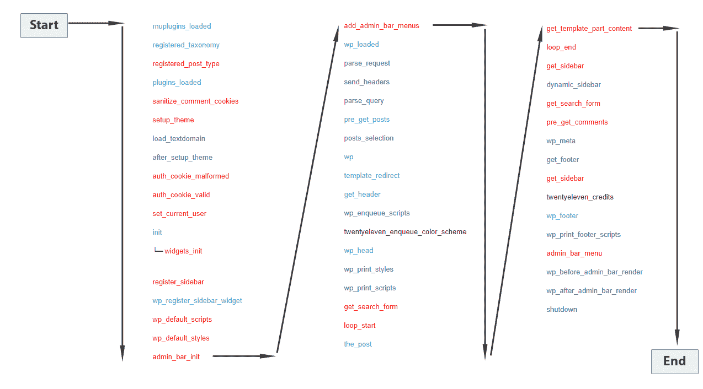
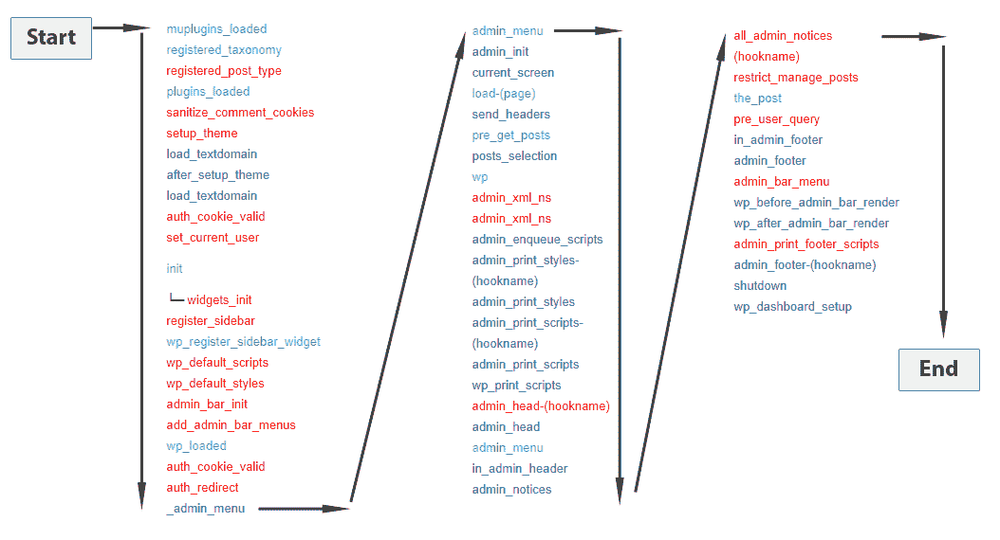
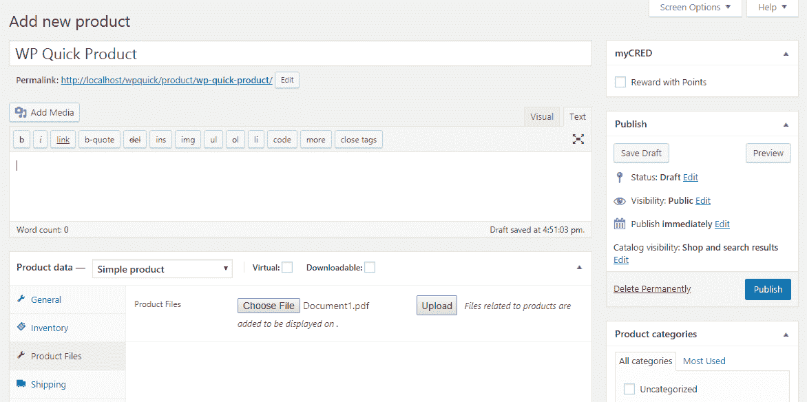
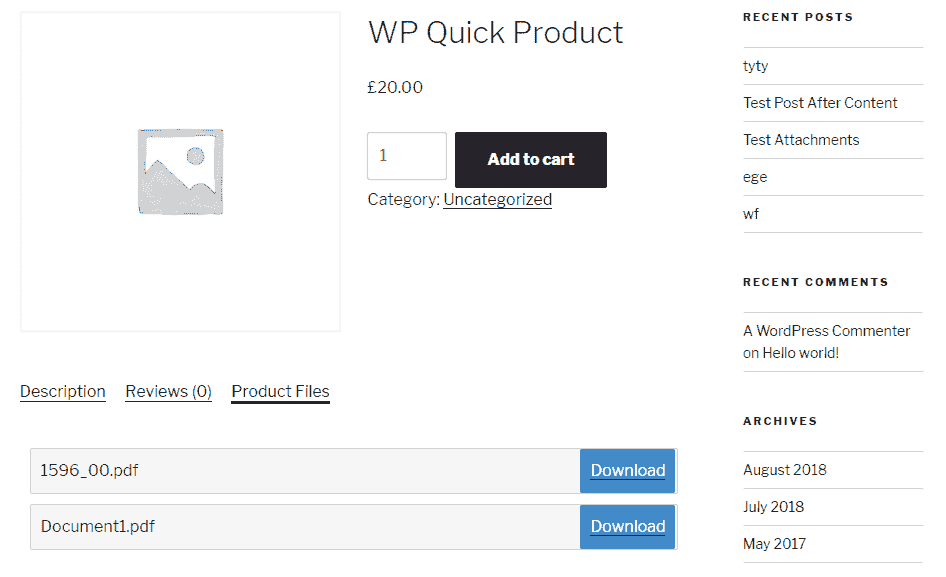
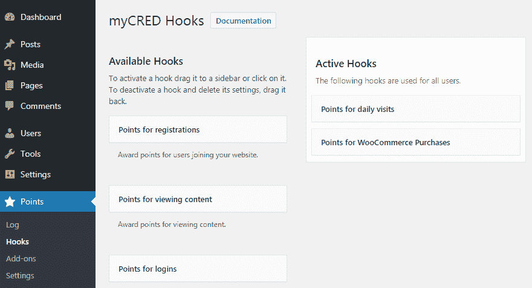

# 第五章：使用附加组件、过滤器以及动作扩展插件

使用 WordPress 构建网站涉及使用现有插件或创建自己的插件。你应该能够通过添加新功能来扩展现有插件，同时使你的插件可由其他开发者扩展。我们使用附加组件来扩展核心插件的功能。因此，保持你的插件可扩展非常重要，这样你就可以在以后使用附加组件来添加或删除功能。另一方面，使用和自定义现有插件与附加组件一起，可以让你提供低成本和高品质的解决方案。因此，你需要掌握构建附加组件以自定义插件功能和集成多个插件的技巧。

在本章中，我们解释了在遵循创建插件附加组件的逐步指南的同时，附加组件的重要性。WordPress 使用基于钩子的架构，因此内置钩子按照预定义的顺序执行。我们查看这些钩子的正确执行以防止不必要的冲突。然后，我们进入插件的自定义技术，同时学习脚本加载和内置 AJAX 功能的先进用法。我们将开发一个用于 WooCommerce 的产品文件附加组件，以便实际体验自定义过程。最后，我们将集成 WooCommerce、MyCred 和 BuddyPress 插件，以学习插件集成的最佳实践及其局限性。

在本章中，我们将涵盖以下主题：

+   附加组件开发简介

+   为帖子附件插件创建一个基本的附加组件

+   理解 WordPress 核心动作执行过程

+   自定义第三方插件

+   识别集成插件的技巧

+   集成多个插件以实现连续工作流程

到本章结束时，你将能够使用不同的技术自定义第三方插件，并集成多个插件以构建你网站的连续工作流程。

# 技术要求

遵循此程序需要安装 WordPress 4.9.8。即使你没有

如果你有一个较新版本的 WordPress，描述的示例应该没有重大问题可以运行。

本章的代码文件可以在 GitHub 上找到：

[`github.com/PacktPublishing/WordPress-Development-Quick-Start-Guide/tree/master/Chapter05`](https://github.com/PacktPublishing/WordPress-Development-Quick-Start-Guide/tree/master/Chapter05)

查看以下视频，以查看代码的实际运行情况：

[`bit.ly/2Q8LtBa`](http://bit.ly/2Q8LtBa)

# 附加组件简介

从一般意义上讲，附加组件是改变核心组件行为的组件。作为一名开发者，您可能熟悉使用浏览器扩展来支持开发任务。在这种情况下，网络浏览器充当核心组件，扩展充当安装在浏览器之上的附加组件。WordPress 中的附加组件遵循相同的概念。然而，WordPress 附加组件本身是改变主插件行为的插件。与浏览器扩展不同，WordPress 中的附加组件不会安装在插件之上。相反，它们作为独立的附加插件。

通常，附加组件用于向核心组件添加新功能。然而，WordPress 附加组件的开发是为了添加、更改或删除核心组件的功能。让我们看看一些具有大型附加组件库的流行插件：

+   **WooCommerce**：这是一个电子商务插件，允许您销售实体商品以及数字产品。此插件拥有超过 250 个各种类别的广泛附加组件库。支付网关是 WooCommerce 中最受欢迎的附加组件类型，拥有超过 75 个附加组件。您可以在[`woocommerce.com/product-category/woocommerce-extensions/`](https://woocommerce.com/product-category/woocommerce-extensions/)查看并了解更多关于附加组件的信息。

+   **Easy Digital Downloads**：这是一个电子商务解决方案，允许您销售数字产品。此插件还提供超过 100 个附加组件，其中许多属于营销类别。您可以在[`easydigitaldownloads.com/downloads/`](https://easydigitaldownloads.com/downloads/)了解更多关于附加组件的信息。

+   **WP Bakery Page Builder**：这是一个用于使用预构建组件构建页面的插件。WooCommerce 和 Easy Digital Downloads 都是 WordPress 插件目录中的免费插件。然而，这是一个仅限高级版的插件，拥有超过 250 个各种类别的附加组件。UI 元素是这个插件最受欢迎的附加组件类别。您可以在[`wpbakery.com/addons/`](https://wpbakery.com/addons/)查看并了解更多关于附加组件的信息。

这些是一些具有大型附加组件库的插件。附加组件的存在意味着插件是用必要的钩子编写的，以便未来扩展。您可以检查更多流行的免费和高级插件，以检查附加组件的可用性。此外，您应该检查每个附加组件的角色以及它如何与主插件交互。一旦您探索了不同类型的附加组件，您将了解开发中需要的钩子类型以及如何将它们添加到代码中，以保持代码可扩展。

# 为插件创建附加组件

创建插件的流程与我们用于插件的过程类似。然而，创建插件的可行性取决于核心插件的代码质量。核心插件应该提供构建插件的 API 或扩展所需的钩子。由于许多插件不包含单独的 API，大多数插件都是通过使用现有的钩子构建的。让我们看看我们如何为上一章创建的帖子附件插件创建一个插件。假设我们有以下要求作为插件开发：

+   根据默认的 WordPress 用户角色限制附件文件类型。让我们只为非订阅会员提供 PDF 文件访问权限，并为网站中的所有其他用户开放所有其他文件类型。

+   附件下载计数器。我们必须分别对访客用户和登录用户计算帖子的所有附件的下载次数。

为了在不修改核心插件文件的情况下实现这些要求，我们需要检查插件中是否有任何钩子。不幸的是，我们没有在插件中找到任何钩子，因为它没有为未来的扩展而设计。因此，我们必须通过添加必要的钩子使插件可扩展。

# 添加过滤器钩子以限制附件

实施附件限制需要我们根据用户权限进行条件检查并隐藏未授权用户的附件。因此，我们需要一个可以修改列表中附件输出的过滤器。让我们在`wpqpa_file_attachment_list`内部的文件列表代码中添加一个过滤器。我们需要替换以下代码：

```php
$display .= '
      <div class="wpqpa-file-item" id="PF'.$file_row->id.'"  data-file-id="'.$file_row->id.'" >
        <div class="wpqpa-file-item-row"    >
            <div class="wpqpa-file-item-name wpqpa-files-list-name" >'.$file_row->file_name.'</div>
            <div class="wpqpa-file-item-download" ><a href="'.$url.'" >'.__("Download","wpqpa").'</a></div>
            <div class="wpqpa-clear"></div>
        </div>
        <div class="wpqpa-clear"></div>
      </div>';
```

首先，你应该删除前面的代码，并将以下代码添加到相同的位置：

```php
$file_display = '
  <div class="wpqpa-file-item" id="PF'.$file_row->id.'" data-file-id="'.$file_row->id.'" >
    <div class="wpqpa-file-item-row" >
      <div class="wpqpa-file-item-name wpqpa-files-list-name" >'.$file_row->file_name.'</div>
      <div class="wpqpa-file-item-download" ><a href="'.$url.'" >'.__("Download","wpqpa").'</a>          </div>
      <div class="wpqpa-clear"></div>
    </div>
    <div class="wpqpa-clear"></div>
  </div>';

$file_display = apply_filters('wpqpa_post_attachment_list_item', $file_display, $file_row);
$display .= $file_display;
```

我们不是直接将每个文件的 HTML 代码添加到`$display`变量中，而是使用一个名为`wpqpa_post_attachment_list_item`的自定义过滤器，并将文件详细信息作为参数传递。这个过滤器允许我们在文件发送到浏览器之前修改每个文件的 HTML。

# 添加动作钩子以计数下载

在上一节中，我们探讨了使用过滤器钩子扩展插件的过程。我们也可以通过插件来使用动作钩子扩展插件。下载次数的计数过程应该在用户点击下载链接之后和浏览器显示文件下载弹出窗口之前初始化。因此，我们需要在这两个事件之间添加一个动作钩子。让我们修改`wpqpa_file_attachment_download`函数以包含一个新的动作，如下面的代码所示：

```php
$file_mime_type = mime_content_type( $file_dir );
if( $file_mime_type != '' ){ 
  do_action('wpqpa_before_download_post_attachment',$attachments[0]); 
  header( 'Cache-Control: public' );
  header( 'Content-Description: File Transfer' );
```

突出的行显示了添加到现有代码中的修改。这个动作允许我们在文件作为下载发送到浏览器之前实现额外的功能。现在，我们有创建插件和实现功能的必要钩子。

# 创建附件插件

如同往常，我们必须首先创建一个插件目录，并包含一个主插件文件，插入头部注释来定义它为一个插件。我们不会在这一节重复代码。你可以在源代码的`wpquick-attachments-addon`目录中找到一个附件插件目录和文件。我们将通过限制 PDF 文件只对具有订阅者角色的用户可见来开始开发。让我们实现上一节中添加的`wpqpa_post_attachment_list_item`过滤器：

```php
add_filter( 'wpqpa_post_attachment_list_item', 'wpqaa_post_attachment_list_item' , 10 ,2 );
function wpqaa_post_attachment_list_item( $display, $file_data ){
 $upload_dir = wp_upload_dir();
 $file_dir = $upload_dir['basedir'] . $file_data->file_path;
 $file_mime_type = mime_content_type( $file_dir );

 if($file_mime_type == 'application/pdf'){
   if( !is_user_logged_in() || ( is_user_logged_in() && current_user_can('subscriber') ) ){
     $display = '';
   }
 }
 return $display;
}
```

这段代码的作用如下：

1.  回调函数有两个参数，第一个是显示文件链接的 HTML，第二个是从数据库中关于文件的详细信息。

1.  首先，我们使用 WordPress 的`wp_upload_dir`函数和从我们的自定义表中捕获的文件路径来构造文件路径。

1.  然后，我们使用 PHP 的`mime_content_type`函数来获取附件的 MIME 类型。

1.  接下来，我们使用 PDF 的 MIME 类型来过滤文件。

1.  然后，我们使用条件来检查文件是否应该显示给用户。条件的第一部分检查我们是否登录到网站，因为文件需要限制对访客用户的访问。条件的第二部分检查用户是否以订阅者的身份登录。

1.  当满足这些条件之一时，我们通过清空内容来限制文件。

现在，我们已经使用过滤器钩子实现了一个插件功能。接下来，我们可以使用动作钩子来实现我们的第二个需求，即统计下载次数。让我们使用以下代码实现自定义的`wpqpa_before_download_post_attachment`动作：

```php
add_action( 'wpqpa_before_download_post_attachment', 'wpqaa_before_download_post_attachment' );
function wpqaa_before_download_post_attachment( $data ){
 $post_id = $data['post_id'];
 if( is_user_logged_in() ){
   $count = get_post_meta( $post_id, 'wpqaa_member_download_count',true );
   update_post_meta( $post_id, 'wpqaa_member_download_count', $count + 1);
 }else{
   $count = get_post_meta( $post_id, 'wpqaa_guest_download_count', true );
   update_post_meta( $post_id, 'wpqaa_guest_download_count', $count + 1 );
 }
}
```

首先，我们使用回调函数定义动作，`wpqaa_before_download_post_attachment`。从`wp_wpqpa_post_attachments`表中接收的附件数据以数组类型参数传递给此函数。我们使用条件检查来过滤已登录用户和访客用户。我们的需求是统计单个文件的附件的总下载次数。因此，我们可以使用`wp_postmeta`表来存储下载次数。

在实际实现中，我们可能需要统计单个附件的下载次数，而不是文章中所有附件的总下载次数。在这种情况下，我们不能使用`wp_postmeta`表，因为我们只能根据文章 ID 存储数据。因此，我们需要在`wp_wpqpa_post_attachments`表中添加一个额外的列来保存和显示每个附件的下载次数。

我们可以使用`get_post_meta`函数获取文章的现有下载次数。在这里，我们使用两个键`wpqaa_member_download_count`和`wpqaa_guest_download_count`来区分访客和成员的计数。稍后，我们可以使用这些键来显示计数和文件。

只需几行代码，我们就有了一个为核心插件添加功能并独立工作的插件。因此，为任何插件开发插件都很简单。然而，核心插件需要提供正确的动作和过滤器，以及开发者能够找到适当的钩子。

# WordPress 动作执行过程

到目前为止，我们使用了一些内置的动作和过滤器，同时解释了其实际用途。然而，你可能仍在尝试掌握这个概念，因为它不是纯 PHP 开发中常用的实践。当处理动作执行过程的知识缺乏时，这个过程变得更加困难。

**动作执行过程是什么？**

WordPress 有一组内置的动作，这些动作在每个请求的加载过程中执行。这些动作中的每一个在加载过程中都有特定的职责。用于加载过程的动作按照预定义的顺序执行。然而，WordPress Codex 特别指出，我们不应完全依赖加载过程，因为它可以基于网站的其他组件而变化。

此列表可能仅显示每个动作第一次被调用的情形，并且在许多情况下没有函数被连接到该动作。主题和插件可能导致动作被多次调用，并在请求的不同时间点调用。此列表应被视为 WordPress 动作执行顺序的指南或近似，而不是具体规范。

如果不考虑执行顺序，使用这些动作实现功能往往会引起冲突。在 WordPress 中，这些动作在管理页面请求中的执行与典型页面请求不同。因此，我们必须了解前端动作执行过程以及后端动作执行过程。

# 前端动作执行过程

前端动作执行过程从`muplugins_loaded`动作开始，该动作在必须使用和已激活网络插件完成加载后触发。过程通过执行`shutdown`动作来完成。在典型请求中，会调用 40 多个动作，其中一些在开发任务中具有更高的重要性。然而，一些动作会根据请求而变化，因此我们只能将其作为指导。让我们看一下以下插图，以了解一般动作和执行顺序：



让我们了解加载过程的示意图。该过程从`muplugins_loaded`动作开始，向下移动直到达到`admin_bar_init`动作。然后，它从第二列的`add_admin_bar_menus`动作开始，向下移动，依此类推。我们突出了一些在开发中常用的一些动作。您可以在[`codex.wordpress.org/Plugin_API/Action_Reference`](https://codex.wordpress.org/Plugin_API/Action_Reference)了解更多关于动作执行过程的信息。这些动作的执行顺序在自定义开发中非常重要，尤其是在我们使用 WordPress 的内置全局对象时。

首先，我们将创建一个名为**WPQAL Action Loading**的新插件，用于测试加载特定动作时的功能。创建该插件的过程与之前的情况相同。因此，您可以查看本章的源代码目录，以找到 WPQAL Action Loading 插件的实现。让我们通过前面的插图和一些实际使用场景来了解正确使用动作的重要性。

# 场景 1 – 使用父插件功能

这在插件开发中常用，因为我们依赖于主插件的功能。在插件开发中，我们必须使用主插件中的常量、函数、类和全局对象。除非我们使用正确的 WordPress 动作，否则这些功能可能无法在插件中访问。假设我们有一个在父插件之前加载的插件插件。我们可以将**WPQPA Post Attachments**插件视为主插件，将 WPQAL Action Loading 视为插件插件来检查此场景。WPQPA Post Attachments 插件在 WPQAL Action Loading 插件之后加载。因此，我们可以在 WPQAL Action Loading 插件的主文件中添加以下代码行，并通过刷新浏览器来检查输出：

```php
echo WPQPA_PLUGIN_URL;exit;
```

这是用于定义**WPQPA Post Attachments**插件插件路径的常量，因此它应该打印出实际的路径到浏览器。相反，输出将是`WPQPA_PLUGIN_URL`字符串。问题是我们试图访问一个在我们试图访问时未定义的常量。因此，我们需要在所有插件完成加载过程时访问这样的常量、函数和变量。我们可以参考图像并找到一个名为`plugins_loaded`的动作。这个动作在 WordPress 完成加载所有活动插件后执行。因此，让我们看看前面代码的正确实现来打印插件路径：

```php
add_action( 'plugins_loaded', 'wpqal_plugins_loaded_action' );
function wpqal_plugins_loaded_action() {
  echo WPQPA_PLUGIN_URL;
}
```

现在，您应该能在浏览器中看到正确的插件路径。您可以在 WPQAL Action Loading 插件中取消注释*场景 1*的代码来测试该场景。要访问其他插件的功能，我们必须使用`plugins_loaded`或更晚的动作。

# 场景 2 – 访问 WordPress 帖子对象

通常，我们可以在帖子详情页中使用 WordPress 全局`$post`对象来获取有关帖子的必要信息。假设我们想在插件函数中获取加载帖子的 ID 以执行某些任务。让我们使用`init`操作在访问单个帖子时将帖子 ID 打印到浏览器：

```php
add_action( 'init', 'wpqal_init_action' );
function wpqal_init_action() {
  global $post;
  print_r($post->ID);exit;
}
```

我们期望在浏览器上打印出帖子 ID。然而，由于在此阶段`$post`对象尚未加载，我们将得到一个空输出。因此，我们必须使用加载过程中稍后执行的操作。全局`$post`对象仅在`wp`操作及其后续操作中可访问。使用以下代码来测试此过程：

```php
add_action( 'wp', 'wpqal_wp_action' );
function wpqal_wp_action() {
  global $post;
  print_r($post->ID);exit;
}
```

现在，你可以看到打印到浏览器中的 ID。你还可以通过在加载过程中的`init`和`wp`之间使用操作来测试此过程。

# 场景 3 – 访问 WordPress 查询对象

WordPress 在加载特定帖子、页面或屏幕的过程中执行许多数据库查询。在开发过程中，我们可能需要访问查询的详细信息，如查询变量、条件，甚至由 WordPress 函数生成的完整`sql`查询。因此，我们使用全局`$wp_query`变量来访问查询详细信息以及执行必要的修改。

让我们尝试使用在查询变量对象创建后执行的`pre_get_posts`操作来访问`$wp_query`变量：

```php
add_action( 'pre_get_posts', 'wpqal_pre_get_posts_action' );
function wpqal_pre_get_posts_action( $query ) {
  global $wp_query;
  print_r($wp_query); 
}
```

一旦帖子刷新，你将看到包含一些参数的`$wp_query`变量的详细信息。但是，在此阶段，大多数查询条件和查询尚未设置。尽管查询变量对象已创建，但实际的查询在此阶段并未执行。此操作允许我们使用传递给函数的`$query`变量对查询进行修改。让我们使用在处理过程中稍后执行的操作来使用以下代码检查`$wp_query`的详细信息：

```php
add_action( 'wp', 'wpqal_wp_action' );
function wpqal_wp_action() {
  global $wp_query;
  print_r($wp_query); 
}
```

现在，你将看到包含所有查询参数、条件和实际 SQL 查询的完整`$wp_query`变量。

如我们在这些三个场景中体验到的，动作加载过程在开发中起着重要作用。我们需要使用适当的行为钩子来访问内置 WordPress 变量以及执行某些核心 WordPress 函数。确定用于特定功能的钩子方法可能并不直接。你可以定义必要的操作并将详细信息打印到浏览器，而无需使用`exit`语句。然后你将看到动作执行过程以及哪个动作负责处理每个 WordPress 内置变量和方法。

# 后端操作执行过程

后端操作执行过程从`muplugins_loaded`操作开始，该操作在必须使用和已激活网络插件完成加载后触发。通过执行`wp_dashboard_setup`操作而不是`shutdown`操作来完成此过程。

与前端过程相比，后端执行过程中有六个更多动作。让我们看一下下面的图片，以了解这些动作和执行顺序：



如您所见，加载过程的初始部分与前端过程相似。然后，我们看到一些与菜单、样式和页眉部分相关的管理相关动作被执行。因此，您可以使用我们之前使用的相同技术来了解每个动作的执行、其责任以及何时应该使用它们。

# 如何使用动作和过滤器的优先级

我们学习了动作加载过程以及如何使用它来获取适当的数据并执行核心功能。然而，即使知道了加载过程，开发者仍然可能会遇到麻烦。这是由于执行动作的优先级。正如我们讨论的，WordPress 核心、主题以及其他插件可以在请求内多次执行这些动作。因此，相同的动作钩子将以不同的优先级实现。考虑以下代码来使用`pre_get_posts`动作：

```php
function wpqal_pre_get_posts_action1( $query ) {
  if ( !is_admin() && $query->is_main_query() ) {
    if ($query->is_search) {
      $query->set('post_type', 'post');
    }
  }
}
add_action( 'pre_get_posts', 'wpqal_pre_get_posts_action1' );

function wpqal_pre_get_posts_action2( $query ) {
  if ( !is_admin() && $query->is_main_query() ) {
    if ($query->is_search) {
      $query->set('post_type', array( 'post', 'product' ) );
    }
  }
}
add_action( 'pre_get_posts', 'wpqal_pre_get_posts_action2', 20 );
```

在第一部分，我们使用`pre_get_posts`动作来调用`wpqal_pre_get_posts_action1`函数，并将站点搜索限制为仅帖子。然而，另一个插件以 20 的更高优先级执行了相同的动作，并将可搜索的帖子类型更改为帖子和产品。因此，我们的实现并没有按预期工作。所以，在处理拥有许多插件的站点时，考虑动作加载过程以及优先级是很重要的。在实现关键钩子之前，你应该检查站点其他插件中相同钩子的使用情况，并确保使用正确的优先级以避免冲突。

# 识别第三方插件的可扩展功能

正如我们在*为插件创建插件*部分中已经发现的，并非所有插件都是可扩展的。即使在可扩展的插件中，我们也有从低到高的可扩展性特征。因此，识别可扩展功能不是一项容易的任务，尤其是在与 WooCommerce、BuddyPress 和 bbPress 等高级插件一起工作时。

在第三章《使用主题开发设计灵活的前端》中，我们通过搜索内置动作和过滤器来识别主题的可扩展功能。我们可以使用相同的过程来处理插件，除非插件中的每个钩子都在插件网站上进行了文档说明。让我们快速看一下流行的 WooCommerce 插件的可扩展功能。使用代码编辑器在 WooCommerce 目录中搜索动作和过滤器。

我们正在使用 WooCommerce 3.4.4 版本，我们获得了 849 次动作执行和 1,553 次过滤器执行。这意味着我们可以在超过 2,000 个位置自定义 WooCommerce 插件。在自定义过程中，我们必须在文档的支持下找到必要的钩子，检查代码文件以及开发社区如 StackOverflow 中其他开发者分享的经验。

钩子的可用性因插件而异。有时，我们会发现钩子数量有限的插件和拥有数千个钩子的流行插件。因此，你必须掌握识别钩子及其对插件影响的过程，才能在自定义任何插件时取得成功。

# 自定义第三方插件

作为开发者，我们更喜欢构建自己的解决方案，而不是使用第三方解决方案。构建自己解决方案的主要原因是为了获得更多对功能和未来增强的控制。然而，使用 WordPress 的主要目的是利用现有功能开发快速、低成本的解决方案。很明显，在您的开发生涯中，您必须在某些时候处理自定义第三方插件。这些第三方插件是为了提供标准解决方案来解决常见问题而开发的。因此，这些插件不会完全符合大多数网站的需求。通常，我们必须通过添加、更改或删除功能来适应这些插件。在本节中，我们将通过示例场景来探讨插件自定义的技术和实现。

# 自定义第三方插件的技术

就像主题一样，插件由各种类型的常见自定义组成。大多数网站所有者和开发者误解了插件自定义的含义。他们经常认为这是一个完全改变插件以适应网站需求的过程。然而，我们可能只需要进行一些样式更改作为自定义。有时，与使用高级过程相比，我们有更快、更简单的方式来自定义插件。因此，了解不同类型的自定义及其实现技术非常重要。让我们来看看一些常见的自定义类型。

# 使用样式自定义外观和感觉

这是一种常用的自定义，需要所有插件与主题的样式相匹配。我们有三种方法来为插件应用样式自定义：

+   **使用主题样式文件**：我们可以将样式添加到主题的 `style.cs` 文件中，并覆盖插件样式。这种方法应仅用于子主题，当对插件进行少量样式更改时。

+   **使用自定义 CSS 插件**：有许多现有的 CSS 插件允许我们在不需要创建 CSS 文件的情况下，向网站的各个部分添加动态自定义样式。这些插件提供了一个设置部分，我们可以在此处添加要存储在数据库中并加载到网站上的动态 CSS。这种技术可用于许多插件的细微样式自定义。

+   **使用插件插件**：这是将样式更改与其他插件独立保持的推荐方法。在此方法中，我们必须创建一个简单的插件插件并包含一个新的 CSS 文件。然后，我们可以通过为新 CSS 类使用新样式来覆盖插件样式。我们必须使用`wp_register_style`函数的依赖参数将插件 CSS 文件作为依赖项包含，并在加载插件 CSS 文件之后加载我们的 CSS 文件。

这些是更改插件外观和感觉的常见方法。然而，某些插件可能提供设置以添加动态插件特定 CSS 或通过修改值调整不同部分的样式。

# 使用钩子自定义功能

在本章的开头，我们看到了钩子的执行并不总是简单的。WordPress 到处都在使用钩子，这有时会使事情变得复杂。然而，在插件自定义中，这种解决方案非常有帮助，我们将看到使用这种解决方案的好处。

我们可能每天都要使用不同的插件。因此，学习我们在不同项目中使用的每个插件的每个功能是不可能的。相反，我们可以寻找实现自定义功能的文件或类。然后，我们可以搜索支持我们自定义的可能钩子。一旦找到必要的钩子，我们就可以根据指南实现它们。实现钩子确保了功能完整过程的执行。如果没有钩子，我们必须遍历整个插件文件和类来识别自定义的位置。此外，我们还需要遍历后续代码以检查它是否会影响我们的自定义或可能的未来修改。

让我们考虑一个来自流行 WooCommerce 插件的例子。假设我们想在用户完成产品支付后执行某些代码。因此，我们只需搜索支付成功钩子和其实施。WooCommerce 在支付后执行`woocommerce_payment_complete`动作。因此，我们可以使用以下代码在支付完成后执行任何类型的自定义代码：

```php
add_action( 'woocommerce_payment_complete', 'wpaql_payment_complete' );
function wpaql_payment_complete( $order_id ){
  // Custom code
}
```

如您所见，在短短几行代码内，我们就已经定制了 WooCommerce，而没有花费太多时间或深入理解 WooCommerce。假设 WooCommerce 中没有这样的钩子。在这种情况下，我们首先必须找到用于处理支付过程的 `WC_Order` 类和 `payment_complete` 函数。然后，我们必须逐行检查 `payment_complete` 函数中的代码，以了解支付完成的定位。您已经可以看到，与使用钩子的方法相比，第二个过程存在难度。因此，我们应该始终寻找可能的钩子来定制插件。在插件开发中，有两种类型的特性定制：

+   **定制现有功能**：有时，我们想要更改或删除插件中的现有功能。在这种情况下，我们可以实现现有的钩子，并使用传递给函数的参数更改现有数据或设置。有时，我们可能想要更进一步，通过我们自己的实现完全更改一个功能。在这种情况下，我们可以使用内置的 `remove_action` 或 `remove_filter` 函数删除现有的钩子。然后，我们添加具有我们自己的实现的相同钩子。

+   **添加新功能**：在定制中，与修改现有功能相比，涉及添加新功能的任务占很大比例。在此方法中，我们实现现有的钩子类似于上一节，但我们使用自己的代码，在现有功能之上添加新功能，而不是修改现有功能。

我们讨论了插件中不同类型的定制。在下一节中，我们将通过实现一个现实世界的需求来定制一个插件。

# 构建 WooCommerce 产品文件管理器

使用钩子更改或添加新功能的过程是第三方插件中最常见的定制类型。这些钩子允许我们在不花费太多时间的情况下构建高级功能。在本节中，我们将实现一个现实世界的用例，以详细了解基于钩子的定制过程。因此，我们选择了定制 WooCommerce。

假设我们想要提供与每个 WooCommerce 产品相关的文件。这些文件可能包含产品规格、用户指南或与产品相关的任何信息。因此，我们需要一种方法在创建或编辑产品时上传这些文件。然后，我们必须在前端产品页面上将它们列出来作为一个单独的标签页。这可能对不熟悉 WooCommerce 的开发者来说是一项艰巨的任务。然而，一旦我们找到了必要的 WooCommerce 钩子，实现起来就相当简单了。此外，这种实现的另一个目的是重用来自帖子附件插件的代码，并学习 AJAX 的使用，而不是正常的表单提交。

让我们从创建一个名为 **WQWPF 产品文件** 的新插件开始实施，这个过程与之前相同。你可以在这个章节的源代码目录中找到这个插件的文件。考虑插件的初始代码：

```php
register_activation_hook( __FILE__, 'wqwpf_activate' );
function wqwpf_activate(){
  global $wpdb,$wp_roles;
  $table_product_files = $wpdb->prefix . 'wqwpf_product_files';
$sql_product_files = "CREATE TABLE IF NOT EXISTS $table_product_files (
      id int(11) NOT NULL AUTO_INCREMENT,
      user_id int(11) NOT NULL,
      post_id int(11) NOT NULL,
      file_path longtext NOT NULL,
      updated_at datetime NOT NULL,
      uploaded_file_name varchar(255) NOT NULL,
      PRIMARY KEY (id)
    );";
  require_once( ABSPATH . 'wp-admin/includes/upgrade.php' );
  dbDelta( $sql_product_files );
}

if ( ! defined( 'WQWPF_PLUGIN_DIR' ) ) {
  define( 'WQWPF_PLUGIN_DIR', plugin_dir_path( __FILE__ ) );
}
if ( ! defined( 'WQWPF_PLUGIN_URL' ) ) {
  define( 'WQWPF_PLUGIN_URL', plugin_dir_url( __FILE__ ) );
}

add_action( 'plugins_loaded', 'wqwpf_plugins_loaded_action' );
function wqwpf_plugins_loaded_action() {
  if( class_exists('WooCommerce')){
    // All actions and filters need to be added here
  }
}
```

代码的初始部分与我们在 WPQPA Post Attachments 插件中使用的代码类似，只是从产品文件的定制表中移除了 `file_name` 列。这将是一个 WooCommerce 的附加组件，因此我们需要在执行任何附加功能之前检查 WooCommerce 是否已激活。因此，我们使用 `plugins_loaded` 动作来检查 `WooCommerce` 类的可用性。我们可以使用常量、类或函数来检查核心插件的可用性。当 `WooCommerce` 类可用时，我们添加所有与附加组件相关的动作和过滤器，以确保它们仅在 `WooCommerce` 可用的情况下执行。现在，我们可以开始构建所需的定制功能。

# 将文件上传字段添加到 WooCommerce 产品中

开发过程中的第一步是为管理员提供一个接口，让他们能够将文件上传到产品中。我们可以通过使用我们在构建帖子附件插件时使用的元框技术来实现这一点。然而，我们正在尝试理解插件定制，因此我们将把这个功能集成到 WooCommerce 中。在 WooCommerce 产品创建屏幕中，我们可以找到一个名为“产品数据”的元框，其中包含各种标签页，如常规、库存、运输等。我们打算在元框中添加一个新的标签页，称为“产品文件”。首先，我们必须寻找允许我们修改“产品数据”标签页的动作或过滤器。你可以找到一个名为 `woocommerce_product_data_tabs` 的过滤器来定制标签页。让我们使用以下代码通过这个过滤器添加一个新的标签页：

```php
add_filter( 'woocommerce_product_data_tabs', 'wqwpf_custom_product_tabs' );
function wqwpf_custom_product_tabs( $tabs ) {
  $tabs['wqwpf_files'] = array(
        'label'     => __( 'Product Files', 'wqwpf' ),
        'target'    => 'wqwpf_file_options',
        'class'     => array( 'show_if_simple' ),
    );
  return $tabs;
}
```

这个过滤器依赖于 WooCommerce，因此 `add_filter` 行应该放在 `wqwpf_plugins_loaded_action` 函数内部。现有的标签页作为参数传递给这个过滤器的回调函数。我们添加一个带有唯一键的新标签页，并分配必要的选项。`target` 设置包含用于显示此标签页内容的 HTML 元素的 ID。标签页内容将在下一阶段添加。`class` 设置定义了一个分配给此标签页的类数组。在这里，我们使用了 `show_if_simple` 作为类。因此，我们的标签页将仅对简单 WooCommerce 产品可见。如果我们想使标签页对其他产品类型可用，我们需要添加更多的类。

在这种情况下，我们添加了一个新的标签页。我们也可以使用这个过滤器通过在 `$tab` 数组元素上使用 `unset` 函数来删除现有的标签页，或者通过使用适当的数组键来更改现有标签页的设置。

下一步是在标签页中添加一个文件字段以上传文件。我们可以找到一个名为 `woocommerce_product_data_panels` 的另一个动作钩子来添加标签页内容。让我们使用它来添加文件字段，如下面的代码所示：

```php
function wqwpf_product_files_panel_content() {
  global $post;    ?>

  <div id='wqwpf_file_options' class='panel woocommerce_options_panel'>
    <div class='options_group'>
      <div id="wqwpf-product-files-msg"></div>
      <p class="form-field _wqwpf_product_files_field show_if_simple" style="display: block;">
       <label for="_wqwpf_product_files"><?php _e('Product Files','wqwpf'); ?></label>
       <input type="file" name="wqwpf_product_files" id="wqwpf_product_files" />
       <input type="hidden" id="wqwpf_product_file_nonce" name="wqwpf_product_file_nonce" />
       <input type="button" name="wqwpf_product_file_upload" id="wqwpf_product_file_upload"  value="<?php echo __('Upload','wqwpf'); ?>" />
     </p>
   </div>
  </div>
    <?php
}
```

在此代码中，我们添加了一个文件字段用于上传文件，一个按钮用于初始化上传过程，以及一个隐藏字段以保持 nonce 值。HTML 结构是从其他可用的标签中复制的。最重要的部分是理解这个标签内容是如何与之前创建的标签连接的。我们使用了 `wqwpf_file_options` 作为标签主要容器的 ID。我们使用了与我们的新标签的 `target` 设置相同的 ID。因此，一旦点击标签，WooCommerce 将使用目标设置来查找容器并向用户显示。以下屏幕截图显示了使用自定义代码后的新标签：



产品文件的新标签页添加在库存和运输标签之间。现在，我们准备好开始上传文件。

# 添加上传文件的脚本

在第四章，“使用插件开发构建自定义模块”，我们创建了一个插件来上传帖子附件。然而，在更新每个文件时，我们必须选择文件并逐个上传文件。在需要上传许多文件的情况下，这并不理想。相反，我们必须使用 AJAX 并允许用户在不刷新浏览器的情况下上传多个文件。在进入上传文件的过程之前，我们需要将必要的脚本添加到插件中。首先，你必须在 `wpquick-woo-product-files` 内部创建一个名为 `js` 的新目录，并创建一个名为 `wqwpf-admin.js` 的新文件。接下来，我们可以将脚本添加到插件中，如下面的代码所示：

```php
add_action( 'admin_enqueue_scripts', 'wqwpf_admin_load_scripts',9 );
function wqwpf_admin_load_scripts(){   
  wp_register_script( 'wqwpf_admin_js', WQWPF_PLUGIN_URL . 'js/wqwpf-admin.js', array('jquery') );
  wp_enqueue_script( 'wqwpf_admin_js' );
  $custom_js_strings = array(       
        'AdminAjax' => admin_url('admin-ajax.php'),
        'Messages' => array('fileRequired' => __('File is required.','wqwpf') ),
        'nonce' => wp_create_nonce('wqwpf-private-admin'),
    );
  wp_localize_script( 'wqwpf_admin_js', 'WQWPFAdmin', $custom_js_strings );
}
```

我们可以使用前面的代码来学习脚本加载的一些重要技术。让我们列出脚本加载的重要部分：

+   **注册和队列脚本**：直到这一点，我们只学习了如何包含 CSS 文件。因此，我们现在可以使用 `wp_register_script` 函数来加载脚本。在这里，我们正在包含管理端的脚本，因此我们必须使用 `admin_enqueue_scripts` 动作来使用回调函数包含脚本。前面代码的第一行应放置在 `wqwpf_plugins_loaded_action` 函数内部，因为它依赖于 WooCommerce 的存在。在回调函数内部，我们可以使用 `wp_register_script` 函数为 WordPress 注册一个自定义脚本。此函数的参数包括脚本的唯一键、脚本的路径和依赖脚本文件。脚本仅在此时注册，而不包含在浏览器中。然后，我们使用 `wp_enqueue_script` 在任何我们想要将脚本包含到浏览器中的地方使用脚本注册时使用的键。

+   **定义脚本依赖**：我们可以使用`wp_register_script`函数的第三个参数来定义依赖脚本。在这种情况下，我们的脚本是用**jQuery**编写的，因此它是一个依赖项。所以，我们将 jQuery 作为依赖数组的键添加。WordPress 有一组内置脚本，具有特定的键。我们需要使用这些键，而无需从我们自己的插件或外部来源加载这些库。可用的脚本库列表可以在[`developer.wordpress.org/reference/functions/wp_register_script#core-registered-scripts`](https://developer.wordpress.org/reference/functions/wp_register_script#core-registered-scripts)找到。您可以使用“处理”列中的键来加载这些依赖项。一旦我们将`script 2`定义为`script 1`的依赖项，第二个脚本将在第一个脚本之前加载。除了使用核心脚本文件外，我们还可以使用自定义脚本文件作为依赖项。考虑以下代码行：在这个代码中，我们正在注册另一个插件的脚本，该脚本使用**jQuery**和`wpwpf_admin_js`脚本。因此，这两个文件将在加载具有`upme_admin_js`作为处理的脚本之前加载。

```php
      wp_register_script( 'upme_admin_js', WQWPF_PLUGIN_URL . 'js/
      wqwpf-admin.js',   
      array('jquery','wqwpf_admin_js') );   
```

+   **本地化脚本**：有时，我们需要向特定脚本添加必要的设置和动态数据。WordPress 允许我们通过使用`wp_localize_script`函数来添加此类数据。此函数使用三个参数，从脚本处理程序开始，变量名称和数据。一旦使用，这些数据将被添加到浏览器中，在加载脚本文件之前。因此，这些数据将在指定的脚本以及之后加载的脚本中可用。

在这个实现中，我们将使用 AJAX，因此我们通过使用`admin_url('admin-ajax.php')`函数将 AJAX URL 添加到脚本中。关于 AJAX 的更多内容将在本节的后面讨论。接下来，我们使用首选数组键添加必要的数据。在这里，我们只添加消息作为数组。我们还向脚本添加了一个 nonce 值，以从服务器端验证 AJAX 请求。一旦页面加载，您可以使用“查看源代码”选项来检查在`wqwpf_admin_js`脚本之前加载的这些数据。现在，我们已经完成了脚本加载过程，因此我们可以进入上传产品文件。

# 将文件上传到产品

在本节中，我们将使用 AJAX 请求上传产品文件。在深入研究 AJAX 之前，我们需要完成初始脚本，包括必要的数据检索和验证。将以下代码添加到我们插件的`wqwpf-admin.js`文件中：

```php
jQuery(document).ready( function( $ ) {
  $('#wqwpf_product_file_upload').click(function(e){
      e.preventDefault();
      var file_form = $('#post');
      var file = file_form.find('#wqwpf_product_files').val();
      var post_id = $('#post_ID').val();
      var msg_container = file_form.find('#wqwpf-product-files-msg");
      msg_container.removeClass('wqwpf-message-info-error').removeClass('wqwpf-message-info-success');

      var err = 0;
      var err_msg = '';
      if(file == '' ){
        err_msg += '' + WQWPFAdmin.Messages.fileRequired + '<br/>';
        err++;
      }
      if(err != 0){
        msg_container.html(err_msg).addClass('wqwpf-message-info-error').show();
      }else{
          // AJAX request for uploading files 
      }
    });
});
```

这段代码的作用如下：

1.  首先，我们在 jQuery 的`ready`函数中为上传按钮的`click`事件定义一个回调函数。

1.  在`click`事件内部，我们需要捕获文件和帖子 ID。我们不能添加自己的表单，因为元框位于 WordPress 创建帖子的表单内。因此，我们使用具有 ID**post**的表单来捕获表单字段的值。

1.  接下来，我们检索用于显示消息的容器元素并重置 CSS 类。

1.  然后，我们开始对字段进行验证过程。在这里，我们只有字段字段，因此检查空值是唯一需要的验证。

1.  最后，我们检查是否有任何错误，并通过添加必要的 CSS 类和启用消息容器来显示错误消息。

在上一节中，我们使用了 `wp_localize_script` 函数将数据添加到脚本中。在本节中，我们使用以下行来添加错误消息：

```php
WQWPFAdmin.Messages.fileRequired
```

在这一行，`WQWPFAdmin` 是我们之前使用的变量名，而 `Messages` 是主数组的子键。`Messages` 数组中的 `fileRequired` 选项将包含实际的消息。同样，我们可以使用相应的键来访问其他数据。现在，我们需要在验证无错误完成时实现 AJAX 请求。在此之前，我们将简要介绍 AJAX。

# WordPress 中 AJAX 的介绍

AJAX 是异步 JavaScript 和 XML 的缩写。这项技术允许我们在不刷新浏览器的情况下发送和检索数据。因此，使用 AJAX 可以简化重复任务，如多次文件上传。通常，我们使用直接 URL 来执行 AJAX 请求。然而，WordPress 提供了一个内置接口来执行 AJAX 请求，建议使用这种技术而不使用我们自己的 AJAX 处理器。

WordPress 使用一个名为 `admin-ajax.php` 的文件来处理请求，该文件位于 `wp-admin` 目录中。此文件包含内置核心 AJAX 请求的必要代码，以及通过 *actions* 支持自定义请求的代码。动作负责处理 AJAX 请求并提供输出。让我们考虑以下代码：

```php
add_action( 'wp_ajax_sample_action', 'wqwpf_sample_action' );
add_action( 'wp_ajax_nopriv_sample_action', ' wqwpf_sample_action ' );
function wqwpf_sample_action(){
  // Get data from client side request, process and return the output
}
```

上述代码定义了我们在 WordPress 中如何使用 AJAX。每个不同的 AJAX 请求都有一个动作名称。我们必须使用 `wp_ajax_{action name}` 或 `wp_ajax_nopriv_{action name}` 动作来定义每个请求的处理函数。带有 `wp_ajax` 前缀的动作用于用户已经登录到网站时的请求。带有 `wp_ajax_nopriv` 前缀的动作用于网站的访客用户。因此，你必须根据谁被允许执行请求来定义一个或两个这些动作。

现在，我们已经了解了 WordPress 中 AJAX 的基本知识以及从服务器端处理请求的方法。因此，我们可以通过实现上传文件的 AJAX 调用来回到文件上传过程。以下代码应添加到 `wqwpf-admin.js` 文件中 `click` 事件的 `else` 语句：

```php
msg_container.html('').hide();
var formObj = file_form;
var formURL = WQWPFAdmin.AdminAjax+'?action=wqwpf_save_product_files';
var formData = new FormData();
var file_data = $('#wqwpf_product_files').prop('files')[0];  

formData.append('post_id', post_id);      
formData.append('file_nonce', WQWPFAdmin.nonce);
formData.append('file_data', file_data);
jQuery.ajax({
  url: formURL,
  type: 'POST',
  data:  formData,
  mimeType:'multipart/form-data',
  contentType: false,
  cache: false,
  dataType : 'json',
  processData:false,
  success: function(data, textStatus, jqXHR){

    if(data.status == 'success'){
      msg_container.html(data.msg).removeClass('wqwpf-message-info-error').addClass('wqwpf-message-info-success').show();
      $('#wqwpf-files-container').html(data.files);                                         file_form.find('#wqwpf_product_files').val('');
    }else if(data.status == 'error'){
      msg_container.html(data.msg).removeClass('wqwpf-message-info-success').addClass('wqwpf-message-info-error').show();
    }
  }
});
```

这里是这段代码的功能：

1.  前两行重置消息容器并将表单对象分配给一个变量。

1.  然后，我们使用`WQWPFAdmin`变量检索 WordPress AJAX URL 并分配一个名为 action 的自定义参数，该参数将用于与`wp_ajax`和`wp_ajax_nopriv`操作连接客户端请求与服务器端。

1.  接下来，我们创建一个新的`FormData`对象以将数据发送到服务器。我们可以通过使用带有键值对的`append`函数将必要的数据分配给`FormData`对象。在这里，我们添加了一个文件、nonce 值和帖子 ID 作为表单数据。

1.  下一步是使用 jQuery `ajax`函数配置 AJAX 请求。您应该熟悉 AJAX 函数的设置。现在，当用户点击上传按钮时，请求从客户端执行。

1.  最后，我们使用`ajax`函数的成功事件来显示结果消息、重置字段并显示上传到产品的文件列表。

现在，我们可以通过处理上传的服务器端函数来完成此过程。让我们考虑以下使用 WordPress AJAX 操作的实现：

```php
add_action( 'wp_ajax_wqwpf_save_product_files','wqwpf_save_product_files');
function wqwpf_save_product_files(){
  global $wpdb;
  $file_nonce   = isset( $_POST['file_nonce'] ) ? ( $_POST['file_nonce'] ) : '';           
  $post_id = isset( $_POST['post_id'] ) ? (int) ( $_POST['post_id'] ) : 0;   
  $user_id    = get_current_user_id();  

  if(check_ajax_referer( 'wqwpf-private-admin', 'file_nonce',false )){               $result_upload = wqwpf_process_file_upload();
    if( isset( $result_upload['status'] ) && $result_upload['status'] == 'success' ){
      $file_date = date("Y-m-d H:i:s");   
      $uploaded_file_name = $result_upload['base_name']; 
      $wqwpf_product_files_table = "{$wpdb->prefix}wqwpf_product_files";
      $wpdb->insert(
              $wqwpf_product_files_table,
              array(
                  'user_id'           => $user_id,
                  'post_id'           => $post_id,
                  'file_path'         => $result_upload['relative_file_path'],
                  'updated_at'        => $file_date, 
'uploaded_file_name' => $uploaded_file_name,
              ),
              array( '%d','%d','%s', '%s','%s' ) );
        $files_list = wqwpf_product_file_list( $post_id ); 
        $result = array( 'status' => 'success', 'msg' => $result_upload['msg'] , 'files' => $files_list );
    }else{
      $result = array( 'status' => 'error', 'msg' => $result_upload['msg'] );
    }
  }else{
    $result = array( 'status' => 'error', 'msg' => __('Invalid file upload request.','wqwpf') );
  }
  echo json_encode($result);exit;
}
```

只有管理员可以上传文件到产品，因此我们只为登录用户使用带有`wp_ajax`前缀的操作。以下是此代码的功能：

1.  首先，我们必须捕获帖子 ID 和 nonce 的`POST`请求数据。

1.  然后，我们使用`check_ajax_referer`函数检查 nonce 值。此函数的第一个参数使用我们通过调用`wp_create_nonce`函数在`wqwpf_admin_load_scripts`函数内部定义的操作。第二个和第三个参数分别用于 POST 请求中的 nonce 值键以及如果 nonce 无效是否`die`。我们将第三个参数设置为`false`，因为我们想显示自定义错误。

一旦验证 nonce，我们就使用`wqwpf_process_file_upload`函数上传文件并获取结果。`wqwpf_process_file_upload`函数与我们用于帖子附件插件中的函数类似，因此您可以检查本章的源代码以了解实现。

1.  然后，我们将文件详细信息保存到自定义表中，类似于帖子附件插件。然后，我们使用`wqwpf_product_file_list`函数检索包含上传文件的 HTML 列表。此函数的实现与我们用于帖子附件插件中的第四章，*使用插件开发构建自定义模块*中使用的实现类似。因此，我们不会包括并讨论源代码。您可以在本章的源代码中找到此函数的实现。

1.  最后，我们将输出作为带有消息、状态和上传文件列表 HTML 的 JSON 编码数组返回。

# 在产品中显示上传的文件

在上一节中，我们在产品编辑屏幕中显示了文件列表，并且每次我们使用 AJAX 上传新文件时都会更新它。现在，我们需要通过在前端产品页面以新标签页的形式显示文件列表来完成实现。我们已经使用了一个通用的函数来生成产品的文件列表，因此这只是在产品页面标签中使用它的问题。让我们使用以下代码来显示文件列表：

```php
add_filter( 'woocommerce_product_tabs', 'wqwpf_product_files_tab' );
function wqwpf_product_files_tab( $tabs ) {
  $tabs['wqwpf_tab'] = array(
    'title' => __( 'Product Files', 'wqwpf' ),
    'priority' => 50,
    'callback' => 'wqwpf_product_files_tab_content'
 );
 return $tabs;
}

function wqwpf_product_files_tab_content() {
 global $post;
 echo wqwpf_product_file_list( $post->ID );
}
```

WooCommerce 提供了一个名为 `woocommerce_product_tabs` 的过滤器，用于添加、修改或从前端产品页面删除标签页。现有的标签页详细信息作为参数传递给此函数。因此，我们通过使用唯一键和分配必要的设置来添加一个新标签页。我们为标签使用了一个**标题**，并自定义了一个名为 `wqwpf_product_files_tab_content` 的回调函数。**优先级**设置定义了标签在产品页面中的顺序。您可以通过在 `$tabs` 数组上执行 `var_dump` 并根据您想要显示标签的位置分配优先级来检查现有标签的优先级。在回调函数内部，我们使用全局 `$post` 对象来检索帖子 ID，并将其传递给 `wqwpf_product_file_list` 函数以生成文件列表。

现在，我们已经完成了定制，并为上传和显示 WooCommerce 产品的文件添加了一个新功能。产品页面将类似于以下屏幕，其中包含产品文件标签页：



在本章中，我们省略了文件下载、上传和列表的代码和解释，因为我们使用了帖子附件插件的相同功能，只是做了轻微的修改。请确保检查本章源代码中这些函数的实现。

# 集成多个插件以实现连续的工作流程

构建插件的目的在于提供独立的功能或功能集作为可重用的模块。因此，大多数第三方插件都是设计来提供针对特定功能及其相关子功能解决方案的。我们很少找到能够驱动整个系统的第三方插件。BuddyPress 是少数几个提供完整系统许多功能的插件之一，如社交网络。在上一节中，我们讨论了定制第三方插件的需求。在这里，我们必须进一步了解如何定制和集成多个插件。

# 插件集成类型

我们可以使用 WordPress 钩子系统集成两个或更多插件。然而，根据谁负责提供集成，集成类型有所不同。了解这些集成类型很重要，以便在集成插件更改行为时避免或控制风险。让我们看看插件集成类型。

# 自定义集成

当两个插件之间没有集成时，使用这种方法。因此，每个插件都不知道其他插件的存在。这在 WordPress 开发中是最常见的场景，因为我们很少找到必要的插件与我们的网站所需的插件集成。在这种情况下，我们必须通过实现与必要插件的集成来创建一个附加插件。在这个过程中，我们使用必要插件的现有钩子或函数，并将它们连接起来以满足我们的需求。

这种方法有一个主要限制，即连接越来越多的插件会增加破坏网站功能的风险。我们对集成插件没有控制权，因为它们是由第三方开发者开发的。因此，在实现此类集成时，我们必须使用相同的插件版本而不进行更新，或者准备好在更新每个插件的更新时检查集成并应用必要的修复。您将看到许多网站使用具有固定版本集成插件的定制集成。这不是理想的过程，因为保持插件的固定版本会增加安全风险。因此，您应该开发与每个插件最小依赖的集成，并准备好在必要时更改集成以兼容插件更新。

# 单边积分

在这种方法中，两个插件中的一个是与其他插件进行集成的。然而，第二个插件并不知道第一个插件的存在或集成。我们可以找到许多具有这种集成类型的现有插件。集成是在插件或插件的附加组件中实现的。让我们看看一些具有与其他插件单边集成的流行插件：

+   **MyCred 与 WooCommerce 的集成**：MyCred 是一个用于 WordPress 的积分管理系统，并通过 **Gateway** 附加组件与 WooCommerce 集成。MyCred 团队负责提供集成，因此他们将确保集成与 WooCommerce 版本更新兼容。您可以在 [`mycred.me/add-ons/gateway/`](https://mycred.me/add-ons/gateway/) 找到有关集成的更多详细信息。

+   **Easy Digital Downloads 与 Gravity Forms 的集成**：Easy Digital Downloads 是一个用于销售数字产品的插件。该插件通过名为 **Gravity Forms checkout** 的附加组件与流行的 **Gravity Forms** 插件集成。Easy Digital Downloads 团队负责提供集成，因此他们将确保集成与 Gravity Forms 版本更新兼容。您可以在 [`easydigitaldownloads.com/downloads/gravity-forms-checkout/`](https://easydigitaldownloads.com/downloads/gravity-forms-checkout/) 找到有关集成的更多详细信息。

+   **用户资料简易集成 WooCommerce**：用户资料简易是一个前端资料管理系统，并提供了内置的 WooCommerce 集成。在前两个示例中，集成是由一个单独的插件提供的。在这种情况下，集成是内置在插件中的。用户资料简易团队负责提供集成，因此他们将确保集成与 WooCommerce 版本更新兼容。您可以在[`codecanyon.net/item/user-profiles-made-easy-wordpress-plugin/4109874`](https://codecanyon.net/item/user-profiles-made-easy-wordpress-plugin/4109874)找到有关集成的更多详细信息。

作为开发者，我们可以使用这些现有的集成进行少量修改。因此，我们可以节省时间并避免与自定义集成方法相比的风险。

# 相互集成

在这种方法中，集成由两个插件共同支持。因此，两个插件都了解另一个插件的存在和集成。通常，这是通过为其他插件设计的函数或 API 实现的。两个插件的开发者同意以与另一个插件集成的形式保持功能。作为开发者，我们可以直接使用这些集成，因为功能已由两个插件测试。这种集成的风险相当低，所需时间较少。

我们研究了三种常见的集成方法。我们很少找到具有相互集成的插件，因为这需要两个插件的开发者投入大量的努力。因此，当出现集成需求时，我们必须检查单方面集成的可用性，主要通过插件。你应该始终使用可用的集成，因为它们已被该插件的多位用户使用和测试。在找不到现有集成的场景中，我们必须使用自定义集成过程。在自定义集成过程中，我们必须通过减少对两个插件的影响来规划解决方案。

# 自定义插件集成时的注意事项

插件集成的过程可能简单到只需要几行代码，也可能复杂到需要数千行代码。没有推荐的插件集成过程或技术。我们必须找到连接插件的方法，而不影响其他功能或破坏版本升级的功能。让我们看看在自定义集成过程中需要考虑的一些重要事项。

# 检查集成的可行性

这是第一步，我们探索了可用于集成的可用钩子。在*创建插件*部分，我们确定了由于缺少操作和过滤器，帖子附件插件存在限制。在插件集成中，我们可能会遇到类似的情况，其中第二个插件没有提供必要的钩子来与第一个插件的功能集成。在这种情况下，我们唯一的选项是在其中一个插件中添加自定义钩子。尽管这不被推荐且难以管理，但开发人员在没有其他替代方案时使用这种方法。

假设我们使用一个前端登录插件，以及一个为每个用户都有一个私有页面的内容限制插件。默认情况下，登录插件在登录后将用户重定向到后端个人资料。因此，我们的集成需要我们在登录后重定向用户到私有页面。我们需要在登录插件中至少有一个钩子来修改重定向。让我们假设我们有一个以下过滤器在登录插件中更改重定向 URL：

```php
$login_redirect = apply_filters('wpquick_login_redirect_url', $default_url);
```

然后，我们可以在内容限制插件中使用以下代码来修改 URL 并集成两个插件：

```php
add_filter('wpquick_login_redirect_url','wpquick_content_restriction_redirect_url',10);
function wpquick_content_restriction_redirect_url($url){
  $url = "URL of private page";
  return $url;
}
```

集成之所以可行，是因为登录重定向钩子的可用性。因此，我们必须确保必要的钩子存在，并且两个插件之间的集成是可行的。

# 识别确切的数据更改和钩子

在集成过程中，通常我们使用第一个插件中的数据来在第二个插件中使用，或者在第一个插件中发生事件时执行第二个插件的一定功能。主要问题是数据的一致性和完整性。

假设我们使用一个前端个人资料管理插件来捕获和显示用户详情，使用自定义字段。我们还使用 WooCommerce 来捕获会员的支付。假设我们想要集成这两个插件以同步用户个人资料数据与 WooCommerce 客户数据。因此，当从个人资料管理插件更新个人资料详细信息时，我们还需要更新 WooCommerce 客户数据，反之亦然。如果两个插件对同一字段使用不同的数据格式，将出现冲突。在这种情况下，我们必须在两个插件之间切换数据时转换数据。

此外，在集成中正确执行钩子也很重要。假设我们有一个用户注册插件和一个用户组插件。集成要求我们在注册过程之后将用户分配到组中。通常，我们会在组插件中寻找一个函数，允许我们通过传递必要的数据直接将用户添加到组中。然后，我们通过使用第一个插件的注册成功钩子并在钩子中执行将用户添加到组的函数来集成这两个插件。主要的集成过程是有效的。但是，组插件可能有其他在将用户添加到组之后执行的钩子。这些钩子可能包括发送电子邮件、分配组权限等功能。因此，整体过程失败，尽管主要的集成没有问题。因此，考虑与集成过程相关的所有钩子以及数据格式非常重要。

# 检查与其他插件的影响

通常，我们每个网站至少使用几个插件，有些网站可能包含数十个插件。其中一些插件之间可能已经存在集成。让我们假设我们需要通过集成两个或更多插件来实现一个新功能。在这种情况下，检查这两个插件的数据、钩子和集成点是不够的。我们必须还要检查其他现有插件的影响，或者对未参与集成的其他现有插件的影响。

让我们考虑在*检查集成可行性*部分讨论的相同场景。我们集成了两个插件，在登录后重定向用户到内容限制插件的个人页面。假设我们有一个未参与集成的第三个插件。此插件用于根据用户角色更改登录重定向 URL。考虑以下第三个插件中的集成：

```php
add_filter('wpquick_login_redirect_url','wpquick_user_role_redirect_url',20);
function wpquick_user_role_redirect_url($url){
  // Get the role of the user being logged in
  if($role == 'subscriber'){
   $url = "Subscriber redirect URL";
  }
  return $url;
}
```

用户角色基于的重定向插件中的 URL 修改钩子具有更高的优先级值，因此比前一种情况中使用的钩子晚执行。因此，登录用户将被重定向到用户角色特定的页面，而不是内容限制插件的个人页面。因此，我们的集成完全崩溃。

我们可以通过考虑其他插件如何使用数据以及与我们的集成过程相关的钩子来防止此类问题。在这种情况下，我们可以在第一种情况下为钩子使用更高的优先级值来防止这种情况：

```php
add_filter('wpquick_login_redirect_url','wpquick_content_restriction_redirect_url',30);
```

这行代码在基于角色的重定向插件中的过滤器代码之后执行，因此我们的集成没有问题。然而，现在你也必须检查我们的集成如何影响基于角色的重定向插件的功能。

# 实现多个插件集成

到目前为止，我们讨论了插件集成中使用的方法和重要考虑因素。现在，是时候集成一些插件来了解它们的实际应用了。我们将集成三个流行的插件来展示这个过程。让我们确定用于此集成的插件及其功能：

+   **WooCommerce**: 这是最受欢迎的电子商务插件。主要功能是销售实体和数字商品。如今，它也通过修改功能通过插件来销售服务、预订和会员资格。

+   **MyCred**: 这是一个积分管理插件，您可以让用户通过在网站上执行各种任务（如评论、查看内容、发布内容、注册网站等）来赚取积分。然后，您可以通过使用这些积分来为这些用户提供奖励。

+   **BuddyPress**: 这是一个用于在您的网站上构建在线社区的插件。默认功能包括用户管理、群组、消息、活动、朋友和通知。许多人使用这个插件来构建微型社交网络。

现在，我们可以看看集成这三个插件的要求。

假设我们在网站上使用**MyCred**有一个积分系统。用户可以通过各种任务赚取积分，并用这些积分换取各种福利。在这种情况下，我们假设用户只能通过从**WooCommerce**商店购买产品来获得积分。积分将根据订单价值发放给*完成的订单*。一旦用户达到特定的积分数量，用户将被自动添加到私人**BuddyPress**群组中。

在开始实施之前，我们需要在名为`wpquick-plugin-integrations`的新插件目录中创建一个名为**WPQPI Plugin Integrations**的新插件。创建主文件和使用头部注释定义插件的过程将与之前的场景相同。

# 为完成的订单分配积分

我们必须通过连接 WooCommerce 和 MyCred 插件来为完成的订单奖励积分来开始实施。首先，我们需要找到跟踪 WooCommerce 订单完成的方法。最简单的方法是使用搜索引擎检查订单完成钩子的可用性，或者查阅 WooCommerce 插件的文档。我们可以找到一个名为`woocommerce_order_status_completed`的动作来处理订单完成后的任务。让我们看看订单完成钩子的实现：

```php
add_action( 'woocommerce_order_status_completed',  'wpqpi_payment_complete' );
public function wpqpi_payment_complete( $order_id ) {
    // Execute code after the order is successfully completed
}
```

我们可以使用`add_action`函数和特定的回调函数来定义动作。订单 ID 作为参数传递给这个函数，因此我们可以根据订单详情执行任何任务。下一个任务是确定我们如何使用自定义代码在 MyCred 中添加积分。

在我们可以向订单添加点数之前，我们有一些任务需要实现。首先，我们必须添加一个新的钩子以启用 WooCommerce 订单的点数。MyCred 点数通过内置和自定义钩子添加。可以通过访问 WordPress 管理中的“点数 | 钩子”部分来查看可用钩子。你需要查阅 MyCred 文档以找到添加自定义 MyCred 钩子所需的必要钩子。因此，让我们创建一个新的钩子以启用 WooCommerce 订单的点数：

```php
add_filter( 'mycred_setup_hooks', 'wpqpi_woocommerce_hooks', 10, 2 );
function wpqpi_woocommerce_hooks( $installed, $point_type ) {
  $installed['wpqpi_woo_purchase'] = array('title' => __( 'Points for WooCommerce Purchases', 'wpqpi' ), 'description'  => __( 'User will get points for completing product purchases.', 'wpqpi' ), 'callback' => array( 'WPQPI_WooCommerce_Hooks' ) );
  return $installed;
}
```

`mycred_setup_hooks` 过滤器用于向 MyCred 添加自定义钩子或删除现有钩子。在这种情况下，我们添加了一个名为 `wpqpi_woo_purchase` 的新钩子，用于为 WooCommerce 购买授予点数。数组定义了钩子的名称、描述以及实现点数授予过程的 PHP 类。

我们添加了一个名为 `WPQPI_WooCommerce_Hooks` 的自定义类。一旦添加此代码，你将在可用钩子部分看到一个新的钩子，名为 WooCommerce 购买点数。你可以将钩子拖到活动钩子部分以使其工作，如下面的截图所示：



下一步是实现为 WooCommerce 购买授予点数的类。因此，我们需要实现 `mycred_load_hooks` 动作来加载上一节中设置的钩子。让我们看看 `mycred_load_hooks` 动作中 `WPQPI_WooCommerce_Hooks` 类的实现：

```php
add_action( 'mycred_load_hooks', 'wpqpi_load_custom_taxonomy_hook', 10 );
function wpqpi_load_custom_taxonomy_hook() {
  class WPQPI_WooCommerce_Hooks extends myCRED_Hook {

    public function __construct( $hook_prefs, $type ) {
      parent::__construct( array(   'id'       => 'wpqpi_woo_purchase',       'defaults' => array( 'creds'   => 1,  'log'     => '%plural% for purchasing a product' ) ), $hook_prefs, $type );
    }

  }
}
```

在钩子内部，我们只需通过扩展 MyCred 插件的 `myCRED_Hook` 核心类来定义类。然后，我们添加具有唯一 ID 和默认设置的类构造函数。这些设置包括默认授予的点数和授予点数的日志条目文本。此类在加载钩子时执行一个名为 `run` 的内置函数。这将是我们定义 WooCommerce 订单完成钩子的集成点。让我们看看我们如何在类构造函数之后实现 `run` 函数：

```php
public function run() {
    add_action( 'woocommerce_order_status_completed', array( $this, 'wpqpi_payment_complete') );
}
```

我们可以在之前创建的 MyCred 钩子的加载过程中定义任意数量的动作。在这里，我们有 `woocommerce_order_status_completed` 动作和回调函数，它们在订单成功时执行。现在，我们可以进入实现 `wpqpi_payment_complete` 函数的过程，如下所示：

```php
public function wpqpi_payment_complete( $order_id ) {
    $order = wc_get_order( $order_id );
    $total = $order->get_total();
    $credits = (int) $total / 10;
    $user = $order->get_user();
    $user_id = $user->ID;
    $this->core->add_creds( 'wpqpi_woo_purchasing', $user_id, $credits,              $this->prefs['log'], 0, '', $m  );
}
```

首先，我们使用 `$order_id` 参数通过 `wc_get_order` 函数加载订单详情。接下来，我们通过在 `$order` 对象上调用 `get_total` 函数来获取订单总额，并将其除以 10 以生成订单的 MyCred 点数。然后，我们通过在 `$order` 对象上调用 `get_user` 函数来获取购买产品的用户的 ID。最后，我们调用 MyCred 的 `add_creds` 函数将点数添加到用户的订单中。

`add_creds`函数有三个必需参数和一些可选参数。前三个参数分别用于引用 ID、用户 ID 和要授予的积分数量。其他参数对于本书中使用的场景来说并不重要。现在，这两个插件已经集成，在成功的 WooCommerce 订单完成后向用户授予 MyCred 积分。我们通过修改第二个插件的数据，使用一个插件的事件来与另一个插件集成。

# 将用户添加到 BuddyPress 私密群组

在上一节中，我们完成了 MyCred 和 WooCommerce 集成的第一部分。下一步是通过将 MyCred 与 BuddyPress 群组连接来完成集成。正如我们讨论的，要求是在用户达到特定的 MyCred 积分数量后，将用户分配到 BuddyPress 私密群组。因此，我们必须寻找一种方法将用户添加到 BuddyPress 群组。我们可以检查文档或使用搜索引擎来找到适当的实现。BuddyPress 提供了一个名为`groups_join_group`的函数，用于将用户添加到群组。让我们使用这个函数来修改`wpqpi_payment_complete`函数，并将用户添加到群组：

```php
public function wpqpi_payment_complete( $order_id ) {
    // Existing code for adding MyCred points
    $balance = mycred_get_users_balance( $user_id );
    if($balance > 100){
      groups_join_group(1, $user_id);
    }
}
```

首先，我们使用内置的`mycred_get_users_balance`函数来接收用户的可用积分。然后，当用户余额达到我们指定的限制时，我们使用 BuddyPress 的`groups_join_group`函数，并传入群组 ID 和用户 ID。

我们在这个场景中简化了代码，以说明插件集成过程。在理想情况下，在将用户添加到群组或授予用户积分之前，我们必须进行更多的权限检查。

在这个实现中，我们只为 WooCommerce 订单授予积分，用户只能使用积分加入群组。因此，我们可以在同一个函数中实现积分检查过程。当我们为多个任务授予积分时，这段平衡检查代码需要在这些所有任务中实现。

现在，我们已经完成了集成，并使三个插件协同工作以满足我们的需求。同样，您可以使用现有的钩子和函数来连接满足您需求的必要插件。然而，我强烈建议不要在一个网站上自定义集成大量插件，因为插件更新时很难管理。

# 摘要

在快速构建网站的过程中，自定义和扩展插件的过程至关重要。因此，我们开始通过创建前一章中开发的帖子附件插件的一个附加组件来扩展插件。接下来，我们通过示例场景来查看 WordPress 核心动作执行过程及其重要性。然后，我们探讨了使用各种技术来定制插件的过程，同时修改 WooCommerce 产品功能。最后，我们在集成流行插件以了解过程的同时，研究了插件之间不同的集成类型。

在第六章《WordPress API 的实用应用》中，我们将探讨内置的 WordPress API，同时学习如何在插件开发中实际使用它们。
