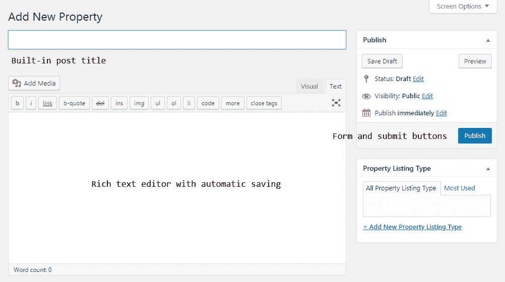
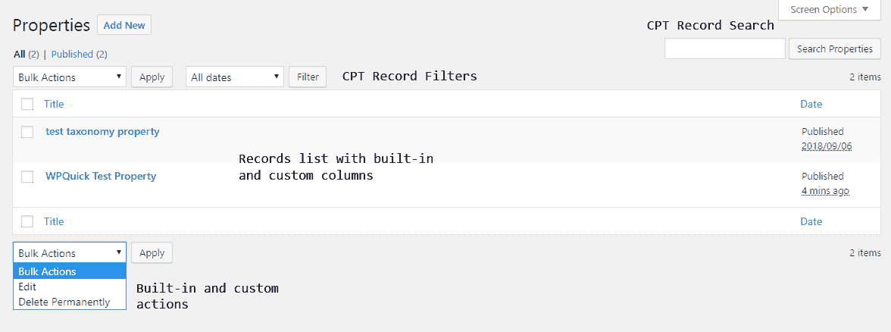
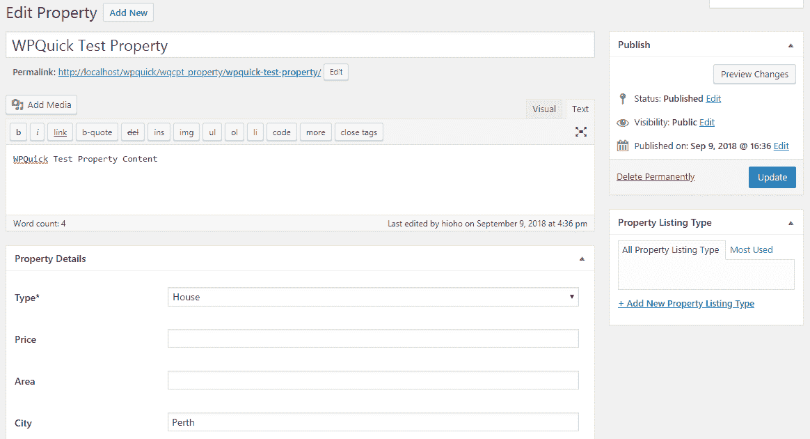
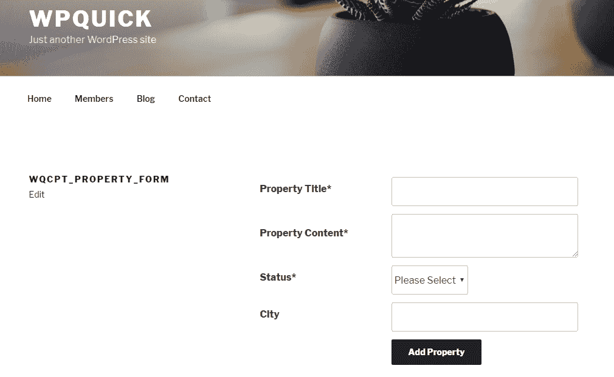
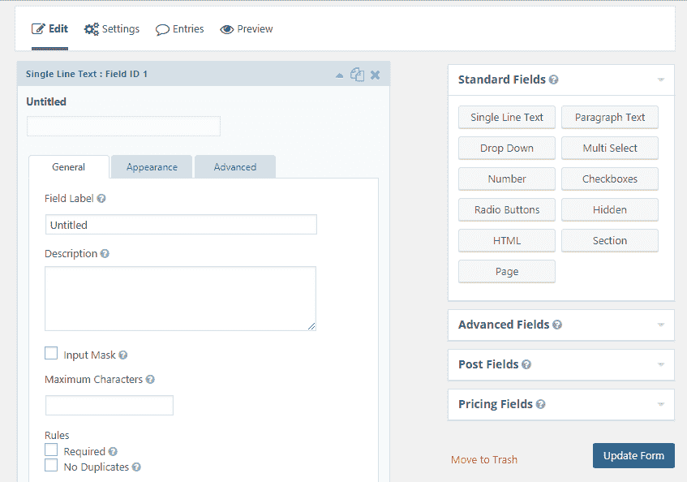

# 管理自定义帖子类型和处理表单

在网络开发中，我们使用模型-视图-控制器（Model-View-Controller）架构将网站的不同方面分离到各自的层中。模型层旨在管理应用程序的数据和业务逻辑。在 WordPress 开发中，很难使用这种架构的原生形式。然而，对数据和逻辑进行建模对任何类型的网站都是重要的。因此，我们使用内置的自定义帖子类型和自定义表单来管理 WordPress 中的数据捕获过程。

在本章中，我们将探讨自定义帖子类型特征在自定义开发任务中的重要性及其应用。我们将构建一个新的自定义帖子类型来处理房地产列表网站中的属性，同时使用最重要的功能，如分类法、自定义字段和模板加载。默认情况下，自定义帖子类型功能在后台已启用，因此我们将探索在前端使用自定义表单进行数据管理的过程。最后，我们来看看自定义帖子类型和自定义表单在开发中的优缺点。

在本章中，我们将涵盖以下主题：

+   自定义帖子类型简介

+   构建面向对象的插件

+   为属性构建自定义帖子类型

+   表单管理简介

+   构建和使用自定义表单

+   在自定义帖子类型和自定义表单之间进行选择

+   使用表单管理插件

到本章结束时，您将能够使用自定义帖子类型和自定义表单进行开发，并了解在不同场景下两种技术的优缺点。

# 技术要求

您需要安装 WordPress 4.9.8 才能遵循此过程。即使您

如果您使用的是较新版本的 WordPress，所描述的示例应该没有重大问题。

本章的代码文件可以在 GitHub 上找到：

[`github.com/PacktPublishing/WordPress-Development-Quick-Start-Guide/tree/master/Chapter07`](https://github.com/PacktPublishing/WordPress-Development-Quick-Start-Guide/tree/master/Chapter07)

查看以下视频以查看代码的实际应用：

[`bit.ly/2AyINar`](http://bit.ly/2AyINar)

# 自定义帖子类型简介

自定义帖子类型是在 WordPress 3.0 中引入的，作为管理超出默认帖子之外的不同内容需求的解决方案。然而，“自定义帖子类型”这个名称是模糊的，因为我们可能会将其理解为一种不同于普通帖子的类型。理想情况下，我们应该将其视为自定义内容类型，因为它提供了足够灵活的功能来处理复杂的内容类型，如产品、属性和事件。自定义帖子类型默认存储在`wp_posts`表中。在自定义帖子类型引入之前，我们必须在代码中使用大量的过滤器和条件来保持不同的帖子类型彼此分离。当在同一个网站上管理多种不同内容类型时，这可能会让许多开发者感到头疼。

自定义文章类型的引入极大地扩展了 WordPress 作为开发具有高级数据需求和逻辑的网站的框架的能力。现代主题和插件已经充分利用了这些功能。让我们看看一些基于自定义文章类型的流行插件：

+   **WooCommerce 插件**：我们在第五章，*通过插件扩展、过滤器和使用动作*中已经探讨了此插件的功能。WooCommerce 被用作电子商务解决方案来销售产品。此插件使用五个内置的自定义文章类型来处理**产品**、**产品变体**、**订单**、**退款**和**优惠券**。此外，我们还获得了针对自定义文章类型的特定产品模板设计。您可以将此插件作为理解自定义文章类型使用的最佳示例之一。

+   **事件日历插件**：这是一个提供日历来创建和管理与事件相关的详细信息的插件，内置了用于**事件**、**组织者**和**场地**的自定义文章类型。

+   **bbPress 插件**：这是最受欢迎的论坛管理插件之一，内置了用于**论坛**、**主题**和**回复**的自定义文章类型。

如您所见，许多流行的插件使用多个自定义文章类型来构建插件功能。使用自定义文章类型大大简化了过程，同时也使插件与 WordPress 核心功能兼容。

# 为什么我们使用自定义文章类型来建模数据？

自定义文章类型是 WordPress 的一个伟大补充。但是，我们需要了解它如何在如此短的时间内变得如此受欢迎。主要原因是可以捕获、存储和显示高级数据需求，而不需要大量的开发工作。让我们看看自定义文章类型提供的主要功能，以减少开发时间。在不到二十行代码的情况下，我们可以获得一个具有以下所有功能的完全功能的自定义文章类型：

+   **创建和更新数据**：一旦添加了新的自定义文章类型，我们就会得到一个用于添加和编辑数据的屏幕，类似于正常的文章屏幕。主要内容细节会自动保存，只需点击一下按钮，因此我们可以避免需要构建自己的带有表单的自定义屏幕。考虑以下截图，突出显示内置功能：



+   **灵活的数据列表**：通常，构建具有分页的数据列表需要相当的开发时间。使用自定义文章类型，我们为每个自定义文章类型获得内置的列表，具有分页、搜索、过滤和删除功能。此外，我们可以轻松更改数据库查询以过滤和显示默认数据列表。除了这些功能之外，我们还获得一个名为“批量操作”的下拉菜单，其中我们可以对单个自定义文章类型的多个记录执行内置功能。最重要的功能是能够添加我们自己的操作并在多个记录上以最少的自定义代码执行它们。 考虑以下截图，突出显示内置功能：



+   **内置 URL 结构**：我们为每个自定义文章类型的所有屏幕获取默认的 URL 结构。在创建自定义文章类型时，我们可以轻松地更改内置的 URL 结构。因此，我们可以避免设置自己的 URL 结构以及条件性地管理不同屏幕所需的时间。

+   **自定义字段管理**：我们可以使用 WordPress 文章的默认自定义字段功能，其中我们可以为每个字段定义一个键和一个值。当我们想要对自定义字段有更多控制时，可以使用元框（metaboxes）以比从头开始开发自定义字段更少的开发工作量来添加和管理自定义字段。

+   **数据分类**：自定义文章类型为每个文章类型的记录提供内置的分类支持。根据需求，我们有能力将新的自定义文章类型数据分类为层次分类或平面标签。除了过滤之外，我们还获得这些分类页面的默认模板。因此，与通常的自定义开发相比，数据分类过程极其简单。

+   **内置模板**：构建模板并显示数据需要相当的开发工作量。默认情况下，自定义文章类型使用主题的内置模板，因此我们不需要做任何努力就可以以基本形式显示数据。即使对于高级需求，我们也可以简单地复制默认模板，并花费最少的工作量来调整它，以包含我们的设计元素或自定义数据。

这些原因可能让你对自定义文章类型如何在 WordPress 中成为如此有价值的功能有所了解。现在，是时候了解使用和开发这些功能的自定义解决方案的过程了。

# 构建面向对象的插件

到目前为止，我们在前面的章节中创建了几个插件。然而，我们使用了过程式方法，直接在主插件文件或子文件中定义必要的钩子和函数。随着网站或应用的复杂化，我们将很难使用过程式方法管理开发。因此，我们需要一种方法来使用最佳开发实践并将代码模块化到必要的类中。在本节中，我们将查看使用面向对象概念创建插件的基结构。让我们考虑以下基于 OOP 的插件结构代码：

```php
if( !class_exists( 'WPQuick_CPT' ) ) {   
  class WPQuick_CPT{   
    private static $instance;
    public static function instance() { 
      if ( ! isset( self::$instance ) && ! ( self::$instance instanceof WPQuick_CPT ) ) {
        self::$instance = new WPQuick_CPT();
        self::$instance->setup_constants();
        self::$instance->includes();

        add_action( 'admin_enqueue_scripts',array( self::$instance, 'load_admin_scripts' ),9);                
        add_action( 'wp_enqueue_scripts',array( self::$instance,'load_scripts' ),9);                

        self::$instance->model_property= new WQCPT_Model_Property(); 
      }
      return self::$instance;
    }

    public function setup_constants() {
      if ( ! defined( 'WQCPT_PLUGIN_DIR' ) ) {
        define( 'WQCPT_PLUGIN_DIR', plugin_dir_path( __FILE__ ) );
      }
    }       
    public function load_scripts(){ }   
    public function load_admin_scripts(){ }  
    private function includes() { 
      require_once WQCPT_PLUGIN_DIR . 'classes/class-wqcpt-model-property.php';
    }
  }
}
```

WordPress 没有提供推荐的方法或样板代码来使用面向对象的方法构建插件。因此，这是开发者的选择，使用更适合他们的技术。前面的结构被一些有趣的插件所使用，这也是我的个人偏好。因此，你可以将其用作指南，构建一个更适合你风格的更好解决方案。

我们首先检查主插件类的可用性，并为插件定义主类。我们将使用主类来处理所有其他文件以及类。然后，我们定义一个变量来保存类的实例，并使用`instance`函数从这个类生成一个对象。这个`static`函数和私有的`instance`变量确保我们只有一个插件类的实例。`instance`函数作为我们插件初始化的起点，因此我们可以在这个函数内包含必要的函数调用、类初始化和钩子。

在`instance`函数内部，我们调用了两个函数`setup_constants`和`includes`。这些函数分别定义了插件功能所需的常量，并使用 PHP 的`require_once`函数添加插件文件。随着我们开发复杂的插件，我们可以有许多这样的函数来分离这些基本配置。然后，我们可以定义所有`action`和`filter`钩子，这些钩子旨在在整个插件中用于配置目的。在这里，我们使用了两个动作来在网站的前端和后端包含脚本和样式。

下一个部分应该包括插件主类的对象创建。在这个场景中，我们只有一个类，尽管在高级插件开发中我们可能需要许多类。我们需要使用`self::$instance`对象，因为我们处于`static`函数中。最后，我们返回主类的实例。

这是面向对象类型插件的基结构。我们可以在类中包含所有主要配置和通用功能，并使用其他类来处理业务逻辑。现在，我们需要使用以下代码初始化主类：

```php
add_action( 'plugins_loaded', 'wqcpt_plugin_init' );
function wqcpt_plugin_init(){
  global $wqcpt;
  $wqcpt = WPQuick_CPT::instance();
}
```

我们在`plugins_loaded`动作上执行一个回调函数，以确保在我们初始化插件的主类之前所有插件都已加载。此外，这将是我们在进行集成或构建插件时检查其他插件之间依赖关系的位置。我们调用主`WPQuick_CPT`类的`instance`函数并将结果实例定义为`global`对象。正如你所看到的，现在我们的插件与之前的插件相比已经简化并且结构良好，只包含通用事物。特定于站点的实现将由其他类处理。现在，我们已经准备好开发插件以处理自定义帖子类型的功能。

# 为属性构建自定义帖子类型

我们可以使用自定义帖子类型来模拟广泛商业类别中的任何数据。在本章中，我们将为房地产列表网站构建一个属性自定义帖子类型，以说明自定义帖子类型功能的使用。在本节中，我们将开发创建自定义帖子类型、分配自定义分类和使用自定义字段的功能。

# 创建属性自定义帖子类型

首先，我们需要创建一个单独的类来处理与属性相关的功能，因为我们正在使用面向对象的插件。因此，在主插件目录内创建一个名为**classes**的新目录，并添加一个名为`class-wqcpt-property.php`的新文件。然后，我们需要在我们的插件中包含这个文件并创建一个对象以初始化功能。我们需要在`WPQuick_CPT`类的`includes`函数内部添加以下行来包含该文件：

```php
require_once WQCPT_PLUGIN_DIR . 'classes/class-wqcpt-model-property.php';
```

接下来，我们需要在`instance`函数内部使用以下代码行来创建这个类的对象：

```php
self::$instance->model_property  = new WQCPT_Model_Property();
```

现在，我们有了将功能添加到这个类的能力。WordPress 提供了一个名为`register_post_type`的函数来创建新的自定义帖子类型。这个函数接受广泛的参数来配置满足不同需求的帖子类型。这个函数应该在`init`动作内部调用，以防止任何不必要的冲突。让我们将以下代码行添加到`WQCPT_Model_Property`类的构造函数中：

```php
$this->post_type   =  'wqcpt_property';
add_action( 'init', array( $this, 'create_property_post_type' ) );
```

在第一行，我们将帖子类型键添加到一个类变量中以便在所有函数内部重用。然后，我们使用`init`动作来调用`create_property_post_type`函数以创建一个新的帖子类型。由于我们使用的是类，我们需要通过使用`$this`实例来在类对象上调用该函数。现在，我们可以看看`create_property_post_type`函数的实现：

```php
public function create_property_post_type() {
  global $wqcpt; 
  $post_type = $this->post_type;
  $singular_post_name = __( 'Property','wqcpt' );
  $plural_post_name = __( 'Properties','wqcpt' );

  $labels = array(
    'name' => sprintf( __( '%s', 'wqcpt' ), $plural_post_name),
    'singular_name' => sprintf( __( '%s', 'wqcpt' ), $singular_post_name),
    'add_new' => __( 'Add New', 'wqcpt' ),
    'add_new_item' => sprintf( __( 'Add New %s ', 'wqcpt' ), $singular_post_name),
  );

  $args = array(
    'labels' => $labels,
    'hierarchical' => true,
    'description' => __( 'Property Description', 'wqcpt' ),
    'supports' => array( 'title', 'editor' ),
    'public' => true,
    'show_ui' => true,
    'show_in_menu' => true,
    'show_in_nav_menus' => true,
    'publicly_queryable' => true,
    'exclude_from_search' => false,
    'has_archive' => true,
    'query_var' => true,
    'can_export' => true,
    'rewrite' => true
  );
  register_post_type( $post_type, $args );
}
```

我们从定义用于帖子类型和标签的必要变量开始函数。代码的下一部分包含标签数组。我们需要定义每个标签，因为 WordPress 将使用**帖子**作为所有条目的默认标签。当我们实际上正在处理**属性**时，在消息中显示**帖子**并不理想。下一段代码包含创建帖子类型的参数列表。让我们讨论最重要的设置及其作用：

+   **分层**：定义新帖子类型将作为页面还是帖子使用。WordPress 页面提供了分层功能，我们可以定义父页面，而帖子没有分层。

+   **支持**：此设置定义了新帖子类型允许的字段和功能。我们已经为属性启用了帖子标题和内容。我们还可以使用作者、缩略图、摘要、引用、自定义字段、评论、修订、页面属性和帖子格式等值来为不同功能使用。

+   **公开**：定义新帖子类型对内容创建者和访客的可见性。我们可以使用`true`或`false`作为值。根据此设置的值，我们将看到`show_in_menu`、`show_ui`和`exclude_from_search`等其他设置中的变化。

+   **重写**：定义帖子类型的重写规则状态或设置。默认情况下，它使用`$post_type`作为 slug。我们可以通过使用自定义 slug 来修改它。

通过使用[`codex.wordpress.org/Function_Reference/register_post_type`](https://codex.wordpress.org/Function_Reference/register_post_type)上的文档，可以识别有关可用设置及其在不同组合中的作用详情。

最后，我们通过传递帖子类型 slug 和参数列表来调用`register_post_type`函数创建帖子类型。现在，属性帖子类型已在 WordPress 中注册，你将在主 WordPress 菜单中看到一个名为属性的新部分。你可以创建一个属性并在前端使用属性链接查看它。然而，你将得到一个 WordPress 404 页面而不是属性详情页面。原因是 WordPress 不知道新注册的自定义帖子类型的新 URL 结构，直到我们刷新重写规则。正如我们在第六章中讨论的，*WordPress API 的实际应用*，我们需要手动通过访问 WordPress 设置 | 永久链接部分来更新重写规则，或者通过插件激活时刷新重写规则。你可以使用我们在上一章中讨论的技术来实现此插件的激活处理程序。一旦刷新了重写规则，你将能够在前端看到具有默认帖子布局的属性详情页面。

# 创建属性类型分类法

WordPress **分类法**是一种对文章或自定义文章类型进行分组的方法。我们在前几章讨论数据库表和模板时已经了解了分类法。在本节中，我们将探讨分类法如何与自定义文章类型相结合以及它们的实现。在这种情况下，我们正在构建一个房产列表网站。我们可以使用分类法根据房产类型对房产进行分组。让我们首先向`WQCPT_Model_Property`类的构造函数中添加以下操作：

```php
$this->property_category_taxonomy  = 'wqcpt_property_listing_type';
add_action( 'init', array( $this, 'create_property_custom_taxonomies' ) );
```

与自定义文章类型一样，我们必须使用`init`操作来为 WordPress 注册分类法。让我们考虑`create_property_custom_taxonomies`函数的实现：

```php
public function create_property_custom_taxonomies() {
  $category_taxonomy = $this->property_category_taxonomy;
  $singular_name = __('Property Listing Type','wqcpt');
  $plural_name = __('Property Listing Types','wqcpt');

  register_taxonomy(
    $category_taxonomy,
    $this->post_type,
    array(
      'labels' => array(
      'name' => sprintf( __( '%s ', 'wqcpt' ) , $singular_name),
      'singular_name' => sprintf( __( '%s ', 'wqcpt' ) , $singular_name),
      'search_items' => sprintf( __( 'Search %s ', 'wqcpt' ) , $singular_name),
    ),
    'hierarchical' => true,
  )
 );
}
```

我们首先在函数中定义分类法和必要的标签，类似于自定义文章类型。然后，我们可以使用必要的参数调用`register_taxonomy`函数来创建房产类型的分类法。让我们详细看看这些参数：

+   `taxonomy`：这是第一个参数，其中我们必须传递分类法的名称。我们只能使用小写字母和字符。我们将其指定为`wqcpt_property_type`，并使用前缀使其与其他插件区分开来。

+   `object type`：这是第二个参数，其中我们必须指定将使用此分类法的文章类型。在这种情况下，我们指定了`wqcpt_property`作为文章类型。在有多种文章类型的情况下，我们可以使用数组。然而，在多个文章类型中使用分类法会使存档页面成为不同文章类型条目的混合。由于设计和数据的不同，处理具有多个文章类型的存档页面可能很困难。因此，理想情况下，为每个文章类型使用单独的分类法，除非所有文章类型的存档页面都包含类似的设计和数据。

+   `arguments`：这是第三个参数，其中我们可以从可用选项列表中传递不同的设置。在这种情况下，我们使用了房产列表类型的**标签**和**分层**选项。**分层**设置定义了分类法应该作为**标签**还是**类别**。默认值是`false`，使其作为**标签**。我们将其设置为`true`，使其作为**类别**。有许多其他设置类似于自定义文章类型注册过程。您可以在[`codex.wordpress.org/Function_Reference/register_taxonomy`](https://codex.wordpress.org/Function_Reference/register_taxonomy)查看有关所有可用参数的更多详细信息。

对于分类法中类别与标签的选择取决于你的需求。通常，当我们想要有不同级别的子类别以及有一个固定的主要选项集时，我们会使用类别。标签不提供子级别，通常使用动态值集来解释数据。在这种情况下，房产列表类型有预定义的选项，如销售、租赁和抵押。因此，我们选择类别而不是标签来表示房产列表类型。

一旦使用此代码，你将看到在房产菜单中添加了一个新的分类法。你可以创建房产，并根据需要将房产列表类型分配给分类，以对房产进行分类。在实际需求中，你必须根据功能将每个自定义帖子类型的分类法需求与分类或标签相匹配。

# 管理自定义帖子类型的自定义字段

在常规帖子中，我们很少使用自定义字段，因为主要功能是在 WordPress 编辑器中显示内容，包括特色图片、标签和分类。然而，自定义帖子类型实现需要比 WordPress 编辑器中的内容更多的数据。因此，我们需要一种方法来处理每个自定义帖子类型的自定义数据。我们可以使用默认的帖子自定义字段功能，将数据存储在`wp_postmeta`表中。让我们考虑一个房产列表网站的自定义字段需求：

房产列表网站需要大量的自定义数据，包括通过 WordPress 编辑器提供的房产标题和主要房产内容。我们可以将一些房产数据，如房产列表类型，匹配为分类。然而，大部分数据需要通过自定义字段来处理。这些数据包括城市、房产类型、面积、价格、年份、房产规划等字段。

在本节中，我们将添加一些自定义房产字段，以了解在自定义帖子类型中添加和使用自定义字段的过程。让我们首先添加一个元框来定义自定义字段，类似于我们在*帖子附件*插件中使用的技术。我们需要更新`WQCPT_Model_Property`构造函数，添加以下操作：

```php
add_action( 'add_meta_boxes', array( $this, 'add_property_meta_boxes' ) );
```

现在，我们必须定义元框，并在`WQCPT_Model_Property`类内部使用以下代码实现显示元框内容的函数：

```php
public function add_property_meta_boxes() {
  add_meta_box( 'wqcpt-property-meta', __('Property Details','wqcpt' ), array( $this, 'display_property_meta_boxes' ), $this->post_type );
}

public function display_property_meta_boxes( $property ) {
  global $wqcpt,$template_data;

  $template_data['property_post_type'] = $this->post_type;
  $template_data['property_nonce'] = wp_create_nonce('wqcpt-property-meta');
  $template_data['wqcpt_pr_type'] = get_post_meta( $property->ID, '_wqcpt_pr_type', true );
  $template_data['wqcpt_pr_city'] = get_post_meta( $property->ID, '_wqcpt_pr_city', true );

  ob_start();
  $wqcpt->template_loader->get_template_part( 'property','meta');
  $display = ob_get_clean();
  echo $display;
}
```

我们已经讨论了在帖子附件插件中使用`add_meta_box`函数以及如何使用回调函数生成内容。在帖子附件插件中，我们使用了 PHP 变量内的 HTML 来生成输出。这在大型项目中并不理想，因为很难在引号内管理输出，以及为模板提供可扩展的能力。在 MVC 模式中，我们使用一个单独的层来表示模板，称为**视图**。

**模型-视图-控制器**（Model–view–controller），也称为**MVC**，是一种常用的架构模式，用于开发将应用程序分为三个相互关联部分的用户界面。MVC 设计模式解耦了这些主要组件，允许高效地重用代码和并行开发。

– 来源：[`en.wikipedia.org/wiki/Model-view-controller`](https://en.wikipedia.org/wiki/Model-view-controller)

同样，我们尽可能地将模板代码分离，以允许未来的增强。

因此，我们定义了一个名为 `$template_data` 的全局变量来保存此函数中使用的模板所需的数据。然后，我们将帖子类型、nonce 值和属性数据分配给 `$template_data` 数组。我们使用 `wp_postmeta` 表来存储属性的定制字段详情。因此，我们可以使用 `get_user_meta` 函数来获取要传递给模板的现有属性值。最初，这些函数将返回空字符串，直到我们第一次保存数据。然后，我们必须使用模板加载器来加载属性自定义字段的模板。

在本节中，我们使用了我们自己的模板加载器。您可以在我们插件的源代码目录中的 `classes/class-wqcpt-template-loader.php` 文件中找到其实现。这个类包含在我们插件的主体文件中，并在 `instance` 函数内部创建对象。这个类的基本功能是从我们插件的模板目录中包含 PHP 文件。那些熟悉在纯 PHP 项目中使用模板引擎如 **Twig**、**Smarty**、**Mustache** 的开发者可能会认为这是一种类似的技术。然而，这仅仅是基本的 PHP 文件包含和模板代码，因此不提供模板引擎提供的任何优势。

我们可以在 WordPress 插件中使用 PHP 模板引擎，但需要一些额外的开发工作。然而，大多数插件包括流行的插件都没有使用模板引擎，并且仅限于将模板作为 PHP 文件加载。

在这个函数中，我们调用了 `ob_start` 函数来开始模板加载过程。这个函数用于开启输出缓冲，允许我们只向浏览器发送必要的内容。接下来，我们通过使用我们插件的全局 `$wqcpt` 实例来访问模板加载器类的对象，并调用 `get_template_part` 函数。我们向这个函数传递了两个字符串 `property` 和 `meta`。因此，我们需要在我们的插件模板目录中有一个名为 `property-meta.php` 的模板文件。然后，我们使用 `ob_get_clean` 函数来获取模板并清理输出缓冲。最后，我们使用 `echo` 语句将内容发送到浏览器。在过程中的下一步是构建模板并使用为模板指定的数据。

# 构建属性字段模板

我们需要通过在插件内部创建一个名为 `templates` 的新目录和一个名为 `property-meta.php` 的新文件来开始这个过程。这个文件应该生成自定义字段以捕获属性数据，同时将 PHP 代码和逻辑的数量保持在最低。让我们看看属性自定义字段模板的实现：

```php
<?php
  global $template_data;
  extract($template_data);
?>

<input type="hidden" name="property_nonce" value="<?php echo $property_nonce; ?>" />
<table class="form-table">
  <tr>
    <th style=''><label><?php _e('Status','wqcpt'); ?>*</label></th>
    <td><select class='widefat' name="wqcpt_pr_type" id="wqcpt_pr_type">
      <option <?php selected( $wqcpt_pr_type, '0' ); ?> value='0' ><?php _e('Please Select','wqcpt'); ?></option>
      <option <?php selected( $wqcpt_pr_type, 'house' ); ?> value='house' ><?php _e('House','wqcpt'); ?></option>
      <option <?php selected( $wqcpt_pr_type, 'office' ); ?> value='office' ><?php _e('Office','wqcpt'); ?></option>
         </select></td>
  </tr>
  <tr>
    <th style=''><label><?php _e('City','wqcpt'); ?></label></th>
    <td><input class='widefat' name='wqcpt_pr_city' id='wqcpt_pr_city' type='text' value='<?php echo $wqcpt_pr_city; ?>' /></td>
  </tr> 
</table>
```

让我们通过以下步骤来理解属性字段模板的实现：

1.  我们通过使用全局 `$template_data` 数组并提取作为模板数据传递的值来开始模板。

1.  然后，我们必须添加 HTML 字段以保留 nonce 值和属性数据。在前面的代码中，我们为了说明目的将字段限制为城市和属性类型。

1.  接下来，我们必须使用从`WQCPT_Model_Property`传递的数据来加载这些字段的现有值。

现在，我们的模板已经准备好了。你可以创建或编辑一个属性来查看属性自定义字段，如下面的截图所示：



我们可以使用这项技术将所有属性字段分组到一个单个的元框中，或者使用多个元框来保存相关字段。此外，我们还可以更改元框在属性屏幕中的位置和优先级。

# 保存属性自定义字段

我们将属性设置为一个自定义文章类型，因此主要属性细节将在属性发布或更新事件上自动保存。然而，自定义字段数据不会在这个过程中保存，因此我们需要一个自定义实现来存储这些数据。我们选择将自定义字段数据存储在`wp_postmeta`表中。让我们看看使用 WordPress 的`save_post`操作保存自定义字段的过程。首先，我们需要将以下代码行添加到`WQCPT_Model_Property`类的构造函数中：

```php
add_action( 'save_post', array( $this, 'save_property_meta_data' ) );
```

此操作会在我们创建或更新文章或自定义文章类型时触发。现在，我们必须实现以下实现的回调函数：

```php
public function save_property_meta_data( $post_id ) {
  global $post,$wqcpt;
  if (   isset($_POST['property_nonce']) &&  ! wp_verify_nonce($_POST['property_nonce'], 'wqcpt-property-meta')){
    return $post_id;
  }
  if ( defined('DOING_AUTOSAVE') && DOING_AUTOSAVE ) {
    return $post_id;
  }

  if (  isset($_POST['post_type']) &&  $this->post_type == $_POST['post_type'] && current_user_can( 'edit_post', $post->ID ) ) {

    $wqcpt_pr_type = isset( $_POST['wqcpt_pr_type'] ) ? sanitize_text_field( trim($_POST['wqcpt_pr_type']) ) : '';
    $wqcpt_pr_city = isset( $_POST['wqcpt_pr_city'] ) ? sanitize_text_field( trim($_POST['wqcpt_pr_city']) ) : ''; 
    update_post_meta( $post_id, '_wqcpt_pr_type', $wqcpt_pr_type );
    update_post_meta( $post_id, '_wqcpt_pr_city', $wqcpt_pr_city );
  } else {
    return $post_id;
  }
}
```

我们在函数开始时验证分配给模板的 nonce 值。如果验证失败，我们可以直接返回帖子 ID。接下来，我们必须进行另一个验证，以检查自动保存。WordPress 的自动保存功能会定期自动保存帖子内容。我们不需要在每次自动保存时更新自定义字段值。因此，验证只允许在用户手动保存帖子时处理函数。下一个验证是最重要的，因为这个操作在 WordPress 的所有文章类型上都会执行。

我们必须确保只在必要的文章类型中使用此操作，以避免不必要的冲突。因此，我们检查属性是否正在保存，以及当前用户是否有权限通过使用`current_user_can`函数保存属性。我们没有在自定义文章类型注册中分配属性特定的能力。因此，我们必须检查默认的文章编辑权限。一旦所有验证都完成，我们就可以从 POST 请求中检索和清理值。最后，我们使用`update_post_meta`函数将每个属性字段保存到`wp_postmeta`表中。

我们已经完成了从后端管理属性的功能。现在，你应该能够创建带有自定义字段数据的属性，并在编辑属性屏幕中显示这些数据。一旦创建，你可以通过使用属性链接在前端查看属性。

主题将使用默认的`single.php`模板来显示属性。由于我们需要显示额外的属性相关字段，我们可以在主题内部创建一个模板或使用我们的插件来加载一个用于处理单个属性页面的模板。

在这种情况下，我们使用了两种基本字段类型的属性字段。在实际应用中，您将不得不使用更复杂的字段，如日期、地图、可搜索的下拉菜单、颜色选择器等。因此，手动构建自定义字段可能成为大多数开发时间较短的初创网站的问题。在这种情况下，我们可以使用充当管理自定义字段框架的自定义帖子类型插件，而无需手动编码。让我们看看一些提供广泛自定义字段类型的自定义帖子类型插件：

+   **Toolset Types**：此插件允许您管理自定义帖子类型、自定义分类和自定义字段，而无需任何编码。此插件提供了超过 20 种内置自定义字段类型。内置界面允许您通过提供必要的设置来管理自定义字段。有关功能的更多详细信息，请查看插件页面[`wordpress.org/plugins/types/`](https://wordpress.org/plugins/types/)。

+   **Pods**：此插件也提供了相同的功能集，同时还具有连接多个自定义帖子类型的能力。此插件提供了大约 10 种自定义字段类型，用于管理每个自定义帖子类型的字段，使用现有的屏幕。有关功能的更多详细信息，请查看插件页面[`wordpress.org/plugins/pods/`](https://wordpress.org/plugins/pods/)。

+   **元框**：与其他两个插件相比，此插件主要专注于通过允许您在帖子创建屏幕中添加它们到元框来管理自定义字段。此插件提供了超过 40 种内置字段类型，覆盖了广泛的应用领域。有关功能的更多详细信息，请查看插件页面[`wordpress.org/plugins/types/`](https://wordpress.org/plugins/types/)。

这些插件对需要快速开发过程且对功能的灵活性和可扩展性优先级较低的网站很有用。

# 存储数据作为元值的限制

我们在大多数情况下使用帖子元数据表来存储与不同自定义帖子类型相关的自定义数据。然而，随着元数据表变大，管理所有元值将变得困难。网站速度会变慢，从而产生重大的性能问题。因此，在规划网站初期阶段时，我们必须考虑这一限制。一旦使用了帖子元数据表，后期迁移到自定义解决方案将变得困难，尤其是在我们决定使用自定义帖子类型插件来管理自定义字段时。

因此，使用帖子元数据表来存储自定义字段数据对于小型到中型规模的网站来说很理想，在这些网站上，帖子元数据表不会因数据过多而超载。在高级应用中，我们应该考虑使用自定义表来存储自定义字段，同时使用帖子表来存储自定义帖子类型项的主要细节。

# 形式管理简介

大多数 WordPress 网站由少数关于网站、服务或产品的页面组成，同时拥有一个博客。在其余部分中，高比例的网站专注于捕获、处理和显示用户数据。因此，表单管理成为 WordPress 开发中的一个重要方面。表单通常用作前端的数据捕获方法，因为我们使用自定义帖子类型在后台捕获数据。我们可以在前端开发自己的自定义表单，或者我们可以通过使用现有的表单管理插件来自动化表单管理的过程。自定义表单和表单插件之间的选择取决于网站的需求。让我们来看看使用这两种方法的优缺点。

+   **开发时间**：表单插件提供了一个快速的开发过程，通过拖放创建表单，并通过配置处理所有表单字段功能。另一方面，自定义表单需要相当的开发努力，并且对现有字段的更改需要修改代码。

+   **数据库使用**：每个现有的表单插件都限制使用`wp_postmeta`表或单个自定义表，而自定义表单可以根据我们的偏好开发以使用这两种技术，同时将不同的表单数据存储在不同的表中。

+   **可扩展性**：构建自定义表单使得保持功能开放以供未来增强成为可能。另一方面，在考虑高级网站的增强时，我们将不得不与表单插件的限制作斗争。

+   **设计一致性**：我们可以创建自己的自定义表单设计以匹配主题的样式。然而，现有的插件可能无法提供 100%的灵活性来修改设计以匹配主题样式。

由于这些原因，我们应该根据每个网站的需求仔细选择自定义表单的开发方法。一旦我们完成了即将到来的关于表单管理的部分，你将对做出正确决策的过程有更好的了解。

# 在前端构建自定义表单

我们有几种方法可以将表单添加到 WordPress 网站的前端。在本节中，我们将讨论流行插件用于添加表单的两种方法：

+   使用短代码添加表单

+   使用自定义 URL 加载表单

我们将实施这两种技术，首先从短代码方法开始。

# 使用短代码添加表单

这是最受欢迎的方法之一，许多流行的插件用它来向网站添加数据捕获表单。在这个方法中，我们使用短代码来生成表单的 HTML。然后，我们将短代码添加到 WordPress 文章或页面中，并让用户通过文章或页面访问它。这对于基本到中级水平的功能来说是一个理想的技巧，因为表单的使用并不在网站功能中扮演关键角色。

使用短代码是添加表单最简单的方法之一。然而，短代码是添加到文章或页面中的，因此管理员可能会不小心删除页面或错误地破坏短代码。因此，它不应用于短代码功能至关重要的高级网站。例如，考虑一个基本社交网络网站上的注册表单。由于人们免费注册以分享他们的活动，注册页面短暂不可用并不是一个大问题。然而，考虑一个提供时间关键服务的网站的支持论坛上的注册表单。在这样的网站上，即使注册页面仅短暂不可用也是不可接受的，并会影响用户。因此，我们不应该在这样的网站上使用基于短代码的表单，或者防止对带有短代码的页面进行修改访问。

在上一节中，我们使用了自定义文章类型来管理后端中的属性详情。现在，我们需要将属性创建功能添加到前端。让我们在`WQCPT_Model_Property`类的构造函数中使用以下行代码来定义属性表单的短代码：

```php
add_shortcode( 'wqcpt_property_form', array( $this, 'display_property_form' ) );
```

接下来，我们需要实现回调函数以在前端显示属性创建表单。让我们考虑`display_property_form`函数的实现：

```php
public function display_property_form( $atts, $content ){
  global $wqcpt,$template_data;
  $template_data['property_nonce'] = wp_create_nonce('wqcpt-property-meta');

  ob_start();
  $wqcpt->template_loader->get_template_part( 'property','form');
  $display = ob_get_clean();
  return $display;
}
```

这个函数的实现与我们在后端自定义文章类型中使用的`display_property_meta_boxes`函数类似。在这种情况下，这个表单仅用于属性创建，因此我们不需要将现有数据作为模板变量传递。我们使用一个不同的模板，称为`property-form.php`，用于前端自定义表单。现在，我们可以看看`property-form.php`模板的实现：

```php
<?php
  global $template_data;
  extract($template_data); ?>
<form action="" method="POST" >
  <input type="hidden" name="property_nonce" value="<?php echo $property_nonce; ?>" />
  <table class="form-table">
    <tr>
      <th><label><?php _e('Property Title','wqcpt'); ?>*</label></th>
      <td><input type="text" name="wqcpt_prfr_title" id="wqcpt_prfr_title" value="" /></td>
    </tr>
    <tr>
      <th><label><?php _e('Property Content','wqcpt'); ?>*</label></th>
      <td><textarea name="wqcpt_prfr_content" id="wqcpt_prfr_content" ></textarea></td>
    </tr>
    <!—HTML for other custom fields -->
    <tr>
      <th>&</th>
      <td><input name="wqcpt_prfr_submit" id="wqcpt_prfr_submit" type="submit" value="<?php _e('Add Property','wqcpt'); ?>" /></td>
    </tr>
  </table>
</form>
```

模板的结构与后端的前一个场景完全相同。然而，我们增加了两个额外的字段，用于属性标题和内容，以及一个表单和一个提交按钮。在自定义文章类型中，我们有标题和内容作为内置字段。我们还使用了内置的文章表单和发布或更新按钮。在前端，我们没有任何内置功能，因此我们必须手动添加它们。一旦短代码被添加到页面中，属性创建表单将类似于以下屏幕截图：



现在，我们来到了最后的部分，即表单提交时创建属性。

# 使用自定义表单创建属性

在后端自定义文章类型中，我们只编写了自定义字段保存部分，因此我们可以使用`save_post`动作来处理这个过程。在前端，我们必须从头开始构建这个过程，因此`init`动作是实现的最佳钩子。让我们向我们的`WQCPT_Model_Property`类的构造函数中添加以下代码行：

```php
add_action( 'init', array( $this, 'save_property_form' ) );
```

接下来，我们可以看看`save_property_form`函数的实现，如下面的代码所示：

```php
public function save_property_form() {
  global $post,$wqcpt;
  if( ! isset( $_POST['wqcpt_prfr_submit'] ) ){
    return;
  }

  if ( !wp_verify_nonce($_POST['property_nonce'], 'wqcpt-property-meta' ) || ! current_user_can( 'edit_post' ) ) {
    // Handle error
  }

   $wqcpt_prfr_title = isset( $_POST['wqcpt_prfr_title'] ) ? sanitize_text_field( trim($_POST['wqcpt_prfr_title']) ) : '';
   $wqcpt_prfr_content = isset( $_POST['wqcpt_prfr_content'] ) ? wp_kses_post( trim($_POST['wqcpt_prfr_content']) ) : '';
   $wqcpt_pr_type = isset( $_POST['wqcpt_prfr_type'] ) ? sanitize_text_field( trim($_POST['wqcpt_prfr_type']) ) : '';
   $wqcpt_pr_city = isset( $_POST['wqcpt_prfr_city'] ) ? sanitize_text_field( trim($_POST['wqcpt_prfr_city']) ) : '';

 // Validations and generate errors
 // post fields and existence of a post
 // Rest of the code for saving data
}
```

我们从使用`if`条件检查前端文章创建请求中提交按钮的可用性开始函数，以确保我们的代码只在前端属性创建表单上执行。然后，我们使用另一个条件检查 nonce 值和属性创建权限。在自定义文章类型部分，我们通过传递文章 ID 执行权限检查，因为我们只为已创建的属性保存自定义字段。在这种情况下，我们是从头开始创建属性，因此我们还没有文章 ID。所以，我们只能检查一般的文章编辑权限。

一旦生成权限错误，我们可以将错误消息分配给一个类变量，并在短代码函数中使用它来显示它们。

一旦完成验证，我们可以从`POST`请求中检索属性数据，并在将其分配给必要的变量之前对其进行清理。在这里，我们对属性内容使用了名为`wp_kses_post`的函数。这个函数默认将内容清理为仅保留 WordPress 文章内容中允许的标签。接下来，我们必须验证从`POST`请求中检索的数据，并生成要显示在短代码中的错误。现在，我们可以看看这个函数的其余代码：

```php
$post_id = wp_insert_post(
             array(
               'post_author' => get_current_user_id() ,
               'post_name' => sanitize_title( $wqcpt_prfr_titley ),
               'post_title' => $wqcpt_prfr_title,
               'post_status' => 'publish',
               'post_content' => $wqcpt_prfr_content,
               'post_type' => $this->post_type
             )
         );

if ( !is_wp_error( $post_id ) ) {
  update_post_meta( $post_id, '_wqcpt_pr_type', $wqcpt_pr_type );
  update_post_meta( $post_id, '_wqcpt_pr_city', $wqcpt_pr_city );
} else {
 // Handle errors
}
```

在验证所有属性数据后，我们使用`wp_insert_post`函数在`wp_posts`表上创建属性。我们可以将所有必要的设置作为一个数组传递给这个函数。在这里，我们使用了当前登录用户作为作者。然后，我们在使用`sanitize_title`函数生成文章的 URL 的同时，将属性标题和内容分配给相应的设置。最后，我们设置正确的文章类型和状态为发布。这是一个内置函数，在执行 WordPress 核心内部的所有必要过滤器和动作的同时创建文章。如果我们使用自己的查询来保存属性，我们必须检查并执行所有必要的过滤器和动作，以确保我们的功能与其他插件兼容。这个函数将根据执行状态返回`true`或 WordPress 错误。接下来，我们可以检查错误并使用`update_post_meta`函数将属性自定义字段保存到`wp_postmeta`表。

我们可以轻松地使用前端表单在自定义数据库表中存储自定义字段数据，以获得额外的灵活性。在这种情况下，我们只需将`wp_insert_post`函数替换为自定义查询和必要的数据。

现在，我们已经完成了使用前端表单添加数据的过程，你应该能够通过将短代码分配到帖子或页面并提交必要的数据来测试这个过程。

# 使用自定义 URL 加载表单

我们已经在第六章，“WordPress API 的实际应用”，“重写 API”部分讨论了这种技术背后的概念。短代码方法对于高级网站来说并不可靠。因此，我们创建了自己的 URL 结构，并使用这些自定义 URL 来处理表单，而不是使用帖子、页面或自定义帖子类型。由于我们已经讨论了这种技术，我们将不带主要解释地通过代码。让我们从添加一个新的重写规则和一个查询参数来处理前端属性创建开始：

```php
add_action( 'init', 'wqcpt _manage_property_routes' );
function wqcpt_manage_property_routes() {
  add_rewrite_rule( '^property-listing/([^/]+)/?', 'index.php?wpquick_property_actions=$matches[1]', 'top' );
  add_rewrite_tag('%wpquick_property_actions%', '([^&]+)');
}
```

此代码添加了一个新的重写规则，可以通过[`www.example.com/property-listing/add`](http://www.example.com/property-listing/add)访问，用于从前端自定义表单创建属性。我们还使用了一个名为`wpquick_property_actions`的标签来识别属性的功能。理想情况下，我们需要将此代码包含在我们的插件的主要类中，以保持我们插件的对象化特性。然而，我们讨论了在激活时刷新重写规则的需要。因此，由于我们的插件是在`plugins_loaded`动作上初始化的，而激活处理程序是在该动作之前执行的，所以存在冲突。因此，我们必须在插件的主要类之外使用前面的代码，以及激活处理程序。以下是这个插件的激活处理程序代码：

```php
register_activation_hook( __FILE__, 'wqcpt_activate' );
function wqcpt_activate(){
  wqcpt_manage_property_routes();
  flush_rewrite_rules(); 
}
```

正如我们在第六章，“WordPress API 的实际应用”中做的那样，我们在激活处理程序上注册重写规则，在调用`flush_rewrite_rules`函数之前。接下来，我们需要过滤 URL 并加载用于创建属性的定制表单。我们使用内置的`template_redirect`动作来实现这个功能，并且我们可以在`WQCPT_Model_Property`类中包含这个动作，如下面的代码所示：

```php
public function property_controller() {
  global $wp_query,$wqcpt,$template_data;
  $wpquick_actions = isset ( $wp_query->query_vars['wpquick_property_actions'] ) ? $wp_query->query_vars['wpquick_property_actions'] : '';

  switch ( $wpquick_actions ) {
    case 'add':
      $template_data['property_nonce'] = wp_create_nonce('wqcpt-property-meta');

      ob_start();
      $wqcpt->template_loader->get_template_part( 'property','form' );
      $display = ob_get_clean();
      echo get_header();
      echo $display;
      echo get_footer();
      exit;
      break;
  }
}
```

首先，我们使用 WordPress 查询变量接收`wpquick_property_actions`的值。然后，我们使用`switch`语句来过滤不同属性的动作。在这个场景中，我们只使用了`add`作为过滤器。在完整的实现中，我们至少需要包括`edit`、`delete`和`list`动作。在`add`情况下，我们加载与短代码处理相同的模板。然后，我们在网站的头和尾之间包含它以显示前端表单。现在，你应该能够通过在浏览器 URL 中访问`www.example.com/property-listing/add`来访问和创建属性。

# 在自定义文章类型和自定义表单之间进行选择

我们在上一节中探讨了自定义文章类型和自定义表单的特点及流程。我们本章一开始就讨论了那些改变了我们使用 WordPress 进行开发的自定义文章类型特点。现在，我们可以将它们与自定义表单进行比较，并识别出它们的优缺点。让我们先看看自定义文章类型的优点。

你可能已经注意到了，为了显示自定义表单并使用它来捕获数据，我们需要编写大量的代码。而我们使用自定义文章类型做同样的事情，所花费的时间甚至不到一半。让我们总结一下，与自定义文章类型相比，在自定义表单开发中我们需要额外做的事情：

+   **创建标题和内容字段**：在自定义文章类型中，我们内置了标题字段和内容字段，并带有富文本编辑器，而在自定义表单中，我们必须创建两个新字段来处理它们。

+   **添加表单和提交按钮**：在自定义文章类型中，我们不需要添加表单或提交按钮，因为我们正在使用 WordPress 内置的文章功能。

+   **保存属性**：在自定义文章类型中，我们不需要创建属性并保存主要细节，因为 WordPress 核心进程会自动完成这些操作。

+   **处理属性验证**：在自定义文章类型中，所有必要的属性数据验证都由核心功能处理。然而，我们需要检查属性的存在、URL，并确保手动清理属性内容。

+   **文章编辑和列表**：使用后端自定义文章类型，我们可以在创建文章后立即编辑、列出或删除文章。然而，我们只使用自定义表单构建了创建表单，因此我们必须从头开始使用更多自定义表单来开发编辑、列表和删除功能。

因此，从这个角度来看，内置的自定义文章类型在自定义表单之上提供了更多的优势。以下是使用自定义表单而非自定义文章类型的优势：

+   **前端界面**：自定义文章类型不提供前端的数据捕获功能，因此用户需要被重定向到后端。因此，我们无法将表单与主题的样式相匹配，而自定义表单允许我们创建任何类型的设计。这也意味着我们将在后端管理其他菜单项的权限。

+   **前端和后端的混合**：使用自定义表单时，我们可以让用户在前端使用其他网站功能以及数据提交，使用户能够拥有一致的屏幕集。然而，使用自定义文章类型意味着用户将需要在网站的前端和后端之间切换，从而产生不必要的复杂性。

+   **验证的灵活性**：WordPress 自动使用自动保存功能保存自定义帖子类型，因此我们无法等待自定义帖子创建完成，直到自定义验证完成。因此，我们必须使用一些变通方法来验证自定义字段并显示错误消息，同时保持帖子类型记录不可访问。在自定义表单中，我们可以在实际上传`wp_posts`表中的记录之前对数据进行完全自由的验证。

+   **使用数据库表时的灵活性**：在后端自定义帖子类型中，新创建的帖子总是保存到`wp_posts`表中。然而，在自定义表单中，我们可以决定是使用现有表还是使用我们自己的自定义表来管理数据。

通过考虑每种技术的优缺点，我们可以得出结论，后端自定义帖子类型主要适用于预算较低且需要快速开发流程的网站。此外，当基本功能比灵活性更重要时，我们也可以考虑使用自定义帖子类型。另一方面，自定义表单可以用于需要高性能和未来增强灵活性的高级网站。

# 使用表单管理插件

我们探讨了使用自定义帖子类型和自定义表单来捕获和显示 WordPress 网站所需的数据。然而，许多初创网站没有预算或时间来开发针对其网站的特定解决方案。因此，开发者必须使用现有解决方案，并在其基础上构建功能。在这种情况下，WordPress 表单插件成为理想的解决方案。有一些流行的表单插件是为了满足特定领域而开发的，例如联系表单。我们还可以找到如 Gravity Forms、Ninja Forms 等表单插件，它们是为了满足任何目的而开发的。让我们了解一个高质量的表单插件所期望的功能：

+   **拖放构建器**：这是通过现有插件加速自定义表单开发的功能。我们不需要为每个字段编写自己的 HTML，而应该能够拖放现有的自定义字段，并在几分钟内构建完全工作的自定义表单。

+   **基于 Ajax 的表单提交**：这是现代网站中的一个非常重要的功能，因为开发者不会为许多功能使用常规的帖子提交。因此，表单插件应该能够使用常规表单提交以及基于 Ajax 的提交。

+   **不同的字段类型**：在这个插件中，我们只使用了基本的文本和下拉字段。然而，在高级网站上，我们需要许多字段类型，如日期、谷歌地图和可搜索的下拉菜单。因此，能够通过表单插件内置字段处理此类高级要求无疑是一个巨大的优势。

+   **表单字段验证**：通常，我们必须通过应用必要的验证规则来验证每个字段。在一个高质量的表单插件中，我们应该能够从现有规则集中选择并验证字段，而无需编写任何代码。

+   **条件逻辑**：在自定义表单中，我们为特定需求开发每个表单，因此我们可以在加载某些字段之前手动应用条件。在表单插件中，我们动态地将字段添加到表单中，因此我们应该有能力在使每个字段在网站上可见之前定义条件。

+   **显示和导出数据**：我们应该有能力在前端显示提交的数据，并在必要时将其导出为常见文件类型。

+   **将表单数据保存到自定义数据库表**：通常，许多表单插件将数据保存到`wp_postmeta`表或使用相同的自定义表将所有表单的数据保存到单个自定义表中。我们至少应该有能力在现有表或自定义表之间进行选择。

这些是我们期望从高质量表单插件中获得的一些功能。让我们看一下以下屏幕截图，这是最受欢迎的表单插件之一的形式创建界面：



上一张截图预览了我们在上一节中讨论的一些功能。然而，要找到一个以我们期望的方式提供所有这些功能的表单插件将很困难。此外，几乎所有表单插件都不提供前端界面，让用户编辑提交的数据或列出它们。因此，表单插件最适合我们想要使用一次性表单来捕获用户数据的场景。流行的例子包括注册表单、联系表单、支付表单和调查。我们应该始终使用自定义表单或自定义文章类型来管理需要用户提交、更新和列出所有提交数据的表单。

# 摘要

管理数据的过程是网站或应用最重要的方面之一。WordPress 自定义文章类型允许我们以标准方式建模不同的内容类型，并使用内置功能进行快速开发。我们通过理解自定义文章类型的重要性及其在插件开发中成为流行选择的功能开始本章。然后，我们研究了创建自定义文章类型的过程，同时理解了与自定义文章类型一起使用分类和自定义字段。接下来，我们转向开发网站前端自定义表单的过程和技术。最后，我们探讨了使用表单插件的需要，并比较了自定义文章类型和自定义表单的优缺点。

在第八章《发现开发中的关键模块》中，我们将探讨现代网站中关键模块的开发，例如 UI 组件集成、提高可用性和自定义核心管理功能。
