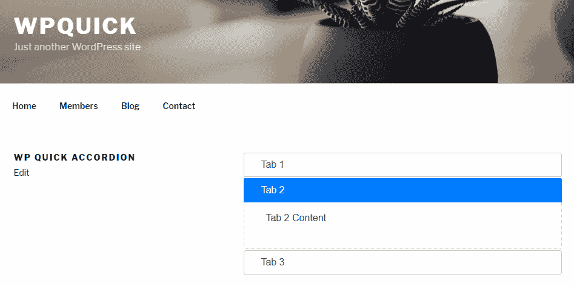
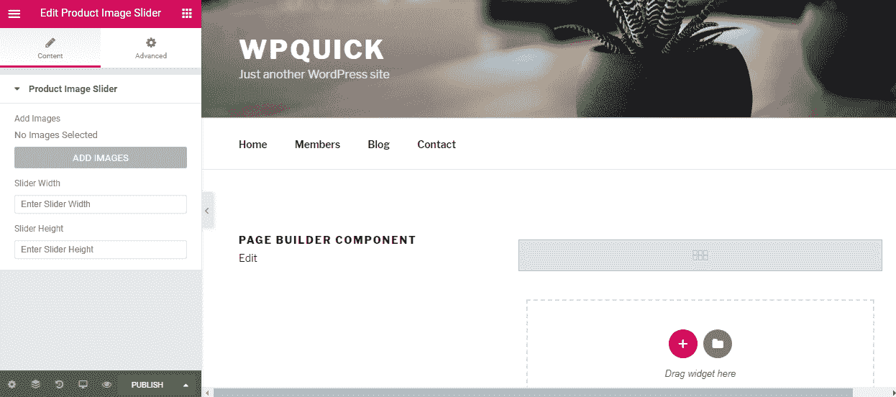
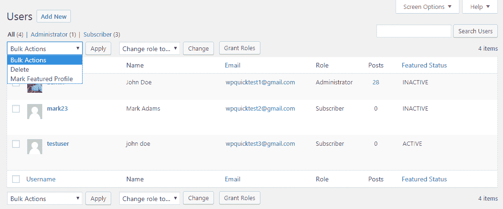

# 发现开发中的关键模块

现代网站界面大多基于块的概念，网站所有者可以拖放可重复使用的组件来构建界面。UI 组件和页面构建器在开发这些界面中扮演着重要角色。因此，对于开发者来说，了解如何集成任何第三方 UI 组件以构建具有交互性的惊人界面是非常重要的。另一方面，WordPress 因其现有的 CMS 功能而被许多开发者选择，这些功能可以加速开发过程。因此，开发者需要深入了解使用后端功能以及根据定制需求定制现有功能。

在本章中，我们将重点关注 UI 组件集成以及常见后端功能的定制。我们首先通过使用菜单页面来捕获数据，将 jQuery 滑块集成到 WordPress 中。然后，我们将使用自定义帖子类型来捕获数据，集成另一个流行的组件，称为手风琴。在此之后，我们将查看使用图像滑块和手风琴的两种集成方法来整合任何 UI 组件的基本步骤。此外，我们还将探讨现代页面构建器在网站开发中的重要性，并讨论使用任何页面构建器创建自定义组件的基础知识。最后，我们将查看通过创建基本仪表板小部件和修改列表表来提供自定义功能的后端功能定制过程。

在本章中，我们将涵盖以下主题：

+   集成 UI 组件

+   集成 jQuery 图像滑块

+   集成 jQuery 手风琴

+   确定集成 UI 组件的步骤

+   理解页面构建器的使用

+   创建自定义仪表板小部件

+   定制后端列表表

到本章结束时，您将能够使用最新的趋势方法定制后端管理功能以及将 UI 组件集成到网站中。

# 技术要求

为了遵循此程序，您需要安装 WordPress 4.9.8。即使您有 WordPress 的更高版本，描述的示例也应无重大问题地工作。

如果您有 WordPress 的更高版本，描述的示例应无重大问题地工作。

本章的代码文件可以在 GitHub 上找到：

[`github.com/PacktPublishing/WordPress-Development-Quick-Start-Guide/tree/master/Chapter08`](https://github.com/PacktPublishing/WordPress-Development-Quick-Start-Guide/tree/master/Chapter08)

查看以下视频，以查看代码的实际效果：

[`bit.ly/2yGYX03`](http://bit.ly/2yGYX03)

# UI 组件

现代网站建立在交互式 UI 元素之上。许多高级 WordPress 主题包括由开源 JavaScript 和 CSS 库支持的广泛 UI 组件。这些 UI 组件通过简化界面以及在小空间内提供大量内容来吸引用户。在数百个 UI 元素中，我们发现图片滑块和相册、标签是最受欢迎的。作为开发者，您需要使用或构建这些组件以跟上现代开发中日益增长的 UI 需求。因此，了解使用插件或主题将任何 UI 组件集成到 WordPress 中的基本过程非常重要。在本节中，我们将探讨两个 UI 组件的集成。让我们开始吧。

# 集成 jQuery 图片滑块

图片滑块和相册是 WordPress 网站中最受欢迎的 UI 元素。您可以访问[wordpress.org](http://wordpress.org)插件目录或像 Codecanyon 这样的高级市场，以了解此类插件的下载量和购买量。我们可以使用这些滑块来显示一组基本图片，以及显示高级内容和图片以推广您的产品、服务和功能。

在本节中，我们将使用 Basic jQuery 滑块([`basicslider.com/`](http://basicslider.com/))来解释集成图片滑块的过程。我们将创建一个单独的图片滑块，用于在网站的首页或其他任何首选位置显示产品图片。

图片滑块插件使您能够使用自定义帖子类型或自定义表单创建多个可重复使用的滑块。在这种情况下，我们只关注一个预定义的滑块。

在开始实施之前，我们必须为这一章创建另一个插件。我们将将其命名为`WPQuick Key Modules`，并将其放在名为`wpquick-key-modules`的目录中。我们将使用此插件来实现本章讨论的大多数功能。该插件将与之前的插件具有相同的结构，其中主类初始化所有其他功能和类。

# 构建产品图片滑块

我们可以使用滑块来显示任何类型的内容，其中最常见的类型是图片。集成任何 UI 组件的第一步是数据捕获的过程。在这种情况下，所需的数据将是一组图片。因此，我们需要构建一个界面，让管理员上传一组图片用于滑块。我们有两种为这种需求创建界面的选择：

+   **菜单页面**：我们可以使用`add_menu_page`函数来为我们的插件创建一个新的菜单页面。这将是一个 WordPress 管理员菜单中的顶级菜单项，具有支持子菜单页面的能力。当你需要突出显示你的插件菜单以及为插件的各个功能创建不同的菜单页面时，这非常适合。关于`add_menu_page`函数的更多详细信息，请参阅[`developer.wordpress.org/reference/functions/add_menu_page/`](https://developer.wordpress.org/reference/functions/add_menu_page/)。

+   **选项页面**：我们可以使用`add_options_page`函数来创建一个新的选项页面用于自定义设置。这个函数将在设置菜单项下创建一个子级菜单项。然而，它不支持更高级别的菜单，因此对于需要多个菜单页面的插件来说，使用起来可能会有困难。这对于添加通用的站点特定设置而不是插件设置很有用。关于`add_options_page`函数的更多详细信息，请参阅[`developer.wordpress.org/reference/functions/add_options_page/`](https://developer.wordpress.org/reference/functions/add_options_page/)。

在这个场景中，我们将选择用于图片上传界面的菜单页面，因为这是一个插件特定的自定义要求。让我们创建一个用于上传图片的菜单页面。

# 创建插件菜单页面

WordPress 通过插件提供了内置函数来添加菜单页面。我们可以将界面添加为主菜单项或子菜单项。在我们的插件类目录中创建一个名为`WQKM_UI_Components`的类。然后，我们可以在插件主类的`includes`和`instance`函数中执行常规的文件包含和对象创建。接下来，我们可以在`admin_menu`动作中添加以下代码行来注册一个新的菜单页面：

```php
add_menu_page( __('UI Component Settings', 'wqkm' ), __('UI Component Settings', 'wqkm' ),  'manage_options','wqkm-settings', array( &$this,'ui_settings' ) );
```

这个函数的前两个参数定义了菜单页面的标题和菜单项的标题。第三个参数定义了加载此页面的能力。在这里，我们使用了`manage_options`作为能力来限制它只对管理员开放。你可以根据负责使用此界面的人员来更改这个能力。第四个参数定义了一个唯一的 slug，可以通过 URL 访问菜单项。最后一个参数定义了用于生成此界面内容的回调函数。这些都是这个函数使用的主要参数。

现在我们需要实现回调函数来显示上传图片到滑块的必要字段。让我们看看`ui_settings`函数的结构：

```php
public function ui_settings(){
  // Define global variables
  // Load template and return to browser
}
```

我们已经在之前的章节中讨论了用于模板加载的回调函数，因此我们将不会详细讨论代码。首先，我们定义全局变量以保存我们插件的主要实例并将数据传递到模板中。然后，我们使用我们在上一章中使用的技术，借助自定义模板加载器加载自定义模板。您可以参考源代码以获取完整的实现。接下来，我们必须构建用于上传文件的自定义模板，如下面的代码所示：

```php
<?php
 global $wqkm_template_data;
 extract($wqkm_template_data);
?>
<form id="wqkm_slider_frm" action="" method="POST" >
 <div id="wqkm-slider-msg"></div>
 <table class="form-table">
   <tr>
     <th><label><?php _e('Product Slider Images','wqkm'); ?>*</label></th>
     <td> <div id="wqkm-slider-images-panel"></div>
       <input type="file" name="wqkm_slider_image" id="wqkm_slider_image" value="" />
     </td>
   </tr> 
   <tr>
     <th>&</th>
     <td><input name="wqkm_ui_submit" id="wqkm_ui_submit" type="button" value="<?php _e('Add Image','wqkm'); ?>" /></td>
   </tr>
 </table>
</form>
```

让我们了解此模板的结构，用于处理图像上传：

1.  首先，我们定义一个全局变量以接受从`WQKM_UI_Components`类传递的模板数据。最初，此变量将为空，因为我们没有模板数据或设置。

1.  然后，我们必须定义一个表单来启用数据提交。在表单内部，我们有一个名为`wqkm-slider-msg`的空容器，用于处理表单的错误和成功消息。

1.  接下来，我们添加一个文件输入字段来选择和上传滑块的图像。我们还添加了一个名为`wqkm-slider-images-panel`的 DIV 元素，与文件字段内联，以显示上传到滑块的当前图像。

1.  最后，我们添加一个按钮而不是提交按钮，因为我们将通过 AJAX 处理表单提交。

现在界面已准备好上传图像到滑块。您可以通过使用主菜单中的`UI 组件设置`菜单项来访问此界面。

# 使用 AJAX 保存滑块图像

我们可以使用常规的 POST 提交以及 AJAX 提交，因为这是一个没有其他依赖项的后端屏幕。然而，AJAX 提供了更好的用户体验，因此我们将通过 AJAX 提交表单数据。首先，我们必须使用`load_admin_scripts`函数添加一个新的脚本，以处理保存滑块图像的 AJAX 请求。我们将使用与`WooCommerce Product Files`插件相同的代码，因此您可以参考源代码目录中的主文件以了解`load_admin_scripts`函数的实现。

接下来，我们必须使用 AJAX 处理表单提交过程。文件表单提交的代码可在源代码目录的`wqkm-admin.js`文件中找到。实现将与我们在`WQWPF Product Files`插件的`wqwpf-admin.js`文件中使用的实现相同，除了以下差异：

+   在这种情况下，我们通过表单 ID 获取自定义表单，而不是使用内置的 POST 提交表单

+   我们使用`wqkm_save_slider_images`操作代替`wqwpf_save_product_files`

+   我们移除了 post-ID 参数，因为我们不是提交与帖子相关的表单

现在我们来到图像保存过程的最后部分，通过上传和捕获文件数据。我们必须首先在`WQKM_UI_Components`类的构造函数中添加以下操作：

```php
add_action( 'wp_ajax_wqkm_save_slider_images', array( $this, 'save_slider_images') );
```

此过程仅由登录用户执行，因此我们省略了`wp_ajax_nopriv`动作。让我们看看`save_slider_images`函数的实现：

```php
public function save_slider_images(){
 global $wpdb; 
 $file_nonce = isset( $_POST['file_nonce'] ) ? ($_POST['file_nonce']) :'';
 $user_id = get_current_user_id();

 if(check_ajax_referer( 'wqkm-private-admin', 'file_nonce',false )){
   $result_upload = $this->process_file_upload();
   if(isset($result_upload['status']) && $result_upload['status'] == 'success' ){
     $file_date = date("Y-m-d H:i:s"); 
     $uploaded_file_name = $result_upload['base_name'];
     $slider_images = (array) get_option('wqkm_slider_images');
     $slider_images[] = $result_upload['relative_file_path'];
     update_option( 'wqkm_slider_images', $slider_images );
     $upload_dir = wp_upload_dir();
     $display_images = '';
     foreach ($slider_images as $slider_image) {
       if( $slider_image != '' )
         $display_images .= '';
     }

     $result = array( 'status' => 'success', 'msg' => $result_upload['msg'] , 'images' => $display_images );
   }else{
     $result = array( 'status' => 'error','msg'=> $result_upload['msg']);
   }
 }else{
   $result = array( 'status' => 'error', 'msg' => __('Invalid file upload request.','wqkm') );
 }
 echo json_encode($result);exit;
}
```

以下代码做了什么：

1.  我们从 POST 请求中检索 nonce 值并将其分配给登录用户的 ID。

1.  然后，我们在完成 nonce 验证后，使用`process_file_upload`函数上传请求中的图片。我们已经从之前开发的**Post Attachments**插件中复制了`process_file_upload`函数。唯一的区别是使用图像特定的文件类型，而不是我们之前使用的文档文件类型。

1.  一旦图片上传，我们使用`get_option`函数检索现有图片。然后，我们添加上传的图片并使用`update_option`保存新的图片集。在这种情况下，我们已在`wp_options`表中存储滑块图片，因为它是一个预定义的滑块。在需要多个动态滑块的情况下，我们必须使用`wp_posts`表或自定义表来存储这些数据。

1.  最后，我们遍历图片列表并为作为 AJAX 请求响应一部分的图片生成 HTML。在 AJAX 请求中，我们必须使用必要的键并将现有图片列表内联显示在图片上传字段中。

现在我们已经捕获了图像滑块组件所需的所有必要数据。下一步是使用这些数据以及必要的脚本生成 UI 组件。

# 准备滑块图片

我们需要准备 HTML 代码以包含滑块图片和必要的容器。每个滑块的元素结构根据库而异。因此，我们需要参考滑块 JavaScript 库的文档，找出预期的结构。所以，我们必须访问[`basicslider.com/`](http://basicslider.com/)并转到标记部分。本部分解释了实现滑块所需的元素：

```php
<div id="banner-fade">
 <ul class="bjqs">
 <li><!-- Any content you like --></li>
 </ul>
</div>
```

现在我们必须使用这个结构，并在`<li>`元素内添加滑块图片。我们可以直接将 HTML 添加到 WordPress 帖子或页面中，以显示滑块。然而，我们可能需要重用滑块，因此将其实现为短代码或小工具始终是一个好选择。短代码是完美的解决方案，因为它也可以包含在小工具中。让我们从向`WQKM_UI_Components`类的构造函数中添加短代码开始实现：

```php
add_shortcode( 'wqkm_product_slider', array( $this, 'product_slider') );
```

现在我们可以实现短代码回调函数，以使用上传的图片并生成滑块所需的 HTML 结构。考虑以下代码：

```php
public function product_slider( $atts, $content ){
 $sh_attr = shortcode_atts( array(
   'width' => '520',
   'height' => '320',
 ), $atts );

 $slider_images = (array) get_option('wqkm_slider_images');
 $upload_dir = wp_upload_dir();

 $display = '<div id="banner-fade"><ul class="bjqs">';
 foreach ($slider_images as $slider_image) {
   if( $slider_image != '' )
     $display .= '<li></li>';
 }
 $display .= ' </ul><div>';
 return $display;
}
```

我们从定义可用的短代码属性及其默认值开始函数。在这里，我们只使用了滑块的 `width` 和 `height` 作为设置。你可能需要根据你选择的图片滑块库定义更多设置。然后，我们使用 `get_option` 函数和 `wqkm_slider_images` 键检索滑块图片列表。最后，我们遍历图片，在 `<li>` 元素内添加图片 HTML，同时使用主要的 `<ul>` 和 `<div>` 容器来初始化滑块。

一旦短代码被添加到帖子或页面中，你将看到作为项目符号的图片列表，没有任何滑动功能。

# 集成 jQuery 滑块

这是集成的最后一部分，我们将 JavaScript 或 CSS 库的功能应用于初始化 UI 组件的功能。因此，我们需要了解所需的库文件及其包含顺序。所需的文件在 [`basicslider.com/`](http://basicslider.com/) 的 **用法** 部分中显示。因此，我们必须下载必要的库并将它们添加到我们的插件中。一旦文件被添加，我们就可以在主类的 `load_scripts` 函数中使用以下脚本和样式注册代码：

```php
wp_register_style( 'wqkm-slider', WQKM_PLUGIN_URL . 'css/bjqs.css' );
wp_register_style( 'wqkm-slider-demo', WQKM_PLUGIN_URL . 'css/demo.css' );
wp_register_script( 'wqkm-slider', WQKM_PLUGIN_URL . 'js/bjqs-1.3.js', array('jquery') );
wp_register_script('wqkm-front',WQKM_PLUGIN_URL .'js/wqkm-front.js', array('jquery','wqkm-slider') );
```

我们包含了 `bjqs.css` 和 `demo.css` 文件用于样式，以及 `bjqs-1.3.js` 文件用于脚本，jQuery 作为依赖项。第三行注册了一个插件特定的自定义脚本以初始化滑块。因此，我们必须将 jQuery 和滑块库作为依赖项使用。

现在我们需要将这些库包含到 WordPress 请求中。我们可以使用 `wp_enqueue_style` 和 `wp_enqueue_script` 函数以及注册代码来包含这些文件。然而，这意味着这些文件将在每个请求中包含，即使页面上没有图片滑块。作为一个解决方案，我们可以在短代码属性的默认值之后将这些文件包含在短代码函数中。你可以参考源代码以了解这些文件的包含方式。

然后，我们来到最后一步，使用必要的脚本初始化组件。你可以参考 [`basicslider.com/`](http://basicslider.com/) 的 **激活** 部分，了解初始化过程，如下面的代码所示。此代码应添加到 `wqkm-front.js` 自定义脚本文件中：

```php
jQuery(document).ready(function($) { 
  $('#banner-fade').bjqs({
    animtype : 'slide',
    height : WQKMFront.height,
    width : WQKMFront.width,
    responsive : true,
    randomstart : true,
    showmarkers   : false, 
  });
});
```

在这个库中，`bjqs` 作为初始化函数。我们将其应用于具有 ID `#banner-fade` 的容器。我们还使用 `wp_localize_script` 函数添加的数据为 `width` 和 `height` 分配了短代码属性值。现在你可以刷新浏览器，看到图片滑块，而不是项目符号列表。

这是一个非常基本的滑块，具有基本功能。你可以找到更多具有图片、内容、视频和一些惊人效果的先进滑块。你可以尝试不同的滑块，因为无论滑块如何，集成过程都是相同的。

# 重复使用滑块作为小部件

我们对小部件及其在 WordPress 中的作用进行了简要介绍。小部件的目的是向网站的侧边栏添加功能块。然而，随着现代主题和小部件区域的出现，小部件可以被视为类似于短代码的可重复使用的功能块。因此，我们将查看在 WordPress 中构建前端小部件的过程。让我们首先在我们的插件 `classes` 目录中添加一个名为 `WQKM_Product_Slider_Widget` 的新文件。

在此场景中，我们将构建一个显示在上一节中创建的产品滑块的小部件。因此，我们可以为这个小部件重用短代码功能。让我们看一下以下代码中小部件的实现：

```php
class WQKM_Product_Slider_Widget extends WP_Widget {
  public function __construct() {
    parent::__construct( 'wqkm_product_slider', esc_html__( 'Product Slider', 'wqkm' ), array( 'description' => esc_html__( 'Main product slider', 'wqkm' ) ) );
  }

  public function widget( $args, $instance ) {
    echo $args['before_widget']; 
    echo do_shortcode('[wqkm_product_slider width="'.$instance['width'].'" height="'.$instance['height'].'" /]');
    echo $args['after_widget'];
  }

  public function form( $instance ) {
    $width = ! empty($instance['width']) ? (int) $instance['width']: 640;
    $height= ! empty($instance['height']) ? (int) $instance['height']:320;?>
    <p>
      <label><?php esc_attr_e( 'Width:', 'wqkm' ); ?></label>
      <input class="widefat" id="<?php echo esc_attr( $this->get_field_id( 'width' ) ); ?>" name="<?php echo esc_attr( $this->get_field_name( 'width' ) ); ?>" type="text" value="<?php echo esc_attr( $width ); ?>">
    </p>
    <p>
      <label><?php esc_attr_e( 'Height:', 'wqkm' ); ?></label>
      <input class="widefat" id="<?php echo esc_attr( $this->get_field_id( 'height' ) ); ?>" name="<?php echo esc_attr( $this->get_field_name( 'height' ) ); ?>" type="text" value="<?php echo esc_attr( $height ); ?>">
    </p>
 <?php  }

  public function update( $new_instance, $old_instance ) {
    $instance = array();
    $instance['width'] = ( ! empty( $new_instance['width'] ) ) ? (int)          $new_instance['width'] : '';
    $instance['height'] = ( ! empty( $new_instance['height'] ) ) ? (int) $new_instance['height'] : '';
    return $instance;
  }
}
```

WordPress 使用 `WP_Widget` 类作为处理小部件功能的基础。所有的小部件，包括核心小部件，都应该扩展这个类以使用小部件功能。因此，我们在自定义的 `WQKM_Product_Slider_Widget` 类声明中扩展了这个类。现在我们可以通过以下步骤查看小部件的主要功能：

1.  `constructor`: 我们必须使用此函数来调用父 `WP_Widget` 类的构造函数，并使用必要的参数。在这种情况下，我们使用了一个唯一的 ID、标题和描述。

1.  `widget`: 此函数用于在前端生成小部件的输出。在这里，我们使用了 `wqkm_product_slider` 短代码来生成小部件的输出。你可以使用短代码或调用一个函数来生成输出。`$instance` 变量包含所有小部件的设置，这些设置添加到后端。因此，我们使用宽度和高度设置作为短代码的属性。你可能也会注意到对 `$args['before_widget']` 和 `$args['after_widget']` 语句的使用。这些是一组预定义的参数，传递给小部件，这些参数的值在注册小部件时指定。这些参数对于在前后每个小部件添加常见内容非常有用。

1.  `form`: 此函数用于显示表单以捕获小部件的设置。我们在小部件函数中使用了宽度和高度，因此我们需要设置来定义这些值。首先，我们使用自动传递给此函数的 `$instance` 变量获取设置的现有值。然后，我们生成宽度和高度设置的输入字段。你可能注意到了对 `get_field_id` 和 `get_field_name` 函数的使用。这些是在核心 `WP_Widget` 类中定义的函数，用于以标准方式提供对小部件细节的访问。你应该始终使用这些函数，而不是硬编码名称和 ID。

1.  `更新`：此函数用于将设置数据保存或更新到数据库中。一旦点击了小部件的“保存”按钮，此函数将使用旧值以及提交的新值被调用。我们必须进行必要的验证并将新值分配给具有相应键的`$instance`变量。然后，WordPress 核心小部件类将自动将值保存到`$instance`变量中。

这是构建任何自定义小部件的标准流程。一旦创建了小部件类，你必须使用这四个函数来生成小部件所需的设置和输出。尽管我们已经完成了小部件的创建，但它不会在“外观 | 小部件”部分中可见。我们必须在它们出现在小部件部分之前注册新小部件。让我们考虑以下用于注册我们小部件的代码：

```php
add_action( 'widgets_init', array( $this, 'register_product_slider_widget' ) );
public function register_product_slider_widget() {
  register_widget( 'WQKM_Product_Slider_Widget' );
}
```

首先，我们需要在主类的`includes`函数中包含该文件。然后，我们可以在`WQKM_Admin_Features`类的构造函数中添加`widgets_init`动作。最后，我们在回调函数中使用`register_widget`和类名来注册新小部件。现在你应该能够使用这个新小部件将产品图片滑块添加到你的侧边栏中。

# 集成 jQuery 手风琴

在本节中，我们将探讨另一个流行的 UI 组件——**手风琴**的集成。手风琴是一个组件，允许你通过可折叠的部分在有限的空间内显示大量内容。我们选择了**jQuery UI**库中的手风琴组件（[`jqueryui.com/accordion/`](https://jqueryui.com/accordion/））作为基本解决方案。你可以找到许多高级手风琴组件库。

在图片滑块部分，我们使用了一个菜单页面来捕获数据，并将其限制为单个固定的图片滑块。然而，在网站的各个地方使用相同组件并具有不同内容的能力也同样重要。因此，我们将构建具有创建无限组件和动态内容能力的手风琴。我们可以使用自定义文章类型并将数据存储在`wp_posts`表中，或者我们可以使用自定义表。由于我们正在开发一个 UI 元素，我们将使用自定义文章类型来简化流程。让我们开始吧。

# 创建手风琴模型并捕获数据

我们选择使用自定义文章类型来构建手风琴。因此，我们需要使用带有必要设置的`register_post_type`函数注册一个新的自定义文章类型。我们已经在之前的章节中创建了一个自定义文章类型并讨论了与属性文章类型一起工作的过程。因此，你可以参考源代码目录中的`WQKM_UI_Components`类来了解注册过程。

与属性不同，手风琴不是为了作为单独的帖子显示或实现页面项目。相反，我们使用它们来捕获要在帖子或页面中的 UI 元素中重用的数据。因此，在创建自定义帖子类型时，我们必须将`public`属性设置为`false`。此设置确保手风琴不会作为单独的帖子类型公开可见。

一旦注册了帖子类型，我们需要使用元框来包含必要的字段并捕获手风琴的数据。手风琴有许多具有动态内容的部分。因此，我们需要文本区域字段来捕获每个部分的内容。让我们从为手风琴添加元框开始：

```php
public function add_accordion_meta_boxes() {
  add_meta_box( 'wqkm-accordion-meta', __('Accordion Details','wqkm'), array( $this, 'display_accordion_meta_boxes' ), $this->post_type );
}
```

在这里，我们为手风琴帖子类型注册了一个新的元框。`add_meta_boxes`动作和帖子类型初始化可以在`WQKM_UI_Components`类的构造函数中找到。现在我们需要使用以下代码实现回调函数：

```php
public function display_accordion_meta_boxes( $accordion ) {
 global $wqkm,$template_data;
 $template_data['accordion_post_type'] = $this->post_type;
 $template_data['accordion_nonce'] = wp_create_nonce('wqkm-accordion-meta');
 $template_data['wqkm_tab_1'] = get_post_meta( $accordion->ID, '_wqkm_tab_1', true );

 ob_start();
 $wqkm->template_loader->get_template_part( 'accordion','meta');
 $display = ob_get_clean();
 echo $display;
}
```

我们在函数开始时定义全局变量，并将帖子类型和 nonce 添加到全局模板数据变量中。然后，我们使用`get_post_meta`函数获取手风琴部分现有数据。在这里，我们只包含了一个部分。您可以在源代码中找到三个部分。

我们已将手风琴部分固定为三个，以简化开发。理想情况下，我们应该允许管理员动态添加无限数量的手风琴部分。

最后，我们为手风琴部分输入字段加载了一个自定义模板。手风琴元框的模板可以在`templates`目录下的`accordion-meta.php`文件中找到。

此模板与用于`Properties`帖子类型的模板类似，因此是自我解释的。然而，您可能会注意到使用了以下代码行而不是文本区域的代码：

```php
<td><?php wp_editor( $wqkm_tab_1, 'wqkm_tab_1' ); ?></td>
```

我们本可以使用文本区域字段来处理手风琴部分。然而，这些部分可能包含相当数量的 HTML，因此使用文本区域可能很困难。作为解决方案，我们使用了`wp_editor`函数，该函数生成带有所有格式的 WordPress 内容编辑器字段。我们必须传递默认内容和内容编辑器的 ID。现在我们可以使用 WordPress 丰富内容编辑器来添加内容到手风琴部分。

我们需要保存部分数据以完成手风琴的数据捕获过程。保存过程是通过`save_post`动作实现的，实现方式与属性详情保存过程类似。唯一的区别是使用`wp_kses_post`函数来过滤由`wp_editor`函数生成的部分内容。您可以参考`WQKM_UI_Components`类中部分保存过程的源代码。

# 准备手风琴内容

我们已经确定了短代码对于在帖子或页面中添加 UI 元素的重要性。因此，我们将使用另一个短代码来准备手风琴的内容。让我们将以下代码添加到手风琴短代码的实现中：

```php
add_shortcode( 'wqkm_accordian', array( $this, 'display_accordian') ); 
public function display_accordian( $atts, $content ){
 $sh_attr = shortcode_atts( array( 'id' => '0' ), $atts );
 extract($sh_attr);

 $display = '<div id="accordion">';
 if( trim( get_post_meta( $id, '_wqkm_tab_1' , true ) ) != '' ){
   $display .= '<h3>'.get_the_title( $id ).'</h3>';
   $display .= '<div><p>'.get_post_meta( $id, '_wqkm_tab_1' , true ).' </p> </div>';
 }

 // other fields
 $display .= '</div>';
 return $display;
}
```

以下代码做了什么：

1.  我们在 `WQKM_UI_Components` 类的构造函数中添加了一个名为 `wqkm_accordian` 的新短代码。我们使用自定义帖子类型来允许创建无限数量的手风琴，因此我们需要一种方法来识别每个手风琴。所以，我们使用帖子 ID 作为短代码属性来识别手风琴。

1.  接下来，我们通过使用 ID 属性加载数据来生成手风琴的内容部分。

1.  在这里，我们使用每个部分的主容器内的部分标题和部分内容。这是所选手风琴库所需的结构。如果您选择不同的库进行实现，您将需要找到元素结构。

1.  最后，我们通过从短代码中返回输出以包含手风琴部分来返回输出。

现在，您可以使用必要的 ID 在帖子或页面中创建并添加手风琴。然而，就像图片滑块一样，您在浏览器上只会看到一堆 HTML 部分。为了启用手风琴功能，我们需要在主类的 `load_scripts` 函数内部注册必要的脚本和样式，如下面的代码所示：

```php
wp_register_style('wqkm-jquery-ui-style', WQKM_PLUGIN_URL . 'css/jquery-ui.css', false, null);
wp_register_script( 'wqkm-accordion', WQKM_PLUGIN_URL . 'js/wqkm-accordion.js', array('jquery','jquery-ui-accordion') );
```

首先，我们已经下载并添加了 `jQuery UI CSS` 文件到我们的插件中，因为它不在 WordPress 核心中提供。然后，我们添加了一个名为 `wqkm-accordion.js` 的自定义脚本，其依赖项为 jQuery 和 jQuery UI 手风琴脚本。jQuery UI 组件库在 WordPress 核心中可用，因此我们可以直接调用脚本句柄而不是单独注册脚本。然后，我们可以将以下代码添加到短代码函数中，以排队文件：

```php
wp_enqueue_style('wqkm-jquery-ui-style');
wp_enqueue_script('wqkm-accordion');
```

我们在手风琴短代码中包含了手风琴脚本和样式。最后，我们必须通过在 `wqkm-accordion.js` 文件中添加以下初始化代码来初始化手风琴：

```php
jQuery(document).ready(function($) {
  $( "#accordion" ).accordion({ collapsible: true, active: false, heightStyle: "content"   }); 
});
```

使用我们为短代码输出创建的主要容器的 ID 来初始化手风琴。这可能会根据您选择的手风琴库而有所不同。现在，我们已经完成了手风琴集成过程，您的手风琴应该看起来与以下截图相似：



如您所见，我们可以在有限的空间内使用这些 UI 组件来显示大量内容。

# 集成 UI 组件的步骤

到目前为止，我们查看了两套使用不同的数据捕获技术集成 jQuery 滑块和手风琴 UI 组件的实现。实现可能根据 UI 组件的类型及其功能而有所不同。然而，对于大多数常见的 UI 组件，基本过程是相似的。所以，让我们总结一下将任何 UI 组件与 WordPress 集成的关键步骤：

1.  **识别组件数据**：每个 UI 组件都基于现有数据或元素工作。因此，我们需要识别使用每个 UI 组件所需的数据以及存储这些数据的方法。

1.  **生成组件输出**：在这一步，我们必须使用捕获的数据，对其进行处理，并生成启用 UI 组件功能的 HTML 输出。通常，我们使用可重复使用的组件，如短代码或小工具，来添加和生成 UI 组件的输出。

1.  **包含组件库**：大多数 UI 组件通过应用 JavaScript 或 CSS 到生成的输出中生成其功能。这些组件的功能通常以开源库的形式提供。因此，在这一步，我们需要为组件添加所有必要的脚本和样式，以及必要的设置。在这个过程中，我们使用`wp_register_style`和`wp_register_script`函数通过将它们添加到插件或主题中包含这些资源。然后，你可以在主类或 UI 组件生成函数中条件性地将它们排队。

1.  **传递脚本数据**：一些 UI 元素库直接在生成的输出上应用 CSS 或 JavaScript 功能。然而，一些元素脚本需要某些数据或设置来初始化元素。在这种情况下，我们必须使用`wp_localize_script`函数将必要的数据传递给必要的脚本。

1.  **初始化元素**：一旦必要的库和 HTML 输出准备就绪，我们可以通过使用这些库的初始化函数来初始化元素。这些初始化通常只需要一到几行代码。通常，我们使用 CSS 类或 HTML 元素 ID 在生成的输出上进行初始化。

一旦完成这些步骤，你将在 UI 元素中看到交互式功能或样式。这是最常见的 UI 元素的一般过程。然而，可能会有例外，需要不同的过程来初始化 UI 元素。

# 使用页面构建器简化开发

**页面构建器**是一组简化内容创建或构建网站功能的组件。这些组件允许开发者通过选择和配置内置组件，以超级快速的时间构建复杂的界面。页面构建器最初用于简化使用预构建设计元素的内容创建。然而，页面构建器现在已经发展到我们可以使用现有组件添加高级网站功能，如表单管理、可搜索的谷歌地图、视差图像和视频。

直到最近，开发者们使用主题中包含的页面构建器，以及免费和付费的页面构建器插件。WordPress 引入了一个基于块的 内容构建器，称为 **Gutenberg**。在这个阶段，Gutenberg 编辑器支持使用一组基本元素进行内容编辑。目前，它远远落后于 Elementor、Beaver Builder 和 Visual Composer 等流行页面构建器提供的功能。然而，未来似乎光明，因为 WordPress 团队正在支持 Gutenberg 编辑器，将其作为默认核心功能。因此，我们很快将看到 Gutenberg 编辑器更强大的功能，以及其他页面构建器提供的功能。

# 理解页面构建器的功能

正如我们所讨论的，页面构建器提供了一系列可以拖放或分配给任何帖子、页面或自定义帖子类型的组件。然而，许多这些页面构建器提供了超出基本内置组件使用的先进功能。因此，了解这些功能对于使用现有组件以及使您的解决方案与页面构建器集成非常重要。让我们看看现代页面构建器提供的主要功能：

+   **后端和前端编辑**：通常，我们使用后端内容编辑器来编辑或构建网站界面，因此我们必须切换到前端来查看更改。大多数页面构建器提供前端编辑功能，允许实时预览并即时调整。此外，还有一个后端编辑器，如果您想使用其他后端功能。

+   **内置模板**：许多页面构建器通过使用现有组件提供内置的模板设计。因此，开发者可以使用这些为常见需求设计的模板，并根据需要调整它们，而无需编写任何代码。

+   **高级样式**：每个组件都允许各种样式选项，例如边距、填充、颜色等。因此，您可以在不进入代码的情况下微调设计。

+   **响应式设计**：在现代开发中，为了适应不同的设备，如个人电脑、手机、平板电脑等，这是必须的。通常，我们必须花费大量时间使我们的设计完全响应式。页面构建器结构和组件默认是响应式的。因此，只要您遵循自己元素的适当编码标准，您就不需要做任何事情来使内容响应式。

如您所见，页面构建器为构建您网站的内容和设计提供了很多功能。然而，这些强大的功能也伴随着一些限制。一些页面构建器完全依赖于短代码，因此您将锁定在插件中。此外，当使用页面构建器的某些复杂功能时，您可能会遇到性能问题。因此，您在选择合适的页面构建器和功能时需要负责任。

# 为页面构建器开发组件

最受欢迎的页面构建器附带了一系列内置组件以及通过插件提供的附加组件。因此，我们可以使用现有的组件来构建通用目的的 WordPress 网站。然而，当开发高级应用程序或具有自定义要求的网站时，这些组件的默认功能可能不足以满足需求。在这种情况下，我们必须构建自己的页面构建器组件来提供必要的功能。我们始终可以创建短代码并要求客户在页面构建器组件中使用它们。但是构建我们的组件可以大大简化客户的过程，因此我们有必要时必须构建组件。

主要的页面构建器为他们的插件提供 API 或指南来开发组件。每种页面构建器的技术都有所不同。因此，您需要使用文档来了解和为每个页面构建器开发组件。从头开始开发具有必要解释的组件超出了本章的范围。然而，我们将以 Elementor 页面构建器为例，探索组件创建的基本步骤。让我们看看构建页面构建器组件的主要步骤：

+   每个页面构建器都将其组件标识为模块、小部件、块等。因此，应该有一种方法可以为页面构建器注册新的组件。Elementor 使用`Widget_Base`类和`register_widget_type`函数来注册新的组件。其他页面构建器提供类似的技术。

+   在注册组件后，您需要指定用于捕获组件数据的输入字段。大多数页面构建器提供不同类型的输入字段来捕获和保存组件的数据。Elementor 在`Widget_Base`类上提供了一个名为`add_control`的函数，支持超过 30 种不同的控件类型。其他页面构建器将提供类似的功能来为不同字段类型添加输入字段，以及不同的数据存储机制。

+   最后，我们需要通过构建 HTML 代码或执行现有的短代码来提供组件的输出。Elementor 提供了一个名为`render`的函数，用于检索保存的组件数据并显示输出。其他页面构建器应该有类似的方法，具有类似的名字。

我们已经使用这些步骤为 Elementor 页面构建器构建了一个滑块组件。您可以在本章源代码的`wpquick-elementor-components`目录中找到此插件的代码。以下截图预览了带有设置的由插件生成的组件：



Elementor 是目前最受欢迎且正在崛起的页面构建器之一。您可以在[`developers.elementor.com/creating-an-extension-for-elementor/`](https://developers.elementor.com/creating-an-extension-for-elementor/)找到文档，并使用附加代码来理解步骤。其他页面构建器的过程将类似，需要插件特定组件创建函数的支持。

# 简化和定制管理功能

我们必须尽可能使用核心功能，以获得使用 WordPress 进行网站开发的最佳效益。这包括使用前端主题功能以及现有的后端功能，这些功能主要关注与帖子相关的功能。因此，很明显，开发者需要根据每个网站的需求对这些功能进行定制。在本节中，我们将探讨常用后端功能的几种定制方法。

# 创建自定义仪表板小部件

我们在第六章“WordPress API 的实际应用”中简要介绍了**仪表板小部件 API**。基本上，一个*仪表板*是为管理目的而构建的小部件集合。与前端主题小部件不同，我们没有添加或删除管理仪表板小部件的界面。因此，我们必须构建自定义解决方案来创建新的仪表板小部件以及删除现有的小部件。在本节中，我们将探讨创建基本仪表板小部件的过程。

# 注册和构建仪表板小部件

首先，我们必须使用`wp_dashboard_setup`动作来注册仪表板小部件，而不是我们在前端小部件中使用的`widgets_init`。以下代码展示了小部件注册过程：

```php
add_action( 'wp_dashboard_setup', array( $this, 'dashboard_widgets' ) );
public function dashboard_widgets() {
  wp_add_dashboard_widget( 'wqkm_post_attachments', __('Post Attachments','wqkm'), array( $this, 'post_attachments_widget' ) );
}
```

在回调函数内部，我们使用`wp_add_dashboard_widget`函数来注册一个新的小部件。此函数的参数包含一个唯一的 widget ID、widget 标题和回调函数。然后，我们必须实现该函数以显示小部件的内容，如下面的代码所示：

```php
public function post_attachments_widget() {
  echo do_shortcode('[wpquick_attachment_posts]');
}
```

在这里，我们通过使用在早期章节中开发的短代码简化了过程。基本上，我们用不到 10 行代码就有一个仪表板小部件。与前端仪表板小部件创建过程相比，这个过程更简单。

默认仪表板小部件大多适用于博客。在许多情况下，我们必须移除现有的小部件并添加自定义小部件以满足高级站点特定业务需求。在自定义站点中，仪表板小部件通常用于显示站点统计信息、报告或需要定期执行的功能，而无需访问单个屏幕。您可以尝试带有仪表板小部件的现有插件来了解其用法。WooCommerce、bbPress 和 Easy Digital Downloads 是一些内置自定义仪表板小部件的流行插件。

# 定制后端列表表

WordPress 为主内容类型提供后端列表表。我们在第七章中讨论了列表表的功能，*管理自定义帖子类型和处理表单*。默认功能为帖子、页面、用户和评论以及所有注册的自定义帖子类型提供数据列表表。此外，我们还可以扩展用于列表表的核心类，并创建我们自己的自定义数据列表表。因此，了解后端列表表现有功能以及可定制功能非常重要。在本节中，我们将查看后端用户列表的一些常见自定义设置。让我们开始吧。

# 创建和执行自定义批量操作

WordPress 列表表在列表的右上角部分包含一个名为“批量操作”的下拉菜单。此功能用于通过单个预定义事件修改表中的多个记录。我们必须选择一个或多个记录，从批量操作下拉菜单中选择一个操作，然后点击应用按钮以完成此过程。当您想要修改大量记录以实现自定义功能时，这是一个非常有用的功能。

WordPress 核心操作可用于修改批量操作下拉菜单并包括我们项目的自定义操作。让我们将以下操作添加到`WQKM_Admin_Features`类的构造函数中，以了解使用自定义操作的过程：

```php
add_filter( 'bulk_actions-users', array( $this, 'user_actions' ) );
```

此操作用于过滤用户列表表中的操作。该过滤器由`bulk_action`前缀后跟屏幕名称组成。因此，您可以通过将用户替换为列表的屏幕名称来使用相同的操作来处理其他核心列表表。让我们看看自定义操作的实现：

```php
public function user_actions($bulk_actions) { 
  $bulk_actions['wpquick_featured_user'] = __('Mark Featured Profile','wqkm'); 
  return $bulk_actions;
}
```

在此代码中，我们通过修改现有的批量操作列表向默认后端用户列表添加了一个自定义操作。我们必须使用唯一的 slug 作为此操作的数组键，并定义标签作为数组值。在这种情况下，我们正在构建一个允许我们标记某些用户为特色用户的操作。现在您将在批量操作下拉菜单中看到一个新选项来处理用户特色状态。

一旦选择了记录和操作，我们就可以点击应用按钮来修改所选记录。因此，我们需要通过在类的构造函数中添加以下操作来实现此操作：

```php
add_filter( 'handle_bulk_actions-users', array( $this,'users_page_loaded'),10,3);
```

在此代码中，我们使用了`handle_bulk_actions-`过滤器后跟用户列表表的屏幕名称。因此，让我们看看自定义操作的实现：

```php
public function users_page_loaded($redirect_to,$doaction,$featured_users ){
  if ( $doaction !== 'wpquick_featured_user' ) {
    return $redirect_to;
  }

  foreach ($featured_users as $featured_user) {
    update_user_meta($featured_user, 'wqkm_featured_status', 'ACTIVE');
  }

  $redirect_to = add_query_arg( 'bulk_featured_users', count( $featured_users ), $redirect_to );
  return $redirect_to;
}
```

以下代码做了什么：

1.  此函数自动接收用于重定向 URL、操作名称和要修改的记录 ID 列表的三个参数。

1.  首先，我们检查操作并确保我们的代码仅针对`wpquick_featured_user`操作执行。

1.  接下来，我们遍历所选用户 ID 的列表，并修改值以标记用户为特色用户。我们可以使用不同的操作或切换相同的操作来移除特色状态。

1.  最后，我们通过向 URL 添加一个名为`bulk_featured_users`的自定义参数来将用户重定向到列表。此值将用于过滤请求，并在源代码中使用`bulk_admin_notices`函数显示自定义消息。

现在我们为用户列表创建了一个工作的自定义操作。你可以通过向一些用户添加特色状态并检查数据库值来测试这个功能。这是一种简单的方法，用于修改或应用自定义数据以满足特定需求。我们不能使用输入字段进行这些操作，因此操作应该具有固定的特性，并具有预定义的值。

# 添加自定义列表列

数据列表表包含默认的列集，这些列根据列表类型的不同而有所变化。在上一节中，我们更改了用户的特色状态。然而，我们必须使用数据库来检查值。相反，我们可以通过使用自定义列在数据列表表中显示此类重要信息。因此，在本节中，我们将探讨将自定义列添加到默认用户列表的过程，以及识别其他列表所需的钩子。让我们首先向`WQKM_Admin_Features`类的构造函数添加以下过滤器和操作：

```php
add_filter( 'manage_users_columns', array( $this,'manage_user_custom_columns') );
add_action( 'manage_users_custom_column', array( $this, 'manage_user_custom_column_values' ), 10, 3 );
```

`manage_users_columns`过滤器用于修改或删除现有列，以及向用户列表添加新列。以下代码预览了包括特色状态作为列的实现：

```php
public function manage_user_custom_columns( $column ) {
 $column['featured_user_status'] = __('Featured Status','wqkm');
 return $column;
}
```

现在，你应该在用户列表中看到一个新的列，但没有数据。下一步是显示每个用户的列数据。我们必须使用`manage_users_custom_column`操作来为我们自定义列提供数据。让我们看看回调函数的实现：

```php
public function manage_user_custom_column_values( $val, $column_name, $user_id) {
  $featured_user_status = get_user_meta( $user_id ,'wqkm_featured_status', TRUE);
  $featured_user_status = ( $featured_user_status == 'ACTIVE') ? __('ACTIVE','wqkm') : __('INACTIVE','wqkm');

  switch ($column_name) {
    case 'featured_user_status' :
      return $featured_user_status;
      break;
    default:
      return $val;
      break;
  }
}
```

此函数接受三个参数：列值、列名和用户 ID。我们可以使用这些参数来获取所选用户的自定义列值。在这里，我们使用`get_user_meta`函数，因为我们把数据存储在`wp_usermeta`表中。我们也可以使用自定义表来存储这些值并显示它们。接下来，我们使用`switch`语句根据列返回值。使用`default`情况并返回默认值是很重要的，以确保与其他插件兼容。现在你应该在用户列表中看到自定义列，并为每个用户显示自定义值。

# 排序自定义列值

默认列表表为第一列和剩余列中的一个或多个提供排序功能。然而，这些是 WordPress 核心功能提供的内置列。因此，我们需要排序自定义列值的能力，以有效地使用和过滤自定义数据。WordPress 提供了一个内置过滤来指定可排序的列。让我们考虑以下过滤及其实现：

```php
add_filter('manage_users_sortable_columns', array($this,'users_sortable_columns'));
public function users_sortable_columns( $columns ) {
  $columns['featured_user_status'] = 'featured_user_status';
  return $columns;
}
```

这个过滤需要添加到类的构造函数中。这个过滤接受现有可排序列的列表作为参数。在这里，我们将我们自定义列的键添加到可排序列数组中，并返回列表。现在你应该能够在自定义列中看到一个链接来更改排序值。过程的最后一步是更改默认查询并启用自定义列的排序。让我们考虑以下动作及其实现：

```php
add_action( 'pre_user_query', array( $this, 'users_orderby_filters' ) );
public function users_orderby_filters( $userquery ){
  global $wpdb;
  if( 'featured_user_status' == $userquery->query_vars['orderby'] ) {
    $userquery->query_from .= " LEFT OUTER JOIN $wpdb->usermeta AS wpusermeta ON ($wpdb->users.ID = wpusermeta.user_id) ";
    $userquery->query_where.= " AND wpusermeta.meta_key='featured_user_status' ";
    $userquery->query_orderby = " ORDER BY wpusermeta.meta_value ".( $userquery->query_vars["order"] == "ASC" ? "asc " : "desc " ); 
  }
}
```

让我们通过以下步骤来理解这个函数的实现：

1.  我们可以使用`pre_user_query`动作在执行之前修改默认查询，该函数将`WP_User_Query`对象作为参数传递。

1.  接下来，我们使用`query_vars`数组检查查询的`orderby`子句，以确保我们的自定义代码仅在`featured_user_status`列上执行。

1.  然后，我们必须修改查询，从`from`子句中的`join`语句开始，包括`usermeta`表。修改后的`where`子句确保排序只应用于`featured_user_status`列的值。

1.  最后，我们将`orderby`子句更改为使用`featured_user_status`列的元值来排序列表。

现在过程已经完成，你应该能够点击列标题，使用特色状态对用户进行两种方式的排序。以下截图预览了我们添加到用户列表中的功能：



你可以通过必要的过滤来应用这个技术，以管理用户列表上的更多列。

我们研究了后端用户列表的列表表自定义。同样，我们可以使用相同的技术，通过必要的动作和过滤来定制其他 WordPress 列表表的列。

在大多数情况下，我们需要自定义文章和自定义文章类型列表，以包括自定义列。我们必须使用`manage_edit-{post_type}_columns`过滤来定义自定义列，并使用`manage_{post_type}_posts_custom_column`过滤来添加自定义列的值。然后，我们可以使用`manage_edit-{post_type}_sortable_columns`过滤来定义可排序的列，并使用`pre_get_posts`动作来修改排序的查询。

因此，我们需要在必要时使用这些动作和过滤来在列表表中显示额外的数据，并避免耗时地访问编辑部分来检查值。

# 摘要

使用 WordPress 的主要目的是简化开发过程。因此，我们需要了解自定义重要后端功能的过程。同时，使用现代用户界面组件在有限的空间内使用吸引人的技术提供所有重要功能也非常重要。我们首先通过理解 UI 组件集成的重要性开始了本章，因此我们在使用两种不同的数据捕获方法的同时集成了 jQuery 滑动器和手风琴组件。我们还探讨了在现代开发中页面构建器的重要性以及为页面构建器开发自定义组件的步骤。接下来，我们通过构建一个简单的仪表盘小部件来自定义管理功能。最后，我们研究了向内置 WordPress 列表表添加自定义功能的过程。

在第九章《增强安全性、性能和维护》中，我们将通过查看开发的非功能性方面，如安全性、性能、测试和维护，来完成本书的内容。
