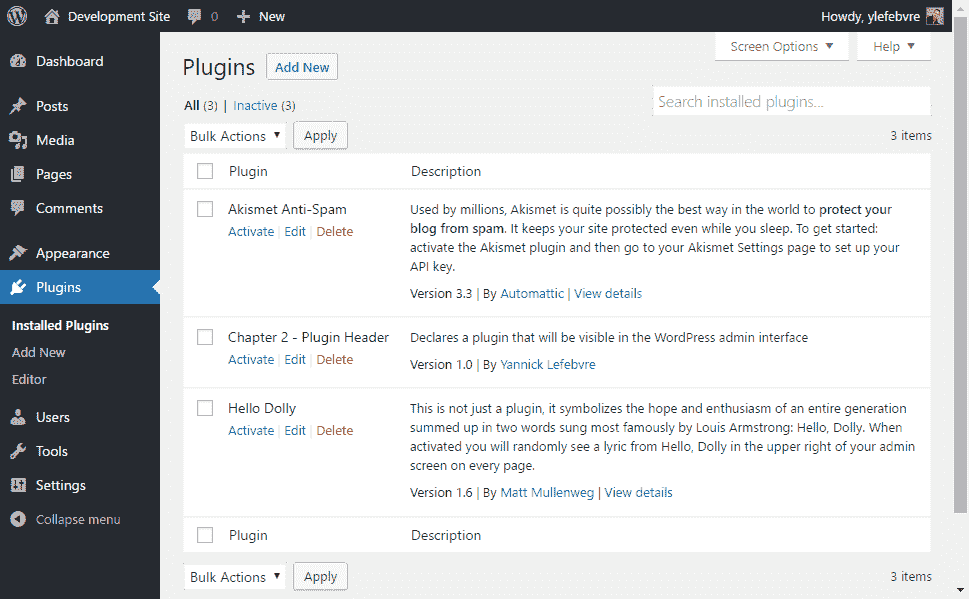
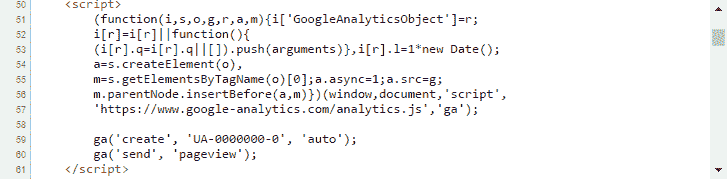
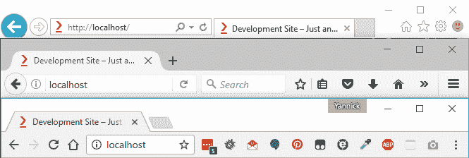
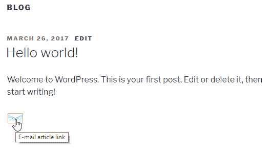
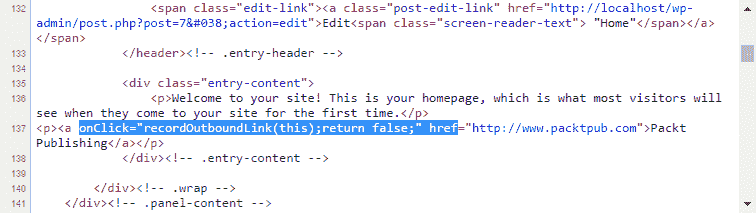
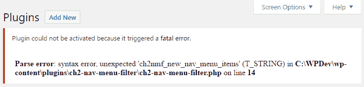
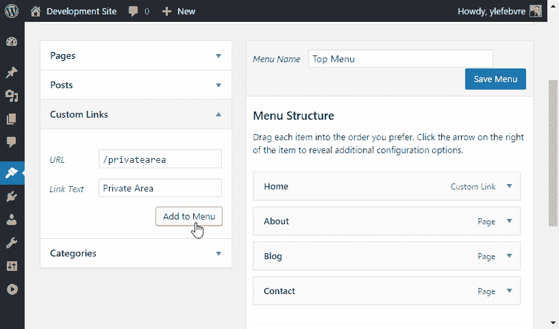
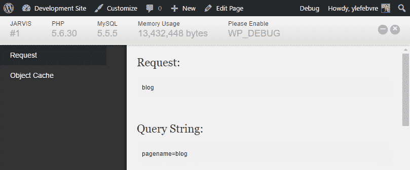
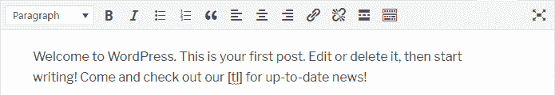
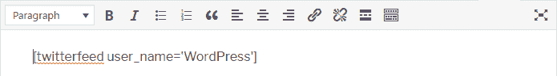

# 插件框架基础

在本章中，我们将涵盖以下主题：

+   创建插件文件和头文件

+   使用插件操作将输出内容添加到页面头文件

+   使用 WordPress 路径实用函数加载外部文件和图片

+   使用插件过滤器修改网站生成器元标签

+   使用插件过滤器在每个项目内容后添加文本

+   使用插件过滤器在页面主体中插入链接统计跟踪代码

+   故障排除编码错误和打印变量内容

+   创建一个新的简单简短代码

+   创建具有参数的新简短代码

+   创建一个新的封装简短代码

+   加载样式表以格式化插件输出

+   使用面向对象的 PHP 编写插件

# 简介

从其最初的版本开始，WordPress 就始终被设计为一个非常开放的平台。这种开放性不仅体现在其开源许可和分发模式上，还体现在其开放的插件架构上，为开发者提供了向用户提供更丰富体验的能力。

虽然基本的 WordPress 安装提供了大量的功能，这些功能从一次发布到下一次发布都在不断扩展，但用户往往需要添加一个功能，使其成为完美的网站管理系统。这就是插件发挥作用的地方。它们可以通过增强或操作 WordPress 网站显示和行政任务的几乎任何方面来填补这一空白。

就像 WordPress 一样，插件是用 PHP 编程语言编写的，其结构类似于更传统的语言，如 C 和 C++。此代码存储在纯 ASCII 文本文件中，当请求显示页面时，在 Web 服务器上读取和执行。使插件在 WordPress 中具有如此强大功能的秘密成分是在平台源代码中包含回调机制，称为**钩子**。这些钩子有两种类型，称为动作钩子和过滤器钩子，分别允许插件向网站添加内容并在显示之前修改数据。无论是渲染网站的首页、单个文章还是管理页面，WordPress 都有数百个入口点，可以在其中执行自定义函数。

除了增强 WordPress 功能的能力之外，插件的一个附带好处是它们添加到网站上的大多数功能都与活动主题无关。因此，喜欢频繁更换主题的用户在切换时不必担心手动将自定义元素添加到新主题中。

本章解释了动作钩子和过滤器钩子之间的区别，并展示了如何使用它们编写一组插件，这些插件的功能将从添加信息到页面头文件到定义新的自定义简短代码。

# 创建插件文件和头文件

创建 WordPress 插件的第一步是在插件目录中创建一个 PHP 文件，并添加必要的信息以便系统识别。本配方向您展示了如何创建一个基本的 WordPress 插件文件，以及如何从管理界面中查看和激活这个新的扩展。

# 准备工作

您应该能够访问一个 WordPress 开发环境，无论是在您的本地计算机上还是在远程服务器上，您将能够加载您的新插件文件。

# 如何操作...

1.  导航到您开发安装的 WordPress 插件目录（`wp-content/plugins`）。

1.  在插件目录中创建一个名为`ch2-plugin-header`的新子目录。

1.  导航到该目录，并创建一个名为`ch2-plugin-header.php`的新文本文件。

1.  在文本编辑器中打开新文件，并添加以下文本：

```php
<?php 
/* 
Plugin Name: Chapter 2 - Plugin Header 
Plugin URI: 
Description: Declares a plugin that will be visible in the WordPress admin interface
Version: 1.0 
Author: Yannick Lefebvre 
Author URI: http://ylefebvre.ca 
License: GPLv2 
*/
```

虽然在代码示例中描述文本显示在两行中，但在您的代码中应全部输入一行，以便在 WordPress 已安装插件列表中完全显示。

下载示例代码您可以从[`www.packtpub.com`](https://www.packtpub.com)的账户下载您购买的所有 Packt 书籍的示例代码文件。如果您在其他地方购买了这本书，您可以访问[`www.packtpub.com/support`](https://www.packtpub.com/support)并注册，以便将文件直接通过电子邮件发送给您。

1.  保存并关闭新文件。

1.  登录到您开发 WordPress 安装的管理页面。

1.  在左侧导航菜单中单击“插件”以显示所有已安装插件的列表。您应该看到您的新插件列在 WordPress 预装的默认插件旁边：



1.  通过单击其名称下的“激活”链接来启用插件。您会看到您的新插件背景颜色改变，以指示它已被激活，同时会显示一条消息，指定激活成功。

# 它是如何工作的...

插件文件可以直接位于`wp-content/plugins`目录中，或者位于此位置下的子目录中。当您在管理界面中访问已安装的插件列表时，WordPress 会扫描所有潜在的插件位置，寻找包含符合此配方中指定格式的注释的 PHP 文件。实际上，在这些目录中的任何一个目录中都可以有一个或多个包含插件头数据的 PHP 文件，并且它们中的每一个都会在插件列表中显示出来。

仔细查看我们输入到文件中的代码，插件文件的第一行是一个标记，用于标识将被 PHP 解释器分析和执行的 PHP 代码的开始。可选地，我们可以在文件末尾包含一个关闭 PHP 标记（?>）。然而，大多数 PHP 开发者省略了关闭标记，因为在此标记之后有任何空格都会导致解释器显示警告。

为了确保与大多数 WordPress 安装的兼容性，在您的插件代码中使用完整的`<?php`开标签语法而不是`<?`简写版本非常重要，因为并非所有 PHP 安装都配置为支持简写版本，许多用户也没有权限更改服务器上的此类配置。

第二行和最后一行指示，括号内的文本应被视为文本注释。最后，注释中的每一行都包含一个特定的标签，指示其后跟的信息类型。当找到此信息时，WordPress 将检索有关插件的数据并将其添加到列表中。

当插件被激活时，WordPress 会验证文件内容以确保其为有效的 PHP 代码。然后，它将在网站上渲染任何页面时执行此内容，无论该页面是面向前端的还是后端管理部分。因此，最好只在插件使用时激活它们，以避免网站速度减慢。

当然，到目前为止，我们的新插件并没有在我们的 WordPress 安装中添加或修改任何功能，因为它不包含真正的代码，但这仍然是一个重要的第一步。

# 参见

+   在第一章，*准备本地开发环境*中的*在您的计算机上安装 Web 服务器*食谱

+   在第一章，*准备本地开发环境*中的*下载和配置本地 WordPress 安装*食谱

# 使用插件动作向页面头部添加输出内容

插件通常执行的一个常见操作是为 WordPress 生成的面向访客的页面头部添加额外内容。本食谱将向您展示如何注册一个动作钩子函数以便能够添加此类附加内容。为了使这个例子更加具体，我们将使用许多人都用来获取良好页面浏览统计数据的 Google Analytics 页面头部 JavaScript 代码。

# 如何操作...

1.  导航到您的开发安装的 WordPress 插件目录。

1.  创建一个名为`ch2-page-header-output`的新目录。

1.  导航到该目录并创建一个名为`ch2-page-header-output.php`的新文本文件。

1.  在代码编辑器中打开新文件，并在插件文件顶部添加一个适当的头部，将插件命名为“第二章 - 页面头部输出”。

1.  添加以下代码行以注册一个在 WordPress 渲染页面头部时将被调用的函数：

```php
add_action( 'wp_head', 'ch2pho_page_header_output' );
```

1.  添加以下代码段以提供`ch2pho_page_header_output`函数的实现：

```php
function ch2pho_page_header_output() { ?>
    <script>
        (function(i,s,o,g,r,a,m){i['GoogleAnalyticsObject']=r;
        i[r]=i[r]||function(){
        (i[r].q=i[r].q||[]).push(arguments)},i[r].l=1*new Date();
        a=s.createElement(o),
        m=s.getElementsByTagName(o)[0];a.async=1;a.src=g;
        m.parentNode.insertBefore(a,m)})(window,document,'script',
        'https://www.google-analytics.com/analytics.js','ga');

        ga('create', 'UA-0000000-0', 'auto');
        ga('send', 'pageview');
    </script> 
<?php }
```

1.  保存并关闭插件文件。

1.  登录到您的开发 WordPress 安装的管理页面。

1.  点击左侧导航菜单中的“插件”。

1.  激活您的新插件。

1.  导航到您网站的首页，并使用浏览器中的“查看页面源代码”功能查看网站的 HTML 源代码。此函数的确切名称将根据您使用的浏览器略有不同。阅读页面源代码，我们新函数之间的双括号内包含的所有代码将在您网站的头文件中可见：



如果您是从本书的数字版本中复制粘贴代码，您将丢失原始代码缩进，应在您的代码编辑器中更正。

# 它是如何工作的...

`add_action`函数用于将自定义插件代码关联到 WordPress 钩子中的两种类型之一，即动作钩子。正如本章引言中简要提到的，钩子是使插件在 WordPress 中成为可能的功能。动作钩子允许在公共页面或管理页面准备显示时执行额外的代码。此代码通常向网站添加内容或更改特定动作的执行方式。

在这个示例中，我们编写的第一行代码注册了一个名为`ch2pho_page_header_output`的函数，与名为`wp_head`的动作钩子相关联。这个动作是 WordPress 当前版本中超过 2,400 个动作钩子之一，它允许任何已注册的函数向页面头部输出额外的内容。由于所有回声的内容都将显示，我们可以通过在 Google Analytics 代码周围放置`?>`和`<?php`标签来非常简单地编写我们的回调函数。这将告诉 PHP 显示该函数体内所有内容，而不是将其解释。

如您可能已注意到，当前代码并不十分灵活，因为您需要将 Google Analytics 账户号硬编码到输出中才能使其正常工作。在第三章，“用户设置和管理页面”的创建，将提供一种配置此类信息的方法，使我们的插件更加灵活。

现在，为了完全理解其语法，让我们更仔细地查看完整的`add_action`函数：

```php
add_action ( 'hook_name', 'your_function_name', [priority],
             [accepted_args] );
```

第一个参数，钩子名称，表示我们想要将自定义函数与之关联的 WordPress 钩子名称。此名称必须拼写准确；否则，我们的函数将不会被调用，也不会显示错误消息。

第二个参数是要调用的插件函数的名称，用于执行动作。此函数可以具有任何名称，唯一条件是这个名称必须足够独特，以避免与其他插件或 WordPress 核心代码中的函数名冲突。在这个示例中，函数名以代表插件名称的缩写开头，这使得它更加独特。

优先级参数是可选的，如方括号所示，默认值为 10。它表示此插件相对于其他钩入同一动作的插件函数的执行优先级，数字越小表示优先级越高。

任何插件都可以使用 `add_action` 函数注册一个或多个与动作钩子关联的函数。由于 WordPress 正在渲染网页，它会保留所有条目的队列并在适当的时候调用它们。值得注意的是，钩子机制也被 WordPress 本身使用，因为它会定期在其代码中调用 `add_action` 函数来注册在正确时间被调用的函数。如果你意识到你需要你的函数在注册相同钩子的其他插件之前或之后被调用，请更改优先级参数的值。

`add_action` 函数的最后一个参数 `accepted_args` 具有默认值 `1`，应该分配一个数字。它也应该只为一些特定的钩子设置不同的值，在这些钩子中应该向注册的函数传递多个参数。其中一些钩子将在后面的菜谱中介绍。

# 还有更多...

寻找合适的钩子来注册插件函数是 WordPress 插件开发的一个重要部分。幸运的是，有几种方法可以获取现有钩子的信息，并了解它们在 WordPress 页面生成过程中的调用时间。

# 动作钩子在线列表

WordPress Codex ([`codex.wordpress.org/`](https://codex.wordpress.org/)) 和 WordPress 代码参考 ([`developer.wordpress.org/reference/`](https://developer.wordpress.org/reference/)) 是包含大量对用户和开发者都有用的信息的文档网站。当涉及到动作钩子时，Codex 包含有关最常用钩子的信息，有基本的描述说明它们如何使用，并可以在以下位置找到：[`codex.wordpress.org/Plugin_API/Action_Reference`](https://codex.wordpress.org/Plugin_API/Action_Reference)。话虽如此，这并不是一个完整的列表。

有许多第三方网站解析 WordPress 源代码并提供他们自己的钩子列表（例如，[`hookr.io`](http://hookr.io)）。虽然这些类型的原始列表中钩子没有如此优雅的文档，但它们确实提供了它们名称和它们在 WordPress 为访客和管理员生成页面时被调用的基本信息。这些细节足以根据你试图实现的功能找到钩子。

# 在 WordPress 源代码中搜索钩子

由于 WordPress 是开源的，另一种查找有关钩子信息的方法是直接在其代码中进行搜索。对于每个接受用户函数的动作钩子，您将看到对 `do_action` 函数的调用以执行所有已注册的项目。如所见，该函数接受两个或更多参数，其中第二个（或多个）参数是可选的：

```php
do_action ( 'tag', [$arg] ); 
```

对于本菜谱中所示的示例，搜索 `do_action( 'wp_head' )` 可以发现，它是当主题在其头部文件中调用 `wp_head()` 函数时唯一被调用的函数：

```php
do_action( 'wp_head' ); 
```

# 参见

+   *创建插件文件和头部* 菜谱

# 使用 WordPress 路径实用函数加载外部文件和图片

有时，插件需要引用存储在插件目录中的外部文件（例如，图片、JavaScript 或 jQuery 脚本文件）。由于用户可以自由重命名插件的文件夹，甚至可以将插件文件直接安装到 WordPress 插件目录中，因此任何外部文件的路径都必须根据实际的插件位置动态构建。幸运的是，存在许多实用函数来简化这项任务。在本菜谱中，我们将编写一个简单的插件，该插件将为网站头部添加一个指向插件目录中图像文件的 favicon 元标签。

# 如何做到...

1.  导航到您开发安装的 WordPress 插件目录。

1.  创建一个名为 `ch2-favicon` 的新目录。

1.  使用像 [`getfavicon.org`](http://getfavicon.org) 这样的网络服务检索网站 favicon（例如，`http://www.packtpub.com`），并将其以其默认名称（`favicon.ico`）存储在插件目录中。

1.  导航到插件目录并创建一个名为 `ch2-favicon.php` 的新文本文件。

1.  在代码编辑器中打开新文件，并在插件文件顶部添加一个适当的头部，将插件命名为“第二章 - Favicon”。

1.  添加以下代码行以注册一个在 WordPress 渲染页面头部时将被调用的函数：

```php
add_action( 'wp_head', 'ch2fi_page_header_output' ); 
```

1.  添加以下代码部分以提供 `ch2fi_page_header_output` 函数的实现：

```php
function ch2fi_page_header_output() { 
    $site_icon_url = get_site_icon_url();
    if ( !empty( $site_icon_url ) ) {
        wp_site_icon();
    } else {
        $icon_url = plugins_url( 'favicon.ico', __FILE__ );
    ?>

    <link rel="shortcut icon" href="<?php echo $icon_url; ?>" />
    <?php }
}
```

1.  保存并关闭插件文件。

1.  登录到您开发 WordPress 安装的行政页面。

1.  在左侧导航菜单中单击“插件”。

1.  激活您的新插件。

1.  导航到您网站的前页并刷新它，以查看您通过插件代码指定的图标文件现在出现在您浏览器地址栏、标题栏或导航标签中，具体取决于您首选的浏览器。以下截图显示了 favicon 文件在 Internet Explorer、Mozilla Firefox 和 Google Chrome 中的渲染方式，从上到下：



1.  导航到您开发站点的仪表板，并在外观菜单下选择自定义子菜单。

1.  在“网站标识”下，指定一个至少为 512 x 512 像素的正方形图像作为网站图标；然后，在自定义化器的顶部按下保存并发布按钮。

1.  刷新你的网站以查看新分配的网站图标现在已显示而不是`favicon.ico`文件。

# 它是如何工作的...

`plugins_url`实用函数，与`__FILE__`PHP 常量和我们的 favicon 文件名一起使用，使我们能够快速获取插件文件所在目录的 URL，并打印出适当的 HTML 命令以通知浏览器此文件的位置：

```php
plugins_url( $path, $plugin ); 
```

`plugins_url`函数可以带参数或不带参数调用。在第一种情况下，它通过将第一个参数中找到的路径附加到第二个参数中指定的文件位置来构建一个 URL。在第二种情况下，它仅返回插件目录的位置。

在我们显示插件的自定义 favicon 文件之前，我们还检查用户是否已经使用 WordPress 自定义器分配了一个网站图标。如果是这样，我们优先考虑该图标，并使用内置的`wp_site_icon`函数显示它。

# 还有更多...

`plugins_url`函数是许多可以在插件中使用以帮助找到 WordPress 安装中文件位置的函数之一。其他有用的函数包括：

+   `get_theme_root()`: 返回主题安装目录的地址

+   `get_template_directory_uri()`: 获取当前主题文件的 URI

+   `admin_url()`: 提供 WordPress 管理页面的地址

+   `content_url()`: 指示`wp-content`目录的位置

+   `site_url()`和`home_url()`: 返回网站地址

+   `includes_url()`: 提供 WordPress `include`文件的位置

+   `wp_upload_dir()`: 指示用户上传文件存储的目录

# 参见

+   *创建插件文件和标题*菜谱

+   *使用插件动作向页面标题添加输出内容*菜谱

# 使用插件过滤器修改网站生成器元标签

除了向网站添加功能或内容之外，插件通常执行的其他主要任务是增强、修改或减少在屏幕上显示之前的信息。这是通过使用 WordPress 过滤器钩子来完成的，它允许插件通过 WordPress API 注册一个自定义函数，因为内容是在发送到浏览器之前准备的。在这个菜谱中，你将学习如何实现你的第一个过滤器回调函数来修改作为网站标题一部分输出的生成器元标签的内容。

# 如何做到...

1.  导航到你的开发安装的 WordPress 插件目录。

1.  创建一个名为`ch2-generator-filter`的新目录。

1.  导航到该目录并创建一个名为`ch2-generator-filter.php`的新文本文件。

1.  在代码编辑器中打开新文件，并在插件文件顶部添加一个适当的标题，将插件命名为“第二章 - 生成器过滤器”。

1.  添加以下代码行以注册一个函数，该函数将在 WordPress 准备输出作为页面标题一部分的生成器元标签的数据时被调用：

```php
add_filter( 'the_generator', 'ch2gf_generator_filter', 10, 2 ); 
```

1.  将以下代码部分添加到为 `ch2gf_generator_filter` 函数提供实现：

```php
function ch2gf_generator_filter ( $html, $type ) {
    if ( $type == 'xhtml' ) {
        $html = preg_replace( '("WordPress.*?")', 
                              '"Yannick Lefebvre"', $html );
    }
    return $html;
} 
```

1.  保存并关闭插件文件。

1.  登录到您开发 WordPress 安装的管理页面。

1.  在左侧导航菜单中单击“插件”。

1.  激活您的新插件。

1.  使用网络浏览器访问您的网站并显示页面源代码。搜索关键字 `generator` 将揭示内容生成器元标签已被修改，现在读取为：

```php
<meta name="generator" content="Yannick Lefebvre" />
```

# 它是如何工作的...

`add_filter` 函数用于将自定义插件函数关联到第二种 WordPress 钩子，即过滤器钩子。过滤器钩子给插件提供了在 WordPress 执行过程中增加、修改、删除或完全替换信息的机会。为了启用此功能，过滤器函数会接收到可以作为函数参数修改的数据。一旦完成更改，它们必须将修改后的数据集返回给 WordPress。

与动作钩子不同，过滤器函数不得输出任何文本或 HTML 代码，因为它们是在输出准备过程中执行的，这可能会导致输出在网站布局中出现意外的位置。相反，它们应该返回过滤后的数据。

仔细查看 `add_filter` 函数的参数，我们可以看到它与我们在前面的菜谱中看到的 `add_action` 函数非常相似：

```php
add_filter( 'hook_name', 'your_function_name', [priority],
            [accepted_args] ); 
```

第一个参数，钩子名称，表示我们希望我们的自定义函数与之关联的 WordPress 钩子名称。这个名字必须拼写准确；否则，我们的函数将不会被调用，也不会显示任何错误信息。

第二个参数是调用以过滤数据的插件函数的名称。这个函数可以有任何名称，唯一条件是这个名称必须足够独特，以避免与其他插件或 WordPress 代码中的函数冲突。

`priority` 参数是可选的，如方括号所示，默认值为 `10`。它表示此插件相对于由 WordPress 加载的其他插件的执行优先级，数字越小表示优先级越高。

函数的最后一个参数 `accepted_args` 具有默认值 `1`，表示将发送到您的自定义过滤器函数的参数数量。只有在您使用将发送多个参数的过滤器时，才应将其设置为更高的值，如本菜谱中的 `$html` 和 `$type` 参数所示。

# 还有更多...

除了演示如何更改网站生成器名称之外，此插件还展示了如何使用高级 PHP 函数执行实际的文本替换。我们还探讨了更多关于过滤器钩子的学习资源。

# preg_replace 函数

`preg_replace` 函数是一个 PHP 函数，可以用于根据搜索模式在字符串内执行搜索和替换操作。我们使用此函数而不是更简单的 `str_replace`，因为我们想要找到并替换 WordPress 关键字及其相关的版本号，该版本号会随着每个版本而变化。

# 网上列表和 `apply_filters` 函数的过滤器钩子

类似于动作钩子，常用过滤器钩子的信息可以在 WordPress Codex ([`codex.wordpress.org/Plugin_API/Action_Reference`](https://codex.wordpress.org/Plugin_API/Action_Reference)) 或提供原始函数列表的网站上找到（例如，[`hookr.io`](http://hookr.io))。

通过在 WordPress 代码中搜索 `apply_filters` 函数的出现，也可以了解过滤器钩子。如下代码所示，此函数具有可变数量的参数，第一个参数是过滤器钩子的名称，第二个参数表示注册的函数将能够修改的值，其余的可选参数包含在过滤器函数实现中可能有用的附加数据：

```php
apply_filters( $tag, $value, $var ... );  
```

对于本配方中显示的示例，在 WordPress 代码中搜索 `apply_filters( 'the_generator'` 可以发现它是在 `the_generator` 模板函数中被调用的：

```php
echo apply_filters( 'the_generator', 
                    get_the_generator( $type ), $type ); 
```

# 参见

+   *创建插件文件和头文件* 的配方

# 使用插件过滤器在每个项目内容后添加文本

在对页面标题、生成器元标签和网站图标进行多次更改后，此配方通过在每个帖子或页面中添加链接来发挥更积极的作用，允许访客发送当前查看项目的链接。此功能是通过附加到页面和帖子内容的过滤器钩子实现的，允许我们的自定义函数将自定义输出代码附加到所有在屏幕上显示的条目。

# 如何操作...

1.  导航到您开发安装的 WordPress 插件目录。

1.  创建一个名为 `ch2-email-page-link` 的新目录。

1.  导航到该目录并创建一个名为 `ch2-email-page-link.php` 的新文本文件。

1.  在代码编辑器中打开新文件，并在插件文件顶部添加一个适当的头文件，将插件命名为 `第二章 - 邮件页面链接`。

1.  访问一个图标下载网站，例如 [`iconarchive.com`](http://iconarchive.com)，并将一个大小为（32 x 32 像素）的 PNG 格式电子邮件图标下载到新插件目录中，命名为 `mailicon.png`。

1.  添加以下代码行以注册一个在 WordPress 准备显示帖子或页面内容时将被调用的函数：

```php
add_filter( 'the_content', 'ch2epl_email_page_filter' ); 
```

1.  将以下代码段添加到提供 `ch2epl_email_page_filter` 函数实现的代码部分：

```php
function ch2epl_email_page_filter ( $the_content ) { 

    // build url to mail message icon downloaded from
    // iconarchive.com 
    $mail_icon_url = plugins_url( 'mailicon.png', __FILE__ ); 

    // Set initial value of $new_content variable to previous
    // content 
    $new_content = $the_content; 

    // Append image with mailto link after content, including 
    // the item title and permanent URL 
    $new_content .= '<div class="email_link">';
    $new_content .= '<a href="mailto:someone@somewhere.com?';
    $new_content .= 'subject=Check out this interesting article ';
    $new_content .= 'entitled ' . get_the_title(); 
    $new_content .= '&body=Hi!%0A%0AI thought you would enjoy ';
    $new_content .= 'this article entitled '; 
    $new_content .= get_the_title() . '.%0A%0A' . get_permalink(); 
    $new_content .= '%0A%0AEnjoy!">';

    if ( !empty( $mail_icon_url ) ) {
        $new_content .= '        $new_content .= $mail_icon_url. '" /></a>';
    } else {
        $new_content .= 'Email link to this article';
    }
    $new_content .= '</div>';

    // Return filtered content for display on the site 
    return $new_content; 
} 
```

1.  保存并关闭插件文件。

1.  登录到您开发 WordPress 安装的行政页面。

1.  在左侧导航菜单中单击“插件”。

1.  激活您的新插件。

1.  访问您的网站，查看每个帖子末尾和页面末尾的新邮件图标。

1.  点击其中一个邮件链接。您的默认邮件客户端将显示您正在阅读的项目信息。唯一需要更新的信息是收件人地址，访客可以快速发送电子邮件：



# 它是如何工作的...

与上一个菜谱类似，这个插件使用 `add_filter` 函数注册一个自定义函数，以便在 WordPress 准备在屏幕上显示的项目内容时调用。当过滤器函数被调用时，它执行的第一项操作是创建一个指向在菜谱中下载的电子邮件图标的 URL。然后，它继续通过附加显示 `mailto` 链接的 HTML 代码来修改原始内容。同样的技术可以用来创建指向流行的社交媒体和链接分享网站的链接，只需简单更改链接的语法。一旦新内容准备就绪，它就会被返回到 WordPress，以便发送给任何其他已注册的过滤器，并随后在网站上显示。

# 还有更多...

这个菜谱还介绍了一对有用的 WordPress 实用函数，用于获取当前项目的内联内容。

# get_the_title 和 get_permalink 函数

虽然这两个函数主要在主题模板文件中看到，但它们也可以由插件使用，以便轻松访问正在处理的项目的内容。

更具体地说，这个菜谱中使用的两个实用函数如下：

+   `get_the_title()`: 这个函数让我们可以快速访问项目的标题

+   `get_permalink()`: 一个返回项目永久链接（一个始终与该帖子或页面关联的 URL，即使它不再在网站首页上显示）的函数

# 参见

+   *创建插件文件和头文件* 的菜谱

+   *使用 WordPress 路径实用函数加载外部文件和图像* 的菜谱

+   *使用插件过滤器修改网站生成器元标签* 的菜谱

# 使用插件过滤器在页面主体中插入链接统计跟踪代码

在创建两个附加文本到现有内容的过滤器函数之后，这个菜谱展示了如何在屏幕上显示之前修改页面内容。更具体地说，以下插件将扩展之前创建的 Google Analytics 标头插件，并为所有包含在帖子或页面中的链接添加一个 JavaScript 函数，以跟踪它们被访客点击的时间。

# 准备工作

您应该已经遵循了 *使用插件动作向页面标题添加输出内容* 的菜谱，以便为本菜谱和生成的插件提供一个起点，并且生成的插件应该已经在您的开发网站上激活。或者，您可以从 Packt Publishing 网站下载该菜谱的结果代码（`Chapter 2/ch2-page-header-output/ch2-page-header-output.php`）([`www.packtpub.com/support`](https://www.packtpub.com/support))。

# 如何操作...

1.  导航到你的开发安装的 WordPress 插件目录中的`ch2-page-header-output`文件夹。

1.  在文本编辑器中打开`ch2-page-header-output.php`文件。

1.  在现有函数之后添加以下代码行，以注册一个在 WordPress 准备显示页面或帖子内容时将被调用的函数：

```php
add_filter( 'the_content', 'ch2lfa_link_filter_analytics' ); 
```

1.  将以下代码段添加到为`ch2lfa_link_filter_analytics`函数提供实现的区域：

```php
function ch2lfa_link_filter_analytics ( $the_content ) { 
    $new_content = str_replace( 'href',  
        'onClick="recordOutboundLink( this );return false;" href'
        , $the_content ); 

    return $new_content; 
} 
```

1.  在注册当 WordPress 渲染页面页脚时将被调用的函数后添加以下代码行：

```php
add_action( 'wp_footer', 'ch2lfa_footer_analytics_code' ); 
```

1.  将以下代码段添加到为`ch2lfa_footer_analytics_code`函数提供实现的区域：

```php
function ch2lfa_footer_analytics_code() { ?> 

<script type="text/javascript"> 
    function recordOutboundLink( link ) {
        ga( 'send', 'event', 'Outbound Links', 'Click', 
            link.href, {
                'transport': 'beacon',
                'hitCallback': function() { 
                    document.location = link.href; 
                }
            } );
        }
</script> 

<?php } 
```

1.  保存并关闭插件文件。

1.  前往仪表板的“页面”部分并编辑主页（或任何其他页面）。将链接添加到内容中，指向你选择的任何位置。

1.  在你的网络浏览器中刷新你的网站并导航到之前修改的页面。

1.  打开页面的源视图并找到你添加的链接。你会看到链接标签有额外的`onClick` JavaScript 代码，当访客跟随它时将被调用：



1.  滚动到页面底部，查看添加到页面页脚的`recordOutboundLink` JavaScript 函数的实现。

# 它是如何工作的...

通过调用`add_filter`设置的 内容过滤器函数在所有帖子或页面渲染到浏览器之前接收整个内容，并允许对这一信息进行任何数量的更改。在这种情况下，我们使用 PHP `str_replace`函数来搜索字符串`href`的任何出现，这表示一个链接。当找到字符串时，它被替换为对 JavaScript 函数的调用以及原始的`href`标签。

为了使这个插件完整，它还需要提供一个 JavaScript `recordOutboundLink`函数的实现。这是通过使用`wp_footer`钩子注册一个自定义函数来完成的，该函数将在网站页脚输出额外的内容，包括函数代码。

该插件自动化了许多与使用 Google Analytics 跟踪网站使用数据相关的任务。

# 参见

+   使用插件动作向页面标题添加输出内容的配方

+   使用插件过滤器在每个项目内容后添加文本的配方

# 调试编码错误和打印变量内容

当你从本书的页面转录代码段或开始编写自己的插件时，你很可能需要调试你的代码或处理你的插件旨在操作的数据。这个配方展示了在创建一个将隐藏未登录用户导航菜单中的项目的插件时，识别和快速解决这些错误的基本技术。

# 如何操作...

1.  导航到你的开发安装的 WordPress 插件目录。

1.  创建一个名为 `ch2-nav-menu-filter` 的新目录。

1.  导航到该目录并创建一个名为 `ch2-nav-menu-filter.php` 的新文本文件。

1.  在代码编辑器中打开新文件，并在插件文件顶部添加一个适当的标题，将插件命名为 `第二章 - 导航菜单过滤器`。

1.  添加以下代码行以注册一个函数，当 WordPress 准备显示网站导航菜单的数据时将被调用：

```php
add_filter( 'wp_nav_menu_objects', 'ch2nmf_new_nav_menu_items', 
            10, 2 ); 
```

1.  添加以下代码部分以提供 `ch2nmf_new_nav_menu_items` 函数的实现。注意，在第一行的开头故意将单词 `functio` 错拼：

```php
functio ch2nmf_new_nav_menu_items( $sorted_menu_items, $args ) { 
    print_r( $sorted_menu_items ); 
    return $sorted_menu_items; 
} 
```

如果您使用的是专用代码编辑器，您应该能够判断文本字体不是一个已识别的关键字，因为它不会被着色为 PHP 关键字。

1.  保存插件文件并保持代码编辑器打开。

1.  登录到您开发 WordPress 安装的管理页面。

1.  在左侧导航菜单中点击“插件”。

1.  激活您的新插件。

1.  WordPress 将显示一个致命错误消息，表明插件无法激活，因为发现了一个语法错误。它还指出了错误发生的确切文件名和行号，有助于缩小问题发生的位置：



1.  返回代码编辑器，更正单词 `function` 的拼写，并保存文件。

1.  第二次激活插件。现在它应该可以正确激活。

1.  在代码编辑器中，删除单词 kbd>function 的最后一个字母以重新引入一个语法错误。

1.  访问您的网站。您现在会看到整个网站已经消失，您的浏览器只显示一个空白页，并带有类似于我们刚才看到的错误消息。根据您的 Web 服务器配置，您也可能只得到一个空白页。

1.  再次更正拼写错误，您的网站将恢复正常。您还会看到在导航菜单之前打印出大量信息。这些输出是由 `print_r` 函数生成的，旨在帮助我们了解我们的过滤器函数接收到的数据是如何组织的。一旦我们对这些数据有了良好的理解，我们将在下一步中能够正确地更改这些信息。

1.  在 WordPress 仪表板中，导航到外观 | 菜单项，并在您的菜单中创建一个额外的自定义链接项，设置 URL 为 `/privatearea`，链接文本为 `Private Area`：



1.  点击“保存菜单”按钮以存储所有更新。

1.  在代码编辑器中，将过滤器函数内的 `print_r` 函数调用替换为以下代码：

```php
// Check if used is logged in, continue if not logged 
if ( is_user_logged_in() == FALSE ) { 
    // Loop through all menu items received 
    // Place each item's key in $key variable 
    foreach ( $sorted_menu_items as $key => $sorted_menu_item ) { 
        // Check if menu item title matches search string 
        if ( 'Private Area' == $sorted_menu_item->title ) { 
            // Remove item from menu array if found using 
            // item key 
            unset( $sorted_menu_items[ $key ] ); 
        } 
    } 
} 
```

1.  刷新您的网站，您将看到大型数组打印输出已消失。如果您以管理员身份登录，您还会在菜单中注意到私有区域链接。注销或使用另一个浏览器（您未登录到开发站点）以隐藏菜单项。

# 它是如何工作的...

当 WordPress 组装一个所有可用插件的列表以在管理界面中显示时，它并不会检查每个插件的 PHP 代码是否有效。实际上，这个检查是在插件激活时进行的。那时，任何语法错误都会立即被发现，新激活的插件将保持未激活状态，从而防止整个网站出现故障。

话虽如此，一旦插件被激活，其代码在 WordPress 渲染网页时每次都会被评估，并且任何随后保存到插件文件中的代码错误都会导致网站无法正确工作。因此，强烈建议设置一个本地开发环境，如第一章中所述的*准备本地开发环境*，以避免在插件代码中不可避免地出现错误时影响实时网站。在实时网站上，为了避免潜在的故障，一个更安全的方法是在修改插件之前将其停用，一旦修改完成，再重新激活它们，以确保在启用功能之前它们被重新验证。需要注意的是，使用这种方法，在您进行更改时，插件的功能将不可用，因此这不是修改已部署代码的最佳方式。

一旦代码运行正确，本食谱的第二部分将展示如何可视化自定义过滤器函数接收到的信息。虽然 WordPress Codex 网站提供了关于大多数过滤器目的的出色文档，但它并没有详细介绍发送到每个过滤器函数的信息结构。幸运的是，PHP 的`print_r`函数非常有用，因为它可以显示任何变量的内容，无论变量接收到的参数中存储了什么信息。

最后，但同样重要的是，自定义过滤器功能的实现使用 WordPress API 函数`is_user_logged_in()`来查看查看网站的人是否提供了登录凭据，然后继续解析所有菜单项，如果访客未登录，则删除“私有区域”菜单项。

# 还有更多...

除了本食谱中使用的调试技术外，WordPress 还提供了一些内置工具来帮助插件故障排除。

# 内置的 WordPress 调试功能

虽然`wp-config.php`文件位于 WordPress 文件结构的顶部，主要用于存储基本网站配置数据，但它也可以用来触发一系列调试功能。这些功能中的第一个是调试模式，它将在网站页面的顶部显示所有 PHP 错误、警告和通知。例如，激活此选项将显示您在代码中尝试访问的所有未定义变量，以及任何已弃用的 WordPress 函数。要激活此工具，请将定义`WP_DEBUG`常量的行的第二个参数从`false`更改为`true`在`wp_config.php`中：

```php
define( 'WP_DEBUG', true ); 
```

为了防止调试消息影响网站的布局，您可以下载一个有用的插件，称为 Debug Bar ([`wordpress.org/plugins/debug-bar/`](https://wordpress.org/plugins/debug-bar/))，以收集消息并在管理栏中显示：



可以从 `wp-config.php` 文件激活的其他调试功能如下：

+   `WP_DEBUG_LOG`: 将所有调试消息存储在站点 `wp-content` 目录下名为 `debug.log` 的文件中，以供以后分析

+   `WP_DEBUG_DISPLAY`: 表示是否应在屏幕上显示错误消息

+   `SAVEQUERIES`: 将数据库查询存储在变量中，可以在页面页脚中显示（有关更多信息，请参阅 [`codex.wordpress.org/Editing_wp-config.php#Save_queries_for_analysis`](https://codex.wordpress.org/Editing_wp-config.php#Save_queries_for_analysis)）

# 参见

+   *使用插件过滤器修改网站生成器元标签的食谱*

# 创建一个新的简单短代码

短代码是 WordPress 中一个非常流行的工具，允许用户轻松地将插件或主题生成的内容添加到任何页面或帖子中，而无需熟悉 PHP 代码和编辑主题模板文件。由于它们非常简单易创建，短代码还可以用于轻松自动化重复包含在您网站内容中的内容的输出。

此食谱解释了如何创建一个新自定义短代码，该短代码将用于在任意帖子或页面中快速添加指向 Twitter 页面的链接，自动化重复性任务。

# 如何操作...

1.  导航到您的开发安装的 WordPress 插件目录。

1.  创建一个名为 `ch2-twitter-shortcode` 的新目录。

1.  导航到该目录并创建一个名为 `ch2-twitter-shortcode.php` 的新文本文件。

1.  在代码编辑器中打开新文件，并在插件文件顶部添加一个适当的标题，将插件命名为 `第二章 - Twitter 短语`。

1.  将以下代码行添加到声明新短语的声明中，只需使用两个字符 `tl`，并指定当代码在帖子或页面中遇到时应调用的函数名称：

```php
add_shortcode( 'tl', 'ch2ts_twitter_link_shortcode' ); 
```

1.  将以下代码段添加到为 `ch2ts_twitter_link_shortcode` 函数提供实现的代码中：

```php
function ch2ts_twitter_link_shortcode( $atts ) {
    $output = '<a href="https://twitter.com/ylefebvre">';
    $output .= 'Twitter Feed</a>';
    return $output;
} 
```

1.  保存并关闭插件文件。

1.  登录到您的开发 WordPress 安装的行政页面。

1.  在左侧导航菜单中单击插件。

1.  激活您的新插件。

1.  编辑您网站上现有的帖子，并在代码编辑器中使用短代码 [tl]：



1.  保存并查看帖子，以查看短代码是否被替换为附加在“Twitter Feed”一词上的 Twitter 页面链接。

# 它是如何工作的...

短代码与动作钩子和过滤器钩子都有相似之处，因为当需要执行任务时，它们关联的自定义函数会被调用，就像动作钩子一样，但它们必须通过返回值返回输出，就像过滤器钩子一样。在外部数据方面，与某些类型的代码相关联的短代码函数将接收数据，而在其他情况下，它只会产生输出。

当在帖子或页面的文本中使用时，任何被一对方括号包围的短代码都会被 WordPress 引擎识别，然后它会搜索为该特定代码注册的函数。如果找到，则调用关联的函数，并使用预期的结果替换项目内容中的原始短代码文本。就像过滤器函数一样，短代码函数不得直接输出任何文本，因为这可能会在页面布局中出现意外的位置，因为 WordPress 在显示项目正文之前会调用所有短代码处理函数。

对于简单的短代码，例如本食谱中的那些，与它们关联的插件函数必须返回信息，但它们不会通过函数参数接收任何额外的数据。换句话说，它们可以依赖实用函数，如`get_the_ID`、`get_the_title`和其他 WordPress 实用函数，以便能够生成适当的输出。在后面的食谱中看到的其他类型的短代码将具有更多的上下文和配置选项。短代码还可以访问存储的选项数据，这将在第三章，*用户设置和管理页面*中介绍。

# 参见

+   *创建插件文件和头部*食谱

# 创建带参数的新短代码

虽然简单的短代码已经通过在帖子编辑器中输入几个字符提供了将复杂内容输出到页面的潜力，但当它们与传递给其关联处理函数的参数结合使用时，短代码变得更加有用。使用这种技术，创建一个短代码来加速在 WordPress 帖子或页面中插入外部内容变得非常容易，只需指定短代码和要显示的源元素的唯一标识符即可。

我们将通过创建一个短代码来展示这个概念，这个短代码将被用来快速将 Twitter 动态添加到帖子或页面中。

# 如何实现...

1.  导航到您开发安装的 WordPress 插件目录。

1.  创建一个名为`ch2-twitter-embed`的新目录。

1.  导航到这个目录并创建一个名为`ch2-twitter-embed.php`的新文本文件。

1.  在代码编辑器中打开新文件，并在插件文件顶部添加一个适当的头部，将插件命名为`Chapter 2 - Twitter Embed`。

1.  添加以下代码行以声明一个新的短代码并指定当短代码在帖子或页面中找到时应调用的函数名称：

```php
add_shortcode( 'twitterfeed', 'ch2te_twitter_embed_shortcode' );
```

1.  将以下代码部分添加到为`ch2te_twitter_embed_shortcode`函数提供实现：

```php
function ch2te_twitter_embed_shortcode( $atts ) {
    extract( shortcode_atts( array(
        'user_name' => 'ylefebvre'
    ), $atts ) );

    if ( !empty( $user_name ) ) {
        $output = '<a class="twitter-timeline" href="'; 
        $output .= esc_url( 'https://twitter.com/' . $user_name );
        $output .= '">Tweets by ' . esc_html( $user_name );
        $output .= '</a><script async ';
        $output .= 'src="img/"';
        $output .= ' charset="utf-8"></script>';
    } else {
        $output = '';
    }
    return $output;
}
```

1.  保存并关闭插件文件。

1.  登录到您开发 WordPress 安装的管理页面。

1.  在左侧导航菜单中单击“插件”。

1.  激活您的新插件。

1.  创建一个新页面，并在页面编辑器中使用短代码`[twitterfeed user_name='WordPress']`，其中`WordPress`是要显示的源 Twitter 用户名：



1.  发布并查看页面，以查看短代码已被嵌入到您网站上的 Twitter 源所取代。

1.  编辑页面，删除`user_name`参数及其相关值，只留下核心的`[twitterfeed]`短代码在帖子中，然后更新以保存更改。

1.  刷新页面，查看是否仍然显示该源，但现在显示的是来自另一个账户的推文。

# 它是如何工作的...

当短代码与参数一起使用时，这些额外的数据会被发送到`$atts`参数变量中关联的处理函数。通过使用标准的 PHP `extract`和 WordPress 特定的`shortcode_atts`函数的组合，我们的插件能够解析发送到短代码的数据，并创建一个标识符和值的数组，这些标识符和值随后被转换成 PHP 变量，我们可以在短代码实现函数的其余部分中使用。在这个特定的例子中，我们期望使用一个名为`user_name`的单个变量，它将被存储在名为`$user_name`的 PHP 变量中。如果用户没有提供任何参数就输入了短代码，将默认将`ylefebvre`分配给用户名变量，以确保插件仍然可以工作。由于我们将在代码中接受用户输入，我们还验证用户没有提供空字符串，并使用`esc_html`和`esc_url`函数从输入字符串中删除任何可能有害的 HTML 字符，并确保链接目标 URL 是有效的。

一旦我们获得了 Twitter 用户名，我们就可以组合所需的 HTML 代码，将 Twitter 源嵌入我们的页面并显示所选用户的推文。

虽然这个例子只有一个参数，但可以为短代码定义多个参数。

# 参见

+   *创建一个新的简单短代码*配方

# 创建一个新的封装短代码

WordPress 中还有另一种类型的短代码，它将内容封装在帖子或页面中。使用类似于 HTML 标签的语法，封装短代码可以用来标识需要以特殊方式处理的项的内容部分。例如，可以使用这种类型的短代码来设置帖子的部分样式。

作为创建包围短代码的示例，本食谱展示了如何创建一组标签，这些标签将标识帖子或页面中仅应向登录网站的访问者显示的部分。以这种方式，短代码的行为类似于过滤器钩子，额外的好处是您不需要解析这些标签的实例，这在过滤器中通常是必须做的。

# 如何操作...

1.  导航到您的开发安装的 WordPress 插件目录。

1.  创建一个名为 `ch2-private-item-text` 的新目录。

1.  导航到该目录并创建一个名为 `ch2-private-item-text.php` 的新文本文件。

1.  在代码编辑器中打开新文件，并在插件文件顶部添加一个适当的标题，命名为“第二章 - 私有项目文本”。

1.  向声明新短代码并指定当短代码在帖子或页面中找到时应调用的函数的代码行添加以下代码：

```php
add_shortcode( 'private', 'ch2pit_private_shortcode' ); 
```

1.  向提供 `ch2pit_private_shortcode` 函数实现的代码部分添加以下代码：

```php
function ch2pit_private_shortcode( $atts, $content = null ) { 
    if ( is_user_logged_in() ) {
        return '<div class="private">' . $content . '</div>'; 
    } else {
        $output = '<div class="register">';
        $output .= 'You need to become a member to access ';
        $output .= 'this content.</div>';
        return $output;
    }
} 
```

1.  保存并关闭插件文件。

1.  登录到您的开发 WordPress 安装的管理页面。

1.  在左侧导航菜单中点击“插件”。

1.  激活您的新插件。

1.  创建一个新帖子，并用 [private] 和 [/private] 标签包裹一些内容：


1.  保存并查看帖子，以查看您登录到您的网站时文本是可见的。

1.  登出并刷新页面，以查看包围的文本已被通用消息替换。

# 它是如何工作的...

类似于过滤器函数，包围的短代码会接收到用新标签包裹的文本的副本。然后可以返回带有附加 HTML 代码的此文本，或者完全用新内容替换它。在这个特定的情况下，我们使用了 WordPress 的`is_user_logged_in`函数来确定当前访问者是否登录到网站。根据查询结果，代码确定原始内容是否应该显示一些额外的样式代码，或者访问者应该看到一条鼓励他们加入网站的消息。

# 相关内容

+   *创建一个新的简单短代码* 食谱

# 加载样式表以格式化插件输出

当插件向帖子或页面的现有内容添加自定义内容或插入样式标签时，就像在之前展示如何创建包围短代码的食谱中所做的那样，它通常需要加载一个自定义样式表来格式化这些新元素。本食谱展示了如何在 WordPress 样式队列中添加样式表以格式化之前食谱中创建的私有输出。此队列在页面头部渲染时进行处理，列出所有需要加载以正确显示网站的样式表。

# 准备工作

您应该已经遵循了 *创建一个新的封装短代码* 菜单，以便为本菜谱提供一个起点，并且生成的插件应该仍然在您的开发站点中处于活动状态。或者，您可以从 Packt 网站（[`www.packtpub.com/support`](https://www.packtpub.com/support)）下载该菜谱的结果代码（`Chapter 2/ch2-private-item-text/ch2-private-item-text.php`）。

# 如何操作...

1.  导航到您开发安装的 WordPress 插件目录中的 `ch2-private-item-text` 文件夹。

1.  在文本编辑器中打开 `ch2-private-item-text.php` 文件。

1.  在现有函数之后添加以下代码行，以注册一个将在 WordPress 页面显示过程开始时被调用的函数：

```php
add_action( 'wp_enqueue_scripts', 'ch2pit_queue_stylesheet' ); 
```

1.  将以下代码部分添加到提供 `ch2pit_queue_stylesheet` 函数实现的代码段：

```php
function ch2pit_queue_stylesheet() { 
    wp_enqueue_style( 'privateshortcodestyle',
                      plugins_url( 'stylesheet.css', __FILE__ ) ); 
} 
```

1.  保存并关闭插件文件。

1.  在插件的目录中创建一个新的文本文件，命名为 `stylesheet.css`，并在代码编辑器中打开它。

1.  将以下内容添加到文件中：

```php
.private {  
    color: #6E6A6B; 
}

.register { 
    background-color: #ff4d4d;
    color: #fff;
    padding-left: 10px;
} 
```

1.  保存并关闭文本文件。

1.  导航到您的网站，确保您已登录，并刷新包含私有文本内容的页面。您应该注意到文本现在以灰色显示。

1.  从网站上注销并刷新页面，以查看注册消息样式也已更改。

# 它是如何工作的...

虽然通过使用 `wp_head` 动作钩子注册函数直接编写 HTML 代码来加载 CSS 文件是可能的，就像我们之前做的那样，但 WordPress 有设计用来帮助避免在网站上加载重复样式表或脚本的实用函数。在这个特定示例中，使用 `wp_enqueue_script` 将插件样式表文件放入队列中，该队列将在插件头部渲染时处理，关联名称为 `privateshortcodestyle`。一旦 WordPress 处理完所有插件并将所有样式表请求缩减为单个实例，它将输出必要的 HTML 代码来加载所有这些样式表。

`stylesheet.css` 文件的内容是正常的 CSS 代码，指定将 `private` 类分配给任何文本应显示为灰色，而显示给未注册用户的文本应在红色背景上显示为白色。

# 参见

+   *创建一个新的封装短代码* 菜单

# 使用面向对象的 PHP 编写插件

到目前为止，本章中涵盖的所有插件示例都是使用过程式 PHP 编程风格编写的，所有函数都直接声明在插件的主体中，钩子注册函数可以直接访问这些函数。

WordPress 也可以使用面向对象的 PHP 方法编写。本菜谱解释了如何将前一个菜谱中的代码转换为具有相同功能的基于类的版本。

# 准备工作

您应该已经遵循了*加载样式表以格式化插件输出*的配方，以便为本配方提供一个起点。或者，您可以从 Packt Publishing 网站([`www.packtpub.com/support`](https://www.packtpub.com/support))下载该配方生成的代码(`Chapter 2/ch2-private-item-text/ch2-private-item-text-v2.php`)。

# 如何做到这一点...

1.  登录到您的 WordPress 安装的管理页面。

1.  点击左侧导航菜单中的插件。

1.  检查`Chapter 2 - Private Item Text`插件是否当前处于激活状态，如果是，请将其停用。

1.  复制`ch2-private-item-text`目录的全部内容，并将副本重命名为`ch2-oo-private-item-text`。

1.  导航到新命名的文件夹，并将主 PHP 代码文件重命名为`ch2-oo-private-item-text.php`。

1.  在代码编辑器中打开新命名的插件文件。

1.  更新插件头部，将插件名称更改为`Chapter 2 - Object-Oriented - Private Item Text`。

1.  在插件头部之后立即添加以下文本以声明一个新的类，并指定该类的构造方法：

```php
class CH2_OO_Private_Item_Text {      
    function __construct() { 
    }      
} 

$my_ch2_oo_private_item_text = new CH2_OO_Private_Item_Text(); 
```

1.  将对`add_shortcode`和`add_action`函数的调用移动到类构造函数内部。

1.  修改`add_shortcode`和`add_action`函数的第二个参数如下：

```php
add_shortcode( 'private', array( $this, 
 'ch2pit_private_shortcode' ) ); 

add_action( 'wp_enqueue_scripts', array( $this, 
 'ch2pit_queue_stylesheet' ) ); 
```

1.  将完整的`ch2pit_private_shortcode`和`ch2pit_queue_stylesheet`函数移动到类体内部（在构造方法之后和类结束括号之前）。

1.  保存并关闭修改后的文件。

1.  登录到您的开发 WordPress 安装的管理页面。

1.  点击左侧导航菜单中的插件。

1.  激活新插件。

1.  访问您的网站，以查看私有项目内容功能仍然存在并且像以前一样工作。

# 它是如何工作的...

我们对插件应用的所有代码更改首先声明了一个用于我们插件所有功能的类，并包含了一个该类的构造方法。构造方法在类被实例化后立即调用，即插件代码中的最后一行，并且可以用来将自定义函数与所有动作钩子、过滤器钩子和短代码相关联。

使用面向对象方法的主要好处是，您在命名钩子回调和所有其他函数时不必那么小心，因为这些名称是局部于类的，并且可以与任何其他类或过程式 PHP 代码中声明的函数名称相同。

# 参见

+   *创建一个新的封装短代码*配方
